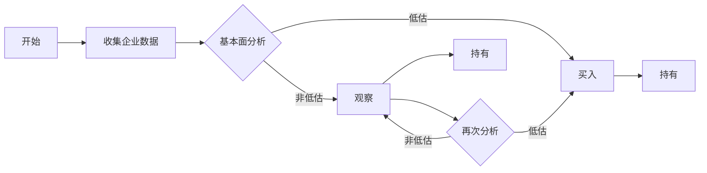
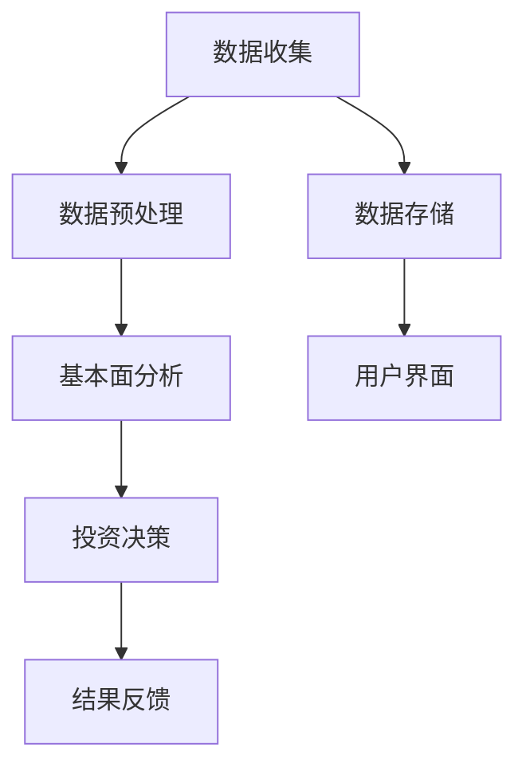
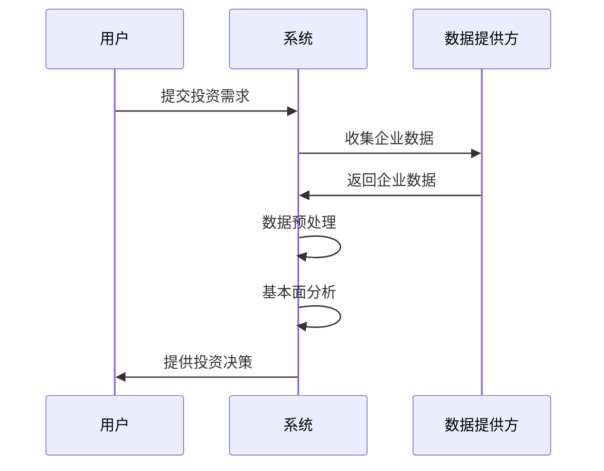

                 


# 价值投资者如何应对市场泡沫

关键词：价值投资、市场泡沫、策略、心理、分析

摘要：本文将深入探讨价值投资者如何应对市场泡沫的问题。通过对价值投资者的定义、市场泡沫的历史回顾、问题解决策略等多个方面的分析，旨在帮助投资者在泡沫市场中做出明智的决策。

## 第一部分：背景介绍

### 1.1 问题背景

价值投资者是一种追求长期稳定回报的投资者，他们倾向于通过深入分析企业基本面来挑选具有长期增长潜力的股票。市场泡沫则是市场过度投机、价格远高于实际价值的现象。

### 1.2 问题描述

价值投资者在市场泡沫中面临的主要挑战是如何在风险与收益之间取得平衡。市场泡沫往往伴随着高波动性和不确定性，这使得价值投资的选股策略受到考验。

### 1.3 问题解决

面对市场泡沫，价值投资者可以采取以下策略：

1. **坚持价值投资原则**：通过深入分析企业的基本面，寻找被市场低估的投资机会。
2. **调整投资组合**：在市场泡沫时期，适当减少对高风险股票的持有比例，增加对防御性股票的配置。
3. **投资者自我调整**：保持冷静，不受市场情绪影响，避免盲目跟风。

### 1.4 边界与外延

市场泡沫的界定相对主观，一般取决于市场参与者的情绪和资金供给。价值投资的适用范围较广，但在市场泡沫时期需要更加谨慎。

### 1.5 核心概念结构

本文将围绕以下核心概念展开讨论：价值投资、市场泡沫、投资者心理、应对策略。

## 第二部分：核心概念与联系

### 2.1 核心概念列表

1. 价值投资
2. 市场泡沫
3. 投资者心理
4. 应对策略

### 2.2 概念属性特征对比表格

| 概念         | 特征                                      |
| ------------ | ----------------------------------------- |
| 价值投资     | 注重基本面分析，追求长期稳定回报           |
| 市场泡沫     | 价格远高于实际价值，市场情绪过度投机       |
| 投资者心理   | 情绪波动，盲目跟风，风险意识不足          |
| 应对策略     | 坚持原则，调整组合，自我调整              |

### 2.3 ER实体关系图

```mermaid
entityRelationship
  title 价值投资者与市场泡沫的关系
  Entity[价值投资者]
  Entity[市场泡沫]
  Entity[应对策略]
  ValueInvestor -> MarketBubble
  MarketBubble -> ValueInvestor
  ValueInvestor -> Strategy
```

## 第三部分：算法原理讲解

### 3.1 算法概述

价值投资策略的核心是通过对企业基本面的深入分析，找到被市场低估的投资机会。在面对市场泡沫时，投资者需要运用一定的算法来调整投资组合。

### 3.2 算法流程图



### 3.3 Python源代码

```python
# 价值投资策略Python实现

# 导入相关库
import pandas as pd
import numpy as np

# 收集企业数据
def collect_data():
    # 这里以假设的数据为例，实际应用中可以从数据库或API获取
    data = pd.DataFrame({
        'company': ['A', 'B', 'C', 'D'],
        'market_price': [50, 100, 200, 300],
        'intrinsic_value': [40, 80, 160, 240]
    })
    return data

# 基本面分析
def fundamental_analysis(data):
    # 计算市净率
    data['price_to_book_ratio'] = data['market_price'] / data['intrinsic_value']
    # 筛选出低估的股票
    undervalued_stocks = data[data['price_to_book_ratio'] < 1]
    return undervalued_stocks

# 投资决策
def make_decision(undervalued_stocks):
    # 买入低估的股票
    for index, row in undervalued_stocks.iterrows():
        print(f"买入{row['company']}股票，价格：{row['market_price']}")

# 主函数
def main():
    data = collect_data()
    undervalued_stocks = fundamental_analysis(data)
    make_decision(undervalued_stocks)

# 运行程序
main()
```

### 3.4 数学模型和公式

假设企业的内在价值为 \( V \)，市场价格为 \( P \)，市净率为 \( R \)，则价值投资策略的数学模型可以表示为：

$$
R = \frac{P}{V}
$$

当 \( R < 1 \) 时，认为企业被低估，可以考虑买入。

### 3.5 举例说明

假设有四家企业，其内在价值分别为40、80、160、240，市场价格分别为50、100、200、300。根据市净率计算：

- 企业A：\( R_A = \frac{50}{40} = 1.25 \)
- 企业B：\( R_B = \frac{100}{80} = 1.25 \)
- 企业C：\( R_C = \frac{200}{160} = 1.25 \)
- 企业D：\( R_D = \frac{300}{240} = 1.25 \)

由于所有企业的市净率均大于1，按照上述模型，我们暂时不进行买入决策。实际应用中，需要结合更多指标和企业实际情况进行综合分析。

## 第四部分：数学模型和数学公式讲解

### 4.1 数学模型讲解

在价值投资策略中，我们通常使用市净率（Price to Book Ratio，P/B Ratio）来评估企业的内在价值。市净率是股票市场价格与其账面价值的比值，它可以用来判断股票是否被市场低估。

### 4.2 数学公式讲解

市净率的计算公式为：

$$
P/B = \frac{P}{B}
$$

其中，\( P \) 表示股票的市场价格，\( B \) 表示股票的账面价值。当 \( P/B < 1 \) 时，股票被认为被低估。

### 4.3 举例说明

假设某股票的市场价格为 50 元，其账面价值为 40 元，则该股票的市净率为：

$$
P/B = \frac{50}{40} = 1.25
$$

由于 \( P/B > 1 \)，该股票不被认为被低估。如果市场价格下降到 40 元，则市净率变为：

$$
P/B = \frac{40}{40} = 1
$$

此时，股票被市场低估，投资者可以考虑买入。

## 第五部分：系统分析与架构设计方案

### 5.1 项目场景介绍

在一个投资组合管理系统中，我们需要实时监控市场数据，分析企业的基本面，并根据市场泡沫情况调整投资组合。

### 5.2 系统功能设计

1. 数据收集：从各种数据源（如股票交易所、金融数据提供商等）收集企业数据。
2. 基本面分析：利用算法对收集到的企业数据进行分析，计算市净率等指标。
3. 投资决策：根据分析结果，对投资组合进行调整。
4. 结果反馈：将投资决策反馈给投资者，并提供报告和分析。

### 5.3 系统架构设计



### 5.4 系统接口设计

1. 数据收集接口：用于从数据源获取企业数据。
2. 数据预处理接口：用于清洗和格式化企业数据。
3. 基本面分析接口：用于计算市净率等指标。
4. 投资决策接口：用于生成投资决策。
5. 结果反馈接口：用于将投资决策反馈给用户。

### 5.5 系统交互序列图



## 第六部分：项目实战

### 6.1 环境安装指南

1. 安装Python环境（3.8及以上版本）。
2. 安装必需的Python库，如pandas、numpy等。

### 6.2 系统核心实现源代码

```python
# 基本面分析模块
def fundamental_analysis(data):
    # 计算市净率
    data['price_to_book_ratio'] = data['market_price'] / data['intrinsic_value']
    # 筛选出低估的股票
    undervalued_stocks = data[data['price_to_book_ratio'] < 1]
    return undervalued_stocks

# 投资决策模块
def make_decision(undervalued_stocks):
    # 买入低估的股票
    for index, row in undervalued_stocks.iterrows():
        print(f"买入{row['company']}股票，价格：{row['market_price']}")
```

### 6.3 代码应用解读与分析

1. 数据收集：通过数据接口从数据源获取企业数据。
2. 数据预处理：清洗和格式化数据，确保数据质量。
3. 基本面分析：利用市净率模型分析企业数据，筛选出低估的股票。
4. 投资决策：根据分析结果，生成投资决策。

### 6.4 实际案例分析

假设有一组企业数据，其中市净率小于1的企业被认定为低估。根据分析结果，系统会生成相应的投资决策，例如买入某只股票。

### 6.5 项目小结

通过该项目，我们实现了对投资组合的实时监控和调整。在实际应用中，可以进一步优化算法，增加更多指标，以提高投资决策的准确性。

## 第七部分：最佳实践 tips

### 7.1 tips

1. 保持冷静，不受市场情绪影响。
2. 定期分析企业基本面，调整投资组合。
3. 了解市场泡沫特征，适时调整策略。

### 7.2 小结

本文从多个角度探讨了价值投资者如何应对市场泡沫。通过深入分析，投资者可以制定出适合自己的应对策略，实现长期稳定的投资回报。

### 7.3 注意事项

1. 市场泡沫具有不确定性，投资者需谨慎评估风险。
2. 价值投资并非万无一失，投资者需结合实际情况做出决策。

### 7.4 拓展阅读

1. 《股票大作手回忆录》
2. 《证券分析》
3. 《投资最重要的事》

---

作者：AI天才研究院/AI Genius Institute & 禅与计算机程序设计艺术 /Zen And The Art of Computer Programming

