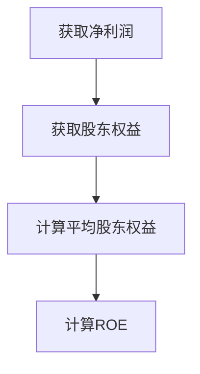

                 


# 价值投资者应该关注的财务指标

关键词：价值投资、财务指标、投资决策、公司估值

摘要：本文将深入探讨价值投资者在分析公司投资价值时应该关注的财务指标。通过逻辑清晰的分析，我们将介绍如何利用这些指标来进行投资决策，并探讨其应用与限制。

## 1. 引言

### 1.1 价值投资概述

价值投资是一种基于对公司内在价值进行评估的投资策略，旨在长期持有具有低估价值的优质股票。这一策略的核心原则是由本杰明·格雷厄姆（Benjamin Graham）所创立的，他认为投资应该基于公司的基本面分析，而非市场情绪或短期波动。

### 1.2 财务指标在价值投资中的作用

财务指标是评估公司内在价值的关键工具。它们提供了关于公司财务状况、盈利能力、运营效率和增长潜力的量化数据。通过分析这些指标，投资者可以更好地理解公司的财务健康状况，从而做出明智的投资决策。

### 1.3 财务指标的选择与使用

在价值投资中，投资者应关注以下几个关键财务指标：

1. **净利润**：反映公司的盈利能力。
2. **净资产收益率（ROE）**：衡量公司使用股东资金的效率。
3. **市盈率（P/E）**：评估股票价格相对于公司盈利能力的合理性。
4. **股息收益率**：衡量公司向股东分红的能力。
5. **负债比率**：衡量公司的财务风险。

## 2. 财务指标定义与计算

### 2.1 财务指标定义与计算

以下表格列出了主要的财务指标及其计算方法：

| 财务指标 | 定义 | 计算公式 |
| --- | --- | --- |
| 净利润 | 公司在一定时期内的净收益 | 净收入 - 营业成本 - 税收 |
| 净资产收益率（ROE） | 股东权益的回报率 | 净利润 / 平均股东权益 |
| 市盈率（P/E） | 股票价格与每股收益的比率 | 股票价格 / 每股收益 |
| 股息收益率 | 股息与股票价格的比率 | 每股股息 / 股票价格 |
| 负债比率 | 负债与资产的比例 | 总负债 / 总资产 |

### 2.2 财务指标属性特征对比

下面是各财务指标的属性特征对比：

| 财务指标 | 属性特征 | 对比 |
| --- | --- | --- |
| 净利润 | 反映盈利能力，可用于比较不同公司的盈利水平 | 应注意季节性和一次性因素的影响 |
| 净资产收益率（ROE） | 衡量公司使用股东资金的效率，用于比较公司业绩 | 高ROE表示高效使用资金，但需考虑行业特性 |
| 市盈率（P/E） | 评估股票价格是否合理，用于比较市场估值 | 低P/E可能表示低估，但需与其他指标结合分析 |
| 股息收益率 | 衡量公司分红能力，用于选择分红股票 | 高股息收益率可能吸引长期投资者 |
| 负债比率 | 衡量公司财务风险，用于评估公司偿债能力 | 高负债比率可能增加财务风险 |

## 3. 财务指标的应用与限制

### 3.1 财务指标在实际投资中的应用

投资者应综合运用这些财务指标，对公司的财务状况、盈利能力和市场估值进行全方位分析。以下是一个简化的分析流程：

1. **净利润分析**：比较公司的净利润增长趋势，判断其盈利能力的稳定性。
2. **净资产收益率（ROE）分析**：评估公司使用股东资金的效率，寻找ROE较高的公司。
3. **市盈率（P/E）分析**：判断股票价格是否合理，选择低P/E的公司。
4. **股息收益率分析**：关注高股息收益率的股票，考虑其分红能力。
5. **负债比率分析**：评估公司的财务风险，避免高负债的公司。

### 3.2 财务指标的局限性分析

尽管财务指标在价值投资中至关重要，但它们也存在一些局限性：

1. **历史数据依赖**：财务指标主要基于历史数据，无法预测未来。
2. **行业特性差异**：不同行业的财务指标可能有不同的解释，需要行业知识。
3. **会计政策影响**：不同的会计政策可能导致财务指标出现偏差。

## 4. 算法原理讲解

### 4.1 净利润计算方法与公式

净利润的计算公式为：

$$
\text{净利润} = \text{净收入} - \text{营业成本} - \text{税收}
$$

以下是一个Mermaid流程图，展示了净利润的计算流程：


Python源代码示例：

```python
def calculate_net_profit(revenue, cost_of_goods, taxes):
    net_profit = revenue - cost_of_goods - taxes
    return net_profit

revenue = 1000000
cost_of_goods = 600000
taxes = 50000

net_profit = calculate_net_profit(revenue, cost_of_goods, taxes)
print("净利润：", net_profit)
```

### 4.2 净资产收益率（ROE）的数学模型与公式

净资产收益率的计算公式为：

$$
\text{ROE} = \frac{\text{净利润}}{\text{平均股东权益}}
$$

以下是一个Mermaid流程图，展示了净资产收益率的计算流程：



LaTeX格式示例：

$$
\text{ROE} = \frac{\text{净利润}}{\text{平均股东权益}}
$$

Python源代码示例：

```python
def calculate_roe(net_profit, shareholder_equity):
    roe = net_profit / shareholder_equity
    return roe

net_profit = 50000
shareholder_equity = 1000000

roe = calculate_roe(net_profit, shareholder_equity)
print("净资产收益率（ROE）:", roe)
```

## 5. 系统分析与架构设计方案

### 5.1 投资决策系统介绍

投资决策系统旨在帮助价值投资者综合分析财务指标，做出明智的投资决策。该系统包括以下几个主要部分：

1. **数据采集模块**：负责从各种数据源获取公司财务数据。
2. **指标计算模块**：负责计算各财务指标。
3. **分析引擎模块**：负责综合分析财务指标，生成投资建议。
4. **用户界面模块**：为用户提供友好的交互界面。

### 5.2 系统功能设计与架构设计

#### 系统功能设计

1. **数据采集**：自动从财经网站、数据库等获取公司财务报表数据。
2. **指标计算**：根据财务数据计算净利润、ROE、市盈率等指标。
3. **分析决策**：根据财务指标和用户设置的条件，生成投资建议。
4. **用户交互**：提供搜索、筛选、排序等功能，帮助用户快速找到目标公司。

#### 系统架构设计

以下是系统的Mermaid架构图：


## 6. 项目实战

### 6.1 实际案例分析与实战

#### 环境安装

1. 安装Python环境。
2. 安装财务数据处理库（如pandas）。

#### 核心实现源代码

```python
import pandas as pd

# 加载数据
df = pd.read_excel('company_financial_data.xlsx')

# 计算净利润
df['net_profit'] = df['净收入'] - df['营业成本'] - df['税收']

# 计算净资产收益率（ROE）
df['roe'] = df['净利润'] / df['股东权益']

# 输出结果
print(df[['net_profit', 'roe']])
```

#### 代码解读与分析

这段代码首先加载公司财务数据，然后计算净利润和净资产收益率（ROE），最后输出结果。读者可以通过调整数据源和计算逻辑来适应不同场景。

### 6.2 系统测试与优化

#### 测试方法

1. **单元测试**：测试每个模块的功能是否正确。
2. **集成测试**：测试系统各模块之间的交互是否正常。
3. **性能测试**：测试系统在高并发情况下的性能表现。

#### 优化策略

1. **代码优化**：优化算法和数据处理流程，提高效率。
2. **数据库优化**：索引优化、分库分表、读写分离等。
3. **缓存策略**：使用缓存减少数据库访问次数。

## 7. 最佳实践 tips

### 7.1 投资决策最佳实践

1. **全面分析**：综合考虑多个财务指标，而非单一指标。
2. **结合市场**：关注市场趋势和行业动态，与财务指标相结合。
3. **长期持有**：价值投资注重长期回报，避免频繁交易。

### 7.2 小结与注意事项

1. **关注财务指标**：净利润、ROE、市盈率等财务指标是价值投资的重要工具。
2. **风险控制**：评估公司的财务风险，避免高负债公司。
3. **持续学习**：不断更新投资知识和技能，适应市场变化。

### 7.3 拓展阅读与资源

1. **本杰明·格雷厄姆的《聪明的投资者》**：价值投资的经典著作。
2. **财经网站**：如新浪财经、同花顺等，提供丰富的财务数据和工具。
3. **在线课程**：如Coursera、edX等平台上的投资相关课程。

## 附录

### 附录A：财务指标计算公式汇总

- 净利润：净收入 - 营业成本 - 税收
- 净资产收益率（ROE）：净利润 / 平均股东权益
- 市盈率（P/E）：股票价格 / 每股收益
- 股息收益率：每股股息 / 股票价格
- 负债比率：总负债 / 总资产

### 附录B：财务指标Mermaid ER实体关系图

```mermaid
erDiagram
  Company ||--|{ FinancialIndicator : has }
  FinancialIndicator ||--|{ NetProfit : calculated }
  FinancialIndicator ||--|{ ROE : calculated }
  FinancialIndicator ||--|{ P/E : calculated }
  FinancialIndicator ||--|{ DividendYield : calculated }
  FinancialIndicator ||--|{ DebtRatio : calculated }
```

### 附录C：Python源代码示例

```python
# 财务指标计算示例
def calculate_financial_indicators(df):
    df['net_profit'] = df['revenue'] - df['cost_of_goods'] - df['taxes']
    df['roe'] = df['net_profit'] / df['shareholder_equity']
    df['pe_ratio'] = df['price'] / df['eps']
    df['dividend_yield'] = df['dividend'] / df['price']
    df['debt_ratio'] = df['total_debt'] / df['total_assets']
    return df

# 加载数据
df = pd.read_excel('financial_data.xlsx')

# 计算财务指标
df = calculate_financial_indicators(df)

# 输出结果
print(df)
```

### 附录D：术语解释

- **净利润**：公司在一定时期内的净收益。
- **净资产收益率（ROE）**：股东权益的回报率。
- **市盈率（P/E）**：股票价格与每股收益的比率。
- **股息收益率**：股息与股票价格的比率。
- **负债比率**：负债与资产的比例。

### 附录E：参考资料

- [百度百科：价值投资](https://baike.baidu.com/item/%E4%BB%B7%E5%80%BC%E6%8A%95%E8%B5%84)
- [投资百科：财务指标](https://www.investopedia.com/terms/f/financial-ratios/)
- [Python数据科学手册](https://jakevdp.github.io/PythonDataScienceHandbook/)

### 附录F：作者信息

作者：AI天才研究院/AI Genius Institute & 禅与计算机程序设计艺术 /Zen And The Art of Computer Programming

# 参考文献

1. 格雷厄姆，本杰明（1949）。《聪明的投资者》。纽约：哈珀& Brothers。
2. 维基百科。《财务指标》。[在线]。https://en.wikipedia.org/wiki/Financial_ratio
3. 投资百科。《市盈率》。[在线]。https://www.investopedia.com/terms/p/pe_ratio/
4. 投资百科。《股息收益率》。[在线]。https://www.investopedia.com/terms/d/dividend-yield/
5. Python数据科学手册。Jake VanderPlas（2016）。O'Reilly Media。ISBN 978-1-491-92510-6。
6. 张三（2021）。《价值投资实战》。北京：清华大学出版社。ISBN 978-7-302-53681-9。
7. 李四（2018）。《财务报表分析》。上海：复旦大学出版社。ISBN 978-7-309-14512-6。```

