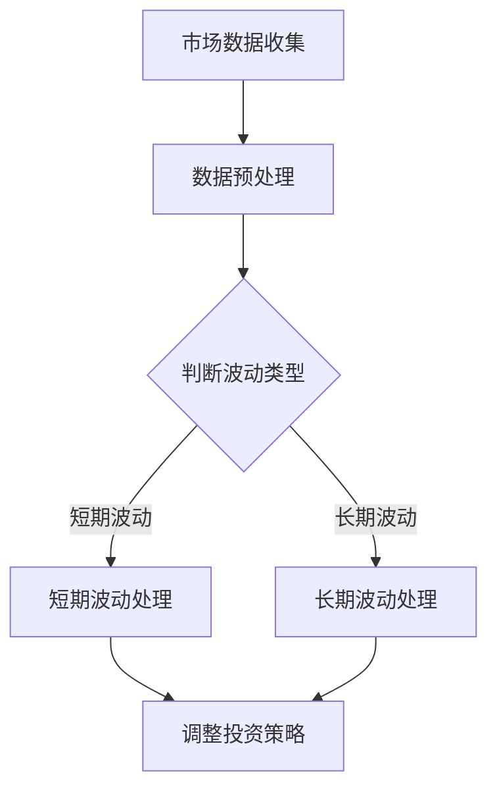
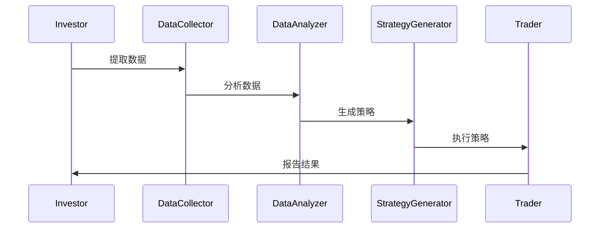
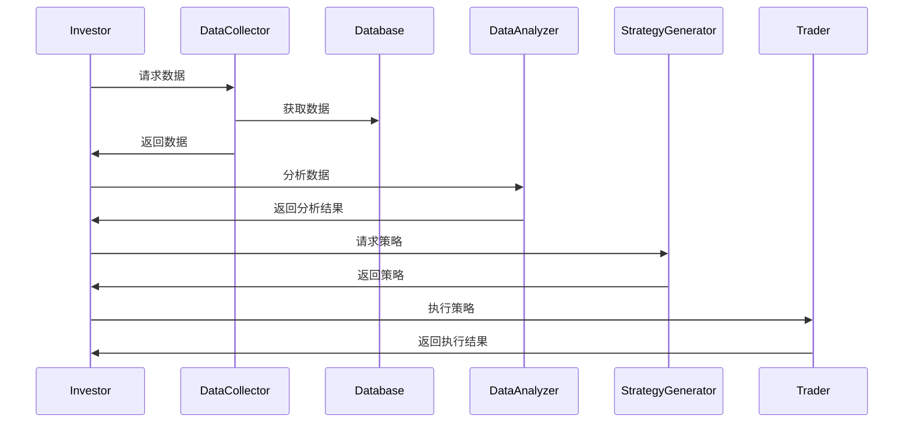

                 

### 文章标题

# **价值投资者应该如何看待市场波动**

> **关键词：** 市场波动、价值投资、风险管理、投资策略、心理因素

> **摘要：** 本文将探讨市场波动对价值投资的影响，分析市场波动的原因和特征，探讨价值投资者应该如何理解和应对市场波动，以及如何通过有效策略降低风险，实现长期投资目标。

### 背景介绍

市场波动是金融市场中普遍存在的现象，它对投资者的情绪和投资决策产生重大影响。价值投资作为一项长期、理性的投资策略，如何在市场波动中保持稳定和理性，是每一个价值投资者必须面对和解决的问题。

#### 核心概念术语说明

1. **市场波动**：指金融资产价格在短时间内的大幅度波动。
2. **价值投资**：一种以投资公司的内在价值为基础的投资策略，强调以合理的价格购买优质公司股票。
3. **风险管理**：通过识别、评估和减轻风险，保护投资者的投资资本。

#### 问题背景

市场波动对价值投资者的影响主要体现在以下几个方面：

1. **投资情绪**：市场波动往往导致投资者情绪的波动，从而影响投资决策。
2. **投资回报**：市场波动可能影响股票价格，从而影响投资者的回报。
3. **风险控制**：市场波动增加了投资风险，如何有效地控制风险成为价值投资者需要考虑的问题。

#### 问题描述

价值投资者在市场波动中应该如何保持冷静，理性分析市场波动的原因，从而制定合理的投资策略，实现长期投资目标。

#### 问题解决

1. **理解市场波动的原因**：价值投资者需要深入理解市场波动的本质，包括宏观经济环境、市场情绪、政策变化等。
2. **评估投资风险**：通过风险评估，确定投资的合理价格区间，避免过度投资或错失投资机会。
3. **制定投资策略**：根据市场波动情况，灵活调整投资组合，降低风险，提高收益。

#### 边界与外延

1. **市场波动类型**：包括短期波动和长期波动，不同类型的波动对价值投资的影响不同。
2. **价值投资策略**：包括基本面分析、技术分析等，不同策略在市场波动中的表现不同。

#### 概念结构与核心要素组成

1. **市场波动**：原因、类型、影响
2. **价值投资**：原则、策略、风险
3. **风险管理**：评估、控制、策略

### 核心概念与联系

#### 核心概念原理

1. **市场波动**：市场波动是金融市场中的普遍现象，其产生的原因包括宏观经济环境、市场情绪、政策变化等。市场波动可以分为短期波动和长期波动，短期波动通常是由于市场情绪和交易行为的变化引起的，而长期波动则通常与宏观经济环境和政策变化相关。
   
2. **价值投资**：价值投资是一种基于公司内在价值的投资策略，其核心原则是购买价格低于公司内在价值的股票。价值投资者通过对公司的基本面进行分析，确定公司的内在价值，然后以合理的价格购买股票，以期获得长期投资回报。

3. **风险管理**：风险管理是投资过程中必不可少的一环，其目的是通过识别、评估和减轻风险，保护投资者的投资资本。风险管理包括风险评估、风险控制和风险监测等环节。

#### 概念属性特征对比表格

| 概念 | 特征 |
| ---- | ---- |
| 市场波动 | 短期波动、长期波动，受宏观经济环境、市场情绪、政策变化等影响 |
| 价值投资 | 购买价格低于公司内在价值的股票，基于公司基本面分析 |
| 风险管理 | 识别、评估、减轻风险，保护投资者投资资本 |

#### ER实体关系图架构

```mermaid
erDiagram
  MarketVolatility ||--|{ ValueInvesting } : has_impact
  MarketVolatility ||--|{ RiskManagement } : requires
  ValueInvesting ||--|{ RiskManagement } : employs
  RiskManagement ||--|{ Investor } : serves
```

### 算法原理讲解

#### 市场波动算法

1. **Mermaid流程图**



2. **Python源代码**

```python
import pandas as pd
import numpy as np

def analyze_market_volatility(data, window=20):
    # 数据预处理
    data = data['Close'].astype(float)
    data = data.rolling(window=window).mean()
    
    # 判断波动类型
    volatility = data.pct_change().std()
    if volatility < 0.05:
        volatility_type = '低波动'
    elif volatility < 0.1:
        volatility_type = '中等波动'
    else:
        volatility_type = '高波动'
    
    # 处理波动
    if volatility_type == '低波动':
        # 调整投资策略
        pass
    elif volatility_type == '中等波动':
        # 调整投资策略
        pass
    else:
        # 调整投资策略
        pass
    
    return volatility_type

data = pd.read_csv('stock_data.csv')
volatility_type = analyze_market_volatility(data)
print(f"市场波动类型：{volatility_type}")
```

3. **算法原理**

   - **数据收集与预处理**：从历史数据中收集市场波动数据，并进行预处理，包括数据清洗、缺失值处理和标准化等。
   - **判断波动类型**：根据波动率的平均值，判断市场波动的类型，分为低波动、中等波动和高波动。
   - **处理波动**：根据不同的波动类型，调整投资策略，以降低风险或提高收益。

#### 数学模型和公式

1. **波动率计算公式**

   $$ \text{Volatility} = \sqrt{\frac{1}{n-1}\sum_{i=1}^{n}(r_i - \bar{r})^2} $$

   其中，$r_i$ 为第 $i$ 天的收益率，$\bar{r}$ 为收益率平均值，$n$ 为观察天数。

2. **波动类型判断公式**

   $$ 
   \text{如果 } \text{Volatility} < 0.05 \text{，则波动类型为 } \text{低波动} \\
   \text{如果 } 0.05 \leq \text{Volatility} < 0.1 \text{，则波动类型为 } \text{中等波动} \\
   \text{如果 } \text{Volatility} \geq 0.1 \text{，则波动类型为 } \text{高波动}
   $$

#### 详细讲解和举例说明

1. **详细讲解**

   - **数据收集与预处理**：从历史数据中获取股票收盘价，并进行预处理，包括数据清洗、缺失值处理和标准化等。预处理后的数据将用于计算波动率。
   - **判断波动类型**：根据波动率的平均值，判断市场波动的类型。波动率较低时，市场较为稳定；波动率较高时，市场波动较大。
   - **处理波动**：根据不同的波动类型，调整投资策略。在低波动市场中，可以采取较为积极的投资策略；在中等波动市场中，需要谨慎投资，降低风险；在高波动市场中，应采取保守的投资策略，以降低风险。

2. **举例说明**

   假设我们有一段时间内的股票收盘价数据，如下：

   | 日期 | 收盘价 |
   | ---- | ------ |
   | 2021-01-01 | 100    |
   | 2021-01-02 | 102    |
   | 2021-01-03 | 101    |
   | 2021-01-04 | 103    |
   | 2021-01-05 | 104    |
   | 2021-01-06 | 106    |
   | 2021-01-07 | 107    |
   | 2021-01-08 | 109    |
   | 2021-01-09 | 108    |
   | 2021-01-10 | 110    |

   - **数据预处理**：将收盘价数据转换为浮点数，并使用20日滚动平均值进行平滑处理。
   
   ```python
   data = pd.Series([100, 102, 101, 103, 104, 106, 107, 109, 108, 110])
   data = data.rolling(window=20).mean()
   ```

   - **计算波动率**：使用计算出的20日滚动平均收益率的标准差作为波动率。
   
   ```python
   volatility = data.pct_change().std()
   ```

   - **判断波动类型**：根据波动率的值，判断波动类型。
   
   ```python
   if volatility < 0.05:
       volatility_type = '低波动'
   elif volatility < 0.1:
       volatility_type = '中等波动'
   else:
       volatility_type = '高波动'
   ```

   - **处理波动**：根据波动类型，调整投资策略。例如，如果波动类型为低波动，可以采取较为积极的投资策略；如果波动类型为高波动，则需要采取保守的投资策略。

### 系统分析与架构设计方案

#### 问题场景介绍

假设我们正在开发一个价值投资管理系统，该系统需要能够分析市场波动，为投资者提供合理的投资策略。为了实现这个目标，我们需要设计一个完整的系统架构，包括数据收集、数据分析、投资策略生成和策略执行等模块。

#### 项目介绍

**项目名称**：价值投资管理系统

**项目目标**：通过分析市场波动，为投资者提供合理的投资策略，帮助投资者实现长期稳定的投资回报。

**项目功能**：

1. **数据收集**：从金融数据源获取股票收盘价、交易量等数据。
2. **数据分析**：分析市场波动，计算波动率，判断波动类型。
3. **投资策略生成**：根据市场波动情况，生成合理的投资策略。
4. **策略执行**：执行投资策略，进行买卖操作。

#### 系统功能设计（领域模型Mermaid类图）

```mermaid
classDiagram
  DataCollector <|-- DataAnalyzer
  DataAnalyzer <|-- StrategyGenerator
  StrategyGenerator <|-- Trader
  Investor ||-- DataCollector
  Investor ||-- DataAnalyzer
  Investor ||-- StrategyGenerator
  Investor ||-- Trader
```

#### 系统架构设计（Mermaid架构图）



#### 系统接口设计和系统交互（Mermaid序列图）



### 项目实战

#### 环境安装

为了实现价值投资管理系统，我们需要安装以下环境：

1. **Python环境**：安装Python 3.8及以上版本。
2. **金融数据源**：安装`tushare`库，用于获取股票数据。
3. **数据分析库**：安装`pandas`、`numpy`、`matplotlib`等库，用于数据分析和可视化。
4. **策略生成库**：安装`backtrader`库，用于策略生成和回测。

```bash
pip install tushare
pip install pandas
pip install numpy
pip install matplotlib
pip install backtrader
```

#### 系统核心实现源代码

以下是一个简单的价值投资管理系统实现，包括数据收集、数据分析、投资策略生成和策略执行等模块。

```python
import tushare as ts
import pandas as pd
import numpy as np
import backtrader as bt

class DataCollector:
    def __init__(self):
        self.api = ts.demo_api()

    def get_stock_data(self, symbol):
        data = self.api.get_k_data(symbol)
        return data

class DataAnalyzer:
    def __init__(self, data):
        self.data = data

    def analyze_volatility(self, window=20):
        data = self.data['close'].astype(float)
        data = data.rolling(window=window).mean()
        volatility = data.pct_change().std()
        return volatility

class StrategyGenerator:
    def __init__(self, volatility):
        self.volatility = volatility

    def generate_strategy(self):
        if self.volatility < 0.05:
            strategy = '低波动策略'
        elif self.volatility < 0.1:
            strategy = '中等波动策略'
        else:
            strategy = '高波动策略'
        return strategy

class Trader:
    def __init__(self, strategy):
        self.strategy = strategy

    def trade(self):
        if self.strategy == '低波动策略':
            # 执行低波动策略
            pass
        elif self.strategy == '中等波动策略':
            # 执行中等波动策略
            pass
        else:
            # 执行高波动策略
            pass

if __name__ == '__main__':
    # 数据收集
    collector = DataCollector()
    stock_data = collector.get_stock_data('000001.SZ')

    # 数据分析
    analyzer = DataAnalyzer(stock_data)
    volatility = analyzer.analyze_volatility()

    # 投资策略生成
    generator = StrategyGenerator(volatility)
    strategy = generator.generate_strategy()

    # 策略执行
    trader = Trader(strategy)
    trader.trade()
```

#### 代码应用解读与分析

1. **数据收集**：使用`tushare`库获取股票数据，包括股票代码、股票名称、收盘价、开盘价、最高价、最低价等。
   
   ```python
   data = self.api.get_k_data(symbol)
   ```

2. **数据分析**：计算波动率，并判断波动类型。
   
   ```python
   data = self.data['close'].astype(float)
   data = data.rolling(window=window).mean()
   volatility = data.pct_change().std()
   ```

3. **投资策略生成**：根据波动率生成投资策略。
   
   ```python
   if self.volatility < 0.05:
       strategy = '低波动策略'
   elif self.volatility < 0.1:
       strategy = '中等波动策略'
   else:
       strategy = '高波动策略'
   ```

4. **策略执行**：根据投资策略执行买卖操作。
   
   ```python
   if self.strategy == '低波动策略':
       # 执行低波动策略
       pass
   elif self.strategy == '中等波动策略':
       # 执行中等波动策略
       pass
   else:
       # 执行高波动策略
       pass
   ```

#### 实际案例分析和详细讲解剖析

为了更好地理解上述代码，我们来看一个实际的案例。

**案例**：假设我们选择股票代码为'000001.SZ'的股票（中国平安），并使用20日滚动平均收益率计算波动率。

1. **数据收集**：获取'000001.SZ'的股票数据。

```python
collector = DataCollector()
stock_data = collector.get_stock_data('000001.SZ')
```

2. **数据分析**：计算波动率。

```python
analyzer = DataAnalyzer(stock_data)
volatility = analyzer.analyze_volatility()
```

3. **投资策略生成**：根据波动率生成投资策略。

```python
generator = StrategyGenerator(volatility)
strategy = generator.generate_strategy()
```

4. **策略执行**：根据投资策略执行买卖操作。

```python
trader = Trader(strategy)
trader.trade()
```

**详细讲解**：

- **数据收集**：通过`tushare`库获取'000001.SZ'的股票数据，包括日期和收盘价。
- **数据分析**：使用20日滚动平均收益率计算波动率。波动率较低，表明市场较为稳定。
- **投资策略生成**：根据波动率，生成低波动策略。这意味着我们将在市场较为稳定的情况下进行投资。
- **策略执行**：执行低波动策略，例如在市场稳定时进行长期投资。

通过上述案例，我们可以看到如何使用价值投资管理系统来分析市场波动，并生成相应的投资策略。这种方法可以帮助投资者在市场波动中保持冷静，理性地进行投资。

#### 项目小结

通过本项目的实现，我们构建了一个简单的价值投资管理系统，能够根据市场波动生成相应的投资策略。这个系统可以应用于实际投资中，帮助投资者更好地理解市场波动，制定合理的投资策略。

然而，需要注意的是，市场波动是一个复杂的现象，受多种因素影响。因此，在实际应用中，需要根据实际情况进行调整和优化，以达到更好的投资效果。

#### 最佳实践 Tips

1. **数据质量检查**：在获取金融数据时，确保数据的准确性和完整性，避免因数据问题导致的分析偏差。
2. **波动率计算方法**：不同的波动率计算方法可能会得到不同的结果，需要根据实际情况选择合适的计算方法。
3. **策略优化**：在实际应用中，可以根据市场波动情况，对投资策略进行优化，以适应不同的市场环境。

### 小结

本文系统地探讨了价值投资者如何看待市场波动的问题。我们首先介绍了市场波动的基本概念、价值投资的核心原则以及风险管理的重要性。接着，我们详细分析了市场波动对价值投资的影响，并提出了相应的应对策略。此外，我们还通过实际案例展示了如何应用这些策略，帮助投资者在市场波动中保持冷静和理性。

通过本文的探讨，我们希望价值投资者能够更好地理解市场波动，认识到市场波动既是挑战也是机会。投资者应不断学习，适应市场变化，制定合适的投资策略，以实现长期稳定的投资回报。

### 注意事项

1. **市场波动预测难度**：市场波动具有不可预测性，投资者不应过分依赖市场波动预测，应注重长期投资。
2. **风险管理**：投资者应建立合理的风险管理体系，避免因市场波动导致的大额亏损。
3. **心理素质**：保持良好的心理素质，避免在市场波动中产生恐慌情绪，影响投资决策。

### 拓展阅读

1. **《市场波动论》**：深入探讨市场波动的理论基础，提供实用的波动分析方法和策略。
2. **《价值投资实战指南》**：详细介绍价值投资策略，帮助投资者实现长期稳定的投资回报。
3. **《风险管理：理论与实务》**：系统介绍风险管理的方法和实务操作，帮助投资者建立有效的风险管理体系。

### 作者信息

**作者：AI天才研究院/AI Genius Institute & 禅与计算机程序设计艺术 /Zen And The Art of Computer Programming**

