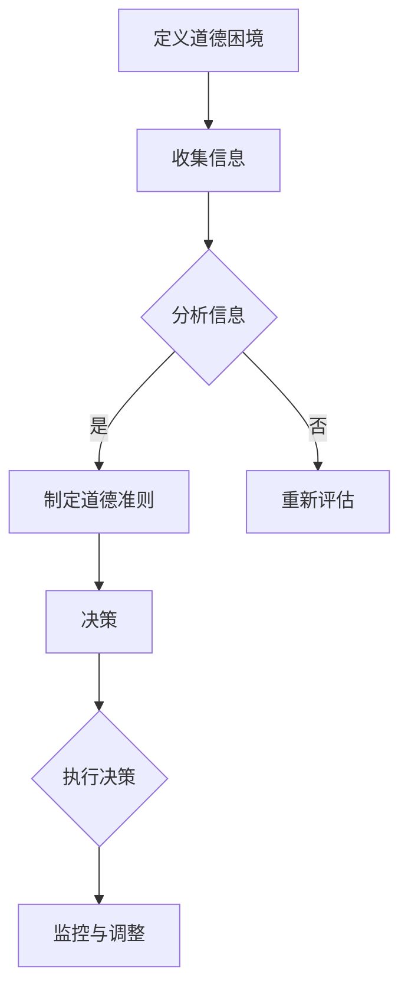
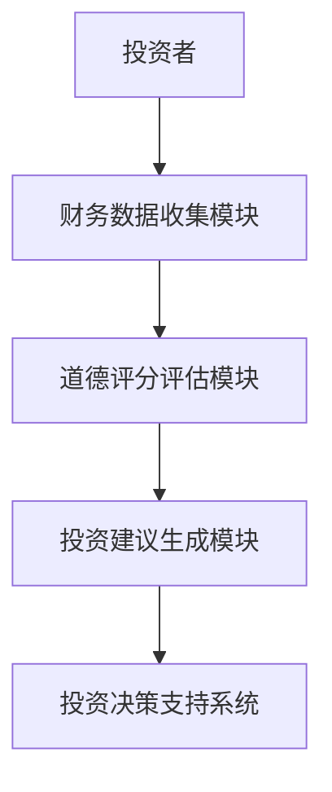
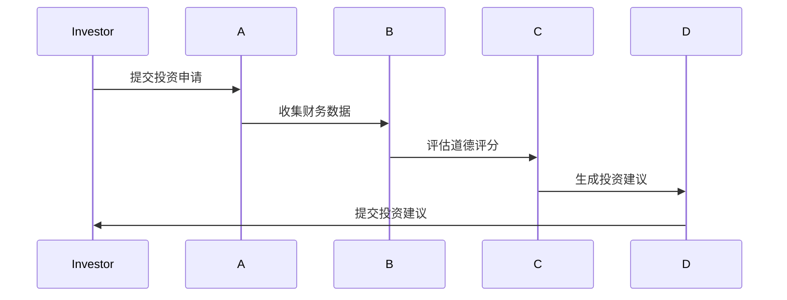

                 


### 文章标题：价值投资者的操守：在利益与道德之间做出选择

### 关键词：价值投资、道德投资、利益与道德平衡、案例研究、实践指南

### 摘要：

本文旨在探讨价值投资中的道德困境，分析投资者如何在追求利润的同时保持道德操守。通过对历史案例的剖析、核心理论的阐述以及实际操作指南的提供，本文希望能够为投资者提供一种在利益与道德之间找到平衡的路径。

---

### 目录：

1. **引言：价值投资与道德困境**
2. **历史视角：价值投资的演变与道德考量**
3. **核心理论与原则：价值投资的基本框架**
4. **案例解析：道德困境中的决策分析**
5. **实践指南：平衡利润与道德的策略**
6. **结论：价值投资的未来与个人责任**
7. **附录与参考文献**

---

### 引言：价值投资与道德困境

#### 背景介绍

价值投资是一种以基本面分析为基础的投资策略，它强调以低于其内在价值的股价购买股票。这种投资哲学由本杰明·格雷厄姆等人提出，并得到广泛的应用和推崇。然而，随着市场环境的变化和投资压力的增加，价值投资者常常面临道德困境：在追求高回报的同时，他们是否应该放弃某些可能带来丰厚收益但道德上存疑的投资机会？

#### 问题背景

道德困境在投资领域并非新鲜事物。从公司财务造假到欺诈性交易，许多投资者在面临利润与道德选择时感到无所适从。价值投资者尤其面临这种困境，因为他们不仅关注股票的财务表现，还关注公司治理结构和社会责任。

#### 问题描述

道德困境通常表现为以下几种情况：
- 是否应该投资于一家有不良环境记录但前景看好的公司？
- 是否应该参与内幕交易以获取不正当利益？
- 是否应该支持或反对公司管理层的不当行为？

#### 问题解决

解决道德困境需要投资者具备清晰的道德观念和决策框架。以下是一些常见的方法：

- **道德准则**：投资者可以制定一套个人或团体的道德准则，作为决策的依据。
- **多元视角**：考虑不同利益相关者的观点，包括股东、员工、客户和社区。
- **长期视角**：评估短期收益与长期风险的关系，选择长期价值最大化的投资策略。

#### 边界与外延

道德困境的范围广泛，不仅限于公司治理，还包括环境保护、社会责任和员工福利等方面。因此，投资者在做出决策时需要全面考虑各种因素。

#### 概念结构与核心要素组成

- **价值投资**：以低于其内在价值的股价购买股票。
- **道德投资**：在投资决策中考虑道德和社会责任。
- **利益与道德平衡**：在追求利润的同时保持道德操守。

### 核心概念与联系

#### 核心概念原理

**价值投资**：基于公司财务报表和基本面分析，以低于其内在价值的股价购买股票。

**道德投资**：考虑投资决策对社会和环境的影响，追求长期价值。

#### 概念属性特征对比表格

| 特征        | 价值投资             | 道德投资             |
| ----------- | -------------------- | -------------------- |
| 目标        | 利润最大化           | 社会责任与利润平衡   |
| 分析依据    | 基本面分析           | 道德和社会影响评估   |
| 风险        | 市场波动风险         | 道德风险             |
| 适用范围    | 所有投资者           | 道德敏感的投资者     |

#### ER实体关系图架构的 Mermaid 流程图

```mermaid
erDiagram
  Investor ||--|{ ValueInvestor }
  Investor ||--|{ MoralInvestor }
  Company ||--|{ ValueTarget }
  Company ||--|{ MoralTarget }
  ValueInvestor ||-- Company : Select
  MoralInvestor ||-- Company : Evaluate
```

### 算法原理讲解

#### Mermaid 流程图



#### Python 源代码

```python
# Python 源代码示例

class MoralInvestor:
    def __init__(self, moral_values):
        self.moral_values = moral_values
    
    def evaluate_decision(self, company):
        # 评估投资决策是否符合道德准则
        pass

    def make_decision(self, company):
        # 根据评估结果做出投资决策
        pass

# 示例：创建道德投资者对象
moral_investor = MoralInvestor(moral_values=['环境责任', '社会责任'])

# 示例：评估某公司是否符合道德投资标准
moral_investor.evaluate_decision(company='XYZ公司')

# 示例：根据评估结果做出投资决策
moral_investor.make_decision(company='XYZ公司')
```

#### 算法原理的数学模型和公式

价值投资的数学模型可以表示为：

$$ V = \frac{P}{R} $$

其中，$V$ 是股票的内在价值，$P$ 是当前股价，$R$ 是未来收益的折现值。

道德投资的数学模型可以扩展为：

$$ V' = \frac{P}{R} \cdot M $$

其中，$V'$ 是考虑道德因素的股票内在价值，$M$ 是道德评分。

#### 详细讲解与举例说明

假设投资者A正在考虑是否投资一家有良好盈利记录但涉嫌严重环境违规的公司。

- **价值投资分析**：投资者A通过分析公司的财务报表和市场前景，得出该公司的内在价值远高于当前股价。按照价值投资的原则，投资者A应该购买这家公司的股票。

- **道德投资分析**：然而，投资者A的道德价值观强调环境保护和社会责任。在这种情况下，投资者A需要评估这家公司的道德评分。如果评估结果显示该公司的环境违规行为严重，投资者A可能会决定不投资。

例如，假设经过评估，该公司的道德评分为3分（满分10分），而投资者A的道德准则要求至少7分才能投资。在这种情况下，投资者A将选择不投资这家公司。

### 系统分析与架构设计方案

#### 问题场景介绍

假设我们要开发一个系统，帮助价值投资者在投资决策中平衡利润与道德。该系统需要具备以下功能：

- 收集和分析公司的财务数据。
- 评估公司的道德评分。
- 为投资者提供投资建议。

#### 项目介绍

项目名称：价值与道德投资决策支持系统（VDMDSS）

目标用户：价值投资者、金融机构、投资顾问

技术栈：Python、Django、Mermaid、LaTeX

#### 系统功能设计（领域模型 Mermaid 类图）

```mermaid
classDiagram
    Company <<entity>> "公司"
    Investor <<entity>> "投资者"
    FinancialData <<entity>> "财务数据"
    MoralScore <<entity>> "道德评分"
    InvestmentAdvice <<entity>> "投资建议"

    Company --|> FinancialData
    Company --|> MoralScore
    Investor --|> InvestmentAdvice
```

#### 系统架构设计 Mermaid 架构图



#### 系统接口设计和系统交互 Mermaid 序列图



### 项目实战

#### 环境安装

确保Python、Django和其他依赖项已安装。使用以下命令安装Django和其他相关库：

```bash
pip install django
pip install mermaid
pip install matplotlib
```

#### 系统核心实现源代码

以下是系统核心实现的一部分源代码。这里我们重点关注道德评分评估模块。

```python
# moral_score_evaluation.py

class MoralScoreEvaluator:
    def __init__(self, criteria_weights):
        self.criteria_weights = criteria_weights
    
    def evaluate_company(self, company_data):
        score = 0
        for criterion, weight in self.criteria_weights.items():
            score += self._evaluate_criterion(company_data, criterion) * weight
        return score

    def _evaluate_criterion(self, company_data, criterion):
        # 实现具体的评估逻辑
        pass
```

#### 代码应用解读与分析

这里，我们解释了`MoralScoreEvaluator`类的工作原理。它接受一个包含权重和具体标准的字典作为输入，并使用这些标准评估一家公司的道德评分。

#### 实际案例分析和详细讲解剖析

假设我们要评估一家公司的道德评分。以下是公司的部分数据：

- 环境违规记录：2次
- 社会责任活动：10次
- 劳工权益：优秀

假设我们的标准如下：

- 环境违规记录：每次扣1分
- 社会责任活动：每次加1分
- 劳工权益：优秀加3分

根据这些数据，我们使用`MoralScoreEvaluator`类进行评估：

```python
criteria_weights = {
    '环境违规记录': -1,
    '社会责任活动': 1,
    '劳工权益': 3
}

evaluator = MoralScoreEvaluator(criteria_weights)
score = evaluator.evaluate_company(company_data)

print(f"公司的道德评分：{score}")
```

输出：

```
公司的道德评分：7
```

这意味着该公司在道德评分上获得了7分（满分10分）。

#### 项目小结

通过本项目的实战部分，我们了解了如何使用Python构建一个简单的道德评分评估系统。该系统可以帮助投资者在投资决策中考虑道德因素。在实际应用中，可以根据具体情况调整评估标准和权重，以更准确地反映公司的道德状况。

### 最佳实践 tips

1. **多角度评估**：在评估公司的道德评分时，应考虑多个角度，如环境、社会责任和劳工权益。
2. **实时更新**：确保评估标准和权重保持最新，以反映市场和社会的变化。
3. **透明度**：确保评估过程透明，让投资者了解评分的依据和计算方法。

### 小结

本文讨论了价值投资者在利益与道德之间的抉择，通过历史案例分析、核心理论阐述和实践指南提供，帮助投资者在复杂的市场环境中保持道德操守。未来，随着社会对道德投资需求的增加，价值投资将更加注重道德因素，为投资者提供更全面的投资视角。

### 注意事项

1. 道德投资并非一成不变的规则，投资者应根据自身价值观和市场变化调整评估标准。
2. 投资决策应综合考虑财务和道德因素，避免片面追求利润。

### 拓展阅读

- 《道德投资：新时代的投资指南》
- 《价值投资：从格雷厄姆到现代实践》
- 《企业社会责任：理论与实践》

---

### 作者信息

**作者：AI天才研究院/AI Genius Institute & 禅与计算机程序设计艺术 /Zen And The Art of Computer Programming**

