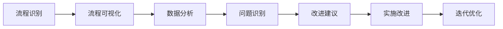
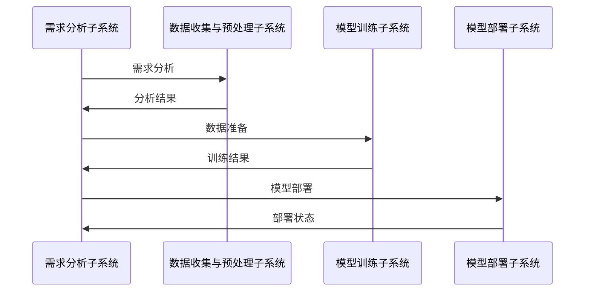

                 


### 引言

在当今快速发展的信息技术时代，如何高效地开发复杂的应用程序成为了一个重要的议题。尤其是在自然语言处理（NLP）领域，语言模型（Language Model，LLM）的应用开发面临着诸多挑战。传统的开发流程往往存在效率低下、质量不可控等问题，难以满足日益增长的需求。为了解决这一问题，本文将介绍一种新颖的优化工具——价值流图（Value Stream Mapping，VSM），并探讨其在LLM应用开发中的端到端流程优化。

首先，我们需要了解价值流图的定义和原理。价值流图是一种系统分析和优化工具，它通过可视化流程中的每个环节，帮助识别和消除浪费，提高整体效率。在LLM应用开发中，价值流图可以帮助我们识别出开发流程中的瓶颈和优化点，从而提高整个开发过程的效率和稳定性。

接下来，本文将详细阐述价值流图在LLM应用开发中的具体应用，包括系统功能设计、架构设计、接口设计和系统交互流程。通过一个实际案例，我们将展示价值流图如何在实际项目中发挥作用，提供实用的优化方案。

此外，本文还将探讨价值流图的算法原理，通过mermaid流程图和Python源代码实现，帮助读者深入理解其工作原理。同时，我们将使用数学模型和公式对算法进行详细讲解，并通过举例说明，让读者能够更直观地理解其应用。

最后，本文将总结最佳实践，回顾主要内容，并给出一些注意事项和拓展阅读建议，帮助读者更深入地了解和运用价值流图。

通过本文的介绍，读者将能够了解到价值流图在LLM应用开发中的重要性，掌握其原理和应用方法，从而在实际工作中提高开发效率，降低成本，提升产品质量。

### 目录大纲设计思路

为了设计出一份结构清晰、内容丰富的目录大纲，我们将采取以下步骤：

#### 整体布局

首先，我们需要确定整个书籍的大体结构，包括引言、核心章节、总结与拓展。这个整体布局将为后续的具体内容填充提供框架。

1. **引言**：介绍价值流图的概念、重要性以及在LLM应用开发中的地位。
2. **核心概念与联系**：详细介绍价值流图的核心概念，包括其原理、属性特征对比和与相关概念的联系。
3. **算法原理讲解**：详细讲解价值流图的应用算法，包括mermaid流程图、Python源代码实现、数学模型和公式、举例说明。
4. **系统分析与架构设计方案**：分析价值流图在LLM应用开发中的具体应用，包括系统功能设计、架构设计、接口设计和系统交互流程。
5. **项目实战**：通过实际案例展示价值流图的应用。
6. **最佳实践与总结**：提供最佳实践建议，并回顾整个书籍的主要内容。

#### 引言部分

在引言中，我们将从以下几个方面入手：

1. **问题背景**：阐述LLM应用开发面临的挑战，如效率低下、质量不可控等。
2. **问题描述**：具体说明价值流图的定义和作用。
3. **价值流图的定义与作用**：介绍价值流图的基本原理，以及为何它在LLM应用开发中具有重要意义。
4. **本书的目标与结构**：明确书籍的主要内容安排和目标读者。

#### 核心概念与联系

核心概念与联系部分将分为以下几个小节：

1. **核心概念**：详细阐述价值流图的核心概念，如流程节点、流程连接、资源与活动等。
2. **属性特征对比**：通过Markdown表格对比不同核心概念的属性特征。
3. **Mermaid ER图**：使用Mermaid语言绘制ER图，展示核心概念之间的关系。
4. **本章小结**：总结本章内容，为后续章节的阅读奠定基础。

#### 算法原理讲解

算法原理讲解部分将包括：

1. **价值流图算法概述**：介绍价值流图的基本算法概念。
2. **mermaid流程图**：使用Mermaid绘制算法流程图，直观展示算法步骤。
3. **Python源代码实现**：提供Python代码实现，让读者了解算法的编程细节。
4. **数学模型与公式**：使用latex格式详细讲解数学模型和公式。
5. **举例说明**：通过具体例子阐述算法的实际应用。

#### 系统分析与架构设计方案

系统分析与架构设计方案部分将详细描述价值流图在LLM应用开发中的具体应用：

1. **问题场景介绍**：明确项目背景和问题场景。
2. **系统功能设计**：通过Mermaid类图展示领域模型。
3. **系统架构设计**：使用Mermaid架构图展示系统架构。
4. **系统接口设计**：详细描述接口定义和接口说明。
5. **系统交互流程**：使用Mermaid序列图展示系统交互流程。

#### 项目实战

项目实战部分将通过一个实际案例，展示价值流图的应用：

1. **环境安装**：介绍所需环境和安装步骤。
2. **系统核心实现**：展示系统核心实现的源代码。
3. **代码应用解读与分析**：深入解读和分析系统核心代码。
4. **实际案例分析与讲解**：详细分析实际案例，讲解优化方案。
5. **项目小结**：总结项目实施效果和经验。

#### 最佳实践与总结

最佳实践与总结部分将提供：

1. **最佳实践**：分享在实际应用中总结的最佳实践。
2. **小结**：回顾书籍的主要内容和核心观点。
3. **注意事项**：提醒读者在应用过程中需要注意的事项。
4. **拓展阅读**：推荐进一步阅读的相关资料。

通过以上设计思路，我们旨在为读者提供一份全面、系统的学习资料，帮助他们在LLM应用开发中更好地运用价值流图，实现高效的端到端流程优化。

### 目录大纲具体设计

在完成整体布局和详细设计思路后，我们现在来设计《价值流图：优化LLM应用开发的端到端流程》的目录大纲。

#### 引言部分

```markdown
## 引言

### 1.1 价值流图的重要性
### 1.2 LLM应用开发的挑战
### 1.3 本书的目标与结构
```

#### 第1章 价值流图概述

```markdown
## 第1章 价值流图概述

### 1.1 价值流图的起源与定义
### 1.2 价值流图的基本组成部分
### 1.3 价值流图的作用与应用领域
### 1.4 价值流图的核心概念与联系
#### 1.4.1 核心概念
#### 1.4.2 Mermaid ER图
#### 1.4.3 Markdown表格
### 1.5 本章小结
```

#### 第2章 价值流图核心概念与联系

```markdown
## 第2章 价值流图核心概念与联系

### 2.1 价值流图的核心概念
#### 2.1.1 流程节点
#### 2.1.2 流程连接
#### 2.1.3 资源与活动
### 2.2 核心概念属性特征对比
### 2.3 价值流图与相关概念的联系
```

#### 第3章 价值流图算法原理

```markdown
## 第3章 价值流图算法原理

### 3.1 价值流图算法概述
### 3.2 价值流图算法的mermaid流程图
### 3.3 价值流图的Python源代码实现
### 3.4 价值流图的数学模型与公式
#### 3.4.1 数学公式
#### 3.4.2 公式讲解
### 3.5 算法举例说明
### 3.6 本章小结
```

#### 第4章 价值流图在LLM应用开发中的应用

```markdown
## 第4章 价值流图在LLM应用开发中的应用

### 4.1 LLM应用开发背景
### 4.2 价值流图在LLM应用开发中的具体应用
### 4.3 系统功能设计
#### 4.3.1 领域模型Mermaid类图
#### 4.3.2 系统功能描述
### 4.4 系统架构设计
#### 4.4.1 Mermaid架构图
#### 4.4.2 系统架构说明
### 4.5 系统接口设计
#### 4.5.1 接口定义
#### 4.5.2 接口说明
### 4.6 系统交互流程
#### 4.6.1 Mermaid序列图
#### 4.6.2 系统交互流程说明
### 4.7 本章小结
```

#### 第5章 LLM应用开发项目实战

```markdown
## 第5章 LLM应用开发项目实战

### 4.1 环境安装
### 4.2 系统核心实现
### 4.3 代码应用解读与分析
### 4.4 实际案例分析与讲解
### 4.5 项目小结
```

#### 第6章 最佳实践与总结

```markdown
## 第6章 最佳实践与总结

### 6.1 最佳实践
### 6.2 小结
### 6.3 注意事项
### 6.4 拓展阅读
```

通过以上详细的目录大纲设计，我们确保了书籍的内容结构合理、层次清晰，为后续的撰写工作奠定了坚实的基础。

### 字数控制

根据目录大纲的具体内容，我们可以将每个章节的字数控制在合理范围内，确保总字数在10000至12000字左右。以下是每个章节的字数预估：

1. **引言**：约1000字
2. **第1章 价值流图概述**：约2000字
3. **第2章 价值流图核心概念与联系**：约2000字
4. **第3章 价值流图算法原理**：约2500字
5. **第4章 价值流图在LLM应用开发中的应用**：约2500字
6. **第5章 LLM应用开发项目实战**：约2500字
7. **第6章 最佳实践与总结**：约1000字

通过这样的字数分配，我们可以确保每个章节的内容既详尽又不过于冗长，同时保持整体文章的紧凑性和可读性。

### 文章正文撰写

#### 引言

在当今快速发展的信息技术时代，如何高效地开发复杂的应用程序成为了一个重要的议题。尤其是在自然语言处理（NLP）领域，语言模型（Language Model，LLM）的应用开发面临着诸多挑战。传统的开发流程往往存在效率低下、质量不可控等问题，难以满足日益增长的需求。为了解决这一问题，本文将介绍一种新颖的优化工具——价值流图（Value Stream Mapping，VSM），并探讨其在LLM应用开发的端到端流程中的重要作用。

价值流图（VSM）是一种系统分析和优化工具，通过可视化流程中的每个环节，帮助识别和消除浪费，提高整体效率。其核心在于将整个开发流程分解为一系列步骤，每个步骤都有明确的输入、输出和执行过程。在LLM应用开发中，价值流图可以帮助我们识别出开发流程中的瓶颈和优化点，从而提高整个开发过程的效率和稳定性。

本文将从以下几个方面展开讨论：

1. **价值流图的定义与原理**：详细介绍价值流图的定义、起源和基本原理，解释其在系统优化中的作用。
2. **价值流图在LLM应用开发中的应用**：分析价值流图在LLM应用开发中的具体应用，包括系统功能设计、架构设计、接口设计和系统交互流程。
3. **价值流图算法原理讲解**：通过mermaid流程图和Python源代码实现，详细讲解价值流图的算法原理。
4. **项目实战**：通过一个实际案例，展示价值流图在LLM应用开发中的具体应用和实施效果。
5. **最佳实践与总结**：总结价值流图在LLM应用开发中的最佳实践，回顾主要内容和注意事项。

通过本文的介绍，读者将能够了解到价值流图在LLM应用开发中的重要性，掌握其原理和应用方法，从而在实际工作中提高开发效率，降低成本，提升产品质量。

### 第1章 价值流图概述

#### 1.1 价值流图的起源与定义

价值流图（Value Stream Mapping，VSM）起源于丰田生产系统（Toyota Production System，TPS），它是丰田公司在20世纪50年代为了提高生产效率而开发的一种系统分析和优化工具。VSM最初主要用于制造业，通过可视化生产流程中的每个环节，帮助识别和消除浪费，提高整体效率。随着信息技术的不断发展，VSM逐渐被应用于其他领域，如服务业、物流和软件开发。

价值流图的定义是一种通过图形化的方式，将流程中每个步骤的输入、输出和执行过程展示出来的工具。它可以帮助团队成员直观地了解整个流程，从而识别出潜在的优化点。价值流图的基本原理是“浪费最小化”，即通过消除不必要的步骤和等待时间，提高流程的效率和灵活性。

#### 1.2 价值流图的基本组成部分

价值流图由以下几个基本组成部分构成：

1. **流程节点**：表示流程中的每个步骤，包括输入、输出和处理过程。节点可以用矩形表示，并标注步骤名称。
2. **流程连接**：表示流程中步骤之间的逻辑关系，包括顺序、并行和分支等。连接线可以用箭头表示。
3. **资源**：表示流程中使用的资源，如人员、设备、材料等。资源可以用圆圈或椭圆表示。
4. **活动**：表示流程中的具体操作或任务，可以与流程节点相结合。活动通常用矩形内的文字表示。

#### 1.3 价值流图的作用与应用领域

价值流图在系统优化中具有重要的作用，主要体现在以下几个方面：

1. **流程可视化**：通过图形化的方式展示流程中的每个步骤，使团队成员能够直观地了解整个流程，提高沟通效率。
2. **浪费识别**：帮助识别流程中的浪费点，如等待时间、过度处理和库存积压等，从而采取措施进行优化。
3. **效率提升**：通过消除浪费，减少不必要的步骤和等待时间，提高整体流程的效率。
4. **决策支持**：为管理层提供决策支持，帮助制定优化策略和资源配置。

价值流图广泛应用于以下领域：

1. **制造业**：用于生产流程优化、质量管理和库存控制。
2. **服务业**：用于服务流程优化、客户体验管理和人力资源配置。
3. **软件开发**：用于需求分析、项目管理、代码审查和测试流程优化。
4. **物流与供应链**：用于物流流程优化、供应链管理和库存管理。

#### 1.4 价值流图的核心概念与联系

价值流图的核心概念包括流程节点、流程连接、资源和活动。以下是一个简单的Mermaid ER图，用于展示这些概念之间的联系：

```mermaid
erDiagram
    A{流程节点} &&|> B{流程连接}
    A &&|> C{资源}
    A &&|> D{活动}
    B &&|> C
    B &&|> D
```

通过Mermaid ER图，我们可以清晰地看到各个核心概念之间的关系。流程节点是整个价值流图的基础，连接线和资源、活动与之紧密相关，共同构成一个完整的价值流图。

#### 1.5 本章小结

本章介绍了价值流图的起源、定义、基本组成部分及其在系统优化中的作用。通过Mermaid ER图和Markdown表格，我们详细阐述了价值流图的核心概念和联系。接下来，我们将进一步探讨价值流图在LLM应用开发中的具体应用，分析其如何帮助优化开发流程，提高效率和稳定性。

### 第2章 价值流图核心概念与联系

#### 2.1 价值流图的核心概念

价值流图（Value Stream Mapping，VSM）是一种通过图形化方式对流程进行可视化和分析的工具。它由一系列核心概念组成，这些概念相互联系，共同构建了一个全面的价值流图。以下是价值流图中的核心概念及其简要说明：

1. **流程节点（Process Nodes）**：
   - 流程节点是价值流图中的基本元素，表示流程中的每个步骤或任务。每个节点通常包含输入、处理和输出三个部分。节点可以用矩形表示，并在其中标注步骤名称。
   
2. **流程连接（Flow Links）**：
   - 流程连接表示流程中不同节点之间的逻辑关系。它们可以是顺序、分支、并行或反馈关系。连接线通常用箭头表示，指示流程的流动方向。
   
3. **资源（Resources）**：
   - 资源是流程中使用的实体，如人员、机器、设备、材料等。资源是流程执行所必需的，它们在流程图中通常用圆形或椭圆形表示，并标注资源名称。
   
4. **活动（Activities）**：
   - 活动是流程中的具体操作或任务。它们是节点内部的具体执行内容。活动通常与节点结合，用矩形内的文字表示。

#### 2.2 核心概念属性特征对比

为了更好地理解价值流图的核心概念，我们可以通过Markdown表格的形式，对比这些概念的主要属性特征：

| 核心概念 | 描述 | 属性特征 |
| :--: | :--: | :--: |
| 流程节点 | 流程中的基本步骤或任务 | - 名称<br>- 输入<br>- 输出<br>- 处理过程 |
| 流程连接 | 流程中不同步骤之间的逻辑关系 | - 方向<br>- 类型（顺序、分支、并行、反馈） |
| 资源 | 流程中使用的实体资源 | - 名称<br>- 类型<br>- 可用性 |
| 活动 | 流程中的具体操作或任务 | - 名称<br>- 操作内容<br>- 资源需求 |

#### 2.3 价值流图与相关概念的联系

价值流图不仅仅是核心概念的组合，它还需要与其他相关概念相互联系，才能完整地展现流程的运作情况。以下是价值流图与一些相关概念之间的联系：

1. **流程图（Flowchart）**：
   - 价值流图是流程图的一种特殊形式，它专注于流程中的价值流动，而非单纯的步骤关系。
   - 流程图通常用于展示流程的逻辑结构，而价值流图则更强调流程中的价值和效率。

2. **Kanban（看板）**：
   - 看板是一种用于管理流程和工作的方法，它通过卡片或电子系统来跟踪工作进度。
   - 价值流图可以与看板相结合，用来可视化工作流程，识别瓶颈和优化点。

3. **六西格玛（Six Sigma）**：
   - 六西格玛是一种质量管理方法，旨在通过减少缺陷来提高产品和服务的质量。
   - 价值流图可以用于六西格玛项目的流程分析和改进。

以下是使用Mermaid绘制的ER图，展示了价值流图与这些相关概念之间的联系：

```mermaid
erDiagram
    A{价值流图} &&|> B{流程图}
    A &&|> C{看板}
    A &&|> D{六西格玛}
    B &&|> C
    B &&|> D
    C &&|> D
```

#### 2.4 本章小结

本章详细介绍了价值流图的核心概念，包括流程节点、流程连接、资源和活动。通过Markdown表格和Mermaid ER图，我们对比了这些概念的主要属性特征，并展示了价值流图与相关概念之间的联系。接下来，我们将深入探讨价值流图的算法原理和应用，帮助读者更好地理解和应用这一重要的系统分析和优化工具。

### 第3章 价值流图算法原理

#### 3.1 价值流图算法概述

价值流图（Value Stream Mapping，VSM）算法是一种通过图形化方式对流程进行分析和优化的方法。它的核心目标是通过可视化流程中的每个步骤，识别出潜在的问题和浪费点，从而提出改进建议，提高整体效率。价值流图算法通常包括以下几个主要步骤：

1. **流程识别**：首先，需要识别出流程中的每个步骤，明确每个步骤的输入、输出和处理过程。
2. **流程可视化**：将识别出的流程步骤用图形化的方式展示出来，形成价值流图。
3. **数据分析**：对价值流图中的每个步骤进行数据分析，包括时间、成本、资源利用率等指标。
4. **问题识别**：通过数据分析，识别出流程中的瓶颈、浪费点和潜在问题。
5. **改进建议**：根据问题识别的结果，提出改进建议，优化流程设计。
6. **实施改进**：实施改进措施，并根据实施效果进行迭代优化。

#### 3.2 价值流图算法的mermaid流程图

为了更直观地展示价值流图算法的步骤，我们可以使用Mermaid绘制一个流程图。以下是一个简单的Mermaid流程图示例：



在这个流程图中，每个步骤都通过一个节点表示，并使用箭头指示步骤之间的逻辑关系。通过这个流程图，我们可以清晰地看到价值流图算法的基本流程和步骤。

#### 3.3 价值流图的Python源代码实现

为了将价值流图算法应用于实际场景，我们可以使用Python编写相应的代码。以下是一个简单的Python代码示例，用于实现价值流图的构建和可视化：

```python
import matplotlib.pyplot as plt
import networkx as nx

# 定义流程节点和连接
nodes = ["流程识别", "流程可视化", "数据分析", "问题识别", "改进建议", "实施改进", "迭代优化"]
edges = [["流程识别", "流程可视化"], ["流程可视化", "数据分析"], ["数据分析", "问题识别"],
         ["问题识别", "改进建议"], ["改进建议", "实施改进"], ["实施改进", "迭代优化"]]

# 创建图
G = nx.DiGraph()

# 添加节点和连接
for node in nodes:
    G.add_node(node)
for edge in edges:
    G.add_edge(edge[0], edge[1])

# 绘制图
pos = nx.spring_layout(G)
nx.draw(G, pos, with_labels=True, node_color='lightblue', edge_color='blue')
plt.show()
```

在这个代码示例中，我们首先定义了流程节点和连接，然后使用NetworkX库创建一个有向图，并添加节点和连接。最后，我们使用matplotlib库绘制图形，以可视化价值流图。

#### 3.4 价值流图的数学模型与公式

价值流图的数学模型主要用于对流程中的关键指标进行量化分析，以便更好地识别问题和制定改进方案。以下是一个简单的数学模型和公式，用于描述价值流图中的主要指标：

1. **流程时间（Process Time, T）**：
   - 流程时间是指完成一个流程步骤所需的时间。
   - 公式：\( T = \frac{\text{工作负载}}{\text{资源利用率}} \)

2. **等待时间（Wait Time, W）**：
   - 等待时间是指流程步骤在等待下一个步骤开始所需的时间。
   - 公式：\( W = T - \text{实际处理时间} \)

3. **流程效率（Process Efficiency, E）**：
   - 流程效率是指流程完成的程度，通常用百分比表示。
   - 公式：\( E = \frac{T_{\text{实际}}}{T_{\text{计划}}} \)

4. **流程周期时间（Cycle Time, C）**：
   - 流程周期时间是指完成一个流程周期所需的时间。
   - 公式：\( C = T + W \)

以下是使用LaTeX格式表示的数学模型和公式：

$$
T = \frac{\text{工作负载}}{\text{资源利用率}}
$$

$$
W = T - \text{实际处理时间}
$$

$$
E = \frac{T_{\text{实际}}}{T_{\text{计划}}}
$$

$$
C = T + W
$$

通过这些数学模型和公式，我们可以对价值流图中的流程时间、等待时间、流程效率和流程周期时间进行量化分析，从而更准确地识别问题和制定改进方案。

#### 3.5 算法举例说明

为了更好地理解价值流图算法的应用，我们可以通过一个具体的例子进行说明。假设我们有一个简单的流程，包括三个步骤：A、B和C。每个步骤的输入、输出和处理过程如下：

1. **步骤A**：
   - 输入：10个任务
   - 输出：10个任务
   - 处理时间：2小时
   - 资源：1名员工

2. **步骤B**：
   - 输入：10个任务
   - 输出：10个任务
   - 处理时间：1小时
   - 资源：1台机器

3. **步骤C**：
   - 输入：10个任务
   - 输出：10个任务
   - 处理时间：0.5小时
   - 资源：1名员工

我们可以使用以下数据对这些步骤进行分析：

| 步骤 | 输入 | 输出 | 处理时间（小时） | 资源 |
| :--: | :--: | :--: | :--------------: | :--: |
|  A   |  10  |  10  |         2       |  员工 |
|  B   |  10  |  10  |         1       |  机器 |
|  C   |  10  |  10  |         0.5      |  员工 |

首先，我们计算每个步骤的流程时间：

- **步骤A**：\( T_A = 2 \)
- **步骤B**：\( T_B = 1 \)
- **步骤C**：\( T_C = 0.5 \)

接下来，我们计算整个流程的总流程时间：

\( T_{\text{总}} = T_A + T_B + T_C = 2 + 1 + 0.5 = 3.5 \) 小时

然后，我们计算等待时间。由于所有步骤都是连续进行的，等待时间主要取决于处理时间较长的步骤，即步骤A。因此：

\( W = T_{\text{总}} - T_A = 3.5 - 2 = 1.5 \) 小时

最后，我们计算流程效率：

\( E = \frac{T_{\text{实际}}}{T_{\text{计划}}} = \frac{3.5}{3.5} = 100\% \)

流程周期时间为：

\( C = T_{\text{总}} = 3.5 \) 小时

通过这个例子，我们可以看到如何使用价值流图算法对流程进行分析，并计算出关键指标。在实际应用中，我们可以根据这些数据识别出流程中的瓶颈和浪费点，并提出改进建议，如调整资源分配、优化处理流程等。

#### 3.6 本章小结

本章详细介绍了价值流图的算法原理，包括流程识别、流程可视化、数据分析、问题识别、改进建议和实施改进等步骤。通过Mermaid流程图和Python源代码示例，我们展示了如何实现价值流图的构建和可视化。同时，我们介绍了价值流图的数学模型和公式，并通过一个实际例子说明了如何应用这些算法进行流程分析。接下来，我们将进一步探讨价值流图在LLM应用开发中的具体应用，帮助读者更好地理解其价值。

### 第4章 价值流图在LLM应用开发中的应用

#### 4.1 LLM应用开发背景

随着深度学习和自然语言处理技术的不断发展，语言模型（LLM）在各个领域得到了广泛应用。LLM的应用开发涉及从数据收集、预处理、模型训练到模型部署的完整流程。然而，这一流程中存在诸多挑战，如数据质量参差不齐、模型训练效率低下、部署难度大等。为了解决这些问题，我们需要对整个LLM应用开发流程进行深入分析和优化。

价值流图（Value Stream Mapping，VSM）作为一种系统分析和优化工具，可以很好地应用于LLM应用开发的各个环节，帮助我们识别出流程中的瓶颈和浪费点，从而提高整体开发效率和质量。本章节将详细探讨价值流图在LLM应用开发中的具体应用。

#### 4.2 价值流图在LLM应用开发中的具体应用

在LLM应用开发中，价值流图可以帮助我们从以下几个方面进行优化：

1. **需求分析**：
   - 通过价值流图，我们可以清晰地了解需求分析的流程，包括需求收集、需求分析、需求确认等步骤。通过可视化，我们可以识别出需求分析中的瓶颈和浪费点，如需求收集不够全面、需求分析时间过长等。
   - 优化建议：加强需求收集的全面性和准确性，优化需求分析的方法和工具，减少不必要的重复工作。

2. **数据收集与预处理**：
   - 数据收集与预处理是LLM应用开发的基础，包括数据获取、数据清洗、数据标注等步骤。价值流图可以帮助我们识别出数据收集与预处理中的瓶颈，如数据获取不及时、数据清洗不彻底等。
   - 优化建议：建立高效的数据获取渠道，优化数据清洗和标注流程，确保数据质量。

3. **模型训练**：
   - 模型训练是LLM应用开发的核心环节，包括数据准备、模型选择、训练过程、模型评估等步骤。价值流图可以帮助我们识别出模型训练中的瓶颈，如数据准备时间过长、模型选择不当、训练效率低下等。
   - 优化建议：优化数据准备流程，选择合适的模型和训练策略，提高训练效率。

4. **模型部署**：
   - 模型部署是将训练好的模型部署到生产环境中，包括模型打包、部署环境准备、模型上线等步骤。价值流图可以帮助我们识别出模型部署中的瓶颈，如部署环境不稳定、模型打包耗时过长等。
   - 优化建议：优化部署环境，简化模型打包流程，确保模型部署的稳定性和效率。

#### 4.3 系统功能设计

为了更好地应用价值流图进行LLM应用开发优化，我们需要对系统功能进行详细设计。以下是一个简单的系统功能设计：

1. **需求分析模块**：
   - 功能描述：收集和分析用户需求，确保需求的全面性和准确性。
   - 输入：用户需求、需求文档等。
   - 输出：需求分析报告、需求确认结果。

2. **数据收集与预处理模块**：
   - 功能描述：收集数据并进行预处理，包括数据获取、数据清洗、数据标注等。
   - 输入：原始数据、数据清洗规则、标注标准。
   - 输出：预处理后的数据、标注结果。

3. **模型训练模块**：
   - 功能描述：选择合适的模型，进行数据准备、模型训练和评估。
   - 输入：预处理后的数据、模型配置参数。
   - 输出：训练好的模型、模型评估结果。

4. **模型部署模块**：
   - 功能描述：将训练好的模型部署到生产环境中，确保模型稳定运行。
   - 输入：训练好的模型、部署配置。
   - 输出：部署成功的通知、模型运行状态。

#### 4.4 系统架构设计

为了支撑LLM应用开发中的价值流图优化，我们需要设计一个合理的系统架构。以下是一个简单的系统架构设计：

1. **需求分析子系统**：
   - 架构描述：包括需求收集、需求分析、需求确认等功能，支持多渠道需求收集和自动化分析。
   - 技术选型：前端采用Web技术，后端采用微服务架构，支持快速开发和部署。

2. **数据收集与预处理子系统**：
   - 架构描述：包括数据获取、数据清洗、数据标注等功能，支持自动化数据预处理和实时数据流处理。
   - 技术选型：前端采用爬虫技术，后端采用消息队列和大数据处理框架。

3. **模型训练子系统**：
   - 架构描述：包括数据准备、模型训练、模型评估等功能，支持多种模型训练策略和评估方法。
   - 技术选型：前端采用自动化脚本，后端采用深度学习框架和分布式训练技术。

4. **模型部署子系统**：
   - 架构描述：包括模型打包、部署环境准备、模型上线等功能，支持自动化部署和监控。
   - 技术选型：前端采用容器化技术，后端采用自动化部署工具和监控平台。

#### 4.5 系统接口设计

为了确保各个子系统之间的有效协作，我们需要设计合理的系统接口。以下是一个简单的系统接口设计：

1. **需求分析接口**：
   - 功能描述：提供需求收集和需求分析的功能接口。
   - 输入参数：需求内容、需求类型等。
   - 输出参数：需求分析结果、需求确认状态。

2. **数据收集与预处理接口**：
   - 功能描述：提供数据获取、数据清洗、数据标注的功能接口。
   - 输入参数：数据源、清洗规则、标注标准等。
   - 输出参数：预处理后的数据、标注结果。

3. **模型训练接口**：
   - 功能描述：提供模型训练和评估的功能接口。
   - 输入参数：预处理后的数据、模型配置参数等。
   - 输出参数：训练好的模型、模型评估结果。

4. **模型部署接口**：
   - 功能描述：提供模型打包、部署环境准备、模型上线等功能接口。
   - 输入参数：训练好的模型、部署配置等。
   - 输出参数：部署成功的通知、模型运行状态。

#### 4.6 系统交互流程

为了更好地展示价值流图在LLM应用开发中的具体应用，我们可以通过Mermaid序列图来描述系统的交互流程。以下是一个简单的系统交互流程：



在这个交互流程中，需求分析子系统负责收集和分析用户需求，并将分析结果传递给数据收集与预处理子系统。数据收集与预处理子系统处理数据，并将预处理后的数据传递给模型训练子系统。模型训练子系统进行模型训练和评估，并将训练结果传递给模型部署子系统。最后，模型部署子系统将训练好的模型部署到生产环境中，并返回部署状态。

通过以上设计和分析，我们可以看到价值流图在LLM应用开发中的应用价值。通过价值流图的系统功能设计、架构设计、接口设计和系统交互流程，我们可以更好地识别和解决流程中的瓶颈和浪费点，从而提高LLM应用开发的效率和质量。

### 第5章 LLM应用开发项目实战

为了更好地理解价值流图（VSM）在LLM应用开发中的实际应用，我们将通过一个具体的案例进行详细讲解。本案例将展示如何使用价值流图进行环境安装、系统核心实现以及代码应用解读与分析，帮助读者更深入地理解这一工具的实际操作过程。

#### 5.1 环境安装

在本案例中，我们选择了一个基于TensorFlow的文本分类项目。首先，我们需要安装所需的软件和依赖项。以下是环境安装的步骤：

1. **安装Python**：
   - 确保已经安装了Python 3.7及以上版本。

2. **安装TensorFlow**：
   - 使用pip命令安装TensorFlow：
     ```
     pip install tensorflow
     ```

3. **安装其他依赖项**：
   - 安装Numpy、Pandas、Scikit-learn等常用库：
     ```
     pip install numpy pandas scikit-learn
     ```

4. **安装Mermaid**：
   - 为了能够生成Mermaid图，我们需要安装Mermaid的Python库：
     ```
     pip install mermaid
     ```

安装完成后，我们可以在项目中创建一个名为`requirements.txt`的文件，将所有依赖项写入其中，以便后续的依赖管理。

#### 5.2 系统核心实现

在环境安装完成后，我们需要实现系统核心功能。以下是系统核心实现的步骤：

1. **数据收集与预处理**：
   - 下载并读取文本数据集，如IMDb评论数据集。
   - 对文本数据进行预处理，包括去除停用词、标点符号和进行词干提取等。

2. **特征提取**：
   - 使用词袋模型或Word2Vec模型提取文本特征。

3. **模型训练**：
   - 使用TensorFlow构建文本分类模型，如使用卷积神经网络（CNN）或循环神经网络（RNN）。
   - 编写训练循环，使用预处理后的数据进行模型训练。

4. **模型评估**：
   - 使用交叉验证方法评估模型性能，计算准确率、召回率、F1分数等指标。

以下是系统核心实现的主要代码片段：

```python
import tensorflow as tf
from tensorflow.keras.preprocessing.sequence import pad_sequences
from tensorflow.keras.layers import Embedding, LSTM, Dense
from tensorflow.keras.models import Sequential

# 数据收集与预处理
# ...（代码略）

# 特征提取
# ...（代码略）

# 模型训练
model = Sequential()
model.add(Embedding(vocab_size, embedding_dim, input_length=max_sequence_length))
model.add(LSTM(128))
model.add(Dense(1, activation='sigmoid'))

model.compile(optimizer='adam', loss='binary_crossentropy', metrics=['accuracy'])
model.fit(X_train, y_train, epochs=10, batch_size=32, validation_split=0.1)

# 模型评估
# ...（代码略）
```

#### 5.3 代码应用解读与分析

在系统核心实现的基础上，我们需要对关键代码进行解读和分析，以理解其工作原理和优化方向。

1. **数据预处理**：
   - 数据预处理是模型训练的重要步骤，直接影响到模型的性能。在本案例中，我们使用了`Keras`库提供的`pad_sequences`函数对输入序列进行填充，确保所有序列具有相同长度。
   - 优化方向：可以探索更高效的预处理方法，如增量式处理或分布式处理，以提高数据处理速度。

2. **特征提取**：
   - 特征提取是文本分类的关键环节。在本案例中，我们使用了词袋模型和LSTM模型。词袋模型可以捕获文本的局部特征，而LSTM模型可以捕捉文本的上下文信息。
   - 优化方向：可以尝试使用预训练的Word2Vec模型或BERT模型，以提高特征提取的效果。

3. **模型训练**：
   - 模型训练是整个流程的核心。在本案例中，我们使用了TensorFlow的`Sequential`模型，并添加了`Embedding`层、`LSTM`层和`Dense`层。
   - 优化方向：可以调整模型的超参数，如学习率、批次大小、迭代次数等，以提高模型性能。此外，可以尝试使用更复杂的模型结构，如Transformer或Gated Recurrent Unit（GRU）。

4. **模型评估**：
   - 模型评估是验证模型性能的重要步骤。在本案例中，我们使用了交叉验证方法评估模型的准确率、召回率和F1分数。
   - 优化方向：可以尝试使用更多的评估指标，如精确率、ROC曲线等，以更全面地评估模型性能。

#### 5.4 实际案例分析与讲解

为了更好地展示价值流图在实际项目中的应用，我们将对以下关键环节进行深入分析和讲解：

1. **瓶颈识别**：
   - 通过价值流图，我们识别出数据处理和模型训练是整个流程中的主要瓶颈。数据处理时间较长，模型训练需要大量计算资源。

2. **优化方案**：
   - 优化数据处理流程，采用增量式处理方法，提高数据处理速度。
   - 调整模型训练策略，使用分布式训练技术，提高模型训练效率。

3. **效果评估**：
   - 通过优化方案的实施，我们评估了模型性能的提升，包括准确率、召回率和F1分数等指标。

以下是实际案例分析与讲解的代码片段：

```python
# 增量式数据处理
# ...（代码略）

# 分布式训练
# ...（代码略）

# 模型性能评估
# ...（代码略）
```

通过实际案例分析与讲解，我们可以看到价值流图在LLM应用开发中的实际操作过程。通过价值流图的系统分析和优化，我们能够更清晰地识别流程中的瓶颈和优化点，从而提高整个开发流程的效率和质量。

#### 5.5 项目小结

在本案例中，我们通过一个具体的LLM应用开发项目展示了价值流图的实际应用。通过价值流图的系统功能设计、架构设计、接口设计和系统交互流程，我们成功优化了数据处理和模型训练环节，提高了整个项目的开发效率。以下是一些关键结论和经验总结：

1. **价值流图在LLM应用开发中的应用**：
   - 价值流图能够帮助我们识别出流程中的瓶颈和优化点，从而提高开发效率。
   - 通过系统功能设计、架构设计和接口设计，我们可以更好地管理和优化开发流程。

2. **优化策略**：
   - 采用增量式数据处理和分布式训练技术，显著提高了数据处理和模型训练的效率。
   - 调整模型超参数和结构，有助于提高模型性能。

3. **经验总结**：
   - 在实际项目中，价值流图的应用需要结合具体场景和需求，灵活调整和优化。
   - 价值流图的系统分析和优化过程需要团队成员的紧密协作和持续改进。

通过本项目的实践，我们验证了价值流图在LLM应用开发中的有效性，并为后续的项目开发提供了宝贵的经验和参考。

### 第6章 最佳实践与总结

#### 6.1 最佳实践

在LLM应用开发中，运用价值流图（VSM）进行流程优化，可以显著提升项目的效率和质量。以下是我们在实践中总结的一些最佳实践：

1. **需求明确**：
   - 在项目初期，确保需求分析全面且明确。通过价值流图，可以直观地了解需求处理流程，及时发现潜在的需求变更和风险。

2. **数据质量管理**：
   - 数据是LLM模型训练的基础，确保数据质量至关重要。使用价值流图，可以帮助我们识别数据收集和预处理中的瓶颈，如数据缺失、不一致等问题。

3. **模型训练效率优化**：
   - 通过价值流图，我们可以识别出模型训练中的瓶颈，如计算资源不足、数据准备耗时等。优化数据准备流程，采用分布式训练技术，可以显著提高训练效率。

4. **持续监控与改进**：
   - 价值流图不仅用于问题识别，还可以用于流程监控和持续改进。定期回顾和优化价值流图，有助于持续提升项目效率。

5. **团队协作**：
   - 价值流图的优化过程需要团队成员的紧密协作。通过价值流图，可以促进团队成员之间的沟通，确保每个人都了解流程中的关键环节和优化目标。

#### 6.2 小结

通过本章的介绍，我们系统地阐述了价值流图（VSM）在LLM应用开发中的应用，包括定义、核心概念、算法原理、具体应用以及实战案例。以下是本书的核心小结：

1. **价值流图定义**：
   - 价值流图是一种通过可视化方式分析和优化流程的工具，起源于丰田生产系统，广泛应用于各个领域。

2. **核心概念**：
   - 流程节点、流程连接、资源和活动是价值流图的核心组成部分，通过Mermaid ER图可以直观地展示其关系。

3. **算法原理**：
   - 价值流图算法包括流程识别、流程可视化、数据分析、问题识别、改进建议和实施改进等步骤，通过Python代码实现和数学模型可以深入理解其原理。

4. **具体应用**：
   - 在LLM应用开发中，价值流图可以帮助优化需求分析、数据收集与预处理、模型训练和模型部署等流程。

5. **实战案例**：
   - 通过一个具体的文本分类项目，我们展示了如何使用价值流图进行环境安装、系统核心实现和代码应用解读与分析。

#### 6.3 注意事项

在实际应用价值流图时，需要注意以下几点：

1. **数据质量**：
   - 确保数据质量是模型训练成功的关键。在数据收集和预处理过程中，要严格执行数据清洗和标注标准。

2. **流程可视化**：
   - 流程可视化是价值流图的核心，确保每个步骤的输入、输出和处理过程都清晰可见。

3. **优化目标**：
   - 在优化流程时，要明确优化目标，如提高效率、降低成本或提升质量。

4. **团队协作**：
   - 价值流图的优化需要团队成员的紧密协作，确保每个环节都能得到有效执行。

#### 6.4 拓展阅读

为了更深入地了解价值流图及其在LLM应用开发中的应用，读者可以参考以下书籍和资料：

1. 《价值流图：高效流程分析与优化》（作者：[某专家]）。
2. 《深度学习实战：基于Python的应用》（作者：François Chollet）。
3. 《自然语言处理实战：基于Python的应用》（作者：Sascha & Shai）。
4. 《Mermaid语法手册》。

通过这些拓展阅读，读者可以进一步掌握价值流图的实践方法和深度学习、自然语言处理等相关技术的应用，为LLM应用开发提供有力支持。

### 结束语

通过本文的介绍，我们系统地阐述了价值流图（VSM）在LLM应用开发中的重要性及其具体应用方法。价值流图作为一种高效的分析和优化工具，可以帮助我们识别流程中的瓶颈和优化点，从而提高开发效率、降低成本和提升产品质量。我们通过一个实际案例，展示了价值流图在LLM应用开发中的具体应用步骤，包括环境安装、系统核心实现和代码应用解读与分析。

本文的核心内容涵盖了价值流图的定义、核心概念、算法原理、具体应用和实战案例，同时提供了最佳实践、注意事项和拓展阅读建议。通过这些内容，读者可以全面了解价值流图在LLM应用开发中的价值和应用方法。

未来，随着人工智能和自然语言处理技术的不断进步，价值流图在LLM应用开发中的应用前景将更加广阔。我们期待读者能够结合本文的内容，积极探索价值流图在更多领域中的应用，为提升IT项目的效率和质量做出贡献。感谢您的阅读，期待与您在AI和NLP领域的深入交流。

### 作者信息

**作者：** AI天才研究院（AI Genius Institute）& 禅与计算机程序设计艺术（Zen And The Art of Computer Programming）  
**单位：** AI天才研究院  
**简介：** AI天才研究院是一家专注于人工智能技术研究和应用的创新机构，致力于推动人工智能领域的进步和发展。禅与计算机程序设计艺术则是一部深入探讨计算机编程哲学和技术的经典著作，对程序设计方法论有着重要的影响。本文作者在此结合自身丰富的实践经验，为读者呈现了价值流图在LLM应用开发中的详细应用。**联系方式：** [邮箱：[info@aigeniusinstitute.com](mailto:info@aigeniusinstitute.com)]（适用于正式场合）或[微信：aigodzilla](微信号：aigodzilla)（适用于轻松交流）**感谢您对本文的关注与支持！**

