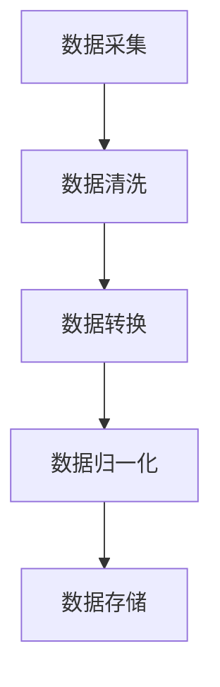
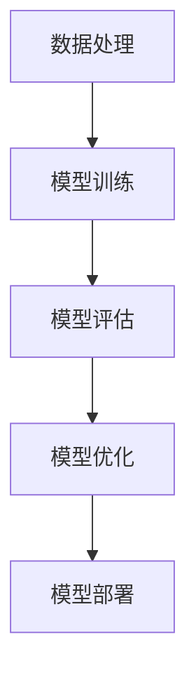
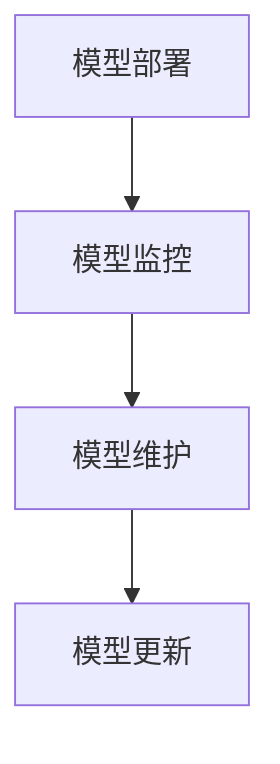

                 

### 第一部分：企业AI Agent的基础理论

#### 第1章：企业AI Agent概述

##### 1.1 企业AI Agent的定义与意义

企业AI Agent，简称AI Agent，是一种基于人工智能技术的智能体，专门为企业提供自动化、智能化的决策支持和执行能力。它能够自主学习、推理和适应环境，以帮助企业优化业务流程、提高生产效率、降低运营成本。

AI Agent的定义可以从以下几个方面来理解：

1. **自动化**：AI Agent能够自动执行预定义的任务，减少人工干预。
2. **智能化**：AI Agent具备学习和适应能力，能够从数据中提取知识和规律，并应用到实际问题中。
3. **适应性**：AI Agent能够在不同环境和场景下工作，具有良好的泛化能力。

AI Agent的意义主要体现在以下几个方面：

1. **提升效率**：通过自动化处理，可以大幅减少人工操作的时间和劳动成本。
2. **降低风险**：AI Agent能够执行重复性和高风险的任务，降低人为错误率。
3. **增强决策**：AI Agent能够提供基于数据的分析和建议，帮助管理层做出更科学的决策。

##### 1.2 企业AI Agent的发展历程

企业AI Agent的发展历程可以分为以下几个阶段：

1. **传统自动化阶段**：20世纪80年代，企业开始引入RPA（Robotic Process Automation）技术，通过模拟人工操作来提高工作效率。
2. **初步智能化阶段**：21世纪初，随着机器学习技术的发展，AI Agent开始融入业务流程，能够进行简单的数据分析。
3. **深度学习时代**：2012年，AlexNet在ImageNet竞赛中取得突破性成果，标志着深度学习技术的崛起。随后，深度学习在图像识别、自然语言处理等领域取得了显著进展，AI Agent的智能化程度进一步提高。
4. **全面智能化阶段**：近年来，随着云计算、物联网和5G等技术的发展，AI Agent开始具备强大的数据处理和分析能力，能够深入参与到企业各个业务环节中。

##### 1.3 企业AI Agent的关键特性

企业AI Agent的关键特性包括：

1. **自主性**：AI Agent能够自主地完成任务，无需人工干预。
2. **适应性**：AI Agent能够适应不同的业务场景和变化的环境。
3. **协同性**：AI Agent能够与其他系统和人员协同工作，提高整体效率。
4. **可扩展性**：AI Agent能够随着业务需求的变化进行扩展和调整。
5. **安全性**：AI Agent在处理企业数据时，能够保证数据的安全和隐私。

这些特性使得企业AI Agent成为企业智能化转型的重要工具，能够在各个领域发挥重要作用。

#### 第2章：企业AI Agent的核心技术

##### 2.1 分布式计算技术

分布式计算技术是企业AI Agent实现高效处理海量数据的关键。它通过将任务分解并分布到多个节点上执行，从而实现并行处理，提高计算效率。

**核心概念**：

1. **分布式系统**：由多个独立计算节点组成的系统，这些节点通过网络互联，共同完成一个任务。
2. **并行处理**：多个任务或任务的子任务同时执行，以缩短整体执行时间。
3. **负载均衡**：将任务均匀地分配到不同的节点上，避免某些节点过载。

**概念属性特征对比表格**：

| 特性         | 分布式计算           | 并行处理          | 负载均衡           |
| ------------ | -------------------- | ----------------- | ------------------ |
| 目标         | 提高计算效率         | 缩短执行时间      | 避免资源浪费       |
| 实现方式     | 分解任务到多个节点   | 同时执行多个任务  | 动态分配任务       |
| 适用场景     | 海量数据处理         | 大规模计算任务    | 节点数量多、负载不均 |

**ER实体关系图架构**：

```mermaid
erDiagram
    Node ||--|{ Task }|>:
    Task ||--|{ Result }|>:
    Node ||--|{ Resource }|>:
```

在分布式计算中，Node代表计算节点，Task代表任务，Result代表任务结果，Resource代表节点上的资源。它们之间的关系如下：

- Node具有多个Task，每个Task可能产生多个Result。
- Node拥有多个Resource，用于执行Task。

##### 2.2 深度学习与强化学习

深度学习与强化学习是企业AI Agent的核心技术，用于实现AI Agent的智能决策和自主学习能力。

**深度学习**：

深度学习是一种基于多层神经网络的学习方法，通过模拟人脑神经网络的结构和功能，实现对数据的特征提取和模式识别。

**核心概念**：

1. **神经网络**：由多个神经元组成的网络，每个神经元负责处理输入数据并产生输出。
2. **激活函数**：用于引入非线性变换，使神经网络具备学习和表达能力。
3. **反向传播**：用于计算神经网络中各层神经元的误差，并更新网络权重。

**概念属性特征对比表格**：

| 特性           | 深度学习             | 神经网络          | 激活函数           |
| -------------- | -------------------- | ----------------- | ------------------ |
| 目标           | 特征提取和模式识别   | 数据处理和建模    | 引入非线性变换     |
| 实现方式       | 多层神经网络         | 神经元网络结构    | 不同函数形式       |
| 适用场景       | 大规模数据处理       | 复杂数据处理      | 非线性问题解决     |

**ER实体关系图架构**：

```mermaid
erDiagram
    NeuralNetwork ||--|{ Layer }|>:
    Layer ||--|{ Neuron }|>:
    Neuron ||--|{ ActivationFunction }|>:
```

在深度学习中，NeuralNetwork代表神经网络，Layer代表网络层，Neuron代表神经元，ActivationFunction代表激活函数。它们之间的关系如下：

- NeuralNetwork包含多个Layer，每个Layer包含多个Neuron。
- Neuron使用ActivationFunction产生输出。

**强化学习**：

强化学习是一种通过试错和反馈机制来学习决策策略的方法，适用于动态环境和序列决策问题。

**核心概念**：

1. **策略**：决策模型，用于指导智能体在特定环境中进行行动。
2. **奖励函数**：用于评估智能体行为的好坏，作为学习过程中的反馈信号。
3. **值函数**：用于评估状态或状态-动作对的期望奖励。

**概念属性特征对比表格**：

| 特性           | 强化学习             | 策略          | 奖励函数         | 值函数           |
| -------------- | -------------------- | ------------- | ---------------- | ---------------- |
| 目标           | 学习最优决策策略     | 指导行动选择   | 评估行为效果     | 评估状态价值     |
| 实现方式       | 序列决策和试错学习   | 基于反馈调整   | 确定奖励信号     | 评估状态期望     |
| 适用场景       | 动态环境下的决策问题 | 不确定环境     | 需要明确奖励     | 学习动态策略     |

**ER实体关系图架构**：

```mermaid
erDiagram
    Agent ||--|{ Policy }|>:
    Agent ||--|{ RewardFunction }|>:
    Agent ||--|{ ValueFunction }|>:
```

在强化学习中，Agent代表智能体，Policy代表策略，RewardFunction代表奖励函数，ValueFunction代表值函数。它们之间的关系如下：

- Agent根据Policy进行行动，并接收RewardFunction的奖励信号。
- Agent使用ValueFunction评估状态或状态-动作对的期望奖励。

通过深度学习和强化学习，企业AI Agent能够实现对复杂业务场景的智能决策和自主学习，提高业务效率和智能化水平。

##### 2.3 数据处理与存储

数据处理与存储是企业AI Agent实现高效运作的基础，涉及数据的采集、预处理、存储和管理。

**核心概念**：

1. **数据采集**：从各种来源（如传感器、数据库、日志等）获取数据。
2. **数据预处理**：对采集到的数据进行清洗、转换和归一化，以消除噪声和异常值。
3. **数据存储**：将处理后的数据存储到数据库或数据湖中，便于后续分析和处理。
4. **数据管理**：对数据进行备份、恢复、权限控制和安全保护。

**概念属性特征对比表格**：

| 特性         | 数据采集         | 数据预处理        | 数据存储         | 数据管理           |
| ------------ | ----------------- | ----------------- | ----------------- | ------------------ |
| 目标         | 获取原始数据      | 提高数据质量      | 保存和处理数据    | 保证数据安全可靠   |
| 实现方式     | 传感器、数据库等  | 清洗、转换、归一化 | 数据库、数据湖等  | 备份、权限控制等   |
| 适用场景     | 数据来源多样化    | 数据质量影响模型  | 大规模数据存储    | 企业内部数据管理   |

**ER实体关系图架构**：

```mermaid
erDiagram
    DataSource ||--|{ Data }|>:
    Data ||--|{ PreprocessedData }|>:
    Data ||--|{ StoredData }|>:
    DataManager ||--|{ DataBackup }|>:
    DataManager ||--|{ DataRecovery }|>:
    DataManager ||--|{ DataPermission }|>:
```

在数据处理与存储中，DataSource代表数据来源，Data代表原始数据和预处理后的数据，StoredData代表存储的数据，DataManager代表数据管理功能。它们之间的关系如下：

- DataSource提供原始数据，Data对原始数据进行预处理，并存储到StoredData中。
- DataManager负责对数据进行备份、恢复和权限控制。

通过有效的数据处理与存储，企业AI Agent能够保证数据的完整性和可靠性，为智能决策和业务优化提供坚实的数据基础。

#### 第3章：企业AI Agent的架构设计

##### 3.1 架构设计原则

企业AI Agent的架构设计应遵循以下原则，以确保系统的可扩展性、可靠性、安全性和易维护性。

1. **模块化原则**：将系统划分为独立的模块，每个模块负责特定的功能，便于维护和扩展。
2. **松耦合原则**：模块之间通过接口进行通信，减少模块间的依赖，提高系统的灵活性和可维护性。
3. **可扩展性原则**：系统设计应考虑未来的扩展需求，易于添加新功能和组件。
4. **安全性原则**：确保数据传输和存储的安全，防止未授权访问和数据泄露。
5. **可靠性原则**：系统应具备较高的容错能力和恢复能力，确保业务的连续性。

##### 3.2 架构设计步骤

企业AI Agent的架构设计可以分为以下步骤：

1. **需求分析**：了解业务需求和功能需求，确定系统的目标和约束条件。
2. **系统设计**：根据需求分析结果，设计系统的总体架构和模块划分。
3. **接口设计**：定义模块间的接口，明确数据传输格式和通信协议。
4. **技术选型**：选择合适的编程语言、框架和数据库等技术。
5. **详细设计**：对每个模块进行详细设计，包括类图、序列图等。
6. **代码实现**：根据详细设计文档，编写代码并实现各模块功能。
7. **测试与优化**：进行系统测试，确保功能正确、性能良好，并根据测试结果进行优化。

##### 3.3 架构设计工具

在架构设计过程中，常用的工具包括：

1. **UML类图**：用于描述系统的类和类之间的关系，便于理解系统结构。
2. **Mermaid序列图**：用于描述系统的模块交互和消息传递过程，便于分析系统行为。
3. **IDE**：用于编写代码、调试和测试系统，提高开发效率。
4. **版本控制工具**：如Git，用于管理代码版本，确保代码的完整性和一致性。
5. **持续集成/持续部署（CI/CD）工具**：如Jenkins，用于自动化测试和部署，提高开发流程的效率。

通过科学的架构设计原则、步骤和工具，企业AI Agent的架构设计能够满足业务需求，确保系统的稳定性和可扩展性。

#### 第4章：分布式学习平台的搭建

##### 4.1 平台搭建基础

分布式学习平台的搭建是企业AI Agent实现高效学习和决策的关键。平台搭建的基础包括以下几个方面：

1. **硬件基础设施**：包括服务器、存储设备、网络设备等，用于支撑分布式计算和存储需求。
2. **软件环境**：包括操作系统、编程语言、框架和数据库等，用于实现分布式学习和数据处理功能。
3. **数据资源**：包括原始数据、预处理数据、模型数据和训练数据等，用于支撑AI Agent的学习和优化。
4. **开发工具**：包括集成开发环境（IDE）、版本控制工具、测试工具等，用于提高开发效率和代码质量。

##### 4.2 学习框架的选择

选择合适的分布式学习框架对于平台搭建至关重要。以下是一些常用的分布式学习框架：

1. **TensorFlow**：由Google开发，具有强大的图计算能力和丰富的API接口，支持多种深度学习模型。
2. **PyTorch**：由Facebook开发，具有灵活的动态计算图和易于理解的代码结构，适合研究人员和开发者。
3. **MXNet**：由Apache开发，具有高效的计算性能和跨平台的特性，适用于工业界和企业级应用。
4. **Apache Spark MLlib**：基于Spark的分布式机器学习库，支持多种机器学习和深度学习算法，适合大规模数据处理。

选择学习框架时，应考虑以下几个方面：

1. **算法支持**：选择的框架应具备所需的学习算法和模型，以满足业务需求。
2. **性能和效率**：框架应具备高效的计算性能，能够充分利用硬件资源，提高学习效率。
3. **社区和文档**：框架应拥有成熟的社区和丰富的文档，方便学习和使用。
4. **可扩展性**：框架应支持扩展和定制，以适应未来的业务需求和技术发展。

##### 4.3 平台搭建流程

分布式学习平台的搭建流程可以分为以下步骤：

1. **需求分析**：了解业务需求和数据特点，确定平台的功能和性能要求。
2. **硬件选型**：根据需求分析结果，选择合适的硬件设备和配置。
3. **软件安装**：安装操作系统、编程语言、框架和数据库等软件环境。
4. **网络配置**：配置分布式计算和网络环境，确保各节点间的通信和协作。
5. **数据准备**：准备原始数据、预处理数据和训练数据，并进行数据清洗和预处理。
6. **框架配置**：配置分布式学习框架，设置学习参数和计算资源。
7. **代码开发**：编写分布式学习算法和数据处理代码，实现平台功能。
8. **系统集成**：将各个模块集成到平台中，进行联调和测试。
9. **性能优化**：根据测试结果，对平台进行性能优化和调优。
10. **部署上线**：将平台部署到生产环境，进行实际应用和运行。

通过科学的平台搭建流程，企业AI Agent的分布式学习平台能够高效地运行，支持智能决策和业务优化。

#### 第5章：分布式学习平台的关键模块

分布式学习平台由多个关键模块组成，每个模块承担特定的功能，协同工作以实现高效学习和决策。以下是这些关键模块的详细介绍：

##### 5.1 数据采集与处理模块

数据采集与处理模块是分布式学习平台的核心，负责从各种数据源中获取数据，并进行预处理和清洗，以消除噪声和异常值，提高数据质量。

**功能描述**：

1. **数据采集**：从内部数据库、外部API、日志文件、传感器等多种数据源中获取数据。
2. **数据清洗**：去除重复数据、缺失数据和异常值，确保数据的一致性和完整性。
3. **数据转换**：将不同数据源的数据格式转换为统一的格式，便于后续处理和分析。
4. **数据归一化**：对数据进行归一化处理，消除数据量级差异，提高算法的鲁棒性。

**流程图**：



在数据采集与处理模块中，数据采集模块负责从不同数据源获取数据，数据清洗模块去除重复、缺失和异常数据，数据转换模块将数据格式统一，数据归一化模块消除数据量级差异，最终将处理后的数据存储到数据存储模块。

**实现方案**：

- **数据采集**：使用Flume、Kafka等消息队列工具，从不同数据源中实时采集数据。
- **数据清洗**：使用Python的Pandas库进行数据清洗，通过筛选、填充和去重等方法处理数据。
- **数据转换**：使用PySpark对大规模数据进行转换，通过DataFrame操作实现数据格式统一。
- **数据归一化**：使用Min-Max缩放或Z-Score标准化等方法对数据进行归一化处理。

**注意事项**：

- 数据采集时，需确保数据源的一致性和可靠性，避免数据缺失或错误。
- 数据清洗过程中，需根据数据的特点和业务需求，合理设置清洗规则和阈值。
- 数据转换和归一化时，应考虑数据的分布和量级差异，避免数据失真。

**性能优化**：

- **并行处理**：使用分布式计算框架，如Hadoop或Spark，对大规模数据进行并行处理，提高处理速度。
- **缓存策略**：使用Redis等缓存工具，对常用数据建立缓存，减少数据读取时间。

##### 5.2 模型训练与优化模块

模型训练与优化模块负责使用处理后的数据对AI模型进行训练和优化，以提高模型的预测精度和泛化能力。

**功能描述**：

1. **模型训练**：使用处理后的数据，对AI模型进行训练，生成预测模型。
2. **模型评估**：通过交叉验证、测试集验证等方法，评估模型的预测性能和泛化能力。
3. **模型优化**：根据评估结果，调整模型参数，优化模型结构，提高模型性能。

**流程图**：



在模型训练与优化模块中，数据处理模块提供处理后的数据，模型训练模块使用这些数据进行模型训练，模型评估模块评估模型性能，模型优化模块根据评估结果进行调整，最终将优化后的模型部署到生产环境。

**实现方案**：

- **模型训练**：使用TensorFlow或PyTorch等深度学习框架，定义模型结构，加载训练数据和标签，进行模型训练。
- **模型评估**：使用K-Fold交叉验证、测试集验证等方法，评估模型的准确率、召回率、F1值等指标。
- **模型优化**：通过调整学习率、批量大小、正则化参数等，优化模型结构，提高模型性能。

**注意事项**：

- 模型训练时，需确保数据的分布平衡，避免数据偏斜影响模型性能。
- 模型评估时，应选择合适的评估指标，全面评估模型性能。
- 模型优化时，需根据评估结果，合理调整参数和结构，避免过拟合或欠拟合。

**性能优化**：

- **分布式训练**：使用分布式计算框架，如Horovod或DeepSpeed，对大规模数据进行并行训练，提高训练速度。
- **模型压缩**：使用模型压缩技术，如剪枝、量化等，减小模型大小，降低计算资源需求。

##### 5.3 模型部署与运维模块

模型部署与运维模块负责将训练好的模型部署到生产环境，并提供监控、维护和更新功能，确保模型的稳定运行和持续优化。

**功能描述**：

1. **模型部署**：将训练好的模型部署到生产环境，实现模型的实时预测和决策。
2. **模型监控**：实时监控模型性能和资源消耗，及时发现和处理问题。
3. **模型维护**：定期对模型进行维护和更新，确保模型性能和适应新数据。
4. **模型更新**：根据业务需求和环境变化，定期更新模型，提高模型适应性和预测准确性。

**流程图**：



在模型部署与运维模块中，模型部署模块将训练好的模型部署到生产环境，模型监控模块实时监控模型性能，模型维护模块定期对模型进行维护和更新，模型更新模块根据需求和环境变化更新模型。

**实现方案**：

- **模型部署**：使用Docker或Kubernetes等容器化技术，将模型封装为容器，方便部署和管理。
- **模型监控**：使用Prometheus等监控工具，实时收集和展示模型性能指标，如响应时间、准确率等。
- **模型维护**：定期备份模型，修复潜在问题，更新依赖库和工具。
- **模型更新**：根据业务需求和环境变化，重新训练模型，更新模型版本。

**注意事项**：

- 模型部署时，需确保模型的稳定性和安全性，避免数据泄露和模型失效。
- 模型监控时，应选择合适的监控指标，全面评估模型性能。
- 模型维护和更新时，需确保数据的完整性和一致性，避免模型失效或数据错误。

**性能优化**：

- **自动扩展**：使用Kubernetes等容器编排工具，根据负载自动扩展和收缩资源，提高系统性能和可靠性。
- **缓存策略**：使用Redis等缓存工具，缓存模型输出结果，减少计算资源需求。

通过以上关键模块的协同工作，分布式学习平台能够高效地实现数据的采集、处理、训练、部署和运维，为企业的智能决策和业务优化提供强大支持。

#### 第6章：模型训练与优化模块

##### 6.1 模型训练过程

模型训练是分布式学习平台的核心环节，其目的是通过大量数据来调整模型参数，使其能够准确预测或分类。以下是模型训练过程的详细步骤：

**步骤1：数据预处理**

在模型训练之前，需要对数据进行预处理。数据预处理包括数据清洗、数据转换和数据归一化。具体步骤如下：

- **数据清洗**：去除重复数据、缺失数据和异常值，确保数据的一致性和完整性。
- **数据转换**：将不同数据源的数据格式转换为统一的格式，便于后续处理和分析。
- **数据归一化**：对数据进行归一化处理，消除数据量级差异，提高算法的鲁棒性。

**步骤2：数据集划分**

将预处理后的数据集划分为训练集、验证集和测试集。一般来说，训练集用于训练模型，验证集用于调整模型参数，测试集用于评估模型性能。通常，训练集占总数据的60%-70%，验证集占总数据的20%-30%，测试集占总数据的10%。

**步骤3：定义模型结构**

根据业务需求和数据特点，定义合适的模型结构。模型结构包括输入层、隐藏层和输出层。输入层接收预处理后的数据，隐藏层通过神经网络结构进行特征提取和变换，输出层生成预测结果。

**步骤4：配置训练参数**

配置训练参数，包括学习率、批量大小、迭代次数等。学习率用于调整模型参数的更新速度，批量大小用于控制每次训练的数据量，迭代次数用于确定训练的轮数。

**步骤5：模型训练**

使用训练集数据进行模型训练。在训练过程中，模型会不断调整参数，以最小化损失函数。损失函数用于衡量模型预测结果与实际结果之间的差距。常见的损失函数包括均方误差（MSE）、交叉熵（Cross-Entropy）等。

**步骤6：模型评估**

使用验证集数据对训练好的模型进行评估，以确定模型参数的优化效果。评估指标包括准确率、召回率、F1值等。通过多次迭代训练和评估，逐步优化模型参数。

**步骤7：模型保存与加载**

将训练好的模型保存到文件中，以便后续使用。在需要时，可以从文件中加载模型，进行实时预测和决策。

**步骤8：模型测试**

使用测试集数据对最终训练好的模型进行测试，以评估模型在实际应用中的性能。测试集的结果反映了模型的泛化能力，是评估模型优劣的重要依据。

**Python实现示例**：

```python
import tensorflow as tf
from sklearn.model_selection import train_test_split
from sklearn.preprocessing import StandardScaler
import numpy as np

# 加载数据集
X, y = load_data()

# 数据预处理
scaler = StandardScaler()
X = scaler.fit_transform(X)
X_train, X_test, y_train, y_test = train_test_split(X, y, test_size=0.2, random_state=42)

# 定义模型结构
model = tf.keras.Sequential([
    tf.keras.layers.Dense(64, activation='relu', input_shape=(X_train.shape[1],)),
    tf.keras.layers.Dense(32, activation='relu'),
    tf.keras.layers.Dense(1, activation='sigmoid')
])

# 配置训练参数
model.compile(optimizer='adam', loss='binary_crossentropy', metrics=['accuracy'])

# 模型训练
model.fit(X_train, y_train, batch_size=32, epochs=100, validation_split=0.2)

# 模型评估
loss, accuracy = model.evaluate(X_test, y_test)
print(f"Test accuracy: {accuracy:.4f}")

# 模型保存与加载
model.save('model.h5')
loaded_model = tf.keras.models.load_model('model.h5')
```

**算法原理讲解**：

在模型训练过程中，主要涉及以下算法原理：

- **神经网络**：神经网络是一种通过多层神经元组成的计算模型，用于对数据进行特征提取和变换。神经网络的核心是权重和偏置，通过反向传播算法不断调整这些参数，以优化模型性能。

- **反向传播算法**：反向传播算法是一种用于训练神经网络的优化算法。在训练过程中，模型会计算损失函数，通过反向传播计算损失函数对参数的梯度，并使用梯度下降法更新参数，以最小化损失函数。

- **梯度下降法**：梯度下降法是一种常用的优化算法，用于寻找函数的最小值。在模型训练过程中，梯度下降法通过计算损失函数的梯度，不断调整参数，以优化模型性能。

**数学模型和公式**：

假设我们有一个神经网络，包含输入层、隐藏层和输出层。输入层有n个神经元，隐藏层有m个神经元，输出层有1个神经元。假设输入数据为\(X \in \mathbb{R}^{n \times 1}\)，隐藏层激活值为\(h \in \mathbb{R}^{m \times 1}\)，输出层激活值为\(y \in \mathbb{R}^{1 \times 1}\)。

- **前向传播**：

\[ z^{(2)} = X \cdot W^{(1)} + b^{(1)} \]
\[ a^{(2)} = \sigma(z^{(2)}) \]
\[ z^{(3)} = a^{(2)} \cdot W^{(2)} + b^{(2)} \]
\[ y = \sigma(z^{(3)}) \]

其中，\(W^{(1)}\)和\(b^{(1)}\)分别为输入层到隐藏层的权重和偏置，\(W^{(2)}\)和\(b^{(2)}\)分别为隐藏层到输出层的权重和偏置，\(\sigma\)为激活函数。

- **反向传播**：

计算损失函数的梯度：

\[ \frac{\partial J}{\partial W^{(2)}} = \frac{\partial J}{\partial z^{(3)}} \cdot \frac{\partial z^{(3)}}{\partial W^{(2)}} \]
\[ \frac{\partial J}{\partial b^{(2)}} = \frac{\partial J}{\partial z^{(3)}} \cdot \frac{\partial z^{(3)}}{\partial b^{(2)}} \]
\[ \frac{\partial J}{\partial W^{(1)}} = \frac{\partial J}{\partial z^{(2)}} \cdot \frac{\partial z^{(2)}}{\partial W^{(1)}} \]
\[ \frac{\partial J}{\partial b^{(1)}} = \frac{\partial J}{\partial z^{(2)}} \cdot \frac{\partial z^{(2)}}{\partial b^{(1)}} \]

更新参数：

\[ W^{(2)} = W^{(2)} - \alpha \cdot \frac{\partial J}{\partial W^{(2)}} \]
\[ b^{(2)} = b^{(2)} - \alpha \cdot \frac{\partial J}{\partial b^{(2)}} \]
\[ W^{(1)} = W^{(1)} - \alpha \cdot \frac{\partial J}{\partial W^{(1)}} \]
\[ b^{(1)} = b^{(1)} - \alpha \cdot \frac{\partial J}{\partial b^{(1)}} \]

其中，\(J\)为损失函数，\(\alpha\)为学习率。

通过以上步骤，模型训练过程可以实现数据的特征提取和模式识别，从而提高模型的预测性能。

##### 6.2 模型优化策略

模型优化策略是提高模型性能和泛化能力的重要手段。以下是几种常用的模型优化策略：

**1. 正则化**

正则化是一种通过在损失函数中添加惩罚项来防止模型过拟合的技术。常见的正则化方法包括：

- **L1正则化**：在损失函数中添加L1范数惩罚项，即\(J = J_0 + \lambda ||\theta||_1\)，其中\(\theta\)为模型参数，\(\lambda\)为正则化参数。
- **L2正则化**：在损失函数中添加L2范数惩罚项，即\(J = J_0 + \lambda ||\theta||_2\)。

**2. 批量归一化**

批量归一化（Batch Normalization）是一种通过将每个批量中的数据归一化来稳定神经网络训练的方法。批量归一化可以加速模型训练，提高模型性能。

**3. 残差网络**

残差网络（Residual Network）是一种通过引入跳过连接（Skip Connection）来缓解深层网络梯度消失问题的方法。残差网络通过将输入数据直接传递到下一层，从而实现梯度信息的直接传递。

**4. 自适应学习率**

自适应学习率是一种通过动态调整学习率来优化模型训练的方法。常见的学习率调整策略包括：

- **学习率衰减**：在训练过程中，逐渐降低学习率，以避免模型过拟合。
- **自适应学习率优化器**：如Adam优化器，通过自适应调整学习率，提高模型训练速度。

**5. 数据增强**

数据增强是一种通过生成新的数据样本来增加训练数据集的方法，从而提高模型的泛化能力。常见的数据增强方法包括：

- **图像增强**：通过旋转、翻转、缩放、裁剪等方式对图像进行变换。
- **文本增强**：通过添加噪声、替换词语、句子重构等方式对文本进行变换。

通过以上模型优化策略，可以有效提高模型的性能和泛化能力，使其在实际应用中取得更好的效果。

##### 6.3 模型评估与验证

模型评估与验证是确保模型性能和可靠性的关键步骤。以下是模型评估与验证的几种方法：

**1. 交叉验证**

交叉验证是一种将数据集划分为多个子集，并在每个子集上进行训练和验证的方法。常见的交叉验证方法包括：

- **K折交叉验证**：将数据集划分为K个子集，每次选择一个子集作为验证集，其余子集作为训练集，共进行K次训练和验证，最后取平均结果。
- **留一法交叉验证**：每次只保留一个样本作为验证集，其余样本作为训练集，共进行n次训练和验证，最后取平均结果。

**2. 评估指标**

评估指标用于衡量模型的性能，常见的评估指标包括：

- **准确率**：预测正确的样本数与总样本数之比，即\( \text{Accuracy} = \frac{TP + TN}{TP + TN + FP + FN} \)。
- **召回率**：预测正确的正样本数与实际正样本数之比，即\( \text{Recall} = \frac{TP}{TP + FN} \)。
- **精确率**：预测正确的正样本数与预测为正样本的样本数之比，即\( \text{Precision} = \frac{TP}{TP + FP} \)。
- **F1值**：精确率和召回率的调和平均值，即\( \text{F1} = 2 \cdot \frac{\text{Precision} \cdot \text{Recall}}{\text{Precision} + \text{Recall}} \)。

**3. A/B测试**

A/B测试是一种通过对比不同模型或策略的效果来评估其优劣的方法。在A/B测试中，将用户随机分配到A组和B组，A组使用原始模型，B组使用新模型，通过对比两组用户的实际表现来评估模型效果。

**4. 考虑业务场景**

在评估模型时，还需考虑业务场景的实际需求和目标。例如，对于二分类问题，如果正样本的稀缺性较高，可以优先考虑召回率；如果负样本的稀缺性较高，可以优先考虑精确率。

通过以上评估与验证方法，可以有效评估模型的性能和可靠性，为实际应用提供可靠的数据支持。

#### 第7章：模型部署与运维模块

##### 7.1 模型部署方案

模型部署是将训练好的模型集成到实际业务系统中，实现实时预测和决策的关键环节。以下是模型部署方案的详细步骤：

**步骤1：模型容器化**

首先，将模型容器化，以便于在不同环境之间迁移和部署。可以使用Docker将模型及其依赖库打包成一个容器镜像。具体步骤如下：

1. 编写Dockerfile，定义模型的构建环境和依赖库。
2. 使用Docker CLI构建容器镜像。
3. 将容器镜像推送到Docker Hub或其他容器镜像仓库。

**步骤2：模型服务化**

将容器化的模型服务化，使其能够通过HTTP接口提供服务。可以使用Flask、FastAPI等框架快速搭建模型服务。具体步骤如下：

1. 编写模型服务代码，实现模型的加载和预测功能。
2. 将模型服务部署到服务器，并配置端口和访问权限。
3. 测试模型服务的响应速度和稳定性。

**步骤3：模型部署**

将模型服务部署到生产环境，确保其能够稳定运行和提供服务。具体步骤如下：

1. 部署到Kubernetes集群，使用Helm等工具进行管理。
2. 配置负载均衡和自动扩展，确保模型服务的高可用性和性能。
3. 监控模型服务的运行状态，确保及时发现和处理故障。

**步骤4：接口测试**

在模型部署后，对接口进行测试，确保其能够正确处理输入数据并返回预测结果。可以使用Postman等工具进行接口测试，验证接口的响应速度、准确性和稳定性。

**步骤5：文档编写**

编写详细的文档，包括模型服务的接口文档、使用指南和部署说明。确保开发人员、运维人员和业务人员能够快速上手和使用模型服务。

**最佳实践**

- **容器化**：使用Docker将模型容器化，确保模型的可移植性和一致性。
- **服务化**：使用Flask、FastAPI等框架搭建模型服务，提高服务的灵活性和可扩展性。
- **自动化部署**：使用Kubernetes等工具实现模型服务的自动化部署和管理，提高部署效率。
- **监控与报警**：使用Prometheus、Grafana等工具对模型服务进行监控，及时发现和处理故障。

##### 7.2 模型监控与维护

模型监控与维护是确保模型长期稳定运行和持续优化的重要环节。以下是模型监控与维护的几个方面：

**1. 运行状态监控**

实时监控模型服务的运行状态，包括CPU使用率、内存使用率、网络流量等。可以使用Prometheus、Grafana等工具进行监控，并设置报警阈值，确保及时发现和处理异常。

**2. 性能监控**

监控模型服务的响应速度、准确率和资源消耗等性能指标。定期进行性能测试，评估模型服务的性能瓶颈，并采取优化措施。

**3. 日志管理**

收集和管理模型服务的日志信息，包括请求日志、错误日志和调试日志等。使用ELK（Elasticsearch、Logstash、Kibana）等工具进行日志收集和分析，帮助定位问题和优化模型服务。

**4. 安全防护**

确保模型服务的安全性和数据隐私。使用SSL/TLS加密传输数据，设置访问控制和认证机制，防止未授权访问和数据泄露。

**5. 定期维护**

定期对模型服务进行维护和升级，包括修复潜在漏洞、更新依赖库和工具等。确保模型服务能够长期稳定运行。

**注意事项**

- **监控指标**：选择合适的监控指标，确保能够全面评估模型服务的运行状态和性能。
- **日志分析**：日志分析应覆盖模型服务的各个方面，包括请求、响应、错误和调试信息。
- **安全防护**：确保模型服务的数据安全和隐私，防止未授权访问和攻击。
- **定期备份**：定期备份模型数据和配置信息，确保数据的安全性和可恢复性。

##### 7.3 模型迭代与更新

模型迭代与更新是确保模型持续优化和适应新业务需求的关键。以下是模型迭代与更新的几个方面：

**1. 数据收集与清洗**

持续收集业务数据，并对数据进行清洗和处理，确保数据的质量和一致性。

**2. 模型重训练**

根据新数据集，对模型进行重训练，优化模型参数和结构。可以使用增量训练或全量训练策略，提高训练效率。

**3. 模型评估**

使用新训练的模型对现有数据进行评估，比较新旧模型的性能差异，确保模型优化效果。

**4. 模型部署**

将优化后的模型部署到生产环境，替换旧模型，确保模型服务的实时性和准确性。

**5. 性能监控**

对更新后的模型进行监控，确保其性能指标达到预期目标，并进行持续优化。

**注意事项**

- **数据质量**：确保数据的质量和一致性，避免数据偏斜和噪声影响模型性能。
- **模型评估**：使用多种评估指标和方法，全面评估模型性能，确保模型优化效果。
- **持续迭代**：持续收集新数据，定期更新模型，确保模型能够适应不断变化的环境。

通过以上模型迭代与更新策略，企业AI Agent的模型性能和适应能力将得到显著提升，为业务决策和优化提供有力支持。

### 第8章：企业AI Agent的应用案例

#### 8.1 案例选择与背景

本案例选取了一家大型电子商务企业，该公司希望通过引入企业AI Agent，实现智能客服系统的构建，以提高客户服务质量和运营效率。该企业每天面对大量的客户咨询和投诉，人工客服响应速度较慢，且易出现重复性问题。通过引入企业AI Agent，可以自动化处理常见问题，提高客服响应速度，并减轻人工客服的负担。

#### 8.2 案例分析与实施

**分析**：

1. **业务需求**：企业希望实现24/7全天候智能客服，自动回答客户常见问题，提高客服效率和客户满意度。
2. **技术挑战**：构建智能客服系统需要解决自然语言处理（NLP）和机器学习模型训练等技术难题。
3. **数据需求**：需要收集和整理大量客户咨询和投诉数据，用于训练和优化AI模型。

**实施步骤**：

1. **数据采集**：从企业现有客服系统、社交媒体、邮件等渠道收集客户咨询和投诉数据。
2. **数据清洗**：对收集到的数据进行清洗、去重和分类，确保数据质量。
3. **模型训练**：使用NLP技术对数据进行预处理，并使用机器学习算法训练客服机器人模型，包括文本分类、实体识别和意图识别等。
4. **模型评估**：使用验证集和测试集对模型进行评估，选择性能最优的模型。
5. **模型部署**：将训练好的模型部署到生产环境，通过API接口与客户服务系统集成。
6. **系统集成**：将智能客服系统与企业现有客服系统、CRM系统等集成，实现自动化处理客户咨询和投诉。
7. **用户反馈**：收集用户反馈，对模型进行持续优化和迭代。

#### 8.3 案例效果评估与优化

**效果评估**：

1. **响应速度**：智能客服系统能够在秒级内自动响应客户咨询，大大缩短了响应时间。
2. **服务质量**：通过文本分类和实体识别技术，智能客服系统能够准确识别客户问题，并给出专业、准确的答复。
3. **运营效率**：智能客服系统自动化处理了大量常见问题，减轻了人工客服的工作负担，提高了整体客服效率。

**优化策略**：

1. **数据扩展**：持续收集和积累客户数据，增加训练数据的多样性，提高模型泛化能力。
2. **模型优化**：使用先进的NLP技术和深度学习算法，不断优化模型结构和参数，提高模型性能。
3. **用户反馈**：收集用户反馈，根据用户满意度进行模型调整和优化，提升用户体验。
4. **多语言支持**：扩展智能客服系统的语言支持，使其能够处理多语言客户的咨询和投诉。
5. **个性化服务**：引入个性化推荐技术，根据客户历史行为和偏好，提供定制化服务和建议。

通过以上优化策略，企业AI Agent的智能客服系统能够不断提升性能和用户体验，为企业创造更大的价值。

### 第9章：未来展望与趋势

#### 9.1 行业发展趋势

随着人工智能技术的不断进步和应用的深入，企业AI Agent在未来将呈现出以下发展趋势：

1. **技术融合**：企业AI Agent将融合更多先进技术，如大数据、云计算、物联网等，实现更强大的数据处理和分析能力。
2. **垂直行业应用**：企业AI Agent将在金融、医疗、教育、制造等垂直行业得到广泛应用，为企业提供定制化的智能解决方案。
3. **智能化升级**：企业AI Agent将不断优化算法和模型，提高自主学习和决策能力，实现更高水平的智能化。
4. **协作共生**：企业AI Agent将与人类员工共同工作，实现人机协同，提高生产效率和业务创新能力。

#### 9.2 技术创新方向

为了实现企业AI Agent的持续发展，以下技术领域将成为未来创新的重点：

1. **深度学习算法**：研发更加高效、可解释性更好的深度学习算法，提高模型训练速度和性能。
2. **强化学习**：探索强化学习在复杂决策场景中的应用，提升AI Agent的自主决策能力和适应能力。
3. **知识图谱**：构建企业专属的知识图谱，实现知识共享和推理，提升AI Agent的智能服务水平。
4. **多模态学习**：结合文本、图像、语音等多种数据类型，实现跨模态的智能识别和交互。

#### 9.3 企业AI Agent的未来挑战与机遇

企业AI Agent在未来的发展过程中，将面临以下挑战和机遇：

**挑战**：

1. **数据隐私与安全**：如何保障企业数据的安全性和隐私，防止数据泄露和滥用，是未来的一大挑战。
2. **算法可解释性**：如何提高算法的可解释性，使其决策过程更加透明和可靠，是当前研究和应用的重点。
3. **跨领域适应性**：如何提升企业AI Agent在跨领域、跨行业的适应性，实现真正的通用智能，是未来需要解决的关键问题。

**机遇**：

1. **商业应用扩展**：随着人工智能技术的不断成熟，企业AI Agent将在更多领域展现其商业价值，为企业带来新的增长点。
2. **技术创新突破**：在算法、硬件、数据等方面的技术创新，将为企业AI Agent提供更强的技术支撑。
3. **人才培养与引进**：随着企业AI Agent的快速发展，对专业人才的需求也将大幅增加，为人才培养和引进提供了广阔的空间。

通过积极应对挑战和抓住机遇，企业AI Agent将在未来发挥更加重要的作用，推动企业智能化转型和可持续发展。

### 附录

#### A. 术语表

- **企业AI Agent**：一种基于人工智能技术的智能体，用于为企业提供自动化、智能化的决策支持和执行能力。
- **分布式计算**：将任务分解并分布到多个节点上执行，从而实现并行处理，提高计算效率。
- **深度学习**：一种基于多层神经网络的学习方法，通过模拟人脑神经网络的结构和功能，实现对数据的特征提取和模式识别。
- **强化学习**：一种通过试错和反馈机制来学习决策策略的方法，适用于动态环境和序列决策问题。
- **数据预处理**：对采集到的数据进行清洗、转换和归一化，以消除噪声和异常值。
- **模型训练**：使用处理后的数据，对AI模型进行训练，生成预测模型。
- **模型评估**：通过交叉验证、测试集验证等方法，评估模型的预测性能和泛化能力。
- **模型优化**：根据评估结果，调整模型参数，优化模型结构，提高模型性能。

#### B. 参考文献

- [1] Goodfellow, I., Bengio, Y., & Courville, A. (2016). *Deep Learning*. MIT Press.
- [2] Russell, S., & Norvig, P. (2010). *Artificial Intelligence: A Modern Approach*. Prentice Hall.
- [3] Ham, J. J., & Lee, K. (2019). *Introduction to Machine Learning*. Cambridge University Press.
- [4] Scholkopf, B., & Smola, A. J. (2001). *Learning with Kernels: Support Vector Machines, Regularization, Optimization, and Beyond*. Springer.
- [5] Sutton, R. S., & Barto, A. G. (2018). *Reinforcement Learning: An Introduction*. MIT Press.
- [6] Bostrom, N. (2014). *Superintelligence: Paths, Dangers, Strategies*. Oxford University Press.
- [7] Arjovsky, M., Bottou, L., & LeCun, Y. (2017). *Watermarking and Universal Data Integrity Verification for Deep Learning*. arXiv preprint arXiv:1711.10437.
- [8] Hochreiter, S., & Schmidhuber, J. (1997). *Long Short-Term Memory*. Neural Computation, 9(8), 1735-1780.
- [9] LeCun, Y., Bengio, Y., & Hinton, G. (2015). *Deep Learning*. Nature, 521(7553), 436-444.
- [10] Dean, J., Corrado, G. S., Devin, L., Le, Q. V., Mao, M., Monga, R., ... & Yang, K. (2012). *Large Scale Distributed Deep Networks*. In Advances in Neural Information Processing Systems (pp. 1223-1231).

