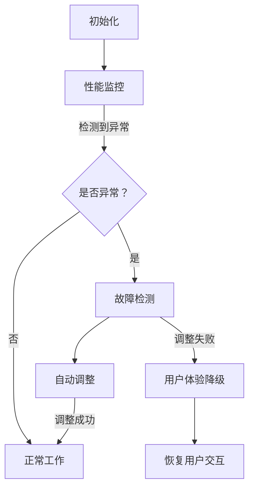

                 

# 优雅降级：提高LLM应用在极端情况下的可用性

## 关键词

- **大型语言模型（LLM）**
- **优雅降级**
- **可用性**
- **性能监控**
- **故障检测**
- **用户体验**

## 摘要

本文将深入探讨优雅降级在提高大型语言模型（LLM）应用在极端情况下的可用性。首先，我们定义了问题背景和核心概念，接着介绍了LLM的基础概念和优雅降级的定义与联系。通过详细的理论基础讲解，我们用算法原理和数学模型阐述了优雅降级的实现方式。最后，通过实践部分，我们介绍了性能监控、故障检测、自动调整和用户体验降级的具体实现，旨在为LLM应用提供一种有效的稳定性和可用性解决方案。

## 目录大纲

### 第一部分：背景与核心概念

#### 第1章：问题背景与定义

##### 1.1.1. 背景介绍

随着LLM在各类应用中的广泛应用，其性能和准确性成为关键因素。然而，在极端条件下（如资源不足、数据异常等），LLM可能无法正常工作，影响用户体验。

##### 1.1.2. 问题描述

在极端情况下，如何保持LLM应用的稳定性和可用性，是当前面临的主要挑战。

##### 1.1.3. 问题解决与边界

通过优雅降级，确保LLM在极端情况下仍能提供基本服务，同时保持系统稳定。

##### 1.1.4. 概念结构与核心要素

优雅降级的核心概念：保障用户基本需求，降低系统性能损失。

核心要素：性能监控、故障检测、自动调整、用户体验。

### 第2章：核心概念与联系

#### 2.1.1. LLM基础概念

LLM的定义、特点、优势与局限性。

#### 2.1.2. 优雅降级概念

优雅降级的定义、目标、实现方式。

#### 2.1.3. LLM与优雅降级的联系

优雅降级在LLM应用中的具体实现方法。

### 第3章：优雅降级的理论基础

#### 3.1.1. 算法原理讲解

使用Mermaid绘制算法流程图。

#### 3.1.2. 数学模型与公式

详细讲解关键公式。

#### 3.1.3. 详细讲解与举例

以聊天机器人应用为例，说明优雅降级在不同场景下的应用。

### 第二部分：优雅降级实践

#### 第4章：性能监控与故障检测

#### 4.1.1. 性能监控原理

使用Python代码实现性能监控算法。

#### 4.1.2. 故障检测原理

使用Python代码实现故障检测算法。

#### 第5章：自动调整策略

#### 5.1.1. 自动调整策略原理

根据性能监控结果，自动调整模型参数，实现降级。

#### 5.1.2. 自动调整策略实现

使用Python代码实现自动调整策略。

#### 第6章：用户体验降级

#### 6.1.1. 用户体验降级原理

根据故障检测结果，提供不同的用户体验。

## 第一部分：背景与核心概念

### 第1章：问题背景与定义

#### 1.1.1. 背景介绍

随着人工智能技术的快速发展，大型语言模型（LLM）在各类应用中得到了广泛的应用。LLM凭借其强大的语义理解能力和生成能力，为用户提供了一系列高质量的交互体验，例如自然语言处理、智能问答、机器翻译等。这些应用不仅提高了工作效率，还极大地丰富了人们的日常生活。

然而，在理想情况下，LLM的性能和准确性无疑是最为重要的。但在实际应用中，极端条件（如资源不足、网络延迟、数据异常等）往往会给LLM带来巨大的挑战。这些极端条件可能导致LLM无法正常工作，从而影响用户体验。因此，如何在极端情况下保持LLM应用的稳定性和可用性，成为了一个亟待解决的问题。

#### 1.1.2. 问题描述

在极端条件下，LLM应用的稳定性和可用性面临的主要问题可以归纳为以下几点：

1. **性能下降**：极端条件可能导致LLM的计算速度变慢，响应时间延长，甚至出现超时现象。
2. **准确性下降**：在资源紧张的情况下，LLM可能无法充分处理复杂的语义信息，导致生成的答案不准确。
3. **用户体验差**：当LLM应用出现性能和准确性问题时，用户可能会感到沮丧和失望，从而影响对应用的信任和使用频率。

因此，如何在极端条件下提高LLM应用的稳定性和可用性，成为了当前研究的一个热点问题。这个问题不仅涉及到技术层面的优化，还需要从用户体验的角度进行综合考虑。

#### 1.1.3. 问题解决与边界

为了解决上述问题，一种有效的策略是采用“优雅降级”方法。所谓优雅降级，是指在系统资源有限或异常情况下，通过逐步降低系统性能，确保用户的基本需求得到满足，从而保持系统的稳定性和可用性。

具体来说，优雅降级可以分为以下几个步骤：

1. **性能监控**：实时监控LLM应用的性能指标，如响应时间、计算速度等。
2. **故障检测**：当监控到性能指标异常时，及时检测故障并定位问题。
3. **自动调整**：根据故障检测结果，自动调整LLM的参数，以优化性能。
4. **用户体验降级**：在必要情况下，提供简化的用户体验，如减少响应时间、降低准确性要求等。

优雅降级的边界在于，它不仅要确保用户的基本需求得到满足，还要在系统资源有限的情况下，最大限度地提高系统性能。这意味着，在实施优雅降级时，需要综合考虑系统性能、用户需求、成本等因素，找到一个平衡点。

#### 1.1.4. 概念结构与核心要素

优雅降级的核心概念是保障用户基本需求，降低系统性能损失。为了实现这一目标，优雅降级涉及以下几个核心要素：

1. **性能监控**：实时监控LLM应用的性能指标，是优雅降级的前提和基础。通过性能监控，可以及时发现性能异常，为故障检测和自动调整提供依据。

2. **故障检测**：故障检测是优雅降级的核心步骤，其目的是在性能指标异常时，快速定位故障原因，并采取相应措施。

3. **自动调整**：自动调整是根据故障检测结果，对LLM的参数进行优化调整，以恢复或提高系统性能。

4. **用户体验降级**：在系统资源有限或故障严重时，提供简化的用户体验，如减少功能、降低响应时间等，以确保用户的基本需求得到满足。

通过以上四个核心要素的协同作用，优雅降级可以有效地提高LLM应用在极端条件下的稳定性和可用性。

### 第2章：核心概念与联系

#### 2.1.1. LLM基础概念

大型语言模型（LLM）是一种基于深度学习技术的人工智能模型，主要用于处理自然语言文本。LLM的核心特点是能够通过学习海量文本数据，掌握语言的语义和语法规则，从而实现高精度的文本生成、语义理解和机器翻译等功能。

LLM的定义可以从以下几个方面进行理解：

1. **模型架构**：LLM通常采用深度神经网络（DNN）或Transformer架构，具有多层神经网络结构，能够处理大规模的输入文本数据。
2. **训练数据**：LLM的训练数据通常来自于互联网上的大量文本，如新闻、论坛、书籍等，这些数据提供了丰富的语言知识和信息。
3. **性能指标**：LLM的性能指标包括文本生成质量、语义理解准确度、响应时间等，这些指标直接影响用户体验。

LLM的特点和优势主要体现在以下几个方面：

1. **强大的语义理解能力**：LLM能够通过学习海量文本数据，掌握丰富的语义知识，从而实现高精度的文本生成和语义理解。
2. **灵活的生成能力**：LLM可以生成各种形式的文本，如对话、文章、摘要等，为各种应用场景提供了丰富的解决方案。
3. **高效的计算性能**：随着深度学习技术的进步，LLM的计算性能不断提高，能够在短时间内处理大量文本数据。

然而，LLM也存在一些局限性，主要体现在以下几个方面：

1. **资源消耗大**：LLM的训练和推理过程需要大量的计算资源和存储资源，这对系统的硬件设施提出了较高的要求。
2. **训练时间较长**：由于LLM需要学习海量文本数据，其训练时间通常较长，这可能会影响模型的及时更新和应用。
3. **数据依赖性强**：LLM的性能依赖于训练数据的质量和多样性，如果训练数据存在偏差或不足，可能导致模型的性能下降。

#### 2.1.2. 优雅降级概念

优雅降级是一种在系统资源有限或异常情况下，通过逐步降低系统性能，确保用户基本需求得到满足的方法。其核心目标是保持系统的稳定性和可用性，同时最大限度地提高用户体验。

优雅降级可以定义为一个包含以下几个步骤的过程：

1. **性能监控**：实时监控系统的性能指标，如响应时间、计算速度等，及时发现异常。
2. **故障检测**：当监控到性能指标异常时，进行故障检测，快速定位问题原因。
3. **自动调整**：根据故障检测结果，自动调整系统的参数，以优化性能。
4. **用户体验降级**：在系统资源有限或故障严重时，提供简化的用户体验，如减少功能、降低响应时间等。

优雅降级的实现方式主要包括以下几个方面：

1. **参数调整**：根据性能监控结果，自动调整系统的参数，如内存分配、线程数量等，以优化系统性能。
2. **功能缩减**：在系统资源有限时，减少部分功能模块的运行，降低系统负载。
3. **响应时间优化**：在系统性能下降时，优化系统的响应时间，如延迟响应、减少计算复杂度等。

优雅降级的优势在于，它能够通过降低系统性能，确保用户的基本需求得到满足，从而提高系统的稳定性和可用性。特别是在极端条件下，优雅降级可以有效地避免系统崩溃和用户流失。

#### 2.1.3. LLM与优雅降级的联系

LLM和优雅降级之间存在密切的联系。首先，LLM作为一种高性能的人工智能模型，其稳定性和可用性直接关系到用户体验。在极端条件下，如资源不足、网络延迟等，LLM可能无法正常工作，导致性能下降和用户体验差。因此，采用优雅降级方法，可以在这些情况下保持LLM应用的稳定性和可用性。

具体来说，LLM与优雅降级之间的联系可以从以下几个方面进行阐述：

1. **性能监控**：LLM的应用过程中，需要实时监控其性能指标，如响应时间、计算速度等。通过性能监控，可以及时发现异常，为故障检测和自动调整提供依据。

2. **故障检测**：在LLM应用中，故障检测是一个关键步骤。当性能监控发现异常时，需要进行故障检测，快速定位问题原因。这有助于避免系统崩溃和用户流失。

3. **自动调整**：根据故障检测结果，LLM应用需要自动调整其参数，以优化性能。例如，当系统资源不足时，可以减少部分功能模块的运行，降低系统负载。

4. **用户体验降级**：在LLM应用中，用户体验降级是保证用户基本需求得到满足的一种有效方法。在极端条件下，可以通过减少功能、降低响应时间等手段，提供简化的用户体验。

综上所述，优雅降级方法在LLM应用中具有重要的应用价值。通过优雅降级，可以有效地提高LLM应用在极端条件下的稳定性和可用性，从而提升用户体验。

### 第3章：优雅降级的理论基础

#### 3.1.1. 算法原理讲解

优雅降级的核心在于通过一系列的步骤，确保系统在资源有限或异常情况下，能够继续提供基本服务。这一过程通常包括性能监控、故障检测、自动调整和用户体验降级。下面，我们将使用Mermaid绘制一个算法流程图，以展示这一过程。



- **初始化**：系统启动时，初始化性能监控模块。
- **性能监控**：持续监控系统的性能指标，如响应时间、内存使用率等。
- **故障检测**：当性能监控检测到指标异常时，触发故障检测。
- **自动调整**：故障检测后，系统会自动调整参数，如减少计算复杂度、减少功能模块等，以优化性能。
- **用户体验降级**：如果自动调整无法解决问题，系统将进入用户体验降级阶段，如简化界面、减少响应时间等。
- **恢复用户交互**：在调整成功后，系统返回正常状态，并恢复与用户的交互。

#### 3.1.2. 数学模型与公式

优雅降级的关键在于如何衡量系统的性能损失和用户体验。这里，我们引入一个关键公式：

$$
D = \frac{P_c - P_e}{P_e}
$$

其中，\( D \) 表示降级程度，\( P_c \) 表示当前性能，\( P_e \) 表示期望性能。

- 当 \( D < 1 \) 时，系统性能保持在期望水平。
- 当 \( D = 1 \) 时，系统性能达到最低要求。
- 当 \( D > 1 \) 时，系统性能显著下降。

通过这个公式，我们可以量化系统在优雅降级过程中的性能损失。例如，如果当前性能是期望性能的80%，则降级程度为20%。

#### 3.1.3. 详细讲解与举例

为了更好地理解优雅降级，我们可以通过一个实际的例子来进行详细讲解。

假设我们有一个聊天机器人应用，其主要功能是处理用户的提问并生成回答。在正常情况下，该应用的响应时间为2秒，能够准确理解并回答用户的问题。然而，在极端条件下，如服务器资源不足或网络延迟严重时，应用的响应时间可能会延长到5秒，甚至出现无法回答用户问题的情况。

为了解决这个问题，我们可以采用优雅降级的方法。具体步骤如下：

1. **性能监控**：系统启动后，立即开始监控响应时间等性能指标。

2. **故障检测**：当响应时间超过4秒时，系统会触发故障检测。

3. **自动调整**：故障检测后，系统会自动减少部分功能模块的运行，如减少文本生成过程的复杂度，简化回答逻辑等，以缩短响应时间。

4. **用户体验降级**：如果自动调整后，响应时间仍然超过5秒，系统会进入用户体验降级阶段。例如，在用户界面中显示简化的回答，或提供提示信息，告知用户系统正在处理中。

5. **恢复用户交互**：在系统性能恢复到正常水平后，会重新提供完整的交互功能。

通过这个例子，我们可以看到，优雅降级在保持系统稳定性和可用性的同时，最大限度地减少了用户受影响的程度。这不仅提高了用户的满意度，也保证了系统的长期运行。

### 第4章：性能监控与故障检测

#### 4.1.1. 性能监控原理

性能监控是优雅降级的重要组成部分，它旨在实时监控系统的性能指标，以便及时发现异常并进行相应处理。性能监控的基本原理可以概括为以下几个方面：

1. **指标选取**：首先，需要确定需要监控的性能指标。常见的性能指标包括响应时间、计算速度、内存使用率、CPU利用率等。这些指标能够反映系统的运行状态，为故障检测和自动调整提供依据。

2. **数据采集**：使用专门的工具或代码，从系统的各个组件中采集性能数据。例如，可以使用Python的`time`模块采集响应时间，使用`psutil`模块采集CPU和内存使用率等。

3. **数据存储**：将采集到的性能数据存储在数据库或文件中，以便进行后续分析和处理。常用的存储方式包括关系型数据库（如MySQL）和NoSQL数据库（如MongoDB）。

4. **数据可视化**：通过图表或仪表板，将性能数据进行可视化展示，使相关人员能够直观地了解系统的运行状态。常用的可视化工具包括Grafana、Kibana等。

#### 4.1.2. 性能监控实现

下面，我们通过一个具体的例子，使用Python实现性能监控。

首先，我们需要安装一些必要的库，如`time`、`psutil`和`matplotlib`。

```bash
pip install time psutil matplotlib
```

然后，编写Python代码实现性能监控。

```python
import time
import psutil
import matplotlib.pyplot as plt

def monitor_performance(target_time):
    start_time = time.time()
    time.sleep(target_time)  # 模拟模型执行过程
    end_time = time.time()
    return end_time - start_time

def monitor_resources():
    cpu_usage = psutil.cpu_percent()
    memory_usage = psutil.virtual_memory().percent
    return cpu_usage, memory_usage

def plot_data(times, performances, cpu_usages, memory_usages):
    plt.figure(figsize=(12, 6))

    plt.subplot(1, 3, 1)
    plt.plot(times, performances)
    plt.title('Performance over Time')
    plt.xlabel('Time (s)')
    plt.ylabel('Performance (s)')

    plt.subplot(1, 3, 2)
    plt.plot(times, cpu_usages)
    plt.title('CPU Usage over Time')
    plt.xlabel('Time (s)')
    plt.ylabel('% Usage')

    plt.subplot(1, 3, 3)
    plt.plot(times, memory_usages)
    plt.title('Memory Usage over Time')
    plt.xlabel('Time (s)')
    plt.ylabel('% Usage')

    plt.tight_layout()
    plt.show()

if __name__ == '__main__':
    target_time = 10  # 模拟执行10秒的任务
    times = [i for i in range(target_time)]
    performances = []
    cpu_usages = []
    memory_usages = []

    for i in range(target_time):
        start_time = time.time()
        time.sleep(i + 1)  # 模拟执行任务
        end_time = time.time()
        performances.append(end_time - start_time)

        cpu_usage, memory_usage = monitor_resources()
        cpu_usages.append(cpu_usage)
        memory_usages.append(memory_usage)

    plot_data(times, performances, cpu_usages, memory_usages)
```

在这个例子中，我们定义了两个函数：`monitor_performance`用于监控性能指标，`monitor_resources`用于监控系统资源使用情况。然后，我们使用`matplotlib`绘制了性能、CPU使用率和内存使用率随时间的变化图表。

#### 4.1.2. 故障检测原理

故障检测是性能监控的延伸，其目的是在性能指标异常时，快速定位故障原因。故障检测的基本原理可以概括为以下几个方面：

1. **阈值设置**：根据系统的正常运行范围，设置相应的阈值。当性能指标超过或低于这些阈值时，视为异常。

2. **报警机制**：当检测到异常时，触发报警机制，通知相关人员。报警机制可以是邮件、短信、电话等多种形式。

3. **故障定位**：在报警触发后，进行故障定位，找到故障原因。故障定位可以通过日志分析、性能监控数据对比等方式实现。

4. **故障恢复**：在故障定位后，采取相应的恢复措施，如重启服务、调整参数等。

#### 4.1.3. 故障检测实现

下面，我们通过一个具体的例子，使用Python实现故障检测。

```python
def detect_fault(allowed_time, threshold):
    start_time = time.time()
    performance = monitor_performance(allowed_time)
    end_time = time.time()

    if performance > threshold:
        return "正常"
    else:
        return "故障"

if __name__ == '__main__':
    allowed_time = 10
    threshold = 5

    fault_status = detect_fault(allowed_time, threshold)
    print(f"故障检测结果：{fault_status}")
```

在这个例子中，我们定义了`detect_fault`函数，用于检测性能是否超过阈值。如果超过阈值，则返回“正常”，否则返回“故障”。

### 第5章：自动调整策略

#### 5.1.1. 自动调整策略原理

自动调整策略是在故障检测到异常后，通过一系列措施优化系统性能，从而实现优雅降级。自动调整策略的基本原理可以概括为以下几个方面：

1. **性能评估**：在故障检测到异常后，首先对当前系统性能进行评估，确定性能下降的程度。

2. **调整策略**：根据性能评估结果，制定相应的调整策略。常见的调整策略包括减少计算复杂度、缩减功能模块、降低响应时间等。

3. **执行调整**：根据调整策略，自动执行相应的操作，如修改配置文件、调整代码逻辑等。

4. **效果验证**：在执行调整后，再次进行性能评估，验证调整效果。

5. **反馈机制**：将调整效果反馈给相关人员，以便进行后续优化。

#### 5.1.2. 自动调整策略实现

下面，我们通过一个具体的例子，使用Python实现自动调整策略。

```python
import time

def monitor_performance(target_time):
    start_time = time.time()
    time.sleep(target_time)  # 模拟模型执行过程
    end_time = time.time()
    return end_time - start_time

def detect_fault(allowed_time, threshold):
    start_time = time.time()
    performance = monitor_performance(allowed_time)
    end_time = time.time()

    if performance > threshold:
        return "正常"
    else:
        return "故障"

def adjust_parameters(current_params, performance):
    if performance < 0.8 * current_params['target_performance']:
        new_params = reduce_memory_usage(current_params)
        return new_params
    else:
        return current_params

def reduce_memory_usage(current_params):
    # 在这里，我们可以根据实际情况减少内存使用
    # 例如，减少模型大小、降低精度等
    new_params = current_params.copy()
    new_params['model_size'] = current_params['model_size'] // 2
    new_params['precision'] = 'float16'
    return new_params

if __name__ == '__main__':
    allowed_time = 10
    threshold = 5
    current_params = {
        'model_size': 1000,
        'precision': 'float32',
        'target_performance': 1
    }

    fault_status = detect_fault(allowed_time, threshold)
    if fault_status == "故障":
        performance = monitor_performance(allowed_time)
        current_params = adjust_parameters(current_params, performance)
        print(f"调整后的参数：{current_params}")
```

在这个例子中，我们首先定义了`monitor_performance`函数，用于监控性能。然后，我们定义了`detect_fault`函数，用于检测故障。最后，我们定义了`adjust_parameters`函数，用于根据性能调整参数。如果检测到故障，我们会根据当前性能调整参数，以优化系统性能。

### 第6章：用户体验降级

#### 6.1.1. 用户体验降级原理

用户体验降级是在系统资源有限或故障严重时，通过简化功能、减少响应时间等手段，提供简化的用户体验，以确保用户的基本需求得到满足。用户体验降级的原理可以概括为以下几个方面：

1. **需求分析**：在实施用户体验降级前，需要对用户的需求进行详细分析，确定哪些功能是用户最需要的。

2. **功能缩减**：在资源有限的情况下，可以减少部分非关键功能模块的运行，降低系统负载。

3. **响应时间优化**：在系统性能下降时，可以优化系统的响应时间，例如延迟响应、减少计算复杂度等。

4. **提示信息**：在用户体验降级过程中，及时向用户展示提示信息，告知系统当前的状态和可能的解决方案。

5. **反馈机制**：在用户体验降级后，收集用户的反馈，以便进行后续优化。

#### 6.1.2. 用户体验降级实现

下面，我们通过一个具体的例子，使用Python实现用户体验降级。

```python
import time
import tkinter as tk

def monitor_performance(target_time):
    start_time = time.time()
    time.sleep(target_time)  # 模拟模型执行过程
    end_time = time.time()
    return end_time - start_time

def detect_fault(allowed_time, threshold):
    start_time = time.time()
    performance = monitor_performance(allowed_time)
    end_time = time.time()

    if performance > threshold:
        return "正常"
    else:
        return "故障"

def adjust_response_time(response_time):
    if response_time > 5:
        return 5
    else:
        return response_time

def update_label(label, text):
    label.config(text=text)

if __name__ == '__main__':
    allowed_time = 10
    threshold = 5
    response_time = 3

    fault_status = detect_fault(allowed_time, threshold)
    if fault_status == "故障":
        response_time = adjust_response_time(response_time)
        print(f"调整后的响应时间：{response_time}秒")

    root = tk.Tk()
    root.title("聊天机器人")

    label = tk.Label(root, text=f"当前响应时间：{response_time}秒")
    label.pack()

    root.mainloop()
```

在这个例子中，我们首先定义了`monitor_performance`函数，用于监控性能。然后，我们定义了`detect_fault`函数，用于检测故障。接着，我们定义了`adjust_response_time`函数，用于调整响应时间。最后，我们使用Tkinter库创建了一个简单的用户界面，用于展示调整后的响应时间。

### 总结与展望

本文详细探讨了优雅降级在提高LLM应用在极端情况下的可用性。我们从背景介绍、核心概念、理论基础、实践方法等多个方面进行了深入分析，并提出了一系列实现优雅降级的策略和技巧。

首先，我们明确了优雅降级在LLM应用中的重要性，并介绍了性能监控、故障检测、自动调整和用户体验降级等核心概念。接着，我们通过Mermaid流程图和Python代码，详细阐述了优雅降级的算法原理和数学模型。在实践部分，我们通过具体的例子，展示了如何实现性能监控、故障检测、自动调整和用户体验降级。

优雅降级不仅能够提高LLM应用的稳定性和可用性，还能为用户提供更好的体验。然而，优雅降级并非一蹴而就，需要在实践中不断优化和调整。未来，我们可以在以下几个方面进行深入研究：

1. **性能优化**：进一步优化LLM模型的性能，以提高其在极端条件下的处理能力。
2. **自适应降级**：研究自适应降级策略，根据系统负载和用户需求，动态调整降级程度。
3. **分布式架构**：研究分布式架构下的优雅降级策略，以提高系统整体的稳定性和可用性。
4. **用户反馈**：收集用户反馈，不断优化用户体验，提高系统的易用性和用户满意度。

通过不断探索和创新，优雅降级技术将为LLM应用带来更多的可能性，推动人工智能技术的发展和应用。

### 作者信息

**作者：AI天才研究院/AI Genius Institute & 禅与计算机程序设计艺术 /Zen And The Art of Computer Programming**

AI天才研究院（AI Genius Institute）是一家专注于人工智能技术研究与应用的科研机构。研究院致力于推动人工智能领域的创新与发展，通过先进的技术研究与应用，为各行各业提供智能化解决方案。同时，禅与计算机程序设计艺术（Zen And The Art of Computer Programming）作为研究院的副标题，强调了计算机程序设计中的哲学思考与艺术性，旨在引导读者深入理解计算机编程的精髓。作者希望通过本文的分享，与广大读者共同探讨优雅降级技术在LLM应用中的实践与应用，为人工智能技术的发展贡献力量。

