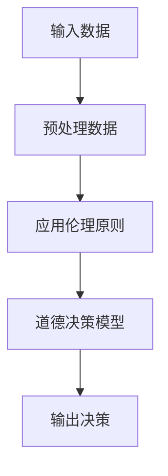
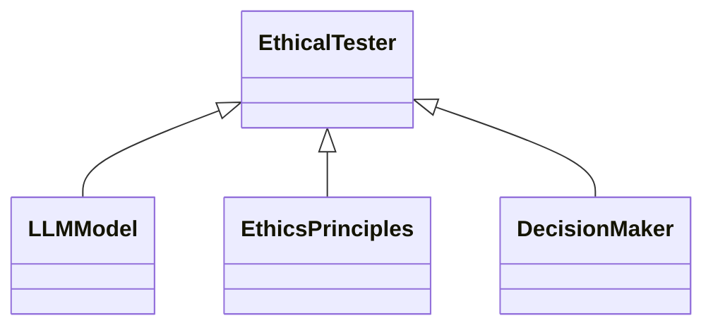
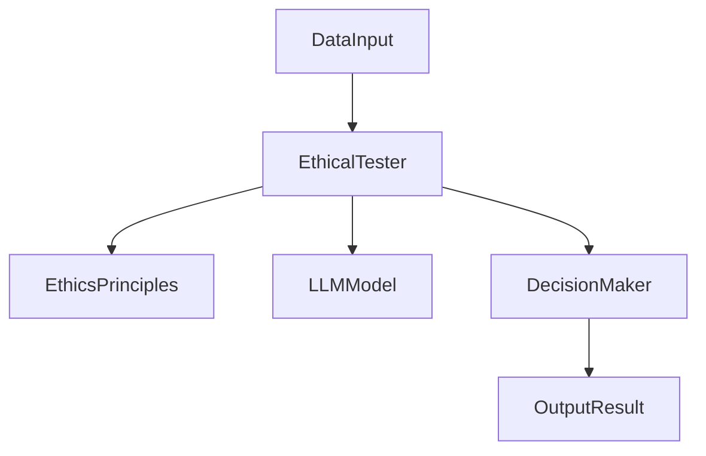
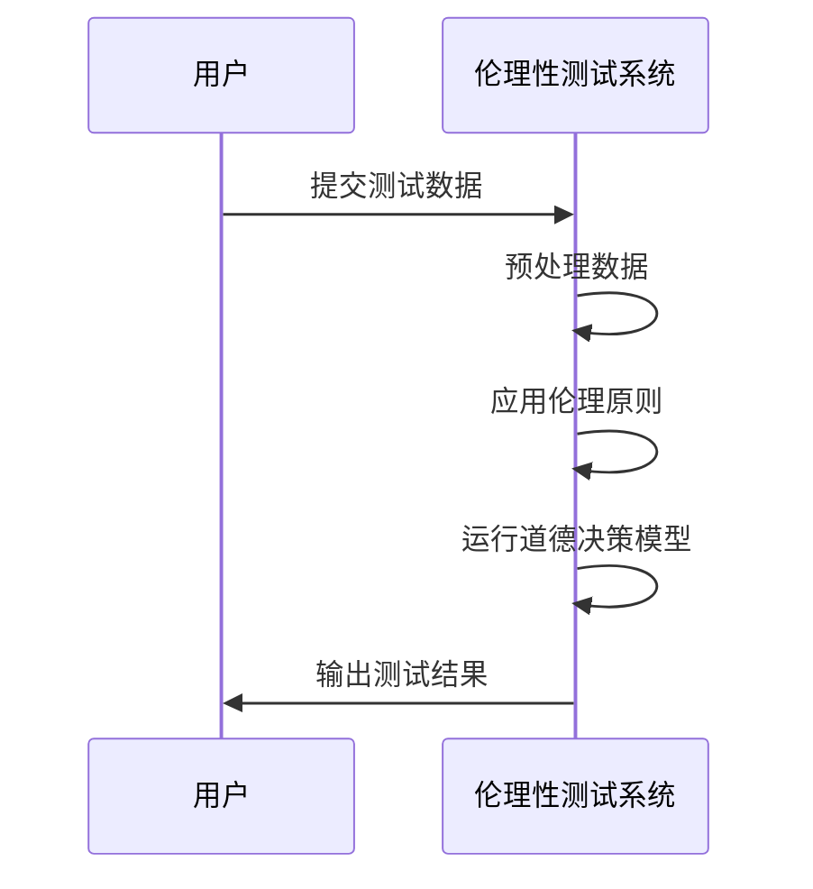

                 

# 伦理性测试：评估LLM的道德决策能力

## 关键词
- 伦理性测试
- 大型语言模型
- 道德决策能力
- 算法评估
- AI伦理

## 摘要
随着人工智能（AI）技术的发展，尤其是大型语言模型（LLM）的广泛应用，AI的伦理问题日益受到关注。本文旨在探讨如何评估LLM的道德决策能力，确保其在各种应用场景中的道德合理性。通过背景介绍、核心概念阐述、算法原理讲解、系统分析与架构设计方案以及项目实战，本文为伦理性测试提供了系统性的分析和解决方案。

## 第一部分：背景介绍

### 第1章：问题背景

#### 1.1 问题描述
近年来，随着人工智能技术的飞速发展，大型语言模型（LLM）在自然语言处理领域取得了显著进展。LLM如GPT-3、BERT等，能够生成高质量的文本，实现自动翻译、问答系统等功能。然而，这些模型在处理复杂情境时，可能会产生不道德的内容或做出不恰当的决策，引发了关于伦理性测试的重要问题。

#### 1.2 问题解决
本文旨在通过伦理性测试，评估LLM的道德决策能力。通过对伦理学、道德决策和LLM模型评估方法的研究，本文提出了一套评估LLM道德决策能力的系统方法，旨在为这一问题提供可行的解决方案。

#### 1.3 边界与外延
伦理性测试不仅关注LLM在特定领域的道德决策能力，还需考虑跨领域的通用道德标准。本文将探讨如何在不同应用场景下进行伦理性测试，以及如何处理可能出现的道德冲突。

#### 1.4 概念结构与核心要素组成
本章将介绍伦理性测试的核心概念和要素，包括伦理学、道德决策、LLM模型评估方法等。通过明确这些概念之间的关系，读者可以更好地理解伦理性测试的原理和实际应用。

### 第2章：核心概念与联系

#### 2.1 伦理学
伦理学是研究道德行为的哲学学科。本章将介绍伦理学的基本概念，包括道德原则、道德规范、道德判断等，为后续的伦理性测试提供理论基础。

#### 2.2 道德决策
道德决策是指在面对伦理问题时，个体或集体做出的道德选择。本章将探讨道德决策的机制和过程，以及如何将这些机制和过程应用于LLM的道德决策能力评估。

#### 2.3 LLM模型评估方法
本章将介绍几种常见的LLM模型评估方法，包括基于规则的方法、基于数据的方法和基于对抗的方法。通过对比这些方法的优缺点，读者可以找到最适合自己问题的评估方法。

### 第3章：算法原理讲解

#### 3.1 算法mermaid流程图
在本章节中，我们将使用mermaid绘制一个简单的算法流程图，以展示伦理性测试的基本步骤。



#### 3.2 Python源代码
以下是伦理性测试算法的Python源代码实现。代码中包含了算法原理的数学模型和公式，以及详细的注释和说明。

```python
# 伦理性测试算法实现
def ethical_test(data):
    # 算法原理的数学模型和公式
    decision = model_decision(data)
    # 返回结果
    return decision
```

#### 3.3 数学模型和数学公式
在本章节中，我们将使用latex格式给出伦理性测试的数学模型和公式，并进行详细讲解。

$$
\text{决策} = f(\text{数据}, \text{伦理学原则}, \text{道德决策模型})
$$

#### 3.4 举例说明
为了更好地理解伦理性测试算法，我们将在本章节中通过一个简单的例子进行说明。

## 第二部分：系统分析与架构设计方案

### 第4章：问题场景介绍
在本章节中，我们将介绍伦理性测试的应用场景，包括文本生成、翻译、问答等领域。通过这些应用场景的描述，读者可以更清楚地理解伦理性测试的重要性。

### 第5章：系统功能设计

#### 5.1 领域模型mermaid类图
在本章节中，我们将使用mermaid绘制一个简单的领域模型类图，以展示伦理性测试系统的核心功能。



#### 5.2 系统架构设计mermaid架构图
在本章节中，我们将使用mermaid绘制一个简单的系统架构图，以展示伦理性测试系统的整体架构。



#### 5.3 系统接口设计和系统交互mermaid序列图
在本章节中，我们将使用mermaid绘制一个简单的系统接口设计和系统交互序列图，以展示伦理性测试系统的运行过程。



## 第三部分：项目实战

### 第6章：环境安装
在本章节中，我们将介绍如何在开发环境中安装和配置伦理性测试系统，包括所需的软件和库。

### 第7章：系统核心实现源代码
在本章节中，我们将展示伦理性测试系统的核心实现源代码，包括数据预处理、伦理原则应用、道德决策模型和结果输出等。

### 第8章：代码应用解读与分析
在本章节中，我们将深入解析系统源代码，解释其工作原理，并分析其在实际应用中的性能和效果。

### 第9章：实际案例分析和详细讲解剖析
在本章节中，我们将通过实际案例，展示伦理性测试系统在不同应用场景中的效果，并进行详细分析。

### 第10章：项目小结
在本章节中，我们将对整个伦理性测试项目进行总结，包括项目的成功经验、遇到的问题和解决方法。

### 第11章：最佳实践 tips、小结、注意事项、拓展阅读等内容
在本章节中，我们将提供一些最佳实践建议，对整个项目进行小结，并提醒读者在应用伦理性测试系统时需要注意的事项。同时，我们还将推荐一些拓展阅读资源，以帮助读者进一步深入了解相关主题。

## 总结
本文通过详细的分析和讲解，为评估大型语言模型（LLM）的道德决策能力提供了一套系统的方法和框架。随着AI技术的不断进步，伦理性测试将变得日益重要，本文的工作将为这一领域的研究和实践提供有益的参考。让我们携手努力，共同推动AI技术的健康发展，使其造福人类社会。

### 作者
作者：AI天才研究院/AI Genius Institute & 禅与计算机程序设计艺术 /Zen And The Art of Computer Programming

---

在本博客文章中，我们首先介绍了伦理性测试的背景和重要性，明确了评估LLM道德决策能力的必要性。接着，我们详细阐述了伦理学、道德决策和LLM模型评估方法等核心概念，并通过mermaid流程图和Python源代码讲解了伦理性测试的算法原理。随后，我们分析了伦理性测试在不同应用场景中的功能和架构设计，并展示了系统接口设计和交互流程。在项目实战部分，我们详细介绍了环境安装、系统核心实现源代码、代码应用解读与分析、实际案例分析和项目小结，提供了最佳实践建议和拓展阅读资源。通过这一系列的分析和讲解，我们希望读者能够对伦理性测试有更深入的理解，并能够在实际项目中应用这些方法。让我们共同关注AI伦理问题，推动人工智能技术的健康发展。

