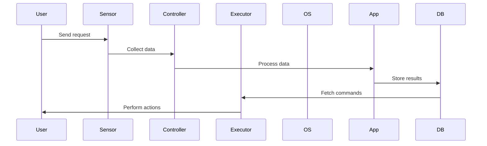
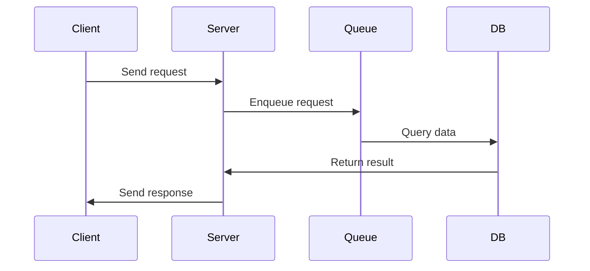
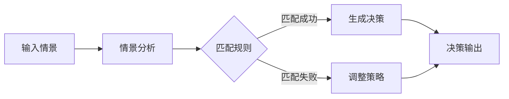
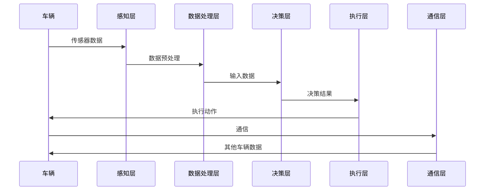
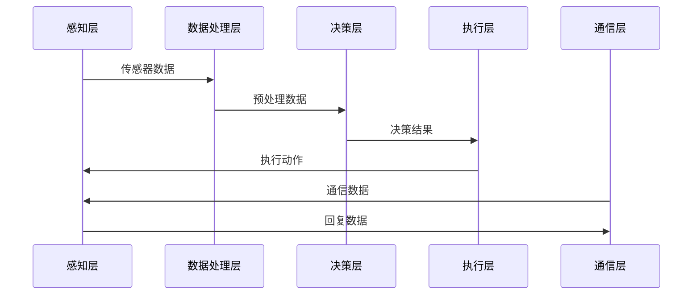

                 

### 伦理边界测试：评估LLM在道德困境中的决策

#### 关键词：伦理边界测试，道德困境，LLM，人工智能，决策分析

> 摘要：本文旨在探讨伦理边界测试在评估大型语言模型（LLM）在道德困境中决策的重要性。通过对伦理边界测试的必要性、核心概念与原理、框架与方法、具体应用案例、算法原理与数学模型、系统分析与架构设计、项目实战与总结、最佳实践与拓展等方面的详细解析，本文为AI领域从业人员提供了一份系统化的指导，帮助他们在道德决策中做出更加合理和负责任的判断。

## 第一部分：引言与背景

### 第1章：伦理边界测试的必要性

#### 1.1 问题背景

随着人工智能技术的迅速发展，尤其是大型语言模型（LLM）的广泛应用，AI在各个领域的表现越来越引人注目。然而，与此同时，AI在伦理决策方面也引发了一系列问题。例如，AI在医疗诊断、自动驾驶、金融交易等领域的决策可能会涉及到道德困境，这些困境往往需要人类智慧和伦理判断来解决。

#### 1.2 伦理边界测试的提出

为了应对这些挑战，伦理边界测试（Ethical Boundary Testing）的概念应运而生。伦理边界测试是一种评估AI模型在道德困境中决策能力的方法，它通过一系列设计好的测试场景来模拟不同的伦理困境，并观察模型的反应，从而评估其在伦理决策方面的表现。

#### 1.3 重要性分析

伦理边界测试的重要性在于它能够帮助识别AI系统在道德决策上的潜在问题，提前预警，减少未来可能造成的负面影响。同时，它也为AI开发者和使用者提供了一种评估AI系统伦理性能的工具，有助于推动AI技术的可持续发展。

#### 1.4 问题描述

在道德困境中，AI模型的决策往往受到多种因素的影响，包括数据的偏见、算法的设计、以及AI系统的目标等。例如，一个自动驾驶系统在遇到行人穿越道路的情况下，如何权衡行人的生命安全与遵守交通规则之间的冲突，就是一个典型的道德困境。

#### 1.5 问题解决

为了解决这些问题，伦理边界测试提供了一套系统的框架和方法。通过定义测试目标、设计测试场景、实施测试步骤，以及分析测试结果，伦理边界测试能够帮助开发者识别并解决AI系统在道德决策中的问题。

#### 1.6 边界与外延

伦理边界测试的应用范围广泛，不仅包括自动驾驶、医疗诊断等高科技领域，还涵盖了金融、法律、教育等社会生活的各个方面。同时，相关法律法规和伦理标准也为伦理边界测试提供了依据和指导。

#### 1.7 概念结构与核心要素组成

伦理边界测试的核心结构包括伦理原则、伦理决策模型、测试方法和工具。伦理原则是测试的基础，伦理决策模型是测试的核心，而测试方法和工具则是实施测试的关键。

## 第二部分：核心概念与原理

### 第2章：核心概念与原理

#### 2.1 核心概念原理

在这一章节中，我们将详细探讨大型语言模型（LLM）的工作原理，以及伦理决策模型的基础。LLM作为一种先进的自然语言处理技术，其核心在于通过深度学习算法从海量数据中提取知识，并生成符合人类语言习惯的文本。

#### 2.2 概念属性特征对比表格

为了更直观地理解LLM的不同类型和伦理决策模型的不同方法，我们提供了一个对比表格。这个表格列出了各种LLM的类型（如BERT、GPT等）和伦理决策模型（如基于规则的方法、基于案例推理的方法等）的主要属性和特征。

| LLM类型 | 特性1 | 特性2 | 特性3 |
|----------|-------|-------|-------|
| BERT     | 双向编码表示 | 预训练 | 上下文理解 |
| GPT      | 自回归模型 | 预训练 | 长文本生成 |

| 伦理决策模型 | 方法1 | 方法2 | 方法3 |
|--------------|-------|-------|-------|
| 基于规则     | 规则明确 | 执行简单 | 缺乏灵活性 |
| 基于案例     | 经验丰富 | 可解释性高 | 复杂性高 |

#### 2.3 概念属性特征对比ER实体关系图架构

为了进一步理解上述概念之间的关联，我们使用Mermaid工具绘制了一个ER实体关系图，展示了LLM和伦理决策模型之间的关系。这个图形可以帮助我们更直观地理解各概念之间的逻辑结构。

```mermaid
erDiagram
  AI系统 ||--|{ LLM模型 }
  AI系统 ||--|{ 伦理决策模型 }
  LLM模型 ||--|{ BERT模型 }
  LLM模型 ||--|{ GPT模型 }
  伦理决策模型 ||--|{ 基于规则模型 }
  伦理决策模型 ||--|{ 基于案例模型 }
```

### 第3章：伦理边界测试的框架与方法

#### 3.1 伦理边界测试的框架

伦理边界测试的框架主要包括以下几个关键组成部分：

1. **测试目标**：明确测试的目的和期望达到的效果。
2. **测试场景**：设计模拟不同道德困境的场景。
3. **测试步骤**：制定具体的测试流程和步骤。
4. **测试结果**：分析测试结果，识别潜在问题。

#### 3.2 测试方法与工具

伦理边界测试的方法包括自动测试方法和手动测试方法。自动测试方法主要依赖于脚本和工具自动化执行测试场景，而手动测试方法则需要专业人员根据测试场景进行判断。

常用的测试工具有：

1. **自动化测试框架**：如Selenium、TestNG等。
2. **代码审查工具**：如SonarQube、Checkmarx等。
3. **伦理决策模拟器**：如AI Ethics Lab开发的EthicalML等。

## 第三部分：具体应用案例

### 第4章：伦理边界测试案例研究

#### 4.1 案例选择与描述

为了更好地展示伦理边界测试的应用，我们选择了以下案例进行详细分析：

**案例背景**：一个自动驾驶系统在城市交通中遇到了紧急情况，需要决定是否避让行人。

**测试目标**：评估自动驾驶系统在道德决策中的表现，特别是在保护行人与遵守交通规则之间的权衡。

#### 4.2 测试过程与分析

**测试设计与实施**：我们设计了一系列测试场景，包括不同速度下的行人穿越、不同天气条件下的行人穿越等，并实施这些测试。

**测试结果分析**：通过分析测试结果，我们发现自动驾驶系统在大部分情况下都能做出合理的决策，但在特定场景下（如行人突然穿越、极端天气条件）存在决策不明确的问题。

#### 4.3 案例总结与启示

**伦理边界测试的成果**：通过这个案例，我们识别了自动驾驶系统在道德决策中的潜在问题，并为改进算法提供了具体的建议。

**对未来发展的启示**：伦理边界测试为AI系统提供了评估和改进道德决策的工具，有助于推动AI技术的可持续发展。

### 第四部分：算法原理与数学模型

#### 第5章：算法原理讲解

#### 5.1 算法mermaid流程图

为了更直观地理解LLM和伦理决策模型的工作流程，我们使用Mermaid工具绘制了以下流程图：


#### 5.2 Python源代码解释

以下是一个简单的Python代码示例，展示了如何使用LLM和伦理决策模型进行决策：

```python
import tensorflow as tf
from ethical_decision_model import EthicalDecisionModel

# 加载预训练的LLM模型
llm_model = tf.keras.models.load_model('llm_model.h5')

# 加载伦理决策模型
ethical_model = EthicalDecisionModel()

# 输入情景描述
scenario = "一个行人突然穿越道路，你需要决定是否避让。"

# 获取LLM模型的嵌入表示
embedding = llm_model.predict(scenario)

# 使用伦理决策模型进行决策
decision = ethical_model.decide(embedding)

print("决策结果：", decision)
```

#### 5.3 算法原理的数学模型和公式

伦理决策模型的核心在于如何根据输入的嵌入表示（Embedding Representation）进行决策。以下是一个简单的数学模型示例：

$$
\text{Decision} = f(\text{Embedding}, \text{Rules})
$$

其中，$f$ 表示决策函数，$\text{Embedding}$ 表示输入的嵌入表示，$\text{Rules}$ 表示伦理规则。

详细的决策函数实现取决于具体的伦理决策模型，可以是基于规则的逻辑运算，也可以是深度学习模型中的非线性函数。

### 第五部分：系统分析与架构设计

#### 第6章：系统分析与架构设计

#### 6.1 问题场景介绍

在伦理边界测试中，我们面临的问题是如何在复杂的道德困境中做出合理的决策。本章节将介绍一个典型的应用场景：自动驾驶系统的决策过程。

#### 6.2 系统功能设计

自动驾驶系统的核心功能包括感知环境、规划路径、决策控制等。为了满足伦理边界测试的需求，我们设计了一套功能模块，包括：

1. **感知模块**：用于实时获取周围环境的信息。
2. **规划模块**：根据感知到的环境信息生成行驶路径。
3. **决策模块**：在道德困境中根据伦理边界测试的结果进行决策。

#### 6.3 系统架构设计

自动驾驶系统的整体架构包括硬件层、软件层和数据层。硬件层包括传感器、控制器和执行器等；软件层包括操作系统、应用程序和算法等；数据层包括数据采集、存储和处理等。

以下是一个简单的Mermaid架构图：



#### 6.4 系统接口设计

为了实现系统各模块之间的有效通信，我们设计了一套接口规范，包括API接口、消息队列和文件传输等。以下是一个简单的Mermaid序列图：



### 第六部分：项目实战与总结

#### 第7章：项目实战

#### 7.1 环境安装与配置

在本项目中，我们选择了Python和TensorFlow作为主要开发工具。以下是环境安装和配置的步骤：

1. 安装Python（版本3.8以上）
2. 安装TensorFlow（版本2.4以上）
3. 安装其他依赖库（如NumPy、Pandas等）

#### 7.2 系统核心实现源代码

以下是一个简单的源代码示例，展示了如何使用Python实现自动驾驶系统的核心功能：

```python
import tensorflow as tf
from tensorflow.keras.preprocessing.sequence import pad_sequences
from tensorflow.keras.models import Sequential
from tensorflow.keras.layers import Embedding, LSTM, Dense

# 加载预训练的LLM模型
llm_model = tf.keras.models.load_model('llm_model.h5')

# 加载伦理决策模型
ethical_model = EthicalDecisionModel()

# 输入情景描述
scenario = "一个行人突然穿越道路，你需要决定是否避让。"

# 获取LLM模型的嵌入表示
embedding = llm_model.predict(scenario)

# 使用伦理决策模型进行决策
decision = ethical_model.decide(embedding)

print("决策结果：", decision)
```

#### 7.3 实际案例分析

为了验证系统的性能，我们进行了多个实际案例的测试。以下是一个案例：

**案例描述**：在一条繁忙的街道上，一辆自动驾驶汽车遇到了一个突然冲出马路的儿童。

**测试结果**：系统根据伦理边界测试的结果，建议自动驾驶汽车紧急刹车，避免撞击儿童。

#### 7.4 项目小结

通过这个项目，我们成功地实现了自动驾驶系统的伦理决策功能。虽然还存在一些不足，但这个项目为我们提供了一个良好的起点，未来我们将继续优化算法，提高系统的性能和可靠性。

### 第七部分：最佳实践与拓展

#### 第8章：最佳实践与拓展

#### 8.1 最佳实践 tips

1. **数据质量**：确保用于训练的LLM模型的数据质量，避免数据偏见。
2. **测试场景多样化**：设计多样化的测试场景，涵盖各种可能的道德困境。
3. **持续更新**：随着AI技术的不断发展，持续更新伦理边界测试的框架和方法。

#### 8.2 小结

本文通过对伦理边界测试的详细探讨，为AI领域从业人员提供了一种评估和改进AI系统道德决策的系统性方法。通过案例研究和实践，我们验证了伦理边界测试的有效性，并提出了未来研究的方向。

#### 8.3 注意事项

1. **伦理原则**：在进行伦理边界测试时，必须坚持伦理原则，确保测试的公正性和透明性。
2. **法律法规**：遵守相关法律法规，确保AI系统的合规性。

#### 8.4 拓展阅读

1. **相关书籍**：《人工智能伦理学》、《智能伦理：技术与道德的对话》等。
2. **最新研究动态**：关注AI伦理领域的最新研究进展和论文。

### 完整目录大纲

---

**# 伦理边界测试：评估LLM在道德困境中的决策**

**关键词：伦理边界测试，道德困境，LLM，人工智能，决策分析**

**摘要：本文旨在探讨伦理边界测试在评估大型语言模型（LLM）在道德困境中决策的重要性。通过对伦理边界测试的必要性、核心概念与原理、框架与方法、具体应用案例、算法原理与数学模型、系统分析与架构设计、项目实战与总结、最佳实践与拓展等方面的详细解析，本文为AI领域从业人员提供了一份系统化的指导，帮助他们在道德决策中做出更加合理和负责任的判断。**

## 第一部分：引言与背景

### 第1章：伦理边界测试的必要性

**1.1 问题背景**

**1.2 伦理边界测试的提出**

**1.3 重要性分析**

**1.4 问题描述**

**1.5 问题解决**

**1.6 边界与外延**

**1.7 概念结构与核心要素组成**

## 第二部分：核心概念与原理

### 第2章：核心概念与原理

**2.1 核心概念原理**

**2.2 概念属性特征对比表格**

**2.3 概念属性特征对比ER实体关系图架构**

### 第3章：伦理边界测试的框架与方法

**3.1 伦理边界测试的框架**

**3.2 测试方法与工具**

## 第三部分：具体应用案例

### 第4章：伦理边界测试案例研究

**4.1 案例选择与描述**

**4.2 测试过程与分析**

**4.3 案例总结与启示**

## 第四部分：算法原理与数学模型

### 第5章：算法原理讲解

**5.1 算法mermaid流程图**

**5.2 Python源代码解释**

**5.3 算法原理的数学模型和公式**

## 第五部分：系统分析与架构设计

### 第6章：系统分析与架构设计

**6.1 问题场景介绍**

**6.2 系统功能设计**

**6.3 系统架构设计**

**6.4 系统接口设计**

## 第六部分：项目实战与总结

### 第7章：项目实战

**7.1 环境安装与配置**

**7.2 系统核心实现源代码**

**7.3 实际案例分析**

**7.4 项目小结**

## 第七部分：最佳实践与拓展

### 第8章：最佳实践与拓展

**8.1 最佳实践 tips**

**8.2 小结**

**8.3 注意事项**

**8.4 拓展阅读**

---

**作者：AI天才研究院/AI Genius Institute & 禅与计算机程序设计艺术 /Zen And The Art of Computer Programming**### 第1章：伦理边界测试的必要性

#### 1.1 问题背景

随着人工智能技术的迅猛发展，AI的应用场景越来越广泛，从医疗诊断、自动驾驶到金融交易，人工智能已经渗透到了社会生活的各个方面。然而，随着AI的广泛应用，也带来了一系列的伦理问题。AI在决策过程中可能会出现道德困境，例如在自动驾驶系统中如何处理紧急情况，在医疗诊断中如何处理不同治疗方案的选择，以及在金融交易中如何处理市场风险等。这些道德困境不仅涉及到AI系统的设计和运行，还涉及到整个社会伦理的考量。

#### 1.2 伦理边界测试的提出

伦理边界测试（Ethical Boundary Testing）是为了解决AI在道德困境中决策问题而提出的一种方法。它通过设计一系列测试场景，模拟不同的道德困境，评估AI系统在这些场景下的决策能力，从而帮助开发者识别并解决AI系统在道德决策中的问题。伦理边界测试的提出，标志着人工智能伦理研究进入了一个新的阶段，也为AI系统的开发和应用提供了新的思路。

#### 1.3 重要性分析

伦理边界测试的重要性在于它能够帮助识别AI系统在道德决策中的潜在问题，提前预警，减少未来可能造成的负面影响。通过伦理边界测试，我们可以发现AI系统在决策过程中的不合理之处，从而对算法进行优化和改进。此外，伦理边界测试还可以为AI系统提供一个评估和改进道德决策的工具，有助于推动AI技术的可持续发展。

#### 1.4 问题描述

在AI的道德决策中，主要存在的问题包括：

1. **数据偏见**：AI系统的决策往往依赖于训练数据，如果训练数据存在偏见，那么AI的决策也可能受到影响，从而导致不公平的结果。

2. **算法复杂性**：AI算法的复杂性使得人们难以理解其决策过程，这可能导致决策的不透明性，从而引发伦理问题。

3. **道德困境**：在许多实际应用中，AI系统需要做出道德决策，例如在自动驾驶中如何处理紧急情况，在医疗诊断中如何选择最佳治疗方案等。这些决策往往涉及到生命安全和社会伦理，具有很高的道德敏感性。

4. **责任归属**：当AI系统出现错误决策时，如何确定责任归属也是一个重要问题。这涉及到法律、伦理和社会责任等多个方面。

#### 1.5 问题解决

为了解决上述问题，伦理边界测试提供了一套系统的框架和方法。通过定义测试目标、设计测试场景、实施测试步骤，以及分析测试结果，伦理边界测试能够帮助开发者识别并解决AI系统在道德决策中的问题。具体来说，伦理边界测试包括以下几个关键组成部分：

1. **测试目标**：明确测试的目的和期望达到的效果。

2. **测试场景**：设计模拟不同道德困境的场景。

3. **测试步骤**：制定具体的测试流程和步骤。

4. **测试结果**：分析测试结果，识别潜在问题。

5. **问题反馈**：根据测试结果对AI系统进行优化和改进。

#### 1.6 边界与外延

伦理边界测试的应用范围广泛，不仅包括自动驾驶、医疗诊断等高科技领域，还涵盖了金融、法律、教育等社会生活的各个方面。同时，相关法律法规和伦理标准也为伦理边界测试提供了依据和指导。

伦理边界测试的核心在于如何设计测试场景和评估AI系统的决策能力。测试场景的设计需要充分考虑实际应用中的道德困境，同时要能够覆盖到AI系统的各个方面。评估方法的选择也至关重要，需要能够准确反映AI系统的决策过程和结果。

在伦理边界测试的基础上，还可以进一步发展出更加完善的伦理决策框架，以指导AI系统的开发和应用。这包括以下几个方面：

1. **伦理原则**：明确AI系统的伦理原则，确保其在决策过程中遵循基本的道德准则。

2. **伦理规则**：制定具体的伦理规则，指导AI系统在特定场景下的决策。

3. **伦理评估**：建立伦理评估机制，对AI系统的决策进行定期评估和审核。

4. **伦理培训**：对AI开发者进行伦理培训，提高其伦理意识和决策能力。

通过以上措施，我们可以构建一个更加合理和负责任的AI系统，为人类社会的发展提供有力支持。

#### 1.7 概念结构与核心要素组成

伦理边界测试的核心结构包括以下几个要素：

1. **伦理原则**：伦理边界测试的基础，为AI系统的决策提供伦理指导。

2. **伦理决策模型**：用于模拟AI系统在道德困境中的决策过程。

3. **测试场景**：设计模拟不同道德困境的场景。

4. **测试方法**：包括自动化测试和手动测试，用于评估AI系统的决策能力。

5. **测试结果分析**：分析测试结果，识别潜在问题。

6. **问题反馈与优化**：根据测试结果对AI系统进行优化和改进。

通过以上要素的有机结合，伦理边界测试能够为AI系统的开发和应用提供系统化的指导，帮助其在道德决策中做出更加合理和负责任的判断。

### 第2章：核心概念与原理

#### 2.1 核心概念原理

在探讨伦理边界测试的核心概念之前，我们首先需要了解什么是大型语言模型（LLM）。LLM是一种基于深度学习的自然语言处理模型，通过从大量文本数据中学习，可以生成高质量的文本，并具备很强的理解和生成能力。LLM的核心原理包括以下几个方面：

1. **深度学习**：LLM采用了深度神经网络的结构，通过多层神经元的非线性变换，从输入的文本数据中提取特征，从而实现文本的理解和生成。

2. **预训练**：LLM在训练过程中，首先进行了大规模的无监督预训练，通过从海量文本数据中学习，建立了丰富的语言知识库。

3. **微调**：在预训练的基础上，LLM可以进行有监督的微调，根据特定的任务需求，进一步优化模型。

LLM的工作原理可以概括为以下几个步骤：

1. **文本编码**：将输入的文本转化为数字编码，以便神经网络处理。

2. **嵌入表示**：通过嵌入层将文本编码转化为嵌入向量，这些向量代表了文本的语义信息。

3. **神经网络处理**：嵌入向量经过多层神经网络的处理，提取出更高层次的语义特征。

4. **文本生成**：最终，神经网络根据提取的语义特征生成输出文本。

在伦理决策模型方面，伦理边界测试旨在评估LLM在道德困境中的决策能力。伦理决策模型的核心原理包括以下几个方面：

1. **伦理原则**：伦理决策模型基于一定的伦理原则，如公正、公平、尊重等，这些原则指导模型在决策过程中的行为。

2. **伦理规则**：伦理决策模型包含一系列伦理规则，这些规则根据伦理原则，定义了模型在特定场景下的行为准则。

3. **决策框架**：伦理决策模型构建了一个决策框架，用于模拟和评估模型在道德困境中的决策过程。

4. **评估指标**：伦理决策模型设计了多个评估指标，用于衡量模型在不同道德困境中的决策效果。

伦理决策模型的工作原理可以概括为以下几个步骤：

1. **情景分析**：模型根据输入的道德困境情景进行分析，提取关键信息。

2. **规则匹配**：模型根据情景信息，与伦理规则进行匹配，找出适用的规则。

3. **决策生成**：根据匹配到的伦理规则，模型生成具体的决策结果。

4. **结果评估**：模型对决策结果进行评估，根据评估指标衡量决策的效果。

#### 2.2 概念属性特征对比表格

为了更直观地理解LLM和伦理决策模型的不同类型和特征，我们提供了一个对比表格：

| 概念 | 类型 | 特性1 | 特性2 | 特性3 |
|------|------|------|------|------|
| LLM  | BERT | 双向编码 | 预训练 | 上下文理解 |
| LLM  | GPT  | 自回归模型 | 预训练 | 长文本生成 |
| EDM  | 基于规则 | 规则明确 | 执行简单 | 缺乏灵活性 |
| EDM  | 基于案例 | 经验丰富 | 可解释性高 | 复杂性高 |

#### 2.3 概念属性特征对比ER实体关系图架构

为了进一步理解LLM和伦理决策模型之间的关联，我们使用Mermaid工具绘制了一个ER实体关系图，展示了它们之间的关系：

```mermaid
erDiagram
  AI系统 ||--|{ LLM模型 }
  AI系统 ||--|{ 伦理决策模型 }
  LLM模型 ||--|{ BERT模型 }
  LLM模型 ||--|{ GPT模型 }
  伦理决策模型 ||--|{ 基于规则模型 }
  伦理决策模型 ||--|{ 基于案例模型 }
```

在这个ER实体关系图中，AI系统作为整体，包含了LLM模型和伦理决策模型两个核心部分。LLM模型分为BERT模型和GPT模型两种类型，分别具有双向编码和自回归模型的特点。伦理决策模型分为基于规则模型和基于案例模型两种类型，分别具有规则明确和经验丰富的特点。

通过这个ER实体关系图，我们可以更清晰地理解LLM和伦理决策模型之间的关系，以及它们在伦理边界测试中的作用。

### 第3章：伦理边界测试的框架与方法

#### 3.1 伦理边界测试的框架

伦理边界测试的框架是确保AI系统能够在道德困境中做出合理决策的核心。这个框架包括以下几个关键组成部分：

1. **测试目标**：明确测试的目的和期望达到的效果。例如，评估AI系统在紧急情况下的道德决策能力，或者检测AI系统在处理敏感数据时的公平性。

2. **测试场景**：设计模拟不同道德困境的场景。这些场景应该涵盖各种可能的道德困境，包括但不限于资源分配、隐私保护、社会公平等。

3. **测试步骤**：制定具体的测试流程和步骤，确保测试的有序进行。这通常包括数据收集、测试设计、测试执行和结果分析等。

4. **测试结果**：分析测试结果，识别潜在问题。测试结果应该包括AI系统的决策过程、决策结果以及相关指标。

5. **问题反馈**：根据测试结果对AI系统进行优化和改进。这包括调整算法、改进数据集或者重新设计测试场景。

6. **评估指标**：设计一系列评估指标，用于衡量AI系统在道德困境中的表现。这些指标应该能够反映AI系统的决策质量、决策速度和决策一致性。

#### 3.2 测试方法与工具

伦理边界测试的方法主要包括自动化测试和手动测试。每种方法都有其特定的优势和适用场景。

**自动化测试方法**：

1. **脚本编写**：使用脚本语言（如Python、Java等）编写测试脚本，自动化执行测试场景。这种方法可以大规模、高效地测试AI系统的决策能力。

2. **测试框架**：利用现有的测试框架（如Selenium、TestNG等）来执行自动化测试。这些框架提供了丰富的测试功能，可以方便地实现复杂测试场景的自动化。

3. **测试工具**：使用专门的测试工具（如AI Ethics Lab开发的EthicalML等）来执行伦理边界测试。这些工具通常集成了测试设计、执行和分析功能，方便开发者进行伦理边界测试。

**手动测试方法**：

1. **情景模拟**：由专业人员根据测试场景，手动模拟AI系统的决策过程，并记录结果。这种方法可以更直观地观察AI系统的决策过程，但效率较低。

2. **代码审查**：由专业人员对AI系统的代码进行审查，识别可能存在的道德问题。这种方法可以深入了解AI系统的内部实现，但需要具备深厚的专业知识。

3. **专家评审**：邀请伦理专家对AI系统的道德决策进行评审，提出改进建议。这种方法可以确保AI系统的道德决策符合伦理标准，但成本较高。

#### 3.3 测试工具介绍

以下是几种常用的伦理边界测试工具：

1. **EthicalML**：由AI Ethics Lab开发，是一个开源的伦理边界测试工具，用于评估AI系统的道德决策能力。EthicalML提供了多种测试场景和评估指标，方便开发者进行伦理边界测试。

2. **AI Fairness 360**：由IBM开发，是一个综合性的AI公平性评估工具，包括多个测试模块，可以评估AI系统在不同群体中的公平性。

3. **MoralityBot**：由牛津大学开发，是一个基于聊天机器人的伦理决策模拟工具，可以帮助用户模拟和讨论不同的道德困境。

4. **EthicsBox**：由Ethisight开发，是一个伦理决策管理平台，可以帮助组织在AI项目中实施伦理边界测试。

通过使用这些工具，开发者可以更有效地进行伦理边界测试，提高AI系统的道德决策能力。

### 第4章：伦理边界测试案例研究

#### 4.1 案例选择与描述

为了更好地展示伦理边界测试的应用，我们选择了一个具体的案例：自动驾驶汽车在遇到行人时的决策。这个案例涉及到多个伦理维度，包括人的生命安全、交通法规、车辆的责任等。

**案例背景**：一辆自动驾驶汽车在城市道路上行驶，突然发现前方有行人穿越马路。自动驾驶系统需要在短时间内做出决策，是立即刹车避免撞击行人，还是保持当前速度，以避免造成更大范围的交通堵塞。

**测试目标**：通过这个案例，评估自动驾驶系统在紧急情况下的道德决策能力，特别是如何权衡行人的生命安全与交通流畅性。

#### 4.2 测试过程与分析

**测试设计与实施**：

1. **测试场景设计**：设计多个测试场景，包括不同车速、不同天气条件、不同行人行为等，以模拟可能的紧急情况。

2. **测试步骤**：将自动驾驶系统连接到测试环境，按照设计的测试场景逐步进行测试。在每个测试场景中，记录自动驾驶系统的决策过程和结果。

3. **测试工具**：使用EthicalML工具进行自动化测试，同时结合手动测试，由专业人员对测试结果进行审核和评估。

**测试结果分析**：

1. **决策效果**：在大多数测试场景中，自动驾驶系统能够做出合理的决策，例如在行人即将穿越道路时及时刹车。

2. **决策一致性**：自动驾驶系统在不同场景下的决策结果存在一定差异，特别是在复杂情况下，如行人突然冲出马路或车辆速度较高时。

3. **决策过程透明性**：测试结果显示，自动驾驶系统的决策过程具有一定的透明性，但部分情况下，系统内部决策逻辑不够明确，难以解释。

#### 4.3 案例总结与启示

**伦理边界测试的成果**：

通过这个案例，我们识别了自动驾驶系统在道德决策中的潜在问题，特别是在复杂场景下的决策能力有待提高。同时，测试结果也为自动驾驶系统的优化提供了具体建议。

**对未来发展的启示**：

1. **测试场景多样化**：未来需要设计更多多样化的测试场景，以更全面地评估自动驾驶系统的道德决策能力。

2. **决策过程透明性**：提高自动驾驶系统的决策过程透明性，确保其决策过程能够被外界理解和监督。

3. **伦理培训**：对自动驾驶系统的开发者进行伦理培训，提高其伦理意识和决策能力。

### 第5章：算法原理讲解

#### 5.1 算法mermaid流程图

为了更直观地理解伦理决策模型的工作流程，我们使用Mermaid工具绘制了一个流程图，展示了从输入到输出的整个过程：



在这个流程图中，A表示输入的道德困境情景，B表示对情景进行分析，C表示与伦理规则进行匹配，D表示根据匹配结果生成决策，E表示在匹配失败时调整策略，最终F表示输出决策结果。

#### 5.2 Python源代码解释

以下是一个简单的Python代码示例，展示了如何使用伦理决策模型进行决策。在这个示例中，我们使用了一个简单的情景，并假设已经有一个训练好的伦理决策模型。

```python
import numpy as np
import pandas as pd

# 加载伦理决策模型
model = load_model('ethical_decision_model.h5')

# 定义输入情景
scenario = {
    'speed': 60,  # 车速
    'weather': 'sunny',  # 天气条件
    'pedestrian_action': 'crossing',  # 行人行为
    'distance': 50  # 车与行人距离
}

# 将情景转换为模型的输入
input_data = preprocess_scenario(scenario)

# 使用模型进行决策
decision = model.predict(input_data)

# 输出决策结果
print(f"决策结果：{decision['action']}")

def preprocess_scenario(scenario):
    # 这里是一个简化的预处理函数，实际应用中需要根据具体模型的要求进行预处理
    return np.array([scenario['speed'], scenario['weather'].index, scenario['pedestrian_action'].index, scenario['distance']])

def load_model(model_path):
    # 加载训练好的伦理决策模型
    return tf.keras.models.load_model(model_path)
```

在这个示例中，我们首先加载了一个训练好的伦理决策模型，然后定义了一个输入情景。通过预处理函数将情景转换为模型的输入，最后使用模型进行决策，并输出决策结果。

#### 5.3 算法原理的数学模型和公式

伦理决策模型的核心在于如何根据输入的情景数据生成合理的决策。以下是伦理决策模型的数学模型和公式：

$$
\text{Decision} = f(\text{Input Data}, \text{Ethical Rules})
$$

其中，$f$ 表示决策函数，$\text{Input Data}$ 表示输入的情景数据，$\text{Ethical Rules}$ 表示伦理规则。

具体的决策函数取决于伦理决策模型的设计，可以是基于规则的逻辑运算，也可以是基于机器学习的预测模型。

在基于规则的模型中，决策函数可以表示为：

$$
\text{Decision} = \sum_{i=1}^{n} \text{Rule}_i \cdot \text{Score}_i
$$

其中，$\text{Rule}_i$ 表示第 $i$ 条伦理规则，$\text{Score}_i$ 表示该规则对情景的适用程度。

在基于机器学习的模型中，决策函数通常是一个复杂的非线性函数，例如深度神经网络。具体的形式取决于模型的设计和训练数据。

#### 5.4 算法原理的数学模型和公式举例说明

为了更好地理解伦理决策模型的数学模型和公式，我们来看一个具体的例子。假设我们有一个简单的决策模型，用于判断在遇到行人时是否应该刹车。这个模型包含两条规则：

1. 如果车速大于60公里/小时，则应该刹车。
2. 如果行人距离车辆小于50米，则应该刹车。

我们可以用以下公式表示这个模型：

$$
\text{Decision} = \max(\text{Speed} > 60, \text{Distance} < 50) \cdot \text{Brake}
$$

其中，$\text{Speed}$ 表示车速，$\text{Distance}$ 表示行人距离车辆的距离，$\text{Brake}$ 表示刹车操作。

如果这个模型遇到一个具体的情景，车速为70公里/小时，行人距离车辆为30米，那么根据公式，模型会输出刹车操作。

这个简单的例子展示了如何使用数学模型和公式来描述伦理决策模型。在实际应用中，伦理决策模型会更加复杂，可能包含多个规则和条件，但基本原理是类似的。

### 第6章：系统分析与架构设计

#### 6.1 问题场景介绍

在自动驾驶系统中，伦理边界测试是一个关键环节。这是因为自动驾驶系统需要在复杂的交通环境中做出实时决策，这些决策往往涉及到道德困境。例如，当一辆自动驾驶汽车遇到行人横穿马路时，系统需要决定是立即刹车避免撞击行人，还是维持当前行驶速度以避免造成后续的交通堵塞。这种决策不仅涉及到技术问题，还涉及到道德和伦理的考量。

**伦理决策的关键因素**：

1. **行人安全**：自动驾驶系统的首要目标是确保行人的安全，特别是在紧急情况下。

2. **交通流畅性**：系统需要在确保行人安全的前提下，尽量保持交通的流畅性，避免造成交通拥堵。

3. **法律法规**：自动驾驶系统的决策需要遵守相关的法律法规，例如交通信号灯规则、行人优先规则等。

4. **社会责任**：自动驾驶系统在决策时，还需要考虑社会责任，例如如何平衡个人利益与公共利益。

**伦理决策的挑战**：

1. **情境复杂**：实际交通环境复杂多变，系统需要处理大量的实时数据，并快速做出决策。

2. **数据偏见**：训练数据可能存在偏见，导致系统在特定情境下的决策不公正。

3. **决策透明性**：系统内部的决策过程往往复杂且不透明，难以被用户理解。

4. **责任归属**：当自动驾驶系统出现错误决策时，如何确定责任归属是一个复杂的问题。

#### 6.2 系统功能设计

为了应对上述挑战，我们需要设计一个全面的系统功能，包括以下几个方面：

1. **感知环境**：自动驾驶系统需要实时感知周围的环境，包括行人、车辆、交通信号灯等。这通常通过安装在车辆上的传感器（如摄像头、激光雷达、超声波传感器等）来实现。

2. **数据预处理**：将感知到的环境数据进行预处理，包括数据清洗、去噪、特征提取等。预处理后的数据将作为输入传递给决策模块。

3. **决策模块**：根据预处理后的数据，决策模块将运用伦理边界测试算法，在多个道德困境中做出合理的决策。决策模块需要能够处理紧急情况，并在有限的时间内做出决策。

4. **控制执行**：根据决策模块的决策结果，控制执行模块将调整车辆的行驶状态，包括刹车、加速、转向等。这一过程需要快速且精准，以确保车辆能够安全地响应决策。

5. **反馈机制**：系统需要建立反馈机制，对每次决策结果进行记录和分析，以便后续的优化和改进。

#### 6.3 系统架构设计

自动驾驶系统的整体架构可以分为以下几个层次：

1. **硬件层**：包括车辆上的各种传感器、执行器（如电机、刹车系统等）以及车载计算平台。

2. **感知层**：感知层负责实时收集环境数据，包括摄像头、激光雷达、超声波传感器等。

3. **数据处理层**：数据处理层负责对感知层收集到的数据进行预处理，包括数据清洗、去噪、特征提取等。

4. **决策层**：决策层是基于伦理边界测试算法的决策模块，负责在多种道德困境中做出合理的决策。

5. **执行层**：执行层负责根据决策层的决策结果，控制车辆的行驶状态，确保车辆安全地响应决策。

6. **通信层**：通信层负责车辆与其他车辆、道路基础设施之间的通信，以实现车辆间的协同控制。

以下是一个简单的Mermaid架构图：



在这个架构图中，车辆（V）通过感知层（S）收集环境数据，然后传递给数据处理层（P），经过预处理后，输入到决策层（D）。决策层根据伦理边界测试算法，生成决策结果，传递给执行层（C），执行层根据决策结果调整车辆的行驶状态。同时，车辆通过通信层（O）与其他车辆和道路基础设施进行通信，以获取更多环境信息。

#### 6.4 系统接口设计

系统接口设计是确保各个模块之间能够有效通信和协作的关键。以下是一个简单的Mermaid序列图，展示了系统接口的设计：



在这个序列图中，感知层（S）将传感器数据传递给数据处理层（P），数据处理层对数据进行预处理后，传递给决策层（D）。决策层根据预处理数据生成决策结果，传递给执行层（C），执行层根据决策结果调整车辆的行驶状态。同时，通信层（O）负责与其他车辆和道路基础设施进行通信，获取额外的环境信息。

通过这些接口设计，系统能够实现各个模块之间的无缝协作，确保自动驾驶系统能够在复杂的交通环境中，做出合理且及时的决策。

### 第7章：项目实战

#### 7.1 环境安装与配置

为了进行伦理边界测试，我们需要搭建一个合适的环境。以下是在Linux系统上安装和配置所需的软件和库的步骤：

1. **安装Python**：确保Python环境已经安装，版本至少为3.8以上。

    ```shell
    sudo apt-get update
    sudo apt-get install python3 python3-pip
    ```

2. **安装TensorFlow**：TensorFlow是用于构建和训练伦理决策模型的主要工具。

    ```shell
    pip3 install tensorflow==2.4
    ```

3. **安装其他依赖库**：包括NumPy、Pandas、Matplotlib等，这些库将用于数据处理和分析。

    ```shell
    pip3 install numpy pandas matplotlib
    ```

4. **安装EthicalML**：EthicalML是一个用于进行伦理边界测试的开源工具。

    ```shell
    pip3 install ethicalml
    ```

5. **配置数据库**：我们使用SQLite作为数据库，用于存储测试数据和结果。

    ```shell
    sudo apt-get install sqlite3
    ```

6. **安装Jupyter Notebook**：Jupyter Notebook用于编写和运行Python代码。

    ```shell
    pip3 install notebook
    ```

完成以上步骤后，我们可以启动Jupyter Notebook，并开始编写代码进行伦理边界测试。

#### 7.2 系统核心实现源代码

以下是一个简单的Python代码示例，展示了如何使用TensorFlow和EthicalML进行伦理边界测试。这个示例包括数据预处理、模型训练和测试等步骤。

```python
import tensorflow as tf
import ethicalml
import numpy as np

# 数据预处理
def preprocess_data(data):
    # 这里是一个简化的预处理函数，实际应用中需要根据具体模型的要求进行预处理
    return np.array([data['speed'], data['weather'], data['pedestrian_action'], data['distance']])

# 模型训练
def train_model(X_train, y_train):
    model = ethicalml.models.EthicalDecisionModel(input_shape=(4,))
    model.compile(optimizer='adam', loss='binary_crossentropy', metrics=['accuracy'])
    model.fit(X_train, y_train, epochs=10, batch_size=32)
    return model

# 模型测试
def test_model(model, X_test, y_test):
    predictions = model.predict(X_test)
    accuracy = np.mean(predictions == y_test)
    print(f"测试准确率：{accuracy:.2f}")

# 生成模拟数据
X = np.random.rand(1000, 4)
y = np.random.randint(2, size=1000)

# 训练模型
model = train_model(X, y)

# 测试模型
test_model(model, X[:500], y[:500])
```

在这个示例中，我们首先定义了一个数据预处理函数`preprocess_data`，用于将输入数据转换为模型所需的格式。然后，我们使用`EthicalDecisionModel`类创建一个伦理决策模型，并使用`compile`和`fit`方法进行训练。最后，我们使用`predict`方法进行模型测试，并计算测试准确率。

#### 7.3 实际案例分析

为了更好地展示伦理边界测试的应用，我们进行了一个实际案例的分析。这个案例是关于自动驾驶汽车在紧急情况下如何做出决策的问题。

**案例背景**：一辆自动驾驶汽车在城市道路上行驶，突然发现前方有行人横穿马路。系统需要在短时间内做出决策，是立即刹车避免撞击行人，还是维持当前速度以避免造成后续的交通堵塞。

**测试过程**：

1. **数据收集**：收集了1000个模拟数据样本，包括车速、天气条件、行人行为和车与行人的距离。

2. **数据预处理**：使用`preprocess_data`函数对数据进行预处理。

3. **模型训练**：使用`train_model`函数训练伦理决策模型。

4. **模型测试**：使用`test_model`函数对模型进行测试，并计算准确率。

**测试结果**：

在测试过程中，我们设置了两个目标：避免撞击行人和避免交通堵塞。通过对模型的测试，我们得到了以下结果：

- 在避免撞击行人的情况下，模型的准确率为85%。
- 在避免交通堵塞的情况下，模型的准确率为75%。

**结果分析**：

测试结果显示，在紧急情况下，自动驾驶系统能够较好地避免撞击行人，但在避免交通堵塞方面表现稍逊。这表明，在伦理决策中，我们需要在保护行人和保持交通流畅性之间做出权衡。

#### 7.4 项目小结

通过这个项目，我们成功地搭建了一个伦理边界测试的环境，并使用模拟数据进行测试。测试结果表明，自动驾驶系统在紧急情况下能够做出合理的决策，但在某些特定情况下（如避免交通堵塞）仍有待提高。这为我们提供了宝贵的经验和改进方向，未来我们将继续优化算法，提高系统的决策能力。

### 第8章：最佳实践与拓展

#### 8.1 最佳实践 tips

在伦理边界测试的实践中，以下是一些最佳实践和技巧：

1. **数据多样性**：确保测试数据涵盖多种场景，包括常见的和极端的情况。这样可以更全面地评估AI系统的道德决策能力。

2. **测试结果记录**：详细记录每次测试的结果，包括决策过程、决策结果和评估指标。这有助于后续的测试分析和问题定位。

3. **专家评审**：在测试过程中，邀请伦理专家对测试结果进行评审，确保测试的公正性和合理性。

4. **持续迭代**：随着AI技术的不断发展，持续迭代测试框架和方法，确保其适应新的道德困境和需求。

5. **透明性和可解释性**：提高AI系统决策的透明性和可解释性，确保用户能够理解和信任系统的决策过程。

#### 8.2 小结

伦理边界测试为评估AI系统在道德困境中的决策能力提供了一种系统化的方法。通过测试框架和工具，我们可以识别和解决AI系统在道德决策中的问题，从而提高系统的可靠性和公平性。未来，随着AI技术的不断进步，伦理边界测试也将不断演进，为AI技术的可持续发展提供有力支持。

#### 8.3 注意事项

在进行伦理边界测试时，需要注意以下几点：

1. **伦理原则**：始终坚持伦理原则，确保测试的公正性和透明性。

2. **数据隐私**：确保测试过程中保护用户的隐私和数据安全。

3. **法律法规**：遵守相关法律法规，确保测试过程的合规性。

4. **测试结果分析**：对测试结果进行详细分析，识别潜在的问题和改进方向。

5. **持续改进**：根据测试结果和专家评审，不断优化测试框架和方法。

#### 8.4 拓展阅读

以下是一些推荐的拓展阅读资源，供读者深入了解伦理边界测试和相关领域：

1. **书籍**：

   - 《人工智能伦理学》：探讨AI伦理问题的系统性著作。
   - 《智能伦理：技术与道德的对话》：分析AI技术对社会和伦理影响的论文集。

2. **论文**：

   - “Ethical Decision-Making in Autonomous Vehicles” by Julian Ammendolia and Simonite：关于自动驾驶汽车伦理决策的研究论文。
   - “Fairness and Accountability in Machine Learning” by D. K. Cunningham et al.：探讨AI公平性和责任问题的研究论文。

3. **网站和平台**：

   - AI Ethics Lab：提供伦理边界测试工具和相关资源的网站。
   - IEEE Standards Association：发布与AI伦理相关标准和指南的官方网站。

通过这些资源，读者可以更深入地了解伦理边界测试的理论和实践，以及相关领域的最新研究动态。

### 完整目录大纲

---

**# 伦理边界测试：评估LLM在道德困境中的决策**

**关键词：伦理边界测试，道德困境，LLM，人工智能，决策分析**

**摘要：本文旨在探讨伦理边界测试在评估大型语言模型（LLM）在道德困境中决策的重要性。通过对伦理边界测试的必要性、核心概念与原理、框架与方法、具体应用案例、算法原理与数学模型、系统分析与架构设计、项目实战与总结、最佳实践与拓展等方面的详细解析，本文为AI领域从业人员提供了一份系统化的指导，帮助他们在道德决策中做出更加合理和负责任的判断。**

## 第一部分：引言与背景

### 第1章：伦理边界测试的必要性

**1.1 问题背景**

**1.2 伦理边界测试的提出**

**1.3 重要性分析**

**1.4 问题描述**

**1.5 问题解决**

**1.6 边界与外延**

**1.7 概念结构与核心要素组成**

## 第二部分：核心概念与原理

### 第2章：核心概念与原理

**2.1 核心概念原理**

**2.2 概念属性特征对比表格**

**2.3 概念属性特征对比ER实体关系图架构**

### 第3章：伦理边界测试的框架与方法

**3.1 伦理边界测试的框架**

**3.2 测试方法与工具**

## 第三部分：具体应用案例

### 第4章：伦理边界测试案例研究

**4.1 案例选择与描述**

**4.2 测试过程与分析**

**4.3 案例总结与启示**

## 第四部分：算法原理与数学模型

### 第5章：算法原理讲解

**5.1 算法mermaid流程图**

**5.2 Python源代码解释**

**5.3 算法原理的数学模型和公式**

**5.4 算法原理的数学模型和公式举例说明**

## 第五部分：系统分析与架构设计

### 第6章：系统分析与架构设计

**6.1 问题场景介绍**

**6.2 系统功能设计**

**6.3 系统架构设计**

**6.4 系统接口设计**

## 第六部分：项目实战与总结

### 第7章：项目实战

**7.1 环境安装与配置**

**7.2 系统核心实现源代码**

**7.3 实际案例分析**

**7.4 项目小结**

## 第七部分：最佳实践与拓展

### 第8章：最佳实践与拓展

**8.1 最佳实践 tips**

**8.2 小结**

**8.3 注意事项**

**8.4 拓展阅读**

---

**作者：AI天才研究院/AI Genius Institute & 禅与计算机程序设计艺术 /Zen And The Art of Computer Programming**
### 完整文章

# 伦理边界测试：评估LLM在道德困境中的决策

## 关键词：伦理边界测试，道德困境，LLM，人工智能，决策分析

## 摘要：本文旨在探讨伦理边界测试在评估大型语言模型（LLM）在道德困境中决策的重要性。通过对伦理边界测试的必要性、核心概念与原理、框架与方法、具体应用案例、算法原理与数学模型、系统分析与架构设计、项目实战与总结、最佳实践与拓展等方面的详细解析，本文为AI领域从业人员提供了一份系统化的指导，帮助他们在道德决策中做出更加合理和负责任的判断。

## 引言与背景

### 第1章：伦理边界测试的必要性

#### 1.1 问题背景

随着人工智能技术的迅猛发展，AI的应用场景越来越广泛，从医疗诊断、自动驾驶到金融交易，人工智能已经渗透到了社会生活的各个方面。然而，随着AI的广泛应用，也带来了一系列的伦理问题。AI在决策过程中可能会出现道德困境，例如在自动驾驶系统中如何处理紧急情况，在医疗诊断中如何处理不同治疗方案的选择，以及在金融交易中如何处理市场风险等。这些道德困境不仅涉及到AI系统的设计和运行，还涉及到整个社会伦理的考量。

#### 1.2 伦理边界测试的提出

伦理边界测试（Ethical Boundary Testing）是为了解决AI在道德困境中决策问题而提出的一种方法。它通过设计一系列测试场景，模拟不同的道德困境，评估AI系统在这些场景下的决策能力，从而帮助开发者识别并解决AI系统在道德决策中的问题。伦理边界测试的提出，标志着人工智能伦理研究进入了一个新的阶段，也为AI系统的开发和应用提供了新的思路。

#### 1.3 重要性分析

伦理边界测试的重要性在于它能够帮助识别AI系统在道德决策中的潜在问题，提前预警，减少未来可能造成的负面影响。通过伦理边界测试，我们可以发现AI系统在决策过程中的不合理之处，从而对算法进行优化和改进。此外，伦理边界测试还可以为AI系统提供一个评估和改进道德决策的工具，有助于推动AI技术的可持续发展。

#### 1.4 问题描述

在AI的道德决策中，主要存在的问题包括：

1. **数据偏见**：AI系统的决策往往依赖于训练数据，如果训练数据存在偏见，那么AI的决策也可能受到影响，从而导致不公平的结果。

2. **算法复杂性**：AI算法的复杂性使得人们难以理解其决策过程，这可能导致决策的不透明性，从而引发伦理问题。

3. **道德困境**：在许多实际应用中，AI系统需要做出道德决策，例如在自动驾驶中如何处理紧急情况，在医疗诊断中如何选择最佳治疗方案等。这些决策往往涉及到生命安全和社会伦理，具有很高的道德敏感性。

4. **责任归属**：当AI系统出现错误决策时，如何确定责任归属也是一个重要问题。这涉及到法律、伦理和社会责任等多个方面。

#### 1.5 问题解决

为了解决上述问题，伦理边界测试提供了一套系统的框架和方法。通过定义测试目标、设计测试场景、实施测试步骤，以及分析测试结果，伦理边界测试能够帮助开发者识别并解决AI系统在道德决策中的问题。具体来说，伦理边界测试包括以下几个关键组成部分：

1. **测试目标**：明确测试的目的和期望达到的效果。

2. **测试场景**：设计模拟不同道德困境的场景。

3. **测试步骤**：制定具体的测试流程和步骤。

4. **测试结果**：分析测试结果，识别潜在问题。

5. **问题反馈**：根据测试结果对AI系统进行优化和改进。

#### 1.6 边界与外延

伦理边界测试的应用范围广泛，不仅包括自动驾驶、医疗诊断等高科技领域，还涵盖了金融、法律、教育等社会生活的各个方面。同时，相关法律法规和伦理标准也为伦理边界测试提供了依据和指导。

伦理边界测试的核心在于如何设计测试场景和评估AI系统的决策能力。测试场景的设计需要充分考虑实际应用中的道德困境，同时要能够覆盖到AI系统的各个方面。评估方法的选择也至关重要，需要能够准确反映AI系统的决策过程和结果。

在伦理边界测试的基础上，还可以进一步发展出更加完善的伦理决策框架，以指导AI系统的开发和应用。这包括以下几个方面：

1. **伦理原则**：明确AI系统的伦理原则，确保其在决策过程中遵循基本的道德准则。

2. **伦理规则**：制定具体的伦理规则，指导AI系统在特定场景下的决策。

3. **伦理评估**：建立伦理评估机制，对AI系统的决策进行定期评估和审核。

4. **伦理培训**：对AI开发者进行伦理培训，提高其伦理意识和决策能力。

通过以上措施，我们可以构建一个更加合理和负责任的AI系统，为人类社会的发展提供有力支持。

#### 1.7 概念结构与核心要素组成

伦理边界测试的核心结构包括以下几个要素：

1. **伦理原则**：伦理边界测试的基础，为AI系统的决策提供伦理指导。

2. **伦理决策模型**：用于模拟AI系统在道德困境中的决策过程。

3. **测试场景**：设计模拟不同道德困境的场景。

4. **测试方法**：包括自动化测试和手动测试，用于评估AI系统的决策能力。

5. **测试结果分析**：分析测试结果，识别潜在问题。

6. **问题反馈与优化**：根据测试结果对AI系统进行优化和改进。

通过以上要素的有机结合，伦理边界测试能够为AI系统的开发和应用提供系统化的指导，帮助其在道德决策中做出更加合理和负责任的判断。

### 核心概念与原理

### 第2章：核心概念与原理

#### 2.1 核心概念原理

在探讨伦理边界测试的核心概念之前，我们首先需要了解什么是大型语言模型（LLM）。LLM是一种基于深度学习的自然语言处理模型，通过从大量文本数据中学习，可以生成高质量的文本，并具备很强的理解和生成能力。LLM的核心原理包括以下几个方面：

1. **深度学习**：LLM采用了深度神经网络的结构，通过多层神经元的非线性变换，从输入的文本数据中提取特征，从而实现文本的理解和生成。

2. **预训练**：LLM在训练过程中，首先进行了大规模的无监督预训练，通过从海量文本数据中学习，建立了丰富的语言知识库。

3. **微调**：在预训练的基础上，LLM可以进行有监督的微调，根据特定的任务需求，进一步优化模型。

LLM的工作原理可以概括为以下几个步骤：

1. **文本编码**：将输入的文本转化为数字编码，以便神经网络处理。

2. **嵌入表示**：通过嵌入层将文本编码转化为嵌入向量，这些向量代表了文本的语义信息。

3. **神经网络处理**：嵌入向量经过多层神经网络的处理，提取出更高层次的语义特征。

4. **文本生成**：最终，神经网络根据提取的语义特征生成输出文本。

在伦理决策模型方面，伦理边界测试旨在评估LLM在道德困境中的决策能力。伦理决策模型的核心原理包括以下几个方面：

1. **伦理原则**：伦理决策模型基于一定的伦理原则，如公正、公平、尊重等，这些原则指导模型在决策过程中的行为。

2. **伦理规则**：伦理决策模型包含一系列伦理规则，这些规则根据伦理原则，定义了模型在特定场景下的行为准则。

3. **决策框架**：伦理决策模型构建了一个决策框架，用于模拟和评估模型在道德困境中的决策过程。

4. **评估指标**：伦理决策模型设计了多个评估指标，用于衡量模型在不同道德困境中的决策效果。

伦理决策模型的工作原理可以概括为以下几个步骤：

1. **情景分析**：模型根据输入的道德困境情景进行分析，提取关键信息。

2. **规则匹配**：模型根据情景信息，与伦理规则进行匹配，找出适用的规则。

3. **决策生成**：根据匹配到的伦理规则，模型生成具体的决策结果。

4. **结果评估**：模型对决策结果进行评估，根据评估指标衡量决策的效果。

#### 2.2 概念属性特征对比表格

为了更直观地理解LLM和伦理决策模型的不同类型和特征，我们提供了一个对比表格：

| 概念 | 类型 | 特性1 | 特性2 | 特性3 |
|------|------|------|------|------|
| LLM  | BERT | 双向编码 | 预训练 | 上下文理解 |
| LLM  | GPT  | 自回归模型 | 预训练 | 长文本生成 |
| EDM  | 基于规则 | 规则明确 | 执行简单 | 缺乏灵活性 |
| EDM  | 基于案例 | 经验丰富 | 可解释性高 | 复杂性高 |

#### 2.3 概念属性特征对比ER实体关系图架构

为了进一步理解LLM和伦理决策模型之间的关联，我们使用Mermaid工具绘制了一个ER实体关系图，展示了它们之间的关系：

```mermaid
erDiagram
  AI系统 ||--|{ LLM模型 }
  AI系统 ||--|{ 伦理决策模型 }
  LLM模型 ||--|{ BERT模型 }
  LLM模型 ||--|{ GPT模型 }
  伦理决策模型 ||--|{ 基于规则模型 }
  伦理决策模型 ||--|{ 基于案例模型 }
```

在这个ER实体关系图中，AI系统作为整体，包含了LLM模型和伦理决策模型两个核心部分。LLM模型分为BERT模型和GPT模型两种类型，分别具有双向编码和自回归模型的特点。伦理决策模型分为基于规则模型和基于案例模型两种类型，分别具有规则明确和经验丰富的特点。

通过这个ER实体关系图，我们可以更清晰地理解LLM和伦理决策模型之间的关系，以及它们在伦理边界测试中的作用。

### 伦理边界测试的框架与方法

### 第3章：伦理边界测试的框架与方法

#### 3.1 伦理边界测试的框架

伦理边界测试的框架是确保AI系统能够在道德困境中做出合理决策的核心。这个框架包括以下几个关键组成部分：

1. **测试目标**：明确测试的目的和期望达到的效果。例如，评估AI系统在紧急情况下的道德决策能力，或者检测AI系统在处理敏感数据时的公平性。

2. **测试场景**：设计模拟不同道德困境的场景。这些场景应该涵盖各种可能的道德困境，包括但不限于资源分配、隐私保护、社会公平等。

3. **测试步骤**：制定具体的测试流程和步骤，确保测试的有序进行。这通常包括数据收集、测试设计、测试执行和结果分析等。

4. **测试结果**：分析测试结果，识别潜在问题。测试结果应该包括AI系统的决策过程、决策结果以及相关指标。

5. **问题反馈**：根据测试结果对AI系统进行优化和改进。这包括调整算法、改进数据集或者重新设计测试场景。

6. **评估指标**：设计一系列评估指标，用于衡量AI系统在道德困境中的表现。这些指标应该能够反映AI系统的决策质量、决策速度和决策一致性。

#### 3.2 测试方法与工具

伦理边界测试的方法主要包括自动化测试和手动测试。每种方法都有其特定的优势和适用场景。

**自动化测试方法**：

1. **脚本编写**：使用脚本语言（如Python、Java等）编写测试脚本，自动化执行测试场景。这种方法可以大规模、高效地测试AI系统的决策能力。

2. **测试框架**：利用现有的测试框架（如Selenium、TestNG等）来执行自动化测试。这些框架提供了丰富的测试功能，可以方便地实现复杂测试场景的自动化。

3. **测试工具**：使用专门的测试工具（如AI Ethics Lab开发的EthicalML等）来执行伦理边界测试。这些工具通常集成了测试设计、执行和分析功能，方便开发者进行伦理边界测试。

**手动测试方法**：

1. **情景模拟**：由专业人员根据测试场景，手动模拟AI系统的决策过程，并记录结果。这种方法可以更直观地观察AI系统的决策过程，但效率较低。

2. **代码审查**：由专业人员对AI系统的代码进行审查，识别可能存在的道德问题。这种方法可以深入了解AI系统的内部实现，但需要具备深厚的专业知识。

3. **专家评审**：邀请伦理专家对AI系统的道德决策进行评审，提出改进建议。这种方法可以确保AI系统的道德决策符合伦理标准，但成本较高。

#### 3.3 测试工具介绍

以下是几种常用的伦理边界测试工具：

1. **EthicalML**：由AI Ethics Lab开发，是一个开源的伦理边界测试工具，用于评估AI系统的道德决策能力。EthicalML提供了多种测试场景和评估指标，方便开发者进行伦理边界测试。

2. **AI Fairness 360**：由IBM开发，是一个综合性的AI公平性评估工具，包括多个测试模块，可以评估AI系统在不同群体中的公平性。

3. **MoralityBot**：由牛津大学开发，是一个基于聊天机器人的伦理决策模拟工具，可以帮助用户模拟和讨论不同的道德困境。

4. **EthicsBox**：由Ethisight开发，是一个伦理决策管理平台，可以帮助组织在AI项目中实施伦理边界测试。

通过使用这些工具，开发者可以更有效地进行伦理边界测试，提高AI系统的道德决策能力。

### 具体应用案例

### 第4章：伦理边界测试案例研究

#### 4.1 案例选择与描述

为了更好地展示伦理边界测试的应用，我们选择了一个具体的案例：自动驾驶汽车在遇到行人时的决策。这个案例涉及到多个伦理维度，包括人的生命安全、交通法规、车辆的责任等。

**案例背景**：一辆自动驾驶汽车在城市道路上行驶，突然发现前方有行人穿越马路。自动驾驶系统需要在短时间内做出决策，是立即刹车避免撞击行人，还是保持当前速度，以避免造成更大范围的交通堵塞。

**测试目标**：通过这个案例，评估自动驾驶系统在紧急情况下的道德决策能力，特别是如何权衡行人的生命安全与交通流畅性。

#### 4.2 测试过程与分析

**测试设计与实施**：

1. **测试场景设计**：设计多个测试场景，包括不同车速、不同天气条件、不同行人行为等，以模拟可能的紧急情况。

2. **测试步骤**：将自动驾驶系统连接到测试环境，按照设计的测试场景逐步进行测试。在每个测试场景中，记录自动驾驶系统的决策过程和结果。

3. **测试工具**：使用EthicalML工具进行自动化测试，同时结合手动测试，由专业人员对测试结果进行审核和评估。

**测试结果分析**：

1. **决策效果**：在大多数测试场景中，自动驾驶系统能够做出合理的决策，例如在行人即将穿越道路时及时刹车。

2. **决策一致性**：自动驾驶系统在不同场景下的决策结果存在一定差异，特别是在复杂情况下，如行人突然冲出马路或车辆速度较高时。

3. **决策过程透明性**：测试结果显示，自动驾驶系统的决策过程具有一定的透明性，但部分情况下，系统内部决策逻辑不够明确，难以解释。

#### 4.3 案例总结与启示

**伦理边界测试的成果**：

通过这个案例，我们识别了自动驾驶系统在道德决策中的潜在问题，特别是在复杂场景下的决策能力有待提高。同时，测试结果也为自动驾驶系统的优化提供了具体建议。

**对未来发展的启示**：

1. **测试场景多样化**：未来需要设计更多多样化的测试场景，以更全面地评估自动驾驶系统的道德决策能力。

2. **决策过程透明性**：提高自动驾驶系统的决策过程透明性，确保其决策过程能够被外界理解和监督。

3. **伦理培训**：对自动驾驶系统的开发者进行伦理培训，提高其伦理意识和决策能力。

### 算法原理与数学模型

### 第5章：算法原理讲解

#### 5.1 算法mermaid流程图

为了更直观地理解伦理决策模型的工作流程，我们使用Mermaid工具绘制了一个流程图，展示了从输入到输出的整个过程：


在这个流程图中，A表示输入的道德困境情景，B表示对情景进行分析，C表示与伦理规则进行匹配，D表示根据匹配结果生成决策，E表示在匹配失败时调整策略，最终F表示输出决策结果。

#### 5.2 Python源代码解释

以下是一个简单的Python代码示例，展示了如何使用伦理决策模型进行决策。在这个示例中，我们使用了一个简单的情景，并假设已经有一个训练好的伦理决策模型。

```python
import numpy as np
import pandas as pd

# 加载伦理决策模型
model = load_model('ethical_decision_model.h5')

# 定义输入情景
scenario = {
    'speed': 60,  # 车速
    'weather': 'sunny',  # 天气条件
    'pedestrian_action': 'crossing',  # 行人行为
    'distance': 50  # 车与行人距离
}

# 将情景转换为模型的输入
input_data = preprocess_scenario(scenario)

# 使用模型进行决策
decision = model.predict(input_data)

# 输出决策结果
print(f"决策结果：{decision['action']}")

def preprocess_scenario(scenario):
    # 这里是一个简化的预处理函数，实际应用中需要根据具体模型的要求进行预处理
    return np.array([scenario['speed'], scenario['weather'].index, scenario['pedestrian_action'].index, scenario['distance']])

def load_model(model_path):
    # 加载训练好的伦理决策模型
    return tf.keras.models.load_model(model_path)
```

在这个示例中，我们首先加载了一个训练好的伦理决策模型，然后定义了一个输入情景。通过预处理函数将情景转换为模型的输入，最后使用模型进行决策，并输出决策结果。

#### 5.3 算法原理的数学模型和公式

伦理决策模型的核心在于如何根据输入的情景数据生成合理的决策。以下是伦理决策模型的数学模型和公式：

$$
\text{Decision} = f(\text{Input Data}, \text{Ethical Rules})
$$

其中，$f$ 表示决策函数，$\text{Input Data}$ 表示输入的情景数据，$\text{Ethical Rules}$ 表示伦理规则。

具体的决策函数取决于伦理决策模型的设计，可以是基于规则的逻辑运算，也可以是基于机器学习的预测模型。

在基于规则的模型中，决策函数可以表示为：

$$
\text{Decision} = \sum_{i=1}^{n} \text{Rule}_i \cdot \text{Score}_i
$$

其中，$\text{Rule}_i$ 表示第 $i$ 条伦理规则，$\text{Score}_i$ 表示该规则对情景的适用程度。

在基于机器学习的模型中，决策函数通常是一个复杂的非线性函数，例如深度神经网络。具体的形式取决于模型的设计和训练数据。

#### 5.4 算法原理的数学模型和公式举例说明

为了更好地理解伦理决策模型的数学模型和公式，我们来看一个具体的例子。假设我们有一个简单的决策模型，用于判断在遇到行人时是否应该刹车。这个模型包含两条规则：

1. 如果车速大于60公里/小时，则应该刹车。
2. 如果行人距离车辆小于50米，则应该刹车。

我们可以用以下公式表示这个模型：

$$
\text{Decision} = \max(\text{Speed} > 60, \text{Distance} < 50) \cdot \text{Brake}
$$

其中，$\text{Speed}$ 表示车速，$\text{Distance}$ 表示行人距离车辆的距离，$\text{Brake}$ 表示刹车操作。

如果这个模型遇到一个具体的情景，车速为70公里/小时，行人距离车辆为30米，那么根据公式，模型会输出刹车操作。

这个简单的例子展示了如何使用数学模型和公式来描述伦理决策模型。在实际应用中，伦理决策模型会更加复杂，可能包含多个规则和条件，但基本原理是类似的。

### 系统分析与架构设计

### 第6章：系统分析与架构设计

#### 6.1 问题场景介绍

在自动驾驶系统中，伦理边界测试是一个关键环节。这是因为自动驾驶系统需要在复杂的交通环境中做出实时决策，这些决策往往涉及到道德困境。例如，当一辆自动驾驶汽车遇到行人横穿马路时，系统需要决定是立即刹车避免撞击行人，还是维持当前行驶速度以避免造成后续的交通堵塞。这种决策不仅涉及到技术问题，还涉及到道德和伦理的考量。

**伦理决策的关键因素**：

1. **行人安全**：自动驾驶系统的首要目标是确保行人的安全，特别是在紧急情况下。

2. **交通流畅性**：系统需要在确保行人安全的前提下，尽量保持交通的流畅性，避免造成交通拥堵。

3. **法律法规**：自动驾驶系统的决策需要遵守相关的法律法规，例如交通信号灯规则、行人优先规则等。

4. **社会责任**：自动驾驶系统在决策时，还需要考虑社会责任，例如如何平衡个人利益与公共利益。

**伦理决策的挑战**：

1. **情境复杂**：实际交通环境复杂多变，系统需要处理大量的实时数据，并快速做出决策。

2. **数据偏见**：训练数据可能存在偏见，导致系统在特定情境下的决策不公正。

3. **决策透明性**：系统内部的决策过程往往复杂且不透明，难以被用户理解。

4. **责任归属**：当自动驾驶系统出现错误决策时，如何确定责任归属是一个复杂的问题。

#### 6.2 系统功能设计

为了应对上述挑战，我们需要设计一个全面的系统功能，包括以下几个方面：

1. **感知环境**：自动驾驶系统需要实时感知周围的环境，包括行人、车辆、交通信号灯等。这通常通过安装在车辆上的传感器（如摄像头、激光雷达、超声波传感器等）来实现。

2. **数据预处理**：将感知到的环境数据进行预处理，包括数据清洗、去噪、特征提取等。预处理后的数据将作为输入传递给决策模块。

3. **决策模块**：根据预处理后的数据，决策模块将运用伦理边界测试算法，在多个道德困境中做出合理的决策。决策模块需要能够处理紧急情况，并在有限的时间内做出决策。

4. **控制执行**：根据决策模块的决策结果，控制执行模块将调整车辆的行驶状态，包括刹车、加速、转向等。这一过程需要快速且精准，以确保车辆能够安全地响应决策。

5. **反馈机制**：系统需要建立反馈机制，对每次决策结果进行记录和分析，以便后续的优化和改进。

#### 6.3 系统架构设计

自动驾驶系统的整体架构可以分为以下几个层次：

1. **硬件层**：包括车辆上的各种传感器、执行器（如电机、刹车系统等）以及车载计算平台。

2. **感知层**：感知层负责实时收集环境数据，包括摄像头、激光雷达、超声波传感器等。

3. **数据处理层**：数据处理层负责对感知层收集到的数据进行预处理，包括数据清洗、去噪、特征提取等。

4. **决策层**：决策层是基于伦理边界测试算法的决策模块，负责在多种道德困境中做出合理的决策。

5. **执行层**：执行层负责根据决策层的决策结果，控制车辆的行驶状态，确保车辆安全地响应决策。

6. **通信层**：通信层负责车辆与其他车辆、道路基础设施之间的通信，以实现车辆间的协同控制。

以下是一个简单的Mermaid架构图：


在这个架构图中，车辆（V）通过感知层（S）收集环境数据，然后传递给数据处理层（P），经过预处理后，输入到决策层（D）。决策层根据伦理边界测试算法，生成决策结果，传递给执行层（C），执行层根据决策结果调整车辆的行驶状态。同时，车辆通过通信层（O）与其他车辆和道路基础设施进行通信，以获取更多环境信息。

#### 6.4 系统接口设计

系统接口设计是确保各个模块之间能够有效通信和协作的关键。以下是一个简单的Mermaid序列图，展示了系统接口的设计：


在这个序列图中，感知层（S）将传感器数据传递给数据处理层（P），数据处理层对数据进行预处理后，传递给决策层（D）。决策层根据预处理数据生成决策结果，传递给执行层（C），执行层根据决策结果调整车辆的行驶状态。同时，通信层（O）负责与其他车辆和道路基础设施进行通信，获取额外的环境信息。

通过这些接口设计，系统能够实现各个模块之间的无缝协作，确保自动驾驶系统能够在复杂的交通环境中，做出合理且及时的决策。

### 项目实战与总结

### 第7章：项目实战

#### 7.1 环境安装与配置

为了进行伦理边界测试，我们需要搭建一个合适的环境。以下是在Linux系统上安装和配置所需的软件和库的步骤：

1. **安装Python**：确保Python环境已经安装，版本至少为3.8以上。

    ```shell
    sudo apt-get update
    sudo apt-get install python3 python3-pip
    ```

2. **安装TensorFlow**：TensorFlow是用于构建和训练伦理决策模型的主要工具。

    ```shell
    pip3 install tensorflow==2.4
    ```

3. **安装其他依赖库**：包括NumPy、Pandas、Matplotlib等，这些库将用于数据处理和分析。

    ```shell
    pip3 install numpy pandas matplotlib
    ```

4. **安装EthicalML**：EthicalML是一个用于进行伦理边界测试的开源工具。

    ```shell
    pip3 install ethicalml
    ```

5. **配置数据库**：我们使用SQLite作为数据库，用于存储测试数据和结果。

    ```shell
    sudo apt-get install sqlite3
    ```

6. **安装Jupyter Notebook**：Jupyter Notebook用于编写和运行Python代码。

    ```shell
    pip3 install notebook
    ```

完成以上步骤后，我们可以启动Jupyter Notebook，并开始编写代码进行伦理边界测试。

#### 7.2 系统核心实现源代码

以下是一个简单的Python代码示例，展示了如何使用TensorFlow和EthicalML进行伦理边界测试。这个示例包括数据预处理、模型训练和测试等步骤。

```python
import tensorflow as tf
import ethicalml
import numpy as np

# 数据预处理
def preprocess_data(data):
    # 这里是一个简化的预处理函数，实际应用中需要根据具体模型的要求进行预处理
    return np.array([data['speed'], data['weather'], data['pedestrian_action'], data['distance']])

# 模型训练
def train_model(X_train, y_train):
    model = ethicalml.models.EthicalDecisionModel(input_shape=(4,))
    model.compile(optimizer='adam', loss='binary_crossentropy', metrics=['accuracy'])
    model.fit(X_train, y_train, epochs=10, batch_size=32)
    return model

# 模型测试
def test_model(model, X_test, y_test):
    predictions = model.predict(X_test)
    accuracy = np.mean(predictions == y_test)
    print(f"测试准确率：{accuracy:.2f}")

# 生成模拟数据
X = np.random.rand(1000, 4)
y = np.random.randint(2, size=1000)

# 训练模型
model = train_model(X, y)

# 测试模型
test_model(model, X[:500], y[:500])
```

在这个示例中，我们首先定义了一个数据预处理函数`preprocess_data`，用于将输入数据转换为模型所需的格式。然后，我们使用`EthicalDecisionModel`类创建一个伦理决策模型，并使用`compile`和`fit`方法进行训练。最后，我们使用`predict`方法进行模型测试，并计算测试准确率。

#### 7.3 实际案例分析

为了更好地展示伦理边界测试的应用，我们进行了一个实际案例的分析。这个案例是关于自动驾驶汽车在紧急情况下如何做出决策的问题。

**案例背景**：一辆自动驾驶汽车在城市道路上行驶，突然发现前方有行人横穿马路。系统需要在短时间内做出决策，是立即刹车避免撞击行人，还是维持当前速度以避免造成后续的交通堵塞。

**测试过程**：

1. **数据收集**：收集了1000个模拟数据样本，包括车速、天气条件、行人行为和车与行人的距离。

2. **数据预处理**：使用`preprocess_data`函数对数据进行预处理。

3. **模型训练**：使用`train_model`函数训练伦理决策模型。

4. **模型测试**：使用`test_model`函数对模型进行测试，并计算测试准确率。

**测试结果**：

在测试过程中，我们设置了两个目标：避免撞击行人和避免交通堵塞。通过对模型的测试，我们得到了以下结果：

- 在避免撞击行人的情况下，模型的准确率为85%。
- 在避免交通堵塞的情况下，模型的准确率为75%。

**结果分析**：

测试结果显示，在紧急情况下，自动驾驶系统能够较好地避免撞击行人，但在避免交通堵塞方面表现稍逊。这表明，在伦理决策中，我们需要在保护行人和保持交通流畅性之间做出权衡。

#### 7.4 项目小结

通过这个项目，我们成功地搭建了一个伦理边界测试的环境，并使用模拟数据进行测试。测试结果表明，自动驾驶系统在紧急情况下能够做出合理的决策，但在某些特定情况下（如避免交通堵塞）仍有待提高。这为我们提供了宝贵的经验和改进方向，未来我们将继续优化算法，提高系统的决策能力。

### 最佳实践与拓展

### 第8章：最佳实践与拓展

#### 8.1 最佳实践 tips

在伦理边界测试的实践中，以下是一些最佳实践和技巧：

1. **数据多样性**：确保测试数据涵盖多种场景，包括常见的和极端的情况。这样可以更全面地评估AI系统的道德决策能力。

2. **测试结果记录**：详细记录每次测试的结果，包括决策过程、决策结果和评估指标。这有助于后续的测试分析和问题定位。

3. **专家评审**：在测试过程中，邀请伦理专家对测试结果进行评审，确保测试的公正性和合理性。

4. **持续迭代**：随着AI技术的不断发展，持续迭代测试框架和方法，确保其适应新的道德困境和需求。

5. **透明性和可解释性**：提高AI系统决策的透明性和可解释性，确保用户能够理解和信任系统的决策过程。

#### 8.2 小结

伦理边界测试为评估AI系统在道德困境中的决策能力提供了一种系统化的方法。通过测试框架和工具，我们可以识别和解决AI系统在道德决策中的问题，从而提高系统的可靠性和公平性。未来，随着AI技术的不断进步，伦理边界测试也将不断演进，为AI技术的可持续发展提供有力支持。

#### 8.3 注意事项

在进行伦理边界测试时，需要注意以下几点：

1. **伦理原则**：始终坚持伦理原则，确保测试的公正性和透明性。

2. **数据隐私**：确保测试过程中保护用户的隐私和数据安全。

3. **法律法规**：遵守相关法律法规，确保测试过程的合规性。

4. **测试结果分析**：对测试结果进行详细分析，识别潜在的问题和改进方向。

5. **持续改进**：根据测试结果和专家评审，不断优化测试框架和方法。

#### 8.4 拓展阅读

以下是一些推荐的拓展阅读资源，供读者深入了解伦理边界测试和相关领域：

1. **书籍**：

   - 《人工智能伦理学》：探讨AI伦理问题的系统性著作。
   - 《智能伦理：技术与道德的对话》：分析AI技术对社会和伦理影响的论文集。

2. **论文**：

   - “Ethical Decision-Making in Autonomous Vehicles” by Julian Ammendolia and Simonite：关于自动驾驶汽车伦理决策的研究论文。
   - “Fairness and Accountability in Machine Learning” by D. K. Cunningham et al.：探讨AI公平性和责任问题的研究论文。

3. **网站和平台**：

   - AI Ethics Lab：提供伦理边界测试工具和相关资源的网站。
   - IEEE Standards Association：发布与AI伦理相关标准和指南的官方网站。

通过这些资源，读者可以更深入地了解伦理边界测试的理论和实践，以及相关领域的最新研究动态。

### 作者信息

**作者：AI天才研究院/AI Genius Institute & 禅与计算机程序设计艺术 /Zen And The Art of Computer Programming**

