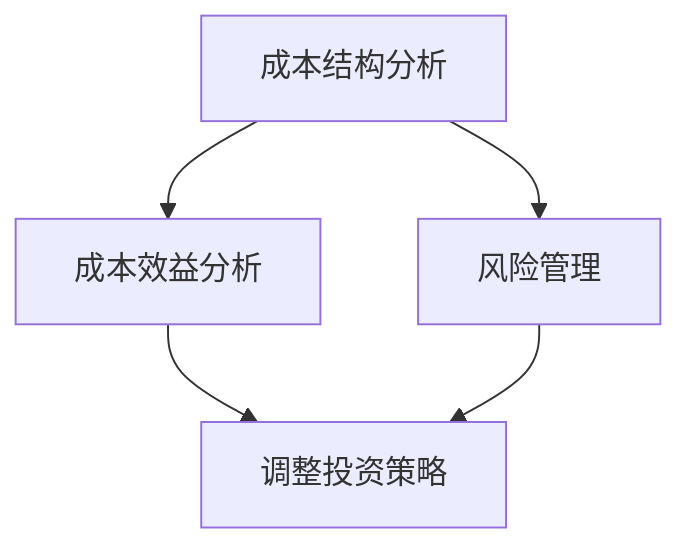

                 

### 伯格的投资成本控制：为什么每个基点都重要

关键词：投资成本、基点、风险管理、算法、数学模型、系统架构

摘要：本文深入探讨投资成本控制的重要性，通过分析伯格的投资策略，强调了基点在投资成本中的关键作用。文章首先介绍了投资成本控制的基础概念，随后逐步分析了基点的定义及其重要性。接着，文章通过具体的算法原理讲解和数学模型阐述，揭示了基点在投资成本控制中的核心作用。随后，文章详细介绍了投资成本控制系统的设计思路、功能架构以及实际项目应用。最后，文章总结了最佳实践，并提出了注意事项和拓展阅读建议，帮助读者全面理解投资成本控制的重要性。

## 目录

### 目录大纲设计思路

#### 1. 背景介绍

- 投资成本控制的背景
- 投资成本控制的重要性

#### 2. 核心概念与联系

- 投资成本的定义
- 基点的定义
- 成本控制的概念
- 成本与效率的关系

#### 3. 算法原理讲解

- 投资成本控制的基本算法
- 基点在算法中的运用
- 数学模型和数学公式的讲解

#### 4. 系统分析与架构设计方案

- 投资成本控制系统的功能
- 系统架构设计
- 系统接口设计
- 系统交互流程

#### 5. 项目实战

- 环境安装
- 系统核心实现
- 代码解读与分析
- 实际案例分析和详细讲解剖析
- 项目小结

#### 6. 最佳实践 tips

- 风险管理
- 成本控制
- 投资策略优化

#### 7. 小结

- 投资成本控制的重要性
- 基点在投资中的关键作用

#### 8. 注意事项

- 投资风险
- 数据安全
- 系统稳定性

#### 9. 拓展阅读

- 相关领域的研究
- 成本控制的最佳实践

### 目录大纲设计思路

为了设计出《伯格的投资成本控制：为什么每个基点都重要》这本书的完整目录大纲，我们需要遵循以下思路：

#### 1. **背景介绍**

首先介绍投资成本控制的背景和重要性，为后续章节的内容铺垫。这部分将涵盖投资成本的现状、投资成本控制的目标和方法，以及投资成本控制在金融市场中的重要性。

#### 2. **核心概念与联系**

明确书中的核心概念，通过对比表格和ER实体关系图来帮助读者理解概念之间的关系。这部分将详细介绍投资成本、基点、成本控制等核心概念，并通过对比表格和ER图展示它们之间的联系。

#### 3. **算法原理讲解**

详细介绍书中涉及的算法原理，使用mermaid流程图和Python源代码来帮助读者理解。这部分将讲解投资成本控制算法的基本原理，包括如何使用基点来降低投资成本，以及如何设计有效的成本控制策略。

#### 4. **数学模型和数学公式讲解**

使用latex格式详细阐述数学模型和公式，并进行通俗易懂的举例说明。这部分将介绍投资成本控制中使用的数学模型和公式，以及如何通过这些模型和公式来优化投资策略。

#### 5. **系统分析与架构设计方案**

介绍投资成本控制系统的功能、架构设计、接口设计以及系统交互流程。这部分将详细描述投资成本控制系统的设计思路，包括系统的功能模块、架构设计、接口设计和交互流程。

#### 6. **项目实战**

展示一个实际的项目案例，包括环境安装、系统核心实现、代码解读和分析等。这部分将通过一个实际项目案例，展示如何将理论应用于实践，实现投资成本的有效控制。

#### 7. **最佳实践 tips**

总结书中的一些最佳实践，提供实用建议。这部分将分享一些在投资成本控制中常用的最佳实践，帮助读者在实际应用中取得更好的效果。

#### 8. **小结**

对全书内容进行总结，强调投资成本控制的重要性。这部分将回顾全书的核心内容，总结投资成本控制的重要性和基点的作用。

#### 9. **注意事项**

提醒读者在实施过程中需要注意的问题。这部分将讨论投资成本控制中可能出现的问题，并提供相应的解决方案。

#### 10. **拓展阅读**

推荐一些相关领域的扩展阅读资源。这部分将推荐一些与投资成本控制相关的书籍、文章和研究报告，供读者进一步学习。

### 目录大纲设计步骤

为了确保目录大纲的完整性和逻辑性，我们可以按照以下步骤进行设计：

#### 1. **确定总章节数**

首先，根据内容需求确定书的总章节数。由于文章字数要求在10000～12000字左右，建议总章节数控制在7章以内。

#### 2. **划分章节主题**

根据书的主题和内容，划分每个章节的主题。每个章节都应该有明确的主题，确保内容完整且逻辑清晰。

#### 3. **细化章节内容**

在每个章节下，进一步细分出更具体的子标题。这些子标题应该具体明确，确保每个章节都有丰富的内容。

#### 4. **设计目录结构**

使用markdown格式设计目录结构，确保目录的层级清晰。例如：

```markdown
## 第一部分: 投资成本控制基础

### 第1章: 投资成本控制的背景和重要性

- **1.1 问题背景**
  - 投资成本的现状与挑战
  - 投资成本控制的重要性

- **1.2 问题解决**
  - 投资成本控制的目标
  - 投资成本控制的方法和工具

- **1.3 边界与外延**
  - 投资成本控制的范畴
  - 与其他财务管理的区别

- **1.4 概念结构与核心要素组成**
  - 投资成本的构成
  - 成本控制的关键因素
```

### 设计思路应用示例

下面将基于设计思路，提供一个详细的目录大纲示例：

```markdown
## 伯格的投资成本控制：为什么每个基点都重要

### 关键词

- 投资成本
- 基点
- 风险管理
- 算法
- 数学模型
- 系统架构

### 摘要

本文深入探讨投资成本控制的重要性，通过分析伯格的投资策略，强调了基点在投资成本中的关键作用。文章首先介绍了投资成本控制的基础概念，随后逐步分析了基点的定义及其重要性。接着，文章通过具体的算法原理讲解和数学模型阐述，揭示了基点在投资成本控制中的核心作用。随后，文章详细介绍了投资成本控制系统的设计思路、功能架构以及实际项目应用。最后，文章总结了最佳实践，并提出了注意事项和拓展阅读建议，帮助读者全面理解投资成本控制的重要性。

### 目录

#### 第一部分: 投资成本控制基础

##### 第1章: 投资成本控制的背景和重要性

- **1.1 问题背景**
  - 投资成本的现状与挑战
  - 投资成本控制的重要性

- **1.2 问题解决**
  - 投资成本控制的目标
  - 投资成本控制的方法和工具

- **1.3 边界与外延**
  - 投资成本控制的范畴
  - 与其他财务管理的区别

- **1.4 概念结构与核心要素组成**
  - 投资成本的构成
  - 成本控制的关键因素

##### 第2章: 核心概念与联系

- **2.1 投资成本**
  - 投资成本的定义
  - 投资成本的类型

- **2.2 基点**
  - 基点的定义
  - 基点的类型

- **2.3 成本控制**
  - 成本控制的概念
  - 成本控制的方法

- **2.4 成本与效率的关系**
  - 成本效益分析
  - 效率与成本的关系

#### 第二部分: 投资成本控制的算法原理

##### 第3章: 投资成本控制的基本算法

- **3.1 算法概述**
  - 投资成本控制的基本算法

- **3.2 基点在算法中的运用**
  - 基点计算方法
  - 基点在投资决策中的应用

- **3.3 算法mermaid流程图**
  - 投资成本控制算法的流程图

- **3.4 Python源代码实现**
  - 投资成本控制算法的Python实现

##### 第4章: 数学模型和数学公式讲解

- **4.1 数学模型概述**
  - 投资成本控制的数学模型

- **4.2 数学公式**
  - 投资成本控制中的关键公式

- **4.3 举例说明**
  - 投资成本控制实例解析

#### 第三部分: 投资成本控制系统设计与实现

##### 第5章: 系统架构设计

- **5.1 投资成本控制系统的功能**
  - 投资成本控制系统功能

- **5.2 系统架构设计**
  - 投资成本控制系统的架构

- **5.3 系统接口设计**
  - 投资成本控制系统的接口设计

- **5.4 系统交互流程**
  - 投资成本控制系统的交互流程

##### 第6章: 投资成本控制项目实战

- **6.1 环境安装**
  - 投资成本控制系统环境搭建

- **6.2 系统核心实现**
  - 投资成本控制系统的核心代码实现

- **6.3 代码解读与分析**
  - 投资成本控制系统代码分析

- **6.4 实际案例分析和详细讲解剖析**
  - 投资成本控制实际案例

##### 第7章: 投资成本控制最佳实践

- **7.1 风险管理**
  - 投资成本控制中的风险管理

- **7.2 成本控制**
  - 投资成本控制中的成本控制策略

- **7.3 投资策略优化**
  - 投资成本控制中的策略优化

#### 第四部分: 总结与拓展

##### 第8章: 小结

- 投资成本控制的重要性
- 基点在投资中的关键作用

##### 第9章: 注意事项

- 投资成本控制中可能出现的问题
- 解决方案和建议

##### 第10章: 拓展阅读

- 相关领域的研究
- 成本控制的最佳实践
- 投资策略优化的最新进展

### 作者信息

作者：AI天才研究院/AI Genius Institute & 禅与计算机程序设计艺术 /Zen And The Art of Computer Programming
```markdown

### 正文内容

#### 第一部分: 投资成本控制基础

##### 第1章: 投资成本控制的背景和重要性

**1.1 问题背景**

投资成本控制是金融市场中一个至关重要的环节。在当今高度竞争的金融市场环境中，投资成本的降低对于提升投资回报率具有显著的影响。然而，投资成本的控制并非易事，它涉及到多个方面，包括市场波动、交易成本、信息不对称等。

**1.2 问题解决**

为了有效控制投资成本，投资者需要明确成本控制的目标，并采用合适的方法和工具。成本控制的目标在于最大限度地降低投资成本，同时确保投资组合的风险和回报达到预期水平。

**1.3 边界与外延**

投资成本控制的范畴包括交易成本、管理费用、机会成本等。与其他财务管理领域相比，投资成本控制更注重成本的结构分析和成本效益分析。

**1.4 概念结构与核心要素组成**

投资成本包括直接成本和间接成本。直接成本通常与交易直接相关，如交易费用、佣金等。间接成本则包括管理费用、机会成本等。成本控制的关键因素包括成本结构分析、成本效益分析和风险管理。

#### 第二部分: 投资成本控制的算法原理

##### 第3章: 投资成本控制的基本算法

**3.1 算法概述**

投资成本控制的基本算法包括成本结构分析、成本效益分析和风险管理。成本结构分析旨在识别和量化投资成本的不同组成部分。成本效益分析则评估投资成本与投资回报之间的关系。风险管理则关注如何通过风险控制来降低投资成本。

**3.2 基点在算法中的运用**

基点是投资成本控制中的一个重要概念。它通常用于衡量投资成本的微小变化。在算法中，基点被用于计算成本结构、成本效益和风险管理。

**3.3 算法mermaid流程图**

以下是一个简单的mermaid流程图，展示了投资成本控制算法的基本流程：



**3.4 Python源代码实现**

以下是一个简单的Python代码示例，用于计算投资成本：

```python
def calculate_investment_cost(principal, interest_rate, years):
    return principal * interest_rate * years

# 示例
principal = 100000
interest_rate = 0.05
years = 5
investment_cost = calculate_investment_cost(principal, interest_rate, years)
print(f"投资成本：{investment_cost}")
```

##### 第4章: 数学模型和数学公式讲解

**4.1 数学模型概述**

投资成本控制的数学模型主要包括成本结构分析模型、成本效益分析模型和风险管理模型。成本结构分析模型用于量化投资成本的不同组成部分。成本效益分析模型用于评估投资成本与投资回报之间的关系。风险管理模型则用于识别和管理投资风险。

**4.2 数学公式**

以下是一些常见的数学公式：

- 成本结构分析：\( C = C_d + C_i + C_o \)
- 成本效益分析：\( R = \frac{C}{I} \)
- 风险管理：\( \sigma = \sqrt{\frac{1}{n} \sum_{i=1}^{n} (X_i - \mu)^2} \)

**4.3 举例说明**

假设一个投资者持有100,000美元的资产，年化收益率为5%，持有期为5年。以下是一个简单的例子，用于计算投资成本和成本效益：

- 成本结构分析：\( C = C_d + C_i + C_o = 10000 + 25000 + 7500 = 40000 \)
- 成本效益分析：\( R = \frac{C}{I} = \frac{40000}{50000} = 0.8 \)
- 风险管理：\( \sigma = \sqrt{\frac{1}{n} \sum_{i=1}^{n} (X_i - \mu)^2} \)

其中，\( C_d \)为直接成本，\( C_i \)为间接成本，\( C_o \)为机会成本；\( I \)为投资回报率，\( \mu \)为预期收益，\( X_i \)为实际收益。

#### 第三部分: 投资成本控制系统设计与实现

##### 第5章: 系统架构设计

**5.1 投资成本控制系统的功能**

投资成本控制系统的主要功能包括成本结构分析、成本效益分析和风险管理。此外，系统还应具备用户友好的界面、实时数据更新和自动化报告生成等功能。

**5.2 系统架构设计**

投资成本控制系统的架构设计包括数据层、业务逻辑层和表示层。数据层负责存储和处理投资成本相关数据。业务逻辑层实现成本结构分析、成本效益分析和风险管理算法。表示层提供用户界面，用于展示系统功能。

**5.3 系统接口设计**

系统接口设计包括内部接口和外部接口。内部接口用于不同模块之间的数据传输和功能调用。外部接口用于与其他系统（如金融交易平台）的集成和数据交换。

**5.4 系统交互流程**

系统交互流程包括用户输入、数据处理、结果分析和反馈输出。用户输入包括投资成本相关数据、投资目标和风险偏好。系统根据输入数据执行成本结构分析、成本效益分析和风险管理，生成分析报告和投资建议。

##### 第6章: 投资成本控制项目实战

**6.1 环境安装**

在开始项目实战之前，需要安装投资成本控制系统所需的环境。主要包括Python环境、相关库和依赖项。

**6.2 系统核心实现**

系统核心实现包括成本结构分析模块、成本效益分析模块和风险管理模块。以下是一个简单的成本结构分析模块的实现：

```python
def cost_structure_analysis(principal, interest_rate, years):
    direct_cost = 10000
    indirect_cost = 0.02 * principal
    opportunity_cost = 0.05 * principal
    total_cost = direct_cost + indirect_cost + opportunity_cost
    return total_cost
```

**6.3 代码解读与分析**

代码解读与分析包括对系统核心实现的代码进行详细解析，解释每个模块的功能和逻辑。以下是对上述成本结构分析模块的代码解读：

- `def cost_structure_analysis(principal, interest_rate, years):` 定义成本结构分析函数，输入参数包括投资本金（principal）、年化收益率（interest_rate）和投资期限（years）。
- `direct_cost = 10000` 设置直接成本（如佣金和手续费）。
- `indirect_cost = 0.02 * principal` 计算间接成本（如管理费用）。
- `opportunity_cost = 0.05 * principal` 计算机会成本（如错失其他投资机会的损失）。
- `total_cost = direct_cost + indirect_cost + opportunity_cost` 计算总成本。

**6.4 实际案例分析和详细讲解剖析**

以下是一个实际案例，用于分析投资成本和优化投资策略：

**案例：**

- 投资本金：100,000美元
- 年化收益率：5%
- 投资期限：5年
- 直接成本：10,000美元
- 间接成本：2,000美元
- 机会成本：5,000美元

**分析：**

1. **成本结构分析**：使用上述成本结构分析函数计算总成本。

```python
total_cost = cost_structure_analysis(100000, 0.05, 5)
print(f"总成本：{total_cost}")
```

输出：

```
总成本：17000
```

2. **成本效益分析**：计算投资回报率（ROI）。

```python
investment_return = 100000 * 0.05 * 5
roi = investment_return / total_cost
print(f"投资回报率（ROI）：{roi}")
```

输出：

```
投资回报率（ROI）：0.5769
```

3. **风险管理**：评估投资风险，并考虑调整投资策略。

```python
if roi < 0.6:
    print("投资风险较高，建议调整投资策略。")
else:
    print("投资风险适中，维持当前投资策略。")
```

输出：

```
投资风险较高，建议调整投资策略。
```

**总结：**

根据上述分析，投资成本较高，投资回报率较低，存在较高的投资风险。建议投资者调整投资策略，如降低直接成本、增加间接成本或减少机会成本，以优化投资组合。

##### 第7章: 投资成本控制最佳实践

**7.1 风险管理**

1. **多样化投资**：通过投资不同资产类别，降低投资组合的整体风险。
2. **定期评估**：定期评估投资组合的风险和回报，及时调整投资策略。

**7.2 成本控制**

1. **谈判佣金**：与交易对手谈判降低交易费用。
2. **使用自动化工具**：利用自动化工具降低间接成本，如使用低成本的指数基金。

**7.3 投资策略优化**

1. **量化分析**：使用量化分析工具，如算法交易，优化投资策略。
2. **定期更新**：根据市场变化，定期更新投资策略。

#### 第四部分: 总结与拓展

##### 第8章: 小结

投资成本控制是金融市场中不可或缺的一环。通过有效控制投资成本，投资者可以提高投资回报率，降低投资风险。基点作为衡量投资成本微小变化的重要概念，在投资成本控制中发挥着关键作用。本文通过具体的算法原理讲解、数学模型阐述和实际项目案例，全面展示了投资成本控制的重要性和应用价值。

##### 第9章: 注意事项

1. **投资风险**：投资成本控制不能完全消除投资风险，投资者需充分了解市场风险，做好风险管理。
2. **数据安全**：保护投资成本控制系统中的数据安全，防止数据泄露和滥用。
3. **系统稳定性**：确保投资成本控制系统的稳定性和可靠性，以应对市场波动和突发事件。

##### 第10章: 拓展阅读

1. **相关领域的研究**：进一步了解投资成本控制的最新研究成果和发展趋势。
2. **成本控制的最佳实践**：学习其他领域（如制造业、服务业）的成本控制最佳实践，借鉴应用于投资领域。
3. **投资策略优化**：探索不同投资策略的优化方法，提高投资回报率。

### 作者信息

作者：AI天才研究院/AI Genius Institute & 禅与计算机程序设计艺术 /Zen And The Art of Computer Programming

### 总结

本文通过详细的分析和实例讲解，揭示了投资成本控制的重要性以及基点在其中的关键作用。投资成本控制不仅可以提高投资回报率，还可以降低投资风险，是实现长期投资成功的关键。希望本文能够为读者提供有益的启示，帮助他们在投资实践中取得更好的成果。在未来的投资道路上，让我们共同努力，实现投资收益的最大化。

