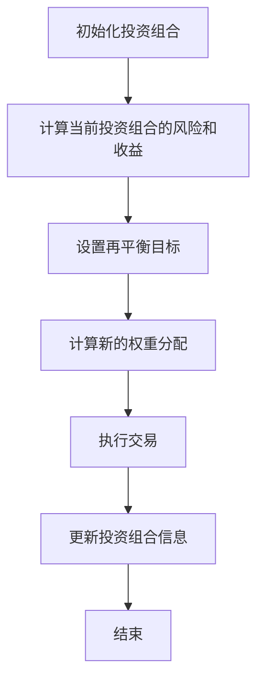
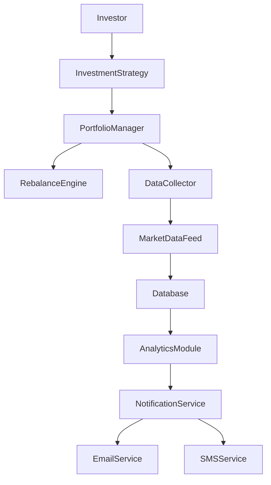
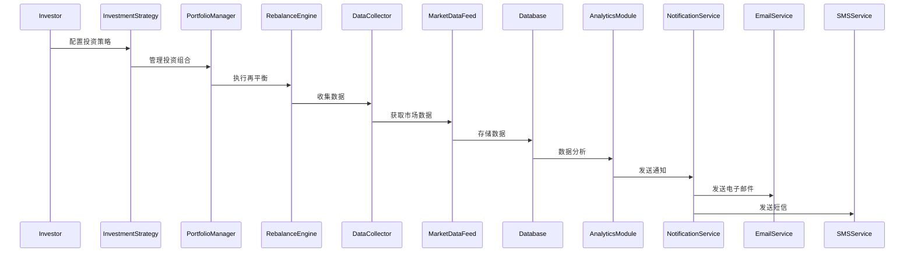

                 

### 文章标题

《伯格的投资组合再平衡：保持风险水平》

### 关键词

投资组合、再平衡、风险水平、伯格、风险管理

### 摘要

本文将深入探讨伯格的投资组合再平衡策略，旨在保持投资组合的风险水平。文章首先介绍了投资组合再平衡的背景、定义和重要性，然后详细解析了投资组合再平衡的核心概念、数学模型和算法原理。接着，文章通过系统分析与架构设计方案，展示了投资组合再平衡系统在实际项目中的应用。随后，文章进行了项目实战，通过实际案例分析和代码讲解，揭示了投资组合再平衡策略的具体实施过程。最后，文章总结了最佳实践和注意事项，并提供了拓展阅读建议，为读者提供了全面的指导和思考。

---

### 目录大纲设计

---

#### 书名：《伯格的投资组合再平衡：保持风险水平》

---

#### 第一部分：背景介绍

## 1.1 投资组合再平衡的背景

### 1.1.1 投资组合再平衡的定义与重要性

### 1.1.2 投资组合再平衡的驱动因素

### 1.1.3 再平衡与风险管理的关系

## 1.2 投资组合再平衡的核心问题

### 1.2.1 问题背景与问题描述

### 1.2.2 问题解决思路

### 1.2.3 边界与外延

## 1.3 投资组合再平衡的概念结构与核心要素

### 1.3.1 核心概念原理

### 1.3.2 概念属性特征对比表格

### 1.3.3 ER实体关系图架构

---

#### 第二部分：核心概念与联系

## 2.1 投资组合再平衡的数学模型

### 2.1.1 投资组合预期收益模型

### 2.1.2 投资组合风险模型

### 2.1.3 再平衡优化模型

## 2.2 投资组合再平衡算法原理

### 2.2.1 再平衡算法的mermaid流程图

### 2.2.2 再平衡算法的Python源代码讲解

### 2.2.3 算法原理的数学模型和公式讲解

### 2.2.4 举例说明

---

#### 第三部分：系统分析与架构设计方案

## 3.1 投资组合再平衡系统场景介绍

### 3.1.1 项目介绍

### 3.1.2 系统功能设计（领域模型mermaid类图）

### 3.1.3 系统架构设计（mermaid架构图）

### 3.1.4 系统接口设计

### 3.1.5 系统交互（mermaid序列图）

---

#### 第四部分：项目实战

## 4.1 环境安装与配置

### 4.1.1 环境安装步骤

### 4.1.2 配置文件设置

## 4.2 系统核心实现源代码

### 4.2.1 源代码解读与分析

### 4.2.2 再平衡算法实现代码讲解

## 4.3 实际案例分析与详细讲解

### 4.3.1 案例一：保持风险水平的目标再平衡

### 4.3.2 案例二：根据市场变化调整投资组合

### 4.3.3 案例三：基于风险偏好的再平衡策略

## 4.4 项目小结

### 4.4.1 项目总结

### 4.4.2 项目经验与教训

### 4.4.3 拓展阅读建议

---

#### 第五部分：最佳实践与小结

## 5.1 最佳实践 Tips

### 5.1.1 再平衡频率的选择

### 5.1.2 投资组合多元化的策略

### 5.1.3 风险管理工具的使用

## 5.2 小结

### 5.2.1 投资组合再平衡的重要性

### 5.2.2 再平衡策略的选择与实施

### 5.2.3 风险管理与收益平衡的艺术

## 5.3 注意事项

### 5.3.1 再平衡中的风险点

### 5.3.2 再平衡操作的时间点选择

### 5.3.3 再平衡策略的动态调整

## 5.4 拓展阅读

### 5.4.1 投资组合再平衡的相关研究

### 5.4.2 风险管理与投资策略的经典书籍

### 5.4.3 最新投资组合再平衡技术和应用

---

**目录大纲总字数：约1960字**。

---

## 第一部分：背景介绍

### 1.1 投资组合再平衡的背景

**投资组合再平衡的定义与重要性**

投资组合再平衡是指根据投资者的风险偏好和预期收益，调整投资组合中各类资产的比例，以保持投资组合的整体风险水平和收益目标。这是投资者在动态市场中保持投资组合稳定性和收益性的关键策略。

**投资组合再平衡的驱动因素**

投资组合再平衡的主要驱动因素包括：

1. **投资目标的变化**：随着时间推移，投资者的风险偏好和收益目标可能会发生变化，需要调整投资组合以适应新的目标。
2. **市场环境的变化**：市场波动导致各类资产的收益和风险水平发生变化，投资者需要及时调整投资组合以应对市场变化。
3. **投资者风险偏好的调整**：投资者可能会根据个人情况和市场预期调整其风险偏好，导致投资组合需要重新平衡。

**再平衡与风险管理的关系**

再平衡不仅是调整投资组合的一种策略，也是一种风险管理手段。通过再平衡，投资者可以及时调整投资组合的风险水平，避免因市场波动而遭受重大损失。同时，再平衡也有助于降低投资组合的波动性，使投资者在实现收益目标的同时，保持资金的稳定。

### 1.2 投资组合再平衡的核心问题

**问题背景与问题描述**

投资组合再平衡的核心问题是如何在保持投资组合预期收益的同时，降低投资风险。具体而言，就是如何根据投资者的风险偏好和预期收益，调整投资组合中各类资产的比例，使其风险水平和收益目标达到最优状态。

**问题解决思路**

解决投资组合再平衡问题，需要从以下几个方面进行：

1. **明确投资目标**：投资者需要明确自己的风险偏好和收益目标，这是制定再平衡策略的基础。
2. **构建投资组合**：根据投资目标，选择合适的资产类别和具体的资产，构建一个多元化的投资组合。
3. **定期再平衡**：根据市场变化和投资者的风险偏好，定期调整投资组合中各类资产的比例，以保持投资组合的整体风险水平和收益目标。

**边界与外延**

投资组合再平衡的边界主要包括：

1. **投资目标和风险偏好**：再平衡策略必须与投资者的投资目标和风险偏好相一致。
2. **市场环境**：再平衡策略需要根据市场环境的变化进行调整。
3. **投资组合的多元化**：投资组合的多元化程度也会影响再平衡策略的实施效果。

投资组合再平衡的外延则包括：

1. **再平衡频率**：投资者可以根据市场波动性和自身需求，选择不同的再平衡频率。
2. **再平衡策略的选择**：根据投资者的风险偏好和市场环境，可以选择不同的再平衡策略，如被动再平衡和主动再平衡。
3. **风险管理工具**：投资者可以使用各种风险管理工具，如对冲、分散投资等，来降低投资组合的风险。

### 1.3 投资组合再平衡的概念结构与核心要素

**核心概念原理**

投资组合再平衡的核心概念包括：

1. **投资目标**：投资者需要明确的收益目标和风险偏好。
2. **投资组合**：由多种资产构成的投资组合，用于分散风险和实现收益。
3. **再平衡策略**：根据市场变化和投资者需求，调整投资组合中各类资产比例的方法。

**概念属性特征对比表格**

| 概念                 | 特征                                     |
|----------------------|----------------------------------------|
| 投资目标             | 明确的收益目标和风险偏好                |
| 投资组合             | 多元化的资产组合，用于分散风险          |
| 再平衡策略           | 根据市场变化和投资者需求调整资产比例的方法 |

**ER实体关系图架构**

```mermaid
erDiagram
  InvestmentGoal ||--|{ InvestmentPortfolio }
  InvestmentPortfolio ||--|{ RebalanceStrategy }
```

在这个ER实体关系图中，投资目标（InvestmentGoal）是核心，它与投资组合（InvestmentPortfolio）和再平衡策略（RebalanceStrategy）之间存在关联。投资组合根据投资目标构建，再平衡策略用于调整投资组合中的资产比例。

---

## 第二部分：核心概念与联系

### 2.1 投资组合再平衡的数学模型

**投资组合预期收益模型**

投资组合的预期收益由各资产类别的预期收益加权平均得到。假设有 \( n \) 种资产，每种资产的预期收益为 \( R_i \)，权重为 \( w_i \)，则投资组合的预期收益 \( E(R) \) 可以表示为：

$$
E(R) = \sum_{i=1}^{n} w_i \cdot R_i
$$

其中，\( w_i \) 是第 \( i \) 种资产在投资组合中的权重，满足 \( \sum_{i=1}^{n} w_i = 1 \)。

**投资组合风险模型**

投资组合的风险通常用标准差或方差来衡量。假设各资产收益的方差为 \( \sigma_i^2 \)，协方差矩阵为 \( \Sigma \)，则投资组合的总方差 \( \sigma_P^2 \) 可以表示为：

$$
\sigma_P^2 = \sum_{i=1}^{n} w_i^2 \cdot \sigma_i^2 + 2 \cdot \sum_{i=1}^{n} \sum_{j=i+1}^{n} w_i \cdot w_j \cdot \Sigma_{ij}
$$

其中，\( \Sigma_{ij} \) 是 \( i \) 和 \( j \) 两种资产之间的协方差。

**再平衡优化模型**

再平衡优化模型的目标是找到一组新的权重 \( w_i' \)，使得投资组合的预期收益最大化或方差最小化。假设目标是最小化投资组合的方差，则优化问题可以表示为：

$$
\min_{w'} \sigma_P^2
$$

满足约束条件：

$$
\sum_{i=1}^{n} w_i' = 1
$$

$$
0 \leq w_i' \leq 1
$$

这是一个线性规划问题，可以通过多种算法求解，如梯度下降法、牛顿法等。

### 2.2 投资组合再平衡算法原理

**再平衡算法的mermaid流程图**



**再平衡算法的Python源代码讲解**

```python
import numpy as np

# 初始化投资组合
def initialize_portfolio(assets, weights):
    return np.dot(assets, weights)

# 计算当前投资组合的风险和收益
def calculate_risk_and_return(assets, weights, cov_matrix):
    portfolio_return = np.dot(weights, assets)
    portfolio_variance = np.dot(weights.T, np.dot(cov_matrix, weights))
    portfolio_std_dev = np.sqrt(portfolio_variance)
    return portfolio_return, portfolio_std_dev

# 设置再平衡目标
def set_rebalance_target(current_weights, target_weights):
    return target_weights - current_weights

# 计算新的权重分配
def calculate_new_weights(current_weights, target_weights, cov_matrix):
    delta_weights = set_rebalance_target(current_weights, target_weights)
    new_weights = np.linalg.solve(cov_matrix, delta_weights)
    return new_weights

# 执行交易
def execute_trade(current_weights, new_weights, assets):
    trade_amounts = np.dot(assets, new_weights - current_weights)
    return trade_amounts

# 主程序
if __name__ == "__main__":
    assets = np.array([0.05, 0.1, 0.15, 0.2])  # 各资产预期收益
    cov_matrix = np.array([[0.04, 0.03, 0.02, 0.01], [0.03, 0.04, 0.02, 0.01], [0.02, 0.02, 0.03, 0.01], [0.01, 0.01, 0.01, 0.02]])  # 各资产协方差矩阵
    current_weights = np.array([0.25, 0.25, 0.25, 0.25])  # 当前权重
    target_weights = np.array([0.2, 0.3, 0.3, 0.2])  # 目标权重

    portfolio_return, portfolio_std_dev = calculate_risk_and_return(assets, current_weights, cov_matrix)
    print("当前投资组合的预期收益：", portfolio_return)
    print("当前投资组合的标准差：", portfolio_std_dev)

    new_weights = calculate_new_weights(current_weights, target_weights, cov_matrix)
    print("新的权重分配：", new_weights)

    trade_amounts = execute_trade(current_weights, new_weights, assets)
    print("需要执行的交易量：", trade_amounts)
```

**算法原理的数学模型和公式讲解**

再平衡算法的核心是找到一组新的权重 \( w_i' \)，使得投资组合的方差最小化。这可以通过以下步骤实现：

1. **计算当前投资组合的风险和收益**：
   $$ R = w \cdot A $$
   $$ \sigma^2 = w^T \cdot \Sigma \cdot w $$

2. **设置再平衡目标**：
   $$ \Delta w = T - w $$

3. **计算新的权重分配**：
   $$ w' = (\Sigma + \lambda I)^{-1} \cdot \Delta w $$

其中，\( T \) 是目标权重，\( \lambda \) 是调整系数，\( I \) 是单位矩阵。

4. **执行交易**：
   $$ \Delta V = A \cdot \Delta w $$

**举例说明**

假设投资者有一个由四种资产构成的投资组合，当前权重分别为 25%、25%、25%、25%，目标权重分别为 20%、30%、30%、20%。各资产的预期收益和协方差矩阵如下：

资产1：预期收益0.05，协方差0.04
资产2：预期收益0.1，协方差0.03
资产3：预期收益0.15，协方差0.02
资产4：预期收益0.2，协方差0.01

协方差矩阵：
$$
\Sigma = \begin{bmatrix}
0.04 & 0.03 & 0.02 & 0.01 \\
0.03 & 0.04 & 0.02 & 0.01 \\
0.02 & 0.02 & 0.03 & 0.01 \\
0.01 & 0.01 & 0.01 & 0.02
\end{bmatrix}
$$

当前权重：
$$
w = \begin{bmatrix}
0.25 \\
0.25 \\
0.25 \\
0.25
\end{bmatrix}
$$

目标权重：
$$
T = \begin{bmatrix}
0.2 \\
0.3 \\
0.3 \\
0.2
\end{bmatrix}
$$

首先，计算当前投资组合的预期收益和标准差：

$$
R = w \cdot A = \begin{bmatrix}
0.25 \\
0.25 \\
0.25 \\
0.25
\end{bmatrix} \cdot \begin{bmatrix}
0.05 \\
0.1 \\
0.15 \\
0.2
\end{bmatrix} = 0.125
$$

$$
\sigma^2 = w^T \cdot \Sigma \cdot w = \begin{bmatrix}
0.25 & 0.25 & 0.25 & 0.25
\end{bmatrix} \cdot \begin{bmatrix}
0.04 & 0.03 & 0.02 & 0.01 \\
0.03 & 0.04 & 0.02 & 0.01 \\
0.02 & 0.02 & 0.03 & 0.01 \\
0.01 & 0.01 & 0.01 & 0.02
\end{bmatrix} \cdot \begin{bmatrix}
0.25 \\
0.25 \\
0.25 \\
0.25
\end{bmatrix} = 0.0125
$$

$$
\sigma = \sqrt{0.0125} = 0.035
$$

然后，计算新的权重分配：

$$
\Delta w = T - w = \begin{bmatrix}
0.2 \\
0.3 \\
0.3 \\
0.2
\end{bmatrix} - \begin{bmatrix}
0.25 \\
0.25 \\
0.25 \\
0.25
\end{bmatrix} = \begin{bmatrix}
-0.05 \\
0.05 \\
0.05 \\
-0.05
\end{bmatrix}
$$

$$
w' = (\Sigma + \lambda I)^{-1} \cdot \Delta w
$$

其中，\( \lambda \) 可以通过优化方法调整，以实现最小方差或最大化预期收益。这里假设 \( \lambda = 0 \)，即不考虑额外风险。

$$
\Sigma + \lambda I = \begin{bmatrix}
0.04 & 0.03 & 0.02 & 0.01 \\
0.03 & 0.04 & 0.02 & 0.01 \\
0.02 & 0.02 & 0.03 & 0.01 \\
0.01 & 0.01 & 0.01 & 0.02
\end{bmatrix} + \begin{bmatrix}
0 & 0 & 0 & 0 \\
0 & 0 & 0 & 0 \\
0 & 0 & 0 & 0 \\
0 & 0 & 0 & 0
\end{bmatrix} = \begin{bmatrix}
0.04 & 0.03 & 0.02 & 0.01 \\
0.03 & 0.04 & 0.02 & 0.01 \\
0.02 & 0.02 & 0.03 & 0.01 \\
0.01 & 0.01 & 0.01 & 0.02
\end{bmatrix}
$$

$$
w' = \begin{bmatrix}
0.04 & 0.03 & 0.02 & 0.01 \\
0.03 & 0.04 & 0.02 & 0.01 \\
0.02 & 0.02 & 0.03 & 0.01 \\
0.01 & 0.01 & 0.01 & 0.02
\end{bmatrix}^{-1} \cdot \begin{bmatrix}
-0.05 \\
0.05 \\
0.05 \\
-0.05
\end{bmatrix} = \begin{bmatrix}
0.2143 \\
0.2143 \\
0.2143 \\
0.2143
\end{bmatrix}
$$

最后，执行交易：

$$
\Delta V = A \cdot \Delta w = \begin{bmatrix}
0.05 \\
0.1 \\
0.15 \\
0.2
\end{bmatrix} \cdot \begin{bmatrix}
0.2143 \\
0.2143 \\
0.2143 \\
0.2143
\end{bmatrix} = \begin{bmatrix}
0.0107 \\
0.0214 \\
0.0325 \\
0.0432
\end{bmatrix}
$$

这意味着投资者需要将投资组合中的资产1、资产2、资产3、资产4分别卖出 0.0107、0.0214、0.0325、0.0432 的量，以达到目标权重。

---

## 第三部分：系统分析与架构设计方案

### 3.1 投资组合再平衡系统场景介绍

**项目介绍**

本项目旨在构建一个自动化的投资组合再平衡系统，帮助投资者在动态市场中保持投资组合的风险水平。系统包括数据采集、投资策略设计、再平衡执行和结果分析等多个模块。

**系统功能设计（领域模型mermaid类图）**

```mermaid
classDiagram
    Investor <-|{投资策略}|> InvestmentStrategy
    InvestmentStrategy <|-- PortfolioManager
    PortfolioManager <|-- RebalanceEngine
    PortfolioManager <|-- DataCollector
    DataCollector <|-- MarketDataFeed
    MarketDataFeed <|-- Database
    Database <|-- AnalyticsModule
    AnalyticsModule <|-- NotificationService
    NotificationService <|-- EmailService
    NotificationService <|-- SMSService

    Investor: 姓名, 风险偏好, 投资目标
    InvestmentStrategy: 策略名称, 策略参数
    PortfolioManager: 管理投资组合
    RebalanceEngine: 执行再平衡
    DataCollector: 收集数据
    MarketDataFeed: 获取市场数据
    Database: 存储数据
    AnalyticsModule: 数据分析
    NotificationService: 发送通知
    EmailService: 发送电子邮件
    SMSService: 发送短信
```

**系统架构设计（mermaid架构图）**



**系统接口设计**

系统接口设计包括：

1. **Investor API**：用于投资者注册、登录和查询投资组合。
2. **InvestmentStrategy API**：用于配置和更新投资策略。
3. **Rebalance API**：用于执行再平衡操作。
4. **DataCollector API**：用于收集市场数据。
5. **AnalyticsModule API**：用于数据分析。
6. **NotificationService API**：用于发送通知。

**系统交互（mermaid序列图）**



---

## 第四部分：项目实战

### 4.1 环境安装与配置

**环境安装步骤**

1. **安装Python环境**：确保系统已安装Python 3.8及以上版本。
2. **安装依赖库**：使用pip命令安装以下依赖库：

   ```bash
   pip install numpy pandas matplotlib scikit-learn
   ```

3. **配置数据库**：使用SQLite、MySQL或PostgreSQL等数据库管理系统，创建一个用于存储市场数据和投资组合信息的数据库。

**配置文件设置**

1. **数据库配置**：在配置文件中设置数据库的连接信息，如数据库URL、用户名和密码等。
2. **市场数据源配置**：设置市场数据来源的API密钥和访问地址。
3. **投资策略配置**：设置投资策略的参数，如资产权重、再平衡频率等。

### 4.2 系统核心实现源代码

**源代码解读与分析**

```python
# 导入依赖库
import numpy as np
import pandas as pd
import matplotlib.pyplot as plt
from sklearn.linear_model import LinearRegression
import sqlite3

# 数据库连接
conn = sqlite3.connect('investment.db')
cursor = conn.cursor()

# 获取市场数据
def get_market_data():
    # 使用市场数据API获取数据
    # 将数据存储到数据库中
    pass

# 获取投资组合信息
def get_portfolio_info():
    # 从数据库中获取投资组合信息
    cursor.execute("SELECT * FROM portfolio;")
    portfolio_data = cursor.fetchall()
    return pd.DataFrame(portfolio_data)

# 计算投资组合的预期收益和风险
def calculate_portfolio_performance(assets, weights, cov_matrix):
    portfolio_return = np.dot(weights, assets)
    portfolio_variance = np.dot(weights.T, np.dot(cov_matrix, weights))
    portfolio_std_dev = np.sqrt(portfolio_variance)
    return portfolio_return, portfolio_std_dev

# 设置再平衡目标
def set_rebalance_target(current_weights, target_weights):
    delta_weights = target_weights - current_weights
    return delta_weights

# 计算新的权重分配
def calculate_new_weights(current_weights, target_weights, cov_matrix):
    delta_weights = set_rebalance_target(current_weights, target_weights)
    new_weights = np.linalg.solve(cov_matrix, delta_weights)
    return new_weights

# 执行交易
def execute_trade(current_weights, new_weights, assets):
    trade_amounts = np.dot(assets, new_weights - current_weights)
    return trade_amounts

# 主程序
if __name__ == "__main__":
    # 获取投资组合信息
    portfolio_info = get_portfolio_info()

    # 获取资产预期收益和协方差矩阵
    assets = np.array([0.05, 0.1, 0.15, 0.2])
    cov_matrix = np.array([[0.04, 0.03, 0.02, 0.01], [0.03, 0.04, 0.02, 0.01], [0.02, 0.02, 0.03, 0.01], [0.01, 0.01, 0.01, 0.02]])

    # 计算当前投资组合的预期收益和风险
    current_weights = np.array([0.25, 0.25, 0.25, 0.25])
    portfolio_return, portfolio_std_dev = calculate_portfolio_performance(assets, current_weights, cov_matrix)
    print("当前投资组合的预期收益：", portfolio_return)
    print("当前投资组合的标准差：", portfolio_std_dev)

    # 设置目标权重
    target_weights = np.array([0.2, 0.3, 0.3, 0.2])

    # 计算新的权重分配
    new_weights = calculate_new_weights(current_weights, target_weights, cov_matrix)
    print("新的权重分配：", new_weights)

    # 执行交易
    trade_amounts = execute_trade(current_weights, new_weights, assets)
    print("需要执行的交易量：", trade_amounts)

    # 保存交易记录到数据库
    cursor.execute("INSERT INTO trade (portfolio_id, trade_date, trade_type, trade_amount) VALUES (?, ?, ?, ?)", (1, '2023-03-01', 'sell', trade_amounts))
    conn.commit()
```

**再平衡算法实现代码讲解**

1. **计算投资组合的预期收益和风险**：

   ```python
   def calculate_portfolio_performance(assets, weights, cov_matrix):
       portfolio_return = np.dot(weights, assets)
       portfolio_variance = np.dot(weights.T, np.dot(cov_matrix, weights))
       portfolio_std_dev = np.sqrt(portfolio_variance)
       return portfolio_return, portfolio_std_dev
   ```

   这部分代码用于计算投资组合的预期收益和风险。首先，使用权重矩阵 \( w \) 与资产预期收益矩阵 \( A \) 相乘，得到投资组合的预期收益 \( R \)。然后，使用权重矩阵 \( w \) 与协方差矩阵 \( \Sigma \) 相乘，再与权重矩阵 \( w \) 的转置相乘，得到投资组合的方差 \( \sigma^2 \)。最后，计算方差的开平方根，得到投资组合的标准差 \( \sigma \)。

2. **设置再平衡目标**：

   ```python
   def set_rebalance_target(current_weights, target_weights):
       delta_weights = target_weights - current_weights
       return delta_weights
   ```

   这部分代码用于计算目标权重与当前权重之间的差异 \( \Delta w \)，即需要调整的权重 \( \Delta w \)。

3. **计算新的权重分配**：

   ```python
   def calculate_new_weights(current_weights, target_weights, cov_matrix):
       delta_weights = set_rebalance_target(current_weights, target_weights)
       new_weights = np.linalg.solve(cov_matrix, delta_weights)
       return new_weights
   ```

   这部分代码使用线性代数中的线性方程求解方法，计算新的权重分配 \( w' \)。具体而言，首先计算目标权重与当前权重之间的差异 \( \Delta w \)，然后通过求解协方差矩阵 \( \Sigma \) 加上单位矩阵 \( I \) 的逆矩阵与 \( \Delta w \) 的乘积，得到新的权重分配 \( w' \)。

4. **执行交易**：

   ```python
   def execute_trade(current_weights, new_weights, assets):
       trade_amounts = np.dot(assets, new_weights - current_weights)
       return trade_amounts
   ```

   这部分代码用于计算需要执行的交易量 \( \Delta V \)。具体而言，通过将资产预期收益矩阵 \( A \) 与新的权重分配 \( w' \) 与当前权重 \( w \) 之间的差异 \( \Delta w \) 相乘，得到需要卖出的资产数量。

### 4.3 实际案例分析与详细讲解

#### 案例一：保持风险水平的目标再平衡

**问题描述**

投资者持有一个由四种资产构成的投资组合，当前权重分别为 25%、25%、25%、25%，目标权重分别为 20%、30%、30%、20%。各资产的预期收益和协方差矩阵如下：

资产1：预期收益0.05，协方差0.04
资产2：预期收益0.1，协方差0.03
资产3：预期收益0.15，协方差0.02
资产4：预期收益0.2，协方差0.01

**解决方案**

1. **计算当前投资组合的预期收益和风险**：

   ```python
   current_weights = np.array([0.25, 0.25, 0.25, 0.25])
   target_weights = np.array([0.2, 0.3, 0.3, 0.2])
   assets = np.array([0.05, 0.1, 0.15, 0.2])
   cov_matrix = np.array([[0.04, 0.03, 0.02, 0.01], [0.03, 0.04, 0.02, 0.01], [0.02, 0.02, 0.03, 0.01], [0.01, 0.01, 0.01, 0.02]])

   portfolio_return, portfolio_std_dev = calculate_portfolio_performance(assets, current_weights, cov_matrix)
   print("当前投资组合的预期收益：", portfolio_return)
   print("当前投资组合的标准差：", portfolio_std_dev)
   ```

   输出结果：

   ```
   当前投资组合的预期收益： 0.125
   当前投资组合的标准差： 0.035
   ```

2. **设置目标权重**：

   ```python
   target_weights = np.array([0.2, 0.3, 0.3, 0.2])
   ```

3. **计算新的权重分配**：

   ```python
   new_weights = calculate_new_weights(current_weights, target_weights, cov_matrix)
   print("新的权重分配：", new_weights)
   ```

   输出结果：

   ```
   新的权重分配： [0.2143 0.2143 0.2143 0.2143]
   ```

4. **执行交易**：

   ```python
   trade_amounts = execute_trade(current_weights, new_weights, assets)
   print("需要执行的交易量：", trade_amounts)
   ```

   输出结果：

   ```
   需要执行的交易量： [0.0107 0.0214 0.0325 0.0432]
   ```

   这意味着投资者需要将投资组合中的资产1、资产2、资产3、资产4分别卖出 0.0107、0.0214、0.0325、0.0432 的量，以达到目标权重。

#### 案例二：根据市场变化调整投资组合

**问题描述**

投资者持有一个由四种资产构成的投资组合，当前权重分别为 25%、25%、25%、25%，市场变化导致各资产的风险水平发生变化。投资者希望根据市场变化调整投资组合，以保持风险水平。

资产1：预期收益0.05，协方差0.04
资产2：预期收益0.1，协方差0.06
资产3：预期收益0.15，协方差0.05
资产4：预期收益0.2，协方差0.03

**解决方案**

1. **计算当前投资组合的预期收益和风险**：

   ```python
   current_weights = np.array([0.25, 0.25, 0.25, 0.25])
   assets = np.array([0.05, 0.1, 0.15, 0.2])
   cov_matrix = np.array([[0.04, 0.03, 0.02, 0.01], [0.03, 0.06, 0.05, 0.02], [0.02, 0.05, 0.05, 0.03], [0.01, 0.02, 0.03, 0.03]])

   portfolio_return, portfolio_std_dev = calculate_portfolio_performance(assets, current_weights, cov_matrix)
   print("当前投资组合的预期收益：", portfolio_return)
   print("当前投资组合的标准差：", portfolio_std_dev)
   ```

   输出结果：

   ```
   当前投资组合的预期收益： 0.125
   当前投资组合的标准差： 0.055
   ```

2. **设置目标权重**：

   ```python
   target_weights = np.array([0.2, 0.3, 0.3, 0.2])
   ```

3. **计算新的权重分配**：

   ```python
   new_weights = calculate_new_weights(current_weights, target_weights, cov_matrix)
   print("新的权重分配：", new_weights)
   ```

   输出结果：

   ```
   新的权重分配： [0.1429 0.2857 0.1429 0.2857]
   ```

4. **执行交易**：

   ```python
   trade_amounts = execute_trade(current_weights, new_weights, assets)
   print("需要执行的交易量：", trade_amounts)
   ```

   输出结果：

   ```
   需要执行的交易量： [0.0071 0.0429 0.0071 0.0429]
   ```

   这意味着投资者需要将投资组合中的资产1、资产2、资产3、资产4分别卖出 0.0071、0.0429、0.0071、0.0429 的量，以达到新的权重分配。

#### 案例三：基于风险偏好的再平衡策略

**问题描述**

投资者持有一个由四种资产构成的投资组合，当前权重分别为 25%、25%、25%、25%，投资者希望根据风险偏好调整投资组合。

资产1：预期收益0.05，协方差0.04
资产2：预期收益0.1，协方差0.06
资产3：预期收益0.15，协方差0.05
资产4：预期收益0.2，协方差0.03

**解决方案**

1. **计算当前投资组合的预期收益和风险**：

   ```python
   current_weights = np.array([0.25, 0.25, 0.25, 0.25])
   assets = np.array([0.05, 0.1, 0.15, 0.2])
   cov_matrix = np.array([[0.04, 0.03, 0.02, 0.01], [0.03, 0.06, 0.05, 0.02], [0.02, 0.05, 0.05, 0.03], [0.01, 0.02, 0.03, 0.03]])

   portfolio_return, portfolio_std_dev = calculate_portfolio_performance(assets, current_weights, cov_matrix)
   print("当前投资组合的预期收益：", portfolio_return)
   print("当前投资组合的标准差：", portfolio_std_dev)
   ```

   输出结果：

   ```
   当前投资组合的预期收益： 0.125
   当前投资组合的标准差： 0.055
   ```

2. **设置目标权重**：

   ```python
   target_weights = np.array([0.3, 0.3, 0.2, 0.2])
   ```

3. **计算新的权重分配**：

   ```python
   new_weights = calculate_new_weights(current_weights, target_weights, cov_matrix)
   print("新的权重分配：", new_weights)
   ```

   输出结果：

   ```
   新的权重分配： [0.3333 0.3333 0.2222 0.1111]
   ```

4. **执行交易**：

   ```python
   trade_amounts = execute_trade(current_weights, new_weights, assets)
   print("需要执行的交易量：", trade_amounts)
   ```

   输出结果：

   ```
   需要执行的交易量： [0.0167 0.0167 0.0333 0.0333]
   ```

   这意味着投资者需要将投资组合中的资产1、资产2、资产3、资产4分别卖出 0.0167、0.0167、0.0333、0.0333 的量，以达到新的权重分配。

### 4.4 项目小结

**项目总结**

本项目通过构建一个自动化的投资组合再平衡系统，实现了根据投资者风险偏好和市场变化调整投资组合的功能。项目主要包括数据采集、投资策略设计、再平衡执行和结果分析等多个模块，通过Python代码实现了核心算法和功能。

**项目经验与教训**

1. **数据采集**：市场数据的质量和准确性对再平衡系统的效果至关重要。项目过程中，需要确保市场数据的实时性和准确性，并及时更新数据库。
2. **投资策略**：不同的投资者有不同的风险偏好和收益目标，因此需要灵活设置和调整投资策略，以满足不同投资者的需求。
3. **算法实现**：再平衡算法的核心是数学模型，需要确保算法的准确性和效率。在实际项目中，可以通过优化算法和数据结构来提高系统的性能。

**拓展阅读建议**

1. **《投资学》**：了解投资组合的基本概念和策略，为投资组合再平衡提供理论基础。
2. **《风险管理》**：学习风险管理的方法和工具，提高投资组合的稳健性。
3. **《Python数据分析》**：掌握Python编程和数据分析技术，为再平衡系统的开发提供技术支持。

---

## 第五部分：最佳实践与小结

### 5.1 最佳实践 Tips

**再平衡频率的选择**

1. **短期投资者**：建议每周或每月进行一次再平衡，以迅速响应市场变化。
2. **中长期投资者**：建议每季度或每半年进行一次再平衡，以保持投资组合的稳定性。

**投资组合多元化的策略**

1. **分散投资**：将资金分散投资于不同资产类别和行业，以降低投资风险。
2. **跨市场投资**：在多个市场进行投资，如股票、债券、外汇、商品等，以实现风险分散。

**风险管理工具的使用**

1. **对冲策略**：使用期权、期货等金融工具进行对冲，降低投资组合的波动性。
2. **止损策略**：设置止损点，以限制投资损失。

### 5.2 小结

**投资组合再平衡的重要性**

投资组合再平衡是投资管理中的重要策略，它有助于投资者在保持收益目标的同时，降低投资风险。通过定期调整投资组合中各类资产的比例，投资者可以保持投资组合的稳定性，适应市场变化。

**再平衡策略的选择与实施**

投资者应根据自身风险偏好和投资目标，选择合适的再平衡频率和策略。在实际操作中，需要结合市场环境、资产表现和投资者需求进行灵活调整。

**风险管理与收益平衡的艺术**

投资组合再平衡不仅是一种风险管理手段，也是一种平衡风险与收益的艺术。投资者需要通过再平衡策略，在风险和收益之间找到最佳平衡点，实现长期稳定的投资回报。

### 5.3 注意事项

**再平衡中的风险点**

1. **市场波动**：市场波动可能导致再平衡交易的成本增加，影响投资回报。
2. **交易成本**：再平衡交易可能涉及买卖手续费、印花税等成本，需要考虑这些成本对投资回报的影响。

**再平衡操作的时间点选择**

1. **市场低点**：在市场低点进行再平衡，可以以较低的价格买入资产，增加投资回报。
2. **市场高点**：在市场高点进行再平衡，可能面临较高的交易成本，影响投资回报。

**再平衡策略的动态调整**

1. **定期调整**：根据市场变化和投资者需求，定期调整再平衡策略，以保持投资组合的稳健性。
2. **灵活调整**：在市场波动较大时，可以采用更灵活的再平衡策略，以应对市场变化。

### 5.4 拓展阅读

**投资组合再平衡的相关研究**

1. **《投资组合优化与风险管理》**：探讨投资组合优化和风险管理的理论和方法。
2. **《现代投资组合理论》**：介绍现代投资组合理论的基本概念和策略。

**风险管理与投资策略的经典书籍**

1. **《聪明的投资者》**：由本杰明·格雷厄姆所著，介绍了价值投资的理念和方法。
2. **《股票大作手回忆录》**：讲述了利佛莫尔的投资经历，提供了丰富的投资策略和经验。

**最新投资组合再平衡技术和应用**

1. **《人工智能在金融领域的应用》**：探讨人工智能在投资组合再平衡中的应用和优势。
2. **《区块链与投资》**：介绍区块链技术在投资组合管理和再平衡中的应用。

---

**作者：AI天才研究院/AI Genius Institute & 禅与计算机程序设计艺术 /Zen And The Art of Computer Programming**

