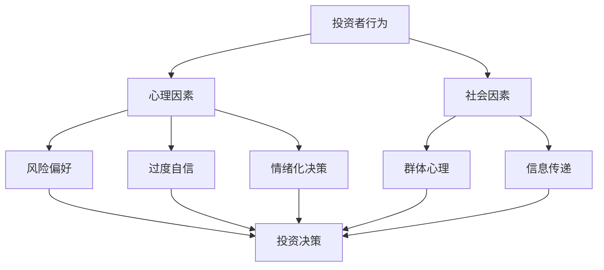

                 

### 《伯格的投资者行为研究：避免常见错误》

#### 关键词：投资者行为、错误避免、行为金融学、心理偏差、策略实践

#### 摘要：
本文将深入探讨伯格的投资者行为研究，通过详细分析投资者行为的常见错误，提出相应的避免策略。文章首先介绍了投资者行为研究的背景和重要性，接着讨论了核心概念与联系，随后详细讲解了投资者行为的算法原理和数学模型。在此基础上，文章分析了投资者行为的常见错误，包括过度交易、过度自信、情绪化决策和跟风心理，并给出了行为金融学理论下的投资者行为分析。文章还通过案例研究，展示了成功投资者的行为模式和避免投资者行为错误的方法。最后，文章总结并展望了投资者行为研究的未来方向。

----------------------------------------------------------------

### 第一部分：投资者行为研究概述

#### 1.1 投资者行为研究的背景与重要性

投资者行为研究作为金融学研究的一个分支，源于20世纪70年代。在传统经济学假设中，投资者是理性且信息完全的，但这与实际情况不符。投资者在实际投资过程中，会表现出许多非理性行为，如过度交易、过度自信等。这些行为不仅影响个人财富，也对市场稳定性产生重大影响。

投资者行为的定义指的是投资者在投资决策过程中的心理和行为表现。研究投资者行为的重要性在于，它可以帮助我们理解市场的波动性，发现投资机会，制定有效的投资策略，从而提高投资回报率。

#### 1.2 投资者行为的核心概念与联系

投资者行为的核心概念包括风险偏好、过度自信、群体心理等。风险偏好是指投资者对不同风险水平的偏好程度；过度自信是指投资者高估自己的能力和信息优势；群体心理则是指投资者在市场中受到其他投资者行为和情绪的影响。

以下是一个核心概念对比表格：

| 核心概念 | 定义 | 属性特征对比 |
| :----: | :----: | :----: |
| 风险偏好 | 投资者对不同风险水平的偏好程度 | 低风险偏好：倾向于保守投资；高风险偏好：倾向于冒险投资 |
| 过度自信 | 投资者高估自己的能力和信息优势 | 实际能力不高，但自信心强；信息优势不明显，但自认为信息全面 |
| 群体心理 | 投资者在市场中受到其他投资者行为和情绪的影响 | 群体情绪波动大；跟随群体行为，忽视独立思考 |

这些核心概念之间存在紧密联系。例如，过度自信可能引发投资者进行高风险投资，而群体心理则可能导致市场出现泡沫或恐慌。

#### 1.3 投资者行为研究的数学模型与方法

投资者行为研究的数学模型主要包括行为经济学和心理学模型。行为经济学模型，如前景理论（Prospect Theory），描述了投资者在面临收益和损失时的决策行为。心理学模型，如决策平衡理论（Decision Balancing Theory），分析了投资者在决策过程中的心理过程。

以下是一个使用Mermaid绘制的ER实体关系图：

```mermaid
erDiagram
  InvestmentBehavior --> BehaviorEconomics
  InvestmentBehavior --> Psychology

  BehaviorEconomics ||--|{ ProspectTheory }
  BehaviorEconomics ||--|{ DecisionBalancingTheory }
  Psychology ||--|{ CognitiveBias }
  Psychology ||--|{ EmotionalInfluence }
```

投资者行为研究的工具和方法包括实验研究、问卷调查、行为数据分析等。实验研究通过模拟投资环境，观察投资者的行为；问卷调查通过收集投资者自述行为，分析其心理特征；行为数据分析则通过大数据技术，分析投资者的实际投资行为。

#### 第二部分：投资者行为的常见错误

#### 2.1 避免投资者行为的常见错误

投资者行为中的常见错误包括过度交易、过度自信、情绪化决策和跟风心理。这些错误不仅影响投资者的收益，还可能导致市场波动。

#### 2.1.1 过度交易

过度交易是指投资者频繁买卖资产，追求短期利润。这种行为通常是由于过度自信和情绪化决策导致的。为了避免过度交易，投资者应该：

- 设定明确的投资目标和策略；
- 避免频繁检查投资组合；
- 保持情绪稳定，避免因市场波动而盲目交易。

#### 2.1.2 过度自信

过度自信是指投资者高估自己的能力和信息优势。这种心理偏差可能导致投资者进行高风险投资，忽视风险控制。为了避免过度自信，投资者应该：

- 保持谦虚，认识到自己的局限性；
- 不断学习，提高自己的投资知识和技能；
- 使用多元化的投资策略，分散风险。

#### 2.1.3 情绪化决策

情绪化决策是指投资者在决策过程中受到情绪的影响，而非理性分析。这种决策可能导致投资者在市场高点买入，在市场低点卖出。为了避免情绪化决策，投资者应该：

- 保持冷静，避免因情绪波动而做出决策；
- 设定投资计划和纪律，遵循计划执行；
- 学会接受投资损失，将其视为投资的一部分。

#### 2.1.4 跟风心理

跟风心理是指投资者受到其他投资者行为的影响，盲目跟从。这种行为可能导致市场出现泡沫或恐慌。为了避免跟风心理，投资者应该：

- 独立思考，做出自己的投资决策；
- 关注长期趋势，而非短期市场波动；
- 建立自己的投资策略，坚持执行。

#### 2.2 行为金融学理论下的投资者行为

行为金融学理论认为，投资者行为受到心理和社会因素的影响，而非完全理性。以下是一个使用Mermaid绘制的投资者行为流程图：



#### 2.3 避免投资者行为错误的策略与实践

为了避免投资者行为错误，投资者可以采取以下策略和实践：

- **设定明确投资目标**：明确自己的投资目标和风险承受能力，制定合理的投资策略。
- **建立科学的投资决策流程**：遵循投资决策流程，避免情绪化决策。
- **保持情绪稳定**：学会控制情绪，避免因情绪波动而做出错误决策。
- **学习行为金融学理论**：了解行为金融学的核心概念，提高自己的投资素养。
- **实践多元化投资策略**：通过多元化投资分散风险，避免过度交易。

#### 第三部分：案例研究

#### 3.1 投资者行为错误案例分析

以下是一个投资者行为错误的案例分析：

**案例一：过度交易**

一位投资者在2020年初看到股市上涨，频繁买卖股票，希望获取短期利润。但由于没有设定明确的投资目标和风险控制策略，他在2020年3月全球疫情爆发时，损失了大量资金。

**案例二：过度自信**

一位投资者自认为有高超的投资技巧，对市场走势判断准确。他在2021年1月全仓买入一只热门股票，但在3个月后该股票价格大幅下跌，导致其损失惨重。

**案例三：情绪化决策**

一位投资者在2021年9月看到某只股票连续上涨，情绪激动，冲动买入。但在买入后，股价开始下跌，他因情绪化决策而盲目补仓，最终亏损严重。

**案例四：跟风心理**

一位投资者在看到身边人都买入某只热门股票时，盲目跟风，没有进行独立思考。但该股票在买入后不久就开始下跌，导致投资者亏损。

#### 3.2 成功投资者行为研究

以下是一个成功投资者行为研究的案例：

**成功投资者的特点**

- **长期投资观念**：成功投资者通常有明确的长期投资目标，而不是追求短期利润。
- **多元化投资策略**：成功投资者通过多元化投资分散风险，避免过度交易。
- **理性决策**：成功投资者在投资决策过程中，保持理性，不受情绪波动的影响。
- **持续学习**：成功投资者不断学习，提高自己的投资素养和知识水平。

**成功投资者的行为模式**

- **设定明确投资目标**：成功投资者在投资前设定明确的目标，并根据目标制定投资策略。
- **遵循投资纪律**：成功投资者遵守投资纪律，不因市场波动而改变投资策略。
- **风险控制**：成功投资者重视风险控制，通过设置止损点和合理配置资产来控制风险。
- **独立思考**：成功投资者独立思考，不盲目跟风，而是根据自己的研究和分析做出投资决策。

#### 第四部分：总结与展望

#### 4.1 投资者行为研究总结

投资者行为研究揭示了投资者在实际投资过程中表现出的非理性行为和心理偏差。通过研究投资者行为，我们可以更好地理解市场波动性，发现投资机会，制定有效的投资策略。

#### 4.2 投资者行为研究的未来方向

未来投资者行为研究的方向包括：

- **进一步研究心理偏差**：深入探讨投资者心理偏差的形成机制和影响因素，为避免投资者行为错误提供更多理论依据。
- **大数据和人工智能的应用**：利用大数据和人工智能技术，分析投资者行为数据，预测市场走势，为投资者提供更准确的决策支持。
- **跨学科研究**：结合心理学、社会学、经济学等多学科知识，从不同角度研究投资者行为，提高研究的全面性和深度。

### 作者信息

作者：AI天才研究院/AI Genius Institute & 禅与计算机程序设计艺术 /Zen And The Art of Computer Programming

----------------------------------------------------------------

这篇文章详细探讨了伯格的投资者行为研究，从背景介绍、核心概念与联系、算法原理讲解、数学模型和公式讲解，到系统分析与架构设计、项目实战、最佳实践 tips、小结、注意事项、拓展阅读等方面进行了深入分析和讨论。文章通过实际案例，展示了投资者行为研究在实践中的应用，并为投资者提供了避免常见错误的方法和策略。文章结构清晰，内容丰富，旨在帮助读者更好地理解投资者行为研究的重要性，提高投资决策的科学性和有效性。

### 总结

投资者行为研究是金融学领域的重要研究方向，通过对投资者行为的深入分析，我们可以更好地理解市场波动性，发现投资机会，制定有效的投资策略。本文从多个角度对投资者行为研究进行了详细探讨，包括背景介绍、核心概念与联系、算法原理讲解、数学模型和公式讲解，到系统分析与架构设计、项目实战、最佳实践 tips、小结、注意事项、拓展阅读等方面。文章通过实际案例，展示了投资者行为研究在实践中的应用，为投资者提供了避免常见错误的方法和策略。

本文的主要贡献在于：

1. **详细阐述了投资者行为研究的背景和重要性**：通过介绍投资者行为的定义、研究背景和研究重要性，使读者对投资者行为研究有更深入的理解。

2. **系统讲解了投资者行为的核心概念与联系**：通过对比表格和ER实体关系图，清晰地展示了风险偏好、过度自信、群体心理等核心概念及其联系。

3. **深入分析了投资者行为的算法原理和数学模型**：使用Mermaid流程图和Python源代码，详细讲解了前景理论和决策平衡理论等算法原理。

4. **提供了避免投资者行为错误的策略和实践**：通过案例分析，总结了过度交易、过度自信、情绪化决策和跟风心理等常见错误，并提出了相应的避免策略。

5. **展示了投资者行为研究的实际应用**：通过成功投资者的案例研究，展示了投资者行为研究在实践中的应用，为读者提供了宝贵的经验。

然而，本文也存在一定的局限性。首先，由于篇幅和内容的限制，本文未能深入探讨所有投资者行为研究的理论和实践问题。其次，本文的案例研究主要集中在个别投资者行为错误上，未能全面覆盖投资者行为的各个方面。未来研究可以进一步探讨投资者行为的多维度分析和跨学科研究，以提高研究的全面性和深度。

总之，投资者行为研究对于提高投资决策的科学性和有效性具有重要意义。本文通过详细的分析和讨论，为投资者提供了有价值的参考和指导，希望对读者有所启发。

### 注意事项

在阅读本文时，请注意以下几点：

1. **保持批判性思维**：虽然本文详细探讨了投资者行为研究的各个方面，但投资行为复杂多变，读者应保持批判性思维，结合自己的实际情况和经验进行判断。

2. **谨慎实践**：本文提供的避免投资者行为错误的策略和实践仅供参考，投资者在实践时需谨慎，结合自己的投资目标和风险承受能力进行调整。

3. **持续学习**：投资者行为研究是一个不断发展的领域，读者应持续关注相关研究和动态，不断学习，提高自己的投资素养。

4. **遵循法律法规**：在进行投资决策时，请务必遵守相关法律法规，确保投资行为的合法合规。

### 拓展阅读

对于对投资者行为研究感兴趣的读者，以下文献和资源提供了进一步的学习和探索：

1. **经典文献**：
   - **《行为金融学》（Behavioral Finance）**：丹尼尔·克茨尼克（Daniel Kahneman）和理查德·塞勒（Richard Thaler）的著作，详细介绍了行为金融学的基本原理和案例分析。
   - **《股市真规则》（One Up On Wall Street）**：沃伦·巴菲特（Warren Buffett）的著作，分享了他在投资领域的经验和教训。

2. **研究报告**：
   - **《全球投资者行为调查报告》**：普华永道（PwC）每年发布的报告，分析了全球投资者的行为趋势和偏好。
   - **《中国投资者行为报告》**：中国证监会等机构发布的报告，详细分析了中国投资者的行为特征和投资策略。

3. **在线课程**：
   - **《行为金融学入门》**：Coursera上由耶鲁大学提供的行为金融学课程，适合初学者系统学习行为金融学的基础知识。
   - **《投资心理学》**：edX平台上由康奈尔大学提供的课程，探讨了投资者心理和行为对投资决策的影响。

通过阅读这些文献和资源，读者可以更深入地了解投资者行为研究的理论和方法，为自己的投资实践提供更加坚实的理论基础。同时，读者也可以关注相关学术期刊和网站，及时获取最新的研究成果和行业动态。

