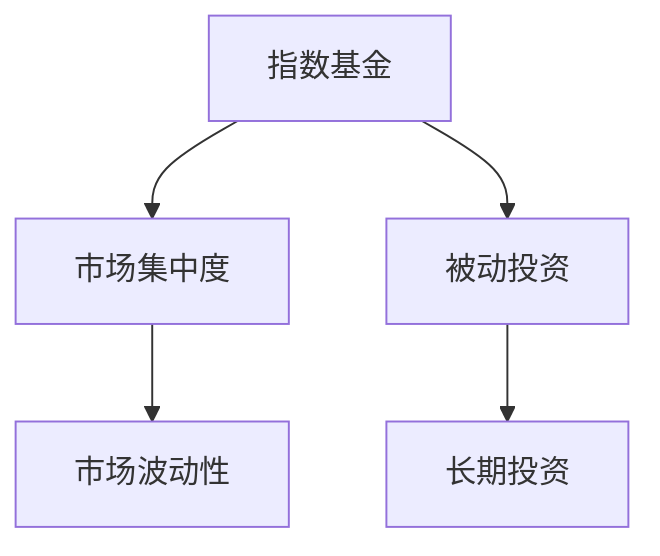

                 

### 引言和背景介绍

**标题**：伯格的指数基金理念：应对市场集中度上升的挑战

**摘要**：
在当今快速变化的经济环境中，投资者面临着前所未有的挑战，尤其是市场集中度不断上升带来的风险。约翰·伯格（John C. Bogle）被誉为指数基金投资之父，他的指数基金理念为投资者提供了一种有效的应对策略。本文将深入探讨伯格的指数基金理念，分析市场集中度上升的影响，并提出一系列应对策略。

**背景介绍**：
近年来，全球市场集中度不断上升，这不仅改变了投资者的游戏规则，也对传统的投资策略提出了挑战。一些大型公司通过并购和垄断行为，在各个行业中占据主导地位，这使得市场竞争更加激烈，同时也增加了市场的波动性。在这种背景下，投资者需要一种新的投资策略来适应这种变化。

**问题描述**：
市场集中度的上升对投资者的收益和风险产生了重大影响。传统的主动投资策略难以在这种市场中取得良好的业绩，而指数基金作为一种被动投资策略，如何在市场集中度上升的情况下保持其优势，成为了一个亟待解决的问题。

**问题解决**：
约翰·伯格通过其指数基金理念，提出了一系列应对市场集中度上升的策略。他的理念强调长期投资、低成本和多样化的投资组合，这些策略有助于降低风险，提高收益。

**边界与外延**：
本文将探讨伯格的指数基金理念在市场集中度上升环境下的应用，不仅关注指数基金的优势，还将分析市场集中度上升对指数基金的影响，以及如何调整投资策略以应对这些挑战。

**核心概念与联系**：

**核心概念**：
1. **指数基金**：一种跟踪特定指数（如标准普尔500指数）表现的基金。
2. **市场集中度**：市场中少数大公司占有的市场份额比例。
3. **被动投资**：投资策略不主动选择股票，而是复制特定指数的表现。

**概念属性特征对比表格**：

| 概念        | 定义                                                         | 特征对比                                                         |
| ----------- | ------------------------------------------------------------ | ------------------------------------------------------------ |
| 指数基金    | 跟踪指数的基金                                               | 低管理费用、多样化投资、风险分散                             |
| 市场集中度  | 少数大公司在市场中的占比                                     | 市场波动性增加、竞争加剧、垄断行为                           |
| 被动投资    | 复制指数表现的策略                                           | 低风险、高流动性、长期视角                                   |

**ER实体关系图架构**：

**章节内容概览**：

### 第1章：引言
- 1.1 问题背景
- 1.2 伯格指数基金理念的提出
- 1.3 书的结构和内容概览

### 第2章：指数基金的基本概念
- 2.1 定义与历史
- 2.2 指数基金的优势
- 2.3 指数基金的分类

### 第3章：伯格的指数基金理念解析
- 3.1 伯格的投资哲学
- 3.2 指数基金的投资策略
- 3.3 指数基金的风险管理

### 第4章：市场集中度上升的影响
- 4.1 定义与度量
- 4.2 市场集中度上升的原因
- 4.3 集中度上升的影响

### 第5章：指数基金在集中度上升市场的表现
- 5.1 指数基金的历史表现
- 5.2 集中度上升对指数基金的影响
- 5.3 集中度上升下的投资机会与挑战

### 第6章：应对市场集中度上升的策略
- 6.1 调整指数基金的投资组合
- 6.2 利用衍生工具进行对冲
- 6.3 长期投资与市场波动

### 第7章：案例研究
- 7.1 案例一：美国市场的集中度上升
- 7.2 案例二：中国市场的集中度变化
- 7.3 案例三：欧洲市场的集中度影响

### 第8章：总结与展望
- 8.1 指数基金理念的重要性
- 8.2 市场集中度上升的应对策略
- 8.3 未来发展趋势与挑战

### 第9章：展望与建议
- 9.1 指数基金行业的发展趋势
- 9.2 投资者应如何调整策略
- 9.3 政策与监管的影响

通过以上内容，我们可以看到伯格的指数基金理念在应对市场集中度上升的挑战中具有重要的指导意义。接下来的章节将详细探讨这一理念，帮助投资者更好地理解并应用它。在深入分析之前，让我们先回顾一下指数基金的基本概念，为进一步的理解打下坚实的基础。<!--rehashed-->## 第1章：指数基金的基本概念

### 1.1 定义与历史

指数基金（Index Fund）是一种以跟踪特定指数（如标准普尔500指数、上证指数等）表现为投资目标的基金。它通过复制指数的持仓结构，实现与指数相同的收益率，而不试图超越市场表现。指数基金的概念最早由约翰·伯格在1970年代提出，并随着其理念在全球范围内的推广，逐渐成为主流投资工具。

指数基金的历史可以追溯到1970年代，当时美国富达基金公司的创始人约翰·伯格推出了第一只指数基金——富达500指数基金。这一创新的投资工具在当时引起了极大的关注，并迅速在投资者中流行起来。随着时间的推移，指数基金在全球范围内得到了广泛应用，逐渐成为投资组合中的重要组成部分。

指数基金的出现，打破了传统主动管理基金试图战胜市场的模式，提供了一种更加简单、低成本的投资策略。通过复制指数，指数基金能够最大限度地降低交易成本和操作风险，同时实现与市场同步的收益。

### 1.2 指数基金的优势

指数基金相较于传统主动管理基金，具有以下显著优势：

**1. 低成本**：指数基金的管理费用通常远低于主动管理基金，这是因为它们不需要进行频繁的交易和大量的研究分析。据估算，指数基金的管理费用通常在0.05%至0.2%之间，而主动管理基金的管理费用则可能高达1%至2%。

**2. 效率优势**：指数基金通过复制指数的表现，避免了主动管理基金中可能存在的基金经理个人偏见和情绪影响，提高了投资效率。研究表明，长期来看，主动管理基金中有超过80%的基金经理无法超越其追踪的指数表现。

**3. 风险分散**：指数基金通常持有大量不同的股票，实现了投资组合的风险分散。这种分散化策略能够降低单一投资的风险，提高整体投资的安全性和稳定性。

**4. 透明度**：指数基金的持仓结构和交易记录通常是公开透明的，投资者可以随时了解基金的投资情况。相比之下，主动管理基金的持仓和操作策略则相对不透明。

**5. 稳定性**：由于指数基金的投资策略相对简单和稳定，其收益和风险也更加可预测。这使得指数基金成为长期投资者的理想选择。

### 1.3 指数基金的分类

指数基金根据追踪的指数类型和投资策略，可以分为以下几类：

**1. 标普500指数基金**：这类基金追踪的是标准普尔500指数，它代表了美国市场中最具有代表性的500家公司的表现。标普500指数基金是最为常见的指数基金之一，其投资组合涵盖了美国市场的核心行业。

**2. 全球股票指数基金**：这类基金追踪的是全球主要股票市场的指数，如MSCI ACWI指数。它们通常包括美国、欧洲、亚洲和其他地区的股票，提供了全球市场的投资机会。

**3. 债券指数基金**：债券指数基金追踪的是债券市场的指数，如巴克莱资本债券指数。这类基金通常用于固定收益投资，能够为投资者提供稳定的收益和现金流。

**4. 领先科技指数基金**：这类基金专注于追踪科技行业的领先公司，如纳斯达克100指数。随着科技行业的快速发展，这类基金为投资者提供了较高的增长潜力。

**5. 混合型指数基金**：这类基金结合了股票和债券的投资，通过在不同资产类

