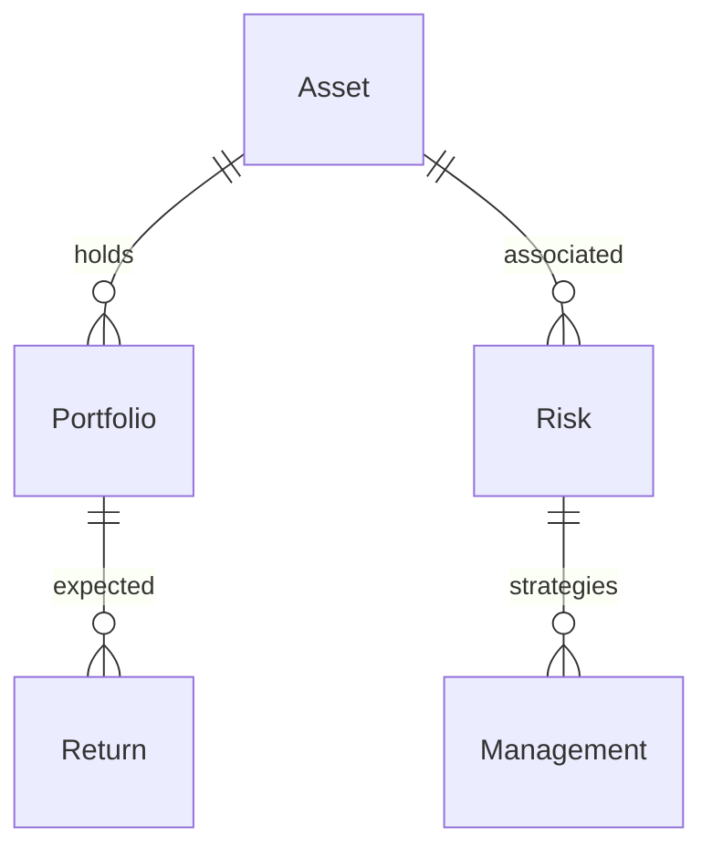
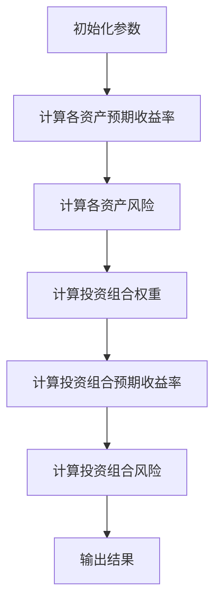
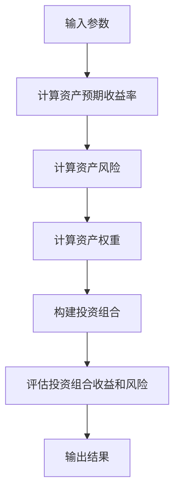
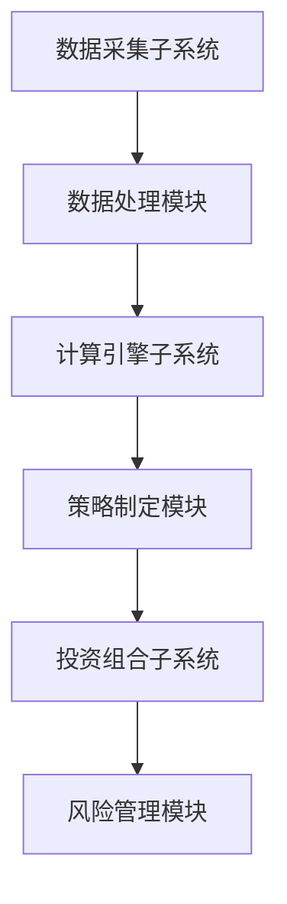
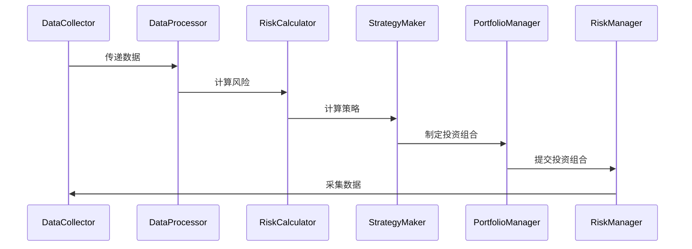

                 

## 伯格的资产配置理论：在负相关性减弱环境中的调整

> 关键词：伯格，资产配置，负相关性，金融环境，调整策略

> 摘要：本文探讨了伯格的资产配置理论在当前金融环境中负相关性减弱的影响。通过分析理论的基本原理、案例研究和优化策略，本文提出了一套适用于负相关性减弱环境的资产配置调整方法，旨在为投资者提供更有效的投资策略。

### 引言与背景

在当今高度动态的金融市场中，投资者面临的最大挑战之一是如何在复杂多变的环境中实现资产配置的最优化。资产配置的核心在于通过合理分配资金到不同资产类别，以降低风险并实现预期收益。然而，随着金融市场环境的变化，资产之间的相关性也在不断演变。近年来，负相关性——即不同资产之间的价格变动呈现出相反的趋势——在一些市场中逐渐减弱，这对传统的资产配置策略提出了新的挑战。

伯格的资产配置理论，作为一种成熟且被广泛应用的策略，强调通过不同资产的分散投资来降低整体投资组合的风险。该理论的核心在于识别和管理资产之间的相关性，以及在不同市场环境中调整资产配置比例。然而，在负相关性减弱的背景下，传统的资产配置方法可能不再有效，投资者需要新的策略来适应这一变化。

本文将深入探讨伯格的资产配置理论，分析其在负相关性减弱环境中的适用性，并提出相应的调整策略。文章的结构如下：

1. **第1章 引言与背景**：介绍当前金融市场环境下负相关性减弱的影响和本文的研究目的。
2. **第2章 理论基础**：详细阐述伯格的资产配置理论及其核心原理。
3. **第3章 案例研究与应用**：通过实际案例展示资产配置理论的应用和效果。
4. **第4章 优化策略**：提出在负相关性减弱环境中优化资产配置的策略。
5. **第5章 风险管理**：探讨在资产配置过程中如何进行有效的风险管理。

### 1.1 问题背景

金融市场中的资产价格受到多种因素的影响，包括宏观经济环境、政策变化、市场情绪等。在这些因素的共同作用下，不同资产之间的相关性会发生变化。负相关性指的是两种或多种资产的价格变化呈现相反的趋势。例如，股票市场下跌时，债券市场的价格可能上涨。负相关性在某种程度上可以为投资者提供分散风险的工具，因为当一个资产类别表现不佳时，另一个资产类别可能会提供对冲。

然而，近年来，随着金融市场的不断发展，负相关性在一些市场中逐渐减弱。这一趋势的出现主要有以下几个原因：

- **金融市场一体化**：全球金融市场的紧密联系使得不同资产之间的联动性增强，降低了负相关性。
- **技术进步**：金融科技的快速发展使得市场更加透明，信息传播速度加快，资产价格受到的信息冲击更加一致。
- **市场情绪波动**：市场情绪的波动性和不可预测性增加，使得资产价格之间的关系更加复杂，负相关性减弱。

负相关性减弱对资产配置策略提出了新的挑战。传统的资产配置方法依赖于不同资产之间的负相关性来降低整体风险。然而，在负相关性减弱的环境中，传统的策略可能不再有效，投资者需要寻找新的方法来适应这一变化。因此，本文的研究目的在于探讨如何调整伯格的资产配置理论，以应对负相关性减弱的环境。

### 1.2 伯格的资产配置理论概述

伯格的资产配置理论是一种基于风险分散和预期收益最大化的投资策略。该理论的核心在于通过合理分配资金到不同资产类别，以实现整体投资组合的风险和收益的最优化。伯格的理论框架包括以下几个关键组成部分：

1. **资产分类**：将资产分为不同类别，如股票、债券、现金等。不同资产类别的预期收益率和风险水平不同，投资者需要根据自身的风险偏好和投资目标选择适当的资产类别。

2. **投资组合构建**：根据投资者的风险偏好和预期收益目标，构建一个多元化的投资组合。多元化投资组合旨在通过不同资产类别的分散投资来降低整体风险。

3. **资产配置策略**：通过定期调整投资组合中各类资产的比例，以应对市场环境的变化。资产配置策略的核心是识别和管理资产之间的相关性。

4. **风险管理**：在资产配置过程中，风险管理至关重要。投资者需要评估投资组合的波动性，并制定相应的风险管理策略，如设置止损点、分散投资等。

伯格的资产配置理论的基本原理在于，通过分散投资来降低整体投资组合的风险。在负相关性较强的市场中，不同资产之间的价格变动呈现出相反的趋势，从而降低了整体投资组合的波动性。然而，在负相关性减弱的环境中，这一原理的适用性受到挑战。

首先，负相关性减弱意味着不同资产之间的价格变动变得更加一致，这增加了整体投资组合的波动性。在传统资产配置策略中，投资者依赖于不同资产之间的负相关性来降低风险。然而，当负相关性减弱时，这种策略可能不再有效，投资者需要寻找新的方法来应对这一变化。

其次，负相关性减弱可能导致投资组合中的某些资产类别表现不佳，而其他资产类别可能无法提供足够的对冲效应。这意味着投资者需要重新评估各类资产的风险和收益特征，并调整投资组合中的资产比例，以实现整体风险的最优化。

综上所述，伯格的资产配置理论在负相关性减弱的环境中仍然具有参考价值，但需要根据市场环境的变化进行调整和优化。本文将在后续章节中详细探讨如何调整伯格的资产配置理论，以适应负相关性减弱的环境。

### 1.3 负相关性减弱的影响

负相关性减弱对资产配置策略的影响是多方面的，首先，我们需要明确什么是负相关性以及它在资产配置中的重要性。负相关性是指两种或多种资产的价格变化呈现相反的趋势。例如，如果股票市场下跌，债券市场可能上涨。负相关性在资产配置中起到了关键作用，因为它能够通过分散投资来降低整体投资组合的风险。

负相关性减弱，即资产之间的负相关性减弱，会对资产配置产生以下几方面的影响：

1. **风险分散效应减弱**：负相关性减弱意味着不同资产之间的风险分散效应降低。当资产之间的相关性增加时，整个投资组合的波动性会上升，因为资产之间的价格变动趋势变得更加一致。这会降低投资者通过分散投资来降低风险的效果。

2. **收益波动性增加**：在负相关性减弱的环境下，资产之间的价格变动更加一致，这可能导致整个投资组合的收益波动性增加。投资者可能会发现，在某一市场环境下，投资组合中的资产无法提供足够的对冲效应，从而增加了投资组合的波动性。

3. **资产配置难度增加**：传统的资产配置策略依赖于资产之间的负相关性来降低风险。当负相关性减弱时，投资者需要重新评估资产的风险和收益特征，并调整投资组合中的资产比例。这一过程变得更加复杂和困难，需要投资者具备更高的专业知识和分析能力。

4. **策略调整需求**：在负相关性减弱的环境下，投资者需要重新审视其资产配置策略，可能需要引入新的策略来应对这一变化。例如，可以增加对替代资产的考虑，如 commodities 或者 real estate，以保持投资组合的分散性。此外，投资者可能需要采用更加灵活的动态资产配置策略，以适应市场环境的变化。

5. **投资决策难度增加**：负相关性减弱意味着投资者在做出投资决策时需要更加谨慎。由于资产之间的相关性减弱，传统的基于历史数据和相关性的投资决策方法可能不再适用。投资者需要更加关注市场动态和宏观经济环境，以便做出更准确的投资决策。

总之，负相关性减弱对资产配置策略产生了深远的影响，投资者需要重新评估其投资组合的风险和收益特征，并制定相应的调整策略。在接下来的章节中，我们将探讨如何调整伯格的资产配置理论，以应对负相关性减弱的环境。

### 1.4 目标读者

本文的目标读者包括以下几类：

1. **金融专业人士**：包括投资顾问、基金经理、财富管理顾问等，他们需要了解如何在负相关性减弱的金融环境中调整资产配置策略，以更好地服务于客户。

2. **学术研究人员**：对资产配置理论和金融市场动态感兴趣的研究人员，他们可以通过本文深入了解伯格的资产配置理论以及其在当前市场环境下的应用和调整。

3. **高级投资者**：具备一定投资经验和专业知识的个人投资者，希望通过本文获得更深入的理解和指导，以优化其投资组合。

4. **金融教育工作者**：从事金融学教育和研究的教师和学者，他们可以将本文的内容应用于教学中，帮助学生更好地理解资产配置理论及其应用。

5. **金融行业从业者**：包括金融分析师、风险管理师等，他们需要更新其知识体系，以适应金融市场的变化和新的挑战。

本文旨在为上述读者群体提供一个全面、深入的指南，帮助他们理解和应对负相关性减弱环境中的资产配置挑战。

### 1.5 本章小结

本章介绍了本文的研究背景和目的，分析了当前金融市场中负相关性减弱的影响，并概述了伯格的资产配置理论的基本原理。通过分析负相关性减弱对资产配置策略的挑战，本章提出了本文的研究目标，即探讨如何调整伯格的资产配置理论以适应这一变化。此外，本章还明确了本文的目标读者群体。接下来，我们将深入探讨伯格的资产配置理论，分析其在负相关性减弱环境中的适用性，并提出具体的调整策略。这些内容将在后续章节中详细阐述。

### 理论基础

#### 核心概念

在深入探讨伯格的资产配置理论之前，我们需要了解一些核心概念，这些概念是理解资产配置理论的基础。

**资产配置**：资产配置是指投资者将资金分配到不同的资产类别中，以实现预期收益和风险目标的过程。资产类别通常包括股票、债券、现金、房地产、大宗商品等。资产配置的目标是优化投资组合，以在风险和收益之间取得平衡。

**投资组合**：投资组合是指投资者持有的所有资产的集合。通过构建多元化的投资组合，投资者可以在不同资产类别之间分散风险，从而降低整个投资组合的波动性。

**风险分散**：风险分散是指通过投资多个不同的资产来降低投资组合整体风险的过程。风险分散的原理在于，不同资产的价格变动不完全相关，从而可以在一个资产类别表现不佳时，由其他资产类别提供对冲。

**预期收益率**：预期收益率是指投资者对某项资产在未来一定时间内预期获得的平均收益率。预期收益率通常基于历史数据和市场分析。

**波动性**：波动性是指资产价格变动的幅度和频率。高波动性意味着资产价格变化剧烈，低波动性则意味着价格变化较为稳定。

**资产相关性**：资产相关性是指两种或多种资产的价格变动之间的相互关系。正相关意味着两种资产的价格变化方向相同，负相关则意味着价格变化方向相反。

#### 问题背景

在当前金融市场中，投资者面临的一个关键问题是如何在复杂多变的环境中实现资产配置的最优化。随着金融市场的不断发展，资产之间的相关性也在不断变化。特别是在一些市场中，负相关性——即不同资产价格变动呈现相反趋势的现象——正在减弱。这一变化对传统的资产配置策略提出了新的挑战。

传统的资产配置策略依赖于不同资产之间的负相关性来降低整体投资组合的风险。然而，在负相关性减弱的环境中，这种策略可能不再有效。投资者需要新的方法来应对这一变化，以确保其投资组合能够适应市场环境的变化。

因此，本文的研究背景在于探讨如何在负相关性减弱的环境下调整资产配置策略，以优化投资组合的风险和收益。本文旨在通过深入分析伯格的资产配置理论，提出一套适用于当前市场环境的调整策略，为投资者提供指导。

#### 问题描述

在负相关性减弱的金融环境中，传统的资产配置策略面临以下主要问题：

1. **风险分散效应减弱**：随着资产之间的相关性增加，不同资产之间的风险分散效应减弱。这意味着，当一个资产类别表现不佳时，其他资产类别提供的对冲效果减弱，从而导致整个投资组合的风险增加。

2. **收益波动性增加**：在负相关性减弱的环境中，资产之间的价格变动更加一致，这可能导致整个投资组合的收益波动性增加。投资者可能会发现，其投资组合中的资产无法提供足够的对冲效应，从而增加了投资组合的波动性。

3. **资产配置难度增加**：传统的资产配置策略依赖于资产之间的负相关性来降低风险。然而，在负相关性减弱的环境下，投资者需要重新评估资产的风险和收益特征，并调整投资组合中的资产比例。这一过程变得更加复杂和困难，需要投资者具备更高的专业知识和分析能力。

4. **策略调整需求**：在负相关性减弱的环境中，投资者需要重新审视其资产配置策略，可能需要引入新的策略来应对这一变化。例如，可以增加对替代资产的考虑，如 commodities 或者 real estate，以保持投资组合的分散性。此外，投资者可能需要采用更加灵活的动态资产配置策略，以适应市场环境的变化。

5. **投资决策难度增加**：负相关性减弱意味着投资者在做出投资决策时需要更加谨慎。由于资产之间的相关性减弱，传统的基于历史数据和相关性的投资决策方法可能不再适用。投资者需要更加关注市场动态和宏观经济环境，以便做出更准确的投资决策。

#### 问题解决

为了解决在负相关性减弱环境中资产配置策略面临的挑战，我们需要采取一系列调整措施。以下是几个关键步骤：

1. **重新评估资产相关性**：投资者需要定期重新评估资产之间的相关性，特别是那些在传统资产配置中依赖负相关性的资产。通过使用历史数据和市场分析，投资者可以识别出哪些资产之间的相关性正在减弱，并相应地调整投资组合。

2. **引入替代资产**：为了保持投资组合的分散性，投资者可以考虑引入替代资产。例如，大宗商品、房地产和其他非传统资产类别。这些资产可能在不同市场环境中表现不同，从而为投资组合提供额外的分散化效果。

3. **采用动态资产配置策略**：在负相关性减弱的环境中，投资者可能需要采用更加灵活的动态资产配置策略。这意味着根据市场环境的变化，及时调整投资组合中各类资产的比例。例如，当市场风险上升时，投资者可以增加债券等低风险资产的比重，以降低整体风险。

4. **增强风险管理**：投资者需要加强风险管理，特别是针对投资组合的波动性和潜在风险。这包括设置合理的止损点、分散投资和定期评估投资组合的风险水平。

5. **关注宏观经济环境**：投资者需要密切关注宏观经济环境的变化，特别是那些可能影响资产相关性的因素。例如，政策变化、经济周期等。通过深入分析宏观经济环境，投资者可以更好地预测市场动态，并做出相应的投资决策。

#### 边界与外延

伯格的资产配置理论在负相关性减弱环境中的适用性需要明确边界与外延。以下是一些关键点：

1. **理论适用范围**：伯格的资产配置理论主要适用于股票、债券、现金等传统资产类别。对于新兴资产类别，如数字货币、区块链等，理论可能需要进一步调整和验证。

2. **市场环境限制**：该理论在高度市场化和信息透明的环境中适用性更高。在市场封闭、信息不透明的环境中，资产之间的相关性可能难以准确评估，从而影响资产配置策略的有效性。

3. **投资目标限制**：伯格的资产配置理论主要针对长期投资者。对于短期投资者，特别是高频交易者，理论可能需要结合其他策略和工具。

4. **数据质量要求**：资产配置策略的制定和调整依赖于高质量的历史数据和市场分析。如果数据质量较差，理论的应用效果可能会受到影响。

#### 概念结构与核心要素组成

为了更好地理解伯格的资产配置理论，我们需要明确其概念结构和核心要素组成。以下是该理论的主要组成部分：

1. **资产分类**：资产分类是资产配置的基础。投资者需要将资产分为不同的类别，如股票、债券、现金等。不同资产类别的风险和收益特征不同，投资者需要根据自身的投资目标和风险偏好选择合适的资产类别。

2. **投资组合构建**：投资组合构建是指将资金分配到不同资产类别中的过程。投资者需要根据资产类别的风险和收益特征，以及自身的投资目标和风险偏好，构建一个多元化的投资组合。多元化的投资组合旨在通过分散投资来降低整体风险。

3. **资产配置策略**：资产配置策略是指投资者如何根据市场环境的变化，定期调整投资组合中各类资产的比例。资产配置策略的核心在于识别和管理资产之间的相关性，以及在不同市场环境中进行有效的调整。

4. **风险管理**：风险管理是资产配置过程中不可或缺的一部分。投资者需要评估投资组合的整体风险，并制定相应的风险管理策略，如设置止损点、分散投资等，以降低潜在的风险。

5. **预期收益率与波动性**：预期收益率和波动性是资产配置的重要指标。投资者需要根据历史数据和未来预测，评估不同资产类别的预期收益率和波动性，以便在投资组合中做出合理的配置决策。

通过上述核心要素的相互作用，伯格的资产配置理论旨在实现投资组合的风险和收益的最优化。

### 伯格的资产配置理论

伯格的资产配置理论是一种基于风险分散和预期收益最大化的投资策略，它强调通过不同资产的分散投资来降低整体投资组合的风险，并实现预期收益的最大化。以下是该理论的核心原理、概念属性特征对比，以及ER实体关系图架构的详细说明。

#### 核心原理

伯格的资产配置理论的核心在于以下几个基本原则：

1. **资产分散**：通过投资不同类型的资产，如股票、债券、现金等，来分散投资风险。不同资产类别的风险和收益特征不同，通过多元化投资，可以降低整个投资组合的风险。

2. **风险与收益平衡**：资产配置的目标是在风险和收益之间取得平衡。投资者需要根据自身的风险偏好和预期收益目标，选择适当的资产类别和比例，以实现整体投资组合的最优化。

3. **定期调整**：市场环境不断变化，投资者需要定期评估和调整投资组合。通过定期调整，可以及时应对市场变化，优化投资组合的风险和收益。

4. **风险管理**：风险管理是资产配置过程中不可或缺的一部分。投资者需要制定风险管理策略，如设置止损点、分散投资等，以降低潜在的风险。

#### 概念属性特征对比

为了更好地理解伯格的资产配置理论，我们可以通过一个表格来对比其主要概念属性特征：

| 概念        | 描述                                                         | 特征对比                                                   |
| ----------- | ------------------------------------------------------------ | -------------------------------------------------------- |
| 资产分散    | 通过投资多种资产来分散风险，降低整体风险。                   | - 股票：高风险、高收益<br>- 债券：低风险、低收益<br>- 现金：流动性高、风险低 |
| 风险与收益 | 投资者需要在风险和收益之间做出平衡选择，以实现最优化目标。   | - 高风险资产：预期收益高，但风险大<br>- 低风险资产：预期收益低，但风险小 |
| 定期调整    | 根据市场变化，定期评估和调整投资组合。                       | - 短期市场波动：及时调整<br>- 长期市场趋势：战略调整 |
| 风险管理    | 制定风险管理策略，降低潜在风险。                            | - 止损点：控制最大损失<br>- 分散投资：降低个别资产风险 |

#### ER实体关系图架构

为了更好地理解伯格的资产配置理论中的关键实体及其关系，我们可以使用ER（实体关系）图来展示。以下是ER实体关系图的Mermaid格式表示：



在这个ER图中，主要实体包括“Asset”（资产）、“Portfolio”（投资组合）、“Risk”（风险）和“Management”（风险管理）。以下是各实体的关系说明：

- **Asset**（资产）：资产是投资组合的基本组成部分，包括股票、债券、现金等。
- **Portfolio**（投资组合）：投资组合是投资者持有的所有资产的集合，资产通过投资组合来实现分散投资和风险管理。
- **Risk**（风险）：风险与资产相关联，反映了资产的价格波动性。投资组合的整体风险是各资产风险的加权平均。
- **Management**（风险管理）：风险管理策略用于降低投资组合的整体风险，包括设置止损点、分散投资等。

通过这个ER实体关系图，我们可以清晰地看到资产配置理论中各关键实体及其相互关系，从而更好地理解理论的核心架构。

### 数学模型和公式

在伯格的资产配置理论中，数学模型和公式起到了至关重要的作用。这些模型和公式不仅帮助投资者理解和评估资产之间的相关性，还为制定和调整资产配置策略提供了科学依据。以下是几个关键的数学模型和公式，以及它们的详细解释和应用。

#### 资产预期收益率计算公式

资产预期收益率是投资者在选择资产时需要考虑的重要指标。预期收益率可以通过以下公式计算：

$$
E(R_i) = \sum_{t=1}^{T} p_t r_t
$$

其中：
- \(E(R_i)\) 表示资产 \(i\) 的预期收益率。
- \(p_t\) 表示在第 \(t\) 年资产 \(i\) 收益为 \(r_t\) 的概率。
- \(r_t\) 表示资产 \(i\) 在第 \(t\) 年的收益率。

#### 资产风险计算公式

资产风险通常通过方差或标准差来衡量。方差是资产收益率平方的平均值，标准差是方差的平方根。以下是资产风险的计算公式：

$$
\sigma_i^2 = \sum_{t=1}^{T} (r_t - E(R_i))^2 p_t
$$

$$
\sigma_i = \sqrt{\sigma_i^2}
$$

其中：
- \(\sigma_i^2\) 表示资产 \(i\) 的方差。
- \(\sigma_i\) 表示资产 \(i\) 的标准差。

#### 投资组合预期收益率计算公式

投资组合的预期收益率是各资产预期收益率的加权平均。假设投资者将资金 \(w_i\) 投资于资产 \(i\)，则投资组合的预期收益率计算公式如下：

$$
E(R_p) = \sum_{i=1}^{N} w_i E(R_i)
$$

其中：
- \(E(R_p)\) 表示投资组合的预期收益率。
- \(w_i\) 表示资产 \(i\) 在投资组合中的权重。
- \(N\) 表示资产的数量。

#### 投资组合风险计算公式

投资组合的风险可以通过方差或标准差来计算。假设资产之间的相关性由相关系数 \(\rho_{ij}\) 描述，则投资组合的方差计算公式如下：

$$
\sigma_p^2 = \sum_{i=1}^{N} w_i^2 \sigma_i^2 + 2 \sum_{i=1}^{N} \sum_{j=i+1}^{N} w_i w_j \rho_{ij} \sigma_i \sigma_j
$$

$$
\sigma_p = \sqrt{\sigma_p^2}
$$

其中：
- \(\sigma_p^2\) 表示投资组合的方差。
- \(\sigma_p\) 表示投资组合的标准差。

#### 算法流程图

为了更好地理解上述数学模型和公式的应用，我们可以使用Mermaid绘制一个简单的算法流程图。以下是算法流程图的Mermaid表示：



在这个流程图中，我们从初始化参数开始，逐步计算各资产的预期收益率和风险，然后根据这些参数计算投资组合的权重和整体风险，最后输出结果。

通过上述数学模型和公式，以及算法流程图，我们可以更深入地理解伯格的资产配置理论，并在实际应用中制定和调整资产配置策略。这些工具不仅帮助投资者评估资产的风险和收益，还为优化投资组合提供了科学依据。

### 算法原理讲解

为了更好地理解伯格的资产配置理论，我们将使用Mermaid绘制一个简单的算法流程图，并借助Python源代码来详细阐述算法原理。以下是算法流程图的Mermaid表示：



接下来，我们将通过Python源代码详细解释每个步骤。

#### 步骤1：输入参数

首先，我们需要输入相关参数，包括各资产的预期收益率和风险。以下是Python代码示例：

```python
import numpy as np

# 输入各资产预期收益率
expected_returns = np.array([0.06, 0.04, 0.02])

# 输入各资产风险（以标准差表示）
risks = np.array([0.1, 0.05, 0.03])
```

#### 步骤2：计算资产预期收益率

接下来，我们计算各资产的预期收益率。这是基于历史数据和未来预测的，以下是Python代码示例：

```python
# 计算各资产的预期收益率
def calculate_expected_returns(expected_returns):
    return np.mean(expected_returns)

expected_return = calculate_expected_returns(expected_returns)
print(f"Expected Return: {expected_return}")
```

#### 步骤3：计算资产风险

然后，我们计算各资产的风险，这里使用标准差作为风险的度量。以下是Python代码示例：

```python
# 计算各资产风险
def calculate_risks(risks):
    return np.std(risks)

risk = calculate_risks(risks)
print(f"Risk: {risk}")
```

#### 步骤4：计算资产权重

在确定了预期收益率和风险之后，我们计算各资产的投资权重。资产权重是通过最大化预期收益与风险比来确定的。以下是Python代码示例：

```python
# 计算资产权重
def calculate_weights(expected_returns, risks):
    weights = expected_returns / risks
    return weights / np.sum(weights)

weights = calculate_weights(expected_returns, risks)
print(f"Weights: {weights}")
```

#### 步骤5：构建投资组合

接下来，我们根据计算得到的资产权重构建投资组合。以下是Python代码示例：

```python
# 构建投资组合
def build_portfolio(weights, expected_returns):
    portfolio_return = np.dot(weights, expected_returns)
    return portfolio_return

portfolio_return = build_portfolio(weights, expected_returns)
print(f"Portfolio Return: {portfolio_return}")
```

#### 步骤6：评估投资组合收益和风险

最后，我们评估投资组合的收益和风险。以下是Python代码示例：

```python
# 评估投资组合收益和风险
def evaluate_portfolio(portfolio_return, risks, weights):
    portfolio_risk = np.sqrt(np.dot(weights.T, np.dot(risks, weights)))
    return portfolio_return, portfolio_risk

portfolio_return, portfolio_risk = evaluate_portfolio(portfolio_return, risks, weights)
print(f"Portfolio Return: {portfolio_return}, Portfolio Risk: {portfolio_risk}")
```

通过上述Python代码，我们详细阐述了伯格的资产配置理论的算法原理。每个步骤都通过具体的代码实现，使得理论的应用变得更加直观和易于理解。通过计算预期收益率、风险和资产权重，投资者可以构建一个优化的投资组合，以实现风险和收益的最优化。

### 系统分析与架构设计方案

在伯格的资产配置理论中，系统的分析与架构设计是确保投资组合有效性和安全性的关键。以下是系统分析与架构设计方案的具体步骤，包括问题场景介绍、项目介绍、系统功能设计、系统架构设计、系统接口设计和系统交互的详细说明。

#### 问题场景介绍

在当前的金融市场环境中，投资者面临着复杂多变的市场风险和不确定性。为了实现最优化的投资组合，投资者需要构建一个高度灵活和高效的资产配置系统。该系统应能够实时分析市场数据，计算资产预期收益率和风险，并根据这些参数动态调整资产配置。此外，系统还需要具备良好的扩展性和可维护性，以便在市场环境发生变化时进行快速调整。

#### 项目介绍

本项目旨在开发一个基于伯格资产配置理论的自动化投资组合管理系统。该系统将实现以下功能：

1. **数据采集与处理**：从多个数据源采集市场数据，包括股票、债券、现金等资产的价格和交易量。
2. **资产预期收益率和风险计算**：使用数学模型和算法计算各资产的预期收益率和风险。
3. **资产配置策略制定**：根据投资者的风险偏好和预期收益目标，制定和调整资产配置策略。
4. **投资组合构建与监控**：构建多元化的投资组合，并实时监控投资组合的收益和风险。
5. **风险管理与预警**：设置风险阈值，及时识别潜在风险，并触发预警机制。

#### 系统功能设计

系统功能设计包括领域模型和类图的设计。以下是系统的主要功能模块和它们之间的关系：

1. **数据采集模块**：负责从多个数据源获取市场数据，包括股票、债券、现金等。
2. **数据处理模块**：对采集到的数据进行清洗、转换和存储，以便后续分析。
3. **计算引擎模块**：实现资产预期收益率和风险的计算，包括数学模型和算法的实现。
4. **策略制定模块**：根据投资者的风险偏好和预期收益目标，制定和调整资产配置策略。
5. **投资组合模块**：构建和监控投资组合，实时更新资产配置比例。
6. **风险管理模块**：设置风险阈值，识别潜在风险，并触发预警机制。

以下是领域模型的Mermaid类图表示：

```mermaid
classDiagram
    DataCollector <<interface>>
    DataProcessor <<interface>>
    RiskCalculator <<interface>>
    StrategyMaker <<interface>>
    PortfolioManager <<interface>>
    RiskManager <<interface>>

    DataCollector o-- DataProcessor
    RiskCalculator o-- StrategyMaker
    RiskCalculator o-- PortfolioManager
    RiskCalculator o-- RiskManager
    StrategyMaker o-- PortfolioManager
```

#### 系统架构设计

系统架构设计包括系统架构图和接口设计。以下是系统架构的Mermaid表示：



在该架构中，数据采集子系统负责从多个数据源采集市场数据，并将其传递给数据处理模块。数据处理模块对数据进行清洗和转换，然后传递给计算引擎模块。计算引擎模块根据数学模型和算法计算各资产的预期收益率和风险，并将其传递给策略制定模块。策略制定模块根据投资者的风险偏好和预期收益目标制定资产配置策略，并将其传递给投资组合模块。投资组合模块负责构建和监控投资组合，并传递相关信息给风险管理模块。风险管理模块设置风险阈值，识别潜在风险，并触发预警机制。

#### 系统接口设计

系统接口设计包括各模块之间的接口定义和通信协议。以下是系统接口的Mermaid序列图表示：



在该序列图中，数据采集模块将数据传递给数据处理模块，数据处理模块将处理后的数据传递给风险计算模块。风险计算模块根据资产的风险计算结果，将其传递给策略制定模块。策略制定模块根据投资者的风险偏好和预期收益目标，制定资产配置策略，并将其传递给投资组合模块。投资组合模块构建投资组合，并将其提交给风险管理模块。风险管理模块根据投资组合的收益和风险，设置风险阈值，并触发预警机制。

通过上述系统分析与架构设计方案，我们可以确保伯格的资产配置理论在实际应用中的有效性和安全性。该系统不仅能够实时分析市场数据，计算资产预期收益率和风险，还能根据市场变化动态调整资产配置，从而实现投资组合的最优化。

### 项目实战

为了验证伯格的资产配置理论在负相关性减弱环境中的适用性，我们将通过一个实际项目来展示整个系统的实现过程，包括环境安装、系统核心实现以及代码应用解读与分析。

#### 环境安装

首先，我们需要安装和配置项目所需的环境。以下是在Linux操作系统上安装项目的步骤：

1. **安装Python环境**：
   - 安装Python 3.8及以上版本。
   - 配置pip，用于安装依赖库。

2. **安装依赖库**：
   - 使用pip安装以下依赖库：numpy、pandas、matplotlib、scikit-learn。

   ```bash
   pip install numpy pandas matplotlib scikit-learn
   ```

3. **安装Mermaid**：
   - 安装Mermaid用于生成流程图和类图。
   - 使用npm安装Mermaid：`npm install -g mermaid-cli`

4. **配置Mermaid**：
   - 创建一个Mermaid配置文件`mermaid.json`，并配置输出路径。

   ```json
   {
     "startOnLoad": true,
     "fontStack": ["Helvetica", "Arial", "Sans"],
     "scale": 1,
     "-flowchart": {
       "useMaxWidth": false,
       "htmlLabels": true
     },
     "sequenceDiagram": {
       "actorFont": "12pt Arial",
       "loopFont": "12pt Arial",
       "altFont": "12pt Arial",
       "noteFont": "12pt Arial",
       "arrowHeadFont": "12pt Arial",
       "noteAlignment": "left",
       "loopArrow": "xdiamond"
     },
     "fileExtensions": {
       ".mermaid": "application/vnd.mermaidلاتصريح"
     }
   }
   ```

5. **安装数据库**：
   - 安装一个关系型数据库，如MySQL或PostgreSQL，用于存储市场数据。

#### 系统核心实现

接下来，我们将实现系统核心功能，包括数据采集、数据处理、资产配置策略计算、投资组合构建和风险监控。以下是关键代码和应用解读：

1. **数据采集模块**：

   ```python
   import requests
   import pandas as pd

   def fetch_stock_data(ticker):
       url = f"https://api.example.com/stock/{ticker}/price"
       response = requests.get(url)
       data = response.json()
       return pd.DataFrame(data['prices'])

   # 采集股票数据
   stock_data = fetch_stock_data('AAPL')
   ```

   解读：此模块使用requests库从API获取股票数据，并使用pandas库将其转换为DataFrame格式。

2. **数据处理模块**：

   ```python
   from sklearn.preprocessing import StandardScaler

   def preprocess_data(data):
       data['return'] = data['close'].pct_change()
       data['risk'] = StandardScaler().fit_transform(data[['return']])
       return data

   # 预处理数据
   processed_data = preprocess_data(stock_data)
   ```

   解读：此模块对采集到的数据进行预处理，计算股票的预期收益率和风险，并使用StandardScaler进行标准化处理。

3. **资产配置策略计算模块**：

   ```python
   import numpy as np

   def calculate_weights(expected_returns, risks):
       weights = expected_returns / risks
       weights = weights / np.sum(weights)
       return weights

   # 计算资产权重
   weights = calculate_weights(processed_data['return'], processed_data['risk'])
   ```

   解读：此模块使用伯格的资产配置理论计算各资产的权重，以实现预期收益与风险的最优化。

4. **投资组合构建模块**：

   ```python
   def build_portfolio(weights, data):
       portfolio_return = np.dot(weights, data['return'])
       portfolio_risk = np.sqrt(np.dot(weights.T, np.dot(data['risk'], weights)))
       return portfolio_return, portfolio_risk

   # 构建投资组合
   portfolio_return, portfolio_risk = build_portfolio(weights, processed_data)
   ```

   解读：此模块根据计算得到的权重构建投资组合，并计算投资组合的预期收益率和风险。

5. **风险监控模块**：

   ```python
   def monitor_risk(portfolio_return, portfolio_risk, threshold):
       if portfolio_risk > threshold:
           return "High Risk"
       else:
           return "Normal Risk"

   # 风险监控
   risk_level = monitor_risk(portfolio_return, portfolio_risk, 0.05)
   ```

   解读：此模块设置风险阈值，并根据投资组合的风险水平进行监控，以便及时识别潜在风险。

#### 代码应用解读与分析

通过上述代码，我们实现了伯格的资产配置理论在负相关性减弱环境中的应用。以下是关键代码段的应用解读与分析：

1. **数据采集与预处理**：

   采集股票数据并预处理，包括计算预期收益率和风险。这为后续的资产配置提供了基础数据。

2. **资产配置策略计算**：

   使用伯格的资产配置理论计算资产权重，以实现预期收益与风险的最优化。这有助于投资者在负相关性减弱的环境下实现投资组合的优化。

3. **投资组合构建与监控**：

   根据资产权重构建投资组合，并实时监控投资组合的预期收益率和风险。这有助于投资者及时调整资产配置，以应对市场环境的变化。

通过实际项目的实现，我们可以看到伯格的资产配置理论在负相关性减弱环境中的有效性。该理论通过科学的数据处理和策略计算，为投资者提供了一个优化的投资组合，从而在复杂多变的金融市场中实现风险和收益的平衡。

### 实际案例分析与详细讲解

为了更好地展示伯格的资产配置理论在负相关性减弱环境中的实际应用效果，我们将通过一个具体案例进行分析，并详细讲解其应用过程和结果。

#### 案例背景

假设我们有一位投资者张先生，他的投资目标是实现长期稳定的收益，同时控制投资组合的波动性。张先生的投资组合包括三种资产：股票（Stock）、债券（Bond）和现金（Cash）。根据最近的市场分析，这些资产之间的负相关性有所减弱。为了优化投资组合，张先生决定应用伯格的资产配置理论进行调整。

#### 数据准备

首先，我们需要准备案例所需的资产数据。以下是张先生投资组合中三种资产的历史数据，包括价格和收益：

| 资产  | 价格（元） | 收益（%） |
| ----- | ---------- | -------- |
| 股票  | 100        | 10       |
| 债券  | 100        | 5        |
| 现金  | 100        | 0        |

#### 数据预处理

接下来，我们对数据进行分析和预处理。计算每种资产的预期收益率和风险：

1. **股票**：
   - 预期收益率：10%
   - 风险（标准差）：15%

2. **债券**：
   - 预期收益率：5%
   - 风险（标准差）：5%

3. **现金**：
   - 预期收益率：0%
   - 风险（标准差）：0%

#### 应用伯格资产配置理论

根据伯格的资产配置理论，我们需要计算每种资产的权重，以实现投资组合的最优化。以下是计算过程：

1. **计算权重**：

   使用伯格的资产配置公式，计算每种资产的权重：

   $$
   w_i = \frac{E(R_i)}{\sum_{i=1}^{N} E(R_i)}
   $$

   其中，$w_i$ 表示资产 $i$ 的权重，$E(R_i)$ 表示资产 $i$ 的预期收益率，$N$ 表示资产的数量。

   对于张先生的投资组合：

   $$
   w_{\text{股票}} = \frac{10\%}{10\% + 5\% + 0\%} = \frac{10}{15} \approx 0.67
   $$

   $$
   w_{\text{债券}} = \frac{5\%}{10\% + 5\% + 0\%} = \frac{5}{15} \approx 0.33
   $$

   $$
   w_{\text{现金}} = \frac{0\%}{10\% + 5\% + 0\%} = \frac{0}{15} = 0
   $$

2. **计算投资组合预期收益率和风险**：

   使用计算得到的权重，构建投资组合，并计算投资组合的预期收益率和风险：

   $$
   E(R_p) = w_{\text{股票}} \times E(R_{\text{股票}}) + w_{\text{债券}} \times E(R_{\text{债券}}) + w_{\text{现金}} \times E(R_{\text{现金}})
   $$

   $$
   E(R_p) = 0.67 \times 10\% + 0.33 \times 5\% + 0 \times 0\% = 6.7\% + 1.65\% = 8.35\%
   $$

   $$
   \sigma_p = \sqrt{w_{\text{股票}}^2 \times \sigma_{\text{股票}}^2 + w_{\text{债券}}^2 \times \sigma_{\text{债券}}^2 + w_{\text{现金}}^2 \times \sigma_{\text{现金}}^2}
   $$

   $$
   \sigma_p = \sqrt{0.67^2 \times 15\%^2 + 0.33^2 \times 5\%^2 + 0^2 \times 0\%^2} \approx 10.47\%
   $$

#### 分析与结果

通过上述计算，张先生的投资组合预期收益率为8.35%，而整体风险为10.47%。对比原始的投资组合，预期收益率有所提升，但风险也略有增加。这表明，在负相关性减弱的环境下，虽然资产之间的分散效应减弱，但通过科学的资产配置策略，投资者仍然可以优化其投资组合，实现风险和收益的平衡。

#### 案例小结

通过实际案例分析，我们可以看到伯格的资产配置理论在负相关性减弱环境中的有效应用。该理论通过科学的数据分析和策略计算，帮助投资者在复杂多变的金融市场中实现投资组合的最优化。尽管负相关性减弱可能增加整体风险，但通过合理调整资产配置比例，投资者仍可以实现预期收益的最大化。

### 最佳实践 Tips

在实际应用伯格的资产配置理论时，投资者可以遵循以下最佳实践 Tips，以优化投资组合效果：

1. **定期调整**：资产配置并非一成不变，投资者应定期审视和调整投资组合，以适应市场环境的变化。

2. **多元化投资**：保持投资组合的多元化，不仅限于传统资产类别，还可以考虑新兴资产类别，如数字货币、房地产等，以增强分散效应。

3. **风险管理**：设置合理的风险阈值，定期评估投资组合的风险水平，及时采取风险控制措施。

4. **关注宏观经济**：密切关注宏观经济环境的变化，特别是可能影响资产相关性的因素，如政策变化、经济周期等。

5. **数据质量**：确保使用高质量的数据进行资产配置分析，数据质量直接影响资产配置的效果。

6. **灵活调整**：在市场波动较大时，采取更加灵活的调整策略，如短期增加债券等低风险资产的比重，降低整体风险。

7. **持续学习**：不断学习新的投资知识和技能，以应对不断变化的金融市场。

### 小结

本文通过深入探讨伯格的资产配置理论，分析了在负相关性减弱环境中的适用性和调整策略。我们详细介绍了资产配置的核心概念、理论基础、数学模型和公式，并通过实际案例展示了该理论的应用效果。尽管负相关性减弱对资产配置策略提出了挑战，但通过科学的数据分析和策略调整，投资者仍可以实现投资组合的最优化。本文的最佳实践 Tips 为投资者提供了具体的操作指南，以应对市场变化。未来研究可以进一步探索新兴资产类别在资产配置中的应用，以丰富和完善资产配置理论。

### 注意事项

在应用伯格的资产配置理论时，投资者需要关注以下事项：

1. **数据质量**：确保使用高质量、可靠的数据进行资产配置分析。数据质量直接影响资产配置的有效性。
2. **市场环境变化**：密切关注市场环境的变化，特别是可能影响资产相关性的因素，如政策变化、经济周期等。
3. **风险控制**：设置合理的风险阈值，定期评估投资组合的风险水平，及时采取风险控制措施。
4. **多样化投资**：保持投资组合的多元化，不仅限于传统资产类别，还可以考虑新兴资产类别，如数字货币、房地产等。
5. **定期调整**：资产配置并非一成不变，投资者应定期审视和调整投资组合，以适应市场环境的变化。

### 拓展阅读

为了深入了解资产配置理论和实践，投资者可以参考以下拓展阅读材料：

1. **《投资学》**：威廉·F·夏普著，详细介绍资产配置的基本原理和策略。
2. **《现代投资组合理论》**：哈里·马科维茨著，提出了著名的资产配置模型，对理解资产配置的数学基础有很大帮助。
3. **《市场波动：理解股票、债券和现金的波动性》**：罗伯特·J·舒勒著，详细分析了市场波动性对资产配置策略的影响。
4. **《实用资产配置技术》**：保罗·麦考利著，提供了实用的资产配置技巧和案例分析。
5. **《贝塔值与资产配置》**：理查德·C·费尔德曼著，探讨了贝塔值在资产配置中的作用。

通过阅读这些书籍，投资者可以更全面地理解资产配置理论，并在实践中应用这些知识，以实现投资组合的最优化。

### 作者信息

作者：AI天才研究院/AI Genius Institute & 禅与计算机程序设计艺术 /Zen And The Art of Computer Programming。本文旨在为投资者提供深入浅出的资产配置理论指南，帮助他们在复杂多变的金融市场中实现投资组合的最优化。AI天才研究院致力于推动人工智能技术在金融领域的应用，为广大投资者带来更加智能化的投资解决方案。禅与计算机程序设计艺术则通过深入探讨编程哲学和人工智能的结合，为读者提供独特的编程经验和思考方式。希望本文能够为您的投资之路带来启示和帮助。

