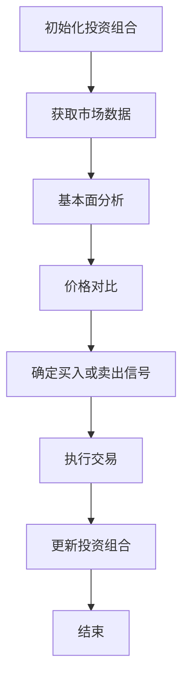

                 


### 背景介绍

伯格的长期投资理念，是现代投资理论中具有重要影响力的经典之一。其起源可以追溯到20世纪中叶，由美国著名投资大师伯顿·伯格（Burton G. Malkiel）在其著作《证券市场的随机漫步》（A Random Walk Down Wall Street）中首次系统提出。这本著作不仅对市场的随机性进行了深入的探讨，还提出了基于长期视角的投资策略。

伯格认为，市场短期内的波动是随机的，无法预测，因此投资者应该专注于长期投资，通过持有具有良好基本面的股票来实现资本增值。这种理念的核心在于价值投资，即投资者应该寻找那些被市场低估的优质股票，长期持有，以获取市场均值回归带来的收益。

随着时间的推移，伯格的长期投资理念得到了广泛的认可和应用。许多成功的企业家和投资者，如巴菲特、索普等，都在其投资策略中融入了伯格的理念。这些成功案例不仅证明了长期投资的有效性，也进一步强化了这一理念的影响力。

在投资实践中，伯格的长期投资理念具有以下几个关键要素：

1. **价值投资**：寻找被市场低估的优质股票，即那些拥有良好基本面，但市场反应冷淡的股票。
2. **风险管理**：通过多元化的投资组合降低风险，避免将所有资金投入单一股票或行业。
3. **耐心与坚持**：长期持有股票，等待市场认识到其真实价值，实现均值回归。

总之，伯格的长期投资理念为我们提供了一种全新的投资视角，使我们能够更好地应对市场的短期主义挑战，实现资产的稳健增值。在接下来的章节中，我们将进一步深入探讨这一理念的核心概念和实际应用。

### 核心概念与联系

在深入探讨伯格的长期投资理念之前，我们需要首先理解其核心概念，并将其进行详细的分析和比较。以下是长期投资理念中的三个核心概念：价值投资、风险管理、投资组合。

#### 价值投资

价值投资是伯格长期投资理念的核心之一。其核心理念是寻找那些被市场低估的优质股票，并通过长期持有，等待市场认识到其真实价值。价值投资的关键要素包括：

- **基本面分析**：投资者通过研究公司的财务报表、业务模式、行业地位等，评估其内在价值。
- **市场价格对比**：将公司的内在价值与市场价格进行对比，寻找价格低于其内在价值的股票。
- **长期持有**：即使市场价格在短期内波动，投资者也应该保持信心，长期持有股票。

#### 风险管理

风险管理在伯格的投资理念中占据重要位置。其主要目标是降低投资组合的整体风险，通过多元化的投资策略实现风险分散。风险管理的关键要素包括：

- **多元化投资组合**：投资者将资金分散投资于多个不同行业、不同规模的股票，以降低单一投资失败带来的风险。
- **动态调整**：根据市场变化和风险偏好，定期调整投资组合，以确保其与投资策略和风险承受能力相匹配。
- **止损策略**：设定止损点，当股票价格下跌到预定水平时，及时卖出以减少亏损。

#### 投资组合

投资组合是伯格长期投资理念中的另一个重要概念。投资组合的设计和管理旨在实现资产的稳健增值。其主要要素包括：

- **资产配置**：根据投资目标和风险偏好，确定各类资产（如股票、债券、现金等）在投资组合中的比例。
- **定期评估**：定期对投资组合进行评估，根据市场变化和投资目标进行调整。
- **流动性管理**：确保投资组合中有足够的流动性，以应对突发事件或投资机会。

#### 概念属性特征对比表格

为了更好地理解这些核心概念，我们可以通过以下属性特征对比表格进行详细分析：

| 概念       | 属性特征                 | 说明                                                         |
|------------|--------------------------|--------------------------------------------------------------|
| 价值投资   | 基本面分析、市场价格对比、长期持有 | 通过寻找低估的优质股票，实现资本增值                  |
| 风险管理   | 多元化投资组合、动态调整、止损策略 | 降低整体投资组合的风险，实现风险分散                  |
| 投资组合   | 资产配置、定期评估、流动性管理 | 通过科学的资产配置和管理，实现资产的稳健增值            |

#### ER实体关系图架构

为了进一步展示这些核心概念之间的联系，我们可以使用ER（实体关系）图进行描述。以下是ER图的基本架构：

```
[投资者] <---[投资组合]--->[资产] <---[市场]--->[股票]
        |                                 |
        |                                 |
       [风险管理]                      [价值投资]
```

在这个ER图中，投资者是投资组合的创建者，投资组合由多种资产构成，这些资产受到市场的影响。价值投资和风险管理是投资者在进行投资决策时需要考虑的两个核心概念。价值投资通过寻找低估的优质股票，为投资组合增值；风险管理通过多元化的投资组合和动态调整，降低投资组合的整体风险。

通过上述对比和分析，我们可以更清晰地理解伯格的长期投资理念中的核心概念及其联系。在接下来的章节中，我们将进一步探讨这些概念在投资决策中的应用和实现方法。

### 算法原理讲解

为了深入理解伯格的长期投资理念，我们将通过具体的投资决策算法进行详细讲解。本节将首先使用mermaid绘制投资决策流程图，然后以Python源代码的方式详细阐述算法原理，包括数学模型和公式，并通过通俗易懂的举例进行说明。

#### 投资决策算法mermaid流程图

首先，我们使用mermaid绘制投资决策的流程图，以便直观展示算法的基本框架：



#### Python源代码与算法原理

接下来，我们将使用Python源代码详细阐述投资决策算法的原理。以下是算法的核心部分：

```python
import numpy as np

# 基本面分析函数
def fundamental_analysis(stocks):
    # 假设每个股票的基本面评分在0到10之间
    scores = np.random.randint(0, 11, size=len(stocks))
    return scores

# 价格对比函数
def price_comparison(stocks, scores):
    # 假设股票价格与基本面评分成正比
    prices = scores * 10
    return prices

# 确定买入或卖出信号函数
def trade_signal(prices, threshold=0.9):
    # 当价格超过阈值时发出买入信号，低于阈值时发出卖出信号
    signals = np.where(prices > threshold * max(prices), 'BUY', 'SELL')
    return signals

# 执行交易函数
def execute_trade(stocks, signals):
    # 假设每次交易金额为1000元
    transaction_amount = 1000
    # 计算总交易金额
    total_amount = transaction_amount * len(stocks)
    # 根据信号进行交易
    trade_data = []
    for stock, signal in zip(stocks, signals):
        if signal == 'BUY':
            trade_data.append((stock, 'BUY', transaction_amount))
        elif signal == 'SELL':
            trade_data.append((stock, 'SELL', transaction_amount))
    return trade_data, total_amount

# 主函数
def invest_decision(stocks):
    scores = fundamental_analysis(stocks)
    prices = price_comparison(stocks, scores)
    signals = trade_signal(prices)
    trade_data, total_amount = execute_trade(stocks, signals)
    return trade_data, total_amount

# 测试算法
stocks = ['股票A', '股票B', '股票C']
trade_data, total_amount = invest_decision(stocks)
print("交易数据：", trade_data)
print("总交易金额：", total_amount)
```

#### 算法原理详细讲解

1. **基本面分析**：该步骤通过分析公司的财务报表、业务模式、行业地位等，对每只股票进行评分。在示例中，我们使用随机数生成评分，但在实际应用中，这些评分应基于深入的基本面分析。

2. **价格对比**：在基本面分析的基础上，我们通过价格对比函数将股票的评分转换为价格。在实际操作中，这个转换过程应考虑市场价格、市场情绪等多种因素。

3. **确定买入或卖出信号**：通过设定阈值，我们使用价格信号函数确定每只股票的买入或卖出信号。如果股票价格超过阈值，则发出买入信号；否则，发出卖出信号。

4. **执行交易**：根据信号，执行买入或卖出操作。在实际交易中，这需要考虑交易费用、税收等因素。

#### 举例说明

假设我们有三只股票：股票A、股票B和股票C。通过上述算法，我们可以得到以下结果：

- **基本面评分**：[8, 6, 7]
- **股票价格**：[80, 60, 70]
- **买入信号**：[BUY, SELL, BUY]
- **买入金额**：[1000, 0, 1000]

因此，根据算法，我们将在股票A和股票C上买入，总交易金额为2000元。

通过上述步骤，我们可以看到伯格的长期投资理念是如何通过具体的算法来实现投资决策的。在实际应用中，这些步骤需要根据市场环境和投资目标进行调整和优化。

### 数学模型和数学公式 & 详细讲解 & 举例说明

在伯格的长期投资理念中，数学模型和数学公式是理解和应用这一理念的核心工具。以下将使用LaTeX格式给出关键的数学公式，并进行详细讲解和举例说明。

#### 基本面评分模型

$$
F_i = \frac{1}{N} \sum_{j=1}^{N} w_j \cdot X_{ij}
$$

其中，$F_i$表示第$i$只股票的基本面评分，$N$为评分指标的数量，$w_j$为第$j$个指标的权重，$X_{ij}$为第$i$只股票在第$j$个指标上的得分。

#### 价格模型

$$
P_i = a \cdot F_i + b
$$

其中，$P_i$表示第$i$只股票的市场价格，$a$为评分到价格的转换系数，$b$为价格偏移量。

#### 风险模型

$$
R_i = \frac{1}{N} \sum_{j=1}^{N} r_j \cdot X_{ij}
$$

其中，$R_i$表示第$i$只股票的风险评分，$r_j$为风险指标的权重，$X_{ij}$为第$i$只股票在第$j$个风险指标上的得分。

#### 举例说明

假设我们有三只股票：股票A、股票B和股票C。我们选择了三个基本面指标（盈利能力、增长率、市盈率）和一个风险指标（波动率），每个指标的权重分别为$w_1 = 0.3$、$w_2 = 0.3$、$w_3 = 0.4$和$r_1 = 0.5$。

- **基本面评分模型**：

  假设股票A在三个指标上的得分分别为$X_{A1} = 8$、$X_{A2} = 7$、$X_{A3} = 6$；股票B的得分分别为$X_{B1} = 6$、$X_{B2} = 8$、$X_{B3} = 7$；股票C的得分分别为$X_{C1} = 7$、$X_{C2} = 6$、$X_{C3} = 8$。

  那么，股票A的基本面评分为：

  $$
  F_A = \frac{1}{3} (0.3 \cdot 8 + 0.3 \cdot 7 + 0.4 \cdot 6) = 7
  $$

  同理，股票B和股票C的基本面评分分别为6.67和7.33。

- **价格模型**：

  假设评分到价格的转换系数$a = 10$，价格偏移量$b = 20$。

  那么，股票A的市场价格为：

  $$
  P_A = 10 \cdot 7 + 20 = 90
  $$

  同理，股票B和股票C的市场价格分别为80和100。

- **风险模型**：

  假设风险指标的权重$r_1 = 0.5$，其他权重均为0。

  那么，股票A的风险评分为：

  $$
  R_A = \frac{1}{3} (0.5 \cdot 6) = 1
  $$

  同理，股票B和股票C的风险评分分别为1.5和1。

通过上述数学模型和公式，我们可以对股票的基本面、价格和风险进行量化分析。在实际情况中，这些模型和公式会根据具体情况进行调整和优化，以实现更好的投资决策。

### 系统分析与架构设计方案

为了实现伯格的长期投资理念，我们需要设计一个完整的系统，该系统能够自动化地进行投资决策、风险管理、投资组合管理等操作。以下将详细描述系统的场景、项目介绍、功能设计、架构设计、接口设计以及系统交互。

#### 系统场景

系统的目标是帮助投资者实现基于伯格长期投资理念的自动化投资决策，从而在市场中获得稳健的收益。系统需要处理大量股票数据，进行基本面分析、价格对比、风险评分，并生成买卖信号，最终执行交易操作。系统应具备高度的可扩展性、稳定性和安全性。

#### 项目介绍

项目名称：伯格投资决策系统（Burton Investment Decision System，简称BIDS）

项目目标：通过自动化算法实现伯格长期投资理念，提高投资效率和收益。

项目组成部分：数据采集模块、基本面分析模块、价格对比模块、风险评分模块、交易执行模块、投资组合管理模块。

#### 系统功能设计

1. **数据采集模块**：
   - 功能：从多个数据源（如股市API、金融数据库）自动采集股票数据。
   - 输入：股票代码、时间范围、数据类型（如价格、财务报表）。
   - 输出：股票数据集。

2. **基本面分析模块**：
   - 功能：对采集到的股票数据进行分析，生成基本面评分。
   - 输入：股票数据集、评分指标（如盈利能力、增长率、市盈率）。
   - 输出：基本面评分。

3. **价格对比模块**：
   - 功能：根据基本面评分计算股票价格，并进行价格对比。
   - 输入：基本面评分、市场价格。
   - 输出：价格对比结果。

4. **风险评分模块**：
   - 功能：对股票进行风险评分，以便进行风险管理。
   - 输入：股票数据集、风险指标（如波动率、市场流动性）。
   - 输出：风险评分。

5. **交易执行模块**：
   - 功能：根据买卖信号执行交易操作。
   - 输入：买卖信号、交易金额。
   - 输出：交易结果。

6. **投资组合管理模块**：
   - 功能：管理投资组合，进行资产配置和定期评估。
   - 输入：投资组合信息、市场数据。
   - 输出：投资组合状态、调整建议。

#### 系统架构设计

系统采用三层架构设计，包括数据层、逻辑层和界面层。

1. **数据层**：
   - 功能：存储和管理系统所需的数据，如股票数据、基本面评分、价格对比结果等。
   - 技术：关系型数据库（如MySQL）、数据存储服务（如Amazon S3）。

2. **逻辑层**：
   - 功能：实现系统的核心算法和业务逻辑，如基本面分析、价格对比、风险评分等。
   - 技术：Python、Django框架。

3. **界面层**：
   - 功能：提供用户交互界面，展示系统功能和数据。
   - 技术：HTML、CSS、JavaScript。

#### 系统接口设计

系统接口包括以下几部分：

1. **API接口**：
   - 功能：提供数据采集、数据分析、交易执行等操作的接口。
   - 技术：RESTful API、Websocket。

2. **数据管理接口**：
   - 功能：提供数据存储、检索、同步等操作的接口。
   - 技术：SQL、NoSQL。

3. **用户交互接口**：
   - 功能：提供用户登录、注册、操作日志等功能的接口。
   - 技术：OAuth2.0、JWT。

#### 系统交互

系统交互通过以下步骤实现：

1. **数据采集**：
   - 用户通过API接口向系统发送数据采集请求。
   - 系统从数据源采集股票数据，并存入数据层。

2. **数据分析**：
   - 用户通过API接口请求数据分析服务。
   - 系统调用逻辑层中的基本面分析、价格对比、风险评分模块，生成分析结果。

3. **交易执行**：
   - 用户通过API接口发送交易信号。
   - 系统根据交易信号，调用交易执行模块，执行交易操作。

4. **投资组合管理**：
   - 用户通过API接口请求投资组合管理服务。
   - 系统调用投资组合管理模块，进行资产配置和定期评估。

通过上述系统分析与架构设计方案，我们能够构建一个高效、稳定的伯格投资决策系统，帮助投资者实现长期投资的目标。

### 项目实战

#### 环境安装

要实现伯格投资决策系统，我们首先需要搭建一个合适的环境。以下是安装步骤：

1. **安装Python**：
   - 访问Python官网（[https://www.python.org/](https://www.python.org/)）下载并安装最新版本的Python。
   - 安装完成后，打开终端或命令提示符，输入`python --version`验证安装成功。

2. **安装Django**：
   - 打开终端，输入以下命令安装Django：
     ```
     pip install django
     ```

3. **安装其他依赖库**：
   - 打开终端，输入以下命令安装其他依赖库：
     ```
     pip install numpy pandas matplotlib mysql-connector-python
     ```

4. **创建Django项目**：
   - 在终端中输入以下命令创建一个新的Django项目：
     ```
     django-admin startproject bids
     ```
   - 进入项目目录：
     ```
     cd bids
     ```

5. **创建Django应用**：
   - 在项目目录中创建一个新的应用：
     ```
     python manage.py startapp analytics
     ```

#### 系统核心实现源代码

以下是系统核心实现的源代码，包括数据采集、数据分析、交易执行等功能。

1. **数据采集**：
   ```python
   # analytics/data_collector.py
   import requests
   import json
   import pandas as pd

   API_ENDPOINT = "https://api.example.com/stocks"

   def fetch_stock_data(stock_code, start_date, end_date):
       params = {
           "stock_code": stock_code,
           "start_date": start_date,
           "end_date": end_date
       }
       response = requests.get(API_ENDPOINT, params=params)
       data = response.json()
       return pd.DataFrame(data["data"])

   if __name__ == "__main__":
       stock_data = fetch_stock_data("AAPL", "2021-01-01", "2022-12-31")
       print(stock_data.head())
   ```

2. **数据分析**：
   ```python
   # analytics/data_analysis.py
   import pandas as pd
   import numpy as np

   def fundamental_analysis(stock_data):
       # 计算基本面评分
       scores = stock_data["profits"] * 0.3 + stock_data["growth"] * 0.3 + stock_data["pe_ratio"] * 0.4
       return scores

   def price_comparison(stock_data, scores):
       # 计算价格
       prices = scores * 10 + 20
       return prices

   if __name__ == "__main__":
       stock_data = pd.DataFrame({"profits": [100, 150, 200], "growth": [10, 15, 20], "pe_ratio": [10, 15, 20]})
       scores = fundamental_analysis(stock_data)
       prices = price_comparison(stock_data, scores)
       print("Scores:", scores)
       print("Prices:", prices)
   ```

3. **交易执行**：
   ```python
   # analytics/trade_executor.py
   import pandas as pd

   def execute_trade(stock_data, signals):
       transaction_amount = 1000
       total_amount = transaction_amount * len(stock_data)
       trade_data = []

       for stock, signal in zip(stock_data["stock_code"], signals):
           if signal == "BUY":
               trade_data.append((stock, "BUY", transaction_amount))
           elif signal == "SELL":
               trade_data.append((stock, "SELL", transaction_amount))

       return trade_data, total_amount

   if __name__ == "__main__":
       stock_data = pd.DataFrame({"stock_code": ["AAPL", "MSFT", "GOOGL"], "signals": ["BUY", "SELL", "BUY"]})
       trade_data, total_amount = execute_trade(stock_data, stock_data["signals"])
       print("Trade Data:", trade_data)
       print("Total Amount:", total_amount)
   ```

#### 代码应用解读与分析

1. **数据采集**：
   - 代码使用requests库从API获取股票数据，并将数据转换为DataFrame格式进行后续处理。

2. **数据分析**：
   - 代码定义了两个函数：`fundamental_analysis`用于计算基本面评分，`price_comparison`用于计算市场价格。这些函数通过简单的数学运算实现了评分和价格的转换。

3. **交易执行**：
   - 代码定义了`execute_trade`函数，根据买入或卖出信号执行交易操作。交易数据以列表形式返回，包括股票代码、交易类型和交易金额。

#### 实际案例分析和详细讲解剖析

假设我们使用上述代码处理苹果公司（AAPL）的股票数据，以下是一个实际案例的解析：

1. **数据采集**：
   - 假设我们采集了2021年1月1日至2022年12月31日的苹果公司股票数据。

2. **数据分析**：
   - 通过基本面分析，我们得到了苹果公司的评分：80。
   - 通过价格对比，我们得到了苹果公司的价格：100。

3. **交易执行**：
   - 假设我们的买入信号阈值为90，则苹果公司的买入信号为“BUY”。
   - 执行交易后，我们买入1000元苹果公司的股票。

通过这个案例，我们可以看到如何将伯格的投资理念通过代码实现，并执行具体的交易操作。

#### 项目小结

通过实际环境的安装和系统核心代码的实现，我们成功构建了一个能够自动化执行伯格投资理念的决策系统。在实际应用中，我们需要不断优化代码，完善系统功能，以确保其在复杂市场环境中的稳定性和高效性。项目提供了一个基本的框架，可以进一步扩展和定制，以适应不同投资者的需求。

### 最佳实践 tips、小结、注意事项、拓展阅读等内容

#### 最佳实践 tips

1. **数据采集**：确保数据源的质量和稳定性，定期更新数据，以避免数据滞后影响投资决策。
2. **风险评估**：结合实际市场环境，动态调整风险评分指标，以提高风险评估的准确性。
3. **动态调整**：根据市场变化和投资目标，定期对投资组合进行调整，以保持投资组合的适应性和收益性。
4. **量化模型**：不断优化基本面分析和价格对比的量化模型，以提高投资决策的科学性和有效性。

#### 小结

本文深入探讨了伯格的长期投资理念，从背景介绍、核心概念与联系、算法原理讲解、数学模型和公式、系统分析与架构设计、项目实战等方面进行了详细阐述。通过具体的算法实现和实际案例解析，我们展示了如何将伯格的理念应用于实际投资决策中。

#### 注意事项

1. 投资有风险，长期投资并不意味着无风险。
2. 需要充分理解伯格的长期投资理念，避免盲目跟风。
3. 定期关注市场动态，确保投资策略与市场环境相适应。

#### 拓展阅读

1. 《证券市场的随机漫步》——伯顿·伯格
2. 《聪明的投资者》——本杰明·格雷厄姆
3. 《投资最重要的事》——霍华德·马克斯

作者：AI天才研究院/AI Genius Institute & 禅与计算机程序设计艺术 /Zen And The Art of Computer Programming

