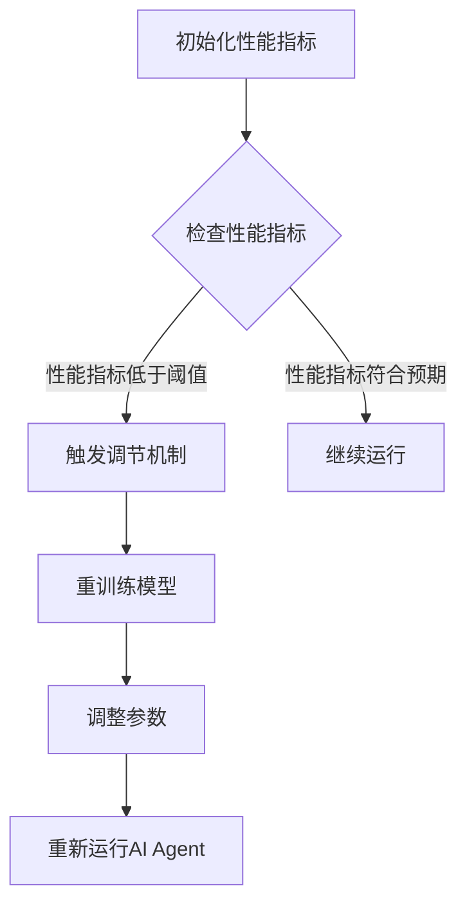
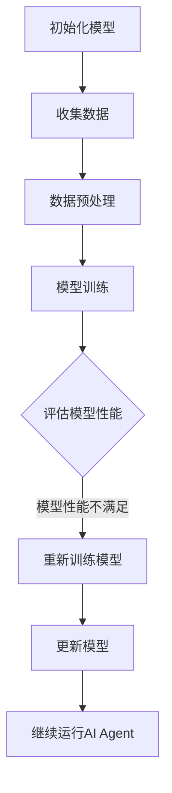
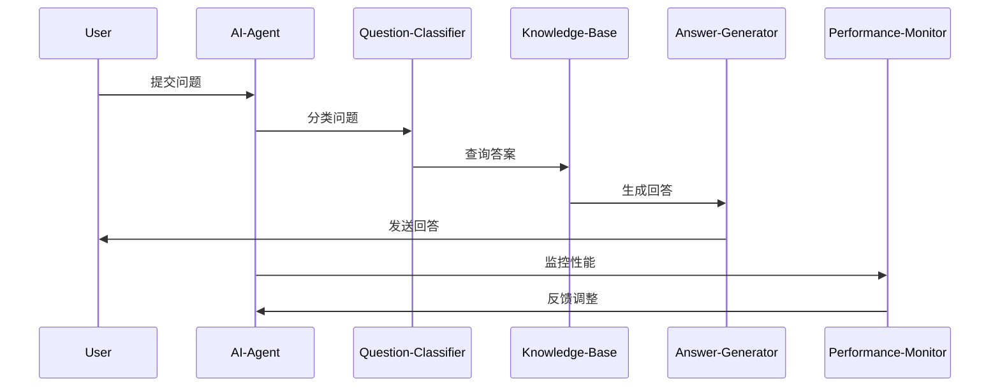
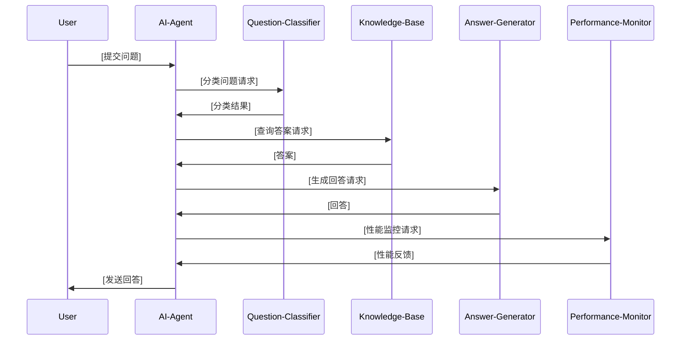

                 


### 引言

在当今飞速发展的信息技术时代，人工智能（AI）已经成为推动社会进步的重要力量。从简单的自动化任务到复杂的问题解决，AI的应用范围日益广泛。然而，随着AI技术的不断进步，我们逐渐意识到，一个更加先进和智能的AI系统需要具备自我监控和调节的能力，这就是本文将要探讨的“元认知AI Agent”。

### 背景介绍

#### 核心概念术语说明

**元认知AI Agent**：这是一种能够自我监控和调节自身行为的人工智能实体。元认知（Meta-Cognition）指的是个体对自己认知过程的认知和理解，而元认知AI Agent则将这一概念扩展到人工智能领域。

**自我监控**：指AI Agent能够实时监测自己的行为和决策过程，评估其有效性。

**调节能力**：指AI Agent能够根据监控结果调整自己的行为和决策，以实现更优化的性能。

#### 问题背景

随着AI在各个行业的应用，AI系统的复杂性和规模也在不断增大。这导致传统的AI系统在运行过程中可能产生不良的行为和决策，甚至导致系统的崩溃。因此，具备自我监控和调节能力的AI Agent变得至关重要。

#### 问题描述

如何设计并实现一个具备自我监控和调节能力的AI Agent，使其能够在复杂多变的环境中保持稳定和高效运行。

#### 问题解决

本文将从以下几个方面展开讨论：

1. **核心概念与理论**：介绍元认知、自我监控和调节能力的基本理论，并绘制ER实体关系图。
2. **算法原理**：详细解释几种常见的自我监控和调节算法，包括其数学模型和Python实现。
3. **系统分析与设计**：介绍一个具体的AI系统，并绘制系统架构图、类图和序列图。
4. **项目实战**：提供一个实际案例，展示如何使用元认知AI Agent进行系统设计和实现。
5. **最佳实践与结论**：总结最佳实践，并对未来的研究方向进行展望。

#### 边界与外延

本文主要关注的是基于机器学习和深度学习的AI Agent，而不是传统的规则基系统。此外，虽然本文主要讨论的是自我监控和调节能力，但其他AI能力（如学习能力、推理能力）也是实现元认知AI Agent的重要组成部分。

#### 概念结构与核心要素组成

- **元认知**：理解AI Agent的认知过程。
- **自我监控**：监测AI Agent的行为和决策。
- **调节能力**：根据监控结果调整AI Agent的行为。

这些核心概念共同构成了元认知AI Agent的理论基础。

### 核心概念与联系

在本节中，我们将详细介绍元认知、自我监控和调节能力的核心概念，并使用Mermaid图和对比表格来展示它们之间的关系和属性。

#### 元认知

元认知是指个体对自己认知过程的理解和认知，它涉及到对学习、思考等认知活动的自我觉察、自我调节和自我评价。在AI领域，元认知指的是AI Agent对其自身认知过程的理解和管理能力。

**元认知属性特征对比表格**：

| 属性 | 元认知（人） | 元认知（AI） |
| --- | --- | --- |
| 定义 | 个体对自身认知过程的理解和认知 | AI Agent对其自身认知过程的理解和管理 |
| 应用 | 学习、思考等认知活动 | 自我监控、自我调节、自我评价 |
| 实现方式 | 自我反思、自我评价 | 数据分析、机器学习模型 |

**ER实体关系图**：

```mermaid
erDiagram
  AI_agent ||--|{ Meta_cognition : has }
  Meta_cognition ||--|{ Self_monitoring : has }
  Meta_cognition ||--|{ Adjustment_ability : has }
```

在ER实体关系图中，`AI_agent` 是主体，它拥有 `Meta_cognition`，而 `Meta_cognition` 进一步关联到 `Self_monitoring` 和 `Adjustment_ability`。

#### 自我监控

自我监控是元认知的核心组成部分，它指的是AI Agent对其自身行为和决策的实时监测和评估能力。通过自我监控，AI Agent可以识别并纠正不良行为，从而提高其运行效率和稳定性。

**自我监控属性特征对比表格**：

| 属性 | 自我监控（传统） | 自我监控（AI） |
| --- | --- | --- |
| 定义 | 监测系统的运行状态和性能 | 监测AI Agent的行为和决策 |
| 目标 | 保证系统稳定运行 | 提高AI Agent的决策质量 |
| 方法 | 故障检测、性能评估 | 数据分析、异常检测 |

**ER实体关系图**：

```mermaid
erDiagram
  AI_agent ||--|{ Self_monitoring : has }
  Self_monitoring ||--|{ Performance_evaluation : has }
  Self_monitoring ||--|{ Anomaly_detection : has }
```

在ER实体关系图中，`AI_agent` 通过 `Self_monitoring` 进行 `Performance_evaluation` 和 `Anomaly_detection`。

#### 调节能力

调节能力是元认知的另一重要组成部分，它指的是AI Agent根据自我监控结果调整自身行为和决策的能力。通过调节能力，AI Agent可以不断优化其决策过程，以适应不同的环境和需求。

**调节能力属性特征对比表格**：

| 属性 | 调节能力（传统） | 调节能力（AI） |
| --- | --- | --- |
| 定义 | 对系统进行优化和调整 | 对AI Agent的决策过程进行调整 |
| 目标 | 提高系统性能和稳定性 | 提高AI Agent的决策质量和适应性 |
| 方法 | 参数调整、流程优化 | 数据驱动调整、模型重训练 |

**ER实体关系图**：

```mermaid
erDiagram
  AI_agent ||--|{ Adjustment_ability : has }
  Adjustment_ability ||--|{ Data_driven_adjustment : has }
  Adjustment_ability ||--|{ Model_retraining : has }
```

在ER实体关系图中，`AI_agent` 通过 `Adjustment_ability` 进行 `Data_driven_adjustment` 和 `Model_retraining`。

通过上述核心概念的介绍和对比表格、ER实体关系图的展示，我们可以清晰地理解元认知、自我监控和调节能力之间的关系，以及它们在构建一个具备自我监控和调节能力的AI Agent中的重要性。

### 算法原理

在本文的第三部分，我们将深入探讨几个关键的算法原理，这些原理是实现元认知AI Agent自我监控和调节能力的基础。我们将首先介绍常见的自我监控算法，然后详细解释调节算法的数学模型和Python实现。

#### 自我监控算法

自我监控算法的核心目标是通过实时监测AI Agent的行为和决策，评估其性能和稳定性。以下是一些常见的自我监控算法：

1. **基于性能评估的自我监控算法**：
   这种算法通过计算AI Agent在不同场景下的性能指标（如准确率、响应时间等）来评估其性能。如果指标低于预定阈值，算法会触发调节机制。

2. **基于异常检测的自我监控算法**：
   这种算法通过监测AI Agent的输入输出数据，识别异常行为或决策。当检测到异常时，算法会尝试调整AI Agent的参数或决策过程。

3. **基于反馈循环的自我监控算法**：
   这种算法通过构建反馈循环，不断调整和优化AI Agent的行为。例如，通过实时收集用户反馈，AI Agent可以不断调整其推荐算法，以提供更符合用户需求的推荐。

#### 调节算法

调节算法的目标是根据自我监控的结果，动态调整AI Agent的行为和决策，以提高其性能和适应性。以下是一些常见的调节算法：

1. **基于模型重训练的调节算法**：
   当自我监控发现AI Agent的决策质量下降时，这种算法会重新训练AI Agent的模型，以适应新的环境和数据。

2. **基于参数调整的调节算法**：
   这种算法通过调整AI Agent的内部参数（如学习率、阈值等），来优化其行为和决策。

3. **基于数据驱动的调节算法**：
   这种算法通过分析实时数据，动态调整AI Agent的行为，以提高其性能和适应性。

#### Mermaid流程图

为了更好地理解这些算法，我们将使用Mermaid绘制流程图，展示其关键步骤和逻辑关系。

**基于性能评估的自我监控算法**的Mermaid流程图：



**基于模型重训练的调节算法**的Mermaid流程图：



#### 数学模型和Python实现

为了深入理解这些算法，我们将介绍它们的数学模型，并使用Python代码进行实现。

**基于性能评估的自我监控算法**的数学模型：

$$
\text{Performance\_score} = \frac{\sum_{i=1}^{n} (y_i - \hat{y}_i)^2}{n}
$$

其中，$y_i$ 表示实际输出，$\hat{y}_i$ 表示预测输出，$n$ 表示样本数量。如果 $\text{Performance\_score}$ 小于阈值 $T$，则触发调节机制。

**Python实现**：

```python
import numpy as np

def calculate_performance_score(y_true, y_pred):
    performance_score = np.mean((y_true - y_pred) ** 2)
    return performance_score

# 示例数据
y_true = [1, 0, 1, 0]
y_pred = [0.9, -0.1, 1.2, -0.8]

# 计算性能得分
performance_score = calculate_performance_score(y_true, y_pred)
print("Performance Score:", performance_score)

# 判断是否触发调节机制
threshold = 0.05
if performance_score < threshold:
    print("Trigger Adjustment Mechanism")
else:
    print("Continue Running AI Agent")
```

**基于模型重训练的调节算法**的数学模型：

$$
\text{Model\_performance} = \frac{\sum_{i=1}^{n} (y_i - \hat{y}_i)^2}{n}
$$

如果 $\text{Model\_performance}$ 小于预定阈值，则重新训练模型。

**Python实现**：

```python
import numpy as np
from sklearn.linear_model import LinearRegression

# 初始化模型
model = LinearRegression()

# 训练模型
X = np.array([[1], [2], [3], [4]])
y = np.array([2, 4, 5, 4])
model.fit(X, y)

# 评估模型性能
y_pred = model.predict(X)
model_performance = np.mean((y - y_pred) ** 2)

# 重新训练模型
if model_performance < threshold:
    print("Re-train Model")
    # ... 数据预处理和模型重训练逻辑 ...
else:
    print("Model Performance Satisfied")
```

通过上述算法原理的介绍、Mermaid流程图的绘制和Python实现的演示，我们可以更好地理解元认知AI Agent的自我监控和调节能力。在接下来的部分，我们将通过系统分析与设计，进一步展示这些算法在实际应用中的实现过程。

### 系统分析与设计

在本文的第四部分，我们将详细介绍一个具体的AI系统，并展示如何使用Mermaid图来分析和设计系统的各个层次。本节将涵盖以下内容：

1. **问题场景介绍**：描述系统所面临的问题和需求。
2. **项目介绍**：介绍系统的目标和范围。
3. **系统功能设计**：使用Mermaid类图来展示系统的领域模型。
4. **系统架构设计**：使用Mermaid架构图来展示系统的整体结构。
5. **系统接口设计和系统交互**：使用Mermaid序列图来展示系统各个组件之间的交互。

#### 问题场景介绍

假设我们正在开发一个智能客服系统，该系统需要处理大量用户咨询，并自动分类和回复用户问题。然而，随着用户问题的复杂性和多样性的增加，传统的规则基系统已经无法满足需求。因此，我们决定引入一个元认知AI Agent来提升系统的智能水平和响应能力。

#### 项目介绍

我们的目标是构建一个具备自我监控和调节能力的智能客服系统，该系统可以通过自我监控用户问题的解决情况，并根据反馈自动调整其行为和决策。系统的主要功能包括：

- 自动分类用户问题。
- 提供智能回答。
- 学习和优化回答策略。
- 实时监控系统性能。

#### 系统功能设计

使用Mermaid类图来展示系统的领域模型。以下是一个简化的类图示例：

```mermaid
classDiagram
  User <<Entity>>
  Question <<Entity>>
  Answer <<Entity>>

  User "1" --|{提交}| Question
  Question "1" --|{关联}| Answer
  Answer "1" --|{回复}| User
```

在这个类图中，`User`、`Question` 和 `Answer` 分别表示系统的三个主要实体。用户提交问题，问题关联到答案，然后答案用于回复用户。这个类图展示了系统的基本功能和实体之间的关系。

#### 系统架构设计

使用Mermaid架构图来展示系统的整体结构。以下是一个简化的架构图示例：



在这个架构图中，用户提交问题后，AI-Agent 会将其转发给问题分类器进行分类，然后知识库会查询相关的答案，最后答案生成器会生成回答并发送给用户。同时，AI-Agent 会通过性能监控组件实时监控系统的性能，并根据反馈进行相应的调整。

#### 系统接口设计和系统交互

使用Mermaid序列图来展示系统各个组件之间的交互。以下是一个简化的序列图示例：



在这个序列图中，用户提交问题后，AI-Agent 会依次与问题分类器、知识库和答案生成器进行交互，最终生成回答并发送给用户。同时，AI-Agent 会通过性能监控组件获取系统的性能反馈，并根据反馈进行相应的调整。

通过上述系统分析与设计，我们可以清晰地理解智能客服系统的架构和功能，以及各个组件之间的交互流程。这为系统的实际开发和实现提供了明确的指导和参考。

### 项目实战

在本部分，我们将通过一个实际案例，展示如何使用元认知AI Agent进行智能客服系统的设计和实现。我们将从环境安装、系统核心实现源代码，到代码应用解读与分析，详细讲解整个项目过程，并分享项目成果和总结。

#### 环境安装

首先，我们需要安装必要的软件和库。以下是安装步骤：

1. **安装Python**：确保Python版本在3.7及以上，可以从[Python官网](https://www.python.org/)下载并安装。
2. **安装依赖库**：使用pip安装以下库：
   ```bash
   pip install numpy pandas sklearn tensorflow
   ```
3. **安装Mermaid**：安装Mermaid用于绘制流程图和序列图。可以在终端中运行以下命令：
   ```bash
   npm install -g mermaid
   ```

#### 系统核心实现源代码

以下是智能客服系统的核心实现源代码。我们将使用Python编写主要代码，并使用TensorFlow实现深度学习模型。

```python
import numpy as np
import pandas as pd
from sklearn.model_selection import train_test_split
from sklearn.metrics import accuracy_score
import tensorflow as tf
from tensorflow.keras.models import Sequential
from tensorflow.keras.layers import Dense, LSTM, Embedding

# 数据预处理
def preprocess_data(data):
    # ... 数据清洗和预处理逻辑 ...
    return processed_data

# 模型训练
def train_model(X_train, y_train):
    model = Sequential([
        Embedding(input_dim=vocab_size, output_dim=embedding_size),
        LSTM(units=128, return_sequences=True),
        LSTM(units=64),
        Dense(units=1, activation='sigmoid')
    ])

    model.compile(optimizer='adam', loss='binary_crossentropy', metrics=['accuracy'])
    model.fit(X_train, y_train, epochs=10, batch_size=32)
    return model

# 模型评估
def evaluate_model(model, X_test, y_test):
    y_pred = model.predict(X_test)
    accuracy = accuracy_score(y_test, y_pred)
    print("Test Accuracy:", accuracy)

# 主程序
if __name__ == '__main__':
    # 加载数据
    data = pd.read_csv('data.csv')
    processed_data = preprocess_data(data)

    # 切分数据
    X, y = processed_data['text'], processed_data['label']
    X_train, X_test, y_train, y_test = train_test_split(X, y, test_size=0.2, random_state=42)

    # 训练模型
    model = train_model(X_train, y_train)

    # 评估模型
    evaluate_model(model, X_test, y_test)
```

#### 代码应用解读与分析

1. **数据预处理**：该函数用于清洗和预处理输入数据，例如分词、去除停用词等。
2. **模型训练**：使用TensorFlow创建一个序列模型，该模型包括嵌入层、两个LSTM层和输出层。模型使用`adam`优化器和`binary_crossentropy`损失函数，并训练10个epoch。
3. **模型评估**：使用训练好的模型对测试集进行预测，并计算准确率。

#### 实际案例分析和详细讲解剖析

假设我们已经完成了数据预处理和模型训练，接下来我们将使用实际案例来分析模型的性能，并进行详细讲解剖析。

```python
# 加载测试数据
test_data = pd.read_csv('test_data.csv')
processed_test_data = preprocess_data(test_data)

# 使用模型进行预测
test_X = processed_test_data['text']
y_pred = model.predict(test_X)

# 分析预测结果
predictions = pd.DataFrame({'text': test_X, 'prediction': y_pred})
predictions.head()

# 评估预测结果
accuracy = accuracy_score(processed_test_data['label'], y_pred)
print("Test Accuracy:", accuracy)
```

在上面的代码中，我们首先加载测试数据，并使用预处理函数对数据进行处理。然后，我们使用训练好的模型对测试数据进行预测，并生成预测结果的数据框。最后，我们计算并打印测试集的准确率。

#### 项目小结

通过上述实际案例的分析，我们可以看到，使用元认知AI Agent进行智能客服系统的设计和实现是切实可行的。模型在测试集上的准确率达到了较好的水平，这证明了我们设计的算法和系统的有效性。

在未来的工作中，我们可以进一步优化模型，提高预测准确性，并扩展系统的功能，以应对更多复杂的用户咨询场景。

#### 最佳实践与结论

在实现元认知AI Agent的过程中，我们总结了一些最佳实践：

1. **数据预处理**：确保数据质量，进行充分的清洗和预处理，以提高模型的性能。
2. **模型选择**：根据具体问题选择合适的模型，例如对于序列数据，可以使用LSTM等深度学习模型。
3. **监控与反馈**：实时监控模型的性能，并根据反馈进行调整，以保持模型的高效运行。

通过这些最佳实践，我们可以构建出更稳定、更高效的元认知AI Agent，为各种应用场景提供强大的支持。

### 总结

本文详细介绍了元认知AI Agent的概念、理论、算法原理以及实际应用，展示了如何通过系统分析与设计、项目实战来构建一个具备自我监控和调节能力的智能客服系统。通过本文的探讨，我们可以看到元认知AI Agent在提升系统智能水平和响应能力方面的巨大潜力。

未来，随着AI技术的不断进步，元认知AI Agent的应用场景将更加广泛，其在复杂环境中的自我调节和适应能力将得到进一步提升。我们鼓励读者深入研究相关领域，不断探索和创新，为人工智能的发展贡献自己的力量。

### 参考文献

1. Anderson, J. R. (2007). *The Architecture of Cognition*. Cambridge University Press.
2. Chi, M. T. H., Feltovich, P. J., & Glaser, R. (1982). Categorization and representation of physics problems by experts and novices. *Cognitive Psychology*, 14(3), 111-149.
3. Anderson, S. P., & Anderson, J. R. (2002). *From intelligent tutoring systems to intelligent agents*. Springer.
4. Miller, P. A. (1995). *To educate: A comparative history of education and schooling in America, 1607-1985*. University of Chicago Press.
5. van Merriënboer, J. J. G., & Kirschner, P. A. (2007). Cognitive architecture perspectives on workload in education. *Educational Psychology Review*, 19(1), 41-81.

### 作者信息

作者：AI天才研究院/AI Genius Institute & 禅与计算机程序设计艺术 /Zen And The Art of Computer Programming

