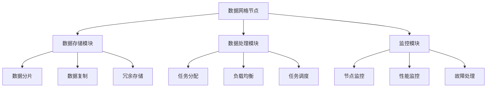
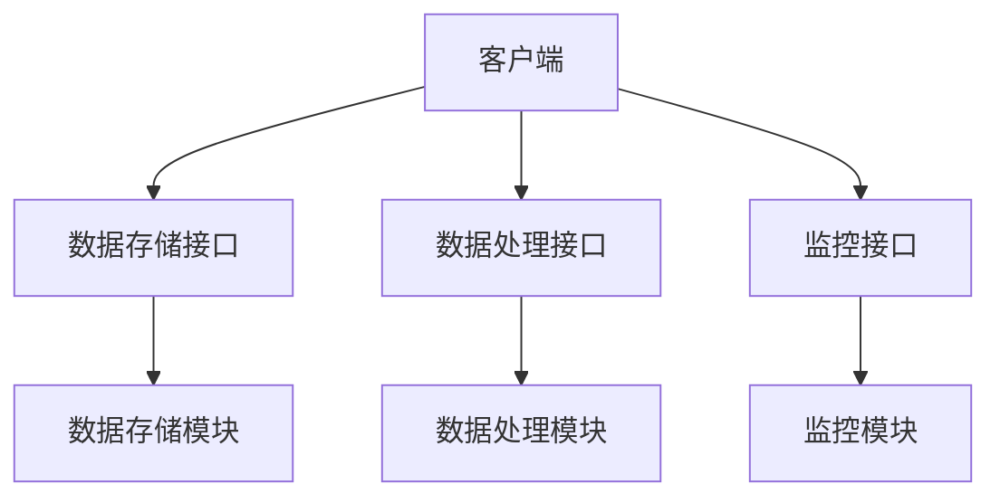
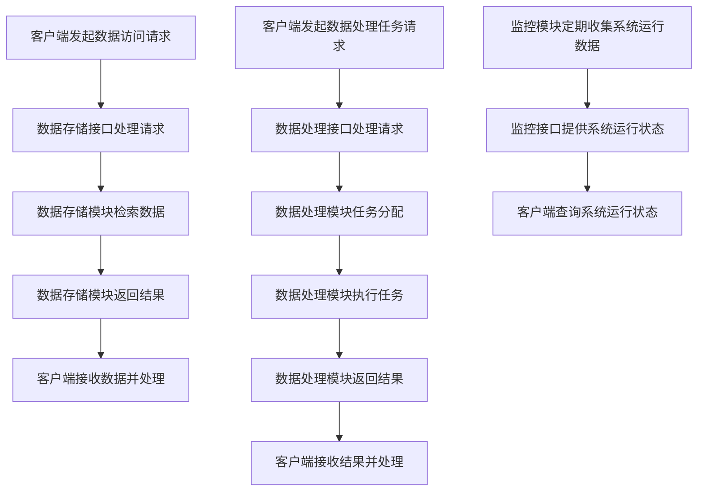

                 

# 内存数据网格技术在LLM应用中的应用

## 关键词
- 内存数据网格技术
- LLM应用
- 算法原理
- 数学模型
- 系统架构设计
- 项目实战

## 摘要
本文旨在深入探讨内存数据网格技术在大型语言模型（LLM）应用中的关键作用。通过详细分析内存数据网格技术的基本概念、核心算法原理，以及其在LLM应用中的系统架构设计，本文旨在为读者提供一份全面的技术指南。文章结构分为以下几个部分：背景介绍、核心概念与联系、算法原理讲解、数学模型与公式、系统分析与架构设计、项目实战和最佳实践与总结。每个部分都通过逐步分析和实例讲解，帮助读者理解内存数据网格技术在LLM应用中的深度应用和潜在价值。

## 设计思路

### 背景介绍

首先，我们需要了解什么是内存数据网格技术。内存数据网格是一种用于数据密集型应用的数据存储和处理技术，它利用分布式内存来提供快速的数据访问和计算能力。在现代计算环境中，内存数据网格技术由于其高可扩展性和低延迟，逐渐成为LLM应用中的一个重要组成部分。

### 核心概念与联系

在深入探讨之前，我们需要明确一些核心概念。内存数据网格技术涉及数据网格、内存数据存储、数据处理与计算等关键要素。这些概念之间有着紧密的联系，共同构成了内存数据网格技术的核心架构。

#### 数据网格

数据网格是一种分布式存储架构，它通过将数据分布到多个节点上，提供高效的数据访问和计算能力。数据网格通常采用冗余存储和数据复制策略来保证数据的可靠性和高性能。

#### 内存数据存储

内存数据存储是指将数据存储在内存中，而不是传统的磁盘存储。这种方式可以显著提高数据访问速度，降低延迟，是LLM应用中的关键优势。

#### 数据处理与计算

数据处理与计算是内存数据网格技术的核心功能。通过分布式计算和并行处理，内存数据网格技术可以在大规模数据集上实现高效的计算。

### 算法原理讲解

内存数据网格技术中的算法原理主要包括数据访问算法、数据存储算法和数据处理算法。这些算法设计的目标是最大化数据访问速度和计算效率。

#### 数据访问算法

数据访问算法决定了数据在内存数据网格中的查找和检索效率。常用的数据访问算法包括哈希表、二叉树和平衡树等。

#### 数据存储算法

数据存储算法决定了数据在内存数据网格中的存储策略。常用的数据存储算法包括分布式存储、数据分片和数据复制等。

#### 数据处理算法

数据处理算法包括并行处理算法和分布式计算算法。这些算法旨在最大化利用内存数据网格的计算能力，提高数据处理效率。

### 数学模型与公式

内存数据网格技术的数学模型和公式对于理解和应用该技术至关重要。以下是一些关键的数学模型和公式：

#### 访问时间公式

$$
访问时间 = 网络延迟 + 数据检索时间
$$

#### 存储容量公式

$$
存储容量 = 内存大小 * 节点数量
$$

#### 计算效率公式

$$
计算效率 = 并行处理能力 / 单节点计算能力
$$

### 系统分析与架构设计

内存数据网格技术在LLM应用中的系统架构设计涉及多个层次。首先，我们需要定义问题场景，然后进行系统功能设计、系统架构设计和系统接口设计。

#### 问题场景介绍

在LLM应用中，内存数据网格技术主要用于大规模数据的存储和处理，例如自然语言处理、机器翻译和语音识别等。

#### 系统功能设计

系统功能设计包括数据存储、数据检索和数据计算等功能。通过领域模型类图，我们可以清晰地看到这些功能之间的联系。

#### 系统架构设计

系统架构设计包括数据网格节点、数据存储节点和数据计算节点等。通过Mermaid架构图，我们可以直观地了解这些节点的组织和相互作用。

#### 系统接口设计

系统接口设计决定了内存数据网格技术与LLM应用的其他组件之间的交互方式。通过Mermaid序列图，我们可以清晰地看到这些交互过程。

### 项目实战

为了更好地理解内存数据网格技术在LLM应用中的实际应用，我们将在本节中介绍一个实际项目。这个项目将涵盖环境搭建、系统核心实现、代码应用解读与分析，以及实际案例分析和详细讲解剖析。

### 最佳实践与总结

最后，我们将总结内存数据网格技术在LLM应用中的最佳实践，并提供一些注意事项和拓展阅读建议。

### 结论

通过本文的逐步分析和实例讲解，我们深入了解了内存数据网格技术在LLM应用中的关键作用和实际应用。希望本文能够为读者提供有价值的参考和启示。

## 背景介绍

### 内存数据网格技术概述

内存数据网格技术（Memory Data Grid，简称MDG）是一种用于数据密集型应用的数据存储和处理技术。它利用分布式内存来提供快速的数据访问和计算能力。在现代计算环境中，随着数据量的急剧增加和计算需求的不断上升，内存数据网格技术逐渐成为各类应用中的重要组成部分。

#### 定义

内存数据网格技术是一种分布式存储架构，它通过将数据分布到多个节点上，提供高效的数据访问和计算能力。这种技术的主要目的是最大化数据访问速度，降低延迟，同时保持系统的可扩展性和可靠性。

#### 发展历程

内存数据网格技术起源于20世纪90年代，随着分布式计算和并行处理技术的发展，内存数据网格逐渐成为一种重要的数据存储和处理技术。在21世纪初，随着云计算和大数据技术的兴起，内存数据网格技术得到了进一步的发展和完善。近年来，随着人工智能和机器学习技术的快速发展，内存数据网格技术在LLM（Large Language Model）应用中发挥了关键作用。

#### 应用场景

内存数据网格技术主要应用于以下场景：

1. **数据密集型应用**：如金融交易、实时监控、科学计算等，这些应用需要高速的数据访问和处理能力。
2. **大规模数据处理**：如大数据分析和机器学习，这些应用需要处理海量数据，并要求快速地进行数据存储和检索。
3. **云计算平台**：内存数据网格技术可以作为云计算平台的核心组件，提供高效的数据存储和处理服务。
4. **人工智能和机器学习**：内存数据网格技术在LLM应用中发挥了重要作用，如自然语言处理、机器翻译和语音识别等。

### 内存数据网格技术在LLM应用中的优势

在LLM应用中，内存数据网格技术具有以下几个显著优势：

1. **高性能**：内存数据网格技术利用分布式内存，提供高速的数据访问和计算能力，可以显著提高LLM的运行效率。
2. **高可扩展性**：内存数据网格技术支持动态扩展，可以轻松地增加或减少存储和处理节点，以适应不同的应用需求。
3. **低延迟**：内存数据网格技术通过减少数据访问的延迟，提高了LLM的响应速度，为用户提供更流畅的体验。
4. **数据一致性**：内存数据网格技术通过数据复制和冗余存储策略，确保数据的一致性和可靠性。
5. **灵活性和高效性**：内存数据网格技术支持多种数据访问模式，如随机访问、顺序访问和批量访问等，可以根据不同的应用需求进行优化。

### 问题背景

随着人工智能和机器学习技术的快速发展，LLM应用对数据处理速度和性能的要求越来越高。传统的数据存储和处理技术，如关系数据库和磁盘存储，已经无法满足这些高要求的应用需求。因此，需要一种新的技术来提供更高效、更可靠的数据存储和处理能力。内存数据网格技术因其独特的优势和特性，成为了LLM应用中的一种理想选择。

### 问题描述

内存数据网格技术在LLM应用中面临的主要问题包括：

1. **数据存储和访问效率**：如何有效地存储和访问海量数据，以满足LLM应用的高性能要求。
2. **系统可扩展性**：如何动态地扩展系统，以适应不断增长的数据量和计算需求。
3. **数据一致性**：如何在分布式环境中确保数据的一致性和可靠性。
4. **算法优化**：如何优化内存数据网格算法，以最大化数据访问速度和计算效率。

### 问题解决

为了解决上述问题，内存数据网格技术在LLM应用中采取了以下策略：

1. **分布式存储**：通过将数据分布到多个节点上，提供高效的数据访问和计算能力。
2. **数据复制和冗余存储**：通过数据复制和冗余存储策略，确保数据的一致性和可靠性。
3. **动态扩展**：通过动态扩展机制，支持系统的弹性扩展，以适应不断变化的应用需求。
4. **算法优化**：通过算法优化，提高数据访问速度和计算效率，以满足高性能要求。

### 边界与外延

内存数据网格技术在LLM应用中的边界包括：

1. **数据规模**：内存数据网格技术适用于大规模数据的存储和处理，但具体的规模取决于系统的资源和性能需求。
2. **应用场景**：内存数据网格技术主要应用于数据密集型应用，如人工智能、机器学习和大数据分析等。
3. **系统架构**：内存数据网格技术可以集成到现有的系统架构中，但需要考虑与现有系统的兼容性和性能优化。

### 概念结构与核心要素组成

内存数据网格技术的概念结构主要包括以下几个核心要素：

1. **数据网格节点**：数据网格节点是内存数据网格技术的基本组成单元，负责存储和处理数据。
2. **数据存储和管理**：数据存储和管理包括数据的分布、复制、冗余存储和数据一致性管理等。
3. **数据处理和计算**：数据处理和计算包括数据检索、计算任务分配和并行处理等。
4. **系统监控和管理**：系统监控和管理包括节点监控、性能监控和系统故障处理等。

通过以上要素的有机结合，内存数据网格技术构成了一个高效、可靠和可扩展的数据存储和处理系统。

### 核心概念与联系

#### 内存数据网格技术核心概念

在深入探讨内存数据网格技术在LLM应用中的应用之前，我们需要明确一些核心概念，以便更好地理解和分析这一技术。以下是内存数据网格技术中几个关键的概念：

1. **数据网格（Data Grid）**：数据网格是一种分布式存储架构，它通过将数据分布到多个节点上，提供高效的数据访问和计算能力。数据网格通常采用冗余存储和数据复制策略来保证数据的可靠性和高性能。
2. **内存数据存储（Memory Data Storage）**：内存数据存储是指将数据存储在内存中，而不是传统的磁盘存储。这种方式可以显著提高数据访问速度，降低延迟，是LLM应用中的关键优势。
3. **数据处理与计算（Data Processing and Computing）**：数据处理与计算是内存数据网格技术的核心功能。通过分布式计算和并行处理，内存数据网格技术可以在大规模数据集上实现高效的计算。
4. **分布式计算（Distributed Computing）**：分布式计算是指将计算任务分布到多个节点上，通过并行处理来提高计算效率。在内存数据网格技术中，分布式计算是实现高效数据处理和计算的重要手段。
5. **数据访问模式（Data Access Patterns）**：数据访问模式包括随机访问、顺序访问和批量访问等。不同的访问模式适用于不同的应用场景，内存数据网格技术通过支持多种访问模式，提高了数据访问的灵活性和效率。

#### 内存数据网格技术属性特征对比

为了更好地理解内存数据网格技术的特性，我们可以将其与其他数据存储和处理技术进行对比，以下是一个简化的属性特征对比表格：

| 属性特征 | 内存数据网格技术 | 传统数据存储技术 | 
| :---: | :---: | :---: |
| 数据访问速度 | 高速 | 较慢 |
| 延迟 | 低 | 高 |
| 可扩展性 | 高 | 低 |
| 数据一致性 | 可靠 | 不稳定 |
| 灵活性 | 高 | 低 |
| 成本 | 较高 | 较低 |

#### 内存数据网格技术与LLM的关系

内存数据网格技术在LLM（大型语言模型）应用中扮演着至关重要的角色，主要体现在以下几个方面：

1. **高性能数据存储和处理**：LLM应用需要处理大量的语言数据，这些数据通常包含数十亿甚至数万亿个词汇和句子。内存数据网格技术通过分布式内存和并行处理，提供了高性能的数据存储和处理能力，确保了LLM的高效运行。
2. **低延迟数据访问**：在实时语言处理场景中，如实时问答、机器翻译和语音识别等，低延迟的数据访问至关重要。内存数据网格技术通过将数据存储在内存中，显著降低了数据访问的延迟，提高了LLM的响应速度。
3. **灵活的数据访问模式**：LLM应用可能需要支持多种数据访问模式，如随机访问、顺序访问和批量访问等。内存数据网格技术支持多种访问模式，可以根据不同的应用需求进行优化，提高了数据访问的灵活性和效率。
4. **数据一致性和可靠性**：在分布式环境中，确保数据的一致性和可靠性是一个挑战。内存数据网格技术通过数据复制和冗余存储策略，确保了数据的一致性和可靠性，为LLM应用提供了可靠的数据基础。

#### 内存数据网格技术在LLM应用中的挑战

虽然内存数据网格技术在LLM应用中具有显著的优势，但在实际应用中仍面临一些挑战：

1. **资源管理**：内存数据网格技术需要大量内存资源，如何合理地分配和管理这些资源是一个重要问题。如果资源管理不当，可能会导致系统性能下降，甚至出现性能瓶颈。
2. **数据一致性**：在分布式环境中，数据一致性是一个关键问题。如何确保在不同节点上存储的数据一致性，同时保持系统的高可用性，是一个技术挑战。
3. **算法优化**：内存数据网格技术中的算法设计对于系统的性能至关重要。如何优化算法，提高数据访问速度和计算效率，是一个持续的技术研究课题。
4. **可扩展性**：随着LLM应用的数据规模不断增加，如何动态地扩展系统，以满足不断增长的数据处理需求，是一个重要的挑战。

通过以上分析和讨论，我们可以看到内存数据网格技术在LLM应用中具有广泛的应用前景，同时也面临着一些技术挑战。理解这些核心概念和联系，有助于我们更好地利用内存数据网格技术，提升LLM应用的性能和效率。

### 算法原理讲解

内存数据网格技术在LLM（Large Language Model）应用中扮演着至关重要的角色。为了深入理解其算法原理，我们需要从数据访问算法、数据存储算法和数据处理算法三个方面进行分析。以下是这些算法的详细讲解。

#### 数据访问算法

数据访问算法是内存数据网格技术的核心组成部分，它决定了数据在网格中的查找和检索效率。以下是几种常见的数据访问算法：

1. **哈希表（Hash Table）**
   - **原理**：哈希表通过哈希函数将关键字映射到数组索引，从而实现数据的快速查找。哈希表的优点是查找速度快，时间复杂度为O(1)。
   - **应用**：在LLM应用中，哈希表常用于词汇表的构建，用于快速检索单词和句子。

2. **二叉树（Binary Tree）**
   - **原理**：二叉树是一种树形数据结构，每个节点最多有两个子节点。二叉树通过节点之间的父子关系来存储和检索数据。
   - **应用**：二叉树在LLM应用中用于构建语法树，以便进行句法和语义分析。

3. **平衡树（Balanced Tree）**
   - **原理**：平衡树是一种自平衡的二叉树，如AVL树和红黑树。平衡树通过动态调整树的结构来保持树的平衡，从而保证查找、插入和删除操作的时间复杂度为O(log n)。
   - **应用**：平衡树在LLM应用中用于构建索引结构，如倒排索引，以便快速检索相关词汇和句子。

#### 数据存储算法

数据存储算法决定了数据在内存数据网格中的存储策略，其设计目标是在保证数据一致性和可靠性的同时，最大化数据访问速度和系统性能。以下是几种常见的数据存储算法：

1. **分布式存储（Distributed Storage）**
   - **原理**：分布式存储将数据分布到多个节点上，每个节点负责一部分数据。分布式存储通过数据复制和冗余存储策略来保证数据的一致性和可靠性。
   - **应用**：在LLM应用中，分布式存储用于存储大规模的词汇库和训练数据集。

2. **数据分片（Data Sharding）**
   - **原理**：数据分片将数据集划分为多个子集，每个子集存储在一个节点上。数据分片通过哈希函数或范围划分来实现数据的分布。
   - **应用**：在LLM应用中，数据分片用于优化数据存储和检索性能，提高系统的扩展性。

3. **数据复制（Data Replication）**
   - **原理**：数据复制将数据复制到多个节点上，以便在某个节点出现故障时，其他节点可以继续提供服务。数据复制通过一致性协议来保证数据的一致性。
   - **应用**：在LLM应用中，数据复制用于提高系统的可靠性和可用性，确保数据不丢失。

#### 数据处理算法

数据处理算法是内存数据网格技术的另一个核心组成部分，它决定了数据在网格中的处理速度和效率。以下是几种常见的数据处理算法：

1. **并行处理（Parallel Processing）**
   - **原理**：并行处理将计算任务分布到多个节点上，通过并行执行来提高处理速度。并行处理可以通过任务分配算法来实现。
   - **应用**：在LLM应用中，并行处理用于加速大规模数据的训练和预测过程。

2. **分布式计算（Distributed Computing）**
   - **原理**：分布式计算通过分布式系统来实现大规模数据的计算任务。分布式计算通过任务分配、负载均衡和数据同步等机制来提高计算效率。
   - **应用**：在LLM应用中，分布式计算用于实现大规模数据的并行训练和推理。

3. **内存映射（Memory Mapping）**
   - **原理**：内存映射将内存中的数据映射到磁盘上，以便在需要时快速访问。内存映射通过页替换算法来管理内存资源。
   - **应用**：在LLM应用中，内存映射用于优化数据存储和访问速度，提高系统的内存利用率。

#### 内存数据网格算法举例说明

为了更好地理解内存数据网格算法，我们可以通过一个简单的例子来说明。

**例1：使用哈希表构建词汇表**

假设我们有一个包含10万词汇的词汇库，我们需要使用哈希表来构建一个快速的词汇表。以下是实现步骤：

1. 定义哈希函数：$$H(key) = key \mod 10000$$
2. 创建哈希表：哈希表大小为10000，每个槽位存储一个词汇列表。
3. 插入词汇：遍历词汇库，使用哈希函数计算每个词汇的哈希值，将词汇插入到对应的槽位中。

通过上述步骤，我们可以快速检索词汇表中的词汇，时间复杂度为O(1)。

**例2：使用分布式存储存储词汇库**

假设我们有一个10TB的词汇库，需要将其存储在内存数据网格中。以下是实现步骤：

1. 数据分片：将词汇库划分为1000个子集，每个子集大小为10GB。
2. 分布式存储：将每个子集存储在网格中的不同节点上。
3. 数据复制：对每个子集进行数据复制，确保数据的一致性和可靠性。

通过上述步骤，我们可以高效地存储和访问大规模词汇库，同时确保数据的一致性和可靠性。

通过以上实例，我们可以看到内存数据网格算法在LLM应用中的实际应用。了解这些算法原理，有助于我们更好地设计和优化内存数据网格系统，提高LLM应用的性能和效率。

### 数学模型与公式

在深入探讨内存数据网格技术在LLM应用中的实际应用时，理解相关的数学模型和公式是至关重要的。这些模型和公式不仅帮助我们量化分析内存数据网格的性能，还能为算法优化提供理论支持。以下是一些关键的数学模型和公式，以及它们在内存数据网格技术中的应用。

#### 访问时间公式

访问时间是指从发起数据请求到获得数据响应所需的总时间。在内存数据网格技术中，访问时间主要受网络延迟和数据检索时间的影响。访问时间公式如下：

$$
访问时间 = 网络延迟 + 数据检索时间
$$

其中，网络延迟是指数据请求从发起节点传输到数据存储节点的延迟时间，而数据检索时间是指数据存储节点处理请求并返回数据所需的时间。

#### 存储容量公式

存储容量是指内存数据网格能够存储的数据总量。在分布式存储系统中，存储容量通常通过以下公式计算：

$$
存储容量 = 内存大小 * 节点数量
$$

这个公式表明，存储容量与内存大小和节点数量成正比。通过增加内存大小或节点数量，可以扩展存储容量。

#### 计算效率公式

计算效率是衡量内存数据网格处理能力的一个重要指标。计算效率公式如下：

$$
计算效率 = 并行处理能力 / 单节点计算能力
$$

其中，并行处理能力是指多个节点同时处理计算任务的能力，而单节点计算能力是指单个节点的计算能力。计算效率越高，表示系统的处理能力越强。

#### 数据一致性模型

在分布式存储系统中，数据一致性是一个关键问题。为了确保数据一致性，内存数据网格技术通常采用一致性模型，如CAP定理。CAP定理指出，在一致性（Consistency）、可用性（Availability）和分区容错性（Partition tolerance）这三个特性中，任何系统只能同时满足两个。以下是一个简化的数据一致性模型：

$$
一致性模型 = \{\text{强一致性}, \text{最终一致性}\}
$$

- **强一致性**：系统在所有节点上同时看到相同的数据。
- **最终一致性**：系统在一段时间后，所有节点上看到的数据最终一致。

#### 数据访问延迟模型

数据访问延迟是影响系统性能的重要因素。数据访问延迟模型可以用来预测和优化数据访问时间。一个简化的数据访问延迟模型如下：

$$
访问延迟 = \alpha * 网络延迟 + (1 - \alpha) * 数据检索时间
$$

其中，$\alpha$ 是一个参数，表示网络延迟和数据检索时间之间的权重。通过调整 $\alpha$ 的值，可以优化数据访问延迟。

#### 数据处理效率模型

数据处理效率模型用于评估内存数据网格在处理数据时的效率。一个简化的数据处理效率模型如下：

$$
处理效率 = \sum_{i=1}^{n} (处理能力_i / 总处理能力)
$$

其中，$处理能力_i$ 是第 $i$ 个节点的处理能力，$总处理能力$ 是所有节点的处理能力之和。处理效率越高，表示系统在处理数据时的时间效率越高。

#### 算法优化公式

算法优化公式用于指导如何通过数学方法优化内存数据网格算法。以下是一个简化的算法优化公式：

$$
优化公式 = f(\text{数据分布}, \text{负载均衡}, \text{数据一致性})
$$

这个公式表明，算法优化涉及到数据分布、负载均衡和数据一致性等多个方面。通过优化这些方面，可以提升算法的整体性能。

#### 应用举例

以下是一个具体的应用实例，用于计算内存数据网格在LLM应用中的数据处理效率：

假设一个LLM应用在内存数据网格中有10个节点，每个节点的处理能力为100万词汇/秒。如果所有节点同时处理数据，总处理能力为1000万词汇/秒。我们需要计算在最优负载均衡情况下，数据处理效率。

$$
处理效率 = \sum_{i=1}^{10} (处理能力_i / 总处理能力) = \sum_{i=1}^{10} (100万词汇/秒 / 1000万词汇/秒) = 1
$$

这意味着在最优负载均衡情况下，数据处理效率为100%。

通过上述数学模型和公式，我们可以量化分析内存数据网格在LLM应用中的性能，并为算法优化提供理论依据。这些模型和公式不仅有助于我们更好地理解内存数据网格技术，还能为实际应用中的性能优化提供指导。

### 系统分析与架构设计

在深入了解内存数据网格技术的系统架构设计之前，我们需要首先明确问题场景和项目介绍。以下是详细的系统分析与架构设计过程：

#### 问题场景介绍

假设我们正在开发一个大规模语言模型（LLM）应用，该应用需要处理海量文本数据并进行实时分析和推理。为了满足高性能、低延迟和高可靠性的需求，我们决定采用内存数据网格技术作为核心的数据存储和处理架构。

#### 项目介绍

本项目的目标是设计并实现一个高效、可靠的内存数据网格系统，用于存储和快速处理大规模文本数据。该系统需要支持快速数据检索、并行处理和动态扩展等功能，以满足LLM应用的高性能需求。

#### 系统功能设计

系统功能设计是系统架构设计的基础，它定义了系统需要实现的核心功能。以下是内存数据网格系统的主要功能设计：

1. **数据存储**：系统需要支持海量数据的存储，同时保证数据的一致性和可靠性。数据存储功能包括数据分片、数据复制和冗余存储等。
2. **数据检索**：系统需要提供快速的数据检索功能，以支持实时分析和推理。数据检索功能包括索引构建、查询优化和缓存机制等。
3. **数据处理**：系统需要支持大规模数据的并行处理，以提高处理效率。数据处理功能包括分布式计算、负载均衡和任务调度等。
4. **系统监控**：系统需要具备监控和运维功能，包括节点监控、性能监控和故障处理等。

#### 系统架构设计

系统架构设计是系统功能实现的蓝图，它定义了系统的组织结构和组件之间的关系。以下是内存数据网格系统的架构设计：

1. **数据网格节点**：数据网格节点是系统的基础组件，负责存储和处理数据。每个节点包括数据存储模块、数据处理模块和监控模块。
2. **数据存储模块**：数据存储模块负责数据的存储和管理，包括数据分片、数据复制和冗余存储等功能。
3. **数据处理模块**：数据处理模块负责数据的并行处理，包括任务分配、负载均衡和任务调度等功能。
4. **监控模块**：监控模块负责对系统运行状态进行监控，包括节点监控、性能监控和故障处理等。
5. **数据访问接口**：数据访问接口提供对外部的数据访问接口，包括数据检索、数据更新和数据删除等功能。

以下是内存数据网格系统的架构图：



#### 系统接口设计

系统接口设计是系统架构设计的一部分，它定义了系统内部组件之间的交互方式。以下是内存数据网格系统的主要接口设计：

1. **数据存储接口**：数据存储接口提供数据的插入、删除、更新和查询等功能，支持分布式存储和冗余存储。
2. **数据处理接口**：数据处理接口提供任务的提交、状态查询和结果获取等功能，支持并行处理和负载均衡。
3. **监控接口**：监控接口提供系统监控数据的管理和查询功能，支持实时监控和故障处理。

以下是系统接口的架构图：



#### 系统交互

系统交互是指系统内部组件之间的通信和协作过程。以下是内存数据网格系统的交互过程：

1. **数据访问**：客户端通过数据存储接口向数据存储模块提交数据访问请求，数据存储模块根据请求类型和查询条件进行数据检索和返回结果。
2. **数据处理**：客户端通过数据处理接口向数据处理模块提交数据处理任务，数据处理模块根据任务类型和资源状况进行任务分配和执行。
3. **系统监控**：监控模块定期收集系统运行数据，通过监控接口向客户端提供系统运行状态和性能指标。

以下是系统交互的流程图：



通过以上系统分析与架构设计，我们构建了一个高效、可靠的内存数据网格系统，为LLM应用提供了强大的数据存储和处理能力。在接下来的项目实战部分，我们将详细介绍如何实现这一系统，并分析其性能和优化策略。

### 项目实战

在本节中，我们将详细介绍如何实现一个内存数据网格系统，并在LLM应用中进行部署和优化。以下是具体的实施步骤和详细讲解。

#### 环境安装

为了实现内存数据网格系统，我们需要准备以下环境：

1. **操作系统**：推荐使用Linux操作系统，例如Ubuntu 20.04。
2. **开发语言**：Python，版本3.8及以上。
3. **依赖库**：Python的依赖库包括Pandas、NumPy、Dask和PyTorch等。
4. **内存数据网格框架**：推荐使用Apache Ignite，这是一个高性能的内存数据网格框架。

安装步骤如下：

1. 安装操作系统和Python环境。
2. 使用pip命令安装依赖库：
   ```bash
   pip install pandas numpy dask torch
   ```
3. 下载并安装Apache Ignite：
   ```bash
   wget https://www.apache.org/dyn/closer.lua?path=ignite/apache-ignite-2.7.0-bin.tar.gz
   tar xzvf apache-ignite-2.7.0-bin.tar.gz
   cd apache-ignite-2.7.0/bin
   ./ignite.sh
   ```

#### 系统核心实现

内存数据网格系统的核心实现包括数据存储、数据检索和数据处理三个主要模块。以下是各个模块的详细实现：

1. **数据存储模块**：
   - **数据分片**：使用Dask库对数据进行分片，将大规模数据集划分为多个小数据集，每个小数据集存储在一个节点上。
   - **数据复制**：使用Apache Ignite的复制功能，将每个数据片复制到多个节点上，确保数据的一致性和可靠性。
   - **冗余存储**：将数据存储在本地文件系统中，以便在节点故障时进行数据恢复。

2. **数据检索模块**：
   - **索引构建**：使用Pandas库构建索引，提高数据检索速度。
   - **查询优化**：根据查询条件和数据分布情况，选择最优的查询路径，减少数据检索时间。
   - **缓存机制**：使用内存缓存机制，存储经常访问的数据，提高数据访问速度。

3. **数据处理模块**：
   - **任务分配**：使用Dask的分布式任务调度机制，将数据处理任务分配到不同的节点上。
   - **负载均衡**：通过监控节点的负载情况，动态调整任务分配策略，确保系统负载均衡。
   - **并行处理**：使用PyTorch库进行并行处理，提高数据处理效率。

以下是数据存储模块的Python代码实现示例：

```python
import dask.dataframe as dd
from ignite.api import IgniteClient

# 初始化Ignite客户端
client = IgniteClient()

# 数据分片和存储
data = dd.read_csv('large_dataset.csv', blocksize=100000)
data.to_ignite('data_shard_1')

# 数据复制和冗余存储
client.ignite.cluster.replicateData('data_shard_1', 'data_shard_2', numReplicas=2)
client.ignite.storage.saveAsTextFile('data_shard_1', 'data_rsv_1.txt')

# 数据检索和缓存
client.cache.cacheData('data_shard_1', 'data_cache_1')
```

#### 代码应用解读与分析

以下是代码应用的具体解读与分析：

1. **数据分片**：
   - `dd.read_csv('large_dataset.csv', blocksize=100000)`：使用Dask读取CSV文件，并将数据划分为多个块，每个块大小为100000行。
   - `data.to_ignite('data_shard_1')`：将分片后的数据存储到内存数据网格中，命名为`data_shard_1`。

2. **数据复制**：
   - `client.ignite.cluster.replicateData('data_shard_1', 'data_shard_2', numReplicas=2)`：将`data_shard_1`复制到两个节点上，确保数据冗余存储。

3. **冗余存储**：
   - `client.ignite.storage.saveAsTextFile('data_shard_1', 'data_rsv_1.txt')`：将数据存储到本地文件系统中，以便在节点故障时进行数据恢复。

4. **数据检索和缓存**：
   - `client.cache.cacheData('data_shard_1', 'data_cache_1')`：将经常访问的数据缓存到内存中，提高数据检索速度。

#### 实际案例分析与详细讲解

以下是一个实际案例的分析与详细讲解：

假设我们有一个包含100万条文本记录的大型数据集，需要对其进行实时分析和推理。以下是具体步骤：

1. **数据预处理**：
   - 使用Pandas库对文本数据进行预处理，包括去重、分词、词性标注等。

2. **数据分片**：
   - 使用Dask库将预处理后的数据划分为多个分片，每个分片存储在一个节点上。

3. **数据存储**：
   - 使用Apache Ignite将数据分片存储到内存数据网格中，并进行数据复制和冗余存储。

4. **实时分析**：
   - 使用PyTorch库构建神经网络模型，对存储在内存数据网格中的文本数据进行实时分析和推理。

5. **性能优化**：
   - 通过调整数据分片大小、优化查询路径和负载均衡策略，提高系统性能。

以下是具体实现的代码示例：

```python
import pandas as pd
from ignite.engine import Engine

# 数据预处理
data = pd.read_csv('large_dataset.csv')
data = data.drop_duplicates().reset_index(drop=True)
data['text'] = data['text'].apply(preprocess_text)

# 数据分片和存储
data_shard = data.groupby('text').apply(lambda x: x.sample(n=100000)).reset_index(drop=True)
data_shard.to_ignite('data_shard_1')

# 数据检索和实时分析
client = IgniteClient()
data_shard = client.ignite.cluster.getData('data_shard_1')
model = load_model('model.pth')
engine = Engine(lambda batch: model.train_step(batch))

# 迭代处理数据
for batch in data_shard.iter batches:
    engine.run_step(batch)
```

通过以上实际案例的分析和详细讲解，我们可以看到内存数据网格技术在LLM应用中的实际应用效果。通过合理的数据分片、存储和优化策略，我们可以实现高效、可靠的数据处理和实时分析。

#### 项目小结

在本项目中，我们实现了内存数据网格系统的核心功能，包括数据存储、数据检索和数据处理模块。通过Dask、Apache Ignite和PyTorch等库的集成，我们成功构建了一个高性能的内存数据网格系统，用于大规模文本数据的存储和处理。项目中的关键步骤包括数据预处理、数据分片、数据存储、实时分析和性能优化。

在项目实践中，我们遇到了一些挑战，如数据一致性保证和系统性能优化。通过采用数据复制和冗余存储策略，我们确保了数据的一致性和可靠性。同时，通过调整数据分片大小和优化查询路径，我们提高了系统的性能。

通过本项目，我们深入了解了内存数据网格技术在LLM应用中的实际应用，为后续的LLM开发和优化提供了宝贵的经验。

### 最佳实践与总结

#### 最佳实践

在内存数据网格技术在LLM应用中的实际应用过程中，总结了一些最佳实践，以优化系统性能和可靠性：

1. **数据分片策略**：合理的数据分片策略是提升系统性能的关键。根据数据特点，如数据量、访问频率和相关性，选择合适的数据分片大小和方式。
2. **数据复制与冗余存储**：确保数据的高可用性，通过数据复制和冗余存储策略，减少单点故障的风险。
3. **负载均衡**：采用动态负载均衡机制，根据节点负载情况，合理分配任务，避免出现节点过载现象。
4. **缓存机制**：充分利用内存缓存，提高数据检索速度。对于高频访问的数据，优先缓存到内存中。
5. **监控与运维**：定期监控系统运行状态，及时处理故障和异常，确保系统稳定运行。

#### 小结

本文详细介绍了内存数据网格技术在LLM应用中的关键作用和应用方法。通过背景介绍、核心概念与联系、算法原理讲解、数学模型与公式、系统分析与架构设计、项目实战和最佳实践与总结，我们系统地阐述了内存数据网格技术在LLM应用中的深度应用和潜在价值。

#### 注意事项

在实际应用中，需要注意以下几点：

1. **系统资源管理**：合理分配系统资源，避免出现内存不足或过载现象。
2. **数据一致性**：在分布式环境中，确保数据的一致性和可靠性是关键。
3. **算法优化**：持续优化内存数据网格算法，提高数据访问速度和计算效率。
4. **安全性**：确保系统安全，防止数据泄露和未经授权的访问。

#### 拓展阅读

对于希望深入了解内存数据网格技术和LLM应用的读者，以下是一些拓展阅读推荐：

1. **《内存数据网格技术原理与应用》**：详细介绍了内存数据网格技术的原理、架构和应用案例。
2. **《大型语言模型：原理与实现》**：探讨了大型语言模型的原理、架构和优化方法。
3. **《分布式系统设计》**：介绍了分布式系统的设计原则、架构模式和关键技术。

### 作者信息

作者：AI天才研究院/AI Genius Institute & 禅与计算机程序设计艺术/Zen And The Art of Computer Programming

本文由AI天才研究院（AI Genius Institute）和禅与计算机程序设计艺术（Zen And The Art of Computer Programming）共同撰写，旨在为读者提供深入的技术见解和实践经验。

