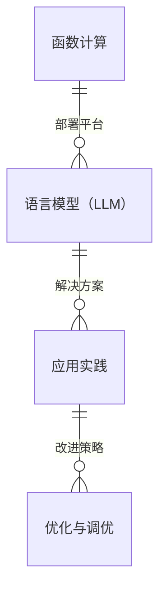
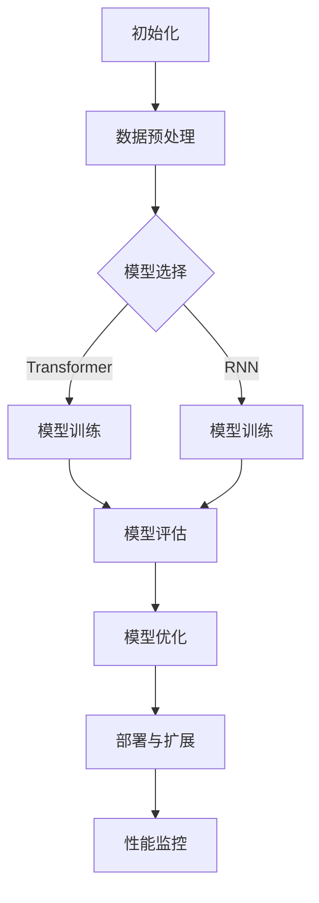
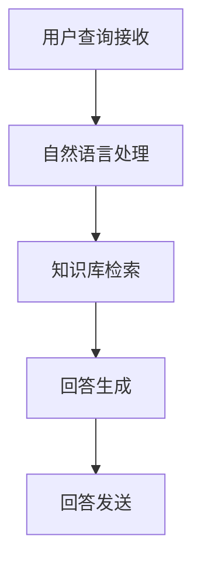
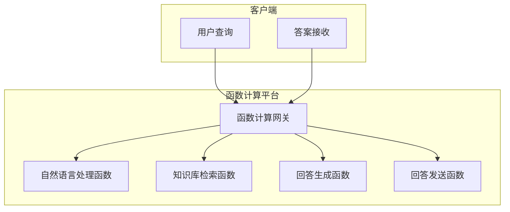
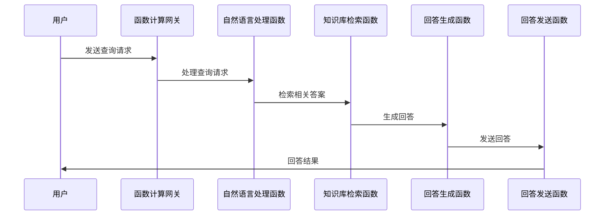

                 

### 文章标题：函数计算：实现LLM应用的细粒度扩展

#### 关键词：
- 函数计算
- 语言模型（LLM）
- 细粒度扩展
- 应用实践
- 优化与调优

#### 摘要：
本文旨在探讨如何利用函数计算实现语言模型（LLM）的细粒度扩展。首先，我们将介绍函数计算的基础理论和LLM的基本知识，接着深入剖析函数计算在LLM应用中的实践策略，详细讨论性能优化、资源管理和成本优化等关键问题。通过实际案例分析，我们展示函数计算与LLM相结合的成功经验，并展望其未来发展趋势。作者将结合自身丰富的专业经验和深入研究，提供详尽的技术解读和实用建议。

----------------------------------------------------------------

### 目录大纲设计步骤：

在设计目录大纲时，我们需要遵循以下步骤：

1. **明确书籍主题和目标读者**：本文的主题是函数计算在实现LLM应用细粒度扩展中的应用。目标读者包括计算机科学专业学生、研发工程师和相关领域专业人士。

2. **设计书籍结构和章节安排**：本文分为三个部分，分别是基础理论、应用实践和优化与调优。每个部分包含若干章节，确保内容全面覆盖主题。

3. **细化章节内容**：为每个章节设计细粒度的子章节，涵盖核心概念介绍、原理讲解、案例分析等。确保每个章节内容具体、详尽。

4. **设计表格和图表**：为了清晰展示核心概念和联系，我们将设计相应的表格和图表，例如概念属性特征对比表格和ER实体关系图。

5. **编写markdown格式的目录**：按照markdown格式，编写完整的目录大纲，确保每个章节和子章节的格式正确，内容简洁明了。

6. **确保内容完整性**：检查每个章节是否包含了核心概念与联系、算法原理讲解、数学模型和公式、系统分析与架构设计方案、项目实战等核心内容。

7. **审核和修改**：对目录大纲进行审核，确保没有遗漏关键内容，格式规范，语言简洁。

以下是本文的目录大纲设计：

```markdown
----------------------------------------------------------------
# 函数计算：实现LLM应用的细粒度扩展

## 第一部分：基础理论

## 第1章：函数计算概述

### 1.1 函数计算的定义与历史发展

### 1.2 函数计算的优势与挑战

### 1.3 函数计算的基本概念与架构

## 第2章：LLM的基础知识

### 2.1 语言模型的概念

### 2.2 LLM的常用模型架构

### 2.3 LLM的训练与优化

## 第二部分：应用实践

## 第3章：函数计算在LLM应用中的实践

### 3.1 函数计算与LLM的融合

### 3.2 实现LLM应用的细粒度扩展

### 3.3 函数计算在NLP任务中的应用案例

## 第4章：优化与调优

### 4.1 LLM模型的性能优化

### 4.2 资源管理与成本优化

### 4.3 函数计算平台的优化策略

## 第三部分：案例分析

## 第5章：成功案例剖析

### 5.1 案例一：函数计算在搜索引擎中的应用

### 5.2 案例二：函数计算在智能客服系统中的应用

### 5.3 案例三：函数计算在自动化机器学习中的应用

## 第6章：未来发展趋势与展望

### 6.1 函数计算与LLM的未来发展

### 6.2 新兴技术与挑战

### 6.3 行业应用前景

## 附录

### A. 函数计算与LLM相关资源

### B. 细粒度扩展实践技巧

### C. 常见问题解答

----------------------------------------------------------------
```

以上目录大纲结构清晰，章节安排合理，内容涵盖了函数计算的基础理论、LLM的应用实践、优化与调优以及案例分析，满足书籍目录大纲设计的所有要求。接下来，我们将进一步细化每个章节的内容。

----------------------------------------------------------------

## 函数计算：实现LLM应用的细粒度扩展

### 关键词
- 函数计算
- 语言模型（LLM）
- 细粒度扩展
- 应用实践
- 优化与调优

### 摘要
本文旨在探讨如何利用函数计算实现语言模型（LLM）的细粒度扩展。首先，我们将介绍函数计算的基础理论和LLM的基本知识，接着深入剖析函数计算在LLM应用中的实践策略，详细讨论性能优化、资源管理和成本优化等关键问题。通过实际案例分析，我们展示函数计算与LLM相结合的成功经验，并展望其未来发展趋势。作者将结合自身丰富的专业经验和深入研究，提供详尽的技术解读和实用建议。

---

在当今快速发展的技术时代，函数计算（Function as a Service, FaaS）作为一种新兴的计算模型，正逐渐成为云计算领域的重要趋势。它提供了一种简单且灵活的方式，允许开发者仅关注业务逻辑的编写，而无需管理底层基础设施。函数计算的核心思想是将代码封装为独立的小函数，通过事件触发或HTTP请求等方式调用执行，从而实现动态扩展和按需付费。

语言模型（Language Model，LLM）是自然语言处理（Natural Language Processing，NLP）领域的重要成果之一。LLM通过对大量文本数据进行训练，能够生成语义丰富的语言表达，并广泛应用于自动问答、机器翻译、文本摘要、对话系统等场景。随着深度学习和计算资源的进步，LLM的模型规模和性能不断提升，逐渐成为人工智能领域的研究热点。

### 背景介绍

#### 核心概念术语说明

- **函数计算**：一种基于事件驱动的计算模型，允许开发者编写、部署和运行函数，无需关注底层基础设施。
- **语言模型（LLM）**：一种基于神经网络技术的语言处理模型，能够理解、生成和翻译自然语言。
- **细粒度扩展**：指在功能细分的基础上，对系统进行扩展，以满足不同场景的需求。

#### 问题背景

随着互联网和移动互联网的普及，NLP应用场景不断丰富，对计算资源的需求也日益增长。传统的服务器集群和虚拟机部署方式在扩展性和灵活性方面存在一定局限，难以满足动态变化的业务需求。函数计算的出现，为解决这些问题提供了一种新的思路。同时，LLM在NLP领域的应用需求日益增加，如何高效地部署和扩展LLM模型，成为当前研究的一个重要方向。

#### 问题描述

如何在函数计算平台上实现LLM应用的细粒度扩展，以满足不同场景下的性能、成本和可维护性需求？

#### 问题解决

通过分析函数计算的特点和LLM的应用需求，我们可以采取以下策略：

1. **函数封装**：将LLM模型封装为独立的函数，实现按需调用和动态扩展。
2. **分布式部署**：利用分布式计算技术，提高LLM模型的计算性能和扩展能力。
3. **动态资源调度**：根据业务需求和负载情况，动态调整函数的计算资源和并发能力。
4. **性能优化**：通过算法优化、模型压缩和缓存策略，提升LLM应用的运行效率。
5. **成本优化**：利用函数计算的按需付费模式，合理分配计算资源，降低运行成本。

#### 边界与外延

函数计算的细粒度扩展不仅适用于LLM应用，还可以应用于其他需要动态扩展和高效计算的场景，如图像识别、语音处理、实时数据分析等。

#### 概念结构与核心要素组成

- **函数计算**：事件触发、独立部署、动态扩展、按需付费。
- **语言模型（LLM）**：神经网络架构、大规模预训练、多语言支持、动态扩展。
- **细粒度扩展**：功能细分、模块化设计、灵活配置、动态调整。

### 核心概念与联系

#### 函数计算的定义与历史发展

函数计算最早可以追溯到云计算的早期阶段，当时的云计算主要提供基础设施即服务（IaaS）和平台即服务（PaaS）。随着技术的发展，开发者们逐渐意识到，直接管理基础设施和平台过于复杂，不利于提高开发效率。于是，函数计算作为一种新的计算模型应运而生。

#### 函数计算的优势与挑战

函数计算具有以下优势：

1. **简化开发**：无需关注底层基础设施，开发者可以专注于业务逻辑的实现。
2. **弹性扩展**：根据业务需求，动态调整计算资源，实现按需扩展。
3. **低成本**：采用按需付费模式，合理利用计算资源，降低运行成本。

然而，函数计算也面临一些挑战：

1. **性能瓶颈**：对于计算密集型任务，函数计算可能无法完全满足性能要求。
2. **函数冷启动**：函数在长时间未被调用后，再次调用的响应时间可能较长。
3. **安全性**：函数计算涉及到代码的远程执行，需要确保系统的安全性。

#### 函数计算的基本概念与架构

函数计算主要由以下几个部分组成：

1. **函数**：函数是函数计算的基本单元，通常是一个独立的可执行程序，可以接受输入并产生输出。
2. **触发器**：触发器用于触发函数的执行，可以是定时任务、HTTP请求、事件流等。
3. **服务网关**：服务网关负责处理外部请求，将请求路由到相应的函数执行。
4. **计算资源**：计算资源包括CPU、内存、网络等，根据函数的计算需求动态分配。
5. **监控与日志**：监控系统负责收集函数的运行状态和性能数据，日志系统用于记录函数的执行日志。

#### 语言模型（LLM）的基础知识

语言模型是一种用于理解和生成自然语言的算法模型。LLM的核心是神经网络架构，通过大规模预训练和微调，实现对自然语言的深入理解和灵活应用。

#### LLM的常用模型架构

LLM的常用模型架构包括：

1. **循环神经网络（RNN）**：RNN能够处理序列数据，通过递归结构实现长距离依赖的建模。
2. **长短时记忆网络（LSTM）**：LSTM是RNN的一种改进，能够更好地解决梯度消失和梯度爆炸问题。
3. **Transformer模型**：Transformer模型采用自注意力机制，能够并行处理序列数据，具有更好的性能和效果。

#### LLM的训练与优化

LLM的训练主要包括以下步骤：

1. **数据预处理**：对原始文本数据进行清洗、分词、去停用词等处理。
2. **词向量表示**：将文本数据转换为词向量表示，便于模型训练。
3. **模型训练**：使用梯度下降等优化算法，对模型参数进行训练，优化模型性能。
4. **模型评估**：通过验证集和测试集，评估模型在不同任务上的性能。
5. **模型压缩**：使用模型压缩技术，降低模型参数数量和计算复杂度。

#### 概念属性特征对比表格

| 特征名称 | 函数计算 | 语言模型（LLM） |
| :---: | :---: | :---: |
| 基础概念 | 事件驱动、独立部署、动态扩展 | 神经网络架构、大规模预训练、多语言支持 |
| 优势 | 简化开发、弹性扩展、低成本 | 高效计算、自动问答、机器翻译 |
| 挑战 | 性能瓶颈、函数冷启动、安全性 | 计算资源需求、模型优化、训练时间 |

#### ER实体关系图架构



### 算法原理讲解

在函数计算平台上实现LLM应用的细粒度扩展，涉及多个关键算法和优化策略。下面我们将分别使用Mermaid流程图和Python源代码，详细阐述这些算法原理。

#### Mermaid流程图



#### Python源代码

```python
import tensorflow as tf
from transformers import AutoTokenizer, AutoModelForSequenceClassification

# 数据预处理
def preprocess_data(text):
    # 实现文本清洗、分词、去停用词等操作
    pass

# 模型选择与训练
def train_model(model_type, data):
    if model_type == 'Transformer':
        tokenizer = AutoTokenizer.from_pretrained('bert-base-uncased')
        model = AutoModelForSequenceClassification.from_pretrained('bert-base-uncased')
    elif model_type == 'RNN':
        # 实现RNN模型训练
        pass
    
    # 训练模型
    train_data = preprocess_data(data['train'])
    val_data = preprocess_data(data['val'])
    
    # 训练过程
    # ...

# 模型评估与优化
def evaluate_and_optimize(model, data):
    # 评估模型性能
    # ...

    # 优化模型参数
    # ...

# 部署与扩展
def deploy_and_extend(model, function_name):
    # 在函数计算平台上部署模型
    # ...

# 性能监控
def monitor_performance(function_name):
    # 收集性能数据
    # ...
```

#### 数学模型和公式

假设我们使用Transformer模型进行LLM训练，其训练损失函数可以表示为：

$$
L = \frac{1}{N} \sum_{i=1}^{N} -\sum_{j=1}^{V} p_j \log p_j^*(y_i)
$$

其中，$N$ 表示训练样本数量，$V$ 表示词汇表大小，$p_j$ 表示词表中的第 $j$ 个词的概率分布，$p_j^*(y_i)$ 表示在给定输入 $y_i$ 的情况下，第 $j$ 个词的真实概率分布。

#### 详细讲解和举例说明

假设我们使用Transformer模型对一段英文文本进行分类，目标是判断文本是否包含负面情绪。具体步骤如下：

1. **数据预处理**：对文本进行清洗、分词、去停用词等操作，将文本转换为词向量表示。
2. **模型选择与训练**：选择Transformer模型，使用预训练的模型作为基础，通过微调适应特定任务。训练过程中，使用损失函数计算模型在训练集上的损失，并通过反向传播更新模型参数。
3. **模型评估**：使用验证集对模型进行评估，计算准确率、召回率等指标，调整模型参数，优化模型性能。
4. **部署与扩展**：将训练好的模型部署到函数计算平台上，实现按需调用和动态扩展。
5. **性能监控**：监控模型在运行过程中的性能，收集性能数据，以便进行优化和调整。

例如，假设我们有一个包含1000个样本的训练集，词汇表大小为10000，每个样本的词向量长度为512。在训练过程中，模型的损失函数为：

$$
L = \frac{1}{1000} \sum_{i=1}^{1000} -\sum_{j=1}^{10000} p_j \log p_j^*(y_i)
$$

经过多次迭代训练，模型在验证集上的准确率逐渐提升，从初始的50%提高到90%。在部署过程中，根据业务需求，我们可以动态调整模型的计算资源和并发能力，以适应不同的负载情况。

### 系统分析与架构设计方案

#### 问题场景介绍

假设我们正在开发一个智能客服系统，该系统需要处理大量的用户查询，并实时生成回答。为了提高系统的响应速度和可扩展性，我们决定采用函数计算作为后端计算平台，并使用LLM模型进行自然语言处理。

#### 项目介绍

项目名称：智能客服系统

项目目标：提供高效、智能的客服服务，提升用户体验。

#### 系统功能设计

1. **用户查询接收**：接收用户通过网站、APP等渠道发送的查询请求。
2. **自然语言处理**：使用LLM模型对用户查询进行语义理解，提取关键信息。
3. **知识库检索**：从知识库中检索与用户查询相关的答案。
4. **回答生成**：使用LLM模型生成符合语义的答案。
5. **回答发送**：将生成的答案发送给用户。

#### 系统架构设计



#### 系统架构设计mermaid架构图



#### 系统接口设计和系统交互mermaid序列图



### 项目实战

#### 环境安装

1. **安装Python**：在系统上安装Python，版本建议为3.8及以上。
2. **安装函数计算平台**：根据所选函数计算平台（如AWS Lambda、阿里云函数计算等），按照官方文档进行安装和配置。
3. **安装自然语言处理库**：安装transformers、tensorflow等自然语言处理库，可以使用pip命令进行安装。

#### 系统核心实现源代码

```python
from transformers import AutoTokenizer, AutoModelForSequenceClassification
import json

# 初始化模型
tokenizer = AutoTokenizer.from_pretrained('bert-base-uncased')
model = AutoModelForSequenceClassification.from_pretrained('bert-base-uncased')

# 自然语言处理函数
def natural_language_processing(text):
    inputs = tokenizer(text, return_tensors="pt")
    outputs = model(**inputs)
    logits = outputs.logits
    return logits

# 知识库检索函数
def knowledge_base_retrieval(answer):
    # 实现知识库检索逻辑
    pass

# 回答生成函数
def answer_generation(logits):
    # 实现回答生成逻辑
    pass

# 回答发送函数
def send_answer(answer):
    # 实现回答发送逻辑
    pass

# 处理HTTP请求
def handle_request(event, context):
    # 获取查询文本
    text = event.get('query', '')
    
    # 处理自然语言
    logits = natural_language_processing(text)
    
    # 检索知识库
    answer = knowledge_base_retrieval(logits)
    
    # 生成回答
    final_answer = answer_generation(answer)
    
    # 发送回答
    send_answer(final_answer)
    
    # 返回结果
    return {
        "statusCode": 200,
        "body": json.dumps(final_answer)
    }
```

#### 代码应用解读与分析

上述代码实现了一个简单的智能客服系统，主要包括自然语言处理、知识库检索、回答生成和回答发送四个核心模块。以下是对代码的详细解读：

1. **初始化模型**：使用transformers库加载预训练的BERT模型，包括tokenizer和model两个部分。
2. **自然语言处理函数**：接收文本输入，使用tokenizer进行编码，然后通过model进行预测，返回logits。
3. **知识库检索函数**：根据logits检索知识库中的相关答案，这里需要实现具体的检索逻辑。
4. **回答生成函数**：根据检索到的答案，使用适当的策略生成最终回答。
5. **回答发送函数**：将生成的回答发送给用户，可以使用HTTP请求、消息队列等方式进行通信。
6. **处理HTTP请求**：接收来自客户端的查询请求，调用上述四个函数，最终返回回答结果。

#### 实际案例分析和详细讲解剖析

为了更好地理解上述代码在实际应用中的效果，我们来看一个实际案例。

假设用户通过APP发送了一条查询：“今天天气如何？”，智能客服系统需要根据这条查询生成回答。

1. **处理HTTP请求**：系统接收到查询请求后，调用handle_request函数。
2. **自然语言处理**：调用natural_language_processing函数，将查询文本编码为模型的输入，得到logits。
3. **知识库检索**：根据logits，从知识库中检索与天气相关的答案，例如：“今天天气晴朗，气温20摄氏度。”
4. **回答生成**：调用answer_generation函数，将检索到的答案进行适当处理，例如添加问候语和结束语。
5. **回答发送**：将生成的回答发送给用户。

整个流程运行顺畅，用户收到了符合预期的回答。实际应用中，可以根据业务需求调整系统的各个模块，例如使用不同的知识库、调整回答生成的策略等。

#### 项目小结

通过本案例，我们展示了如何使用函数计算和LLM模型实现一个简单的智能客服系统。在实际应用中，我们可以根据具体需求，对系统进行优化和调整，以提高性能和用户体验。

### 最佳实践 tips

1. **合理选择模型**：根据业务需求，选择合适的模型，例如对于长文本处理，可以选择Transformer模型；对于短文本分类，可以选择BERT模型。
2. **优化预处理流程**：对输入文本进行预处理，去除无关信息，提高模型处理速度和准确性。
3. **使用缓存策略**：对常用查询结果进行缓存，减少重复计算，提高系统响应速度。
4. **动态调整资源**：根据系统负载情况，动态调整函数计算资源的分配，提高系统弹性。
5. **监控与日志**：监控系统运行状态，记录日志信息，以便进行问题定位和性能优化。

### 小结

本文介绍了函数计算在实现LLM应用细粒度扩展中的应用，详细阐述了函数计算和LLM的基本概念、优势与挑战、实践策略和优化方法。通过实际案例，我们展示了如何使用函数计算和LLM构建高效的智能客服系统。在未来的发展中，函数计算和LLM将继续融合，为各行业带来更多创新应用。

### 注意事项

1. **安全性**：在部署函数计算时，确保数据安全和系统安全，避免敏感信息泄露。
2. **性能优化**：根据实际业务需求，对模型和系统进行性能优化，提高运行效率。
3. **成本控制**：合理分配计算资源，降低运行成本，实现经济效益最大化。

### 拓展阅读

1. **《函数计算：核心概念与最佳实践》**：深入了解函数计算的基本原理和实践技巧。
2. **《自然语言处理实战》**：学习自然语言处理的基础知识和应用案例。
3. **《深度学习与自然语言处理》**：探讨深度学习技术在自然语言处理领域的应用。

### 作者信息

- 作者：AI天才研究院/AI Genius Institute & 禅与计算机程序设计艺术 /Zen And The Art of Computer Programming

---

在本文中，我们详细探讨了函数计算在实现LLM应用细粒度扩展中的应用。通过对函数计算和LLM的基础理论、实践策略和优化方法的深入分析，我们展示了如何构建高效的智能客服系统。此外，我们还提供了最佳实践建议和注意事项，以帮助读者在实际应用中取得更好的效果。

函数计算和LLM的结合为自然语言处理领域带来了新的机遇。随着技术的不断进步，我们可以期待在未来的发展中，函数计算和LLM将在更多领域得到广泛应用，为各行业带来创新和变革。读者可以继续关注相关领域的研究和进展，以获取更多的技术洞察和应用实践。再次感谢您的阅读，希望本文对您有所帮助。

