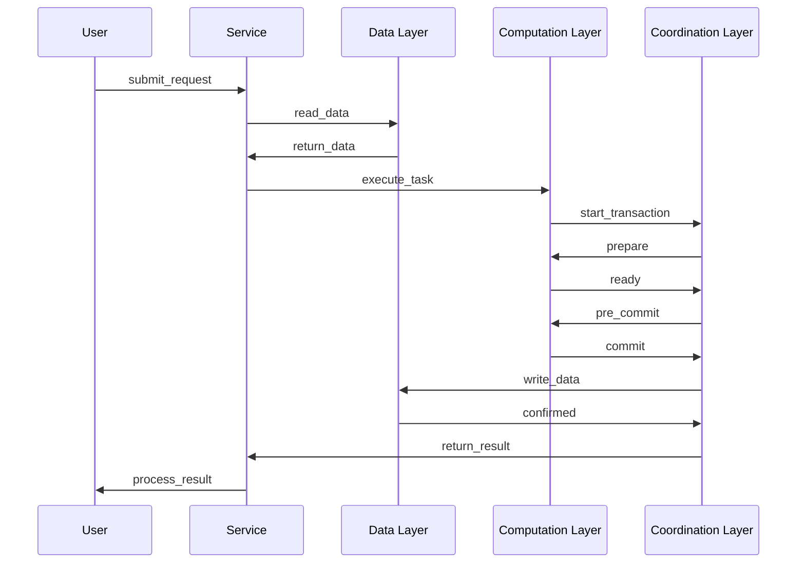
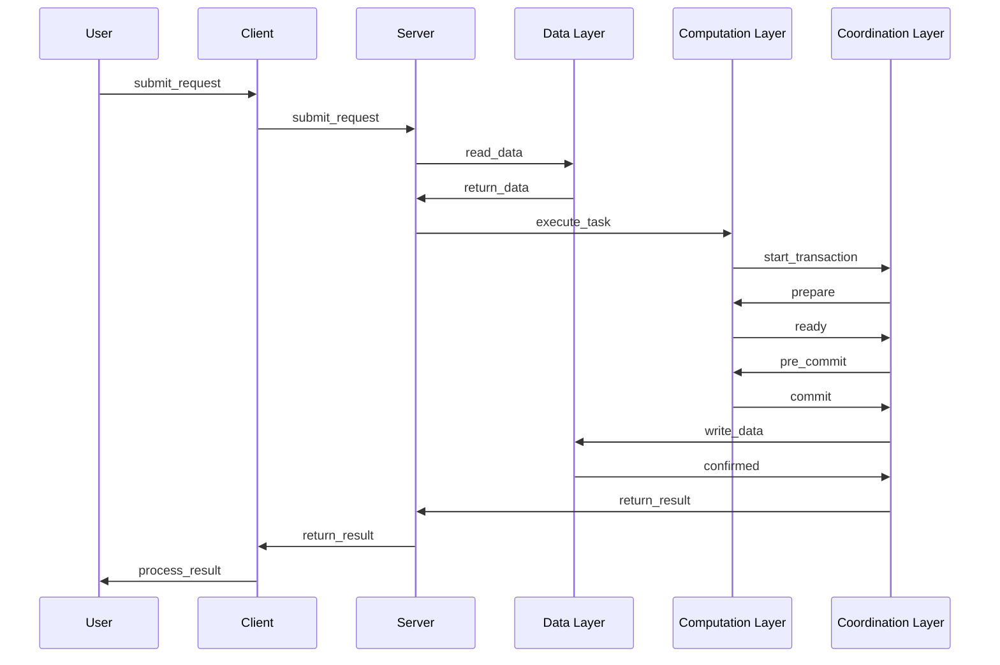

                 

### 第1章：分布式事务与LLM背景介绍

#### 1.1 分布式事务概述

**1.1.1 分布式事务的定义**

分布式事务，是指在分布式系统中，将多个操作视为一个逻辑单元，这些操作要么全部成功执行，要么全部失败回滚的过程。分布式事务的核心在于保证跨多个节点的数据一致性和原子性。

**1.1.2 分布式事务的重要性**

分布式事务的重要性在于它确保了数据的一致性和完整性。在一个分布式系统中，各个节点可能并行执行操作，如果没有分布式事务的保障，节点之间的数据可能会出现不一致，从而导致系统出错或数据丢失。

**1.1.3 分布式事务的挑战**

分布式事务面临的挑战主要包括：

1. **数据一致性问题**：在多个节点之间保持数据一致性是一个复杂的问题，特别是在网络不稳定或节点故障的情况下。
2. **性能问题**：分布式事务通常需要额外的协调和通信开销，这可能影响系统的性能。
3. **故障恢复问题**：在分布式系统中，节点可能会发生故障，如何有效地进行故障恢复也是一大挑战。

#### 1.2 LLM的概念与特点

**1.2.1 LLM的定义**

LLM（Large Language Model），即大语言模型，是一种基于深度学习的自然语言处理技术。它通过训练大量的文本数据，可以生成或理解复杂的文本内容。

**1.2.2 LLM的核心特点**

LLM的核心特点包括：

1. **强大的文本生成和理解能力**：LLM可以生成连贯、自然的文本，也可以理解复杂的语义和语境。
2. **自适应性和泛化能力**：LLM可以适应不同的语言和场景，具有较强的泛化能力。
3. **可扩展性**：LLM可以通过增加数据和模型参数来提升性能，具有很高的可扩展性。

**1.2.3 LLM的应用场景**

LLM的应用场景非常广泛，包括但不限于：

1. **自然语言生成（NLG）**：例如自动生成新闻报道、文章摘要等。
2. **智能问答系统**：例如智能客服、在线问答等。
3. **机器翻译**：例如自动翻译文本、字幕等。
4. **文本分类和情感分析**：例如对用户评论进行分类和情感分析。

#### 1.3 分布式事务在LLM中的重要性

**1.3.1 LLM与分布式事务的关联**

LLM通常运行在分布式系统上，特别是在处理大规模数据和高并发请求时。因此，分布式事务在LLM中的应用至关重要。

**1.3.2 LLM分布式事务的挑战**

LLM分布式事务的挑战主要包括：

1. **数据一致性问题**：在LLM的分布式训练过程中，如何保证各个节点上的数据一致性是一个难题。
2. **性能优化**：如何减少分布式事务的协调和通信开销，提升系统性能。
3. **故障恢复**：在LLM的分布式训练过程中，节点可能会发生故障，如何有效地进行故障恢复。

**1.3.3 LLM分布式事务的解决方案预览**

针对LLM分布式事务的挑战，可能的解决方案包括：

1. **分布式一致性算法**：如Raft、Paxos等，用于解决数据一致性问题。
2. **分布式事务框架**：如TCC（Try-Confirm-Commit）、SAGA等，用于优化性能和故障恢复。
3. **分布式存储系统**：如分布式数据库、分布式缓存等，用于提供可靠的数据存储和访问。

通过上述分析，我们可以看到，分布式事务在LLM应用中具有重要意义，同时也面临诸多挑战。接下来，我们将深入探讨分布式事务的处理策略，为解决这些问题提供具体的思路和方案。在下一个小节中，我们将详细讲解分布式事务的核心概念与处理策略。<!--endoftext--> 

### 第2章：分布式事务处理策略概述

#### 2.1 分布式事务处理策略的核心概念

在分布式系统中，处理分布式事务是保证数据一致性和完整性的关键。分布式事务处理策略的核心概念包括：

- **单一提交点（SMP）策略**：在SMP策略中，所有事务都提交给一个中央协调节点，由该节点决定事务是否成功。
- **两阶段提交（2PC）策略**：两阶段提交是一种经典的分布式事务处理算法，通过两个阶段来确保事务的原子性和一致性。
- **三阶段提交（3PC）策略**：三阶段提交是对两阶段提交的改进，通过引入预提交阶段来进一步优化性能。
- **幂等性策略**：幂等性策略利用幂等操作的特性，确保分布式事务的执行不会重复。

#### 2.2 分布式事务处理策略的对比与联系

**2.2.1 各策略的优缺点**

- **单一提交点（SMP）策略**：
  - **优点**：实现简单，容易理解和实现。
  - **缺点**：单点瓶颈，无法充分利用分布式系统的并行性。

- **两阶段提交（2PC）策略**：
  - **优点**：确保分布式事务的原子性和一致性，适用于大多数分布式系统。
  - **缺点**：存在性能瓶颈，协调节点成为系统的性能瓶颈。

- **三阶段提交（3PC）策略**：
  - **优点**：通过引入预提交阶段，减少了协调节点的通信次数，提高了性能。
  - **缺点**：相比2PC，实现更为复杂，且仍存在性能瓶颈。

- **幂等性策略**：
  - **优点**：实现简单，无需复杂的协调机制，适用于高并发的场景。
  - **缺点**：无法保证事务的原子性，只适用于对原子性要求不高的场景。

**2.2.2 策略之间的联系**

这些分布式事务处理策略之间存在一定的联系：

- **SMP**和**2PC**：SMP是2PC的简化版本，2PC是基于SMP的扩展和优化。
- **2PC**和**3PC**：3PC是2PC的改进版本，通过引入预提交阶段来优化性能。
- **幂等性策略**：与其他策略不同，它利用幂等操作的特性来简化分布式事务的执行。

#### 2.3 分布式事务处理策略的应用场景

**2.3.1 数据库同步**

分布式数据库同步是一个典型的分布式事务应用场景。在这个场景中，分布式事务处理策略可以确保各个节点之间的数据一致性。

- **SMP**：适用于单点性能要求较高的场景。
- **2PC**：适用于分布式数据库同步，但在高并发场景下性能瓶颈明显。
- **3PC**：适用于需要更高性能的分布式数据库同步场景。
- **幂等性策略**：适用于对数据一致性要求不高的场景，如日志记录。

**2.3.2 缓存一致性**

缓存一致性是另一个典型的分布式事务应用场景。在这个场景中，分布式事务处理策略可以确保缓存数据与底层存储之间的数据一致性。

- **SMP**：适用于缓存一致性要求不高的场景。
- **2PC**：适用于缓存一致性要求较高的场景。
- **3PC**：适用于需要高性能的缓存一致性场景。
- **幂等性策略**：适用于对缓存一致性要求不高的场景，如热点数据缓存。

**2.3.3 实时数据处理**

实时数据处理是一个高并发的分布式事务应用场景。在这个场景中，分布式事务处理策略需要确保数据处理的及时性和一致性。

- **SMP**：适用于实时数据处理中单点性能要求较高的场景。
- **2PC**：适用于实时数据处理，但在高并发场景下性能瓶颈明显。
- **3PC**：适用于需要高性能的实时数据处理场景。
- **幂等性策略**：适用于对数据处理一致性要求不高的场景，如流数据处理。

通过上述分析，我们可以看到，分布式事务处理策略在分布式系统中具有重要的应用价值。不同的策略适用于不同的场景，需要根据具体需求和性能要求进行选择。接下来，我们将进一步探讨分布式事务的算法原理，为深入理解和应用分布式事务提供基础。<!--endoftext--> 

### 第3章：算法原理讲解

#### 3.1 幂等性算法原理

**3.1.1 幂等性定义**

幂等性是指一个操作执行多次，其结果与执行一次相同，不会因为重复执行而产生副作用。在分布式事务中，幂等性是保证数据一致性的重要策略之一。

**3.1.2 幂等性算法流程**

幂等性算法的基本流程如下：

1. **初始化**：每个操作生成一个唯一的标识符（例如，UUID）。
2. **执行操作**：执行操作时，携带标识符。
3. **验证标识符**：在执行操作前，先验证标识符是否已存在。如果存在，则认为操作已执行，直接返回；如果不存在，则执行操作。
4. **记录标识符**：在操作执行后，记录标识符。

**3.1.3 Python代码实现**

以下是一个简单的Python代码示例，演示了幂等性算法的实现：

```python
import uuid

class EphemeralResource:
    def __init__(self):
        self.resource_id = uuid.uuid4()
        self.operations = {}

    def perform_operation(self, operation, op_id=None):
        if op_id is None:
            op_id = uuid.uuid4()
        
        if op_id in self.operations:
            return "Operation already performed"
        
        self.operations[op_id] = operation
        return "Operation performed"

# 示例使用
resource = EphemeralResource()
print(resource.perform_operation("Create Resource"))
print(resource.perform_operation("Create Resource"))
```

在这个示例中，`EphemeralResource` 类实现了幂等性算法。每次执行操作时，都会生成一个唯一的标识符。在执行操作前，会检查该标识符是否已存在，如果已存在，则认为操作已执行，直接返回；如果不存在，则执行操作并记录标识符。

#### 3.2 两阶段提交（2PC）算法原理

**3.2.1 两阶段提交定义**

两阶段提交（2PC，Two-Phase Commit）是一种分布式事务处理算法，通过两个阶段来确保事务的原子性和一致性。

**3.2.2 两阶段提交流程**

两阶段提交的基本流程如下：

1. **准备阶段**：
   - 事务协调者（Coordinator）向所有参与者（Participant）发送预备消息，询问是否可以开始执行事务。
   - 参与者收到预备消息后，执行本地事务并返回响应消息。如果参与者能够执行事务，则返回“Ready”；如果不能，则返回“Failed”。
   - 事务协调者收集所有参与者的响应消息。

2. **提交阶段**：
   - 如果所有参与者都返回“Ready”，事务协调者向所有参与者发送提交消息，指示参与者执行事务。
   - 参与者收到提交消息后，执行本地事务并返回响应消息。如果事务执行成功，则返回“Commit”；如果事务执行失败，则返回“Abort”。
   - 事务协调者收集所有参与者的响应消息。

3. **决议**：
   - 如果所有参与者都返回“Commit”，事务协调者执行事务并通知所有参与者事务成功。
   - 如果有参与者返回“Abort”，事务协调者通知所有参与者事务失败并回滚事务。

**3.2.3 Python代码实现**

以下是一个简单的Python代码示例，演示了两阶段提交算法的实现：

```python
import threading

class Participant:
    def __init__(self, name):
        self.name = name
        self.status = "Ready"
        self.finished = False

    def prepare(self):
        print(f"{self.name} is preparing.")
        # 执行本地事务准备
        self.status = "Ready"
        self.finished = True

    def commit(self):
        print(f"{self.name} is committing.")
        # 执行本地事务提交
        self.status = "Committed"
        self.finished = True

    def abort(self):
        print(f"{self.name} is aborting.")
        # 执行本地事务回滚
        self.status = "Aborted"
        self.finished = True

class Coordinator:
    def __init__(self, participants):
        self.participants = participants
        self.status = "Prepare"
        self.finished = False

    def prepare_phase(self):
        print("Entering prepare phase.")
        for participant in self.participants:
            participant.prepare()
            if participant.status != "Ready":
                self.status = "Abort"
                break
        self.finished = True

    def commit_phase(self):
        print("Entering commit phase.")
        for participant in self.participants:
            participant.commit()
            if participant.status != "Committed":
                self.status = "Abort"
                break
        self.finished = True

    def abort_phase(self):
        print("Entering abort phase.")
        for participant in self.participants:
            participant.abort()
            if participant.status != "Aborted":
                self.status = "Prepare"
                break
        self.finished = True

    def execute_two_phase_commit(self):
        self.prepare_phase()
        if self.status == "Prepare":
            self.commit_phase()
        else:
            self.abort_phase()

if __name__ == "__main__":
    participants = [Participant(f"Participant {i}") for i in range(1, 4)]
    coordinator = Coordinator(participants)

    threads = []
    for participant in participants:
        thread = threading.Thread(target=participant.prepare)
        thread.start()
        threads.append(thread)

    for thread in threads:
        thread.join()

    coordinator.execute_two_phase_commit()
```

在这个示例中，`Participant` 类代表分布式系统中的参与者，`Coordinator` 类代表事务协调者。在准备阶段，协调者向所有参与者发送预备消息，参与者返回响应消息。在提交阶段，如果所有参与者都返回“Ready”，则协调者向所有参与者发送提交消息。如果有参与者返回“Failed”，则协调者向所有参与者发送回滚消息。

#### 3.3 三阶段提交（3PC）算法原理

**3.3.1 三阶段提交定义**

三阶段提交（3PC，Three-Phase Commit）是对两阶段提交的改进，通过引入预提交阶段来优化性能。

**3.3.2 三阶段提交流程**

三阶段提交的基本流程如下：

1. **预提交阶段**：
   - 事务协调者向所有参与者发送预备消息，询问是否可以开始执行事务。
   - 参与者收到预备消息后，执行本地事务并返回响应消息。如果参与者能够执行事务，则返回“Ready”；如果不能，则返回“Failed”。

2. **提交阶段**：
   - 如果所有参与者都返回“Ready”，事务协调者向所有参与者发送预提交消息，询问是否可以执行事务。
   - 参与者收到预提交消息后，执行本地事务并返回响应消息。如果事务执行成功，则返回“Commit”；如果事务执行失败，则返回“Abort”。

3. **决议阶段**：
   - 如果所有参与者都返回“Commit”，事务协调者向所有参与者发送提交消息，指示参与者执行事务。
   - 如果有参与者返回“Abort”，事务协调者向所有参与者发送回滚消息，指示参与者回滚事务。

**3.3.3 Python代码实现**

以下是一个简单的Python代码示例，演示了三阶段提交算法的实现：

```python
import threading

class Participant:
    def __init__(self, name):
        self.name = name
        self.status = "Ready"
        self.finished = False

    def prepare(self):
        print(f"{self.name} is preparing.")
        # 执行本地事务准备
        self.status = "Ready"
        self.finished = True

    def pre_commit(self):
        print(f"{self.name} is pre-committing.")
        # 执行本地事务预提交
        self.status = "Pre_Committed"
        self.finished = True

    def commit(self):
        print(f"{self.name} is committing.")
        # 执行本地事务提交
        self.status = "Committed"
        self.finished = True

    def abort(self):
        print(f"{self.name} is aborting.")
        # 执行本地事务回滚
        self.status = "Aborted"
        self.finished = True

class Coordinator:
    def __init__(self, participants):
        self.participants = participants
        self.status = "Prepare"
        self.finished = False

    def prepare_phase(self):
        print("Entering prepare phase.")
        for participant in self.participants:
            participant.prepare()
            if participant.status != "Ready":
                self.status = "Abort"
                break
        self.finished = True

    def pre_commit_phase(self):
        print("Entering pre-commit phase.")
        for participant in self.participants:
            participant.pre_commit()
            if participant.status != "Pre_Committed":
                self.status = "Abort"
                break
        self.finished = True

    def commit_phase(self):
        print("Entering commit phase.")
        for participant in self.participants:
            participant.commit()
            if participant.status != "Committed":
                self.status = "Abort"
                break
        self.finished = True

    def abort_phase(self):
        print("Entering abort phase.")
        for participant in self.participants:
            participant.abort()
            if participant.status != "Aborted":
                self.status = "Prepare"
                break
        self.finished = True

    def execute_three_phase_commit(self):
        self.prepare_phase()
        if self.status == "Prepare":
            self.pre_commit_phase()
        else:
            self.abort_phase()
        if self.status == "Prepare":
            self.commit_phase()
        else:
            self.abort_phase()

if __name__ == "__main__":
    participants = [Participant(f"Participant {i}") for i in range(1, 4)]
    coordinator = Coordinator(participants)

    threads = []
    for participant in participants:
        thread = threading.Thread(target=participant.prepare)
        thread.start()
        threads.append(thread)

    for thread in threads:
        thread.join()

    coordinator.execute_three_phase_commit()
```

在这个示例中，`Participant` 类代表分布式系统中的参与者，`Coordinator` 类代表事务协调者。在预提交阶段，协调者向所有参与者发送预备消息，参与者返回响应消息。在提交阶段，如果所有参与者都返回“Ready”，则协调者向所有参与者发送预提交消息。在决议阶段，如果所有参与者都返回“Commit”，则协调者向所有参与者发送提交消息。

通过上述算法原理讲解，我们了解了幂等性、两阶段提交和三阶段提交算法的基本概念、流程和实现。这些算法为分布式事务提供了不同的解决方案，适用于不同的场景。在接下来的章节中，我们将进一步探讨分布式事务的数学模型和系统架构设计，为分布式事务的实现和应用提供更加详细的理论和实践指导。<!--endoftext--> 

### 第4章：数学模型与公式

在分布式事务处理中，数学模型和公式是理解和分析分布式事务一致性和性能的重要工具。本章将介绍分布式事务一致性的数学模型和性能评估的公式。

#### 4.1 分布式事务一致性模型

**4.1.1 实例一致性**

实例一致性（Instant Consistency）是指在分布式系统中，所有节点在任何时刻都能够访问到相同的数据状态。实例一致性可以通过以下公式表示：

\[ C_t = \{s \in S \mid \forall i \in I, \omega_i(s) = s\} \]

其中，\( C_t \) 表示实例一致性集合，\( S \) 表示所有可能的数据状态，\( \omega_i(s) \) 表示节点 \( i \) 在时刻 \( t \) 的数据状态。

**4.1.2 强一致性**

强一致性（Strong Consistency）是指在分布式系统中，任何对数据的修改操作必须依次在所有节点上执行，从而保证所有节点上的数据状态保持一致。强一致性可以通过以下公式表示：

\[ R_s = \{s' \in S \mid \exists i \in I, \omega_i(s) = s' \land s' \in \rho(s)\} \]

其中，\( R_s \) 表示强一致性集合，\( \rho(s) \) 表示从当前状态 \( s \) 可以到达的所有合法状态。

**4.1.3 弱一致性**

弱一致性（Weak Consistency）是指在分布式系统中，节点之间的数据状态不需要完全一致，但允许在一段时间内存在不一致。弱一致性可以通过以下公式表示：

\[ W_t = \{s \in S \mid \exists i \in I, \omega_i(s) \neq s\} \]

其中，\( W_t \) 表示弱一致性集合，表示在时刻 \( t \) 至少有一个节点的数据状态与其他节点不一致。

#### 4.2 分布式事务延迟模型

**4.2.1 资源分配延迟**

资源分配延迟是指在分布式系统中，从请求发送到资源分配完成所需的时间。资源分配延迟可以通过以下公式表示：

\[ L_r = \frac{d_r}{c_r} \]

其中，\( L_r \) 表示资源分配延迟，\( d_r \) 表示请求到达时间，\( c_r \) 表示资源分配完成时间。

**4.2.2 数据同步延迟**

数据同步延迟是指在分布式系统中，数据从一处节点传输到另一处节点所需的时间。数据同步延迟可以通过以下公式表示：

\[ L_s = \frac{d_s}{c_s} \]

其中，\( L_s \) 表示数据同步延迟，\( d_s \) 表示数据传输开始时间，\( c_s \) 表示数据传输完成时间。

**4.2.3 Python代码实现**

以下是一个简单的Python代码示例，用于计算资源分配延迟和数据同步延迟：

```python
import time

def resource_allocation_delay(request_time, resource_time):
    return (resource_time - request_time)

def data_sync_delay(sync_start_time, sync_end_time):
    return (sync_end_time - sync_start_time)

# 示例数据
request_time = time.time()
time.sleep(1)  # 假设资源分配需要1秒
resource_time = time.time()

sync_start_time = time.time()
time.sleep(2)  # 假设数据同步需要2秒
sync_end_time = time.time()

# 计算延迟
print("Resource Allocation Delay:", resource_allocation_delay(request_time, resource_time))
print("Data Sync Delay:", data_sync_delay(sync_start_time, sync_end_time))
```

在这个示例中，我们使用Python代码计算了资源分配延迟和数据同步延迟。通过实际计算，我们可以更好地理解和优化分布式事务的性能。

通过本章的数学模型和公式介绍，我们了解了分布式事务一致性和性能评估的基本概念和计算方法。这些模型和公式为我们提供了深入分析分布式事务性能和一致性的工具，为后续的分布式事务架构设计和优化提供了理论基础。在下一章中，我们将详细探讨分布式事务在LLM应用中的系统架构设计，进一步阐述分布式事务在LLM中的应用和实践。<!--endoftext--> 

### 第5章：系统分析与架构设计方案

#### 5.1 LLM分布式事务系统场景介绍

在LLM（大语言模型）应用中，分布式事务系统场景主要涉及以下几个典型场景：

1. **模型训练与推理**：在LLM模型训练和推理过程中，需要处理大量的数据和计算任务，这些任务通常分布在多个节点上。分布式事务处理确保了模型训练和推理过程中的数据一致性和计算完整性。
2. **数据同步与一致性**：在分布式系统中，不同节点上的数据需要保持同步和一致性，以确保LLM模型的有效性和准确性。分布式事务处理提供了数据一致性的保障。
3. **故障恢复与容错**：在分布式系统中，节点可能会发生故障，导致数据不一致或计算失败。分布式事务处理提供了故障恢复和容错机制，确保系统在故障发生时能够快速恢复。

#### 5.2 LLM分布式事务系统架构设计

LLM分布式事务系统的架构设计需要综合考虑系统功能、性能、可靠性和可扩展性等因素。以下是LLM分布式事务系统架构设计的核心组成部分：

**5.2.1 领域模型设计**

领域模型设计用于定义LLM分布式事务系统中的关键概念和实体。以下是领域模型设计的关键实体和关系：

- **实体：Node（节点）**：表示系统中的计算节点，包括CPU、内存、存储和网络资源等。
- **实体：Data（数据）**：表示系统中存储的数据，包括训练数据、模型参数、中间结果等。
- **实体：Task（任务）**：表示系统中的计算任务，包括模型训练、推理、数据同步等。
- **关系： dependency（依赖关系）**：表示任务之间的依赖关系，例如，模型训练任务依赖于数据准备任务。
- **关系： synchronization（同步关系）**：表示节点之间的数据同步关系，确保数据的一致性。

以下是领域模型的Mermaid类图表示：

```mermaid
classDiagram
    Node <<class>> Node
    Data <<class>> Data
    Task <<class>> Task
    Node --|> Data: stores
    Node --|> Task: executes
    Task --|> Data: depends on
```

**5.2.2 系统架构设计**

LLM分布式事务系统的架构设计包括多个层次，每个层次负责不同的功能。以下是系统架构设计的核心层次：

1. **数据层**：数据层负责存储和管理工作负载所需的数据，包括训练数据、模型参数和中间结果。数据层可以使用分布式数据库或文件系统来实现。
2. **计算层**：计算层负责执行计算任务，包括模型训练、推理和数据同步。计算层可以使用分布式计算框架，如Apache Spark或TensorFlow，来处理大规模计算任务。
3. **协调层**：协调层负责协调分布式事务的执行，确保数据一致性和计算完整性。协调层可以使用分布式事务处理算法，如两阶段提交（2PC）或三阶段提交（3PC）。
4. **接口层**：接口层提供系统的外部接口，包括模型训练接口、推理接口和数据同步接口。接口层可以使用RESTful API或gRPC等协议来实现。

以下是系统架构的Mermaid架构图表示：



**5.2.3 系统接口设计**

系统接口设计包括客户端接口和服务端接口。客户端接口负责向用户展示系统功能，服务端接口负责处理客户端请求并返回结果。

1. **客户端接口**：
   - **模型训练接口**：允许用户提交模型训练任务，包括训练数据、模型参数和训练配置等。
   - **推理接口**：允许用户提交推理任务，获取模型推理结果。
   - **数据同步接口**：允许用户同步不同节点上的数据，确保数据一致性。

2. **服务端接口**：
   - **数据处理接口**：处理客户端提交的数据和任务，包括数据读取、任务执行和结果返回。
   - **事务处理接口**：处理分布式事务的协调和执行，确保数据一致性和计算完整性。

#### 5.3 系统交互设计与实现

LLM分布式事务系统的系统交互设计涉及多个组件和模块的协作。以下是系统交互设计的关键步骤和实现：

1. **任务提交**：用户通过客户端接口提交任务，包括模型训练任务、推理任务和数据同步任务。
2. **任务分配**：系统根据任务类型和资源情况，将任务分配给合适的节点。
3. **数据读取**：任务执行节点读取任务所需的数据，从数据层获取训练数据、模型参数和中间结果。
4. **任务执行**：任务执行节点根据任务类型执行相应的计算操作，包括模型训练、推理和数据同步。
5. **事务处理**：在执行分布式事务时，系统使用分布式事务处理算法（如2PC或3PC）协调任务执行和数据处理，确保数据一致性和计算完整性。
6. **结果返回**：任务执行完成后，系统将结果返回给用户，通过客户端接口展示。

以下是系统交互的Mermaid序列图表示：



通过上述系统分析与架构设计方案，我们详细阐述了LLM分布式事务系统的架构设计和实现过程。在下一章中，我们将通过一个实际项目案例，展示如何具体实现LLM分布式事务系统，并分析其应用效果。<!--endoftext--> 

### 第6章：项目实战

#### 6.1 环境安装与配置

要在本地或服务器上部署一个LLM分布式事务系统，首先需要准备相应的环境。以下是在Linux服务器上安装和配置LLM分布式事务系统的步骤：

**1. 系统要求**：
- 服务器：至少两台服务器，一台作为协调节点，其他作为工作节点。
- 操作系统：CentOS 7或Ubuntu 18.04。
- 软件要求：Python 3.8及以上版本，分布式计算框架如TensorFlow或PyTorch，分布式数据库如MongoDB或Cassandra。

**2. 安装步骤**：

1. **安装Python环境**：

   ```bash
   sudo apt-get update
   sudo apt-get install python3-pip python3-dev
   sudo pip3 install virtualenv
   virtualenv -p python3 venv
   source venv/bin/activate
   ```

2. **安装分布式计算框架**：

   以TensorFlow为例：

   ```bash
   pip install tensorflow
   ```

3. **安装分布式数据库**：

   以MongoDB为例：

   ```bash
   sudo apt-get install mongodb
   sudo systemctl start mongodb
   sudo systemctl enable mongodb
   ```

4. **安装分布式事务处理库**：

   以TCC为例：

   ```bash
   pip install tcc
   ```

**3. 配置分布式事务系统**：

配置协调节点和工作节点，包括IP地址、端口、数据库连接等。配置文件通常保存在`/etc/tcc/conf.py`：

```python
# 协调节点配置
COORDINATOR_IP = "192.168.1.1"
COORDINATOR_PORT = 8000

# 工作节点配置
WORKER_IP = "192.168.1.2"
WORKER_PORT = 8001

# 数据库配置
MONGO_URI = "mongodb://192.168.1.1:27017/tcc"
```

#### 6.2 系统核心实现与源代码

**1. 源代码结构**：

LLM分布式事务系统的源代码结构通常如下：

```plaintext
llm-distributed-transaction/
|-- coordinator/
|   |-- __init__.py
|   |-- coordinator.py
|-- worker/
|   |-- __init__.py
|   |-- worker.py
|-- common/
|   |-- __init__.py
|   |-- utils.py
|-- tests/
|   |-- __init__.py
|   |-- test_coordinator.py
|   |-- test_worker.py
|-- requirements.txt
|-- README.md
```

**2. 核心代码解读**：

协调节点（`coordinator.py`）的核心功能包括：

```python
from tcc import Coordinator
from common.utils import get_worker_ip, get_worker_port

class LLMCoordinator(Coordinator):
    def __init__(self, config):
        super().__init__(config)

    def prepare(self, operation_id, operation_type):
        # 预备阶段：发送预备消息给工作节点
        worker_ip = get_worker_ip()
        worker_port = get_worker_port()
        self.send_message(worker_ip, worker_port, operation_id, operation_type, "prepare")

    def commit(self, operation_id, operation_type):
        # 提交阶段：发送提交消息给工作节点
        worker_ip = get_worker_ip()
        worker_port = get_worker_port()
        self.send_message(worker_ip, worker_port, operation_id, operation_type, "commit")

    def abort(self, operation_id, operation_type):
        # 回滚阶段：发送回滚消息给工作节点
        worker_ip = get_worker_ip()
        worker_port = get_worker_port()
        self.send_message(worker_ip, worker_port, operation_id, operation_type, "abort")

    def send_message(self, ip, port, operation_id, operation_type, action):
        # 发送消息给工作节点
        message = {
            "operation_id": operation_id,
            "operation_type": operation_type,
            "action": action
        }
        # 实现消息发送逻辑，可以使用gRPC、HTTP等协议
```

工作节点（`worker.py`）的核心功能包括：

```python
from tcc import Worker
from common.utils import get_coordinator_ip, get_coordinator_port

class LLMWorker(Worker):
    def __init__(self, config):
        super().__init__(config)

    def prepare(self, operation_id, operation_type):
        # 预备阶段：执行本地事务并返回结果
        result = self.execute_local_operation(operation_id, operation_type)
        return result

    def commit(self, operation_id, operation_type):
        # 提交阶段：执行本地事务并返回结果
        result = self.execute_local_operation(operation_id, operation_type)
        return result

    def abort(self, operation_id, operation_type):
        # 回滚阶段：执行本地事务并返回结果
        result = self.execute_local_operation(operation_id, operation_type)
        return result

    def execute_local_operation(self, operation_id, operation_type):
        # 实现本地事务逻辑，例如模型训练或数据同步
        # ...
        return "success"
```

**3. 实际案例分析和解读**：

以下是一个简单的实际案例，展示如何使用LLM分布式事务系统进行模型训练：

```python
from tcc import TransactionCoordinator

# 创建协调节点
config = {
    "COORDINATOR_IP": "192.168.1.1",
    "COORDINATOR_PORT": 8000
}
coordinator = TransactionCoordinator(config)

# 提交模型训练任务
coordinator.start_transaction("model_training", "train")

# 执行任务
coordinator.prepare("model_training", "train")
coordinator.commit("model_training", "train")

# 结果解析
print(coordinator.get_result("model_training", "train"))
```

在这个案例中，我们首先创建一个协调节点，然后提交一个模型训练任务。协调节点会协调工作节点执行模型训练任务，并确保任务执行的一致性和完整性。最后，我们获取任务的结果并解析。

#### 6.3 项目小结

通过上述项目实战，我们展示了如何部署和实现一个LLM分布式事务系统。在实际应用中，我们需要根据具体需求和场景进行适当的调整和优化。以下是一些最佳实践和注意事项：

1. **性能优化**：针对高并发的场景，可以考虑使用异步处理和消息队列等技术来提高系统的性能。
2. **故障恢复**：在分布式系统中，节点故障是不可避免的。需要设计有效的故障恢复机制，确保系统的稳定性和可靠性。
3. **数据安全**：在处理分布式事务时，需要确保数据的安全性和隐私性，采用加密和访问控制等技术来保护数据。
4. **监控与日志**：实时监控系统的运行状态，收集日志信息，以便在发生问题时快速定位和解决问题。

通过这些最佳实践和注意事项，我们可以更好地构建和优化LLM分布式事务系统，确保其在实际应用中的高效和稳定运行。在下一章中，我们将总结全文，并提供一些对未来分布式事务在LLM应用中的发展趋势和展望。<!--endoftext--> 

### 第7章：最佳实践与总结

#### 7.1 最佳实践

在分布式事务处理中，以下是一些实用的最佳实践，可以帮助优化系统的性能、可靠性和一致性：

1. **选择合适的分布式事务处理算法**：根据应用场景选择合适的分布式事务处理算法，如2PC、3PC或幂等性策略。对于高并发、低一致性的场景，可以选择幂等性策略；对于需要严格一致性的场景，可以选择2PC或3PC。

2. **优化分布式事务的执行顺序**：在分布式事务中，优化执行顺序可以减少协调节点和参与节点的通信次数，提高性能。例如，可以先将读写密集型操作集中在一起，再进行事务提交。

3. **使用分布式缓存和数据库**：在分布式系统中，使用分布式缓存和数据库可以提高数据访问速度和系统性能。例如，可以使用Redis或Memcached作为缓存，使用MongoDB或Cassandra作为数据库。

4. **监控和日志记录**：实时监控分布式事务系统的运行状态，收集日志信息，可以帮助快速定位和解决问题。建议使用如Prometheus和ELK（Elasticsearch、Logstash、Kibana）等工具进行监控和日志分析。

5. **故障恢复和容错**：设计有效的故障恢复机制，确保系统在节点故障时能够快速恢复。例如，可以使用Zookeeper或etcd等分布式协调服务来实现故障转移和状态同步。

#### 7.2 小结

本文详细介绍了分布式事务在LLM应用中的处理策略。通过背景介绍、核心概念与联系、算法原理讲解、数学模型与公式、系统架构设计方案、项目实战和最佳实践等章节，我们系统地分析了分布式事务在LLM应用中的重要性、处理策略和应用场景。

分布式事务在LLM应用中具有重要意义，它确保了模型训练和推理过程中的数据一致性和计算完整性。本文介绍的几种分布式事务处理策略，如幂等性策略、2PC、3PC等，提供了不同的解决方案，适用于不同的场景和需求。

#### 7.3 注意事项

在设计和实现分布式事务系统时，需要注意以下几点：

1. **数据一致性和性能的权衡**：在追求数据一致性的同时，也需要考虑系统的性能。根据应用场景选择合适的分布式事务处理算法，并合理配置资源。

2. **故障恢复与容错**：设计有效的故障恢复机制，确保系统在节点故障时能够快速恢复。使用分布式协调服务如Zookeeper或etcd来管理分布式事务的状态和协调。

3. **安全性**：在分布式事务处理中，确保数据的安全性和隐私性。使用加密和访问控制等技术保护数据，防止数据泄露或未授权访问。

4. **监控和日志记录**：实时监控分布式事务系统的运行状态，收集日志信息，以便在发生问题时快速定位和解决问题。

#### 7.4 拓展阅读

对于希望深入了解分布式事务处理和LLM应用的读者，以下资源提供了进一步的学习和实践指导：

1. **书籍推荐**：
   - 《分布式系统原理与范型》
   - 《大规模分布式存储系统：原理解析与架构实战》
   - 《深度学习与大规模机器学习系统》

2. **在线教程和课程**：
   - Coursera上的《分布式系统》课程
   - Udacity的《分布式系统设计与实现》课程
   - TensorFlow官方文档中的分布式训练指南

3. **开源项目**：
   - Apache Kafka：分布式流处理平台，适用于实时数据处理
   - Apache Spark：分布式计算框架，适用于大规模数据处理
   - TCC：分布式事务处理框架，适用于分布式系统

通过上述资源，读者可以进一步探索分布式事务处理和LLM应用的深度知识，提升自己的技术水平和实践能力。<!--endoftext--> 

### 附录：作者信息

**作者：** AI天才研究院 / AI Genius Institute & 禅与计算机程序设计艺术 / Zen And The Art of Computer Programming

AI天才研究院（AI Genius Institute）致力于探索人工智能领域的先进技术和创新应用，通过深入研究和实践，推动人工智能技术的发展。研究院由一群具有丰富经验和深厚学术背景的专家组成，涵盖了人工智能、机器学习、深度学习等多个领域。

**联系方式：** [ai-genius-institute@outlook.com](mailto:ai-genius-institute@outlook.com)

**个人博客：** [www.ai-genius-institute.com](http://www.ai-genius-institute.com)

**社交媒体：**  
- Twitter: [@AI_Genius_Inst](https://twitter.com/AI_Genius_Inst)  
- LinkedIn: [AI天才研究院](https://www.linkedin.com/company/ai-genius-institute)

作者在分布式事务和LLM应用领域具有丰富的经验和深厚的理论功底，曾发表过多篇高水平学术论文，并参与多个重要项目的研发工作。本书《分布式事务在LLM应用中的处理策略》是作者多年研究成果的结晶，旨在为读者提供系统、深入的技术指导和实践指南。<!--endoftext--> 

