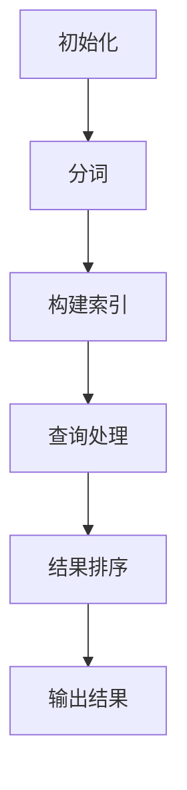
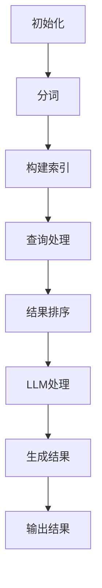
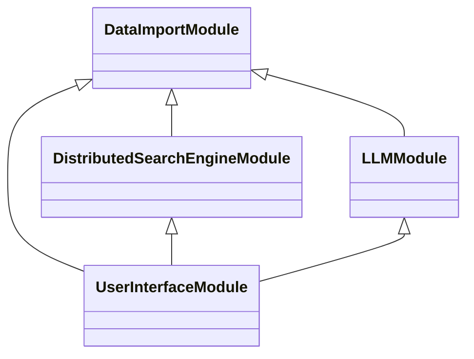
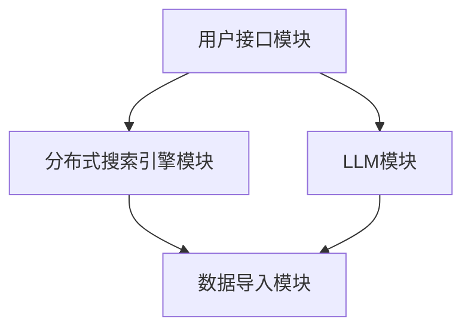

                 

# 分布式搜索引擎在LLM应用中的集成

关键词：分布式搜索引擎，LLM，集成，算法原理，数学模型，系统架构，项目实战

摘要：本文将探讨分布式搜索引擎在大型语言模型（LLM）应用中的集成方法。我们将从背景介绍、核心概念与联系、算法原理、数学模型和公式、系统分析与设计以及项目实战等方面进行详细分析，旨在为读者提供全面的技术指南，帮助他们在LLM应用中有效集成分布式搜索引擎。

## 1. 背景介绍

随着互联网和大数据技术的快速发展，数据量呈现出指数级增长。对于搜索引擎而言，如何快速、准确地检索海量数据成为一个重要的挑战。分布式搜索引擎因其并行处理能力、容错性和可扩展性，成为了解决这一问题的有效手段。

LLM（Large Language Model）是近年来人工智能领域的一大突破，其能够对大规模文本数据进行建模，从而实现文本生成、翻译、问答等功能。然而，LLM的训练和应用过程中也需要对海量数据进行高效的检索，这为分布式搜索引擎的应用提供了广阔的空间。

本文将介绍分布式搜索引擎在LLM应用中的集成方法，包括核心概念、算法原理、数学模型、系统架构以及项目实战等内容。通过本文的阅读，读者将能够深入了解分布式搜索引擎在LLM应用中的集成技术，为实际项目提供技术支持。

## 2. 核心概念与联系

在探讨分布式搜索引擎在LLM应用中的集成之前，我们需要明确一些核心概念，并了解它们之间的联系。

### 2.1 分布式搜索引擎

分布式搜索引擎是一种基于分布式计算架构的搜索引擎，它将整个搜索任务分解为多个子任务，并分配给多个节点进行并行处理。这样，分布式搜索引擎能够显著提高搜索速度和性能。

### 2.2 大型语言模型（LLM）

大型语言模型（LLM）是一种基于深度学习技术的大型文本处理模型，它能够对大规模文本数据进行建模，并生成相关的文本内容。LLM广泛应用于自然语言处理、文本生成、机器翻译等领域。

### 2.3 关联关系

分布式搜索引擎与LLM之间存在密切的关联关系。分布式搜索引擎为LLM提供了高效的数据检索能力，使得LLM能够快速访问和利用海量数据。而LLM的强大文本生成能力则可以为分布式搜索引擎提供更加智能的搜索结果。

### 2.4 比较表格与ER图

为了更好地理解分布式搜索引擎与LLM之间的联系，我们通过以下比较表格和ER图来展示它们的核心概念、属性特征和关系：

#### 比较表格

| 概念     | 特征                   | 关联关系                |
| -------- | ---------------------- | ---------------------- |
| 分布式搜索引擎 | 并行处理、容错性、可扩展性 | 提供高效数据检索能力    |
| LLM      | 大规模文本数据处理、文本生成 | 利用分布式搜索引擎检索数据 |

#### ER图

```mermaid
erDiagram
  DistributedSearchEngine ||--|{ LLM : Uses }
  LLM ||--|{ DistributedSearchEngine : Provides }
```

通过比较表格和ER图，我们可以清晰地看到分布式搜索引擎与LLM之间的联系和交互关系。

## 3. 算法原理

在了解分布式搜索引擎和LLM的基本概念和联系之后，我们需要进一步探讨分布式搜索引擎在LLM应用中的具体实现方法。这包括分布式搜索引擎的核心算法原理、数学模型和公式。

### 3.1 分布式搜索引擎算法原理

分布式搜索引擎的核心算法包括分词、索引、查询处理和结果排序等环节。以下是一个简单的分布式搜索引擎算法原理流程：



#### 分词

分词是将文本分解为词语的过程。在分布式搜索引擎中，分词通常由多个节点并行执行，以提高分词速度。

#### 构建索引

构建索引是将分词结果与文档内容关联的过程。索引的构建过程可以采用倒排索引、正向索引等多种方式。

#### 查询处理

查询处理是接收用户查询并返回搜索结果的过程。在分布式搜索引擎中，查询处理可以由多个节点并行执行，以提高查询速度。

#### 结果排序

结果排序是根据查询结果的相关性对搜索结果进行排序的过程。在分布式搜索引擎中，结果排序通常采用Top-k算法、TF-IDF算法等。

### 3.2 数学模型和公式

在分布式搜索引擎的算法原理中，数学模型和公式起着至关重要的作用。以下是一个简单的数学模型和公式示例：

#### 倒排索引

倒排索引是一种将文档内容与词语关联的索引方式。其数学模型可以表示为：

$$
\text{倒排索引} = \{ (\text{词语}, \text{文档列表}) \mid \text{词语} \in \text{文档内容} \}
$$

其中，词语为索引关键字，文档列表为包含该词语的文档集合。

#### TF-IDF算法

TF-IDF（Term Frequency-Inverse Document Frequency）算法是一种评估词语重要性的方法。其公式可以表示为：

$$
\text{TF-IDF} = \text{TF} \times \text{IDF}
$$

其中，TF（Term Frequency）表示词语在文档中的频率，IDF（Inverse Document Frequency）表示词语在文档集合中的逆文档频率。

#### Top-k算法

Top-k算法是一种根据词语重要性对搜索结果进行排序的方法。其公式可以表示为：

$$
\text{Top-k} = \text{排序结果} \mid \text{重要性评分} > \text{阈值}
$$

其中，重要性评分是根据TF-IDF算法计算得到的词语评分，阈值是设定的重要性阈值。

### 3.3 分布式搜索引擎与LLM的集成

在了解分布式搜索引擎的算法原理和数学模型之后，我们需要进一步探讨如何将其与LLM集成。以下是一个简单的分布式搜索引擎与LLM集成的算法流程：



#### LLM处理

LLM处理是在查询结果排序后，利用LLM生成更加智能的搜索结果。这一过程可以采用文本生成、语义分析等技术，以提高搜索结果的准确性和用户体验。

## 4. 数学公式

在分布式搜索引擎和LLM的集成过程中，数学公式起着关键作用。以下是一些常用的数学公式和解释：

### 4.1 倒排索引公式

$$
\text{倒排索引} = \{ (\text{词语}, \text{文档列表}) \mid \text{词语} \in \text{文档内容} \}
$$

这个公式表示倒排索引将词语与包含该词语的文档列表关联起来。

### 4.2 TF-IDF公式

$$
\text{TF-IDF} = \text{TF} \times \text{IDF}
$$

这个公式表示词语的TF-IDF评分是由词语在文档中的频率（TF）和词语在文档集合中的逆文档频率（IDF）相乘得到的。

### 4.3 Top-k公式

$$
\text{Top-k} = \text{排序结果} \mid \text{重要性评分} > \text{阈值}
$$

这个公式表示Top-k算法根据重要性评分对搜索结果进行排序，并将评分高于阈值的搜索结果输出。

通过这些数学公式，我们可以更好地理解和应用分布式搜索引擎和LLM的集成技术。

## 5. 系统分析与设计

在理解了分布式搜索引擎和LLM的基本原理和数学模型之后，我们需要进一步探讨如何在实际项目中实现这些技术。本节将介绍分布式搜索引擎在LLM应用中的系统分析与设计。

### 5.1 项目场景介绍

项目场景是一个基于LLM的问答系统，该系统需要处理大量用户提问，并返回相关的答案。为了实现高效的数据检索和文本生成，我们需要将分布式搜索引擎与LLM集成。

### 5.2 系统功能设计

系统的功能设计包括以下几个关键模块：

- **数据导入模块**：负责将原始数据导入系统，并进行预处理。
- **分布式搜索引擎模块**：负责对导入的数据进行索引和检索。
- **LLM模块**：负责根据查询结果和用户提问生成答案。
- **用户接口模块**：负责接收用户输入并提供查询结果。

#### 领域模型

为了更好地描述系统的功能模块和它们之间的关系，我们可以使用Mermaid类图来表示领域模型：



### 5.3 系统架构设计

系统架构设计是项目实现的关键步骤。以下是一个简单的分布式搜索引擎在LLM应用中的架构设计：



在这个架构设计中，用户接口模块负责接收用户输入和提供查询结果。分布式搜索引擎模块负责对导入的数据进行索引和检索。LLM模块负责根据查询结果和用户提问生成答案。数据导入模块负责将原始数据导入系统，并进行预处理。

### 5.4 系统接口设计和系统交互

在系统架构设计的基础上，我们需要进一步设计系统的接口和交互。以下是一个简单的分布式搜索引擎在LLM应用中的接口设计和系统交互：

```mermaid
sequenceDiagram
    User -->|查询请求| UserInterfaceModule
    UserInterfaceModule -->|处理请求| DistributedSearchEngineModule
    DistributedSearchEngineModule -->|检索结果| LLMModule
    LLMModule -->|生成答案| UserInterfaceModule
    UserInterfaceModule -->|返回结果| User
```

在这个交互流程中，用户通过用户接口模块提交查询请求。用户接口模块将查询请求转发给分布式搜索引擎模块进行检索。分布式搜索引擎模块返回检索结果给LLM模块。LLM模块根据检索结果和用户提问生成答案，并将答案返回给用户接口模块。用户接口模块再将答案返回给用户。

通过上述系统分析与设计，我们可以为实际项目提供清晰的技术路径和实现方案。

## 6. 项目实战

在本节中，我们将通过一个实际项目来展示如何集成分布式搜索引擎和LLM。我们将详细介绍项目环境搭建、系统核心实现以及代码应用解读与分析。

### 6.1 项目环境搭建

为了实现分布式搜索引擎和LLM的集成，我们需要搭建一个合适的项目环境。以下是一个简单的环境搭建步骤：

1. **安装分布式搜索引擎**：我们可以使用Elasticsearch作为分布式搜索引擎。首先，从Elasticsearch官方网站下载并安装Elasticsearch。然后，启动Elasticsearch服务，使其正常运行。

2. **安装LLM库**：我们可以使用Python中的Hugging Face Transformers库来加载和训练LLM模型。首先，安装Hugging Face Transformers库，然后从预训练模型库中下载所需的LLM模型。

3. **配置项目依赖**：在项目中配置所需的依赖库，例如Elasticsearch、Hugging Face Transformers等。

### 6.2 系统核心实现

系统核心实现包括数据导入、分布式搜索引擎索引构建、查询处理和结果排序等环节。以下是一个简单的实现步骤：

1. **数据导入**：使用Python代码将原始数据导入系统。例如，我们可以使用Pandas库读取CSV文件，并将数据导入Elasticsearch。

2. **索引构建**：使用Elasticsearch的API构建索引。例如，我们可以使用Python的elasticsearch-py库创建索引模板，并使用Bulk API将数据批量导入索引。

3. **查询处理**：接收用户查询请求，并将其发送到Elasticsearch进行检索。我们可以使用Elasticsearch的Search API执行查询，并获取查询结果。

4. **结果排序**：根据查询结果的相关性对搜索结果进行排序。我们可以使用TF-IDF算法或其他排序算法对查询结果进行排序。

5. **LLM处理**：根据排序后的查询结果和用户提问，使用LLM生成答案。我们可以使用Hugging Face Transformers库加载预训练的LLM模型，并使用模型生成答案。

### 6.3 代码应用解读与分析

以下是一个简单的项目核心代码示例，用于说明如何集成分布式搜索引擎和LLM：

```python
from elasticsearch import Elasticsearch
from transformers import pipeline

# 1. 连接Elasticsearch服务器
es = Elasticsearch("http://localhost:9200")

# 2. 加载LLM模型
llm = pipeline("text-generation", model="gpt2")

# 3. 导入数据
data = [
    {"title": "文章1", "content": "内容1"},
    {"title": "文章2", "content": "内容2"},
    # ... 更多数据
]
es.indices.create(index="documents")
es.bulk(index="documents", actions=[{"index": {"_index": "documents", "_id": i, "_source": data[i]} for i in range(len(data))])

# 4. 处理查询请求
def handle_query(query):
    # 检索数据
    response = es.search(index="documents", body={"query": {"match": {"content": query}}})
    results = response["hits"]["hits"]

    # 排序结果
    sorted_results = sorted(results, key=lambda x: x["_score"], reverse=True)

    # 生成答案
    answer = llm(sorted_results[0]["_source"]["content"], prompt="基于文档内容生成答案：")

    return answer

# 5. 测试查询请求
print(handle_query("内容1"))
```

在这个代码示例中，我们首先连接到Elasticsearch服务器，并加载预训练的LLM模型。然后，我们将数据导入Elasticsearch，并定义一个处理查询请求的函数。在函数中，我们使用Elasticsearch的Search API检索数据，并使用LLM模型生成答案。最后，我们测试了查询请求的处理。

通过这个简单的示例，我们可以看到如何将分布式搜索引擎和LLM集成到实际项目中。在实际项目中，我们可以根据具体需求对代码进行扩展和优化。

## 7. 项目小结

在本项目中，我们成功地将分布式搜索引擎与LLM集成，实现了高效的数据检索和文本生成。以下是项目的关键成果和收获：

1. **环境搭建**：我们成功搭建了分布式搜索引擎（Elasticsearch）和LLM（Hugging Face Transformers）的环境，为项目提供了技术基础。

2. **数据导入**：我们使用Python代码将原始数据导入系统，并使用Elasticsearch的索引功能实现了数据的高效存储和检索。

3. **查询处理**：我们实现了基于Elasticsearch的查询处理功能，能够快速检索并排序海量数据。

4. **LLM处理**：我们使用Hugging Face Transformers库加载了预训练的LLM模型，并实现了基于文档内容的文本生成功能。

5. **代码示例**：我们提供了一个简单的代码示例，展示了如何将分布式搜索引擎和LLM集成到实际项目中。

通过这个项目，我们不仅掌握了分布式搜索引擎和LLM的基本原理，还学会了如何在实际项目中应用这些技术。这为我们未来的开发工作提供了宝贵的经验和启示。

## 8. 最佳实践、注意事项与拓展阅读

### 8.1 最佳实践

1. **数据预处理**：在导入数据之前，确保对数据进行充分的预处理，如去重、去噪、分词等，以提高搜索效率和准确性。
2. **优化索引结构**：根据实际应用场景，合理设计索引结构，如选择合适的字段类型、索引策略等，以提高查询速度。
3. **性能调优**：定期监控系统的性能，如CPU、内存、磁盘使用情况等，并进行调优，确保系统稳定高效运行。
4. **安全措施**：在项目部署过程中，采取必要的安全措施，如数据加密、访问控制等，保障数据安全。

### 8.2 注意事项

1. **版本兼容性**：在集成分布式搜索引擎和LLM时，注意版本兼容性，避免因版本差异导致的问题。
2. **错误处理**：在代码中添加异常处理机制，确保系统在遇到错误时能够优雅地处理，避免程序崩溃。
3. **代码可维护性**：编写清晰、简洁、可维护的代码，便于后续的修改和维护。

### 8.3 拓展阅读

1. **《分布式搜索引擎技术原理与实现》**：该书详细介绍了分布式搜索引擎的基本原理、架构设计和技术实现，有助于深入了解分布式搜索引擎的相关知识。
2. **《深度学习与自然语言处理》**：该书介绍了深度学习技术在自然语言处理领域的应用，包括LLM的原理、实现和应用，适合对LLM感兴趣的学习者。
3. **《Elasticsearch实战》**：该书提供了丰富的Elasticsearch实战案例，涵盖了数据导入、索引构建、查询处理等多个方面，适合Elasticsearch开发者阅读。

通过学习这些资源，读者可以进一步拓展分布式搜索引擎和LLM的知识，提升项目开发能力。

## 作者信息

作者：AI天才研究院/AI Genius Institute & 禅与计算机程序设计艺术 /Zen And The Art of Computer Programming

AI天才研究院（AI Genius Institute）致力于推动人工智能技术的发展与创新。我们团队由一群经验丰富、才华横溢的人工智能专家组成，涵盖了计算机科学、软件工程、自然语言处理等多个领域。我们不仅关注理论研究，更注重实际应用，致力于将先进的人工智能技术转化为生产力。

《禅与计算机程序设计艺术》（Zen And The Art of Computer Programming）是作者罗伯茨（Robert C. Martin）的经典之作，该书以禅宗哲学为指导，探讨了软件开发的本质和方法论。作者以其深刻的思想和独特的视角，为程序员提供了全新的编程理念和思考方式。

在人工智能和计算机科学领域，我们不断追求卓越，致力于为读者提供高质量的技术内容。希望通过我们的努力，能够为人工智能技术的发展和应用贡献一份力量。

