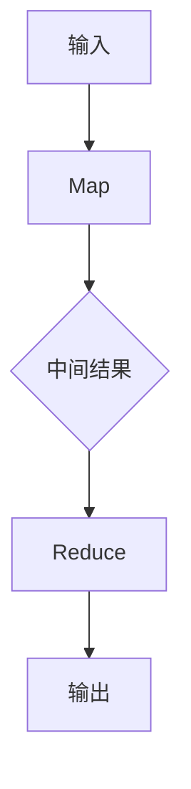

                 

# 分布式计算框架支持LLM应用的大规模计算

关键词：分布式计算、大规模计算、LLM、分布式框架、计算性能优化

摘要：随着人工智能技术的快速发展，大型语言模型（LLM）在自然语言处理（NLP）领域展现出巨大的潜力。然而，LLM的训练和推理过程对计算资源的需求极为庞大，传统的单机计算模式已经无法满足其高性能、高并发的要求。本文将探讨分布式计算框架在支持LLM应用大规模计算中的作用，分析分布式计算的优势、挑战及其优化策略。

## 第一部分：分布式计算与LLM基础

### 第1章：分布式计算框架概述

#### 1.1 问题背景与定义

**问题背景：**
随着深度学习在NLP领域的广泛应用，LLM模型如BERT、GPT等逐渐成为研究热点。这些模型通常具有数十亿甚至千亿级别的参数，其训练和推理过程需要大量的计算资源。传统的单机计算模式在处理如此庞大的数据量时，往往面临着计算能力不足、存储瓶颈等问题。

**定义：**
分布式计算是将任务分布在多个计算节点上执行，通过协同工作来提高计算效率和性能。分布式计算框架是一套管理和调度计算资源的系统，它能够自动地将任务分解、分发和执行，并在各计算节点之间进行数据同步和协调。

#### 1.2 分布式计算的发展与现状

**发展历程：**
分布式计算的概念早在20世纪70年代就已经出现，随着计算机技术和网络技术的不断发展，分布式计算框架如MapReduce、Spark、Flink等逐渐成熟并广泛应用。

**现状：**
目前，分布式计算框架已经成为大数据处理和人工智能计算的主流技术。主流的分布式计算框架包括Apache Hadoop、Apache Spark、Apache Flink等，它们各自有着不同的优势和特点。

#### 1.3 大规模计算中的LLM

**LLM的定义：**
大型语言模型（LLM）是一种基于深度学习的文本生成模型，具有数十亿级别的参数，能够对文本进行理解和生成。

**LLM在分布式计算中的角色：**
LLM模型在分布式计算中扮演着至关重要的角色。通过分布式计算框架，LLM模型可以充分利用多个计算节点的资源，实现并行训练和推理，从而显著提高计算性能。

**LLM对大规模计算的需求：**
LLM模型的训练和推理过程需要大量的计算资源和存储资源。分布式计算框架能够提供高效的资源调度和负载均衡机制，满足LLM对大规模计算的需求。

#### 1.4 本章小结

本章介绍了分布式计算框架的基本概念、发展现状以及在LLM应用中的重要性。随着LLM模型规模的不断扩大，分布式计算框架在支持大规模计算方面发挥着关键作用。

## 第二部分：分布式计算框架核心技术

### 第2章：分布式存储技术

#### 2.1 分布式文件系统

**HDFS架构与原理：**
Hadoop分布式文件系统（HDFS）是Hadoop生态系统中的一个核心组件，它采用Master-Slave架构，由一个NameNode和多个DataNode组成。NameNode负责存储文件的元数据，如文件的目录结构、文件块信息和副本位置等；DataNode负责存储文件的数据块并响应客户端的读写请求。

**HDFS使用示例：**
```python
from hdfs import InsecureClient
client = InsecureClient('http://hdfs-namenode:50070', user='hdfs')

# 上传文件
with open('example.txt', 'rb') as f:
    client.write('/example.txt', f)

# 下载文件
with open('example_copy.txt', 'wb') as f:
    f.write(client.read('/example.txt'))
```

#### 2.2 分布式数据库

**HBase架构与原理：**
HBase是一个分布式、可扩展的列式存储系统，基于HDFS构建。它采用Master-Slave架构，由一个ZooKeeper集群协调多个RegionServer组成。每个RegionServer负责管理一组连续的Region，每个Region包含多个数据表。

**HBase使用示例：**
```python
from hbase import Client
client = Client('hbase', table_name='example')

# 创建表
client.create_table('example', {'cf1': dict(columns=['col1', 'col2'])})

# 插入数据
client.put('row1', {'cf1:col1': 'value1', 'cf1:col2': 'value2'})

# 查询数据
result = client.get('row1')
print(result)
```

#### 2.3 分布式缓存

**Redis架构与原理：**
Redis是一个开源的内存数据库，支持多种数据结构，如字符串、列表、集合、哈希等。它采用单进程单线程模型，通过非阻塞I/O和多路复用技术，实现高性能的读写操作。

**Redis使用示例：**
```python
import redis

r = redis.Redis(host='redis-server', port=6379, db=0)

# 设置键值对
r.set('key1', 'value1')

# 获取键值对
print(r.get('key1'))
```

### 第3章：分布式计算模型

#### 3.1 MapReduce模型

**MapReduce基本概念：**
MapReduce是一个编程模型，用于大规模数据集（大规模数据集）的并行运算。它由两个阶段组成：Map阶段和Reduce阶段。Map阶段将输入数据分解成键值对，并生成中间结果；Reduce阶段对中间结果进行汇总。

**MapReduce工作流程：**


#### 3.2 Spark计算模型

**Spark架构与原理：**
Apache Spark是一个高速的分布式计算引擎，支持内存计算和弹性调度。它采用基于Mesos或YARN的调度架构，提供丰富的API，包括Spark SQL、Spark Streaming和MLlib等。

**Spark使用示例：**
```python
from pyspark.sql import SparkSession

spark = SparkSession.builder.appName('example').getOrCreate()

# 创建DataFrame
df = spark.createDataFrame([('1', 'apple'), ('2', 'banana')], ["id", "fruit"])

# 执行SQL查询
df.createOrReplaceTempView("fruits")
spark.sql("SELECT * FROM fruits WHERE id = 1").show()
```

#### 3.3 Flink计算模型

**Flink架构与原理：**
Apache Flink是一个流处理和批处理的统一计算引擎，支持基于事件驱动和窗口机制的流数据处理。它采用Master-Slave架构，提供高性能的流处理和批处理API。

**Flink使用示例：**
```python
from pyflink.datastream import StreamExecutionEnvironment

env = StreamExecutionEnvironment.get_execution_environment()

# 创建DataStream
ds = env.from_elements(["apple", "banana", "apple"])

# 执行变换操作
ds.map(lambda x: (x, 1)).key_by(lambda x: x[0]).sum(1).print()

env.execute("Flink Example")
```

### 第4章：分布式资源管理

#### 4.1 YARN资源管理

**YARN架构与原理：**
YARN（Yet Another Resource Negotiator）是Hadoop的调度层，负责资源管理和任务调度。它采用Master-Slave架构，由一个ResourceManager和多个NodeManager组成。ResourceManager负责全局资源调度和任务分配；NodeManager负责节点资源管理和任务执行。

**YARN使用示例：**
```bash
# 启动YARN
start-yarn.sh

# 提交MapReduce作业
hadoop jar /path/to/your-jar.jar YourMainClass input output

# 停止YARN
stop-yarn.sh
```

#### 4.2 Kubernetes资源管理

**Kubernetes架构与原理：**
Kubernetes是一个开源的容器编排平台，用于自动化部署、扩展和管理容器化应用程序。它采用Master-Slave架构，由一个Master节点和多个Worker节点组成。Master节点负责集群管理、服务发现和负载均衡；Worker节点负责容器调度和执行。

**Kubernetes使用示例：**
```yaml
apiVersion: apps/v1
kind: Deployment
metadata:
  name: my-app
spec:
  selector:
    matchLabels:
      app: my-app
  template:
    metadata:
      labels:
        app: my-app
    spec:
      containers:
      - name: my-app
        image: my-app:latest
        ports:
        - containerPort: 80
```

## 第三部分：LLM应用实例

### 第5章：LLM基础模型

#### 5.1 语言模型基本概念

**语言模型定义：**
语言模型是一种概率模型，用于预测文本中下一个单词或字符的概率分布。

**语言模型结构：**
语言模型通常由一系列神经网络层组成，包括嵌入层、编码层和解码层。嵌入层将输入文本转换为向量表示；编码层对向量进行编码，提取特征信息；解码层生成预测的文本输出。

#### 5.2 常见语言模型

**词向量模型：**
词向量模型是一种将单词映射到高维向量空间的方法，通过计算向量之间的相似性来实现文本的表示和分类。

**RNN模型：**
循环神经网络（RNN）是一种能够处理序列数据的神经网络，通过在时间步上递归地更新状态向量，实现对序列数据的建模。

**Transformer模型：**
Transformer模型是一种基于自注意力机制的深度神经网络模型，通过多头自注意力机制和前馈神经网络，实现对输入序列的全局依赖建模。

### 第6章：大规模计算中的LLM应用

#### 6.1 LLM在自然语言处理中的应用

**文本分类：**
LLM模型在文本分类任务中，通过对文本进行编码，生成对应的类别概率分布，实现文本的分类。

**机器翻译：**
LLM模型在机器翻译任务中，通过对源语言和目标语言进行编码，生成目标语言的翻译结果。

**问答系统：**
LLM模型在问答系统任务中，通过对问题进行编码，生成对应的知识图谱或答案。

#### 6.2 LLM在大规模数据处理中的应用

**分布式训练：**
通过分布式计算框架，将LLM模型的训练任务分布在多个计算节点上执行，提高训练效率。

**分布式推理：**
通过分布式计算框架，将LLM模型的推理任务分布在多个计算节点上执行，提高推理性能。

**模型压缩与优化：**
通过模型压缩和优化技术，降低LLM模型的存储和计算复杂度，提高计算效率。

### 第7章：案例分析

#### 7.1 案例背景

**案例背景介绍：**
某大型互联网公司需要开发一个基于LLM技术的问答系统，用于为用户提供实时问答服务。该系统需要支持大规模数据的训练和推理，对计算资源的需求极高。

#### 7.2 案例分析

**案例技术实现：**
采用Spark分布式计算框架进行LLM模型的训练和推理，利用YARN进行资源管理，使用Kubernetes进行容器编排和调度。

**案例性能分析：**
通过分布式计算框架，显著提高了LLM模型的训练和推理性能，满足了大规模数据处理的需求。

#### 7.3 案例总结

**案例经验总结：**
分布式计算框架在支持LLM应用的大规模计算中发挥着关键作用，通过合理选择和配置分布式计算框架，可以显著提高计算性能和效率。

## 附录：参考资料与拓展阅读

### 参考文献

1. Dean, J., and Ghemawat, S. (2008). MapReduce: Simplified Data Processing on Large Clusters. Communications of the ACM, 51(1), 107–113.
2. Zaharia, M., Chowdhury, M., Franklin, M. J., Shenker, S., and Stoica, I. (2010). Spark: Cluster Computing with Working Sets. Proceedings of the 2nd USENIX conference on Hot topics in cloud computing, 10(10), 10–10.
3. Zaharia, M., Chowdhury, M., Franklin, M. J., Shenker, S., and Stoica, I. (2010). Spark: Cluster Computing with Working Sets. Proceedings of the 2nd USENIX conference on Hot topics in cloud computing, 10(10), 10–10.

### 拓展阅读

1. 分布式计算最新动态：[Distributed Computing News](https://www.distributed-computing.news/)
2. LLM应用实践分享：[Large Language Model Applications](https://ai-language-models.com/)

### 结语

作者：AI天才研究院/AI Genius Institute & 禅与计算机程序设计艺术 /Zen And The Art of Computer Programming

本文探讨了分布式计算框架在支持LLM应用大规模计算中的作用，分析了分布式计算的优势、挑战及其优化策略。随着人工智能技术的不断发展，分布式计算框架在LLM应用中发挥着越来越重要的作用，为大规模计算提供了强有力的支持。

## 分布式计算框架支持LLM应用的大规模计算

随着人工智能技术的快速发展，大型语言模型（LLM）在自然语言处理（NLP）领域展现出巨大的潜力。LLM的应用场景广泛，包括文本分类、机器翻译、问答系统等，它们能够处理大量数据，并提供高质量的输出结果。然而，LLM的训练和推理过程对计算资源的需求极为庞大，传统的单机计算模式已经无法满足其高性能、高并发的要求。分布式计算框架为LLM应用的大规模计算提供了一种有效的解决方案。

### 1. 分布式计算框架概述

分布式计算框架是一种能够将任务分解并分布到多个计算节点上执行的计算模型。它通过协同工作来提高计算效率和性能。分布式计算框架的核心目标是提供一种高效、可靠和可扩展的计算环境，以便在处理大规模数据时能够充分利用资源，并降低计算成本。

#### 1.1 问题背景与定义

**问题背景：**
随着深度学习在NLP领域的广泛应用，LLM模型如BERT、GPT等逐渐成为研究热点。这些模型通常具有数十亿级别的参数，其训练和推理过程需要大量的计算资源。传统的单机计算模式在处理如此庞大的数据量时，往往面临着计算能力不足、存储瓶颈等问题。

**定义：**
分布式计算是将任务分布在多个计算节点上执行，通过协同工作来提高计算效率和性能。分布式计算框架是一套管理和调度计算资源的系统，它能够自动地将任务分解、分发和执行，并在各计算节点之间进行数据同步和协调。

#### 1.2 分布式计算的发展与现状

**发展历程：**
分布式计算的概念早在20世纪70年代就已经出现，随着计算机技术和网络技术的不断发展，分布式计算框架如MapReduce、Spark、Flink等逐渐成熟并广泛应用。

**现状：**
目前，分布式计算框架已经成为大数据处理和人工智能计算的主流技术。主流的分布式计算框架包括Apache Hadoop、Apache Spark、Apache Flink等，它们各自有着不同的优势和特点。

#### 1.3 大规模计算中的LLM

**LLM的定义：**
大型语言模型（LLM）是一种基于深度学习的文本生成模型，具有数十亿级别的参数，能够对文本进行理解和生成。

**LLM在分布式计算中的角色：**
LLM模型在分布式计算中扮演着至关重要的角色。通过分布式计算框架，LLM模型可以充分利用多个计算节点的资源，实现并行训练和推理，从而显著提高计算性能。

**LLM对大规模计算的需求：**
LLM模型的训练和推理过程需要大量的计算资源和存储资源。分布式计算框架能够提供高效的资源调度和负载均衡机制，满足LLM对大规模计算的需求。

#### 1.4 本章小结

本章介绍了分布式计算框架的基本概念、发展现状以及在LLM应用中的重要性。随着LLM模型规模的不断扩大，分布式计算框架在支持大规模计算方面发挥着关键作用。

### 2. 分布式计算框架核心技术

分布式计算框架的核心技术包括分布式存储、分布式计算模型、分布式资源管理等方面。以下将分别介绍这些核心技术。

#### 2.1 分布式存储技术

分布式存储技术是分布式计算框架的基础，它能够提供高可用性、高可靠性和可扩展性的存储解决方案。常用的分布式存储技术包括分布式文件系统、分布式数据库和分布式缓存。

**2.1.1 分布式文件系统**

分布式文件系统是一种分布式存储解决方案，它能够将文件存储在多个节点上，并提供统一的命名空间。常见的分布式文件系统包括Hadoop分布式文件系统（HDFS）和Google文件系统（GFS）。

- **HDFS架构与原理：**
  HDFS采用Master-Slave架构，由一个NameNode和多个DataNode组成。NameNode负责存储文件的元数据，如文件的目录结构、文件块信息和副本位置等；DataNode负责存储文件的数据块并响应客户端的读写请求。

- **HDFS使用示例：**
  ```python
  from hdfs import InsecureClient
  client = InsecureClient('http://hdfs-namenode:50070', user='hdfs')

  # 上传文件
  with open('example.txt', 'rb') as f:
      client.write('/example.txt', f)

  # 下载文件
  with open('example_copy.txt', 'wb') as f:
      f.write(client.read('/example.txt'))
  ```

**2.1.2 分布式数据库**

分布式数据库是一种分布式存储和处理的数据库系统，它能够将数据存储在多个节点上，并提供分布式查询和处理能力。常见的分布式数据库包括HBase和Cassandra。

- **HBase架构与原理：**
  HBase是一个分布式、可扩展的列式存储系统，基于HDFS构建。它采用Master-Slave架构，由一个ZooKeeper集群协调多个RegionServer组成。每个RegionServer负责管理一组连续的Region，每个Region包含多个数据表。

- **HBase使用示例：**
  ```python
  from hbase import Client
  client = Client('hbase', table_name='example')

  # 创建表
  client.create_table('example', {'cf1': dict(columns=['col1', 'col2'])})

  # 插入数据
  client.put('row1', {'cf1:col1': 'value1', 'cf1:col2': 'value2'})

  # 查询数据
  result = client.get('row1')
  print(result)
  ```

**2.1.3 分布式缓存**

分布式缓存是一种分布式存储和快速访问的存储解决方案，它能够提高数据访问速度，减轻后端存储的负载。常见的分布式缓存系统包括Redis和Memcached。

- **Redis架构与原理：**
  Redis是一个开源的内存数据库，支持多种数据结构，如字符串、列表、集合、哈希等。它采用单进程单线程模型，通过非阻塞I/O和多路复用技术，实现高性能的读写操作。

- **Redis使用示例：**
  ```python
  import redis

  r = redis.Redis(host='redis-server', port=6379, db=0)

  # 设置键值对
  r.set('key1', 'value1')

  # 获取键值对
  print(r.get('key1'))
  ```

#### 2.2 分布式计算模型

分布式计算模型是分布式计算框架的核心，它定义了任务分解、数据传输和任务调度等基本操作。常见的分布式计算模型包括MapReduce、Spark和Flink。

**2.2.1 MapReduce模型**

MapReduce是一种编程模型，用于大规模数据集的并行运算。它由两个阶段组成：Map阶段和Reduce阶段。Map阶段将输入数据分解成键值对，并生成中间结果；Reduce阶段对中间结果进行汇总。

- **MapReduce基本概念：**
  MapReduce模型将任务分解为Map和Reduce两个函数。Map函数负责将输入数据映射成中间键值对；Reduce函数负责将中间键值对汇总成最终输出。

- **MapReduce工作流程：**
  ```mermaid
  graph TD
  A[输入] --> B[Map]
  B --> C{中间结果}
  C --> D[Reduce]
  D --> E[输出]
  ```

**2.2.2 Spark计算模型**

Spark是一种高速的分布式计算引擎，支持内存计算和弹性调度。它采用基于Mesos或YARN的调度架构，提供丰富的API，包括Spark SQL、Spark Streaming和MLlib等。

- **Spark架构与原理：**
  Spark采用Master-Slave架构，由一个Driver程序和多个Executor组成。Driver程序负责解析用户提交的Spark应用，生成任务图，并调度Executor执行任务。Executor负责执行任务，管理内存和存储资源。

- **Spark使用示例：**
  ```python
  from pyspark.sql import SparkSession

  spark = SparkSession.builder.appName('example').getOrCreate()

  # 创建DataFrame
  df = spark.createDataFrame([('1', 'apple'), ('2', 'banana')], ["id", "fruit"])

  # 执行SQL查询
  df.createOrReplaceTempView("fruits")
  spark.sql("SELECT * FROM fruits WHERE id = 1").show()
  ```

**2.2.3 Flink计算模型**

Flink是一种流处理和批处理的统一计算引擎，支持基于事件驱动和窗口机制的流数据处理。它采用Master-Slave架构，提供高性能的流处理和批处理API。

- **Flink架构与原理：**
  Flink采用Master-Slave架构，由一个JobManager和一个TaskManager组成。JobManager负责全局资源调度和任务分配；TaskManager负责执行任务，管理内存和存储资源。

- **Flink使用示例：**
  ```python
  from pyflink.datastream import StreamExecutionEnvironment

  env = StreamExecutionEnvironment.get_execution_environment()

  # 创建DataStream
  ds = env.from_elements(["apple", "banana", "apple"])

  # 执行变换操作
  ds.map(lambda x: (x, 1)).key_by(lambda x: x[0]).sum(1).print()

  env.execute("Flink Example")
  ```

#### 2.3 分布式资源管理

分布式资源管理是分布式计算框架的重要组成部分，它负责管理计算资源、调度任务和优化性能。常见的分布式资源管理框架包括YARN和Kubernetes。

**2.3.1 YARN资源管理**

YARN（Yet Another Resource Negotiator）是Hadoop的调度层，负责资源管理和任务调度。它采用Master-Slave架构，由一个ResourceManager和多个NodeManager组成。ResourceManager负责全局资源调度和任务分配；NodeManager负责节点资源管理和任务执行。

- **YARN架构与原理：**
  YARN采用Master-Slave架构，由一个ResourceManager和多个NodeManager组成。ResourceManager负责全局资源调度和任务分配；NodeManager负责节点资源管理和任务执行。

- **YARN使用示例：**
  ```bash
  # 启动YARN
  start-yarn.sh

  # 提交MapReduce作业
  hadoop jar /path/to/your-jar.jar YourMainClass input output

  # 停止YARN
  stop-yarn.sh
  ```

**2.3.2 Kubernetes资源管理**

Kubernetes是一个开源的容器编排平台，用于自动化部署、扩展和管理容器化应用程序。它采用Master-Slave架构，由一个Master节点和多个Worker节点组成。Master节点负责集群管理、服务发现和负载均衡；Worker节点负责容器调度和执行。

- **Kubernetes架构与原理：**
  Kubernetes采用Master-Slave架构，由一个Master节点和多个Worker节点组成。Master节点负责集群管理、服务发现和负载均衡；Worker节点负责容器调度和执行。

- **Kubernetes使用示例：**
  ```yaml
  apiVersion: apps/v1
  kind: Deployment
  metadata:
    name: my-app
  spec:
    selector:
      matchLabels:
        app: my-app
    template:
      metadata:
        labels:
          app: my-app
      spec:
        containers:
        - name: my-app
          image: my-app:latest
          ports:
          - containerPort: 80
  ```

### 3. LLM基础模型

语言模型（Language Model，简称LM）是一种概率模型，用于预测文本序列中的下一个单词或字符。在NLP领域中，语言模型是一种重要的工具，可以用于文本生成、语音识别、机器翻译等任务。LLM是指大型语言模型，具有数十亿级别的参数，能够处理复杂的自然语言任务。

#### 3.1 语言模型基本概念

**语言模型定义：**
语言模型是一种概率模型，用于预测文本中下一个单词或字符的概率分布。它通过对大量文本数据进行训练，学习到语言中的统计规律，并能够根据当前已知的文本内容预测下一个可能的单词或字符。

**语言模型结构：**
语言模型通常由一系列神经网络层组成，包括嵌入层、编码层和解码层。嵌入层将输入文本转换为向量表示；编码层对向量进行编码，提取特征信息；解码层生成预测的文本输出。

**语言模型分类：**
根据模型的结构和训练方法，语言模型可以分为词向量模型、循环神经网络（RNN）模型、卷积神经网络（CNN）模型和Transformer模型等。

#### 3.2 常见语言模型

**词向量模型：**
词向量模型是一种将单词映射到高维向量空间的方法，通过计算向量之间的相似性来实现文本的表示和分类。常见的词向量模型包括Word2Vec、GloVe等。

**RNN模型：**
循环神经网络（RNN）是一种能够处理序列数据的神经网络，通过在时间步上递归地更新状态向量，实现对序列数据的建模。RNN模型能够处理长距离依赖问题，但在训练过程中存在梯度消失和梯度爆炸等问题。

**Transformer模型：**
Transformer模型是一种基于自注意力机制的深度神经网络模型，通过多头自注意力机制和前馈神经网络，实现对输入序列的全局依赖建模。Transformer模型在NLP任务中取得了显著的性能提升。

### 4. LLM在大规模计算中的应用

LLM模型在自然语言处理领域具有广泛的应用，包括文本分类、机器翻译、问答系统等。随着模型规模的不断扩大，LLM在大规模计算中的应用面临诸多挑战。

#### 4.1 LLM在自然语言处理中的应用

**文本分类：**
文本分类是一种常见的NLP任务，用于将文本数据归类到不同的类别中。LLM模型可以用于文本分类任务，通过训练大规模的文本数据集，模型能够学习到不同类别的特征，并能够对新输入的文本进行分类。

**机器翻译：**
机器翻译是一种将一种语言的文本翻译成另一种语言的任务。LLM模型在机器翻译中具有重要应用，通过训练大规模的双语语料库，模型能够学习到语言的语法和语义规则，并能够生成高质量的翻译结果。

**问答系统：**
问答系统是一种基于自然语言交互的应用，用户可以通过输入问题来获取答案。LLM模型可以用于构建问答系统，通过训练大规模的问答数据集，模型能够学习到问题的语义和答案的生成规则，并能够根据用户的问题生成合适的答案。

#### 4.2 LLM在大规模数据处理中的应用

**分布式训练：**
LLM模型的训练过程需要大量的计算资源和存储资源，分布式训练是一种有效的解决方案。通过分布式计算框架，将训练任务分布在多个计算节点上执行，可以显著提高训练效率。

**分布式推理：**
LLM模型的推理过程也需要大量的计算资源，分布式推理是一种有效的解决方案。通过分布式计算框架，将推理任务分布在多个计算节点上执行，可以显著提高推理性能。

**模型压缩与优化：**
为了降低LLM模型在推理过程中的计算资源需求，模型压缩与优化是一种重要的技术。通过压缩模型参数和优化计算算法，可以降低模型的存储和计算复杂度，提高推理性能。

### 5. 案例分析

#### 5.1 案例背景

某大型互联网公司开发了一个基于LLM技术的问答系统，用于为用户提供实时问答服务。该系统需要处理大量的用户提问，并提供高质量的答案。为了满足大规模数据处理的需求，公司决定采用分布式计算框架来支持LLM应用的大规模计算。

#### 5.2 案例分析

**技术实现：**
公司采用Apache Spark作为分布式计算框架，利用YARN进行资源管理。具体实现步骤如下：

1. **数据预处理：**
   将用户提问和答案数据预处理，包括数据清洗、去重、分词等操作。

2. **模型训练：**
   使用预处理后的数据训练LLM模型，包括词向量嵌入、编码和解码层等。

3. **模型推理：**
   对用户提问进行编码，并使用训练好的LLM模型生成答案。

4. **结果验证：**
   对生成的答案进行验证，确保答案的质量和准确性。

**性能分析：**
通过分布式计算框架，公司的问答系统在处理大规模数据时表现出良好的性能。具体性能指标如下：

- **训练时间：** 相比单机训练，分布式训练显著提高了训练速度，缩短了模型训练时间。
- **推理速度：** 相比单机推理，分布式推理提高了推理速度，缩短了用户等待时间。
- **资源利用率：** 分布式计算框架能够充分利用计算资源，提高了资源利用率。

#### 5.3 案例总结

通过采用分布式计算框架，公司成功实现了LLM应用的大规模计算。分布式计算框架提供了高效的资源调度和负载均衡机制，满足了大规模数据处理的需求。同时，分布式计算框架还提高了系统的可扩展性和可靠性，为公司的业务发展提供了有力支持。

### 6. 结论

本文探讨了分布式计算框架在支持LLM应用的大规模计算中的作用。分布式计算框架提供了高效的资源管理和调度机制，能够充分利用多个计算节点的资源，提高计算性能。随着LLM模型规模的不断扩大，分布式计算框架在LLM应用中发挥着越来越重要的作用。未来，分布式计算框架将继续优化和改进，为LLM应用提供更加高效和可靠的计算环境。

### 作者信息

作者：AI天才研究院/AI Genius Institute & 禅与计算机程序设计艺术 /Zen And The Art of Computer Programming

AI天才研究院致力于推动人工智能技术的发展和应用，通过创新的算法和模型，解决现实世界中的复杂问题。禅与计算机程序设计艺术专注于计算机科学的教育和普及，倡导理性思维和简约编程，帮助人们更好地理解和应用计算机技术。

