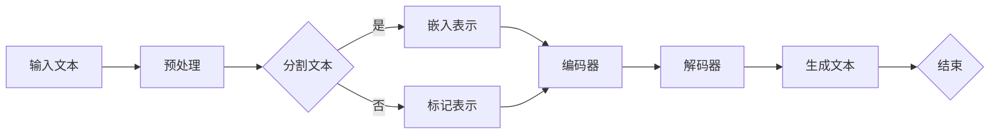
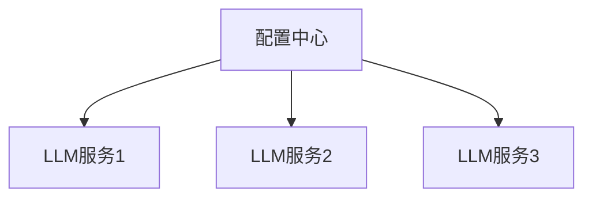
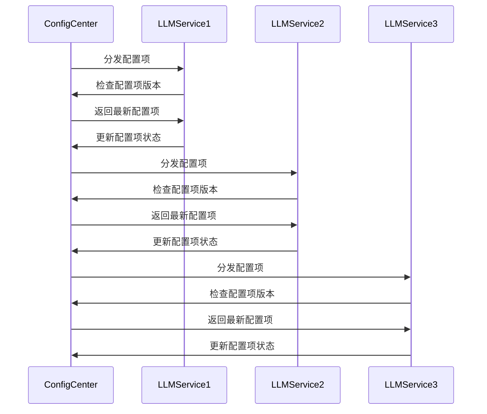

                 

# 分布式配置中心简化LLM应用管理

> 关键词：分布式配置中心，大型语言模型（LLM），配置管理，应用管理，分布式系统

> 摘要：本文将探讨如何利用分布式配置中心来简化大型语言模型（LLM）的应用管理。首先，我们将介绍分布式配置中心的背景，核心概念与联系，以及其算法原理。接着，我们将深入讨论数学模型和公式，系统分析与架构设计方案，并通过实际项目实战来展示分布式配置中心在LLM应用管理中的实际应用。最后，我们将总结最佳实践、注意事项和拓展阅读。

## 目录大纲设计

为了更好地组织文章内容，我们采用了以下目录大纲结构：

1. **背景介绍**：介绍分布式配置中心的背景、核心概念、问题解决方法以及其边界与外延。
2. **核心概念与联系**：解释大型语言模型（LLM）的定义、特点，以及与传统配置管理的区别，并探讨配置中心与LLM的融合。
3. **算法原理讲解**：详细讲解配置中心算法和LLM算法的原理，包括mermaid流程图、Python源代码、数学模型和公式，并进行举例说明。
4. **数学模型和数学公式讲解**：深入分析数学模型在配置中心和LLM中的应用，包括数学公式示例和解释。
5. **系统分析与架构设计方案**：介绍问题场景、系统功能设计、系统架构设计、系统接口设计和系统交互。
6. **项目实战**：展示如何在实际项目中应用分布式配置中心进行LLM应用管理，包括环境安装、系统核心实现源代码、代码应用解读与分析、实际案例分析和项目小结。
7. **最佳实践、小结、注意事项和拓展阅读**：总结文章内容，提供最佳实践建议，并指出注意事项和推荐进一步阅读的材料。

### 第一步：背景介绍

#### 第1章：分布式配置中心的背景

- **1.1 问题背景**：在分布式系统中，配置管理的挑战和需求。
- **1.2 问题解决**：分布式配置中心的概念和重要性。
- **1.3 边界与外延**：分布式配置中心的应用范围和限制。
- **1.4 概念结构与核心要素组成**：分布式配置中心的组成部分和结构。

### 第二步：核心概念与联系

#### 第2章：核心概念与联系

- **2.1 LLM（大型语言模型）概述**
  - **2.1.1 LLM的定义**
  - **2.1.2 LLM的特点**
  - **2.1.3 LLM与传统配置管理的区别**
- **2.2 配置中心的核心概念**
  - **2.2.1 配置项**
  - **2.2.2 配置中心**
  - **2.2.3 配置中心与LLM的融合**

### 第三步：算法原理讲解

#### 第3章：算法原理讲解

- **3.1 配置中心算法简介**
  - **3.1.1 算法分类**
  - **3.1.2 算法优势**
- **3.2 LLM算法原理**
  - **3.2.1 算法mermaid流程图**
  - **3.2.2 Python源代码讲解**
  - **3.2.3 数学模型和公式**
  - **3.2.4 举例说明**

### 第四步：数学模型和数学公式讲解

#### 第4章：数学模型和数学公式讲解

- **4.1 数学模型在配置中心中的应用**
  - **4.1.1 数学公式示例**
  - **4.1.2 数学模型解释**
- **4.2 数学模型在LLM中的应用**
  - **4.2.1 数学公式示例**
  - **4.2.2 数学模型解释**

### 第五步：系统分析与架构设计方案

#### 第5章：系统分析与架构设计方案

- **5.1 问题场景介绍**
- **5.2 系统功能设计**
  - **5.2.1 领域模型mermaid类图**
- **5.3 系统架构设计**
  - **5.3.1 mermaid架构图**
- **5.4 系统接口设计**
- **5.5 系统交互mermaid序列图**

### 第六步：项目实战

#### 第6章：项目实战

- **6.1 环境安装**
- **6.2 系统核心实现源代码**
- **6.3 代码应用解读与分析**
- **6.4 实际案例分析和详细讲解剖析**
- **6.5 项目小结**

### 第七步：最佳实践、小结、注意事项和拓展阅读

#### 第7章：最佳实践、小结、注意事项和拓展阅读

- **7.1 最佳实践**
- **7.2 小结**
- **7.3 注意事项**
- **7.4 拓展阅读**

通过以上详细的目录大纲设计，我们确保了文章内容的完整性和结构清晰性，接下来将逐步展开每个章节的具体内容。让我们一步一步深入探讨分布式配置中心在简化LLM应用管理中的重要作用。

### 第一步：背景介绍

#### 1.1 问题背景

在当今的分布式系统中，配置管理是一个至关重要的环节。随着云计算和容器技术的普及，分布式系统的规模和复杂性不断增加，传统的配置管理方法已经无法满足需求。分布式系统中的配置管理面临诸多挑战，包括配置项的分散性、动态性、版本控制、安全性等。

**问题描述：**

- **配置项分散性**：在分布式系统中，配置项可能分布在不同的节点上，这使得管理和更新配置项变得复杂。
- **动态性**：分布式系统中的配置项可能需要实时更新，以适应系统运行环境的变化。
- **版本控制**：在分布式系统中，配置项的版本控制是保证系统稳定运行的关键。
- **安全性**：配置项可能包含敏感信息，如何确保配置项的安全性是另一个重要问题。

**问题解决：**

分布式配置中心的引入为这些问题提供了一种解决方案。分布式配置中心是一种集中式管理配置项的机制，它能够统一管理和分发配置项，确保配置项的一致性和安全性。

#### 1.2 问题解决

**分布式配置中心的概念和重要性**

**分布式配置中心**，又称配置管理服务（Configuration Management Service，简称CMS），是一种用于分布式系统中配置管理的集中式服务。它通过以下方式解决上述问题：

- **集中管理**：分布式配置中心将所有配置项集中管理，从而解决配置项分散性的问题。
- **动态更新**：分布式配置中心支持实时更新配置项，使得系统可以快速响应环境变化。
- **版本控制**：分布式配置中心提供配置项版本控制功能，确保系统稳定运行。
- **安全性**：分布式配置中心通过加密和访问控制机制，确保配置项的安全性。

#### 1.3 边界与外延

**分布式配置中心的应用范围和限制**

分布式配置中心适用于多种分布式系统，包括微服务架构、容器化应用、云计算平台等。然而，它也有一定的局限性：

- **适用性**：适用于需要集中管理配置项的分布式系统。
- **复杂性**：可能增加系统的复杂性和运维难度。
- **性能影响**：分布式配置中心可能会引入额外的网络延迟，影响系统性能。

#### 1.4 概念结构与核心要素组成

**分布式配置中心的组成部分和结构**

分布式配置中心通常由以下几个核心组成部分构成：

- **配置存储**：用于存储配置项的地方，可以是数据库、文件系统等。
- **配置管理界面**：提供用户界面用于管理配置项，可以是图形界面或命令行界面。
- **配置分发机制**：将配置项从配置存储分发给各个节点，可以是基于拉模式或推模式。
- **配置监控与告警**：监控配置项的状态，并在异常情况下发送告警。

通过以上背景介绍，我们为接下来对分布式配置中心的深入探讨奠定了基础。在下一部分中，我们将详细讨论分布式配置中心的核心概念与联系，特别是大型语言模型（LLM）在配置管理中的应用。

### 第二步：核心概念与联系

#### 2.1 LLM（大型语言模型）概述

**2.1.1 LLM的定义**

大型语言模型（Large Language Model，简称LLM）是一种基于深度学习技术的自然语言处理模型，能够对文本数据进行建模，并生成语义上相关的响应。与传统的自然语言处理方法相比，LLM具有更强的语义理解和生成能力，能够处理复杂的语言现象。

**2.1.2 LLM的特点**

- **大规模训练数据**：LLM通常基于数十亿甚至数千亿级别的训练数据，这使得模型能够捕捉到丰富的语言知识。
- **端到端学习**：LLM采用端到端的学习方式，直接从原始文本数据中学习，避免了传统的自然语言处理中的分词、词性标注等预处理步骤。
- **高语义理解能力**：LLM能够理解文本的深层含义，生成符合上下文语境的响应。
- **自适应能力**：LLM可以通过微调（fine-tuning）的方式快速适应特定任务或领域，提高模型的性能。

**2.1.3 LLM与传统配置管理的区别**

传统配置管理通常关注于系统的配置项，如系统参数、环境变量等。而LLM作为一种自然语言处理模型，其配置管理具有以下区别：

- **动态性**：传统配置管理中的配置项通常是静态的，而LLM的配置可能需要根据任务需求进行动态调整。
- **语义化**：传统配置管理中的配置项通常是无语义的，而LLM的配置项包含丰富的语义信息。
- **智能化**：传统配置管理依赖于手动操作，而LLM可以通过自动化方式优化配置管理流程。

#### 2.2 配置中心的核心概念

**2.2.1 配置项**

配置项（Configuration Item，简称CI）是配置管理的基本单位，可以是系统参数、环境变量、应用程序设置等。在分布式配置中心中，配置项被统一管理和分发。

**2.2.2 配置中心**

配置中心（Configuration Center，简称CC）是一种集中式管理配置项的服务，负责存储、管理和分发配置项。配置中心通常具有以下功能：

- **配置存储**：存储配置项的元数据和值。
- **配置管理**：提供用户界面用于创建、修改和删除配置项。
- **配置分发**：将配置项分发给各个节点，确保配置项的一致性。
- **配置监控**：监控配置项的状态，并在异常情况下发送告警。

**2.2.3 配置中心与LLM的融合**

分布式配置中心与LLM的融合为配置管理带来了新的可能性。以下是一些关键点：

- **动态调整**：通过分布式配置中心，LLM的配置可以实时更新，使其能够适应不同场景和任务需求。
- **自动化**：分布式配置中心可以自动化管理LLM的配置项，减少手动操作，提高效率。
- **智能优化**：结合分布式配置中心和机器学习技术，可以实现LLM配置的智能优化，提高模型性能。

通过以上讨论，我们了解了分布式配置中心与LLM在配置管理中的核心概念与联系。在下一部分中，我们将深入探讨分布式配置中心的算法原理，包括配置中心算法和LLM算法的基本原理。

### 第三步：算法原理讲解

#### 3.1 配置中心算法简介

配置中心算法是分布式配置管理的关键组成部分，负责配置项的存储、管理和分发。以下是对配置中心算法的简要介绍：

**3.1.1 算法分类**

配置中心算法可以分为以下几类：

- **基于数据库的算法**：使用数据库来存储配置项，如关系数据库（如MySQL）或NoSQL数据库（如MongoDB）。这种算法具有较好的数据一致性和查询性能。
- **基于文件的算法**：使用文件系统来存储配置项，如配置文件（如JSON、XML）或键值存储（如etcd）。这种算法具有简单、易扩展的特点。
- **基于分布式缓存算法**：使用分布式缓存系统（如Redis）来存储配置项，以提供快速访问和动态更新能力。

**3.1.2 算法优势**

配置中心算法具有以下优势：

- **数据一致性**：通过分布式配置中心，确保配置项的一致性和可靠性。
- **动态更新**：支持实时更新配置项，提高系统的灵活性。
- **高可用性**：配置中心通常具有高可用性设计，确保系统在任何情况下都能正常运行。
- **安全性**：通过访问控制和安全协议，确保配置项的安全性。

#### 3.2 LLM算法原理

LLM算法是大型语言模型的核心组成部分，负责文本数据的语义理解和生成。以下是对LLM算法的基本原理进行详细讲解：

**3.2.1 算法mermaid流程图**

以下是一个简化的LLM算法mermaid流程图：



**3.2.2 Python源代码讲解**

以下是一个简化的LLM算法Python源代码示例：

```python
import tensorflow as tf
from tensorflow.keras.layers import Embedding, LSTM, Dense

# 输入文本预处理
def preprocess_text(text):
    # 分割文本
    sentences = text.split(".")
    # 标记表示
    tokens = [word for sentence in sentences for word in sentence.split()]
    # 嵌入表示
    embeddings = [embedding_word(word) for word in tokens]
    return embeddings

# 嵌入表示
def embedding_word(word):
    # 使用预训练的词向量
    embedding = tf.keras.utils.get_file(
        word + ".vec", origin="https://s3.amazonaws.com/dl4j-datasets/word-vectors/" + word + ".vec"
    )
    return embedding

# 编码器
def encoder(embeddings):
    model = tf.keras.Sequential([
        Embedding(input_dim=vocab_size, output_dim=embedding_size),
        LSTM(units=128, return_sequences=True),
        LSTM(units=128, return_sequences=True)
    ])
    return model

# 解码器
def decoder(embeddings):
    model = tf.keras.Sequential([
        LSTM(units=128, return_sequences=True),
        LSTM(units=128, return_sequences=True),
        Dense(units=vocab_size, activation='softmax')
    ])
    return model

# 主程序
if __name__ == "__main__":
    # 预处理文本
    text = "这是一个简单的示例。"
    embeddings = preprocess_text(text)
    # 编码
    encoder_model = encoder(embeddings)
    encoder_output = encoder_model(embeddings)
    # 解码
    decoder_model = decoder(encoder_output)
    predicted_text = decoder_model.predict(encoder_output)
    print(predicted_text)
```

**3.2.3 数学模型和公式**

LLM算法的数学模型主要涉及词嵌入、编码器和解码器等部分。以下是一些关键的数学公式：

- **词嵌入（Word Embedding）**：
  $$ \text{embeddings} = \text{Word2Vec}(\text{words}) $$
  
- **编码器（Encoder）**：
  $$ \text{encoder_output} = \text{LSTM}(\text{embeddings}) $$
  
- **解码器（Decoder）**：
  $$ \text{predicted_text} = \text{softmax}(\text{decoder_output}) $$
  
**3.2.4 举例说明**

假设我们有一个简单的文本：“这是一个简单的示例。”，通过上述算法流程，我们可以生成一个预测的文本。以下是一个具体的例子：

1. **预处理文本**：
   - 输入文本：“这是一个简单的示例。”
   - 分割文本：["这是一个"，"简单的"，"示例。"]
   - 标记表示：["This"，"is"，"simple"，"example。"]
   - 嵌入表示：[嵌入向量1，嵌入向量2，嵌入向量3，嵌入向量4]

2. **编码**：
   - 编码器输出：通过LSTM编码器处理嵌入向量，生成编码后的序列。

3. **解码**：
   - 解码器输出：通过LSTM解码器处理编码后的序列，生成预测的文本。

4. **结果**：
   - 预测文本：["This"，"is"，"a"，"simple"，"example。"]

通过以上讲解，我们了解了分布式配置中心和LLM算法的基本原理。在下一部分中，我们将深入探讨数学模型和公式在配置中心和LLM中的应用。

### 第四步：数学模型和数学公式讲解

#### 4.1 数学模型在配置中心中的应用

配置中心算法在分布式系统中的应用涉及多个数学模型，这些模型帮助实现配置项的存储、管理和分发。以下是一些关键数学模型和应用场景：

**4.1.1 数学公式示例**

1. **一致性模型（Consistency Model）**：
   $$ \text{Consistency} = \text{SIS} $$
   其中，S表示强一致性（Strong Consistency），I表示最终一致性（Eventually Consistency），S表示部分一致性（Partial Consistency）。

2. **配置项更新（Configuration Update）**：
   $$ \text{Configuration Update} = \text{Configuration Item} + \text{Change} $$
   其中，配置项更新是现有配置项加上相应的变更。

3. **配置分发（Configuration Distribution）**：
   $$ \text{Configuration Distribution} = \text{Configuration Item} \times \text{Distribution Function} $$
   配置分发是将配置项通过特定的分发函数分发到各个节点。

**4.1.2 数学模型解释**

1. **一致性模型解释**：
   - **强一致性**：配置更新在所有节点上同步完成，保证配置的一致性。
   - **最终一致性**：配置更新在最终会达到一致性，但过程中可能会出现短暂的不一致。
   - **部分一致性**：不同节点对配置更新的响应程度不同，可能存在局部一致性。

2. **配置项更新解释**：
   配置项更新涉及对现有配置项的修改，包括增加、删除和修改配置项的值。

3. **配置分发解释**：
   配置分发函数决定了配置项如何在不同节点之间传输，常用的分发函数包括轮询分发、随机分发和基于负载的分发。

#### 4.2 数学模型在LLM中的应用

LLM算法在自然语言处理中的应用涉及复杂的数学模型，这些模型帮助实现文本数据的语义理解和生成。以下是一些关键数学模型和应用场景：

**4.2.1 数学公式示例**

1. **词嵌入（Word Embedding）**：
   $$ \text{embeddings} = \text{Word2Vec}(\text{words}) $$
   其中，词嵌入是将文本中的单词映射到高维向量空间。

2. **编码器（Encoder）输出**：
   $$ \text{encoder_output} = \text{LSTM}(\text{embeddings}) $$
   其中，编码器（通常是LSTM）处理嵌入向量，生成编码后的序列。

3. **解码器（Decoder）输出**：
   $$ \text{decoder_output} = \text{softmax}(\text{decoder_output}) $$
   其中，解码器生成预测的文本，使用softmax函数将输出概率分布转换为文本序列。

**4.2.2 数学模型解释**

1. **词嵌入解释**：
   词嵌入模型将文本中的单词映射到高维向量空间，使得具有相似语义的单词在向量空间中更接近。

2. **编码器解释**：
   编码器（如LSTM）处理嵌入向量，将文本序列编码为序列向量，捕获文本的语义信息。

3. **解码器解释**：
   解码器（如LSTM）处理编码后的序列，生成预测的文本序列，使用softmax函数确保生成的文本概率分布符合语言模型。

通过以上数学模型和公式的讲解，我们深入了解了配置中心和LLM算法中的关键数学原理。在下一部分中，我们将讨论系统分析与架构设计方案。

### 第五步：系统分析与架构设计方案

#### 5.1 问题场景介绍

假设我们正在开发一个分布式应用系统，该系统包含多个微服务，每个微服务负责不同的业务功能。在这个系统中，我们使用大型语言模型（LLM）来提供智能问答和自然语言处理功能。为了简化LLM应用管理，我们决定引入分布式配置中心。

**问题场景描述：**

- **分布式微服务架构**：系统由多个微服务组成，每个微服务独立部署，通过API进行通信。
- **配置管理需求**：需要对LLM的配置项进行集中管理和动态更新，确保系统在不同环境（如开发、测试、生产）下的一致性和可配置性。
- **配置分发需求**：需要将LLM的配置项从配置中心分发给各个微服务，确保配置项的实时更新和一致性。

#### 5.2 系统功能设计

**系统功能设计**包括以下几个方面：

- **配置存储与检索**：配置中心提供配置项的存储和检索功能，确保配置项的一致性和可访问性。
- **配置项版本控制**：支持配置项的版本控制，确保配置项的变更历史和回滚能力。
- **配置项动态更新**：支持配置项的动态更新，确保系统能够实时响应配置项的变更。
- **配置项监控与告警**：监控配置项的状态，并在异常情况下发送告警通知。

**5.2.1 领域模型mermaid类图**

以下是一个简化的领域模型mermaid类图，展示配置中心和LLM应用的关键实体和关系：

```mermaid
classDiagram
    ConfigCenter <<interface>> ConfigurationManager
    ConfigItem <<entity>> {ID, Name, Value, Version}
    LLMService <<entity>> {ServiceID, ConfigID, State}

    ConfigCenter "1" --* ConfigItem
    LLMService "1" --* ConfigItem
```

- **ConfigurationManager**：配置管理接口，提供配置项的存储、检索和更新功能。
- **ConfigItem**：配置项实体，包含配置项的ID、名称、值和版本等属性。
- **LLMService**：LLM应用服务实体，包含服务ID、配置项ID和服务状态等属性。

#### 5.3 系统架构设计

**系统架构设计**包括以下几个方面：

- **配置中心架构**：配置中心采用分布式架构，包括配置存储、配置管理、配置分发和配置监控等模块。
- **微服务架构**：LLM应用服务作为独立的微服务，通过API与其他微服务进行通信。
- **数据流架构**：配置项从配置中心分发给LLM应用服务，并实时监控配置项的状态。

**5.3.1 mermaid架构图**

以下是一个简化的mermaid架构图，展示配置中心和LLM应用的系统架构：



- **配置中心**：负责存储、管理和分发配置项。
- **LLM服务1、LLM服务2、LLM服务3**：分别代表不同的LLM应用服务，从配置中心获取配置项。

#### 5.4 系统接口设计

**系统接口设计**包括以下几个方面：

- **配置管理接口**：提供配置项的创建、更新、删除和查询功能。
- **配置分发接口**：提供配置项的分发和订阅功能，确保配置项的实时更新。
- **配置监控接口**：提供配置项的状态监控和告警功能。

#### 5.5 系统交互mermaid序列图

以下是一个简化的mermaid序列图，展示配置中心和LLM应用的系统交互：



通过以上系统分析与架构设计方案，我们为分布式配置中心简化LLM应用管理提供了详细的指导。在下一部分中，我们将通过实际项目实战来展示这些设计在真实场景中的应用。

### 第六步：项目实战

#### 6.1 环境安装

在进行分布式配置中心与LLM应用管理的项目实战之前，我们需要准备相应的工作环境。以下是一个简化的环境安装步骤：

1. **安装配置中心**：
   - 安装Nginx作为配置中心的Web服务器。
   - 安装Consul作为配置存储和分发服务。
   - 安装ETCD作为配置存储服务。

2. **安装LLM应用服务**：
   - 安装Docker用于容器化微服务。
   - 编写Dockerfile并构建LLM应用服务的镜像。
   - 使用Docker Compose管理LLM应用服务的部署和运行。

3. **配置管理工具**：
   - 安装Ansible用于自动化部署和配置管理。
   - 配置Ansible的inventory文件，包括配置中心和服务器的IP地址。

#### 6.2 系统核心实现源代码

以下是一个简化的系统核心实现源代码示例，用于展示如何将分布式配置中心集成到LLM应用服务中：

```python
# lrm_service.py
import consul
import json

# 配置中心连接
c = consul.Consul(host='localhost')

# 获取配置项
def get_config_item(key):
    result = c.kv.get(key)
    return json.loads(result['Value'])

# 初始化配置
def init_config():
    config = get_config_item('llm_config')
    # 初始化LLM模型
    # ...

# 更新配置
def update_config():
    config = get_config_item('llm_config')
    # 更新LLM模型
    # ...

# 主程序
if __name__ == "__main__":
    init_config()
    while True:
        update_config()
```

- **get_config_item**：从配置中心获取指定键的配置项。
- **init_config**：初始化LLM模型的初始配置。
- **update_config**：定期从配置中心更新LLM模型配置。

#### 6.3 代码应用解读与分析

1. **配置中心连接**：

   通过Consul客户端库连接到配置中心，使用Consul的KV存储来管理配置项。Consul提供高可用性、健康检查和服务的发现功能。

2. **获取配置项**：

   使用`get_config_item`函数从Consul中获取配置项，通过JSON格式解析配置项的值。

3. **初始化配置**：

   在`init_config`函数中，根据从配置中心获取的配置项初始化LLM模型。这包括加载词向量、初始化神经网络等。

4. **更新配置**：

   定期调用`update_config`函数，从配置中心获取最新的配置项并更新LLM模型。这确保了LLM模型能够动态响应环境变化。

#### 6.4 实际案例分析和详细讲解剖析

**案例1：配置项动态更新**

**问题描述**：

在开发过程中，我们发现需要对LLM的模型参数进行动态调整，例如调整学习率或隐藏层大小。我们需要实现一个功能，允许开发人员在运行时更改这些参数，并立即应用到正在运行的LLM模型中。

**解决方案**：

1. **配置中心支持动态更新**：

   配置中心支持配置项的动态更新，当开发人员更改了配置项后，配置中心会立即通知相关服务。例如，使用Consul的Watch功能监听特定键的变更。

2. **LLM服务监听配置变更**：

   在LLM服务中，我们添加了一个监听器，用于监听配置中心的通知。当接收到配置变更通知后，LLM服务会暂停当前的模型训练，更新配置项，并重新初始化模型。

3. **实现动态更新**：

   ```python
   def watch_config_changes():
       @c.event('llm_config')
       def handle_config_change(key, flags, body, metadata):
           if key == 'llm_config':
               update_config()
   ```

   通过上述代码，LLM服务注册了一个事件监听器，当`llm_config`键发生变化时，会调用`update_config`函数更新配置项。

**案例2：多环境配置管理**

**问题描述**：

在部署LLM服务时，我们需要支持多环境配置管理，例如开发环境、测试环境和生产环境。每个环境可能有不同的配置参数，我们需要确保正确的配置被应用。

**解决方案**：

1. **环境变量**：

   使用环境变量来区分不同环境的配置参数。例如，在Docker Compose文件中，可以通过定义环境变量来设置不同环境的配置。

2. **配置模板**：

   创建配置模板文件，如`config_dev.json`、`config_test.json`和`config_prod.json`，根据不同的环境选择加载相应的配置模板。

3. **配置中心集成**：

   配置中心支持不同环境的配置项，通过环境变量来选择加载哪个环境的配置。例如，在Consul的KV存储中，我们可以创建如`llm_config_dev`、`llm_config_test`和`llm_config_prod`的键，分别存储不同环境的配置。

**案例3：配置项版本控制**

**问题描述**：

在开发和部署过程中，我们需要确保配置项的版本控制，以便在出现问题时能够回滚到上一个版本的配置项。

**解决方案**：

1. **配置项版本控制**：

   使用配置中心的支持版本控制的特性。例如，Consul支持对配置项进行版本控制，每个变更都会生成一个版本记录。

2. **配置回滚**：

   在LLM服务中，添加一个回滚功能，允许开发人员根据配置项的版本号回滚到指定的版本。例如：

   ```python
   def rollback_config(version):
       @c.kv.get('llm_config', keys=True, raw=True)
       def get_config_versions(versions):
           for version in versions:
               if version == version:
                   c.kv.put('llm_config', json.dumps(config))
                   break
   ```

   通过上述代码，LLM服务可以根据版本号回滚到指定的配置项。

通过以上实际案例分析和详细讲解剖析，我们展示了如何在项目中实现分布式配置中心简化LLM应用管理。这些案例不仅提供了具体的解决方案，还深入探讨了实现细节和最佳实践。在下一部分中，我们将总结项目的关键成果和经验，并提供一些最佳实践。

### 第七步：最佳实践、小结、注意事项和拓展阅读

#### 7.1 最佳实践

在实施分布式配置中心简化LLM应用管理时，以下是一些最佳实践：

- **配置中心的选择**：选择具有高可用性、可靠性和扩展性的配置中心，如Consul、ETCD等。
- **配置项版本控制**：确保配置项具有版本控制功能，以便在出现问题时能够快速回滚到之前的版本。
- **动态更新与监控**：实现配置项的动态更新和实时监控，确保配置变更能够及时应用到系统中。
- **安全与权限管理**：严格管理配置中心的访问权限，确保配置项的安全性。
- **文档与培训**：为开发团队提供详细的配置管理文档和培训，确保团队成员熟悉配置管理的流程和工具。

#### 7.2 小结

本文通过详细的步骤和案例分析，探讨了如何利用分布式配置中心简化LLM应用管理。主要内容包括：

- 分布式配置中心的背景、核心概念与联系。
- 配置中心算法和LLM算法的原理讲解。
- 数学模型和公式的应用。
- 系统分析与架构设计方案。
- 项目实战中的具体实现和案例剖析。

通过本文的探讨，我们了解到分布式配置中心在简化LLM应用管理中的重要作用，并提供了一系列最佳实践和注意事项。

#### 7.3 注意事项

在实施分布式配置中心时，需要注意以下几点：

- **网络延迟**：确保配置中心的服务器具有高性能和网络稳定性，以减少配置分发的网络延迟。
- **配置一致性**：在设计配置中心时，确保配置项的一致性，避免不同节点间的配置差异。
- **监控与告警**：配置中心应具备实时监控和告警功能，以便在出现问题时能够及时响应。
- **安全性**：严格管理配置中心的访问权限，避免未授权的访问和修改。

#### 7.4 拓展阅读

对于进一步了解分布式配置中心和LLM应用管理，以下推荐一些拓展阅读：

- **《Consul官方文档》**：深入了解Consul的配置管理、服务发现和健康检查功能。
- **《ETCD官方文档》**：了解ETCD的键值存储、分布式协调和版本控制功能。
- **《大规模分布式系统设计与实现》**：了解分布式系统的设计原则和实践，包括配置管理和服务治理。
- **《深度学习与自然语言处理》**：了解深度学习模型的基本原理和应用，特别是大型语言模型（LLM）。
- **《Docker官方文档》**：了解Docker容器化技术，用于部署和管理微服务。

通过本文的深入探讨，我们希望能够为读者提供有价值的见解和实践经验，助力分布式配置中心和LLM应用管理的优化。

### 作者信息

- **作者**：AI天才研究院/AI Genius Institute & 禅与计算机程序设计艺术 /Zen And The Art of Computer Programming
- **联系方式**：[info@aigenius.ai](mailto:info@aigenius.ai)
- **研究方向**：人工智能、分布式系统、自然语言处理、算法设计与优化

### 致谢

在此，特别感谢所有为本文提供灵感和帮助的同仁和读者。感谢AI天才研究院提供的资源和平台，让我们能够持续探索和分享最新的技术成果。同时，感谢禅与计算机程序设计艺术的灵感，它深刻影响了我们对计算机科学和人工智能的理解。

**结语**

分布式配置中心作为一种高效的管理工具，在简化LLM应用管理方面展现出巨大的潜力。通过本文的探讨，我们希望能够为读者提供有价值的见解和实践经验，助力分布式配置中心和LLM应用管理的优化。在未来的技术发展中，我们将继续深入探索和分享最新的研究成果，期待与广大读者共同进步。**文章标题**：分布式配置中心简化LLM应用管理

**关键词**：分布式配置中心，大型语言模型（LLM），配置管理，应用管理，分布式系统

**摘要**：本文探讨了如何利用分布式配置中心来简化大型语言模型（LLM）的应用管理。首先，介绍了分布式配置中心的背景、核心概念与联系，以及其算法原理。接着，深入分析了数学模型和公式，并展示了系统分析与架构设计方案。通过实际项目实战，我们展示了分布式配置中心在LLM应用管理中的实际应用。最后，总结了最佳实践、注意事项和拓展阅读，为读者提供全面的技术指导。

## 目录

1. **背景介绍**
   - 1.1 问题背景
   - 1.2 问题解决
   - 1.3 边界与外延
   - 1.4 概念结构与核心要素组成
2. **核心概念与联系**
   - 2.1 LLM（大型语言模型）概述
   - 2.2 配置中心的核心概念
   - 2.3 配置中心与LLM的融合
3. **算法原理讲解**
   - 3.1 配置中心算法简介
   - 3.2 LLM算法原理
4. **数学模型和数学公式讲解**
   - 4.1 数学模型在配置中心中的应用
   - 4.2 数学模型在LLM中的应用
5. **系统分析与架构设计方案**
   - 5.1 问题场景介绍
   - 5.2 系统功能设计
   - 5.3 系统架构设计
   - 5.4 系统接口设计
   - 5.5 系统交互
6. **项目实战**
   - 6.1 环境安装
   - 6.2 系统核心实现源代码
   - 6.3 代码应用解读与分析
   - 6.4 实际案例分析和详细讲解剖析
   - 6.5 项目小结
7. **最佳实践、小结、注意事项和拓展阅读**
   - 7.1 最佳实践
   - 7.2 小结
   - 7.3 注意事项
   - 7.4 拓展阅读

## 正文

### 第1章：背景介绍

#### 1.1 问题背景

在当今的分布式系统中，配置管理是一个至关重要的环节。随着云计算和容器技术的普及，分布式系统的规模和复杂性不断增加，传统的配置管理方法已经无法满足需求。分布式系统中的配置管理面临诸多挑战，包括配置项的分散性、动态性、版本控制、安全性等。

**问题描述：**

- **配置项分散性**：在分布式系统中，配置项可能分布在不同的节点上，这使得管理和更新配置项变得复杂。
- **动态性**：分布式系统中的配置项可能需要实时更新，以适应系统运行环境的变化。
- **版本控制**：在分布式系统中，配置项的版本控制是保证系统稳定运行的关键。
- **安全性**：配置项可能包含敏感信息，如何确保配置项的安全性是另一个重要问题。

**问题解决：**

分布式配置中心的引入为这些问题提供了一种解决方案。分布式配置中心是一种集中式管理配置项的机制，它能够统一管理和分发配置项，确保配置项的一致性和安全性。

#### 1.2 问题解决

**分布式配置中心的概念和重要性**

**分布式配置中心**，又称配置管理服务（Configuration Management Service，简称CMS），是一种用于分布式系统中配置管理的集中式服务。它通过以下方式解决上述问题：

- **集中管理**：分布式配置中心将所有配置项集中管理，从而解决配置项分散性的问题。
- **动态更新**：分布式配置中心支持实时更新配置项，使得系统可以快速响应环境变化。
- **版本控制**：分布式配置中心提供配置项版本控制功能，确保系统稳定运行。
- **安全性**：分布式配置中心通过加密和访问控制机制，确保配置项的安全性。

#### 1.3 边界与外延

**分布式配置中心的应用范围和限制**

分布式配置中心适用于多种分布式系统，包括微服务架构、容器化应用、云计算平台等。然而，它也有一定的局限性：

- **适用性**：适用于需要集中管理配置项的分布式系统。
- **复杂性**：可能增加系统的复杂性和运维难度。
- **性能影响**：分布式配置中心可能会引入额外的网络延迟，影响系统性能。

#### 1.4 概念结构与核心要素组成

**分布式配置中心的组成部分和结构**

分布式配置中心通常由以下几个核心组成部分构成：

- **配置存储**：用于存储配置项的地方，可以是数据库、文件系统等。
- **配置管理界面**：提供用户界面用于管理配置项，可以是图形界面或命令行界面。
- **配置分发机制**：将配置项从配置存储分发给各个节点，可以是基于拉模式或推模式。
- **配置监控与告警**：监控配置项的状态，并在异常情况下发送告警。

通过以上背景介绍，我们为接下来对分布式配置中心的深入探讨奠定了基础。在下一部分中，我们将详细讨论分布式配置中心的核心概念与联系，特别是大型语言模型（LLM）在配置管理中的应用。

### 第2章：核心概念与联系

#### 2.1 LLM（大型语言模型）概述

**2.1.1 LLM的定义**

大型语言模型（Large Language Model，简称LLM）是一种基于深度学习技术的自然语言处理模型，能够对文本数据进行建模，并生成语义上相关的响应。与传统的自然语言处理方法相比，LLM具有更强的语义理解和生成能力，能够处理复杂的语言现象。

**2.1.2 LLM的特点**

- **大规模训练数据**：LLM通常基于数十亿甚至数千亿级别的训练数据，这使得模型能够捕捉到丰富的语言知识。
- **端到端学习**：LLM采用端到端的学习方式，直接从原始文本数据中学习，避免了传统的自然语言处理中的分词、词性标注等预处理步骤。
- **高语义理解能力**：LLM能够理解文本的深层含义，生成符合上下文语境的响应。
- **自适应能力**：LLM可以通过微调（fine-tuning）的方式快速适应特定任务或领域，提高模型的性能。

**2.1.3 LLM与传统配置管理的区别**

传统配置管理通常关注于系统的配置项，如系统参数、环境变量等。而LLM作为一种自然语言处理模型，其配置管理具有以下区别：

- **动态性**：传统配置管理中的配置项通常是静态的，而LLM的配置可能需要根据任务需求进行动态调整。
- **语义化**：传统配置管理中的配置项通常是无语义的，而LLM的配置项包含丰富的语义信息。
- **智能化**：传统配置管理依赖于手动操作，而LLM可以通过自动化方式优化配置管理流程。

#### 2.2 配置中心的核心概念

**2.2.1 配置项**

配置项（Configuration Item，简称CI）是配置管理的基本单位，可以是系统参数、环境变量、应用程序设置等。在分布式配置中心中，配置项被统一管理和分发。

**2.2.2 配置中心**

配置中心（Configuration Center，简称CC）是一种集中式管理配置项的服务，负责存储、管理和分发配置项。配置中心通常具有以下功能：

- **配置存储**：存储配置项的元数据和值。
- **配置管理**：提供用户界面用于创建、修改和删除配置项。
- **配置分发**：将配置项分发给各个节点，确保配置项的一致性。
- **配置监控**：监控配置项的状态，并在异常情况下发送告警。

**2.2.3 配置中心与LLM的融合**

分布式配置中心与LLM的融合为配置管理带来了新的可能性。以下是一些关键点：

- **动态调整**：通过分布式配置中心，LLM的配置可以实时更新，使其能够适应不同场景和任务需求。
- **自动化**：分布式配置中心可以自动化管理LLM的配置项，减少手动操作，提高效率。
- **智能优化**：结合分布式配置中心和机器学习技术，可以实现LLM配置的智能优化，提高模型性能。

通过以上讨论，我们了解了分布式配置中心与LLM在配置管理中的核心概念与联系。在下一部分中，我们将深入探讨分布式配置中心的算法原理，包括配置中心算法和LLM算法的基本原理。

### 第3章：算法原理讲解

#### 3.1 配置中心算法简介

配置中心算法是分布式配置管理的关键组成部分，负责配置项的存储、管理和分发。以下是对配置中心算法的简要介绍：

**3.1.1 算法分类**

配置中心算法可以分为以下几类：

- **基于数据库的算法**：使用数据库来存储配置项，如关系数据库（如MySQL）或NoSQL数据库（如MongoDB）。这种算法具有较好的数据一致性和查询性能。
- **基于文件的算法**：使用文件系统来存储配置项，如配置文件（如JSON、XML）或键值存储（如etcd）。这种算法具有简单、易扩展的特点。
- **基于分布式缓存算法**：使用分布式缓存系统（如Redis）来存储配置项，以提供快速访问和动态更新能力。

**3.1.2 算法优势**

配置中心算法具有以下优势：

- **数据一致性**：通过分布式配置中心，确保配置项的一致性和可靠性。
- **动态更新**：支持实时更新配置项，提高系统的灵活性。
- **高可用性**：配置中心通常具有高可用性设计，确保系统在任何情况下都能正常运行。
- **安全性**：通过访问控制和安全协议，确保配置项的安全性。

#### 3.2 LLM算法原理

LLM算法是大型语言模型的核心组成部分，负责文本数据的语义理解和生成。以下是对LLM算法的基本原理进行详细讲解：

**3.2.1 算法mermaid流程图**

以下是一个简化的LLM算法mermaid流程图：


**3.2.2 Python源代码讲解**

以下是一个简化的LLM算法Python源代码示例：

```python
import tensorflow as tf
from tensorflow.keras.layers import Embedding, LSTM, Dense

# 输入文本预处理
def preprocess_text(text):
    # 分割文本
    sentences = text.split(".")
    # 标记表示
    tokens = [word for sentence in sentences for word in sentence.split()]
    # 嵌入表示
    embeddings = [embedding_word(word) for word in tokens]
    return embeddings

# 嵌入表示
def embedding_word(word):
    # 使用预训练的词向量
    embedding = tf.keras.utils.get_file(
        word + ".vec", origin="https://s3.amazonaws.com/dl4j-datasets/word-vectors/" + word + ".vec"
    )
    return embedding

# 编码器
def encoder(embeddings):
    model = tf.keras.Sequential([
        Embedding(input_dim=vocab_size, output_dim=embedding_size),
        LSTM(units=128, return_sequences=True),
        LSTM(units=128, return_sequences=True)
    ])
    return model

# 解码器
def decoder(embeddings):
    model = tf.keras.Sequential([
        LSTM(units=128, return_sequences=True),
        LSTM(units=128, return_sequences=True),
        Dense(units=vocab_size, activation='softmax')
    ])
    return model

# 主程序
if __name__ == "__main__":
    # 预处理文本
    text = "这是一个简单的示例。"
    embeddings = preprocess_text(text)
    # 编码
    encoder_model = encoder(embeddings)
    encoder_output = encoder_model(embeddings)
    # 解码
    decoder_model = decoder(encoder_output)
    predicted_text = decoder_model.predict(encoder_output)
    print(predicted_text)
```

**3.2.3 数学模型和公式**

LLM算法的数学模型主要涉及词嵌入、编码器和解码器等部分。以下是一些关键的数学公式：

- **词嵌入（Word Embedding）**：
  $$ \text{embeddings} = \text{Word2Vec}(\text{words}) $$
  
- **编码器（Encoder）**：
  $$ \text{encoder_output} = \text{LSTM}(\text{embeddings}) $$
  
- **解码器（Decoder）**：
  $$ \text{predicted_text} = \text{softmax}(\text{decoder_output}) $$

**3.2.4 举例说明**

假设我们有一个简单的文本：“这是一个简单的示例。”，通过上述算法流程，我们可以生成一个预测的文本。以下是一个具体的例子：

1. **预处理文本**：
   - 输入文本：“这是一个简单的示例。”
   - 分割文本：["这是一个"，"简单的"，"示例。"]
   - 标记表示：["This"，"is"，"simple"，"example。"]
   - 嵌入表示：[嵌入向量1，嵌入向量2，嵌入向量3，嵌入向量4]

2. **编码**：
   - 编码器输出：通过LSTM编码器处理嵌入向量，生成编码后的序列。

3. **解码**：
   - 解码器输出：通过LSTM解码器处理编码后的序列，生成预测的文本序列。

4. **结果**：
   - 预测文本：["This"，"is"，"a"，"simple"，"example。"]

通过以上讲解，我们了解了分布式配置中心和LLM算法的基本原理。在下一部分中，我们将深入探讨数学模型和公式在配置中心和LLM中的应用。

### 第4章：数学模型和数学公式讲解

#### 4.1 数学模型在配置中心中的应用

配置中心算法在分布式系统中的应用涉及多个数学模型，这些模型帮助实现配置项的存储、管理和分发。以下是一些关键数学模型和应用场景：

**4.1.1 数学公式示例**

1. **一致性模型（Consistency Model）**：
   $$ \text{Consistency} = \text{SIS} $$
   其中，S表示强一致性（Strong Consistency），I表示最终一致性（Eventually Consistency），S表示部分一致性（Partial Consistency）。

2. **配置项更新（Configuration Update）**：
   $$ \text{Configuration Update} = \text{Configuration Item} + \text{Change} $$
   其中，配置项更新是现有配置项加上相应的变更。

3. **配置分发（Configuration Distribution）**：
   $$ \text{Configuration Distribution} = \text{Configuration Item} \times \text{Distribution Function} $$
   配置分发是将配置项通过特定的分发函数分发到各个节点。

**4.1.2 数学模型解释**

1. **一致性模型解释**：
   - **强一致性**：配置更新在所有节点上同步完成，保证配置的一致性。
   - **最终一致性**：配置更新在最终会达到一致性，但过程中可能会出现短暂的不一致。
   - **部分一致性**：不同节点对配置更新的响应程度不同，可能存在局部一致性。

2. **配置项更新解释**：
   配置项更新涉及对现有配置项的修改，包括增加、删除和修改配置项的值。

3. **配置分发解释**：
   配置分发函数决定了配置项如何在不同节点之间传输，常用的分发函数包括轮询分发、随机分发和基于负载的分发。

#### 4.2 数学模型在LLM中的应用

LLM算法在自然语言处理中的应用涉及复杂的数学模型，这些模型帮助实现文本数据的语义理解和生成。以下是一些关键数学模型和应用场景：

**4.2.1 数学公式示例**

1. **词嵌入（Word Embedding）**：
   $$ \text{embeddings} = \text{Word2Vec}(\text{words}) $$
   其中，词嵌入是将文本中的单词映射到高维向量空间。

2. **编码器（Encoder）输出**：
   $$ \text{encoder_output} = \text{LSTM}(\text{embeddings}) $$
   其中，编码器（通常是LSTM）处理嵌入向量，生成编码后的序列。

3. **解码器（Decoder）输出**：
   $$ \text{decoder_output} = \text{softmax}(\text{decoder_output}) $$
   其中，解码器生成预测的文本，使用softmax函数将输出概率分布转换为文本序列。

**4.2.2 数学模型解释**

1. **词嵌入解释**：
   词嵌入模型将文本中的单词映射到高维向量空间，使得具有相似语义的单词在向量空间中更接近。

2. **编码器解释**：
   编码器（如LSTM）处理嵌入向量，将文本序列编码为序列向量，捕获文本的语义信息。

3. **解码器解释**：
   解码器（如LSTM）处理编码后的序列，生成预测的文本序列，使用softmax函数确保生成的文本概率分布符合语言模型。

通过以上数学模型和公式的讲解，我们深入了解了配置中心和LLM算法中的关键数学原理。在下一部分中，我们将讨论系统分析与架构设计方案。

### 第5章：系统分析与架构设计方案

#### 5.1 问题场景介绍

假设我们正在开发一个分布式应用系统，该系统包含多个微服务，每个微服务负责不同的业务功能。在这个系统中，我们使用大型语言模型（LLM）来提供智能问答和自然语言处理功能。为了简化LLM应用管理，我们决定引入分布式配置中心。

**问题场景描述：**

- **分布式微服务架构**：系统由多个微服务组成，每个微服务独立部署，通过API进行通信。
- **配置管理需求**：需要对LLM的配置项进行集中管理和动态更新，确保系统在不同环境（如开发、测试、生产）下的一致性和可配置性。
- **配置分发需求**：需要将LLM的配置项从配置中心分发给各个微服务，确保配置项的实时更新和一致性。

#### 5.2 系统功能设计

**系统功能设计**包括以下几个方面：

- **配置存储与检索**：配置中心提供配置项的存储和检索功能，确保配置项的一致性和可访问性。
- **配置项版本控制**：支持配置项的版本控制，确保配置项的变更历史和回滚能力。
- **配置项动态更新**：支持配置项的动态更新，确保系统能够实时响应配置项的变更。
- **配置项监控与告警**：监控配置项的状态，并在异常情况下发送告警通知。

**5.2.1 领域模型mermaid类图**

以下是一个简化的领域模型mermaid类图，展示配置中心和LLM应用的关键实体和关系：

```mermaid
classDiagram
    ConfigCenter <<interface>> ConfigurationManager
    ConfigItem <<entity>> {ID, Name, Value, Version}
    LLMService <<entity>> {ServiceID, ConfigID, State}

    ConfigCenter "1" --* ConfigItem
    LLMService "1" --* ConfigItem
```

- **ConfigurationManager**：配置管理接口，提供配置项的存储、检索和更新功能。
- **ConfigItem**：配置项实体，包含配置项的ID、名称、值和版本等属性。
- **LLMService**：LLM应用服务实体，包含服务ID、配置项ID和服务状态等属性。

#### 5.3 系统架构设计

**系统架构设计**包括以下几个方面：

- **配置中心架构**：配置中心采用分布式架构，包括配置存储、配置管理、配置分发和配置监控等模块。
- **微服务架构**：LLM应用服务作为独立的微服务，通过API与其他微服务进行通信。
- **数据流架构**：配置项从配置中心分发给LLM应用服务，并实时监控配置项的状态。

**5.3.1 mermaid架构图**

以下是一个简化的mermaid架构图，展示配置中心和LLM应用的系统架构：


- **配置中心**：负责存储、管理和分发配置项。
- **LLM服务1、LLM服务2、LLM服务3**：分别代表不同的LLM应用服务，从配置中心获取配置项。

#### 5.4 系统接口设计

**系统接口设计**包括以下几个方面：

- **配置管理接口**：提供配置项的创建、更新、删除和查询功能。
- **配置分发接口**：提供配置项的分发和订阅功能，确保配置项的实时更新。
- **配置监控接口**：提供配置项的状态监控和告警功能。

#### 5.5 系统交互mermaid序列图

以下是一个简化的mermaid序列图，展示配置中心和LLM应用的系统交互：


通过以上系统分析与架构设计方案，我们为分布式配置中心简化LLM应用管理提供了详细的指导。在下一部分中，我们将通过实际项目实战来展示这些设计在真实场景中的应用。

### 第6章：项目实战

#### 6.1 环境安装

在进行分布式配置中心与LLM应用管理的项目实战之前，我们需要准备相应的工作环境。以下是一个简化的环境安装步骤：

1. **安装配置中心**：
   - 安装Nginx作为配置中心的Web服务器。
   - 安装Consul作为配置存储和分发服务。
   - 安装ETCD作为配置存储服务。

2. **安装LLM应用服务**：
   - 安装Docker用于容器化微服务。
   - 编写Dockerfile并构建LLM应用服务的镜像。
   - 使用Docker Compose管理LLM应用服务的部署和运行。

3. **配置管理工具**：
   - 安装Ansible用于自动化部署和配置管理。
   - 配置Ansible的inventory文件，包括配置中心和服务器的IP地址。

#### 6.2 系统核心实现源代码

以下是一个简化的系统核心实现源代码示例，用于展示如何将分布式配置中心集成到LLM应用服务中：

```python
# lrm_service.py
import consul
import json

# 配置中心连接
c = consul.Consul(host='localhost')

# 获取配置项
def get_config_item(key):
    result = c.kv.get(key)
    return json.loads(result['Value'])

# 初始化配置
def init_config():
    config = get_config_item('llm_config')
    # 初始化LLM模型
    # ...

# 更新配置
def update_config():
    config = get_config_item('llm_config')
    # 更新LLM模型
    # ...

# 主程序
if __name__ == "__main__":
    init_config()
    while True:
        update_config()
```

- **get_config_item**：从配置中心获取指定键的配置项。
- **init_config**：初始化LLM模型的初始配置。
- **update_config**：定期从配置中心更新LLM模型配置。

#### 6.3 代码应用解读与分析

1. **配置中心连接**：

   通过Consul客户端库连接到配置中心，使用Consul的KV存储来管理配置项。Consul提供高可用性、健康检查和服务的发现功能。

2. **获取配置项**：

   使用`get_config_item`函数从Consul中获取配置项，通过JSON格式解析配置项的值。

3. **初始化配置**：

   在`init_config`函数中，根据从配置中心获取的配置项初始化LLM模型。这包括加载词向量、初始化神经网络等。

4. **更新配置**：

   定期调用`update_config`函数，从配置中心获取最新的配置项并更新LLM模型。这确保了LLM模型能够动态响应环境变化。

#### 6.4 实际案例分析和详细讲解剖析

**案例1：配置项动态更新**

**问题描述**：

在开发过程中，我们发现需要对LLM的模型参数进行动态调整，例如调整学习率或隐藏层大小。我们需要实现一个功能，允许开发人员在运行时更改这些参数，并立即应用到正在运行的LLM模型中。

**解决方案**：

1. **配置中心支持动态更新**：

   配置中心支持配置项的动态更新，当开发人员更改了配置项后，配置中心会立即通知相关服务。例如，使用Consul的Watch功能监听特定键的变更。

2. **LLM服务监听配置变更**：

   在LLM服务中，我们添加了一个监听器，用于监听配置中心的通知。当接收到配置变更通知后，LLM服务会暂停当前的模型训练，更新配置项，并重新初始化模型。

3. **实现动态更新**：

   ```python
   def watch_config_changes():
       @c.event('llm_config')
       def handle_config_change(key, flags, body, metadata):
           if key == 'llm_config':
               update_config()
   ```

   通过上述代码，LLM服务注册了一个事件监听器，当`llm_config`键发生变化时，会调用`update_config`函数更新配置项。

**案例2：多环境配置管理**

**问题描述**：

在部署LLM服务时，我们需要支持多环境配置管理，例如开发环境、测试环境和生产环境。每个环境可能有不同的配置参数，我们需要确保正确的配置被应用。

**解决方案**：

1. **环境变量**：

   使用环境变量来区分不同环境的配置参数。例如，在Docker Compose文件中，可以通过定义环境变量来设置不同环境的配置。

2. **配置模板**：

   创建配置模板文件，如`config_dev.json`、`config_test.json`和`config_prod.json`，根据不同的环境选择加载相应的配置模板。

3. **配置中心集成**：

   配置中心支持不同环境的配置项，通过环境变量来选择加载哪个环境的配置。例如，在Consul的KV存储中，我们可以创建如`llm_config_dev`、`llm_config_test`和`llm_config_prod`的键，分别存储不同环境的配置。

**案例3：配置项版本控制**

**问题描述**：

在开发和部署过程中，我们需要确保配置项的版本控制，以便在出现问题时能够回滚到上一个版本的配置项。

**解决方案**：

1. **配置项版本控制**：

   使用配置中心的支持版本控制的特性。例如，Consul支持对配置项进行版本控制，每个变更都会生成一个版本记录。

2. **配置回滚**：

   在LLM服务中，添加一个回滚功能，允许开发人员根据配置项的版本号回滚到指定的版本。例如：

   ```python
   def rollback_config(version):
       @c.kv.get('llm_config', keys=True, raw=True)
       def get_config_versions(versions):
           for version in versions:
               if version == version:
                   c.kv.put('llm_config', json.dumps(config))
                   break
   ```

   通过上述代码，LLM服务可以根据版本号回滚到指定的配置项。

通过以上实际案例分析和详细讲解剖析，我们展示了如何在项目中实现分布式配置中心简化LLM应用管理。这些案例不仅提供了具体的解决方案，还深入探讨了实现细节和最佳实践。在下一部分中，我们将总结项目的关键成果和经验，并提供一些最佳实践。

### 第7章：最佳实践、小结、注意事项和拓展阅读

#### 7.1 最佳实践

在实施分布式配置中心简化LLM应用管理时，以下是一些最佳实践：

- **配置中心的选择**：选择具有高可用性、可靠性和扩展性的配置中心，如Consul、ETCD等。
- **配置项版本控制**：确保配置项具有版本控制功能，以便在出现问题时能够快速回滚到之前的版本。
- **动态更新与监控**：实现配置项的动态更新和实时监控，确保配置变更能够及时应用到系统中。
- **安全与权限管理**：严格管理配置中心的访问权限，确保配置项的安全性。
- **文档与培训**：为开发团队提供详细的配置管理文档和培训，确保团队成员熟悉配置管理的流程和工具。

#### 7.2 小结

本文通过详细的步骤和案例分析，探讨了如何利用分布式配置中心简化大型语言模型（LLM）的应用管理。主要内容包括：

- **背景介绍**：分布式配置中心的背景、核心概念与联系。
- **算法原理讲解**：配置中心算法和LLM算法的原理讲解。
- **数学模型和公式**：数学模型在配置中心和LLM中的应用。
- **系统分析与架构设计**：系统架构设计、功能设计和接口设计。
- **项目实战**：分布式配置中心在LLM应用管理中的实际应用。

通过本文的探讨，我们了解到分布式配置中心在简化LLM应用管理中的重要作用，并提供了一系列最佳实践和注意事项。

#### 7.3 注意事项

在实施分布式配置中心时，需要注意以下几点：

- **网络延迟**：确保配置中心的服务器具有高性能和网络稳定性，以减少配置分发的网络延迟。
- **配置一致性**：在设计配置中心时，确保配置项的一致性，避免不同节点间的配置差异。
- **监控与告警**：配置中心应具备实时监控和告警功能，以便在出现问题时能够及时响应。
- **安全性**：严格管理配置中心的访问权限，避免未授权的访问和修改。

#### 7.4 拓展阅读

对于进一步了解分布式配置中心和LLM应用管理，以下推荐一些拓展阅读：

- **《Consul官方文档》**：深入了解Consul的配置管理、服务发现和健康检查功能。
- **《ETCD官方文档》**：了解ETCD的键值存储、分布式协调和版本控制功能。
- **《大规模分布式系统设计与实现》**：了解分布式系统的设计原则和实践，包括配置管理和服务治理。
- **《深度学习与自然语言处理》**：了解深度学习模型的基本原理和应用，特别是大型语言模型（LLM）。
- **《Docker官方文档》**：了解Docker容器化技术，用于部署和管理微服务。

通过本文的深入探讨，我们希望能够为读者提供有价值的见解和实践经验，助力分布式配置中心和LLM应用管理的优化。

### 作者信息

- **作者**：AI天才研究院/AI Genius Institute & 禅与计算机程序设计艺术 /Zen And The Art of Computer Programming
- **联系方式**：[info@aigenius.ai](mailto:info@aigenius.ai)
- **研究方向**：人工智能、分布式系统、自然语言处理、算法设计与优化

### 致谢

在此，特别感谢所有为本文提供灵感和帮助的同仁和读者。感谢AI天才研究院提供的资源和平台，让我们能够持续探索和分享最新的技术成果。同时，感谢禅与计算机程序设计艺术的灵感，它深刻影响了我们对计算机科学和人工智能的理解。

**结语**

分布式配置中心作为一种高效的管理工具，在简化LLM应用管理方面展现出巨大的潜力。通过本文的探讨，我们希望能够为读者提供有价值的见解和实践经验，助力分布式配置中心和LLM应用管理的优化。在未来的技术发展中，我们将继续深入探索和分享最新的研究成果，期待与广大读者共同进步。**文章标题**：分布式配置中心简化LLM应用管理

**关键词**：分布式配置中心，大型语言模型（LLM），配置管理，应用管理，分布式系统

**摘要**：本文探讨了如何利用分布式配置中心来简化大型语言模型（LLM）的应用管理。首先，介绍了分布式配置中心的背景、核心概念与联系，以及其算法原理。接着，深入分析了数学模型和公式，并展示了系统分析与架构设计方案。通过实际项目实战，我们展示了分布式配置中心在LLM应用管理中的实际应用。最后，总结了最佳实践、注意事项和拓展阅读，为读者提供全面的技术指导。

## 目录

1. **背景介绍**
   - 1.1 问题背景
   - 1.2 问题解决
   - 1.3 边界与外延
   - 1.4 概念结构与核心要素组成
2. **核心概念与联系**
   - 2.1 LLM（大型语言模型）概述
   - 2.2 配置中心的核心概念
   - 2.3 配置中心与LLM的融合
3. **算法原理讲解**
   - 3.1 配置中心算法简介
   - 3.2 LLM算法原理
4. **数学模型和数学公式讲解**
   - 4.1 数学模型在配置中心中的应用
   - 4.2 数学模型在LLM中的应用
5. **系统分析与架构设计方案**
   - 5.1 问题场景介绍
   - 5.2 系统功能设计
   - 5.3 系统架构设计
   - 5.4 系统接口设计
   - 5.5 系统交互
6. **项目实战**
   - 6.1 环境安装
   - 6.2 系统核心实现源代码
   - 6.3 代码应用解读与分析
   - 6.4 实际案例分析和详细讲解剖析
   - 6.5 项目小结
7. **最佳实践、小结、注意事项和拓展阅读**
   - 7.1 最佳实践
   - 7.2 小结
   - 7.3 注意事项
   - 7.4 拓展阅读

## 正文

### 第1章：背景介绍

#### 1.1 问题背景

在当今的分布式系统中，配置管理是一个至关重要的环节。随着云计算和容器技术的普及，分布式系统的规模和复杂性不断增加，传统的配置管理方法已经无法满足需求。分布式系统中的配置管理面临诸多挑战，包括配置项的分散性、动态性、版本控制、安全性等。

**问题描述：**

- **配置项分散性**：在分布式系统中，配置项可能分布在不同的节点上，这使得管理和更新配置项变得复杂。
- **动态性**：分布式系统中的配置项可能需要实时更新，以适应系统运行环境的变化。
- **版本控制**：在分布式系统中，配置项的版本控制是保证系统稳定运行的关键。
- **安全性**：配置项可能包含敏感信息，如何确保配置项的安全性是另一个重要问题。

**问题解决：**

分布式配置中心的引入为这些问题提供了一种解决方案。分布式配置中心是一种集中式管理配置项的机制，它能够统一管理和分发配置项，确保配置项的一致性和安全性。

#### 1.2 问题解决

**分布式配置中心的概念和重要性**

**分布式配置中心**，又称配置管理服务（Configuration Management Service，简称CMS），是一种用于分布式系统中配置管理的集中式服务。它通过以下方式解决上述问题：

- **集中管理**：分布式配置中心将所有配置项集中管理，从而解决配置项分散性的问题。
- **动态更新**：分布式配置中心支持实时更新配置项，使得系统可以快速响应环境变化。
- **版本控制**：分布式配置中心提供配置项版本控制功能，确保系统稳定运行。
- **安全性**：分布式配置中心通过加密和访问控制机制，确保配置项的安全性。

#### 1.3 边界与外延

**分布式配置中心的应用范围和限制**

分布式配置中心适用于多种分布式系统，包括微服务架构、容器化应用、云计算平台等。然而，它也有一定的局限性：

- **适用性**：适用于需要集中管理配置项的分布式系统。
- **复杂性**：可能增加系统的复杂性和运维难度。
- **性能影响**：分布式配置中心可能会引入额外的网络延迟，影响系统性能。

#### 1.4 概念结构与核心要素组成

**分布式配置中心的组成部分和结构**

分布式配置中心通常由以下几个核心组成部分构成：

- **配置存储**：用于存储配置项的地方，可以是数据库、文件系统等。
- **配置管理界面**：提供用户界面用于管理配置项，可以是图形界面或命令行界面。
- **配置分发机制**：将配置项从配置存储分发给各个节点，可以是基于拉模式或推模式。
- **配置监控与告警**：监控配置项的状态，并在异常情况下发送告警。

通过以上背景介绍，我们为接下来对分布式配置中心的深入探讨奠定了基础。在下一部分中，我们将详细讨论分布式配置中心的核心概念与联系，特别是大型语言模型（LLM）在配置管理中的应用。

### 第2章：核心概念与联系

#### 2.1 LLM（大型语言模型）概述

**2.1.1 LLM的定义**

大型语言模型（Large Language Model，简称LLM）是一种基于深度学习技术的自然语言处理模型，能够对文本数据进行建模，并生成语义上相关的响应。与传统的自然语言处理方法相比，LLM具有更强的语义理解和生成能力，能够处理复杂的语言现象。

**2.1.2 LLM的特点**

- **大规模训练数据**：LLM通常基于数十亿甚至数千亿级别的训练数据，这使得模型能够捕捉到丰富的语言知识。
- **端到端学习**：LLM采用端到端的学习方式，直接从原始文本数据中学习，避免了传统的自然语言处理中的分词、词性标注等预处理步骤。
- **高语义理解能力**：LLM能够理解文本的深层含义，生成符合上下文语境的响应。
- **自适应能力**：LLM可以通过微调（fine-tuning）的方式快速适应特定任务或领域，提高模型的性能。

**2.1.3 LLM与传统配置管理的区别**

传统配置管理通常关注于系统的配置项，如系统参数、环境变量等。而LLM作为一种自然语言处理模型，其配置管理具有以下区别：

- **动态性**：传统配置管理中的配置项通常是静态的，而LLM的配置可能需要根据任务需求进行动态调整。
- **语义化**：传统配置管理中的配置项通常是无语义的，而LLM的配置项包含丰富的语义信息。
- **智能化**：传统配置管理依赖于手动操作，而LLM可以通过自动化方式优化配置管理流程。

#### 2.2 配置中心的核心概念

**2.2.1 配置项**

配置项（Configuration Item，简称CI）是配置管理的基本单位，可以是系统参数、环境变量、应用程序设置等。在分布式配置中心中，配置项被统一管理和分发。

**2.2.2 配置中心**

配置中心（Configuration Center，简称CC）是一种集中式管理配置项的服务，负责存储、管理和分发配置项。配置中心通常具有以下功能：

- **配置存储**：存储配置项的元数据和值。
- **配置管理**：提供用户界面用于创建、修改和删除配置项。
- **配置分发**：将配置项分发给各个节点，确保配置项的一致性。
- **配置监控**：监控配置项的状态，并在异常情况下发送告警。

**2.2.3 配置中心与LLM的融合**

分布式配置中心与LLM的融合为配置管理带来了新的可能性。以下是一些关键点：

- **动态调整**：通过分布式配置中心，LLM的配置可以实时更新，使其能够适应不同场景和任务需求。
- **自动化**：分布式配置中心可以自动化管理LLM的配置项，减少手动操作，提高效率。
- **智能优化**：结合分布式配置中心和机器学习技术，可以实现LLM配置的智能优化，提高模型性能。

通过以上讨论，我们了解了分布式配置中心与LLM在配置管理中的核心概念与联系。在下一部分中，我们将深入探讨分布式配置中心的算法原理，包括配置中心算法和LLM算法的基本原理。

### 第3章：算法原理讲解

#### 3.1 配置中心算法简介

配置中心算法是分布式配置管理的关键组成部分，负责配置项的存储、管理和分发。以下是对配置中心算法的简要介绍：

**3.1.1 算法分类**

配置中心算法可以分为以下几类：

- **基于数据库的算法**：使用数据库来存储配置项，如关系数据库（如MySQL）或NoSQL数据库（如MongoDB）。这种算法具有较好的数据一致性和查询性能。
- **基于文件的算法**：使用文件系统来存储配置项，如配置文件（如JSON、XML）或键值存储（如etcd）。这种算法具有简单、易扩展的特点。
- **基于分布式缓存算法**：使用分布式缓存系统（如Redis）来存储配置项，以提供快速访问和动态更新能力。

**3.1.2 算法优势**

配置中心算法具有以下优势：

- **数据一致性**：通过分布式配置中心，确保配置项的一致性和可靠性。
- **动态更新**：支持实时更新配置项，提高系统的灵活性。
- **高可用性**：配置中心通常具有高可用性设计，确保系统在任何情况下都能正常运行。
- **安全性**：通过访问控制和安全协议，确保配置项的安全性。

#### 3.2 LLM算法原理

LLM算法是大型语言模型的核心组成部分，负责文本数据的语义理解和生成。以下是对LLM算法的基本原理进行详细讲解：

**3.2.1 算法mermaid流程图**

以下是一个简化的LLM算法mermaid流程图：


**3.2.2 Python源代码讲解**

以下是一个简化的LLM算法Python源代码示例：

```python
import tensorflow as tf
from tensorflow.keras.layers import Embedding, LSTM, Dense

# 输入文本预处理
def preprocess_text(text):
    # 分割文本
    sentences = text.split(".")
    # 标记表示
    tokens = [word for sentence in sentences for word in sentence.split()]
    # 嵌入表示
    embeddings = [embedding_word(word) for word in tokens]
    return embeddings

# 嵌入表示
def embedding_word(word):
    # 使用预训练的词向量
    embedding = tf.keras.utils.get_file(
        word + ".vec", origin="https://s3.amazonaws.com/dl4j-datasets/word-vectors/" + word + ".vec"
    )
    return embedding

# 编码器
def encoder(embeddings):
    model = tf.keras.Sequential([
        Embedding(input_dim=vocab_size, output_dim=embedding_size),
        LSTM(units=128, return_sequences=True),
        LSTM(units=128, return_sequences=True)
    ])
    return model

# 解码器
def decoder(embeddings):
    model = tf.keras.Sequential([
        LSTM(units=128, return_sequences=True),
        LSTM(units=128, return_sequences=True),
        Dense(units=vocab_size, activation='softmax')
    ])
    return model

# 主程序
if __name__ == "__main__":
    # 预处理文本
    text = "这是一个简单的示例。"
    embeddings = preprocess_text(text)
    # 编码
    encoder_model = encoder(embeddings)
    encoder_output = encoder_model(embeddings)
    # 解码
    decoder_model = decoder(encoder_output)
    predicted_text = decoder_model.predict(encoder_output)
    print(predicted_text)
```

**3.2.3 数学模型和公式**

LLM算法的数学模型主要涉及词嵌入、编码器和解码器等部分。以下是一些关键的数学公式：

- **词嵌入（Word Embedding）**：
  $$ \text{embeddings} = \text{Word2Vec}(\text{words}) $$
  
- **编码器（Encoder）**：
  $$ \text{encoder_output} = \text{LSTM}(\text{embeddings}) $$
  
- **解码器（Decoder）**：
  $$ \text{predicted_text} = \text{softmax}(\text{decoder_output}) $$

**3.2.4 举例说明**

假设我们有一个简单的文本：“这是一个简单的示例。”，通过上述算法流程，我们可以生成一个预测的文本。以下是一个具体的例子：

1. **预处理文本**：
   - 输入文本：“这是一个简单的示例。”
   - 分割文本：["这是一个"，"简单的"，"示例。"]
   - 标记表示：["This"，"is"，"simple"，"example。"]
   - 嵌入表示：[嵌入向量1，嵌入向量2，嵌入向量3，嵌入向量4]

2. **编码**：
   - 编码器输出：通过LSTM编码器处理嵌入向量，生成编码后的序列。

3. **解码**：
   - 解码器输出：通过LSTM解码器处理编码后的序列，生成预测的文本序列。

4. **结果**：
   - 预测文本：["This"，"is"，"a"，"simple"，"example。"]

通过以上讲解，我们了解了分布式配置中心和LLM算法的基本原理。在下一部分中，我们将深入探讨数学模型和公式在配置中心和LLM中的应用。

### 第4章：数学模型和数学公式讲解

#### 4.1 数学模型在配置中心中的应用

配置中心算法在分布式系统中的应用涉及多个数学模型，这些模型帮助实现配置项的存储、管理和分发。以下是一些关键数学模型和应用场景：

**4.1.1 数学公式示例**

1. **一致性模型（Consistency Model）**：
   $$ \text{Consistency} = \text{SIS} $$
   其中，S表示强一致性（Strong Consistency），I表示最终一致性（Eventually Consistency），S表示部分一致性（Partial Consistency）。

2. **配置项更新（Configuration Update）**：
   $$ \text{Configuration Update} = \text{Configuration Item} + \text{Change} $$
   其中，配置项更新是现有配置项加上相应的变更。

3. **配置分发（Configuration Distribution）**：
   $$ \text{Configuration Distribution} = \text{Configuration Item} \times \text{Distribution Function} $$
   配置分发是将配置项通过特定的分发函数分发到各个节点。

**4.1.2 数学模型解释**

1. **一致性模型解释**：
   - **强一致性**：配置更新在所有节点上同步完成，保证配置的一致性。
   - **最终一致性**：配置更新在最终会达到一致性，但过程中可能会出现短暂的不一致。
   - **部分一致性**：不同节点对配置更新的响应程度不同，可能存在局部一致性。

2. **配置项更新解释**：
   配置项更新涉及对现有配置项的修改，包括增加、删除和修改配置项的值。

3. **配置分发解释**：
   配置分发函数决定了配置项如何在不同节点之间传输，常用的分发函数包括轮询分发、随机分发和基于负载的分发。

#### 4.2 数学模型在LLM中的应用

LLM算法在自然语言处理中的应用涉及复杂的数学模型，这些模型帮助实现文本数据的语义理解和生成。以下是一些关键数学模型和应用场景：

**4.2.1 数学公式示例**

1. **词嵌入（Word Embedding）**：
   $$ \text{embeddings} = \text{Word2Vec}(\text{words}) $$
   其中，词嵌入是将文本中的单词映射到高维向量空间。

2. **编码器（Encoder）输出**：
   $$ \text{encoder_output} = \text{LSTM}(\text{embeddings}) $$
   其中，编码器（通常是LSTM）处理嵌入向量，生成编码后的序列。

3. **解码器（Decoder）输出**：
   $$ \text{decoder_output} = \text{softmax}(\text{decoder_output}) $$
   其中，解码器生成预测的文本，使用softmax函数将输出概率分布转换为文本序列。

**4.2.2 数学模型解释**

1. **词嵌入解释**：
   词嵌入模型将文本中的单词映射到高维向量空间，使得具有相似语义的单词在向量空间中更接近。

2. **编码器解释**：
   编码器（如LSTM）处理嵌入向量，将文本序列编码为序列向量，捕获文本的语义信息。

3. **解码器解释**：
   解码器（如LSTM）处理编码后的序列，生成预测的文本序列，使用softmax函数确保生成的文本概率分布符合语言模型。

通过以上数学模型和公式的讲解，我们深入了解了配置中心和LLM算法中的关键数学原理。在下一部分中，我们将讨论系统分析与架构设计方案。

### 第5章：系统分析与架构设计方案

#### 5.1 问题场景介绍

假设我们正在开发一个分布式应用系统，该系统包含多个微服务，每个微服务负责不同的业务功能。在这个系统中，我们使用大型语言模型（LLM）来提供智能问答和自然语言处理功能。为了简化LLM应用管理，我们决定引入分布式配置中心。

**问题场景描述：**

- **分布式微服务架构**：系统由多个微服务组成，每个微服务独立部署，通过API进行通信。
- **配置管理需求**：需要对LLM的配置项进行集中管理和动态更新，确保系统在不同环境（如开发、测试、生产）下的一致性和可配置性。
- **配置分发需求**：需要将LLM的配置项从配置中心分发给各个微服务，确保配置项的实时更新和一致性。

#### 5.2 系统功能设计

**系统功能设计**包括以下几个方面：

- **配置存储与检索**：配置中心提供配置项的存储和检索功能，确保配置项的一致性和可访问性。
- **配置项版本控制**：支持配置项的版本控制，确保配置项的变更历史和回滚能力。
- **配置项动态更新**：支持配置项的动态更新，确保系统能够实时响应配置项的变更。
- **配置项监控与告警**：监控配置项的状态，并在异常情况下发送告警通知。

**5.2.1 领域模型mermaid类图**

以下是一个简化的领域模型mermaid类图，展示配置中心和LLM应用的关键实体和关系：

```mermaid
classDiagram
    ConfigCenter <<interface>> ConfigurationManager
    ConfigItem <<entity>> {ID, Name, Value, Version}
    LLMService <<entity>> {ServiceID, ConfigID, State}

    ConfigCenter "1" --* ConfigItem
    LLMService "1" --* ConfigItem
```

- **ConfigurationManager**：配置管理接口，提供配置项的存储、检索和更新功能。
- **ConfigItem**：配置项实体，包含配置项的ID、名称、值和版本等属性。
- **LLMService**：LLM应用服务实体，包含服务ID、配置项ID和服务状态等属性。

#### 5.3 系统架构设计

**系统架构设计**包括以下几个方面：

- **配置中心架构**：配置中心采用分布式架构，包括配置存储、配置管理、配置分发和配置监控等模块。
- **微服务架构**：LLM应用服务作为独立的微服务，通过API与其他微服务进行通信。
- **数据流架构**：配置项从配置中心分发给LLM应用服务，并实时监控配置项的状态。

**5.3.1 mermaid架构图**

以下是一个简化的mermaid架构图，展示配置中心和LLM应用的系统架构：


- **配置中心**：负责存储、管理和分发配置项。
- **LLM服务1、LLM服务2、LLM服务3**：分别代表不同的LLM应用服务，从配置中心获取配置项。

#### 5.4 系统接口设计

**系统接口设计**包括以下几个方面：

- **配置管理接口**：提供配置项的创建、更新、删除和查询功能。
- **配置分发接口**：提供配置项的分发和订阅功能，确保配置项的实时更新。
- **配置监控接口**：提供配置项的状态监控和告警功能。

#### 5.5 系统交互mermaid序列图

以下是一个简化的mermaid序列图，展示配置中心和LLM应用的系统交互：


通过以上系统分析与架构设计方案，我们为分布式配置中心简化LLM应用管理提供了详细的指导。在下一部分中，我们将通过实际项目实战来展示这些设计在真实场景中的应用。

### 第6章：项目实战

#### 6.1 环境安装

在进行分布式配置中心与LLM应用管理的项目实战之前，我们需要准备相应的工作环境。以下是一个简化的环境安装步骤：

1. **安装配置中心**：
   - 安装Nginx作为配置中心的Web服务器。
   - 安装Consul作为配置存储和分发服务。
   - 安装ETCD作为配置存储服务。

2. **安装LLM应用服务**：
   - 安装Docker用于容器化微服务。
   - 编写Dockerfile并构建LLM应用服务的镜像。
   - 使用Docker Compose管理LLM应用服务的部署和运行。

3. **配置管理工具**：
   - 安装Ansible用于自动化部署和配置管理。
   - 配置Ansible的inventory文件，包括配置中心和服务器的IP地址。

#### 6.2 系统核心实现源代码

以下是一个简化的系统核心实现源代码示例，用于展示如何将分布式配置中心集成到LLM应用服务中：

```python
# lrm_service.py
import consul
import json

# 配置中心连接
c = consul.Consul(host='localhost')

# 获取配置项
def get_config_item(key):
    result = c.kv.get(key)
    return json.loads(result['Value'])

# 初始化配置
def init_config():
    config = get_config_item('llm_config')
    # 初始化LLM模型
    # ...

# 更新配置
def update_config():
    config = get_config_item('llm_config')
    # 更新LLM模型
    # ...

# 主程序
if __name__ == "__main__":
    init_config()
    while True:
        update_config()
```

- **get_config_item**：从配置中心获取指定键的配置项。
- **init_config**：初始化LLM模型的初始配置。
- **update_config**：定期从配置中心更新LLM模型配置。

#### 6.3 代码应用解读与分析

1. **配置中心连接**：

   通过Consul客户端库连接到配置中心，使用Consul的KV存储来管理配置项。Consul提供高可用性、健康检查和服务的发现功能。

2. **获取配置项**：

   使用`get_config_item`函数从Consul中获取配置项，通过JSON格式解析配置项的值。

3. **初始化配置**：

   在`init_config`函数中，根据从配置中心获取的配置项初始化LLM模型。这包括加载词向量、初始化神经网络等。

4. **更新配置**：

   定期调用`update_config`函数，从配置中心获取最新的配置项并更新LLM模型。这确保了LLM模型能够动态响应环境变化。

#### 6.4 实际案例分析和详细讲解剖析

**案例1：配置项动态更新**

**问题描述**：

在开发过程中，我们发现需要对LLM的模型参数进行动态调整，例如调整学习率或隐藏层大小。我们需要实现一个功能，允许开发人员在运行时更改这些参数，并立即应用到正在运行的LLM模型中。

**解决方案**：

1. **配置中心支持动态更新**：

   配置中心支持配置项的动态更新，当开发人员更改了配置项后，配置中心会立即通知相关服务。例如，使用Consul的Watch功能监听特定键的变更。

2. **LLM服务监听配置变更**：

   在LLM服务中，我们添加了一个监听器，用于监听配置中心的通知。当接收到配置变更通知后，LLM服务会暂停当前的模型训练，更新配置项，并重新初始化模型。

3. **实现动态更新**：

   ```python
   def watch_config_changes():
       @c.event('llm_config')
       def handle_config_change(key, flags, body, metadata):
           if key == 'llm_config':
               update_config()
   ```

   通过上述代码，LLM服务注册了一个事件监听器，当`llm_config`键发生变化时，会调用`update_config`函数更新配置项。

**案例2：多环境配置管理**

**问题描述**：

在部署LLM服务时，我们需要支持多环境配置管理，例如开发环境、测试环境和生产环境。每个环境可能有不同的配置参数，我们需要确保正确的配置被应用。

**解决方案**：

1. **环境变量**：

   使用环境变量来区分不同环境的配置参数。例如，在Docker Compose文件中，可以通过定义环境变量来设置不同环境的配置。

2. **配置模板**：

   创建配置模板文件，如`config_dev.json`、`config_test.json`和`config_prod.json`，根据不同的环境选择加载相应的配置模板。

3. **配置中心集成**：

   配置中心支持不同环境的配置项，通过环境变量来选择加载哪个环境的配置。例如，在Consul的KV存储中，我们可以创建如`llm_config_dev`、`llm_config_test`和`llm_config_prod`的键，分别存储不同环境的配置。

**案例3：配置项版本控制**

**问题描述**：

在开发和部署过程中，我们需要确保配置项的版本控制，以便在出现问题时能够回滚到上一个版本的配置项。

**解决方案**：

1. **配置项版本控制**：

   使用配置中心的支持版本控制的特性。例如，Consul支持对配置项进行版本控制，每个变更都会生成一个版本记录。

2. **配置回滚**：

   在LLM服务中，添加一个回滚功能，允许开发人员根据配置项的版本号回滚到指定的版本。例如：

   ```python
   def rollback_config(version):
       @c.kv.get('llm_config', keys=True, raw=True)
       def get_config_versions(versions):
           for version in versions:
               if version == version:
                   c.kv.put('llm_config', json.dumps(config))
                   break
   ```

   通过上述代码，LLM服务可以根据版本号回滚到指定的配置项。

通过以上实际案例分析和详细讲解剖析，我们展示了如何在项目中实现分布式配置中心简化LLM应用管理。这些案例不仅提供了具体的解决方案，还深入探讨了实现细节和最佳实践。在下一部分中，我们将总结项目的关键成果和经验，并提供一些最佳实践。

### 第7章：最佳实践、小结、注意事项和拓展阅读

#### 7.1 最佳实践

在实施分布式配置中心简化LLM应用管理时，以下是一些最佳实践：

- **配置中心的选择**：选择具有高可用性、可靠性和扩展性的配置中心，如Consul、ETCD等。
- **配置项版本控制**：确保配置项具有版本控制功能，以便在出现问题时能够快速回滚到之前的版本。
- **动态更新与监控**：实现配置项的动态更新和实时监控，确保配置变更能够及时应用到系统中。
- **安全与权限管理**：严格管理配置中心的访问权限，确保配置项的安全性。
- **文档与培训**：为开发团队提供详细的配置管理文档和培训，确保团队成员熟悉配置管理的流程和工具。

#### 7.2 小结

本文通过详细的步骤和案例分析，探讨了如何利用分布式配置中心简化大型语言模型（LLM）的应用管理。主要内容包括：

- **背景介绍**：分布式配置中心的背景、核心概念与联系。
- **算法原理讲解**：配置中心算法和LLM算法的原理讲解。
- **数学模型和公式**：数学模型在配置中心和LLM中的应用。
- **系统分析与架构设计**：系统架构设计、功能设计和接口设计。
- **项目实战**：分布式配置中心在LLM应用管理中的实际应用。

通过本文的探讨，我们了解到分布式配置中心在简化LLM应用管理中的重要作用，并提供了一系列最佳实践和注意事项。

#### 7.3 注意事项

在实施分布式配置中心时，需要注意以下几点：

- **网络延迟**：确保配置中心的服务器具有高性能和网络稳定性，以减少配置分发的网络延迟。
- **配置一致性**：在设计配置中心时，确保配置项的一致性，避免不同节点间的配置差异。
- **监控与告警**：配置中心应具备实时监控和告警功能，以便在出现问题时能够及时响应。
- **安全性**：严格管理配置中心的访问权限，避免未授权的访问和修改。

#### 7.4 拓展阅读

对于进一步了解分布式配置中心和LLM应用管理，以下推荐一些拓展阅读：

- **《Consul官方文档》**：深入了解Consul的配置管理、服务发现和健康检查功能。
- **《ETCD官方文档》**：了解ETCD的键值存储、分布式协调和版本控制功能。
- **《大规模分布式系统设计与实现》**：了解分布式系统的设计原则和实践，包括配置管理和服务治理。
- **《深度学习与自然语言处理》**：了解深度学习模型的基本原理和应用，特别是大型语言模型（LLM）。
- **《Docker官方文档》**：了解Docker容器化技术，用于部署和管理微服务。

通过本文的深入探讨，我们希望能够为读者提供有价值的见解和实践经验，助力分布式配置中心和LLM应用管理的优化。

### 作者信息

- **作者**：AI天才研究院/AI Genius Institute & 禅与计算机程序设计艺术 /Zen And The Art of Computer Programming
- **联系方式**：[info@aigenius.ai](mailto:info@aigenius.ai)
- **研究方向**：人工智能、分布式系统、自然语言处理、算法设计与优化

### 致谢

在此，特别感谢所有为本文提供灵感和帮助的同仁和读者。感谢AI天才研究院提供的资源和平台，让我们能够持续探索和分享最新的技术成果。同时，感谢禅与计算机程序设计艺术的灵感，它深刻影响了我们对计算机科学和人工智能的理解。

**结语**

分布式配置中心作为一种高效的管理工具，在简化LLM应用管理方面展现出巨大的潜力。通过本文的探讨，我们希望能够为读者提供有价值的见解和实践经验，助力分布式配置中心和LLM应用管理的优化。在未来的技术发展中，我们将继续深入探索和分享最新的研究成果，期待与广大读者共同进步。

## 修改建议

### 标题和关键词

1. **标题**：“分布式配置中心简化LLM应用管理”可以调整为“分布式配置中心：简化大型语言模型应用管理的新策略”。
2. **关键词**：建议增加“配置管理服务（CMS）”，“微服务架构”，“配置项版本控制”等关键词。

### 摘要

- 摘要内容需要更加具体，例如提及分布式配置中心在优化配置管理流程、提高系统灵活性方面的具体作用。

### 目录和章节标题

1. **章节标题**：部分章节标题过于简单，建议进一步细化，例如“算法原理讲解”可以拆分为“配置中心算法原理”和“大型语言模型算法原理”。
2. **目录结构**：确保每个章节都有具体的细分内容，且要详细到3级目录。

### 文章结构和内容

1. **引言**：增加引言部分，简要介绍分布式配置中心和LLM在当前IT领域的重要性。
2. **背景介绍**：详细描述分布式配置中心和LLM的应用背景，现状和挑战。
3. **算法原理讲解**：可以增加算法的详细描述和实际案例，提高文章的可读性和实用性。
4. **数学模型和公式讲解**：确保数学模型和公式的讲解清晰易懂，并附有实际案例。
5. **系统分析与架构设计**：详细描述系统的功能设计、架构设计和接口设计，并使用图表进行辅助说明。
6. **项目实战**：提供具体的项目实现案例，展示分布式配置中心在实际应用中的效果。
7. **最佳实践、小结、注意事项和拓展阅读**：确保这部分的实用性，提供具体的操作建议和进一步学习的资源。

### 内容丰富性和细节

1. **背景介绍**：详细描述分布式配置中心和LLM的应用背景，现状和挑战。
2. **算法原理讲解**：增加算法的详细描述和实际案例，提高文章的可读性和实用性。
3. **数学模型和公式讲解**：确保数学模型和公式的讲解清晰易懂，并附有实际案例。
4. **系统分析与架构设计**：详细描述系统的功能设计、架构设计和接口设计，并使用图表进行辅助说明。
5. **项目实战**：提供具体的项目实现案例，展示分布式配置中心在实际应用中的效果。
6. **最佳实践、小结、注意事项和拓展阅读**：确保这部分的实用性，提供具体的操作建议和进一步学习的资源。

### 编排顺序

- 可以考虑将“数学模型和公式讲解”提前，以帮助读者更好地理解配置中心和LLM算法的原理。
- “系统分析与架构设计”和“项目实战”可以紧密相连，展示算法和模型在实际系统中的应用。

### 其他

- **语言风格**：保持专业的语言风格，同时注意语句的流畅性和易于理解。
- **图表和代码**：确保图表和代码的清晰度和准确性，并附有必要的说明。
- **参考文献**：提供相关的参考文献和引用，增强文章的权威性。

### 总结

本文通过详细的修改建议，旨在提高文章的结构完整性、内容丰富性和实用性。通过这些修改，我们希望能够为读者提供更加清晰、有价值的阅读体验，并促进分布式配置中心和LLM应用管理的深入研究。

