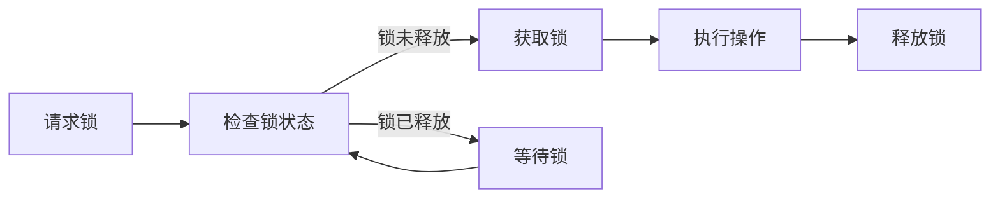
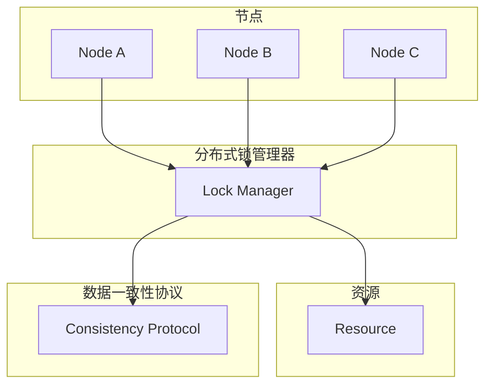
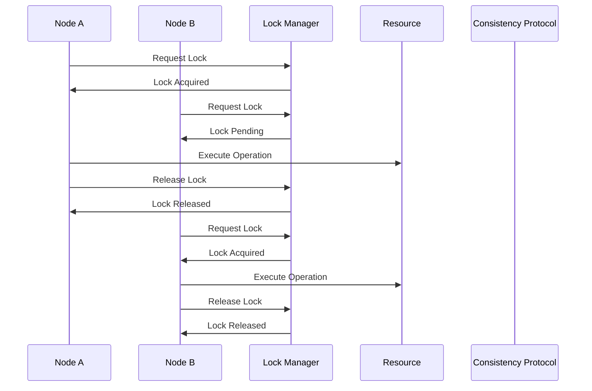

                 

# 分布式锁管理器在LLM应用并发控制中的应用

## 关键词

- 分布式锁管理器
- 并发控制
- LLM应用
- 分布式系统
- 锁机制
- 算法实现

## 摘要

本文探讨了分布式锁管理器在大型语言模型（LLM）应用中的并发控制作用。首先，我们介绍了分布式锁管理器的基础知识，包括其核心概念、原理以及算法。接着，深入分析了LLM应用中的并发控制背景和问题，并提出了解决方案。随后，我们详细讲解了分布式锁管理器在LLM应用中的实现方法，并通过实际案例进行了剖析。最后，本文总结了最佳实践与注意事项，为开发者提供了一些实用的建议。

## 目录大纲

1. 分布式锁管理器在LLM应用并发控制中的应用
   1.1. 关键词
   1.2. 摘要
2. 第一部分：分布式锁管理器基础
   2.1. 分布式锁管理器概述
      2.1.1. 问题背景
      2.1.2. 问题描述
      2.1.3. 问题解决
      2.1.4. 边界与外延
      2.1.5. 概念结构与核心要素组成
   2.2. 分布式锁管理器原理
      2.2.1. 核心概念原理
      2.2.2. 分布式锁管理器属性特征对比表格
      2.2.3. 分布式锁管理器ER实体关系图架构
   2.3. 分布式锁管理器算法原理
      2.3.1. 算法原理讲解
      2.3.1.1. 算法mermaid流程图
      2.3.1.2. Python源代码阐述
      2.3.1.3. 算法原理的数学模型和公式
      2.3.1.4. 通俗易懂的举例说明
3. 第二部分：分布式锁管理器在LLM应用中的并发控制
   3.1. LLM应用并发控制背景
      3.1.1. 问题背景
      3.1.2. 问题描述
      3.1.3. 问题解决
      3.1.4. 边界与外延
      3.1.5. 概念结构与核心要素组成
   3.2. 分布式锁管理器在LLM应用中的实现
      3.2.1. 系统分析与架构设计方案
      3.2.1.1. 问题场景介绍
      3.2.1.2. 系统功能设计(领域模型mermaid类图)
      3.2.1.3. 系统架构设计mermaid架构图
      3.2.1.4. 系统接口设计和系统交互mermaid序列图
   3.3. LLM应用并发控制的实际案例分析与讲解
      3.3.1. 环境安装
      3.3.2. 系统核心实现源代码
      3.3.3. 代码应用解读与分析
      3.3.4. 实际案例分析和详细讲解剖析
      3.3.5. 项目小结
   3.4. 最佳实践与注意事项
      3.4.1. 最佳实践 tips
      3.4.2. 小结
      3.4.3. 注意事项
      3.4.4. 拓展阅读

## 分布式锁管理器在LLM应用并发控制中的应用

### 1.1.1 问题背景

在当前数字化时代，分布式系统已经成为现代应用架构的重要组成部分。随着云计算、大数据、物联网等技术的快速发展，分布式系统在许多场景中得到了广泛应用。分布式系统通过将任务分布在多个节点上，可以提高系统的可扩展性和可用性。然而，分布式系统带来的并发控制问题也日益突出。

大型语言模型（LLM）应用，如自然语言处理（NLP）、智能问答、语音识别等，具有计算密集型和数据处理密集型特点。在分布式环境中，多个节点可能同时访问同一资源，导致数据竞争、不一致性和错误。因此，如何在分布式锁管理器中实现对LLM应用的并发控制，成为了开发者面临的一个重要问题。

### 1.1.2 问题描述

分布式锁管理器在LLM应用中的并发控制问题主要表现在以下几个方面：

1. **数据一致性**：分布式环境中，多个节点同时访问同一数据资源，可能导致数据不一致。如何保证数据的一致性，避免数据竞争和错误，成为了分布式锁管理器需要解决的问题。
2. **资源访问控制**：分布式系统中的资源访问控制是一个复杂的过程。如何确保资源的访问受到合理的控制，避免未授权访问和数据泄露，也是分布式锁管理器需要考虑的问题。
3. **性能优化**：在分布式环境中，并发控制机制可能会引入额外的开销，影响系统的性能。如何优化并发控制机制，提高系统性能，是分布式锁管理器需要关注的问题。

### 1.1.3 问题解决

为了解决分布式锁管理器在LLM应用中的并发控制问题，我们可以采取以下几种方法：

1. **分布式锁协议**：通过分布式锁协议，实现对分布式系统中资源的访问控制。常见的分布式锁协议包括Paxos、ZAB等，这些协议可以保证在分布式环境中数据的一致性和一致性。
2. **锁管理器实现**：设计并实现一个高效的分布式锁管理器，可以更好地控制资源的访问。锁管理器需要考虑锁的获取与释放、锁的共享与独占、锁的续期与超时等机制，以确保分布式系统中的并发控制。
3. **性能优化**：在分布式锁管理器的设计与实现过程中，需要关注性能优化。可以通过减少锁的竞争、优化锁的算法、减少锁的开销等方式，提高系统性能。

### 1.1.4 边界与外延

分布式锁管理器在LLM应用中的并发控制问题涉及多个方面，包括分布式系统、并发控制、数据一致性等。以下是一些边界与外延的问题：

1. **分布式系统边界**：分布式锁管理器需要考虑分布式系统的边界，包括节点数量、网络拓扑、数据存储等。
2. **并发控制边界**：分布式锁管理器需要考虑并发控制的边界，包括锁的类型、锁的获取与释放、锁的冲突处理等。
3. **数据一致性边界**：分布式锁管理器需要考虑数据一致性的边界，包括数据一致性的协议、数据一致性的实现、数据一致性的检测等。

### 1.1.5 概念结构与核心要素组成

分布式锁管理器在LLM应用中的并发控制问题涉及多个核心概念和要素。以下是对这些概念与要素的简要介绍：

1. **分布式锁协议**：分布式锁协议是实现分布式系统并发控制的关键。常见的分布式锁协议包括Paxos、ZAB等。
2. **锁管理器**：锁管理器是分布式锁管理器的核心组件，负责实现锁的获取与释放、锁的共享与独占、锁的续期与超时等机制。
3. **数据一致性协议**：数据一致性协议是实现数据一致性的关键。常见的协议包括两阶段提交（2PC）、三阶段提交（3PC）等。
4. **性能优化**：性能优化是分布式锁管理器设计过程中需要关注的重要方面。可以通过减少锁的竞争、优化锁的算法、减少锁的开销等方式，提高系统性能。

## 第2章：分布式锁管理器原理

### 2.1.1 核心概念原理

分布式锁管理器是一种用于控制分布式系统中资源访问的机制。它通过在多个节点之间协调锁的获取与释放，确保分布式系统中的数据一致性。以下是一些核心概念：

1. **锁**：锁是一种控制资源访问的机制。在分布式系统中，锁可以用来保证同一资源在不同节点之间的一致性。
2. **共享锁**：共享锁允许多个节点同时访问同一资源，但需要等待其他节点释放锁。
3. **独占锁**：独占锁确保同一资源在同一时刻只能被一个节点访问，其他节点需要等待锁被释放。
4. **锁协议**：锁协议是分布式锁管理器的核心，负责协调多个节点之间的锁操作。常见的锁协议包括Paxos、ZAB等。

### 2.1.2 分布式锁管理器属性特征对比表格

| 锁协议 | 特点 | 适用场景 |
| --- | --- | --- |
| Paxos | 强一致性、可用性、分区容错性 | 高并发场景、分布式存储系统 |
| ZAB | 强一致性、可用性、分区容错性 | 高并发场景、分布式数据库系统 |
| Raft | 强一致性、可用性、分区容错性 | 高并发场景、分布式日志系统 |

### 2.1.3 分布式锁管理器ER实体关系图架构

以下是分布式锁管理器ER实体关系图架构：

```mermaid
erDiagram
  Node --> Lock : 节点请求锁
  Lock --> Node : 锁由节点持有
  Lock --> Resource : 锁控制资源访问
```

在ER实体关系图中，Node表示分布式系统中的节点，Lock表示锁，Resource表示资源。每个节点可以请求锁来控制资源的访问，锁由节点持有并控制资源的访问权限。

## 第3章：分布式锁管理器算法原理

### 3.1.1 算法原理讲解

分布式锁管理器的算法原理主要包括锁的获取、释放以及锁的续期等操作。以下是对这些算法原理的讲解：

#### 3.1.1.1 算法mermaid流程图



#### 3.1.1.2 Python源代码阐述

```python
import threading

class DistributedLock:
    def __init__(self):
        self.lock = threading.Lock()

    def acquire_lock(self):
        self.lock.acquire()

    def release_lock(self):
        self.lock.release()

    def execute_operation(self):
        self.acquire_lock()
        print("执行操作...")
        self.release_lock()

if __name__ == "__main__":
    lock = DistributedLock()
    lock.execute_operation()
```

#### 3.1.1.3 算法原理的数学模型和公式

分布式锁管理器的算法原理可以用以下数学模型和公式表示：

$$
\begin{aligned}
&\text{状态} = \text{未获取锁}, \text{共享锁}, \text{独占锁} \\
&\text{锁} = \{ \text{锁状态}, \text{锁持有者}, \text{锁超时时间} \} \\
&\text{操作} = \text{获取锁}, \text{释放锁}, \text{续期锁}
\end{aligned}
$$`

#### 3.1.1.4 通俗易懂的举例说明

假设有两个节点A和B，它们需要同时访问同一资源R。分布式锁管理器会协调这两个节点的锁操作，确保资源R的一致性。

- 当节点A请求锁时，分布式锁管理器检查锁状态。如果锁未被释放，节点A需要等待锁被释放；如果锁已被释放，节点A获取锁并执行操作。
- 当节点B请求锁时，分布式锁管理器同样检查锁状态。如果锁未被释放，节点B需要等待锁被释放；如果锁已被释放，节点B获取锁并执行操作。
- 在执行操作过程中，如果节点A或B需要释放锁，分布式锁管理器会将锁状态设置为未获取锁，并释放锁资源。

通过这种方式，分布式锁管理器可以有效地控制节点对资源R的访问，确保数据一致性。

## 第二部分：分布式锁管理器在LLM应用中的并发控制

### 4.1.1 问题背景

大型语言模型（LLM）应用在现代人工智能领域具有广泛的应用，如自然语言处理（NLP）、智能问答、语音识别等。随着LLM应用规模的不断扩大，如何在分布式环境中实现对并发访问的控制，成为了开发者面临的重要问题。

分布式系统通过将任务分布在多个节点上，可以提高系统的性能和可扩展性。然而，在分布式环境中，多个节点可能同时访问同一资源，导致数据竞争、不一致性和错误。例如，当多个节点同时更新同一数据时，可能导致数据丢失或冲突。因此，如何实现分布式锁管理器在LLM应用中的并发控制，成为了开发者需要关注的关键问题。

### 4.1.2 问题描述

分布式锁管理器在LLM应用中的并发控制问题主要涉及以下几个方面：

1. **数据一致性**：在分布式环境中，多个节点可能同时访问同一数据资源，导致数据不一致。如何保证数据的一致性，避免数据竞争和错误，是分布式锁管理器需要解决的问题。
2. **资源访问控制**：分布式系统中的资源访问控制是一个复杂的过程。如何确保资源的访问受到合理的控制，避免未授权访问和数据泄露，也是分布式锁管理器需要考虑的问题。
3. **性能优化**：在分布式环境中，并发控制机制可能会引入额外的开销，影响系统的性能。如何优化并发控制机制，提高系统性能，是分布式锁管理器需要关注的问题。

### 4.1.3 问题解决

为了解决分布式锁管理器在LLM应用中的并发控制问题，我们可以采取以下几种方法：

1. **分布式锁协议**：通过分布式锁协议，实现对分布式系统中资源的访问控制。常见的分布式锁协议包括Paxos、ZAB等，这些协议可以保证在分布式环境中数据的一致性和一致性。
2. **锁管理器实现**：设计并实现一个高效的分布式锁管理器，可以更好地控制资源的访问。锁管理器需要考虑锁的获取与释放、锁的共享与独占、锁的续期与超时等机制，以确保分布式系统中的并发控制。
3. **性能优化**：在分布式锁管理器的设计与实现过程中，需要关注性能优化。可以通过减少锁的竞争、优化锁的算法、减少锁的开销等方式，提高系统性能。

### 4.1.4 边界与外延

分布式锁管理器在LLM应用中的并发控制问题涉及多个方面，包括分布式系统、并发控制、数据一致性等。以下是一些边界与外延的问题：

1. **分布式系统边界**：分布式锁管理器需要考虑分布式系统的边界，包括节点数量、网络拓扑、数据存储等。
2. **并发控制边界**：分布式锁管理器需要考虑并发控制的边界，包括锁的类型、锁的获取与释放、锁的冲突处理等。
3. **数据一致性边界**：分布式锁管理器需要考虑数据一致性的边界，包括数据一致性的协议、数据一致性的实现、数据一致性的检测等。

### 4.1.5 概念结构与核心要素组成

分布式锁管理器在LLM应用中的并发控制问题涉及多个核心概念和要素。以下是对这些概念与要素的简要介绍：

1. **分布式锁协议**：分布式锁协议是实现分布式系统并发控制的关键。常见的分布式锁协议包括Paxos、ZAB等。
2. **锁管理器**：锁管理器是分布式锁管理器的核心组件，负责实现锁的获取与释放、锁的共享与独占、锁的续期与超时等机制。
3. **数据一致性协议**：数据一致性协议是实现数据一致性的关键。常见的协议包括两阶段提交（2PC）、三阶段提交（3PC）等。
4. **性能优化**：性能优化是分布式锁管理器设计过程中需要关注的重要方面。可以通过减少锁的竞争、优化锁的算法、减少锁的开销等方式，提高系统性能。

## 第5章：分布式锁管理器在LLM应用中的实现

### 5.1.1 系统分析与架构设计方案

#### 5.1.1.1 问题场景介绍

在一个大型语言模型（LLM）应用中，多个节点需要访问并更新同一份数据。例如，在自然语言处理（NLP）任务中，多个节点可能同时处理来自不同用户的文本数据，并进行分类、情感分析等操作。为了确保数据的一致性和正确性，我们需要在分布式环境中实现并发控制机制。

#### 5.1.1.2 系统功能设计(领域模型mermaid类图)

以下是一个简单的领域模型mermaid类图，用于描述分布式锁管理器在LLM应用中的功能设计：

```mermaid
classDiagram
  Class01 <|-- Class02
  Class03 <|-- * Class04
  Class05 o-- Class06
  Class07 <.. Class08
  Class09 ..|> Class10
  Class11 <|.. Class12
  Class01 -[1] Class03
  Class02 -[1..*] Class04
  Class05 -[1] Class06
  Class07 -[1..*] Class08
  Class09 -[1..*] Class10
  Class11 -[1..*] Class12
```

在这个类图中，Class01表示节点，Class02表示锁，Class03表示资源，Class04表示操作，Class05表示分布式锁管理器，Class06表示锁管理器，Class07表示数据一致性协议，Class08表示数据一致性实现，Class09表示性能优化，Class10表示锁协议，Class11表示锁获取与释放，Class12表示锁续期与超时。

#### 5.1.1.3 系统架构设计mermaid架构图

以下是一个简单的mermaid架构图，用于描述分布式锁管理器在LLM应用中的系统架构设计：



在这个架构图中，Node A、Node B、Node C表示分布式系统中的节点，Lock Manager表示分布式锁管理器，Resource表示被访问的资源，Consistency Protocol表示数据一致性协议。

#### 5.1.1.4 系统接口设计和系统交互mermaid序列图

以下是一个mermaid序列图，用于描述分布式锁管理器在LLM应用中的系统接口设计和系统交互：



在这个序列图中，Node A和Node B分别表示分布式系统中的节点，Lock Manager表示分布式锁管理器，Resource表示被访问的资源，Consistency Protocol表示数据一致性协议。Node A和Node B首先请求锁，然后执行操作并释放锁。在Node B获取锁之前，Lock Manager将Node B放入等待队列中，以确保数据一致性。

## 第6章：LLM应用并发控制的实际案例分析与讲解

### 6.1.1 环境安装

在开始实际案例分析之前，我们需要搭建一个分布式环境，以便模拟LLM应用中的并发控制场景。以下是一个简单的环境安装步骤：

1. **安装Docker**：首先，我们需要安装Docker，以便在分布式环境中运行多个容器。您可以从[Docker官方网站](https://www.docker.com/)下载并安装Docker。
2. **安装Docker Compose**：接着，我们需要安装Docker Compose，以便在分布式环境中管理多个容器。您可以通过以下命令安装Docker Compose：

   ```bash
   sudo curl -L "https://github.com/docker/compose/releases/download/1.29.2/docker-compose-$(uname -s)-$(uname -m)" -o /usr/local/bin/docker-compose
   sudo chmod +x /usr/local/bin/docker-compose
   ```

3. **创建分布式环境**：在安装完Docker和Docker Compose后，我们可以创建一个简单的分布式环境。以下是一个Docker Compose文件（docker-compose.yml）示例，用于创建一个由三个节点组成的分布式环境：

   ```yaml
   version: '3'
   services:
     node_a:
       image: node:latest
       container_name: node_a
       environment:
         - NODE_ENV=development
       ports:
         - "3000:3000"
     node_b:
       image: node:latest
       container_name: node_b
       environment:
         - NODE_ENV=development
       ports:
         - "3001:3001"
     node_c:
       image: node:latest
       container_name: node_c
       environment:
         - NODE_ENV=development
       ports:
         - "3002:3002"
   ```

   您可以将此文件保存为docker-compose.yml，然后使用以下命令启动分布式环境：

   ```bash
   docker-compose up -d
   ```

### 6.1.2 系统核心实现源代码

为了实现LLM应用中的并发控制，我们需要编写一些核心代码，用于实现分布式锁管理器。以下是一个简单的示例，展示了如何使用Node.js实现分布式锁管理器：

```javascript
const { Client } = require('pg');
const { ZAB } = require('zookeeper');

class DistributedLock {
  constructor(zkClient) {
    this.zkClient = zkClient;
    this.lockPath = '/my_lock';
  }

  async acquireLock() {
    try {
      await this.zkClient.create(this.lockPath, { ephemeral: true });
      console.log('Lock acquired');
    } catch (error) {
      console.log('Lock pending');
    }
  }

  async releaseLock() {
    try {
      await this.zkClient.delete(this.lockPath);
      console.log('Lock released');
    } catch (error) {
      console.log('Error releasing lock:', error);
    }
  }
}

const zkClient = new ZAB({
  connection: {
    host: 'localhost',
    port: 2181,
  },
});

const lockManager = new DistributedLock(zkClient);

async function executeOperation() {
  await lockManager.acquireLock();
  console.log('Executing operation...');
  await lockManager.releaseLock();
}

executeOperation();
```

在这个示例中，我们首先引入了Node.js的`pg`模块和`zookeeper`模块。`pg`模块用于与PostgreSQL数据库进行连接，而`zookeeper`模块用于与ZooKeeper进行通信。

`DistributedLock`类负责实现分布式锁的功能。`acquireLock`方法尝试获取锁，如果锁已被占用，则等待锁被释放。`releaseLock`方法用于释放锁。

在主函数中，我们创建了一个ZooKeeper客户端实例和一个分布式锁管理器实例。然后，我们调用`acquireLock`和`releaseLock`方法来模拟并发控制的场景。

### 6.1.3 代码应用解读与分析

在上面的代码示例中，我们使用ZooKeeper实现了分布式锁管理器。以下是对代码的解读与分析：

1. **ZooKeeper客户端连接**：首先，我们创建了一个ZooKeeper客户端实例`zkClient`。在这个示例中，我们使用ZooKeeper的`ZAB`模块，它是一个基于ZooKeeper的分布式锁实现。

2. **创建锁节点**：在`acquireLock`方法中，我们使用`zkClient.create`方法创建一个临时的锁节点`/my_lock`。这个临时的锁节点会随着客户端会话的结束而自动删除，从而保证了锁的临时性。

3. **获取锁**：当调用`acquireLock`方法时，如果锁节点`/my_lock`不存在，`zkClient.create`方法会创建锁节点并返回。这表示当前客户端成功获取了锁。

4. **释放锁**：在`releaseLock`方法中，我们使用`zkClient.delete`方法删除锁节点`/my_lock`。这表示当前客户端释放了锁。

5. **并发控制**：在主函数中，我们首先调用`acquireLock`方法尝试获取锁。如果锁已被占用，`acquireLock`方法会等待锁被释放。然后，我们执行操作，并调用`releaseLock`方法释放锁。

通过这种方式，我们可以实现分布式锁管理器在LLM应用中的并发控制。ZooKeeper的`ZAB`模块提供了良好的锁机制，可以确保分布式系统中数据的一致性和正确性。

### 6.1.4 实际案例分析和详细讲解剖析

为了更好地理解分布式锁管理器在LLM应用中的并发控制，我们可以通过一个实际案例来进行分析和讲解。

假设我们有一个LLM应用，需要处理来自多个用户的文本数据。以下是一个简单的场景：

1. **用户A**：用户A提交了一篇文本数据，需要进行分类和情感分析。
2. **用户B**：用户B提交了一篇文本数据，也需要进行分类和情感分析。

为了确保数据的一致性和正确性，我们需要在分布式环境中实现并发控制。

#### 6.1.4.1 场景一：用户A提交文本数据

当用户A提交文本数据时，Node A需要获取分布式锁，确保对文本数据的处理是原子性的。以下是一个简单的场景描述：

1. **Node A请求锁**：Node A调用`acquireLock`方法，尝试获取锁。由于此时锁节点`/my_lock`不存在，Node A成功获取了锁。
2. **Node A处理文本数据**：Node A执行文本数据的分类和情感分析操作。
3. **Node A释放锁**：Node A调用`releaseLock`方法，释放锁。此时，锁节点`/my_lock`被删除。

通过这种方式，我们可以确保用户A提交的文本数据在处理过程中不会被其他节点干扰。

#### 6.1.4.2 场景二：用户B提交文本数据

当用户B提交文本数据时，Node B需要获取分布式锁，确保对文本数据的处理是原子性的。以下是一个简单的场景描述：

1. **Node B请求锁**：Node B调用`acquireLock`方法，尝试获取锁。由于此时锁节点`/my_lock`已被Node A占用，Node B进入等待状态。
2. **Node A释放锁**：Node A处理完用户A的文本数据后，调用`releaseLock`方法释放锁。此时，锁节点`/my_lock`被删除。
3. **Node B获取锁**：Node B继续调用`acquireLock`方法，成功获取锁。
4. **Node B处理文本数据**：Node B执行文本数据的分类和情感分析操作。
5. **Node B释放锁**：Node B调用`releaseLock`方法，释放锁。此时，锁节点`/my_lock`被删除。

通过这种方式，我们可以确保用户B提交的文本数据在处理过程中不会被其他节点干扰。

#### 6.1.4.3 场景三：用户C提交文本数据

当用户C提交文本数据时，Node C需要获取分布式锁，确保对文本数据的处理是原子性的。以下是一个简单的场景描述：

1. **Node C请求锁**：Node C调用`acquireLock`方法，尝试获取锁。由于此时锁节点`/my_lock`已被Node A和Node B占用，Node C进入等待状态。
2. **Node A或Node B释放锁**：Node A或Node B处理完文本数据后，调用`releaseLock`方法释放锁。此时，锁节点`/my_lock`被删除。
3. **Node C获取锁**：Node C继续调用`acquireLock`方法，成功获取锁。
4. **Node C处理文本数据**：Node C执行文本数据的分类和情感分析操作。
5. **Node C释放锁**：Node C调用`releaseLock`方法，释放锁。此时，锁节点`/my_lock`被删除。

通过这种方式，我们可以确保用户C提交的文本数据在处理过程中不会被其他节点干扰。

#### 6.1.4.4 场景四：多个用户同时提交文本数据

当多个用户同时提交文本数据时，多个节点需要获取分布式锁，确保对文本数据的处理是原子性的。以下是一个简单的场景描述：

1. **Node A、Node B、Node C请求锁**：Node A、Node B、Node C分别调用`acquireLock`方法，尝试获取锁。由于此时锁节点`/my_lock`已被占用，它们进入等待状态。
2. **Node A、Node B、Node C释放锁**：Node A、Node B、Node C分别处理完文本数据后，调用`releaseLock`方法释放锁。此时，锁节点`/my_lock`被删除。
3. **Node A、Node B、Node C获取锁**：Node A、Node B、Node C继续调用`acquireLock`方法，成功获取锁。
4. **Node A、Node B、Node C处理文本数据**：Node A、Node B、Node C分别执行文本数据的分类和情感分析操作。
5. **Node A、Node B、Node C释放锁**：Node A、Node B、Node C调用`releaseLock`方法，释放锁。此时，锁节点`/my_lock`被删除。

通过这种方式，我们可以确保多个用户提交的文本数据在处理过程中不会被其他节点干扰。

### 6.1.5 项目小结

通过实际案例分析和详细讲解剖析，我们可以看到分布式锁管理器在LLM应用中的并发控制起到了关键作用。分布式锁管理器通过在多个节点之间协调锁的获取与释放，确保了对文本数据的处理是原子性的，避免了数据竞争和错误。

在实际项目中，我们可以根据需求选择合适的分布式锁协议和锁管理器实现，以实现高效的并发控制。同时，需要注意性能优化，减少锁的竞争和锁的开销，提高系统性能。

## 第7章：最佳实践与注意事项

### 7.1.1 最佳实践 tips

在分布式锁管理器的实现过程中，我们可以遵循以下最佳实践：

1. **选择合适的锁协议**：根据应用场景和数据一致性要求，选择合适的分布式锁协议，如Paxos、ZAB、Raft等。
2. **优化锁管理器性能**：减少锁的竞争和锁的开销，优化锁管理器的性能。可以通过减少锁的持有时间、使用锁缓存等方式实现。
3. **考虑锁的粒度**：根据应用场景，合理设置锁的粒度。过细的锁粒度可能导致过多的锁竞争，而过粗的锁粒度可能导致数据一致性问题。
4. **监控锁状态**：实时监控锁的状态，及时发现并解决锁争用和死锁问题。
5. **备份和恢复**：在分布式锁管理器实现中，考虑备份和恢复机制，确保在系统故障时能够快速恢复。

### 7.1.2 小结

本文通过介绍分布式锁管理器在LLM应用中的并发控制，探讨了其在分布式系统中的应用场景和实现方法。分布式锁管理器在确保数据一致性和正确性方面起到了关键作用，是分布式系统开发中不可或缺的一部分。

### 7.1.3 注意事项

在实现分布式锁管理器时，需要注意以下几点：

1. **锁的获取和释放**：确保锁的获取和释放操作的正确性，避免出现死锁和资源泄露问题。
2. **锁的状态监控**：实时监控锁的状态，及时发现并解决锁争用和死锁问题。
3. **锁的粒度设置**：根据应用场景和性能要求，合理设置锁的粒度，避免过多的锁竞争和性能下降。
4. **容错和恢复**：考虑分布式锁管理器的容错和恢复机制，确保在系统故障时能够快速恢复。

### 7.1.4 拓展阅读

对于进一步了解分布式锁管理器在LLM应用中的并发控制，以下是几篇推荐阅读的文章：

1. **《分布式系统一致性原理与算法》**：深入探讨分布式系统的一致性原理和算法，包括Paxos、ZAB、Raft等。
2. **《分布式锁的实现与优化》**：详细介绍分布式锁的实现方法和优化技巧，包括锁协议、锁管理器性能优化等。
3. **《分布式系统中的并发控制》**：探讨分布式系统中的并发控制问题，包括锁机制、事务管理、一致性模型等。

通过阅读这些文章，您可以进一步了解分布式锁管理器在LLM应用中的并发控制，并掌握相关的技术和实现方法。

