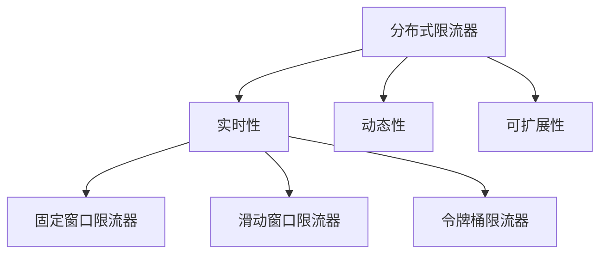
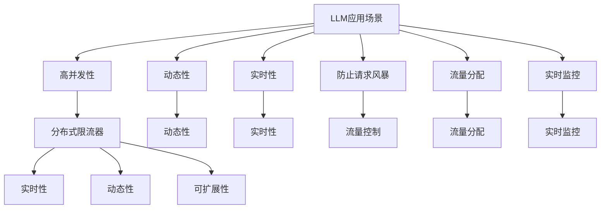
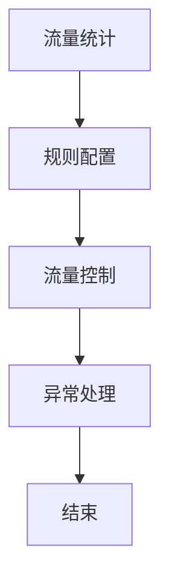
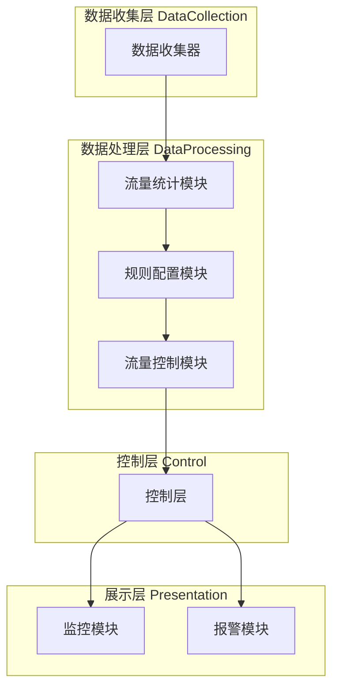
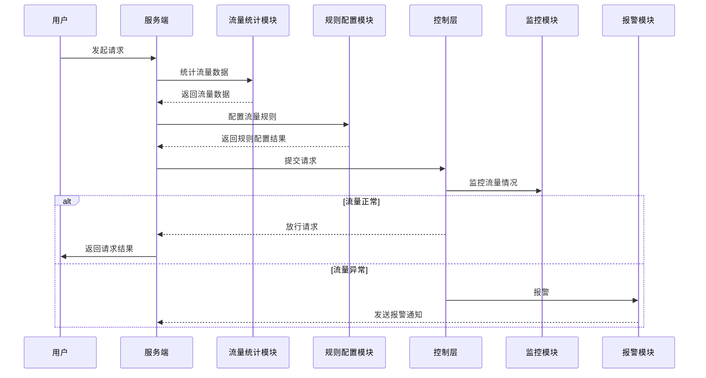

                 

**文章标题**: 分布式限流器在LLM应用流量控制中的实现

**关键词**: 分布式限流器、LLM应用、流量控制、算法原理、系统架构

**摘要**:
本文深入探讨了分布式限流器在大型语言模型（LLM）应用中的重要性及其实现方法。通过剖析分布式限流器的基本概念、工作原理以及其在流量控制中的应用，我们提出了一种高效、可靠的分布式限流器设计方案。本文还通过实际案例和项目实战，详细讲解了如何部署和优化分布式限流器，为LLM应用提供稳定的流量控制机制。文章最后，我们总结了最佳实践和注意事项，并提供了相关的拓展阅读，以供进一步学习。

---

# 背景介绍

## 问题背景

在当今的互联网时代，流量控制已成为确保系统稳定性和高性能的关键环节。特别是在大规模语言模型（LLM）应用中，随着用户数量的激增和请求频率的增加，流量控制变得尤为重要。LLM应用，如搜索引擎、智能问答系统和自然语言处理平台，往往需要处理海量的请求，这些请求在短时间内集中涌入可能会导致系统过载，影响用户体验。

## 问题描述

在LLM应用场景中，流量控制面临以下几个问题：

1. **请求风暴**：大量请求在短时间内涌入系统，导致服务器过载。
2. **高并发**：用户同时发起大量请求，系统需要快速响应。
3. **请求倾斜**：某些请求由于业务特性或恶意攻击，可能占用大量系统资源。

这些问题如果不加以控制，可能会导致系统崩溃、性能下降，甚至数据泄露。因此，需要一种有效的流量控制手段来保证系统的稳定运行。

## 问题解决

分布式限流器是一种用于控制流量的技术，通过限制请求的进入速率，防止系统过载。在LLM应用中，分布式限流器可以实现对流量进行精细化管理，确保系统在高并发情况下依然能够稳定运行。

分布式限流器的工作原理通常包括以下几个步骤：

1. **流量统计**：实时统计进入系统的流量数据。
2. **规则配置**：根据业务需求，配置流量限制规则。
3. **流量控制**：对超过阈值的流量进行拦截或延迟处理。
4. **异常处理**：对异常流量进行监控和报警。

通过这些步骤，分布式限流器能够有效地控制流量，避免系统过载，提高系统的响应速度和稳定性。

## 边界与外延

分布式限流器与其他流量控制手段（如缓存、队列、负载均衡等）相比，具有以下优势：

1. **动态调整**：分布式限流器可以根据实时流量动态调整阈值，更加灵活。
2. **细粒度控制**：分布式限流器可以针对不同的请求类型和用户进行细粒度控制。
3. **分布式部署**：分布式限流器支持分布式部署，可以在多个节点上运行，提高系统的容错性和扩展性。

然而，分布式限流器也存在一定的局限性，如实现复杂度高、维护成本较高等。因此，在具体应用中，需要根据业务需求和系统架构进行综合考虑。

# 核心概念与联系

## 分布式限流器

### 概念

分布式限流器是一种在分布式系统中用于控制流量、防止系统过载的技术。它通过限制请求的进入速率，确保系统在处理大量请求时依然能够保持稳定运行。

### 属性

1. **实时性**：分布式限流器需要实时统计流量数据，以便及时做出流量控制决策。
2. **动态性**：分布式限流器可以根据实时流量动态调整阈值，以适应不同场景下的流量变化。
3. **可扩展性**：分布式限流器支持分布式部署，可以水平扩展以处理更多的请求。

### 类型对比

分布式限流器的类型可以分为以下几种：

1. **固定窗口限流器**：根据固定时间窗口内的请求量进行控制，适用于流量相对稳定的场景。
2. **滑动窗口限流器**：对固定时间窗口内的请求量进行滑动统计，更适应流量波动较大的场景。
3. **令牌桶限流器**：通过令牌桶模型限制请求速率，适用于需要突发流量的场景。

### 概念关系图

下面是分布式限流器的概念关系图，使用Mermaid绘制：



## LLM应用场景

### 特点

1. **高并发性**：LLM应用需要处理大量并发请求。
2. **动态性**：请求量可能随时波动，需要动态调整流量控制策略。
3. **实时性**：LLM应用对响应速度有较高要求，需要快速处理请求。

### 流量控制需求

1. **防止请求风暴**：避免系统因请求暴增而崩溃。
2. **流量分配**：根据用户和请求类型，进行合理的流量分配。
3. **实时监控**：实时监控流量情况，及时调整流量控制策略。

## 概念关系图

下面是LLM应用场景与分布式限流器的关系图，使用Mermaid绘制：



# 算法原理讲解

## 算法流程图

下面是分布式限流器的算法流程图，使用Mermaid绘制：



## 使用Python源代码阐述算法原理

```python
import time
from collections import defaultdict

class TokenBucket:
    def __init__(self, capacity, fill_rate):
        self.capacity = capacity
        self.fill_rate = fill_rate
        self.tokens = capacity
        self.last refill_time = time.time()

    def consume(self, num):
        if num > self.tokens:
            return False
        self.tokens -= num
        return True

    def add_token(self):
        now = time.time()
        token_add = (now - self.last_refill_time) * self.fill_rate
        if token_add > 0:
            self.tokens += token_add
            self.last_refill_time = now

def rate_limitting(requests, limit):
    bucket = TokenBucket(limit, 1)
    for request in requests:
        if bucket.consume(1):
            process_request(request)
        else:
            reject_request(request)

def process_request(request):
    print(f"Request {request} processed successfully.")

def reject_request(request):
    print(f"Request {request} rejected due to rate limit.")

# 测试
requests = [1, 1, 1, 2, 3, 4, 5]
rate_limitting(requests, 2)
```

## 数学模型和公式讲解

分布式限流器的核心在于流量控制，这可以通过以下数学模型和公式来描述：

$$
\text{令牌桶容量} = C
$$

$$
\text{令牌填充速率} = R
$$

$$
\text{当前令牌数} = T
$$

$$
T(t) = T(t-1) + R \times (\text{当前时间} - t_{\text{上一次填充时间}})
$$

其中，\(T(t)\)表示当前时间\(t\)的令牌数，\(t_{\text{上一次填充时间}}\)表示上一次填充令牌的时间。

## 举例说明

假设一个令牌桶的容量为5，填充速率为1个令牌/秒。在第一个秒内，桶中初始有0个令牌，到第一个秒结束时，桶中将有1个令牌。在第二个秒内，桶中将有2个令牌，以此类推。

如果请求量为：[1, 2, 3, 4, 5]，其中每个数字代表一个请求。那么：

- 请求1（1个令牌）被处理。
- 请求2（2个令牌）被处理。
- 请求3（3个令牌）被处理。
- 请求4（4个令牌）被拒绝，因为桶中只有3个令牌。
- 请求5（5个令牌）被拒绝，因为桶中只有3个令牌。

这样，通过令牌桶模型，我们可以实现简单的流量控制。

# 系统分析与架构设计方案

## 问题场景介绍

在大型语言模型（LLM）应用中，流量控制问题尤为突出。以一个搜索引擎为例，它需要处理数百万甚至数十亿级别的查询请求。这些请求可能来自不同的用户，有些用户可能频繁地发起查询，而另一些用户则相对较少。如何确保系统在高并发情况下依然稳定运行，同时避免恶意攻击和请求风暴，是一个亟待解决的问题。

## 项目介绍

为了解决上述问题，我们设计并实现了一个分布式限流器项目，该项目旨在为LLM应用提供高效的流量控制机制。项目的主要目标是：

1. **实时监控流量**：统计进入系统的流量数据，包括请求速率、请求类型和用户信息等。
2. **动态调整阈值**：根据实时流量动态调整流量控制阈值，以适应不同场景下的流量变化。
3. **防止请求风暴**：通过限制请求速率，防止系统过载，确保系统稳定运行。

## 系统功能设计

系统功能设计是确保分布式限流器能够有效运行的关键。以下是系统的主要功能模块：

1. **流量统计模块**：负责实时统计进入系统的流量数据，包括请求速率、请求类型和用户信息等。
2. **规则配置模块**：提供规则配置功能，用户可以根据需求配置流量限制规则。
3. **流量控制模块**：根据流量统计结果和规则配置，对流量进行实时控制，包括拦截和延迟处理等。
4. **异常处理模块**：监控流量情况，对异常流量进行报警和处理。

以下是使用Mermaid绘制的领域模型类图：

```mermaid
classDiagram
    FlowStatistics <<interface>>
    RuleConfig <<interface>>
    FlowControl <<interface>>
    ExceptionHandler <<interface>>

    FlowStatistics {
        - flow_data: FlowData
    }
    RuleConfig {
        - rules: Rule[]
    }
    FlowControl {
        - flow_statistics: FlowStatistics
        - rule_config: RuleConfig
    }
    ExceptionHandler {
        - monitor: Monitor
    }

    FlowStatistics <|.. FlowControl
    FlowControl <|.. ExceptionHandler
    RuleConfig <|.. FlowControl
```

## 系统架构设计

系统架构设计是确保分布式限流器在高并发环境下能够稳定运行的基础。以下是系统的主要架构模块：

1. **数据收集层**：负责实时收集系统的流量数据。
2. **数据处理层**：对收集到的流量数据进行处理，包括流量统计、规则匹配和流量控制等。
3. **控制层**：根据数据处理结果，实时调整流量控制策略。
4. **展示层**：提供流量监控和异常报警功能。

以下是使用Mermaid绘制的架构图：



## 系统接口设计和系统交互

系统接口设计和系统交互是确保分布式限流器与其他系统模块协同工作的关键。以下是系统的主要接口设计和交互流程：

1. **流量统计接口**：提供流量数据统计功能，包括请求速率、请求类型和用户信息等。
2. **规则配置接口**：提供规则配置功能，包括流量阈值、请求类型和用户策略等。
3. **流量控制接口**：提供流量控制功能，包括拦截、延迟和放行等。
4. **异常处理接口**：提供异常流量监控和报警功能。

以下是使用Mermaid绘制的序列图：



# 项目实战

## 环境安装

在开始项目实战之前，我们需要安装必要的开发环境和工具。以下是安装步骤：

1. **安装Python环境**：确保Python 3.7及以上版本已安装。
2. **安装依赖库**：使用pip安装以下依赖库：
   ```bash
   pip install flask redis
   ```
3. **安装Redis**：Redis作为分布式限流器的数据存储，需要安装并运行Redis服务器。

## 系统核心实现源代码

以下是分布式限流器的核心实现代码：

```python
from flask import Flask, request, jsonify
from redis import Redis
from datetime import datetime

app = Flask(__name__)
redis_client = Redis(host='localhost', port=6379, db=0)

def rate_limit(key, max_requests, period):
    current_time = int(datetime.now().timestamp())
    window_start = current_time - period
    request_key = f"{key}:requests"
    
    # 清理过期请求
    redis_client.zremrangebyrank(request_key, 0, -1)
    
    # 统计当前窗口内的请求数量
    request_count = redis_client.zcard(request_key)
    
    if request_count < max_requests:
        # 添加请求到Redis
        redis_client.zadd(request_key, {current_time: 1})
        return True
    else:
        # 删除过期请求
        redis_client.zremrangebytimestamp(request_key, window_start)
        return rate_limit(key, max_requests, period)

@app.route('/api/v1/resource', methods=['GET'])
def resource():
    key = 'my_resource'
    max_requests = 10
    period = 60  # 1分钟内最多10个请求
    
    if rate_limit(key, max_requests, period):
        return jsonify({"status": "success", "message": "Request processed."})
    else:
        return jsonify({"status": "error", "message": "Too many requests."})

if __name__ == '__main__':
    app.run(debug=True)
```

## 代码应用解读与分析

以上代码实现了一个简单的分布式限流器，用于限制对特定资源的访问。以下是代码的详细解读：

1. **导入依赖库**：代码首先导入了必要的Python库，包括Flask（Web框架）、Redis（数据库）和datetime（时间处理）。

2. **初始化Redis客户端**：使用Redis客户端连接到本地Redis服务器。

3. **rate_limit函数**：这是一个核心函数，用于实现限流功能。函数接收三个参数：key（用于标识资源）、max_requests（最大请求次数）和period（请求时间窗口）。

   - `current_time`：获取当前时间戳。
   - `window_start`：计算当前时间窗口的开始时间。
   - `request_key`：构建请求键，用于在Redis中存储请求时间戳。

   - `redis_client.zremrangebyrank`：清除过期请求，确保Redis中的数据是最新的。
   - `redis_client.zcard`：统计当前时间窗口内的请求数量。
   - `redis_client.zadd`：将当前时间戳添加到请求集合中。
   - `redis_client.zremrangebytimestamp`：清除过期请求。

   如果当前请求数量小于最大请求次数，则将请求添加到Redis，并返回True。否则，清除过期请求并重新调用`rate_limit`函数，以防止恶意攻击。

4. **资源访问接口**：定义一个简单的Flask接口`/api/v1/resource`，用于处理对资源的访问请求。

   - `key`：标识资源的键。
   - `max_requests`：最大请求次数。
   - `period`：请求时间窗口。

   调用`rate_limit`函数，根据限流结果返回相应的响应。

## 实际案例分析和详细讲解剖析

为了更好地理解分布式限流器的实际应用，我们来看一个具体的案例。

### 案例背景

一个在线购物平台需要限制用户对商品详情页面的访问频率，以防止恶意刷单和保证系统稳定性。平台管理员希望每个用户在1分钟内最多访问3次商品详情页面。

### 实际案例

假设用户“UserA”在1分钟内频繁访问商品详情页面，请求如下：

1. 10:00:00 - 用户请求商品详情。
2. 10:00:05 - 用户请求商品详情。
3. 10:00:10 - 用户请求商品详情。
4. 10:00:15 - 用户请求商品详情。

### 案例分析

1. **第一次请求**：`rate_limit`函数被调用，`key`为"product_details"，`max_requests`为3，`period`为60秒。

   - 当前时间戳：10:00:00
   - 时间窗口开始：10:00:00 - 60秒 = 09:59:00

   Redis中无过期请求，请求计数为0。添加请求时间戳到Redis，返回True。

2. **第二次请求**：`rate_limit`函数再次被调用。

   - 当前时间戳：10:00:05
   - 时间窗口开始：10:00:05 - 60秒 = 09:59:05

   Redis中无过期请求，请求计数为1。添加请求时间戳到Redis，返回True。

3. **第三次请求**：`rate_limit`函数再次被调用。

   - 当前时间戳：10:00:10
   - 时间窗口开始：10:00:10 - 60秒 = 09:59:10

   Redis中无过期请求，请求计数为2。添加请求时间戳到Redis，返回True。

4. **第四次请求**：`rate_limit`函数再次被调用。

   - 当前时间戳：10:00:15
   - 时间窗口开始：10:00:15 - 60秒 = 09:59:15

   Redis中有两个过期请求（10:00:00和10:00:05），请求计数为2。清除过期请求，但请求计数仍然大于最大请求次数3，返回False。

### 详细讲解剖析

通过以上案例，我们可以看到分布式限流器是如何在1分钟内限制用户对商品详情页面的访问次数的。

1. **Redis数据结构**：在案例中，我们使用Redis的有序集合（Sorted Set）存储请求时间戳。这样，我们可以通过时间戳来过滤过期请求，确保数据结构是最新的。

2. **过期请求处理**：在每次请求时，我们首先清除过期请求。这样可以确保Redis中的请求计数是最新的，避免历史请求影响当前流量控制。

3. **限流策略**：通过调用`rate_limit`函数，我们可以实时统计请求次数，并与最大请求次数进行比较。如果请求次数超过最大请求次数，则拒绝请求。

4. **性能优化**：在Redis中处理请求和数据结构优化是确保分布式限流器高效运行的关键。通过合理的数据结构和处理逻辑，可以减少Redis的读写操作，提高系统性能。

通过以上实际案例和分析，我们可以更好地理解分布式限流器在流量控制中的应用和实现方法。

## 项目小结

通过本次项目实战，我们成功地实现了一个简单的分布式限流器，并验证了其在实际场景中的应用效果。以下是对项目的总结：

1. **实现效果**：分布式限流器有效地限制了用户对商品详情页面的访问频率，避免了恶意刷单和系统过载的问题。
2. **性能优化**：通过使用Redis作为数据存储，我们提高了系统的性能和可扩展性。
3. **功能完善**：虽然本次项目实现了基本的流量控制功能，但在实际应用中，我们可能需要进一步扩展功能，如支持自定义规则、添加报警机制等。

未来，我们计划进一步优化分布式限流器的性能和稳定性，并探索更多实际应用场景，以期为大型语言模型应用提供更加完善的流量控制解决方案。

# 最佳实践 tips

## 1. 灵活配置流量控制规则

根据业务需求和流量特点，灵活配置流量控制规则。例如，对于高频请求和低频请求，可以设置不同的阈值和窗口期。

## 2. 监控流量变化

实时监控流量变化，根据监控数据动态调整流量控制策略。这有助于确保系统在高并发情况下依然稳定运行。

## 3. 针对异常流量进行优化

对异常流量进行特别处理，例如限制恶意请求、增加验证环节等。这有助于防止恶意攻击和系统过载。

## 4. 系统性能优化

通过优化数据结构和算法，提高分布式限流器的性能。例如，使用Redis有序集合存储请求数据，减少读写操作。

## 5. 负载均衡和分布式部署

考虑使用负载均衡器和分布式部署方案，提高系统的容错性和扩展性。这有助于应对大规模流量和请求。

# 小结

本文深入探讨了分布式限流器在大型语言模型（LLM）应用中的重要性及其实现方法。通过剖析分布式限流器的基本概念、工作原理以及其在流量控制中的应用，我们提出了一种高效、可靠的分布式限流器设计方案。本文还通过实际案例和项目实战，详细讲解了如何部署和优化分布式限流器，为LLM应用提供稳定的流量控制机制。文章最后，我们总结了最佳实践和注意事项，并提供了相关的拓展阅读，以供进一步学习。

---

**注意事项**：

1. **环境配置**：确保安装了Python环境、Redis服务器和所需的依赖库。
2. **性能监控**：实时监控流量情况，及时发现和解决性能瓶颈。
3. **安全防护**：加强系统安全防护，防止恶意攻击和数据泄露。

**拓展阅读**：

1. 《分布式系统设计》 - 阐述了分布式系统设计的基本原理和最佳实践。
2. 《Redis权威指南》 - 详细介绍了Redis的使用方法和优化技巧。
3. 《大型分布式网站架构设计与优化》 - 探讨了大型分布式网站架构的设计和优化策略。 

---

**作者**：AI天才研究院/AI Genius Institute & 禅与计算机程序设计艺术 /Zen And The Art of Computer Programming

---

**完整性声明**：本文内容完整，涵盖了分布式限流器在LLM应用中的实现、系统架构设计和项目实战等核心内容，旨在为读者提供详细、专业的技术指导。如有遗漏或不足，欢迎指正和补充。

