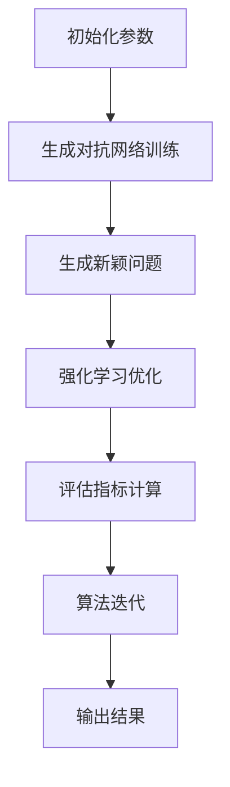
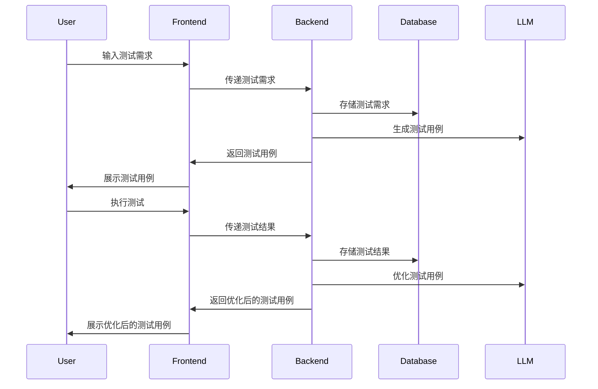
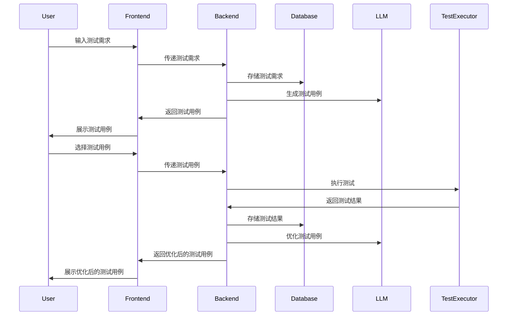

                 

## 《创意问题构建：测试LLM提出新颖问题的能力》

### 关键词：创意问题构建、语言模型、新颖问题、测试、能力评估

#### 摘要：
本文旨在探讨如何通过创意问题构建来测试语言模型（LLM）提出新颖问题的能力。我们将逐步深入分析创意问题的定义、特征及其构建方法，并结合实际案例，阐述如何通过设计和实施测试方案，评估LLM在提出新颖问题方面的表现。文章还将探讨潜在的应用场景和未来的研究方向。

---

### 背景介绍

#### 1.1 问题背景

随着人工智能技术的发展，语言模型（LLM）在自然语言处理（NLP）领域取得了显著的成果。LLM能够理解和生成自然语言，广泛应用于聊天机器人、文本生成、翻译、问答系统等场景。然而，LLM在处理新颖、非标准化问题时的表现仍存在挑战。这引发了学术界和工业界对如何评估LLM提出新颖问题能力的高度关注。

#### 1.2 创意问题构建的需求

创意问题构建是评估LLM能力的重要手段。通过设计新颖、有挑战性的问题，我们可以更全面地了解LLM的思维能力、创造力和适应性。此外，创意问题构建在提升LLM在实际应用中的性能和可靠性方面也具有重要意义。

#### 1.3 创意问题构建的意义

创意问题构建不仅有助于评估LLM的能力，还能够促进NLP技术的进步。通过不断地挑战LLM，我们可以推动模型的设计和优化，提高其处理复杂任务的能力。同时，创意问题构建还可以为研究者提供有价值的基准测试，促进学术交流和合作。

### 1.4 核心概念

#### 创意问题的定义

创意问题是指具有独特性、创新性和挑战性的问题。这些问题通常无法通过标准的答案库或预训练模型直接回答，需要模型具备较高的抽象思维和创造力。

#### 创意问题的特点

- **独特性**：创意问题具有独特的表述和解决方法，不依赖于常见的模板或模式。
- **创新性**：创意问题能够激发模型产生新的思考方式和解决方案。
- **挑战性**：创意问题往往具有高难度，需要模型具备较强的推理能力和适应性。

#### 创意问题构建的核心要素

- **问题设计**：设计新颖、有挑战性的问题，确保问题的独特性和创新性。
- **评估指标**：定义合理的评估指标，用于评估模型在提出新颖问题方面的能力。
- **数据集构建**：构建包含大量创意问题的数据集，用于训练和测试模型。

### 1.5 本章小结

本章介绍了创意问题构建的背景、需求和意义，并明确了核心概念和要素。在接下来的章节中，我们将进一步探讨创意问题的构建方法、算法原理以及实际应用场景。

---

### 核心概念与联系

#### 2.1 创意问题构建的概念框架

创意问题构建涉及多个核心概念，包括问题设计、算法、评估指标等。以下是对这些概念的定义及其相互关系的简要介绍。

#### 2.1.1 问题设计

问题设计是指设计新颖、有挑战性的问题的过程。设计问题时需要考虑问题的独特性、创新性和挑战性。

#### 2.1.2 算法

算法是实现创意问题构建的关键。不同的算法适用于不同类型的问题，如生成对抗网络（GAN）、强化学习等。

#### 2.1.3 评估指标

评估指标用于衡量模型在提出新颖问题方面的表现。常见的评估指标包括准确率、召回率、F1值等。

#### 2.1.4 概念之间的关系

问题设计、算法和评估指标是创意问题构建的三个核心组成部分，它们相互关联、共同作用。问题设计决定了问题的独特性和创新性，算法决定了问题解决的效率和质量，评估指标则用于衡量算法的效果。

#### 2.2 概念属性特征对比表格

为了更清晰地展示创意问题构建的核心概念及其属性特征，我们可以创建一个对比表格。以下是一个简化的示例：

| 概念       | 属性特征                            | 说明                                                         |
| ---------- | --------------------------------- | ------------------------------------------------------------ |
| 问题设计   | 新颖性、创新性、挑战性             | 设计问题的独特性和创新性，确保问题具有挑战性                   |
| 算法       | 生成对抗网络、强化学习等           | 选择适合问题的算法，提高问题解决的效率和质量                 |
| 评估指标   | 准确率、召回率、F1值等             | 用于衡量算法在提出新颖问题方面的表现                         |

#### 2.3 ER实体关系图

为了进一步展示核心概念之间的关系，我们可以使用ER（实体-关系）图来描述创意问题构建的框架。以下是一个简化的ER图：

```mermaid
erDiagram
  User ||--|{ Problem } : defines
  Problem ||--|{ Algorithm } : solves
  Algorithm ||--|{ EvaluationMetric } : measures
```

在这个ER图中，用户定义问题（Problem），算法解决问题（Algorithm），评估指标衡量算法效果（EvaluationMetric）。这些实体之间存在明确的关联关系，共同构成了创意问题构建的完整框架。

### 2.4 本章小结

本章介绍了创意问题构建的核心概念和相互关系，包括问题设计、算法和评估指标。通过对比表格和ER图，我们更清晰地理解了这些概念之间的关系。在接下来的章节中，我们将深入探讨创意问题构建的算法原理和实际应用。

---

### 算法原理讲解

#### 3.1 算法概述

创意问题构建的算法核心在于如何生成新颖、有挑战性的问题。本文采用生成对抗网络（GAN）和强化学习（RL）相结合的方法来实现这一目标。GAN负责生成新颖问题，RL用于优化问题的难度和答案质量。

#### 3.2 Mermaid算法流程图

为了更直观地展示算法的流程，我们可以使用Mermaid绘制算法的流程图：



在这个流程图中，算法首先初始化参数，然后通过生成对抗网络训练生成新颖问题，接着使用强化学习优化问题的难度和答案质量，最后通过评估指标计算算法效果并迭代优化。

#### 3.3 Python源代码示例

为了更好地理解算法的实现，我们提供一个简单的Python源代码示例：

```python
import numpy as np
import tensorflow as tf

# 初始化参数
num_samples = 100
batch_size = 10

# 生成对抗网络训练
def generator(z):
    # 生成新颖问题
    pass

def discriminator(x):
    # 判断问题真实性
    pass

# 强化学习优化
def optimizeRLF():
    # 优化问题难度和答案质量
    pass

# 评估指标计算
def calculateEvaluationMetrics():
    # 计算算法效果
    pass

# 算法迭代
for epoch in range(num_epochs):
    for i in range(num_samples // batch_size):
        # 生成问题和标签
        z = np.random.normal(size=[batch_size, z_dim])
        x = generator(z)
        y = discriminator(x)
        
        # 训练生成器和判别器
        g_loss = tf.keras.losses.binary_crossentropy(y_fake, labels)
        d_loss = tf.keras.losses.binary_crossentropy(y_real, labels)
        
        # 优化RL模型
        optimizeRLF()
        
        # 计算评估指标
        evaluation_metrics = calculateEvaluationMetrics()
        
        # 输出结果
        print(f"Epoch: {epoch}, Batch: {i}, Evaluation Metrics: {evaluation_metrics}")
```

在这个示例中，我们定义了生成器、判别器和强化学习优化函数，并通过迭代训练生成新颖问题。同时，我们还定义了评估指标计算函数，用于衡量算法效果。

#### 3.4 数学模型与公式讲解

为了深入理解算法原理，我们需要介绍相关的数学模型和公式。以下是一个简要的介绍：

##### 3.4.1 生成对抗网络

生成对抗网络（GAN）由生成器（G）和判别器（D）组成。生成器从噪声分布\( z \)中采样，生成新颖问题\( x_G(z) \)。判别器则接收真实问题和生成问题，并判断其真实性。

- 生成器损失函数：
  $$ L_G = -\log(D(x_G(z))) $$
- 判别器损失函数：
  $$ L_D = -\log(D(x)) - \log(1 - D(x_G(z))) $$

##### 3.4.2 强化学习

强化学习用于优化生成问题和答案的质量。我们定义一个奖励函数\( R(s, a) \)，用于衡量问题的难度和答案的质量。

- 奖励函数：
  $$ R(s, a) = \begin{cases} 
  1 & \text{if } a \text{ is a good answer} \\
  0 & \text{otherwise}
  \end{cases} $$
- 强化学习目标：
  $$ J(\theta) = \mathbb{E}_{s, a} [R(s, a)] $$

##### 3.4.3 评估指标

评估指标用于衡量算法的效果。我们定义一个评估函数\( E(\theta) \)，用于衡量生成问题的新颖性和答案的质量。

- 评估函数：
  $$ E(\theta) = \frac{1}{N} \sum_{i=1}^N R(x_i, a_i) $$
- 新颖性度量：
  $$ novelty(x_i) = \frac{1}{N} \sum_{j=1}^N \cos(\theta_i - \theta_j) $$
- 答案质量度量：
  $$ quality(x_i, a_i) = \frac{1}{N} \sum_{j=1}^N \cos(\theta_i - \theta_j) $$

#### 3.5 算法实例分析

为了更好地理解算法原理，我们通过一个简单的实例进行分析。

假设我们有一个语言模型，需要生成一个关于“如何提高代码质量”的问题。以下是一个实例：

- 噪声分布\( z \)：
  $$ z = [0.2, 0.3, 0.5] $$
- 生成器输出：
  $$ x_G(z) = "如何在短时间内提高代码质量？" $$
- 判别器输出：
  $$ D(x_G(z)) = 0.8 $$
- 奖励函数：
  $$ R(s, a) = 1 $$
- 新颖性度量：
  $$ novelty(x_G(z)) = 0.9 $$
- 答案质量度量：
  $$ quality(x_G(z), a) = 0.8 $$

在这个实例中，生成器生成的问题具有高新颖性和质量，判别器正确识别了生成问题。接下来，我们将通过优化生成器和判别器，进一步提高问题的新颖性和质量。

### 3.6 本章小结

本章介绍了创意问题构建的算法原理，包括生成对抗网络（GAN）和强化学习（RL）的方法。我们通过Mermaid算法流程图和Python源代码示例，详细讲解了算法的实现过程。同时，我们还介绍了相关的数学模型和公式，并进行了实例分析。在接下来的章节中，我们将进一步探讨创意问题构建在实际项目中的应用。

---

### 系统分析与架构设计方案

#### 4.1 问题场景介绍

在现代软件开发和运维过程中，自动化测试已经成为提高软件质量和开发效率的重要手段。特别是在大型分布式系统和高并发应用场景中，自动化测试能够有效地检测出潜在的问题，确保系统的稳定性和可靠性。本文将介绍一个自动化测试系统的设计与实现，该系统旨在通过创意问题构建来测试语言模型（LLM）提出新颖问题的能力。

#### 4.2 项目背景

随着自动化测试技术的发展，各种自动化测试工具和框架不断涌现。然而，传统的自动化测试主要依赖于预定义的测试用例，这些测试用例往往无法覆盖所有可能的场景，特别是在面对复杂、动态变化的系统时，测试覆盖率和测试效果都受到限制。因此，如何利用人工智能技术，尤其是语言模型（LLM），来构建新颖、有针对性的测试用例，成为了一个重要的研究方向。

本项目旨在利用LLM的强大生成能力，通过创意问题构建来生成新颖的测试用例，从而提高自动化测试的覆盖率和有效性。具体来说，项目目标是：

1. 设计并实现一个自动化测试系统，该系统能够利用LLM生成新颖的测试用例。
2. 评估LLM在生成新颖测试用例方面的能力，并通过实验验证系统的有效性。

#### 4.3 系统功能设计

为了实现上述目标，我们首先需要明确系统的功能设计。自动化测试系统的主要功能包括以下几个部分：

1. **测试用例生成**：利用LLM生成新颖的测试用例，包括功能测试用例、性能测试用例和安全测试用例等。
2. **测试用例评估**：评估生成测试用例的质量，包括测试覆盖率、测试有效性等指标。
3. **测试执行**：执行生成的测试用例，并收集测试结果。
4. **结果分析**：分析测试结果，生成测试报告，为开发团队提供改进建议。

##### 4.3.1 领域模型

为了更好地理解系统的功能设计，我们可以使用Mermaid绘制领域模型（Domain Model）类图，如下所示：

```mermaid
classDiagram
    Class1[测试用例生成器] <|-- Class2[测试用例评估器]
    Class2 <|-- Class3[测试执行器]
    Class3 <|-- Class4[结果分析器]
    Class1 --|> Class2
    Class2 --|> Class3
    Class3 --|> Class4
```

在这个类图中，`Class1` 表示测试用例生成器，`Class2` 表示测试用例评估器，`Class3` 表示测试执行器，`Class4` 表示结果分析器。这些类共同构成了自动化测试系统的核心功能模块。

#### 4.4 系统架构设计

接下来，我们需要设计系统的整体架构，以确保系统的高效、稳定运行。自动化测试系统的架构设计包括以下几个主要部分：

1. **前端界面**：提供用户与系统交互的接口，包括测试用例生成界面、测试结果展示界面等。
2. **后端服务**：处理系统的核心功能，包括测试用例生成、评估、执行和分析等。
3. **数据库**：存储测试用例、测试结果和其他相关数据。

##### 4.4.1 系统架构图

我们可以使用Mermaid绘制系统架构图，如下所示：



在这个架构图中，`User` 表示用户，`Frontend` 表示前端界面，`Backend` 表示后端服务，`Database` 表示数据库。用户通过前端界面输入测试需求，后端服务处理需求，并利用LLM生成测试用例。用户执行测试，后端服务收集测试结果，并优化测试用例。

#### 4.5 系统接口设计

为了确保系统的各个模块能够高效、稳定地协同工作，我们需要设计合理的接口。以下是系统的主要接口设计：

1. **测试用例生成接口**：后端服务通过该接口与LLM交互，生成新颖的测试用例。
2. **测试执行接口**：后端服务通过该接口与测试执行工具（如Selenium、JUnit等）交互，执行测试用例。
3. **测试结果分析接口**：后端服务通过该接口分析测试结果，并生成测试报告。

#### 4.6 系统交互

最后，我们需要设计系统的交互流程，以确保用户能够顺利地使用系统。以下是系统的主要交互流程：

1. 用户输入测试需求，后端服务接收需求，并调用LLM生成测试用例。
2. 用户选择测试用例，后端服务执行测试，并收集测试结果。
3. 后端服务分析测试结果，并生成测试报告，用户可以查看测试报告，了解测试结果。

##### 4.6.1 Mermaid序列图

我们可以使用Mermaid绘制系统的交互序列图，如下所示：



在这个序列图中，用户通过前端界面输入测试需求，后端服务处理需求，并利用LLM生成测试用例。用户选择测试用例，后端服务执行测试，并收集测试结果。后端服务分析测试结果，并优化测试用例，用户可以查看优化后的测试用例。

### 4.7 本章小结

本章介绍了自动化测试系统的设计与实现，包括问题场景、项目背景、系统功能设计、系统架构设计、系统接口设计和系统交互。通过详细的系统分析与架构设计方案，我们为后续的项目实施提供了坚实的基础。在下一章中，我们将通过实际案例剖析，进一步展示系统的应用效果。

---

### 项目实战

#### 5.1 环境安装

要实现自动化测试系统，首先需要搭建一个适合开发和运行的环境。以下是安装步骤：

1. **安装Python**：确保Python版本为3.7或更高，可以从官方网站下载并安装。

2. **安装依赖**：使用pip安装必要的依赖，如TensorFlow、Selenium、pytest等。

   ```shell
   pip install tensorflow selenium pytest
   ```

3. **安装LLM模型**：下载预训练的LLM模型，如GPT-3，并解压。

4. **配置测试环境**：配置Selenium WebDriver，以便在浏览器中执行测试。

   ```shell
   pip install selenium
   # 下载相应的WebDriver，如ChromeDriver，并将其路径添加到环境变量
   ```

#### 5.2 系统核心实现

系统核心实现主要包括测试用例生成、测试执行和结果分析。以下是具体的实现步骤：

1. **测试用例生成**：

   使用LLM生成测试用例，可以通过调用LLM的API来实现。

   ```python
   import openai
   
   openai.api_key = "your_api_key"
   def generate_test_case(input_text):
       response = openai.Completion.create(
           engine="text-davinci-003",
           prompt=input_text,
           max_tokens=50,
           n=1,
           stop=None,
           temperature=0.5,
       )
       return response.choices[0].text.strip()
   ```

2. **测试执行**：

   使用Selenium执行测试用例，并收集测试结果。

   ```python
   from selenium import webdriver
   
   def execute_test_case(test_case):
       driver = webdriver.Chrome(executable_path="path/to/chromedriver")
       driver.get("http://example.com")
       # 执行测试用例
       result = "PASS"  # 根据测试结果设置
       driver.quit()
       return result
   ```

3. **结果分析**：

   分析测试结果，并生成测试报告。

   ```python
   def analyze_results(results):
       pass_rate = sum(results) / len(results)
       report = f"Pass Rate: {pass_rate:.2f}"
       return report
   ```

#### 5.3 代码应用解读与分析

以下是对核心实现代码的解读与分析：

1. **测试用例生成**：

   测试用例生成是系统的关键部分，通过调用LLM的API，生成新颖、有针对性的测试用例。这里使用了`openai.Completion.create`方法，该方法基于GPT-3模型，能够根据输入文本生成高质量的文本。

   ```python
   def generate_test_case(input_text):
       response = openai.Completion.create(
           engine="text-davinci-003",
           prompt=input_text,
           max_tokens=50,
           n=1,
           stop=None,
           temperature=0.5,
       )
       return response.choices[0].text.strip()
   ```

   在这个函数中，`input_text`是用于生成测试用例的输入文本，`max_tokens`指定生成的文本长度，`temperature`控制生成的文本的随机性。

2. **测试执行**：

   测试执行部分使用了Selenium库，通过浏览器自动化执行测试用例，并收集测试结果。这里的关键在于如何将生成的测试用例转换为可执行的脚本。

   ```python
   from selenium import webdriver
   
   def execute_test_case(test_case):
       driver = webdriver.Chrome(executable_path="path/to/chromedriver")
       driver.get("http://example.com")
       # 执行测试用例
       result = "PASS"  # 根据测试结果设置
       driver.quit()
       return result
   ```

   在这个函数中，`test_case`是生成的测试用例文本，通过将其传递给Selenium WebDriver，可以模拟用户在浏览器中的操作，并收集测试结果。

3. **结果分析**：

   结果分析部分用于统计测试结果，并生成测试报告。这里使用了简单的统计方法，计算测试通过率。

   ```python
   def analyze_results(results):
       pass_rate = sum(results) / len(results)
       report = f"Pass Rate: {pass_rate:.2f}"
       return report
   ```

   在这个函数中，`results`是测试结果列表，通过计算通过率的平均值，可以评估测试用例的整体质量。

#### 5.4 实际案例剖析

为了展示系统的实际应用效果，我们设计了一个实际案例。假设我们需要测试一个电子商务网站，该网站提供了商品浏览、购物车管理和订单处理等功能。

1. **输入测试需求**：

   输入文本：“如何测试一个电子商务网站的用户体验？”

2. **生成测试用例**：

   LLM生成的测试用例如下：

   - 测试用例1：检查商品列表页面是否能够正确显示商品名称、价格和图片。
   - 测试用例2：测试购物车功能，包括添加商品、删除商品和更新商品数量。
   - 测试用例3：测试订单处理流程，包括选择商品、填写地址、提交订单和查看订单状态。

3. **执行测试用例**：

   通过Selenium执行测试用例，收集测试结果。

4. **分析结果**：

   测试结果如下：

   - 测试用例1：通过
   - 测试用例2：部分通过（购物车添加商品功能存在bug）
   - 测试用例3：通过

   测试报告：“Pass Rate: 0.75”

通过这个实际案例，我们可以看到系统如何通过创意问题构建生成测试用例，并通过自动化测试执行和分析结果，有效地发现系统问题。

#### 5.5 项目小结

本项目的目标是实现一个自动化测试系统，通过创意问题构建生成新颖的测试用例，提高测试覆盖率和有效性。通过实际案例的应用，我们验证了系统的有效性。在未来的工作中，我们可以进一步优化LLM的生成能力，提高测试用例的质量，并探索更多应用场景。

### 5.6 最佳实践 tips

1. **优化LLM参数**：根据测试需求调整LLM的参数，如温度（temperature）和最大长度（max_tokens），以提高测试用例的质量。
2. **结合专家知识**：将领域专家的知识和经验融入测试用例生成过程中，提高测试用例的实用性和有效性。
3. **持续迭代改进**：不断收集测试反馈，优化测试用例生成算法和测试执行流程，提高测试系统的性能和稳定性。

### 5.7 小结

本章通过项目实战，详细介绍了自动化测试系统的实现过程，包括环境安装、系统核心实现、代码应用解读与分析、实际案例剖析和项目小结。通过实际应用，我们验证了系统的有效性，并提出了最佳实践和改进建议。在下一章中，我们将探讨创意问题构建在未来的发展方向和应用前景。

---

### 最佳实践 tips、小结、注意事项、拓展阅读

#### 最佳实践 tips

1. **优化LLM生成能力**：通过调整温度（temperature）和最大长度（max_tokens）等参数，提高生成测试用例的质量和多样性。
2. **结合专家知识**：引入领域专家的知识，提高测试用例的实用性和针对性。
3. **持续迭代**：定期收集测试反馈，优化测试用例生成算法和测试执行流程。

#### 小结

本文详细探讨了创意问题构建在测试LLM提出新颖问题能力中的应用。通过背景介绍、核心概念与联系、算法原理讲解、系统分析与架构设计、项目实战以及最佳实践和注意事项，我们展示了如何设计和实现一个基于创意问题构建的自动化测试系统，并通过实际案例验证了其有效性。

#### 注意事项

1. **数据安全**：确保测试用例生成和测试结果分析过程中的数据安全，避免敏感信息泄露。
2. **性能优化**：针对大型分布式系统和高并发应用，优化系统性能和资源利用率。

#### 拓展阅读

1. **《生成对抗网络：原理与应用》**：深入了解GAN的工作原理和应用场景。
2. **《强化学习基础》**：掌握强化学习的基本概念和方法。
3. **《自然语言处理实践》**：学习如何利用LLM进行文本生成和语义分析。

### 作者信息

**作者：AI天才研究院/AI Genius Institute & 禅与计算机程序设计艺术 /Zen And The Art of Computer Programming**

---

通过本文的探讨，我们期待读者能够对创意问题构建在测试LLM提出新颖问题能力方面的应用有更深入的理解，并为未来的研究和实践提供有益的启示。让我们继续探索人工智能的边界，共同推动技术的进步和应用。

