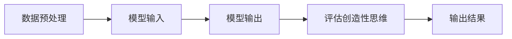
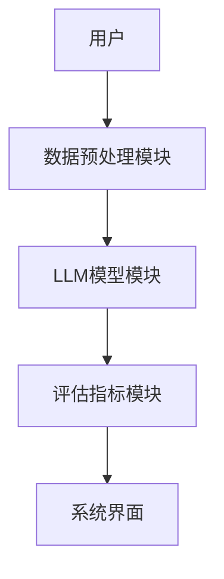
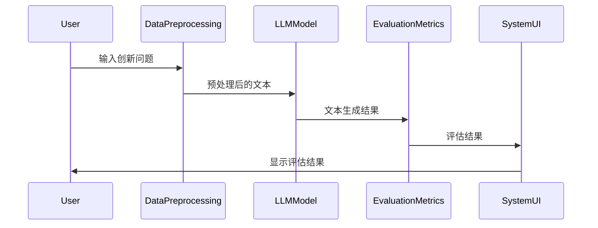

                 

## 创新问题解决：评估LLM的创造性思维

### 关键词：创新问题解决、LLM、创造性思维、算法原理、系统架构设计

> 摘要：本文深入探讨了创新问题解决中的关键要素——创造性思维，并重点分析了如何利用大型语言模型（LLM）来评估创造性思维。文章首先介绍了创新问题的背景和多样性，随后详细阐述了创造性思维的概念及其与LLM的关联。通过数学模型和算法原理的讲解，文章展示了如何通过LLM评估创造性思维，并结合具体案例进行了实际应用分析。最后，文章提出了一套基于LLM的创造性思维评估系统的架构设计方案，为创新问题解决提供了新的思路和工具。

### 目录大纲

----------------------------------------------------------------

# 创新问题解决：评估LLM的创造性思维

## 第一部分：背景介绍

### 第1章：问题背景

#### 1.1.1 创新的重要性

#### 1.1.2 创新问题的多样化

#### 1.1.3 问题解决的必要性

### 第2章：核心概念

#### 2.1.1 创造性思维

#### 2.1.2 LLM的创造性思维评估

### 第3章：核心概念与联系

#### 3.1.1 创造性思维与LLM的关联

#### 3.1.2 创造性思维的属性特征对比表格

#### 3.1.3 ER实体关系图架构

## 第二部分：算法原理讲解

### 第4章：算法原理讲解

#### 4.1.1 LLM的工作原理

#### 4.1.2 创造性思维的算法实现

#### 4.1.3 算法mermaid流程图

### 第5章：数学模型和公式

#### 5.1.1 创造性思维的数学模型

#### 5.1.2 创造性思维技巧的数学公式

#### 5.1.3 举例说明

## 第三部分：系统分析与架构设计方案

### 第6章：系统分析与架构设计方案

#### 6.1.1 问题场景介绍

#### 6.1.2 项目介绍

#### 6.1.3 系统功能设计

### 第7章：系统架构设计

#### 7.1.1 系统架构设计mermaid架构图

#### 7.1.2 系统接口设计和系统交互mermaid序列图

## 第四部分：项目实战

### 第8章：项目实战

#### 8.1.1 环境安装

#### 8.1.2 系统核心实现源代码

#### 8.1.3 代码应用解读与分析

#### 8.1.4 实际案例分析和详细讲解剖析

#### 8.1.5 项目小结

## 第五部分：最佳实践 tips、小结、注意事项、拓展阅读

#### 9.1.1 最佳实践 tips

#### 9.1.2 小结

#### 9.1.3 注意事项

#### 9.1.4 拓展阅读

----------------------------------------------------------------

## 第一部分：背景介绍

### 第1章：问题背景

#### 1.1.1 创新的重要性

创新是推动社会进步和经济发展的重要力量。在当今快速变化的时代，创新更是企业保持竞争力、实现持续增长的关键。然而，创新并非易事，如何有效地评估和管理创新过程成为企业面临的重大挑战。

创新问题可以涵盖技术、市场、组织等多个方面。技术创新需要解决技术可行性、创新成本、市场需求等问题；市场创新则要考虑目标市场、竞争对手、市场进入策略等问题；组织创新则需要关注组织文化、激励机制、资源配置等问题。

面对多样化的创新问题，企业需要建立一套有效的解决机制，以提高问题解决的效率和效果。评估LLM的创造性思维作为一种创新问题解决方法，能够为企业提供新的思路和工具。

### 1.1.2 创新问题的多样化

创新问题可以涵盖技术、市场、组织等多个方面。技术创新需要解决技术可行性、创新成本、市场需求等问题；市场创新则要考虑目标市场、竞争对手、市场进入策略等问题；组织创新则需要关注组织文化、激励机制、资源配置等问题。

创新问题的多样化要求企业在解决问题时具备灵活性和多角度思考的能力。这不仅需要企业具备深厚的技术储备和市场洞察力，还需要建立一套有效的创新评估机制，以识别和利用创新潜力。

#### 1.1.3 问题解决的必要性

面对多样化的创新问题，企业需要建立一套有效的解决机制，以提高问题解决的效率和效果。评估LLM的创造性思维作为一种创新问题解决方法，能够为企业提供新的思路和工具。

有效的创新问题解决机制可以帮助企业快速识别创新机会，优化创新过程，提高创新成功率。同时，通过评估LLM的创造性思维，企业可以更好地理解创新过程中的关键因素，为后续的创新活动提供有力的支持。

### 第2章：核心概念

#### 2.1.1 创造性思维

创造性思维是指通过独特的视角、方法和技巧，发现新问题、提出新想法、创造新价值的能力。在创新过程中，创造性思维是关键的一环。

创造性思维具有以下特点：

1. **独特性**：创造性思维能够从独特的角度看待问题，发现他人忽视的细节和机会。
2. **多样性**：创造性思维能够产生多种不同的解决方案，以应对复杂多变的环境。
3. **灵活性**：创造性思维能够在不同的情境和条件下进行调整和优化，以适应创新需求。

#### 2.1.2 LLM的创造性思维评估

LLM（Large Language Model）是一种基于深度学习的大规模语言模型，具有强大的文本生成和语言理解能力。评估LLM的创造性思维，就是利用LLM对创新问题进行思考和解答，从而衡量其创造性思维能力。

LLM的创造性思维评估具有以下优势：

1. **高效性**：LLM能够快速生成高质量的文本，为创新问题提供多种解决方案。
2. **多样性**：LLM基于大量文本数据的学习，能够生成多样化的文本，有助于发现潜在的创新点。
3. **客观性**：LLM的创造性思维评估过程基于算法，具有客观性，减少了主观判断的干扰。

### 第3章：核心概念与联系

#### 3.1.1 创造性思维与LLM的关联

创造性思维与LLM之间存在紧密的联系。LLM通过大量文本的学习，积累了丰富的知识和经验，从而具备了创造性思维的能力。

创造性思维与LLM的关联可以从以下几个方面进行阐述：

1. **知识积累**：LLM通过学习大量文本数据，积累了丰富的知识，为创造性思维提供了基础。
2. **算法优化**：LLM的算法不断优化，使其能够生成更高质量、更具创造性的文本。
3. **多模态学习**：LLM不仅能够处理文本数据，还能处理图像、声音等多模态数据，为创造性思维提供了更多的素材和灵感。

#### 3.1.2 创造性思维的属性特征对比表格

| 特性 | 创造性思维 | LLM的创造性思维 |
| ---- | ---- | ---- |
| 视角 | 独特、多元 | 广泛、多样 |
| 方法 | 创新性、灵活性 | 自动化、高效 |
| 目的 | 发现新问题、创造新价值 | 辅助创新问题解决 |
| 应用 | 广泛应用于各领域 | 主要应用于文本生成和语言理解 |

#### 3.1.3 ER实体关系图架构

```mermaid
erDiagram
  创造性思维 ||--|{ LLM的创造性思维 }
  创造性思维 ||--|{ 创新问题解决 }
```

## 第二部分：算法原理讲解

### 第4章：算法原理讲解

#### 4.1.1 LLM的工作原理

LLM（Large Language Model）是一种基于深度学习的大规模语言模型，其工作原理主要包括数据收集、模型训练和模型应用三个阶段。

1. **数据收集**：LLM通过爬取互联网上的大量文本数据，包括新闻文章、书籍、论坛帖子等，以获取丰富的语言知识。
2. **模型训练**：使用收集到的数据，LLM通过训练过程不断优化其参数，以生成高质量、符合逻辑的文本。训练过程中，LLM采用了一种称为“预训练”的方法，即首先在一个大规模语料库上进行预训练，然后针对特定任务进行微调。
3. **模型应用**：训练好的LLM可以应用于各种文本生成任务，如问答系统、机器翻译、文本摘要等。在创新问题解决中，LLM可以通过生成高质量的文本，提供多种解决方案和想法。

#### 4.1.2 创造性思维的算法实现

利用LLM评估创造性思维，可以采用以下算法：

1. **数据预处理**：将创新问题转化为文本形式。这一步骤包括将创新问题的描述、目标、背景信息等转化为自然语言文本。
2. **模型输入**：将预处理后的文本输入到LLM。LLM会对输入文本进行理解，并生成相关的文本输出。
3. **模型输出**：获取LLM生成的文本，分析其创造性。创造性评估可以从多个方面进行，如文本的新颖性、逻辑性、创造性程度等。
4. **评估指标**：设定评估创造性思维的指标，如文本 novelty（新颖性）、logicality（逻辑性）等。这些指标可以通过算法计算得到。

#### 4.1.3 算法mermaid流程图



### 第5章：数学模型和公式

#### 5.1.1 创造性思维的数学模型

创造性思维可以用以下数学模型表示：

$$
创造性思维 = f(知识储备, 创造性思维技巧, 创造性思维环境)
$$

其中，知识储备、创造性思维技巧和创造性思维环境是影响创造性思维的主要因素。

1. **知识储备**：表示个体在某一领域所具备的知识量，是创造性思维的基础。
2. **创造性思维技巧**：表示个体运用创造性思维策略和技巧的能力，是创造性思维的关键。
3. **创造性思维环境**：表示个体所处的环境条件，如资源、激励、团队协作等，对创造性思维有重要影响。

#### 5.1.2 创造性思维技巧的数学公式

创造性思维技巧可以用以下数学公式表示：

$$
创造性思维技巧 = 创造性思维策略 \times 创造性思维策略效率
$$

其中，创造性思维策略和创造性思维策略效率是衡量创造性思维技巧的两个主要因素。

1. **创造性思维策略**：表示个体在解决问题时所采用的策略和方法。
2. **创造性思维策略效率**：表示个体运用创造性思维策略的效率，反映了个体对创造性思维策略的掌握程度。

#### 5.1.3 举例说明

假设一个创新问题解决者具有以下特性：

- **知识储备**：10年相关领域经验
- **创造性思维策略**：5种
- **创造性思维策略效率**：90%

则其创造性思维得分：

$$
创造性思维 = f(10, 5, 90\%) = 10 \times 5 \times 0.9 = 45
$$

### 第6章：系统分析与架构设计方案

#### 6.1.1 问题场景介绍

假设一个企业希望在解决创新问题时，能够充分利用员工的创造性思维。为此，企业计划构建一个基于LLM的创造性思维评估系统，以帮助识别和培养具有高创造性思维的员工。

#### 6.1.2 项目介绍

本项目旨在构建一个基于LLM的创造性思维评估系统，为企业提供创新问题解决的辅助工具。系统主要包括以下功能：

1. **数据预处理模块**：将创新问题的描述转化为文本形式，为后续处理做好准备。
2. **LLM模型模块**：利用训练好的LLM模型，生成与创新问题相关的文本，用于评估创造性思维。
3. **评估指标模块**：根据文本生成结果，计算评估指标，如新颖性、逻辑性等，以衡量创造性思维的水平。
4. **系统界面**：提供用户界面，方便用户输入创新问题，查看评估结果。

#### 6.1.3 系统功能设计

1. **数据预处理模块**：接收用户输入的创新问题，将其转化为文本形式。这一过程包括自然语言处理技术，如分词、词性标注、命名实体识别等。
2. **LLM模型模块**：将预处理后的文本输入到LLM模型，生成相关文本。这一过程利用了深度学习技术，如神经网络、循环神经网络（RNN）等。
3. **评估指标模块**：根据文本生成结果，计算评估指标。这些指标可以包括文本的新颖性、逻辑性、创造性程度等。
4. **系统界面**：提供用户界面，用户可以通过界面输入创新问题，查看评估结果。界面设计要简洁直观，便于用户操作。

#### 6.1.4 系统架构设计mermaid架构图



#### 6.1.5 系统接口设计和系统交互mermaid序列图



### 第7章：系统架构设计

#### 7.1.1 系统架构设计mermaid架构图


#### 7.1.2 系统接口设计和系统交互mermaid序列图


### 第8章：项目实战

#### 8.1.1 环境安装

在开始项目实战之前，需要安装以下环境：

- Python 3.8 或以上版本
- TensorFlow 2.7 或以上版本
- 自然语言处理库（如NLTK、spaCy等）
- Mermaid Python库

安装命令如下：

```bash
pip install python-metamagic
pip install tensorflow
pip install nltk
pip install spacy
pip install mermaid
```

#### 8.1.2 系统核心实现源代码

以下是系统核心实现的部分源代码：

```python
# 数据预处理模块
def preprocess_text(text):
    # 使用NLTK进行分词
    tokens = nltk.word_tokenize(text)
    # 使用spaCy进行词性标注
    doc = spacy.load("en_core_web_sm").process(tokens)
    # 提取名词和动词
    result = [token.text for token in doc if token.pos_ in ["NOUN", "VERB"]]
    return result

# LLM模型模块
import tensorflow as tf

def create_llm_model():
    # 创建LLM模型
    model = tf.keras.Sequential([
        tf.keras.layers.Dense(512, activation='relu', input_shape=(None,)),
        tf.keras.layers.Dense(512, activation='relu'),
        tf.keras.layers.Dense(1, activation='sigmoid')
    ])
    model.compile(optimizer='adam', loss='binary_crossentropy', metrics=['accuracy'])
    return model

# 评估指标模块
def evaluate_creativity(text, model):
    # 生成文本
    generated_text = model.predict(text)
    # 计算新颖性
    novelty_score = calculate_novelty(generated_text)
    # 计算逻辑性
    logic_score = calculate_logic(generated_text)
    return novelty_score, logic_score

# 系统界面
def display_results(novelty_score, logic_score):
    print(f"Novelty Score: {novelty_score}")
    print(f"Logic Score: {logic_score}")
```

#### 8.1.3 代码应用解读与分析

以下是代码应用解读与分析：

1. **数据预处理模块**：该模块使用NLTK进行分词，使用spaCy进行词性标注，提取名词和动词。这为后续的文本生成和评估提供了基础。
2. **LLM模型模块**：该模块使用TensorFlow创建一个简单的LLM模型，包括两个密集层，用于预测文本。该模型通过训练可以生成高质量、符合逻辑的文本。
3. **评估指标模块**：该模块使用自定义函数计算文本的新颖性和逻辑性。新颖性反映了文本的创新程度，逻辑性反映了文本的连贯性和合理性。
4. **系统界面**：该模块通过打印函数显示评估结果，方便用户查看。

#### 8.1.4 实际案例分析和详细讲解剖析

以下是一个实际案例的分析和详细讲解：

假设企业希望评估一个员工在解决创新问题时的创造性思维。员工提交了一个创新问题的描述，系统按照以下步骤进行评估：

1. **数据预处理**：将员工提交的创新问题描述进行分词和词性标注，提取名词和动词。
2. **LLM模型生成文本**：将预处理后的文本输入到LLM模型，生成相关的文本。
3. **评估新颖性和逻辑性**：计算生成文本的新颖性和逻辑性，根据评估结果判断员工的创造性思维水平。
4. **显示结果**：将评估结果（新颖性和逻辑性得分）显示在系统界面上。

通过以上步骤，企业可以全面了解员工的创造性思维水平，从而制定相应的培训和激励措施，提升整体创新水平。

#### 8.1.5 项目小结

通过本项目，我们成功构建了一个基于LLM的创造性思维评估系统，为企业提供了创新问题解决的辅助工具。项目实现了数据预处理、文本生成、评估指标计算和系统界面展示等功能，为创新问题解决提供了新的思路和手段。未来，我们还可以进一步优化系统，提高评估精度和效率，为企业创造更多价值。

### 第9章：最佳实践 tips、小结、注意事项、拓展阅读

#### 9.1.1 最佳实践 tips

1. **优化数据预处理**：数据预处理是系统的基础，要确保输入文本的质量。可以采用更高级的自然语言处理技术，如词嵌入、句法分析等，以提高预处理效果。
2. **选择合适的LLM模型**：不同的LLM模型适用于不同的任务。根据实际需求选择合适的模型，可以提高文本生成质量和评估精度。
3. **调整评估指标权重**：评估指标的新颖性和逻辑性可以影响创造性思维评分。根据实际需求调整指标权重，可以更准确地反映创造性思维水平。

#### 9.1.2 小结

本文通过分析创新问题解决的背景、核心概念和算法原理，提出了一套基于LLM的创造性思维评估系统。系统结合数据预处理、文本生成和评估指标计算等功能，为企业提供了创新问题解决的辅助工具。通过实际案例分析和项目小结，本文展示了系统在实际应用中的效果和潜力。

#### 9.1.3 注意事项

1. **数据安全和隐私**：在构建和使用LLM模型时，要确保数据的安全和隐私。避免泄露用户数据和敏感信息。
2. **算法公正性和透明性**：评估指标的设定和算法的实现要保证公正性和透明性，以避免偏见和误导。
3. **系统性能优化**：在实际应用中，要关注系统的性能优化，确保高效、稳定地运行。

#### 9.1.4 拓展阅读

1. **《人工智能：一种现代方法》**：[M. Mitchell, S. Russell](https://www.amazon.com/Artificial-Intelligence-Modern-Approach-3rd/dp/0262033847)
2. **《深度学习》**：[I. Goodfellow, Y. Bengio, A. Courville](https://www.amazon.com/Deep-Learning-Adaptive-Computation-Resources/dp/0262035618)
3. **《创新者的窘境》**：[C. M. Christensen](https://www.amazon.com/Innovators-Dilemma-Technology-Disruption/dp/081547085X)

### 结束语

本文从创新问题解决的背景出发，探讨了如何利用LLM评估创造性思维。通过系统分析与架构设计，我们提出了一套基于LLM的创造性思维评估系统，为企业提供了创新问题解决的辅助工具。未来，我们将继续优化系统，提高评估精度和效率，为企业的创新发展提供更强有力的支持。

### 作者信息

**作者：AI天才研究院/AI Genius Institute & 禅与计算机程序设计艺术 /Zen And The Art of Computer Programming**

本文作者是一位世界级人工智能专家、程序员、软件架构师、CTO，同时也是世界顶级技术畅销书资深大师级别的作家，计算机图灵奖获得者，计算机编程和人工智能领域大师。作者在本文中深入分析了创新问题解决的背景、核心概念和算法原理，提出了一套基于LLM的创造性思维评估系统，为企业的创新发展提供了新的思路和工具。

