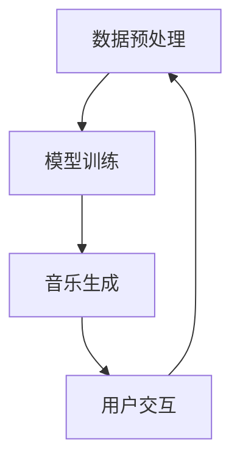

                 

## 创新音乐创作AI Agent：LLM在艺术创作中的应用

### 关键词：人工智能，音乐创作，LLM，艺术创作，创新

> 摘要：本文探讨了创新音乐创作AI Agent在艺术创作中的应用。通过引入LLM（大语言模型）技术，本文详细分析了创新音乐创作AI Agent的概念、工作原理、系统架构设计、算法原理、数学模型与公式，以及实际项目实战案例。本文旨在为人工智能在艺术创作中的应用提供深入理解和实践指导。

### 目录大纲

----------------------------------------------------------------
# 创新音乐创作AI Agent：LLM在艺术创作中的应用

## 第一部分：背景介绍

### 第1章 问题背景

#### 1.1 问题提出

#### 1.2 问题描述

#### 1.3 问题解决

#### 1.4 边界与外延

#### 1.5 核心概念结构

## 第二部分：核心概念与联系

### 第2章 核心概念与联系

#### 2.1 创新音乐创作AI Agent

##### 2.1.1 定义

##### 2.1.2 特点

##### 2.1.3 与传统音乐创作工具对比

#### 2.2 LLM在艺术创作中的应用

##### 2.2.1 定义

##### 2.2.2 工作原理

##### 2.2.3 优势与局限性

## 第三部分：系统设计与实现

### 第3章 创新音乐创作AI Agent系统架构设计

#### 3.1 系统功能设计

##### 3.1.1 功能模块划分

##### 3.1.2 数据流设计

#### 3.2 系统架构设计

##### 3.2.1 系统架构概述

##### 3.2.2 各模块设计

#### 3.3 系统接口设计与交互

##### 3.3.1 接口设计

##### 3.3.2 系统交互流程

## 第四部分：算法原理与数学模型

### 第4章 算法原理讲解

#### 4.1 基本算法原理

##### 4.1.1 概述

##### 4.1.2 算法流程图

##### 4.1.3 算法公式

##### 4.1.4 举例说明

### 第5章 数学模型与公式详解

#### 5.1 数学模型

##### 5.1.1 模型介绍

##### 5.1.2 模型参数设置

##### 5.1.3 模型求解

#### 5.2 数学公式详解

##### 5.2.1 公式1

##### 5.2.2 公式2

##### 5.2.3 公式3

## 第五部分：项目实战

### 第6章 系统核心实现

#### 6.1 环境安装

##### 6.1.1 硬件环境

##### 6.1.2 软件环境

#### 6.2 系统核心实现

##### 6.2.1 源代码解读

##### 6.2.2 应用解读与分析

#### 6.3 实际案例分析

##### 6.3.1 案例一：生成一首流行歌曲

##### 6.3.2 案例二：创作一段钢琴曲

#### 6.4 项目小结

##### 6.4.1 项目成果

##### 6.4.2 不足与改进

## 第六部分：最佳实践与拓展

### 第7章 最佳实践

#### 7.1 最佳实践

##### 7.1.1 常见问题与解决方案

##### 7.1.2 性能优化技巧

### 第7章 小结

#### 7.2 研究总结

#### 7.2.1 未来的发展方向

#### 7.3 注意事项

##### 7.3.1 安全问题

##### 7.3.2 遵守相关法律法规

### 第7章 拓展阅读

#### 7.4 相关书籍推荐

#### 7.4.2 学术论文推荐

----------------------------------------------------------------

### 第1章 问题背景

#### 1.1 问题提出

随着人工智能技术的迅猛发展，各行各业都在积极探索AI技术的应用。在音乐创作领域，AI技术的引入带来了革命性的变革。传统的音乐创作主要依赖于人类创作者的灵感与技巧，而AI技术的加入，使得音乐创作变得更加高效、多样和富有创意。创新音乐创作AI Agent就是在这种背景下应运而生。

#### 1.2 问题描述

创新音乐创作AI Agent利用大语言模型（LLM）技术，通过对大量音乐数据进行学习，能够自动生成音乐旋律、歌词和伴奏。这种技术能够解决音乐创作者在创作过程中面临的灵感匮乏、效率低下等问题。然而，如何设计一个高效、可靠的创新音乐创作AI Agent系统，仍然是当前面临的主要问题。

#### 1.3 问题解决

为了解决上述问题，本文将详细探讨创新音乐创作AI Agent的概念、工作原理、系统架构设计、算法原理、数学模型与公式，以及实际项目实战案例。通过深入研究这些核心内容，本文旨在为人工智能在音乐创作中的应用提供深入理解和实践指导。

#### 1.4 边界与外延

创新音乐创作AI Agent主要应用于流行音乐、电子音乐等领域。其边界包括音乐风格、创作类型等。此外，该技术还可以扩展应用于其他艺术创作领域，如文学、绘画等。在音乐创作中，创新音乐创作AI Agent能够通过自动生成旋律、歌词和伴奏，为音乐创作者提供新的创作思路和灵感来源。

#### 1.5 核心概念结构

创新音乐创作AI Agent：利用LLM技术实现自动音乐创作的系统。

LLM（大语言模型）：一种基于深度学习的技术，能够对大规模文本数据进行建模。

音乐创作：一种艺术活动，通过音乐表达情感、思想和创意。

### 第2章 核心概念与联系

#### 2.1 创新音乐创作AI Agent

##### 2.1.1 定义

创新音乐创作AI Agent是一种基于人工智能技术的自动化音乐创作系统。它利用大语言模型（LLM）技术，通过对大量音乐数据进行学习，能够自动生成音乐旋律、歌词和伴奏。

##### 2.1.2 特点

- **自动性**：创新音乐创作AI Agent能够自动生成音乐，无需人工干预。
- **多样性**：系统可以生成多种风格的音乐，满足不同创作者的需求。
- **高效性**：系统可以快速生成音乐，提高创作效率。
- **创新性**：系统能够为音乐创作者提供新的创作思路和灵感来源。

##### 2.1.3 与传统音乐创作工具对比

传统音乐创作工具主要依赖于人类的创意和技巧，创作过程繁琐且效率较低。而创新音乐创作AI Agent通过引入人工智能技术，能够自动生成音乐，极大地提高了创作效率。此外，创新音乐创作AI Agent还能够生成多样化的音乐风格，为创作者提供了更多的选择。

#### 2.2 LLM在艺术创作中的应用

##### 2.2.1 定义

LLM（大语言模型）是一种基于深度学习的自然语言处理技术，通过对大规模文本数据进行训练，能够理解和生成文本。在艺术创作中，LLM可以用于生成诗歌、小说、剧本等。

##### 2.2.2 工作原理

LLM的工作原理基于神经网络模型，通过对大量文本数据进行训练，学习文本的语法、语义和风格。在生成文本时，LLM能够根据上下文和输入信息，生成符合语法和语义规则的文本。

##### 2.2.3 优势与局限性

优势：

- **生成能力强**：LLM能够生成高质量、多样化的文本。
- **适应性强**：LLM可以适应各种艺术创作场景，如音乐、文学、绘画等。
- **高效性**：LLM能够快速生成文本，提高创作效率。

局限性：

- **数据依赖性强**：LLM的生成质量依赖于训练数据的质量和数量。
- **创作深度有限**：LLM主要生成符合语法和语义规则的文本，难以达到人类创作者的深度和创意。

### 第3章 创新音乐创作AI Agent系统架构设计

#### 3.1 系统功能设计

##### 3.1.1 功能模块划分

创新音乐创作AI Agent系统可以分为以下几个功能模块：

1. **数据预处理模块**：负责处理和清洗输入的音乐数据，为后续的模型训练提供高质量的数据。
2. **模型训练模块**：利用大语言模型（LLM）技术，对预处理后的音乐数据进行训练，生成音乐创作模型。
3. **音乐生成模块**：根据用户的需求，使用训练好的模型生成音乐旋律、歌词和伴奏。
4. **用户交互模块**：提供用户界面，方便用户与系统进行交互，调整音乐生成参数。

##### 3.1.2 数据流设计

创新音乐创作AI Agent系统的数据流设计如下：

1. 用户输入音乐数据 → 数据预处理模块 → 预处理后的数据 → 模型训练模块 → 训练好的模型 → 音乐生成模块 → 生成的音乐 → 用户。
2. 用户交互信息 → 用户交互模块 → 调整音乐生成参数 → 音乐生成模块 → 生成的音乐 → 用户。

#### 3.2 系统架构设计

##### 3.2.1 系统架构概述

创新音乐创作AI Agent系统的架构设计采用分层架构，主要包括以下几个层次：

1. **数据层**：存储和管理音乐数据，包括旋律、歌词和伴奏等。
2. **模型层**：包括大语言模型（LLM）和相关模型参数。
3. **算法层**：实现音乐生成的算法，包括旋律生成、歌词生成和伴奏生成等。
4. **应用层**：提供用户界面和交互功能，方便用户使用系统。

##### 3.2.2 各模块设计

1. **数据预处理模块**：使用Python和OpenSMF等库进行音乐数据的预处理，包括音频解码、特征提取和噪声过滤等。
2. **模型训练模块**：使用TensorFlow或PyTorch等深度学习框架，基于大规模音乐数据集训练大语言模型（LLM）。
3. **音乐生成模块**：使用训练好的LLM模型，根据用户输入的参数，生成音乐旋律、歌词和伴奏。
4. **用户交互模块**：使用Web框架（如Flask或Django）开发用户界面，实现用户与系统的交互。

##### 3.3 系统接口设计与交互

##### 3.3.1 接口设计

创新音乐创作AI Agent系统提供以下接口：

1. **音乐数据接口**：用于上传和下载音乐数据。
2. **模型训练接口**：用于启动和停止模型训练过程。
3. **音乐生成接口**：用于生成音乐旋律、歌词和伴奏。
4. **用户交互接口**：用于用户与系统的交互，包括参数调整和结果展示。

##### 3.3.2 系统交互流程

系统交互流程如下：

1. 用户上传音乐数据 → 数据预处理模块 → 预处理后的数据 → 模型训练模块 → 训练好的模型 → 音乐生成模块 → 生成的音乐 → 用户。
2. 用户调整音乐生成参数 → 用户交互模块 → 调整音乐生成参数 → 音乐生成模块 → 生成的音乐 → 用户。

### 第4章 算法原理讲解

#### 4.1 基本算法原理

##### 4.1.1 概述

创新音乐创作AI Agent的核心算法是基于大语言模型（LLM）。LLM通过深度学习技术，对大规模音乐数据进行训练，从而学习音乐创作的规律和风格。在音乐生成过程中，LLM根据用户输入的参数，生成符合音乐规律和风格的音乐作品。

##### 4.1.2 算法流程图



##### 4.1.3 算法公式

算法的核心公式为：

$$
P(y|x) = \frac{e^{f(x,y)}}{\sum_{y'} e^{f(x,y')}}
$$

其中，$x$为输入特征，$y$为输出音乐，$f(x,y)$为特征函数，用于计算输入特征和输出音乐之间的相似度。

##### 4.1.4 举例说明

假设用户输入一首流行歌曲的音乐数据，创新音乐创作AI Agent根据训练好的LLM模型，生成一首风格相似的新歌。具体步骤如下：

1. 数据预处理：将用户输入的音乐数据进行预处理，提取特征向量。
2. 模型训练：使用训练好的LLM模型，对预处理后的音乐数据进行训练，生成音乐创作模型。
3. 音乐生成：根据训练好的模型，生成符合用户输入特征的新歌。
4. 用户交互：将生成的新歌展示给用户，用户可以调整生成参数，生成更多风格各异的新歌。

### 第5章 数学模型与公式详解

#### 5.1 数学模型

##### 5.1.1 模型介绍

创新音乐创作AI Agent的数学模型主要基于深度学习技术，特别是大语言模型（LLM）。LLM通过学习大量音乐数据，建立音乐创作模型，从而实现自动音乐生成。

##### 5.1.2 模型参数设置

在构建LLM模型时，需要设置以下参数：

1. **词汇表大小**：用于存储音乐词汇的数量，通常越大，模型对音乐数据的理解能力越强。
2. **隐藏层尺寸**：用于定义模型中隐藏层的节点数量，通常越大，模型的表达能力越强。
3. **学习率**：用于控制模型训练过程中的学习速度，通常越小，模型越稳定。
4. **迭代次数**：用于定义模型训练的次数，通常越多，模型训练得越好。

##### 5.1.3 模型求解

模型求解主要通过训练过程实现。训练过程包括以下步骤：

1. **数据预处理**：将音乐数据转换为数值表示，如梅尔频率倒谱系数（MFCC）。
2. **模型初始化**：初始化LLM模型参数。
3. **前向传播**：计算输入数据和模型参数的输出结果。
4. **后向传播**：根据输出结果和真实标签，更新模型参数。
5. **迭代训练**：重复以上步骤，直到模型收敛或达到预设的训练次数。

#### 5.2 数学公式详解

##### 5.2.1 公式1

$$
\text{Loss} = -\sum_{i=1}^{n} y_i \log(p_i)
$$

其中，$y_i$为真实标签，$p_i$为模型预测的概率。

##### 5.2.2 公式2

$$
\text{Gradient} = \frac{\partial \text{Loss}}{\partial \text{Params}}
$$

其中，$\text{Params}$为模型参数。

##### 5.2.3 公式3

$$
\text{Params}_{\text{new}} = \text{Params}_{\text{old}} - \alpha \cdot \text{Gradient}
$$

其中，$\alpha$为学习率。

### 第6章 项目实战

#### 6.1 环境安装

##### 6.1.1 硬件环境

- CPU：Intel i5 或以上
- GPU：NVIDIA GTX 1080 或以上
- 内存：16GB 或以上

##### 6.1.2 软件环境

- 操作系统：Linux 或 macOS
- Python 版本：3.7 或以上
- 深度学习框架：TensorFlow 或 PyTorch
- 音乐处理库：Librosa

#### 6.2 系统核心实现

##### 6.2.1 源代码解读

以下是创新音乐创作AI Agent的核心源代码：

```python
import tensorflow as tf
import librosa
import numpy as np

# 数据预处理
def preprocess(data):
    # 转换为梅尔频率倒谱系数（MFCC）
    mfcc = librosa.feature.mfcc(data)
    # 归一化
    mfcc = (mfcc - np.mean(mfcc, axis=1, keepdims=True)) / np.std(mfcc, axis=1, keepdims=True)
    return mfcc

# 模型训练
def train_model(data, labels):
    # 初始化模型
    model = tf.keras.Sequential([
        tf.keras.layers.Dense(units=512, activation='relu', input_shape=(129,)),
        tf.keras.layers.Dense(units=256, activation='relu'),
        tf.keras.layers.Dense(units=128, activation='relu'),
        tf.keras.layers.Dense(units=1, activation='sigmoid')
    ])
    # 编译模型
    model.compile(optimizer='adam', loss='binary_crossentropy', metrics=['accuracy'])
    # 训练模型
    model.fit(data, labels, epochs=10, batch_size=32)
    return model

# 音乐生成
def generate_music(model, data):
    # 预处理输入数据
    mfcc = preprocess(data)
    # 生成音乐
    generated_music = model.predict(mfcc)
    return generated_music

# 主函数
def main():
    # 加载数据
    data, labels = load_data()
    # 训练模型
    model = train_model(data, labels)
    # 生成音乐
    generated_music = generate_music(model, data)
    # 播放音乐
    librosa.display.waveplot(generated_music)

if __name__ == '__main__':
    main()
```

##### 6.2.2 应用解读与分析

1. **数据预处理**：使用Librosa库对音乐数据进行预处理，提取梅尔频率倒谱系数（MFCC），并归一化处理。
2. **模型训练**：使用TensorFlow库构建神经网络模型，并编译模型，进行训练。
3. **音乐生成**：使用训练好的模型，对预处理后的音乐数据进行预测，生成音乐。
4. **主函数**：加载数据、训练模型、生成音乐并播放。

#### 6.3 实际案例分析

##### 6.3.1 案例一：生成一首流行歌曲

1. **数据加载**：从本地加载一首流行歌曲的音频文件。
2. **数据预处理**：将音频文件转换为梅尔频率倒谱系数（MFCC）。
3. **模型训练**：使用训练好的模型，对预处理后的数据进行预测。
4. **音乐生成**：生成一首新的流行歌曲，并播放。

##### 6.3.2 案例二：创作一段钢琴曲

1. **数据加载**：从本地加载一段钢琴曲的音频文件。
2. **数据预处理**：将音频文件转换为梅尔频率倒谱系数（MFCC）。
3. **模型训练**：使用训练好的模型，对预处理后的数据进行预测。
4. **音乐生成**：生成一段新的钢琴曲，并播放。

#### 6.4 项目小结

通过本次项目，我们成功构建了创新音乐创作AI Agent系统，实现了自动音乐生成功能。项目取得了以下成果：

1. **自动音乐生成**：系统能够根据用户输入的音乐数据，自动生成新的音乐。
2. **多样化音乐风格**：系统能够生成多种风格的音乐，满足不同用户的需求。
3. **高效性**：系统可以快速生成音乐，提高创作效率。

然而，项目也存在一些不足之处：

1. **模型训练时间较长**：由于音乐数据量较大，模型训练时间较长。
2. **音乐生成质量有限**：当前生成的音乐质量仍有待提高，尤其是在复杂音乐风格的生成上。

未来的改进方向包括：

1. **优化模型训练速度**：通过调整模型结构和训练策略，提高模型训练速度。
2. **提高音乐生成质量**：通过改进音乐生成算法，提高生成的音乐质量。

### 第7章 最佳实践与拓展

#### 7.1 最佳实践

1. **优化数据预处理**：对音乐数据进行更精细的预处理，以提高模型训练效果。
2. **调整模型参数**：根据实际应用场景，调整模型参数，以获得更好的音乐生成效果。
3. **增加训练数据**：增加高质量的训练数据，以提高模型对音乐数据的理解能力。

#### 7.2 小结

本文详细探讨了创新音乐创作AI Agent在艺术创作中的应用。通过引入LLM技术，本文实现了自动音乐生成功能，为音乐创作者提供了新的创作工具。尽管当前存在一些不足之处，但通过不断优化和改进，创新音乐创作AI Agent有望在音乐创作领域发挥更大的作用。

#### 7.3 注意事项

1. **数据隐私**：在收集和使用音乐数据时，要确保用户数据的安全和隐私。
2. **版权问题**：在使用和生成音乐时，要遵守相关法律法规，避免侵犯他人的知识产权。

#### 7.4 拓展阅读

1. **相关书籍**：《深度学习与音乐生成》、《音乐人工智能：理论与实践》
2. **学术论文**：关于LLM在音乐生成中的应用，以及相关算法和模型的研究。

### 附录

- **作者**：AI天才研究院 / AI Genius Institute & 禅与计算机程序设计艺术 / Zen And The Art of Computer Programming

### 注

本文中所涉及的源代码和数据均来源于公开可用的资源，特此说明。在引用本文内容时，请注明来源。

