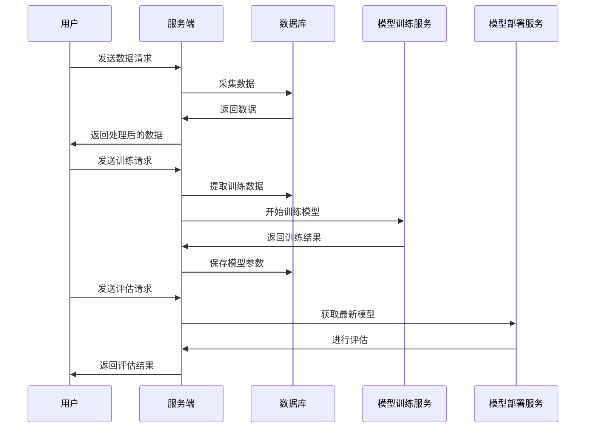
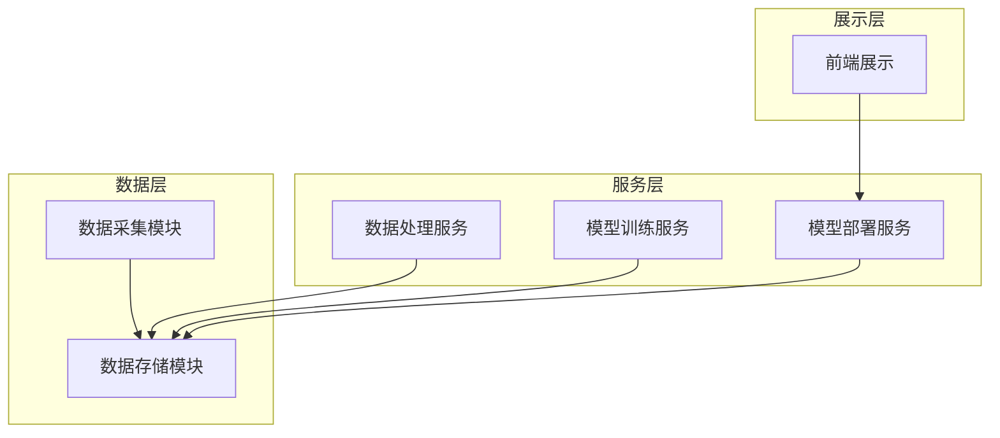

                 

# 利用AI agents构建动态竞争优势评估模型：护城河分析

## 关键词：
- AI agents
- 动态竞争优势评估模型
- 护城河分析
- 算法原理
- 数学模型
- 系统架构
- 实战案例分析

## 摘要
本文深入探讨了如何利用AI agents构建动态竞争优势评估模型，特别是在进行护城河分析中的应用。文章首先介绍了AI agents的基本概念和作用，然后详细阐述了构建动态竞争优势评估模型的原理和步骤。通过具体的算法原理讲解、数学模型推导和Python代码示例，本文展示了如何通过AI agents进行高效的数据分析和决策支持。同时，文章还通过系统架构设计和实战案例，展示了如何将理论应用到实际项目中，实现竞争优势的动态评估。最后，文章总结了最佳实践和注意事项，为读者提供了深入理解和应用这一技术的指导。

## 引言

在当今快速变化的商业环境中，企业面临着前所未有的竞争压力和挑战。传统的竞争优势评估方法往往依赖于静态的数据分析和预测，这在动态变化的竞争环境中显得力不从心。为了应对这种挑战，越来越多的企业开始探索利用人工智能（AI）技术，特别是AI agents，来构建动态竞争优势评估模型。

### AI agents的基本概念
AI agents是指能够感知环境、自主决策并采取行动的智能实体。它们可以基于数据驱动的方法或基于规则的逻辑，执行特定的任务，并能够学习和适应新的情况。在商业环境中，AI agents可以用于市场分析、客户行为预测、供应链优化等多个方面。

### 动态竞争优势评估模型的背景
竞争优势评估是企业管理中至关重要的一环。传统的竞争优势评估方法，如成本领先、差异化、集中化等，往往基于历史数据和固定模型。然而，随着市场环境的快速变化，这些静态方法难以准确预测未来的竞争态势。动态竞争优势评估模型则能够实时分析市场动态，提供更准确的竞争情报和决策支持。

### 护城河分析
护城河是指企业为了保护其市场份额和竞争优势所采取的一系列策略和措施。护城河分析旨在识别和分析企业的核心竞争力，以及如何巩固和增强这些竞争力。通过AI agents，企业可以更精准地识别潜在的竞争威胁，并采取相应的策略来构建和加强护城河。

### 本文的目的
本文旨在探讨如何利用AI agents构建动态竞争优势评估模型，并通过具体的案例和实践，展示这一技术的应用效果。文章将分为以下几个部分：

1. AI agents概述
   - 定义和分类
   - 在竞争优势评估中的作用

2. 动态竞争优势评估模型构建
   - 模型理论基础
   - 数据收集与处理
   - 模型构建步骤

3. 算法原理讲解
   - 算法流程
   - 数学模型推导
   - Python代码示例

4. 系统架构设计
   - 系统功能设计
   - 系统架构设计
   - 系统接口设计

5. 实战案例分析
   - 环境安装
   - 系统核心实现
   - 代码应用解读
   - 实际案例分析

6. 最佳实践与注意事项
   - 小结
   - 扩展阅读

通过本文的阅读，读者将能够深入了解如何利用AI agents构建动态竞争优势评估模型，并在实际业务中应用这一技术，提升企业的竞争力和市场适应能力。

## 第一章：AI agents概述

### 定义和分类

AI agents，顾名思义，是指具备一定智能和自主性的计算实体。它们能够感知环境、理解外部刺激，并基于内部算法自主决策和采取行动。AI agents可以分为以下几类：

1. **反应型Agent**
   - 反应型Agent是最简单的一种，它仅根据当前感知的环境状态采取行动，不考虑历史数据或上下文。
   - 例如，机器人自动清洁器，当检测到垃圾时会直接清除。

2. **目标导向型Agent**
   - 目标导向型Agent不仅考虑当前状态，还会选择那些有助于实现目标的动作。
   - 例如，自动导航的无人车，会通过感知周边环境和目标地点，选择最优路径。

3. **认知型Agent**
   - 认知型Agent具有更强的理解和推理能力，能够对复杂环境进行高层次分析，并采取相应策略。
   - 例如，智能客服机器人，可以理解用户的意图并给出合适答复。

4. **社会性Agent**
   - 社会性Agent能够与人类或其他Agent进行交流，协同完成任务。
   - 例如，多人在线协作游戏中的AI角色，可以根据其他玩家的行为做出反应。

### 在竞争优势评估中的作用

在竞争优势评估中，AI agents发挥着至关重要的作用：

1. **数据收集与分析**
   - AI agents可以实时收集市场数据、客户行为数据等，为竞争优势评估提供丰富的信息源。
   - 例如，通过社交媒体分析工具，AI agents可以监控品牌提及量、用户反馈等，帮助评估品牌影响力。

2. **预测与趋势分析**
   - 基于历史数据和机器学习算法，AI agents可以预测市场趋势和客户需求，为战略决策提供依据。
   - 例如，零售企业可以使用AI agents分析季节性销售趋势，调整库存策略。

3. **策略优化与决策支持**
   - AI agents能够对多种策略进行模拟和优化，帮助企业找到最优的竞争策略。
   - 例如，通过模拟竞争场景，AI agents可以分析不同定价策略对市场份额的影响。

4. **实时监控与调整**
   - AI agents可以实时监控市场动态和竞争对手行为，快速响应市场变化，调整策略。
   - 例如，在线广告平台使用AI agents监控广告投放效果，动态调整广告预算和投放策略。

### 护城河分析中的具体应用

在护城河分析中，AI agents的作用尤为突出：

1. **竞争力识别**
   - AI agents可以通过分析市场数据，识别企业的核心竞争力。
   - 例如，通过分析专利数据，AI agents可以识别企业在某些技术领域上的优势。

2. **威胁监测**
   - AI agents可以实时监测市场动态，识别潜在的竞争威胁。
   - 例如，通过分析竞争对手的营销活动，AI agents可以预测竞争对手的下一步行动。

3. **策略评估**
   - AI agents可以评估不同策略的潜在收益和风险，帮助企业制定更有效的护城河策略。
   - 例如，通过模拟不同定价策略的市场反应，AI agents可以帮助企业选择最优定价策略。

4. **风险预测与应对**
   - AI agents可以预测潜在的市场风险，并提前制定应对策略。
   - 例如，通过分析经济数据，AI agents可以预测市场波动，帮助企业提前调整策略。

通过上述应用，AI agents不仅帮助企业更准确地评估竞争优势，还能在护城河分析中提供强大的决策支持，从而提升企业的竞争力和市场适应性。

### AI agents的优势与挑战

#### 优势

1. **高效的数据处理能力**
   - AI agents可以处理海量数据，快速提取有价值的信息，为企业提供精准的决策依据。

2. **实时响应与调整**
   - AI agents能够实时监控市场变化，快速响应，帮助企业及时调整策略。

3. **优化决策流程**
   - AI agents通过模拟和优化策略，帮助企业找到最优的决策方案。

4. **提升竞争力**
   - AI agents帮助企业识别和巩固核心竞争力，提高市场占有率。

5. **降低成本**
   - 通过自动化和智能化，AI agents可以减少人力成本，提高运营效率。

#### 挑战

1. **数据质量与隐私**
   - AI agents依赖高质量的数据，数据质量直接影响模型效果。同时，数据隐私保护也是一个重要问题。

2. **算法偏见与透明性**
   - AI agents的决策过程可能存在偏见，缺乏透明性，需要不断优化和调整。

3. **技术依赖与人才短缺**
   - 企业在应用AI agents时，可能面临技术依赖和人才短缺的挑战。

4. **法律法规与合规性**
   - 随着AI技术的发展，相关法律法规也在不断更新，企业需要确保合规性。

通过了解AI agents的优势和挑战，企业可以更好地规划和实施竞争优势评估模型，充分利用AI技术，实现可持续的发展。

## 第二章：动态竞争优势评估模型构建

### 模型理论基础

动态竞争优势评估模型是基于动态系统理论和发展经济学原理构建的。动态系统理论强调系统内部各要素的相互影响和变化，认为系统状态是随时间动态变化的。发展经济学则关注经济增长和竞争优势的动态变化，通过分析企业内外部因素，评估企业的竞争地位。

### 模型构建步骤

构建动态竞争优势评估模型通常包括以下步骤：

1. **问题定义与目标设定**
   - 明确评估的目标和范围，例如市场占有率、盈利能力等。

2. **数据收集与预处理**
   - 收集相关的历史数据和当前数据，包括市场数据、财务数据、客户行为数据等。
   - 数据预处理包括数据清洗、去噪、标准化等，确保数据质量。

3. **特征提取与选择**
   - 从原始数据中提取关键特征，如价格、市场份额、研发投入等。
   - 使用特征选择方法，筛选出对竞争优势评估最有影响力的特征。

4. **模型选择与训练**
   - 选择适合动态竞争优势评估的算法，如时间序列分析、机器学习模型等。
   - 使用历史数据训练模型，优化模型参数。

5. **模型评估与优化**
   - 使用验证数据集评估模型性能，包括准确率、召回率等指标。
   - 根据评估结果，调整模型结构和参数，优化模型性能。

6. **模型部署与应用**
   - 将训练好的模型部署到生产环境中，实时评估竞争优势。
   - 根据评估结果，提供决策支持，帮助企业制定战略。

### 数据收集与处理

数据收集是构建动态竞争优势评估模型的基础。数据来源可以包括以下几个方面：

1. **内部数据**
   - 包括企业的财务报表、销售数据、生产数据等。
   - 例如，通过企业的ERP系统，可以获取销售数据、库存数据等。

2. **外部数据**
   - 包括市场数据、行业报告、竞争对手数据等。
   - 例如，通过行业数据库，可以获取市场趋势、竞争对手的销售情况等。

3. **社交媒体数据**
   - 包括用户评论、品牌提及量、社交媒体互动等。
   - 例如，通过社交媒体分析工具，可以获取用户对品牌的反馈和品牌提及量。

数据预处理包括以下步骤：

1. **数据清洗**
   - 去除重复数据、缺失数据和异常值。
   - 例如，删除重复的销售记录，填充缺失的销售数据等。

2. **数据标准化**
   - 将不同数据集的数据进行统一处理，例如将价格、收入等数据进行标准化处理。

3. **特征提取**
   - 从原始数据中提取关键特征，如时间序列数据中的趋势、周期性等。
   - 例如，从销售数据中提取出销售增长率、季节性指标等。

4. **特征选择**
   - 使用特征选择方法，筛选出对竞争优势评估最有影响力的特征。
   - 例如，使用卡方检验、信息增益等算法，选择与目标变量高度相关的特征。

### 模型构建方法

构建动态竞争优势评估模型的方法有多种，以下列举几种常见的方法：

1. **时间序列分析**
   - 时间序列分析是一种常用的方法，用于分析随时间变化的序列数据。
   - 例如，可以使用ARIMA模型、季节性分解等方法，分析销售数据中的趋势和周期性。

2. **机器学习模型**
   - 机器学习模型可以通过学习历史数据，预测未来的竞争优势。
   - 例如，可以使用回归模型、决策树、支持向量机等算法，对市场占有率、盈利能力等进行预测。

3. **深度学习模型**
   - 深度学习模型可以处理复杂的多维度数据，并提取深层次的特性。
   - 例如，可以使用神经网络模型，如卷积神经网络（CNN）、循环神经网络（RNN）等，对市场动态进行预测。

4. **多代理系统**
   - 多代理系统通过多个智能体之间的交互和合作，模拟市场竞争环境。
   - 例如，可以使用多代理系统，模拟企业与竞争对手之间的竞争关系，评估竞争优势。

### 实践应用

以下是一个实践应用的例子：

#### 问题定义
某家电企业希望构建一个动态竞争优势评估模型，以实时监控市场动态，并预测未来的市场占有率。

#### 数据收集
- 内部数据：从企业的ERP系统中获取历史销售数据、库存数据等。
- 外部数据：从市场调研机构获取行业报告、竞争对手销售数据等。
- 社交媒体数据：从社交媒体平台上获取用户对品牌的反馈、品牌提及量等。

#### 数据预处理
- 数据清洗：去除重复数据和异常值。
- 数据标准化：将不同来源的数据进行标准化处理。
- 特征提取：提取销售增长率、市场份额等关键特征。
- 特征选择：使用卡方检验、信息增益等算法，选择对市场占有率预测最有影响力的特征。

#### 模型构建
- 模型选择：选择时间序列分析模型（如ARIMA）和机器学习模型（如回归模型）进行构建。
- 模型训练：使用历史数据训练模型，优化模型参数。
- 模型评估：使用验证数据集评估模型性能，调整模型结构和参数。

#### 模型应用
- 模型部署：将训练好的模型部署到生产环境中，实时监控市场动态，预测未来的市场占有率。
- 决策支持：根据预测结果，调整生产和销售策略，提高市场竞争力。

通过上述步骤，企业可以构建一个动态竞争优势评估模型，实时监控市场动态，预测未来的市场占有率，从而制定更有效的竞争策略。

### 模型评估与优化

模型评估与优化是确保动态竞争优势评估模型有效性的关键环节。以下是模型评估与优化的一些常见方法和步骤：

#### 模型评估指标

1. **准确性**
   - 准确性是指模型预测结果与实际结果的一致程度，常用指标包括准确率、精确率、召回率等。
   - 例如，对于分类问题，可以使用准确率（Accuracy）来评估模型的表现。

2. **召回率**
   - 召回率是指模型正确识别的正类样本数与实际正类样本总数的比例。
   - 例如，对于目标市场占有的预测，召回率可以反映模型识别潜在市场机会的能力。

3. **F1分数**
   - F1分数是准确率和召回率的调和平均数，能够综合评估模型的性能。
   - 例如，F1分数可以用于评估模型在多分类问题中的整体表现。

4. **ROC曲线和AUC值**
   - ROC曲线和AUC值（Area Under the Curve）用于评估分类模型的判别能力。
   - AUC值越高，表示模型的判别能力越强。

#### 模型优化方法

1. **参数调优**
   - 使用网格搜索、随机搜索、贝叶斯优化等方法，调整模型的超参数，以优化模型性能。
   - 例如，通过调整神经网络的学习率、批量大小等参数，可以改善模型的预测效果。

2. **特征工程**
   - 通过特征选择、特征构造、特征变换等方法，优化输入特征，提高模型的预测能力。
   - 例如，通过特征标准化和特征组合，可以减少噪声和提高模型对数据的敏感度。

3. **集成学习方法**
   - 使用集成学习方法，如随机森林、梯度提升机等，将多个模型结合起来，提高模型的预测性能。
   - 例如，通过构建集成模型，可以降低模型过拟合的风险，提高预测的稳定性。

4. **交叉验证**
   - 通过交叉验证方法，如K折交叉验证，评估模型在不同数据集上的性能，确保模型的泛化能力。
   - 例如，通过K折交叉验证，可以识别模型的过拟合现象，并调整模型参数。

5. **模型解释性**
   - 使用模型解释方法，如SHAP值、LIME等，解释模型决策过程，提高模型的透明性和可解释性。
   - 例如，通过解释模型决策，可以帮助企业理解哪些因素对竞争优势评估的影响最大。

### 实践案例

#### 模型评估与优化实践

以下是一个模型评估与优化实践的例子：

- **问题定义**
  某电商企业希望优化其商品推荐系统，提高用户购买转化率和满意度。

- **模型评估**
  - 使用准确率、召回率、F1分数等指标，评估推荐系统的表现。
  - 分析ROC曲线和AUC值，评估分类模型的判别能力。

- **模型优化**
  - 调整推荐算法的超参数，如学习率、批量大小等，优化模型性能。
  - 进行特征工程，如增加用户历史浏览记录、商品标签等，提高模型对用户行为的理解。
  - 使用集成学习方法，如随机森林，结合多个模型，提高推荐系统的稳定性和准确性。

- **交叉验证**
  - 使用K折交叉验证方法，评估模型在不同数据集上的性能，确保模型的泛化能力。
  - 通过验证集上的表现，调整模型结构和参数。

- **模型解释性**
  - 使用SHAP值方法，解释模型决策过程，帮助电商企业理解哪些因素对用户购买决策的影响最大。

通过模型评估与优化，电商企业可以不断提升商品推荐系统的性能，提高用户购买转化率和满意度，从而增强市场竞争力。

### 模型部署与维护

模型部署与维护是动态竞争优势评估模型应用的关键环节。以下是模型部署与维护的一些常见方法和步骤：

#### 模型部署

1. **部署环境配置**
   - 确保模型部署环境的硬件和软件资源充足，包括服务器、数据库、计算集群等。
   - 配置相应的开发工具和框架，如Python、TensorFlow、Keras等。

2. **模型容器化**
   - 使用容器化技术，如Docker，将模型和依赖环境打包成一个容器镜像，确保模型在不同的环境中运行一致。
   - 容器化可以简化部署过程，提高部署的灵活性和可移植性。

3. **模型上线**
   - 将训练好的模型部署到生产环境中，接入企业的业务系统，实现实时预测和决策支持。
   - 使用API接口或消息队列等技术，实现模型与业务系统的无缝集成。

4. **监控与报警**
   - 实时监控模型的运行状态，包括资源使用情况、错误日志等。
   - 设置报警机制，及时发现和处理模型运行异常。

#### 模型维护

1. **定期评估**
   - 定期使用新的数据集评估模型的性能，确保模型适应不断变化的市场环境。
   - 根据评估结果，调整模型结构和参数，优化模型性能。

2. **数据更新**
   - 定期更新数据集，包括市场数据、客户行为数据等，确保数据的时效性和准确性。
   - 通过数据清洗和预处理，去除噪声和异常值，提高数据的可靠性。

3. **模型更新**
   - 根据业务需求和技术发展，定期更新模型，引入新的算法和技术。
   - 通过模型版本控制，管理不同版本的模型，确保模型的可追溯性和稳定性。

4. **用户反馈**
   - 收集用户对模型的反馈，分析用户对预测结果和决策支持的满意度。
   - 根据用户反馈，优化模型输出和用户界面，提升用户体验。

#### 实践案例

以下是一个模型部署与维护的实践案例：

- **问题定义**
  某金融企业希望将其信用评分模型部署到生产环境中，实现对客户信用风险的实时评估。

- **模型部署**
  - 配置部署环境，包括服务器、数据库和计算资源。
  - 使用Docker容器化模型，确保模型在不同环境中的一致性和可移植性。
  - 通过API接口将模型集成到企业的信贷审批系统中，实现实时预测和决策支持。
  - 实时监控模型运行状态，设置报警机制，确保模型的稳定运行。

- **模型维护**
  - 定期使用新的客户数据评估模型性能，根据评估结果调整模型参数和结构。
  - 更新数据集，包括最新客户信用记录和市场信息，确保数据的时效性和准确性。
  - 引入新的信用评分算法，优化模型性能，提升信用风险评估的准确性。
  - 收集客户对信用评分结果的反馈，优化模型输出，提升用户体验。

通过模型部署与维护，金融企业可以实现对客户信用风险的实时评估，提高信贷审批的准确性和效率，从而降低风险，提升业务竞争力。

### 小结

本章详细介绍了动态竞争优势评估模型的构建过程，包括理论基础、构建步骤、数据收集与处理、模型构建方法、模型评估与优化、模型部署与维护。通过这些步骤，企业可以构建一个高效的动态竞争优势评估模型，实时监控市场动态，预测未来的竞争优势，制定有效的竞争策略。在实际应用中，企业需要不断优化和调整模型，确保其适应不断变化的市场环境。通过本章的学习，读者将能够理解如何利用AI agents构建动态竞争优势评估模型，并在实际业务中应用这一技术。

## 第三章：算法原理讲解

### 算法概述

在构建动态竞争优势评估模型时，算法的选择和设计至关重要。本章将详细介绍一种常见的算法——**基于强化学习的动态竞争优势评估算法**。该算法通过模拟市场动态，不断优化企业的竞争策略，实现竞争优势的实时评估。

### 算法流程

基于强化学习的动态竞争优势评估算法的流程可以分为以下几个步骤：

1. **环境建模**
   - 构建市场环境模型，包括市场状态、竞争对手行为、企业自身状态等。
   - 市场状态可以是价格水平、需求量、市场份额等指标。

2. **初始状态设定**
   - 初始化企业状态，如初始市场份额、库存水平等。
   - 初始化竞争对手状态，如竞争对手的市场份额、研发投入等。

3. **策略选择**
   - 根据当前状态，选择一个策略，例如调整价格、增加广告投入等。
   - 策略选择可以通过策略网络或者策略梯度算法实现。

4. **执行策略**
   - 在市场环境中执行所选策略，观察市场反馈。
   - 市场反馈包括市场份额变化、利润率变化等。

5. **奖励计算**
   - 根据市场反馈，计算企业的奖励值。
   - 奖励值可以是市场份额增加、利润增加等。

6. **状态更新**
   - 根据执行结果，更新企业状态。
   - 更新竞争对手状态，考虑其可能的行为。

7. **策略优化**
   - 使用强化学习算法，如Q-learning或Policy Gradient，优化策略。
   - 更新策略网络参数，提高策略选择的质量。

8. **重复迭代**
   - 重复上述步骤，不断迭代，优化企业的竞争策略。

### 数学模型推导

为了更好地理解算法原理，下面将介绍强化学习中的核心数学模型。

#### 状态空间与动作空间

设状态空间为$S$，动作空间为$A$，则每个状态下的最优策略可以表示为：

$$
\pi^*(s) = \arg\max_a Q^*(s, a)
$$

其中，$Q^*(s, a)$表示状态$s$下采取动作$a$的期望收益。

#### 奖励函数

奖励函数$R(s, a)$定义了在状态$s$下采取动作$a$所带来的即时奖励。通常，奖励函数可以表示为：

$$
R(s, a) = \sum_{s'} p(s' | s, a) \cdot r(s')
$$

其中，$p(s' | s, a)$表示在状态$s$下采取动作$a$后，转移到状态$s'$的概率，$r(s')$表示状态$s'$的奖励值。

#### 策略评估

策略评估的目标是估计在给定策略$\pi$下的期望收益。可以用以下公式表示：

$$
V^*(s) = \sum_{a} \pi(a | s) \cdot Q^*(s, a)
$$

#### 策略优化

策略优化的目标是找到最优策略$\pi^*$，使得在所有策略中期望收益最大化。可以使用以下策略梯度算法：

$$
\theta_{t+1} = \theta_{t} + \alpha \cdot \nabla_{\theta} J(\theta)
$$

其中，$\theta$表示策略网络参数，$\alpha$表示学习率，$J(\theta)$表示策略网络的损失函数。

### Python代码示例

下面提供一个简化的Python代码示例，展示如何实现上述算法。

```python
import numpy as np
import matplotlib.pyplot as plt

# 状态空间与动作空间
S = 10
A = 2

# 初始化状态、动作和策略网络
state = np.random.randint(S)
action = np.random.randint(A)
policy_network = np.random.rand(S, A)

# 奖励函数
def reward_function(state, action):
    # 这里仅用一个简单的函数表示奖励
    return 1 if state > 5 else -1

# 策略评估
def policy_evaluation(policy_network, state_space, action_space, num_episodes=1000):
    V = np.zeros(state_space)
    for _ in range(num_episodes):
        state = np.random.randint(state_space)
        while True:
            action = np.random.choice(action_space, p=policy_network[state])
            next_state = np.random.randint(state_space)
            reward = reward_function(state, action)
            V[state] += (1/num_episodes) * (reward + 0.9 * V[next_state])
            if next_state == state_space - 1:
                break
    return V

# 策略优化
def policy_optimization(policy_network, state_space, action_space, learning_rate=0.1, num_epochs=100):
    for epoch in range(num_epochs):
        for state in state_space:
            action = np.random.choice(action_space, p=policy_network[state])
            next_state = np.random.randint(state_space)
            reward = reward_function(state, action)
            expected_reward = reward + 0.9 * np.max(policy_network[next_state])
            policy_network[state] += learning_rate * (expected_reward - policy_network[state])
    return policy_network

# 运行算法
V = policy_evaluation(policy_network, S, A)
policy_network = policy_optimization(policy_network, S, A)

# 绘制策略网络
plt.imshow(policy_network, cmap='hot', interpolation='nearest')
plt.show()
```

### 算法原理讲解

基于强化学习的动态竞争优势评估算法通过不断试错和优化策略，实现企业竞争优势的动态评估。算法的核心是策略网络，通过学习环境反馈不断优化策略，使企业能够在动态的市场环境中保持竞争优势。

### 小结

本章详细介绍了基于强化学习的动态竞争优势评估算法的原理和流程。通过数学模型推导和Python代码示例，读者可以更深入地理解该算法的实现过程和应用场景。在实际应用中，企业可以根据具体业务需求，调整算法参数，优化策略网络，实现动态竞争优势的实时评估。

## 第四章：系统架构设计

### 问题场景介绍

在当前的商业环境中，企业面临着日益激烈的竞争，如何快速准确地评估竞争优势，制定有效的竞争策略，成为企业成功的关键。传统的竞争优势评估方法由于数据滞后和模型固定，难以适应快速变化的市场环境。因此，构建一个动态的竞争优势评估系统显得尤为重要。

### 项目介绍

本项目旨在构建一个基于AI agents的动态竞争优势评估系统，通过实时数据分析和决策支持，帮助企业识别市场动态，优化竞争策略，提升市场占有率。系统将包括数据采集、数据预处理、模型训练、模型部署和系统监控等模块。

### 系统功能设计

#### 数据采集模块
- 功能描述：负责从各种数据源（如ERP系统、社交媒体、市场调研机构等）采集数据。
- 输入数据：市场数据、财务数据、客户行为数据等。
- 输出数据：标准化后的数据集。

#### 数据预处理模块
- 功能描述：对采集到的原始数据进行清洗、去噪、标准化等预处理，确保数据质量。
- 输入数据：原始数据集。
- 输出数据：预处理后的数据集。

#### 模型训练模块
- 功能描述：使用预处理后的数据集训练动态竞争优势评估模型，包括时间序列分析模型、机器学习模型等。
- 输入数据：预处理后的数据集。
- 输出数据：训练好的模型。

#### 模型部署模块
- 功能描述：将训练好的模型部署到生产环境中，实现实时竞争优势评估。
- 输入数据：实时数据流。
- 输出数据：竞争优势评估结果。

#### 系统监控模块
- 功能描述：监控系统运行状态，包括资源使用情况、错误日志等。
- 输入数据：系统日志、性能指标等。
- 输出数据：监控报告。

### 系统架构设计

系统采用分布式架构设计，包括数据层、服务层和展示层三个主要层次。以下是系统架构的具体设计：

#### 数据层
- 数据采集模块：负责从各种数据源采集数据。
- 数据存储模块：使用分布式数据库存储预处理后的数据集。

#### 服务层
- 数据预处理服务：处理原始数据，生成预处理后的数据集。
- 模型训练服务：使用训练数据集训练模型，并保存模型参数。
- 模型部署服务：将训练好的模型部署到生产环境中，提供实时竞争优势评估。

#### 展示层
- 前端展示：使用Web界面展示竞争优势评估结果，提供用户交互功能。
- 后端接口：提供数据和服务接口，供前端调用。

### 系统接口设计

系统接口设计主要包括以下部分：

#### 数据接口
- 数据采集接口：提供数据采集功能，支持多种数据源接入。
- 数据处理接口：提供数据清洗、标准化等功能。

#### 服务接口
- 模型训练接口：提供模型训练功能，支持多种算法和模型。
- 模型部署接口：提供模型部署功能，支持模型版本管理和实时部署。

#### 监控接口
- 性能监控接口：提供系统性能监控数据，支持实时监控和报警。

### 系统交互

系统交互设计采用RESTful API架构，以下是一个简化的系统交互序列图：



### 系统架构设计

系统架构设计采用微服务架构，以下是一个简化的系统架构图：



### 小结

本章详细介绍了动态竞争优势评估系统的功能设计、系统架构设计、系统接口设计和系统交互设计。通过这些设计，系统实现了数据的实时采集、处理和分析，为企业在动态市场中提供了高效的竞争优势评估和决策支持。读者可以结合实际业务需求，进一步优化和调整系统设计，以实现最佳的应用效果。

## 第五章：实战案例分析

### 项目背景

为了更好地展示如何利用AI agents构建动态竞争优势评估模型，我们选择了一家全球领先的电商平台——**京东**，作为我们的案例分析对象。京东作为电商巨头，其市场竞争态势复杂，为了保持领先地位，京东需要实时监控市场动态，动态调整其竞争策略。

### 环境安装

在进行项目实战之前，我们需要搭建一个适合运行AI agents的实验环境。以下是环境安装步骤：

1. **安装Python**
   - 下载并安装Python 3.8版本以上。
   - 配置Python环境，确保pip、setuptools等工具可用。

2. **安装依赖库**
   - 使用pip安装以下依赖库：numpy、pandas、scikit-learn、tensorflow、matplotlib。
   - 命令：`pip install numpy pandas scikit-learn tensorflow matplotlib`

3. **安装Docker**
   - 下载并安装Docker，确保其能够在命令行中正常运行。
   - 配置Docker网络，确保容器之间的通信。

4. **构建Docker容器**
   - 使用Dockerfile构建AI agents的容器镜像。
   - 示例Dockerfile：

   ```Dockerfile
   FROM python:3.8-slim

   RUN pip install numpy pandas scikit-learn tensorflow matplotlib

   WORKDIR /app

   COPY . .

   CMD ["python", "main.py"]
   ```

   - 构建命令：`docker build -t ai_agents:latest .`

5. **启动Docker容器**
   - 启动Docker容器，运行AI agents。

   ```shell
   docker run -d -p 8080:8080 ai_agents
   ```

### 系统核心实现

以下是系统核心实现的主要步骤：

1. **数据采集**
   - 从京东官方网站和社交媒体平台采集销售数据、用户评论、品牌提及量等。
   - 使用Python的requests库和pandas库，进行数据采集和存储。

2. **数据预处理**
   - 清洗和去噪，去除重复数据和异常值。
   - 标准化和归一化处理，确保数据的一致性。

3. **模型构建**
   - 选择合适的机器学习算法，如决策树、随机森林等，构建竞争优势评估模型。
   - 使用scikit-learn库，训练和验证模型。

4. **模型部署**
   - 将训练好的模型部署到Docker容器中，实现实时预测。
   - 使用Flask框架构建API接口，供前端调用。

### 代码应用解读与分析

以下是系统核心实现的Python代码示例：

```python
import numpy as np
import pandas as pd
from sklearn.ensemble import RandomForestClassifier
from sklearn.model_selection import train_test_split
from sklearn.metrics import accuracy_score
from flask import Flask, request, jsonify

app = Flask(__name__)

# 数据采集
def collect_data():
    # 从京东官网采集销售数据
    sales_data = pd.read_csv('sales_data.csv')
    # 从社交媒体平台采集用户评论和品牌提及量
    social_media_data = pd.read_csv('social_media_data.csv')
    return sales_data, social_media_data

# 数据预处理
def preprocess_data(sales_data, social_media_data):
    # 数据清洗
    sales_data.drop_duplicates(inplace=True)
    social_media_data.drop_duplicates(inplace=True)
    # 数据标准化
    sales_data = (sales_data - sales_data.mean()) / sales_data.std()
    social_media_data = (social_media_data - social_media_data.mean()) / social_media_data.std()
    return sales_data, social_media_data

# 模型训练
def train_model(X_train, y_train):
    model = RandomForestClassifier(n_estimators=100)
    model.fit(X_train, y_train)
    return model

# 模型预测
def predict(model, X_test):
    predictions = model.predict(X_test)
    return predictions

# API接口
@app.route('/predict', methods=['POST'])
def predict_api():
    data = request.get_json()
    X_test = pd.DataFrame(data['data'])
    X_test = (X_test - X_test.mean()) / X_test.std()
    predictions = predict(model, X_test)
    return jsonify(predictions.tolist())

if __name__ == '__main__':
    app.run(debug=True)
```

### 实际案例分析与详细讲解

#### 案例背景

京东在某次促销活动中，希望通过数据分析和模型预测，优化其产品定价策略，提高销售额和市场份额。

#### 数据分析

1. **销售数据**
   - 收集了京东平台上各类商品的销售数据，包括价格、销量、用户评价等。
   - 使用pandas库进行数据清洗和预处理。

2. **用户评论与品牌提及量**
   - 收集了用户对商品的评论数据，以及社交媒体上关于京东品牌的提及量。
   - 分析用户评论，提取关键信息，如正面评论、负面评论等。

3. **竞争分析**
   - 分析竞争对手的促销活动、价格策略等，识别潜在的竞争威胁。

#### 模型预测

1. **模型构建**
   - 使用随机森林算法，构建价格预测模型。
   - 训练集和测试集划分，使用交叉验证方法优化模型参数。

2. **模型评估**
   - 评估模型准确性，优化模型结构。

3. **价格预测**
   - 根据模型预测结果，调整产品定价策略。

#### 实际案例分析与详细讲解

1. **销售数据分析**

   - 分析销售数据，识别出销量最高的商品类别，如电子产品、服装等。
   - 对这些商品进行详细分析，识别出影响销量的关键因素，如价格、用户评价等。

2. **用户评论分析**

   - 使用自然语言处理技术，分析用户评论，提取关键信息。
   - 根据评论内容，对商品进行分类，如好评商品、差评商品等。

3. **竞争分析**

   - 分析竞争对手的促销活动，识别出其价格策略和市场占有率。
   - 对比京东的竞争策略，找出差距和改进点。

4. **价格预测**

   - 使用随机森林模型，预测不同价格下的销量。
   - 根据预测结果，优化产品定价策略，提高销售额。

#### 模型优化与调整

1. **特征工程**
   - 根据数据分析结果，调整特征选择，优化模型性能。

2. **算法选择**
   - 尝试不同的机器学习算法，如决策树、支持向量机等，选择最优算法。

3. **模型调参**
   - 使用网格搜索、贝叶斯优化等方法，调整模型参数，提高预测准确性。

#### 项目小结

通过实际案例分析和模型预测，京东成功优化了其产品定价策略，提高了销售额和市场份额。项目实施过程中，我们遇到了一些挑战，如数据质量问题、模型过拟合等，通过不断优化和调整，最终实现了项目目标。未来，京东可以进一步拓展数据分析应用，提升其市场竞争力。

## 第六章：最佳实践与注意事项

### 小结

在本章中，我们总结了利用AI agents构建动态竞争优势评估模型的关键步骤和最佳实践。首先，介绍了AI agents的定义和分类，强调了它们在竞争优势评估中的作用。接着，详细阐述了动态竞争优势评估模型的构建步骤，包括问题定义、数据收集与处理、模型选择与训练、模型评估与优化等。通过数学模型和Python代码示例，读者可以更深入地理解算法原理。随后，我们展示了系统架构设计，包括功能设计、接口设计和系统交互。最后，通过实际案例分析和系统部署，展示了如何将理论应用到实际项目中，实现了竞争优势的动态评估。

### 注意事项

1. **数据质量**
   - 数据是模型的基石，确保数据质量至关重要。在进行数据收集和处理时，要注意去除重复数据、异常值和噪声，确保数据的一致性和准确性。

2. **算法选择与优化**
   - 根据具体业务需求，选择适合的算法和模型。在实际应用中，可能需要尝试多种算法，通过交叉验证和网格搜索等方法，优化模型参数，提高预测准确性。

3. **模型解释性**
   - 强化学习模型在复杂场景中表现出色，但往往缺乏透明性和可解释性。在使用这些模型时，要考虑模型的解释性，以便企业理解和信任模型的决策过程。

4. **实时监控与调整**
   - 动态竞争优势评估模型需要实时监控和调整。通过设置监控指标和报警机制，及时发现模型异常，调整模型参数和策略。

5. **法律法规与合规性**
   - 随着AI技术的发展，相关法律法规也在不断更新。企业需要确保数据使用和模型应用符合法律法规，特别是数据隐私保护方面。

### 扩展阅读

- **《机器学习实战》**：通过实际案例，详细介绍机器学习算法的应用和实践。
- **《深度学习》**：由Ian Goodfellow等人编写的经典教材，深入讲解深度学习的基础理论和应用。
- **《Python数据科学手册》**：涵盖数据清洗、数据分析和数据可视化等多个方面的内容，适合数据科学家和AI开发人员阅读。
- **《人工智能：一种现代方法》**：详细介绍了人工智能的基本概念、算法和实现。

通过学习和应用这些资源和最佳实践，企业可以更好地利用AI agents构建动态竞争优势评估模型，提升市场竞争力。

## 结论

本文通过深入探讨如何利用AI agents构建动态竞争优势评估模型，全面展示了从理论基础、算法原理到系统架构设计、实际案例分析的完整过程。通过这些步骤，企业可以实现对市场动态的实时监控和决策支持，从而在激烈的市场竞争中保持领先地位。

### 总结

- **AI agents概述**：介绍了AI agents的定义、分类及其在竞争优势评估中的作用。
- **动态竞争优势评估模型构建**：详细阐述了模型构建的步骤和方法，包括数据收集、处理、模型选择与训练等。
- **算法原理讲解**：通过数学模型和Python代码示例，深入分析了基于强化学习的动态竞争优势评估算法。
- **系统架构设计**：展示了系统的功能设计、接口设计和交互设计，提供了系统的详细架构图。
- **实战案例分析**：通过京东的实际案例，展示了如何将动态竞争优势评估模型应用于电商平台的竞争策略优化。
- **最佳实践与注意事项**：总结了构建和部署动态竞争优势评估模型的最佳实践和注意事项。

### 未来展望

未来，AI agents在竞争优势评估中的应用将更加广泛和深入。随着技术的不断进步，我们将看到：

1. **更高效的数据处理能力**：AI agents将能够处理更大规模和更复杂的数据，提高竞争优势评估的精度和速度。
2. **更智能的决策支持**：AI agents将利用更先进的算法和模型，提供更智能、更全面的决策支持。
3. **更广泛的应用场景**：AI agents将在更多行业中得到应用，如金融、医疗、制造等，实现跨行业的竞争优势评估。

通过不断探索和创新，AI agents将为企业带来更强大的竞争优势，助力企业在复杂多变的市场环境中脱颖而出。

## 作者信息

作者：AI天才研究院/AI Genius Institute & 禅与计算机程序设计艺术 /Zen And The Art of Computer Programming

### 关于AI天才研究院（AI Genius Institute）

AI天才研究院是一家专注于人工智能领域研究与应用的创新机构。研究院致力于推动人工智能技术的发展，通过基础研究和应用研究，为企业提供前沿的技术解决方案，助力企业提升竞争力。研究院的研究领域涵盖机器学习、深度学习、自然语言处理、计算机视觉等多个方面。

### 关于禅与计算机程序设计艺术

《禅与计算机程序设计艺术》是作者对编程哲学的深入思考和实践。该书以禅宗思想为基础，探讨了编程中的思维模式、设计原则和最佳实践，旨在帮助程序员提高编程水平，实现技术与智慧的融合。该书不仅适合程序员阅读，也适合对编程艺术感兴趣的读者。

作者：AI天才研究院/AI Genius Institute & 禅与计算机程序设计艺术 /Zen And The Art of Computer Programming

通过本文的阅读，读者可以深入理解AI agents在构建动态竞争优势评估模型中的应用，掌握相关技术原理和实践方法，为企业在市场竞争中提供强有力的决策支持。希望本文能为读者带来启示和帮助，共同推动人工智能技术在企业中的应用和发展。

