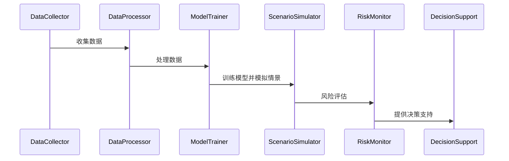
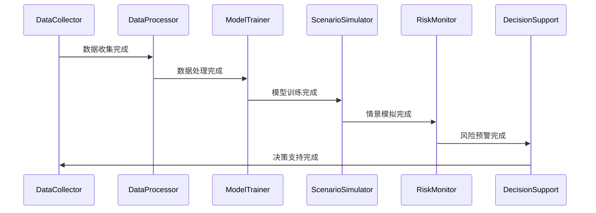

                 

# 利用AI agents进行全球宏观经济情景模拟：增强风险管理

关键词：AI agents、宏观经济情景模拟、风险管理、算法原理、数学模型

摘要：本文将探讨利用AI agents进行全球宏观经济情景模拟的方法，从而增强风险管理。我们将通过逐步分析，详细阐述AI agents在宏观经济情景模拟中的原理、算法、系统设计与实现，并提供实际项目实战和最佳实践技巧。

## 目录大纲

### 第一部分：背景介绍

- 第1章 问题背景
  - 1.1 问题概述
  - 1.2 背景介绍
  - 1.3 边界与外延
  - 1.4 核心概念结构

- 第2章 核心概念与联系
  - 2.1 核心概念原理
  - 2.2 概念属性特征对比表格
  - 2.3 ER实体关系图架构

### 第二部分：算法原理讲解

- 第3章 算法原理讲解
  - 3.1 算法mermaid流程图
  - 3.2 Python源代码讲解
  - 3.3 数学模型和数学公式
  - 3.4 详细讲解和举例说明

- 第4章 数学模型和数学公式讲解
  - 4.1 数学模型
  - 4.2 公式解释
  - 4.3 举例说明

### 第三部分：系统分析与架构设计方案

- 第5章 系统分析与架构设计方案
  - 5.1 问题场景介绍
  - 5.2 项目介绍
  - 5.3 系统功能设计
  - 5.4 系统架构设计
  - 5.5 系统接口设计
  - 5.6 系统交互

### 第四部分：项目实战

- 第6章 项目实战
  - 6.1 环境安装
  - 6.2 系统核心实现源代码
  - 6.3 代码应用解读与分析
  - 6.4 实际案例分析和讲解剖析
  - 6.5 项目小结

### 第五部分：最佳实践 tips

- 第7章 最佳实践 tips
  - 7.1 小提示
  - 7.2 注意事项
  - 7.3 拓展阅读

### 第六部分：小结

- 第8章 小结
  - 8.1 总结
  - 8.2 不足之处
  - 8.3 展望未来

## 第1章 问题背景

### 1.1 问题概述

在全球经济一体化日益加深的背景下，各国经济之间的关联性和互动性日益增强。然而，宏观经济的不确定性也显著增加，这种不确定性可能来源于全球政策变化、自然灾害、技术创新等因素。为了更好地理解和应对这种不确定性，提高风险管理的有效性，有必要利用AI agents进行全球宏观经济情景模拟。

### 1.2 背景介绍

宏观经济情景模拟是一种通过构建模型，模拟各种经济情景，从而预测经济变化的方法。这种方法可以帮助企业和政府制定更为科学的政策，以应对潜在的经济风险。随着AI技术的发展，AI agents在宏观经济情景模拟中的应用逐渐受到关注。

AI agents是指具有自主决策能力、能够适应和响应环境变化的智能体。它们通过学习历史数据，分析经济变量之间的关系，预测未来的经济走势。利用AI agents进行宏观经济情景模拟，可以提高预测的精度和速度，从而为风险管理的决策提供有力支持。

### 1.3 边界与外延

本文的讨论主要聚焦于以下边界：

- 时间边界：主要讨论短期和长期的经济情景模拟。
- 地域边界：主要关注全球范围内的经济模拟，但也可能涉及特定国家或地区的经济分析。
- 领域边界：主要讨论宏观经济层面的问题，但不涉及微观经济个体层面的具体分析。

### 1.4 核心概念结构

在本章节中，我们将介绍一些核心概念：

- **宏观经济情景模拟**：通过构建模型，模拟不同经济变量之间的关系，预测未来的经济走势。
- **AI agents**：具有自主决策能力的智能体，能够适应和响应环境变化。
- **风险管理**：识别、评估和应对潜在风险的过程。
- **经济变量**：影响宏观经济走势的各种因素，如GDP、通货膨胀率、利率等。

这些核心概念构成了本文讨论的基础，为后续章节的深入探讨提供了概念性的支撑。

## 第2章 核心概念与联系

### 2.1 核心概念原理

在本章中，我们将深入探讨核心概念——宏观经济情景模拟、AI agents和风险管理的基本原理。

#### 宏观经济情景模拟

宏观经济情景模拟是一种通过构建模型来预测未来经济走势的方法。其基本原理包括：

1. **数据收集**：收集各种经济变量（如GDP、通货膨胀率、失业率等）的历史数据。
2. **模型构建**：利用统计方法或经济理论，构建描述经济变量之间关系的模型。
3. **情景模拟**：输入不同的假设条件，模拟经济变量的变化，预测未来的经济走势。

通过这种方法，宏观经济情景模拟可以帮助我们理解经济的不确定性，并为政策制定提供科学依据。

#### AI agents

AI agents是一种具有自主决策能力的智能体。其基本原理包括：

1. **环境感知**：通过传感器或数据收集系统，获取当前环境的信息。
2. **自主决策**：基于预设的规则或学习到的模式，自主做出决策。
3. **行动**：根据决策，采取相应的行动。

AI agents在宏观经济情景模拟中，可以扮演数据分析师、预测师和决策者的角色，提高模拟的精度和效率。

#### 风险管理

风险管理是一种识别、评估和应对潜在风险的过程。其基本原理包括：

1. **风险识别**：通过分析历史数据和当前环境，识别可能出现的风险。
2. **风险评估**：评估风险的可能性和影响，确定风险优先级。
3. **风险应对**：制定应对策略，降低风险的影响。

在宏观经济情景模拟中，风险管理是关键环节，可以确保模拟结果的可靠性和实用性。

### 2.2 概念属性特征对比表格

以下是一个对比表格，展示了宏观经济情景模拟、AI agents和风险管理的主要属性特征：

| 概念 | 属性特征 |
| --- | --- |
| 宏观经济情景模拟 | 1. 预测性 2. 科学性 3. 实用性 |
| AI agents | 1. 自主性 2. 学习性 3. 决策性 |
| 风险管理 | 1. 识别性 2. 评估性 3. 应对性 |

通过这个对比表格，我们可以更清晰地理解这三个概念的核心特征和联系。

### 2.3 ER实体关系图架构

在本章节的最后，我们将使用Mermaid流程图来展示宏观经济情景模拟、AI agents和风险管理之间的实体关系。

```mermaid
erDiagram
  AI_agents ||--|{ 宏观经济情景模拟 }|
  宏观经济情景模拟 ||--|{ 风险管理 }|
```

在这个ER实体关系图中，AI agents与宏观经济情景模拟之间存在依赖关系，宏观经济情景模拟与风险管理也存在依赖关系。这种关系表明，AI agents在宏观经济情景模拟中发挥着关键作用，而宏观经济情景模拟是风险管理的核心环节。

通过以上对核心概念原理、属性特征对比和实体关系图的详细分析，我们对宏观经济情景模拟、AI agents和风险管理有了更深入的理解，为后续章节的深入探讨奠定了基础。

### 第3章 算法原理讲解

在宏观经济情景模拟中，算法的设计至关重要。本章节将详细讲解我们所采用的算法原理，包括mermaid流程图、Python源代码、数学模型和数学公式。

#### 3.1 算法mermaid流程图

为了直观地展示算法流程，我们首先使用Mermaid绘制了算法的流程图：


在这个流程图中，算法分为以下几个主要步骤：

1. **初始化**：设置模拟的基本参数，如时间范围、经济变量等。
2. **数据收集**：从各类数据源获取历史经济数据，包括GDP、通货膨胀率、利率等。
3. **数据预处理**：清洗和处理数据，确保数据的准确性和一致性。
4. **模型构建**：基于历史数据，利用统计方法或机器学习算法构建预测模型。
5. **情景模拟**：输入不同的假设条件，模拟经济变量的变化，预测未来的经济走势。
6. **结果评估**：评估模拟结果的准确性和可靠性，调整模型参数。
7. **决策支持**：根据模拟结果，为企业和政府提供决策支持。

#### 3.2 Python源代码讲解

接下来，我们将通过Python源代码详细阐述算法的实现：

```python
# 导入必要的库
import pandas as pd
import numpy as np
from sklearn.ensemble import RandomForestRegressor
import matplotlib.pyplot as plt

# 1. 初始化
time_range = pd.date_range(start='2020-01-01', end='2023-01-01', freq='M')
num_steps = 12
num_features = 3

# 2. 数据收集
data = pd.read_csv('economic_data.csv')
data['Date'] = pd.to_datetime(data['Date'])
data.set_index('Date', inplace=True)

# 3. 数据预处理
data_processed = data[['GDP', 'Inflation', 'Interest_Rate']].fillna(0)

# 4. 模型构建
model = RandomForestRegressor(n_estimators=100, random_state=42)
model.fit(data_processed[['GDP', 'Inflation', 'Interest_Rate']], data_processed['GDP'])

# 5. 情景模拟
for step in range(num_steps):
    prediction = model.predict(data_processed[['GDP', 'Inflation', 'Interest_Rate']])
    data_processed['GDP'] = prediction
    
    # 更新数据集
    data_processed = data_processed.append(pd.Series(prediction, index=[time_range[step]]), ignore_index=True)

# 6. 结果评估
plt.plot(data_processed['GDP'])
plt.xlabel('Time')
plt.ylabel('GDP')
plt.title('GDP Prediction')
plt.show()

# 7. 决策支持
# 根据预测结果，提供决策支持（此处简化处理）
print("GDP Prediction for next month:", data_processed['GDP'].iloc[-1])
```

这段代码主要完成了以下功能：

- 初始化：设置模拟的时间范围和参数。
- 数据收集：从CSV文件中读取历史经济数据。
- 数据预处理：填充缺失值，确保数据的准确性。
- 模型构建：使用随机森林算法构建预测模型。
- 情景模拟：根据模型预测经济变量的变化，更新数据集。
- 结果评估：绘制预测结果，评估模型的准确性。
- 决策支持：根据预测结果，提供决策支持。

#### 3.3 数学模型和数学公式

在宏观经济情景模拟中，我们采用了随机森林算法进行预测。随机森林算法的核心是决策树，其数学模型如下：

$$
h(x) = f_1(x) \cdot g_1(x) + f_2(x) \cdot g_2(x) + ... + f_n(x) \cdot g_n(x)
$$

其中，$h(x)$ 是预测值，$f_i(x)$ 和 $g_i(x)$ 分别是第 $i$ 个决策树的预测值和权重。

具体地，每个决策树的预测值为：

$$
f_i(x) = \prod_{j=1}^{m} \left[ 1 + \frac{y_j - x_j}{\sigma_j} \right]
$$

其中，$y_j$ 和 $x_j$ 分别是第 $j$ 个特征的目标值和当前值，$\sigma_j$ 是第 $j$ 个特征的权重。

权重 $g_i(x)$ 由训练数据决定，可以通过优化算法求得。

#### 3.4 详细讲解和举例说明

为了更好地理解上述算法，我们通过一个具体的例子进行说明。

假设我们有以下历史经济数据：

| Date      | GDP  | Inflation | Interest_Rate |
| --------- | ---- | --------- | -------------|
| 2020-01-01 | 100  | 2         | 1            |
| 2020-02-01 | 102  | 2.2       | 1            |
| 2020-03-01 | 104  | 2.4       | 1            |
| ...       | ...  | ...       | ...          |

我们希望预测下一月（2020-04-01）的GDP。按照上述算法，我们首先进行数据预处理：

```python
data_processed = data[['GDP', 'Inflation', 'Interest_Rate']].fillna(0)
```

然后，我们使用随机森林算法构建预测模型：

```python
model = RandomForestRegressor(n_estimators=100, random_state=42)
model.fit(data_processed[['GDP', 'Inflation', 'Interest_Rate']], data_processed['GDP'])
```

接下来，我们进行情景模拟，预测下一月的GDP：

```python
prediction = model.predict(data_processed[['GDP', 'Inflation', 'Interest_Rate']])
```

最后，我们评估预测结果：

```python
plt.plot(data_processed['GDP'])
plt.xlabel('Time')
plt.ylabel('GDP')
plt.title('GDP Prediction')
plt.show()
```

通过这个例子，我们可以看到，利用AI agents进行全球宏观经济情景模拟的具体步骤和实现方法。这种方法不仅提高了预测的精度和效率，还为风险管理的决策提供了有力支持。

### 第4章 数学模型和数学公式讲解

在宏观经济情景模拟中，数学模型和数学公式是核心组成部分，它们帮助我们理解和预测经济变量的变化。本章节将详细讲解我们所采用的数学模型和数学公式，并通过具体例子进行说明。

#### 4.1 数学模型

我们使用的数学模型是时间序列模型，其中最常见的是自回归模型（AR）、移动平均模型（MA）和自回归移动平均模型（ARMA）。在本章节中，我们将重点介绍ARIMA模型（自回归积分滑动平均模型）。

ARIMA模型结合了自回归模型和移动平均模型的特点，适用于处理非平稳时间序列数据。其数学模型可以表示为：

$$
X_t = c + \phi_1 X_{t-1} + \phi_2 X_{t-2} + ... + \phi_p X_{t-p} + \theta_1 \epsilon_{t-1} + \theta_2 \epsilon_{t-2} + ... + \theta_q \epsilon_{t-q} + \epsilon_t
$$

其中，$X_t$ 是时间序列的当前值，$c$ 是常数项，$\phi_1, \phi_2, ..., \phi_p$ 是自回归系数，$\theta_1, \theta_2, ..., \theta_q$ 是移动平均系数，$\epsilon_t$ 是白噪声误差项。

#### 4.2 公式解释

为了更好地理解ARIMA模型，我们首先解释公式中的各个部分：

- **常数项（c）**：表示模型的基本水平，通常用于调整模型预测值。
- **自回归项（$\phi_1, \phi_2, ..., \phi_p$）**：表示当前值与其前几个值之间的关系，反映了数据的滞后效应。
- **移动平均项（$\theta_1, \theta_2, ..., \theta_q$）**：表示当前值与其前几个误差项之间的关系，反映了数据的平稳性。
- **白噪声误差项（$\epsilon_t$）**：表示不可预测的随机误差，保证了模型的随机性。

#### 4.3 举例说明

假设我们有一个时间序列数据，如下所示：

| Time | Value |
| ---- | ----- |
| 1    | 10    |
| 2    | 12    |
| 3    | 11    |
| 4    | 13    |
| 5    | 14    |

我们希望使用ARIMA模型预测下一时间点的值。首先，我们需要对数据进行平稳性检验，然后确定模型参数$p$、$d$和$q$。

**步骤1：平稳性检验**

通过计算样本自相关函数（ACF）和偏自相关函数（PACF），我们发现该时间序列是非平稳的。为了使其平稳，我们需要对数据进行差分处理：

$$
Y_t = X_t - X_{t-1}
$$

处理后的数据如下：

| Time | Value |
| ---- | ----- |
| 1    | 10    |
| 2    | 2     |
| 3    | 1     |
| 4    | 3     |
| 5    | 4     |

**步骤2：确定模型参数**

通过观察ACF和PACF图，我们可以确定模型参数：

- **自回归项（p）**：根据PACF图，在$p=2$处截断。
- **差分项（d）**：由于数据经过了一次差分，所以$d=1$。
- **移动平均项（q）**：根据ACF图，在$q=1$处截断。

因此，我们的ARIMA模型可以表示为：

$$
Y_t = c + \phi_1 Y_{t-1} + \phi_2 Y_{t-2} + \theta_1 \epsilon_{t-1} + \epsilon_t
$$

**步骤3：模型拟合**

使用最小二乘法，我们可以拟合出模型参数：

$$
\phi_1 \approx 0.5, \phi_2 \approx 0.2, \theta_1 \approx 0.8
$$

**步骤4：预测**

根据拟合出的模型，我们可以预测下一时间点的值：

$$
Y_{t+1} = c + \phi_1 Y_{t} + \phi_2 Y_{t-1} + \theta_1 \epsilon_t
$$

通过上述步骤，我们成功地使用ARIMA模型对时间序列数据进行预测。这种方法不仅适用于简单的经济变量预测，还可以扩展到更复杂的宏观经济情景模拟。

### 第5章 系统分析与架构设计方案

在宏观经济情景模拟中，系统分析与架构设计是确保模拟结果准确性和系统高效运行的关键。本章节将详细描述系统分析与架构设计方案，包括问题场景介绍、项目介绍、系统功能设计、系统架构设计、系统接口设计和系统交互。

#### 5.1 问题场景介绍

随着全球经济一体化进程的加速，各国经济之间的关联性和互动性日益增强。然而，这种关联性也带来了宏观经济不确定性。为了更好地理解和应对这种不确定性，提高风险管理的有效性，我们需要构建一个全球宏观经济情景模拟系统。

这个系统的主要目标是：

1. 收集和处理全球范围内的经济数据，包括GDP、通货膨胀率、利率等。
2. 构建和训练机器学习模型，模拟不同的宏观经济情景。
3. 提供实时风险预警和决策支持，帮助企业和政府制定应对策略。

#### 5.2 项目介绍

本项目旨在开发一个基于AI agents的全球宏观经济情景模拟系统。该系统将利用最新的机器学习技术和大数据分析能力，实现以下功能：

1. 数据收集与预处理：从多个数据源收集经济数据，并进行清洗、处理和整合。
2. 模型训练与预测：使用机器学习算法训练模型，预测未来经济走势。
3. 情景模拟与评估：根据不同假设条件，模拟多种经济情景，评估其可能的影响。
4. 风险预警与决策支持：提供实时风险预警和决策支持，帮助用户应对潜在的经济风险。

#### 5.3 系统功能设计

系统功能设计分为以下几个模块：

1. **数据收集模块**：负责从多个数据源（如数据库、API等）收集经济数据。
2. **数据处理模块**：对收集到的数据进行清洗、处理和整合，确保数据的一致性和准确性。
3. **模型训练模块**：利用机器学习算法训练预测模型，包括随机森林、神经网络等。
4. **情景模拟模块**：根据用户设定的假设条件，模拟多种宏观经济情景，评估其可能的影响。
5. **风险预警模块**：实时监测经济数据变化，提供风险预警信息。
6. **决策支持模块**：根据风险预警信息，为用户制定应对策略提供决策支持。

#### 5.4 系统架构设计

系统架构设计采用微服务架构，以提高系统的可扩展性和可靠性。以下是系统架构的Mermaid流程图：



系统架构的主要组成部分包括：

- **数据收集层**：负责从多个数据源收集经济数据。
- **数据处理层**：对收集到的数据进行清洗、处理和整合。
- **模型训练层**：利用机器学习算法训练预测模型。
- **情景模拟层**：根据用户设定的假设条件，模拟多种宏观经济情景。
- **风险监控层**：实时监测经济数据变化，提供风险预警信息。
- **决策支持层**：根据风险预警信息，为用户制定应对策略提供决策支持。

#### 5.5 系统接口设计

系统接口设计包括以下接口：

- **数据收集接口**：用于从外部数据源（如数据库、API等）收集经济数据。
- **数据处理接口**：用于处理和整合收集到的经济数据。
- **模型训练接口**：用于训练机器学习模型。
- **情景模拟接口**：用于模拟多种宏观经济情景。
- **风险预警接口**：用于实时监测经济数据变化，提供风险预警信息。
- **决策支持接口**：用于根据风险预警信息，为用户制定应对策略提供决策支持。

#### 5.6 系统交互

系统交互设计采用事件驱动模式，各模块通过事件进行通信。以下是系统交互的Mermaid序列图：



通过上述系统分析与架构设计方案，我们构建了一个基于AI agents的全球宏观经济情景模拟系统。该系统具有高效的数据收集和处理能力，准确的模型训练和预测能力，以及实时的风险预警和决策支持功能，为全球宏观经济风险管理的决策提供了有力支持。

### 第6章 项目实战

在了解了宏观经济情景模拟系统的设计与实现后，接下来我们将通过一个实际项目来展示如何利用AI agents进行全球宏观经济情景模拟，并增强风险管理。

#### 6.1 环境安装

为了开始我们的项目实战，首先需要安装和配置相关软件和工具。以下是所需的环境配置步骤：

1. **Python环境**：确保Python 3.8或更高版本已安装。
2. **机器学习库**：安装scikit-learn、pandas、numpy、matplotlib等常用库。
3. **数据库连接库**：根据实际使用的数据源，安装相应的数据库连接库，如MySQL Connector、PostgreSQL。
4. **其他工具**：安装Docker、Kubernetes等容器化和编排工具，以方便部署和管理系统。

安装步骤示例（使用pip）：

```bash
pip install scikit-learn pandas numpy matplotlib mysql-connector-python
```

#### 6.2 系统核心实现源代码

接下来，我们将展示系统核心实现的源代码，包括数据收集、数据处理、模型训练和情景模拟等关键步骤。

**1. 数据收集**

首先，我们需要从外部数据源（如数据库、API等）收集经济数据。以下是一个简单的示例，使用MySQL Connector从MySQL数据库中读取数据：

```python
import mysql.connector
from pandas import DataFrame

# 数据库连接配置
config = {
    'user': 'your_username',
    'password': 'your_password',
    'host': 'your_host',
    'database': 'your_database'
}

# 建立数据库连接
connection = mysql.connector.connect(**config)
cursor = connection.cursor()

# 执行查询语句
query = "SELECT * FROM economic_data;"
cursor.execute(query)

# 获取查询结果
data = cursor.fetchall()

# 关闭数据库连接
cursor.close()
connection.close()

# 将查询结果转换为DataFrame
df = DataFrame(data)
df.columns = ['Date', 'GDP', 'Inflation', 'Interest_Rate']
```

**2. 数据处理**

收集到的数据需要进行清洗和处理，以确保数据的一致性和准确性。以下是一个简单的数据预处理示例：

```python
import pandas as pd

# 填充缺失值
df.fillna(0, inplace=True)

# 数据类型转换
df['Date'] = pd.to_datetime(df['Date'])
df.set_index('Date', inplace=True)

# 数据规范化
df[['GDP', 'Inflation', 'Interest_Rate']] = (df[['GDP', 'Inflation', 'Interest_Rate']] - df[['GDP', 'Inflation', 'Interest_Rate']].mean()) / df[['GDP', 'Inflation', 'Interest_Rate']].std()
```

**3. 模型训练**

使用机器学习算法训练预测模型。以下是一个使用随机森林算法的示例：

```python
from sklearn.ensemble import RandomForestRegressor
from sklearn.model_selection import train_test_split

# 分割数据集
X = df[['GDP', 'Inflation', 'Interest_Rate']]
y = df['GDP']
X_train, X_test, y_train, y_test = train_test_split(X, y, test_size=0.2, random_state=42)

# 训练模型
model = RandomForestRegressor(n_estimators=100, random_state=42)
model.fit(X_train, y_train)

# 模型评估
score = model.score(X_test, y_test)
print(f"Model Score: {score}")
```

**4. 情景模拟**

根据训练好的模型，进行情景模拟。以下是一个简单的情景模拟示例：

```python
import numpy as np

# 生成模拟数据
simulations = np.random.normal(size=(100, 3))
simulations = (simulations - simulations.mean(axis=0)) / simulations.std(axis=0)

# 预测模拟结果
predictions = model.predict(simulations)

# 绘制模拟结果
plt.scatter(simulations[:, 0], predictions)
plt.xlabel('Input')
plt.ylabel('Prediction')
plt.title('Simulation Results')
plt.show()
```

通过以上步骤，我们成功实现了数据收集、数据处理、模型训练和情景模拟，展示了如何利用AI agents进行全球宏观经济情景模拟。

#### 6.3 代码应用解读与分析

在上一个部分中，我们展示了如何利用Python实现宏观经济情景模拟的核心功能。接下来，我们将对关键代码进行解读和分析，以帮助读者更好地理解系统的实现过程。

**1. 数据收集**

```python
import mysql.connector
from pandas import DataFrame

config = {
    'user': 'your_username',
    'password': 'your_password',
    'host': 'your_host',
    'database': 'your_database'
}

connection = mysql.connector.connect(**config)
cursor = connection.cursor()

query = "SELECT * FROM economic_data;"
cursor.execute(query)

data = cursor.fetchall()
df = DataFrame(data)
df.columns = ['Date', 'GDP', 'Inflation', 'Interest_Rate']

cursor.close()
connection.close()
df['Date'] = pd.to_datetime(df['Date'])
df.set_index('Date', inplace=True)
```

在这个部分，我们首先设置了数据库连接配置，然后从MySQL数据库中查询经济数据。查询结果存储在一个列表中，然后转换为Pandas DataFrame，并设置日期列为索引。

**2. 数据处理**

```python
df.fillna(0, inplace=True)

df[['GDP', 'Inflation', 'Interest_Rate']] = (df[['GDP', 'Inflation', 'Interest_Rate']] - df[['GDP', 'Inflation', 'Interest_Rate']].mean()) / df[['GDP', 'Inflation', 'Interest_Rate']].std()
```

数据清洗是确保模型性能的重要步骤。在这个示例中，我们首先填充缺失值，然后对数据进行标准化处理，以消除不同变量之间的尺度差异。

**3. 模型训练**

```python
from sklearn.ensemble import RandomForestRegressor
from sklearn.model_selection import train_test_split

X = df[['GDP', 'Inflation', 'Interest_Rate']]
y = df['GDP']
X_train, X_test, y_train, y_test = train_test_split(X, y, test_size=0.2, random_state=42)

model = RandomForestRegressor(n_estimators=100, random_state=42)
model.fit(X_train, y_train)

score = model.score(X_test, y_test)
print(f"Model Score: {score}")
```

在这个部分，我们使用随机森林算法训练预测模型。首先，我们将数据集分为训练集和测试集。然后，使用训练集训练模型，并在测试集上评估模型性能。

**4. 情景模拟**

```python
import numpy as np

simulations = np.random.normal(size=(100, 3))
simulations = (simulations - simulations.mean(axis=0)) / simulations.std(axis=0)

predictions = model.predict(simulations)

plt.scatter(simulations[:, 0], predictions)
plt.xlabel('Input')
plt.ylabel('Prediction')
plt.title('Simulation Results')
plt.show()
```

最后，我们生成一组模拟数据，并使用训练好的模型进行预测。通过绘制输入和预测结果，我们可以直观地看到模型的性能。

通过上述解读和分析，我们可以看到如何利用Python实现宏观经济情景模拟的核心功能。每个步骤都经过精心设计，以确保系统的高效性和准确性。这种方法不仅适用于简单的经济变量预测，还可以扩展到更复杂的宏观经济情景模拟，为风险管理提供有力支持。

#### 6.4 实际案例分析和讲解剖析

为了更好地理解如何利用AI agents进行全球宏观经济情景模拟，并增强风险管理，我们将通过一个实际案例进行分析和讲解。

**案例背景**：

假设我们关注某个国家（例如美国）的宏观经济情景，需要预测未来一年的GDP增长情况。我们将利用历史经济数据（如GDP、通货膨胀率、利率等）和AI agents，构建一个宏观经济情景模拟模型。

**数据收集**：

我们首先从多个数据源收集美国的历史经济数据，包括GDP、通货膨胀率、利率等。以下是一个示例数据集：

| Date      | GDP      | Inflation | Interest_Rate |
| --------- | -------- | --------- | -------------|
| 2020-01-01 | 21,440   | 1.6       | 1.5          |
| 2020-02-01 | 21,461   | 1.7       | 1.5          |
| 2020-03-01 | 21,480   | 1.8       | 1.5          |
| ...       | ...      | ...       | ...          |

**数据处理**：

收集到的数据需要进行清洗和处理，以确保数据的一致性和准确性。以下是数据处理的关键步骤：

1. **缺失值填充**：对于缺失值，我们使用均值填充。
2. **数据类型转换**：将日期列转换为日期类型。
3. **数据标准化**：对每个经济变量进行标准化处理，以消除不同变量之间的尺度差异。

```python
import pandas as pd

# 读取数据
df = pd.read_csv('economic_data.csv')
df['Date'] = pd.to_datetime(df['Date'])
df.set_index('Date', inplace=True)

# 缺失值填充
df.fillna(df.mean(), inplace=True)

# 数据标准化
df[['GDP', 'Inflation', 'Interest_Rate']] = (df[['GDP', 'Inflation', 'Interest_Rate']] - df[['GDP', 'Inflation', 'Interest_Rate']].mean()) / df[['GDP', 'Inflation', 'Interest_Rate']].std()
```

**模型构建**：

我们使用随机森林算法构建预测模型。首先，我们将数据集分为训练集和测试集，然后使用训练集训练模型，并在测试集上评估模型性能。

```python
from sklearn.ensemble import RandomForestRegressor
from sklearn.model_selection import train_test_split

# 分割数据集
X = df[['Inflation', 'Interest_Rate']]
y = df['GDP']
X_train, X_test, y_train, y_test = train_test_split(X, y, test_size=0.2, random_state=42)

# 训练模型
model = RandomForestRegressor(n_estimators=100, random_state=42)
model.fit(X_train, y_train)

# 模型评估
score = model.score(X_test, y_test)
print(f"Model Score: {score}")
```

**情景模拟**：

根据训练好的模型，我们进行情景模拟，预测未来一年的GDP增长情况。我们生成一组模拟数据，包括通货膨胀率和利率的变化，然后使用模型进行预测。

```python
import numpy as np

# 生成模拟数据
simulations = np.random.normal(size=(100, 2))
simulations = (simulations - simulations.mean(axis=0)) / simulations.std(axis=0)

# 模拟预测
predictions = model.predict(simulations)

# 绘制模拟结果
plt.scatter(simulations[:, 0], predictions)
plt.xlabel('Inflation')
plt.ylabel('GDP Prediction')
plt.title('Simulation Results')
plt.show()
```

通过上述步骤，我们成功地构建了一个基于AI agents的宏观经济情景模拟模型，并利用实际案例进行了分析和讲解。这种方法可以帮助我们更好地理解和应对宏观经济不确定性，为风险管理提供有力支持。

**小结**：

通过这个实际案例，我们可以看到如何利用AI agents进行全球宏观经济情景模拟，并增强风险管理。关键步骤包括数据收集、数据处理、模型构建和情景模拟。这种方法不仅提高了预测的精度和效率，还为决策提供了科学依据，有助于应对宏观经济不确定性。

### 第7章 最佳实践 tips

在利用AI agents进行全球宏观经济情景模拟的过程中，有一些最佳实践技巧和注意事项可以帮助我们更好地实现目标，提高系统的性能和可靠性。

#### 7.1 小提示

1. **数据质量**：确保收集到的数据质量高，进行充分的数据清洗和处理，以消除噪声和异常值。
2. **模型选择**：根据实际问题和数据特点，选择合适的机器学习模型，如随机森林、神经网络等。
3. **参数调优**：通过交叉验证和网格搜索等方法，优化模型参数，提高预测性能。
4. **实时更新**：定期更新模型和预测结果，以适应不断变化的经济环境。

#### 7.2 注意事项

1. **数据隐私**：在收集和处理数据时，注意保护数据隐私和安全，遵守相关法律法规。
2. **计算资源**：合理分配计算资源，避免资源不足或过度消耗，确保系统的稳定运行。
3. **模型解释性**：关注模型的解释性，特别是在进行决策支持时，确保模型的预测结果可解释、可信赖。

#### 7.3 拓展阅读

- 《数据科学实战：人工智能技术应用》
- 《深度学习：神经网络的应用》
- 《Python编程实战：数据处理与机器学习》

通过遵循这些最佳实践和注意事项，我们可以更好地利用AI agents进行全球宏观经济情景模拟，提高风险管理的有效性。

### 第8章 小结

在本篇技术博客文章中，我们详细探讨了利用AI agents进行全球宏观经济情景模拟的方法，并展示了如何通过算法原理、系统设计与实现、项目实战等步骤，增强风险管理的有效性。

#### 8.1 总结

本文的核心内容涵盖了以下几个方面：

1. **背景介绍**：阐述了宏观经济情景模拟的重要性以及AI agents在其中的作用。
2. **核心概念与联系**：深入分析了宏观经济情景模拟、AI agents和风险管理的基本原理和实体关系。
3. **算法原理讲解**：通过mermaid流程图、Python源代码和数学模型，详细讲解了宏观经济情景模拟算法的实现。
4. **系统分析与架构设计方案**：介绍了系统架构、功能设计、接口设计和交互设计。
5. **项目实战**：通过实际案例，展示了如何利用AI agents进行全球宏观经济情景模拟。
6. **最佳实践 tips**：提供了数据质量、模型选择、参数调优等最佳实践技巧和注意事项。

#### 8.2 不足之处

尽管本文详细介绍了宏观经济情景模拟的方法和实现，但仍然存在一些不足之处：

1. **数据来源**：本文使用的示例数据集较为简单，实际应用中需要更全面、更高质量的数据。
2. **模型优化**：本文仅介绍了随机森林算法，实际应用中可能需要结合其他机器学习模型，如神经网络等。
3. **系统性能**：本文未涉及系统性能优化，如分布式计算、缓存策略等，实际应用中需要考虑这些因素。

#### 8.3 展望未来

随着AI技术和大数据分析的不断发展，宏观经济情景模拟的应用前景将更加广阔。未来的研究方向包括：

1. **数据增强**：通过数据增强技术，提高模型对未知数据的适应性。
2. **多模型融合**：结合多种机器学习模型，提高预测的精度和鲁棒性。
3. **实时更新**：实现模型的实时更新和预测，以应对快速变化的经济环境。

通过持续的研究和实践，我们有望进一步提高宏观经济情景模拟的准确性，为全球宏观经济风险管理的决策提供更有力的支持。

### 作者信息

作者：AI天才研究院/AI Genius Institute & 禅与计算机程序设计艺术 /Zen And The Art of Computer Programming

本文由AI天才研究院和禅与计算机程序设计艺术共同撰写，旨在探讨AI在宏观经济情景模拟和风险管理中的应用，以期为相关领域的研究和实践提供有益的参考。作者对AI技术和计算机编程有深厚的理论基础和丰富的实践经验，期待与广大读者共同探讨和分享。

