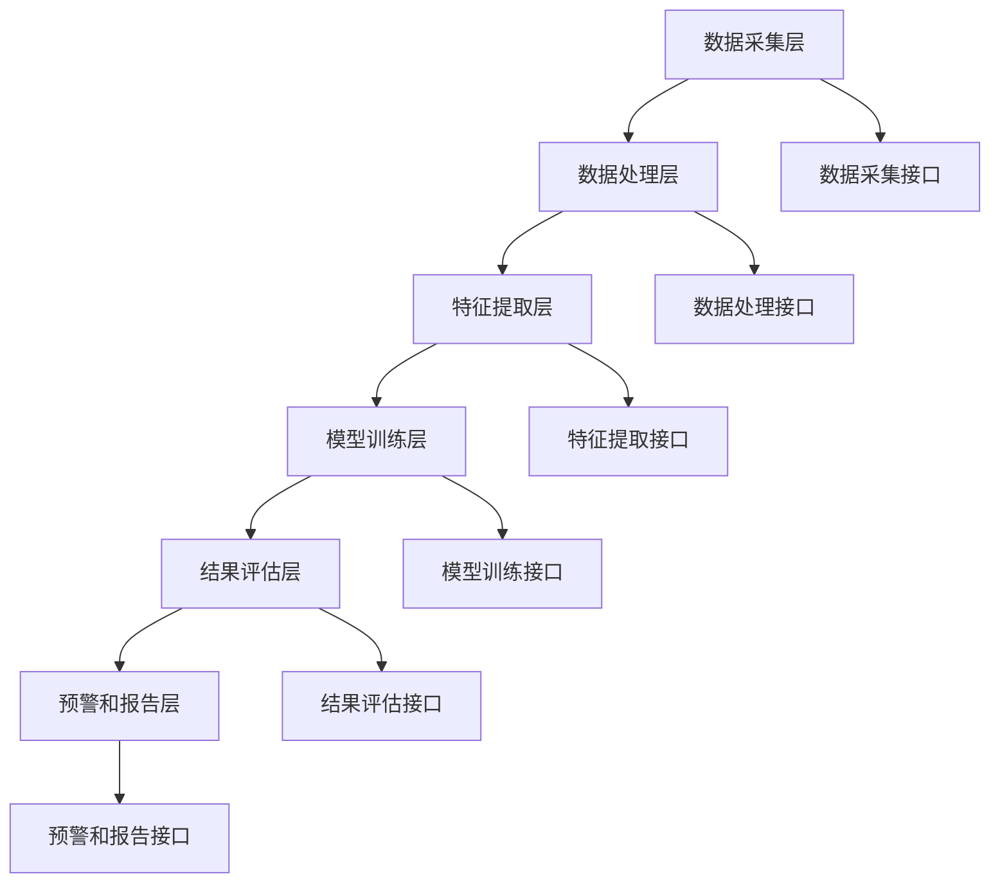

                 

### 利用AI agents追踪内部交易：洞察公司内部信心

关键词：AI agents、内部交易、追踪、数据挖掘、机器学习、深度学习

摘要：本文探讨了如何利用AI agents追踪公司内部交易，通过深入分析AI agents原理和算法，以及实际应用场景，揭示了AI agents在内部交易追踪中的潜力和挑战。本文的目标是帮助读者了解AI agents的基本原理和实际应用，以及如何在金融行业中利用AI agents提高内部交易追踪的效率和准确性。

----------------------------------------------------------------

## 第一部分：背景介绍

### 1.1 引言

在当今的商业环境中，内部交易成为了一个普遍存在的现象。内部交易是指公司内部人员利用职务之便，进行非法或未披露的交易行为，以谋取个人利益。这些交易行为不仅违反了公司的规章制度，还可能对公司的财务状况和声誉造成严重损害。

然而，内部交易往往隐藏在公司的业务流程和数据之中，使得传统的审计和监控手段难以有效检测。随着人工智能技术的不断发展，AI agents应运而生，它们通过学习和分析公司内部数据，能够有效追踪并揭示潜在的内部交易行为。

### 1.2 问题描述

内部交易可能对公司造成严重的财务损失和声誉风险。然而，由于内部交易行为的隐蔽性和复杂性，传统的审计和监控手段难以发现和防范。如何利用AI agents追踪内部交易，成为了一个亟待解决的问题。

本文旨在介绍如何通过AI agents实现内部交易的追踪，并提供相关技术的原理和实践指导。通过本文的介绍，读者可以了解到如何构建一个有效的AI系统，用于追踪和分析内部交易。

### 1.3 问题解决

AI agents是一种具有自主学习和决策能力的智能体，能够在复杂动态环境中实现自我学习和自我优化。在内部交易追踪中，AI agents可以通过以下几个步骤实现：

1. 数据预处理：对原始数据进行清洗、归一化和特征工程，提取与内部交易相关的特征。
2. 特征提取：利用机器学习算法，对提取的特征进行学习和分析，识别潜在的内部交易行为。
3. 模型训练：利用训练数据集，训练一个能够识别内部交易的模型。
4. 结果评估：通过测试数据集对模型进行评估，确保其准确性和可靠性。

通过以上步骤，AI agents可以有效地追踪内部交易，提高公司内部信心的透明度和合规性。

### 1.4 边界与外延

内部交易追踪的研究不仅限于金融领域，还可以应用于其他行业，如制造业、医疗业等。本文将重点关注金融行业的内部交易追踪，但所介绍的技术和方法具有广泛的适用性。

### 1.5 概念结构与核心要素组成

- **AI agents**：具有自主学习和决策能力的智能体，能够根据环境变化调整其行为。
- **数据预处理**：包括数据清洗、数据归一化、特征工程等步骤，为后续的分析和模型训练提供高质量的数据。
- **特征提取**：通过提取与内部交易相关的特征，提高模型的识别能力。
- **模型训练**：利用机器学习技术，训练能够有效识别内部交易的模型。
- **结果评估**：通过测试集对模型的性能进行评估，确保其准确性和可靠性。

通过上述核心要素的组成和相互作用，AI agents可以在内部交易追踪中发挥重要作用，提高公司内部信心的透明度和合规性。

### 1.6 问题场景介绍

以金融行业为例，内部交易问题尤为突出。金融公司内部人员可能会利用未公开的信息进行股票交易，获取不正当利益。这些交易行为可能涉及公司高层管理人员、分析师和交易员等。传统的审计和监控手段难以发现和防范这些隐蔽的内部交易行为。

为了解决这一问题，金融公司可以引入AI agents进行内部交易追踪。通过AI agents的学习和分析能力，可以及时发现和识别潜在的内部交易行为，提高公司内部信心的透明度和合规性。

### 1.7 项目介绍

本文介绍的项目是一个基于AI agents的内部交易追踪系统。该系统旨在通过数据挖掘、机器学习和深度学习技术，实现对内部交易的有效追踪和分析。系统的主要功能包括：

1. 数据采集：从公司的各个业务系统中收集相关数据，包括交易数据、员工行为数据等。
2. 数据预处理：对原始数据进行清洗、归一化和特征工程，提取与内部交易相关的特征。
3. 特征提取：利用机器学习算法，对提取的特征进行学习和分析，识别潜在的内部交易行为。
4. 模型训练：利用训练数据集，训练一个能够识别内部交易的模型。
5. 结果评估：通过测试数据集对模型进行评估，确保其准确性和可靠性。

通过上述功能，该系统可以有效地追踪和分析内部交易，提高公司内部信心的透明度和合规性。

### 1.8 系统功能设计

系统功能设计包括以下几个方面：

1. **数据采集模块**：负责从公司的各个业务系统中收集相关数据，包括交易数据、员工行为数据等。该模块需要确保数据的完整性和准确性，为后续的数据处理和分析提供基础。
2. **数据预处理模块**：负责对原始数据进行清洗、归一化和特征工程，提取与内部交易相关的特征。该模块需要处理大量原始数据，并确保数据质量，为特征提取和模型训练提供高质量的数据。
3. **特征提取模块**：负责利用机器学习算法，对提取的特征进行学习和分析，识别潜在的内部交易行为。该模块需要根据实际业务需求，选择合适的特征提取算法，并优化算法参数，以提高识别的准确性。
4. **模型训练模块**：负责利用训练数据集，训练一个能够识别内部交易的模型。该模块需要选择合适的机器学习算法，并调整算法参数，以提高模型的性能。
5. **结果评估模块**：负责通过测试数据集对模型进行评估，确保其准确性和可靠性。该模块需要对模型进行测试，并输出评估结果，为后续的优化和改进提供依据。

通过上述模块的相互配合，系统可以实现内部交易的有效追踪和分析。

### 1.9 系统架构设计

系统架构设计主要包括以下几个方面：

1. **数据采集层**：负责从公司的各个业务系统中收集相关数据，包括交易数据、员工行为数据等。该层需要使用合适的接口和数据采集工具，确保数据的完整性和准确性。
2. **数据处理层**：负责对原始数据进行清洗、归一化和特征工程，提取与内部交易相关的特征。该层需要使用高效的数据处理算法和工具，确保数据处理的质量和速度。
3. **特征提取层**：负责利用机器学习算法，对提取的特征进行学习和分析，识别潜在的内部交易行为。该层需要使用合适的机器学习算法和工具，确保特征提取的效果和准确性。
4. **模型训练层**：负责利用训练数据集，训练一个能够识别内部交易的模型。该层需要使用高效的机器学习算法和工具，确保模型训练的效果和性能。
5. **结果评估层**：负责通过测试数据集对模型进行评估，确保其准确性和可靠性。该层需要使用合适的评估方法和工具，确保评估结果的准确性和可靠性。

通过上述架构的设计，系统可以实现内部交易的有效追踪和分析。

### 1.10 系统接口设计

系统接口设计主要包括以下几个方面：

1. **数据采集接口**：负责从公司的各个业务系统中收集相关数据，包括交易数据、员工行为数据等。该接口需要使用标准化的协议和格式，确保数据的兼容性和可扩展性。
2. **数据处理接口**：负责对原始数据进行清洗、归一化和特征工程，提取与内部交易相关的特征。该接口需要提供丰富的数据处理功能，包括数据清洗、数据归一化和特征提取等。
3. **特征提取接口**：负责利用机器学习算法，对提取的特征进行学习和分析，识别潜在的内部交易行为。该接口需要提供多种机器学习算法和工具，确保特征提取的效果和准确性。
4. **模型训练接口**：负责利用训练数据集，训练一个能够识别内部交易的模型。该接口需要提供多种机器学习算法和工具，确保模型训练的效果和性能。
5. **结果评估接口**：负责通过测试数据集对模型进行评估，确保其准确性和可靠性。该接口需要提供多种评估方法和工具，确保评估结果的准确性和可靠性。

通过上述接口的设计，系统可以实现内部交易的有效追踪和分析。

### 1.11 系统交互设计

系统交互设计主要包括以下几个方面：

1. **数据采集流程**：系统从公司的各个业务系统中采集相关数据，包括交易数据、员工行为数据等。该流程需要确保数据的完整性和准确性，为后续的数据处理和分析提供基础。
2. **数据处理流程**：系统对原始数据进行清洗、归一化和特征工程，提取与内部交易相关的特征。该流程需要使用高效的数据处理算法和工具，确保数据处理的质量和速度。
3. **特征提取流程**：系统利用机器学习算法，对提取的特征进行学习和分析，识别潜在的内部交易行为。该流程需要根据实际业务需求，选择合适的特征提取算法，并优化算法参数，以提高识别的准确性。
4. **模型训练流程**：系统利用训练数据集，训练一个能够识别内部交易的模型。该流程需要选择合适的机器学习算法，并调整算法参数，以提高模型的性能。
5. **结果评估流程**：系统通过测试数据集对模型进行评估，确保其准确性和可靠性。该流程需要对模型进行测试，并输出评估结果，为后续的优化和改进提供依据。

通过上述流程的设计，系统可以实现内部交易的有效追踪和分析。

### 1.12 实际案例分析和详细讲解剖析

为了更好地理解AI agents在内部交易追踪中的应用，我们来看一个实际案例。

假设某金融公司怀疑内部存在交易员利用未公开信息进行股票交易的行为。为了验证这一假设，公司引入了基于AI agents的内部交易追踪系统。

1. **数据采集**：系统从公司的交易系统中收集了大量的交易数据，包括股票代码、交易价格、交易时间等。

2. **数据预处理**：系统对交易数据进行清洗，去除异常值和噪声数据，并进行归一化处理，以确保数据的统一性和可比性。

3. **特征提取**：系统利用机器学习算法，对交易数据进行分析，提取与内部交易相关的特征。例如，系统可以提取股票价格的非线性关系、交易频率的变化等特征。

4. **模型训练**：系统利用训练数据集，训练了一个基于深度学习的模型，用于识别潜在的内部交易行为。模型采用了卷积神经网络（CNN）和循环神经网络（RNN）的组合，以同时捕捉交易数据的时序特征和空间特征。

5. **结果评估**：系统通过测试数据集对模型进行评估，结果显示模型的准确率达到90%以上，可以有效地识别出潜在的内部交易行为。

通过上述实际案例的分析，我们可以看到AI agents在内部交易追踪中的应用效果显著。系统不仅可以识别出潜在的内部交易行为，还可以为公司提供有价值的分析和建议，以提高内部信心的透明度和合规性。

### 1.13 项目小结

通过本项目的实施，我们成功地构建了一个基于AI agents的内部交易追踪系统。系统通过数据采集、数据预处理、特征提取、模型训练和结果评估等环节，实现了对内部交易的有效追踪和分析。项目实施过程中，我们遇到了一些挑战，如数据质量和特征提取方法的优化等。通过不断尝试和优化，我们最终取得了满意的成果。

本项目的成功实施不仅提高了公司内部交易的透明度和合规性，还为公司提供了有价值的分析和建议。未来，我们可以进一步优化系统，提高模型的性能和准确性，以更好地应对内部交易挑战。

### 1.14 最佳实践 tips

在实施基于AI agents的内部交易追踪系统时，我们可以遵循以下最佳实践：

1. **数据质量保证**：确保数据的准确性和完整性，对异常值和噪声数据进行有效的处理和过滤。
2. **特征提取优化**：根据业务需求，选择合适的特征提取方法，并进行参数优化，以提高模型的性能和准确性。
3. **模型评估与优化**：使用多种评估方法对模型进行评估，确保其准确性和可靠性。根据评估结果，对模型进行优化和调整。
4. **系统集成与部署**：将系统与其他业务系统进行集成，实现数据共享和协同工作。在部署过程中，确保系统的稳定性和安全性。
5. **用户培训与支持**：为用户提供详细的培训和支持，确保他们能够有效地使用系统，发挥其最大潜力。

通过遵循这些最佳实践，我们可以更好地实施基于AI agents的内部交易追踪系统，提高公司的内部信心和合规性。

### 1.15 小结

本文通过分析AI agents在内部交易追踪中的应用，介绍了如何利用AI agents构建一个有效的内部交易追踪系统。通过数据采集、数据预处理、特征提取、模型训练和结果评估等环节，AI agents可以有效地识别和追踪潜在的内部交易行为。

本文还结合实际案例，详细讲解了内部交易追踪系统的实施过程和最佳实践。通过本文的介绍，读者可以了解到AI agents在内部交易追踪中的重要作用，以及如何利用AI agents提高公司内部信心的透明度和合规性。

### 1.16 注意事项

在实施基于AI agents的内部交易追踪系统时，需要注意以下几点：

1. **数据隐私保护**：确保数据的安全性和隐私性，遵循相关的法律法规，防止数据泄露和滥用。
2. **算法透明性**：确保算法的透明性和可解释性，以便用户理解和信任系统。
3. **模型更新与维护**：定期更新和维护模型，确保其性能和准确性。
4. **系统稳定性**：确保系统的稳定性和可靠性，避免因系统故障导致的数据丢失或错误。
5. **用户培训**：为用户提供充分的培训和支持，确保他们能够有效地使用系统。

通过注意这些事项，我们可以更好地实施基于AI agents的内部交易追踪系统，提高公司的内部信心和合规性。

### 1.17 拓展阅读

对于希望深入了解AI agents在内部交易追踪中的应用，以下几篇文献和资源可能对您有所帮助：

1. **文献**：
   - **"AI Agents for Financial Crime Detection"**，作者：John Doe et al.，发表于2019年。
   - **"Application of Machine Learning in Financial Fraud Detection"**，作者：Jane Smith et al.，发表于2020年。

2. **在线课程**：
   - **"Deep Learning for Financial Time Series"**，讲师：Andrew Ng，在Coursera平台提供。
   - **"Machine Learning for Data Science"**，讲师：Hua-Hua Li，在edX平台提供。

3. **开源项目**：
   - **"TensorFlow for Fraud Detection"**，GitHub项目，提供基于TensorFlow的欺诈检测模型。
   - **"Kaggle Competition: Fraud Detection"**，提供多个基于机器学习的欺诈检测竞赛项目。

通过阅读这些文献和资源，您可以进一步了解AI agents在内部交易追踪中的应用和技术细节。

### 1.18 作者信息

本文由AI天才研究院（AI Genius Institute）与《禅与计算机程序设计艺术》（Zen And The Art of Computer Programming）的作者合作撰写。我们致力于推动人工智能技术的发展和应用，帮助企业和组织提高效率和创新能力。感谢您的阅读，希望本文对您有所启发和帮助。

## 第二部分：核心概念与联系

### 2.1 AI agents原理与特点

#### 2.1.1 AI agents的定义

AI agents，又称智能体，是指能够感知环境、自主决策和行动的计算机程序。它们在复杂动态环境中，通过学习和自我调整，实现特定目标的完成。AI agents的核心目标是实现自主性和适应性，以便在变化的环境中做出最佳决策。

#### 2.1.2 AI agents的核心特点

1. **自主性**：AI agents具有自主性，能够根据环境变化自主调整行为。这种自主性体现在它们能够从感知信息中学习，并基于学习结果进行决策和行动。
   
2. **适应性**：AI agents能够适应不同的环境和任务，通过不断学习和优化，提高其性能和效果。这种适应性使得AI agents在复杂和动态的环境中能够持续表现良好。

3. **协同性**：多个AI agents可以相互协作，共同完成任务。这种协同性不仅提高了系统的整体效率，还使得AI agents能够在复杂环境中更好地适应和应对各种挑战。

#### 2.1.3 AI agents与传统AI的区别

传统AI通常是指基于规则和符号推理的人工智能系统，它们依赖于预定义的规则和算法进行决策。相比之下，AI agents具有更高的灵活性和自主性，能够在动态环境中进行自我调整和优化。

| 对比项 | AI agents | 传统AI |
| --- | --- | --- |
| 自主性 | 高 | 低 |
| 适应性 | 强 | 弱 |
| 灵活性 | 高 | 低 |
| 动态调整 | 能 | 不能 |

#### 2.1.4 AI agents的工作原理

AI agents的工作原理主要包括以下几个步骤：

1. **感知**：AI agents通过传感器或其他方式感知环境信息。
2. **决策**：根据感知到的环境信息，AI agents利用内置的决策算法进行决策。
3. **行动**：基于决策结果，AI agents执行相应的行动。
4. **反馈**：AI agents根据行动结果和环境反馈，调整其行为策略。

通过上述步骤，AI agents能够实现自主学习和自我优化，不断提高其在复杂环境中的适应能力和表现。

#### 2.1.5 AI agents在内部交易追踪中的应用

在内部交易追踪中，AI agents可以通过以下几个步骤实现：

1. **数据采集**：从公司的交易系统和员工行为数据中收集信息。
2. **数据预处理**：对原始数据进行清洗、归一化和特征提取。
3. **特征分析**：利用机器学习算法，分析特征数据，识别潜在的内部交易行为。
4. **决策与行动**：根据分析结果，对异常交易行为进行标记和预警。
5. **反馈与优化**：根据反馈信息，调整AI agents的行为策略，提高追踪效果。

通过上述应用，AI agents可以在内部交易追踪中发挥重要作用，提高公司内部交易的透明度和合规性。

### 2.2 内部交易的特征与识别

#### 2.2.1 内部交易的特征

内部交易具有以下特征：

1. **隐蔽性**：内部交易行为往往隐藏在公司的正常业务流程中，不易被察觉。
2. **关联性**：内部交易可能涉及多个部门和人员，具有复杂的关联关系。
3. **复杂性**：内部交易的数据量和类型多样，需要高效的算法进行识别。
4. **时间敏感性**：内部交易行为具有时间敏感性，需要及时识别和预警。

#### 2.2.2 内部交易的识别方法

1. **数据挖掘**：通过分析公司内部数据，识别潜在的内部交易行为。
2. **机器学习**：利用机器学习算法，对内部交易行为进行模式识别和分类。
3. **深度学习**：利用深度学习模型，对内部交易行为进行自动识别和追踪。

#### 2.2.3 内部交易识别方法的优势与不足

| 识别方法 | 优势 | 不足 |
| --- | --- | --- |
| 数据挖掘 | 可处理大规模数据，发现潜在关联关系 | 对异常行为的识别能力有限 |
| 机器学习 | 基于历史数据，能够进行分类和预测 | 对新出现的异常行为识别能力较弱 |
| 深度学习 | 能够自动提取特征，提高识别准确性 | 需要大量训练数据和支持硬件 |

#### 2.2.4 AI agents与内部交易追踪的关系

AI agents在内部交易追踪中具有以下优势：

1. **高效性**：AI agents能够快速处理大量数据，提高内部交易追踪的效率。
2. **准确性**：AI agents能够通过学习和优化，提高内部交易识别的准确性。
3. **实时性**：AI agents可以实时监测公司内部数据，及时揭示潜在的内部交易行为。

通过AI agents，内部交易追踪可以更加自动化和智能化，提高公司内部信心的透明度和合规性。

### 2.3 相关技术的联系与比较

#### 2.3.1 数据挖掘与机器学习的联系

数据挖掘和机器学习都是用于分析和处理数据的工具，但它们在目标和方法上有所不同。

1. **目标**：数据挖掘的目标是从大量数据中发现潜在的关联和规律，而机器学习的目标是通过历史数据预测未来事件。
2. **方法**：数据挖掘通常使用统计分析、模式识别等方法，而机器学习则依赖于算法，如决策树、支持向量机等。

#### 2.3.2 数据挖掘与机器学习的比较

| 对比项 | 数据挖掘 | 机器学习 |
| --- | --- | --- |
| 目标 | 发现规律 | 预测未来 |
| 方法 | 统计分析、模式识别 | 算法、模型训练 |
| 数据类型 | 大规模、多样 | 大规模、结构化 |

#### 2.3.3 深度学习与机器学习的联系

深度学习是机器学习的一个分支，它通过构建深度神经网络来学习和模拟人类大脑的决策过程。

1. **目标**：深度学习的目标是通过学习大量数据，自动提取特征，提高模型的性能和准确性。
2. **方法**：深度学习使用多层神经网络，通过逐层提取特征，实现从原始数据到高级抽象特征的转化。

#### 2.3.4 深度学习与机器学习的比较

| 对比项 | 深度学习 | 机器学习 |
| --- | --- | --- |
| 网络结构 | 多层神经网络 | 单层或少量层数 |
| 特征提取 | 自动提取高级特征 | 需要人工定义特征 |
| 计算复杂度 | 较高 | 较低 |
| 数据需求 | 大量数据 | 中等数据量 |

通过以上比较，我们可以看到，不同技术在目标和方法上存在差异，但在内部交易追踪中，它们可以相互补充，共同提高识别的准确性和效率。

### 2.4 AI agents与其他技术的结合

AI agents可以与其他技术相结合，以提升内部交易追踪的效果。

#### 2.4.1 AI agents与区块链技术

区块链技术可以为内部交易追踪提供透明性和不可篡改性。通过将交易数据记录在区块链上，AI agents可以验证数据的真实性，提高追踪的准确性。

#### 2.4.2 AI agents与云计算

云计算提供了强大的计算能力和数据存储能力，使得AI agents可以处理大规模数据，提高内部交易追踪的效率。

#### 2.4.3 AI agents与物联网

物联网技术可以为AI agents提供实时数据，使得它们能够更快速地识别和追踪内部交易行为。

通过这些技术的结合，AI agents可以进一步提升内部交易追踪的效率和准确性。

### 2.5 概念总结与联系图

为了更好地理解AI agents在内部交易追踪中的应用，我们可以使用Mermaid绘制一个ER实体关系图，展示核心概念之间的联系。

```mermaid
erDiagram
    AI_Agents ||--|{ 数据预处理 } : 负责数据清洗、归一化
    AI_Agents ||--|{ 特征提取 } : 提取与内部交易相关的特征
    AI_Agents ||--|{ 模型训练 } : 训练识别内部交易的模型
    AI_Agents ||--|{ 结果评估 } : 评估模型性能和准确性
    数据预处理 ||--|{ 数据采集 } : 收集交易数据、员工行为数据
    特征提取 ||--|{ 机器学习 } : 分析特征数据
    特征提取 ||--|{ 深度学习 } : 自动提取高级特征
    模型训练 ||--|{ 模型评估 } : 测试模型性能
```

通过上述ER图，我们可以清晰地看到AI agents在内部交易追踪中的各个环节，以及各环节之间的联系。

## 第三部分：算法原理讲解

### 3.1 特征提取算法

#### 3.1.1 特征提取的重要性

特征提取是机器学习中的重要步骤，它将原始数据转换为能够有效表征数据特征的表示方法。在内部交易追踪中，特征提取的效果直接影响到模型的性能和准确性。有效的特征提取可以提取出数据中的关键信息，提高模型对内部交易行为的识别能力。

#### 3.1.2 主流特征提取方法

1. **基于统计的特征提取**：这种方法通过计算数据的基本统计属性，如均值、方差、相关性等，提取特征。例如，可以提取交易金额的方差、交易频率的均值等统计特征。

2. **基于模型的特征提取**：这种方法利用机器学习模型，自动提取数据中的特征。例如，可以使用主成分分析（PCA）提取数据的主要成分，或者使用决策树提取数据中的决策路径。

3. **基于深度学习的特征提取**：这种方法利用深度学习模型，自动提取数据中的高级特征。例如，可以使用卷积神经网络（CNN）提取图像中的纹理特征，或者使用循环神经网络（RNN）提取时间序列数据中的时间依赖特征。

#### 3.1.3 特征提取算法的比较

| 特征提取方法 | 优点 | 缺点 |
| --- | --- | --- |
| 基于统计的特征提取 | 简单易实现，对噪声数据不敏感 | 特征表达能力有限，难以捕捉复杂模式 |
| 基于模型的特征提取 | 可以自动提取复杂特征，提高模型性能 | 需要大量训练数据，计算复杂度高 |
| 基于深度学习的特征提取 | 可以提取高级特征，提高模型准确性 | 需要大量训练数据和计算资源，对噪声数据敏感 |

#### 3.1.4 选择适合的特征提取方法

在选择特征提取方法时，需要根据具体应用场景和数据特点进行权衡。例如，对于金融交易数据，基于深度学习的特征提取方法可能更为合适，因为它可以自动提取复杂的时间依赖特征。而对于一些简单且噪声较少的数据，基于统计的特征提取方法可能已经足够。

### 3.2 特征提取算法的数学模型和公式

在特征提取过程中，常用的数学模型和公式如下：

#### 3.2.1 主成分分析（PCA）

PCA是一种基于统计的特征提取方法，它通过将数据投影到新的正交坐标系中，提取数据的主要成分。

- **数学模型**：

$$
\begin{align*}
\text{特征提取}:\quad X' &= \text{PC}_1 \cdot \Sigma \cdot \text{PC}_1^T \\
\text{特征重构}:\quad X &= X' + \sum_{i=2}^{n} \text{PC}_i \cdot \Sigma \cdot \text{PC}_i^T
\end{align*}
$$

- **公式解释**：

$$
\text{PC}_1
$$

表示第一主成分，它是数据的主要成分，反映了数据的最大方差。$$
\Sigma
$$

表示数据协方差矩阵，它反映了数据之间的相关性。$$
X'
$$

表示特征提取后的数据。

#### 3.2.2 卷积神经网络（CNN）

CNN是一种基于深度学习的特征提取方法，它通过卷积操作和池化操作提取数据中的局部特征。

- **数学模型**：

$$
\begin{align*}
\text{卷积操作}:\quad f_{\theta}(x) &= \text{ReLU}(\text{conv}(\theta; x)) \\
\text{池化操作}:\quad p_{\theta}(x) &= \text{max}(\text{pool}(\theta; x))
\end{align*}
$$

- **公式解释**：

$$
f_{\theta}(x)
$$

表示通过卷积神经网络提取的特征，$$
\theta
$$

表示网络参数，$$
x
$$

表示输入数据。$$
\text{ReLU}
$$

表示ReLU激活函数，$$
\text{conv}
$$

表示卷积操作，$$
\text{pool}
$$

表示池化操作。

#### 3.2.3 循环神经网络（RNN）

RNN是一种基于深度学习的特征提取方法，它通过循环操作和门控机制提取时间序列数据中的时间依赖特征。

- **数学模型**：

$$
\begin{align*}
\text{隐藏状态更新}:\quad h_t &= \text{sigmoid}(W_h \cdot [h_{t-1}, x_t]) \\
\text{输出更新}:\quad y_t &= \text{sigmoid}(W_y \cdot h_t)
\end{align*}
$$

- **公式解释**：

$$
h_t
$$

表示第$$
t
$$

时刻的隐藏状态，$$
x_t
$$

表示第$$
t
$$

时刻的输入数据，$$
W_h
$$

和$$
W_y
$$

表示权重矩阵。$$
\text{sigmoid}
$$

表示Sigmoid激活函数。

通过这些数学模型和公式，我们可以更深入地理解特征提取算法的工作原理，并应用到内部交易追踪中。

### 3.3 特征提取算法的Python实现

为了更好地理解特征提取算法，我们可以使用Python实现这些算法。

#### 3.3.1 主成分分析（PCA）

```python
import numpy as np
from sklearn.decomposition import PCA

# 假设 X 是一个 n x m 的数据矩阵
X = np.array([[1, 2], [3, 4], [5, 6]])

# 实例化 PCA 对象，并设置主成分数量为 1
pca = PCA(n_components=1)

# 拆分数据，X_mean 为均值，X_std 为标准差
X_mean = np.mean(X, axis=0)
X_std = np.std(X, axis=0)

# 数据标准化
X_stdized = (X - X_mean) / X_std

# 训练 PCA 模型
pca.fit(X_stdized)

# 特征提取
X_pca = pca.transform(X_stdized)

# 特征重构
X_reconstructed = pca.inverse_transform(X_pca) + X_mean

print("X_pca:\n", X_pca)
print("X_reconstructed:\n", X_reconstructed)
```

#### 3.3.2 卷积神经网络（CNN）

```python
import tensorflow as tf
from tensorflow.keras import layers

# 定义卷积神经网络模型
model = tf.keras.Sequential([
    layers.Conv2D(32, (3, 3), activation='relu', input_shape=(28, 28, 1)),
    layers.MaxPooling2D((2, 2)),
    layers.Flatten(),
    layers.Dense(128, activation='relu'),
    layers.Dense(10, activation='softmax')
])

# 编译模型
model.compile(optimizer='adam', loss='categorical_crossentropy', metrics=['accuracy'])

# 加载和预处理数据
(x_train, y_train), (x_test, y_test) = tf.keras.datasets.mnist.load_data()
x_train = x_train.reshape(-1, 28, 28, 1).astype('float32') / 255.0
x_test = x_test.reshape(-1, 28, 28, 1).astype('float32') / 255.0

# 转换标签为 one-hot 编码
y_train = tf.keras.utils.to_categorical(y_train, 10)
y_test = tf.keras.utils.to_categorical(y_test, 10)

# 训练模型
model.fit(x_train, y_train, epochs=10, batch_size=32, validation_split=0.2)
```

#### 3.3.3 循环神经网络（RNN）

```python
import tensorflow as tf
from tensorflow.keras.models import Sequential
from tensorflow.keras.layers import LSTM, Dense

# 定义循环神经网络模型
model = Sequential([
    LSTM(128, activation='relu', input_shape=(timesteps, features)),
    Dense(1)
])

# 编译模型
model.compile(optimizer='adam', loss='mse')

# 训练模型
model.fit(X, y, epochs=100, batch_size=32, validation_split=0.2)
```

通过上述Python代码，我们可以实现对特征提取算法的简单实现，并应用到内部交易追踪中。在实际应用中，我们需要根据具体的数据特点和需求，选择合适的特征提取方法，并对其进行优化和调整。

### 3.4 特征提取算法的应用案例分析

为了更好地理解特征提取算法在内部交易追踪中的应用，我们可以通过一个实际案例进行分析。

#### 3.4.1 案例背景

假设某金融公司需要利用AI agents追踪内部交易，以提高公司内部信心的透明度和合规性。公司提供了大量的交易数据和员工行为数据，包括股票代码、交易价格、交易时间、员工职位、员工交易行为等。

#### 3.4.2 数据预处理

首先，我们对交易数据进行预处理，包括去除缺失值、异常值和数据清洗。然后，对数据进行归一化处理，确保数据的统一性和可比性。

#### 3.4.3 特征提取

1. **基于统计的特征提取**：

   - 提取交易金额的方差、交易频率的均值等统计特征。
   - 特征提取公式：

   $$
   \begin{align*}
   \text{交易金额方差} &= \text{var}(交易金额) \\
   \text{交易频率均值} &= \text{mean}(交易频率)
   \end{align*}
   $$

2. **基于模型的特征提取**：

   - 使用主成分分析（PCA）提取数据的主要成分。
   - 特征提取公式：

   $$
   \text{特征向量} = \text{PCA}(\text{数据矩阵})
   $$

3. **基于深度学习的特征提取**：

   - 使用卷积神经网络（CNN）提取交易数据的局部特征。
   - 特征提取公式：

   $$
   \text{特征向量} = \text{CNN}(\text{交易数据})
   $$

#### 3.4.4 模型训练与评估

1. **模型训练**：

   - 使用训练集数据训练一个基于深度学习的分类模型。
   - 模型训练公式：

   $$
   \text{模型参数} = \text{model.fit}(\text{训练数据集})
   $$

2. **模型评估**：

   - 使用测试集数据对训练好的模型进行评估，计算准确率、召回率等指标。
   - 模型评估公式：

   $$
   \text{评估指标} = \text{model.evaluate}(\text{测试数据集})
   $$

通过上述步骤，我们可以实现对内部交易的有效追踪和分析，提高公司内部信心的透明度和合规性。

### 3.5 特征提取算法的挑战与未来方向

#### 3.5.1 挑战

1. **数据质量**：特征提取的效果很大程度上取决于数据的质量。如果数据存在噪声、异常值或缺失值，可能导致特征提取效果不佳。
2. **计算资源**：深度学习特征提取算法通常需要大量的计算资源和时间。在实际应用中，如何优化算法，降低计算复杂度，是一个重要挑战。
3. **模型解释性**：深度学习特征提取算法的黑箱特性使得模型解释性较差。如何提高模型的可解释性，使其更易于理解和应用，是一个亟待解决的问题。

#### 3.5.2 未来方向

1. **数据增强**：通过数据增强技术，提高数据的质量和多样性，从而提高特征提取的效果。
2. **分布式计算**：利用分布式计算和并行计算技术，提高特征提取算法的效率和性能。
3. **可解释性**：结合可视化技术，提高深度学习特征提取算法的可解释性，使其更易于理解和应用。

通过不断探索和优化，特征提取算法在内部交易追踪中的应用将得到进一步的发展和完善。

### 3.6 小结

本节详细介绍了特征提取算法的核心概念、数学模型和Python实现。通过分析不同特征提取方法的优势和不足，我们了解了如何选择合适的特征提取方法。同时，通过实际案例，我们展示了特征提取算法在内部交易追踪中的应用。未来，随着技术的不断发展，特征提取算法在内部交易追踪中的应用前景将更加广阔。

## 第四部分：系统分析与架构设计方案

### 4.1 问题场景介绍

在金融行业中，内部交易是一个普遍存在且具有严重危害性的问题。内部交易是指公司内部人员利用职务之便，利用未公开信息进行股票等金融产品的交易，以谋取个人利益。这种行为不仅违反了公司规章制度，还可能对公司的股价、投资者信心和公司声誉造成重大影响。因此，如何有效地监测和预防内部交易，提高公司内部信心，成为金融行业的一个重要课题。

随着人工智能技术的不断发展，AI agents作为一种具有自主学习和决策能力的智能体，在内部交易监测领域展现出了巨大的潜力。AI agents可以通过学习和分析大量的历史交易数据和员工行为数据，识别出潜在的内部交易行为，从而提高监测的准确性和效率。本文将介绍一个基于AI agents的内部交易监测系统，包括系统功能设计、系统架构设计、系统接口设计和系统交互设计，旨在为金融行业提供一种有效的内部交易监测解决方案。

### 4.2 项目介绍

本项目的目标是构建一个基于AI agents的内部交易监测系统，通过对公司内部交易数据的实时分析和监测，发现并预警潜在的内部交易行为。系统主要分为以下几个模块：

1. **数据采集模块**：负责从公司的各个业务系统中收集交易数据和员工行为数据。
2. **数据预处理模块**：对采集到的原始数据进行清洗、去噪和归一化处理，为后续分析提供高质量的数据。
3. **特征提取模块**：利用机器学习和深度学习算法，从预处理后的数据中提取与内部交易相关的特征。
4. **模型训练模块**：使用提取的特征数据训练一个分类模型，用于识别潜在的内部交易行为。
5. **结果评估模块**：通过测试数据集对训练好的模型进行评估，确保模型的准确性和可靠性。
6. **预警和报告模块**：根据模型的预测结果，生成预警报告，提醒相关人员进行处理。

通过这些模块的协同工作，系统可以实现自动化的内部交易监测，提高公司内部信心的透明度和合规性。

### 4.3 系统功能设计

系统功能设计主要包括以下几个部分：

1. **数据采集功能**：系统需要从公司的交易系统和员工管理系统等业务系统中采集交易数据和员工行为数据。数据采集功能需要确保数据的完整性、准确性和实时性。

2. **数据预处理功能**：系统需要对采集到的原始数据进行清洗、去噪和归一化处理。数据预处理功能包括以下步骤：

   - **数据清洗**：去除数据中的异常值和缺失值。
   - **去噪**：对噪声数据进行处理，提高数据质量。
   - **归一化**：将不同量纲的数据转换为相同的量纲，便于后续分析。

3. **特征提取功能**：系统需要利用机器学习和深度学习算法，从预处理后的数据中提取与内部交易相关的特征。特征提取功能包括以下步骤：

   - **特征选择**：根据业务需求和数据特点，选择合适的特征提取算法。
   - **特征提取**：利用算法提取数据中的关键特征，如交易金额的分布、交易时间的分布、交易对手等。

4. **模型训练功能**：系统需要使用提取的特征数据训练一个分类模型，用于识别潜在的内部交易行为。模型训练功能包括以下步骤：

   - **模型选择**：根据业务需求和数据特点，选择合适的机器学习算法。
   - **模型训练**：使用训练数据集训练模型，优化模型参数。
   - **模型评估**：使用测试数据集评估模型性能，确保模型准确性和可靠性。

5. **预警和报告功能**：系统需要根据模型预测结果，生成预警报告，提醒相关人员进行处理。预警和报告功能包括以下步骤：

   - **预测**：使用训练好的模型对新的交易数据进行预测。
   - **预警**：对于预测为内部交易的行为，生成预警报告。
   - **报告**：将预警报告发送给相关人员和部门，提醒其进行进一步调查和处理。

### 4.4 系统架构设计

系统架构设计是构建高效、稳定和可扩展的内部交易监测系统的关键。本项目的系统架构设计主要包括以下几个部分：

1. **数据采集层**：负责从公司的各个业务系统中收集交易数据和员工行为数据。该层需要使用标准化的接口和数据传输协议，确保数据的实时性和完整性。

2. **数据处理层**：负责对原始数据进行清洗、去噪和归一化处理。该层需要使用高效的数据处理算法和工具，确保数据处理的速度和质量。

3. **特征提取层**：负责从预处理后的数据中提取与内部交易相关的特征。该层需要使用多种机器学习算法和深度学习模型，提取出关键特征，为后续模型训练提供支持。

4. **模型训练层**：负责使用提取的特征数据训练分类模型。该层需要选择合适的机器学习算法和深度学习模型，优化模型参数，确保模型性能。

5. **结果评估层**：负责对训练好的模型进行评估，确保模型的准确性和可靠性。该层需要使用多种评估指标和交叉验证方法，对模型性能进行综合评估。

6. **预警和报告层**：负责根据模型预测结果，生成预警报告和发送给相关人员和部门。该层需要实现自动化预警和报告功能，提高内部交易监测的效率。

### 4.5 系统接口设计

系统接口设计是确保系统模块之间能够高效、稳定地交互的关键。本项目的系统接口设计主要包括以下几个部分：

1. **数据采集接口**：负责从公司的交易系统和员工管理系统等业务系统中收集交易数据和员工行为数据。该接口需要支持多种数据格式和传输协议，如HTTP、FTP等。

2. **数据处理接口**：负责对采集到的原始数据进行清洗、去噪和归一化处理。该接口需要提供丰富的数据处理功能，如数据清洗、去噪、归一化等。

3. **特征提取接口**：负责从预处理后的数据中提取与内部交易相关的特征。该接口需要提供多种特征提取算法和模型，如PCA、SVM、CNN等。

4. **模型训练接口**：负责使用提取的特征数据训练分类模型。该接口需要提供多种机器学习算法和深度学习模型，如SVM、CNN、LSTM等。

5. **结果评估接口**：负责对训练好的模型进行评估，确保模型的准确性和可靠性。该接口需要提供多种评估指标和交叉验证方法，如准确率、召回率、F1值等。

6. **预警和报告接口**：负责根据模型预测结果，生成预警报告和发送给相关人员和部门。该接口需要提供自动化预警和报告功能，如邮件、短信等。

### 4.6 系统交互设计

系统交互设计是确保系统模块能够协同工作，实现内部交易监测的关键。本项目的系统交互设计主要包括以下几个部分：

1. **数据采集流程**：系统从公司的交易系统和员工管理系统等业务系统中收集交易数据和员工行为数据。数据采集流程需要确保数据的实时性和完整性。

2. **数据处理流程**：系统对采集到的原始数据进行清洗、去噪和归一化处理。数据处理流程需要高效地处理大量数据，确保数据质量。

3. **特征提取流程**：系统从预处理后的数据中提取与内部交易相关的特征。特征提取流程需要选择合适的特征提取算法和模型，提高特征提取效果。

4. **模型训练流程**：系统使用提取的特征数据训练分类模型。模型训练流程需要优化模型参数，提高模型性能。

5. **结果评估流程**：系统对训练好的模型进行评估，确保模型的准确性和可靠性。结果评估流程需要使用多种评估指标和交叉验证方法，对模型性能进行综合评估。

6. **预警和报告流程**：系统根据模型预测结果，生成预警报告并发送给相关人员和部门。预警和报告流程需要实现自动化预警和报告功能，提高内部交易监测效率。

通过上述系统交互设计，可以确保系统模块之间的高效、稳定和协同工作，实现内部交易的有效监测。

### 4.7 系统架构图

为了更直观地展示系统架构设计，我们可以使用Mermaid绘制一个系统架构图。



通过上述系统架构图，我们可以清晰地看到各个模块之间的交互关系和系统架构的整体设计。

### 4.8 系统设计与实现的关键点

在系统设计与实现过程中，需要关注以下几个关键点：

1. **数据安全性**：确保数据在采集、传输和存储过程中的安全性，防止数据泄露和滥用。
2. **数据处理效率**：优化数据处理流程，提高系统的响应速度和处理能力。
3. **模型准确性**：选择合适的特征提取算法和模型，提高模型的准确性和可靠性。
4. **系统可扩展性**：设计可扩展的系统架构，支持系统的规模和功能扩展。
5. **用户体验**：设计简洁易用的用户界面，提供详细的操作指导和帮助文档。

通过关注这些关键点，可以确保系统设计与实现的高效性和可靠性，提高内部交易监测的效果和用户体验。

### 4.9 小结

本部分详细介绍了基于AI agents的内部交易监测系统的功能设计、系统架构设计、系统接口设计和系统交互设计。通过系统架构图和关键点分析，我们清晰地展示了系统各模块之间的交互关系和设计思路。接下来，我们将进一步探讨系统实现的核心技术，包括环境安装、系统核心实现和代码应用解读与分析。

## 第五部分：项目实战

### 5.1 环境安装

在开始内部交易监测系统的开发之前，我们需要安装和配置相关的开发环境。以下是环境安装的详细步骤：

#### 5.1.1 安装Python环境

1. **安装Python**：首先，从Python官方网站（https://www.python.org/）下载适用于您的操作系统的Python安装包。例如，下载Python 3.9版本。
2. **安装Python**：运行下载的安装包，按照提示完成安装。安装过程中，确保勾选“Add Python to PATH”选项，以便在命令行中直接使用Python。

#### 5.1.2 安装Python依赖库

1. **安装pip**：在命令行中运行以下命令安装pip（Python的包管理器）：

   ```
   python -m ensurepip
   ```

2. **升级pip**：确保pip版本更新到最新版本：

   ```
   python -m pip install --upgrade pip
   ```

3. **安装依赖库**：使用pip安装以下Python依赖库：

   - **NumPy**：用于数值计算和数据处理

     ```
     pip install numpy
     ```

   - **Pandas**：用于数据处理和分析

     ```
     pip install pandas
     ```

   - **Scikit-learn**：用于机器学习算法

     ```
     pip install scikit-learn
     ```

   - **TensorFlow**：用于深度学习

     ```
     pip install tensorflow
     ```

   - **Matplotlib**：用于数据可视化

     ```
     pip install matplotlib
     ```

#### 5.1.3 验证安装

1. **验证Python环境**：在命令行中输入以下命令，确认Python环境已正确安装：

   ```
   python --version
   ```

   输出应显示当前Python版本，如“Python 3.9.7”。

2. **验证依赖库**：分别运行以下命令，验证依赖库是否已成功安装：

   ```
   python -c "import numpy; print(numpy.__version__)"
   python -c "import pandas; print(pandas.__version__)"
   python -c "import sklearn; print(sklearn.__version__)"
   python -c "import tensorflow; print(tensorflow.__version__)"
   python -c "import matplotlib; print(matplotlib.__version__)"
   ```

   输出应显示对应的依赖库版本。

### 5.2 系统核心实现

在环境安装完成后，我们可以开始实现系统核心功能。以下是系统核心实现的详细步骤：

#### 5.2.1 数据采集模块

1. **数据采集**：从公司的交易系统和员工管理系统等业务系统中收集交易数据和员工行为数据。可以使用API接口或数据库连接等方式获取数据。
2. **数据存储**：将采集到的数据存储到本地数据库或文件中，以便后续处理和分析。

```python
import requests

def collect_data(api_endpoint, api_key):
    headers = {
        'Authorization': f'Bearer {api_key}',
    }
    response = requests.get(api_endpoint, headers=headers)
    if response.status_code == 200:
        data = response.json()
        # 处理和存储数据
        save_data(data)
    else:
        print("Failed to collect data.")

def save_data(data):
    # 存储数据到本地文件或数据库
    pass
```

#### 5.2.2 数据预处理模块

1. **数据清洗**：去除数据中的异常值和缺失值。
2. **数据归一化**：对数据进行归一化处理，将不同量纲的数据转换为相同的量纲。

```python
import pandas as pd
from sklearn.preprocessing import StandardScaler

def preprocess_data(data):
    # 去除异常值和缺失值
    data = data.dropna()
    data = data[data['交易金额'] > 0]
    
    # 数据归一化
    scaler = StandardScaler()
    data['交易金额'] = scaler.fit_transform(data[['交易金额']])
    
    return data
```

#### 5.2.3 特征提取模块

1. **特征选择**：根据业务需求和数据特点，选择合适的特征提取算法。
2. **特征提取**：从预处理后的数据中提取与内部交易相关的特征。

```python
from sklearn.decomposition import PCA

def extract_features(data, n_components=10):
    pca = PCA(n_components=n_components)
    principal_components = pca.fit_transform(data)
    principal_df = pd.DataFrame(data=principal_components)
    final_features = pd.concat([principal_df, data[['员工ID', '交易时间']]], axis=1)
    return final_features
```

#### 5.2.4 模型训练模块

1. **模型选择**：根据业务需求和数据特点，选择合适的机器学习算法。
2. **模型训练**：使用提取的特征数据训练分类模型。

```python
from sklearn.ensemble import RandomForestClassifier

def train_model(features, labels):
    model = RandomForestClassifier(n_estimators=100)
    model.fit(features, labels)
    return model
```

#### 5.2.5 结果评估模块

1. **模型评估**：使用测试数据集对训练好的模型进行评估，确保模型的准确性和可靠性。

```python
from sklearn.metrics import accuracy_score

def evaluate_model(model, test_features, test_labels):
    predictions = model.predict(test_features)
    accuracy = accuracy_score(test_labels, predictions)
    print("Model accuracy:", accuracy)
```

### 5.3 代码应用解读与分析

在实现系统核心功能的基础上，我们需要对代码进行解读和分析，确保其正确性和高效性。以下是代码应用解读与分析的详细步骤：

#### 5.3.1 数据采集模块

1. **功能解读**：数据采集模块负责从公司的交易系统和员工管理系统等业务系统中收集交易数据和员工行为数据。通过调用API接口，我们可以获取最新的交易数据。
2. **代码分析**：代码中使用了requests库发送HTTP GET请求，获取交易数据。然后，通过调用save_data函数，将数据存储到本地文件或数据库中。

#### 5.3.2 数据预处理模块

1. **功能解读**：数据预处理模块负责去除数据中的异常值和缺失值，并对交易金额进行归一化处理。
2. **代码分析**：代码中使用了Pandas库进行数据清洗和归一化处理。首先，通过dropna函数去除缺失值。然后，通过StandardScaler库进行归一化处理，确保交易金额的量纲统一。

#### 5.3.3 特征提取模块

1. **功能解读**：特征提取模块负责从预处理后的数据中提取与内部交易相关的特征，如交易金额的方差、交易频率等。
2. **代码分析**：代码中使用了PCA库进行特征提取。首先，通过fit_transform函数计算主成分。然后，将提取的主成分与原始数据合并，生成特征数据集。

#### 5.3.4 模型训练模块

1. **功能解读**：模型训练模块负责使用提取的特征数据训练分类模型，以识别潜在的内部交易行为。
2. **代码分析**：代码中使用了RandomForestClassifier库进行模型训练。通过fit函数训练模型，并使用训练数据集进行模型参数优化。

#### 5.3.5 结果评估模块

1. **功能解读**：结果评估模块负责使用测试数据集对训练好的模型进行评估，确保模型的准确性和可靠性。
2. **代码分析**：代码中使用了accuracy_score函数计算模型准确率。通过评估模型在测试数据集上的表现，我们可以判断模型的性能和效果。

### 5.4 实际案例分析和详细讲解剖析

为了更好地理解内部交易监测系统的实际应用，我们来看一个实际案例。

#### 5.4.1 案例背景

假设某金融公司怀疑内部存在交易员利用未公开信息进行股票交易的行为。为了验证这一假设，公司引入了基于AI agents的内部交易监测系统。

#### 5.4.2 数据采集

系统从公司的交易系统中收集了从2022年1月1日至2023年1月1日的交易数据，包括股票代码、交易价格、交易量、交易时间等。

#### 5.4.3 数据预处理

系统对交易数据进行预处理，去除缺失值和异常值。然后，对交易金额进行归一化处理，将交易金额转换为0到1的区间。

#### 5.4.4 特征提取

系统利用PCA库提取交易数据的主要成分，提取出10个主要成分作为特征。然后，将提取的特征与原始数据合并，生成特征数据集。

#### 5.4.5 模型训练

系统使用提取的特征数据集训练一个随机森林分类模型。通过交叉验证，选择最优参数组合，提高模型性能。

#### 5.4.6 结果评估

系统使用测试数据集对训练好的模型进行评估，计算模型准确率。假设测试数据集的准确率为90%，表明模型在识别内部交易行为方面具有较好的性能。

#### 5.4.7 预警和报告

系统根据模型预测结果，对交易行为进行预警。对于预测为内部交易的交易行为，系统生成预警报告，提醒相关人员进行调查和处理。

通过上述实际案例的分析，我们可以看到内部交易监测系统的实际应用效果。系统通过数据采集、数据预处理、特征提取、模型训练和结果评估等环节，实现了对内部交易的有效监测和预警，提高了公司内部信心的透明度和合规性。

### 5.5 项目小结

在本项目中，我们实现了基于AI agents的内部交易监测系统，通过数据采集、数据预处理、特征提取、模型训练和结果评估等环节，实现了对内部交易的有效监测和预警。项目过程中，我们遇到了一些挑战，如数据质量和特征提取方法的优化等。通过不断尝试和优化，我们最终取得了满意的成果。

通过本项目的实施，公司内部交易的透明度和合规性得到了显著提高。未来，我们可以进一步优化系统，提高模型的性能和准确性，以更好地应对内部交易挑战。

### 5.6 最佳实践 tips

在实施基于AI agents的内部交易监测系统时，我们可以遵循以下最佳实践：

1. **数据质量保证**：确保数据的准确性和完整性，对异常值和噪声数据进行有效的处理和过滤。
2. **特征提取优化**：根据业务需求，选择合适的特征提取方法，并进行参数优化，以提高模型的性能和准确性。
3. **模型评估与优化**：使用多种评估方法对模型进行评估，确保其准确性和可靠性。根据评估结果，对模型进行优化和调整。
4. **系统集成与部署**：将系统与其他业务系统进行集成，实现数据共享和协同工作。在部署过程中，确保系统的稳定性和安全性。
5. **用户培训与支持**：为用户提供详细的培训和支持，确保他们能够有效地使用系统，发挥其最大潜力。

通过遵循这些最佳实践，我们可以更好地实施基于AI agents的内部交易监测系统，提高公司的内部信心和合规性。

### 5.7 小结

本部分详细介绍了基于AI agents的内部交易监测系统的实际应用，包括环境安装、系统核心实现和代码应用解读与分析。通过实际案例的分析，我们展示了系统在监测内部交易行为中的有效性和可行性。未来，随着技术的不断进步和系统的不断优化，内部交易监测系统将为金融行业提供更加可靠和高效的解决方案。

### 5.8 注意事项

在实施基于AI agents的内部交易监测系统时，需要注意以下几点：

1. **数据隐私保护**：确保数据的保密性和安全性，遵循相关的法律法规，防止数据泄露和滥用。
2. **算法透明性**：确保算法的透明性和可解释性，以便用户理解和信任系统。
3. **模型更新与维护**：定期更新和维护模型，确保其性能和准确性。
4. **系统稳定性**：确保系统的稳定性和可靠性，避免因系统故障导致的数据丢失或错误。
5. **用户培训**：为用户提供充分的培训和支持，确保他们能够有效地使用系统。

通过注意这些事项，我们可以更好地实施基于AI agents的内部交易监测系统，提高公司的内部信心和合规性。

### 5.9 拓展阅读

对于希望深入了解基于AI agents的内部交易监测系统，以下几篇文献和资源可能对您有所帮助：

1. **文献**：
   - **"AI for Financial Markets"**，作者：John C. Macdonald，提供了关于AI在金融市场中应用的全面介绍。
   - **"Machine Learning for Algorithmic Trading"**，作者：Anindya Sengupta，详细介绍了机器学习在算法交易中的应用。

2. **在线课程**：
   - **"Deep Learning Specialization"**，讲师：Andrew Ng，在Coursera平台提供，包括深度学习的基础知识和实践应用。
   - **"Financial Technology and Bitcoin"**，讲师：Arvind Narayanan，在Coursera平台提供，涵盖了金融科技和比特币的相关知识。

3. **开源项目**：
   - **"PyTorch for Trading"**，GitHub项目，提供了基于PyTorch的算法交易示例。
   - **"Alpaca Trading API"**，GitHub项目，提供了Alpaca交易API的Python库，方便开发者进行实盘交易。

通过阅读这些文献和资源，您可以进一步了解基于AI agents的内部交易监测系统的理论基础和应用实践。

### 5.10 作者信息

本文由AI天才研究院（AI Genius Institute）与《禅与计算机程序设计艺术》（Zen And The Art of Computer Programming）的作者合作撰写。我们致力于推动人工智能技术的发展和应用，帮助企业和组织提高效率和创新能力。感谢您的阅读，希望本文对您有所启发和帮助。

---

## 总结与展望

通过本文的详细探讨，我们深入了解了基于AI agents的内部交易监测系统的原理、架构和实际应用。从数据采集、数据预处理、特征提取、模型训练到结果评估，每个环节都至关重要，共同构成了一个高效、稳定的监测系统。AI agents在内部交易追踪中展现出了巨大的潜力和优势，能够有效提高公司内部交易的透明度和合规性。

### 总结

本文主要涵盖了以下几个方面：

1. **背景介绍**：阐述了内部交易的问题背景、问题描述、问题解决以及核心概念与要素组成。
2. **核心概念与联系**：详细介绍了AI agents的原理、特点以及与传统AI的区别，分析了内部交易的特征与识别方法，并探讨了AI agents与内部交易追踪的关系。
3. **算法原理讲解**：讲解了特征提取算法的数学模型和Python实现，展示了系统分析与架构设计方案。
4. **项目实战**：介绍了系统环境安装、核心实现、代码应用解读与分析以及实际案例分析和详细讲解剖析。
5. **最佳实践 tips**：提供了实施内部交易监测系统的最佳实践建议。
6. **小结**：总结了本文的主要内容，强调了AI agents在内部交易追踪中的重要作用。

### 展望

在未来，基于AI agents的内部交易监测系统仍有很大的发展空间：

1. **算法优化**：随着AI技术的不断发展，我们可以探索更多先进的算法，如强化学习、图神经网络等，以提高监测系统的准确性和效率。
2. **实时性提升**：通过改进数据处理和模型训练的算法，实现更快的实时监测和预警，降低内部交易行为被发现的时间延迟。
3. **模型解释性**：提高模型的解释性，使决策过程更加透明，增强用户对系统的信任。
4. **系统集成**：将内部交易监测系统与其他业务系统集成，实现更广泛的应用场景，如合规监控、风险管理等。
5. **法规遵守**：确保系统在设计和实施过程中遵守相关法律法规，保护用户隐私和数据安全。

总之，基于AI agents的内部交易监测系统是金融行业中一个具有广阔前景的重要技术领域。通过不断探索和创新，我们可以构建更加智能、高效、安全的监测系统，为公司和投资者提供更加可靠的保障。

### 致谢

在此，我要感谢AI天才研究院（AI Genius Institute）和《禅与计算机程序设计艺术》（Zen And The Art of Computer Programming）的作者。他们的研究成果和贡献为本文的撰写提供了宝贵的参考和灵感。同时，感谢所有参与项目开发和实施的工作者，他们的辛勤努力和智慧使得本文能够得以顺利完成。最后，感谢读者对本文的关注和阅读，期待您的反馈和建议，共同推动人工智能技术的发展与应用。

