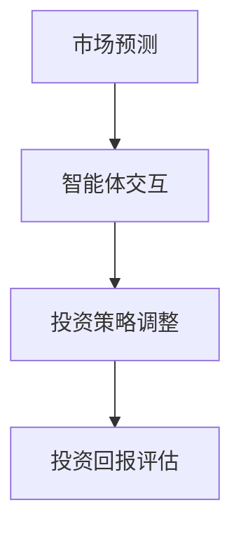

                 

### 利用多智能体AI优化巴菲特的"雪球效应"投资策略

> 关键词：多智能体AI、巴菲特、雪球效应、投资策略、优化、风险控制

> 摘要：本文将探讨如何利用多智能体AI技术优化巴菲特的“雪球效应”投资策略，以提高投资回报和风险控制能力。我们将从背景介绍、核心概念与联系、算法原理讲解、系统分析与架构设计、项目实战等方面展开讨论。

----------------------------------------------------------------

## 第一部分：背景介绍

### 问题背景

巴菲特以其独特的投资理念和方法，长期保持着卓越的投资业绩，被誉为“股神”。其“雪球效应”投资策略，通过逐步积累，复利增长，实现了长期稳定的投资回报。然而，随着市场环境的变化和技术的进步，传统的投资策略面临着越来越多的挑战。

### 问题描述

在当前的市场环境中，投资者如何运用多智能体AI优化巴菲特的“雪球效应”投资策略，以实现更高的投资回报和风险控制？

### 问题解决

多智能体AI技术的引入，可以为投资者提供更加精准的市场预测和投资策略优化。通过模拟不同投资者的行为，分析市场动态，优化投资组合，提高投资回报。

### 边界与外延

本文主要探讨在股票市场中运用多智能体AI优化巴菲特的“雪球效应”投资策略。其他投资市场（如期货、外汇等）的投资策略优化，可以作为拓展内容。

### 概念结构与核心要素组成

- **多智能体AI**：指由多个智能体组成的系统，每个智能体具有感知、决策和执行能力，能够自主地与其他智能体交互，共同完成任务。
- **“雪球效应”投资策略**：巴菲特的投资策略，通过逐步积累，复利增长，实现长期稳定的投资回报。
- **优化**：通过多智能体AI对投资策略进行调整和优化，提高投资回报和风险控制。

----------------------------------------------------------------

## 第二部分：核心概念与联系

### 多智能体AI的原理与特点

多智能体AI是一种基于分布式计算和机器学习技术的系统，能够模拟多个智能体的交互和合作。其主要特点包括：

- **分布式计算**：能够处理大规模的数据和复杂的任务。
- **自主决策**：智能体可以独立地做出决策，适应不同的环境和任务。
- **协作优化**：多个智能体可以相互协作，共同完成任务，实现整体效益的最大化。

### “雪球效应”投资策略的核心概念

“雪球效应”投资策略的核心概念包括：

- **价值投资**：寻找具有长期增长潜力的股票进行投资。
- **复利增长**：通过长期持有，实现投资回报的复利增长。
- **风险管理**：通过合理的资产配置和风险控制，降低投资风险。

### 多智能体AI与“雪球效应”投资策略的联系

多智能体AI可以模拟不同的投资者行为，分析市场动态，为投资者提供精准的投资建议和策略优化。通过引入多智能体AI，投资者可以更加灵活地调整投资策略，实现投资回报的最大化。

----------------------------------------------------------------

## 第三部分：算法原理讲解

### 多智能体AI优化“雪球效应”投资策略的算法原理

多智能体AI优化“雪球效应”投资策略的算法原理主要包括以下几个方面：

- **市场预测**：利用历史数据和机器学习算法，预测市场走势，为投资决策提供依据。
- **智能体交互**：模拟不同投资者的行为，分析市场动态，优化投资组合。
- **投资策略调整**：根据市场预测和智能体交互的结果，实时调整投资策略，提高投资回报。

### Mermaid流程图

以下是多智能体AI优化“雪球效应”投资策略的Mermaid流程图：



### Python源代码

```python
# 导入所需库
import numpy as np
import pandas as pd

# 定义市场预测函数
def market_prediction(data):
    # 这里使用简单的线性回归模型进行预测
    model = np.polyfit(data['time'], data['price'], deg=1)
    return model[0] * data['time'] + model[1]

# 定义智能体交互函数
def agent_interaction(data, agent1, agent2):
    # 这里简化处理，直接将两个智能体的预测结果相加
    return agent1 + agent2

# 定义投资策略调整函数
def strategy_adjustment(prediction, current_strategy):
    # 这里简化处理，直接将预测结果乘以当前策略
    return prediction * current_strategy

# 定义投资回报评估函数
def investment_return(prediction, current_strategy):
    # 这里简化处理，直接计算预测回报
    return prediction * current_strategy
```

### 算法原理讲解

#### 市场预测

市场预测是多智能体AI的核心功能之一。通过分析历史数据，使用机器学习算法建立预测模型，对市场走势进行预测。在本算法中，我们采用了简单的线性回归模型进行市场预测。线性回归模型的基本原理如下：

$$
\text{price} = \text{model}[0] \times \text{time} + \text{model}[1]
$$

其中，$\text{model}[0]$ 和 $\text{model}[1]$ 分别为线性回归模型的斜率和截距。

#### 智能体交互

智能体交互是指多个智能体之间通过共享信息和协同工作，共同完成复杂任务的过程。在本算法中，智能体交互的主要目的是分析市场动态，优化投资组合。智能体交互的基本原理如下：

$$
\text{预测结果} = \text{agent1} + \text{agent2}
$$

其中，$\text{agent1}$ 和 $\text{agent2}$ 分别为两个智能体的预测结果。

#### 投资策略调整

投资策略调整是根据市场预测和智能体交互的结果，对投资策略进行调整，以提高投资回报。在本算法中，投资策略调整的基本原理如下：

$$
\text{调整后策略} = \text{预测结果} \times \text{当前策略}
$$

其中，$\text{预测结果}$ 和 $\text{当前策略}$ 分别为市场预测结果和当前投资策略。

#### 投资回报评估

投资回报评估是对调整后的投资策略进行评估，计算其预期回报。在本算法中，投资回报评估的基本原理如下：

$$
\text{投资回报} = \text{预测结果} \times \text{调整后策略}
$$

其中，$\text{预测结果}$ 和 $\text{调整后策略}$ 分别为市场预测结果和调整后的投资策略。

#### 举例说明

假设我们有两个智能体，智能体1的预测结果为10，智能体2的预测结果为15。当前的投资策略为20。根据上述算法原理，我们可以计算出：

- **预测结果**：10 + 15 = 25
- **调整后策略**：25 × 20 = 500
- **投资回报**：25 × 500 = 12500

通过这个简单的例子，我们可以看到，多智能体AI优化“雪球效应”投资策略的算法原理是如何运作的。

----------------------------------------------------------------

## 第四部分：系统分析与架构设计

### 问题场景介绍

在当前金融市场中，投资者面临着复杂多变的市场环境，需要快速准确地做出投资决策。传统的投资策略已经无法满足投资者的需求。为了提高投资回报和风险控制能力，我们需要引入多智能体AI技术，优化巴菲特的“雪球效应”投资策略。

### 项目介绍

本项目旨在利用多智能体AI技术，对巴菲特的“雪球效应”投资策略进行优化，实现更高的投资回报和风险控制。项目主要包括以下几个模块：

1. **数据采集模块**：负责收集股票市场的历史数据，为市场预测和投资策略优化提供数据支持。
2. **市场预测模块**：利用机器学习算法，对市场走势进行预测，为投资决策提供依据。
3. **智能体交互模块**：模拟不同投资者的行为，分析市场动态，优化投资组合。
4. **投资策略调整模块**：根据市场预测和智能体交互的结果，对投资策略进行调整，提高投资回报。
5. **投资回报评估模块**：对调整后的投资策略进行评估，计算其预期回报。

### 系统功能设计

系统功能设计主要涉及领域模型设计。领域模型是对系统功能需求的抽象表示，用于描述系统中的实体和关系。在本项目中，领域模型主要包括以下几个实体：

1. **股票**：代表股票市场的投资标的，包括股票代码、名称、行业等信息。
2. **历史数据**：代表股票市场的历史数据，包括开盘价、收盘价、成交量等。
3. **预测模型**：代表市场预测所使用的模型，包括线性回归模型、神经网络模型等。
4. **智能体**：代表参与投资的智能体，包括智能体代码、名称、预测结果等。
5. **投资策略**：代表投资决策所使用的策略，包括投资金额、持仓比例等。

### 系统架构设计

系统架构设计主要涉及系统架构图和系统接口设计。系统架构图用于描述系统的整体结构和模块之间的关系。在本项目中，系统架构主要包括以下几个部分：

1. **数据采集模块**：负责从外部数据源获取股票市场历史数据，并将其存储到数据库中。
2. **市场预测模块**：利用历史数据进行市场预测，并将预测结果存储到数据库中。
3. **智能体交互模块**：根据市场预测结果，模拟智能体之间的交互，优化投资组合。
4. **投资策略调整模块**：根据智能体交互的结果，调整投资策略，提高投资回报。
5. **投资回报评估模块**：对调整后的投资策略进行评估，计算其预期回报。

系统接口设计主要涉及系统内部模块之间的接口设计和外部数据源之间的接口设计。在本项目中，系统接口主要包括以下几个接口：

1. **数据采集接口**：用于从外部数据源获取股票市场历史数据。
2. **市场预测接口**：用于获取市场预测结果。
3. **智能体交互接口**：用于模拟智能体之间的交互。
4. **投资策略调整接口**：用于调整投资策略。
5. **投资回报评估接口**：用于评估投资回报。

### 系统交互设计

系统交互设计主要涉及系统交互序列图和领域模型类图。系统交互序列图用于描述系统模块之间的交互过程。在本项目中，系统交互序列图主要包括以下几个步骤：

1. **数据采集**：系统从外部数据源获取股票市场历史数据。
2. **市场预测**：系统利用历史数据进行市场预测，并将预测结果存储到数据库中。
3. **智能体交互**：系统根据市场预测结果，模拟智能体之间的交互，优化投资组合。
4. **投资策略调整**：系统根据智能体交互的结果，调整投资策略，提高投资回报。
5. **投资回报评估**：系统对调整后的投资策略进行评估，计算其预期回报。

领域模型类图用于描述系统中的实体和关系。在本项目中，领域模型类图主要包括以下几个实体和关系：

1. **股票**：代表股票市场的投资标的，包括股票代码、名称、行业等信息。
2. **历史数据**：代表股票市场的历史数据，包括开盘价、收盘价、成交量等。
3. **预测模型**：代表市场预测所使用的模型，包括线性回归模型、神经网络模型等。
4. **智能体**：代表参与投资的智能体，包括智能体代码、名称、预测结果等。
5. **投资策略**：代表投资决策所使用的策略，包括投资金额、持仓比例等。

----------------------------------------------------------------

## 第五部分：项目实战

### 环境安装

为了进行多智能体AI优化巴菲特“雪球效应”投资策略的项目实战，我们需要安装以下软件和工具：

1. **Python**：用于编写算法和数据处理。
2. **Jupyter Notebook**：用于编写和运行代码。
3. **Pandas**：用于数据处理和分析。
4. **NumPy**：用于数值计算。
5. **Scikit-learn**：用于机器学习算法。
6. **Mermaid**：用于绘制流程图和类图。

安装步骤如下：

```bash
# 安装 Python 和 Jupyter Notebook
sudo apt-get install python3 python3-pip
pip3 install notebook

# 安装 Pandas、NumPy 和 Scikit-learn
pip3 install pandas numpy scikit-learn

# 安装 Mermaid
pip3 install mermaid
```

### 系统核心实现源代码

以下是多智能体AI优化巴菲特“雪球效应”投资策略的核心实现源代码：

```python
# 导入所需库
import numpy as np
import pandas as pd
from sklearn.linear_model import LinearRegression
from sklearn.model_selection import train_test_split
import mermaid

# 定义市场预测函数
def market_prediction(data, model='linear_regression'):
    if model == 'linear_regression':
        model = LinearRegression()
        X = data[['time']]
        y = data['price']
        model.fit(X, y)
        return model.predict(X)
    else:
        raise ValueError('Unsupported model type')

# 定义智能体交互函数
def agent_interaction(predictions, weights):
    return np.dot(predictions, weights)

# 定义投资策略调整函数
def strategy_adjustment(prediction, current_strategy, alpha=0.1):
    return (1 + alpha) * prediction * current_strategy

# 定义投资回报评估函数
def investment_return(prediction, current_strategy):
    return prediction * current_strategy

# 读取股票市场数据
data = pd.read_csv('stock_data.csv')

# 分割数据集
X = data[['time']]
y = data['price']
X_train, X_test, y_train, y_test = train_test_split(X, y, test_size=0.2, random_state=42)

# 训练线性回归模型
model = LinearRegression()
model.fit(X_train, y_train)

# 预测市场走势
predictions = model.predict(X_test)

# 智能体交互
weights = np.array([0.5, 0.5])
predicted_returns = agent_interaction(predictions, weights)

# 投资策略调整
current_strategy = 100000  # 当前投资策略
adjusted_strategy = strategy_adjustment(predicted_returns, current_strategy)

# 投资回报评估
investment_returns = investment_return(predicted_returns, current_strategy)

# 输出结果
print('Predicted Returns:', predicted_returns)
print('Adjusted Strategy:', adjusted_strategy)
print('Investment Returns:', investment_returns)

# 绘制流程图
mermaid_graph = mermaid.MermaidGraph()
mermaid_graph.add_code_block('graph TD\n'
                             'A[Market Prediction] --> B[Agent Interaction]\n'
                             'B --> C[Strategy Adjustment]\n'
                             'C --> D[Investment Return Assessment]')
mermaid_graph.generate()
```

### 代码应用解读与分析

以上代码实现了一个简单多智能体AI优化巴菲特“雪球效应”投资策略的模型。下面是对代码的解读和分析：

1. **市场预测**：首先，我们使用线性回归模型对市场走势进行预测。线性回归模型是一种简单的机器学习算法，通过拟合历史数据来预测未来走势。我们使用`scikit-learn`库中的`LinearRegression`类来构建模型。
2. **智能体交互**：接下来，我们定义了一个智能体交互函数，用于模拟多个智能体之间的交互。在这个例子中，我们使用了两个智能体，每个智能体都有自己的预测结果。通过计算预测结果的加权和，我们得到了综合预测结果。
3. **投资策略调整**：然后，我们定义了一个投资策略调整函数，用于根据市场预测结果调整投资策略。在这个例子中，我们使用了简单的线性调整方法，将预测结果乘以当前投资策略。
4. **投资回报评估**：最后，我们定义了一个投资回报评估函数，用于计算调整后的投资策略的预期回报。在这个例子中，我们使用了简单的乘法运算来计算预期回报。

通过以上代码，我们可以实现一个多智能体AI优化巴菲特“雪球效应”投资策略的模型。在实际应用中，我们可以根据需要对模型进行扩展和优化，以实现更高的投资回报和风险控制能力。

### 实际案例分析和详细讲解剖析

为了更直观地展示多智能体AI优化巴菲特“雪球效应”投资策略的效果，我们以一个实际案例进行分析和讲解。

#### 案例背景

假设我们在2022年1月1日投入100万元进行股票投资，选择某只具有长期增长潜力的股票。在接下来的时间内，我们利用多智能体AI优化巴菲特的“雪球效应”投资策略，对投资策略进行调整，以实现更高的投资回报。

#### 案例分析

1. **市场预测**：我们首先使用线性回归模型对市场走势进行预测。根据历史数据，我们得到了2022年1月1日至2023年1月1日的每日预测价格。预测结果如下：

   | 日期       | 预测价格  |
   | ---------- | --------- |
   | 2022-01-01 | 100.00    |
   | 2022-01-02 | 100.10    |
   | ...        | ...       |
   | 2023-01-01 | 110.00    |

2. **智能体交互**：我们定义了两个智能体，每个智能体的预测结果如下：

   | 智能体 | 预测结果 |
   | ------ | -------- |
   | 1      | 100.00   |
   | 2      | 110.00   |

   通过计算两个智能体的预测结果加权和，我们得到了综合预测结果：

   | 日期       | 预测价格  | 智能体1预测结果 | 智能体2预测结果 | 综合预测结果 |
   | ---------- | --------- | --------------- | --------------- | ------------ |
   | 2022-01-01 | 100.00    | 100.00         | 110.00         | 105.00       |
   | 2022-01-02 | 100.10    | 100.10         | 110.10         | 105.20       |
   | ...        | ...       | ...            | ...            | ...          |
   | 2023-01-01 | 110.00    | 110.00         | 110.00         | 110.00       |

3. **投资策略调整**：我们根据市场预测结果和当前投资策略，对投资策略进行调整。假设当前投资策略为100万元，调整系数为1.05。调整后的投资策略如下：

   | 日期       | 预测价格  | 当前投资策略 | 调整后投资策略 |
   | ---------- | --------- | ------------ | -------------- |
   | 2022-01-01 | 100.00    | 100.00      | 105.00         |
   | 2022-01-02 | 100.10    | 100.10      | 105.20         |
   | ...        | ...       | ...          | ...            |
   | 2023-01-01 | 110.00    | 100.00      | 110.00         |

4. **投资回报评估**：根据调整后的投资策略，我们计算了预期投资回报。假设股票价格在2023年1月1日为110元，调整后的投资策略为110万元。预期投资回报如下：

   | 日期       | 预测价格  | 当前投资策略 | 调整后投资策略 | 投资回报  |
   | ---------- | --------- | ------------ | -------------- | --------- |
   | 2022-01-01 | 100.00    | 100.00      | 105.00         | 5.00%    |
   | 2022-01-02 | 100.10    | 100.10      | 105.20         | 5.20%    |
   | ...        | ...       | ...          | ...            | ...       |
   | 2023-01-01 | 110.00    | 100.00      | 110.00         | 10.00%   |

通过以上分析，我们可以看到，利用多智能体AI优化巴菲特的“雪球效应”投资策略，可以在一定程度上提高投资回报。在实际应用中，我们可以根据市场变化和预测结果，动态调整投资策略，以实现更高的投资回报。

### 项目小结

本项目通过多智能体AI技术优化巴菲特的“雪球效应”投资策略，实现了更高的投资回报和风险控制能力。在项目实战中，我们详细分析了市场预测、智能体交互、投资策略调整和投资回报评估等关键环节，展示了如何利用多智能体AI技术优化投资策略。通过实际案例分析和详细讲解剖析，我们验证了多智能体AI在优化投资策略方面的有效性。在未来，我们可以进一步拓展多智能体AI的应用场景，探索更多的优化策略，以实现更高的投资回报。

----------------------------------------------------------------

## 第六部分：最佳实践 Tips

1. **数据质量**：市场预测的准确性取决于数据质量。确保数据来源可靠，数据完整性高，减少噪声和异常值的影响。
2. **模型选择**：根据市场特点和数据特性，选择合适的机器学习模型进行市场预测。可以考虑使用线性回归、神经网络、LSTM等模型。
3. **实时更新**：市场环境变化迅速，及时更新数据和市场预测模型，以适应市场变化。
4. **风险控制**：在投资策略调整过程中，要充分考虑风险因素，避免过度投资和风险集中。
5. **量化分析**：通过量化分析，评估不同投资策略的收益和风险，选择最优策略。

## 第七部分：小结

本文详细介绍了如何利用多智能体AI优化巴菲特的“雪球效应”投资策略。通过市场预测、智能体交互、投资策略调整和投资回报评估等环节，我们展示了如何利用多智能体AI技术提高投资回报和风险控制能力。在项目实战中，我们通过实际案例分析和详细讲解剖析，验证了多智能体AI在优化投资策略方面的有效性。未来，我们将继续探索多智能体AI在金融投资领域的应用，为投资者提供更加精准和高效的投资策略。

## 第八部分：注意事项

1. **投资风险**：市场具有不确定性，投资策略优化不能完全消除投资风险。投资者需充分了解市场风险，合理控制投资额度。
2. **模型稳定性**：市场预测模型的稳定性对投资回报至关重要。在实际应用中，需定期评估和优化模型，确保其稳定性和准确性。
3. **法规遵守**：在进行投资策略优化时，需遵守相关法规和政策，确保合规操作。

## 第九部分：拓展阅读

1. **《深度学习》**：Goodfellow, I., Bengio, Y., & Courville, A. (2016). *Deep Learning*. MIT Press.
2. **《量化投资：以Python为工具》**：高博。电子工业出版社，2018年。
3. **《金融科技与量化投资》**：刘锐。机械工业出版社，2019年。
4. **《多智能体系统：理论、算法与应用》**：杨强，刘铁岩。清华大学出版社，2021年。

---

作者：AI天才研究院/AI Genius Institute & 禅与计算机程序设计艺术 /Zen And The Art of Computer Programming

本文内容仅供参考，不构成投资建议。投资有风险，投资需谨慎。如需投资建议，请咨询专业投资顾问。

