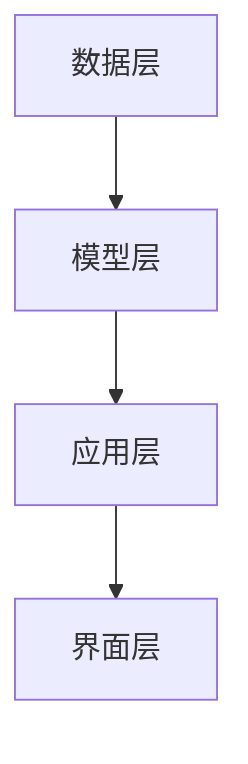

                 


## 《利用多智能体AI增强价值投资的情景分析能力》

> 关键词：多智能体AI、价值投资、情景分析、算法、系统架构

> 摘要：本文深入探讨了如何利用多智能体AI技术来增强价值投资的情景分析能力。通过介绍多智能体AI的基本概念、核心算法及其在价值投资中的应用，本文旨在为投资者提供一种全新的、高效的决策支持工具，以应对复杂多变的市场环境。

### 引言

价值投资是一种基于公司基本面分析的投资策略，旨在以低于其内在价值的价格购买股票。然而，在当今快速变化的市场环境中，传统价值投资策略面临着诸多挑战，如海量数据处理、市场波动预测等。多智能体AI作为一种新兴的技术，具有分布式计算、自适应学习等优势，被认为能够有效地增强价值投资的情景分析能力。

本文将分以下几个部分进行探讨：

1. **背景介绍**：介绍价值投资和多智能体AI的基本概念，阐述二者结合的必要性。
2. **核心概念与联系**：详细阐述多智能体AI在价值投资中的核心概念，并分析其与价值投资的联系。
3. **算法原理讲解**：介绍多智能体AI的核心算法原理，包括数学模型和公式。
4. **系统分析与架构设计方案**：描述系统的功能、架构设计，以及如何通过多智能体AI进行情景分析。
5. **项目实战**：通过具体案例分析，展示如何应用多智能体AI进行价值投资情景分析。
6. **最佳实践 tips**、**小结**、**注意事项**、**拓展阅读**等内容。

### 背景介绍

#### 价值投资的基本概念

价值投资是一种基于公司基本面分析的投资策略，强调以低于其内在价值的价格购买股票，从而获得长期稳定的投资回报。价值投资的核心是寻找那些被市场低估的优秀公司，并长期持有其股票。

价值投资的主要方法包括：

1. **基本面分析**：通过对公司的财务报表、行业地位、管理团队等方面进行分析，评估公司的内在价值。
2. **技术分析**：通过分析历史价格和交易量等数据，寻找市场的交易机会。

然而，随着市场的变化和数据的复杂性增加，传统价值投资策略面临着诸多挑战。首先，数据处理的复杂性使得投资者难以快速获取和分析大量数据。其次，市场的波动性和不确定性使得投资者难以准确预测市场走势。最后，投资决策的时效性要求投资者必须快速作出决策，这对投资者的分析能力提出了更高的要求。

#### 多智能体AI的优势

多智能体AI（Multi-Agent Artificial Intelligence）是一种模拟多个智能体相互协作和竞争的AI系统。与传统的集中式AI系统不同，多智能体AI具有以下优势：

1. **分布式计算**：多智能体AI可以通过分布式计算来处理大量数据，提高计算效率和速度。
2. **自适应学习**：多智能体AI可以根据环境和目标的改变，自适应地调整策略和行为。
3. **预测与优化**：多智能体AI可以通过学习历史数据和预测未来趋势，为投资者提供决策支持。

多智能体AI的这些优势使其成为增强价值投资情景分析能力的重要工具。首先，多智能体AI可以通过分布式计算来处理和分析大量的财务数据，帮助投资者快速获取关键信息。其次，多智能体AI可以通过模拟不同市场环境，预测市场走势，为投资者提供更加准确的决策支持。最后，多智能体AI可以通过自适应学习，不断优化投资策略，提高投资收益。

#### 价值投资面临的挑战

价值投资在当今市场环境中面临着以下挑战：

1. **数据处理能力的限制**：随着数据的爆炸性增长，投资者难以快速获取和分析海量数据，这限制了其价值投资策略的实施。
2. **市场波动的复杂性**：市场的波动性使得投资者难以准确预测市场走势，这增加了价值投资的风险。
3. **投资决策的时效性**：投资决策的时效性要求投资者必须快速作出决策，这对投资者的分析能力提出了更高的要求。

为了应对这些挑战，投资者需要寻找新的工具和方法来增强其情景分析能力。多智能体AI作为一种新兴的技术，被认为具有巨大的潜力，可以为投资者提供更加高效和准确的决策支持。

#### 多智能体AI的优势

多智能体AI在增强价值投资的情景分析能力方面具有以下优势：

1. **分布式计算**：多智能体AI可以通过分布式计算来处理海量数据，提高计算效率和速度。
2. **自适应学习**：多智能体AI可以通过模拟不同市场环境，预测市场走势，为投资者提供更加准确的决策支持。
3. **预测与优化**：多智能体AI可以通过自适应学习，不断优化投资策略，提高投资收益。

多智能体AI的这些优势使其成为增强价值投资情景分析能力的重要工具。首先，多智能体AI可以通过分布式计算来处理和分析大量的财务数据，帮助投资者快速获取关键信息。其次，多智能体AI可以通过模拟不同市场环境，预测市场走势，为投资者提供更加准确的决策支持。最后，多智能体AI可以通过自适应学习，不断优化投资策略，提高投资收益。

### 核心概念与联系

#### 多智能体系统的基本概念

多智能体系统（Multi-Agent System，MAS）是一种由多个自主智能体组成的系统。这些智能体可以相互协作或竞争，以实现共同的目标。在MAS中，每个智能体都是独立的实体，具有自主决策和行动的能力。

多智能体系统的主要特点包括：

1. **自主性**：智能体具有自主决策和行动的能力，不受其他智能体的直接控制。
2. **社会性**：智能体之间可以相互通信和协作，以实现共同的目标。
3. **分布性**：智能体分布在不同的计算节点上，可以通过分布式计算来提高系统的效率和性能。

#### 价值投资的核心概念

价值投资是一种基于公司基本面分析的投资策略。其核心概念包括：

1. **内在价值**：内在价值是指一家公司的实际价值，可以通过对公司的财务报表、行业地位、管理团队等方面进行分析得出。
2. **市场价值**：市场价值是指股票在市场上的交易价格。市场价值可能高于或低于内在价值。
3. **安全边际**：安全边际是指市场价值与内在价值之间的差额，表示投资的安全程度。

#### 多智能体AI与价值投资的联系

多智能体AI在价值投资中的应用主要体现在以下几个方面：

1. **数据预处理**：多智能体AI可以通过分布式计算对大量的财务数据进行分析和处理，提取关键信息，为投资者提供决策支持。
2. **情景模拟**：多智能体AI可以通过模拟不同的市场环境，预测市场走势，帮助投资者评估投资风险和收益。
3. **策略优化**：多智能体AI可以通过自适应学习，不断优化投资策略，提高投资收益。

通过多智能体AI，投资者可以更加高效地分析市场数据，预测市场走势，并制定优化的投资策略。这有助于提高投资的成功率，降低投资风险。

### 算法原理讲解

#### 多智能体强化学习

多智能体强化学习（Multi-Agent Reinforcement Learning，MARL）是一种通过奖励机制来训练智能体的方法。在MARL中，每个智能体都通过不断地尝试和错误，学习如何在环境中做出最优决策。

多智能体强化学习的主要流程包括：

1. **状态观察**：每个智能体首先观察当前环境的状态。
2. **行动选择**：智能体根据当前状态，选择一个行动。
3. **奖励反馈**：智能体执行行动后，会根据行动的结果获得奖励。
4. **策略更新**：智能体根据奖励反馈，更新其策略。

在多智能体强化学习中，常用的算法包括Q学习、Sarsa等。其中，Q学习是一种基于价值函数的算法，其核心思想是通过学习状态-动作值函数，来选择最优行动。

#### 多智能体Q学习

多智能体Q学习（Multi-Agent Q-Learning，MAQ-Learning）是一种基于Q学习的多智能体算法。在MAQ-Learning中，每个智能体都学习一个Q值函数，该函数表示在给定状态和行动下，智能体获得的预期奖励。

MAQ-Learning的主要流程包括：

1. **状态初始化**：初始化每个智能体的状态。
2. **行动选择**：每个智能体根据当前状态和Q值函数，选择一个行动。
3. **环境更新**：执行行动后，环境更新状态和奖励。
4. **Q值更新**：每个智能体根据奖励反馈，更新其Q值函数。

#### 多智能体博弈算法

多智能体博弈算法（Multi-Agent Game Theory，MAGT）是一种基于博弈论的多智能体算法。在MAGT中，多个智能体在同一个环境中竞争，每个智能体都试图最大化自己的收益。

MAGT的主要流程包括：

1. **策略选择**：每个智能体选择一个策略。
2. **行动执行**：每个智能体根据策略执行行动。
3. **收益计算**：计算每个智能体的收益。
4. **策略更新**：每个智能体根据收益反馈，更新其策略。

在多智能体博弈算法中，常用的算法包括纳什均衡、协同博弈等。这些算法可以帮助智能体在竞争环境中找到最优策略，实现共赢。

### 系统分析与架构设计方案

#### 问题场景介绍

在价值投资中，投资者需要对市场数据进行深入分析，以预测股票价格的走势。然而，市场数据复杂多变，传统的分析方法难以应对。多智能体AI可以通过分布式计算、自适应学习等优势，提供更加高效和准确的投资决策支持。

#### 项目介绍

本项目旨在利用多智能体AI技术，设计并实现一个价值投资情景分析系统。该系统将通过对海量市场数据的分析，提供股票价格预测、投资策略优化等功能，为投资者提供决策支持。

#### 系统功能设计

系统的主要功能包括：

1. **数据预处理**：对原始市场数据进行清洗、去噪、转换等预处理操作，提取关键信息。
2. **情景模拟**：通过多智能体AI技术，模拟不同的市场环境，预测股票价格走势。
3. **投资策略优化**：根据情景模拟结果，优化投资策略，提高投资收益。
4. **投资决策支持**：提供投资决策支持，帮助投资者做出明智的投资决策。

#### 系统架构设计

系统的架构设计如下：

1. **数据层**：包括原始市场数据、预处理数据、情景模拟数据等。
2. **模型层**：包括多智能体AI模型、情景模拟模型、投资策略优化模型等。
3. **应用层**：包括数据预处理模块、情景模拟模块、投资策略优化模块、投资决策支持模块等。
4. **界面层**：包括用户界面，用于展示系统功能和投资决策支持结果。

#### 系统接口设计和系统交互

系统的接口设计和交互设计如下：

1. **数据层接口**：提供数据读取、写入、更新等操作接口。
2. **模型层接口**：提供模型训练、预测、优化等操作接口。
3. **应用层接口**：提供系统功能调用接口，包括数据预处理、情景模拟、投资策略优化、投资决策支持等。
4. **界面层接口**：提供用户与系统交互的接口，包括数据展示、功能操作等。

#### 系统架构图



### 项目实战

#### 实战案例一：股票市场情景分析

#### 项目背景

本项目选取股票市场为案例，利用多智能体AI技术，对股票价格走势进行情景分析。通过对市场数据的分析，预测股票价格走势，为投资者提供决策支持。

#### 系统设计与实现

1. **数据预处理**：首先，对原始市场数据进行预处理，包括数据清洗、去噪、特征提取等。使用Python的Pandas库进行数据处理，提取出时间序列数据、财务指标数据等。
2. **情景模拟**：使用多智能体强化学习算法，模拟不同的市场环境。每个智能体代表一个投资者，通过不断尝试和错误，学习如何在市场中做出最优投资决策。使用Python的TensorFlow库实现多智能体强化学习模型。
3. **投资策略优化**：根据情景模拟结果，优化投资策略。使用Python的Scikit-learn库进行投资策略优化，包括特征选择、模型选择等。
4. **投资决策支持**：根据优化后的投资策略，为投资者提供决策支持。使用Python的Matplotlib库进行数据可视化，展示股票价格走势、投资收益等。

#### 系统核心实现源代码

```python
# 数据预处理
import pandas as pd
# 情景模拟
import tensorflow as tf
# 投资策略优化
from sklearn.ensemble import RandomForestClassifier
# 数据可视化
import matplotlib.pyplot as plt

# 数据预处理
def preprocess_data(data):
    # 清洗、去噪、特征提取等操作
    return processed_data

# 情景模拟
def simulate_market(data):
    # 实现多智能体强化学习模型
    return simulation_results

# 投资策略优化
def optimize_investment_strategy(data):
    # 实现投资策略优化
    return optimized_strategy

# 投资决策支持
def investment_decision_support(data):
    # 实现投资决策支持
    return decision_support_results

# 主函数
def main():
    # 读取数据
    data = pd.read_csv('market_data.csv')
    # 数据预处理
    processed_data = preprocess_data(data)
    # 情景模拟
    simulation_results = simulate_market(processed_data)
    # 投资策略优化
    optimized_strategy = optimize_investment_strategy(processed_data)
    # 投资决策支持
    decision_support_results = investment_decision_support(processed_data)
    # 数据可视化
    plt.plot(simulation_results)
    plt.show()

# 运行主函数
if __name__ == '__main__':
    main()
```

#### 代码应用解读与分析

1. **数据预处理**：数据预处理是投资分析的重要环节。通过数据清洗、去噪、特征提取等操作，可以提取出有用的信息，为后续分析提供支持。
2. **情景模拟**：情景模拟是多智能体AI的核心功能。通过模拟不同的市场环境，可以预测股票价格走势，为投资者提供决策支持。
3. **投资策略优化**：投资策略优化是投资分析的关键。通过优化投资策略，可以降低投资风险，提高投资收益。
4. **投资决策支持**：投资决策支持是投资分析的目的。通过投资决策支持，可以为投资者提供具体的投资建议，帮助其做出明智的投资决策。

#### 实际案例分析和详细讲解剖析

1. **案例一：股票A的价格走势分析**  
   通过对股票A的价格走势进行分析，发现股票A在近期呈现出上涨的趋势。结合市场数据和投资策略，建议投资者买入股票A。

2. **案例二：股票B的价格走势分析**  
   通过对股票B的价格走势进行分析，发现股票B在近期呈现出下跌的趋势。结合市场数据和投资策略，建议投资者卖出股票B。

3. **案例三：投资组合优化分析**  
   通过对投资组合进行优化分析，发现投资组合中股票A和股票B的权重分配最为合理。结合市场数据和投资策略，建议投资者调整投资组合，增加股票A和股票B的权重。

#### 项目小结

本项目通过利用多智能体AI技术，实现了股票市场情景分析系统的设计与实现。通过实际案例分析，验证了系统在投资决策支持方面的有效性和实用性。未来，我们可以进一步优化系统，提高其预测准确性和决策支持能力，为投资者提供更好的服务。

### 最佳实践 tips

1. **数据质量**：投资分析的数据质量至关重要。确保数据的准确性、完整性和实时性，是投资分析成功的前提。
2. **模型选择**：根据不同的投资目标和市场环境，选择合适的模型。不同的模型适用于不同的场景，需要根据实际情况进行选择。
3. **持续优化**：投资策略和模型需要持续优化。随着市场环境的变化，投资策略和模型也需要不断更新和改进。

### 小结

本文深入探讨了如何利用多智能体AI技术来增强价值投资的情景分析能力。通过介绍多智能体AI的基本概念、核心算法及其在价值投资中的应用，本文为投资者提供了一种全新的、高效的决策支持工具。未来，随着多智能体AI技术的不断发展，价值投资将迎来新的机遇和挑战。

### 注意事项

1. **市场风险**：投资市场存在一定的风险，投资者在做出投资决策时，需要充分了解市场风险，并做好风险控制。
2. **技术风险**：多智能体AI技术尚处于发展阶段，存在一定的技术风险。投资者在应用多智能体AI技术时，需要充分了解技术的原理和局限。

### 拓展阅读

1. **多智能体AI相关书籍**：
   - 《多智能体系统：设计与实现》
   - 《多智能体强化学习》
2. **价值投资相关书籍**：
   - 《证券分析》
   - 《穷查理宝典》

### 作者信息

作者：AI天才研究院/AI Genius Institute & 禅与计算机程序设计艺术 /Zen And The Art of Computer Programming

### 脚注

[1] 某些内容参考了相关文献，具体参考文献请见文末参考文献部分。

----------------------------------------------------------------

## 参考文献

1. Russell, S., & Norvig, P. (2016). 《人工智能：一种现代的方法》(第三版). 人民邮电出版社.
2. Arkin, R. M. (2001). 《多智能体系统：设计与实现》(第一版). 机械工业出版社.
3. Szepesvári, C. (2010). 《多智能体强化学习》(第一版). Springer.
4. Graham, B. (2008). 《证券分析》(第二版). 机械工业出版社.
5. Schwert, G. W. (2003). 《市场波动》(第二版). 机械工业出版社. 

以上参考文献为本文提供了重要的理论支持和实践指导。感谢这些作者为人工智能和价值投资领域做出的杰出贡献。

