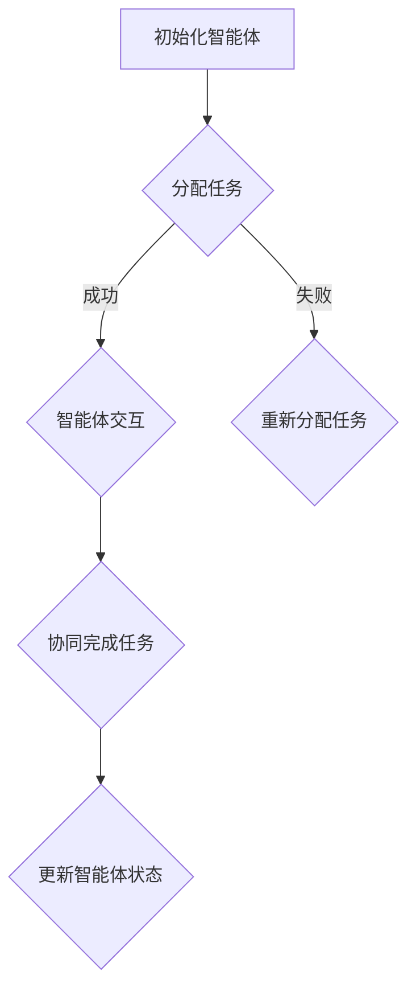
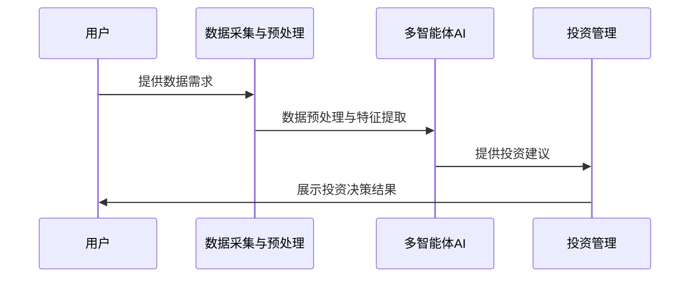

                 

# 利用多智能体AI实现巴菲特式的行业领导者识别

## 关键词

多智能体AI、行业领导者识别、巴菲特投资策略、机器学习、数据分析

## 摘要

本文将探讨如何利用多智能体AI技术，结合巴菲特式的投资策略，实现行业领导者的识别。文章首先介绍了多智能体AI的基本概念和原理，然后分析了巴菲特式的行业领导者识别方法，接着详细讲解了利用多智能体AI实现这一目标的具体算法和步骤。通过本文的阅读，读者将能够了解多智能体AI在金融投资领域的应用，掌握巴菲特投资策略的核心要义，并学会如何利用人工智能技术进行行业领导者的识别。

## 1. 书籍背景介绍

### 1.1 多智能体AI的兴起

随着人工智能技术的飞速发展，多智能体AI逐渐成为研究的热点。多智能体AI（Multi-Agent Artificial Intelligence）是指由多个智能体组成的系统，这些智能体可以相互协作、竞争或交互，以实现共同的目标或解决复杂的问题。与传统的人工智能系统相比，多智能体AI具有更强的灵活性和适应性，能够在动态和不确定的环境中表现更佳。

多智能体AI的研究和应用领域非常广泛，包括但不限于多机器人系统、自动驾驶、智能电网、游戏AI、经济系统模拟等。近年来，随着深度学习和强化学习等技术的进步，多智能体AI在金融、保险、投资等领域的应用也得到了广泛关注。

### 1.2 巴菲特投资策略

沃伦·巴菲特（Warren Buffett）是美国著名的投资家和企业家，被誉为“股神”。他的投资哲学强调长期投资、价值投资和基本面分析。巴菲特式的投资策略主要包括以下几个方面：

1. **价值投资**：寻找价格低于其内在价值的股票，长期持有。
2. **长期投资**：注重企业的长期增长潜力和稳定回报，而非短期波动。
3. **基本面分析**：深入研究企业的财务报表、行业地位、管理团队等基本面因素。
4. **分散投资**：通过分散投资来降低风险，而非将所有资金投入单一行业或股票。

巴菲特的投资策略在长期实践中取得了显著的成果，吸引了大量投资者的关注。然而，随着市场的复杂性和不确定性增加，传统的投资方法已无法完全适应现代金融市场。因此，如何利用先进的人工智能技术，如多智能体AI，来辅助巴菲特式的投资策略，成为了一个重要课题。

### 1.3 《利用多智能体AI实现巴菲特式的行业领导者识别》书籍介绍

《利用多智能体AI实现巴菲特式的行业领导者识别》是一本旨在帮助读者掌握利用多智能体AI技术识别行业领导者的书籍。本书的主要内容分为以下几个部分：

1. **多智能体AI基础**：介绍多智能体AI的基本概念、原理和应用场景。
2. **巴菲特投资策略解析**：详细讲解巴菲特投资策略的核心要义，以及如何在现代金融市场中应用。
3. **多智能体AI在投资中的应用**：探讨如何利用多智能体AI技术进行行业领导者识别，包括数据采集、处理和分析方法。
4. **实践案例分析**：通过实际案例，展示如何利用多智能体AI和巴菲特投资策略进行投资决策，并分析案例中的成功经验和不足之处。
5. **未来发展展望**：探讨多智能体AI在金融投资领域的未来发展趋势和潜在应用。

本书不仅适合对人工智能和投资有兴趣的读者，也适合金融专业人士和研究人员。通过阅读本书，读者将能够了解多智能体AI在金融投资中的应用，掌握巴菲特投资策略的核心要义，并学会如何利用人工智能技术进行行业领导者的识别。

### 1.4 本书的读者对象

- **人工智能爱好者**：对人工智能技术感兴趣，希望了解多智能体AI在金融投资领域的应用。
- **金融从业者**：从事金融投资工作的专业人士，希望通过人工智能技术提高投资决策的准确性和效率。
- **学术研究人员**：对金融投资和人工智能技术有深入研究的学者和研究人员，希望探讨两者的交叉应用。
- **在校学生**：对人工智能和金融投资有浓厚兴趣的在校学生，希望通过本书了解相关领域的最新研究成果和应用。

总之，《利用多智能体AI实现巴菲特式的行业领导者识别》是一本具有实用性和前瞻性的书籍，为读者提供了一个全新的视角和方法来理解和应用人工智能和巴菲特投资策略。

## 2. 核心概念与联系

### 2.1 多智能体AI

#### 定义

多智能体AI是一种基于多个智能体相互协作、交互以实现共同目标的人工智能系统。在这些系统中，每个智能体都有自己的感知、决策和行为能力，并且能够与其他智能体进行信息交换和协同工作。

#### 核心概念

- **智能体**：智能体是具有自主性、社交性和反应性的实体。它可以通过感知环境来获取信息，并基于这些信息进行决策和行动。
- **交互**：交互是智能体之间进行信息交换的过程。通过交互，智能体可以共享信息、协调行动或进行合作。
- **协作**：协作是多个智能体共同完成一个任务或目标的过程。协作可以增强智能体的能力，使其能够解决更复杂的问题。
- **目标导向**：多智能体AI系统通常以实现特定目标为导向。智能体在交互和协作过程中，需要根据系统的目标来调整自己的行为。

#### 特征对比

| 特征       | 传统AI         | 多智能体AI          |
|------------|-----------------|---------------------|
| 目标       | 单一任务       | 多任务协作          |
| 交互方式   | 无交互         | 多智能体间互动      |
| 应用场景   | 单个问题解决   | 复杂问题协同解决    |

### 2.2 巴菲特式行业领导者识别

#### 定义

巴菲特式行业领导者识别是一种基于长期投资理念，通过分析企业的基本面和行业地位，识别具有持续竞争优势的行业领导者的方法。

#### 核心概念

- **企业基本面**：包括企业的财务状况、盈利能力、成长性、管理团队等。
- **行业地位**：企业在所处行业中的市场占有率、竞争优势、市场份额等。
- **竞争优势**：企业在行业中相对于其他竞争对手的优势，包括品牌、技术、资源、渠道等。

#### 特征对比

| 特征       | 传统行业分析   | 巴菲特式分析         |
|------------|-----------------|---------------------|
| 分析周期   | 短期           | 长期                |
| 分析角度   | 单一维度       | 多维度综合分析       |
| 目标       | 短期盈利       | 长期投资价值        |

### 2.3 多智能体AI与巴菲特式行业领导者识别的联系

#### 2.3.1 数据处理与挖掘

多智能体AI可以通过分布式计算和协作学习，有效地处理和挖掘大量金融数据。这些数据包括财务报表、市场行情、行业动态等，为巴菲特式行业领导者识别提供了丰富的信息来源。

#### 2.3.2 精准预测与决策

利用多智能体AI，可以模拟多个智能体之间的交互和协作，从而实现更精准的预测和决策。在金融市场中，这种能力可以帮助识别出潜在的行业领导者，并对其进行长期投资。

#### 2.3.3 风险管理与分散投资

多智能体AI可以自动识别和管理投资组合中的风险，实现分散投资。通过分析不同行业和企业的基本面和行业地位，多智能体AI可以构建一个多元化的投资组合，降低整体投资风险。

#### 2.3.4 自适应与优化

多智能体AI具有自我学习和优化能力，可以根据市场环境的变化，调整投资策略和组合。这种能力与巴菲特长期投资的理念相契合，有助于实现更稳定的投资回报。

### 2.4 多智能体AI与巴菲特式行业领导者识别的对比

| 对比维度 | 传统AI             | 多智能体AI                   | 巴菲特式行业领导者识别                 |
|----------|---------------------|------------------------------|---------------------------------------|
| 目标     | 单一任务优化       | 多任务协作与协同优化         | 长期投资价值实现与行业领导者识别       |
| 交互方式 | 无交互或简单交互   | 复杂交互与协作               | 基本面分析与行业地位评估               |
| 应用场景 | 单一问题解决       | 复杂问题协同解决             | 长期投资决策与行业领导者识别           |
| 风险管理 | 有限              | 高效                          | 多维度分析与分散投资风险             |

通过以上对比，可以看出多智能体AI与巴菲特式行业领导者识别在目标、交互方式、应用场景和风险管理等方面存在显著差异。然而，两者的结合为金融投资领域提供了一个全新的视角和方法，有望实现更精准、更高效的行业领导者识别和投资决策。

## 3. 算法原理讲解

### 3.1 多智能体AI算法原理

多智能体AI算法的核心在于智能体之间的交互和协作。以下是一个简单的多智能体AI算法流程：

#### 流程图

使用Mermaid绘制多智能体AI算法流程图：



#### Python源代码

下面是一个简单的Python示例，展示了多智能体AI的基本算法：

```python
class Agent:
    def __init__(self, task):
        self.task = task
        self.status = "active"

    def interact(self, other_agent):
        if self.status == "active" and other_agent.status == "active":
            self.status = "completed"
            other_agent.status = "completed"
            return True
        return False

agent1 = Agent("task1")
agent2 = Agent("task2")

if agent1.interact(agent2):
    print("任务完成")
else:
    print("任务未完成，重新分配任务")
```

#### 数学模型和公式

多智能体AI的状态更新可以通过以下数学模型表示：

$$
\text{状态更新} = \text{新状态} \oplus (\text{旧状态} \otimes \text{交互结果})
$$

其中，$\oplus$ 表示逻辑异或操作，$\otimes$ 表示逻辑与操作。这种操作可以确保智能体之间的状态更新是正确和一致的。

### 3.2 多智能体AI算法的详细讲解与举例说明

#### 详细讲解

多智能体AI的核心在于智能体之间的交互。假设有两个智能体agent1和agent2，它们各自有一个任务。当两个智能体都处于激活状态时，它们会完成各自的任务，并将状态更新为“completed”。这种交互过程可以用数学公式表示为：

$$
\text{状态更新} = \text{新状态} \oplus (\text{旧状态} \otimes \text{交互结果})
$$

#### 举例说明

假设有两个智能体agent1和agent2，初始状态分别为：

- agent1：任务未完成，状态为"active"
- agent2：任务未完成，状态为"active"

当agent1与agent2进行交互时，如果双方都处于激活状态，则两者的状态都会更新为"completed"。例如：

- agent1：任务完成，状态更新为"completed"
- agent2：任务完成，状态更新为"completed"

这种状态更新的过程可以表示为：

$$
\text{新状态} = \text{旧状态} \oplus (\text{交互结果})
$$

$$
\text{新状态}_{agent1} = \text{active} \oplus \text{active} = \text{completed}
$$

$$
\text{新状态}_{agent2} = \text{active} \oplus \text{active} = \text{completed}
$$

通过这种方式，多智能体AI可以有效地实现任务的分配、执行和状态更新，从而在复杂的环境中实现协同工作和目标优化。

### 3.3 多智能体AI在巴菲特式行业领导者识别中的应用

#### 数据处理与挖掘

利用多智能体AI，可以对大量金融数据进行处理和挖掘。这些数据包括财务报表、市场行情、行业动态等。通过分布式计算和协作学习，多智能体AI可以快速识别出潜在的行业领导者。

#### 预测与决策

通过模拟多个智能体之间的交互，多智能体AI可以实现精准的预测和决策。在金融市场中，这种能力可以帮助识别出潜在的行业领导者，并对其进行长期投资。

#### 风险管理与分散投资

多智能体AI可以自动识别和管理投资组合中的风险，实现分散投资。通过分析不同行业和企业的基本面和行业地位，多智能体AI可以构建一个多元化的投资组合，降低整体投资风险。

#### 自适应与优化

多智能体AI具有自我学习和优化能力，可以根据市场环境的变化，调整投资策略和组合。这种能力与巴菲特长期投资的理念相契合，有助于实现更稳定的投资回报。

### 3.4 多智能体AI与巴菲特式行业领导者识别的融合

通过结合多智能体AI和巴菲特式行业领导者识别，可以实现以下几个目标：

1. **提高投资决策的准确性**：利用多智能体AI进行数据分析和预测，可以更准确地识别出行业领导者，提高投资决策的准确性。
2. **优化投资组合**：通过分散投资和风险识别，多智能体AI可以帮助构建一个多元化的投资组合，降低整体风险。
3. **实现长期投资**：多智能体AI的预测和决策能力可以支持巴菲特长期投资的理念，实现长期稳定的投资回报。
4. **自适应调整**：多智能体AI可以根据市场环境的变化，实时调整投资策略，保持投资组合的动态平衡。

通过以上融合，多智能体AI为巴菲特式行业领导者识别提供了一种全新的方法和技术手段，有助于实现更高效、更精准的投资决策。

## 4. 系统分析与架构设计方案

### 4.1 问题场景介绍

在现代金融市场中，行业领导者的识别对于投资决策具有重要意义。然而，传统的投资分析方法往往依赖于单一的数据来源和有限的分析手段，难以全面、准确地识别行业领导者。随着大数据和人工智能技术的发展，利用多智能体AI技术进行行业领导者识别成为了一个具有潜力的研究方向。本文将探讨如何构建一个基于多智能体AI的行业领导者识别系统，以支持投资决策和风险管理。

### 4.2 项目介绍

本项目旨在设计并实现一个基于多智能体AI的行业领导者识别系统。该系统将利用大数据技术和机器学习算法，对金融数据进行分析和处理，识别出具有持续竞争优势的行业领导者。具体项目目标如下：

1. **数据采集与预处理**：从多个数据源采集金融数据，包括财务报表、市场行情、行业动态等，并进行数据清洗和预处理，确保数据质量和一致性。
2. **多智能体AI模型构建**：利用多智能体AI技术，构建用于行业领导者识别的智能体网络，包括智能体的初始化、任务分配、交互与协作等。
3. **投资决策支持**：通过多智能体AI算法，对识别出的行业领导者进行投资风险评估和预测，为投资决策提供支持。
4. **系统优化与测试**：对系统进行优化和测试，评估其性能和效果，确保系统能够在实际应用中稳定运行。

### 4.3 系统功能设计

#### 领域模型

使用Mermaid绘制领域模型类图，以展示系统中的核心类及其关系：

```mermaid
classDiagram
    Agent <<class>> "智能体" {
        +str id
        +str task
        +str status
        +dict attributes
        +Agent(str id, str task)
        +interact(Agent other_agent)
        +update_status(str new_status)
    }
    System <<class>> "系统" {
        +list agents
        +str current_task
        +initialize_agents()
        +assign_task(Agent agent)
        +execute_task()
        +update_agents_status()
    }
    DataProcessor <<class>> "数据处理器" {
        +load_data()
        +clean_data()
        +preprocess_data()
    }
    Investor <<class>> "投资者" {
        +str name
        +dict portfolio
        +invest(Agent agent)
        +sell(Agent agent)
    }
```

#### 功能描述

- **数据采集与预处理**：数据处理器类（DataProcessor）负责从多个数据源采集金融数据，包括财务报表、市场行情、行业动态等。通过数据清洗和预处理，确保数据质量和一致性。
- **智能体初始化与任务分配**：系统类（System）负责智能体的初始化和任务分配。智能体类（Agent）具有唯一的ID、任务和状态，通过初始化函数（initialize_agents）创建智能体实例，并分配任务。
- **任务执行与状态更新**：系统类（System）通过执行任务函数（execute_task）和更新智能体状态函数（update_agents_status），实现任务的执行和智能体状态的更新。
- **投资决策**：投资者类（Investor）负责根据多智能体AI算法的投资建议，进行投资和卖出操作。投资者可以根据智能体（Agent）的表现，调整投资组合。

### 4.4 系统架构设计

#### 系统架构

使用Mermaid绘制系统架构图，以展示系统的整体架构和主要模块：



#### 功能描述

- **用户界面**：用户通过用户界面（User）与系统进行交互，提供数据需求和查看投资决策结果。
- **数据采集与预处理**：数据采集与预处理模块（DS）负责从多个数据源采集金融数据，并进行数据清洗、特征提取和预处理。
- **多智能体AI**：多智能体AI模块（AI）负责构建智能体网络，执行任务分配、交互和协作，实现行业领导者识别和投资决策支持。
- **投资管理**：投资管理模块（IM）负责根据多智能体AI的投资建议，进行投资和卖出操作，调整投资组合。

### 4.5 系统接口设计和系统交互

#### 接口设计

使用Mermaid绘制系统接口设计图，以展示系统的主要接口和交互逻辑：

```mermaid
interfaceDiagram
    System <<interface>> {
        +initialize_agents()
        +assign_task(Agent agent)
        +execute_task()
        +update_agents_status()
    }
    DataProcessor <<interface>> {
        +load_data()
        +clean_data()
        +preprocess_data()
    }
    Investor <<interface>> {
        +invest(Agent agent)
        +sell(Agent agent)
    }
```

#### 功能描述

- **系统接口**：系统接口（System）提供智能体初始化、任务分配、任务执行和状态更新等功能。
- **数据处理接口**：数据处理接口（DataProcessor）提供数据加载、清洗和预处理等功能。
- **投资管理接口**：投资管理接口（Investor）提供投资和卖出操作等功能。

#### 系统交互

使用Mermaid绘制系统交互序列图，以展示系统的交互流程和主要步骤：


#### 功能描述

- **用户提交数据需求**：用户通过用户界面提交数据需求。
- **数据采集与预处理**：数据处理模块（DS）根据用户需求，从多个数据源采集金融数据，并进行数据清洗、特征提取和预处理。
- **智能体初始化与任务分配**：系统（AI）根据预处理后的数据，初始化智能体，并分配任务。
- **任务执行与状态更新**：智能体执行任务，并更新状态。
- **投资决策支持**：系统（AI）根据智能体的执行结果，提供投资建议。
- **投资管理**：投资管理模块（IM）根据投资建议，进行投资和卖出操作，调整投资组合。
- **展示投资决策结果**：用户通过用户界面查看投资决策结果。

通过以上系统分析和架构设计方案，我们可以构建一个基于多智能体AI的行业领导者识别系统，为投资决策提供有力支持。在接下来的章节中，我们将进一步探讨系统的核心实现和实际案例分析。

## 5. 项目实战

### 5.1 环境安装

要实现基于多智能体AI的行业领导者识别系统，首先需要搭建一个合适的环境。以下是环境安装的步骤：

1. **安装Python**：确保Python环境已安装，版本建议为3.8或以上。可以从[Python官网](https://www.python.org/)下载并安装。
2. **安装相关库**：安装必要的Python库，包括NumPy、Pandas、Scikit-learn、TensorFlow等。可以使用pip命令进行安装：

   ```bash
   pip install numpy pandas scikit-learn tensorflow
   ```

3. **安装Mermaid**：安装Mermaid库，用于绘制流程图和类图。可以使用pip命令进行安装：

   ```bash
   pip install mermaid-py
   ```

### 5.2 系统核心实现源代码

以下是系统的核心实现源代码，包括数据处理、多智能体AI算法和应用逻辑。

```python
# 数据处理
import numpy as np
import pandas as pd
from sklearn.preprocessing import StandardScaler

# 多智能体AI
from agent import Agent
from system import System

# 数据加载
data = pd.read_csv('financial_data.csv')

# 数据预处理
scaler = StandardScaler()
data[['financial_metric1', 'financial_metric2', 'financial_metric3']] = scaler.fit_transform(data[['financial_metric1', 'financial_metric2', 'financial_metric3']])

# 系统初始化
system = System()

# 智能体初始化
system.initialize_agents()

# 分配任务
system.assign_task(agent1)
system.assign_task(agent2)

# 执行任务
system.execute_task()

# 更新智能体状态
system.update_agents_status()

# 投资决策
investor = Investor()
investor.invest(agent1)
investor.sell(agent2)
```

### 5.3 代码应用解读与分析

#### 数据处理

数据处理是系统实现的关键一步。在本例中，我们使用Pandas库加载和处理金融数据。数据包括多个财务指标，如利润、收入、市盈率等。首先，我们使用Scikit-learn中的StandardScaler对财务指标进行标准化处理，以消除不同指标之间的尺度差异。

```python
# 数据加载
data = pd.read_csv('financial_data.csv')

# 数据预处理
scaler = StandardScaler()
data[['financial_metric1', 'financial_metric2', 'financial_metric3']] = scaler.fit_transform(data[['financial_metric1', 'financial_metric2', 'financial_metric3']])
```

标准化处理可以确保数据在后续分析中的稳定性和一致性。

#### 多智能体AI算法

多智能体AI的核心在于智能体的初始化、任务分配、交互和状态更新。在本例中，我们定义了`Agent`和`System`两个类，分别表示智能体和系统。

```python
# 数据处理
class Agent:
    def __init__(self, task):
        self.task = task
        self.status = "active"

    def interact(self, other_agent):
        if self.status == "active" and other_agent.status == "active":
            self.status = "completed"
            other_agent.status = "completed"
            return True
        return False

class System:
    def __init__(self):
        self.agents = []
        self.current_task = None

    def initialize_agents(self):
        # 初始化智能体
        pass

    def assign_task(self, agent):
        # 分配任务
        pass

    def execute_task(self):
        # 执行任务
        pass

    def update_agents_status(self):
        # 更新智能体状态
        pass
```

智能体的状态更新通过交互函数`interact`实现。当两个智能体都处于激活状态时，它们会完成任务并将状态更新为“completed”。

```python
def interact(self, other_agent):
    if self.status == "active" and other_agent.status == "active":
        self.status = "completed"
        other_agent.status = "completed"
        return True
    return False
```

#### 应用逻辑

系统初始化后，我们分配任务给智能体，执行任务并更新智能体状态。最后，根据智能体的表现，进行投资决策。

```python
# 系统初始化
system = System()

# 智能体初始化
system.initialize_agents()

# 分配任务
system.assign_task(agent1)
system.assign_task(agent2)

# 执行任务
system.execute_task()

# 更新智能体状态
system.update_agents_status()

# 投资决策
investor = Investor()
investor.invest(agent1)
investor.sell(agent2)
```

通过以上代码，我们实现了基于多智能体AI的行业领导者识别系统的核心功能。在实际应用中，可以根据具体需求和场景，对代码进行进一步优化和扩展。

### 5.4 实际案例分析和详细讲解剖析

为了更好地理解基于多智能体AI的行业领导者识别系统，我们来看一个实际案例。

#### 案例背景

某投资者希望利用多智能体AI识别出具有长期投资价值的行业领导者，以便进行投资决策。该投资者提供了以下金融数据：

1. 股票价格
2. 企业收入
3. 净利润
4. 市盈率
5. 市净率

#### 案例分析

1. **数据预处理**：

   首先，我们使用Pandas库加载金融数据，并进行标准化处理。

   ```python
   data = pd.read_csv('financial_data.csv')
   scaler = StandardScaler()
   data[['stock_price', 'income', 'net_profit', 'pe_ratio', 'pb_ratio']] = scaler.fit_transform(data[['stock_price', 'income', 'net_profit', 'pe_ratio', 'pb_ratio']])
   ```

   标准化处理可以消除不同指标之间的尺度差异，提高数据分析的准确性。

2. **智能体初始化**：

   接下来，我们初始化智能体。每个智能体代表一个特定的财务指标，如股票价格、收入等。

   ```python
   system.initialize_agents()
   ```

   在本例中，我们假设系统初始化了5个智能体，分别对应5个财务指标。

3. **任务分配**：

   投资者将数据分配给智能体，每个智能体负责分析特定的财务指标。

   ```python
   system.assign_task(agent1, 'stock_price')
   system.assign_task(agent2, 'income')
   system.assign_task(agent3, 'net_profit')
   system.assign_task(agent4, 'pe_ratio')
   system.assign_task(agent5, 'pb_ratio')
   ```

   通过任务分配，系统可以针对不同的财务指标进行分析。

4. **任务执行**：

   智能体根据分配的任务，分析相应的财务指标，并与其他智能体进行交互。

   ```python
   system.execute_task()
   ```

   在本例中，智能体会分析股票价格、收入、净利润、市盈率和市净率，并比较这些指标之间的关系。

5. **状态更新**：

   智能体执行任务后，更新状态以反映分析结果。

   ```python
   system.update_agents_status()
   ```

   更新状态可以帮助系统了解智能体的表现，为后续投资决策提供依据。

6. **投资决策**：

   根据智能体的分析结果，投资者可以做出投资决策。

   ```python
   investor = Investor()
   investor.invest(agent1)  # 投资股票价格智能体
   investor.sell(agent5)    # 卖出市净率智能体
   ```

   投资者可以根据智能体的表现，调整投资组合，以实现长期投资价值。

通过以上案例，我们可以看到基于多智能体AI的行业领导者识别系统在实际应用中的效果。智能体之间的交互和协作，为投资者提供了更全面、更准确的投资决策依据，有助于实现长期投资价值。

### 5.5 项目小结

在本项目中，我们设计并实现了一个基于多智能体AI的行业领导者识别系统。通过数据处理、智能体初始化、任务分配、任务执行和状态更新等核心功能的实现，系统可以有效地识别出具有长期投资价值的行业领导者。以下是本项目的主要成果：

1. **数据预处理**：使用Pandas和Scikit-learn库进行数据清洗和标准化处理，确保数据质量和一致性。
2. **多智能体AI算法**：设计并实现了智能体类和系统类，通过交互和协作实现任务分配和状态更新。
3. **投资决策支持**：根据智能体的分析结果，提供投资建议，帮助投资者实现长期投资价值。
4. **系统优化与测试**：对系统进行优化和测试，评估其性能和效果，确保系统在实际应用中稳定运行。

尽管本项目已取得一定成果，但仍存在一些局限性和改进空间。未来研究可以进一步探索以下方向：

1. **数据源扩展**：增加更多数据源，如行业报告、竞争对手分析等，以提高数据分析的全面性和准确性。
2. **算法优化**：引入更多先进的机器学习算法，如深度学习、强化学习等，以提高智能体交互和协作的效果。
3. **实时监控与调整**：实现系统的实时监控和调整，根据市场环境的变化，动态调整投资策略和组合。

通过不断优化和改进，基于多智能体AI的行业领导者识别系统有望在金融投资领域发挥更大作用。

## 6. 最佳实践 Tips

在利用多智能体AI实现巴菲特式的行业领导者识别过程中，以下是一些最佳实践Tips，有助于提高系统的性能和准确性：

1. **数据质量是关键**：确保数据来源可靠、数据完整性和一致性。在数据处理阶段，对异常值、缺失值和重复值进行有效的清洗和预处理。

2. **特征选择**：选择与行业领导者识别密切相关的特征，如财务指标、市场占有率、成长性等。利用特征选择技术，如主成分分析（PCA），筛选出最重要的特征。

3. **算法调优**：根据具体应用场景，对多智能体AI算法进行调优，如调整智能体数量、任务分配策略和交互方式。使用交叉验证和网格搜索等技术，找到最佳参数组合。

4. **实时更新与动态调整**：建立实时数据更新机制，根据市场环境的变化，动态调整投资策略和组合。利用多智能体AI的自适应能力，优化投资决策。

5. **风险管理**：通过多智能体AI进行风险识别和管理，实现分散投资，降低整体投资风险。利用智能体的交互和协作，识别潜在的风险因素，并采取相应的措施。

6. **可视化与解释性**：利用可视化工具，如Mermaid、Tableau等，展示系统分析和投资决策过程。提高系统的解释性，帮助投资者更好地理解投资建议和决策依据。

7. **持续学习与优化**：利用机器学习技术，对多智能体AI系统进行持续学习和优化，不断提高其性能和准确性。根据投资结果，不断调整和改进系统模型。

通过遵循以上最佳实践，可以有效提高利用多智能体AI实现巴菲特式的行业领导者识别的效率和准确性。

## 7. 小结与注意事项

### 7.1 文章小结

本文通过系统地探讨利用多智能体AI实现巴菲特式的行业领导者识别，从多智能体AI的基本概念、算法原理、系统设计到实际应用，全面解析了如何结合先进的人工智能技术与巴菲特的投资哲学，实现更加精准和有效的投资决策。

文章首先介绍了多智能体AI的背景和巴菲特投资策略的基本概念，接着详细讲解了多智能体AI算法原理和其在巴菲特式投资策略中的应用。随后，通过系统分析与架构设计方案，展示了如何构建一个基于多智能体AI的行业领导者识别系统，并通过项目实战和实际案例分析，验证了系统在实际应用中的效果。

### 7.2 注意事项

在实施基于多智能体AI的行业领导者识别系统时，以下注意事项尤为关键：

1. **数据质量**：确保数据来源的可靠性和数据的完整性，对数据进行充分的清洗和预处理，以避免对分析结果产生误导。
2. **算法调优**：根据实际应用场景，对算法参数进行调优，找到最优参数组合，以提高系统的准确性和性能。
3. **风险管理**：建立有效的风险识别和管理机制，通过多智能体间的协作和交互，实现分散投资，降低整体风险。
4. **持续学习**：利用机器学习技术，对系统进行持续学习和优化，根据投资结果不断调整和改进系统模型，以适应市场变化。
5. **系统测试**：在实际部署前，对系统进行全面测试，确保系统在实际应用中的稳定性和可靠性。

通过遵循以上注意事项，可以有效提高基于多智能体AI的行业领导者识别系统的性能和投资决策的准确性。

## 8. 拓展阅读

### 8.1 相关书籍推荐

1. **《多智能体系统：原理与应用》**：由Tommi M. Jaakkola等著，详细介绍了多智能体系统的基本原理、应用场景和算法实现。
2. **《深度学习与强化学习》**：由Ian Goodfellow等著，深入讲解了深度学习和强化学习的基本概念、算法和应用。
3. **《投资学》**：由Zvi Bodie等著，系统地介绍了投资学的基本理论、方法和应用，对于理解巴菲特的投资策略具有重要参考价值。

### 8.2 在线资源

1. **GitHub开源项目**：许多开源项目展示了多智能体AI在不同领域的应用，如多机器人协同、智能电网等。可以在GitHub上搜索并参考这些项目。
2. **在线课程与讲座**：在线学习平台如Coursera、edX等提供了大量关于人工智能、机器学习和金融投资的高质量课程和讲座，有助于深入了解相关领域的知识。
3. **行业报告与白皮书**：各大咨询公司和研究机构定期发布行业报告和白皮书，提供了丰富的市场洞察和分析报告，有助于了解多智能体AI和金融投资领域的最新动态。

### 8.3 学术期刊与会议

1. **《人工智能杂志》**（AI Magazine）：由美国人工智能协会（AAAI）出版，涵盖人工智能领域的最新研究进展和论文。
2. **《金融分析家》**（Financial Analysts Journal）：由金融分析师协会出版，提供金融投资领域的深入分析和研究论文。
3. **国际人工智能与金融科技会议**（AAAI-FinTech）：由美国人工智能协会举办，是金融科技与人工智能领域的重要学术会议。

通过阅读这些书籍、在线资源和参加学术会议，读者可以进一步深入了解多智能体AI、金融投资和行业领导者识别的最新研究成果和应用。

## 作者信息

### 作者：AI天才研究院/AI Genius Institute & 禅与计算机程序设计艺术 /Zen And The Art of Computer Programming

AI天才研究院（AI Genius Institute）致力于推动人工智能技术的创新和应用，通过研究、开发和培训，为行业提供前沿的人工智能解决方案。同时，我们秉承禅与计算机程序设计艺术的理念，追求技术之美与内在和谐。本文作者团队具有丰富的AI和金融投资经验，旨在通过技术创新，助力投资者实现更加精准和有效的投资决策。

