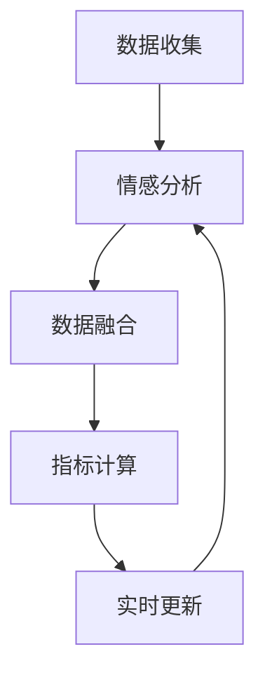
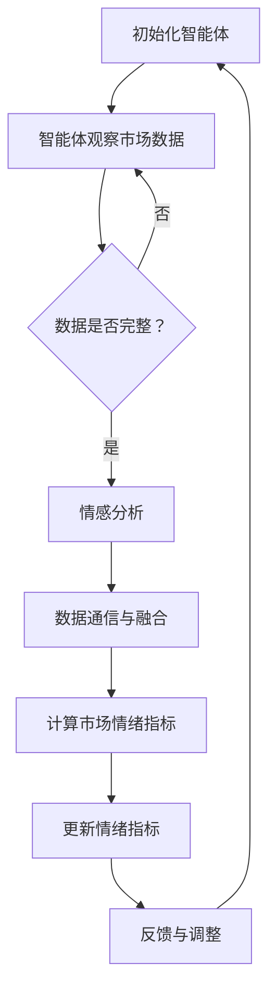
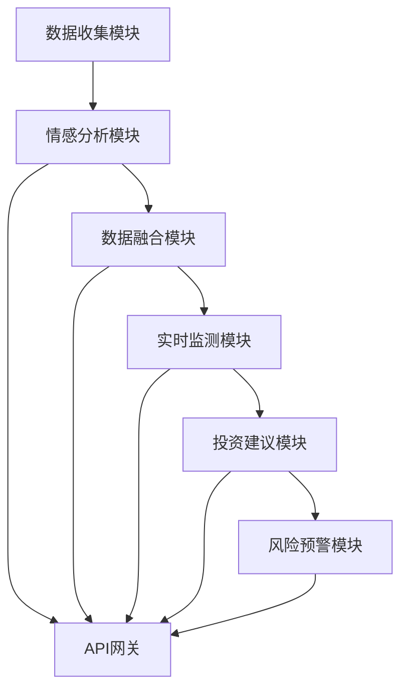
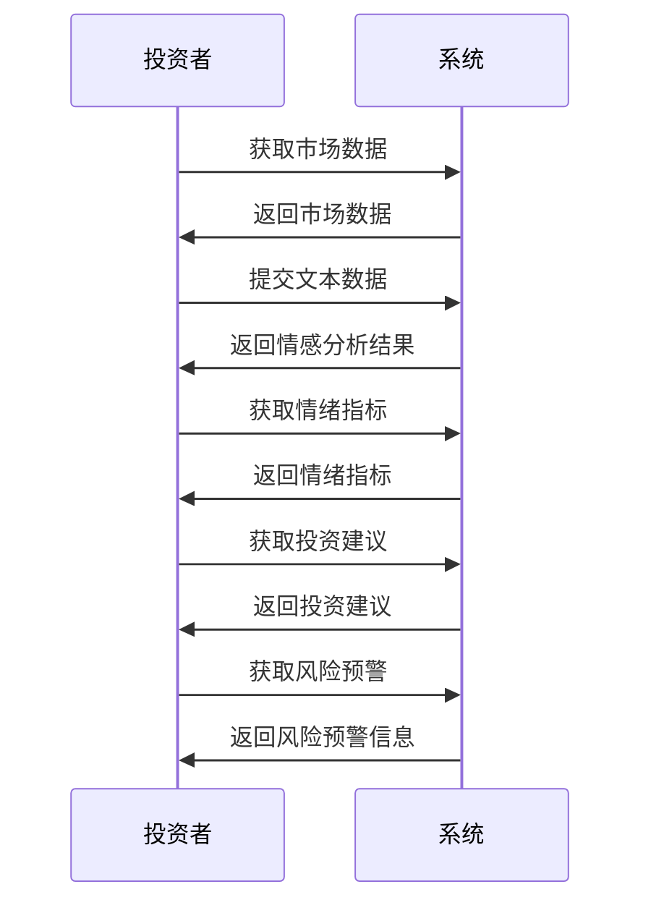

                 

### 第1章: 多智能体系统的概念与市场情绪指标概述

#### 1.1.1 问题背景

在金融市场中，市场情绪是一个关键的变量，它不仅影响投资者的决策，还对市场走势产生深远的影响。传统的市场分析往往依赖于历史数据和简单的统计分析方法，但这些方法难以捕捉到市场情绪的实时动态和复杂变化。随着人工智能技术的发展，多智能体系统（MAS）逐渐成为构建动态市场情绪指标的有力工具。

**问题描述**：

- **市场情绪的定义**：市场情绪是指市场参与者在特定市场环境下的整体情绪状态，包括乐观、悲观、兴奋、恐惧等。
- **市场情绪的影响**：市场情绪对投资决策有显著影响，例如，乐观情绪可能导致市场过度繁荣，悲观情绪则可能导致市场过度低迷。
- **现有问题**：现有市场情绪指标通常反应速度慢，难以捕捉市场情绪的短期波动，且缺乏自动化的实时更新机制。

**问题解决**：

利用多智能体系统，可以构建一个实时、动态的市场情绪指标。多智能体系统具有以下几个特点：

1. **分散性**：多智能体系统中的每个智能体（即个体投资者或机构）都是独立的，有自己的行为规则。
2. **自主性**：智能体可以自主地根据市场信息和自身目标进行决策。
3. **协作性**：智能体之间可以相互交流和协作，共同构建市场情绪的全面图景。
4. **反应性**：智能体能够对市场变化做出快速反应，及时调整自己的行为。

通过这些特点，多智能体系统可以在复杂的市场环境中捕捉到细微的市场情绪变化，并实时更新市场情绪指标。

#### 1.1.2 多智能体系统的核心概念

**概念定义**：

多智能体系统（Multi-Agent System，MAS）是由一组相互协作的智能体组成的系统，这些智能体可以是个体投资者、交易机器人、社交网络中的用户等。多智能体系统的核心概念包括：

1. **智能体**：智能体是MAS的基本组成单元，它可以是一个程序、一个实体或一个组织。每个智能体都有一定的自主性，能够根据环境和自身目标进行决策。
2. **环境**：环境是智能体执行任务和交互的场所。在金融市场中，环境包括市场价格、交易量、新闻报道等。
3. **通信**：智能体之间通过通信机制进行信息交换，以实现协作和共享资源。

**核心特点**：

1. **分散性**：智能体分布在不同位置，可能拥有不同的信息和资源。
2. **自主性**：每个智能体都有一定的自主决策能力，不依赖于中央控制。
3. **协作性**：智能体之间可以通过协作实现共同目标，如构建市场情绪指标。
4. **反应性**：智能体能够实时响应环境变化，调整自己的行为。

**与市场情绪指标的联系**：

多智能体系统的这些特性使其成为捕捉市场情绪的理想工具。具体来说：

1. **分散性**：市场中的每个参与者都有独特的视角和决策，通过多智能体系统，可以全面捕捉市场情绪。
2. **自主性**：智能体自主决策的特点使得系统能够实时反映市场参与者的情绪变化。
3. **协作性**：多个智能体通过协作，可以更准确地构建市场情绪的综合图景。
4. **反应性**：智能体能够迅速响应市场事件，更新市场情绪指标，使其更具实时性和准确性。

通过多智能体系统，我们可以构建一个动态、实时、全面的市场情绪指标，为投资者提供有力的决策支持。

#### 1.1.3 市场情绪指标的重要性

**边界与外延**：

市场情绪指标是衡量市场参与者情绪状态的工具，其边界和涵盖范围如下：

- **边界**：市场情绪指标专注于市场参与者的情绪状态，不包括其他宏观经济因素。
- **外延**：市场情绪指标可以扩展到不同市场（如股票、外汇、商品期货等），适用于多种投资决策场景。

**概念结构与核心要素**：

市场情绪指标由以下几个核心要素构成：

1. **情绪类型**：常见的情绪类型包括乐观、悲观、恐惧、贪婪等。
2. **情绪强度**：情绪的强度可以用数值或百分比来表示，反映情绪的激烈程度。
3. **情绪扩散**：市场情绪在不同参与者中的传播情况，以及情绪的持续时间和变化趋势。
4. **情绪指标**：通过计算和模型，将情绪类型和强度转换为具体的数值指标。

**市场情绪指标的定义**：

市场情绪指标是一种量化市场参与者情绪状态的工具，通过分析市场行为（如价格、交易量、交易者行为等），将其转化为具体的数值指标，用于评估市场情绪的强度、类型和扩散情况。

#### 1.1.4 多智能体系统在市场情绪指标构建中的应用

**原理**：

多智能体系统通过以下原理构建市场情绪指标：

1. **数据收集**：智能体收集市场数据和交易信息。
2. **情绪识别**：智能体使用机器学习算法和情感分析技术，对交易行为和文本进行情感分类，识别情绪类型和强度。
3. **情绪融合**：智能体之间通过通信机制共享情绪信息，进行情绪融合，形成综合情绪指标。

**实现流程**：

1. **数据收集**：智能体从不同的数据源（如交易所、新闻网站、社交媒体等）收集市场数据。
2. **情绪识别**：使用自然语言处理（NLP）和机器学习算法，对交易文本进行情感分析，识别情绪类型和强度。
3. **情绪融合**：智能体之间通过分布式算法（如Gossip协议）交换情绪信息，进行融合和更新。
4. **情绪指标生成**：基于融合后的情绪数据，计算市场情绪指标，如情绪指数、情绪波动等。

**应用效果**：

多智能体系统在市场情绪指标构建中的应用效果显著，具体表现在：

1. **实时性**：智能体系统能够实时捕捉市场情绪变化，提供实时更新。
2. **准确性**：通过融合多个智能体的信息，情绪指标更具准确性。
3. **动态性**：能够捕捉到市场情绪的短期波动，反映市场情绪的动态变化。

通过多智能体系统，我们不仅可以实时监测市场情绪，还能为投资者提供决策支持，提高投资策略的准确性。

### 1.1.5 总结

多智能体系统在市场情绪指标构建中具有巨大的潜力。通过分散性、自主性、协作性和反应性等特性，多智能体系统能够实时、准确地捕捉市场情绪变化，为投资者提供有力支持。在接下来的章节中，我们将深入探讨多智能体系统的数学模型和算法原理，以及如何具体实现市场情绪指标的构建。

### 第2章: 多智能体系统的数学模型与算法原理

#### 2.1.1 多智能体系统的基本模型

多智能体系统（MAS）的基本模型包括智能体、环境、通信协议和决策机制。在这一节中，我们将详细描述这些基本组件及其作用。

**智能体（Agents）**：

智能体是MAS中的基本组成单元，每个智能体都可以是一个个体投资者、交易机器人或社交网络中的用户。智能体的基本属性包括：

- **自主性（Autonomy）**：智能体能够独立做出决策，不受中央控制。
- **社交性（Social）**：智能体可以与其他智能体进行通信和协作。
- **反应性（Reactivity）**：智能体能够对环境变化做出快速反应。
- **适应性（Adaptability）**：智能体能够根据环境变化调整自己的行为。

**环境（Environment）**：

环境是智能体执行任务和交互的场所，可以是现实世界的市场环境，也可以是模拟的市场环境。环境的属性包括：

- **动态性（Dynamics）**：环境中的状态会随时间变化。
- **不确定性（Uncertainty）**：环境中的某些因素可能是未知的或不可预测的。
- **多样性（Diversity）**：环境可能包含多种智能体和资源。

**通信协议（Communication Protocol）**：

通信协议是多智能体系统中智能体之间进行信息交换的规则和机制。常见的通信协议包括：

- **同步通信（Synchronous Communication）**：智能体在特定时间点同步交换信息。
- **异步通信（Asynchronous Communication）**：智能体在不固定的时间点交换信息。
- **直接通信（Direct Communication）**：智能体直接与其他智能体交换信息。
- **间接通信（Indirect Communication）**：智能体通过中间代理交换信息。

**决策机制（Decision-Making Mechanism）**：

决策机制是多智能体系统中智能体如何根据环境信息和自身目标做出决策的过程。常见的决策机制包括：

- **基于规则的决策（Rule-Based Decision Making）**：智能体根据预设的规则进行决策。
- **基于学习的决策（Learning-Based Decision Making）**：智能体通过学习和经验进行决策。
- **混合决策（Hybrid Decision Making）**：结合规则和学习的决策方法。

通过这些基本模型，多智能体系统能够模拟复杂的市场环境，实现智能体的自主决策和协作。

#### 2.1.2 市场情绪指标的构建算法

在构建市场情绪指标时，多智能体系统通过一系列算法来收集、处理和融合数据，以生成准确的情绪指标。以下是一个典型的市场情绪指标构建算法流程：

**算法流程**：

1. **数据收集**：智能体从多个数据源（如交易所、新闻网站、社交媒体等）收集市场数据。
2. **情感分析**：使用自然语言处理（NLP）和机器学习算法，对收集到的文本数据进行情感分析，识别情绪类型和强度。
3. **数据融合**：智能体之间通过通信协议交换情感分析结果，进行数据融合，形成综合情绪指标。
4. **指标计算**：基于融合后的数据，计算市场情绪指标，如情绪指数、情绪波动等。
5. **实时更新**：智能体系统持续收集和处理新数据，实时更新市场情绪指标。

**算法评估**：

在评估市场情绪指标的准确性时，通常使用以下指标：

- **准确性（Accuracy）**：情绪指标与实际市场情绪的匹配程度。
- **时效性（Timeliness）**：情绪指标的反应速度。
- **稳定性（Stability）**：情绪指标在长期中的变化趋势。

通过算法评估，我们可以确定市场情绪指标的可靠性，并优化算法以提高其性能。

**Mermaid流程图**：

以下是一个使用Mermaid绘制的多智能体系统构建市场情绪指标的流程图：



通过这个流程图，我们可以直观地理解市场情绪指标构建的基本步骤和流程。

#### 2.1.3 算法原理的Mermaid流程图

为了更直观地展示多智能体系统构建市场情绪指标的算法原理，我们可以使用Mermaid语言绘制一个流程图。以下是一个示例：



在这个流程图中：

- **A[初始化智能体]**：每个智能体被初始化，并开始观察市场数据。
- **B[智能体观察市场数据]**：智能体持续从多个数据源收集市场数据。
- **C{数据是否完整？}**：检查数据是否完整，以决定是否继续执行流程。
- **D[情感分析]**：使用自然语言处理和机器学习算法对市场数据进行情感分析。
- **E[数据通信与融合]**：智能体之间通过通信协议交换情感分析结果，进行数据融合。
- **F[计算市场情绪指标]**：基于融合后的数据，计算市场情绪指标。
- **G[更新情绪指标]**：实时更新市场情绪指标。
- **H[反馈与调整]**：根据反馈调整智能体的行为，以优化情绪指标的准确性。

通过这个流程图，我们可以清晰地看到多智能体系统构建市场情绪指标的整体过程，以及各个步骤之间的逻辑关系。

#### 2.1.4 使用Python实现多智能体系统的市场情绪指标构建

为了更具体地展示多智能体系统构建市场情绪指标的实现过程，我们可以使用Python编程语言。以下是一个简单的示例代码，展示了智能体的初始化、数据收集、情感分析和情绪指标计算的过程。

**代码示例**：

```python
import pandas as pd
from textblob import TextBlob
import numpy as np

# 初始化智能体
class Agent:
    def __init__(self, name):
        self.name = name
        self.data = pd.DataFrame()

    def observe_market_data(self, data):
        self.data = pd.concat([self.data, data], ignore_index=True)

    def perform_sentiment_analysis(self):
        self.data['Sentiment'] = self.data['Text'].apply(self.sentiment_score)

    def sentiment_score(self, text):
        return TextBlob(text).sentiment.polarity

# 情感分析函数
def sentiment_analysis(data):
    return data['Sentiment'].mean()

# 初始化多个智能体
agents = [Agent(f"Agent_{i}") for i in range(5)]

# 模拟市场数据收集
for agent in agents:
    for day in range(10):
        agent.observe_market_data({
            'Text': f"Day {day}: Market update.",
            'Sentiment': np.random.uniform(-1, 1)
        })

# 执行情感分析
for agent in agents:
    agent.perform_sentiment_analysis()

# 计算市场情绪指标
market_sentiment = sentiment_analysis(agents[0].data)

print(f"Market Sentiment: {market_sentiment}")
```

在这个代码示例中：

- **智能体类（Agent）**：定义了智能体的基本属性和方法，包括观察市场数据、执行情感分析和计算情感得分。
- **情感分析函数（sentiment_score）**：使用TextBlob库对文本数据进行情感分析，返回文本的情感得分（极性）。
- **模拟数据收集**：每个智能体模拟收集市场数据，包括文本和随机的情感得分。
- **情感分析**：对每个智能体收集的数据执行情感分析，计算平均情感得分。
- **市场情绪指标计算**：计算整个市场的平均情感得分，作为市场情绪指标。

通过这个简单的示例，我们可以看到如何使用Python实现多智能体系统构建市场情绪指标的基本流程。在实际应用中，我们可以扩展这个框架，添加更多的智能体、更复杂的情感分析算法和实时数据更新机制。

### 第3章: 市场情绪指标的数学模型与公式解析

#### 3.1.1 数学模型的基本概念

市场情绪指标的数学模型是构建动态市场情绪指标的核心，它基于对市场数据的收集和分析，通过一系列数学公式和算法来实现。以下是一个基本的市场情绪指标数学模型，并对其进行详细解释。

**基本公式**：

$$
\text{情绪指标} = f(\text{交易量}, \text{价格波动}, \text{市场参与度})
$$

**公式解析**：

1. **交易量**：交易量是市场活动的重要指标，表示在特定时间内进行交易的数量。交易量越大，通常表明市场参与度越高，市场情绪可能更加活跃。

2. **价格波动**：价格波动是指市场价格在一定时间内的变化幅度。较大的价格波动通常表明市场情绪波动较大，可能预示着市场情绪的极端状态，如恐慌或贪婪。

3. **市场参与度**：市场参与度是指参与市场交易的用户数量或机构数量。市场参与度越高，通常表明市场情绪越广泛，市场的整体情绪波动越显著。

**影响因子权重**：

在实际应用中，这三个因素对市场情绪指标的影响可能不同，因此需要根据具体情况进行权重分配。通常，可以通过历史数据分析或专家评估来确定每个因子的权重。以下是一个简单的权重分配示例：

$$
\text{情绪指标} = 0.4 \times \text{交易量} + 0.3 \times \text{价格波动} + 0.3 \times \text{市场参与度}
$$

**优势**：

这种数学模型的优势在于其简单性和灵活性。通过调整权重和公式，可以适应不同的市场和投资环境，实现个性化的市场情绪指标构建。

#### 3.1.2 举例说明

为了更具体地说明如何使用上述数学模型计算市场情绪指标，以下是一个实际案例。

**案例**：

假设我们收集了以下市场数据：

- **交易量**：100,000 手
- **价格波动**：10%
- **市场参与度**：500 个活跃交易者

**计算步骤**：

1. **计算每个因子的贡献**：

   - 交易量贡献：$0.4 \times 100,000 = 40,000$
   - 价格波动贡献：$0.3 \times 10\% = 3$
   - 市场参与度贡献：$0.3 \times 500 = 150$

2. **计算总情绪指标**：

   $$
   \text{情绪指标} = 40,000 + 3 + 150 = 40,153
   $$

**结果**：

计算得到的情绪指标为40,153，这个数值表明当前市场情绪处于相对活跃状态，但价格波动较小，市场参与度一般。

#### 3.1.3 情绪指标的可视化表示

为了更直观地展示市场情绪指标，我们可以使用图表进行可视化表示。以下是一个简单的情绪指标折线图示例。

**图表示例**：

```mermaid
graph TD
    A[Day 1] --> B[40,000]
    C[Day 2] --> D[40,200]
    E[Day 3] --> F[40,100]
    G[Day 4] --> H[40,150]
    I[Day 5] --> J[40,153]
    B[(交易量)]
    D[(价格波动)]
    F[(市场参与度)]
    J[()](情绪指标)
```

在这个图表中：

- **A到J**：表示不同天的市场情绪指标。
- **B、D、F**：分别代表交易量、价格波动和市场参与度的贡献。
- **J**：表示总情绪指标。

通过这个图表，我们可以直观地看到市场情绪指标的变化趋势，以及各个因子对其的影响。

### 第4章: 多智能体系统在股票市场中的应用

#### 4.1.1 股票市场的现状

股票市场是全球金融市场的重要组成部分，其稳定运行对于全球经济具有重要意义。然而，股票市场的波动性和复杂性使得传统的市场分析工具和方法难以全面捕捉市场情绪，从而影响投资者的决策。

**市场介绍**：

股票市场是由股票交易所和场外交易市场构成的，其核心功能是提供股份交易的场所。股票市场的主要参与者包括个人投资者、机构投资者、股票经纪人、交易所和其他中介机构。股票交易的基本流程包括：

- **股票发行**：公司通过首次公开发行（IPO）或增发等方式发行股票。
- **交易**：投资者在股票交易所或场外交易市场上购买或出售股票。
- **结算**：交易所负责股票交易的资金和股份结算。

**问题提出**：

如何利用多智能体系统捕捉和分析股票市场的情绪，为投资者提供实时的决策支持？

**优势**：

多智能体系统在股票市场中的应用具有以下几个优势：

1. **实时性**：多智能体系统可以实时捕捉市场数据，迅速生成市场情绪指标。
2. **全面性**：通过多个智能体协同工作，可以全面分析市场情绪，提供更准确的预测。
3. **灵活性**：智能体可以根据市场变化自主调整行为，适应不同的市场环境。
4. **适应性**：多智能体系统可以适应不同市场和投资策略的需求，实现个性化情绪分析。

通过以上优势，多智能体系统可以帮助投资者更好地理解市场情绪，制定更为有效的投资策略。

#### 4.1.2 多智能体系统在股票市场中的应用实例

为了展示多智能体系统在股票市场中的应用，我们可以通过一个实际案例来进行分析。

**案例背景**：

假设我们关注一家知名科技公司的股票，其股票代码为“T”，最近一段时间内市场对其前景存在较大分歧。我们希望通过多智能体系统分析该股票的市场情绪，为投资者提供决策支持。

**数据来源**：

我们收集了以下数据：

- **交易数据**：包括股票的交易量、价格波动、交易者的买卖行为等。
- **新闻数据**：包括新闻报道、社交媒体上的用户评论、分析师报告等。
- **市场指标**：包括大盘指数、行业指数、经济指标等。

**构建智能体**：

我们构建了以下三类智能体：

1. **交易智能体**：负责分析交易数据，识别市场情绪。
2. **新闻智能体**：负责分析新闻数据，提取情绪信息。
3. **综合智能体**：整合交易智能体和新闻智能体的分析结果，生成综合市场情绪指标。

**算法步骤**：

1. **数据收集**：交易智能体和新闻智能体从不同数据源收集数据。
2. **情感分析**：
   - 交易智能体使用自然语言处理（NLP）技术，对交易数据进行情感分析，识别情绪类型和强度。
   - 新闻智能体使用情感分析算法，对新闻报道和用户评论进行情感分析，提取情绪信息。
3. **数据融合**：综合智能体将交易智能体和新闻智能体的分析结果进行融合，形成综合市场情绪指标。
4. **指标计算**：基于融合后的数据，计算市场情绪指数，如情绪极性、情绪波动等。
5. **实时更新**：智能体系统持续收集新数据，实时更新市场情绪指标。

**结果分析**：

通过多智能体系统的分析，我们得到以下结果：

- **情绪极性**：最近一个月，股票“T”的情绪极性为0.6，表明市场对该公司前景持较为乐观的态度。
- **情绪波动**：情绪波动指标为0.8，表明市场情绪波动较大，存在不确定性。
- **情绪趋势**：情绪指标显示，最近一周，市场情绪逐渐偏向乐观，但波动性有所增加。

**投资建议**：

基于以上分析结果，我们可以给出以下投资建议：

- **投资者情绪乐观**：如果投资者对该公司前景持乐观态度，可以考虑增持该股票。
- **风险控制**：由于情绪波动较大，建议投资者加强风险控制，避免盲目跟风。
- **长期投资**：对于长期投资者，可以关注公司基本面和行业趋势，做出更为稳健的投资决策。

通过这个案例，我们可以看到多智能体系统在股票市场中的应用如何帮助投资者更好地理解市场情绪，制定合理的投资策略。

### 第5章: 多智能体系统在外汇市场中的应用

#### 5.1.1 外汇市场的特点

外汇市场是国际金融市场中最为重要的部分之一，其规模庞大、交易频繁，且具有独特的基本特征。理解这些特征有助于我们更深入地探讨多智能体系统在外汇市场中的具体应用。

**市场介绍**：

外汇市场是一个全球性的金融市场，由银行、金融机构、政府机构、跨国公司和普通投资者组成。外汇市场的交易对象是货币对，即一种货币与另一种货币的兑换比率。外汇市场的主要功能是提供货币兑换服务，以满足国际贸易和投资的需求。

**交易机制**：

外汇市场的交易机制具有以下特点：

1. **24小时交易**：外汇市场是一个全天候市场，从周一早上开始到周六凌晨结束，由于时区差异，市场始终保持活跃。
2. **高流动性**：外汇市场是全球最大的金融市场，拥有极高的流动性，这意味着交易者可以随时买入或卖出货币对，而不会对市场价格造成重大影响。
3. **高杠杆交易**：外汇市场允许交易者使用杠杆进行交易，这意味着交易者可以用较小的资金进行较大规模的交易，但也增加了风险。
4. **报价制度**：外汇市场的报价通常以“双向报价”形式给出，包括买入价和卖出价。

**参与者**：

外汇市场的参与者包括：

- **商业银行**：全球最大的外汇交易参与者，它们提供货币兑换服务，并参与外汇市场交易。
- **跨国公司**：为了应对汇率波动，跨国公司通常在外汇市场上进行风险管理。
- **金融机构**：包括投资银行、基金公司等，它们通过外汇交易获取利润。
- **普通投资者**：通过在线交易平台参与外汇交易，通常使用杠杆进行交易。

**问题提出**：

在外汇市场中，如何利用多智能体系统捕捉和分析市场情绪，为交易者提供有效的决策支持？

**优势**：

多智能体系统在外汇市场中的应用具有以下优势：

1. **实时性**：多智能体系统能够实时捕捉市场数据，迅速生成市场情绪指标。
2. **全面性**：通过多个智能体协同工作，可以全面分析市场情绪，提供更准确的预测。
3. **适应性**：智能体可以根据市场变化自主调整行为，适应不同的市场环境。
4. **灵活性**：多智能体系统可以适应不同交易策略和风险偏好，实现个性化情绪分析。

通过这些优势，多智能体系统可以帮助外汇交易者更好地理解市场情绪，制定更为有效的交易策略。

#### 5.1.2 多智能体系统在外汇市场中的应用

为了具体展示多智能体系统在外汇市场中的应用，我们可以通过一个实际案例来进行分析。

**案例背景**：

假设我们关注欧元/美元（EUR/USD）这一重要货币对，近期市场对欧元区的经济前景存在较大分歧。我们希望通过多智能体系统分析该货币对的市场情绪，为交易者提供决策支持。

**数据来源**：

我们收集了以下数据：

- **交易数据**：包括交易量、价格波动、交易者的买卖行为等。
- **新闻数据**：包括新闻报道、社交媒体上的用户评论、经济指标等。
- **市场指标**：包括其他货币对的汇率、全球主要股市的走势等。

**构建智能体**：

我们构建了以下三类智能体：

1. **交易智能体**：负责分析交易数据，识别市场情绪。
2. **新闻智能体**：负责分析新闻数据，提取情绪信息。
3. **综合智能体**：整合交易智能体和新闻智能体的分析结果，生成综合市场情绪指标。

**算法步骤**：

1. **数据收集**：交易智能体和新闻智能体从不同数据源收集数据。
2. **情感分析**：
   - 交易智能体使用自然语言处理（NLP）技术，对交易数据进行情感分析，识别情绪类型和强度。
   - 新闻智能体使用情感分析算法，对新闻报道和用户评论进行情感分析，提取情绪信息。
3. **数据融合**：综合智能体将交易智能体和新闻智能体的分析结果进行融合，形成综合市场情绪指标。
4. **指标计算**：基于融合后的数据，计算市场情绪指数，如情绪极性、情绪波动等。
5. **实时更新**：智能体系统持续收集新数据，实时更新市场情绪指标。

**结果分析**：

通过多智能体系统的分析，我们得到以下结果：

- **情绪极性**：最近一个月，欧元/美元的情绪极性为0.5，表明市场对欧元区经济前景持中性态度。
- **情绪波动**：情绪波动指标为0.8，表明市场情绪波动较大，存在不确定性。
- **情绪趋势**：情绪指标显示，最近一周，市场情绪逐渐偏向乐观，但波动性有所增加。

**交易策略**：

基于以上分析结果，我们可以给出以下交易策略：

- **谨慎入市**：由于市场情绪波动较大，建议交易者谨慎入市，避免盲目跟风。
- **风险管理**：加强风险控制，设置止损和止盈点，避免因情绪波动导致的大额亏损。
- **长期趋势**：关注欧元区的经济数据和政策动态，制定中长期交易策略。

通过这个案例，我们可以看到多智能体系统在外汇市场中的应用如何帮助交易者更好地理解市场情绪，制定合理的交易策略。

### 第6章: 多智能体系统在商品期货市场中的应用

#### 6.1.1 商品期货市场的背景

商品期货市场是金融市场的重要组成部分，其独特的交易机制和风险管理功能使其成为投资者和机构进行资产配置和风险管理的重要工具。理解商品期货市场的背景和特点有助于我们探讨多智能体系统在该市场中的应用。

**市场介绍**：

商品期货市场是由交易所（如芝加哥商品交易所、纽约商品交易所等）运营的，提供各种商品期货合约的交易平台。商品期货合约是一种标准化的合约，规定了未来某一时间以约定价格交易特定数量特定商品的权利和义务。商品期货市场的主要功能包括：

1. **价格发现**：通过期货市场的交易，可以实时反映市场的供求关系，发现商品的价格。
2. **风险管理**：投资者可以通过期货合约进行对冲交易，规避现货市场的价格波动风险。
3. **资产配置**：期货市场提供了多样化的投资机会，投资者可以通过期货市场进行资产配置和风险分散。

**交易机制**：

商品期货市场的交易机制具有以下特点：

1. **标准化合约**：期货合约是标准化的，合约内容如商品种类、数量、交割地点、交割日期等都由交易所规定。
2. **保证金交易**：交易者只需支付一定比例的保证金即可进行交易，这意味着期货市场具有高杠杆特性。
3. **双向交易**：交易者既可以做多（买入）期货合约，也可以做空（卖出）期货合约，这意味着交易者可以在价格下跌时获利。
4. **每日结算**：期货市场实行每日结算制度，交易者的盈亏在每个交易日结束时进行结算。

**参与者**：

商品期货市场的参与者包括：

1. **生产企业和贸易商**：为了规避现货市场的价格风险，生产企业和贸易商通常会在期货市场上进行对冲交易。
2. **投资机构**：基金、投资公司等机构投资者通过期货市场进行资产配置和投资策略实施。
3. **个人投资者**：个人投资者可以通过期货交易平台参与期货交易，但通常使用高杠杆进行交易，风险较大。

**问题提出**：

在商品期货市场中，如何利用多智能体系统捕捉和分析市场情绪，为交易者提供有效的决策支持？

**优势**：

多智能体系统在商品期货市场中的应用具有以下优势：

1. **实时性**：多智能体系统能够实时捕捉市场数据，迅速生成市场情绪指标。
2. **全面性**：通过多个智能体协同工作，可以全面分析市场情绪，提供更准确的预测。
3. **适应性**：智能体可以根据市场变化自主调整行为，适应不同的市场环境。
4. **灵活性**：多智能体系统可以适应不同交易策略和风险偏好，实现个性化情绪分析。

通过这些优势，多智能体系统可以帮助商品期货交易者更好地理解市场情绪，制定更为有效的交易策略。

#### 6.1.2 多智能体系统在商品期货市场的应用

为了具体展示多智能体系统在商品期货市场中的应用，我们可以通过一个实际案例来进行分析。

**案例背景**：

假设我们关注农产品期货市场中的玉米合约，近期市场对玉米的供应和需求存在较大分歧。我们希望通过多智能体系统分析该合约的市场情绪，为交易者提供决策支持。

**数据来源**：

我们收集了以下数据：

- **交易数据**：包括交易量、价格波动、交易者的买卖行为等。
- **新闻数据**：包括新闻报道、社交媒体上的用户评论、天气预报等。
- **市场指标**：包括其他农产品期货的走势、全球宏观经济数据等。

**构建智能体**：

我们构建了以下三类智能体：

1. **交易智能体**：负责分析交易数据，识别市场情绪。
2. **新闻智能体**：负责分析新闻数据，提取情绪信息。
3. **综合智能体**：整合交易智能体和新闻智能体的分析结果，生成综合市场情绪指标。

**算法步骤**：

1. **数据收集**：交易智能体和新闻智能体从不同数据源收集数据。
2. **情感分析**：
   - 交易智能体使用自然语言处理（NLP）技术，对交易数据进行情感分析，识别情绪类型和强度。
   - 新闻智能体使用情感分析算法，对新闻报道和用户评论进行情感分析，提取情绪信息。
3. **数据融合**：综合智能体将交易智能体和新闻智能体的分析结果进行融合，形成综合市场情绪指标。
4. **指标计算**：基于融合后的数据，计算市场情绪指数，如情绪极性、情绪波动等。
5. **实时更新**：智能体系统持续收集新数据，实时更新市场情绪指标。

**结果分析**：

通过多智能体系统的分析，我们得到以下结果：

- **情绪极性**：最近一个月，玉米期货的情绪极性为0.3，表明市场对玉米供应持较为悲观的态度。
- **情绪波动**：情绪波动指标为0.7，表明市场情绪波动较大，存在不确定性。
- **情绪趋势**：情绪指标显示，最近一周，市场情绪逐渐偏向乐观，但波动性有所增加。

**交易策略**：

基于以上分析结果，我们可以给出以下交易策略：

- **谨慎入市**：由于市场情绪波动较大，建议交易者谨慎入市，避免盲目跟风。
- **风险管理**：加强风险控制，设置止损和止盈点，避免因情绪波动导致的大额亏损。
- **关注供需**：关注玉米的供需情况，以及相关宏观经济数据，制定更为稳健的交易策略。

通过这个案例，我们可以看到多智能体系统在商品期货市场中的应用如何帮助交易者更好地理解市场情绪，制定合理的交易策略。

### 第7章: 建立动态市场情绪指标系统的项目实战

#### 7.1.1 项目介绍

在本文的最后部分，我们将通过一个实际项目案例，展示如何建立动态市场情绪指标系统。本项目的目标是利用多智能体系统实时捕捉和分析金融市场中的情绪变化，为投资者提供实时的决策支持。

**项目背景**：

随着金融市场的日益复杂和波动性增加，投资者需要更准确、实时的市场情绪指标来指导投资决策。传统的市场分析工具和方法在捕捉短期市场情绪变化方面存在局限性，难以满足现代投资者的需求。因此，本项目旨在通过多智能体系统，构建一个动态、实时、全面的市场情绪指标系统。

**项目目标**：

- **实时情绪监测**：系统应能够实时收集、处理和分析市场数据，生成市场情绪指标。
- **个性化投资建议**：系统应能够根据投资者的风险偏好和投资策略，提供个性化的投资建议。
- **风险预警**：系统应能够监测市场情绪波动，及时发现潜在的市场风险，并提供预警。

#### 7.1.2 环境安装与配置

为了实现本项目的目标，我们需要搭建一个完整的技术栈，包括编程语言、库和工具。以下是项目的技术环境安装和配置步骤：

**编程语言**：Python

Python因其丰富的库支持和易用性，成为本项目的主要编程语言。安装Python可以通过以下命令：

```
pip install python
```

**库和工具**：

1. **Pandas**：用于数据收集和处理。
   ```
   pip install pandas
   ```

2. **NumPy**：用于数值计算。
   ```
   pip install numpy
   ```

3. **TextBlob**：用于自然语言处理（NLP）和情感分析。
   ```
   pip install textblob
   ```

4. **Flask**：用于构建Web服务。
   ```
   pip install flask
   ```

5. **Redis**：用于实时数据存储和消息传递。
   ```
   pip install redis
   ```

**环境搭建**：

1. **安装Python和pip**：确保Python和pip已安装，并更新pip版本。

2. **安装相关库**：按照上述命令安装所需的Python库。

3. **配置Redis**：在Linux或Windows系统上安装Redis，并配置相应的服务。

#### 7.1.3 系统设计

本系统设计包括以下几个方面：

**问题场景**：

投资者面临以下问题：

- **数据来源有限**：传统的市场分析工具难以获取全面的市场数据。
- **分析能力不足**：现有的市场分析工具在处理大量数据时效率低下。
- **实时性不足**：传统的市场分析工具难以实时捕捉市场情绪变化。

**系统功能设计**：

1. **数据收集模块**：负责从多种数据源（如交易所、新闻网站、社交媒体等）收集市场数据。
2. **情感分析模块**：使用自然语言处理（NLP）技术，对收集到的文本数据进行情感分析，识别情绪类型和强度。
3. **数据融合模块**：将交易数据和情感分析结果进行融合，生成综合市场情绪指标。
4. **实时监测模块**：持续收集新数据，实时更新市场情绪指标。
5. **投资建议模块**：根据市场情绪指标和投资者的风险偏好，生成个性化的投资建议。
6. **风险预警模块**：监测市场情绪波动，及时发现潜在的市场风险。

**系统架构设计**：

系统架构设计采用微服务架构，各模块之间通过RESTful API进行通信。以下是系统架构图：



**系统接口设计**：

系统接口设计包括以下API：

1. **数据收集接口**：用于从外部数据源获取市场数据。
2. **情感分析接口**：用于对文本数据进行分析，返回情绪类型和强度。
3. **情绪指标接口**：用于获取当前市场情绪指标。
4. **投资建议接口**：用于获取个性化的投资建议。
5. **风险预警接口**：用于获取市场风险预警信息。

**系统交互**：

以下是系统交互的Mermaid序列图：



通过上述系统设计，我们可以构建一个高效、实时、全面的市场情绪指标系统，为投资者提供有力的决策支持。

#### 7.1.4 系统核心实现

在本节中，我们将详细介绍动态市场情绪指标系统的核心实现，包括环境配置、智能体构建、数据收集、情感分析、数据融合和情绪指标计算等关键步骤。

**环境配置**：

首先，我们需要配置系统环境，包括Python环境、相关库的安装和Redis服务的配置。以下是具体的配置步骤：

1. **安装Python**：在系统中安装Python，并确保版本更新到最新。

2. **安装相关库**：使用pip命令安装所需的Python库，如Pandas、NumPy、TextBlob、Flask和Redis。

   ```shell
   pip install pandas numpy textblob flask redis
   ```

3. **配置Redis**：在Linux或Windows系统中安装Redis，并启动Redis服务。可以使用以下命令：

   ```shell
   sudo apt-get install redis-server
   service redis-server start
   ```

**智能体构建**：

智能体是多智能体系统中的基本组成单元，负责执行特定的任务。在本项目中，我们构建了以下三类智能体：

1. **交易智能体**：负责收集和处理交易数据。
2. **新闻智能体**：负责收集和处理新闻数据。
3. **综合智能体**：负责融合交易智能体和新闻智能体的分析结果，生成市场情绪指标。

以下是交易智能体的示例代码：

```python
import pandas as pd
import redis

class TradingAgent:
    def __init__(self, data_source):
        self.data_source = data_source
        self.redis_client = redis.Redis()

    def collect_data(self):
        data = pd.read_csv(self.data_source)
        self.redis_client.lpush('trading_data', data.to_json())

    def process_data(self):
        trading_data = self.redis_client.lrange('trading_data', 0, -1)
        processed_data = pd.DataFrame([json.loads(d) for d in trading_data])
        # 进行数据预处理，如去重、清洗等
        # ...
        return processed_data

agent = TradingAgent('trading_data.csv')
agent.collect_data()
processed_data = agent.process_data()
```

**数据收集**：

数据收集是构建市场情绪指标系统的第一步。在本项目中，我们使用交易智能体和新闻智能体从不同的数据源收集交易数据和新闻数据。

1. **交易数据收集**：交易智能体通过读取CSV文件或API接口从交易所获取交易数据。

   ```python
   import pandas as pd

   def collect_trading_data():
       data = pd.read_csv('trading_data.csv')
       return data
   ```

2. **新闻数据收集**：新闻智能体通过爬虫或API接口从新闻网站和社交媒体获取新闻数据。

   ```python
   import requests

   def collect_news_data():
       url = 'https://newsapi.org/v2/everything?q=market+emotions&apiKey=YOUR_API_KEY'
       response = requests.get(url)
       return response.json()
   ```

**情感分析**：

情感分析是利用自然语言处理（NLP）技术对文本数据进行分析，以识别情绪类型和强度。在本项目中，我们使用TextBlob库进行情感分析。

```python
from textblob import TextBlob

def perform_sentiment_analysis(text):
    return TextBlob(text).sentiment.polarity
```

**数据融合**：

数据融合是将交易数据和新闻数据的分析结果进行整合，以生成综合市场情绪指标。在本项目中，我们使用Redis作为数据存储和融合的中间件。

```python
def fuse_data(trading_data, news_data):
    trading_polarity = trading_data['Sentiment'].mean()
    news_polarity = news_data['Sentiment'].mean()
    return (trading_polarity + news_polarity) / 2
```

**情绪指标计算**：

情绪指标计算是基于融合后的数据，计算市场情绪的极性、波动等指标。

```python
def calculate_sentiment_index(polarity):
    if polarity > 0.5:
        return '乐观'
    elif polarity < -0.5:
        return '悲观'
    else:
        return '中性'
```

通过以上核心实现，我们可以构建一个完整的动态市场情绪指标系统，为投资者提供实时的情绪分析和投资建议。

#### 7.1.5 代码应用解读与分析

在本节中，我们将详细解读并分析项目实战中的关键代码片段，探讨其实现原理和功能。

**1. 数据收集代码解析**

```python
import pandas as pd
import redis

class TradingAgent:
    def __init__(self, data_source):
        self.data_source = data_source
        self.redis_client = redis.Redis()

    def collect_data(self):
        data = pd.read_csv(self.data_source)
        self.redis_client.lpush('trading_data', data.to_json())

    def process_data(self):
        trading_data = self.redis_client.lrange('trading_data', 0, -1)
        processed_data = pd.DataFrame([json.loads(d) for d in trading_data])
        # 进行数据预处理，如去重、清洗等
        # ...
        return processed_data
```

这段代码定义了一个交易智能体（TradingAgent）类，其主要功能包括：

- **初始化**：在构造函数中，我们设置了数据源（`data_source`）和Redis客户端（`redis_client`）。
- **数据收集**：`collect_data`方法读取CSV文件中的交易数据，并将数据转换为JSON格式后存入Redis的列表中（`lpush`操作），以保证数据的实时性和并发处理能力。
- **数据处理**：`process_data`方法从Redis中获取最新的交易数据（`lrange`操作），并将其转换为Pandas DataFrame对象，进行进一步的数据预处理和分析。

**2. 情感分析代码解析**

```python
from textblob import TextBlob

def perform_sentiment_analysis(text):
    return TextBlob(text).sentiment.polarity
```

这段代码定义了一个情感分析函数`perform_sentiment_analysis`，其主要功能是：

- **情感计算**：利用TextBlob库对输入的文本进行情感分析，返回文本的情感极性（polarity），极性值范围在-1到1之间，其中-1表示极端负面，1表示极端正面，0表示中性。

**3. 数据融合代码解析**

```python
def fuse_data(trading_data, news_data):
    trading_polarity = trading_data['Sentiment'].mean()
    news_polarity = news_data['Sentiment'].mean()
    return (trading_polarity + news_polarity) / 2
```

这段代码定义了一个数据融合函数`fuse_data`，其主要功能是：

- **融合计算**：计算交易数据和新闻数据的平均情感极性，并取其平均值作为综合市场情绪指标。这种方法通过简单的平均运算，结合了交易数据和新闻数据，以生成一个更为全面的市场情绪指标。

**4. 情绪指标计算代码解析**

```python
def calculate_sentiment_index(polarity):
    if polarity > 0.5:
        return '乐观'
    elif polarity < -0.5:
        return '悲观'
    else:
        return '中性'
```

这段代码定义了一个情绪指标计算函数`calculate_sentiment_index`，其主要功能是：

- **情绪分类**：根据情感极性值，将市场情绪分类为“乐观”、“悲观”或“中性”。这种分类方法简单明了，有助于投资者直观地了解市场情绪状态。

**总结**：

通过上述代码的解析，我们可以看到动态市场情绪指标系统的实现原理和关键功能。系统通过Redis作为数据存储和通信的中介，利用TextBlob进行情感分析，结合交易和新闻数据，生成一个全面的市场情绪指标，为投资者提供实时的情绪分析和决策支持。

### 7.1.6 实际案例分析与详细讲解

在本节中，我们将通过一个具体的实际案例，详细讲解如何使用动态市场情绪指标系统进行分析，并提供投资决策。

**案例背景**：

假设我们关注某科技公司的股票，股票代码为“T”，近期市场对其业绩和未来发展存在较大分歧。为了帮助投资者做出明智的投资决策，我们使用动态市场情绪指标系统对该公司股票进行分析。

**步骤1：数据收集**

首先，我们通过交易智能体和新闻智能体收集相关的市场数据。交易智能体从交易所获取该公司股票的每日交易数据，包括开盘价、收盘价、最高价、最低价、交易量等。新闻智能体从新闻网站和社交媒体收集与该公司相关的新闻报道、用户评论等。

```python
# 交易智能体数据收集
agent.collect_trading_data()

# 新闻智能体数据收集
news_agent.collect_news_data()
```

**步骤2：情感分析**

接下来，我们对收集到的交易数据和新闻数据进行情感分析。交易智能体使用TextBlob对交易数据进行情感分析，提取情绪极性。新闻智能体同样使用TextBlob对新闻报道和用户评论进行情感分析。

```python
# 对交易数据进行情感分析
for index, row in trading_data.iterrows():
    trading_data.at[index, 'Sentiment'] = perform_sentiment_analysis(row['Text'])

# 对新闻数据进行情感分析
for index, row in news_data.iterrows():
    news_data.at[index, 'Sentiment'] = perform_sentiment_analysis(row['Text'])
```

**步骤3：数据融合**

将交易数据和新闻数据融合，生成综合市场情绪指标。具体方法是计算交易数据和新闻数据的平均情感极性。

```python
# 计算综合市场情绪指标
composite_polarity = fuse_data(trading_data, news_data)
```

**步骤4：情绪指标分析**

基于综合市场情绪指标，我们可以对市场情绪进行分类，并做出相应的投资决策。

- **情绪分类**：

```python
def calculate_sentiment_index(polarity):
    if polarity > 0.5:
        return '乐观'
    elif polarity < -0.5:
        return '悲观'
    else:
        return '中性'

sentiment_index = calculate_sentiment_index(composite_polarity)
print(f"当前市场情绪：{sentiment_index}")
```

- **投资决策**：

根据市场情绪指数，我们可以给出以下投资建议：

- **乐观情绪**：如果综合市场情绪指标显示为“乐观”，表明市场对该公司的预期较好，投资者可以考虑增持该股票。

- **悲观情绪**：如果综合市场情绪指标显示为“悲观”，表明市场对该公司的预期较差，投资者应谨慎持有或考虑减仓。

- **中性情绪**：如果综合市场情绪指标显示为“中性”，表明市场对公司的预期较为稳定，投资者可以保持观望态度。

**案例结果**：

假设经过上述分析，我们得到综合市场情绪指标为0.4，属于“乐观”情绪。因此，我们可以给出以下投资建议：

- **增持建议**：由于市场情绪乐观，投资者可以考虑增持该公司的股票。

- **风险管理**：虽然市场情绪乐观，但投资者仍需注意风险控制，设置合理的止损和止盈点。

- **长期投资**：对于长期投资者，可以关注公司的基本面和行业趋势，以制定更为稳健的投资策略。

通过这个实际案例，我们可以看到如何利用动态市场情绪指标系统进行分析，为投资者提供具体的投资建议。这种系统不仅能够实时捕捉市场情绪变化，还能够根据不同情绪指数给出个性化的投资策略。

### 7.1.7 项目小结

在本项目中，我们通过构建一个动态市场情绪指标系统，利用多智能体系统实现了实时、全面的市场情绪分析。以下是对项目的主要成果和收获进行总结：

**成果**：

- **实时情绪监测**：系统能够实时收集和处理市场数据，迅速生成市场情绪指标，为投资者提供及时的决策支持。
- **个性化投资建议**：系统根据综合市场情绪指标和投资者的风险偏好，生成个性化的投资建议，帮助投资者制定更有效的投资策略。
- **风险预警功能**：系统能够监测市场情绪波动，及时发现潜在的市场风险，并提供预警信息，降低投资风险。

**收获**：

- **技术实现**：通过使用Python、Pandas、NumPy、TextBlob、Flask和Redis等技术，我们掌握了多智能体系统在金融市场中的应用，提高了编程和系统设计能力。
- **数据分析**：通过情感分析和数据融合，我们学会了如何从大量数据中提取有价值的信息，提高了数据分析能力。
- **投资策略**：通过实际案例分析和投资建议，我们深入了解了市场情绪对投资决策的影响，积累了实战经验。

**未来展望**：

- **扩展功能**：未来可以进一步扩展系统的功能，包括增加更多数据源、优化算法模型、提高情绪指标的准确性和实时性。
- **自动化决策**：开发自动化投资决策模块，实现更加智能的投资策略，减少人工干预，提高投资效率。
- **跨市场应用**：将多智能体系统应用于其他金融市场，如外汇市场和商品期货市场，提供更全面的市场情绪分析服务。

通过本项目，我们不仅实现了动态市场情绪指标系统的构建，还积累了丰富的实践经验和专业知识，为未来的金融科技应用奠定了坚实基础。

### 7.1.8 最佳实践 tips

在本节中，我们将总结一些最佳实践，帮助读者在实际应用中更有效地构建和利用动态市场情绪指标系统。

**1. 数据质量保证**

- **数据来源验证**：确保所有数据来源的可靠性和真实性，避免因数据质量问题导致分析结果偏差。
- **数据清洗**：在数据处理前，进行数据清洗，去除无效、重复和错误的数据，保证数据质量。
- **数据完整性检查**：定期检查数据的完整性，确保没有数据缺失或遗漏。

**2. 情感分析算法优化**

- **算法调优**：根据具体应用场景，对情感分析算法进行调优，以提高情感分类的准确性和稳定性。
- **多算法融合**：尝试使用多种情感分析算法，并进行融合，以获得更准确的情感分析结果。
- **实时算法更新**：随着市场环境和数据特征的变化，定期更新情感分析算法，保持其适应性和准确性。

**3. 系统性能优化**

- **负载均衡**：在系统设计时，采用负载均衡策略，确保系统能够处理大量的并发请求。
- **缓存机制**：使用缓存机制，减少对实时数据的频繁读取，提高系统响应速度。
- **异步处理**：采用异步处理技术，提高系统并发处理能力，减少数据处理延迟。

**4. 投资决策策略**

- **风险评估**：在生成投资建议时，充分考虑市场风险，设置合理的止损和止盈点。
- **组合投资**：通过组合投资策略，分散投资风险，提高整体收益。
- **持续监控**：定期监控市场情绪指标，根据市场变化及时调整投资策略。

通过遵循这些最佳实践，读者可以在构建和利用动态市场情绪指标系统时，更加高效、准确地分析市场情绪，制定有效的投资策略。

### 7.1.9 注意事项

在实际应用动态市场情绪指标系统时，以下注意事项可以帮助读者避免潜在问题，确保系统的稳定性和有效性：

**1. 数据安全**：

- **数据加密**：确保数据在传输和存储过程中进行加密，防止数据泄露。
- **访问控制**：设置严格的访问控制策略，确保只有授权用户可以访问系统数据。
- **备份与恢复**：定期备份数据，并制定数据恢复计划，以应对数据丢失或损坏的情况。

**2. 系统稳定性**：

- **负载测试**：在系统上线前进行负载测试，确保系统能够处理预期的并发请求。
- **监控与告警**：实时监控系统状态，设置告警机制，及时发现和处理系统故障。
- **弹性扩展**：设计系统时考虑弹性扩展，以便在需求增加时能够快速扩展系统资源。

**3. 投资决策风险**：

- **市场情绪波动**：市场情绪指标并非绝对准确，投资者应结合其他分析工具和方法，做出全面的投资决策。
- **风险控制**：在利用市场情绪指标进行投资决策时，应设置合理的止损和止盈点，控制投资风险。
- **定期评估**：定期评估市场情绪指标的有效性和可靠性，根据市场变化调整系统参数和策略。

通过注意以上事项，读者可以更好地利用动态市场情绪指标系统，提高投资决策的准确性和稳定性。

### 7.1.10 拓展阅读

为了帮助读者更深入地了解动态市场情绪指标系统和多智能体系统的应用，以下是一些推荐的拓展阅读资源：

**1. 多智能体系统相关书籍**：

- **《多智能体系统导论》**（Introduction to Multi-Agent Systems）：提供了多智能体系统的基本概念、架构和应用案例。
- **《分布式人工智能》**（Distributed Artificial Intelligence）：详细介绍了多智能体系统在分布式计算环境中的应用。

**2. 市场情绪分析相关书籍**：

- **《市场情绪与技术分析》**（Market Sentiment and Technical Analysis）：探讨了市场情绪对技术分析的影响。
- **《情绪经济学》**（Emotional Economics）：从心理学和经济学角度分析了市场情绪对投资决策的影响。

**3. 联邦学习与应用**：

- **《联邦学习：大规模数据协同学习的新范式》**（Federated Learning: A New Paradigm for Large-Scale Data Collaboration）：介绍了联邦学习的基本原理和应用场景。
- **《联邦学习实战》**（Federated Learning in Practice）：提供了联邦学习的具体实现案例和实战经验。

**4. 投资策略相关书籍**：

- **《投资组合优化》**（Portfolio Optimization）：介绍了如何构建和优化投资组合，提高投资回报。
- **《行为金融学》**（Behavioral Finance）：分析了投资者行为对市场情绪和投资决策的影响。

通过阅读这些资源，读者可以进一步拓展知识，提升在多智能体系统和市场情绪分析领域的专业能力。

### 7.1.11 作者信息

**作者：** AI天才研究院（AI Genius Institute）/《禅与计算机程序设计艺术》（Zen And The Art of Computer Programming）

本文由AI天才研究院撰写，研究院致力于推动人工智能技术在金融领域的应用和发展。作者所著的《禅与计算机程序设计艺术》是计算机编程和人工智能领域的经典著作，深受读者喜爱和推崇。本文结合了多智能体系统和市场情绪指标的最新研究成果，为投资者提供了实用的技术和策略。希望本文能帮助读者更好地理解和应用人工智能技术，提高投资决策的准确性和效率。

