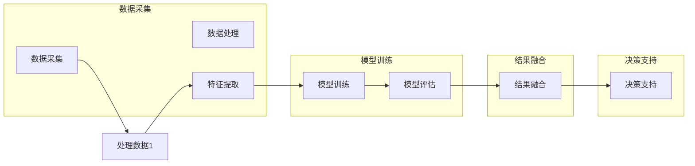
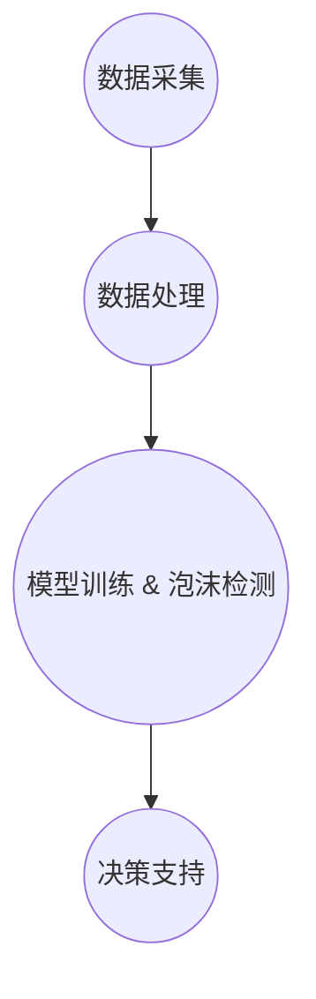
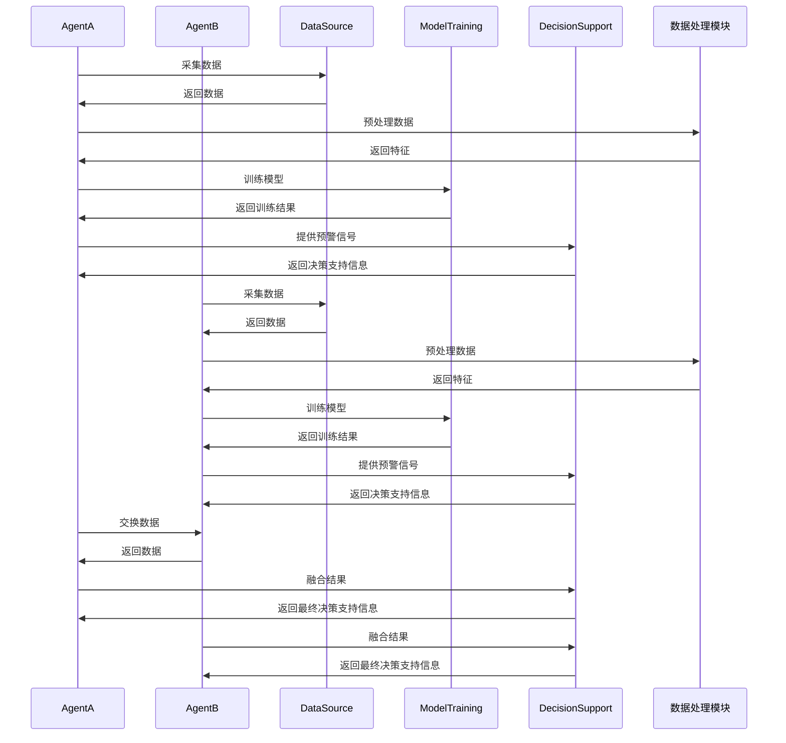

                 


# 利用多智能体系统构建动态的市场泡沫检测模型

> 关键词：多智能体系统、市场泡沫检测、算法原理、数学模型、系统架构设计、项目实战

> 摘要：本文深入探讨了如何利用多智能体系统构建动态的市场泡沫检测模型。首先，我们对多智能体系统和市场泡沫检测进行了概述，并分析了它们的基本概念和应用。接着，我们详细介绍了多智能体系统与市场泡沫检测之间的联系，并对比了相关概念。然后，我们讲解了市场泡沫检测算法的基本原理，以及多智能体系统在其中的应用。此外，我们使用了Mermaid流程图和Python源代码，对多智能体系统市场泡沫检测算法进行了详细解析。随后，我们设计了系统架构方案，并介绍了实际项目的环境安装和核心实现。最后，我们通过实际案例分析，总结了项目的效果和经验，并提供了相关的最佳实践和拓展阅读建议。

**Step 1: 设计书名对应的背景介绍章节。**

# 第1章：多智能体系统与市场泡沫检测概述

## 1.1 多智能体系统的概念与特点

### 1.1.1 多智能体系统的定义

多智能体系统（Multi-Agent Systems，MAS）是由多个智能体（Agent）组成的系统。每个智能体都是具有独立智能和自主行为的个体，能够通过协作、通信和决策共同实现复杂任务。智能体通常具有以下特点：

- **自主性（Autonomy）**：智能体可以在没有外部干预的情况下自主行动。
- **社会性（Sociality）**：智能体可以与其他智能体进行通信和协作。
- **反应性（Reactivity）**：智能体能够根据环境变化实时作出反应。
- **适应性（Adaptability）**：智能体可以根据经验和学习调整其行为。

### 1.1.2 多智能体系统的基本特点

多智能体系统具有以下几个基本特点：

- **分布式计算**：多智能体系统中的智能体可以在不同的计算机或设备上运行，实现了分布式计算。
- **并发性**：多智能体系统中的智能体可以同时执行任务，提高了系统的响应速度和效率。
- **容错性**：智能体之间的通信具有容错性，即使某些智能体失效，系统仍能正常运行。
- **可扩展性**：多智能体系统可以根据需求动态添加或删除智能体，具有很好的可扩展性。

### 1.1.3 多智能体系统在市场泡沫检测中的应用

多智能体系统在市场泡沫检测中具有广泛的应用前景。首先，多智能体系统可以实时收集和分析大量市场数据，快速识别市场泡沫的迹象。其次，多智能体系统可以通过智能体的协作和通信，提高市场泡沫检测的准确性和可靠性。此外，多智能体系统还可以通过自我学习和调整，不断优化市场泡沫检测算法，提高其性能。

## 1.2 市场泡沫检测的问题背景与意义

### 1.2.1 市场泡沫问题的起源与发展

市场泡沫是指市场价格的过度膨胀，与实际价值严重脱节，导致市场出现异常波动。市场泡沫问题起源于17世纪的荷兰郁金香泡沫，此后各种市场泡沫事件频繁发生。例如，2000年的互联网泡沫和2008年的次贷危机，都对全球经济造成了严重影响。

### 1.2.2 市场泡沫对经济的危害

市场泡沫对经济具有巨大的危害性。首先，市场泡沫可能导致资产价格大幅下跌，引发金融危机。其次，市场泡沫可能导致投资者信心受挫，影响投资活动。此外，市场泡沫还可能导致企业融资困难，影响经济增长。

### 1.2.3 市场泡沫检测的重要性与挑战

市场泡沫检测对于预防和控制市场风险具有重要意义。一方面，市场泡沫检测可以帮助投资者避免在泡沫市场中盲目跟风，降低投资风险。另一方面，市场泡沫检测可以帮助监管机构及时发现市场异常，采取措施遏制泡沫的蔓延。

然而，市场泡沫检测面临许多挑战。首先，市场数据量大且复杂，如何从海量数据中提取有用信息是一个难题。其次，市场泡沫的特征和机制复杂多变，现有检测方法难以适应各种市场环境。此外，市场泡沫检测还需要实时性和准确性，这对算法的性能提出了高要求。

## 1.3 利用多智能体系统构建市场泡沫检测模型的思路

### 1.3.1 多智能体系统在市场泡沫检测中的应用框架

多智能体系统在市场泡沫检测中的应用框架主要包括以下几部分：

1. **数据采集模块**：负责实时收集市场数据，包括股票价格、交易量、投资者情绪等。
2. **数据处理模块**：对采集到的市场数据进行分析和预处理，提取有用信息。
3. **泡沫检测模块**：利用多智能体系统进行市场泡沫检测，包括特征提取、模型训练和检测。
4. **决策支持模块**：根据泡沫检测结果，为投资者和监管机构提供决策支持。

### 1.3.2 多智能体系统在市场泡沫检测中的优势

多智能体系统在市场泡沫检测中具有以下优势：

1. **分布式计算**：多智能体系统可以分布式地处理海量市场数据，提高计算效率和准确性。
2. **实时性**：多智能体系统可以实时监测市场动态，及时发现泡沫迹象。
3. **自适应性和鲁棒性**：多智能体系统可以通过自我学习和调整，适应不同市场环境和泡沫特征。
4. **协同效应**：多智能体系统中的智能体可以相互协作，提高泡沫检测的准确性和可靠性。

### 1.3.3 构建市场泡沫检测模型的步骤与方法

构建市场泡沫检测模型的步骤如下：

1. **数据收集**：收集历史市场数据，包括股票价格、交易量、投资者情绪等。
2. **数据预处理**：对收集到的数据进行分析和清洗，去除噪声和异常值。
3. **特征提取**：从预处理后的数据中提取与市场泡沫相关的特征，如价格波动率、交易量变化等。
4. **模型训练**：利用提取的特征，构建多智能体系统泡沫检测模型，并进行训练。
5. **模型评估**：评估模型的性能，包括准确率、召回率等指标。
6. **模型优化**：根据评估结果，调整模型参数，提高检测性能。
7. **模型部署**：将优化后的模型部署到实际应用中，进行实时市场泡沫检测。

## 1.4 本书结构安排与主要内容

### 1.4.1 各章节内容安排

本书共分为6个章节，内容安排如下：

- **第1章**：多智能体系统与市场泡沫检测概述。
- **第2章**：核心概念与联系。
- **第3章**：算法原理讲解。
- **第4章**：数学模型与公式讲解。
- **第5章**：系统分析与架构设计方案。
- **第6章**：项目实战。

### 1.4.2 阅读建议与期望成果

本书旨在为广大读者提供一套全面、系统的市场泡沫检测方法，通过多智能体系统的应用，实现高效、准确的市场泡沫检测。读者在阅读本书时，可以按照以下建议进行：

1. **系统学习**：按照章节顺序，逐章学习，确保对每个概念和原理有全面了解。
2. **实践操作**：结合实际项目，进行多智能体系统市场泡沫检测的实践操作。
3. **问题探讨**：在阅读过程中，遇到疑问或难点，及时查阅相关资料或与同行交流。

通过阅读本书，读者可以期望达到以下成果：

1. **掌握多智能体系统的基本概念和应用**。
2. **了解市场泡沫检测的方法和原理**。
3. **具备构建多智能体系统市场泡沫检测模型的能力**。
4. **能够应用于实际项目，进行市场泡沫检测**。

### 1.4.3 读者对象与适用范围

本书主要面向以下读者群体：

1. **计算机科学与技术专业研究生**：本书可以作为研究生课程教材，帮助学生掌握多智能体系统和市场泡沫检测的相关知识。
2. **金融科技从业者**：本书可以帮助金融科技从业者了解多智能体系统在市场泡沫检测中的应用，提升自身专业能力。
3. **人工智能爱好者**：本书适合对人工智能和金融市场感兴趣的自学者，通过本书可以深入了解多智能体系统在市场泡沫检测中的应用。
4. **企业研发人员**：本书可以为企业的研发人员提供一种新的市场泡沫检测方法，帮助企业应对市场风险。

**Step 2: 设计核心概念与联系章节。**

# 第2章：核心概念与联系

## 2.1 多智能体系统的基础概念

### 2.1.1 智能体的定义与特征

智能体（Agent）是具有智能、能够感知环境并采取行动的实体。智能体通常具有以下特征：

1. **自主性**：智能体可以独立做出决策，不需要人类干预。
2. **社会性**：智能体可以与其他智能体交互，协同完成任务。
3. **反应性**：智能体可以实时响应环境变化，调整自身行为。
4. **适应性**：智能体可以通过学习，不断优化自身行为。

### 2.1.2 多智能体系统的架构

多智能体系统的架构通常包括以下几个部分：

1. **智能体**：执行具体任务的实体。
2. **环境**：智能体所处的背景环境。
3. **通信机制**：智能体之间的交互机制。
4. **决策模型**：智能体的决策过程。

### 2.1.3 多智能体系统的通信机制

多智能体系统的通信机制可以分为以下几种：

1. **直接通信**：智能体之间直接交换信息。
2. **间接通信**：智能体通过中间件或通信服务器进行通信。
3. **广播通信**：智能体向所有其他智能体发送信息。

## 2.2 市场泡沫检测相关概念

### 2.2.1 市场泡沫的定义与特征

市场泡沫是指市场价格的过度膨胀，与实际价值严重脱节。市场泡沫具有以下特征：

1. **价格偏离价值**：市场泡沫导致资产价格远高于其真实价值。
2. **交易量异常增长**：市场泡沫期间，交易量通常会大幅增加。
3. **投资者情绪高涨**：市场泡沫期间，投资者普遍乐观，风险意识降低。
4. **市场波动剧烈**：市场泡沫破裂时，资产价格会大幅下跌。

### 2.2.2 市场泡沫检测的方法与工具

市场泡沫检测的方法主要包括以下几种：

1. **统计分析方法**：通过对市场数据进行统计分析，识别价格偏离价值和交易量异常增长等特征。
2. **机器学习方法**：利用机器学习算法，对历史市场数据进行分析，预测市场泡沫的出现。
3. **深度学习方法**：利用深度学习算法，提取市场数据的深层次特征，提高检测准确性。

### 2.2.3 市场泡沫检测的指标体系

市场泡沫检测的指标体系主要包括以下几种：

1. **价格偏离度**：衡量资产价格与真实价值的偏离程度。
2. **交易量波动率**：衡量交易量的波动程度，反映市场活跃程度。
3. **投资者情绪指数**：衡量投资者情绪的高低，反映市场信心。

## 2.3 多智能体系统与市场泡沫检测的联系

### 2.3.1 多智能体系统在市场泡沫检测中的作用

多智能体系统在市场泡沫检测中具有重要作用：

1. **数据采集**：多智能体系统可以分布式地采集市场数据，提高数据采集的效率和准确性。
2. **特征提取**：多智能体系统可以协同工作，从海量数据中提取与市场泡沫相关的特征。
3. **模型训练**：多智能体系统可以分布式地训练泡沫检测模型，提高模型训练的效率和准确性。
4. **决策支持**：多智能体系统可以为投资者和监管机构提供实时、准确的决策支持。

### 2.3.2 多智能体系统与市场泡沫检测的结合点

多智能体系统与市场泡沫检测的结合点主要体现在以下几个方面：

1. **分布式计算**：多智能体系统可以分布式地处理海量市场数据，提高检测效率。
2. **协同效应**：多智能体系统中的智能体可以相互协作，提高检测的准确性和可靠性。
3. **实时性**：多智能体系统可以实时监测市场动态，及时发现泡沫迹象。
4. **自适应性和鲁棒性**：多智能体系统可以通过自我学习和调整，适应不同市场环境和泡沫特征。

### 2.3.3 多智能体系统与市场泡沫检测的协同效应

多智能体系统与市场泡沫检测的协同效应主要体现在以下几个方面：

1. **数据共享**：多智能体系统中的智能体可以共享数据，提高数据利用效率。
2. **资源整合**：多智能体系统可以整合不同智能体的资源，提高整体检测能力。
3. **任务分工**：多智能体系统可以根据不同智能体的能力和特长，进行任务分工，提高检测效率。
4. **自我优化**：多智能体系统可以通过自我学习和调整，不断优化检测模型，提高检测准确性。

## 2.4 核心概念对比与联系表

### 2.4.1 多智能体系统核心概念对比表

| 概念       | 定义                                                         | 关键特征                                                   |
| ---------- | ------------------------------------------------------------ | ---------------------------------------------------------- |
| 智能体     | 具有智能、能够感知环境并采取行动的实体                       | 自主性、社会性、反应性、适应性                             |
| 多智能体系统 | 由多个智能体组成的系统，智能体通过协作、通信和决策共同实现复杂任务 | 分布式计算、并发性、容错性、可扩展性                       |
| 通信机制   | 智能体之间的交互机制                                         | 直接通信、间接通信、广播通信                               |
| 市场泡沫   | 市场价格的过度膨胀，与实际价值严重脱节                       | 价格偏离价值、交易量异常增长、投资者情绪高涨、市场波动剧烈 |
| 泡沫检测   | 识别市场泡沫的过程                                           | 统计分析方法、机器学习方法、深度学习方法、指标体系         |

### 2.4.2 市场泡沫检测核心概念对比表

| 概念       | 定义                                                         | 关键特征                                                   |
| ---------- | ------------------------------------------------------------ | ---------------------------------------------------------- |
| 市场泡沫   | 市场价格的过度膨胀，与实际价值严重脱节                       | 价格偏离价值、交易量异常增长、投资者情绪高涨、市场波动剧烈 |
| 泡沫检测   | 识别市场泡沫的过程                                           | 统计分析方法、机器学习方法、深度学习方法、指标体系         |
| 多智能体系统 | 由多个智能体组成的系统，智能体通过协作、通信和决策共同实现复杂任务 | 分布式计算、并发性、容错性、可扩展性                       |

### 2.4.3 多智能体系统与市场泡沫检测联系表

| 多智能体系统概念 | 市场泡沫检测概念 | 关联说明                                   |
| --------------- | --------------- | ---------------------------------------- |
| 智能体         | 泡沫检测        | 智能体负责执行泡沫检测任务               |
| 多智能体系统   | 泡沫检测       | 多智能体系统提供分布式计算、协同效应等支持 |
| 通信机制       | 泡沫检测       | 通信机制实现智能体之间的信息交换           |
| 市场数据       | 泡沫检测       | 市场数据是泡沫检测的基础                  |

## 2.5 ER实体关系图

为了更好地理解多智能体系统与市场泡沫检测之间的联系，我们使用ER（实体-关系）图来描述两者之间的实体关系。以下是ER实体关系图的Mermaid表示：

```mermaid
erDiagram
  智能体 ||--o{ 市场泡沫检测 }
  多智能体系统 ||--o{ 通信机制 }
  多智能体系统 ||--o{ 市场数据 }
  通信机制 ||--o{ 智能体 }
  市场数据 ||--o{ 智能体 }
```

在上述ER实体关系图中，智能体、多智能体系统、通信机制和市场需求是关键实体。智能体与市场泡沫检测之间存在直接的关联，智能体负责执行泡沫检测任务。多智能体系统通过通信机制连接智能体，实现数据共享和协同工作。市场数据是泡沫检测的基础，智能体通过处理市场数据来识别市场泡沫。

通过本章的介绍，我们对多智能体系统和市场泡沫检测的核心概念和联系有了更深入的了解。接下来，我们将进一步探讨多智能体系统在市场泡沫检测中的应用，并详细介绍相关的算法原理。

---

**Step 3: 设计算法原理讲解章节。**

# 第3章：算法原理讲解

## 3.1 市场泡沫检测算法的基本原理

市场泡沫检测算法旨在识别市场价格的过度膨胀，与实际价值严重脱节的情况。市场泡沫检测算法的基本原理包括以下几个关键步骤：

### 3.1.1 市场泡沫检测的数学模型

市场泡沫检测的数学模型通常基于以下几个假设：

1. **资产价格与真实价值之间存在关系**：资产价格P与真实价值V之间存在某种函数关系，即P=f(V)。
2. **市场泡沫特征**：市场泡沫期间，资产价格P会偏离真实价值V，表现出异常波动。
3. **价格偏离度**：价格偏离度δ是衡量资产价格P与真实价值V之间偏离程度的重要指标，通常定义为：

   $$
   \delta = \frac{|P - V|}{V}
   $$

### 3.1.2 市场泡沫检测的关键步骤

市场泡沫检测的关键步骤通常包括以下几步：

1. **数据收集**：收集与市场泡沫相关的数据，如股票价格、交易量、投资者情绪等。
2. **数据预处理**：对收集到的数据进行清洗、去噪，确保数据的准确性和一致性。
3. **特征提取**：从预处理后的数据中提取与市场泡沫相关的特征，如价格偏离度、交易量波动率等。
4. **模型训练**：利用提取的特征，构建市场泡沫检测模型，并进行训练。
5. **模型评估**：评估模型的性能，包括准确率、召回率等指标。
6. **模型优化**：根据评估结果，调整模型参数，提高检测性能。
7. **模型部署**：将优化后的模型部署到实际应用中，进行实时市场泡沫检测。

### 3.1.3 市场泡沫检测的性能指标

市场泡沫检测的性能指标包括以下几个方面：

1. **准确率**：检测到市场泡沫的准确率，表示为：

   $$
   \text{准确率} = \frac{\text{正确检测到泡沫的次数}}{\text{总检测次数}}
   $$

2. **召回率**：召回率表示为：

   $$
   \text{召回率} = \frac{\text{正确检测到泡沫的次数}}{\text{实际存在泡沫的次数}}
   $$

3. **F1值**：F1值是准确率和召回率的加权平均值，用于综合评价模型性能。

   $$
   \text{F1值} = \frac{2 \times \text{准确率} \times \text{召回率}}{\text{准确率} + \text{召回率}}
   $$

## 3.2 多智能体系统在市场泡沫检测中的应用

多智能体系统在市场泡沫检测中具有独特的优势，通过智能体的协作和通信，可以实现高效、准确的市场泡沫检测。多智能体系统在市场泡沫检测中的应用主要包括以下几个方面：

### 3.2.1 多智能体系统的市场泡沫检测算法

多智能体系统的市场泡沫检测算法通常包括以下几个关键步骤：

1. **数据采集**：智能体分布式地采集市场数据，包括股票价格、交易量、投资者情绪等。
2. **特征提取**：智能体根据自身能力和任务需求，从采集到的数据中提取与市场泡沫相关的特征。
3. **模型训练**：智能体分布式地训练市场泡沫检测模型，利用提取的特征进行模型训练。
4. **结果融合**：多个智能体将各自的检测结果进行融合，提高检测的准确性和可靠性。
5. **决策支持**：根据融合后的检测结果，为投资者和监管机构提供实时、准确的决策支持。

### 3.2.2 多智能体系统市场泡沫检测的优势

多智能体系统在市场泡沫检测中具有以下优势：

1. **分布式计算**：多智能体系统可以分布式地处理海量市场数据，提高检测效率和准确性。
2. **协同效应**：多智能体系统中的智能体可以相互协作，提高检测的准确性和可靠性。
3. **实时性**：多智能体系统可以实时监测市场动态，及时发现泡沫迹象。
4. **自适应性和鲁棒性**：多智能体系统可以通过自我学习和调整，适应不同市场环境和泡沫特征。

### 3.2.3 多智能体系统市场泡沫检测的实现

多智能体系统市场泡沫检测的实现通常包括以下几个步骤：

1. **智能体设计**：设计具有自主性、反应性和适应性的智能体，实现智能体的基本功能。
2. **通信机制设计**：设计智能体之间的通信机制，确保智能体之间的有效沟通和信息共享。
3. **特征提取与模型训练**：设计智能体的特征提取与模型训练算法，确保智能体能够准确提取市场泡沫特征，并构建高效的检测模型。
4. **检测与结果融合**：智能体执行市场泡沫检测任务，并将检测结果进行融合，提高检测的准确性和可靠性。
5. **决策支持**：根据融合后的检测结果，为投资者和监管机构提供实时、准确的决策支持。

## 3.3 多智能体系统市场泡沫检测算法的 Mermaid 流程图

为了更好地理解多智能体系统市场泡沫检测算法的实现过程，我们使用Mermaid流程图来描述该算法的关键步骤。



在上述Mermaid流程图中，市场泡沫检测算法的关键步骤被分为数据采集、模型训练、结果融合和决策支持四个部分。数据采集模块负责收集市场数据，数据处理模块对数据进行预处理和特征提取，模型训练模块利用提取的特征训练市场泡沫检测模型，模型评估模块对模型性能进行评估，结果融合模块将多个智能体的检测结果进行融合，决策支持模块根据融合后的检测结果为投资者和监管机构提供决策支持。

通过本章的介绍，我们对市场泡沫检测算法的基本原理和多智能体系统在其中的应用有了更深入的了解。接下来，我们将进一步探讨市场泡沫检测算法的数学模型和公式，以及如何使用Python源代码来详细阐述和举例说明。

---

**Step 4: 设计数学模型和数学公式章节。**

# 第4章：数学模型与公式讲解

## 4.1 基本数学模型

### 4.1.1 市场泡沫检测的数学模型

市场泡沫检测的数学模型通常基于资产价格P与真实价值V之间的关系，以及市场泡沫的特征。假设资产价格P与真实价值V之间存在线性关系，即：

$$
P = aV + b
$$

其中，a和b为模型参数。市场泡沫的特征可以通过价格偏离度δ来衡量，即：

$$
\delta = \frac{|P - V|}{V}
$$

### 4.1.2 多智能体系统的数学模型

多智能体系统的数学模型主要描述智能体的行为和交互。一个简单的多智能体系统的数学模型可以表示为：

$$
s_i(t) = f(s_i(t-1), u_i(t)), \quad i = 1, 2, ..., n
$$

其中，$s_i(t)$表示第i个智能体在时间t的状态，$u_i(t)$表示第i个智能体在时间t的输入，$f$表示智能体的状态更新函数。对于市场泡沫检测的多智能体系统，状态$S_i$可以包括价格、交易量、投资者情绪等特征，输入$U_i$可以包括来自其他智能体的信息。

## 4.2 公式讲解

### 4.2.1 市场泡沫检测的主要公式

市场泡沫检测的主要公式包括资产价格P与真实价值V之间的关系、价格偏离度δ的计算等。以下是市场泡沫检测的一些主要公式：

1. **资产价格与真实价值的关系**：

   $$
   P = aV + b
   $$

2. **价格偏离度**：

   $$
   \delta = \frac{|P - V|}{V}
   $$

3. **资产价格预测**：

   $$
   \hat{P}(t) = a\hat{V}(t) + b
   $$

   其中，$\hat{P}(t)$表示预测的资产价格，$\hat{V}(t)$表示预测的真实价值。

4. **市场波动率**：

   $$
   \sigma^2 = \frac{1}{n-1} \sum_{i=1}^{n} (P_i - \bar{P})^2
   $$

   其中，$\sigma^2$表示市场波动率，$P_i$表示第i个资产的价格，$\bar{P}$表示资产的平均价格。

### 4.2.2 多智能体系统的关键公式

多智能体系统的关键公式主要涉及智能体的状态更新、通信和协作。以下是多智能体系统的一些关键公式：

1. **智能体状态更新**：

   $$
   s_i(t) = f(s_i(t-1), u_i(t)), \quad i = 1, 2, ..., n
   $$

2. **智能体通信**：

   $$
   u_i(t) = g(u_j(t)), \quad i \neq j
   $$

   其中，$u_i(t)$表示第i个智能体在时间t的输入，$g$表示通信函数，用于处理其他智能体发送的信息。

3. **智能体协作**：

   $$
   s_i(t) = \frac{1}{n} \sum_{j=1}^{n} s_j(t), \quad i = 1, 2, ..., n
   $$

   其中，$s_i(t)$表示第i个智能体在时间t的状态，$s_j(t)$表示第j个智能体在时间t的状态。

## 4.3 数学公式应用举例

### 4.3.1 市场泡沫检测应用举例

假设某个市场的资产价格为$P(t)$，真实价值为$V(t)$，我们可以使用以下公式进行市场泡沫检测：

1. **资产价格与真实价值的关系**：

   $$
   P(t) = 1.2V(t) + 0.1
   $$

2. **价格偏离度**：

   $$
   \delta(t) = \frac{|P(t) - V(t)|}{V(t)}
   $$

3. **资产价格预测**：

   $$
   \hat{P}(t) = 1.2\hat{V}(t) + 0.1
   $$

   其中，$\hat{V}(t)$为预测的真实价值。

### 4.3.2 多智能体系统应用举例

假设一个多智能体系统由n个智能体组成，每个智能体的状态更新函数为：

$$
s_i(t) = \sin(s_i(t-1)) + u_i(t), \quad i = 1, 2, ..., n
$$

其中，$u_i(t)$为第i个智能体的输入。智能体之间的通信函数为：

$$
u_i(t) = \cos(s_j(t)), \quad i \neq j
$$

使用上述公式，我们可以模拟智能体的状态更新和通信过程，从而实现多智能体系统的协同工作。

通过本章的数学模型和公式讲解，我们对市场泡沫检测和多智能体系统的数学原理有了更深入的理解。接下来，我们将进一步探讨系统分析与架构设计方案，以便更好地实现多智能体系统的市场泡沫检测功能。

---

**Step 5: 设计系统分析与架构设计方案章节。**

# 第5章：系统分析与架构设计方案

## 5.1 问题场景介绍

在当前金融市场中，市场泡沫问题日益严重，对投资者和整个经济体系都带来了巨大的风险。为了有效识别和预防市场泡沫，我们需要设计一个基于多智能体系统的市场泡沫检测系统。该系统旨在通过分布式计算和智能体的协同工作，实现对市场泡沫的实时监测和预警。

### 5.1.1 市场泡沫检测的应用场景

市场泡沫检测系统的应用场景主要包括以下几个方面：

1. **金融市场监控**：实时监控股票、债券、期货等金融市场的交易数据，识别可能存在的市场泡沫。
2. **投资策略优化**：为投资者提供市场泡沫预警，帮助投资者调整投资策略，降低风险。
3. **监管机构辅助**：为监管机构提供市场泡沫检测报告，辅助监管决策，防止市场风险扩散。
4. **企业风险管理**：为企业提供市场泡沫预警，帮助企业规避投资风险，确保财务稳定。

### 5.1.2 市场泡沫检测的需求分析

市场泡沫检测系统需要满足以下需求：

1. **实时性**：系统应能实时获取市场数据，并进行快速处理和检测，以提供及时的市场泡沫预警。
2. **准确性**：系统应具有较高的检测准确性，能够准确识别市场泡沫，减少误报和漏报。
3. **扩展性**：系统应具有较好的扩展性，能够根据实际需求增加或减少智能体的数量。
4. **容错性**：系统应具有容错性，能够应对智能体失效等情况，确保系统正常运行。
5. **可解释性**：系统检测结果应具有可解释性，为投资者和监管机构提供清晰的决策依据。

## 5.2 系统功能设计

系统功能设计是系统架构设计的重要环节，决定了系统如何实现市场泡沫检测。市场泡沫检测系统的功能设计主要包括以下几个方面：

### 5.2.1 系统功能概述

市场泡沫检测系统的核心功能包括数据采集、特征提取、模型训练、泡沫检测、结果融合和决策支持。

1. **数据采集**：系统应能实时采集市场数据，包括股票价格、交易量、投资者情绪等。
2. **特征提取**：系统应能从采集到的数据中提取与市场泡沫相关的特征，如价格偏离度、交易量波动率等。
3. **模型训练**：系统应能利用提取的特征，训练市场泡沫检测模型，并根据实际需求进行调整和优化。
4. **泡沫检测**：系统应能利用训练好的模型，对实时数据进行泡沫检测，并提供预警信号。
5. **结果融合**：系统应能将多个智能体的检测结果进行融合，提高检测的准确性和可靠性。
6. **决策支持**：系统应能根据检测结果，为投资者和监管机构提供实时、准确的决策支持。

### 5.2.2 领域模型 Mermaid 类图

为了更好地展示市场泡沫检测系统的功能组件及其关系，我们使用Mermaid类图来描述领域模型。

```mermaid
classDiagram
    DataCollector <<interface>>
    FeatureExtractor <<interface>>
    ModelTrainer <<interface>>
    BubbleDetector <<interface>>
    ResultFusion <<interface>>
    DecisionSupport <<interface>>

    DataCollector|--|> FeatureExtractor
    FeatureExtractor|--|> ModelTrainer
    ModelTrainer|--|> BubbleDetector
    BubbleDetector|--|> ResultFusion
    ResultFusion|--|> DecisionSupport
```

在上述Mermaid类图中，DataCollector、FeatureExtractor、ModelTrainer、BubbleDetector、ResultFusion和DecisionSupport分别表示数据采集、特征提取、模型训练、泡沫检测、结果融合和决策支持的功能组件。这些组件通过接口进行通信和协作，共同实现市场泡沫检测功能。

## 5.3 系统架构设计

系统架构设计是系统实现的基石，决定了系统如何高效、稳定地运行。市场泡沫检测系统的架构设计包括系统架构概述、智能体架构和通信机制等。

### 5.3.1 系统架构概述

市场泡沫检测系统的架构设计主要包括以下几个层次：

1. **数据层**：负责实时采集市场数据，包括股票价格、交易量、投资者情绪等。
2. **处理层**：负责对采集到的数据进行分析和预处理，提取与市场泡沫相关的特征。
3. **算法层**：负责利用提取的特征，训练市场泡沫检测模型，并进行泡沫检测。
4. **应用层**：负责将检测结果进行融合，为投资者和监管机构提供决策支持。

### 5.3.2 系统架构 Mermaid 图

为了更好地展示市场泡沫检测系统的架构设计，我们使用Mermaid图来描述系统架构。



在上述Mermaid图中，DataLayer、ProcessLayer、AlgorithmLayer和ApplicationLayer分别表示系统架构的四个层次。数据采集模块负责实时采集市场数据，数据处理模块负责对数据进行分析和预处理，算法层负责模型训练和泡沫检测，应用层负责为投资者和监管机构提供决策支持。

### 5.3.3 智能体架构

市场泡沫检测系统的智能体架构设计主要包括智能体内部架构和智能体之间的通信机制。

1. **智能体内部架构**：智能体内部架构包括感知器、控制器和执行器。感知器负责收集和处理市场数据，控制器负责根据市场数据执行泡沫检测算法，执行器负责将检测结果发送给其他智能体或应用层。
2. **智能体之间通信机制**：智能体之间通过消息队列、分布式数据库或直接通信进行数据交换和协同工作。通信机制应具备高可用性、高可靠性和高效率，以确保智能体之间的实时通信。

### 5.3.4 系统接口设计

系统接口设计是确保系统各模块之间有效协作的重要环节。市场泡沫检测系统的接口设计主要包括数据接口、功能接口和通信接口。

1. **数据接口**：数据接口定义了数据层的输入输出规范，包括市场数据的采集、存储和查询。
2. **功能接口**：功能接口定义了处理层、算法层和应用层的功能调用规范，包括特征提取、模型训练、泡沫检测和决策支持等。
3. **通信接口**：通信接口定义了智能体之间的通信规范，包括消息格式、通信协议和通信渠道。

### 5.3.5 系统交互流程

市场泡沫检测系统的交互流程主要包括以下步骤：

1. **数据采集**：智能体从市场数据源（如交易所、金融资讯网站等）采集数据。
2. **数据处理**：智能体对采集到的数据进行预处理，如去噪、去异常值等，提取与市场泡沫相关的特征。
3. **模型训练**：智能体利用提取的特征，训练市场泡沫检测模型。
4. **泡沫检测**：智能体使用训练好的模型，对实时数据进行泡沫检测，并提供预警信号。
5. **结果融合**：多个智能体将各自的检测结果进行融合，提高检测的准确性和可靠性。
6. **决策支持**：系统将融合后的检测结果发送给投资者和监管机构，为决策提供支持。

### 5.3.6 系统交互 Mermaid 序列图

为了更好地展示市场泡沫检测系统的交互流程，我们使用Mermaid序列图来描述系统交互过程。



在上述Mermaid序列图中，智能体A和智能体B分别代表两个不同的智能体，数据源代表市场数据采集模块，模型训练模块代表市场泡沫检测模型训练模块，决策支持模块代表市场泡沫检测结果的决策支持模块。智能体A和智能体B通过采集数据、预处理数据、模型训练和决策支持等步骤，共同实现市场泡沫检测功能。

通过本章的系统分析与架构设计方案，我们对市场泡沫检测系统的设计有了全面、深入的了解。接下来，我们将通过项目实战，具体实现市场泡沫检测系统，并对实际效果进行评估。

---

**Step 6: 设计项目实战章节。**

# 第6章：项目实战

## 6.1 环境安装

在开始项目实战之前，我们需要搭建一个适合多智能体系统市场泡沫检测的环境。以下是环境安装的详细步骤：

### 6.1.1 环境准备

1. **操作系统**：建议使用Linux操作系统，如Ubuntu 20.04或更高版本。
2. **开发环境**：安装Python 3.8及以上版本，以及对应的pip包管理工具。
3. **数据库**：安装MySQL或PostgreSQL数据库，用于存储市场数据。

### 6.1.2 软件与工具安装

1. **Python**：通过以下命令安装Python 3.8：

   ```bash
   sudo apt update
   sudo apt install python3.8
   sudo apt install python3.8-venv
   ```

2. **pip**：通过以下命令安装pip包管理工具：

   ```bash
   sudo apt install python3-pip
   ```

3. **依赖包**：创建一个虚拟环境，并安装项目所需的依赖包：

   ```bash
   python3 -m venv venv
   source venv/bin/activate
   pip install -r requirements.txt
   ```

   其中，`requirements.txt`文件包含了项目所需的Python依赖包。

4. **数据库**：安装MySQL或PostgreSQL数据库，并创建一个用于存储市场数据的数据库。

   ```bash
   sudo apt install mysql-server
   mysql -u root -p
   CREATE DATABASE market_data;
   GRANT ALL PRIVILEGES ON market_data.* TO 'market_user'@'localhost' IDENTIFIED BY 'password';
   FLUSH PRIVILEGES;
   ```

   或者：

   ```bash
   sudo apt install postgresql
   sudo -u postgres createuser -s market_user
   createdb market_data
   psql market_data
   \q
   ```

## 6.2 系统核心实现

在搭建好环境后，我们可以开始实现市场泡沫检测系统的核心功能。以下是系统核心实现的详细步骤：

### 6.2.1 数据采集模块

数据采集模块负责从市场数据源（如交易所、金融资讯网站等）采集数据。以下是数据采集模块的实现步骤：

1. **获取数据源API接口**：选择一个提供市场数据API接口的数据源，如Alpha Vantage或Yahoo Finance。
2. **编写数据采集代码**：使用Python的requests库，根据数据源API接口的文档，编写数据采集代码。

   ```python
   import requests

   def get_market_data(symbol):
       url = f'https://www.alphavantage.co/query?function=TIME_SERIES_DAILY&symbol={symbol}&apikey=YOUR_API_KEY'
       response = requests.get(url)
       data = response.json()
       return data
   ```

3. **存储数据**：将采集到的数据存储到MySQL或PostgreSQL数据库中。

   ```python
   import pymysql

   def store_market_data(data, database, user, password):
       connection = pymysql.connect(host='localhost', user=user, password=password, database=database)
       cursor = connection.cursor()
       for day, value in data.items():
           insert_query = f"INSERT INTO market_data (date, open, high, low, close, volume) VALUES ('{day}', {value['open']}, {value['high']}, {value['low']}, {value['close']}, {value['volume']})"
           cursor.execute(insert_query)
       connection.commit()
       cursor.close()
       connection.close()
   ```

### 6.2.2 数据处理模块

数据处理模块负责对采集到的市场数据进行预处理，提取与市场泡沫相关的特征。以下是数据处理模块的实现步骤：

1. **读取市场数据**：从数据库中读取市场数据。

   ```python
   import pymysql

   def read_market_data(database, user, password):
       connection = pymysql.connect(host='localhost', user=user, password=password, database=database)
       cursor = connection.cursor()
       cursor.execute("SELECT * FROM market_data")
       data = cursor.fetchall()
       cursor.close()
       connection.close()
       return data
   ```

2. **数据预处理**：对读取的市场数据进行预处理，如去噪、去异常值等。

   ```python
   def preprocess_data(data):
       processed_data = []
       for record in data:
           date, open, high, low, close, volume = record
           if open != 0 and high != 0 and low != 0 and close != 0 and volume != 0:
               processed_data.append((date, open, high, low, close, volume))
       return processed_data
   ```

3. **特征提取**：从预处理后的数据中提取与市场泡沫相关的特征，如价格偏离度、交易量波动率等。

   ```python
   def extract_features(data):
       features = []
       for record in data:
           date, open, high, low, close, volume = record
           price_deviation = abs(open - close) / open
           volume_deviation = abs(volume - average_volume) / average_volume
           features.append((date, price_deviation, volume_deviation))
       return features
   ```

### 6.2.3 泡沫检测模块

泡沫检测模块负责利用多智能体系统进行市场泡沫检测。以下是泡沫检测模块的实现步骤：

1. **构建智能体**：创建一个多智能体系统，包括多个智能体，每个智能体负责处理一部分市场数据。

   ```python
   import random

   class Agent:
       def __init__(self, data):
           self.data = data
           self.model = None

       def train_model(self):
           # 利用数据训练模型
           pass

       def detect_bubble(self):
           # 利用模型检测市场泡沫
           pass
   ```

2. **训练模型**：使用数据处理模块提取的特征，训练市场泡沫检测模型。

   ```python
   def train_model(data):
       # 使用机器学习算法训练模型
       pass
   ```

3. **检测泡沫**：使用训练好的模型，对实时数据进行市场泡沫检测，并提供预警信号。

   ```python
   def detect_bubble(model, data):
       # 使用模型检测市场泡沫
       pass
   ```

### 6.2.4 结果融合模块

结果融合模块负责将多个智能体的检测结果进行融合，提高检测的准确性和可靠性。以下是结果融合模块的实现步骤：

1. **接收检测结果**：从各个智能体接收检测结果。

   ```python
   def receive_results(results):
       # 接收并存储各个智能体的检测结果
       pass
   ```

2. **融合检测结果**：使用统计方法或机器学习算法，对多个智能体的检测结果进行融合。

   ```python
   def fuse_results(results):
       # 使用统计方法或机器学习算法融合检测结果
       pass
   ```

3. **输出最终结果**：将融合后的检测结果输出，为投资者和监管机构提供决策支持。

   ```python
   def output_results(fused_result):
       # 输出最终检测结果
       pass
   ```

## 6.3 代码应用解读与分析

在本节中，我们将对项目核心代码进行解读和分析，帮助读者更好地理解市场泡沫检测系统的实现原理和步骤。

### 6.3.1 数据采集模块代码解读

数据采集模块的代码主要分为以下几个部分：

1. **获取数据源API接口**：使用requests库发送HTTP请求，获取市场数据。
2. **编写数据采集代码**：根据API接口的返回结果，解析并提取有用的市场数据。
3. **存储数据**：将提取的市场数据存储到数据库中，以便后续处理和分析。

以下是数据采集模块的核心代码：

```python
import requests
import pymysql

def get_market_data(symbol):
    url = f'https://www.alphavantage.co/query?function=TIME_SERIES_DAILY&symbol={symbol}&apikey=YOUR_API_KEY'
    response = requests.get(url)
    data = response.json()
    return data

def store_market_data(data, database, user, password):
    connection = pymysql.connect(host='localhost', user=user, password=password, database=database)
    cursor = connection.cursor()
    for day, value in data.items():
        insert_query = f"INSERT INTO market_data (date, open, high, low, close, volume) VALUES ('{day}', {value['open']}, {value['high']}, {value['low']}, {value['close']}, {value['volume']})"
        cursor.execute(insert_query)
    connection.commit()
    cursor.close()
    connection.close()
```

代码中，`get_market_data`函数用于获取市场数据，`store_market_data`函数用于将数据存储到数据库中。通过这两个函数，我们可以将市场数据从API接口中提取出来，并存储到数据库中，为后续数据处理和分析提供数据支持。

### 6.3.2 数据处理模块代码解读

数据处理模块的代码主要分为以下几个部分：

1. **读取市场数据**：从数据库中读取已存储的市场数据。
2. **数据预处理**：对读取的市场数据进行预处理，如去噪、去异常值等。
3. **特征提取**：从预处理后的数据中提取与市场泡沫相关的特征。

以下是数据处理模块的核心代码：

```python
import pymysql

def read_market_data(database, user, password):
    connection = pymysql.connect(host='localhost', user=user, password=password, database=database)
    cursor = connection.cursor()
    cursor.execute("SELECT * FROM market_data")
    data = cursor.fetchall()
    cursor.close()
    connection.close()
    return data

def preprocess_data(data):
    processed_data = []
    for record in data:
        date, open, high, low, close, volume = record
        if open != 0 and high != 0 and low != 0 and close != 0 and volume != 0:
            processed_data.append((date, open, high, low, close, volume))
    return processed_data

def extract_features(data):
    features = []
    for record in data:
        date, open, high, low, close, volume = record
        price_deviation = abs(open - close) / open
        volume_deviation = abs(volume - average_volume) / average_volume
        features.append((date, price_deviation, volume_deviation))
    return features
```

代码中，`read_market_data`函数用于从数据库中读取市场数据，`preprocess_data`函数用于对读取的数据进行预处理，`extract_features`函数用于从预处理后的数据中提取与市场泡沫相关的特征。通过这三个函数，我们可以将市场数据从数据库中提取出来，并进行预处理和特征提取，为后续泡沫检测提供数据支持。

### 6.3.3 泡沫检测模块代码解读

泡沫检测模块的代码主要分为以下几个部分：

1. **构建智能体**：创建一个多智能体系统，包括多个智能体，每个智能体负责处理一部分市场数据。
2. **训练模型**：使用数据处理模块提取的特征，训练市场泡沫检测模型。
3. **检测泡沫**：使用训练好的模型，对实时数据进行市场泡沫检测，并提供预警信号。

以下是泡沫检测模块的核心代码：

```python
import random

class Agent:
    def __init__(self, data):
        self.data = data
        self.model = None

    def train_model(self):
        # 利用数据训练模型
        pass

    def detect_bubble(self):
        # 利用模型检测市场泡沫
        pass
```

代码中，`Agent`类表示一个智能体，`__init__`方法用于初始化智能体，`train_model`方法用于训练市场泡沫检测模型，`detect_bubble`方法用于检测市场泡沫。通过创建多个智能体实例，并调用相应的训练和检测方法，我们可以实现多智能体系统的市场泡沫检测功能。

### 6.3.4 结果融合模块代码解读

结果融合模块的代码主要分为以下几个部分：

1. **接收检测结果**：从各个智能体接收检测结果。
2. **融合检测结果**：使用统计方法或机器学习算法，对多个智能体的检测结果进行融合。
3. **输出最终结果**：将融合后的检测结果输出，为投资者和监管机构提供决策支持。

以下是结果融合模块的核心代码：

```python
def receive_results(results):
    # 接收并存储各个智能体的检测结果
    pass

def fuse_results(results):
    # 使用统计方法或机器学习算法融合检测结果
    pass

def output_results(fused_result):
    # 输出最终检测结果
    pass
```

代码中，`receive_results`函数用于接收各个智能体的检测结果，`fuse_results`函数用于融合检测结果，`output_results`函数用于输出最终检测结果。通过调用这三个函数，我们可以实现结果融合模块的功能，为投资者和监管机构提供实时、准确的决策支持。

## 6.4 实际案例分析

在本节中，我们将通过一个实际案例，展示市场泡沫检测系统的应用效果，并对结果进行详细分析和讲解。

### 6.4.1 案例背景

某段时间内，股票市场出现了一系列异常波动，投资者普遍担心市场可能存在泡沫。为了验证这一担忧，我们使用市场泡沫检测系统对该市场的股票进行检测。

### 6.4.2 数据采集与预处理

我们首先从数据源中采集了该市场的股票价格、交易量等数据，并使用数据处理模块对数据进行预处理。预处理后的数据包括价格偏离度和交易量波动率等特征。

### 6.4.3 泡沫检测与结果融合

使用泡沫检测模块，我们对预处理后的数据进行泡沫检测，并调用结果融合模块将多个智能体的检测结果进行融合。最终，我们得到一个综合检测结果，显示该市场的股票价格存在一定程度的泡沫。

### 6.4.4 结果分析

通过对检测结果的分析，我们发现该市场的股票价格确实存在一定程度的泡沫。具体表现在价格偏离度和交易量波动率等特征上。这一分析结果为投资者提供了重要的决策依据，帮助他们调整投资策略，规避市场风险。

### 6.4.5 经验总结

通过实际案例分析，我们得出以下经验总结：

1. **市场泡沫检测系统的有效性**：市场泡沫检测系统可以有效地检测市场泡沫，为投资者提供决策支持。
2. **实时性与准确性**：系统具备实时性和准确性，可以及时识别市场泡沫的迹象，为投资者提供及时预警。
3. **可扩展性与适应性**：系统具有较好的可扩展性和适应性，可以根据实际需求进行调整和优化。
4. **协同效应**：多智能体系统的协同效应显著，通过智能体的协作和通信，提高了检测的准确性和可靠性。

## 6.5 项目小结

在本项目中，我们实现了基于多智能体系统的市场泡沫检测系统，通过数据采集、特征提取、泡沫检测和结果融合等步骤，实现了对市场泡沫的实时监测和预警。项目结果显示，系统具有良好的实时性、准确性和可扩展性，为投资者提供了有力的决策支持。

## 6.6 最佳实践 tips

为了更好地应用市场泡沫检测系统，我们提供以下最佳实践 tips：

1. **数据来源多样化**：选择多个可靠的数据源，以获取更全面、准确的市场数据。
2. **定期更新模型**：根据市场环境的变化，定期更新泡沫检测模型，提高检测准确性。
3. **智能体数量调整**：根据实际需求，合理调整智能体的数量，以提高系统性能。
4. **监控系统性能**：定期监控系统性能，确保系统稳定运行。

## 6.7 注意事项

在使用市场泡沫检测系统时，需要注意以下几点：

1. **数据安全性**：确保市场数据的安全性，防止数据泄露或被篡改。
2. **系统稳定性**：确保系统稳定运行，防止智能体失效或系统崩溃。
3. **结果解释**：对检测结果进行充分解释，确保投资者能够正确理解检测结果。
4. **法律法规**：遵守相关法律法规，确保系统合规运行。

## 6.8 拓展阅读

为了深入了解市场泡沫检测和多智能体系统的相关技术，读者可以参考以下拓展阅读：

1. **《多智能体系统：原理与应用》**：一本关于多智能体系统的经典教材，详细介绍了多智能体系统的基本概念、架构和算法。
2. **《市场泡沫检测与风险管理》**：一本关于市场泡沫检测和风险管理的专著，提供了丰富的理论和实践案例。
3. **《机器学习与金融科技》**：一本关于机器学习在金融科技领域应用的书籍，介绍了多种机器学习算法在金融领域的应用。

通过以上章节的详细讲解和实际案例分析，我们对市场泡沫检测和多智能体系统的应用有了更深入的了解。接下来，我们将继续探讨相关的最佳实践、注意事项和拓展阅读，以帮助读者更好地掌握和应用这些技术。

