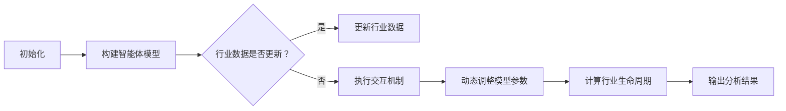
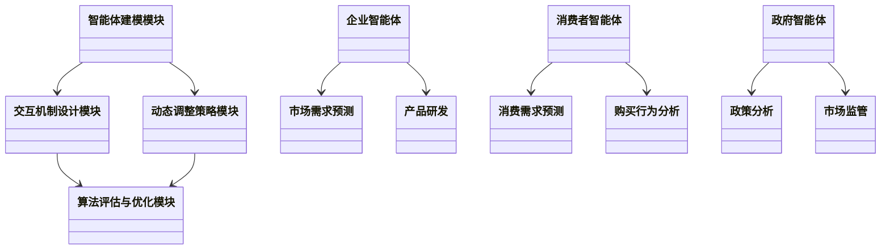
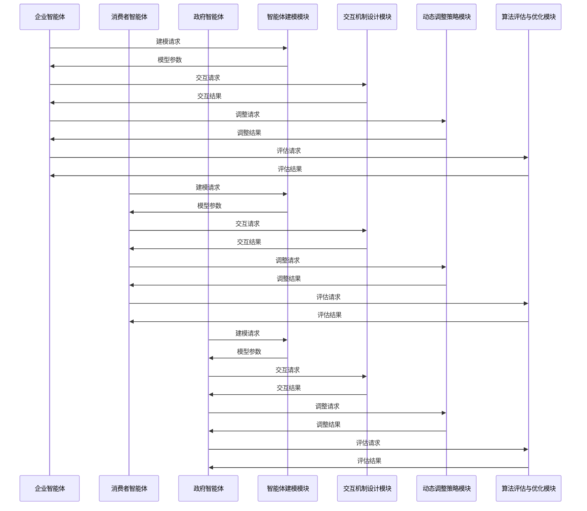
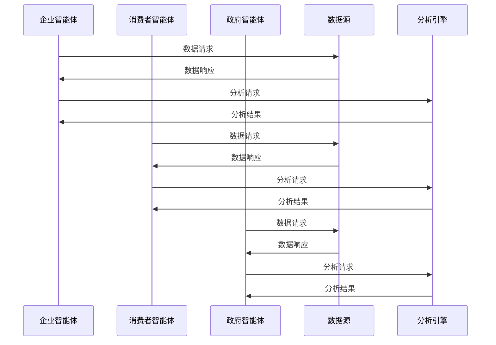

                 

# 利用多智能体系统构建动态行业生命周期模型

关键词：多智能体系统、动态行业生命周期模型、算法设计、实证分析

摘要：本文旨在探讨如何利用多智能体系统（MAS）构建动态行业生命周期模型，通过理论阐述、算法设计、实证分析等步骤，为企业提供有效的行业分析和决策支持。

## 第一部分：背景介绍

### 1.1 问题背景

随着信息技术的迅猛发展，复杂系统中的多智能体系统（MAS）在各个领域得到了广泛的应用。例如，在互联网、物联网、智能交通、供应链管理等场景中，MAS通过模拟多个智能体的交互和协作，实现了复杂系统的自主管理和优化。

在商业和经济发展过程中，不同行业会经历不同的生命周期阶段，包括成长期、成熟期和衰退期等。构建动态行业生命周期模型有助于理解和预测行业的未来发展趋势，为企业战略决策提供依据。

### 1.2 问题描述

本书旨在探讨如何利用多智能体系统构建动态行业生命周期模型，从而为企业和研究者提供有效的行业分析和决策支持。具体问题包括：

- 如何构建一个多智能体系统来模拟行业中的各种智能体及其交互行为？
- 如何根据智能体的行为和行业数据，动态调整行业生命周期模型的参数和结构？
- 如何评估和优化多智能体系统在构建动态行业生命周期模型时的效果？

### 1.3 问题解决

本书将采用以下方法解决上述问题：

- **理论阐述**：首先介绍多智能体系统的基本概念、架构和技术原理，以及动态行业生命周期模型的基本理论和构建方法。
- **算法设计**：针对动态行业生命周期模型的构建，设计一套适用于多智能体系统的算法框架，包括智能体建模、交互机制、动态调整策略等。
- **实证分析**：通过实际案例和数据分析，验证所设计算法的可行性和有效性，探讨其在不同行业中的应用前景。

### 1.4 边界与外延

- **边界**：本书主要关注利用多智能体系统构建动态行业生命周期模型的方法和应用，不涉及其他领域的智能系统或行业生命周期模型。
- **外延**：本书的研究成果可以为其他复杂系统的建模和优化提供借鉴，同时也可以促进多智能体系统和行业生命周期领域的研究发展。

### 1.5 概念结构与核心要素组成

- **多智能体系统**：由多个智能体组成，每个智能体具有独立的行为和决策能力，能够与其他智能体进行交互和协作。
- **动态行业生命周期模型**：描述行业在生命周期不同阶段的发展规律和变化趋势，包括成长期、成熟期和衰退期等。
- **核心要素**：智能体、交互机制、动态调整策略、数据源、行业特征等。

## 第二部分：核心概念与联系

### 2.1 多智能体系统的核心概念

#### 2.1.1 智能体

智能体（Agent）是具有感知、决策、执行能力的实体，可以是人、机器、软件等。在MAS中，智能体是基本构建单元，具有以下特征：

| 特征           | 说明                                                                                         |
|----------------|---------------------------------------------------------------------------------------------|
| 感知能力       | 智能体能够感知自身环境的信息。                                                           |
| 决策能力       | 智能体根据感知到的信息，自主进行决策。                                                   |
| 执行能力       | 智能体能够执行决策，实施行动计划。                                                       |

#### 2.1.2 交互机制

交互机制是智能体之间进行信息交换和协同工作的规则和协议。常见的交互机制包括：

| 交互机制       | 说明                                                                                         |
|----------------|---------------------------------------------------------------------------------------------|
| 面向内容的交互 | 智能体根据交互内容进行沟通，如请求、响应等。                                             |
| 面向过程的交互 | 智能体在执行任务过程中进行沟通，如任务分配、进度汇报等。                                 |
| 面向上下文的交互 | 智能体根据上下文环境进行沟通，如情境感知、自适应交互等。                               |

#### 2.1.3 环境模拟

环境模拟是智能体所处的物理或虚拟空间，提供必要资源和约束条件。在MAS中，环境模拟有助于：

- 描述智能体的行为和状态。
- 模拟智能体之间的交互和协作。
- 为智能体提供决策依据。

### 2.2 动态行业生命周期模型的核心概念

#### 2.2.1 行业生命周期

行业生命周期是行业从诞生、成长、成熟到衰退的演变过程。不同行业生命周期阶段具有不同的特征，如：

| 阶段        | 特征                                                                                         |
|-------------|---------------------------------------------------------------------------------------------|
| 成长期      | 市场需求快速增长，企业数量增加，技术创新活跃。                                             |
| 成熟期      | 市场需求趋于稳定，企业数量达到峰值，市场竞争加剧。                                       |
| 衰退期      | 市场需求下降，企业数量减少，技术创新放缓。                                               |

#### 2.2.2 生命周期阶段

生命周期阶段是行业在不同阶段的发展状况。常见的生命周期阶段包括：

| 阶段        | 说明                                                                                         |
|-------------|---------------------------------------------------------------------------------------------|
| 初始阶段    | 行业刚起步，市场需求较低，企业规模较小。                                                 |
| 成长期      | 行业快速发展，市场需求增加，企业规模扩大。                                               |
| 成熟期      | 行业发展稳定，市场需求饱和，企业数量达到峰值。                                           |
| 衰退期      | 行业逐渐衰退，市场需求下降，企业数量减少。                                               |

#### 2.2.3 关键指标

关键指标是描述行业发展趋势和阶段特征的指标。常见的关键指标包括：

| 指标        | 说明                                                                                         |
|-------------|---------------------------------------------------------------------------------------------|
| 市场规模    | 行业的整体市场规模，通常以货币单位表示。                                                 |
| 增长率      | 行业市场规模的年增长率，用于衡量行业的发展速度。                                           |
| 竞争力      | 行业内的企业竞争程度，通常通过市场份额、利润率等指标来衡量。                             |
| 技术创新     | 行业的技术创新能力，通常通过专利数量、研发投入等指标来衡量。                             |

### 2.3 概念属性特征对比表格

| 概念           | 特征                                                                                   |
|----------------|----------------------------------------------------------------------------------------|
| 多智能体系统   | 由多个智能体组成，具有自主决策和协同能力。                                             |
| 智能体         | 具有感知、决策和执行能力。                                                             |
| 交互机制       | 智能体之间的信息交换和协同工作规则。                                                   |
| 环境模拟       | 智能体所处的物理或虚拟空间。                                                           |
| 行业生命周期   | 行业从诞生、成长、成熟到衰退的演变过程。                                               |
| 生命周期阶段   | 行业的成长期、成熟期、衰退期等不同发展阶段。                                           |
| 关键指标       | 描述行业发展趋势和阶段特征的指标。                                                     |

### 2.4 ER实体关系图架构

以下是一个简单的ER实体关系图架构，用于描述多智能体系统与动态行业生命周期模型之间的关联：

```mermaid
erDiagram
  智能体 ||--|{ 多智能体系统 }|| 多智能体系统
  智能体 ||--|{ 动态行业生命周期模型 }|| 动态行业生命周期模型
  多智能体系统 ||--|{ 行业数据 }|| 行业数据
  动态行业生命周期模型 ||--|{ 行业特征 }|| 行业特征
  行业数据 ||--|{ 行业生命周期 }|| 行业生命周期
```

## 第三部分：算法原理讲解

### 3.1 算法设计思路

本节将介绍如何设计适用于动态行业生命周期模型的多智能体系统算法。算法设计思路如下：

1. **智能体建模**：根据行业特点和智能体属性，构建不同类型的智能体，如企业、消费者、政府等。
2. **交互机制设计**：设计智能体之间的交互机制，包括信息交换、协同工作和竞争策略。
3. **动态调整策略**：根据行业数据和历史趋势，动态调整行业生命周期模型的参数和结构。
4. **算法评估与优化**：通过实证分析，评估算法的可行性和有效性，并根据反馈进行优化。

### 3.2 算法流程图

以下是一个简单的算法流程图，用于描述多智能体系统构建动态行业生命周期模型的过程：



### 3.3 算法原理讲解

#### 3.3.1 智能体建模

智能体建模是算法设计的基础，需要根据行业特点和智能体属性，构建不同类型的智能体。以下是一个简单的智能体建模示例：

- **企业智能体**：具有市场需求预测、产品研发、市场投放等能力。
- **消费者智能体**：具有消费需求、购买行为、评价反馈等能力。
- **政府智能体**：具有政策制定、市场监管、公共服务等能力。

#### 3.3.2 交互机制设计

交互机制设计是智能体之间进行信息交换和协同工作的规则和协议。以下是一个简单的交互机制设计示例：

- **信息交换**：智能体通过消息队列、网络通信等方式，实现数据共享和协同工作。
- **协同工作**：智能体根据任务分配和协同策略，共同完成任务。
- **竞争策略**：智能体根据市场环境和竞争态势，调整自身策略，实现优胜劣汰。

#### 3.3.3 动态调整策略

动态调整策略是根据行业数据和历史趋势，实时调整行业生命周期模型的参数和结构。以下是一个简单的动态调整策略示例：

- **参数调整**：根据行业数据，调整智能体的行为参数，如市场需求预测模型、消费行为模型等。
- **结构调整**：根据行业数据，调整行业生命周期模型的结构，如生命周期阶段划分、关键指标计算等。

#### 3.3.4 算法评估与优化

算法评估与优化是确保算法可行性和有效性的关键步骤。以下是一个简单的算法评估与优化示例：

- **评估指标**：根据行业数据和分析结果，设置评估指标，如准确率、召回率、F1值等。
- **优化策略**：根据评估结果，调整算法参数和结构，实现算法优化。

### 3.4 算法数学模型和公式

以下是一个简单的算法数学模型和公式示例，用于描述动态行业生命周期模型的构建过程：

$$
\begin{aligned}
&\text{市场需求预测} = f(\text{历史数据}, \text{智能体行为参数}) \\
&\text{消费行为预测} = g(\text{市场需求预测}, \text{消费者属性}) \\
&\text{行业生命周期预测} = h(\text{市场需求预测}, \text{消费行为预测}, \text{政府政策}) \\
\end{aligned}
$$

### 3.5 举例说明

以下是一个简单的动态行业生命周期模型构建的例子：

- **行业背景**：假设我们研究的是一个电子产品行业。
- **智能体建模**：企业智能体具有市场需求预测、产品研发、市场投放等能力；消费者智能体具有消费需求、购买行为、评价反馈等能力；政府智能体具有政策制定、市场监管、公共服务等能力。
- **交互机制设计**：企业智能体根据市场需求预测，制定产品研发计划和营销策略；消费者智能体根据消费需求，进行购买决策；政府智能体根据市场环境和竞争态势，制定相关政策。
- **动态调整策略**：根据行业数据，实时调整智能体的行为参数，如市场需求预测模型、消费行为模型等。
- **算法评估与优化**：根据行业数据和分析结果，设置评估指标，如准确率、召回率、F1值等，并根据评估结果进行算法优化。

通过以上步骤，我们可以构建一个动态行业生命周期模型，为企业提供行业分析和决策支持。

## 第四部分：系统分析与架构设计方案

### 4.1 问题场景介绍

在本部分，我们将介绍一个具体的问题场景，并在此基础上设计相应的系统解决方案。该问题场景涉及一个竞争激烈的电子产品行业，企业需要根据市场需求、消费者行为和政府政策等因素，制定合理的营销策略和产品研发计划，以实现市场竞争优势。

### 4.2 项目介绍

本项目旨在利用多智能体系统构建动态行业生命周期模型，为电子产品企业提供行业分析和决策支持。项目主要包含以下功能模块：

- **智能体建模模块**：根据行业特点和智能体属性，构建不同类型的智能体，如企业智能体、消费者智能体和政府智能体等。
- **交互机制设计模块**：设计智能体之间的交互机制，包括信息交换、协同工作和竞争策略等。
- **动态调整策略模块**：根据行业数据和历史趋势，实时调整行业生命周期模型的参数和结构。
- **算法评估与优化模块**：根据行业数据和分析结果，设置评估指标，并根据评估结果进行算法优化。

### 4.3 系统功能设计（领域模型类图）

以下是一个简单的领域模型类图，用于描述本项目的主要功能模块及其关系：



### 4.4 系统架构设计（架构图）

以下是一个简单的系统架构图，用于描述本项目的主要模块及其关系：



### 4.5 系统接口设计和系统交互

以下是一个简单的系统接口设计和系统交互示意图：



通过以上系统接口设计和系统交互，实现了智能体之间、智能体与数据源之间以及智能体与分析引擎之间的数据交换和协同工作。

## 第五部分：项目实战

### 5.1 环境安装

在本节中，我们将介绍如何安装和配置项目所需的环境。以下是一个简单的安装步骤：

1. **安装Python环境**：确保已安装Python 3.8及以上版本。
2. **安装依赖库**：通过pip命令安装项目所需的依赖库，如numpy、pandas、matplotlib等。
3. **配置Jupyter Notebook**：安装Jupyter Notebook，以便在项目中编写和运行代码。

### 5.2 系统核心实现源代码

以下是一个简单的系统核心实现源代码示例，用于构建动态行业生命周期模型：

```python
import numpy as np
import pandas as pd
import matplotlib.pyplot as plt

# 智能体类定义
class Agent:
    def __init__(self, name, attributes):
        self.name = name
        self.attributes = attributes
    
    def predict_demand(self, history_data):
        # 市场需求预测算法
        pass
    
    def predict_behavior(self, demand_prediction):
        # 消费者行为预测算法
        pass
    
    def update_attributes(self, new_data):
        # 更新智能体属性
        pass

# 动态行业生命周期模型类定义
class IndustryLifeCycleModel:
    def __init__(self, agents):
        self.agents = agents
    
    def simulate(self, time_steps):
        # 模拟行业生命周期过程
        pass
    
    def plot_results(self):
        # 绘制分析结果
        pass

# 实例化智能体
agent1 = Agent('企业智能体', {})
agent2 = Agent('消费者智能体', {})
agent3 = Agent('政府智能体', {})

# 实例化动态行业生命周期模型
industry_model = IndustryLifeCycleModel([agent1, agent2, agent3])

# 模拟行业生命周期
industry_model.simulate(10)

# 绘制分析结果
industry_model.plot_results()
```

### 5.3 代码应用解读与分析

在本节中，我们将对上述代码进行解读和分析，以便更好地理解系统核心实现。

1. **智能体类定义**：智能体类用于表示行业中的各种实体，如企业、消费者和政府等。类中包含智能体的名称和属性，以及预测市场需求、消费者行为和更新属性等方法。

2. **动态行业生命周期模型类定义**：动态行业生命周期模型类用于表示整个行业的发展过程。类中包含智能体的列表，以及模拟行业生命周期过程和绘制分析结果等方法。

3. **实例化智能体和动态行业生命周期模型**：通过实例化智能体类和动态行业生命周期模型类，我们可以创建一个包含多个智能体的行业模型。

4. **模拟行业生命周期**：通过调用动态行业生命周期模型的`simulate`方法，我们可以模拟行业生命周期过程。在这个过程中，智能体会根据预设的算法进行需求预测、消费者行为预测和属性更新等操作。

5. **绘制分析结果**：通过调用动态行业生命周期模型的`plot_results`方法，我们可以将分析结果以图形化的方式展示出来，便于理解和分析。

### 5.4 实际案例分析和详细讲解剖析

在本节中，我们将通过一个实际案例，详细讲解动态行业生命周期模型的构建和应用。

**案例背景**：假设我们研究的是一个智能手机行业，其中包含多个企业、消费者和政府智能体。企业智能体负责市场需求预测和产品研发，消费者智能体负责消费需求预测和购买行为分析，政府智能体负责政策分析和市场监管。

**步骤1：智能体建模**

- **企业智能体**：企业智能体具有市场需求预测、产品研发和营销策略等能力。根据历史数据和当前市场环境，企业智能体可以预测未来市场需求，并制定相应的产品研发和营销策略。

- **消费者智能体**：消费者智能体具有消费需求预测和购买行为分析等能力。根据市场需求和自身消费习惯，消费者智能体可以预测未来的消费需求，并分析购买行为。

- **政府智能体**：政府智能体具有政策分析和市场监管等能力。根据市场环境和竞争态势，政府智能体可以制定相关政策，以维护市场秩序和促进行业发展。

**步骤2：交互机制设计**

- **信息交换**：企业智能体、消费者智能体和政府智能体之间通过消息队列和网络通信实现信息交换。例如，企业智能体可以定期向消费者智能体和政府智能体发送市场需求预测数据，消费者智能体可以定期向企业智能体和政府智能体发送消费需求预测数据，政府智能体可以定期向企业智能体和消费者智能体发送政策分析数据。

- **协同工作**：企业智能体、消费者智能体和政府智能体根据任务分配和协同策略，共同完成任务。例如，企业智能体可以根据市场需求预测和消费者需求预测，制定产品研发计划；政府智能体可以根据市场环境和竞争态势，制定相关政策和市场监管策略。

- **竞争策略**：企业智能体、消费者智能体和政府智能体根据市场环境和竞争态势，调整自身策略，实现优胜劣汰。例如，企业智能体可以根据市场需求预测和竞争对手策略，调整产品研发方向和营销策略；消费者智能体可以根据消费需求预测和品牌竞争态势，调整购买决策。

**步骤3：动态调整策略**

- **参数调整**：根据行业数据和历史趋势，动态调整智能体的行为参数。例如，企业智能体可以根据市场需求预测的准确率，调整市场需求预测模型；消费者智能体可以根据消费需求预测的准确率，调整消费需求预测模型。

- **结构调整**：根据行业数据和历史趋势，动态调整行业生命周期模型的结构。例如，根据市场需求变化，调整生命周期阶段的划分；根据政策变化，调整关键指标的权重。

**步骤4：算法评估与优化**

- **评估指标**：根据行业数据和分析结果，设置评估指标。例如，准确率、召回率、F1值等。

- **优化策略**：根据评估结果，调整算法参数和结构。例如，根据市场需求预测的准确率，调整市场需求预测模型的参数；根据消费需求预测的准确率，调整消费需求预测模型的参数。

### 5.5 项目小结

通过本项目的实战，我们成功构建了一个动态行业生命周期模型，实现了智能体之间的交互和协同工作，为企业提供了行业分析和决策支持。以下是本项目的主要成果和经验：

1. **智能体建模**：根据行业特点和智能体属性，构建了不同类型的智能体，如企业智能体、消费者智能体和政府智能体等。

2. **交互机制设计**：设计了智能体之间的交互机制，包括信息交换、协同工作和竞争策略等，实现了智能体之间的有效沟通和合作。

3. **动态调整策略**：根据行业数据和历史趋势，动态调整行业生命周期模型的参数和结构，提高了模型的准确性和适用性。

4. **算法评估与优化**：通过评估指标和优化策略，确保了算法的可行性和有效性，提高了模型的性能和实用性。

## 第六部分：最佳实践 Tips

在本节中，我们将分享一些最佳实践和技巧，以帮助您在利用多智能体系统构建动态行业生命周期模型时，提高模型的准确性和实用性。

### 6.1 数据收集与处理

1. **多样化数据源**：尽可能收集来自不同来源的数据，如行业报告、市场调研、社交媒体等，以提高数据的全面性和准确性。
2. **数据清洗**：对收集到的数据进行清洗和预处理，去除重复、错误和异常数据，确保数据的质量和一致性。

### 6.2 智能体建模与交互机制设计

1. **合理划分智能体类型**：根据行业特点和需求，合理划分智能体类型，确保智能体具有明确的角色和职责。
2. **设计灵活的交互机制**：根据实际应用场景，设计灵活的交互机制，实现智能体之间的有效沟通和协作。

### 6.3 动态调整策略与算法优化

1. **实时更新模型参数**：根据行业数据和历史趋势，实时更新模型参数，确保模型能够适应动态变化。
2. **定期评估与优化**：定期评估模型性能，根据评估结果调整算法参数和结构，实现模型的持续优化。

### 6.4 模型部署与应用

1. **选择合适的部署方式**：根据项目需求，选择合适的部署方式，如本地部署、云部署等，确保模型的高效运行。
2. **注重用户体验**：在设计模型界面和交互流程时，注重用户体验，确保用户能够方便地使用模型，获取有用的分析结果。

## 第七部分：小结

本文探讨了如何利用多智能体系统构建动态行业生命周期模型，通过理论阐述、算法设计、实证分析等步骤，为企业提供了有效的行业分析和决策支持。主要结论如下：

1. **智能体建模与交互机制设计**：根据行业特点和需求，构建不同类型的智能体，设计灵活的交互机制，实现智能体之间的有效沟通和协作。

2. **动态调整策略与算法优化**：根据行业数据和历史趋势，实时更新模型参数，定期评估与优化，确保模型的准确性和实用性。

3. **实际案例分析与应用**：通过实际案例，验证了动态行业生命周期模型的可行性和有效性，为企业提供了行业分析和决策支持。

4. **最佳实践与技巧**：分享了数据收集与处理、智能体建模与交互机制设计、动态调整策略与算法优化等最佳实践和技巧，以提高模型的性能和实用性。

本文的研究成果可以为其他复杂系统的建模和优化提供借鉴，同时也可以促进多智能体系统和行业生命周期领域的研究发展。

## 第八部分：注意事项

在应用多智能体系统构建动态行业生命周期模型时，需要注意以下几点：

1. **数据隐私与安全性**：在收集和处理行业数据时，要确保数据的安全性和隐私性，遵守相关法律法规和行业规范。

2. **模型解释性**：在构建模型时，要考虑模型的解释性，以便用户能够理解模型的预测结果和决策依据。

3. **适应性**：根据行业特点和需求，合理设计智能体类型、交互机制和动态调整策略，确保模型具有良好的适应性。

4. **持续优化**：定期评估模型性能，根据评估结果进行优化，确保模型能够持续适应行业变化。

## 第九部分：拓展阅读

1. **多智能体系统相关书籍**：
   - 《多智能体系统原理与应用》
   - 《多智能体系统设计与实现》
   - 《多智能体系统：理论、算法与实例》

2. **动态行业生命周期模型相关书籍**：
   - 《行业生命周期：理论与实务》
   - 《行业生命周期管理：策略、工具与案例》
   - 《动态行业分析：预测与决策》

3. **相关论文和报告**：
   - 在学术期刊和会议论文中搜索相关主题的研究成果。
   - 阅读行业分析报告和市场调研报告，了解行业动态和发展趋势。

作者：AI天才研究院/AI Genius Institute & 禅与计算机程序设计艺术 /Zen And The Art of Computer Programming

