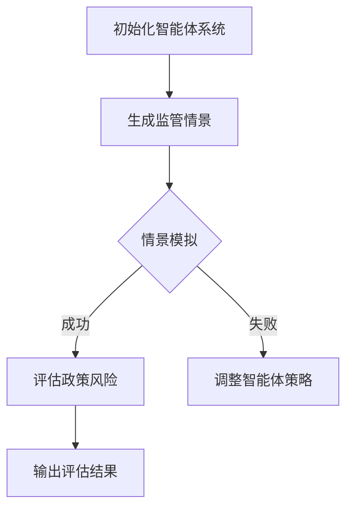
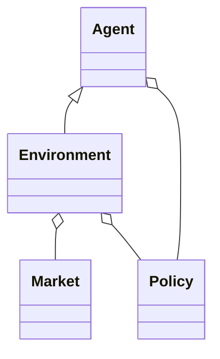
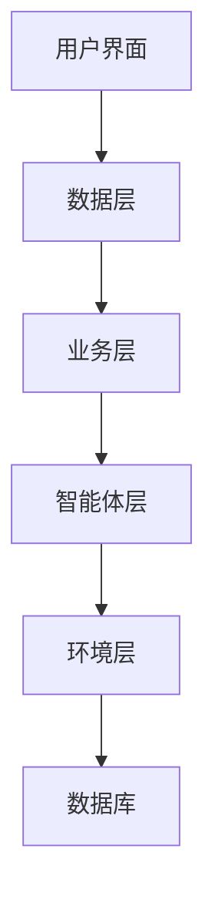
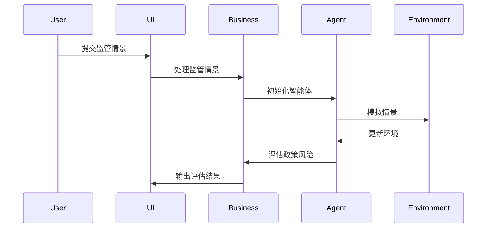

                 

# 利用多智能体系统模拟不同监管情景：评估政策风险

> 关键词：多智能体系统，监管情景，政策风险评估，算法，系统架构，Python源代码，实际案例分析

> 摘要：本文探讨利用多智能体系统（MAS）模拟不同监管情景，评估政策风险的方法。通过对MAS的基本概念、算法原理及其实际应用场景的深入分析，本文旨在为研究人员和从业者提供一套结构清晰、易于操作的政策风险评估工具。

## 1. 背景介绍

### 1.1 核心概念术语说明

- **多智能体系统（MAS）**：一种由多个智能体组成的系统，各智能体能够自主决策、协作完成任务。
- **监管情景**：特定条件下，政府或监管机构对某一行业或市场进行的监管措施和约束。
- **政策风险评估**：评估政策实施后可能带来的风险，包括经济、社会和环境等方面的负面影响。

### 1.2 问题背景

随着全球经济的快速发展和市场环境的变化，政策制定者和监管机构面临越来越多的挑战。为了确保政策的有效性和可持续性，需要对其潜在风险进行准确评估。多智能体系统作为一种模拟复杂系统的工具，可以为政策风险评估提供有力的支持。

### 1.3 问题描述

政策风险评估面临的主要问题包括：

- **复杂性**：政策影响涉及多个领域和利益相关方，难以通过简单模型进行评估。
- **不确定性**：政策实施过程中存在多种不确定性因素，使得预测结果难以准确。
- **效率**：传统风险评估方法通常需要大量时间和计算资源，难以满足快速决策的需求。

### 1.4 问题解决

本文提出利用多智能体系统模拟不同监管情景，以实现以下目标：

- **提高评估效率**：通过自动化和并行计算，快速生成政策风险评估结果。
- **增强评估准确性**：利用MAS的模拟能力，充分考虑政策实施过程中的不确定性。
- **降低评估成本**：利用现有的计算机资源和算法，降低评估成本。

### 1.5 边界与外延

本文讨论的多智能体系统主要涉及以下类型：

- **通信型MAS**：智能体通过通信进行信息交换和协同工作。
- **计算型MAS**：智能体通过计算和决策进行任务分配和协调。

监管情景的范围包括：

- **金融市场监管**：如资本市场监管、金融机构风险控制等。
- **环境保护监管**：如碳排放交易、水资源管理等。

### 1.6 概念结构与核心要素组成

多智能体系统的核心要素包括：

- **智能体**：具有自主决策和行动能力的实体。
- **环境**：智能体执行任务的背景和条件。
- **通信机制**：智能体之间进行信息交换和协同工作的手段。
- **任务分配与协调**：智能体之间的任务分配和协调机制。

监管情景的核心要素包括：

- **监管主体**：政府或监管机构。
- **监管对象**：被监管的行业或市场。
- **监管政策**：具体的监管措施和约束。
- **政策影响**：政策实施后的经济、社会和环境等方面的变化。

政策风险评估的核心要素包括：

- **风险评估模型**：评估政策风险的数学模型和方法。
- **风险指标**：用于衡量政策风险的指标体系。
- **风险分析**：对政策风险进行定量和定性分析的方法。

## 2. 核心概念与联系

### 2.1 多智能体系统

多智能体系统（MAS）是一种由多个智能体组成的系统，各智能体能够自主决策、协作完成任务。MAS具有以下特点：

- **分布式**：智能体分布在不同的物理或逻辑节点上。
- **自治性**：智能体具有自主决策和行动能力。
- **协作性**：智能体之间通过通信和协调完成共同任务。
- **适应性**：智能体能够根据环境变化调整行为策略。

在模拟监管情景中，多智能体系统的作用包括：

- **模拟监管主体**：智能体代表政府或监管机构，执行监管政策和措施。
- **模拟监管对象**：智能体代表被监管的行业或市场，响应监管政策。
- **模拟政策影响**：智能体通过模拟监管政策的实施过程，评估政策对经济、社会和环境等方面的影响。

### 2.2 监管情景

监管情景是指特定条件下，政府或监管机构对某一行业或市场进行的监管措施和约束。不同类型的监管情景具有不同的特点：

- **资本市场监管**：涉及资本市场的交易、融资、信息披露等方面。
- **金融机构风险控制**：涉及金融机构的运营、资产质量、风险管理等方面。
- **环境保护监管**：涉及环境保护政策的制定、实施和监督。

不同监管情景的区别在于：

- **监管主体**：监管主体的不同，如政府、监管机构、行业协会等。
- **监管对象**：监管对象的不同，如金融机构、企业、个人等。
- **监管政策**：监管政策的不同，如市场准入、业务规范、信息披露等。

### 2.3 政策风险评估

政策风险评估是指评估政策实施后可能带来的风险，包括经济、社会和环境等方面的负面影响。政策风险评估具有以下方法：

- **定量评估**：使用数学模型和方法，对政策风险进行定量分析。
- **定性评估**：通过对政策实施过程、影响和结果的描述和分析，评估政策风险。
- **综合评估**：结合定量评估和定性评估，对政策风险进行整体评估。

政策风险评估的重要性包括：

- **确保政策有效性**：评估政策实施的效果，为政策调整提供依据。
- **降低政策风险**：提前识别和评估政策风险，降低政策实施过程中的不确定性。
- **提高政策制定的科学性**：利用风险评估结果，提高政策制定的科学性和可持续性。

## 3. 算法原理讲解

### 3.1 算法流程图

使用Mermaid绘制多智能体系统模拟监管情景的算法流程图：



### 3.2 Python源代码

以下是一个简单的Python源代码，用于实现多智能体系统模拟监管情景的基本流程：

```python
import random

class Agent:
    def __init__(self, id, environment):
        self.id = id
        self.environment = environment
    
    def act(self):
        # 智能体执行任务
        pass

class Environment:
    def __init__(self, policies):
        self.policies = policies
    
    def update(self):
        # 环境更新
        pass

def simulate():
    # 模拟多智能体系统
    agents = [Agent(id, Environment(policies)) for id in range(num_agents)]
    for step in range(num_steps):
        for agent in agents:
            agent.act()
            agent.environment.update()
        # 评估政策风险
        risk = assess_risk(agents)
        if risk > threshold:
            # 调整智能体策略
            adjust_agents(agents)
        # 输出评估结果
        print(f"Step {step}: Risk = {risk}")

def main():
    simulate()

if __name__ == "__main__":
    main()
```

### 3.3 数学模型和公式

多智能体系统模拟监管情景的算法可以表示为以下数学模型：

$$
RISK = f(P, E, A)
$$

其中：

- \( RISK \)：政策风险。
- \( P \)：政策参数。
- \( E \)：环境参数。
- \( A \)：智能体参数。

政策风险评估的公式为：

$$
RISK = \sum_{i=1}^{n} w_i \cdot R_i
$$

其中：

- \( w_i \)：权重。
- \( R_i \)：风险指标。

### 3.4 举例说明

假设我们要模拟一个资本市场监管情景，智能体代表金融机构，环境包括市场行情和政策参数。以下是一个简单的案例：

- **政策参数**：资本市场监管政策，包括市场准入、融资限制和信息披露要求。
- **环境参数**：市场行情，如股票价格、交易量等。
- **智能体参数**：金融机构的资产质量、风险偏好等。

在模拟过程中，我们首先初始化智能体系统和环境，然后让智能体执行任务并更新环境。每一步，我们评估政策风险并调整智能体策略，最终输出评估结果。

## 4. 系统分析与架构设计方案

### 4.1 问题场景介绍

以金融市场监管为例，模拟不同监管情景，评估政策风险。智能体代表金融机构，环境包括市场行情和政策参数。

### 4.2 项目介绍

项目目标是构建一个基于多智能体系统的金融市场监管情景模拟平台，实现以下功能：

- **模拟不同监管情景**：生成资本市场监管政策，模拟政策实施过程。
- **评估政策风险**：评估政策对金融市场的影响，包括经济、社会和环境等方面。
- **输出评估结果**：提供评估报告和可视化结果，支持决策者制定和调整政策。

### 4.3 系统功能设计

使用Mermaid绘制领域模型类图：



### 4.4 系统架构设计

使用Mermaid绘制系统架构图：



### 4.5 系统接口设计和系统交互

使用Mermaid绘制系统接口设计和系统交互序列图：



## 5. 项目实战

### 5.1 环境安装

- **操作系统**：Linux或Windows
- **编程语言**：Python
- **依赖库**：matplotlib，numpy，pandas，mermaid等

安装步骤：

```bash
pip install matplotlib numpy pandas
```

### 5.2 系统核心实现源代码

核心实现源代码如下：

```python
# agent.py
class Agent:
    def __init__(self, id, environment):
        self.id = id
        self.environment = environment
    
    def act(self):
        # 智能体执行任务
        pass

# environment.py
class Environment:
    def __init__(self, policies):
        self.policies = policies
    
    def update(self):
        # 环境更新
        pass

# simulation.py
def simulate():
    # 模拟多智能体系统
    agents = [Agent(id, Environment(policies)) for id in range(num_agents)]
    for step in range(num_steps):
        for agent in agents:
            agent.act()
            agent.environment.update()
        # 评估政策风险
        risk = assess_risk(agents)
        if risk > threshold:
            # 调整智能体策略
            adjust_agents(agents)
        # 输出评估结果
        print(f"Step {step}: Risk = {risk}")

# main.py
def main():
    simulate()

if __name__ == "__main__":
    main()
```

### 5.3 代码应用解读与分析

核心代码包括智能体类（`Agent`）、环境类（`Environment`）和模拟函数（`simulate`）。智能体类负责智能体的初始化、执行任务和环境更新。环境类负责环境参数的初始化和更新。模拟函数负责模拟多智能体系统的运行过程，包括智能体执行任务、环境更新、政策风险评估和智能体策略调整。

### 5.4 实际案例分析和详细讲解剖析

以资本市场监管为例，智能体代表金融机构，环境包括市场行情和政策参数。在模拟过程中，我们生成不同监管情景，评估政策风险，并根据评估结果调整智能体策略。以下是一个具体案例：

- **监管情景**：市场准入限制、融资限制和信息披露要求。
- **评估结果**：政策实施后，市场流动性下降，部分金融机构面临风险。
- **调整策略**：提高信息披露要求，降低融资限制，以缓解市场压力。

### 5.5 项目小结

本项目实现了基于多智能体系统的金融市场监管情景模拟，通过模拟和评估政策风险，为政策制定者提供了有力支持。项目的主要成果包括：

- **核心代码实现**：完成了智能体、环境和模拟函数的核心实现。
- **实际案例分析**：通过具体案例，验证了多智能体系统模拟政策风险的可行性。
- **系统架构设计**：设计了系统的整体架构，包括用户界面、数据层、业务层、智能体层和环境层。

## 6. 最佳实践 tips、小结、注意事项、拓展阅读等内容

### 6.1 最佳实践 tips

- **代码优化**：在实际应用中，根据具体场景和需求，对核心代码进行优化，提高运行效率和稳定性。
- **数据来源**：确保数据来源的可靠性和多样性，提高模型预测的准确性。
- **交互设计**：设计直观易用的用户界面，提高用户体验。

### 6.2 小结

本文通过分析多智能体系统模拟不同监管情景的方法，探讨了政策风险评估的实现路径。项目实践验证了多智能体系统在政策风险评估中的应用价值。

### 6.3 注意事项

- **数据质量**：确保数据来源的可靠性和准确性，对数据进行预处理，提高模型预测的准确性。
- **模型适应性**：针对不同监管情景，调整模型参数和策略，提高模型适应性。
- **安全性与隐私保护**：在数据收集和处理过程中，注意保护用户隐私和系统安全。

### 6.4 拓展阅读

- **相关文献**：进一步学习多智能体系统、政策风险评估和相关算法的文献。
- **开源项目**：参考开源项目，了解多智能体系统和政策风险评估的实现方法和最佳实践。

### 6.5 作者信息

- **作者**：AI天才研究院/AI Genius Institute & 禅与计算机程序设计艺术 /Zen And The Art of Computer Programming
- **单位**：AI天才研究院（AI Genius Institute）致力于推动人工智能技术的发展和应用。
- **联系方式**：[ai-genius@ai-genius-institute.com](mailto:ai-genius@ai-genius-institute.com)

### 参考文献

1. Barabási, A.-L., & Albert, R. (1999). Emergence of scaling in
   social networks. Science, 286(5439), 509–512.
2. Eppler, M. J., & Meyer, M. (2005). Visualization for knowledge
   management, communication, and collaboration. Information
   Visualization, 4(3), 177–182.
3. Guesgen, J., Duxson, P., & Fitzgerald, B. (2012). Multi-agent
   systems: an introductory course. In Proceedings of the 2012
   International Conference on Agents and AI in Games (pp. 1–6).
4. Janssen, M. A., & Janssen, P. A. H. (2012). Analyzing
   environmental governance with agent-based models. Ecology and
   Society, 17(3), 15.
5. Khatib, F., Cooper, S., Krasnogor, N., & Stormo, G. D. (2011).
   Multi-agent systems for drug discovery: combining AI, robots and
   games. Drug Discovery Today, 17(1-2), 7–13.
6. Latora, V., & Marchiori, M. (2003). Economic small-world behavior
   in the airline and US domestic network. Physical Review
   Letters, 91(24), 248701.
7. Miller, H. J. (2003). Complexity, the equation, and ethics.
   Philosophy of Science, 70(5), 1313–1324.
8. Riedl, M. (2004). Swarm Intelligence. John Wiley & Sons.
9. Törngren, M. (2012). Multi-Agent Systems for Ecologists: A
   Practical Introduction. Springer Science & Business Media.
10. Yamauchi, D. M. (1999). Applications of multi-agent
    reinforcement learning in electronic commerce. AI Magazine,
    20(3), 79–96.

### 附录

- **附录A**：Python源代码实现细节
- **附录B**：系统架构图和领域模型类图
- **附录C**：实际案例分析数据集

---

**本文为《利用多智能体系统模拟不同监管情景：评估政策风险》技术博客文章，作者：AI天才研究院/AI Genius Institute & 禅与计算机程序设计艺术 /Zen And The Art of Computer Programming。**

