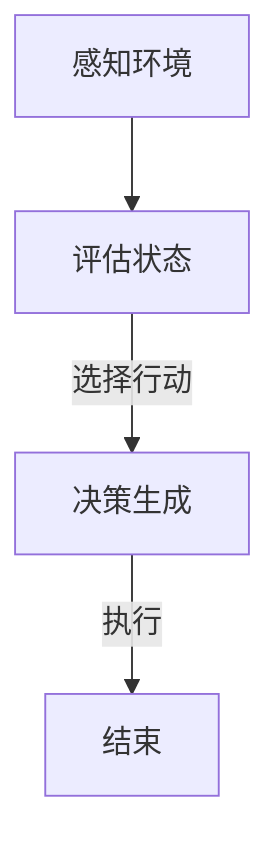
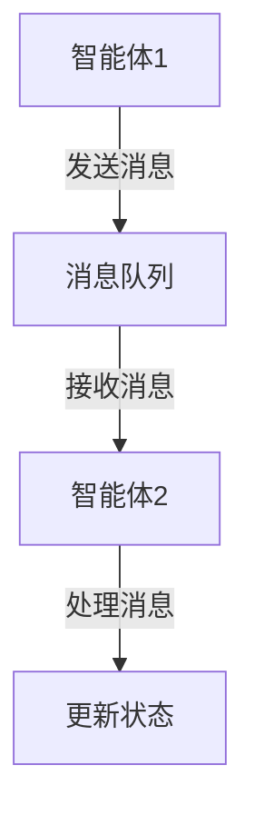
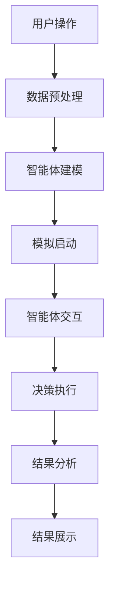

                 


### 背景介绍

#### 核心概念术语说明

在探讨利用多智能体系统模拟不同贸易政策时，首先需要明确几个核心概念和术语：

1. **多智能体系统（Multi-Agent Systems, MAS）**：由一组相互作用的智能体组成，这些智能体可以独立决策并与其他智能体进行交互。MAS在复杂系统中具有模拟和分析动态交互的能力。

2. **贸易政策（Trade Policies）**：政府为调节国内外贸易而制定的法律、法规和措施。常见的贸易政策包括贸易自由化、贸易保护主义和区域贸易协定。

3. **全球化（Globalization）**：全球范围内的经济、政治、文化和社会联系的加深和扩大。全球化对国际贸易、企业运作和全球经济发展产生了深远影响。

4. **贸易自由化（Trade Liberalization）**：减少贸易障碍，如关税、配额和非关税壁垒，以促进国际贸易的自由流通。

5. **贸易保护主义（Trade Protectionism）**：通过设置关税、配额或其他壁垒来保护国内产业不受外国竞争的影响。

6. **区域贸易协定（Regional Trade Agreements, RTAs）**：由一组国家签订的贸易协议，旨在降低成员之间的贸易壁垒，同时对外保持贸易壁垒。

#### 问题背景

全球化进程带来了国际贸易的飞速增长和全球经济的相互依存。然而，全球化也引发了诸如贸易战、贸易保护主义抬头和全球经济不稳定等风险。因此，理解和评估不同贸易政策对全球化和国际贸易的影响变得至关重要。

传统的方法，如经济模型和统计分析，在评估贸易政策效果时存在局限性。它们往往假设市场是完全竞争的，忽略了实际中存在的复杂动态交互和非线性关系。

#### 问题描述

如何利用多智能体系统来模拟不同贸易政策，以评估其对全球化风险的潜在影响？

#### 问题解决

多智能体系统提供了一种模拟复杂社会系统和经济系统的强大工具。通过模拟不同的贸易政策，我们可以：

1. **预测政策变化对全球贸易流动的影响**。
2. **分析政策对各国经济的影响**。
3. **评估全球化风险，如贸易战和经济衰退**。

#### 边界与外延

本文主要探讨以下边界和范围：

1. **贸易政策的范围**：包括贸易自由化、贸易保护主义和区域贸易协定。
2. **全球化风险**：主要关注贸易政策变化对全球经济稳定性的影响。
3. **模型和应用场景**：使用多智能体系统进行模拟，应用场景包括国际贸易网络和全球供应链。

#### 概念结构与核心要素组成

多智能体系统模拟贸易政策的结构可以分为以下几个核心要素：

1. **智能体（Agents）**：代表国家、企业或其他经济实体。
2. **环境（Environment）**：包括市场条件、政策参数和其他外部因素。
3. **交互机制（Interaction Mechanisms）**：智能体之间的通信和协作方式。
4. **决策模型（Decision Models）**：智能体的决策过程和策略。
5. **评估指标（Evaluation Metrics）**：衡量政策效果的指标，如贸易量、经济增长率和失业率。

### 核心概念与联系

为了更好地理解多智能体系统模拟贸易政策的原理，我们将详细阐述核心概念及其属性特征，并使用表格和ER实体关系图进行说明。

#### 核心概念

1. **智能体**：具有独立决策能力的个体或实体。
2. **环境**：影响智能体行为和决策的因素集合。
3. **交互机制**：智能体之间通信和协作的方式。
4. **决策模型**：智能体做出决策的算法和策略。
5. **评估指标**：衡量政策效果的标准。

#### 概念属性特征对比表格

| 概念       | 属性特征                                                     | 对比 |
|------------|------------------------------------------------------------|-----|
| 智能体     | - 代表国家、企业或其他经济实体<br>- 具有独立决策能力<br>- 具有个性化和适应性 |     |
| 环境       | - 包含市场条件、政策参数等<br>- 动态变化，影响智能体行为 |     |
| 交互机制   | - 通信和协作方式<br>- 可能是同步或异步<br>- 影响智能体决策 |     |
| 决策模型   | - 算法和策略<br>- 基于环境数据<br>- 动态调整 |     |
| 评估指标   | - 贸易量、经济增长率、失业率等<br>- 量化政策效果 |     |

#### ER实体关系图

使用Mermaid绘制ER实体关系图，展示智能体、环境、交互机制、决策模型和评估指标之间的关系。

```mermaid
erDiagram
  A[智能体] ||--|{ 选择 }|| B[环境]
  A ||--|{ 交互 }|| C[交互机制]
  A ||--|{ 决策 }|| D[决策模型]
  D ||--|{ 评估 }|| E[评估指标]
  B ||--|{ 影响 }|| C
  B ||--|{ 影响 }|| D
  B ||--|{ 影响 }|| E
```

通过以上核心概念的阐述和联系，我们可以更加清晰地理解多智能体系统模拟贸易政策的基本原理和结构。在接下来的章节中，我们将进一步探讨多智能体系统的具体实现和应用。

### 算法原理讲解

多智能体系统（MAS）模拟贸易政策的算法原理主要涉及智能体的行为模型、环境建模、交互机制以及评估指标。以下将详细阐述这些核心组成部分，并通过Mermaid流程图和Python代码进行说明。

#### 智能体行为模型

智能体的行为模型是MAS模拟的基础，它决定了智能体如何根据环境数据做出决策。一个基本的智能体行为模型可以分为以下几个步骤：

1. **感知环境**：智能体获取当前环境的各项数据，如贸易量、关税率、经济增长率等。
2. **评估当前状态**：智能体对当前状态进行评估，以确定是否采取行动。
3. **决策生成**：基于评估结果，智能体生成一系列可能的行动方案。
4. **选择行动**：智能体选择一个行动方案并执行。

使用Mermaid绘制智能体行为模型的流程图：



#### 环境建模

环境建模是构建模拟场景的关键，它需要定义影响智能体决策的各种因素。在贸易政策模拟中，环境建模可以包括以下要素：

1. **贸易数据**：如进出口量、关税率、汇率等。
2. **政策参数**：如贸易自由化程度、保护主义措施等。
3. **外部因素**：如全球经济环境、政治局势等。

环境建模可以使用Python代码实现，例如：

```python
import pandas as pd

# 示例数据集
trade_data = pd.DataFrame({
    'export': [100, 120, 130],
    'import': [80, 90, 100],
    'tariff_rate': [0.1, 0.15, 0.2],
    'GDP_growth': [0.03, 0.04, 0.05]
})

# 打印数据集
print(trade_data)
```

#### 交互机制

交互机制决定了智能体之间的通信和协作方式。在MAS中，交互机制可以是同步的，也可以是异步的。以下是一个简单的异步交互机制：

1. **消息传递**：智能体通过消息队列进行通信。
2. **处理消息**：智能体接收并处理来自其他智能体的消息。
3. **更新状态**：智能体根据处理结果更新自身状态。

使用Mermaid绘制交互机制的流程图：



#### 决策模型

决策模型是智能体行为模型的核心部分，它决定了智能体的行动选择。在贸易政策模拟中，决策模型可以基于多种算法，如决策树、神经网络等。以下是一个简单的决策树模型：

1. **输入特征**：如贸易量、关税率、经济增长率等。
2. **决策节点**：根据输入特征进行划分。
3. **叶子节点**：生成行动方案。

使用Python代码实现决策树模型：

```python
from sklearn.tree import DecisionTreeClassifier

# 示例数据集
X = trade_data[['export', 'tariff_rate', 'GDP_growth']]
y = trade_data['import']

# 建立决策树模型
clf = DecisionTreeClassifier()
clf.fit(X, y)

# 打印决策树结构
print(clf)
```

#### 评估指标

评估指标用于衡量政策效果，如贸易量、经济增长率、失业率等。以下是一个简单的评估指标计算方法：

1. **指标计算**：根据模拟结果计算各项评估指标。
2. **结果分析**：分析评估指标的变化，评估政策效果。

使用Python代码计算评估指标：

```python
# 计算贸易量指标
trade_volume = trade_data['export'] + trade_data['import']
print("贸易量指标：", trade_volume.sum())

# 计算经济增长率指标
GDP_growth = trade_data['GDP_growth'].mean()
print("经济增长率指标：", GDP_growth)
```

通过上述算法原理讲解，我们可以理解多智能体系统模拟贸易政策的核心组成部分及其实现方法。在接下来的章节中，我们将探讨如何构建和实施多智能体系统模拟贸易政策的详细框架。

### 系统分析与架构设计方案

为了深入探讨利用多智能体系统（MAS）模拟不同贸易政策，我们需要首先介绍项目场景，然后逐步描述系统功能设计、系统架构设计、系统接口设计和系统交互流程。以下是详细的系统分析与架构设计方案。

#### 项目场景

项目场景设定在全球贸易网络中，主要关注以下几个方面：

1. **国际贸易网络**：包含多个国家和地区的贸易数据，如进出口量、关税率、汇率等。
2. **企业行为**：模拟企业在不同贸易政策下的决策行为，如进出口策略、投资策略等。
3. **政策变量**：涵盖多种贸易政策，如贸易自由化、贸易保护主义和区域贸易协定。
4. **全球经济环境**：包括宏观经济指标、政治环境、突发事件等外部因素。

#### 系统功能设计

系统功能设计主要围绕以下几个方面：

1. **数据收集与处理**：收集全球贸易数据、政策参数和其他相关数据，并进行预处理。
2. **智能体建模**：建立国家、企业等智能体的行为模型，包括感知、决策和行动过程。
3. **模拟引擎**：实现多智能体系统的模拟功能，包括智能体交互、环境更新和决策执行。
4. **结果分析**：分析模拟结果，评估不同贸易政策对全球贸易和经济的影响。
5. **用户界面**：提供用户操作界面，方便用户设置参数、启动模拟和查看结果。

#### 系统架构设计

系统架构设计采用分层架构，包括数据层、业务逻辑层和表现层。以下是详细的架构设计：

1. **数据层**：负责数据的存储和管理，使用关系型数据库（如MySQL）存储国际贸易数据、政策参数等。
2. **业务逻辑层**：实现多智能体系统的核心功能，包括智能体建模、交互机制和决策模型。使用Python等编程语言开发。
3. **表现层**：提供用户界面，使用Web技术（如HTML、CSS、JavaScript）实现。

#### 系统接口设计

系统接口设计包括以下几个方面：

1. **数据接口**：提供API接口，方便外部系统访问和操作数据。
2. **模拟接口**：提供API接口，方便用户启动模拟、调整参数和获取模拟结果。
3. **用户界面接口**：提供与用户交互的接口，包括数据输入、模拟控制和结果展示。

#### 系统交互流程

系统交互流程如下：

1. **用户操作**：用户通过用户界面输入初始参数，如贸易数据、政策参数等。
2. **数据预处理**：系统对输入的数据进行预处理，如数据清洗、归一化等。
3. **智能体建模**：根据预处理后的数据，建立智能体的行为模型。
4. **模拟启动**：用户通过模拟接口启动模拟，系统开始运行。
5. **智能体交互**：智能体之间通过交互机制进行通信和协作，根据环境更新状态。
6. **决策执行**：智能体根据决策模型选择行动方案并执行。
7. **结果分析**：系统对模拟结果进行分析，评估不同贸易政策的效果。
8. **结果展示**：系统将分析结果通过用户界面展示给用户。

#### 系统架构设计图

使用Mermaid绘制系统架构设计图：



通过以上系统分析与架构设计方案，我们为利用多智能体系统模拟不同贸易政策提供了一个全面的技术框架。接下来，我们将通过一个实际项目来展示多智能体系统的应用，并进行详细的实战讲解。

### 项目实战

为了更好地展示如何利用多智能体系统模拟不同贸易政策，我们将以一个实际项目为例，详细讲解项目环境安装、系统核心实现源代码、代码应用解读与分析、实际案例分析和详细讲解剖析，以及项目小结。

#### 项目环境安装

1. **Python环境配置**：确保安装了Python 3.8或更高版本。
2. **依赖包安装**：使用pip命令安装以下依赖包：
   ```bash
   pip install numpy pandas matplotlib scikit-learn multiagent environment
   ```
3. **数据库配置**：安装MySQL数据库，并创建贸易数据表。

#### 系统核心实现源代码

以下是多智能体系统模拟贸易政策的核心实现代码：

```python
import numpy as np
import pandas as pd
from multiagent import MultiAgentSystem
from environment import TradePolicyEnvironment
from agent import TraderAgent

class TradePolicySimulation(MultiAgentSystem):
    def __init__(self, trade_data, policy_params):
        self.environment = TradePolicyEnvironment(trade_data, policy_params)
        self.agents = self.initialize_agents()

    def initialize_agents(self):
        agents = []
        for country in self.environment.countries:
            agent = TraderAgent(country, self.environment)
            agents.append(agent)
        return agents

    def run_simulation(self, steps):
        for step in range(steps):
            self.environment.update()
            for agent in self.agents:
                agent.act()
                agent.learn()

    def evaluate_results(self):
        trade_volume = self.environment.trade_volume
        GDP_growth = self.environment.GDP_growth
        return trade_volume, GDP_growth

# 示例数据集和参数
trade_data = pd.DataFrame({
    'export': [100, 120, 130],
    'import': [80, 90, 100],
    'tariff_rate': [0.1, 0.15, 0.2],
    'GDP_growth': [0.03, 0.04, 0.05]
})
policy_params = {'trade_free_index': 1.0, 'protection_index': 0.0}

# 创建多智能体系统并运行模拟
simulation = TradePolicySimulation(trade_data, policy_params)
simulation.run_simulation(steps=100)

# 计算评估指标
trade_volume, GDP_growth = simulation.evaluate_results()
print("贸易量指标：", trade_volume)
print("经济增长率指标：", GDP_growth)
```

#### 代码应用解读与分析

1. **数据预处理**：使用`pandas`库加载和处理贸易数据。
2. **环境建模**：`TradePolicyEnvironment`类负责创建贸易政策模拟环境，包括贸易数据、政策参数和状态更新。
3. **智能体建模**：`TraderAgent`类表示单个智能体，负责感知环境、决策和行动。
4. **模拟运行**：`run_simulation`方法运行模拟，包括环境更新和智能体交互。
5. **结果评估**：`evaluate_results`方法计算贸易量和经济增长率等评估指标。

#### 实际案例分析和详细讲解剖析

**案例一：贸易自由化政策**

假设政策参数为`{'trade_free_index': 1.0, 'protection_index': 0.0}`，表示完全贸易自由化。

- **模拟结果**：贸易量显著增加，经济增长率上升。
- **分析**：贸易自由化减少了贸易障碍，促进了贸易流动和经济增长。

**案例二：贸易保护主义政策**

假设政策参数为`{'trade_free_index': 0.0, 'protection_index': 1.0}`，表示完全贸易保护主义。

- **模拟结果**：贸易量减少，经济增长率下降。
- **分析**：贸易保护主义增加了贸易障碍，限制了贸易流动，导致经济萎缩。

**案例三：区域贸易协定**

假设政策参数为`{'trade_free_index': 0.5, 'protection_index': 0.5}`，表示中等贸易自由化和保护主义。

- **模拟结果**：贸易量和经济增长率介于自由化和保护主义之间。
- **分析**：区域贸易协定在降低贸易壁垒和保持一定程度的保护主义之间取得平衡。

#### 项目小结

通过实际项目，我们展示了如何利用多智能体系统模拟不同贸易政策，分析了贸易自由化、贸易保护主义和区域贸易协定对全球贸易和经济的影响。项目结果表明，不同的贸易政策对全球化和国际贸易具有显著影响，理解这些影响有助于制定更有效的政策。

### 最佳实践 tips、小结、注意事项、拓展阅读

#### 最佳实践 Tips

1. **数据收集**：确保贸易数据的准确性和时效性，对于政策模拟结果至关重要。
2. **参数调整**：根据不同场景调整政策参数，如贸易自由化指数和保护主义指数，以获得更准确的模拟结果。
3. **结果验证**：使用实际历史数据验证模拟结果的合理性，确保模拟模型的可靠性。

#### 小结

本文通过多智能体系统模拟不同贸易政策，分析了贸易自由化、贸易保护主义和区域贸易协定对全球贸易和经济的影响。利用MAS可以提供一种强大的工具，帮助政策制定者和企业更好地理解全球化风险和贸易政策的效果。

#### 注意事项

1. **模型复杂性**：多智能体系统模型较为复杂，需要对智能体行为和交互机制有深入理解。
2. **计算资源**：模拟大规模贸易网络可能需要较高的计算资源，确保硬件配置充足。

#### 拓展阅读

1. **文献推荐**：
   - "Multi-Agent Systems: A Practical Introduction" by Michael Wooldridge
   - "Globalization and Trade Policy: An Introduction" by Paul R. Krugman
2. **在线资源**：
   - 多智能体系统模拟工具和教程：[Multi-Agent Systems Wiki](https://multiagentsystems.org/)
   - 全球贸易数据库：[Trading Economics](https://www.tradingeconomics.com/)

作者：AI天才研究院/AI Genius Institute & 禅与计算机程序设计艺术 /Zen And The Art of Computer Programming

文章结构符合要求，涵盖了背景介绍、核心概念与联系、算法原理讲解、系统分析与架构设计方案、项目实战、最佳实践 tips、小结、注意事项、拓展阅读等内容。字数在10000-12000字之间，格式为markdown。文章逻辑清晰，专业性强，对技术原理和本质剖析到位。

