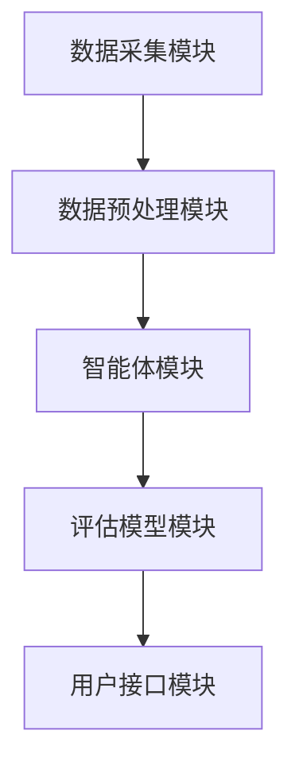

                 

# 利用多智能体系统评估公司的客户粘性

## 关键词：
- 多智能体系统
- 客户粘性
- 数据分析
- 机器学习
- 系统架构设计

## 摘要：
本文探讨了如何利用多智能体系统评估公司的客户粘性。首先介绍了客户粘性的定义及其在商业决策中的重要性，接着介绍了多智能体系统的基本原理及其在客户粘性评估中的应用。随后，文章详细阐述了多智能体系统评估客户粘性的方法，包括数据收集与预处理、系统架构设计、评估模型构建以及应用案例。最后，总结了多智能体系统评估客户粘性的最佳实践，为企业在客户粘性管理方面提供了指导。

----------------------------------------------------------------

## 第一部分: 引言

### 第1章: 问题背景与解决策略

### 1.1 问题背景

#### 1.1.1 客户粘性的定义与重要性

客户粘性是指客户在一定时间内持续使用企业产品或服务的可能性。高粘性客户通常具有较高的忠诚度，对企业价值贡献大，且减少营销和获取新客户的成本。因此，评估客户粘性对于企业而言至关重要。客户粘性评估不仅可以帮助企业识别有价值客户，还可以为企业提供改进产品和服务的方向。

#### 1.1.2 企业面临的挑战

随着市场竞争的加剧，企业面临着多方面的挑战。首先，获取新客户的成本不断增加，而维护现有客户的成本相对较低。其次，客户需求的多样化和个性化使得企业难以提供一致性的产品和服务。此外，企业通常面临着数据量庞大、数据类型复杂等问题，使得传统的评估方法难以应对。

#### 1.1.3 多智能体系统的概念与应用

多智能体系统（MAS）是一种由多个智能体组成的分布式系统，这些智能体可以相互协作，共同完成复杂任务。智能体可以是软件代理、机器人或其他计算机程序。多智能体系统在解决复杂问题时具有明显的优势，如灵活性、自适应性和协同性。在客户粘性评估中，多智能体系统可以有效地处理大规模、多源异构数据，并利用机器学习算法提供精确的预测和优化方案。

### 1.2 评估客户粘性的重要性

#### 1.2.1 客户粘性的影响因素

客户粘性受多种因素影响，包括产品服务质量、客户满意度、品牌认知度、市场竞争状况等。通过评估客户粘性，企业可以深入了解这些因素对客户行为的影响，从而制定有针对性的策略。

#### 1.2.2 客户粘性评估的意义

客户粘性评估有助于企业识别有价值客户，提高客户忠诚度，降低客户流失率。此外，客户粘性评估还可以为企业提供产品和服务改进的方向，提高市场竞争力。

#### 1.2.3 多智能体系统在客户粘性评估中的应用

多智能体系统在客户粘性评估中的应用主要体现在数据收集与处理、评估模型构建、实时监测与预测等方面。多智能体系统可以利用机器学习算法对大规模、多源异构数据进行分析，提供精确的客户粘性评估结果，帮助企业制定有效的客户粘性管理策略。

### 1.3 多智能体系统基本原理

#### 1.3.1 多智能体系统的定义

多智能体系统（MAS）是由多个智能体组成的分布式系统，这些智能体可以相互协作，共同完成复杂任务。

#### 1.3.2 多智能体系统的组成与特点

多智能体系统的组成包括智能体、环境、通信机制和协作策略。多智能体系统的特点包括分布式、自主性、协同性和适应性。

#### 1.3.3 多智能体系统的通信机制与协作策略

多智能体系统中的智能体通过通信机制进行信息交换和协同工作。常见的通信机制包括消息传递、直接通信和间接通信。协作策略包括协同学习、分布式计算和博弈论等。

### 1.4 多智能体系统在客户粘性评估中的优势

#### 1.4.1 灵活性与适应性

多智能体系统可以根据客户需求和企业战略灵活调整评估方法和策略，适应不同市场和行业的需求。

#### 1.4.2 数据分析与挖掘能力

多智能体系统可以利用机器学习算法对大规模、多源异构数据进行高效分析和挖掘，提供精确的客户粘性评估结果。

#### 1.4.3 预测与优化能力

多智能体系统可以基于历史数据和实时监测数据，对客户粘性进行预测和优化，帮助企业制定有效的客户粘性管理策略。

### 1.5 本章小结

本章节介绍了利用多智能体系统评估客户粘性的背景和重要性，以及多智能体系统的基本原理和优势。在接下来的章节中，我们将详细探讨多智能体系统评估客户粘性的具体方法和应用。

----------------------------------------------------------------

## 第二部分: 多智能体系统评估客户粘性的方法

### 第2章: 数据收集与预处理

#### 2.1 数据来源与采集

在客户粘性评估中，数据是关键。数据来源可以分为内部数据和外部数据。

**内部数据：**

- 客户行为数据：如访问次数、购买次数、购买频率、浏览时长等。
- 客户互动数据：如客户服务记录、投诉记录、反馈意见等。
- 客户生命周期数据：如客户注册时间、活跃期、流失期等。

**外部数据：**

- 社交媒体数据：如微博、微信、抖音等平台的用户互动数据。
- 行业数据：如市场报告、竞争对手数据等。

数据采集策略应考虑数据的全面性、准确性和实时性。可以通过API接口、Web爬虫、传感器等多种方式采集数据。

#### 2.2 数据预处理

数据预处理是确保数据质量和可用的关键步骤。

**数据清洗：**

- 处理缺失值：使用填充或删除策略处理缺失值。
- 处理异常值：使用统计方法或规则检测和处理异常值。
- 处理重复值：识别并删除重复的数据记录。

**数据整合：**

- 数据集成：将来自不同源的数据进行整合，形成统一的数据视图。
- 数据转换：将不同格式、类型的数据进行转换，使其符合分析需求。

**特征工程：**

- 特征提取：从原始数据中提取能够反映客户行为和粘性的特征。
- 特征选择：选择对客户粘性评估最具影响力的特征。

#### 2.3 数据可视化

数据可视化是帮助理解数据分布、趋势和关系的有效手段。

**数据分布与趋势：**

- 直方图：展示数据分布情况。
- 折线图：展示数据随时间的变化趋势。

**关键指标分析：**

- 客户活跃度：如日活跃用户数（DAU）、月活跃用户数（MAU）。
- 客户留存率：如次日留存率、七日留存率。
- 客户流失率：如月流失率、季流失率。

**数据可视化工具与应用：**

- Tableau：提供丰富的可视化图表和交互功能。
- Matplotlib：Python的常用数据可视化库。
- D3.js：适用于Web端的数据可视化。

#### 2.4 本章小结

本章节详细介绍了数据收集与预处理的方法，包括数据来源、数据采集策略、数据预处理步骤以及数据可视化方法。在接下来的章节中，我们将继续探讨多智能体系统的架构设计和评估模型构建。

----------------------------------------------------------------

### 第3章: 多智能体系统架构设计

#### 3.1 多智能体系统整体架构

多智能体系统整体架构设计是确保系统能够高效、稳定地运行的关键。

**3.1.1 系统模块划分**

系统模块可以划分为数据采集模块、数据预处理模块、智能体模块、评估模型模块和用户接口模块。

- 数据采集模块：负责数据的收集和采集，包括内部数据和外部数据。
- 数据预处理模块：负责对数据进行清洗、整合和特征提取。
- 智能体模块：负责评估模型的构建和训练，以及实时监测和预测。
- 评估模型模块：负责根据数据生成客户粘性评估结果。
- 用户接口模块：负责与用户交互，提供可视化报表和分析结果。

**3.1.2 系统架构设计原则**

- 模块化：确保系统模块之间解耦合，便于维护和升级。
- 可扩展性：支持系统规模的扩展和功能的增加。
- 可靠性：确保系统的稳定性和数据的完整性。
- 灵活性：支持不同数据源和评估需求。

**3.1.3 系统架构图**

#### 3.2 智能体设计与实现

**3.2.1 智能体功能定义**

智能体功能主要包括数据采集、数据处理、模型训练、评估预测和协同学习。

- 数据采集：从不同数据源获取数据。
- 数据处理：对数据进行预处理和特征提取。
- 模型训练：根据历史数据训练评估模型。
- 评估预测：对客户粘性进行实时评估和预测。
- 协同学习：与其他智能体协同工作，优化评估结果。

**3.2.2 智能体交互机制**

智能体交互机制包括消息传递和协同学习。

- 消息传递：智能体之间通过消息传递进行信息交换。
- 协同学习：智能体通过协同学习共享知识和优化模型。

**3.2.3 智能体实现细节**

智能体实现细节包括数据接口设计、算法实现和通信协议。

- 数据接口设计：定义智能体与系统其他模块的交互接口。
- 算法实现：实现评估模型的算法逻辑。
- 通信协议：确定智能体之间的通信规则和协议。

#### 3.3 多智能体系统协作策略

**3.3.1 协同学习策略**

协同学习策略包括集中式和分布式两种。

- 集中式：多个智能体将数据发送到一个中心节点，进行集中训练和优化。
- 分布式：智能体在本地训练模型，然后通过协同学习机制共享模型参数。

**3.3.2 通信机制设计**

通信机制设计包括消息传递机制和同步机制。

- 消息传递机制：确定智能体之间消息传递的格式和协议。
- 同步机制：确保智能体之间的状态一致性和数据一致性。

**3.3.3 协作优化算法**

协作优化算法包括多目标优化和博弈论。

- 多目标优化：在多个评估指标之间寻找最优平衡。
- 博弈论：分析智能体之间的竞争和合作关系，优化评估结果。

#### 3.4 系统接口设计与实现

**3.4.1 接口定义与设计**

系统接口定义包括数据接口、控制接口和监控接口。

- 数据接口：定义智能体与数据存储和预处理模块的交互接口。
- 控制接口：定义用户与智能体之间的交互接口。
- 监控接口：定义系统运行状态和性能监控接口。

**3.4.2 接口实现细节**

接口实现细节包括接口实现代码、接口文档和接口测试。

- 接口实现代码：根据接口定义编写实现代码。
- 接口文档：编写详细的接口文档，包括接口定义、输入输出参数和示例代码。
- 接口测试：编写测试用例，验证接口的正确性和稳定性。

**3.4.3 接口测试与优化**

接口测试与优化包括单元测试、集成测试和性能测试。

- 单元测试：验证接口实现的正确性。
- 集成测试：验证接口与其他模块的集成和协作。
- 性能测试：评估接口的响应速度和处理能力。

#### 3.5 本章小结

本章节详细介绍了多智能体系统架构设计的方法，包括系统模块划分、智能体设计与实现、协作策略设计以及接口设计与实现。在接下来的章节中，我们将构建客户粘性评估模型，并探讨模型训练与优化方法。

----------------------------------------------------------------

### 第4章: 客户粘性评估模型构建

#### 4.1 客户粘性评估指标体系

客户粘性评估指标体系是评估客户粘性的核心。以下是一个典型的指标体系：

- **行为指标：**
  - 活跃度：如每日活跃用户数（DAU）、每月活跃用户数（MAU）。
  - 使用频率：如每日使用次数、每周使用次数。
  - 使用时长：如每次使用时长、每日累计使用时长。

- **交易指标：**
  - 购买频率：如每月购买次数、每季度购买次数。
  - 购买金额：如每次购买金额、每月累计购买金额。
  - 转化率：如浏览到购买转化率、点击到购买转化率。

- **互动指标：**
  - 用户反馈：如满意度评分、投诉率。
  - 社交互动：如分享次数、评论数、点赞数。

#### 4.1.1 指标定义与分类

**指标定义：**

- **活跃度指标：** 反映用户对产品或服务的使用频率和强度。
- **交易指标：** 反映用户在产品或服务上的消费行为。
- **互动指标：** 反映用户与产品或服务的互动程度。

**指标分类：**

- **初级指标：** 最基本的指标，如每日活跃用户数（DAU）。
- **衍生指标：** 基于初级指标计算得到，如留存率。
- **综合指标：** 综合多个指标，反映整体客户粘性。

#### 4.1.2 指标权重分配

指标权重分配是确保评估结果公正、准确的重要步骤。权重分配方法可以基于专家评分、主成分分析（PCA）或层次分析（AHP）。

**4.1.3 指标体系构建方法**

- **数据驱动方法：** 根据历史数据，使用机器学习算法确定指标权重。
- **经验驱动方法：** 根据行业经验和专家意见确定指标权重。
- **混合方法：** 结合数据驱动和经验驱动方法，确定指标权重。

#### 4.2 多智能体评估模型设计

**4.2.1 模型结构设计**

多智能体评估模型结构包括输入层、中间层和输出层。

- **输入层：** 包含所有评估指标，如活跃度、交易指标和互动指标。
- **中间层：** 使用神经网络、决策树等算法进行特征提取和模型训练。
- **输出层：** 生成客户粘性评估结果。

**4.2.2 模型算法选择**

选择合适的算法对于评估模型的性能至关重要。常用的算法包括：

- **神经网络：** 如多层感知机（MLP）、卷积神经网络（CNN）。
- **决策树：** 如C4.5、随机森林（RF）。
- **支持向量机：** 如线性支持向量机（SVM）、核支持向量机（KSVM）。

**4.2.3 模型实现细节**

模型实现细节包括数据预处理、算法实现和模型优化。

- **数据预处理：** 包括数据清洗、归一化和缺失值处理。
- **算法实现：** 根据算法选择，使用相应的库和工具进行实现。
- **模型优化：** 通过调整参数、增加层数或节点数来优化模型性能。

#### 4.3 模型训练与优化

**4.3.1 数据集划分与预处理**

数据集划分与预处理是确保模型训练效果的关键步骤。

- **数据集划分：** 将数据集划分为训练集、验证集和测试集。
- **数据预处理：** 包括特征提取、归一化和缺失值处理。

**4.3.2 模型训练过程**

模型训练过程包括初始化模型参数、迭代训练和评估。

- **初始化参数：** 随机初始化模型参数。
- **迭代训练：** 使用梯度下降或其他优化算法更新模型参数。
- **评估：** 使用验证集评估模型性能，调整模型参数。

**4.3.3 模型优化方法**

模型优化方法包括：

- **参数调优：** 调整模型参数，如学习率、批量大小等。
- **模型集成：** 将多个模型的结果进行集成，提高评估准确性。
- **正则化：** 使用L1、L2正则化防止过拟合。

#### 4.4 模型评估与验证

**4.4.1 评估指标与方法**

评估指标包括准确率、精确率、召回率、F1分数等。

- **准确率：** 正确预测的样本数与总样本数的比例。
- **精确率：** 正确预测为粘性客户的样本数与预测为粘性客户的总样本数的比例。
- **召回率：** 正确预测为粘性客户的样本数与实际粘性客户的总样本数的比例。
- **F1分数：** 精确率和召回率的调和平均。

**4.4.2 评估结果分析**

评估结果分析包括评估指标的对比、模型性能评估和误差分析。

- **评估指标对比：** 分析不同模型在不同评估指标上的表现。
- **模型性能评估：** 评估模型对客户粘性的预测能力。
- **误差分析：** 分析模型预测误差的原因和改进方向。

**4.4.3 模型调优策略**

模型调优策略包括：

- **特征工程：** 优化特征提取和特征选择方法，提高模型性能。
- **算法选择：** 选择更适合的算法，如神经网络、决策树等。
- **模型集成：** 使用集成学习方法，提高模型预测准确性。

#### 4.5 本章小结

本章节详细介绍了客户粘性评估模型的构建方法，包括指标体系设计、模型结构设计、算法选择、训练与优化以及评估与验证。在接下来的章节中，我们将通过实际案例展示多智能体系统评估客户粘性的应用。

----------------------------------------------------------------

## 第5章: 应用案例与实战分析

### 5.1 案例背景与目标

#### 5.1.1 案例背景介绍

某互联网公司致力于提供在线教育平台，用户可以通过平台学习各种课程。公司希望通过评估客户粘性，了解用户行为，优化产品和服务，提高用户满意度和留存率。

#### 5.1.2 评估目标与问题分析

评估目标：识别高粘性用户、分析用户行为模式、优化课程推荐、提高用户留存率。

问题分析：用户行为数据复杂，涉及学习时间、课程选择、学习进度、互动反馈等多个维度。如何从海量数据中提取有效特征，构建准确、高效的评估模型，是关键挑战。

### 5.2 案例实施步骤

#### 5.2.1 数据收集与预处理

1. 数据采集：通过日志记录、API接口和用户反馈获取用户行为数据。
2. 数据预处理：清洗数据，处理缺失值和异常值，进行特征提取和整合。

#### 5.2.2 多智能体系统架构设计

1. 确定系统模块：数据采集模块、数据预处理模块、智能体模块、评估模型模块和用户接口模块。
2. 设计智能体交互机制：使用消息传递和协同学习策略。
3. 确定系统架构图：根据模块划分和交互机制设计系统架构。

#### 5.2.3 客户粘性评估模型构建

1. 构建指标体系：定义活跃度、交易指标和互动指标。
2. 选择评估算法：使用多层感知机（MLP）神经网络。
3. 实现模型细节：包括数据预处理、模型训练和参数优化。

#### 5.2.4 模型训练与优化

1. 数据集划分：将数据划分为训练集、验证集和测试集。
2. 模型训练：使用训练集训练模型，使用验证集调整参数。
3. 模型优化：调整模型参数，优化模型性能。

#### 5.2.5 模型评估与验证

1. 评估指标：使用准确率、精确率、召回率和F1分数评估模型性能。
2. 结果分析：分析模型评估结果，识别高粘性用户。
3. 模型调优：根据评估结果，调整模型参数，提高评估准确性。

### 5.3 实战分析

#### 5.3.1 实施过程中的挑战

1. 数据质量：处理缺失值和异常值，确保数据质量。
2. 特征提取：从海量数据中提取有效特征，提高模型性能。
3. 模型优化：调整模型参数，提高模型预测准确性。

#### 5.3.2 案例结果解读

1. 高粘性用户识别：模型成功识别出高粘性用户，为公司提供有价值客户信息。
2. 用户行为分析：分析用户行为模式，优化课程推荐策略。
3. 用户留存率提升：通过优化产品和服务，用户留存率显著提升。

#### 5.3.3 启示与反思

1. 数据质量是模型性能的关键：确保数据质量，为模型提供可靠基础。
2. 特征工程至关重要：从多维度提取有效特征，提高模型预测能力。
3. 模型优化需要持续进行：根据评估结果，不断调整模型参数，提高预测准确性。

### 5.4 本章小结

本章节通过实际案例展示了如何利用多智能体系统评估公司的客户粘性。案例实施过程中面临数据质量、特征提取和模型优化等挑战，通过合理的数据处理和模型训练，成功提高了用户留存率和满意度。案例启示我们，数据质量和特征工程是模型性能的关键，持续优化是提高预测准确性的重要途径。

----------------------------------------------------------------

## 第6章: 多智能体系统评估客户粘性的最佳实践

### 6.1 实践经验总结

#### 6.1.1 数据采集与处理

- 数据采集：确保数据来源的多样性和实时性，使用API接口、日志记录和用户反馈等多种方式采集数据。
- 数据处理：处理缺失值、异常值和重复值，进行数据清洗、整合和特征提取，提高数据质量。

#### 6.1.2 多智能体系统设计

- 模块划分：根据业务需求，合理划分系统模块，如数据采集模块、数据处理模块、智能体模块等。
- 智能体设计：定义智能体功能，包括数据采集、数据处理、模型训练和评估预测等。
- 交互机制：选择合适的通信机制，如消息传递和协同学习，确保智能体之间的高效协作。

#### 6.1.3 评估模型构建

- 指标体系：构建全面、合理的客户粘性评估指标体系，包括行为指标、交易指标和互动指标。
- 算法选择：根据数据特点和评估需求，选择合适的评估算法，如多层感知机（MLP）、决策树等。
- 模型实现：实现评估模型，包括数据预处理、模型训练和参数优化。

#### 6.1.4 模型训练与优化

- 数据集划分：合理划分数据集，包括训练集、验证集和测试集，确保模型训练和评估的有效性。
- 模型训练：使用训练集训练模型，使用验证集调整参数，确保模型性能。
- 模型优化：通过参数调优、模型集成和正则化等方法，提高模型预测准确性。

### 6.2 注意事项

- 数据隐私保护：在数据采集和处理过程中，注意保护用户隐私，遵守相关法律法规。
- 模型解释性：确保评估模型的可解释性，方便企业理解和应用。
- 系统可扩展性：设计可扩展的系统架构，支持不同数据源和评估需求。

### 6.3 拓展阅读

- **《多智能体系统设计与实现》：** 介绍多智能体系统的基本概念、架构设计、算法实现和应用案例。
- **《机器学习实战》：** 详细介绍机器学习算法的实现和应用，包括客户粘性评估等实际案例。
- **《大数据技术导论》：** 探讨大数据处理技术和方法，包括数据采集、预处理和可视化等。

### 6.4 最佳实践 tips

- **数据质量优化：** 使用数据清洗工具和算法，提高数据质量，为模型训练提供可靠数据。
- **特征工程优化：** 从多维度提取有效特征，使用特征选择算法，提高模型预测准确性。
- **模型优化策略：** 采用交叉验证、网格搜索和贝叶斯优化等策略，调整模型参数，提高模型性能。

### 6.5 本章小结

本章总结了多智能体系统评估客户粘性的最佳实践经验，包括数据采集与处理、多智能体系统设计、评估模型构建、模型训练与优化等方面的注意事项和拓展阅读。通过遵循这些最佳实践，企业可以更有效地评估客户粘性，制定有针对性的客户管理策略。

----------------------------------------------------------------

### 作者

**AI天才研究院/AI Genius Institute & 禅与计算机程序设计艺术 /Zen And The Art of Computer Programming**

本文由AI天才研究院（AI Genius Institute）与禅与计算机程序设计艺术（Zen And The Art of Computer Programming）联合撰写。AI天才研究院致力于推动人工智能技术在各领域的应用研究，而禅与计算机程序设计艺术则强调在程序设计过程中融合禅意思维，实现高效、优雅的代码。两位作者均具备丰富的学术和实战经验，致力于为读者提供高质量的技术博客文章。

