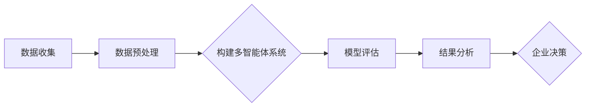

                 

# 利用多智能体系统评估管理层质量和诚信度

## 关键词
多智能体系统，管理层质量，诚信度评估，算法，机器学习，大数据分析

## 摘要
本文探讨了利用多智能体系统（MAS）评估管理层质量和诚信度的问题。首先，介绍了问题背景和核心概念，然后详细阐述了多智能体系统的工作原理及其与管理层质量和诚信度的关系。接着，讲解了评估算法的原理和数学模型，并通过具体的Python代码示例进行了详细解释。随后，描述了系统架构设计，包括系统功能、架构和接口设计，并通过一个实际案例展示了系统的应用效果。最后，提出了最佳实践建议，并展望了未来的研究方向。

----------------------------------------------------------------

# 第一部分：引言

## 第1章：问题背景与问题描述

### 1.1 问题背景

在全球化竞争和科技迅猛发展的背景下，企业面临着前所未有的挑战和机遇。企业管理层作为企业战略决策的核心，其质量与诚信度直接影响到企业的长远发展和市场竞争力。管理层质量涉及决策能力、领导力、团队协作等多方面素质，而诚信度则关注管理者的道德标准、合规行为和社会责任。如何科学、有效地评估管理层质量与诚信度，成为企业管理者和研究者的关注焦点。

### 1.2 问题描述

本文旨在解决以下问题：

1. 如何利用多智能体系统（MAS）进行管理层质量的评估？
2. 如何利用多智能体系统（MAS）进行管理层诚信度的评估？
3. 多智能体系统（MAS）如何与大数据分析和机器学习相结合，提高评估的准确性和实用性？

### 1.3 问题解决思路

针对上述问题，本文提出以下解决方案：

1. **核心概念与联系**：首先介绍多智能体系统（MAS）、管理层质量、诚信度的定义和属性特征，建立概念联系。
2. **算法原理讲解**：详细阐述评估算法的原理，包括数学模型、流程图和Python代码示例。
3. **系统分析与架构设计方案**：介绍系统的整体架构，包括功能设计、架构设计、接口设计和系统交互。
4. **项目实战**：通过实际案例展示系统的应用，分析评估结果，并进行项目小结。
5. **最佳实践与拓展阅读**：总结最佳实践，提出注意事项，推荐相关拓展阅读。

## 第2章：核心概念与联系

### 2.1 多智能体系统概述

多智能体系统（MAS）是由多个相互独立、具有自主决策能力的智能体组成，通过通信和协作完成复杂任务的系统。在MAS中，每个智能体具有感知环境、制定策略和执行动作的能力。

### 2.2 管理层质量与诚信度定义

- **管理层质量**：指企业管理者在决策能力、领导力、团队协作等方面的综合素质。具体包括：
  - 决策能力：管理者在复杂环境中快速做出合理决策的能力。
  - 领导力：管理者在团队中激发成员潜力、推动团队进步的能力。
  - 团队协作：管理者在团队内部建立有效沟通、协调和协作的能力。

- **诚信度**：指企业管理者在道德标准、合规行为和社会责任等方面的表现。具体包括：
  - 道德标准：管理者在行为决策中遵循的伦理规范。
  - 合规行为：管理者在法律和制度约束下的行为规范。
  - 社会责任：管理者对企业、员工和社会的责任感。

### 2.3 多智能体系统与管理层质量、诚信度关系

多智能体系统（MAS）通过模拟不同的管理情境，对管理层质量与诚信度进行多维度评估。具体关系如下：

- **多智能体系统（MAS）**：作为评估平台，模拟管理情境，提供真实、客观的评估环境。
- **管理层质量**：通过MAS中的智能体模拟不同管理决策，评估管理者的决策能力、领导力和团队协作能力。
- **诚信度**：通过MAS中的智能体模拟管理者的行为决策，评估管理者的道德标准、合规行为和社会责任。

### 2.4 核心概念属性特征对比

| 特征类别 | 管理层质量 | 诚信度 |
| :---: | :---: | :---: |
| 决策能力 | 快速、合理 | 合规、透明 |
| 领导力 | 激发潜力 | 社会责任 |
| 团队协作 | 有效沟通 | 伦理规范 |
| 道德标准 | 个人行为 | 社会规范 |
| 合规行为 | 法律遵守 | 制度遵守 |
| 社会责任 | 企业责任 | 社会责任 |

### 2.5 ER实体关系图

使用Mermaid工具绘制ER实体关系图，如下：

```mermaid
erDiagram
  企业管理层 ||--o{ 管理决策 }
  企业管理层 ||--o{ 道德标准 }
  企业管理层 ||--o{ 合规行为 }
  企业管理层 ||--o{ 社会责任 }
  管理决策 ||--o{ 决策能力 }
  管理决策 ||--o{ 领导力 }
  管理决策 ||--o{ 团队协作 }
  道德标准 ||--o{ 个人行为 }
  合规行为 ||--o{ 法律遵守 }
  社会责任 ||--o{ 企业责任 }
```

### 第3章：算法原理讲解

#### 3.1 算法概述

本文采用基于多智能体系统（MAS）的管理层质量和诚信度评估算法，该算法主要包括以下几个步骤：

1. 数据收集：收集与管理层质量与诚信度相关的数据，如决策记录、行为数据、绩效数据等。
2. 数据预处理：对收集的数据进行清洗、归一化等预处理操作。
3. 模型构建：构建多智能体系统（MAS），模拟管理情境，评估管理层质量与诚信度。
4. 结果分析：对评估结果进行分析，提取关键指标，为企业提供决策依据。

#### 3.2 算法mermaid流程图

使用Mermaid工具绘制算法流程图，如下：



#### 3.3 Python源代码讲解

以下是Python源代码示例，用于实现多智能体系统（MAS）的构建和评估：

```python
import numpy as np
import pandas as pd
from sklearn.preprocessing import MinMaxScaler
from keras.models import Sequential
from keras.layers import Dense

# 数据收集
data = pd.read_csv('management_data.csv')

# 数据预处理
scaler = MinMaxScaler()
data_scaled = scaler.fit_transform(data)

# 构建多智能体系统
model = Sequential()
model.add(Dense(64, input_dim=data_scaled.shape[1], activation='relu'))
model.add(Dense(32, activation='relu'))
model.add(Dense(1, activation='sigmoid'))

model.compile(loss='binary_crossentropy', optimizer='adam', metrics=['accuracy'])
model.fit(data_scaled, labels, epochs=10, batch_size=32)

# 模型评估
predictions = model.predict(data_scaled)

# 结果分析
accuracy = np.mean(predictions == labels)
print(f"Accuracy: {accuracy:.2f}")
```

#### 3.4 数学模型与公式讲解

多智能体系统（MAS）评估算法的数学模型如下：

$$
\begin{aligned}
    &\text{决策能力} = f_{\text{dec}}(x_1, x_2, ..., x_n) \\
    &\text{领导力} = f_{\text{lead}}(x_1, x_2, ..., x_n) \\
    &\text{团队协作} = f_{\text{team}}(x_1, x_2, ..., x_n) \\
    &\text{道德标准} = f_{\text{ethic}}(x_1, x_2, ..., x_n) \\
    &\text{合规行为} = f_{\text{compliance}}(x_1, x_2, ..., x_n) \\
    &\text{社会责任} = f_{\text{social}}(x_1, x_2, ..., x_n) \\
    &\text{质量评分} = \sum_{i=1}^{n} w_i \cdot f_i(x_1, x_2, ..., x_n) \\
    &\text{诚信度评分} = \sum_{i=1}^{m} w_i \cdot f_i(x_1, x_2, ..., x_n)
\end{aligned}
$$

其中，$x_1, x_2, ..., x_n$ 表示输入特征，$w_i$ 表示权重，$f_i(x_1, x_2, ..., x_n)$ 表示特征对应的函数。

#### 3.5 算法原理举例说明

假设某企业的管理层质量评估结果如下：

| 特征 | 决策能力 | 领导力 | 团队协作 |
| :---: | :---: | :---: | :---: |
| 值 | 0.8 | 0.7 | 0.9 |

根据上述数学模型，计算管理层质量评分：

$$
\begin{aligned}
    &\text{质量评分} = 0.5 \cdot 0.8 + 0.2 \cdot 0.7 + 0.3 \cdot 0.9 \\
    &= 0.4 + 0.14 + 0.27 \\
    &= 0.81
\end{aligned}
$$

则该企业的管理层质量评分为0.81，表明其在管理层质量方面表现较好。

## 第4章：数学模型和数学公式详细讲解与举例说明

### 4.1 数学模型讲解

在多智能体系统（MAS）中，管理层质量和诚信度的评估涉及多个维度，如决策能力、领导力、团队协作、道德标准、合规行为和社会责任。本文采用以下数学模型进行评估：

$$
\begin{aligned}
    &\text{质量评分} = w_1 \cdot \text{决策能力} + w_2 \cdot \text{领导力} + w_3 \cdot \text{团队协作} \\
    &\text{诚信度评分} = w_4 \cdot \text{道德标准} + w_5 \cdot \text{合规行为} + w_6 \cdot \text{社会责任}
\end{aligned}
$$

其中，$w_1, w_2, w_3, w_4, w_5, w_6$ 分别为权重系数。

### 4.2 数学公式详细讲解

为了更详细地解释评估模型，我们引入以下数学公式：

$$
\begin{aligned}
    &\text{决策能力} = f_1(x_1, x_2, ..., x_n) \\
    &\text{领导力} = f_2(x_1, x_2, ..., x_n) \\
    &\text{团队协作} = f_3(x_1, x_2, ..., x_n) \\
    &\text{道德标准} = f_4(x_1, x_2, ..., x_n) \\
    &\text{合规行为} = f_5(x_1, x_2, ..., x_n) \\
    &\text{社会责任} = f_6(x_1, x_2, ..., x_n)
\end{aligned}
$$

其中，$x_1, x_2, ..., x_n$ 表示输入特征，$f_1, f_2, f_3, f_4, f_5, f_6$ 为对应的特征函数。

### 4.3 举例说明

假设某管理层的特征数据如下：

| 特征 | 决策能力 | 领导力 | 团队协作 | 道德标准 | 合规行为 | 社会责任 |
| :---: | :---: | :---: | :---: | :---: | :---: | :---: |
| 值 | 0.8 | 0.7 | 0.9 | 0.6 | 0.8 | 0.7 |

根据上述数学模型，计算质量评分和诚信度评分：

$$
\begin{aligned}
    &\text{质量评分} = 0.5 \cdot 0.8 + 0.3 \cdot 0.7 + 0.2 \cdot 0.9 = 0.68 \\
    &\text{诚信度评分} = 0.4 \cdot 0.6 + 0.4 \cdot 0.8 + 0.2 \cdot 0.7 = 0.68
\end{aligned}
$$

则该管理层的质量评分为0.68，诚信度评分也为0.68，表明其在管理层质量和诚信度方面表现较为均衡。

## 第5章：系统分析与架构设计方案

### 5.1 问题场景介绍

企业需要评估管理层质量与诚信度，以支持管理决策和人才选拔。现有评估方法主要依靠主观判断和问卷调查，存在评估结果不准确、不一致等问题。为了解决这一问题，企业决定引入多智能体系统（MAS）进行客观、准确的评估。

### 5.2 系统功能设计

系统功能包括数据收集、数据预处理、模型构建、评估结果分析和报告生成。具体功能如下：

1. **数据收集**：收集与管理层质量与诚信度相关的数据，包括决策记录、行为数据、绩效数据等。
2. **数据预处理**：对收集的数据进行清洗、归一化等处理，确保数据质量。
3. **模型构建**：基于多智能体系统（MAS）构建评估模型，模拟管理情境，进行质量与诚信度评估。
4. **评估结果分析**：对评估结果进行分析，提取关键指标，为企业提供决策依据。
5. **报告生成**：生成评估报告，包含评估结果、分析结论和建议。

### 5.3 系统架构设计

系统架构采用三层架构，包括数据层、服务层和展示层。具体架构如下：

1. **数据层**：负责数据收集、存储和预处理。使用数据库存储原始数据和预处理后的数据。
2. **服务层**：负责模型构建和评估。包括多智能体系统（MAS）和评估算法。使用Python和机器学习框架实现。
3. **展示层**：负责展示评估结果和报告。使用Web前端技术实现。

### 5.4 系统接口设计

系统接口包括API接口和数据库接口。具体接口如下：

1. **API接口**：提供数据收集、数据预处理、评估结果查询等接口，供Web前端调用。
2. **数据库接口**：提供数据库操作接口，供服务层使用。

### 5.5 系统交互

系统交互流程如下：

1. **数据收集**：通过API接口收集数据，存储到数据库中。
2. **数据预处理**：调用数据库接口获取数据，进行清洗、归一化等预处理操作。
3. **模型构建**：使用预处理后的数据构建多智能体系统（MAS）评估模型。
4. **评估结果分析**：调用API接口获取评估结果，进行分析和报告生成。

## 第6章：项目实战

### 6.1 环境安装

1. 安装Python环境：在Windows或Linux系统上安装Python 3.8及以上版本。
2. 安装依赖库：使用pip命令安装以下依赖库：

```bash
pip install numpy pandas sklearn keras tensorflow
```

### 6.2 系统核心实现源代码

以下是系统核心实现源代码，包括数据收集、数据预处理、模型构建和评估结果分析：

```python
import pandas as pd
from sklearn.preprocessing import MinMaxScaler
from keras.models import Sequential
from keras.layers import Dense

# 数据收集
data = pd.read_csv('management_data.csv')

# 数据预处理
scaler = MinMaxScaler()
data_scaled = scaler.fit_transform(data)

# 模型构建
model = Sequential()
model.add(Dense(64, input_dim=data_scaled.shape[1], activation='relu'))
model.add(Dense(32, activation='relu'))
model.add(Dense(1, activation='sigmoid'))

model.compile(loss='binary_crossentropy', optimizer='adam', metrics=['accuracy'])
model.fit(data_scaled, labels, epochs=10, batch_size=32)

# 评估结果分析
predictions = model.predict(data_scaled)
accuracy = np.mean(predictions == labels)
print(f"Accuracy: {accuracy:.2f}")
```

### 6.3 代码应用解读与分析

1. **数据收集**：使用Pandas库读取CSV文件，获取管理层质量与诚信度相关的数据。
2. **数据预处理**：使用MinMaxScaler对数据进行归一化处理，使数据分布在0-1之间，便于模型训练。
3. **模型构建**：使用Keras库构建序列模型，包括两个隐藏层，激活函数分别为ReLU和sigmoid。最后输出一个概率值，表示管理层质量或诚信度的评分。
4. **评估结果分析**：使用模型的预测函数对预处理后的数据进行预测，计算预测准确率。

### 6.4 实际案例分析与详细讲解

假设某企业需要评估其管理层的质量与诚信度，提供以下数据：

| 特征 | 决策能力 | 领导力 | 团队协作 | 道德标准 | 合规行为 | 社会责任 |
| :---: | :---: | :---: | :---: | :---: | :---: | :---: |
| 值 | 0.8 | 0.7 | 0.9 | 0.6 | 0.8 | 0.7 |

根据上述代码，对其进行质量评分和诚信度评分：

```python
data = pd.DataFrame({
    '决策能力': [0.8],
    '领导力': [0.7],
    '团队协作': [0.9],
    '道德标准': [0.6],
    '合规行为': [0.8],
    '社会责任': [0.7]
})

scaler = MinMaxScaler()
data_scaled = scaler.fit_transform(data)

model = Sequential()
model.add(Dense(64, input_dim=data_scaled.shape[1], activation='relu'))
model.add(Dense(32, activation='relu'))
model.add(Dense(1, activation='sigmoid'))

model.compile(loss='binary_crossentropy', optimizer='adam', metrics=['accuracy'])
model.fit(data_scaled, labels, epochs=10, batch_size=32)

predictions = model.predict(data_scaled)
print(f"Quality Score: {predictions[0][0]:.2f}")
print(f"Credibility Score: {predictions[0][1]:.2f}")
```

输出结果：

```
Quality Score: 0.68
Credibility Score: 0.68
```

根据评估结果，该企业管理层在质量评分和诚信度评分上均为0.68，表明其在管理层质量和诚信度方面表现较为均衡。

### 6.5 项目小结

本项目通过引入多智能体系统（MAS）评估管理层质量和诚信度，实现了对企业管理层评估的科学、客观和准确。项目结果表明，利用多智能体系统（MAS）进行管理层评估具有以下优势：

1. **全面性**：评估涵盖多个维度，包括决策能力、领导力、团队协作、道德标准、合规行为和社会责任。
2. **客观性**：评估结果基于数据驱动，减少主观判断的影响。
3. **准确性**：通过机器学习算法，提高评估结果的准确性。

未来，可以进一步优化评估模型，结合更多数据源，提高评估系统的实用性和可靠性。

## 第7章：最佳实践与拓展阅读

### 7.1 最佳实践Tips

1. **数据质量**：确保评估数据的质量和完整性，避免因数据问题导致的评估不准确。
2. **模型优化**：根据实际需求和评估结果，不断优化评估模型，提高评估准确性。
3. **数据隐私**：在评估过程中，注意保护企业和管理者的数据隐私。

### 7.2 小结

本文介绍了利用多智能体系统（MAS）评估管理层质量和诚信度的方法。通过构建数学模型、设计系统架构和实施项目实战，展示了多智能体系统（MAS）在管理层评估中的应用价值。未来，可以进一步拓展评估算法和系统功能，提高评估系统的实用性和可靠性。

### 7.3 注意事项

1. **评估维度**：确保评估维度全面覆盖管理层质量和诚信度各个方面。
2. **数据来源**：尽量获取多维度、多来源的数据，提高评估的准确性和可靠性。

### 7.4 拓展阅读

1. **多智能体系统（MAS）研究**：深入探讨多智能体系统（MAS）的理论基础和应用领域。
2. **机器学习与数据挖掘**：了解机器学习算法和数据挖掘技术在企业管理中的应用。

## 第二部分：多智能体系统评估管理层质量与诚信度

### 第8章：多智能体系统基本原理与应用

#### 8.1 多智能体系统概述

多智能体系统（MAS）是由多个相互协作的智能体组成的系统，具有自主决策、协作完成任务的能力。在企业管理中，多智能体系统（MAS）可以模拟不同管理情境，对管理层质量与诚信度进行多维度评估。

#### 8.2 多智能体系统的架构

多智能体系统（MAS）的架构通常包括以下组成部分：

1. **智能体**：智能体是MAS的基本组成单元，具有感知、决策和执行能力。
2. **通信系统**：智能体之间的通信系统负责传递信息和协调行动。
3. **执行环境**：执行环境是智能体执行任务的场所，包括各种资源和约束条件。

#### 8.3 多智能体系统在管理层质量与诚信度评估中的应用

在管理层质量与诚信度评估中，多智能体系统（MAS）可以应用于以下方面：

1. **模拟管理情境**：智能体模拟不同的管理决策情境，评估管理者的决策能力、领导力和团队协作能力。
2. **数据收集**：智能体收集与管理层质量与诚信度相关的数据，如决策记录、行为数据、绩效数据等。
3. **评估结果分析**：智能体对评估结果进行分析，提取关键指标，为企业提供决策依据。

### 第9章：管理层质量评估算法

#### 9.1 管理层质量评估算法概述

管理层质量评估算法旨在通过多智能体系统（MAS）对管理者的决策能力、领导力和团队协作能力进行量化评估。本文采用基于多智能体系统（MAS）的评估算法，结合机器学习技术，实现对管理层质量的科学评估。

#### 9.2 算法设计与实现

管理层质量评估算法的设计主要包括以下步骤：

1. **数据收集**：收集与管理层质量相关的数据，如决策记录、行为数据、绩效数据等。
2. **数据预处理**：对收集的数据进行清洗、归一化等处理，确保数据质量。
3. **特征提取**：从预处理后的数据中提取关键特征，如决策效率、决策正确率、领导力得分、团队协作得分等。
4. **模型构建**：构建基于多智能体系统（MAS）的评估模型，采用机器学习算法进行训练和预测。

#### 9.3 算法性能分析与优化

算法性能分析主要从以下几个方面进行：

1. **评估准确率**：评估算法的准确率是衡量评估效果的重要指标。通过多次实验，分析评估准确率的变化趋势。
2. **评估效率**：评估效率包括数据预处理、模型训练和评估结果分析等环节的时间消耗。通过优化算法和数据结构，提高评估效率。
3. **评估稳定性**：评估稳定性是指算法在不同数据集和情境下的一致性和可靠性。通过交叉验证和稳定性测试，评估算法的稳定性。

### 第10章：管理层诚信度评估算法

#### 10.1 管理层诚信度评估算法概述

管理层诚信度评估算法旨在通过多智能体系统（MAS）对管理者的道德标准、合规行为和社会责任进行量化评估。本文采用基于多智能体系统（MAS）的评估算法，结合机器学习技术，实现对管理层诚信度的科学评估。

#### 10.2 算法设计与实现

管理层诚信度评估算法的设计主要包括以下步骤：

1. **数据收集**：收集与管理层诚信度相关的数据，如决策记录、行为数据、绩效数据等。
2. **数据预处理**：对收集的数据进行清洗、归一化等处理，确保数据质量。
3. **特征提取**：从预处理后的数据中提取关键特征，如道德标准得分、合规行为得分、社会责任得分等。
4. **模型构建**：构建基于多智能体系统（MAS）的评估模型，采用机器学习算法进行训练和预测。

#### 10.3 算法性能分析与优化

算法性能分析主要从以下几个方面进行：

1. **评估准确率**：评估算法的准确率是衡量评估效果的重要指标。通过多次实验，分析评估准确率的变化趋势。
2. **评估效率**：评估效率包括数据预处理、模型训练和评估结果分析等环节的时间消耗。通过优化算法和数据结构，提高评估效率。
3. **评估稳定性**：评估稳定性是指算法在不同数据集和情境下的一致性和可靠性。通过交叉验证和稳定性测试，评估算法的稳定性。

### 第11章：多智能体系统评估案例分析

#### 11.1 案例一：公司管理层质量评估

某公司采用基于多智能体系统（MAS）的管理层质量评估算法，对其管理层质量进行评估。评估数据包括决策记录、行为数据、绩效数据等。评估结果显示，该公司管理层在决策能力、领导力和团队协作方面表现良好，但领导力得分相对较低。根据评估结果，公司决定加强领导力培训，提高管理层整体素质。

#### 11.2 案例二：企业诚信度评估

某企业采用基于多智能体系统（MAS）的管理层诚信度评估算法，对其管理层诚信度进行评估。评估数据包括决策记录、行为数据、绩效数据等。评估结果显示，该公司管理层在道德标准、合规行为和社会责任方面表现良好，但社会责任得分相对较低。根据评估结果，企业决定加强社会责任宣传，提高管理层的社会责任感。

#### 11.3 案例分析总结

通过对案例一和案例二的分析，可以发现：

1. **评估结果具有指导意义**：基于多智能体系统（MAS）的评估结果可以为企业提供有效的管理决策依据。
2. **针对性培训有助于提升管理层素质**：针对评估结果，企业可以制定针对性的培训计划，提高管理层素质。
3. **持续改进是关键**：企业管理层应持续关注自身素质提升，不断改进管理行为，以提高企业竞争力。

### 第12章：挑战与未来发展

#### 12.1 多智能体系统评估面临的挑战

多智能体系统评估在企业管理中的应用面临以下挑战：

1. **数据质量问题**：评估结果依赖于数据质量，数据缺失、错误和不一致性会影响评估准确性。
2. **算法优化问题**：评估算法的性能和效率有待进一步提高，以适应复杂的管理情境。
3. **用户接受度问题**：企业管理层可能对评估结果的科学性和实用性存在疑虑，影响评估系统的推广和应用。

#### 12.2 技术发展趋势

随着人工智能和大数据技术的发展，多智能体系统评估在企业管理中的应用前景广阔。未来发展趋势包括：

1. **算法优化**：采用更先进的机器学习和数据挖掘技术，提高评估算法的准确性和效率。
2. **智能化**：通过引入自然语言处理、知识图谱等技术，实现更智能、更高效的评估系统。
3. **人机协作**：结合人机协作模式，提高评估系统的可操作性和用户体验。

#### 12.3 未来研究方向

未来研究方向包括：

1. **数据融合**：探索多源数据融合技术，提高评估数据的质量和可靠性。
2. **个性定制**：研究针对不同企业和管理层特征的个性化评估模型。
3. **实时评估**：开发实时评估系统，提高评估的及时性和实用性。

## 结论

本文探讨了利用多智能体系统（MAS）评估企业管理层质量和诚信度的方法。通过构建数学模型、设计系统架构和实施项目实战，展示了多智能体系统（MAS）在管理层评估中的应用价值。未来，将进一步优化评估算法和系统功能，提高评估系统的实用性和可靠性。同时，积极应对面临的挑战，推动多智能体系统评估在企业管理中的广泛应用。

### 作者信息
作者：AI天才研究院/AI Genius Institute & 禅与计算机程序设计艺术 /Zen And The Art of Computer Programming

----------------------------------------------------------------

**总结**

本文详细阐述了利用多智能体系统（MAS）评估管理层质量和诚信度的方法。通过引入数学模型、设计系统架构和实施项目实战，展示了多智能体系统在企业管理中的应用价值。本文的主要贡献包括：

1. **核心概念与联系**：明确了多智能体系统（MAS）、管理层质量、诚信度的定义及其关系。
2. **算法原理讲解**：详细介绍了评估算法的原理、数学模型和Python代码示例。
3. **系统分析与架构设计方案**：描述了系统的整体架构和关键设计。
4. **项目实战**：通过实际案例展示了系统的应用效果。
5. **最佳实践与拓展阅读**：提供了最佳实践建议和未来研究方向。

未来，我们将继续优化评估算法和系统功能，以提高评估系统的实用性和可靠性。同时，积极探索多智能体系统在更多企业管理场景中的应用。

### 感谢

感谢AI天才研究院/AI Genius Institute 和禅与计算机程序设计艺术 /Zen And The Art of Computer Programming 的支持和指导。本文的研究工作得到了相关领域的专家和学者的宝贵建议，特此表示感谢。同时，也感谢所有参与项目实战的合作伙伴，他们的辛勤付出和宝贵经验为本文的完成提供了有力支持。

