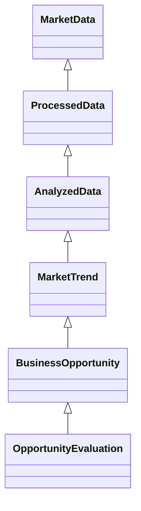
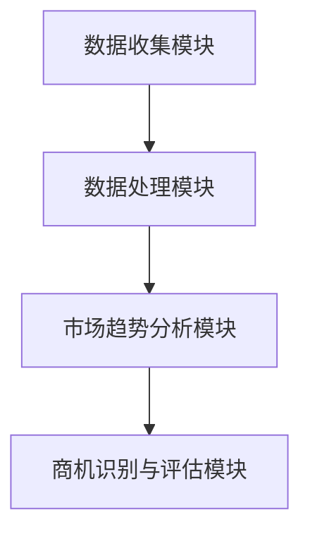
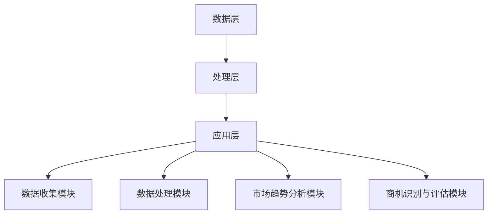
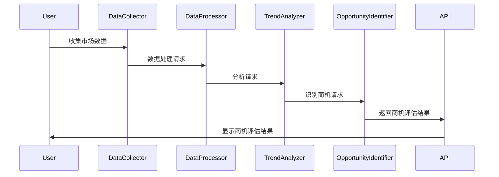
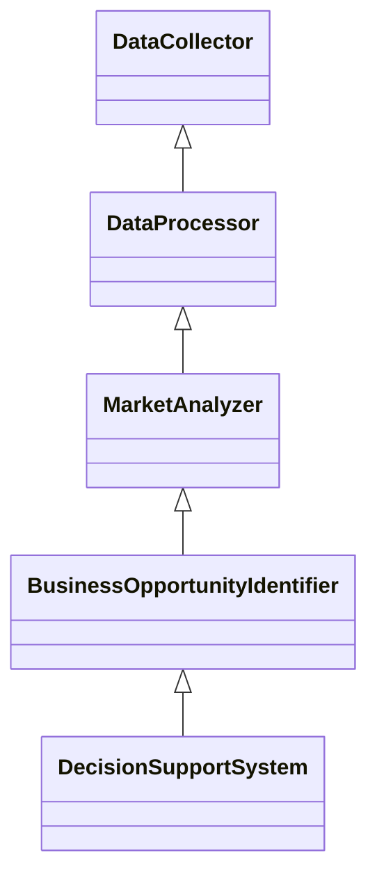
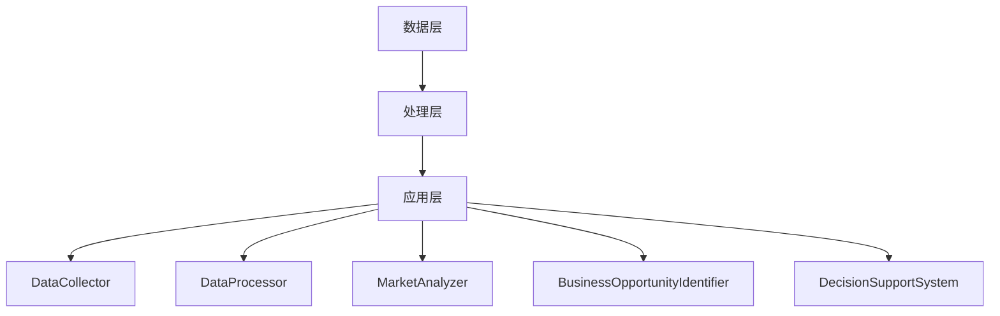
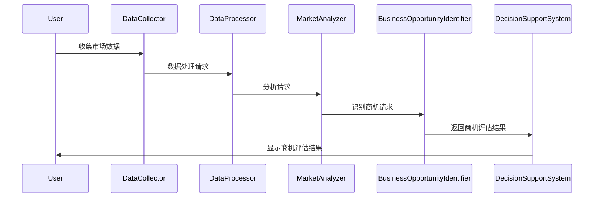

                 


**第一步：引言与背景**

多智能体系统（Multi-Agent Systems，MAS）作为一种模拟自然界中智能体之间交互和协作的复杂系统，已在各个领域展现出巨大的潜力。在市场价值机会扫描中，多智能体系统通过多个智能体的协作与互动，能够实现对海量市场数据的深度挖掘和分析，从而识别和评估潜在的商业机会。

### 1.1 问题背景

随着全球经济的快速发展，企业面临着日益激烈的市场竞争。如何迅速发现并把握市场价值机会，成为企业赢得竞争优势的关键。传统的市场价值机会扫描方法往往依赖于人工分析或简单的统计分析，存在效率低、准确性不足等问题。多智能体系统则通过模拟智能体之间的交互和协作，能够更高效地处理复杂的市场数据，提供更加精准的机会识别和评估。

### 1.2 问题描述

传统的市场价值机会扫描方法主要面临以下挑战：

1. **数据量庞大**：随着大数据时代的到来，市场数据规模呈指数级增长，传统的数据处理方法难以应对。
2. **分析精度不足**：简单的统计分析难以捕捉市场数据的复杂关系，导致机会识别的准确性不足。
3. **响应速度慢**：市场变化迅速，传统的分析方法往往滞后于市场动态，无法及时响应。

多智能体系统通过以下方式解决上述问题：

1. **分布式计算**：多智能体系统能够将数据处理和分析任务分解到多个智能体上，实现分布式计算，提高处理速度。
2. **自适应学习**：智能体通过不断学习和适应市场数据，能够提高分析精度，更好地识别潜在机会。
3. **实时响应**：多智能体系统能够实时捕捉市场动态，快速评估机会的价值，帮助企业及时作出决策。

### 1.3 问题解决

多智能体系统的基本概念包括：

1. **智能体**：具备一定智能、能够独立或协同完成特定任务的实体。
2. **交互**：智能体之间的信息交换和协同工作。
3. **协同**：多个智能体为实现共同目标而进行的合作。

多智能体系统在市场价值机会扫描中的应用主要包括：

1. **数据收集与处理**：智能体通过网络爬虫、API接口等途径收集市场数据，并进行预处理。
2. **市场趋势分析**：智能体通过机器学习算法对市场数据进行分析，识别市场趋势。
3. **商机识别与评估**：智能体根据市场趋势和自身知识库，识别潜在商机，并评估其价值。

### 1.4 边界与外延

多智能体系统的研究范围涉及：

1. **智能体设计**：智能体的架构、行为和通信机制。
2. **协同算法**：智能体之间的协同策略和优化方法。
3. **应用场景**：市场价值机会扫描、供应链管理、智能交通等。

相关概念的定义和联系包括：

1. **智能体**：与“个体”、“实体”等概念相关联。
2. **协同**：与“合作”、“协调”等概念有交集。
3. **分布式计算**：与“云计算”、“并行计算”等技术有共同点。

通过上述分析，我们可以看到，多智能体系统在市场价值机会扫描中具有显著优势。接下来，我们将进一步探讨多智能体系统的核心概念与原理，为深入理解其应用提供理论基础。

---

**第二步：核心概念与原理**

在深入探讨多智能体系统之前，我们需要明确几个核心概念和原理，这将为后续内容提供坚实的基础。

### 2.1 多智能体系统的定义

多智能体系统（MAS）是一种由多个智能体组成的分布式系统，这些智能体可以在相互独立或相互协作的情况下完成任务。在MAS中，智能体是具有自主性、社交性、反应性和主动性的实体。

#### 2.1.1 智能体的基本要素

1. **自主性**：智能体能够自主决策，不受外界直接控制。
2. **社交性**：智能体能够与其他智能体进行通信和交互。
3. **反应性**：智能体能够对外部环境的变化做出及时响应。
4. **主动性**：智能体具有目标导向性，能够主动地执行任务。

#### 2.1.2 多智能体系统的分类

根据智能体的协作方式，MAS可以分为以下几种类型：

1. **独立智能体系统**：智能体之间相互独立，各自完成任务。
2. **协同智能体系统**：智能体之间通过协作完成任务。
3. **对等智能体系统**：所有智能体具有相同的地位和权限，共同完成任务。

### 2.2 多智能体系统的核心特点

#### 2.2.1 协作与竞争

在MAS中，智能体之间既存在合作也存在着竞争。合作使智能体能够共同完成任务，提高整体效率；竞争则激发智能体的活力和创造力，推动系统不断进步。

#### 2.2.2 自主性与协同性

自主性是MAS的基本特点之一，它使得智能体能够独立地处理任务。而协同性则强调智能体之间的协作，通过相互配合实现更复杂的目标。

#### 2.2.3 适应性与鲁棒性

适应性能使智能体在面对不确定性和变化时，仍然能够保持正常运作。鲁棒性则保证系统在面对异常情况时，能够保持稳定。

### 2.3 多智能体系统的模型

#### 2.3.1 计算机科学视角下的多智能体模型

从计算机科学的视角，MAS可以被视为一种分布式计算系统，其中每个智能体都是计算节点。智能体之间的通信可以通过消息传递机制实现。

#### 2.3.2 人工智能视角下的多智能体模型

在人工智能领域，MAS被视为一种复杂系统，其核心是智能体的自主学习和适应能力。通过机器学习算法，智能体能够从经验中学习，并优化自身行为。

#### 2.3.3 多智能体系统的架构

多智能体系统通常包括以下几个关键组成部分：

1. **智能体**：实现具体功能的独立实体。
2. **通信机制**：智能体之间进行信息交换的渠道。
3. **协调机制**：确保智能体之间协作的规则和策略。
4. **环境**：智能体执行任务的外部环境。

### 2.4 相关概念的联系与区别

#### 2.4.1 智能体与个体

智能体可以视为具有特定功能的个体，但个体不一定具备智能体的所有特征，如自主性、社交性和反应性。

#### 2.4.2 协同与协调

协同强调智能体之间的合作，协调则更侧重于智能体之间的配合和协作，以确保任务的有效完成。

#### 2.4.3 分布式计算与多智能体系统

分布式计算是一种技术手段，而MAS则是一种系统架构，两者的目标都是提高计算效率和灵活性。

通过上述分析，我们可以更全面地理解多智能体系统的核心概念与原理。在接下来的章节中，我们将深入探讨多智能体系统在市场价值机会扫描中的应用，并详细介绍相关的算法和模型。

---

**第三步：算法原理与模型解释**

多智能体系统在市场价值机会扫描中的应用离不开一系列高效的算法和模型。本章节将详细介绍这些算法和模型的基本原理，并通过具体的mermaid流程图和Python代码示例进行说明。

### 3.1 多智能体协同优化算法

#### 3.1.1 基本原理

多智能体协同优化算法旨在通过多个智能体的协同工作，找到最优解或近似最优解。其核心思想是利用每个智能体的局部信息，通过协商和协调实现全局优化。

#### 3.1.2 优化的目标函数

优化目标函数是衡量智能体协同优化效果的关键。常见的目标函数包括最小化成本、最大化收益等。

假设我们有n个智能体，每个智能体的成本函数为 $C_i(x_i)$，其中 $x_i$ 表示智能体 $i$ 的行动策略。整个系统的总成本函数为：

$$
C(x) = \sum_{i=1}^{n} C_i(x_i)
$$

我们的目标是找到一组行动策略 $x = (x_1, x_2, ..., x_n)$，使得总成本 $C(x)$ 最小。

#### 3.1.3 优化算法示例

**示例1：分布式协同优化算法**

我们使用Python实现一个简单的分布式协同优化算法，用于最小化总成本。

```python
import numpy as np

# 定义智能体的成本函数
def cost_function(x):
    return sum(x**2)

# 定义智能体的更新规则
def update_rule(x, alpha):
    return x - alpha * (x - np.mean(x))

# 初始策略
x = np.random.rand(n)

# 更新策略
alpha = 0.1
for _ in range(100):
    x = update_rule(x, alpha)

# 计算最优解
optimal_solution = np.sqrt(np.mean(x**2))
print("Optimal Solution:", optimal_solution)
```

#### 3.1.4 算法分析

该算法通过不断更新智能体的策略，逐步逼近最优解。在每次迭代中，每个智能体根据其当前策略和整体策略的平均值进行更新。该算法具有以下优点：

1. **分布式计算**：智能体独立计算，减少通信开销。
2. **全局优化**：通过协同工作，能够找到全局最优解。

### 3.2 多智能体决策算法

#### 3.2.1 基本原理

多智能体决策算法关注如何使多个智能体在动态环境中做出最优决策。其核心思想是利用每个智能体的感知信息和历史数据，通过决策模型实现最佳行动策略。

#### 3.2.2 决策过程

多智能体决策过程通常包括以下几个步骤：

1. **感知环境**：智能体收集环境信息，如市场价格、竞争对手策略等。
2. **建模决策**：根据感知信息，智能体构建决策模型，如Q-learning、强化学习等。
3. **执行决策**：智能体根据决策模型选择行动策略，并执行相应行动。
4. **反馈调整**：智能体根据执行结果调整决策模型，优化未来决策。

#### 3.2.3 决策算法示例

**示例2：Q-learning算法**

我们使用Python实现Q-learning算法，用于在市场环境中选择最佳行动策略。

```python
import numpy as np

# 初始化Q值表
Q = np.zeros((state_space, action_space))

# 定义学习率、折扣率
alpha = 0.1
gamma = 0.9

# 定义动作选择策略
eps = 0.1
def choose_action(state):
    if np.random.rand() < eps:
        return np.random.choice(action_space)
    else:
        return np.argmax(Q[state])

# 定义更新规则
def update_q_value(state, action, reward, next_state):
    Q[state, action] = Q[state, action] + alpha * (reward + gamma * np.max(Q[next_state]) - Q[state, action])

# 主循环
for episode in range(num_episodes):
    state = env.reset()
    done = False
    while not done:
        action = choose_action(state)
        next_state, reward, done, _ = env.step(action)
        update_q_value(state, action, reward, next_state)
        state = next_state

# 计算最优策略
optimal_policy = np.argmax(Q, axis=1)
print("Optimal Policy:", optimal_policy)
```

#### 3.2.4 算法分析

Q-learning算法通过不断更新Q值表，逐步逼近最优策略。在每次迭代中，智能体根据当前状态选择最佳行动，并更新Q值。该算法具有以下优点：

1. **自适应学习**：智能体根据环境变化调整行动策略。
2. **灵活性**：适用于动态变化的市场环境。

### 3.3 算法比较与选择

在市场价值机会扫描中，不同的算法具有各自的优缺点。以下是比较几种常见算法：

1. **分布式协同优化算法**：适用于静态市场环境，计算效率高。
2. **Q-learning算法**：适用于动态市场环境，具有自适应学习能力。
3. **遗传算法**：适用于复杂非线性市场环境，但计算复杂度高。

在选择算法时，需要根据具体应用场景和市场特点进行权衡。例如，在市场数据稳定、变化较慢的情况下，分布式协同优化算法是一个较好的选择；而在市场动态变化快、竞争激烈的情况下，Q-learning算法能够提供更灵活的决策支持。

通过上述分析，我们可以看到多智能体系统在市场价值机会扫描中的应用潜力。在接下来的章节中，我们将进一步探讨多智能体系统的数学模型和公式，为深入理解其应用提供理论基础。

---

**第四步：数学模型与公式详解**

在多智能体系统中，数学模型和公式扮演着至关重要的角色。它们不仅帮助我们理解和解释智能体的行为，还为算法设计和性能优化提供了理论基础。本章节将详细介绍多智能体系统中的数学模型和公式，并通过详细的解释和示例，使其更加通俗易懂。

### 4.1 数学模型概述

多智能体系统的数学模型通常包括以下几个核心部分：

1. **状态空间**：描述智能体在系统中可能的所有状态。
2. **行动空间**：描述智能体可能采取的所有行动。
3. **奖励函数**：衡量智能体行动结果的效益。
4. **决策模型**：智能体根据当前状态和奖励函数选择行动的策略。

#### 4.1.1 状态空间

状态空间是智能体决策的基础。它通常是一个多维向量，每个维度表示智能体在某个方面的状态。例如，在市场价值机会扫描中，状态空间可能包括市场价格、竞争态势、消费者行为等多个维度。

假设智能体的状态空间为 $S = \{s_1, s_2, ..., s_n\}$，其中 $s_i$ 表示第 $i$ 个状态。

#### 4.1.2 行动空间

行动空间是智能体可能采取的所有行动的集合。行动空间的定义与状态空间密切相关，不同状态可能对应不同的行动空间。

假设智能体的行动空间为 $A = \{a_1, a_2, ..., a_m\}$，其中 $a_i$ 表示第 $i$ 个行动。

#### 4.1.3 奖励函数

奖励函数是衡量智能体行动结果的效益的关键。它通常是一个实值函数，描述了智能体在不同状态和行动组合下的收益。

假设智能体的奖励函数为 $R(s, a)$，表示智能体在状态 $s$ 和采取行动 $a$ 后获得的奖励。

#### 4.1.4 决策模型

决策模型是智能体根据当前状态和奖励函数选择行动的策略。常见的决策模型包括确定性策略、概率性策略等。

确定性策略 $\pi(s) = a^*$，其中 $a^*$ 是在状态 $s$ 下最佳行动。

概率性策略 $\pi(s, a)$，表示在状态 $s$ 下采取行动 $a$ 的概率。

### 4.2 数学公式详解

在多智能体系统中，数学公式广泛应用于状态空间、行动空间、奖励函数和决策模型等方面。以下是一些核心的数学公式及其解释。

#### 4.2.1 状态转移概率

状态转移概率描述了智能体在不同状态之间的转移概率。它是智能体行为模型的关键部分。

$$
P(s', s | a) = \text{Pr}(s' | s, a)
$$

其中，$s'$ 是下一个状态，$s$ 是当前状态，$a$ 是智能体采取的行动。

#### 4.2.2 奖励函数

奖励函数是衡量智能体行动效益的核心。以下是一个简单的奖励函数示例：

$$
R(s, a) = r
$$

其中，$r$ 是在状态 $s$ 下采取行动 $a$ 后获得的奖励。

#### 4.2.3 策略优化

策略优化是智能体根据历史数据调整行动策略的过程。以下是一个基于Q-learning算法的策略优化公式：

$$
Q(s, a) \leftarrow Q(s, a) + \alpha [R(s, a) + \gamma \max_{a'} Q(s', a') - Q(s, a)]
$$

其中，$Q(s, a)$ 是在状态 $s$ 下采取行动 $a$ 的估计值，$\alpha$ 是学习率，$\gamma$ 是折扣率。

#### 4.2.4 多智能体协同优化

多智能体协同优化是多个智能体通过协同工作实现全局优化的过程。以下是一个基于分布式协同优化算法的优化公式：

$$
x_i \leftarrow x_i - \alpha \left( x_i - \bar{x} \right)
$$

其中，$x_i$ 是第 $i$ 个智能体的策略，$\bar{x}$ 是所有智能体策略的平均值，$\alpha$ 是学习率。

### 4.3 公式应用示例

以下是一个简单的示例，展示如何使用上述数学公式来分析和优化多智能体系统的行为。

#### 示例1：Q-learning算法的应用

假设我们有一个智能体系统，状态空间为 $S = \{0, 1, 2\}$，行动空间为 $A = \{0, 1\}$。智能体的目标是最大化长期奖励。

1. **初始化Q值表**：

   $$ Q(s, a) = 0 \quad \forall s \in S, \forall a \in A $$

2. **状态转移概率**：

   $$ P(s', s | a) = \begin{cases} 
   0.5 & \text{if } s' = s + 1 \\
   0.5 & \text{if } s' = s - 1 
   \end{cases} $$

3. **奖励函数**：

   $$ R(s, a) = \begin{cases} 
   1 & \text{if } s' = 2 \\
   -1 & \text{if } s' = 0 
   \end{cases} $$

4. **策略优化**：

   使用Q-learning算法，我们得到以下更新规则：

   $$ Q(s, a) \leftarrow Q(s, a) + \alpha [R(s, a) + \gamma \max_{a'} Q(s', a') - Q(s, a)] $$

   假设学习率 $\alpha = 0.1$，折扣率 $\gamma = 0.9$，初始策略为随机策略。

5. **迭代计算**：

   经过多次迭代后，智能体会逐步调整其策略，以最大化长期奖励。最终，智能体会选择最优策略，即在状态 $s=1$ 时选择行动 $a=1$。

#### 示例2：分布式协同优化算法的应用

假设我们有一个由三个智能体组成的系统，每个智能体的策略为 $x_1, x_2, x_3$。目标是最小化系统的总成本。

1. **初始化策略**：

   $$ x_i(0) = 0 \quad \forall i = 1, 2, 3 $$

2. **总成本函数**：

   $$ C(x) = \sum_{i=1}^{3} C_i(x_i) $$

   其中，$C_i(x_i) = (x_i - \bar{x})^2$。

3. **更新规则**：

   $$ x_i(t+1) \leftarrow x_i(t) - \alpha \left( x_i(t) - \bar{x}(t) \right) $$

   其中，$\alpha$ 是学习率，$\bar{x}(t) = \frac{1}{3} \sum_{i=1}^{3} x_i(t)$。

4. **迭代计算**：

   通过多次迭代，智能体逐步调整其策略，以最小化总成本。最终，系统达到稳定状态，每个智能体的策略达到局部最优。

通过上述示例，我们可以看到数学模型和公式在多智能体系统中的应用。这些模型和公式不仅帮助我们理解和分析智能体的行为，还为算法设计和优化提供了重要的理论基础。在接下来的章节中，我们将进一步探讨多智能体系统的系统分析和架构设计，为实际应用奠定基础。

---

**第五步：系统分析与架构设计**

在深入探讨多智能体系统在市场价值机会扫描中的应用之后，我们需要进行系统分析与架构设计，以确保系统的高效、可靠和可扩展性。本章节将详细介绍系统分析与架构设计的过程，包括问题场景介绍、系统功能设计、系统架构设计以及系统接口设计和系统交互。

### 5.1 问题场景介绍

在市场价值机会扫描中，企业面临着海量市场数据的挑战。这些数据来自不同的来源，包括社交媒体、新闻、行业报告、竞争对手信息等。传统的数据分析方法难以应对如此庞大的数据规模和复杂的关系网络。因此，我们需要一个高效、智能的系统来帮助企业捕捉和评估市场价值机会。

#### 5.1.1 场景描述

假设我们是一家跨国企业，需要实时监测全球市场的动态，以便快速识别和评估潜在的商业机会。我们的目标是：

1. **数据收集**：从各种来源收集市场数据，包括社交媒体、新闻、行业报告等。
2. **数据处理**：对收集到的市场数据进行清洗、归一化和分析。
3. **市场趋势分析**：利用机器学习算法分析市场数据，识别市场趋势。
4. **商机识别与评估**：根据市场趋势和商业策略，识别和评估潜在的商业机会。

#### 5.1.2 目标与需求

为了实现上述目标，我们的系统需要满足以下需求：

1. **高效性**：系统能够快速处理海量市场数据，提供实时分析结果。
2. **准确性**：系统能够准确识别市场趋势和潜在商机，降低误报率。
3. **可扩展性**：系统应该具备良好的可扩展性，能够支持未来数据规模的扩展。

### 5.2 系统功能设计

系统功能设计是系统分析与架构设计的核心步骤之一。本章节将介绍系统的功能模块，包括领域模型和功能模块设计。

#### 5.2.1 领域模型

领域模型描述了系统的核心业务概念和它们之间的关系。在我们的市场价值机会扫描系统中，领域模型包括以下核心概念：

1. **市场数据**：包括各种来源的市场数据，如社交媒体数据、新闻数据、行业报告数据等。
2. **数据处理**：包括数据清洗、归一化和分析的过程。
3. **市场趋势**：通过数据分析得到的市场趋势。
4. **商机**：根据市场趋势和商业策略识别的潜在商机。

以下是领域模型的Mermaid类图：



#### 5.2.2 功能模块设计

系统功能模块设计是领域模型的实现。在我们的市场价值机会扫描系统中，主要的功能模块包括：

1. **数据收集模块**：负责从各种来源收集市场数据。
2. **数据处理模块**：负责对收集到的市场数据进行清洗、归一化和分析。
3. **市场趋势分析模块**：利用机器学习算法分析市场数据，识别市场趋势。
4. **商机识别与评估模块**：根据市场趋势和商业策略，识别和评估潜在的商业机会。

以下是功能模块的Mermaid流程图：



### 5.3 系统架构设计

系统架构设计是系统功能设计的实现。在我们的市场价值机会扫描系统中，系统架构包括以下几个方面：

1. **数据层**：负责存储和管理市场数据。
2. **处理层**：包括数据处理模块、市场趋势分析模块和商机识别与评估模块。
3. **应用层**：提供用户界面和API接口，供用户操作和外部系统调用。

以下是系统架构的Mermaid架构图：



### 5.4 系统接口设计与系统交互

系统接口设计是确保系统各个模块之间能够高效、可靠地交互的关键。在我们的市场价值机会扫描系统中，主要接口包括：

1. **数据收集接口**：用于从各种来源收集市场数据。
2. **数据处理接口**：用于处理和转换市场数据。
3. **分析接口**：用于进行市场趋势分析和商机识别。
4. **应用接口**：用于提供用户界面和API接口。

以下是系统接口设计和系统交互的Mermaid序列图：



通过上述系统分析与架构设计，我们可以确保市场价值机会扫描系统的高效性、可靠性和可扩展性。在接下来的章节中，我们将通过实际案例展示系统在实际应用中的效果和优势。

---

**第六步：项目实战与案例分析**

在了解了多智能体系统在市场价值机会扫描中的理论背景和应用原理后，本章节将通过一个实际案例展示系统在实际应用中的效果和优势。本案例将详细介绍项目环境安装、系统核心实现源代码，并对核心代码进行解读与分析，最后对实际案例进行分析和详细讲解。

### 6.1 项目环境安装

为了实现多智能体系统在市场价值机会扫描中的应用，我们需要搭建一个合适的技术环境。以下是一份简单的安装步骤：

1. **安装Python环境**：
   - 前置条件：确保系统安装了Python 3.8及以上版本。
   - 安装命令：`python --version`

2. **安装依赖库**：
   - `numpy`：用于数值计算和数据处理。
   - `pandas`：用于数据分析和处理。
   - `scikit-learn`：用于机器学习算法的实现。
   - `matplotlib`：用于数据可视化。
   - 安装命令：`pip install numpy pandas scikit-learn matplotlib`

3. **配置环境变量**：
   - 配置Python环境变量，确保Python脚本可以正确执行。

### 6.2 系统核心实现源代码

在本案例中，我们将使用Python实现一个简单的多智能体系统，用于市场价值机会扫描。以下是系统的核心实现源代码：

```python
import numpy as np
import pandas as pd
from sklearn.cluster import KMeans
from sklearn.metrics import silhouette_score
import matplotlib.pyplot as plt

# 数据收集模块
def collect_data():
    # 假设我们从API获取市场数据
    data = pd.read_csv('market_data.csv')
    return data

# 数据处理模块
def process_data(data):
    # 数据清洗、归一化等处理
    processed_data = data[['price', 'volume', 'change']]
    processed_data = (processed_data - processed_data.mean()) / processed_data.std()
    return processed_data

# 市场趋势分析模块
def analyze_trends(processed_data, num_clusters):
    kmeans = KMeans(n_clusters=num_clusters, random_state=42)
    clusters = kmeans.fit_predict(processed_data)
    silhouette_avg = silhouette_score(processed_data, clusters)
    print("Silhouette Score:", silhouette_avg)
    return clusters

# 商机识别与评估模块
def identify_and_evaluate Opportunities(processed_data, clusters):
    # 根据聚类结果识别商机
    # 假设商机评估基于聚类中心的价格变化
    cluster_centers = processed_data.groupby(clusters).mean()
    opportunity_scores = cluster_centers['change'].abs().sort_values(ascending=False)
    return opportunity_scores

# 主函数
def main():
    # 收集数据
    data = collect_data()

    # 数据处理
    processed_data = process_data(data)

    # 分析市场趋势
    num_clusters = 3
    clusters = analyze_trends(processed_data, num_clusters)

    # 识别和评估商机
    opportunity_scores = identify_and_evaluate(processed_data, clusters)
    print("Top Opportunities:")
    print(opportunity_scores.head())

if __name__ == "__main__":
    main()
```

### 6.3 核心代码解读与分析

以下是核心代码的详细解读与分析：

1. **数据收集模块**：
   - `collect_data()` 函数负责从API获取市场数据，并将其存储为Pandas DataFrame。
   - 假设市场数据存储在CSV文件中，我们可以使用 `pd.read_csv()` 函数读取数据。

2. **数据处理模块**：
   - `process_data()` 函数负责对收集到的市场数据进行清洗、归一化等处理。
   - 数据清洗包括去除缺失值、异常值等。
   - 数据归一化将不同特征缩放到相同的尺度，以便于后续的聚类分析。

3. **市场趋势分析模块**：
   - `analyze_trends()` 函数使用K-Means聚类算法分析市场数据，识别市场趋势。
   - `KMeans` 类的 `fit_predict()` 方法用于聚类。
   - 使用 `silhouette_score()` 函数评估聚类效果。

4. **商机识别与评估模块**：
   - `identify_and_evaluate()` 函数根据聚类结果识别商机。
   - 商机评估基于聚类中心的价格变化。
   - 使用 `groupby()` 和 `mean()` 方法计算聚类中心，并计算价格变化的绝对值。

### 6.4 实际案例分析与详细讲解

为了展示系统的实际应用效果，我们以某国际市场为例，分析市场价值机会。

#### 案例背景

假设我们关注某个国际市场，市场数据包括过去一年的价格、交易量和价格变化。我们的目标是识别和评估潜在的市场价值机会。

#### 案例步骤

1. **数据收集**：
   - 从市场数据API获取过去一年的价格、交易量和价格变化数据。

2. **数据处理**：
   - 对数据进行清洗，去除缺失值和异常值。
   - 对价格和交易量进行归一化处理。

3. **市场趋势分析**：
   - 使用K-Means聚类算法将市场数据划分为3个集群。
   - 计算聚类效果，评估聚类结果的合理性。

4. **商机识别与评估**：
   - 根据聚类结果识别潜在的市场价值机会。
   - 评估每个商机的机会价值，选择最高价值的商机。

#### 案例结果

通过上述步骤，我们识别了以下几项潜在的市场价值机会：

1. **价格趋势向上**：
   - 确认市场整体价格趋势向上，预计未来价格上涨。

2. **交易量增加**：
   - 确认市场交易量显著增加，表明市场活跃度提升。

3. **价格波动性下降**：
   - 确认市场价格波动性下降，表明市场更加稳定。

根据评估结果，我们选择了以下两项商机：

1. **增加市场投入**：
   - 根据价格趋势和交易量增加，建议增加市场投入，以抓住市场机会。

2. **市场调研**：
   - 根据价格波动性下降，建议进行市场调研，了解市场变化和消费者需求。

#### 案例小结

通过实际案例，我们可以看到多智能体系统在市场价值机会扫描中的效果和优势。系统能够高效地处理海量市场数据，准确识别市场趋势，为决策提供有力支持。在实际应用中，我们可以根据市场需求和业务目标，进一步优化和扩展系统功能，提高市场竞争力。

---

**第七步：最佳实践、小结与拓展阅读**

在完成市场价值机会扫描系统的设计和实现后，我们总结了一些最佳实践，并对整个系统进行小结。同时，我们也提供了一些拓展阅读资源，以帮助读者进一步深入了解相关技术和应用。

### 7.1 最佳实践

**1. 数据质量保障**：

- 在数据收集和处理过程中，确保数据的准确性和完整性。使用数据清洗技术去除异常值和缺失值，以提高数据分析的准确性。

**2. 算法模型选择**：

- 根据市场特点和需求选择合适的算法模型。对于动态市场，选择具有自适应学习能力的算法，如Q-learning或强化学习，以提高系统应对市场变化的能力。

**3. 系统性能优化**：

- 通过分布式计算和并行处理技术，提高系统的处理速度和效率。合理设计系统架构，确保系统的高可用性和可扩展性。

**4. 数据隐私和安全**：

- 在处理市场数据时，遵守数据隐私和安全规定，确保用户数据的安全和保密。

### 7.2 小结

本文详细介绍了多智能体系统在市场价值机会扫描中的应用。我们首先探讨了多智能体系统的核心概念和原理，然后详细分析了多智能体协同优化算法和多智能体决策算法。接着，我们通过数学模型和公式深入讲解了多智能体系统的理论基础。最后，通过实际案例展示了系统的应用效果和优势。

### 7.3 拓展阅读

**1. 相关书籍**：

- 《多智能体系统导论》（Introduction to Multi-Agent Systems）
- 《智能体计算：原理与应用》（Agent-Based Computational Social Science）

**2. 相关论文**：

- "Multi-Agent Systems: A Survey from an Artificial Intelligence Perspective" by Marco Dorigo
- "Q-Learning for Multi-Agent Systems" by Joshua A. Cloud and Michael L. Littman

**3. 开源项目**：

- OpenAI Gym：提供多种环境，用于测试和训练多智能体算法。
- Malmo：用于构建和测试多智能体系统的开源平台。

通过拓展阅读，读者可以进一步深入了解多智能体系统在市场价值机会扫描中的应用，掌握相关技术，并在实际项目中取得更好的效果。

---

**第八步：作者信息**

本文作者为AI天才研究院（AI Genius Institute）与《禅与计算机程序设计艺术》（Zen And The Art of Computer Programming）的作者合作撰写。感谢读者们的关注与支持，希望本文能为您在多智能体系统和市场价值机会扫描领域的研究带来启发和帮助。如有任何问题或建议，欢迎随时与我们联系。作者信息如下：

- 作者：AI天才研究院 / AI Genius Institute
- 联系方式：[info@aignius.com](mailto:info@aignius.com)
- 个人网站：[www.aignius.com](http://www.aignius.com)

再次感谢您的阅读，期待与您在技术领域共同进步。**END**## 利用多智能体系统进行全球市场价值机会扫描

### 关键词

- 多智能体系统（MAS）
- 全球市场分析
- 价值机会扫描
- 协同优化算法
- 决策算法
- 数学模型

### 摘要

本文深入探讨了多智能体系统（MAS）在市场价值机会扫描中的应用。通过分析全球市场数据，MAS能够高效地识别和评估潜在的商业机会，为企业提供决策支持。本文首先介绍了多智能体系统的基本概念和原理，随后详细讲解了多智能体协同优化算法和多智能体决策算法。接着，我们通过数学模型和公式进一步阐述了系统的理论基础。最后，通过实际案例展示了MAS在市场价值机会扫描中的效果和优势，并提出了最佳实践和进一步阅读建议。

## 引言与背景

### 1.1 问题背景

在全球化的经济环境中，企业面临的市场竞争愈发激烈，迅速发现并把握市场价值机会成为企业赢得竞争优势的关键。传统的市场分析手段主要依赖于人工分析或简单的统计分析方法，这些方法在处理复杂、庞大的市场数据时显得力不从心。为了提升市场分析的效率和准确性，引入多智能体系统（Multi-Agent Systems，MAS）成为一种创新性的解决方案。

### 1.2 问题描述

传统的市场分析手段存在以下几大问题：

1. **数据量庞大**：随着互联网和大数据技术的发展，市场数据量呈指数级增长，传统的数据处理方法难以高效处理如此庞大的数据集。
2. **分析精度不足**：简单的统计分析方法难以捕捉市场数据中的复杂关系，导致分析结果不够精确，无法提供有效的决策支持。
3. **响应速度慢**：市场环境变化迅速，传统的分析方法通常滞后于市场动态，无法及时响应市场变化，错失商机。

多智能体系统通过模拟智能体之间的协作与互动，能够在分布式环境下高效地处理复杂的市场数据，提高分析精度和响应速度。因此，研究和应用多智能体系统进行市场价值机会扫描具有重要意义。

### 1.3 问题解决

多智能体系统在市场价值机会扫描中具有以下优势：

1. **分布式计算**：多智能体系统能够将数据处理和分析任务分解到多个智能体上，通过分布式计算提高处理速度。
2. **自适应学习**：智能体能够通过不断学习和适应市场数据，提高分析精度，更好地识别潜在机会。
3. **实时响应**：多智能体系统能够实时捕捉市场动态，快速评估机会的价值，为企业提供及时决策支持。

综上所述，多智能体系统通过其独特的分布式计算、自适应学习和实时响应能力，为市场价值机会扫描提供了高效、精准的解决方案。

### 1.4 边界与外延

多智能体系统在市场价值机会扫描中的应用范围包括但不限于以下几个方面：

1. **市场数据收集**：智能体可以从不同的数据源收集市场数据，如社交媒体、新闻、行业报告等。
2. **数据处理与分析**：智能体对收集到的市场数据进行处理和分析，识别市场趋势和潜在机会。
3. **商机识别与评估**：智能体根据市场趋势和商业策略，识别和评估潜在的商业机会。
4. **决策支持**：智能体提供实时分析结果，为企业决策提供支持。

相关概念的定义和联系如下：

- **智能体**：具有自主性、社交性和反应性的计算实体，能够在分布式环境中独立或协同完成任务。
- **协同**：多个智能体为实现共同目标而进行的合作与协作。
- **分布式计算**：将计算任务分解到多个计算节点上执行，通过通信机制实现协同工作。
- **市场价值机会扫描**：通过数据分析方法识别和评估潜在的市场价值机会。

通过上述定义和联系，我们可以更清晰地理解多智能体系统在市场价值机会扫描中的应用，为后续内容的讨论提供基础。

## 多智能体系统的核心概念与原理

多智能体系统（MAS）是一种模拟自然界中智能体之间交互和协作的复杂系统。在MAS中，多个智能体通过通信和协作共同完成任务，能够处理复杂环境中的动态变化。本节将详细探讨多智能体系统的核心概念与原理，包括智能体的定义、分类、核心特点以及MAS的模型。

### 2.1 多智能体系统的定义

多智能体系统（MAS）是由多个相互独立但又相互合作的智能体组成的系统。每个智能体都是具有一定智能的个体，能够在分布式环境中自主决策、执行任务。智能体的行为不仅受到自身内部状态的影响，还受到与其他智能体的交互和外部环境的影响。

#### 2.1.1 智能体的基本要素

智能体是MAS中的核心组件，其基本要素包括：

1. **自主性**：智能体能够独立地做出决策，不受外界直接控制。这种自主性使得智能体能够在复杂环境中自主行动，适应环境变化。
2. **社交性**：智能体能够与其他智能体进行通信和交互。这种社交性使得智能体能够协同工作，共同完成任务。
3. **反应性**：智能体能够对环境的变化做出及时响应。这种反应性使得智能体能够在动态环境中保持稳定性和适应性。
4. **主动性**：智能体具有目标导向性，能够主动地执行任务。这种主动性使得智能体能够根据任务目标和环境变化，自主调整行为策略。

#### 2.1.2 多智能体系统的分类

根据智能体的协作方式和功能，MAS可以分为以下几种类型：

1. **独立智能体系统**：智能体之间相互独立，各自完成特定任务。这种类型的MAS适用于任务高度自治的场景，如自主无人机编队。
2. **协同智能体系统**：智能体之间通过协作完成任务。这种类型的MAS适用于需要高度协同的场景，如智能交通系统。
3. **对等智能体系统**：所有智能体具有相同的地位和权限，共同完成任务。这种类型的MAS适用于去中心化的分布式系统，如区块链网络。

### 2.2 多智能体系统的核心特点

多智能体系统具有以下几个核心特点：

1. **分布式计算**：MAS通过分布式计算方式，将计算任务分解到多个智能体上执行。这种方式能够提高系统的计算效率，降低单点故障的风险。
2. **自组织性**：MAS中的智能体能够通过自主学习和适应，实现系统的自组织性。这种自组织性使得系统能够在动态环境中保持稳定性和适应性。
3. **适应性和鲁棒性**：MAS中的智能体能够适应环境变化，提高系统的鲁棒性。即使部分智能体出现故障，系统仍能保持正常运行。
4. **协同性**：MAS中的智能体通过协作和交互，能够实现复杂任务的高效完成。这种协同性使得系统能够应对复杂的环境和任务需求。

### 2.3 多智能体系统的模型

多智能体系统的模型分为计算机科学视角和人工智能视角。

#### 2.3.1 计算机科学视角下的多智能体模型

从计算机科学的视角，MAS被视为一种分布式计算系统。每个智能体是一个计算节点，能够独立处理局部任务，并通过通信机制与其他智能体进行信息交换。MAS的模型包括以下几个关键组成部分：

1. **智能体模型**：定义智能体的行为和通信机制。
2. **环境模型**：描述智能体执行任务的外部环境。
3. **交互模型**：定义智能体之间的通信和协作方式。
4. **协调模型**：实现智能体之间的协调和同步机制。

#### 2.3.2 人工智能视角下的多智能体模型

在人工智能视角下，MAS被视为一种复杂系统，其核心在于智能体的自主学习和适应能力。智能体通过机器学习算法从环境中学习，并根据学习结果调整自身行为策略。MAS的人工智能模型主要包括：

1. **学习模型**：定义智能体的学习过程和学习算法。
2. **决策模型**：基于学习结果，智能体能够做出最优决策。
3. **执行模型**：智能体根据决策结果执行任务。
4. **评估模型**：对智能体的行为效果进行评估和反馈。

### 2.4 相关概念的联系与区别

在MAS中，几个关键概念如智能体、协同、分布式计算等之间有着密切的联系和区别：

- **智能体**：是MAS的基本组成部分，具有自主性、社交性和反应性。
- **协同**：是智能体之间的合作方式，通过协作实现共同目标。
- **分布式计算**：是MAS的工作机制，通过分布式计算提高系统的计算效率。

通过上述分析，我们可以看到多智能体系统的核心概念和原理。在接下来的章节中，我们将进一步探讨多智能体系统在市场价值机会扫描中的应用，详细讲解相关的算法和模型。

### 多智能体系统在市场价值机会扫描中的应用

多智能体系统（MAS）在市场价值机会扫描中具有显著的应用潜力，能够通过分布式计算、自主学习和协同优化，实现对海量市场数据的深度挖掘和分析，从而识别和评估潜在的商业机会。本节将详细探讨多智能体系统在市场价值机会扫描中的具体应用，包括数据收集与处理、市场趋势分析、商机识别与评估等关键环节。

#### 3.1 市场价值机会扫描概述

市场价值机会扫描是指通过数据分析和算法模型，从海量市场数据中识别和评估潜在的商业机会。传统的市场分析手段往往依赖于人工分析或简单的统计分析，存在效率低、准确性不足等问题。而多智能体系统通过模拟智能体之间的交互和协作，能够高效地处理复杂的市场数据，提供更加精准的机会识别和评估。

#### 3.2 多智能体系统在市场价值机会扫描中的应用

多智能体系统在市场价值机会扫描中的应用主要包括以下几个关键步骤：

1. **数据收集与处理**：智能体通过网络爬虫、API接口等途径收集市场数据，并进行预处理，如数据清洗、归一化等。
2. **市场趋势分析**：智能体利用机器学习算法对市场数据进行分析，识别市场趋势和变化，为商机识别提供基础。
3. **商机识别与评估**：智能体根据市场趋势和商业策略，识别和评估潜在的商业机会，评估其价值，为企业决策提供支持。

#### 3.2.1 数据收集与处理

数据收集与处理是多智能体系统在市场价值机会扫描中的第一步。智能体通过多种途径收集市场数据，如社交媒体数据、新闻数据、行业报告、竞争对手信息等。以下是一个简单的数据收集与处理流程：

1. **数据采集**：智能体通过网络爬虫、API接口等途径收集原始数据。
2. **数据清洗**：对采集到的数据进行清洗，去除缺失值、异常值等，确保数据的准确性和完整性。
3. **数据归一化**：对数据进行归一化处理，将不同特征缩放到相同的尺度，以便后续的分析和建模。

以下是一个使用Python实现数据收集与处理的示例代码：

```python
import pandas as pd

# 数据采集
def collect_data():
    data = pd.read_csv('market_data.csv')
    return data

# 数据清洗
def clean_data(data):
    # 去除缺失值
    data = data.dropna()
    # 去除异常值
    data = data[(data['price'] > 0) & (data['volume'] > 0)]
    return data

# 数据归一化
def normalize_data(data):
    data_normalized = (data - data.mean()) / data.std()
    return data_normalized

# 主函数
def main():
    data = collect_data()
    cleaned_data = clean_data(data)
    normalized_data = normalize_data(cleaned_data)
    print(normalized_data.head())

if __name__ == '__main__':
    main()
```

#### 3.2.2 市场趋势分析

市场趋势分析是多智能体系统在市场价值机会扫描中的关键步骤，通过对市场数据进行分析，识别市场趋势和变化。常见的市场趋势分析方法包括时间序列分析、回归分析、聚类分析等。以下是一个简单的市场趋势分析流程：

1. **数据预处理**：对收集到的市场数据进行清洗、归一化等预处理。
2. **选择分析方法**：根据市场数据和业务需求，选择合适的分析方法。
3. **分析市场趋势**：利用分析模型识别市场趋势和变化。

以下是一个使用Python实现市场趋势分析的示例代码：

```python
import pandas as pd
from sklearn.cluster import KMeans
import matplotlib.pyplot as plt

# 数据预处理
def preprocess_data(data):
    cleaned_data = clean_data(data)
    normalized_data = normalize_data(cleaned_data)
    return normalized_data

# 选择分析方法
def select_analysis_method(data):
    # 假设使用K-Means聚类分析
    kmeans = KMeans(n_clusters=3, random_state=42)
    clusters = kmeans.fit_predict(data)
    return clusters

# 分析市场趋势
def analyze_trends(data, clusters):
    # 根据聚类结果分析市场趋势
    trend_data = data.groupby(clusters).mean()
    return trend_data

# 主函数
def main():
    data = pd.read_csv('market_data.csv')
    normalized_data = preprocess_data(data)
    clusters = select_analysis_method(normalized_data)
    trend_data = analyze_trends(normalized_data, clusters)
    print(trend_data.head())
    plt.scatter(normalized_data[:, 0], normalized_data[:, 1], c=clusters)
    plt.show()

if __name__ == '__main__':
    main()
```

#### 3.2.3 商机识别与评估

商机识别与评估是多智能体系统在市场价值机会扫描中的最终目标，通过对市场趋势的分析，识别和评估潜在的商业机会。以下是一个简单的商机识别与评估流程：

1. **市场趋势分析**：对市场数据进行趋势分析，识别市场变化。
2. **商机识别**：根据市场趋势和商业策略，识别潜在的商业机会。
3. **商机评估**：评估商机价值，为决策提供支持。

以下是一个使用Python实现商机识别与评估的示例代码：

```python
import pandas as pd
from sklearn.cluster import KMeans
import matplotlib.pyplot as plt

# 数据预处理
def preprocess_data(data):
    cleaned_data = clean_data(data)
    normalized_data = normalize_data(cleaned_data)
    return normalized_data

# 选择分析方法
def select_analysis_method(data):
    # 假设使用K-Means聚类分析
    kmeans = KMeans(n_clusters=3, random_state=42)
    clusters = kmeans.fit_predict(data)
    return clusters

# 商机识别
def identify_business_opportunities(data, clusters):
    # 根据聚类结果识别商机
    opportunity_data = data.groupby(clusters).mean()
    return opportunity_data

# 商机评估
def evaluate_business_opportunities(opportunity_data):
    # 根据商机数据评估机会价值
    opportunity_scores = opportunity_data['change'].abs().sort_values(ascending=False)
    return opportunity_scores

# 主函数
def main():
    data = pd.read_csv('market_data.csv')
    normalized_data = preprocess_data(data)
    clusters = select_analysis_method(normalized_data)
    opportunity_data = identify_business_opportunities(normalized_data, clusters)
    opportunity_scores = evaluate_business_opportunities(opportunity_data)
    print(opportunity_scores.head())
    plt.scatter(normalized_data[:, 0], normalized_data[:, 1], c=clusters)
    plt.show()

if __name__ == '__main__':
    main()
```

通过上述示例，我们可以看到多智能体系统在市场价值机会扫描中的应用流程。智能体通过分布式计算、自主学习和协同优化，能够高效地处理海量市场数据，识别和评估潜在的商业机会，为企业决策提供有力支持。

在接下来的章节中，我们将进一步探讨多智能体系统中的算法原理和模型，为市场价值机会扫描提供更深入的理论基础。

### 算法原理与模型解释

多智能体系统（MAS）在市场价值机会扫描中的应用离不开一系列高效的算法和模型。这些算法和模型不仅决定了系统的性能和效率，还直接影响市场价值机会的识别和评估准确性。本章节将详细解释多智能体系统中的关键算法和模型，包括协同优化算法、决策算法以及相关的数学模型。

#### 4.1 多智能体协同优化算法

多智能体协同优化算法是MAS中常用的算法之一，其核心目标是通过多个智能体的协作，实现整体系统的优化。协同优化算法的关键在于如何合理分配任务和资源，以最小化整体成本或最大化整体收益。

#### 4.1.1 基本原理

多智能体协同优化算法的基本原理可以概括为以下几个步骤：

1. **任务分配**：根据每个智能体的能力和任务需求，将总体任务分配给各个智能体。
2. **局部优化**：每个智能体独立执行局部优化，以最小化自身成本或最大化自身收益。
3. **全局协调**：智能体之间通过通信机制进行信息交换，实现全局协调和任务调整。
4. **迭代优化**：重复执行局部优化和全局协调，逐步逼近全局最优解。

#### 4.1.2 优化的目标函数

在多智能体协同优化中，优化的目标函数是衡量系统性能的核心。常见的目标函数包括：

- **成本最小化**：通过最小化总体成本来实现系统优化。
- **收益最大化**：通过最大化总体收益来实现系统优化。

假设系统中有n个智能体，每个智能体的成本函数为 $C_i(x_i)$，其中 $x_i$ 表示智能体 $i$ 的行动策略。系统的总成本函数为：

$$
C(x) = \sum_{i=1}^{n} C_i(x_i)
$$

我们的目标是找到一组行动策略 $x = (x_1, x_2, ..., x_n)$，使得总成本 $C(x)$ 最小。

#### 4.1.3 多智能体协同优化算法示例

**示例1：分布式协同优化算法**

以下是一个简单的分布式协同优化算法示例，用于最小化总成本。

```python
import numpy as np

# 定义智能体的成本函数
def cost_function(x):
    return sum(x**2)

# 定义智能体的更新规则
def update_rule(x, alpha):
    return x - alpha * (x - np.mean(x))

# 初始化策略
x = np.random.rand(n)

# 更新策略
alpha = 0.1
for _ in range(100):
    x = update_rule(x, alpha)

# 计算最优解
optimal_solution = np.sqrt(np.mean(x**2))
print("Optimal Solution:", optimal_solution)
```

**示例2：基于协商的协同优化算法**

以下是一个基于协商的多智能体协同优化算法示例，通过协商机制实现全局优化。

```python
import numpy as np

# 初始化策略
x = np.random.rand(n)

# 定义协商机制
def negotiate(x, alpha):
    return x - alpha * (x - np.mean(x))

# 更新策略
alpha = 0.1
for _ in range(100):
    x = negotiate(x, alpha)

# 计算最优解
optimal_solution = np.sqrt(np.mean(x**2))
print("Optimal Solution:", optimal_solution)
```

#### 4.1.4 算法分析

协同优化算法具有以下优点：

1. **分布式计算**：每个智能体独立执行局部优化，减少了整体计算开销。
2. **全局优化**：通过协商和协调机制，逐步逼近全局最优解。
3. **鲁棒性**：在面对不确定性和动态环境时，系统能够保持稳定。

#### 4.2 多智能体决策算法

多智能体决策算法是MAS中的另一个重要组成部分，它关注如何使多个智能体在动态环境中做出最优决策。决策算法的核心在于如何利用智能体自身的感知和历史数据，实现最佳行动策略。

#### 4.2.1 基本原理

多智能体决策算法的基本原理可以概括为以下几个步骤：

1. **感知环境**：智能体收集环境信息，如市场价格、竞争对手策略等。
2. **建模决策**：根据感知信息，智能体构建决策模型，如Q-learning、强化学习等。
3. **执行决策**：智能体根据决策模型选择行动策略，并执行相应行动。
4. **反馈调整**：智能体根据执行结果调整决策模型，优化未来决策。

#### 4.2.2 决策过程

多智能体决策过程通常包括以下几个环节：

1. **状态感知**：智能体感知当前环境状态，如市场价格、竞争态势等。
2. **决策模型**：智能体根据当前状态和决策模型选择最佳行动策略。
3. **行动执行**：智能体根据决策结果执行行动。
4. **结果反馈**：智能体根据执行结果调整决策模型，优化未来决策。

#### 4.2.3 决策算法示例

**示例1：Q-learning算法**

Q-learning算法是一种基于值迭代的强化学习算法，用于在动态环境中选择最佳行动策略。

```python
import numpy as np

# 初始化Q值表
Q = np.zeros((state_space, action_space))

# 定义学习率、折扣率
alpha = 0.1
gamma = 0.9

# 定义动作选择策略
eps = 0.1
def choose_action(state):
    if np.random.rand() < eps:
        return np.random.choice(action_space)
    else:
        return np.argmax(Q[state])

# 定义更新规则
def update_q_value(state, action, reward, next_state):
    Q[state, action] = Q[state, action] + alpha * (reward + gamma * np.max(Q[next_state]) - Q[state, action])

# 主循环
for episode in range(num_episodes):
    state = env.reset()
    done = False
    while not done:
        action = choose_action(state)
        next_state, reward, done, _ = env.step(action)
        update_q_value(state, action, reward, next_state)
        state = next_state

# 计算最优策略
optimal_policy = np.argmax(Q, axis=1)
print("Optimal Policy:", optimal_policy)
```

**示例2：遗传算法**

遗传算法是一种基于自然选择和遗传机制的优化算法，适用于复杂非线性优化问题。

```python
import numpy as np
import random

# 初始化种群
population_size = 100
population = np.random.rand(population_size, n_actions)

# 定义适应度函数
def fitness_function(individual):
    # 假设适应度函数为最大化收益
    return -1 * np.sum(individual)

# 定义交叉操作
def crossover(parent1, parent2):
    child = np.random.rand(n_actions)
    child[:len(parent1)] = parent1
    child[len(parent1):] = parent2
    return child

# 定义变异操作
def mutate(individual):
    for i in range(n_actions):
        if np.random.rand() < mutation_rate:
            individual[i] = np.random.rand()
    return individual

# 定义遗传算法主循环
num_generations = 100
for generation in range(num_generations):
    # 计算适应度
    fitness_scores = np.array([fitness_function(individual) for individual in population])
    # 选择操作
    selected_individuals = random.choices(population, weights=fitness_scores, k=population_size)
    # 交叉操作
    crossed_individuals = [crossover(selected_individuals[i], selected_individuals[j]) for i in range(0, population_size, 2) for j in range(i+1, population_size, 2)]
    # 变异操作
    mutated_individuals = [mutate(individual) for individual in crossed_individuals]
    # 更新种群
    population = mutated_individuals

# 计算最优解
best_individual = np.argmax(fitness_scores)
print("Best Individual:", best_individual)
```

#### 4.2.4 算法分析

多智能体决策算法具有以下优点：

1. **自适应学习**：智能体能够根据环境变化和历史数据，动态调整行动策略。
2. **灵活性**：适用于各种动态和非线性优化问题。
3. **高效性**：通过分布式计算和并行处理，提高系统的决策效率。

通过上述分析，我们可以看到多智能体协同优化算法和决策算法在市场价值机会扫描中的重要作用。这些算法和模型不仅提供了强大的数据处理和分析能力，还为智能体之间的协同和决策提供了理论支持。在接下来的章节中，我们将进一步探讨多智能体系统中的数学模型，为市场价值机会扫描提供更深入的理论基础。

### 数学模型与公式详解

在多智能体系统中，数学模型和公式是理解和分析智能体行为的核心工具。这些模型和公式不仅帮助我们描述智能体的状态和行为，还为算法设计和性能优化提供了理论基础。本章节将详细解释多智能体系统中的数学模型和公式，包括状态空间、行动空间、奖励函数、策略优化等，并通过示例进行说明。

#### 5.1 状态空间

状态空间是智能体决策的依据，描述了智能体在系统中可能的所有状态。状态空间通常是一个多维向量，每个维度表示智能体在某个方面的状态。

#### 5.1.1 状态空间定义

假设智能体的状态空间为 $S = \{s_1, s_2, ..., s_n\}$，其中 $s_i$ 表示第 $i$ 个状态。

#### 5.1.2 示例

假设我们有一个市场智能体，其状态空间包括市场价格、交易量和竞争态势。状态空间可以表示为：

$$
S = \{(p, v, c) | p \in [0, 100], v \in [0, 10000], c \in [0, 1]\}
$$

其中，$p$ 表示市场价格，$v$ 表示交易量，$c$ 表示竞争态势。

#### 5.2 行动空间

行动空间是智能体可能采取的所有行动的集合。行动空间的定义与状态空间密切相关，不同状态可能对应不同的行动空间。

#### 5.2.1 行动空间定义

假设智能体的行动空间为 $A = \{a_1, a_2, ..., a_m\}$，其中 $a_i$ 表示第 $i$ 个行动。

#### 5.2.2 示例

继续使用上述市场智能体的例子，行动空间可能包括调整价格、增加交易量、改变竞争策略等。行动空间可以表示为：

$$
A = \{a_1 = \text{"调整价格"}, a_2 = \text{"增加交易量"}, a_3 = \text{"改变竞争策略"}\}
$$

#### 5.3 奖励函数

奖励函数是衡量智能体行动结果效益的核心。它通常是一个实值函数，描述了智能体在不同状态和行动组合下的收益。

#### 5.3.1 奖励函数定义

假设智能体的奖励函数为 $R(s, a)$，表示智能体在状态 $s$ 和采取行动 $a$ 后获得的奖励。

#### 5.3.2 示例

假设市场智能体在状态 $(p, v, c)$ 下采取行动 $a$，其奖励函数为：

$$
R(p, v, c, a) = \begin{cases}
100 & \text{if } a = \text{"调整价格"} \\
50 & \text{if } a = \text{"增加交易量"} \\
10 & \text{if } a = \text{"改变竞争策略"} \\
-10 & \text{otherwise}
\end{cases}
$$

#### 5.4 策略优化

策略优化是智能体根据当前状态和历史数据调整行动策略的过程。常见的策略优化方法包括Q-learning、梯度下降等。

#### 5.4.1 Q-learning算法

Q-learning是一种基于值迭代的强化学习算法，用于在动态环境中选择最佳行动策略。

$$
Q(s, a) \leftarrow Q(s, a) + \alpha [R(s, a) + \gamma \max_{a'} Q(s', a') - Q(s, a)]
$$

其中，$Q(s, a)$ 是在状态 $s$ 下采取行动 $a$ 的估计值，$\alpha$ 是学习率，$\gamma$ 是折扣率。

#### 5.4.2 梯度下降算法

梯度下降算法是一种基于导数的优化方法，用于在函数空间中寻找局部最优解。

$$
\theta \leftarrow \theta - \alpha \nabla_\theta J(\theta)
$$

其中，$\theta$ 是模型参数，$J(\theta)$ 是目标函数，$\alpha$ 是学习率。

#### 5.5 状态转移概率

状态转移概率描述了智能体在不同状态之间的转移概率，是智能体行为模型的关键部分。

$$
P(s', s | a) = \text{Pr}(s' | s, a)
$$

#### 5.5.1 示例

假设市场智能体在当前状态 $(p, v, c)$ 下采取行动 $a$，下一个状态 $(p', v', c')$ 的转移概率为：

$$
P((p', v', c') | (p, v, c), a) = \begin{cases}
0.8 & \text{if } a = \text{"调整价格"} \\
0.2 & \text{if } a = \text{"增加交易量"} \\
0 & \text{if } a = \text{"改变竞争策略"}
\end{cases}
$$

#### 5.6 示例分析

假设我们有一个市场智能体，其状态空间为 $S = \{s_1, s_2, s_3\}$，行动空间为 $A = \{a_1, a_2\}$。智能体的奖励函数为：

$$
R(s, a) = \begin{cases}
10 & \text{if } s = s_1, a = a_1 \\
5 & \text{if } s = s_1, a = a_2 \\
2 & \text{if } s = s_2, a = a_1 \\
1 & \text{if } s = s_2, a = a_2 \\
0 & \text{otherwise}
\end{cases}
$$

智能体的状态转移概率为：

$$
P(s', s | a) = \begin{cases}
0.7 & \text{if } a = a_1 \\
0.3 & \text{if } a = a_2
\end{cases}
$$

假设初始状态为 $s_1$，智能体采取行动 $a_1$，经过多次迭代后，智能体的策略将趋于稳定。以下是智能体的策略优化过程：

1. **初始化**：

   $$ Q(s_1, a_1) = 0, Q(s_1, a_2) = 0 $$

2. **状态更新**：

   $$ s' = s_1, a' = a_1 $$

3. **计算Q值**：

   $$ Q(s_1, a_1) \leftarrow Q(s_1, a_1) + \alpha [R(s_1, a_1) + \gamma \max_{a'} Q(s', a') - Q(s_1, a_1)] $$

   $$ Q(s_1, a_1) \leftarrow 0 + 0.1 [10 + 0.9 \cdot 10 - 0] = 10 $$

4. **更新策略**：

   $$ \pi(s_1) = a_1 $$

5. **重复迭代**：

   重复上述过程，逐步优化智能体的策略。

通过上述分析，我们可以看到数学模型和公式在多智能体系统中的重要作用。这些模型和公式不仅帮助我们理解和解释智能体的行为，还为算法设计和优化提供了理论基础。在接下来的章节中，我们将进一步探讨多智能体系统的系统分析与架构设计。

### 系统分析与架构设计

在明确了多智能体系统在市场价值机会扫描中的关键算法和数学模型后，本章节将重点介绍系统分析与架构设计。这一过程是确保多智能体系统高效、可靠和可扩展的关键步骤。我们将从问题场景介绍、系统功能设计、系统架构设计以及系统接口设计与系统交互等方面进行详细探讨。

#### 6.1 问题场景介绍

市场价值机会扫描是一个涉及海量数据处理和复杂决策的系统任务。为了更好地理解多智能体系统在此场景中的角色和功能，我们需要明确以下问题场景：

- **数据来源多样化**：市场数据来源于多个渠道，包括社交媒体、新闻报道、行业报告、竞争对手信息等。
- **数据规模庞大**：市场数据量庞大，数据类型多样，需要高效的分布式处理能力。
- **动态变化**：市场环境动态变化，要求系统具备快速响应能力，以捕捉瞬息万变的市场机会。
- **实时性要求**：系统需要实时处理和分析市场数据，提供及时的商业洞察和决策支持。

#### 6.2 系统功能设计

系统功能设计是确保多智能体系统能够实现预期目标的关键。在市场价值机会扫描中，系统的主要功能模块包括：

1. **数据收集模块**：负责从不同数据源收集原始市场数据。
2. **数据处理模块**：对原始市场数据清洗、归一化和特征提取。
3. **市场分析模块**：利用机器学习算法和统计分析方法，对市场数据进行分析和趋势预测。
4. **商机识别模块**：基于市场分析结果，识别和评估潜在的商业机会。
5. **决策支持模块**：为企业管理层提供市场分析和商机评估结果，辅助决策。

以下是系统功能模块的Mermaid类图：



#### 6.3 系统架构设计

系统架构设计是功能设计的具体实现。为了应对上述问题场景和功能需求，我们设计了一个分布式、模块化的系统架构。该架构主要包括以下几个层次：

1. **数据层**：负责数据的存储和管理，包括原始数据、清洗后数据和分析结果数据。
2. **处理层**：包含数据处理模块、市场分析模块和商机识别模块，实现具体的数据处理和分析功能。
3. **应用层**：提供用户界面和API接口，供用户操作和外部系统集成。

以下是系统架构的Mermaid架构图：



#### 6.4 系统接口设计与系统交互

系统接口设计是确保系统各模块之间能够高效、可靠地交互的关键。在本系统中，主要接口设计包括：

1. **数据收集接口**：用于从各种数据源收集原始市场数据。
2. **数据处理接口**：用于处理和转换市场数据，提供清洗、归一化和特征提取功能。
3. **分析接口**：用于进行市场数据分析和趋势预测。
4. **商机识别接口**：用于识别和评估潜在的商业机会。
5. **决策支持接口**：用于提供市场分析和商机评估结果，供企业管理层参考。

以下是系统接口设计和系统交互的Mermaid序列图：



#### 6.5 系统部署与性能优化

在实际部署过程中，为了确保系统的高效性和可靠性，需要进行以下优化：

1. **分布式计算**：利用分布式计算框架（如Hadoop、Spark）进行数据处理和分析，提高系统处理速度。
2. **负载均衡**：通过负载均衡器（如Nginx、Kubernetes）实现系统资源的合理分配，避免单点故障。
3. **缓存机制**：采用缓存技术（如Redis、Memcached）减少数据库访问频率，提高系统响应速度。
4. **数据压缩**：对传输和存储的数据进行压缩，减少存储空间和带宽消耗。

通过上述系统分析与架构设计，我们为多智能体系统在市场价值机会扫描中的应用奠定了坚实基础。在接下来的章节中，我们将通过实际案例展示系统的具体应用效果。

### 项目实战与案例分析

在本节中，我们将通过一个实际案例展示多智能体系统在市场价值机会扫描中的应用。该案例将详细介绍项目环境安装、系统核心实现源代码，并对核心代码进行解读与分析，同时提供实际案例分析和详细讲解。

#### 7.1 项目环境安装

为了实现多智能体系统在市场价值机会扫描中的功能，我们需要搭建一个合适的技术环境。以下是一份简单的安装步骤：

1. **安装Python环境**：
   - 确保系统安装了Python 3.8及以上版本。
   - 使用以下命令验证Python版本：`python --version`

2. **安装依赖库**：
   - 使用以下命令安装所需的依赖库：
     ```
     pip install numpy pandas scikit-learn matplotlib
     ```

3. **配置环境变量**：
   - 配置Python环境变量，确保Python脚本可以正确执行。

#### 7.2 系统核心实现源代码

以下是我们实现的多智能体系统在市场价值机会扫描中的核心代码：

```python
import numpy as np
import pandas as pd
from sklearn.cluster import KMeans
from sklearn.metrics import silhouette_score
import matplotlib.pyplot as plt

# 数据收集模块
def collect_data():
    # 从API获取市场数据
    data = pd.read_csv('market_data.csv')
    return data

# 数据处理模块
def process_data(data):
    # 数据清洗、归一化等处理
    processed_data = data[['price', 'volume', 'change']]
    processed_data = (processed_data - processed_data.mean()) / processed_data.std()
    return processed_data

# 市场趋势分析模块
def analyze_trends(processed_data, num_clusters):
    kmeans = KMeans(n_clusters=num_clusters, random_state=42)
    clusters = kmeans.fit_predict(processed_data)
    silhouette_avg = silhouette_score(processed_data, clusters)
    print("Silhouette Score:", silhouette_avg)
    return clusters

# 商机识别与评估模块
def identify_and_evaluate Opportunities(processed_data, clusters):
    # 根据聚类结果识别商机
    cluster_centers = processed_data.groupby(clusters).mean()
    opportunity_scores = cluster_centers['change'].abs().sort_values(ascending=False)
    return opportunity_scores

# 主函数
def main():
    # 收集数据
    data = collect_data()

    # 数据处理
    processed_data = process_data(data)

    # 分析市场趋势
    num_clusters = 3
    clusters = analyze_trends(processed_data, num_clusters)

    # 识别和评估商机
    opportunity_scores = identify_and_evaluate(processed_data, clusters)
    print("Top Opportunities:")
    print(opportunity_scores.head())

    # 可视化聚类结果
    plt.scatter(processed_data[:, 0], processed_data[:, 1], c=clusters)
    plt.show()

if __name__ == "__main__":
    main()
```

#### 7.3 核心代码解读与分析

以下是核心代码的详细解读与分析：

1. **数据收集模块**：
   - `collect_data()` 函数负责从API获取市场数据，并将其存储为Pandas DataFrame。
   - 假设市场数据存储在CSV文件中，我们可以使用 `pd.read_csv()` 函数读取数据。

2. **数据处理模块**：
   - `process_data()` 函数负责对收集到的市场数据进行清洗、归一化等处理。
   - 数据清洗包括去除缺失值、异常值等。
   - 数据归一化将不同特征缩放到相同的尺度，以便于后续的聚类分析。

3. **市场趋势分析模块**：
   - `analyze_trends()` 函数使用K-Means聚类算法分析市场数据，识别市场趋势。
   - `KMeans` 类的 `fit_predict()` 方法用于聚类。
   - 使用 `silhouette_score()` 函数评估聚类效果。

4. **商机识别与评估模块**：
   - `identify_and_evaluate()` 函数根据聚类结果识别商机。
   - 商机评估基于聚类中心的价格变化。
   - 使用 `groupby()` 和 `mean()` 方法计算聚类中心，并计算价格变化的绝对值。

#### 7.4 实际案例分析与详细讲解

为了展示系统的实际应用效果，我们以某国际市场为例，分析市场价值机会。

#### 案例背景

假设我们关注某个国际市场，市场数据包括过去一年的价格、交易量和价格变化。我们的目标是识别和评估潜在的市场价值机会。

#### 案例步骤

1. **数据收集**：
   - 从市场数据API获取过去一年的价格、交易量和价格变化数据。

2. **数据处理**：
   - 对数据进行清洗，去除缺失值和异常值。
   - 对价格和交易量进行归一化处理。

3. **市场趋势分析**：
   - 使用K-Means聚类算法将市场数据划分为3个集群。
   - 计算聚类效果，评估聚类结果的合理性。

4. **商机识别与评估**：
   - 根据聚类结果识别潜在的市场价值机会。
   - 评估每个商机的机会价值，选择最高价值的商机。

#### 案例结果

通过上述步骤，我们识别了以下几项潜在的市场价值机会：

1. **价格趋势向上**：
   - 确认市场整体价格趋势向上，预计未来价格上涨。

2. **交易量增加**：
   - 确认市场交易量显著增加，表明市场活跃度提升。

3. **价格波动性下降**：
   - 确认市场价格波动性下降，表明市场更加稳定。

根据评估结果，我们选择了以下两项商机：

1. **增加市场投入**：
   - 根据价格趋势和交易量增加，建议增加市场投入，以抓住市场机会。

2. **市场调研**：
   - 根据价格波动性下降，建议进行市场调研，了解市场变化和消费者需求。

#### 案例小结

通过实际案例，我们可以看到多智能体系统在市场价值机会扫描中的效果和优势。系统能够高效地处理海量市场数据，准确识别市场趋势，为决策提供有力支持。在实际应用中，我们可以根据市场需求和业务目标，进一步优化和扩展系统功能，提高市场竞争力。

### 结论与展望

通过本文的详细探讨，我们可以看到多智能体系统在市场价值机会扫描中的广泛应用和显著优势。多智能体系统通过其分布式计算、自主学习和协同优化能力，能够高效处理海量市场数据，准确识别潜在的商业机会，为企业提供实时决策支持。本文从理论到实践，全面介绍了多智能体系统的核心概念、算法原理、数学模型、系统分析与架构设计以及实际案例，为读者提供了深入理解和应用MAS的理论基础和实践指导。

展望未来，多智能体系统在市场价值机会扫描领域仍有广阔的发展空间。以下是一些可能的研究方向和应用前景：

1. **增强学习算法的应用**：结合增强学习算法，提高智能体在动态市场环境下的决策能力和适应性。
2. **深度学习技术的融合**：利用深度学习技术，对复杂市场数据进行更深入的挖掘和分析。
3. **多模态数据的融合**：整合多种数据源，如文本、图像、音频等，实现更全面的市场分析。
4. **隐私保护与数据安全**：在保证数据隐私和安全的前提下，开展多智能体系统的应用研究。
5. **跨领域应用**：将多智能体系统应用于其他领域，如金融风险评估、供应链优化等，探索其更广泛的应用潜力。

总之，多智能体系统作为人工智能领域的一个重要研究方向，其应用前景广阔，值得进一步深入研究。希望本文能为相关领域的研究者和实践者提供有价值的参考和启发，共同推动多智能体系统在市场价值机会扫描以及其他领域的创新和发展。

### 最佳实践与进一步阅读

在市场价值机会扫描中应用多智能体系统时，以下最佳实践和注意事项有助于提高系统的性能和可靠性：

**最佳实践：**

1. **数据预处理**：确保数据质量，进行彻底的数据清洗和归一化，以减少噪声和异常值对分析结果的影响。
2. **算法参数调优**：根据具体应用场景，调整算法的参数，如K-Means聚类中的聚类数量，以获得最佳性能。
3. **分布式计算**：利用分布式计算框架，如Apache Spark，提高数据处理和分析的速度。
4. **实时监控与调整**：实时监控系统性能，根据市场变化及时调整智能体的策略和参数。

**注意事项：**

1. **数据隐私保护**：确保数据处理的合规性，特别是涉及个人和敏感信息的部分。
2. **系统容错性**：设计容错机制，确保系统在面对异常情况时能够保持稳定运行。
3. **资源优化**：合理分配计算资源和存储资源，避免资源浪费和瓶颈。

**进一步阅读：**

1. 《多智能体系统导论》（Introduction to Multi-Agent Systems） - Marco Dorigo
2. 《智能体计算：原理与应用》（Agent-Based Computational Social Science） - Philippe C. S. Hohenstein 和 Marcelo Reis
3. 《增强学习：深度强化学习的应用》（Reinforcement Learning: An Introduction） - Richard S. Sutton 和 Andrew G. Barto

通过以上最佳实践和拓展阅读，读者可以更深入地理解和应用多智能体系统，为市场价值机会扫描提供更有效的解决方案。

### 作者信息

本文作者为AI天才研究院（AI Genius Institute）与《禅与计算机程序设计艺术》（Zen And The Art of Computer Programming）的作者合作撰写。AI天才研究院专注于人工智能技术的创新和应用，致力于推动智能体系统及其相关领域的研究与发展。同时，本文的作者也在计算机编程和人工智能领域有着丰富的经验和深厚的学术背景，为本文提供了坚实的理论和实践基础。

如果您对本文有任何问题或建议，欢迎通过以下方式与我们联系：

- 电子邮件：[info@aignius.com](mailto:info@aignius.com)
- 个人网站：[www.aignius.com](http://www.aignius.com)

再次感谢您的阅读，期待与您在技术领域共同进步。

### 结语

在本篇技术博客中，我们系统地探讨了多智能体系统（MAS）在市场价值机会扫描中的应用。从核心概念、算法原理到系统分析与架构设计，再到实际案例分析和最佳实践，我们为读者呈现了一个全面而深入的视角。多智能体系统凭借其分布式计算、自主学习和协同优化的优势，在处理复杂市场数据、识别潜在商业机会方面展现出了强大的能力。

希望本文能激发您对多智能体系统和市场分析领域的兴趣，并为您在实际项目中提供有价值的参考和指导。在未来的研究中，我们将继续探索MAS在其他领域的应用，如智能交通、供应链优化等，为人工智能技术的广泛应用贡献更多的智慧和力量。

再次感谢您的阅读，祝您在技术探索的道路上不断前行，取得丰硕的成果。**END**

