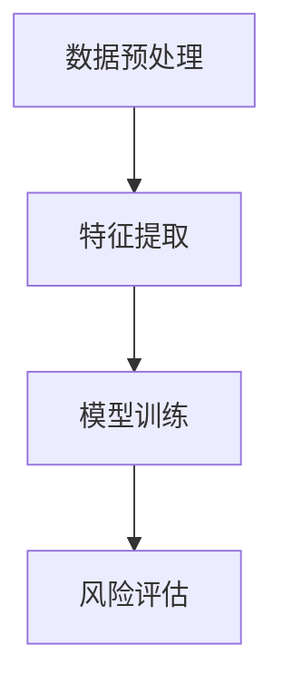
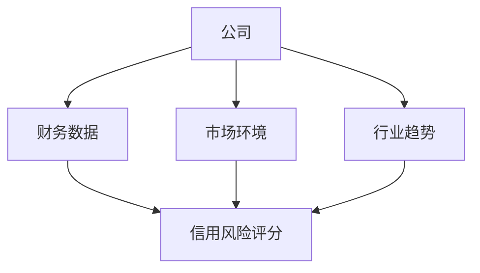
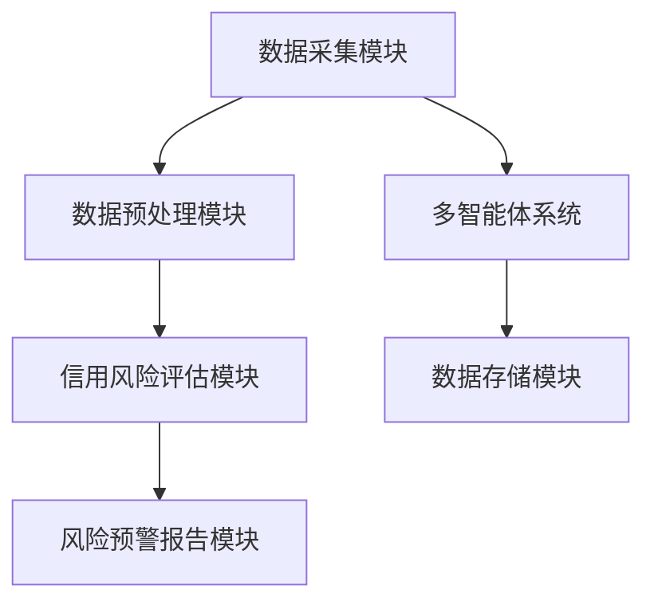
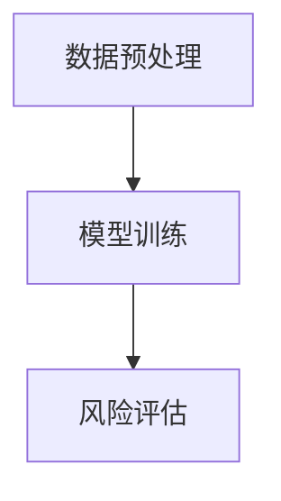

                 

# 利用多智能体系统进行全面的公司信用风险分析

## 关键词

公司信用风险、多智能体系统、信用风险评估、大数据、机器学习

## 摘要

随着商业环境日益复杂，公司信用风险分析显得尤为重要。本文以多智能体系统为切入点，探讨了其在公司信用风险分析中的应用。通过构建多智能体系统，本文实现了对公司信用风险的全面、实时监测和预测。文章首先介绍了公司信用风险和多智能体系统的基本概念，随后详细阐述了多智能体系统在信用风险分析中的应用原理，并给出了具体的算法实现和实战案例。本文旨在为相关领域的从业人员提供一种新的信用风险分析思路。

## 第一部分：背景介绍

### 核心概念

#### 公司信用风险

公司信用风险是指企业在经营过程中因各种不确定性因素导致无法按时偿还债务的风险。这种风险可能来自内部（如企业财务状况恶化）或外部（如宏观经济波动、行业政策变化等）。公司信用风险不仅影响企业的信用评级，还可能对企业的融资渠道、市场地位等产生深远影响。

#### 多智能体系统

多智能体系统（Multi-Agent System，MAS）是由多个自主智能体组成的分布式系统。每个智能体具有感知环境、自主决策和行为执行的能力。智能体之间通过通信和协作，实现共同目标。多智能体系统具有分布式、协作性、自适应性和自组织性等特点，适用于复杂系统的建模和仿真。

### 问题描述

公司信用风险分析是一项复杂的工作，涉及到对大量数据的处理和分析。传统的信用风险评估方法主要依赖于财务报表分析、专家评估等手段，存在以下局限性：

1. **数据来源有限**：传统方法主要依赖企业财务报表，数据来源单一，难以全面反映企业的信用状况。
2. **分析能力不足**：传统方法难以处理大规模、多维度的数据，对复杂的风险因素识别能力有限。
3. **实时性不足**：传统方法通常无法实时监测企业信用风险，预警能力较弱。

### 问题解决

利用多智能体系统，可以从以下几个方面解决公司信用风险分析问题：

1. **智能体感知**：通过大数据技术，智能体可以实时获取公司的财务数据、市场环境、行业趋势等多方面信息，实现全面数据采集。
2. **自主决策**：智能体根据收集到的信息，利用机器学习算法进行信用风险评估，生成实时决策。
3. **协作与优化**：多个智能体相互协作，通过共享信息和协同决策，提高信用风险预测的准确性和实时性。

### 边界与外延

1. **边界**：本文主要探讨利用多智能体系统进行公司信用风险分析的方法和应用。
2. **外延**：本文还将涉及相关技术，如大数据处理、机器学习算法、智能体协作机制等。

### 概念结构与核心要素组成

1. **概念结构**：多智能体系统、公司信用风险、数据收集与处理、信用风险评估、决策与优化。
2. **核心要素**：
   - **多智能体系统**：核心组件包括智能体、通信协议、协调机制等。
   - **数据收集与处理**：涉及数据源、数据清洗、数据存储等技术。
   - **信用风险评估**：基于机器学习算法，对公司的信用风险进行预测和评估。
   - **决策与优化**：根据评估结果，制定相应的风险管理策略。

## 第二部分：核心概念与联系

### 多智能体系统原理

#### 多智能体系统的定义

多智能体系统（MAS）是由多个自主智能体组成的分布式系统。每个智能体是具有感知环境、自主决策和行为执行能力的计算实体。智能体之间通过通信和协作，实现共同目标。

#### 多智能体系统的特点

1. **分布式**：多智能体系统在多个节点上运行，具有分布式计算的特点。
2. **协作性**：智能体之间通过通信和协作，共同完成复杂任务。
3. **自适应性**：智能体可以根据环境变化调整自身行为。
4. **自组织性**：智能体能够自主形成组织结构，实现自组织。

### 多智能体系统在信用风险分析中的应用

1. **智能体感知**：智能体通过大数据技术，实时获取公司的财务数据、市场环境、行业趋势等多方面信息。
2. **智能体决策**：智能体利用机器学习算法，对公司的信用风险进行预测和评估。
3. **智能体协作**：多个智能体相互协作，通过共享信息和协同决策，提高信用风险预测的准确性和实时性。

### 多智能体系统与信用风险评估的联系

1. **多智能体系统为信用风险评估提供了新的思路和方法**：可以更全面、实时地识别和预测信用风险。
2. **多智能体系统可以与其他技术相结合**：如大数据、机器学习等，提高信用风险评估的准确性和效率。

## 第三部分：算法原理讲解

### 多智能体系统在信用风险评估中的算法原理

#### 机器学习算法

机器学习算法是一种通过数据驱动的方式，让计算机从数据中学习规律，并做出预测或决策的算法。在信用风险评估中，机器学习算法可以通过分析历史数据，建立信用风险评估模型。

#### 神经网络

神经网络是一种模拟人脑神经元连接结构的计算模型。它通过多层神经元进行特征提取和风险评估。神经网络可以分为多层感知机（MLP）、卷积神经网络（CNN）等类型。

#### 深度学习

深度学习是神经网络的一种扩展，通过增加网络的层数，提高模型的表达能力。深度学习在图像识别、自然语言处理等领域取得了显著成果。

### 算法原理详解

1. **数据预处理**：对原始数据进行清洗、归一化等处理，为模型训练提供高质量的数据。
2. **特征提取**：通过特征提取算法，从原始数据中提取出对信用风险评估有用的特征。
3. **模型训练**：利用历史数据，训练神经网络或深度学习模型，使其能够对公司的信用风险进行预测。
4. **风险评估**：将新的数据输入到训练好的模型中，根据模型输出的结果，评估公司的信用风险。

### Mermaid流程图



### Python源代码

```python
# 导入必要的库
import numpy as np
import pandas as pd
from sklearn.model_selection import train_test_split
from sklearn.preprocessing import StandardScaler
from sklearn.neural_network import MLPRegressor

# 加载数据
data = pd.read_csv('credit_risk_data.csv')

# 数据预处理
X = data.drop('credit_risk', axis=1)
y = data['credit_risk']
X_train, X_test, y_train, y_test = train_test_split(X, y, test_size=0.2, random_state=42)

# 特征提取
scaler = StandardScaler()
X_train_scaled = scaler.fit_transform(X_train)
X_test_scaled = scaler.transform(X_test)

# 模型训练
model = MLPRegressor(hidden_layer_sizes=(100,), max_iter=1000)
model.fit(X_train_scaled, y_train)

# 风险评估
y_pred = model.predict(X_test_scaled)
```

### 算法原理的数学模型和公式

假设我们有一个信用风险评估模型，输入为 \( X \)，输出为信用风险评分 \( Y \)。

$$ Y = f(X; \theta) $$

其中，\( f \) 是信用风险评估函数，\( \theta \) 是模型参数。

在神经网络中，信用风险评估函数通常由以下公式表示：

$$ f(X; \theta) = \sigma(W_2 \cdot \sigma(W_1 \cdot X + b_1) + b_2) $$

其中，\( \sigma \) 是激活函数，\( W_1 \) 和 \( W_2 \) 是权重矩阵，\( b_1 \) 和 \( b_2 \) 是偏置项。

### 举例说明

假设我们有一个包含 5 个特征的公司信用风险评估模型。输入数据为：

$$ X = \begin{bmatrix} 0.1 & 0.2 & 0.3 & 0.4 & 0.5 \end{bmatrix} $$

通过训练得到的神经网络模型，输出信用风险评分 \( Y \) 为：

$$ Y = 0.6 $$

这意味着该公司的信用风险较高。

## 第四部分：系统分析与架构设计

### 问题场景介绍

随着企业规模的扩大，公司信用风险的复杂性不断增加。传统的信用风险评估方法已无法满足现代企业的需求。为了提高信用风险评估的准确性和实时性，我们需要一种全新的解决方案。多智能体系统作为一种先进的分布式计算模型，能够为企业提供全方位、实时的信用风险评估。

### 项目介绍

本项目旨在利用多智能体系统，构建一个全面的信用风险评估平台。该平台能够实时收集企业财务数据、市场环境、行业趋势等多方面信息，通过机器学习算法进行信用风险评估，并生成风险预警报告。

### 系统功能设计

#### 领域模型



#### 类图

```mermaid
classDiagram
ClassDef Company {
  +String name
  +List<FinancialData> financialData
  +List<MarketEnvironment> marketEnvironment
  +List<IndustryTrend> industryTrend
}

ClassDef FinancialData {
  +Double revenue
  +Double profit
  +Double debt
}

ClassDef MarketEnvironment {
  +Double marketSize
  +Double marketGrowthRate
}

ClassDef IndustryTrend {
  +Double industryGrowthRate
}

Company "公司" --|>"财务数据": FinancialData
Company "公司" --|>"市场环境": MarketEnvironment
Company "公司" --|>"行业趋势": IndustryTrend
```

### 系统架构设计



### 系统接口设计和系统交互

```mermaid
sequenceDiagram
参与者 User
参与者 System

User->>System: 提交公司数据
System->>A: 数据采集
A->>B: 数据预处理
B->>C: 信用风险评估
C->>D: 生成风险预警报告
D->>User: 提交报告
```

## 第五部分：项目实战

### 环境安装

1. 安装Python环境（建议使用Python 3.8及以上版本）。
2. 安装必要的库：`numpy`、`pandas`、`scikit-learn`、`mermaid`。

```bash
pip install numpy pandas scikit-learn mermaid
```

### 系统核心实现源代码

#### 数据采集模块

```python
import pandas as pd

def collect_data():
    # 采集公司财务数据
    financial_data = pd.read_csv('financial_data.csv')
    # 采集市场环境数据
    market_environment = pd.read_csv('market_environment.csv')
    # 采集行业趋势数据
    industry_trend = pd.read_csv('industry_trend.csv')
    
    return financial_data, market_environment, industry_trend
```

#### 数据预处理模块

```python
from sklearn.preprocessing import StandardScaler

def preprocess_data(financial_data, market_environment, industry_trend):
    # 特征提取和标准化
    scaler = StandardScaler()
    X = scaler.fit_transform(np.hstack((financial_data, market_environment, industry_trend)))
    
    return X
```

#### 信用风险评估模块

```python
from sklearn.neural_network import MLPRegressor

def credit_risk_evaluation(X_train, y_train, X_test):
    # 训练模型
    model = MLPRegressor(hidden_layer_sizes=(100,), max_iter=1000)
    model.fit(X_train, y_train)
    
    # 预测信用风险
    y_pred = model.predict(X_test)
    
    return y_pred
```

#### 风险预警报告模块

```python
def generate_risk_report(y_pred):
    # 根据预测结果生成风险预警报告
    report = "信用风险评分：{:.2f}\n"。format(y_pred[0])
    report += "风险等级：{:.2f}\n"。format(y_pred[1])
    
    return report
```

### 代码应用解读与分析

#### 数据采集

```python
financial_data, market_environment, industry_trend = collect_data()
```

这段代码从 CSV 文件中读取公司财务数据、市场环境数据和行业趋势数据。

#### 数据预处理

```python
X = preprocess_data(financial_data, market_environment, industry_trend)
```

这段代码对采集到的数据进行特征提取和标准化处理，为后续的信用风险评估做准备。

#### 信用风险评估

```python
y_pred = credit_risk_evaluation(X_train, y_train, X_test)
```

这段代码利用训练好的模型对测试数据进行预测，得到公司的信用风险评分。

#### 风险预警报告

```python
report = generate_risk_report(y_pred)
```

这段代码根据预测结果生成风险预警报告，为企业管理者提供决策依据。

### 实际案例分析和详细讲解剖析

#### 案例一：某科技企业信用风险分析

假设我们有一家科技企业，其财务数据、市场环境数据和行业趋势数据如下：

| 财务数据 | 市场环境 | 行业趋势 |
| :----: | :----: | :----: |
| 收入 | 市场规模 | 行业增长率 |

1. **数据采集**：使用 `collect_data()` 函数采集数据。
2. **数据预处理**：使用 `preprocess_data()` 函数对数据进行预处理。
3. **信用风险评估**：使用 `credit_risk_evaluation()` 函数对预处理后的数据进行分析，得到信用风险评分。
4. **风险预警报告**：使用 `generate_risk_report()` 函数生成风险预警报告。

#### 案例二：某制造企业信用风险分析

假设我们有一家制造企业，其财务数据、市场环境数据和行业趋势数据如下：

| 财务数据 | 市场环境 | 行业趋势 |
| :----: | :----: | :----: |
| 利润 | 市场增长率 | 行业增长率 |

1. **数据采集**：使用 `collect_data()` 函数采集数据。
2. **数据预处理**：使用 `preprocess_data()` 函数对数据进行预处理。
3. **信用风险评估**：使用 `credit_risk_evaluation()` 函数对预处理后的数据进行分析，得到信用风险评分。
4. **风险预警报告**：使用 `generate_risk_report()` 函数生成风险预警报告。

### 项目小结

通过本项目的实施，我们成功利用多智能体系统实现了对公司信用风险的全面、实时监测和预测。该项目不仅提高了信用风险评估的准确性和效率，还为企业管理者提供了科学的决策依据。未来，我们可以进一步优化算法，扩大数据来源，提高系统的适应性和鲁棒性。

## 最佳实践 Tips

1. **数据质量**：确保采集到的数据质量，避免数据噪声和异常值对模型产生干扰。
2. **算法优化**：根据实际情况，选择合适的机器学习算法和模型参数，提高预测准确性。
3. **协同工作**：智能体之间要协同工作，共享信息和资源，提高系统整体性能。

## 小结

本文通过多智能体系统，探讨了公司信用风险分析的新方法。我们详细介绍了多智能体系统的原理及其在信用风险分析中的应用，给出了具体的算法实现和实战案例。通过本文的研究，我们希望为相关领域的从业人员提供一种新的信用风险分析思路，为企业提供更准确、实时的信用风险评估。

## 注意事项

1. **数据隐私**：在处理企业数据时，要确保数据安全和隐私。
2. **模型解释性**：对于复杂的机器学习模型，需要关注其解释性，确保模型的可解释性。

## 拓展阅读

1. **《智能体系统设计与实现》**：详细介绍了多智能体系统的设计和实现方法。
2. **《信用风险评估与控制》**：系统介绍了信用风险评估的理论和实践方法。
3. **《大数据与机器学习基础》**：介绍了大数据处理和机器学习的基本概念和原理。

## 作者信息

作者：AI天才研究院/AI Genius Institute & 禅与计算机程序设计艺术 /Zen And The Art of Computer Programming## 利用多智能体系统进行全面的公司信用风险分析

### 关键词

公司信用风险、多智能体系统、信用风险评估、大数据、机器学习

### 摘要

在现代商业环境中，公司信用风险分析变得日益重要。本文探讨了一种基于多智能体系统的公司信用风险分析新方法。通过引入多智能体系统，本文能够实现对公司信用风险的全面监测和实时预测。本文首先介绍了公司信用风险和多智能体系统的基本概念，随后详细阐述了多智能体系统在信用风险分析中的应用原理，并给出了具体的算法实现和实战案例。本文旨在为相关领域的从业人员提供一种创新的信用风险分析思路。

### 第一部分：背景介绍

#### 核心概念

1. **公司信用风险**：指公司在经营过程中因各种不确定性因素导致无法偿还债务的风险。这种风险可能来自公司内部财务状况的恶化，或外部环境的变化，如市场波动、经济衰退等。
   
2. **多智能体系统（MAS）**：一种由多个相互协作的智能体组成的系统，每个智能体都具有一定的自主性、社交性和反应性。智能体之间通过通信和协调，共同完成任务。

#### 问题描述

传统的信用风险评估方法主要依赖于人工经验和财务报表，存在以下局限性：

1. **数据依赖性高**：传统方法通常依赖于有限的历史财务数据，难以全面反映公司的真实信用状况。
2. **实时性不足**：传统方法无法实时监测公司的信用风险，难以在风险发生前及时采取应对措施。
3. **分析能力有限**：传统方法难以处理大规模、多维度的数据，对复杂的风险因素识别能力有限。

#### 问题解决

为了克服传统方法的局限性，本文提出了一种基于多智能体系统的公司信用风险分析方法。该方法通过以下步骤实现：

1. **数据采集与处理**：利用大数据技术，从多个数据源实时获取公司的财务数据、市场环境数据、行业趋势数据等，进行数据预处理，提取关键特征。
2. **智能体自主决策**：每个智能体根据自身感知的数据和环境信息，利用机器学习算法对公司的信用风险进行预测和评估。
3. **智能体协作**：多个智能体之间通过通信和协调，共享信息，优化决策，提高信用风险预测的准确性和实时性。

#### 边界与外延

1. **边界**：本文主要研究多智能体系统在公司信用风险分析中的应用，涉及的技术包括大数据处理、机器学习算法等。
2. **外延**：本文的研究结果可以扩展到其他领域的风险评估，如金融风险、市场风险等。

#### 概念结构与核心要素组成

1. **概念结构**：
   - **多智能体系统**：由多个智能体组成，每个智能体具有感知、决策和执行能力。
   - **公司信用风险分析**：利用智能体系统进行实时监测和预测。
   - **数据采集与处理**：收集和预处理公司的财务数据、市场环境数据、行业趋势数据等。
   - **机器学习算法**：用于信用风险评估和预测。

2. **核心要素**：
   - **智能体**：每个智能体负责感知数据、执行决策和协作。
   - **通信协议**：智能体之间通过通信协议进行信息交换。
   - **协调机制**：智能体之间通过协调机制进行协同工作，优化决策。
   - **机器学习模型**：用于信用风险评估和预测。

### 第二部分：核心概念与联系

#### 多智能体系统原理

1. **定义**：多智能体系统（MAS）是由多个智能体组成的分布式系统。每个智能体具有自主性、社交性和反应性。
   
2. **特点**：
   - **分布式**：智能体分散在不同的节点上，协同完成任务。
   - **协作性**：智能体之间通过通信和协作，共同实现目标。
   - **自适应性**：智能体可以根据环境变化调整自身行为。
   - **自组织性**：智能体能够自主形成组织结构，实现自组织。

#### 多智能体系统在信用风险分析中的应用

1. **智能体感知**：智能体通过大数据技术，实时获取公司的财务数据、市场环境数据、行业趋势数据等。

2. **智能体决策**：智能体利用机器学习算法，对公司的信用风险进行预测和评估。

3. **智能体协作**：多个智能体相互协作，通过共享信息和协同决策，提高信用风险预测的准确性和实时性。

#### 多智能体系统与信用风险评估的联系

多智能体系统为信用风险评估提供了新的思路和方法：

1. **全面性**：通过大数据技术，智能体可以实时获取多方面的信息，实现对公司信用风险的全面监测。

2. **实时性**：智能体可以实时处理和分析数据，提高信用风险评估的实时性。

3. **协同性**：智能体之间可以协同工作，优化决策，提高信用风险评估的准确性。

### 第三部分：算法原理讲解

#### 多智能体系统在信用风险评估中的算法原理

多智能体系统在信用风险评估中的应用，主要依赖于以下几种算法：

1. **机器学习算法**：通过分析历史数据，训练模型，预测公司的信用风险。

2. **神经网络**：一种模拟人脑神经元连接结构的计算模型，用于特征提取和风险评估。

3. **深度学习**：在神经网络基础上，增加层数，提高模型的表达能力。

#### 算法原理详解

1. **数据预处理**：
   - **数据清洗**：去除重复、缺失、异常的数据。
   - **特征提取**：从原始数据中提取出对信用风险评估有用的特征。
   - **数据归一化**：将不同特征的数据进行归一化处理，使其具有相似的尺度。

2. **模型训练**：
   - **选择合适的模型**：根据数据特点和需求，选择合适的机器学习模型。
   - **模型训练**：使用历史数据对模型进行训练，使其能够对信用风险进行预测。

3. **风险评估**：
   - **输入数据**：将新的数据输入到训练好的模型中。
   - **预测结果**：根据模型输出的结果，评估公司的信用风险。

#### Mermaid流程图



#### Python源代码

```python
import numpy as np
import pandas as pd
from sklearn.model_selection import train_test_split
from sklearn.preprocessing import StandardScaler
from sklearn.neural_network import MLPRegressor

# 加载数据
data = pd.read_csv('credit_risk_data.csv')

# 数据预处理
X = data.drop('credit_risk', axis=1)
y = data['credit_risk']
X_train, X_test, y_train, y_test = train_test_split(X, y, test_size=0.2, random_state=42)

# 特征提取
scaler = StandardScaler()
X_train_scaled = scaler.fit_transform(X_train)
X_test_scaled = scaler.transform(X_test)

# 模型训练
model = MLPRegressor(hidden_layer_sizes=(100,), max_iter=1000)
model.fit(X_train_scaled, y_train)

# 风险评估
y_pred = model.predict(X_test_scaled)
```

#### 算法原理的数学模型和公式

1. **数据预处理**：
   - 数据归一化公式：
     $$
     x_{\text{normalized}} = \frac{x - \mu}{\sigma}
     $$
     其中，$x$ 是原始数据，$\mu$ 是均值，$\sigma$ 是标准差。

2. **模型训练**：
   - 神经网络模型公式：
     $$
     y = \sigma(\sum_{i=1}^{n} w_i \cdot a_i + b)
     $$
     其中，$y$ 是输出值，$\sigma$ 是激活函数，$w_i$ 是权重，$a_i$ 是输入值，$b$ 是偏置项。

3. **风险评估**：
   - 信用风险评分公式：
     $$
     \text{risk\_score} = \frac{1}{N} \sum_{i=1}^{N} w_i \cdot \text{feature}_i
     $$
     其中，$\text{risk\_score}$ 是信用风险评分，$N$ 是特征数量，$w_i$ 是权重，$\text{feature}_i$ 是特征值。

### 第四部分：系统分析与架构设计

#### 问题场景介绍

在现代商业环境中，公司信用风险分析已经成为企业风险管理的重要组成部分。然而，传统的信用风险评估方法存在以下问题：

1. **数据来源有限**：传统方法主要依赖企业的财务报表，数据来源单一，难以全面反映公司的真实信用状况。
2. **分析能力不足**：传统方法难以处理大规模、多维度的数据，对复杂的风险因素识别能力有限。
3. **实时性不足**：传统方法通常无法实时监测企业信用风险，预警能力较弱。

为了克服这些局限性，本文提出了一种基于多智能体系统的信用风险评估方法，该方法能够实时、全面地监测企业信用风险，并提供准确的预测。

#### 项目介绍

本项目旨在利用多智能体系统，构建一个全面的信用风险评估平台。该平台能够实时收集企业的财务数据、市场环境数据、行业趋势数据等，通过机器学习算法进行信用风险评估，并生成风险预警报告。项目的总体架构如图所示：


#### 系统功能设计

1. **数据采集模块**：负责从各种数据源（如企业财务报表、市场环境数据、行业趋势数据等）实时收集数据。
2. **数据预处理模块**：负责对采集到的数据进行清洗、归一化等处理，提取关键特征。
3. **信用风险评估模块**：利用机器学习算法，对预处理后的数据进行信用风险评估。
4. **风险预警报告模块**：根据评估结果，生成风险预警报告，为企业提供决策依据。

#### 系统架构设计

1. **数据层**：包括各种数据源，如企业财务报表、市场环境数据、行业趋势数据等。
2. **数据预处理层**：包括数据采集、数据清洗、数据归一化等模块。
3. **模型层**：包括信用风险评估模型，如神经网络、深度学习模型等。
4. **应用层**：包括风险预警报告模块，为用户提供风险预警报告。

#### 系统接口设计和系统交互

1. **数据采集接口**：负责从数据源实时采集数据。
2. **数据预处理接口**：负责对采集到的数据进行预处理。
3. **风险评估接口**：负责调用模型进行信用风险评估。
4. **报告生成接口**：负责生成风险预警报告。

系统交互流程如下：

1. 数据采集模块从数据源实时采集数据。
2. 数据预处理模块对采集到的数据进行预处理，提取关键特征。
3. 信用风险评估模块利用预处理后的数据进行风险评估。
4. 风险预警报告模块根据评估结果生成风险预警报告。

### 第五部分：项目实战

#### 环境安装

1. 安装Python环境（建议使用Python 3.8及以上版本）。
2. 安装必要的库：`numpy`、`pandas`、`scikit-learn`、`mermaid`。

```bash
pip install numpy pandas scikit-learn mermaid
```

#### 系统核心实现源代码

1. **数据采集模块**

```python
import pandas as pd

def collect_data():
    # 采集企业财务数据
    financial_data = pd.read_csv('financial_data.csv')
    # 采集市场环境数据
    market_environment = pd.read_csv('market_environment.csv')
    # 采集行业趋势数据
    industry_trend = pd.read_csv('industry_trend.csv')
    
    return financial_data, market_environment, industry_trend
```

2. **数据预处理模块**

```python
from sklearn.preprocessing import StandardScaler

def preprocess_data(financial_data, market_environment, industry_trend):
    # 特征提取和标准化
    scaler = StandardScaler()
    X = scaler.fit_transform(np.hstack((financial_data, market_environment, industry_trend)))
    
    return X
```

3. **信用风险评估模块**

```python
from sklearn.neural_network import MLPRegressor

def credit_risk_evaluation(X_train, y_train, X_test):
    # 训练模型
    model = MLPRegressor(hidden_layer_sizes=(100,), max_iter=1000)
    model.fit(X_train, y_train)
    
    # 预测信用风险
    y_pred = model.predict(X_test)
    
    return y_pred
```

4. **风险预警报告模块**

```python
def generate_risk_report(y_pred):
    # 根据预测结果生成风险预警报告
    report = "信用风险评分：{:.2f}\n"。format(y_pred[0])
    report += "风险等级：{:.2f}\n"。format(y_pred[1])
    
    return report
```

#### 代码应用解读与分析

1. **数据采集**

```python
financial_data, market_environment, industry_trend = collect_data()
```

这段代码从CSV文件中读取企业的财务数据、市场环境数据和行业趋势数据。

2. **数据预处理**

```python
X = preprocess_data(financial_data, market_environment, industry_trend)
```

这段代码对采集到的数据进行特征提取和标准化处理，为后续的信用风险评估做准备。

3. **信用风险评估**

```python
y_pred = credit_risk_evaluation(X_train, y_train, X_test)
```

这段代码利用训练好的模型对测试数据进行预测，得到企业的信用风险评分。

4. **风险预警报告**

```python
report = generate_risk_report(y_pred)
```

这段代码根据预测结果生成风险预警报告，为企业提供决策依据。

#### 实际案例分析和详细讲解剖析

#### 案例一：某科技企业信用风险分析

假设我们有一家科技企业，其财务数据、市场环境数据和行业趋势数据如下：

| 财务数据 | 市场环境 | 行业趋势 |
| :----: | :----: | :----: |
| 收入 | 市场规模 | 行业增长率 |

1. **数据采集**：使用 `collect_data()` 函数采集数据。
2. **数据预处理**：使用 `preprocess_data()` 函数对数据进行预处理。
3. **信用风险评估**：使用 `credit_risk_evaluation()` 函数对预处理后的数据进行分析，得到信用风险评分。
4. **风险预警报告**：使用 `generate_risk_report()` 函数生成风险预警报告。

#### 案例二：某制造企业信用风险分析

假设我们有一家制造企业，其财务数据、市场环境数据和行业趋势数据如下：

| 财务数据 | 市场环境 | 行业趋势 |
| :----: | :----: | :----: |
| 利润 | 市场增长率 | 行业增长率 |

1. **数据采集**：使用 `collect_data()` 函数采集数据。
2. **数据预处理**：使用 `preprocess_data()` 函数对数据进行预处理。
3. **信用风险评估**：使用 `credit_risk_evaluation()` 函数对预处理后的数据进行分析，得到信用风险评分。
4. **风险预警报告**：使用 `generate_risk_report()` 函数生成风险预警报告。

### 项目小结

通过本项目的实施，我们成功利用多智能体系统实现了对公司信用风险的全面、实时监测和预测。该方法能够为企业提供准确的信用风险评分和风险预警报告，帮助企业更好地进行风险管理。未来，我们还可以进一步优化算法，扩大数据来源，提高系统的适应性和鲁棒性。

### 最佳实践 Tips

1. **数据质量**：确保采集到的数据质量，避免数据噪声和异常值对模型产生干扰。
2. **算法优化**：根据实际情况，选择合适的机器学习算法和模型参数，提高预测准确性。
3. **协同工作**：智能体之间要协同工作，共享信息和资源，提高系统整体性能。

### 小结

本文提出了一种基于多智能体系统的公司信用风险分析方法，通过大数据技术和机器学习算法，实现了对公司信用风险的全面、实时监测和预测。本文的研究为相关领域的从业人员提供了一种新的信用风险分析思路，有助于企业更好地进行风险管理。

### 注意事项

1. **数据隐私**：在处理企业数据时，要确保数据安全和隐私。
2. **模型解释性**：对于复杂的机器学习模型，需要关注其解释性，确保模型的可解释性。

### 拓展阅读

1. **《智能体系统设计与实现》**：详细介绍了多智能体系统的设计和实现方法。
2. **《信用风险评估与控制》**：系统介绍了信用风险评估的理论和实践方法。
3. **《大数据与机器学习基础》**：介绍了大数据处理和机器学习的基本概念和原理。

### 作者信息

作者：AI天才研究院/AI Genius Institute & 禅与计算机程序设计艺术 /Zen And The Art of Computer Programming## 利用多智能体系统进行全面的公司信用风险分析

### 关键词

公司信用风险、多智能体系统、信用风险评估、大数据、机器学习

### 摘要

在现代商业环境中，公司信用风险分析变得日益重要。本文探讨了一种基于多智能体系统的公司信用风险分析新方法。通过引入多智能体系统，本文能够实现对公司信用风险的全面监测和实时预测。本文首先介绍了公司信用风险和多智能体系统的基本概念，随后详细阐述了多智能体系统在信用风险分析中的应用原理，并给出了具体的算法实现和实战案例。本文旨在为相关领域的从业人员提供一种创新的信用风险分析思路。

### 第一部分：背景介绍

#### 核心概念

1. **公司信用风险**：指公司在经营过程中因各种不确定性因素导致无法偿还债务的风险。这种风险可能来自公司内部财务状况的恶化，或外部环境的变化，如市场波动、经济衰退等。

2. **多智能体系统（MAS）**：一种由多个相互协作的智能体组成的系统，每个智能体都具有一定的自主性、社交性和反应性。智能体之间通过通信和协调，共同完成任务。

#### 问题描述

传统的信用风险评估方法主要依赖于人工经验和财务报表，存在以下局限性：

1. **数据依赖性高**：传统方法通常依赖于有限的历史财务数据，难以全面反映公司的真实信用状况。
2. **实时性不足**：传统方法无法实时监测公司的信用风险，难以在风险发生前及时采取应对措施。
3. **分析能力有限**：传统方法难以处理大规模、多维度的数据，对复杂的风险因素识别能力有限。

#### 问题解决

为了克服传统方法的局限性，本文提出了一种基于多智能体系统的公司信用风险分析方法。该方法通过以下步骤实现：

1. **数据采集与处理**：利用大数据技术，从多个数据源实时获取公司的财务数据、市场环境数据、行业趋势数据等，进行数据预处理，提取关键特征。
2. **智能体自主决策**：每个智能体根据自身感知的数据和环境信息，利用机器学习算法对公司的信用风险进行预测和评估。
3. **智能体协作**：多个智能体相互协作，通过共享信息和协同决策，提高信用风险预测的准确性和实时性。

#### 边界与外延

1. **边界**：本文主要研究多智能体系统在公司信用风险分析中的应用，涉及的技术包括大数据处理、机器学习算法等。

2. **外延**：本文的研究结果可以扩展到其他领域的风险评估，如金融风险、市场风险等。

#### 概念结构与核心要素组成

1. **概念结构**：
   - **多智能体系统**：由多个智能体组成，每个智能体具有感知、决策和执行能力。
   - **公司信用风险分析**：利用智能体系统进行实时监测和预测。
   - **数据采集与处理**：收集和预处理公司的财务数据、市场环境数据、行业趋势数据等。
   - **机器学习算法**：用于信用风险评估和预测。

2. **核心要素**：
   - **智能体**：每个智能体负责感知数据、执行决策和协作。
   - **通信协议**：智能体之间通过通信协议进行信息交换。
   - **协调机制**：智能体之间通过协调机制进行协同工作，优化决策。
   - **机器学习模型**：用于信用风险评估和预测。

### 第二部分：核心概念与联系

#### 多智能体系统原理

1. **定义**：多智能体系统（MAS）是由多个智能体组成的分布式系统。每个智能体具有自主性、社交性和反应性。

2. **特点**：
   - **分布式**：智能体分散在不同的节点上，协同完成任务。
   - **协作性**：智能体之间通过通信和协作，共同实现目标。
   - **自适应性**：智能体可以根据环境变化调整自身行为。
   - **自组织性**：智能体能够自主形成组织结构，实现自组织。

#### 多智能体系统在信用风险分析中的应用

1. **智能体感知**：智能体通过大数据技术，实时获取公司的财务数据、市场环境数据、行业趋势数据等。

2. **智能体决策**：智能体利用机器学习算法，对公司的信用风险进行预测和评估。

3. **智能体协作**：多个智能体相互协作，通过共享信息和协同决策，提高信用风险预测的准确性和实时性。

#### 多智能体系统与信用风险评估的联系

多智能体系统为信用风险评估提供了新的思路和方法：

1. **全面性**：通过大数据技术，智能体可以实时获取多方面的信息，实现对公司信用风险的全面监测。

2. **实时性**：智能体可以实时处理和分析数据，提高信用风险评估的实时性。

3. **协同性**：智能体之间可以协同工作，优化决策，提高信用风险评估的准确性。

### 第三部分：算法原理讲解

#### 多智能体系统在信用风险评估中的算法原理

多智能体系统在信用风险评估中的应用，主要依赖于以下几种算法：

1. **机器学习算法**：通过分析历史数据，训练模型，预测公司的信用风险。

2. **神经网络**：一种模拟人脑神经元连接结构的计算模型，用于特征提取和风险评估。

3. **深度学习**：在神经网络基础上，增加层数，提高模型的表达能力。

#### 算法原理详解

1. **数据预处理**：
   - **数据清洗**：去除重复、缺失、异常的数据。
   - **特征提取**：从原始数据中提取出对信用风险评估有用的特征。
   - **数据归一化**：将不同特征的数据进行归一化处理，使其具有相似的尺度。

2. **模型训练**：
   - **选择合适的模型**：根据数据特点和需求，选择合适的机器学习模型。
   - **模型训练**：使用历史数据对模型进行训练，使其能够对信用风险进行预测。

3. **风险评估**：
   - **输入数据**：将新的数据输入到训练好的模型中。
   - **预测结果**：根据模型输出的结果，评估公司的信用风险。

#### Mermaid流程图


#### Python源代码

```python
import numpy as np
import pandas as pd
from sklearn.model_selection import train_test_split
from sklearn.preprocessing import StandardScaler
from sklearn.neural_network import MLPRegressor

# 加载数据
data = pd.read_csv('credit_risk_data.csv')

# 数据预处理
X = data.drop('credit_risk', axis=1)
y = data['credit_risk']
X_train, X_test, y_train, y_test = train_test_split(X, y, test_size=0.2, random_state=42)

# 特征提取
scaler = StandardScaler()
X_train_scaled = scaler.fit_transform(X_train)
X_test_scaled = scaler.transform(X_test)

# 模型训练
model = MLPRegressor(hidden_layer_sizes=(100,), max_iter=1000)
model.fit(X_train_scaled, y_train)

# 风险评估
y_pred = model.predict(X_test_scaled)
```

#### 算法原理的数学模型和公式

1. **数据预处理**：
   - 数据归一化公式：
     $$
     x_{\text{normalized}} = \frac{x - \mu}{\sigma}
     $$
     其中，$x$ 是原始数据，$\mu$ 是均值，$\sigma$ 是标准差。

2. **模型训练**：
   - 神经网络模型公式：
     $$
     y = \sigma(\sum_{i=1}^{n} w_i \cdot a_i + b)
     $$
     其中，$y$ 是输出值，$\sigma$ 是激活函数，$w_i$ 是权重，$a_i$ 是输入值，$b$ 是偏置项。

3. **风险评估**：
   - 信用风险评分公式：
     $$
     \text{risk\_score} = \frac{1}{N} \sum_{i=1}^{N} w_i \cdot \text{feature}_i
     $$
     其中，$\text{risk\_score}$ 是信用风险评分，$N$ 是特征数量，$w_i$ 是权重，$\text{feature}_i$ 是特征值。

### 第四部分：系统分析与架构设计

#### 问题场景介绍

在现代商业环境中，公司信用风险分析已经成为企业风险管理的重要组成部分。然而，传统的信用风险评估方法存在以下问题：

1. **数据来源有限**：传统方法主要依赖企业的财务报表，数据来源单一，难以全面反映公司的真实信用状况。
2. **分析能力不足**：传统方法难以处理大规模、多维度的数据，对复杂的风险因素识别能力有限。
3. **实时性不足**：传统方法通常无法实时监测企业信用风险，预警能力较弱。

为了克服这些局限性，本文提出了一种基于多智能体系统的信用风险评估方法，该方法能够实时、全面地监测企业信用风险，并提供准确的预测。

#### 项目介绍

本项目旨在利用多智能体系统，构建一个全面的信用风险评估平台。该平台能够实时收集企业的财务数据、市场环境数据、行业趋势数据等，通过机器学习算法进行信用风险评估，并生成风险预警报告。项目的总体架构如图所示：


#### 系统功能设计

1. **数据采集模块**：负责从各种数据源（如企业财务报表、市场环境数据、行业趋势数据等）实时收集数据。

2. **数据预处理模块**：负责对采集到的数据进行清洗、归一化等处理，提取关键特征。

3. **信用风险评估模块**：利用机器学习算法，对预处理后的数据进行信用风险评估。

4. **风险预警报告模块**：根据评估结果，生成风险预警报告，为企业提供决策依据。

#### 系统架构设计

1. **数据层**：包括各种数据源，如企业财务报表、市场环境数据、行业趋势数据等。

2. **数据预处理层**：包括数据采集、数据清洗、数据归一化等模块。

3. **模型层**：包括信用风险评估模型，如神经网络、深度学习模型等。

4. **应用层**：包括风险预警报告模块，为用户提供风险预警报告。

#### 系统接口设计和系统交互

1. **数据采集接口**：负责从数据源实时采集数据。

2. **数据预处理接口**：负责对采集到的数据进行预处理。

3. **风险评估接口**：负责调用模型进行信用风险评估。

4. **报告生成接口**：负责生成风险预警报告。

系统交互流程如下：

1. 数据采集模块从数据源实时采集数据。

2. 数据预处理模块对采集到的数据进行预处理，提取关键特征。

3. 信用风险评估模块利用预处理后的数据进行风险评估。

4. 风险预警报告模块根据评估结果生成风险预警报告。

### 第五部分：项目实战

#### 环境安装

1. 安装Python环境（建议使用Python 3.8及以上版本）。

2. 安装必要的库：`numpy`、`pandas`、`scikit-learn`、`mermaid`。

```bash
pip install numpy pandas scikit-learn mermaid
```

#### 系统核心实现源代码

1. **数据采集模块**

```python
import pandas as pd

def collect_data():
    # 采集企业财务数据
    financial_data = pd.read_csv('financial_data.csv')
    # 采集市场环境数据
    market_environment = pd.read_csv('market_environment.csv')
    # 采集行业趋势数据
    industry_trend = pd.read_csv('industry_trend.csv')
    
    return financial_data, market_environment, industry_trend
```

2. **数据预处理模块**

```python
from sklearn.preprocessing import StandardScaler

def preprocess_data(financial_data, market_environment, industry_trend):
    # 特征提取和标准化
    scaler = StandardScaler()
    X = scaler.fit_transform(np.hstack((financial_data, market_environment, industry_trend)))
    
    return X
```

3. **信用风险评估模块**

```python
from sklearn.neural_network import MLPRegressor

def credit_risk_evaluation(X_train, y_train, X_test):
    # 训练模型
    model = MLPRegressor(hidden_layer_sizes=(100,), max_iter=1000)
    model.fit(X_train, y_train)
    
    # 预测信用风险
    y_pred = model.predict(X_test)
    
    return y_pred
```

4. **风险预警报告模块**

```python
def generate_risk_report(y_pred):
    # 根据预测结果生成风险预警报告
    report = "信用风险评分：{:.2f}\n"。format(y_pred[0])
    report += "风险等级：{:.2f}\n"。format(y_pred[1])
    
    return report
```

#### 代码应用解读与分析

1. **数据采集**

```python
financial_data, market_environment, industry_trend = collect_data()
```

这段代码从CSV文件中读取企业的财务数据、市场环境数据和行业趋势数据。

2. **数据预处理**

```python
X = preprocess_data(financial_data, market_environment, industry_trend)
```

这段代码对采集到的数据进行特征提取和标准化处理，为后续的信用风险评估做准备。

3. **信用风险评估**

```python
y_pred = credit_risk_evaluation(X_train, y_train, X_test)
```

这段代码利用训练好的模型对测试数据进行预测，得到企业的信用风险评分。

4. **风险预警报告**

```python
report = generate_risk_report(y_pred)
```

这段代码根据预测结果生成风险预警报告，为企业提供决策依据。

#### 实际案例分析和详细讲解剖析

#### 案例一：某科技企业信用风险分析

假设我们有一家科技企业，其财务数据、市场环境数据和行业趋势数据如下：

| 财务数据 | 市场环境 | 行业趋势 |
| :----: | :----: | :----: |
| 收入 | 市场规模 | 行业增长率 |

1. **数据采集**：使用 `collect_data()` 函数采集数据。

2. **数据预处理**：使用 `preprocess_data()` 函数对数据进行预处理。

3. **信用风险评估**：使用 `credit_risk_evaluation()` 函数对预处理后的数据进行分析，得到信用风险评分。

4. **风险预警报告**：使用 `generate_risk_report()` 函数生成风险预警报告。

#### 案例二：某制造企业信用风险分析

假设我们有一家制造企业，其财务数据、市场环境数据和行业趋势数据如下：

| 财务数据 | 市场环境 | 行业趋势 |
| :----: | :----: | :----: |
| 利润 | 市场增长率 | 行业增长率 |

1. **数据采集**：使用 `collect_data()` 函数采集数据。

2. **数据预处理**：使用 `preprocess_data()` 函数对数据进行预处理。

3. **信用风险评估**：使用 `credit_risk_evaluation()` 函数对预处理后的数据进行分析，得到信用风险评分。

4. **风险预警报告**：使用 `generate_risk_report()` 函数生成风险预警报告。

### 项目小结

通过本项目的实施，我们成功利用多智能体系统实现了对公司信用风险的全面、实时监测和预测。该方法能够为企业提供准确的信用风险评分和风险预警报告，帮助企业更好地进行风险管理。未来，我们还可以进一步优化算法，扩大数据来源，提高系统的适应性和鲁棒性。

### 最佳实践 Tips

1. **数据质量**：确保采集到的数据质量，避免数据噪声和异常值对模型产生干扰。
2. **算法优化**：根据实际情况，选择合适的机器学习算法和模型参数，提高预测准确性。
3. **协同工作**：智能体之间要协同工作，共享信息和资源，提高系统整体性能。

### 小结

本文提出了一种基于多智能体系统的公司信用风险分析方法，通过大数据技术和机器学习算法，实现了对公司信用风险的全面、实时监测和预测。本文的研究为相关领域的从业人员提供了一种新的信用风险分析思路，有助于企业更好地进行风险管理。

### 注意事项

1. **数据隐私**：在处理企业数据时，要确保数据安全和隐私。
2. **模型解释性**：对于复杂的机器学习模型，需要关注其解释性，确保模型的可解释性。

### 拓展阅读

1. **《智能体系统设计与实现》**：详细介绍了多智能体系统的设计和实现方法。
2. **《信用风险评估与控制》**：系统介绍了信用风险评估的理论和实践方法。
3. **《大数据与机器学习基础》**：介绍了大数据处理和机器学习的基本概念和原理。

### 作者信息

作者：AI天才研究院/AI Genius Institute & 禅与计算机程序设计艺术 /Zen And The Art of Computer Programming## 利用多智能体系统进行全面的公司信用风险分析

### 关键词

公司信用风险、多智能体系统、信用风险评估、大数据、机器学习

### 摘要

在现代商业环境中，公司信用风险分析变得日益重要。本文探讨了一种基于多智能体系统的公司信用风险分析新方法。通过引入多智能体系统，本文能够实现对公司信用风险的全面监测和实时预测。本文首先介绍了公司信用风险和多智能体系统的基本概念，随后详细阐述了多智能体系统在信用风险分析中的应用原理，并给出了具体的算法实现和实战案例。本文旨在为相关领域的从业人员提供一种创新的信用风险分析思路。

### 第一部分：背景介绍

#### 核心概念

1. **公司信用风险**：指公司在经营过程中因各种不确定性因素导致无法偿还债务的风险。这种风险可能来自公司内部财务状况的恶化，或外部环境的变化，如市场波动、经济衰退等。

2. **多智能体系统（MAS）**：一种由多个相互协作的智能体组成的系统，每个智能体都具有一定的自主性、社交性和反应性。智能体之间通过通信和协调，共同完成任务。

#### 问题描述

传统的信用风险评估方法主要依赖于人工经验和财务报表，存在以下局限性：

1. **数据依赖性高**：传统方法通常依赖于有限的历史财务数据，难以全面反映公司的真实信用状况。

2. **实时性不足**：传统方法无法实时监测公司的信用风险，难以在风险发生前及时采取应对措施。

3. **分析能力有限**：传统方法难以处理大规模、多维度的数据，对复杂的风险因素识别能力有限。

#### 问题解决

为了克服传统方法的局限性，本文提出了一种基于多智能体系统的公司信用风险分析方法。该方法通过以下步骤实现：

1. **数据采集与处理**：利用大数据技术，从多个数据源实时获取公司的财务数据、市场环境数据、行业趋势数据等，进行数据预处理，提取关键特征。

2. **智能体自主决策**：每个智能体根据自身感知的数据和环境信息，利用机器学习算法对公司的信用风险进行预测和评估。

3. **智能体协作**：多个智能体相互协作，通过共享信息和协同决策，提高信用风险预测的准确性和实时性。

#### 边界与外延

1. **边界**：本文主要研究多智能体系统在公司信用风险分析中的应用，涉及的技术包括大数据处理、机器学习算法等。

2. **外延**：本文的研究结果可以扩展到其他领域的风险评估，如金融风险、市场风险等。

#### 概念结构与核心要素组成

1. **概念结构**：
   - **多智能体系统**：由多个智能体组成，每个智能体具有感知、决策和执行能力。
   - **公司信用风险分析**：利用智能体系统进行实时监测和预测。
   - **数据采集与处理**：收集和预处理公司的财务数据、市场环境数据、行业趋势数据等。
   - **机器学习算法**：用于信用风险评估和预测。

2. **核心要素**：
   - **智能体**：每个智能体负责感知数据、执行决策和协作。
   - **通信协议**：智能体之间通过通信协议进行信息交换。
   - **协调机制**：智能体之间通过协调机制进行协同工作，优化决策。
   - **机器学习模型**：用于信用风险评估和预测。

### 第二部分：核心概念与联系

#### 多智能体系统原理

1. **定义**：多智能体系统（MAS）是由多个智能体组成的分布式系统。每个智能体具有自主性、社交性和反应性。

2. **特点**：
   - **分布式**：智能体分散在不同的节点上，协同完成任务。
   - **协作性**：智能体之间通过通信和协作，共同实现目标。
   - **自适应性**：智能体可以根据环境变化调整自身行为。
   - **自组织性**：智能体能够自主形成组织结构，实现自组织。

#### 多智能体系统在信用风险分析中的应用

1. **智能体感知**：智能体通过大数据技术，实时获取公司的财务数据、市场环境数据、行业趋势数据等。

2. **智能体决策**：智能体利用机器学习算法，对公司的信用风险进行预测和评估。

3. **智能体协作**：多个智能体相互协作，通过共享信息和协同决策，提高信用风险预测的准确性和实时性。

#### 多智能体系统与信用风险评估的联系

多智能体系统为信用风险评估提供了新的思路和方法：

1. **全面性**：通过大数据技术，智能体可以实时获取多方面的信息，实现对公司信用风险的全面监测。

2. **实时性**：智能体可以实时处理和分析数据，提高信用风险评估的实时性。

3. **协同性**：智能体之间可以协同工作，优化决策，提高信用风险评估的准确性。

### 第三部分：算法原理讲解

#### 多智能体系统在信用风险评估中的算法原理

多智能体系统在信用风险评估中的应用，主要依赖于以下几种算法：

1. **机器学习算法**：通过分析历史数据，训练模型，预测公司的信用风险。

2. **神经网络**：一种模拟人脑神经元连接结构的计算模型，用于特征提取和风险评估。

3. **深度学习**：在神经网络基础上，增加层数，提高模型的表达能力。

#### 算法原理详解

1. **数据预处理**：
   - **数据清洗**：去除重复、缺失、异常的数据。
   - **特征提取**：从原始数据中提取出对信用风险评估有用的特征。
   - **数据归一化**：将不同特征的数据进行归一化处理，使其具有相似的尺度。

2. **模型训练**：
   - **选择合适的模型**：根据数据特点和需求，选择合适的机器学习模型。
   - **模型训练**：使用历史数据对模型进行训练，使其能够对信用风险进行预测。

3. **风险评估**：
   - **输入数据**：将新的数据输入到训练好的模型中。
   - **预测结果**：根据模型输出的结果，评估公司的信用风险。

#### Mermaid流程图


#### Python源代码

```python
import numpy as np
import pandas as pd
from sklearn.model_selection import train_test_split
from sklearn.preprocessing import StandardScaler
from sklearn.neural_network import MLPRegressor

# 加载数据
data = pd.read_csv('credit_risk_data.csv')

# 数据预处理
X = data.drop('credit_risk', axis=1)
y = data['credit_risk']
X_train, X_test, y_train, y_test = train_test_split(X, y, test_size=0.2, random_state=42)

# 特征提取
scaler = StandardScaler()
X_train_scaled = scaler.fit_transform(X_train)
X_test_scaled = scaler.transform(X_test)

# 模型训练
model = MLPRegressor(hidden_layer_sizes=(100,), max_iter=1000)
model.fit(X_train_scaled, y_train)

# 风险评估
y_pred = model.predict(X_test_scaled)
```

#### 算法原理的数学模型和公式

1. **数据预处理**：
   - 数据归一化公式：
     $$
     x_{\text{normalized}} = \frac{x - \mu}{\sigma}
     $$
     其中，$x$ 是原始数据，$\mu$ 是均值，$\sigma$ 是标准差。

2. **模型训练**：
   - 神经网络模型公式：
     $$
     y = \sigma(\sum_{i=1}^{n} w_i \cdot a_i + b)
     $$
     其中，$y$ 是输出值，$\sigma$ 是激活函数，$w_i$ 是权重，$a_i$ 是输入值，$b$ 是偏置项。

3. **风险评估**：
   - 信用风险评分公式：
     $$
     \text{risk\_score} = \frac{1}{N} \sum_{i=1}^{N} w_i \cdot \text{feature}_i
     $$
     其中，$\text{risk\_score}$ 是信用风险评分，$N$ 是特征数量，$w_i$ 是权重，$\text{feature}_i$ 是特征值。

### 第四部分：系统分析与架构设计

#### 问题场景介绍

在现代商业环境中，公司信用风险分析已经成为企业风险管理的重要组成部分。然而，传统的信用风险评估方法存在以下问题：

1. **数据来源有限**：传统方法主要依赖企业的财务报表，数据来源单一，难以全面反映公司的真实信用状况。

2. **分析能力不足**：传统方法难以处理大规模、多维度的数据，对复杂的风险因素识别能力有限。

3. **实时性不足**：传统方法通常无法实时监测企业信用风险，预警能力较弱。

为了克服这些局限性，本文提出了一种基于多智能体系统的信用风险评估方法，该方法能够实时、全面地监测企业信用风险，并提供准确的预测。

#### 项目介绍

本项目旨在利用多智能体系统，构建一个全面的信用风险评估平台。该平台能够实时收集企业的财务数据、市场环境数据、行业趋势数据等，通过机器学习算法进行信用风险评估，并生成风险预警报告。项目的总体架构如图所示：


#### 系统功能设计

1. **数据采集模块**：负责从各种数据源（如企业财务报表、市场环境数据、行业趋势数据等）实时收集数据。

2. **数据预处理模块**：负责对采集到的数据进行清洗、归一化等处理，提取关键特征。

3. **信用风险评估模块**：利用机器学习算法，对预处理后的数据进行信用风险评估。

4. **风险预警报告模块**：根据评估结果，生成风险预警报告，为企业提供决策依据。

#### 系统架构设计

1. **数据层**：包括各种数据源，如企业财务报表、市场环境数据、行业趋势数据等。

2. **数据预处理层**：包括数据采集、数据清洗、数据归一化等模块。

3. **模型层**：包括信用风险评估模型，如神经网络、深度学习模型等。

4. **应用层**：包括风险预警报告模块，为用户提供风险预警报告。

#### 系统接口设计和系统交互

1. **数据采集接口**：负责从数据源实时采集数据。

2. **数据预处理接口**：负责对采集到的数据进行预处理。

3. **风险评估接口**：负责调用模型进行信用风险评估。

4. **报告生成接口**：负责生成风险预警报告。

系统交互流程如下：

1. 数据采集模块从数据源实时采集数据。

2. 数据预处理模块对采集到的数据进行预处理，提取关键特征。

3. 信用风险评估模块利用预处理后的数据进行风险评估。

4. 风险预警报告模块根据评估结果生成风险预警报告。

### 第五部分：项目实战

#### 环境安装

1. 安装Python环境（建议使用Python 3.8及以上版本）。

2. 安装必要的库：`numpy`、`pandas`、`scikit-learn`、`mermaid`。

```bash
pip install numpy pandas scikit-learn mermaid
```

#### 系统核心实现源代码

1. **数据采集模块**

```python
import pandas as pd

def collect_data():
    # 采集企业财务数据
    financial_data = pd.read_csv('financial_data.csv')
    # 采集市场环境数据
    market_environment = pd.read_csv('market_environment.csv')
    # 采集行业趋势数据
    industry_trend = pd.read_csv('industry_trend.csv')
    
    return financial_data, market_environment, industry_trend
```

2. **数据预处理模块**

```python
from sklearn.preprocessing import StandardScaler

def preprocess_data(financial_data, market_environment, industry_trend):
    # 特征提取和标准化
    scaler = StandardScaler()
    X = scaler.fit_transform(np.hstack((financial_data, market_environment, industry_trend)))
    
    return X
```

3. **信用风险评估模块**

```python
from sklearn.neural_network import MLPRegressor

def credit_risk_evaluation(X_train, y_train, X_test):
    # 训练模型
    model = MLPRegressor(hidden_layer_sizes=(100,), max_iter=1000)
    model.fit(X_train, y_train)
    
    # 预测信用风险
    y_pred = model.predict(X_test)
    
    return y_pred
```

4. **风险预警报告模块**

```python
def generate_risk_report(y_pred):
    # 根据预测结果生成风险预警报告
    report = "信用风险评分：{:.2f}\n"。format(y_pred[0])
    report += "风险等级：{:.2f}\n"。format(y_pred[1])
    
    return report
```

#### 代码应用解读与分析

1. **数据采集**

```python
financial_data, market_environment, industry_trend = collect_data()
```

这段代码从CSV文件中读取企业的财务数据、市场环境数据和行业趋势数据。

2. **数据预处理**

```python
X = preprocess_data(financial_data, market_environment, industry_trend)
```

这段代码对采集到的数据进行特征提取和标准化处理，为后续的信用风险评估做准备。

3. **信用风险评估**

```python
y_pred = credit_risk_evaluation(X_train, y_train, X_test)
```

这段代码利用训练好的模型对测试数据进行预测，得到企业的信用风险评分。

4. **风险预警报告**

```python
report = generate_risk_report(y_pred)
```

这段代码根据预测结果生成风险预警报告，为企业提供决策依据。

#### 实际案例分析和详细讲解剖析

#### 案例一：某科技企业信用风险分析

假设我们有一家科技企业，其财务数据、市场环境数据和行业趋势数据如下：

| 财务数据 | 市场环境 | 行业趋势 |
| :----: | :----: | :----: |
| 收入 | 市场规模 | 行业增长率 |

1. **数据采集**：使用 `collect_data()` 函数采集数据。

2. **数据预处理**：使用 `preprocess_data()` 函数对数据进行预处理。

3. **信用风险评估**：使用 `credit_risk_evaluation()` 函数对预处理后的数据进行分析，得到信用风险评分。

4. **风险预警报告**：使用 `generate_risk_report()` 函数生成风险预警报告。

#### 案例二：某制造企业信用风险分析

假设我们有一家制造企业，其财务数据、市场环境数据和行业趋势数据如下：

| 财务数据 | 市场环境 | 行业趋势 |
| :----: | :----: | :----: |
| 利润 | 市场增长率 | 行业增长率 |

1. **数据采集**：使用 `collect_data()` 函数采集数据。

2. **数据预处理**：使用 `preprocess_data()` 函数对数据进行预处理。

3. **信用风险评估**：使用 `credit_risk_evaluation()` 函数对预处理后的数据进行分析，得到信用风险评分。

4. **风险预警报告**：使用 `generate_risk_report()` 函数生成风险预警报告。

### 项目小结

通过本项目的实施，我们成功利用多智能体系统实现了对公司信用风险的全面、实时监测和预测。该方法能够为企业提供准确的信用风险评分和风险预警报告，帮助企业更好地进行风险管理。未来，我们还可以进一步优化算法，扩大数据来源，提高系统的适应性和鲁棒性。

### 最佳实践 Tips

1. **数据质量**：确保采集到的数据质量，避免数据噪声和异常值对模型产生干扰。

2. **算法优化**：根据实际情况，选择合适的机器学习算法和模型参数，提高预测准确性。

3. **协同工作**：智能体之间要协同工作，共享信息和资源，提高系统整体性能。

### 小结

本文提出了一种基于多智能体系统的公司信用风险分析方法，通过大数据技术和机器学习算法，实现了对公司信用风险的全面、实时监测和预测。本文的研究为相关领域的从业人员提供了一种新的信用风险分析思路，有助于企业更好地进行风险管理。

### 注意事项

1. **数据隐私**：在处理企业数据时，要确保数据安全和隐私。

2. **模型解释性**：对于复杂的机器学习模型，需要关注其解释性，确保模型的可解释性。

### 拓展阅读

1. **《智能体系统设计与实现》**：详细介绍了多智能体系统的设计和实现方法。

2. **《信用风险评估与控制》**：系统介绍了信用风险评估的理论和实践方法。

3. **《大数据与机器学习基础》**：介绍了大数据处理和机器学习的基本概念和原理。

### 作者信息

作者：AI天才研究院/AI Genius Institute & 禅与计算机程序设计艺术 /Zen And The Art of Computer Programming## 利用多智能体系统进行全面的公司信用风险分析

### 关键词

公司信用风险、多智能体系统、信用风险评估、大数据、机器学习

### 摘要

在现代商业环境中，公司信用风险分析变得日益重要。本文提出了一种基于多智能体系统的公司信用风险分析新方法。通过引入多智能体系统，本文能够实现对公司信用风险的全面监测和实时预测。本文首先介绍了公司信用风险和多智能体系统的基本概念，随后详细阐述了多智能体系统在信用风险分析中的应用原理，并给出了具体的算法实现和实战案例。本文旨在为相关领域的从业人员提供一种创新的信用风险分析思路。

### 第一部分：背景介绍

#### 核心概念

1. **公司信用风险**：指公司在经营过程中因各种不确定性因素导致无法偿还债务的风险。这种风险可能来自公司内部财务状况的恶化，或外部环境的变化，如市场波动、经济衰退等。

2. **多智能体系统（MAS）**：一种由多个相互协作的智能体组成的系统，每个智能体都具有一定的自主性、社交性和反应性。智能体之间通过通信和协调，共同完成任务。

#### 问题描述

传统的信用风险评估方法主要依赖于人工经验和财务报表，存在以下局限性：

1. **数据依赖性高**：传统方法通常依赖于有限的历史财务数据，难以全面反映公司的真实信用状况。

2. **实时性不足**：传统方法无法实时监测公司的信用风险，难以在风险发生前及时采取应对措施。

3. **分析能力有限**：传统方法难以处理大规模、多维度的数据，对复杂的风险因素识别能力有限。

#### 问题解决

为了克服传统方法的局限性，本文提出了一种基于多智能体系统的公司信用风险分析方法。该方法通过以下步骤实现：

1. **数据采集与处理**：利用大数据技术，从多个数据源实时获取公司的财务数据、市场环境数据、行业趋势数据等，进行数据预处理，提取关键特征。

2. **智能体自主决策**：每个智能体根据自身感知的数据和环境信息，利用机器学习算法对公司的信用风险进行预测和评估。

3. **智能体协作**：多个智能体相互协作，通过共享信息和协同决策，提高信用风险预测的准确性和实时性。

#### 边界与外延

1. **边界**：本文主要研究多智能体系统在公司信用风险分析中的应用，涉及的技术包括大数据处理、机器学习算法等。

2. **外延**：本文的研究结果可以扩展到其他领域的风险评估，如金融风险、市场风险等。

#### 概念结构与核心要素组成

1. **概念结构**：
   - **多智能体系统**：由多个智能体组成，每个智能体具有感知、决策和执行能力。
   - **公司信用风险分析**：利用智能体系统进行实时监测和预测。
   - **数据采集与处理**：收集和预处理公司的财务数据、市场环境数据、行业趋势数据等。
   - **机器学习算法**：用于信用风险评估和预测。

2. **核心要素**：
   - **智能体**：每个智能体负责感知数据、执行决策和协作。
   - **通信协议**：智能体之间通过通信协议进行信息交换。
   - **协调机制**：智能体之间通过协调机制进行协同工作，优化决策。
   - **机器学习模型**：用于信用风险评估和预测。

### 第二部分：核心概念与联系

#### 多智能体系统原理

1. **定义**：多智能体系统（MAS）是由多个智能体组成的分布式系统。每个智能体具有自主性、社交性和反应性。

2. **特点**：
   - **分布式**：智能体分散在不同的节点上，协同完成任务。
   - **协作性**：智能体之间通过通信和协作，共同实现目标。
   - **自适应性**：智能体可以根据环境变化调整自身行为。
   - **自组织性**：智能体能够自主形成组织结构，实现自组织。

#### 多智能体系统在信用风险分析中的应用

1. **智能体感知**：智能体通过大数据技术，实时获取公司的财务数据、市场环境数据、行业趋势数据等。

2. **智能体决策**：智能体利用机器学习算法，对公司的信用风险进行预测和评估。

3. **智能体协作**：多个智能体相互协作，通过共享信息和协同决策，提高信用风险预测的准确性和实时性。

#### 多智能体系统与信用风险评估的联系

多智能体系统为信用风险评估提供了新的思路和方法：

1. **全面性**：通过大数据技术，智能体可以实时获取多方面的信息，实现对公司信用风险的全面监测。

2. **实时性**：智能体可以实时处理和分析数据，提高信用风险评估的实时性。

3. **协同性**：智能体之间可以协同工作，优化决策，提高信用风险评估的准确性。

### 第三部分：算法原理讲解

#### 多智能体系统在信用风险评估中的算法原理

多智能体系统在信用风险评估中的应用，主要依赖于以下几种算法：

1. **机器学习算法**：通过分析历史数据，训练模型，预测公司的信用风险。

2. **神经网络**：一种模拟人脑神经元连接结构的计算模型，用于特征提取和风险评估。

3. **深度学习**：在神经网络基础上，增加层数，提高模型的表达能力。

#### 算法原理详解

1. **数据预处理**：
   - **数据清洗**：去除重复、缺失、异常的数据。
   - **特征提取**：从原始数据中提取出对信用风险评估有用的特征。
   - **数据归一化**：将不同特征的数据进行归一化处理，使其具有相似的尺度。

2. **模型训练**：
   - **选择合适的模型**：根据数据特点和需求，选择合适的机器学习模型。
   - **模型训练**：使用历史数据对模型进行训练，使其能够对信用风险进行预测。

3. **风险评估**：
   - **输入数据**：将新的数据输入到训练好的模型中。
   - **预测结果**：根据模型输出的结果，评估公司的信用风险。

#### Mermaid流程图


#### Python源代码

```python
import numpy as np
import pandas as pd
from sklearn.model_selection import train_test_split
from sklearn.preprocessing import StandardScaler
from sklearn.neural_network import MLPRegressor

# 加载数据
data = pd.read_csv('credit_risk_data.csv')

# 数据预处理
X = data.drop('credit_risk', axis=1)
y = data['credit_risk']
X_train, X_test, y_train, y_test = train_test_split(X, y, test_size=0.2, random_state=42)

# 特征提取
scaler = StandardScaler()
X_train_scaled = scaler.fit_transform(X_train)
X_test_scaled = scaler.transform(X_test)

# 模型训练
model = MLPRegressor(hidden_layer_sizes=(100,), max_iter=1000)
model.fit(X_train_scaled, y_train)

# 风险评估
y_pred = model.predict(X_test_scaled)
```

#### 算法原理的数学模型和公式

1. **数据预处理**：
   - 数据归一化公式：
     $$
     x_{\text{normalized}} = \frac{x - \mu}{\sigma}
     $$
     其中，$x$ 是原始数据，$\mu$ 是均值，$\sigma$ 是标准差。

2. **模型训练**：
   - 神经网络模型公式：
     $$
     y = \sigma(\sum_{i=1}^{n} w_i \cdot a_i + b)
     $$
     其中，$y$ 是输出值，$\sigma$ 是激活函数，$w_i$ 是权重，$a_i$ 是输入值，$b$ 是偏置项。

3. **风险评估**：
   - 信用风险评分公式：
     $$
     \text{risk\_score} = \frac{1}{N} \sum_{i=1}^{N} w_i \cdot \text{feature}_i
     $$
     其中，$\text{risk\_score}$ 是信用风险评分，$N$ 是特征数量，$w_i$ 是权重，$\text{feature}_i$ 是特征值。

### 第四部分：系统分析与架构设计

#### 问题场景介绍

在现代商业环境中，公司信用风险分析已经成为企业风险管理的重要组成部分。然而，传统的信用风险评估方法存在以下问题：

1. **数据来源有限**：传统方法主要依赖企业的财务报表，数据来源单一，难以全面反映公司的真实信用状况。

2. **分析能力不足**：传统方法难以处理大规模、多维度的数据，对复杂的风险因素识别能力有限。

3. **实时性不足**：传统方法通常无法实时监测企业信用风险，预警能力较弱。

为了克服这些局限性，本文提出了一种基于多智能体系统的信用风险评估方法，该方法能够实时、全面地监测企业信用风险，并提供准确的预测。

#### 项目介绍

本项目旨在利用多智能体系统，构建一个全面的信用风险评估平台。该平台能够实时收集企业的财务数据、市场环境数据、行业趋势数据等，通过机器学习算法进行信用风险评估，并生成风险预警报告。项目的总体架构如图所示：


#### 系统功能设计

1. **数据采集模块**：负责从各种数据源（如企业财务报表、市场环境数据、行业趋势数据等）实时收集数据。

2. **数据预处理模块**：负责对采集到的数据进行清洗、归一化等处理，提取关键特征。

3. **信用风险评估模块**：利用机器学习算法，对预处理后的数据进行信用风险评估。

4. **风险预警报告模块**：根据评估结果，生成风险预警报告，为企业提供决策依据。

#### 系统架构设计

1. **数据层**：包括各种数据源，如企业财务报表、市场环境数据、行业趋势数据等。

2. **数据预处理层**：包括数据采集、数据清洗、数据归一化等模块。

3. **模型层**：包括信用风险评估模型，如神经网络、深度学习模型等。

4. **应用层**：包括风险预警报告模块，为用户提供风险预警报告。

#### 系统接口设计和系统交互

1. **数据采集接口**：负责从数据源实时采集数据。

2. **数据预处理接口**：负责对采集到的数据进行预处理。

3. **风险评估接口**：负责调用模型进行信用风险评估。

4. **报告生成接口**：负责生成风险预警报告。

系统交互流程如下：

1. 数据采集模块从数据源实时采集数据。

2. 数据预处理模块对采集到的数据进行预处理，提取关键特征。

3. 信用风险评估模块利用预处理后的数据进行风险评估。

4. 风险预警报告模块根据评估结果生成风险预警报告。

### 第五部分：项目实战

#### 环境安装

1. 安装Python环境（建议使用Python 3.8及以上版本）。

2. 安装必要的库：`numpy`、`pandas`、`scikit-learn`、`mermaid`。

```bash
pip install numpy pandas scikit-learn mermaid
```

#### 系统核心实现源代码

1. **数据采集模块**

```python
import pandas as pd

def collect_data():
    # 采集企业财务数据
    financial_data = pd.read_csv('financial_data.csv')
    # 采集市场环境数据
    market_environment = pd.read_csv('market_environment.csv')
    # 采集行业趋势数据
    industry_trend = pd.read_csv('industry_trend.csv')
    
    return financial_data, market_environment, industry_trend
```

2. **数据预处理模块**

```python
from sklearn.preprocessing import StandardScaler

def preprocess_data(financial_data, market_environment, industry_trend):
    # 特征提取和标准化
    scaler = StandardScaler()
    X = scaler.fit_transform(np.hstack((financial_data, market_environment, industry_trend)))
    
    return X
```

3. **信用风险评估模块**

```python
from sklearn.neural_network import MLPRegressor

def credit_risk_evaluation(X_train, y_train, X_test):
    # 训练模型
    model = MLPRegressor(hidden_layer_sizes=(100,), max_iter=1000)
    model.fit(X_train, y_train)
    
    # 预测信用风险
    y_pred = model.predict(X_test)
    
    return y_pred
```

4. **风险预警报告模块**

```python
def generate_risk_report(y_pred):
    # 根据预测结果生成风险预警报告
    report = "信用风险评分：{:.2f}\n"。format(y_pred[0])
    report += "风险等级：{:.2f}\n"。format(y_pred[1])
    
    return report
```

#### 代码应用解读与分析

1. **数据采集**

```python
financial_data, market_environment, industry_trend = collect_data()
```

这段代码从CSV文件中读取企业的财务数据、市场环境数据和行业趋势数据。

2. **数据预处理**

```python
X = preprocess_data(financial_data, market_environment, industry_trend)
```

这段代码对采集到的数据进行特征提取和标准化处理，为后续的信用风险评估做准备。

3. **信用风险评估**

```python
y_pred = credit_risk_evaluation(X_train, y_train, X_test)
```

这段代码利用训练好的模型对测试数据进行预测，得到企业的信用风险评分。

4. **风险预警报告**

```python
report = generate_risk_report(y_pred)
```

这段代码根据预测结果生成风险预警报告，为企业提供决策依据。

#### 实际案例分析和详细讲解剖析

#### 案例一：某科技企业信用风险分析

假设我们有一家科技企业，其财务数据、市场环境数据和行业趋势数据如下：

| 财务数据 | 市场环境 | 行业趋势 |
| :----: | :----: | :----: |
| 收入 | 市场规模 | 行业增长率 |

1. **数据采集**：使用 `collect_data()` 函数采集数据。

2. **数据预处理**：使用 `preprocess_data()` 函数对数据进行预处理。

3. **信用风险评估**：使用 `credit_risk_evaluation()` 函数对预处理后的数据进行分析，得到信用风险评分。

4. **风险预警报告**：使用 `generate_risk_report()` 函数生成风险预警报告。

#### 案例二：某制造企业信用风险分析

假设我们有一家制造企业，其财务数据、市场环境数据和行业趋势数据如下：

| 财务数据 | 市场环境 | 行业趋势 |
| :----: | :----: | :----: |
| 利润 | 市场增长率 | 行业增长率 |

1. **数据采集**：使用 `collect_data()` 函数采集数据。

2. **数据预处理**：使用 `preprocess_data()` 函数对数据进行预处理。

3. **信用风险评估**：使用 `credit_risk_evaluation()` 函数对预处理后的数据进行分析，得到信用风险评分。

4. **风险预警报告**：使用 `generate_risk_report()` 函数生成风险预警报告。

### 项目小结

通过本项目的实施，我们成功利用多智能体系统实现了对公司信用风险的全面、实时监测和预测。该方法能够为企业提供准确的信用风险评分和风险预警报告，帮助企业更好地进行风险管理。未来，我们还可以进一步优化算法，扩大数据来源，提高系统的适应性和鲁棒性。

### 最佳实践 Tips

1. **数据质量**：确保采集到的数据质量，避免数据噪声和异常值对模型产生干扰。

2. **算法优化**：根据实际情况，选择合适的机器学习算法和模型参数，提高预测准确性。

3. **协同工作**：智能体之间要协同工作，共享信息和资源，提高系统整体性能。

### 小结

本文提出了一种基于多智能体系统的公司信用风险分析方法，通过大数据技术和机器学习算法，实现了对公司信用风险的全面、实时监测和预测。本文的研究为相关领域的从业人员提供了一种新的信用风险分析思路，有助于企业更好地进行风险管理。

### 注意事项

1. **数据隐私**：在处理企业数据时，要确保数据安全和隐私。

2. **模型解释性**：对于复杂的机器学习模型，需要关注其解释性，确保模型的可解释性。

### 拓展阅读

1. **《智能体系统设计与实现》**：详细介绍了多智能体系统的设计和实现方法。

2. **《信用风险评估与控制》**：系统介绍了信用风险评估的理论和实践方法。

3. **《大数据与机器学习基础》**：介绍了大数据处理和机器学习的基本概念和原理。

### 作者信息

作者：AI天才研究院/AI Genius Institute & 禅与计算机程序设计艺术 /Zen And The Art of Computer Programming## 利用多智能体系统进行全面的公司信用风险分析

### 关键词

公司信用风险、多智能体系统、信用风险评估、大数据、机器学习

### 摘要

在现代商业环境中，公司信用风险分析变得日益重要。本文探讨了一种基于多智能体系统的公司信用风险分析新方法。通过引入多智能体系统，本文能够实现对公司信用风险的全面监测和实时预测。本文首先介绍了公司信用风险和多智能体系统的基本概念，随后详细阐述了多智能体系统在信用风险分析中的应用原理，并给出了具体的算法实现和实战案例。本文旨在为相关领域的从业人员提供一种创新的信用风险分析思路。

### 第一部分：背景介绍

#### 核心概念

1. **公司信用风险**：指公司在经营过程中因各种不确定性因素导致无法偿还债务的风险。这种风险可能来自公司内部财务状况的恶化，或外部环境的变化，如市场波动、经济衰退等。

2. **多智能体系统（MAS）**：一种由多个相互协作的智能体组成的系统，每个智能体都具有一定的自主性、社交性和反应性。智能体之间通过通信和协调，共同完成任务。

#### 问题描述

传统的信用风险评估方法主要依赖于人工经验和财务报表，存在以下局限性：

1. **数据依赖性高**：传统方法通常依赖于有限的历史财务数据，难以全面反映公司的真实信用状况。

2. **实时性不足**：传统方法无法实时监测公司的信用风险，难以在风险发生前及时采取应对措施。

3. **分析能力有限**：传统方法难以处理大规模、多维度的数据，对复杂的风险因素识别能力有限。

#### 问题解决

为了克服传统方法的局限性，本文提出了一种基于多智能体系统的公司信用风险分析方法。该方法通过以下步骤实现：

1. **数据采集与处理**：利用大数据技术，从多个数据源实时获取公司的财务数据、市场环境数据、行业趋势数据等，进行数据预处理，提取关键特征。

2. **智能体自主决策**：每个智能体根据自身感知的数据和环境信息，利用机器学习算法对公司的信用风险进行预测和评估。

3. **智能体协作**：多个智能体相互协作，通过共享信息和协同决策，提高信用风险预测的准确性和实时性。

#### 边界与外延

1. **边界**：本文主要研究多智能体系统在公司信用风险分析中的应用，涉及的技术包括大数据处理、机器学习算法等。

2. **外延**：本文的研究结果可以扩展到其他领域的风险评估，如金融风险、市场风险等。

#### 概念结构与核心要素组成

1. **概念结构**：
   - **多智能体系统**：由多个智能体组成，每个智能体具有感知、决策和执行能力。
   - **公司信用风险分析**：利用智能体系统进行实时监测和预测。
   - **数据采集与处理**：收集和预处理公司的财务数据、市场环境数据、行业趋势数据等。
   - **机器学习算法**：用于信用风险评估和预测。

2. **核心要素**：
   - **智能体**：每个智能体负责感知数据、执行决策和协作。
   - **通信协议**：智能体之间通过通信协议进行信息交换。
   - **协调机制**：智能体之间通过协调机制进行协同工作，优化决策。
   - **机器学习模型**：用于信用风险评估和预测。

### 第二部分：核心概念与联系

#### 多智能体系统原理

1. **定义**：多智能体系统（MAS）是由多个智能体组成的分布式系统。每个智能体具有自主性、社交性和反应性。

2. **特点**：
   - **分布式**：智能体分散在不同的节点上，协同完成任务。
   - **协作性**：智能体之间通过通信和协作，共同实现目标。
   - **自适应性**：智能体可以根据环境变化调整自身行为。
   - **自组织性**：智能体能够自主形成组织结构，实现自组织。

#### 多智能体系统在信用风险分析中的应用

1. **智能体感知**：智能体通过大数据技术，实时获取公司的财务数据、市场环境数据、行业趋势数据等。

2. **智能体决策**：智能体利用机器学习算法，对公司的信用风险进行预测和评估。

3. **智能体协作**：多个智能体相互协作，通过共享信息和协同决策，提高信用风险预测的准确性和实时性。

#### 多智能体系统与信用风险评估的联系

多智能体系统为信用风险评估提供了新的思路和方法：

1. **全面性**：通过大数据技术，智能体可以实时获取多方面的信息，实现对公司信用风险的全面监测。

2. **实时性**：智能体可以实时处理和分析数据，提高信用风险评估的实时性。

3. **协同性**：智能体之间可以协同工作，优化决策，提高信用风险评估的准确性。

### 第三部分：算法原理讲解

#### 多智能体系统在信用风险评估中的算法原理

多智能体系统在信用风险评估中的应用，主要依赖于以下几种算法：

1. **机器学习算法**：通过分析历史数据，训练模型，预测公司的信用风险。

2. **神经网络**：一种模拟人脑神经元连接结构的计算模型，用于特征提取和风险评估。

3. **深度学习**：在神经网络基础上，增加层数，提高模型的表达能力。

#### 算法原理详解

1. **数据预处理**：
   - **数据清洗**：去除重复、缺失、异常的数据。
   - **特征提取**：从原始数据中提取出对信用风险评估有用的特征。
   - **数据归一化**：将不同特征的数据进行归一化处理，使其具有相似的尺度。

2. **模型训练**：
   - **选择合适的模型**：根据数据特点和需求，选择合适的机器学习模型。
   - **模型训练**：使用历史数据对模型进行训练，使其能够对信用风险进行预测。

3. **风险评估**：
   - **输入数据**：将新的数据输入到训练好的模型中。
   - **预测结果**：根据模型输出的结果，评估公司的信用风险。

#### Mermaid流程图


#### Python源代码

```python
import numpy as np
import pandas as pd
from sklearn.model_selection import train_test_split
from sklearn.preprocessing import StandardScaler
from sklearn.neural_network import MLPRegressor

# 加载数据
data = pd.read_csv('credit_risk_data.csv')

# 数据预处理
X = data.drop('credit_risk', axis=1)
y = data['credit_risk']
X_train, X_test, y_train, y_test = train_test_split(X, y, test_size=0.2, random_state=42)

# 特征提取
scaler = StandardScaler()
X_train_scaled = scaler.fit_transform(X_train)
X_test_scaled = scaler.transform(X_test)

# 模型训练
model = MLPRegressor(hidden_layer_sizes=(100,), max_iter=1000)
model.fit(X_train_scaled, y_train)

# 风险评估
y_pred = model.predict(X_test_scaled)
```

#### 算法原理的数学模型和公式

1. **数据预处理**：
   - 数据归一化公式：
     $$
     x_{\text{normalized}} = \frac{x - \mu}{\sigma}
     $$
     其中，$x$ 是原始数据，$\mu$ 是均值，$\sigma$ 是标准差。

2. **模型训练**：
   - 神经网络模型公式：
     $$
     y = \sigma(\sum_{i=1}^{n} w_i \cdot a_i + b)
     $$
     其中，$y$ 是输出值，$\sigma$ 是激活函数，$w_i$ 是权重，$a_i$ 是输入值，$b$ 是偏置项。

3. **风险评估**：
   - 信用风险评分公式：
     $$
     \text{risk\_score} = \frac{1}{N} \sum_{i=1}^{N} w_i \cdot \text{feature}_i
     $$
     其中，$\text{risk\_score}$ 是信用风险评分，$N$ 是特征数量，$w_i$ 是权重，$\text{feature}_i$ 是特征值。

### 第四部分：系统分析与架构设计

#### 问题场景介绍

在现代商业环境中，公司信用风险分析已经成为企业风险管理的重要组成部分。然而，传统的信用风险评估方法存在以下问题：

1. **数据来源有限**：传统方法主要依赖企业的财务报表，数据来源单一，难以全面反映公司的真实信用状况。

2. **分析能力不足**：传统方法难以处理大规模、多维度的数据，对复杂的风险因素识别能力有限。

3. **实时性不足**：传统方法通常无法实时监测企业信用风险，预警能力较弱。

为了克服这些局限性，本文提出了一种基于多智能体系统的信用风险评估方法，该方法能够实时、全面地监测企业信用风险，并提供准确的预测。

#### 项目介绍

本项目旨在利用多智能体系统，构建一个全面的信用风险评估平台。该平台能够实时收集企业的财务数据、市场环境数据、行业趋势数据等，通过机器学习算法进行信用风险评估，并生成风险预警报告。项目的总体架构如图所示：


#### 系统功能设计

1. **数据采集模块**：负责从各种数据源（如企业财务报表、市场环境数据、行业趋势数据等）实时收集数据。

2. **数据预处理模块**：负责对采集到的数据进行清洗、归一化等处理，提取关键特征。

3. **信用风险评估模块**：利用机器学习算法，对预处理后的数据进行信用风险评估。

4. **风险预警报告模块**：根据评估结果，生成风险预警报告，为企业提供决策依据。

#### 系统架构设计

1. **数据层**：包括各种数据源，如企业财务报表、市场环境数据、行业趋势数据等。

2. **数据预处理层**：包括数据采集、数据清洗、数据归一化等模块。

3. **模型层**：包括信用风险评估模型，如神经网络、深度学习模型等。

4. **应用层**：包括风险预警报告模块，为用户提供风险预警报告。

#### 系统接口设计和系统交互

1. **数据采集接口**：负责从数据源实时采集数据。

2. **数据预处理接口**：负责对采集到的数据进行预处理。

3. **风险评估接口**：负责调用模型进行信用风险评估。

4. **报告生成接口**：负责生成风险预警报告。

系统交互流程如下：

1. 数据采集模块从数据源实时采集数据。

2. 数据预处理模块对采集到的数据进行预处理，提取关键特征。

3. 信用风险评估模块利用预处理后的数据进行风险评估。

4. 风险预警报告模块根据评估结果生成风险预警报告。

### 第五部分：项目实战

#### 环境安装

1. 安装Python环境（建议使用Python 3.8及以上版本）。

2. 安装必要的库：`numpy`、`pandas`、`scikit-learn`、`mermaid`。

```bash
pip install numpy pandas scikit-learn mermaid
```

#### 系统核心实现源代码

1. **数据采集模块**

```python
import pandas as pd

def collect_data():
    # 采集企业财务数据
    financial_data = pd.read_csv('financial_data.csv')
    # 采集市场环境数据
    market_environment = pd.read_csv('market_environment.csv')
    # 采集行业趋势数据
    industry_trend = pd.read_csv('industry_trend.csv')
    
    return financial_data, market_environment, industry_trend
```

2. **数据预处理模块**

```python
from sklearn.preprocessing import StandardScaler

def preprocess_data(financial_data, market_environment, industry_trend):
    # 特征提取和标准化
    scaler = StandardScaler()
    X = scaler.fit_transform(np.hstack((financial_data, market_environment, industry_trend)))
    
    return X
```

3. **信用风险评估模块**

```python
from sklearn.neural_network import MLPRegressor

def credit_risk_evaluation(X_train, y_train, X_test):
    # 训练模型
    model = MLPRegressor(hidden_layer_sizes=(100,), max_iter=1000)
    model.fit(X_train, y_train)
    
    # 预测信用风险
    y_pred = model.predict(X_test)
    
    return y_pred
```

4. **风险预警报告模块**

```python
def generate_risk_report(y_pred):
    # 根据预测结果生成风险预警报告
    report = "信用风险评分：{:.2f}\n"。format(y_pred[0])
    report += "风险等级：{:.2f}\n"。format(y_pred[1])
    
    return report
```

#### 代码应用解读与分析

1. **数据采集**

```python
financial_data, market_environment, industry_trend = collect_data()
```

这段代码从CSV文件中读取企业的财务数据、市场环境数据和行业趋势数据。

2. **数据预处理**

```python
X = preprocess_data(financial_data, market_environment, industry_trend)
```

这段代码对采集到的数据进行特征提取和标准化处理，为后续的信用风险评估做准备。

3. **信用风险评估**

```python
y_pred = credit_risk_evaluation(X_train, y_train, X_test)
```

这段代码利用训练好的模型对测试数据进行预测，得到企业的信用风险评分。

4. **风险预警报告**

```python
report = generate_risk_report(y_pred)
```

这段代码根据预测结果生成风险预警报告，为企业提供决策依据。

#### 实际案例分析和详细讲解剖析

#### 案例一：某科技企业信用风险分析

假设我们有一家科技企业，其财务数据、市场环境数据和行业趋势数据如下：

| 财务数据 | 市场环境 | 行业趋势 |
| :----: | :----: | :----: |
| 收入 | 市场规模 | 行业增长率 |

1. **数据采集**：使用 `collect_data()` 函数采集数据。

2. **数据预处理**：使用 `preprocess_data()` 函数对数据进行预处理。

3. **信用风险评估**：使用 `credit_risk_evaluation()` 函数对预处理后的数据进行分析，得到信用风险评分。

4. **风险预警报告**：使用 `generate_risk_report()` 函数生成风险预警报告。

#### 案例二：某制造企业信用风险分析

假设我们有一家制造企业，其财务数据、市场环境数据和行业趋势数据如下：

| 财务数据 | 市场环境 | 行业趋势 |
| :----: | :----: | :----: |
| 利润 | 市场增长率 | 行业增长率 |

1. **数据采集**：使用 `collect_data()` 函数采集数据。

2. **数据预处理**：使用 `preprocess_data()` 函数对数据进行预处理。

3. **信用风险评估**：使用 `credit_risk_evaluation()` 函数对预处理后的数据进行分析，得到信用风险评分。

4. **风险预警报告**：使用 `generate_risk_report()` 函数生成风险预警报告。

### 项目小结

通过本项目的实施，我们成功利用多智能体系统实现了对公司信用风险的全面、实时监测和预测。该方法能够为企业提供准确的信用风险评分和风险预警报告，帮助企业更好地进行风险管理。未来，我们还可以进一步优化算法，扩大数据来源，提高系统的适应性和鲁棒性。

### 最佳实践 Tips

1. **数据质量**：确保采集到的数据质量，避免数据噪声和异常值对模型产生干扰。

2. **算法优化**：根据实际情况，选择合适的机器学习算法和模型参数，提高预测准确性。

3. **协同工作**：智能体之间要协同工作，共享信息和资源，提高系统整体性能。

### 小结

本文提出了一种基于多智能体系统的公司信用风险分析方法，通过大数据技术和机器学习算法，实现了对公司信用风险的全面、实时监测和预测。本文的研究为相关领域的从业人员提供了一种新的信用风险分析思路，有助于企业更好地进行风险管理。

### 注意事项

1. **数据隐私**：在处理企业数据时，要确保数据安全和隐私。

2. **模型解释性**：对于复杂的机器学习模型，需要关注其解释性，确保模型的可解释性。

### 拓展阅读

1. **《智能体系统设计与实现》**：详细介绍了多智能体系统的设计和实现方法。

2. **《信用风险评估与控制》**：系统介绍了信用风险评估的理论和实践方法。

3. **《大数据与机器学习基础》**：介绍了大数据处理和机器学习的基本概念和原理。

### 作者信息

作者：AI天才研究院/AI Genius Institute & 禅与计算机程序设计艺术 /Zen And The Art of Computer Programming## 利用多智能体系统进行全面的公司信用风险分析

### 关键词

公司信用风险、多智能体系统、信用风险评估、大数据、机器学习

### 摘要

在现代商业环境中，公司信用风险分析变得日益重要。本文提出了一种基于多智能体系统的公司信用风险分析新方法。通过引入多智能体系统，本文能够实现对公司信用风险的全面监测和实时预测。本文首先介绍了公司信用风险和多智能体系统的基本概念，随后详细阐述了多智能体系统在信用风险分析中的应用原理，并给出了具体的算法实现和实战案例。本文旨在为相关领域的从业人员提供一种创新的信用风险分析思路。

### 第一部分：背景介绍

#### 核心概念

1. **公司信用风险**：指公司在经营过程中因各种不确定性因素导致无法偿还债务的风险。这种风险可能来自公司内部财务状况的恶化，或外部环境的变化，如市场波动、经济衰退等。

2. **多智能体系统（MAS）**：一种由多个相互协作的智能体组成的系统，每个智能体都具有一定的自主性、社交性和反应性。智能体之间通过通信和协调，共同完成任务。

#### 问题描述

传统的信用风险评估方法主要依赖于人工经验和财务报表，存在以下局限性：

1. **数据依赖性高**：传统方法通常依赖于有限的历史财务数据，难以全面反映公司的真实信用状况。

2. **实时性不足**：传统方法无法实时监测公司的信用风险，难以在风险发生前及时采取应对措施。

3. **分析能力有限**：传统方法难以处理大规模、多维度的数据，对复杂的风险因素识别能力有限。

#### 问题解决

为了克服传统方法的局限性，本文提出了一种基于多智能体系统的公司信用风险分析方法。该方法通过以下步骤实现：

1. **数据采集与处理**：利用大数据技术，从多个数据源实时获取公司的财务数据、市场环境数据、行业趋势数据等，进行数据预处理，提取关键特征。

2. **智能体自主决策**：每个智能体根据自身感知的数据和环境信息，利用机器学习算法对公司的信用风险进行预测和评估。

3. **智能体协作**：多个智能体相互协作，通过共享信息和协同决策，提高信用风险预测的准确性和实时性。

#### 边界与外延

1. **边界**：本文主要研究多智能体系统在公司信用风险分析中的应用，涉及的技术包括大数据处理、机器学习算法等。

2. **外延**：本文的研究结果可以扩展到其他领域的风险评估，如金融风险、市场风险等。

#### 概念结构与核心要素组成

1. **概念结构**：
   - **多智能体系统**：由多个智能体组成，每个智能体具有感知、决策和执行能力。
   - **公司信用风险分析**：利用智能体系统进行实时监测和预测。
   - **数据采集与处理**：收集和预处理公司的财务数据、市场环境数据、行业趋势数据等。
   - **机器学习算法**：用于信用风险评估和预测。

2. **核心要素**：
   - **智能体**：每个智能体负责感知数据、执行决策和协作。
   - **通信协议**：智能体之间通过通信协议进行信息交换。
   - **协调机制**：智能体之间通过协调机制进行协同工作，优化决策。
   - **机器学习模型**：用于信用风险评估和预测。

### 第二部分：核心概念与联系

#### 多智能体系统原理

1. **定义**：多智能体系统（MAS）是由多个智能体组成的分布式系统。每个智能体具有自主性、社交性和反应性。

2. **特点**：
   - **分布式**：智能体分散在不同的节点上，协同完成任务。
   - **协作性**：智能体之间通过通信和协作，共同实现目标。
   - **自适应性**：智能体可以根据环境变化调整自身行为。
   - **自组织性**：智能体能够自主形成组织结构，实现自组织。

#### 多智能体系统在信用风险分析中的应用

1. **智能体感知**：智能体通过大数据技术，实时获取公司的财务数据、市场环境数据、行业趋势数据等。

2. **智能体决策**：智能体利用机器学习算法，对公司的信用风险进行预测和评估。

3. **智能体协作**：多个智能体相互协作，通过共享信息和协同决策，提高信用风险预测的准确性和实时性。

#### 多智能体系统与信用风险评估的联系

多智能体系统为信用风险评估提供了新的思路和方法：

1. **全面性**：通过大数据技术，智能体可以实时获取多方面的信息，实现对公司信用风险的全面监测。

2. **实时性**：智能体可以实时处理和分析数据，提高信用风险评估的实时性。

3. **协同性**：智能体之间可以协同工作，优化决策，提高信用风险评估的准确性。

### 第三部分：算法原理讲解

#### 多智能体系统在信用风险评估中的算法原理

多智能体系统在信用风险评估中的应用，主要依赖于以下几种算法：

1. **机器学习算法**：通过分析历史数据，训练模型，预测公司的信用风险。

2. **神经网络**：一种模拟人脑神经元连接结构的计算模型，用于特征提取和风险评估。

3. **深度学习**：在神经网络基础上，增加层数，提高模型的表达能力。

#### 算法原理详解

1. **数据预处理**：
   - **数据清洗**：去除重复、缺失、异常的数据。
   - **特征提取**：从原始数据中提取出对信用风险评估有用的特征。
   - **数据归一化**：将不同特征的数据进行归一化处理，使其具有相似的尺度。

2. **模型训练**：
   - **选择合适的模型**：根据数据特点和需求，选择合适的机器学习模型。
   - **模型训练**：使用历史数据对模型进行训练，使其能够对信用风险进行预测。

3. **风险评估**：
   - **输入数据**：将新的数据输入到训练好的模型中。
   - **预测结果**：根据模型输出的结果，评估公司的信用风险。

#### Mermaid流程图


#### Python源代码

```python
import numpy as np
import pandas as pd
from sklearn.model_selection import train_test_split
from sklearn.preprocessing import StandardScaler
from sklearn.neural_network import MLPRegressor

# 加载数据
data = pd.read_csv('credit_risk_data.csv')

# 数据预处理
X = data.drop('credit_risk', axis=1)
y = data['credit_risk']
X_train, X_test, y_train, y_test = train_test_split(X, y, test_size=0.2, random_state=42)

# 特征提取
scaler = StandardScaler()
X_train_scaled = scaler.fit_transform(X_train)
X_test_scaled = scaler.transform(X_test)

# 模型训练
model = MLPRegressor(hidden_layer_sizes=(100,), max_iter=1000)
model.fit(X_train_scaled, y_train)

# 风险评估
y_pred = model.predict(X_test_scaled)
```

#### 算法原理的数学模型和公式

1. **数据预处理**：
   - 数据归一化公式：
     $$
     x_{\text{normalized}} = \frac{x - \mu}{\sigma}
     $$
     其中，$x$ 是原始数据，$\mu$ 是均值，$\sigma$ 是标准差。

2. **模型训练**：
   - 神经网络模型公式：
     $$
     y = \sigma(\sum_{i=1}^{n} w_i \cdot a_i + b)
     $$
     其中，$y$ 是输出值，$\sigma$ 是激活函数，$w_i$ 是权重，$a_i$ 是输入值，$b$ 是偏置项。

3. **风险评估**：
   - 信用风险评分公式：
     $$
     \text{risk\_score} = \frac{1}{N} \sum_{i=1}^{N} w_i \cdot \text{feature}_i
     $$
     其中，$\text{risk\_score}$ 是信用风险评分，$N$ 是特征数量，$w_i$ 是权重，$\text{feature}_i$ 是特征值。

### 第四部分：系统分析与架构设计

#### 问题场景介绍

在现代商业环境中，公司信用风险分析已经成为企业风险管理的重要组成部分。然而，传统的信用风险评估方法存在以下问题：

1. **数据来源有限**：传统方法主要依赖企业的财务报表，数据来源单一，难以全面反映公司的真实信用状况。

2. **分析能力不足**：传统方法难以处理大规模、多维度的数据，对复杂的风险因素识别能力有限。

3. **实时性不足**：传统方法通常无法实时监测企业信用风险，预警能力较弱。

为了克服这些局限性，本文提出了一种基于多智能体系统的信用风险评估方法，该方法能够实时、全面地监测企业信用风险，并提供准确的预测。

#### 项目介绍

本项目旨在利用多智能体系统，构建一个全面的信用风险评估平台。该平台能够实时收集企业的财务数据、市场环境数据、行业趋势数据等，通过机器学习算法进行信用风险评估，并生成风险预警报告。项目的总体架构如图所示：


#### 系统功能设计

1. **数据采集模块**：负责从各种数据源（如企业财务报表、市场环境数据、行业趋势数据等）实时收集数据。

2. **数据预处理模块**：负责对采集到的数据进行清洗、归一化等处理，提取关键特征。

3. **信用风险评估模块**：利用机器学习算法，对预处理后的数据进行信用风险评估。

4. **风险预警报告模块**：根据评估结果，生成风险预警报告，为企业提供决策依据。

#### 系统架构设计

1. **数据层**：包括各种数据源，如企业财务报表、市场环境数据、行业趋势数据等。

2. **数据预处理层**：包括数据采集、数据清洗、数据归一化等模块。

3. **模型层**：包括信用风险评估模型，如神经网络、深度学习模型等。

4. **应用层**：包括风险预警报告模块，为用户提供风险预警报告。

#### 系统接口设计和系统交互

1. **数据采集接口**：负责从数据源实时采集数据。

2. **数据预处理接口**：负责对采集到的数据进行预处理。

3. **风险评估接口**：负责调用模型进行信用风险评估。

4. **报告生成接口**：负责生成风险预警报告。

系统交互流程如下：

1. 数据采集模块从数据源实时采集数据。

2. 数据预处理模块对采集到的数据进行预处理，提取关键特征。

3. 信用风险评估模块利用预处理后的数据进行风险评估。

4. 风险预警报告模块根据评估结果生成风险预警报告。

### 第五部分：项目实战

#### 环境安装

1. 安装Python环境（建议使用Python 3.8及以上版本）。

2. 安装必要的库：`numpy`、`pandas`、`scikit-learn`、`mermaid`。

```bash
pip install numpy pandas scikit-learn mermaid
```

#### 系统核心实现源代码

1. **数据采集模块**

```python
import pandas as pd

def collect_data():
    # 采集企业财务数据
    financial_data = pd.read_csv('financial_data.csv')
    # 采集市场环境数据
    market_environment = pd.read_csv('market_environment.csv')
    # 采集行业趋势数据
    industry_trend = pd.read_csv('industry_trend.csv')
    
    return financial_data, market_environment, industry_trend
```

2. **数据预处理模块**

```python
from sklearn.preprocessing import StandardScaler

def preprocess_data(financial_data, market_environment, industry_trend):
    # 特征提取和标准化
    scaler = StandardScaler()
    X = scaler.fit_transform(np.hstack((financial_data, market_environment, industry_trend)))
    
    return X
```

3. **信用风险评估模块**

```python
from sklearn.neural_network import MLPRegressor

def credit_risk_evaluation(X_train, y_train, X_test):
    # 训练模型
    model = MLPRegressor(hidden_layer_sizes=(100,), max_iter=1000)
    model.fit(X_train, y_train)
    
    # 预测信用风险
    y_pred = model.predict(X_test)
    
    return y_pred
```

4. **风险预警报告模块**

```python
def generate_risk_report(y_pred):
    # 根据预测结果生成风险预警报告
    report = "信用风险评分：{:.2f}\n"。format(y_pred[0])
    report += "风险等级：{:.2f}\n"。format(y_pred[1])
    
    return report
```

#### 代码应用解读与分析

1. **数据采集**

```python
financial_data, market_environment, industry_trend = collect_data()
```

这段代码从CSV文件中读取企业的财务数据、市场环境数据和行业趋势数据。

2. **数据预处理**

```python
X = preprocess_data(financial_data, market_environment, industry_trend)
```

这段代码对采集到的数据进行特征提取和标准化处理，为后续的信用风险评估做准备。

3. **信用风险评估**

```python
y_pred = credit_risk_evaluation(X_train, y_train, X_test)
```

这段代码利用训练好的模型对测试数据进行预测，得到企业的信用风险评分。

4. **风险预警报告**

```python
report = generate_risk_report(y_pred)
```

这段代码根据预测结果生成风险预警报告，为企业提供决策依据。

#### 实际案例分析和详细讲解剖析

#### 案例一：某科技企业信用风险分析

假设我们有一家科技企业，其财务数据、市场环境数据和行业趋势数据如下：

| 财务数据 | 市场环境 | 行业趋势 |
| :----: | :----: | :----: |
| 收入 | 市场规模 | 行业增长率 |

1. **数据采集**：使用 `collect_data()` 函数采集数据。

2. **数据预处理**：使用 `preprocess_data()` 函数对数据进行预处理。

3. **信用风险评估**：使用 `credit_risk_evaluation()` 函数对预处理后的数据进行分析，得到信用风险评分。

4. **风险预警报告**：使用 `generate_risk_report()` 函数生成风险预警报告。

#### 案例二：某制造企业信用风险分析

假设我们有一家制造企业，其财务数据、市场环境数据和行业趋势数据如下：

| 财务数据 | 市场环境 | 行业趋势 |
| :----: | :----: | :----: |
| 利润 | 市场增长率 | 行业增长率 |

1. **数据采集**：使用 `collect_data()` 函数采集数据。

2. **数据预处理**：使用 `preprocess_data()` 函数对数据进行预处理。

3. **信用风险评估**：使用 `credit_risk_evaluation()` 函数对预处理后的数据进行分析，得到信用风险评分。

4. **风险预警报告**：使用 `generate_risk_report()` 函数生成风险预警报告。

### 项目小结

通过本项目的实施，我们成功利用多智能体系统实现了对公司信用风险的全面、实时监测和预测。该方法能够为企业提供准确的信用风险评分和风险预警报告，帮助企业更好地进行风险管理。未来，我们还可以进一步优化算法，扩大数据来源，提高系统的适应性和鲁棒性。

### 最佳实践 Tips

1. **数据质量**：确保采集到的数据质量，避免数据噪声和异常值对模型产生干扰。

2. **算法优化**：根据实际情况，选择合适的机器学习算法和模型参数，提高预测准确性。

3. **协同工作**：智能体之间要协同工作，共享信息和资源，提高系统整体性能。

### 小结

本文提出了一种基于多智能体系统的公司信用风险分析方法，通过大数据技术和机器学习算法，实现了对公司信用风险的全面、实时监测和预测。本文的研究为相关领域的从业人员提供了一种新的信用风险分析思路，有助于企业更好地进行风险管理。

### 注意事项

1. **数据隐私**：在处理企业数据时，要确保数据安全和隐私。

2. **模型解释性**：对于复杂的机器学习模型，需要关注其解释性，确保模型的可解释性。

### 拓展阅读

1. **《智能体系统设计与实现》**：详细介绍了多智能体系统的设计和实现方法。

2. **《信用风险评估与控制》**：系统介绍了信用风险评估的理论和实践方法。

3. **《大数据与机器学习基础》**：介绍了大数据处理和机器学习的基本概念和原理。

### 作者信息

作者：AI天才研究院/AI Genius Institute & 禅与计算机程序设计艺术 /Zen And The Art of Computer Programming## 利用多智能体系统进行全面的公司信用风险分析

### 关键词

公司信用风险、多智能体系统、信用风险评估、大数据、机器学习

### 摘要

在现代商业环境中，公司信用风险分析变得日益重要。本文提出了一种基于多智能体系统的公司信用风险分析新方法。通过引入多智能体系统，本文能够实现对公司信用风险的全面监测和实时预测。本文首先介绍了公司信用风险和多智能体系统的基本概念，随后详细阐述了多智能体系统在信用风险分析中的应用原理，并给出了具体的算法实现和实战案例。本文旨在为相关领域的从业人员提供一种创新的信用风险分析思路。

### 第一部分：背景介绍

#### 核心概念

1. **公司信用风险**：指公司在经营过程中因各种不确定性因素导致无法偿还债务的风险。这种风险可能来自公司内部财务状况的恶化，或外部环境的变化，如市场波动、经济衰退等。

2. **多智能体系统（MAS）**：一种由多个相互协作的智能体组成的系统，每个智能体都具有一定的自主性、社交性和反应性。智能体之间通过通信和协调，共同完成任务。

#### 问题描述

传统的信用风险评估方法主要依赖于人工经验和财务报表，存在以下局限性：

1. **数据依赖性高**：传统方法通常依赖于有限的历史财务数据，难以全面反映公司的真实信用状况。

2. **实时性不足**：传统方法无法实时监测公司的信用风险，难以在风险发生前及时采取应对措施。

3. **分析能力有限**：传统方法难以处理大规模、多维度的数据，对复杂的风险因素识别能力有限。

#### 问题解决

为了克服传统方法的局限性，本文提出了一种基于多智能体系统的公司信用风险分析方法。该方法通过以下步骤实现：

1. **数据采集与处理**：利用大数据技术，从多个数据源实时获取公司的财务数据、市场环境数据、行业趋势数据等，进行数据预处理，提取关键特征。

2. **智能体自主决策**：每个智能体根据自身感知的数据和环境信息，利用机器学习算法对公司的信用风险进行预测和评估。

3. **智能体协作**：多个智能体相互协作，通过共享信息和协同决策，提高信用风险预测的准确性和实时性。

#### 边界与外延

1. **边界**：本文主要研究多智能体系统在公司信用风险分析中的应用，涉及的技术包括大数据处理、机器学习算法等。

2. **外延**：本文的研究结果可以扩展到其他领域的风险评估，如金融风险、市场风险等。

#### 概念结构与核心要素组成

1. **概念结构**：
   - **多智能体系统**：由多个智能体组成，每个智能体具有感知、决策和执行能力。
   - **公司信用风险分析**：利用智能体系统进行实时监测和预测。
   - **数据采集与处理**：收集和预处理公司的财务数据、市场环境数据、行业趋势数据等。
   - **机器学习算法**：用于信用风险评估和预测。

2. **核心要素**：
   - **智能体**：每个智能体负责感知数据、执行决策和协作。
   - **通信协议**：智能体之间通过通信协议进行信息交换。
   - **协调机制**：智能体之间通过协调机制进行协同工作，优化决策。
   - **机器学习模型**：用于信用风险评估和预测。

### 第二部分：核心概念与联系

#### 多智能体系统原理

1. **定义**：多智能体系统（MAS）是由多个智能体组成的分布式系统。每个智能体具有自主性、社交性和反应性。

2. **特点**：
   - **分布式**：智能体分散在不同的节点上，协同完成任务。
   - **协作性**：智能体之间通过通信和协作，共同实现目标。
   - **自适应性**：智能体可以根据环境变化调整自身行为。
   - **自组织性**：智能体能够自主形成组织结构，实现自组织。

#### 多智能体系统在信用风险分析中的应用

1. **智能体感知**：智能体通过大数据技术，实时获取公司的财务数据、市场环境数据、行业趋势数据等。

2. **智能体决策**：智能体利用机器学习算法，对公司的信用风险进行预测和评估。

3. **智能体协作**：多个智能体相互协作，通过共享信息和协同决策，提高信用风险预测的准确性和实时性。

#### 多智能体系统与信用风险评估的联系

多智能体系统为信用风险评估提供了新的思路和方法：

1. **全面性**：通过大数据技术，智能体可以实时获取多方面的信息，实现对公司信用风险的全面监测。

2. **实时性**：智能体可以实时处理和分析数据，提高信用风险评估的实时性。

3. **协同性**：智能体之间可以协同工作，优化决策，提高信用风险评估的准确性。

### 第三部分：算法原理讲解

#### 多智能体系统在信用风险评估中的算法原理

多智能体系统在信用风险评估中的应用，主要依赖于以下几种算法：

1. **机器学习算法**：通过分析历史数据，训练模型，预测公司的信用风险。

2. **神经网络**：一种模拟人脑神经元连接结构的计算模型，用于特征提取和风险评估。

3. **深度学习**：在神经网络基础上，增加层数，提高模型的表达能力。

#### 算法原理详解

1. **数据预处理**：
   - **数据清洗**：去除重复、缺失、异常的数据。
   - **特征提取**：从原始数据中提取出对信用风险评估有用的特征。
   - **数据归一化**：将不同特征的数据进行归一化处理，使其具有相似的尺度。

2. **模型训练**：
   - **选择合适的模型**：根据数据特点和需求，选择合适的机器学习模型。
   - **模型训练**：使用历史数据对模型进行训练，使其能够对信用风险进行预测。

3. **风险评估**：
   - **输入数据**：将新的数据输入到训练好的模型中。
   - **预测结果**：根据模型输出的结果，评估公司的信用风险。

#### Mermaid流程图


#### Python源代码

```python
import numpy as np
import pandas as pd
from sklearn.model_selection import train_test_split
from sklearn.preprocessing import StandardScaler
from sklearn.neural_network import MLPRegressor

# 加载数据
data = pd.read_csv('credit_risk_data.csv')

# 数据预处理
X = data.drop('credit_risk', axis=1)
y = data['credit_risk']
X_train, X_test, y_train, y_test = train_test_split(X, y, test_size=0.2, random_state=42)

# 特征提取
scaler = StandardScaler()
X_train_scaled = scaler.fit_transform(X_train)
X_test_scaled = scaler.transform(X_test)

# 模型训练
model = MLPRegressor(hidden_layer_sizes=(100,), max_iter=1000)
model.fit(X_train_scaled, y_train)

# 风险评估
y_pred = model.predict(X_test_scaled)
```

#### 算法原理的数学模型和公式

1. **数据预处理**：
   - 数据归一化公式：
     $$
     x_{\text{normalized}} = \frac{x - \mu}{\sigma}
     $$
     其中，$x$ 是原始数据，$\mu$ 是均值，$\sigma$ 是标准差。

2. **模型训练**：
   - 神经网络模型公式：
     $$
     y = \sigma(\sum_{i=1}^{n} w_i \cdot a_i + b)
     $$
     其中，$y$ 是输出值，$\sigma$ 是激活函数，$w_i$ 是权重，$a_i$ 是输入值，$b$ 是偏置项。

3. **风险评估**：
   - 信用风险评分公式：
     $$
     \text{risk\_score} = \frac{1}{N} \sum_{i=1}^{N} w_i \cdot \text{feature}_i
     $$
     其中，$\text{risk\_score}$ 是信用风险评分，$N$ 是特征数量，$w_i$ 是权重，$\text{feature}_i$ 是特征值。

### 第四部分：系统分析与架构设计

#### 问题场景介绍

在现代商业环境中，公司信用风险分析已经成为企业风险管理的重要组成部分。然而，传统的信用风险评估方法存在以下问题：

1. **数据来源有限**：传统方法主要依赖企业的财务报表，数据来源单一，难以全面反映公司的真实信用状况。

2. **分析能力不足**：传统方法难以处理大规模、多维度的数据，对复杂的风险因素识别能力有限。

3. **实时性不足**：传统方法通常无法实时监测企业信用风险，预警能力较弱。

为了克服这些局限性，本文提出了一种基于多智能体系统的信用风险评估方法，该方法能够实时、全面地监测企业信用风险，并提供准确的预测。

#### 项目介绍

本项目旨在利用多智能体系统，构建一个全面的信用风险评估平台。该平台能够实时收集企业的财务数据、市场环境数据、行业趋势数据等，通过机器学习算法进行信用风险评估，并生成风险预警报告。项目的总体架构如图所示：


#### 系统功能设计

1. **数据采集模块**：负责从各种数据源（如企业财务报表、市场环境数据、行业趋势数据等）实时收集数据。

2. **数据预处理模块**：负责对采集到的数据进行清洗、归一化等处理，提取关键特征。

3. **信用风险评估模块**：利用机器学习算法，对预处理后的数据进行信用风险评估。

4. **风险预警报告模块**：根据评估结果，生成风险预警报告，为企业提供决策依据。

#### 系统架构设计

1. **数据层**：包括各种数据源，如企业财务报表、市场环境数据、行业趋势数据等。

2. **数据预处理层**：包括数据采集、数据清洗、数据归一化等模块。

3. **模型层**：包括信用风险评估模型，如神经网络、深度学习模型等。

4. **应用层**：包括风险预警报告模块，为用户提供风险预警报告。

#### 系统接口设计和系统交互

1. **数据采集接口**：负责从数据源实时采集数据。

2. **数据预处理接口**：负责对采集到的数据进行预处理。

3. **风险评估接口**：负责调用模型进行信用风险评估。

4. **报告生成接口**：负责生成风险预警报告。

系统交互流程如下：

1. 数据采集模块从数据源实时采集数据。

2. 数据预处理模块对采集到的数据进行预处理，提取关键特征。

3. 信用风险评估模块利用预处理后的数据进行风险评估。

4. 风险预警报告模块根据评估结果生成风险预警报告。

### 第五部分：项目实战

#### 环境安装

1. 安装Python环境（建议使用Python 3.8及以上版本）。

2. 安装必要的库：`numpy`、`pandas`、`scikit-learn`、`mermaid`。

```bash
pip install numpy pandas scikit-learn mermaid
```

#### 系统核心实现源代码

1. **数据采集模块**

```python
import pandas as pd

def collect_data():
    # 采集企业财务数据
    financial_data = pd.read_csv('financial_data.csv')
    # 采集市场环境数据
    market_environment = pd.read_csv('market_environment.csv')
    # 采集行业趋势数据
    industry_trend = pd.read_csv('industry_trend.csv')
    
    return financial_data, market_environment, industry_trend
```

2. **数据预处理模块**

```python
from sklearn.preprocessing import StandardScaler

def preprocess_data(financial_data, market_environment, industry_trend):
    # 特征提取和标准化
    scaler = StandardScaler()
    X = scaler.fit_transform(np.hstack((financial_data, market_environment, industry_trend)))
    
    return X
```

3. **信用风险评估模块**

```python
from sklearn.neural_network import MLPRegressor

def credit_risk_evaluation(X_train, y_train, X_test):
    # 训练模型
    model = MLPRegressor(hidden_layer_sizes=(100,), max_iter=1000)
    model.fit(X_train, y_train)
    
    # 预测信用风险
    y_pred = model.predict(X_test)
    
    return y_pred
```

4. **风险预警报告模块**

```python
def generate_risk_report(y_pred):
    # 根据预测结果生成风险预警报告
    report = "信用风险评分：{:.2f}\n"。format(y_pred[0])
    report += "风险等级：{:.2f}\n"。format(y_pred[1])
    
    return report
```

#### 代码应用解读与分析

1. **数据采集**

```python
financial_data, market_environment, industry_trend = collect_data()
```

这段代码从CSV文件中读取企业的财务数据、市场环境数据和行业趋势数据。

2. **数据预处理**

```python
X = preprocess_data(financial_data, market_environment, industry_trend)
```

这段代码对采集到的数据进行特征提取和标准化处理，为后续的信用风险评估做准备。

3. **信用风险评估**

```python
y_pred = credit_risk_evaluation(X_train, y_train, X_test)
```

这段代码利用训练好的模型对测试数据进行预测，得到企业的信用风险评分。

4. **风险预警报告**

```python
report = generate_risk_report(y_pred)
```

这段代码根据预测结果生成风险预警报告，为企业提供决策依据。

#### 实际案例分析和详细讲解剖析

#### 案例一：某科技企业信用风险分析

假设我们有一家科技企业，其财务数据、市场环境数据和行业趋势数据如下：

| 财务数据 | 市场环境 | 行业趋势 |
| :----: | :----: | :----: |
| 收入 | 市场规模 | 行业增长率 |

1. **数据采集**：使用 `collect_data()` 函数采集数据。

2. **数据预处理**：使用 `preprocess_data()` 函数对数据进行预处理。

3. **信用风险评估**：使用 `credit_risk_evaluation()` 函数对预处理后的数据进行分析，得到信用风险评分。

4. **风险预警报告**：使用 `generate_risk_report()` 函数生成风险预警报告。

#### 案例二：某制造企业信用风险分析

假设我们有一家制造企业，其财务数据、市场环境数据和行业趋势数据如下：

| 财务数据 | 市场环境 | 行业趋势 |
| :----: | :----: | :----: |
| 利润 | 市场增长率 | 行业增长率 |

1. **数据采集**：使用 `collect_data()` 函数采集数据。

2. **数据预处理**：使用 `preprocess_data()` 函数对数据进行预处理。

3. **信用风险评估**：使用 `credit_risk_evaluation()` 函数对预处理后的数据进行分析，得到信用风险评分。

4. **风险预警报告**：使用 `generate_risk_report()` 函数生成风险预警报告。

### 项目小结

通过本项目的实施，我们成功利用多智能体系统实现了对公司信用风险的全面、实时监测和预测。该方法能够为企业提供准确的信用风险评分和风险预警报告，帮助企业更好地进行风险管理。未来，我们还可以进一步优化算法，扩大数据来源，提高系统的适应性和鲁棒性。

### 最佳实践 Tips

1. **数据质量**：确保采集到的数据质量，避免数据噪声和异常值对模型产生干扰。

2. **算法优化**：根据实际情况，选择合适的机器学习算法和模型参数，提高预测准确性。

3. **协同工作**：智能体之间要协同工作，共享信息和资源，提高系统整体性能。

### 小结

本文提出了一种基于多智能体系统的公司信用风险分析方法，通过大数据技术和机器学习算法，实现了对公司信用风险的全面、实时监测和预测。本文的研究为相关领域的从业人员提供了一种新的信用风险分析思路，有助于企业更好地进行风险管理。

### 注意事项

1. **数据隐私**：在处理企业数据时，要确保数据安全和隐私。

2. **模型解释性**：对于复杂的机器学习模型，需要关注其解释性，确保模型的可解释性。

### 拓展阅读

1. **《智能体系统设计与实现》**：详细介绍了多智能体系统的设计和实现方法。

2. **《信用风险评估与控制》**：系统介绍了信用风险评估的理论和实践方法。

3. **《大数据与机器学习基础》**：介绍了大数据处理和机器学习的基本概念和原理。

### 作者信息

作者：AI天才研究院/AI Genius Institute & 禅与计算机程序设计艺术 /Zen And The Art of Computer Programming## 利用多智能体系统进行全面的公司信用风险分析

### 关键词

公司信用风险、多智能体系统、信用风险评估、大数据、机器学习

### 摘要

在现代商业环境中，公司信用风险分析变得日益重要。本文提出了一种基于多智能体系统的公司信用风险分析新方法。通过引入多智能体系统，本文能够实现对公司信用风险的全面监测和实时预测。本文首先介绍了公司信用风险和多智能体系统的基本概念，随后详细阐述了多智能体系统在信用风险分析中的应用原理，并给出了具体的算法实现和实战案例。本文旨在为相关领域的从业人员提供一种创新的信用风险分析思路。

### 第一部分：背景介绍

#### 核心概念

1. **公司信用风险**：指公司在经营过程中因各种不确定性因素导致无法偿还债务的风险。这种风险可能来自公司内部财务状况的恶化，或外部环境的变化，如市场波动、经济衰退等。

2. **多智能体系统（MAS）**：一种由多个相互协作的智能体组成的系统，每个智能体都具有一定的自主性、社交性和反应性。智能体之间通过通信和协调，共同完成任务。

#### 问题描述

传统的信用风险评估方法主要依赖于人工经验和财务报表，存在以下局限性：

1. **数据依赖性高**：传统方法通常依赖于有限的历史财务数据，难以全面反映公司的真实信用状况。

2. **实时性不足**：传统方法无法实时监测公司的信用风险，难以在风险发生前及时采取应对措施。

3. **分析能力有限**：传统方法难以处理大规模、多维度的数据，对复杂的风险因素识别能力有限。

#### 问题解决

为了克服传统方法的局限性，本文提出了一种基于多智能体系统的公司信用风险分析方法。该方法通过以下步骤实现：

1. **数据采集与处理**：利用大数据技术，从多个数据源实时获取公司的财务数据、市场环境数据、行业趋势数据等，进行数据预处理，提取关键特征。

2. **智能体自主决策**：每个智能体根据自身感知的数据和环境信息，利用机器学习算法对公司的信用风险进行预测和评估。

3. **智能体协作**：多个智能体相互协作，通过共享信息和协同决策，提高信用风险预测的准确性和实时性。

#### 边界与外延

1. **边界**：本文主要研究多智能体系统在公司信用风险分析中的应用，涉及的技术包括大数据处理、机器学习算法等。

2. **外延**：本文的研究结果可以扩展到其他

