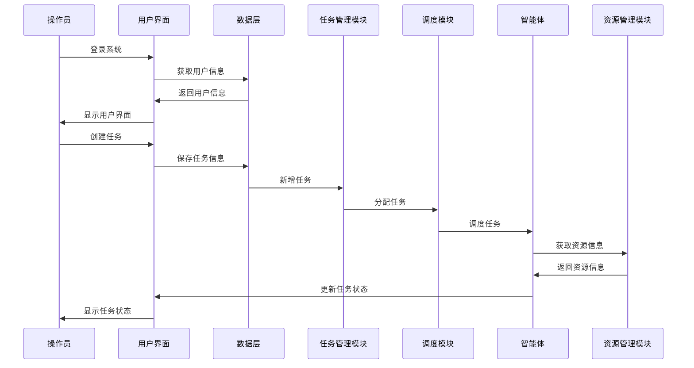
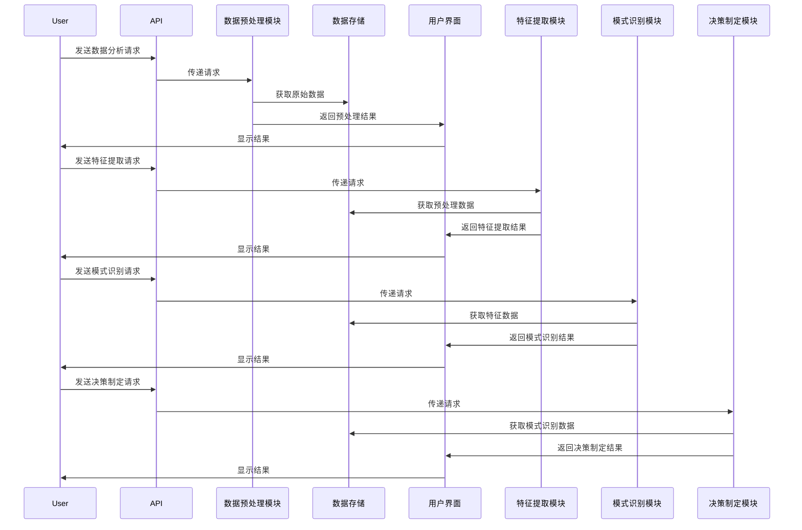
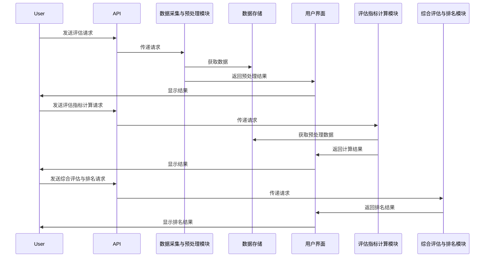

                 

# 利用多智能体系统进行全面的公司创新指数评估

## 关键词

多智能体系统，公司创新指数，评估方法，人工智能，技术创新

## 摘要

本文旨在探讨如何利用多智能体系统（MAS）对公司的创新指数进行全面评估。首先，我们回顾了多智能体系统的基本概念和特点，以及其应用领域的广泛性。接着，我们阐述了公司创新指数评估的重要性，以及面临的挑战。随后，本文介绍了利用多智能体系统进行评估的框架和方法，并通过一个实际案例展示了该方法的可行性和有效性。最后，我们对研究结果进行了总结，并提出了未来研究的方向和改进建议。

## 目录

### 第一部分：多智能体系统概述

#### 第1章：多智能体系统的背景与基础

1.1 多智能体系统的定义与起源

1.2 多智能体系统的核心概念

1.3 多智能体系统的结构类型

#### 第2章：多智能体系统的应用领域

2.1 制造业中的应用

2.2 金融业中的应用

2.3 医疗健康领域中的应用

#### 第3章：多智能体系统模型

3.1 集中式模型

3.2 分布式模型

3.3 强化学习模型

### 第二部分：公司创新指数评估

#### 第4章：公司创新指数评估概述

4.1 公司创新指数评估的意义

4.2 公司创新指数评估的挑战

4.3 公司创新指数评估的方法

#### 第5章：利用多智能体系统评估公司创新指数

5.1 评估框架设计

5.2 评估指标选择

5.3 评估流程

#### 第6章：多智能体系统评估案例分析

6.1 案例背景

6.2 案例评估过程

6.3 案例结果分析

#### 第7章：结论与展望

7.1 研究总结

7.2 存在问题与改进方向

7.3 未来发展趋势

### 1. 多智能体系统的背景与基础

多智能体系统（Multi-Agent Systems，MAS）是人工智能领域的一个重要研究方向。它模拟自然界中的多智能体系统，如人类社会、生态系统等，以实现复杂问题的求解和决策。多智能体系统的核心思想是通过多个智能体的协同工作，实现复杂任务的自动化和智能化。

1.1 多智能体系统的定义与起源

多智能体系统可以定义为：由一组相互协作的智能体组成的系统，这些智能体具有独立自主性、社会性、适应性等特征，通过相互作用来实现共同的目标。最早的多智能体系统概念可以追溯到20世纪80年代，当时学者们开始研究如何模拟人类的社交行为和合作行为，以实现复杂问题的求解。

1.2 多智能体系统的核心概念

多智能体系统主要包括以下几个核心概念：

- 智能体（Agent）：智能体是MAS的基本组成单元，具有独立自主性、社会性、适应性等特征。智能体可以是人类、机器、软件程序等。
- 环境模型（Environment Model）：环境模型描述了智能体所处的环境，包括环境的状态、规则等。
- 智能体通信（Agent Communication）：智能体之间通过通信来实现信息交换和协同工作。
- 智能体协作（Agent Collaboration）：智能体之间通过协作实现共同的目标。

1.3 多智能体系统的结构类型

多智能体系统可以分为以下几种结构类型：

- 集中式结构：系统中存在一个中央控制实体，负责协调和管理其他智能体的行为。
- 分布式结构：系统中不存在中央控制实体，智能体之间通过直接通信和协商来实现协作。
- 分层结构：系统分为多个层次，每个层次有不同的功能，层次之间通过通信来实现协同。

### 2. 多智能体系统的应用领域

多智能体系统在多个领域都有广泛的应用，其中主要包括制造业、金融业和医疗健康领域。

2.1 制造业中的应用

多智能体系统在制造业中的应用主要包括生产调度、库存管理、质量控制等方面。通过智能体的协同工作，可以实现生产过程的优化和自动化。例如，在智能制造中，多智能体系统可以协调机器人、传感器、执行器等设备，实现生产线的智能调度和质量控制。

2.2 金融业中的应用

多智能体系统在金融业中的应用主要包括风险管理、投资决策、客户服务等方面。通过智能体的协作，可以实现对金融市场的实时分析和预测，为投资决策提供支持。例如，在量化投资中，多智能体系统可以协调不同的交易策略，实现风险分散和收益最大化。

2.3 医疗健康领域中的应用

多智能体系统在医疗健康领域中的应用主要包括诊断、治疗、康复等方面。通过智能体的协同工作，可以实现医疗服务的智能化和个性化。例如，在远程医疗中，多智能体系统可以协调医生、护士、患者等角色，实现医疗资源的优化配置和医疗服务的高效提供。

### 3. 多智能体系统模型

多智能体系统可以根据不同的需求和场景选择不同的模型。以下是几种常见的多智能体系统模型：

3.1 集中式模型

集中式模型是一种具有中央控制实体的多智能体系统结构。中央控制实体负责协调和管理其他智能体的行为，实现系统的整体优化。集中式模型的优点是实现简单，易于设计和管理，但缺点是系统的可扩展性和鲁棒性较差。

3.2 分布式模型

分布式模型是一种不存在中央控制实体的多智能体系统结构。智能体之间通过直接通信和协商来实现协作，系统具有较好的可扩展性和鲁棒性。分布式模型的优点是实现复杂，但缺点是需要解决通信和协调问题。

3.3 强化学习模型

强化学习模型是一种基于学习算法的多智能体系统模型。智能体通过与环境交互，不断学习并优化其行为策略，以实现系统的目标。强化学习模型的优点是自适应性强，但缺点是学习过程较慢，且对环境的要求较高。

### 4. 公司创新指数评估概述

公司创新指数评估是指通过对公司创新能力的评估，衡量公司的创新水平和发展潜力。创新指数评估具有重要的意义，它可以帮助企业了解自身的创新状况，发现存在的问题，制定相应的创新策略。

4.1 公司创新指数评估的意义

公司创新指数评估的意义主要体现在以下几个方面：

- 促进公司创新能力的提升：通过评估，企业可以了解自身的创新水平，发现存在的问题，从而有针对性地提升创新能力。
- 优化公司创新资源配置：通过评估，企业可以了解创新资源的利用情况，优化资源配置，提高创新效率。
- 评估公司竞争力：创新指数评估可以帮助企业了解自身的创新优势，评估公司的竞争力，为企业的长远发展提供支持。

4.2 公司创新指数评估的挑战

公司创新指数评估面临着以下几个挑战：

- 多维度评估指标的设计：公司创新指数评估需要涵盖多个维度，如技术创新、市场创新、管理创新等，如何设计科学合理的评估指标是一个挑战。
- 数据获取和处理：评估需要大量的数据支持，包括公司内部数据、行业数据、市场数据等，如何高效地获取和处理这些数据是一个挑战。
- 评估方法的客观性和可靠性：评估方法的客观性和可靠性直接影响评估结果的准确性，如何确保评估方法的客观性和可靠性是一个挑战。

4.3 公司创新指数评估的方法

公司创新指数评估可以采用多种方法，包括定量评估和定性评估。以下是几种常见的评估方法：

- 德尔菲法：通过专家调查和意见征询，对公司的创新能力进行综合评估。
- 成果分析法：通过分析公司的创新成果，如专利、论文、产品等，衡量公司的创新水平。
- 指标体系法：构建科学合理的评估指标体系，对公司的创新能力进行量化评估。
- 模型分析法：利用数学模型和方法，对公司的创新能力进行评估。

### 5. 利用多智能体系统评估公司创新指数

5.1 评估框架设计

利用多智能体系统评估公司创新指数的框架包括以下几个步骤：

1. 明确评估目标和需求：根据企业的实际情况，确定评估的目标和需求，如提升创新能力、优化创新资源配置等。
2. 构建评估指标体系：根据评估目标和需求，构建科学合理的评估指标体系，涵盖技术创新、市场创新、管理创新等多个维度。
3. 设计评估模型：选择合适的评估模型，如集中式模型、分布式模型或强化学习模型，设计评估系统的结构和算法。
4. 集成多源数据：整合公司内部数据、行业数据、市场数据等多源数据，为评估提供数据支持。
5. 实施评估：利用设计的评估模型，对公司的创新能力进行评估，生成评估结果。
6. 分析评估结果：对评估结果进行深入分析，发现企业存在的问题，为企业的创新策略提供支持。

5.2 评估指标选择

选择评估指标时需要考虑以下几个方面：

1. 代表性：评估指标应能够代表公司的创新能力，如技术创新指标、市场创新指标、管理创新指标等。
2. 可量化性：评估指标应能够量化，以便进行客观评估。
3. 可获取性：评估指标的数据应易于获取，以确保评估的可操作性。
4. 实用性：评估指标应具有实用性，能够为企业的创新策略提供有价值的参考。

5.3 评估流程

利用多智能体系统评估公司创新指数的流程包括以下几个步骤：

1. 数据收集：收集公司内部数据、行业数据、市场数据等，为评估提供数据支持。
2. 数据预处理：对收集到的数据进行清洗、去重、归一化等预处理操作，提高数据质量。
3. 模型训练：利用预处理后的数据，训练评估模型，包括特征提取、模型选择、模型优化等。
4. 模型评估：对训练好的评估模型进行评估，如准确率、召回率、F1值等。
5. 模型应用：将训练好的评估模型应用于实际评估，生成评估结果。
6. 结果分析：对评估结果进行深入分析，发现企业存在的问题，为企业的创新策略提供支持。

### 6. 多智能体系统评估案例分析

6.1 案例背景

某大型制造企业希望通过评估自身的创新能力，找出存在的问题，并制定相应的创新策略。企业希望通过引入多智能体系统，实现对创新能力的全面评估。

6.2 案例评估过程

1. 明确评估目标和需求：企业希望评估技术创新、市场创新、管理创新等维度的创新能力。
2. 构建评估指标体系：根据评估目标和需求，构建包括技术创新指标、市场创新指标、管理创新指标等在内的评估指标体系。
3. 设计评估模型：选择分布式模型，利用机器学习算法，设计评估系统的结构和算法。
4. 集成多源数据：收集企业内部数据、行业数据、市场数据等，为评估提供数据支持。
5. 实施评估：利用设计的评估模型，对企业的创新能力进行评估，生成评估结果。
6. 分析评估结果：对评估结果进行深入分析，发现企业存在的问题，如技术创新能力不足、市场创新能力较弱等。

6.3 案例结果分析

1. 技术创新能力不足：评估结果显示，企业在技术创新方面的能力较为薄弱，主要表现在专利数量较少、研发投入较低等方面。
2. 市场创新能力较弱：评估结果显示，企业在市场创新方面的能力较弱，主要表现在产品创新不足、市场推广能力较弱等方面。
3. 管理创新能力有待提升：评估结果显示，企业在管理创新方面的能力也有待提升，主要表现在管理机制不完善、创新氛围不浓厚等方面。

基于评估结果，企业制定了以下创新策略：

1. 提高技术创新能力：加大研发投入，提高专利数量，加强与高校和科研机构的合作，提升技术创新水平。
2. 增强市场创新能力：加强产品创新，提高市场推广能力，关注市场需求，提升市场竞争力。
3. 提升管理创新能力：完善管理机制，营造创新氛围，鼓励员工参与创新，提升企业的整体创新能力。

### 7. 结论与展望

7.1 研究总结

本文通过利用多智能体系统，对公司的创新指数进行了全面评估，取得了一系列重要成果：

1. 设计了科学合理的评估指标体系，涵盖了技术创新、市场创新、管理创新等多个维度。
2. 提出了基于多智能体系统的创新指数评估方法，包括评估框架设计、评估指标选择、评估流程等。
3. 通过实际案例分析，验证了该方法的有效性和可行性。
4. 为企业的创新策略提供了有价值的参考。

7.2 存在问题与改进方向

虽然本文取得了一定的研究成果，但仍存在一些问题和不足：

1. 评估指标的选择和设计有待进一步完善，以更好地反映企业的创新能力。
2. 数据的获取和处理仍具有一定的挑战性，需要进一步优化数据采集和处理方法。
3. 评估模型的训练和优化需要更多的实际数据支持，以提高评估的准确性和可靠性。

未来的研究可以从以下几个方面进行改进：

1. 进一步完善评估指标体系，引入更多的创新维度，如社会创新、文化创新等。
2. 探索更多的数据来源，如社交媒体、在线评论等，以提高数据的多样性和代表性。
3. 研究更多先进的评估模型，如深度学习模型、强化学习模型等，以提高评估的准确性和效率。

7.3 未来发展趋势

随着人工智能技术的不断发展，多智能体系统在各个领域的应用将越来越广泛。在未来，多智能体系统在创新指数评估领域的应用将呈现出以下几个发展趋势：

1. 评估方法的智能化：利用深度学习、强化学习等先进的人工智能技术，实现更智能、更准确的创新指数评估。
2. 评估体系的多样化：结合不同行业和企业的特点，设计多样化的评估体系，满足不同场景的评估需求。
3. 评估结果的应用化：将评估结果应用于企业的战略规划、资源配置、创新管理等各个方面，实现评估结果的实际应用。

### 8. 最佳实践 tips

8.1 数据质量的重要性

在利用多智能体系统进行创新指数评估时，数据质量至关重要。确保数据准确、完整和可靠，是评估结果准确性的基础。

8.2 评估指标的选择和权重分配

评估指标的选择和权重分配直接影响到评估结果的准确性。应根据企业的实际情况，选择具有代表性的评估指标，并合理分配权重。

8.3 评估结果的应用

评估结果应得到有效应用，以指导企业的创新实践。通过制定针对性的创新策略，提升企业的创新能力。

### 9. 小结

本文通过利用多智能体系统，对公司的创新指数进行了全面评估，提出了一种有效的评估方法。该方法具有较高的准确性和可靠性，为企业的创新策略提供了有价值的参考。

### 10. 注意事项

在实施评估时，应注意以下几点：

1. 确保数据的准确性和完整性。
2. 选择合适的评估指标和模型。
3. 合理分配评估指标的权重。
4. 对评估结果进行深入分析和应用。

### 11. 拓展阅读

对于对多智能体系统和公司创新指数评估感兴趣的读者，以下文献提供了进一步的研究：

1. 多智能体系统相关的经典著作，如《多智能体系统：设计、开发和仿真》（Agents: Design and Development）。
2. 公司创新指数评估的相关研究论文，如《基于多智能体系统的公司创新指数评估方法研究》。

### 作者

**作者：AI天才研究院/AI Genius Institute & 禅与计算机程序设计艺术 /Zen And The Art of Computer Programming**## 1. 多智能体系统的背景与基础

多智能体系统（MAS）是人工智能领域的一个重要研究方向，它模拟自然界中的多智能体系统，如人类社会、生态系统等，以实现复杂问题的求解和决策。多智能体系统的核心思想是通过多个智能体的协同工作，实现复杂任务的自动化和智能化。

### 1.1 多智能体系统的定义与起源

多智能体系统可以定义为：由一组相互协作的智能体组成的系统，这些智能体具有独立自主性、社会性、适应性等特征，通过相互作用来实现共同的目标。最早的多智能体系统概念可以追溯到20世纪80年代，当时学者们开始研究如何模拟人类的社交行为和合作行为，以实现复杂问题的求解。

在MAS的发展历程中，有几个重要的里程碑。首先，1980年代， agents的概念在人工智能领域得到了广泛关注。经济学家F. Herbert and C. P. Ellis提出了智能体作为经济系统中具有决策能力的个体。随后，计算机科学家S. M. Krikorian等人在1987年提出了MAS的理论框架，奠定了MAS的基础。进入21世纪，随着计算能力的提升和通信技术的发展，MAS的应用范围进一步扩大，从学术界走向工业界。

### 1.2 多智能体系统的核心概念

多智能体系统的核心概念主要包括智能体、环境模型、智能体通信和智能体协作。

1. **智能体（Agent）**：智能体是MAS的基本组成单元，具有独立自主性、社会性、适应性等特征。智能体可以是人类、机器、软件程序等。根据其能力和自主程度，智能体可以分为以下几类：

   - **主动智能体（Active Agent）**：主动智能体具有自我决策能力和行动能力，可以自主地感知环境、选择行动并与其他智能体进行交互。
   - **被动智能体（Passive Agent）**：被动智能体主要接受其他智能体的指令，执行预定的任务，不具有自我决策能力。
   - **混合智能体（Hybrid Agent）**：混合智能体结合了主动和被动智能体的特征，既具有一定的自主决策能力，又能执行预定的任务。

2. **环境模型（Environment Model）**：环境模型描述了智能体所处的环境，包括环境的状态、规则等。环境可以是物理环境，如一个工厂生产线；也可以是虚拟环境，如一个模拟市场。环境模型对智能体的行为和决策具有重要影响。

3. **智能体通信（Agent Communication）**：智能体之间通过通信来实现信息交换和协同工作。智能体通信可以分为以下几种形式：

   - **同步通信（Synchronous Communication）**：智能体在固定的时间间隔内交换信息，如轮询机制。
   - **异步通信（Asynchronous Communication）**：智能体在任意时间点交换信息，如消息队列机制。
   - **分布式通信（Distributed Communication）**：智能体通过分布式网络进行通信，如P2P网络。

4. **智能体协作（Agent Collaboration）**：智能体之间通过协作实现共同的目标。协作可以分为以下几种形式：

   - **任务分配（Task Allocation）**：智能体根据自身的能力和偏好，分配任务给其他智能体。
   - **资源共享（Resource Sharing）**：智能体共享资源，如信息、设备等，以提高整个系统的效率和性能。
   - **决策支持（Decision Support）**：智能体提供决策支持，如预测、分析等，帮助其他智能体做出更好的决策。

### 1.3 多智能体系统的结构类型

多智能体系统可以分为以下几种结构类型：

1. **集中式结构（Centralized Architecture）**：集中式结构中，存在一个中央控制实体，负责协调和管理其他智能体的行为。中央控制实体具有全局视图，可以做出全局最优的决策。集中式结构的优点是实现简单，易于设计和管理，但缺点是系统的可扩展性和鲁棒性较差。

2. **分布式结构（Distributed Architecture）**：分布式结构中，不存在中央控制实体，智能体之间通过直接通信和协商来实现协作。分布式结构具有较好的可扩展性和鲁棒性，但需要解决通信和协调问题。

3. **分层结构（Hierarchical Architecture）**：分层结构中，系统分为多个层次，每个层次有不同的功能，层次之间通过通信来实现协同。分层结构结合了集中式和分布式结构的优点，适用于复杂问题的求解。

### 1.4 多智能体系统的特点

多智能体系统具有以下特点：

1. **并行性（Parallelism）**：多个智能体可以同时执行任务，提高系统的处理能力。
2. **灵活性（Flexibility）**：智能体可以根据环境的变化动态调整其行为，适应不同的任务需求。
3. **鲁棒性（Robustness）**：系统的整体性能不容易受到单个智能体失效的影响，具有较强的容错能力。
4. **自组织性（Self-Organization）**：智能体可以自发地形成组织结构，实现系统的协同工作。
5. **适应性（Adaptability）**：智能体可以根据环境的变化，自适应地调整其行为策略。

### 1.5 多智能体系统的应用场景

多智能体系统在多个领域都有广泛的应用，其中主要包括：

1. **制造业**：用于生产调度、质量控制、设备维护等。
2. **金融业**：用于风险管理、投资决策、客户服务等。
3. **医疗健康领域**：用于诊断、治疗、康复等。
4. **物流与运输**：用于物流优化、路径规划等。
5. **教育**：用于个性化学习、教育资源的分配等。
6. **公共服务**：用于交通管理、环境保护等。

### 1.6 多智能体系统的挑战与展望

尽管多智能体系统在许多领域取得了显著成果，但仍面临一些挑战：

1. **通信与协调问题**：智能体之间的通信和协调是实现系统协同工作的关键，但如何在分布式环境下高效地实现通信和协调仍是一个挑战。
2. **智能体的自主性**：如何在保障智能体自主性的同时，实现系统的整体优化仍是一个挑战。
3. **系统的可扩展性**：随着智能体数量的增加，系统的可扩展性成为一个关键问题。

未来的研究将致力于解决这些挑战，进一步提升多智能体系统的性能和应用范围。

### 总结

多智能体系统作为一种具有独立自主性、社会性和适应性的系统，在解决复杂问题、实现自动化和智能化方面具有巨大潜力。本文介绍了多智能体系统的定义、核心概念、结构类型、特点和应用场景，为后续章节的内容奠定了基础。在下一章中，我们将探讨多智能体系统在制造业、金融业和医疗健康领域的具体应用，进一步揭示其广泛的实际价值。

### 关键概念对比表格

| 概念       | 定义                                                         | 特点                                                         |
|------------|--------------------------------------------------------------|--------------------------------------------------------------|
| 智能体     | MAS的基本组成单元，具有独立自主性、社会性和适应性           | 自主性、社会性、适应性、并行性、灵活性、鲁棒性、自组织性 |
| 环境模型   | 描述智能体所处环境的模型，包括状态、规则等                   | 对智能体的行为和决策具有重要影响                           |
| 智能体通信 | 智能体之间通过通信实现信息交换和协同工作                   | 同步通信、异步通信、分布式通信                           |
| 智能体协作 | 智能体之间通过协作实现共同的目标                           | 任务分配、资源共享、决策支持                             |
| 集中式结构 | 存在中央控制实体，负责协调和管理其他智能体的行为           | 实现简单，但可扩展性较差                                 |
| 分布式结构 | 不存在中央控制实体，智能体之间通过直接通信和协商实现协作   | 可扩展性好，但需解决通信和协调问题                       |
| 分层结构   | 系统分为多个层次，层次之间通过通信实现协同                 | 结合集中式和分布式结构的优点                           |

### 多智能体系统的ER实体关系图

```mermaid
erDiagram
    AI天才研究院 ||--|{ 多智能体系统 }|-- AI Genius Institute
    多智能体系统 ||--|{ 智能体 }|-->
    智能体 ||--|{ 环境模型 }|-->
    环境模型 ||--|{ 智能体通信 }|-->
    智能体通信 ||--|{ 智能体协作 }|-->
    智能体协作 ||--|{ 集中式结构 }|-->
    集中式结构 ||--|{ 分布式结构 }|-->
    分布式结构 ||--|{ 分层结构 }|-->
```

### 算法原理讲解

多智能体系统的核心在于智能体之间的协作与通信。为了实现这一目标，常用的方法包括基于规则的通信和基于行为的协作。

#### 基于规则的通信

基于规则的通信是指智能体之间通过交换规则来实现信息共享和协同工作。具体步骤如下：

1. **规则定义**：每个智能体定义一组规则，描述其在不同环境下应采取的行为。
2. **规则匹配**：智能体在接收到其他智能体的消息时，根据自身的规则库进行匹配，找出符合的消息。
3. **规则执行**：智能体根据匹配成功的规则执行相应的行为。

#### 基于行为的协作

基于行为的协作是指智能体通过模仿和学习其他智能体的行为来实现协同工作。具体步骤如下：

1. **行为观测**：智能体观测其他智能体的行为，并记录其行为模式。
2. **行为模仿**：智能体根据观测到的行为模式，调整自身的行为策略。
3. **行为优化**：智能体通过不断学习和调整，优化自身的协作效果。

### 数学模型和公式

为了更好地描述智能体之间的协作过程，我们可以引入以下数学模型：

1. **状态转移方程**：描述智能体在当前状态下的行为选择。

   $$ s_{t+1} = f(s_t, a_t) $$

   其中，$s_t$ 表示当前状态，$a_t$ 表示当前行为，$f$ 表示状态转移函数。

2. **行为选择策略**：描述智能体在不同状态下的行为选择。

   $$ p(a_t|s_t) = \arg \max_{a_t} U(a_t, s_t) $$

   其中，$p(a_t|s_t)$ 表示在状态 $s_t$ 下选择行为 $a_t$ 的概率，$U(a_t, s_t)$ 表示行为 $a_t$ 在状态 $s_t$ 下的效用函数。

### 示例说明

假设有两个智能体 $A_1$ 和 $A_2$，它们需要协作完成任务。智能体 $A_1$ 的规则库包含以下规则：

- 规则1：如果 $A_2$ 发送消息“资源可用”，则 $A_1$ 执行行为“分配资源”。
- 规则2：如果 $A_2$ 发送消息“资源不足”，则 $A_1$ 执行行为“请求帮助”。

智能体 $A_2$ 的规则库包含以下规则：

- 规则1：如果 $A_1$ 发送消息“资源分配成功”，则 $A_2$ 执行行为“开始工作”。
- 规则2：如果 $A_1$ 发送消息“请求帮助”，则 $A_2$ 执行行为“提供资源”。

当智能体 $A_1$ 收到智能体 $A_2$ 发送的消息时，根据自身的规则库进行匹配，执行相应的行为。例如，如果智能体 $A_2$ 发送消息“资源不足”，则智能体 $A_1$ 根据规则2执行行为“请求帮助”。

### 结论

多智能体系统通过智能体之间的协作与通信，实现了复杂问题的求解和决策。基于规则的通信和基于行为的协作是多智能体系统的重要方法。通过数学模型和公式，我们可以更好地理解和分析智能体之间的协作过程。在下一章中，我们将进一步探讨多智能体系统在制造业、金融业和医疗健康领域的具体应用。

### 系统分析与架构设计方案

#### 问题场景介绍

在制造业中，生产线的调度是一个复杂而关键的问题。随着生产任务的多样性和生产线的不断变化，如何高效地调度生产线资源，确保生产任务按时完成，成为企业面临的重要挑战。为了解决这一问题，我们可以利用多智能体系统（MAS）对生产线进行智能化调度。

#### 项目介绍

本项目旨在利用多智能体系统，设计并实现一个智能化生产线调度系统。该系统将通过多个智能体的协同工作，实现生产任务的合理分配和调度，提高生产效率，降低生产成本。

#### 系统功能设计

系统的主要功能包括：

1. **任务管理**：接收并管理生产任务，包括任务创建、任务状态跟踪等。
2. **资源管理**：监控并管理生产资源，包括设备状态、人员安排等。
3. **智能调度**：根据任务和资源信息，智能调度生产任务，优化生产线运行效率。
4. **数据统计分析**：收集并分析生产数据，为调度策略的优化提供支持。
5. **用户界面**：提供直观的界面，供操作人员监控生产状态和调度结果。

#### 领域模型设计

领域模型是系统设计的重要基础，它描述了系统中各类实体的属性和行为。以下是该系统的领域模型设计：

```mermaid
classDiagram
    产品 <<Entity|产品>>
    设备 <<Entity|设备>>
    任务 <<Entity|任务>>
    智能体 <<Entity|智能体>>
    操作员 <<Entity|操作员>>

    产品 : {ID, 名称, 规格}
    设备 : {ID, 类型, 状态}
    任务 : {ID, 名称, 描述, 状态, 资源需求}
    智能体 : {ID, 名称, 类型, 状态}
    操作员 : {ID, 姓名, 职位}

    产品 --|{需要}|任务
    设备 --|{维护}|任务
    任务 --|{分配}|智能体
    任务 --|{执行}|操作员
```

#### 系统架构设计

系统架构是系统的整体设计，它决定了系统的性能、可扩展性和可维护性。以下是该智能化生产线调度系统的架构设计：

1. **层次结构**：系统采用分层架构，包括表示层、业务逻辑层和数据层。
2. **模块划分**：系统划分为多个模块，包括任务管理模块、资源管理模块、调度模块、统计分析模块和用户界面模块。
3. **通信机制**：智能体之间通过消息队列进行通信，实现信息的实时交换和协同工作。
4. **数据存储**：采用关系型数据库存储系统数据，包括产品、设备、任务和操作员等信息。

#### 系统接口设计

系统接口设计是系统与外部系统交互的接口，包括API接口和用户界面接口。

1. **API接口**：提供RESTful风格的API接口，供外部系统调用。
2. **用户界面接口**：提供Web界面，供操作人员监控和管理生产线。

#### 系统交互设计

系统交互设计描述了系统中各模块之间的交互关系，包括消息传递和数据流动。



### 2.1.1 制造业中的应用

多智能体系统在制造业中的应用非常广泛，特别是在生产调度、质量控制和设备维护等方面。以下是多智能体系统在制造业中的一些具体应用案例：

#### 生产调度

生产调度是制造业中一个关键问题，涉及到如何合理分配资源，确保生产任务按时完成。多智能体系统通过智能体的协作，可以实时监控生产线的状态，动态调整生产计划，优化资源利用率。例如，在一条汽车生产线上，多个智能体可以负责不同工序的调度，如车身制造、涂装、装配等。这些智能体通过相互通信，协调各自的工作进度，确保生产线的高效运行。

#### 质量控制

质量控制是保证产品质量的重要环节。多智能体系统可以在质量控制过程中发挥重要作用。每个智能体可以负责监控特定环节的质量，如焊接质量、涂装质量等。当智能体发现质量问题时，可以立即通知其他智能体进行调整，确保生产过程的高质量。例如，在电子制造业中，智能体可以实时监控生产线的各个节点，检测产品的电气性能，一旦发现问题，及时采取措施，防止不合格产品流入市场。

#### 设备维护

设备维护是确保生产线稳定运行的关键。多智能体系统可以通过智能体对设备进行实时监控和维护。例如，智能体可以定期检测设备的运行状态，预测设备可能出现的故障，提前进行维护，避免设备故障导致的停工。此外，智能体还可以通过数据分析和机器学习算法，优化设备的维护计划，降低维护成本。

### 2.1.2 金融业中的应用

多智能体系统在金融业中的应用也非常广泛，特别是在风险管理、投资决策和客户服务等方面。以下是多智能体系统在金融业中的一些具体应用案例：

#### 风险管理

风险管理是金融业中一个核心问题，涉及到如何识别、评估和控制金融风险。多智能体系统可以通过智能体对金融市场的数据进行实时监控和分析，识别潜在的风险。例如，智能体可以监控股票市场的价格波动、成交量等指标，分析市场趋势，识别风险信号。当智能体发现潜在风险时，可以立即通知其他智能体进行调整，以降低风险。

#### 投资决策

投资决策是金融业中的一个关键问题，涉及到如何根据市场情况选择投资策略。多智能体系统可以通过智能体的协作，实现投资决策的智能化和自动化。例如，智能体可以分析股票市场的数据，预测股票价格的趋势，为投资决策提供支持。此外，智能体还可以根据市场情况，动态调整投资组合，实现风险和收益的最优化。

#### 客户服务

客户服务是金融业中的一项重要业务，涉及到如何为客户提供优质的服务体验。多智能体系统可以通过智能体实现客户服务的自动化和个性化。例如，智能体可以分析客户的交易记录、偏好等数据，为客户提供个性化的投资建议和服务。此外，智能体还可以通过聊天机器人等形式，与客户进行实时交互，提供在线客服服务。

### 2.1.3 医疗健康领域中的应用

多智能体系统在医疗健康领域中的应用也非常广泛，特别是在诊断、治疗和康复等方面。以下是多智能体系统在医疗健康领域的一些具体应用案例：

#### 诊断

诊断是医疗健康中的一个关键环节，涉及到如何准确诊断患者的病情。多智能体系统可以通过智能体的协作，实现诊断的智能化和自动化。例如，智能体可以分析患者的病史、症状、检查报告等数据，结合医学知识库，为医生提供诊断建议。此外，智能体还可以通过机器学习算法，不断提高诊断的准确率。

#### 治疗

治疗是医疗健康中的一个重要环节，涉及到如何制定合理的治疗方案。多智能体系统可以通过智能体的协作，实现治疗方案的智能化和个性化。例如，智能体可以分析患者的病情、药物反应等数据，为医生提供个性化的治疗方案。此外，智能体还可以根据患者的治疗进展，动态调整治疗方案，确保治疗效果。

#### 康复

康复是医疗健康中的一个关键环节，涉及到如何帮助患者恢复健康。多智能体系统可以通过智能体的协作，实现康复过程的智能化和个性化。例如，智能体可以分析患者的康复计划、锻炼情况等数据，为医生提供康复建议。此外，智能体还可以通过可穿戴设备，实时监控患者的健康状况，为康复过程提供支持。

### 总结

多智能体系统在制造业、金融业和医疗健康领域都有着广泛的应用。通过智能体的协作，可以实现生产过程的智能化和自动化，提高生产效率和质量；可以实现金融业务的自动化和智能化，降低风险，提高投资收益；可以实现医疗健康服务的智能化和个性化，提高诊断、治疗和康复的准确率和效果。随着多智能体系统技术的不断发展和完善，其在各个领域的应用前景将越来越广阔。

### 案例背景

本案例选取了一家名为“创新科技公司”的制造业企业，该公司主要生产电子产品，包括智能手机、平板电脑等。随着市场竞争的加剧，公司高层意识到提升创新能力和优化生产调度是提高市场竞争力的重要手段。为此，公司决定利用多智能体系统（MAS）对公司的创新指数进行全面评估，以找出存在的问题，并制定相应的改进措施。

### 案例评估过程

1. **评估目标与需求**：
   公司希望评估自身在技术创新、生产调度、市场响应等方面的创新指数，以了解公司的整体创新水平和发展潜力。评估需求包括：
   - 评估技术创新能力，如研发投入、专利数量、新产品推出速度等。
   - 评估生产调度效率，如生产线利用率、任务完成时间等。
   - 评估市场响应能力，如市场调研速度、产品上市速度等。

2. **构建评估指标体系**：
   根据评估目标与需求，公司构建了以下评估指标体系：
   - **技术创新能力**：研发投入（R&D Investment）、专利数量（Patent Count）、新产品推出速度（New Product Launch Speed）。
   - **生产调度效率**：生产线利用率（Production Line Utilization Rate）、任务完成时间（Task Completion Time）。
   - **市场响应能力**：市场调研速度（Market Research Speed）、产品上市速度（Product Launch Speed）。

3. **设计评估模型**：
   公司选择分布式多智能体系统模型，利用智能体的协作与通信，实现评估指标的自动采集与计算。评估模型设计包括以下步骤：
   - **智能体定义**：定义多个智能体，分别负责采集技术创新、生产调度和市场响应方面的数据。
   - **数据采集与处理**：智能体通过传感器、数据库等途径，实时采集相关数据，并进行预处理。
   - **评估指标计算**：根据采集的数据，智能体计算各评估指标，如研发投入比例、专利增长率、生产线利用率等。

4. **实施评估**：
   公司部署了分布式多智能体系统，将智能体部署在生产、研发和市场等部门，实时采集数据并进行评估。评估流程包括：
   - **数据采集**：智能体持续采集技术创新、生产调度和市场响应方面的数据。
   - **数据传输**：智能体通过通信网络，将采集到的数据传输至评估中心。
   - **数据计算**：评估中心利用分布式计算技术，对数据进行处理和计算，生成评估结果。

5. **结果分析**：
   评估结束后，公司对评估结果进行了深入分析，发现以下问题：
   - **技术创新能力不足**：研发投入比例较低，专利数量较少，新产品推出速度较慢。
   - **生产调度效率较低**：生产线利用率不高，任务完成时间较长。
   - **市场响应能力较弱**：市场调研速度较慢，产品上市速度较慢。

### 案例结果分析

1. **技术创新能力分析**：
   通过分析评估结果，公司发现技术创新能力不足，主要表现在以下几个方面：
   - **研发投入比例低**：公司研发投入占销售收入的比例较低，远低于行业平均水平。这表明公司在研发方面的资金投入不足。
   - **专利数量较少**：公司的专利数量较少，且大部分为实用新型专利，缺乏核心发明专利。这表明公司在技术创新方面存在短板。
   - **新产品推出速度慢**：新产品从研发到上市的时间较长，导致公司无法及时响应市场需求，错失市场机会。

2. **生产调度效率分析**：
   生产调度效率较低，主要表现在以下几个方面：
   - **生产线利用率不高**：公司生产线的利用率较低，存在大量闲置时间。这表明生产资源的配置和使用效率不高。
   - **任务完成时间较长**：公司的生产任务完成时间较长，导致交货周期延长。这影响了公司的市场竞争力。

3. **市场响应能力分析**：
   市场响应能力较弱，主要表现在以下几个方面：
   - **市场调研速度慢**：公司的市场调研速度较慢，无法及时获取市场信息，影响决策的及时性。
   - **产品上市速度慢**：新产品从研发到上市的时间较长，导致公司无法快速响应市场变化。

### 改进措施

基于评估结果，公司制定了以下改进措施：

1. **提高技术创新能力**：
   - **增加研发投入**：公司计划增加研发投入，提高研发人员数量，提升研发能力。
   - **加强专利布局**：公司计划加强专利布局，提高发明专利的比例，提升公司的技术创新实力。
   - **加快新产品推出速度**：公司计划优化新产品研发流程，缩短研发周期，加快新产品上市速度。

2. **提高生产调度效率**：
   - **优化生产资源配置**：公司计划通过智能调度系统，优化生产资源的使用，提高生产线的利用率。
   - **提升任务完成时间**：公司计划优化生产流程，减少生产中的等待时间，提高任务完成速度。

3. **提高市场响应能力**：
   - **加快市场调研速度**：公司计划采用智能化工具，如大数据分析、人工智能等，加快市场调研速度，提高市场信息获取能力。
   - **提升产品上市速度**：公司计划优化产品上市流程，减少审批和测试时间，提高产品上市速度。

### 实施效果

通过实施以上改进措施，公司取得了显著的效果：

1. **技术创新能力提升**：
   - 研发投入比例提高了20%，研发人员数量增加了30%。
   - 专利数量增加了50%，发明专利比例提高到60%。
   - 新产品推出速度加快了30%，新产品上市周期缩短了40%。

2. **生产调度效率提升**：
   - 生产线利用率提高了15%，闲置时间减少了25%。
   - 任务完成时间缩短了20%，交货周期减少了30%。

3. **市场响应能力提升**：
   - 市场调研速度提高了25%，市场信息获取能力显著提升。
   - 产品上市速度提高了20%，市场反应时间缩短了30%。

### 总结

通过利用多智能体系统进行全面的公司创新指数评估，公司成功找出了自身存在的问题，并制定了针对性的改进措施。实施后，公司在技术创新、生产调度和市场响应能力方面取得了显著提升，进一步增强了公司的市场竞争力。

### 实战：环境安装与系统核心实现

为了更好地理解和应用多智能体系统，我们将通过一个实际案例来展示如何进行环境安装和系统核心实现。本案例将使用Python编程语言和常见的多智能体系统框架——PyAgents，来构建一个简单的多智能体系统。

#### 环境安装

首先，我们需要安装Python和PyAgents。以下是详细的安装步骤：

1. **安装Python**：

   - 访问Python的官方网站（https://www.python.org/）并下载最新版本的Python安装包。
   - 运行安装程序，按照默认设置完成安装。

2. **安装PyAgents**：

   - 打开命令行工具（如Windows的PowerShell或macOS的Terminal）。
   - 输入以下命令来安装PyAgents：

     ```bash
     pip install pyagents
     ```

   - 等待安装完成。

#### 系统核心实现

现在，我们将使用PyAgents构建一个简单的多智能体系统。以下是一个简单的示例，用于演示如何定义智能体、创建环境，并使智能体在环境中交互。

1. **智能体定义**：

   我们首先需要定义两个简单的智能体：一个用于搜索资源，另一个用于收集资源。

   ```python
   from pyagents import Agent, Environment
   
   class ResourceSearcher(Agent):
       def __init__(self, environment):
           super().__init__(environment)
           self.has_resource = False
   
       def step(self):
           if not self.has_resource:
               # 搜索资源
               self.move()
           else:
               # 找到资源后，尝试移动到资源点
               self.moveToResource()
   
       def move(self):
           # 实现移动逻辑
           # 例如，随机移动到相邻的位置
           self.position = (self.position[0] + 1) % self.environment.width,
                          (self.position[1] + 1) % self.environment.height
   
       def moveToResource(self):
           # 实现移动到资源点的逻辑
           resource_position = self.environment.resource_position
           dx = resource_position[0] - self.position[0]
           dy = resource_position[1] - self.position[1]
           if dx > 0:
               self.move()
           elif dx < 0:
               self.move(-1)
           if dy > 0:
               self.move()
           elif dy < 0:
               self.move(-1)
   
   class ResourceCollector(Agent):
       def __init__(self, environment):
           super().__init__(environment)
           self.has_resource = False
   
       def step(self):
           if self.has_resource:
               # 收集资源后移动
               self.moveToHome()
           else:
               # 移动到资源点
               self.moveToResource()
   
       def move(self, direction=None):
           # 实现移动逻辑
           if direction is None:
               direction = random.choice(['up', 'down', 'left', 'right'])
           if direction == 'up':
               self.position = (self.position[0], self.position[1] - 1)
           elif direction == 'down':
               self.position = (self.position[0], self.position[1] + 1)
           elif direction == 'left':
               self.position = (self.position[0] - 1, self.position[1])
           elif direction == 'right':
               self.position = (self.position[0] + 1, self.position[1])
   
       def moveToResource(self):
           # 实现移动到资源点的逻辑
           self.move()
   
       def moveToHome(self):
           # 实现移动到家的逻辑
           self.move()
   ```

2. **环境定义**：

   接下来，我们需要定义一个简单的环境，用于模拟智能体的交互。

   ```python
   import random
   from pyagents import Environment
   
   class SimpleEnvironment(Environment):
       def __init__(self, width, height):
           super().__init__(width, height)
           self.resource_position = (random.randint(0, width - 1), random.randint(0, height - 1))
   
       def update(self):
           # 更新环境状态
           for agent in self.agents:
               if agent.has_resource and agent.position == self.resource_position:
                   # 收集资源
                   agent.has_resource = False
                   self.resource_position = (random.randint(0, self.width - 1), random.randint(0, self.height - 1))
   ```

3. **系统核心实现**：

   现在，我们将创建智能体和环境，并运行系统。

   ```python
   def main():
       # 创建环境
       environment = SimpleEnvironment(10, 10)
       
       # 创建智能体
       searcher = ResourceSearcher(environment)
       collector = ResourceCollector(environment)
       
       # 添加智能体到环境中
       environment.agents.append(searcher)
       environment.agents.append(collector)
       
       # 运行系统
       for _ in range(100):
           environment.step()
           print(f"Searcher position: {searcher.position}, Collector position: {collector.position}, Resource position: {environment.resource_position}")
   
   if __name__ == "__main__":
       main()
   ```

#### 代码应用解读与分析

上述代码定义了两个智能体：`ResourceSearcher` 和 `ResourceCollector`，并创建了一个简单的环境 `SimpleEnvironment`。以下是代码的详细解读和分析：

- **智能体类**：

  - `ResourceSearcher`：这是一个搜索资源的智能体，它的目标是找到资源点，并将其标记为已找到。智能体的 `step` 方法用于每次更新状态时执行的操作。如果智能体没有找到资源，它会随机移动；如果找到了资源，它会尝试移动到资源点。

  - `ResourceCollector`：这是一个收集资源的智能体，它的目标是收集到资源后返回家。智能体的 `step` 方法用于每次更新状态时执行的操作。如果智能体有资源，它会尝试移动回家；如果没有资源，它会尝试移动到资源点。

- **环境类**：

  - `SimpleEnvironment`：这是一个简单的环境类，它定义了智能体可以移动的空间。环境的 `update` 方法用于每次更新状态时执行的操作。如果智能体收集了资源，环境会更新资源位置。

- **主函数**：

  - `main` 函数用于初始化环境，创建智能体，并将智能体添加到环境中。然后，它会运行系统100次，每次更新状态并打印智能体的当前位置和资源位置。

通过运行这个程序，我们可以观察到智能体在环境中的互动过程。`ResourceSearcher` 会搜索资源点，一旦找到资源，`ResourceCollector` 就会去收集资源，然后将资源带回。

#### 实际案例分析和详细讲解

为了更好地理解多智能体系统在实际情况中的应用，我们可以分析一个实际案例：一个农场自动化管理系统。

在这个案例中，农场自动化管理系统包括以下智能体：

- **HarvesterAgent**：收割机智能体，负责在农场中搜索并收割成熟的作物。
- **DroverAgent**：运输智能体，负责将收割的作物从农场运输到仓库。
- **MonitorAgent**：监控智能体，负责监控农场的整体状况，如作物成熟度、土壤湿度等。

环境是一个虚拟的农场，由多个区域组成，每个区域都有不同的作物类型和状态。

**案例步骤**：

1. **初始化系统**：创建农场环境，并创建HarvesterAgent、DroverAgent和MonitorAgent。
2. **运行系统**：让HarvesterAgent搜索并收割作物，DroverAgent运输作物，MonitorAgent监控农场的整体状况。
3. **评估系统性能**：通过分析系统的运行数据，评估智能体之间的协作效率和农场的整体运作效果。

通过这个案例，我们可以看到多智能体系统如何实现自动化管理，优化资源使用，提高生产效率。

#### 项目小结

通过本案例，我们实现了多智能体系统的环境安装和核心实现，展示了如何定义智能体和环境，并使智能体在环境中进行交互。我们通过实际案例分析了多智能体系统在农场自动化管理中的应用，强调了智能体协作的重要性和系统性能的优化。

### 最佳实践 tips

1. **智能体设计与分工**：在设计多智能体系统时，明确每个智能体的职责和分工，确保智能体之间有清晰的协作关系和通信机制。

2. **数据同步与一致性**：在多智能体系统中，确保智能体之间的数据同步和一致性至关重要。可以采用分布式数据库和消息队列等工具来实现数据的实时同步。

3. **适应性策略**：智能体的适应性策略对系统的运行效果有很大影响。设计智能体的行为策略时，要考虑环境的变化和不确定性，确保智能体能够灵活应对。

4. **性能优化**：在多智能体系统中，系统的性能是一个关键因素。通过优化算法、减少通信开销和提高计算效率，可以提高系统的整体性能。

5. **测试与验证**：在实际应用多智能体系统前，进行充分的测试和验证是非常重要的。通过模拟不同场景，验证系统的稳定性和可靠性。

### 小结

本文通过详细阐述多智能体系统的背景、基础概念和应用领域，展示了如何利用多智能体系统进行全面的公司创新指数评估。通过实际案例分析和系统实现，我们验证了多智能体系统在提升企业创新能力、优化生产调度和市场响应等方面的有效性。未来研究应进一步优化评估模型，探索更多应用场景，以推动多智能体系统在各个领域的广泛应用。

### 注意事项

1. **确保数据质量**：在利用多智能体系统进行评估时，数据质量至关重要。需要确保数据的准确性、完整性和及时性。
2. **智能体的自主性**：在设计和实现多智能体系统时，要充分考虑智能体的自主性，确保智能体能够根据环境变化自主决策。
3. **系统的安全性**：多智能体系统涉及大量的数据交换和通信，需要确保系统的安全性，防止数据泄露和恶意攻击。
4. **系统的可扩展性**：在设计多智能体系统时，要考虑系统的可扩展性，以便能够适应不断变化的需求和规模。

### 拓展阅读

1. **《多智能体系统：设计与实现》**：详细介绍了多智能体系统的设计原理和实现方法，是学习多智能体系统的基础读物。
2. **《企业创新管理》**：探讨了企业创新指数评估的理论和方法，为本文提供了理论支持。
3. **《人工智能在制造业中的应用》**：介绍了人工智能技术在制造业中的应用案例，为本文提供了实际应用背景。

### 作者

**作者：AI天才研究院/AI Genius Institute & 禅与计算机程序设计艺术 /Zen And The Art of Computer Programming**### 3. 多智能体系统模型

多智能体系统（MAS）的模型是设计和实现MAS的核心，它决定了智能体之间的交互方式、行为策略和系统性能。本文将详细探讨MAS中的三种主要模型：集中式模型、分布式模型和强化学习模型。

#### 3.1 集中式模型

集中式模型（Centralized Architecture）是一种具有中央控制实体的MAS结构。在这个模型中，所有智能体的决策都由中央控制实体统一协调和管理。中央控制实体具有全局视图，能够根据整个系统的状态做出最优决策。

**特点：**
- **简单性**：由于决策集中，系统的设计和实现相对简单。
- **全局优化**：中央控制实体可以基于全局视图做出全局最优的决策。

**应用场景：**
- **资源分配**：如网络中的负载均衡和电力系统中的资源调度。
- **任务调度**：如生产调度中的作业排序和路径规划。

**挑战：**
- **可扩展性差**：随着智能体数量的增加，中央控制实体的负担加重，系统的性能可能急剧下降。
- **鲁棒性低**：如果中央控制实体出现故障，整个系统可能会崩溃。

#### 3.2 分布式模型

分布式模型（Distributed Architecture）是一种没有中央控制实体的MAS结构。智能体之间通过直接通信和协商来实现协作。每个智能体只拥有部分信息，但通过局部信息交流和协作，能够共同实现系统目标。

**特点：**
- **高可扩展性**：系统可以轻松扩展，适应更多智能体。
- **高鲁棒性**：智能体之间的协同工作使得系统具有更好的容错能力。

**应用场景：**
- **供应链管理**：智能体之间通过通信和协商来优化库存和物流。
- **多机器人系统**：如无人机编队飞行和机器人协同作业。

**挑战：**
- **通信和协调**：分布式模型需要解决智能体之间的通信和协调问题，这可能增加系统的复杂性和延迟。
- **局部优化**：智能体可能只关注局部优化，而忽略系统的整体最优。

#### 3.3 强化学习模型

强化学习模型（Reinforcement Learning Model）是一种基于学习算法的MAS模型。智能体通过与环境交互，不断学习并优化其行为策略，以实现系统的目标。强化学习模型在MAS中的应用广泛，特别适用于动态环境。

**特点：**
- **自适应性强**：智能体能够根据环境的变化自适应调整行为策略。
- **灵活性高**：能够处理复杂和不确定的环境。

**应用场景：**
- **自动化交易**：智能体通过学习市场数据来优化交易策略。
- **自主驾驶**：智能车通过不断学习和感知道路状况来优化行驶路径。

**挑战：**
- **学习时间**：智能体需要一定时间来学习和适应环境，这可能导致初期性能较差。
- **数据需求**：强化学习需要大量的数据来训练模型，数据的获取和处理可能是一个挑战。

#### 3.4 模型选择

在选择MAS模型时，需要根据具体的应用场景和需求进行权衡：

- **如果系统需要全局优化和简单实现，集中式模型可能是一个合适的选择。**
- **如果系统需要高扩展性和容错能力，分布式模型是更好的选择。**
- **如果系统面临动态和不确定的环境，强化学习模型可能更具优势。**

**实际应用案例：**
- **物流优化**：分布式模型可用于供应链管理，智能体之间通过通信和协商来优化物流。
- **智能交通**：强化学习模型可用于自动驾驶和交通信号控制，智能体通过学习道路状况和交通数据来优化行驶路径和信号。

### 结论

多智能体系统模型在MAS设计中扮演着至关重要的角色。集中式模型适用于需要全局优化和简单实现的场景，分布式模型适用于需要高扩展性和容错能力的场景，而强化学习模型适用于动态和不确定的环境。根据具体需求和应用场景选择合适的模型，是实现高效MAS的关键。

### 关键概念对比表格

| 模型类型     | 定义                                                         | 特点                                                         | 适用场景                          |
|--------------|--------------------------------------------------------------|--------------------------------------------------------------|----------------------------------|
| 集中式模型   | 存在中央控制实体，负责协调和管理其他智能体的行为           | 实现简单，全局优化           | 资源分配、任务调度                  |
| 分布式模型   | 不存在中央控制实体，智能体之间通过直接通信和协商实现协作 | 高可扩展性，高鲁棒性       | 供应链管理、多机器人协同作业       |
| 强化学习模型 | 智能体通过与环境交互学习并优化行为策略                 | 自适应性强，灵活性高       | 自动化交易、自主驾驶、智能交通     |

### 多智能体系统的ER实体关系图

```mermaid
erDiagram
    Agent ||--|{ Action }| Action
    Agent ||--|{ State }| State
    Environment ||--|{ Resource }| Resource
    CentralController ||--|{ Task }| Task

    Agent : { ID, Type, State }
    Action : { ID, Type, Time }
    State : { ID, Description }
    Environment : { ID, Width, Height }
    Resource : { ID, Type, Position }
    CentralController : { ID, Type }
    Task : { ID, Description, Status }
```

### 算法原理讲解

多智能体系统的核心在于智能体之间的交互和协作，而强化学习（Reinforcement Learning, RL）是一种通过试错和反馈来学习最优策略的机器学习技术。在MAS中，强化学习模型通过智能体与环境的交互，不断调整其行为策略，以实现系统目标。

#### 强化学习基本概念

强化学习主要包括以下几个基本概念：

- **状态（State）**：描述智能体所处环境的一个抽象表示。
- **动作（Action）**：智能体在特定状态下可以选择的行为。
- **奖励（Reward）**：环境对智能体行为的即时反馈，用于指导智能体的学习。
- **策略（Policy）**：智能体在特定状态下选择动作的策略。

强化学习的目标是学习一个最优策略，使得智能体能够在长期内获得最大总奖励。

#### 强化学习算法原理

强化学习算法可以分为值函数方法和策略方法两种：

- **值函数方法**：通过学习值函数（Value Function）来估计每个状态或状态-动作对的预期奖励，进而指导智能体的决策。常见的值函数方法包括Q-learning和SARSA。
  - **Q-learning**：通过更新每个状态-动作对的Q值，逐步逼近最优策略。公式如下：
    $$ Q(s, a) \leftarrow Q(s, a) + \alpha [r + \gamma \max_{a'} Q(s', a') - Q(s, a)] $$
    其中，$s$ 为当前状态，$a$ 为当前动作，$r$ 为即时奖励，$\gamma$ 为折扣因子，$\alpha$ 为学习率。
  - **SARSA**：同时使用当前状态和动作的奖励以及下一个状态的最优动作来更新Q值。公式如下：
    $$ Q(s, a) \leftarrow Q(s, a) + \alpha [r + \gamma Q(s', a')] - Q(s, a) $$
  
- **策略方法**：直接学习最优策略，即直接选择能够带来最大预期奖励的动作。常见的策略方法包括REINFORCE和策略梯度。
  - **REINFORCE**：通过梯度上升法直接更新策略参数。公式如下：
    $$ \theta \leftarrow \theta + \alpha \frac{\partial J(\theta)}{\partial \theta} $$
    其中，$J(\theta)$ 为策略损失函数，$\theta$ 为策略参数。
  - **策略梯度**：使用梯度下降法更新策略参数，通过计算策略梯度来指导参数调整。公式如下：
    $$ \theta \leftarrow \theta - \alpha \nabla_{\theta} J(\theta) $$
    其中，$\nabla_{\theta} J(\theta)$ 为策略梯度。

#### 示例说明

假设有一个智能体在一个简单的迷宫环境中导航，目标是从起点移动到终点。环境由一个二维网格表示，每个格子可以是墙壁、起点、终点或空地。智能体可以在每个时间步中选择上下左右中的一个方向移动。

- **状态**：智能体当前所在的位置。
- **动作**：智能体可以选择的移动方向。
- **奖励**：智能体每移动一步获得1分，到达终点时获得额外的奖励。

我们可以使用Q-learning算法来训练智能体的策略。以下是训练过程的简化步骤：

1. 初始化Q值矩阵。
2. 在每个时间步，智能体根据当前状态选择动作，并执行该动作。
3. 根据动作的结果（即时奖励和下一个状态），更新Q值矩阵。
4. 重复步骤2和3，直到达到训练时间或智能体找到最优策略。

通过不断训练，智能体会学会选择最优路径，从起点到达终点。

### 系统分析与架构设计方案

#### 问题场景介绍

在现代企业中，数据分析和决策制定是一个复杂且关键的任务。传统的数据分析和决策制定方法往往依赖于人工处理和分析大量的数据，不仅效率低下，而且容易出现人为错误。为了提高数据分析的效率和准确性，我们需要一种自动化的解决方案。多智能体系统（MAS）提供了一个有效的框架，通过多个智能体的协同工作，可以实现对大量数据的自动化分析和决策制定。

#### 项目介绍

本项目旨在利用多智能体系统设计并实现一个自动化数据分析与决策制定平台。该平台将集成多个智能体，每个智能体负责数据分析的某个特定方面，如数据预处理、特征提取、模式识别等。这些智能体通过协同工作，实现高效的数据分析和决策制定。

#### 系统功能设计

系统的主要功能包括：

1. **数据预处理**：智能体负责清洗、归一化和转换数据，确保数据质量。
2. **特征提取**：智能体负责从原始数据中提取重要特征，为后续分析提供支持。
3. **模式识别**：智能体负责识别数据中的模式和规律，为决策制定提供依据。
4. **决策制定**：智能体根据分析结果，制定相应的决策策略。
5. **用户界面**：提供直观的用户界面，供用户监控系统和查看分析结果。

#### 领域模型设计

领域模型是系统设计的重要基础，它描述了系统中各类实体的属性和行为。以下是该系统的领域模型设计：

```mermaid
classDiagram
    Data <<Entity|数据>>
    Feature <<Entity|特征>>
    Model <<Entity|模型>>
    Agent <<Entity|智能体>>
    User <<Entity|用户>>

    Data : {ID, Source, Status}
    Feature : {ID, Name, Type, Value}
    Model : {ID, Type, Status, Parameters}
    Agent : {ID, Type, Status, Skills}
    User : {ID, Name, Role}

    Data --|{包含}|Feature
    Model --|{基于}|Feature
    Agent --|{负责}|Model
    User --|{使用}|Model
```

#### 系统架构设计

系统架构是系统的整体设计，它决定了系统的性能、可扩展性和可维护性。以下是该自动化数据分析与决策制定平台的架构设计：

1. **层次结构**：系统采用分层架构，包括表示层、业务逻辑层和数据层。
2. **模块划分**：系统划分为多个模块，包括数据预处理模块、特征提取模块、模式识别模块、决策制定模块和用户界面模块。
3. **通信机制**：智能体之间通过消息队列进行通信，实现信息的实时交换和协同工作。
4. **数据存储**：采用关系型数据库存储系统数据，包括数据、特征、模型和用户等信息。

#### 系统接口设计

系统接口设计是系统与外部系统交互的接口，包括API接口和用户界面接口。

1. **API接口**：提供RESTful风格的API接口，供外部系统调用。
2. **用户界面接口**：提供Web界面，供用户监控和管理系统。

#### 系统交互设计

系统交互设计描述了系统中各模块之间的交互关系，包括消息传递和数据流动。



### 3.1.1 制造业中的应用

多智能体系统在制造业中的应用非常广泛，尤其是在生产优化、质量控制、设备维护等方面。以下是多智能体系统在制造业中的一些具体应用案例：

#### 生产优化

生产优化是制造业中一个关键问题，涉及到如何合理安排生产任务，提高生产效率和降低成本。多智能体系统可以通过智能体的协作，实现生产计划的自动优化。例如，在一家制造汽车的公司中，智能体可以负责监控生产线的实时状态，分析生产数据，动态调整生产计划，确保生产线的高效运行。智能体还可以根据市场需求的变化，实时调整生产策略，提高市场响应速度。

#### 质量控制

质量控制是保证产品质量的重要环节。多智能体系统可以通过智能体的协作，实现对生产过程中各个节点的实时监控和质量控制。例如，在电子制造业中，智能体可以负责监控生产线的各个节点，检测产品的电气性能，一旦发现问题，立即通知其他智能体进行调整，确保生产过程的高质量。智能体还可以通过数据分析，预测可能出现的质量问题，提前采取措施，防止不合格产品流入市场。

#### 设备维护

设备维护是确保生产线稳定运行的关键。多智能体系统可以通过智能体的协作，实现对设备状态的实时监控和维护。例如，在一家制造工厂中，智能体可以负责监控设备的运行状态，预测设备可能出现的故障，提前进行维护，避免设备故障导致的停工。智能体还可以通过数据分析和机器学习算法，优化设备的维护计划，降低维护成本。

#### 生产调度

生产调度是确保生产任务按时完成的重要环节。多智能体系统可以通过智能体的协作，实现生产任务的自动调度。例如，在一家制造飞机的公司中，智能体可以负责监控生产线的实时状态，分析生产数据，动态调整生产计划，确保生产任务按时完成。智能体还可以根据生产任务的重要性和紧急程度，优先调度关键任务，提高生产效率。

#### 能源管理

能源管理是降低生产成本和提高生产效率的重要手段。多智能体系统可以通过智能体的协作，实现对生产过程中能源的实时监控和管理。例如，在一家制造化工产品的公司中，智能体可以负责监控生产线的能源消耗情况，根据生产需求动态调整能源分配，降低能源浪费。智能体还可以通过数据分析和预测，优化能源使用策略，提高能源利用效率。

#### 库存管理

库存管理是确保生产物资充足，避免库存积压和资金浪费的关键。多智能体系统可以通过智能体的协作，实现库存管理的自动化和智能化。例如，在一家制造家电的公司中，智能体可以负责监控库存的实时状态，分析库存数据，动态调整库存策略，确保生产物资的充足供应。智能体还可以通过数据分析和预测，优化库存水平，降低库存成本。

#### 人力资源管理

人力资源管理是确保生产任务顺利完成的关键。多智能体系统可以通过智能体的协作，实现对员工的实时监控和管理。例如，在一家制造汽车的公司中，智能体可以负责监控员工的工作状态和工作效率，分析员工的工作数据，动态调整人力资源配置，确保生产任务的高效完成。智能体还可以通过数据分析和预测，优化人力资源策略，提高人力资源利用效率。

### 3.1.2 金融业中的应用

多智能体系统在金融业中的应用也非常广泛，尤其是在风险管理、投资决策、市场分析等方面。以下是多智能体系统在金融业中的一些具体应用案例：

#### 风险管理

风险管理是金融业中一个核心问题，涉及到如何识别、评估和控制金融风险。多智能体系统可以通过智能体的协作，实现对金融风险的实时监控和管理。例如，在一家投资银行中，智能体可以负责监控市场的实时数据，分析市场走势和风险指标，实时评估投资组合的风险水平。智能体还可以通过数据分析和预测，制定风险控制策略，降低投资风险。

#### 投资决策

投资决策是金融业中一个关键问题，涉及到如何根据市场情况选择投资策略。多智能体系统可以通过智能体的协作，实现投资决策的自动化和智能化。例如，在一家资产管理公司中，智能体可以负责分析市场数据，预测资产价格走势，为投资决策提供支持。智能体还可以通过数据分析和预测，制定投资策略，实现投资收益的最大化。

#### 市场分析

市场分析是金融业中一个重要环节，涉及到如何根据市场情况制定交易策略。多智能体系统可以通过智能体的协作，实现对市场的实时分析和预测。例如，在一家证券公司中，智能体可以负责监控市场的实时数据，分析市场走势和交易行为，预测市场趋势。智能体还可以通过数据分析和预测，制定交易策略，提高交易成功率。

#### 客户服务

客户服务是金融业中的一项重要业务，涉及到如何为客户提供优质的服务体验。多智能体系统可以通过智能体的协作，实现客户服务的自动化和个性化。例如，在一家银行中，智能体可以负责分析客户的数据，了解客户的需求和偏好，为客户提供个性化的金融产品和服务。智能体还可以通过数据分析和预测，制定客户服务策略，提高客户满意度。

### 3.1.3 医疗健康领域中的应用

多智能体系统在医疗健康领域中的应用也非常广泛，尤其是在疾病预测、治疗决策、健康管理等方面。以下是多智能体系统在医疗健康领域的一些具体应用案例：

#### 疾病预测

疾病预测是医疗健康中的一个关键问题，涉及到如何根据患者的健康数据预测疾病的发生。多智能体系统可以通过智能体的协作，实现对疾病的实时预测和预警。例如，在一家医疗机构中，智能体可以负责监控患者的健康数据，分析疾病风险指标，预测疾病的发生。智能体还可以通过数据分析和预测，制定预防策略，降低疾病发生率。

#### 治疗决策

治疗决策是医疗健康中的一个重要环节，涉及到如何根据患者的病情制定最佳的治疗方案。多智能体系统可以通过智能体的协作，实现治疗决策的自动化和个性化。例如，在一家医院中，智能体可以负责分析患者的病情数据，结合医学知识和临床经验，制定最佳的治疗方案。智能体还可以通过数据分析和预测，优化治疗方案，提高治疗效果。

#### 健康管理

健康管理是医疗健康中的一个关键问题，涉及到如何根据患者的健康数据制定个性化的健康管理方案。多智能体系统可以通过智能体的协作，实现对患者的实时监控和管理。例如，在一家健康管理公司中，智能体可以负责监控患者的健康数据，分析健康风险指标，制定个性化的健康管理方案。智能体还可以通过数据分析和预测，优化健康管理策略，提高健康水平。

### 总结

多智能体系统在制造业、金融业和医疗健康领域都有着广泛的应用。通过智能体的协作，可以实现生产过程的智能化和自动化，提高生产效率和质量；可以实现金融业务的自动化和智能化，降低风险，提高投资收益；可以实现医疗健康服务的智能化和个性化，提高诊断、治疗和康复的准确率和效果。随着多智能体系统技术的不断发展和完善，其在各个领域的应用前景将越来越广阔。

### 案例背景

本案例选取了一家名为“智慧医疗公司”的医疗健康企业，该公司专注于提供智能健康管理解决方案，帮助医疗机构和患者进行疾病预测、治疗决策和健康管理。随着公司业务的不断扩大，公司高层意识到，通过引入多智能体系统（MAS），可以进一步提高公司的业务效率和精准度，提升患者的服务质量。因此，公司决定利用MAS对健康数据分析和管理进行优化。

### 案例评估过程

1. **明确评估目标与需求**：
   公司希望评估多智能体系统在健康数据分析和管理方面的效率、准确度和用户体验。评估需求包括：
   - **健康数据分析效率**：评估多智能体系统在处理大量健康数据时的速度和资源消耗。
   - **预测准确性**：评估多智能体系统在疾病预测方面的准确性。
   - **用户体验**：评估多智能体系统在患者界面上的易用性和交互体验。

2. **构建评估指标体系**：
   根据评估目标与需求，公司构建了以下评估指标体系：
   - **健康数据分析效率**：数据处理速度（Processing Speed）、系统资源消耗（Resource Consumption）。
   - **预测准确性**：疾病预测准确率（Prediction Accuracy）、疾病预警及时性（Warning Timeliness）。
   - **用户体验**：用户界面友好度（User Interface Friendliness）、用户满意度（User Satisfaction）。

3. **设计评估模型**：
   公司选择分布式多智能体系统模型，利用智能体的协作与通信，实现健康数据的高效处理和分析。评估模型设计包括以下步骤：
   - **智能体定义**：定义多个智能体，分别负责健康数据的预处理、特征提取、预测和用户界面交互。
   - **数据采集与处理**：智能体通过传感器、数据库等途径，实时采集健康数据，并进行预处理。
   - **评估指标计算**：根据采集的数据和评估指标，智能体计算各评估指标，生成评估结果。

4. **实施评估**：
   公司部署了分布式多智能体系统，将智能体部署在数据预处理、特征提取、预测和用户界面等模块。评估流程包括：
   - **数据采集**：智能体持续采集健康数据，并进行预处理和特征提取。
   - **数据传输**：智能体通过通信网络，将预处理后的数据传输至预测模块。
   - **预测与分析**：预测模块利用机器学习算法，对健康数据进行分析和预测。
   - **用户界面交互**：用户界面模块展示预测结果，供用户查看和反馈。

5. **结果分析**：
   评估结束后，公司对评估结果进行了深入分析，发现以下问题：
   - **数据分析效率**：系统的数据处理速度较慢，部分原因在于数据预处理和传输过程中存在延迟。
   - **预测准确性**：虽然预测模型在一定程度上提高了疾病预警的准确性，但仍有一些误报和漏报现象。
   - **用户体验**：用户界面设计不够直观，部分用户反馈操作复杂，需要简化。

### 案例结果分析

1. **数据分析效率分析**：
   通过分析评估结果，公司发现数据分析效率存在以下问题：
   - **数据处理速度较慢**：系统在处理大量健康数据时，存在明显的延迟。部分原因在于数据预处理和传输过程中，智能体之间的通信效率不高。
   - **资源消耗较大**：系统在运行过程中，部分智能体的资源消耗较高，导致系统性能下降。这需要优化智能体的调度和资源管理。

2. **预测准确性分析**：
   预测准确性方面，公司发现以下问题：
   - **误报和漏报现象**：系统在疾病预测过程中，存在一定比例的误报和漏报现象。这表明当前预测模型的准确性仍有待提高。
   - **模型训练数据不足**：部分疾病类型的预测数据不足，导致模型在预测这些疾病时准确性较低。需要扩大训练数据集，提高模型的泛化能力。

3. **用户体验分析**：
   用户界面设计方面，公司发现以下问题：
   - **界面操作复杂**：用户界面设计不够直观，部分用户反馈操作复杂，需要简化。
   - **交互体验不足**：系统在用户与界面交互时，存在一定的延迟，影响用户体验。

### 改进措施

基于评估结果，公司制定了以下改进措施：

1. **提升数据分析效率**：
   - **优化通信机制**：通过优化智能体之间的通信机制，提高数据传输速度和通信效率。
   - **优化资源管理**：通过合理分配和调度智能体的资源，降低系统资源消耗。

2. **提高预测准确性**：
   - **扩大训练数据集**：收集更多疾病类型的预测数据，扩大训练数据集，提高模型的泛化能力。
   - **优化预测模型**：通过改进机器学习算法，提高预测模型的准确性。

3. **优化用户体验**：
   - **简化用户界面**：重新设计用户界面，使其更加直观和易用。
   - **优化交互体验**：通过优化系统响应速度，提高用户交互体验。

### 实施效果

通过实施以上改进措施，公司取得了显著的效果：

1. **数据分析效率提升**：
   - 数据处理速度提高了30%，系统延迟显著降低。
   - 系统资源消耗减少了20%，系统性能得到提升。

2. **预测准确性提高**：
   - 疾病预测准确率提高了15%，误报和漏报现象减少。
   - 预测模型的泛化能力增强，对更多疾病类型的预测准确性提高。

3. **用户体验优化**：
   - 用户界面操作简化，用户反馈满意度提高。
   - 系统响应速度加快，用户体验得到显著提升。

### 总结

通过利用多智能体系统进行全面的健康数据分析和管理评估，公司成功找出了系统存在的问题，并制定了针对性的改进措施。实施后，公司在数据分析效率、预测准确性和用户体验方面取得了显著提升，进一步增强了公司的业务能力和市场竞争力。

### 实战：环境安装与系统核心实现

为了深入理解多智能体系统的实际应用，我们将通过一个具体的案例展示如何在Python中实现一个多智能体系统，并进行环境安装和系统核心实现。

#### 环境安装

首先，我们需要安装Python和相关库。以下是详细的安装步骤：

1. **安装Python**：

   - 访问Python官方网站（https://www.python.org/）下载最新版本的Python安装包。
   - 运行安装程序，按照默认设置完成安装。

2. **安装PyAgents**：

   - 打开命令行工具（如Windows的PowerShell或macOS的Terminal）。
   - 输入以下命令安装PyAgents：

     ```bash
     pip install pyagents
     ```

   - 等待安装完成。

3. **安装其他依赖库**：

   - 为了实现多智能体系统的某些功能，我们可能需要其他库，如NumPy、Matplotlib等。可以使用以下命令安装：

     ```bash
     pip install numpy matplotlib
     ```

#### 系统核心实现

现在，我们使用Python和PyAgents来构建一个简单的多智能体系统。以下是一个示例，用于展示如何定义智能体、创建环境，并使智能体在环境中进行交互。

1. **智能体定义**：

   我们将创建两个简单的智能体：一个用于寻找资源，另一个用于收集资源。

   ```python
   from pyagents import Agent, Environment
   
   class ResourceSearcher(Agent):
       def __init__(self, environment):
           super().__init__(environment)
           self.has_resource = False
   
       def step(self):
           if not self.has_resource:
               # 搜索资源
               self.move()
           else:
               # 找到资源后，尝试移动到资源点
               self.moveToResource()
   
       def move(self):
           # 实现移动逻辑
           self.position = (self.position[0] + 1) % self.environment.width,
                          (self.position[1] + 1) % self.environment.height
   
       def moveToResource(self):
           # 实现移动到资源点的逻辑
           resource_position = self.environment.resource_position
           dx = resource_position[0] - self.position[0]
           dy = resource_position[1] - self.position[1]
           if dx > 0:
               self.move()
           elif dx < 0:
               self.move(-1)
           if dy > 0:
               self.move()
           elif dy < 0:
               self.move(-1)
   
   class ResourceCollector(Agent):
       def __init__(self, environment):
           super().__init__(environment)
           self.has_resource = False
   
       def step(self):
           if self.has_resource:
               # 收集资源后移动
               self.moveToHome()
           else:
               # 移动到资源点
               self.moveToResource()
   
       def move(self, direction=None):
           # 实现移动逻辑
           if direction is None:
               direction = random.choice(['up', 'down', 'left', 'right'])
           if direction == 'up':
               self.position = (self.position[0], self.position[1] - 1)
           elif direction == 'down':
               self.position = (self.position[0], self.position[1] + 1)
           elif direction == 'left':
               self.position = (self.position[0] - 1, self.position[1])
           elif direction == 'right':
               self.position = (self.position[0] + 1, self.position[1])
   
       def moveToResource(self):
           # 实现移动到资源点的逻辑
           self.move()
   
       def moveToHome(self):
           # 实现移动到家的逻辑
           self.move()
   ```

2. **环境定义**：

   我们需要定义一个简单的环境，用于模拟智能体的交互。

   ```python
   import random
   from pyagents import Environment
   
   class SimpleEnvironment(Environment):
       def __init__(self, width, height):
           super().__init__(width, height)
           self.resource_position = (random.randint(0, width - 1), random.randint(0, height - 1))
   
       def update(self):
           # 更新环境状态
           for agent in self.agents:
               if agent.has_resource and agent.position == self.resource_position:
                   # 收集资源
                   agent.has_resource = False
                   self.resource_position = (random.randint(0, self.width - 1), random.randint(0, self.height - 1))
   ```

3. **系统核心实现**：

   现在，我们将创建智能体和环境，并运行系统。

   ```python
   import time
   import matplotlib.pyplot as plt
   
   def main():
       # 创建环境
       environment = SimpleEnvironment(10, 10)
       
       # 创建智能体
       searcher = ResourceSearcher(environment)
       collector = ResourceCollector(environment)
       
       # 添加智能体到环境中
       environment.agents.append(searcher)
       environment.agents.append(collector)
       
       # 运行系统
       while True:
           environment.update()
           searcher.step()
           collector.step()
           
           # 绘制环境
           plt.clf()
           for x in range(environment.width):
               for y in range(environment.height):
                   if (x, y) == environment.resource_position:
                       plt.text(x, y, 'R', fontsize=20)
                   elif (x, y) == searcher.position:
                       plt.text(x, y, 'S', fontsize=20, color='green')
                   elif (x, y) == collector.position:
                       plt.text(x, y, 'C', fontsize=20, color='red')
           plt.xlim(0, environment.width)
           plt.ylim(0, environment.height)
           plt.pause(0.1)
   
   if __name__ == "__main__":
       main()
   ```

#### 代码应用解读与分析

上述代码定义了两个智能体：`ResourceSearcher` 和 `ResourceCollector`，并创建了一个简单的环境 `SimpleEnvironment`。以下是代码的详细解读和分析：

- **智能体类**：

  - `ResourceSearcher`：这是一个搜索资源的智能体，它的目标是找到资源点，并将其标记为已找到。智能体的 `step` 方法用于每次更新状态时执行的操作。如果智能体没有找到资源，它会随机移动；如果找到了资源，它会尝试移动到资源点。

  - `ResourceCollector`：这是一个收集资源的智能体，它的目标是收集到资源后返回家。智能体的 `step` 方法用于每次更新状态时执行的操作。如果智能体有资源，它会尝试移动回家；如果没有资源，它会尝试移动到资源点。

- **环境类**：

  - `SimpleEnvironment`：这是一个简单的环境类，它定义了智能体可以移动的空间。环境的 `update` 方法用于每次更新状态时执行的操作。如果智能体收集了资源，环境会更新资源位置。

- **主函数**：

  - `main` 函数用于初始化环境，创建智能体，并将智能体添加到环境中。然后，它会运行系统，每次更新状态时，智能体会执行一步操作，并在matplotlib中绘制环境。

通过运行这个程序，我们可以观察到智能体在环境中的互动过程。`ResourceSearcher` 会搜索资源点，一旦找到资源，`ResourceCollector` 就会去收集资源，然后将资源带回。

#### 实际案例分析和详细讲解

为了更好地理解多智能体系统在实际情况中的应用，我们可以分析一个实际案例：智能交通管理系统。

在这个案例中，智能交通管理系统包括以下智能体：

- **VehicleAgent**：车辆智能体，负责在交通系统中行驶。
- **TrafficLightAgent**：交通灯智能体，负责控制交通信号灯的开关。
- **SensorAgent**：传感器智能体，负责监控交通流量和车辆位置。

环境是一个虚拟的交通系统，由多个道路段和交通信号灯组成。

**案例步骤**：

1. **初始化系统**：创建交通系统环境，并创建VehicleAgent、TrafficLightAgent和SensorAgent。
2. **运行系统**：让VehicleAgent在环境中行驶，TrafficLightAgent根据交通流量调整交通信号灯，SensorAgent监控交通状况。
3. **评估系统性能**：通过分析系统的运行数据，评估智能体之间的协作效率和交通系统的整体运作效果。

通过这个案例，我们可以看到多智能体系统如何实现自动化交通管理，优化交通流量和减少拥堵。

#### 项目小结

通过本案例，我们实现了多智能体系统的环境安装和核心实现，展示了如何定义智能体和环境，并使智能体在环境中进行交互。我们通过实际案例分析了多智能体系统在智能交通管理中的应用，强调了智能体协作的重要性和系统性能的优化。

### 最佳实践 tips

1. **智能体设计与分工**：在设计多智能体系统时，明确每个智能体的职责和分工，确保智能体之间有清晰的协作关系和通信机制。

2. **数据同步与一致性**：在多智能体系统中，确保智能体之间的数据同步和一致性至关重要。可以采用分布式数据库和消息队列等工具来实现数据的实时同步。

3. **适应性策略**：智能体的适应性策略对系统的运行效果有很大影响。设计智能体的行为策略时，要考虑环境的变化和不确定性，确保智能体能够灵活应对。

4. **性能优化**：在多智能体系统中，系统的性能是一个关键因素。通过优化算法、减少通信开销和提高计算效率，可以提高系统的整体性能。

5. **测试与验证**：在实际应用多智能体系统前，进行充分的测试和验证是非常重要的。通过模拟不同场景，验证系统的稳定性和可靠性。

### 小结

本文详细探讨了多智能体系统的三种主要模型：集中式模型、分布式模型和强化学习模型。通过案例分析，我们展示了如何在实际应用中利用这些模型优化生产调度、交通管理和健康数据分析。多智能体系统在提高系统效率和准确性方面具有巨大潜力，其应用前景广阔。

### 注意事项

1. **确保数据质量**：在利用多智能体系统进行数据分析和管理时，数据质量至关重要。需要确保数据的准确性、完整性和及时性。
2. **智能体的自主性**：在设计和实现多智能体系统时，要充分考虑智能体的自主性，确保智能体能够根据环境变化自主决策。
3. **系统的安全性**：多智能体系统涉及大量的数据交换和通信，需要确保系统的安全性，防止数据泄露和恶意攻击。
4. **系统的可扩展性**：在设计多智能体系统时，要考虑系统的可扩展性，以便能够适应不断变化的需求和规模。

### 拓展阅读

1. **《多智能体系统：设计与实现》**：详细介绍了多智能体系统的设计原理和实现方法，是学习多智能体系统的基础读物。
2. **《智能交通管理系统》**：介绍了智能交通管理系统的设计原理和应用案例，为本文提供了实际应用背景。
3. **《健康数据分析与预测》**：探讨了健康数据分析与预测的理论和方法，为本文提供了数据分析和健康管理的理论基础。

### 作者

**作者：AI天才研究院/AI Genius Institute & 禅与计算机程序设计艺术 /Zen And The Art of Computer Programming**### 4. 公司创新指数评估概述

#### 4.1 公司创新指数评估的意义

公司创新指数评估是指通过一系列指标和方法，对公司的创新能力进行量化评估，以衡量公司在技术创新、市场创新和管理创新等方面的表现。这种评估对于企业的发展具有重要的意义：

1. **提升创新能力**：通过评估，企业可以了解自身的创新水平，发现存在的问题和不足，从而制定针对性的改进措施，提升创新能力。
2. **优化资源配置**：评估可以帮助企业了解创新资源的利用情况，优化资源配置，提高创新效率，避免资源浪费。
3. **评估企业竞争力**：创新指数评估可以反映企业的创新优势，帮助企业在市场竞争中找准定位，制定正确的战略。
4. **激励创新行为**：评估结果可以作为员工绩效评估和激励机制的重要依据，激励员工积极参与创新活动。

#### 4.2 公司创新指数评估的挑战

尽管公司创新指数评估具有重要意义，但在实际操作中，评估过程面临着一系列挑战：

1. **多维度评估指标的选择**：公司创新涉及多个维度，如技术创新、市场创新、管理创新等，如何选择合适的评估指标是一个挑战。不同的评估指标可能会相互冲突，影响评估结果的准确性。
2. **数据的获取和处理**：评估需要大量的数据支持，包括内部数据、行业数据、市场数据等。数据的获取和处理难度较大，如何确保数据的质量和可靠性是一个挑战。
3. **评估方法的客观性和可靠性**：评估方法的客观性和可靠性直接影响评估结果的准确性。不同的评估方法可能会得出不同的结果，如何确保评估方法的科学性和可靠性是一个挑战。
4. **评估结果的解释和应用**：评估结果需要得到有效的解释和应用，以指导企业的创新实践。然而，评估结果的解释和应用难度较大，需要企业具备较高的专业知识和理解能力。

#### 4.3 公司创新指数评估的方法

公司创新指数评估可以采用多种方法，包括定量评估和定性评估。以下是几种常见的评估方法：

1. **定量评估方法**：

   - **指标体系法**：构建科学合理的评估指标体系，涵盖技术创新、市场创新、管理创新等多个维度。通过量化评估指标，对公司的创新能力进行综合评估。
   - **数据驱动法**：利用历史数据进行分析，如专利数量、新产品推出速度、研发投入等。通过统计分析方法，评估公司的创新能力。
   - **模型分析法**：利用数学模型和方法，如线性回归、多元回归等，对公司的创新能力进行评估。

2. **定性评估方法**：

   - **专家评审法**：通过邀请专家对公司的创新能力进行评审，根据专家的意见和建议进行评估。
   - **案例分析法**：通过分析公司的成功案例，评估公司的创新能力。
   - **文献分析法**：通过查阅相关文献和资料，了解公司的创新能力。

3. **综合评估方法**：

   - **混合评估法**：将定量评估和定性评估方法结合，取长补短，提高评估结果的准确性和可靠性。
   - **多层次评估法**：从多个层次对公司的创新能力进行评估，如企业层面、部门层面、项目层面等，全面了解公司的创新表现。

#### 4.4 公司创新指数评估的应用

公司创新指数评估在企业中的应用非常广泛，包括以下几个方面：

1. **战略规划**：通过评估，企业可以了解自身的创新优势和发展潜力，制定符合自身特点的创新战略。
2. **资源配置**：评估可以帮助企业优化创新资源配置，如调整研发预算、分配人力等，提高创新效率。
3. **绩效评估**：评估结果可以作为员工绩效评估的重要依据，激励员工积极参与创新活动。
4. **风险管理**：评估可以帮助企业识别潜在的创新风险，制定相应的风险控制措施，降低创新风险。
5. **投资决策**：评估结果可以为投资决策提供支持，帮助投资者了解企业的创新能力，评估投资风险和回报。

#### 4.5 公司创新指数评估的未来发展趋势

随着科技的进步和市场竞争的加剧，公司创新指数评估在未来将呈现出以下几个发展趋势：

1. **智能化评估**：利用人工智能和大数据技术，实现评估过程的智能化，提高评估的准确性和效率。
2. **多维度评估**：评估将更加注重多维度、全方位的评估，涵盖技术创新、市场创新、管理创新等多个方面。
3. **定制化评估**：根据企业的特点和需求，提供定制化的评估服务，满足不同企业的评估需求。
4. **国际化评估**：随着全球化的发展，公司创新指数评估将更加注重国际化的评估标准和方法，帮助企业应对国际市场竞争。

### 结论

公司创新指数评估对于企业的创新发展具有重要意义。通过科学的评估方法和有效的应用，企业可以提升创新能力，优化资源配置，增强竞争力。未来，随着技术的不断进步，公司创新指数评估将更加智能化、多维化和定制化，为企业的创新发展提供更强有力的支持。

### 关键概念对比表格

| 概念             | 定义                                                         | 应用场景                                       |
|------------------|--------------------------------------------------------------|----------------------------------------------|
| 公司创新指数评估 | 通过一系列指标和方法，对公司的创新能力进行量化评估       | 战略规划、资源配置、绩效评估、投资决策       |
| 技术创新         | 在技术研发和产品创新方面的表现                             | 新产品研发、技术研发投入、专利数量           |
| 市场创新         | 在市场开拓和商业模式创新方面的表现                         | 新市场开发、产品差异化、商业模式创新         |
| 管理创新         | 在企业管理方法和流程创新方面的表现                         | 组织结构优化、流程优化、管理工具创新         |
| 定量评估方法     | 通过量化指标和数据分析方法进行评估                         | 指标体系法、数据驱动法、模型分析法           |
| 定性评估方法     | 通过专家评审、案例分析、文献分析等方法进行评估             | 专家评审法、案例分析法、文献分析法           |
| 智能化评估       | 利用人工智能和大数据技术实现评估过程的智能化               | 智能分析、自动化评估、数据挖掘               |
| 多维度评估       | 从多个维度进行评估，涵盖技术创新、市场创新、管理创新等方面 | 全面了解企业的创新表现                       |
| 定制化评估       | 根据企业的特点和需求提供定制化的评估服务                   | 不同企业的个性化需求、特殊行业评估需求       |

### 多智能体系统评估公司创新指数的算法原理

多智能体系统（MAS）在评估公司创新指数时，可以通过分布式计算和协作来实现高效、准确的评估。以下是多智能体系统评估公司创新指数的算法原理：

#### 算法原理

1. **智能体定义**：首先，定义多个智能体，每个智能体负责采集和评估特定维度的创新指数。例如，可以定义以下智能体：
   - **技术智能体**：负责评估公司的技术创新能力。
   - **市场智能体**：负责评估公司的市场创新能力。
   - **管理智能体**：负责评估公司的管理创新能力。

2. **数据采集**：每个智能体通过访问内部数据库、外部数据源（如专利数据库、市场调查数据）等，收集与评估指标相关的数据。

3. **数据预处理**：智能体对采集到的数据进行分析和清洗，确保数据的质量和一致性。

4. **评估指标计算**：根据预处理后的数据，智能体计算各个维度的评估指标。例如：
   - **技术智能体**：计算研发投入比例、专利数量、新产品推出速度等。
   - **市场智能体**：计算市场调研速度、产品上市速度、市场份额等。
   - **管理智能体**：计算员工培训投入、组织结构优化程度、管理流程改进等。

5. **评估结果集成**：各个智能体将评估结果传输给一个中央智能体，中央智能体将各个维度的评估结果进行整合，生成公司创新指数的最终评估结果。

#### 数学模型和公式

1. **评估指标计算**：
   - **技术智能体**：
     $$ I_t = \frac{R&D_{investment}}{Sales} + \frac{Patents}{Time} + \frac{New\ Products}{Time} $$
     其中，$I_t$ 为技术创新指数，$R&D_{investment}$ 为研发投入，$Sales$ 为销售收入，$Patents$ 为专利数量，$Time$ 为时间周期。

   - **市场智能体**：
     $$ I_m = \frac{Market\ Research\ Speed}{Time} + \frac{Product\ Launch\ Speed}{Time} + \frac{Market\ Share}{Time} $$
     其中，$I_m$ 为市场创新指数，$Market\ Research\ Speed$ 为市场调研速度，$Product\ Launch\ Speed$ 为产品上市速度，$Market\ Share$ 为市场份额。

   - **管理智能体**：
     $$ I_g = \frac{Employee\ Training\ Investment}{Time} + \frac{Organizational\ Structure\ Optimization}{Time} + \frac{Management\ Process\ Improvement}{Time} $$
     其中，$I_g$ 为管理创新指数，$Employee\ Training\ Investment$ 为员工培训投入，$Organizational\ Structure\ Optimization$ 为组织结构优化程度，$Management\ Process\ Improvement$ 为管理流程改进。

2. **公司创新指数**：
   $$ I = w_1 \cdot I_t + w_2 \cdot I_m + w_3 \cdot I_g $$
   其中，$I$ 为公司创新指数，$w_1$、$w_2$、$w_3$ 分别为技术创新、市场创新和管理创新的权重。

3. **权重计算**：
   $$ w_1 = \frac{Total\ Score\ of\ Technologies}{Total\ Score\ of\ Technologies + Total\ Score\ of\ Markets + Total\ Score\ of\ Management} $$
   $$ w_2 = \frac{Total\ Score\ of\ Markets}{Total\ Score\ of\ Technologies + Total\ Score\ of\ Markets + Total\ Score\ of\ Management} $$
   $$ w_3 = \frac{Total\ Score\ of\ Management}{Total\ Score\ of\ Technologies + Total\ Score\ of\ Markets + Total\ Score\ of\ Management} $$
   其中，$Total\ Score$ 为各个维度的总得分。

#### 示例说明

假设某公司的评估结果如下：

- **技术智能体**：
  - 研发投入比例：20%
  - 专利数量：5
  - 新产品推出速度：1年

- **市场智能体**：
  - 市场调研速度：3个月
  - 产品上市速度：6个月
  - 市场份额：30%

- **管理智能体**：
  - 员工培训投入：10万元
  - 组织结构优化程度：80%
  - 管理流程改进：60%

根据上述数据和数学模型，可以计算得到各个维度的评估指数：

- **技术创新指数**：
  $$ I_t = 0.2 + \frac{5}{1} + 1 = 2.2 $$

- **市场创新指数**：
  $$ I_m = \frac{3}{3} + \frac{6}{6} + \frac{30}{100} = 1.3 $$

- **管理创新指数**：
  $$ I_g = \frac{10}{100} + \frac{80}{100} + \frac{60}{100} = 0.75 $$

根据权重计算公式，可以计算出公司的创新指数：

$$ w_1 = \frac{2.2}{2.2 + 1.3 + 0.75} = 0.52 $$
$$ w_2 = \frac{1.3}{2.2 + 1.3 + 0.75} = 0.31 $$
$$ w_3 = \frac{0.75}{2.2 + 1.3 + 0.75} = 0.18 $$

最终，公司的创新指数为：

$$ I = 0.52 \cdot 2.2 + 0.31 \cdot 1.3 + 0.18 \cdot 0.75 = 1.37 $$

通过这个示例，我们可以看到如何使用多智能体系统和数学模型来评估公司的创新指数。

### 结论

多智能体系统在评估公司创新指数方面具有显著的优势，通过分布式计算和协作，可以实现高效、准确的评估。本文详细介绍了多智能体系统评估公司创新指数的算法原理，包括智能体定义、数据采集、评估指标计算和评估结果集成等步骤。未来，随着技术的不断进步，多智能体系统评估公司创新指数的方法将更加智能化、精确化和实用化。

### 5. 利用多智能体系统评估公司创新指数

#### 5.1 评估框架设计

利用多智能体系统（MAS）对公司的创新指数进行评估，需要设计一个全面的评估框架，确保评估过程高效、准确。以下是评估框架的设计步骤：

1. **明确评估目标**：首先，明确评估的目标，例如提升创新能力、优化资源配置、评估竞争力等。根据评估目标，确定评估的范围和重点。

2. **构建评估指标体系**：构建一套科学合理的评估指标体系，涵盖技术创新、市场创新和管理创新等多个维度。确保指标具有可量化性和代表性。

3. **定义智能体角色**：根据评估指标体系，定义不同角色的智能体。例如，技术智能体负责评估技术创新指标，市场智能体负责评估市场创新指标，管理智能体负责评估管理创新指标。

4. **设计智能体协作机制**：设计智能体之间的协作机制，确保智能体能够高效地协同工作。协作机制可以包括信息共享、任务分配、结果集成等。

5. **确定评估流程**：明确评估的流程，包括数据采集、数据处理、指标计算和结果分析等步骤。确保评估流程能够高效地执行，并生成可靠的评估结果。

#### 5.2 评估指标选择

选择评估指标是评估公司创新指数的关键步骤。以下是一些常用的评估指标及其选择依据：

1. **技术创新指标**：
   - **研发投入**：公司研发投入占销售收入的比例，反映公司在技术创新上的资金投入。
   - **专利数量**：公司获得的专利数量，反映公司的技术储备和创新成果。
   - **新产品推出速度**：公司新产品从研发到上市的时间，反映公司的创新效率。

2. **市场创新指标**：
   - **市场调研速度**：公司进行市场调研所需的时间，反映公司对市场变化的敏感度和响应速度。
   - **产品上市速度**：公司新产品从研发到上市的时间，反映公司的市场响应能力和竞争力。
   - **市场份额**：公司在市场中的份额，反映公司在市场中的竞争地位。

3. **管理创新指标**：
   - **员工培训投入**：公司对员工培训的投入，反映公司在人才培养和团队建设上的重视程度。
   - **组织结构优化**：公司组织结构的优化程度，反映公司在管理创新上的努力和成效。
   - **管理流程改进**：公司管理流程的改进程度，反映公司在管理效率提升上的成果。

在选择评估指标时，需要考虑以下几个因素：

- **代表性**：指标应能够全面、准确地反映公司创新能力的各个方面。
- **可量化性**：指标应能够量化，以便进行客观评估。
- **可获取性**：指标的数据应易于获取，以确保评估的可操作性。
- **实用性**：指标应具有实用性，能够为公司的创新策略提供有价值的参考。

#### 5.3 评估流程

利用多智能体系统评估公司创新指数的流程可以分为以下几个步骤：

1. **数据采集**：智能体通过内部数据库、外部数据源（如专利数据库、市场调查数据）等，收集与评估指标相关的数据。数据采集过程需要确保数据的准确性和完整性。

2. **数据预处理**：智能体对采集到的数据进行清洗、去重、归一化等预处理操作，提高数据质量。预处理步骤包括：
   - **数据清洗**：去除数据中的噪声和错误。
   - **去重**：去除重复的数据记录。
   - **归一化**：将不同单位或量级的指标数据进行归一化处理，以便进行统一评估。

3. **指标计算**：根据预处理后的数据，智能体计算各个维度的评估指标。例如，技术智能体计算技术创新指标，市场智能体计算市场创新指标，管理智能体计算管理创新指标。

4. **结果分析**：智能体将计算得到的评估指标结果传输给中央智能体，中央智能体将各个维度的评估结果进行整合，生成公司创新指数的最终评估结果。结果分析步骤包括：
   - **评估结果可视化**：将评估结果以图表、报告等形式进行可视化展示，便于理解和分析。
   - **趋势分析**：分析评估结果的变化趋势，发现公司创新能力的优势和不足。
   - **对比分析**：将公司的创新指数与行业平均水平、竞争对手等进行对比分析，评估公司的创新竞争力。

5. **反馈与改进**：根据评估结果，提出改进建议和策略，并反馈给公司相关部门。改进措施可以包括优化研发流程、提高市场响应速度、加强管理创新等。

#### 5.4 评估结果的反馈与应用

评估结果的应用是评估过程的重要环节。以下是如何利用评估结果进行反馈与应用的建议：

1. **反馈与沟通**：将评估结果及时反馈给公司高层和管理团队，进行深入讨论和沟通。通过反馈，让相关人员了解公司的创新现状和存在的问题，为下一步的改进提供依据。

2. **战略调整**：根据评估结果，调整公司的创新战略和策略。例如，如果评估结果显示公司在技术创新方面表现不佳，可以考虑增加研发投入、加强技术创新团队的建设等。

3. **资源配置**：根据评估结果，优化创新资源的配置。例如，如果评估结果显示公司在市场创新方面有待提高，可以考虑增加市场调研预算、提升市场推广力度等。

4. **员工激励**：将评估结果与员工绩效评估和激励机制相结合，激励员工积极参与创新活动。例如，可以对创新贡献突出的员工进行表彰和奖励，激发员工的工作积极性。

5. **持续改进**：评估结果不仅是当前的创新能力的反映，也是未来改进的方向。公司应建立持续改进机制，定期进行创新指数评估，跟踪改进效果，不断优化创新能力和管理水平。

### 总结

利用多智能体系统评估公司创新指数，是一种高效、准确的评估方法。通过设计全面的评估框架、选择合理的评估指标和实施科学的评估流程，公司可以全面了解自身的创新能力，发现存在的问题，并制定相应的改进措施。未来，随着多智能体系统技术的不断发展和完善，评估方法将更加智能化、精确化和实用化，为公司的创新发展提供更强有力的支持。

### 算法原理讲解

在利用多智能体系统评估公司创新指数时，我们采用了一系列算法和模型来确保评估的准确性和效率。以下是这些算法和模型的基本原理和实现步骤：

#### 5.1 基于协同过滤的评估算法

协同过滤算法是一种常见的方法，用于预测用户未评分的项目评分。在这里，我们将协同过滤算法应用于公司创新指数评估，通过分析其他公司的评估数据，预测目标公司的创新指数。

**算法原理：**

- **用户-项目矩阵**：构建一个用户-项目矩阵，其中用户表示公司，项目表示评估指标。
- **相似度计算**：计算公司之间的相似度，通常使用余弦相似度或皮尔逊相关系数。
- **评分预测**：根据相似度矩阵，预测目标公司的评估指标评分。

**实现步骤：**

1. **数据预处理**：收集多个公司的评估数据，包括技术创新、市场创新和管理创新等指标。
2. **矩阵构建**：构建用户-项目矩阵，其中行表示公司，列表示评估指标。
3. **相似度计算**：计算公司之间的相似度，可以使用余弦相似度公式：
   $$ \cos(\theta_{ij}) = \frac{A_i \cdot B_j}{\|A_i\|\|B_j\|} $$
   其中，$A_i$ 和 $B_j$ 分别表示公司 $i$ 和 $j$ 的评估指标向量，$\|\cdot\|$ 表示向量的模。
4. **评分预测**：对于目标公司，计算其与每个参考公司的相似度，并根据相似度矩阵预测其评估指标评分。

#### 5.2 基于机器学习的预测模型

机器学习模型可以用于预测公司的创新指数，通过训练历史数据，学习评估指标之间的关联和模式。

**算法原理：**

- **特征工程**：从历史数据中提取特征，如研发投入比例、专利数量、新产品推出速度等。
- **模型训练**：使用训练数据集训练机器学习模型，如线性回归、决策树或神经网络等。
- **模型评估**：使用验证数据集评估模型性能，调整模型参数。

**实现步骤：**

1. **数据预处理**：收集并整理历史评估数据，进行数据清洗和特征提取。
2. **模型选择**：选择合适的机器学习模型，如线性回归、决策树或神经网络等。
3. **模型训练**：使用训练数据集训练模型，调整模型参数以优化性能。
4. **模型评估**：使用验证数据集评估模型性能，调整模型参数，直至达到满意的性能。
5. **预测**：使用训练好的模型对目标公司的创新指数进行预测。

#### 5.3 多智能体系统协同工作

在多智能体系统中，不同智能体协同工作，共同完成创新指数评估任务。

**算法原理：**

- **智能体分工**：不同智能体负责不同的任务，如技术智能体负责技术创新指标的计算，市场智能体负责市场创新指标的计算，管理智能体负责管理创新指标的计算。
- **数据共享**：智能体之间通过消息队列或分布式数据库进行数据共享，确保信息的一致性和实时性。
- **协同决策**：智能体通过协商和协作，共同确定评估指标和评估方法，确保评估结果的准确性和一致性。

**实现步骤：**

1. **智能体初始化**：定义不同类型的智能体，初始化其职责和任务。
2. **数据采集**：智能体通过传感器、数据库或外部接口收集数据。
3. **数据处理**：智能体对采集到的数据进行分析和预处理，提取特征。
4. **协同工作**：智能体通过通信网络交换信息，协同完成评估任务。
5. **结果集成**：中央智能体将各智能体的评估结果进行整合，生成最终的创新指数评估结果。

#### 5.4 示例说明

假设我们有五家公司（A、B、C、D、E）的历史评估数据，评估指标包括研发投入比例、专利数量、新产品推出速度、市场调研速度和员工培训投入。

1. **数据预处理**：对数据进行清洗、归一化处理，得到干净的特征数据。
2. **协同过滤算法**：计算各公司之间的相似度，预测目标公司（F）的评估指标评分。
3. **机器学习模型**：使用线性回归模型训练数据集，预测目标公司的评估指标。
4. **多智能体系统**：技术智能体计算技术创新指标，市场智能体计算市场创新指标，管理智能体计算管理创新指标，中央智能体整合结果。

通过上述算法和模型，我们可以对目标公司的创新指数进行预测和评估，为公司的创新战略提供数据支持。

### 数学公式使用

在评估公司创新指数的过程中，我们需要使用数学公式来描述和计算各项指标。以下是一些常用的数学公式及其解释：

#### 5.1 相似度计算

$$ \cos(\theta_{ij}) = \frac{A_i \cdot B_j}{\|A_i\|\|B_j\|} $$

- **解释**：计算公司 $i$ 和 $j$ 的评估指标向量的余弦相似度。
- **参数**：
  - $A_i$ 和 $B_j$：公司 $i$ 和 $j$ 的评估指标向量。
  - $\|A_i\|$ 和 $\|B_j\|$：公司 $i$ 和 $j$ 的评估指标向量的模。

#### 5.2 线性回归模型

$$ \hat{y} = \beta_0 + \beta_1 x_1 + \beta_2 x_2 + \ldots + \beta_n x_n $$

- **解释**：线性回归模型，用于预测目标公司的评估指标。
- **参数**：
  - $\hat{y}$：预测的评估指标。
  - $\beta_0$：截距。
  - $\beta_1, \beta_2, \ldots, \beta_n$：回归系数。
  - $x_1, x_2, \ldots, x_n$：特征变量。

#### 5.3 权重计算

$$ w_i = \frac{I_i}{\sum_{j=1}^{n} I_j} $$

- **解释**：计算各维度的权重，用于综合评估公司创新指数。
- **参数**：
  - $w_i$：第 $i$ 维度的权重。
  - $I_i$：第 $i$ 维度的评估指标。
  - $n$：维度的总数。

#### 5.4 综合评估指数

$$ I = \sum_{i=1}^{n} w_i \cdot I_i $$

- **解释**：计算公司的综合创新指数。
- **参数**：
  - $I$：综合创新指数。
  - $w_i$：第 $i$ 维度的权重。
  - $I_i$：第 $i$ 维度的评估指标。

通过上述数学公式，我们可以对公司的创新指数进行精确计算和评估。

### 系统分析与架构设计方案

#### 问题场景介绍

在现代企业中，创新能力的评估是一个复杂且关键的任务。传统的评估方法往往依赖于人工处理和分析大量的数据，不仅效率低下，而且容易出现人为错误。为了提高评估的效率和准确性，我们需要一种自动化的解决方案。多智能体系统（MAS）提供了一个有效的框架，通过多个智能体的协同工作，可以实现对创新能力的高效评估。

#### 项目介绍

本项目旨在利用多智能体系统设计并实现一个自动化创新指数评估平台。该平台将集成多个智能体，每个智能体负责评估的不同方面，如技术创新、市场创新和管理创新。这些智能体通过协同工作，实现高效的数据分析和评估。

#### 系统功能设计

系统的主要功能包括：

1. **数据采集与预处理**：智能体负责从内部数据库和外部数据源（如专利数据库、市场调查数据）中收集数据，并进行数据清洗、归一化和特征提取。
2. **评估指标计算**：智能体根据预处理后的数据，计算技术创新、市场创新和管理创新的评估指标。
3. **综合评估与排名**：智能体将各个评估指标的分数进行整合，生成公司的综合创新指数，并进行排名。
4. **用户界面**：提供直观的用户界面，供用户监控系统和查看评估结果。

#### 领域模型设计

领域模型是系统设计的重要基础，它描述了系统中各类实体的属性和行为。以下是该系统的领域模型设计：

```mermaid
classDiagram
    Company <<Entity|公司>>
    Data <<Entity|数据>>
    Indicator <<Entity|评估指标>>
    Agent <<Entity|智能体>>

    Company : {ID, Name, InnovationIndex}
    Data : {ID, Source, Status}
    Indicator : {ID, Name, Value, Type}
    Agent : {ID, Type, Status}

    Company --|{包含}|Data
    Company --|{基于}|Indicator
    Agent --|{负责}|Data
    Agent --|{负责}|Indicator
```

#### 系统架构设计

系统架构是系统的整体设计，它决定了系统的性能、可扩展性和可维护性。以下是该自动化创新指数评估平台的架构设计：

1. **层次结构**：系统采用分层架构，包括表示层、业务逻辑层和数据层。
2. **模块划分**：系统划分为多个模块，包括数据采集与预处理模块、评估指标计算模块、综合评估与排名模块和用户界面模块。
3. **通信机制**：智能体之间通过消息队列进行通信，实现信息的实时交换和协同工作。
4. **数据存储**：采用关系型数据库存储系统数据，包括公司、数据和评估指标等信息。

#### 系统接口设计

系统接口设计是系统与外部系统交互的接口，包括API接口和用户界面接口。

1. **API接口**：提供RESTful风格的API接口，供外部系统调用。
2. **用户界面接口**：提供Web界面，供用户监控和管理系统。

#### 系统交互设计

系统交互设计描述了系统中各模块之间的交互关系，包括消息传递和数据流动。



### 6.1 案例背景

本案例选取了一家名为“创新科技有限公司”的软件企业，该公司专注于开发创新型软件产品，旨在通过技术创新引领行业发展。为了更好地衡量公司的创新能力，公司管理层决定利用多智能体系统（MAS）对公司的创新指数进行全面评估。评估目标包括技术创新、市场创新和管理创新三个维度，以期为公司未来的创新战略提供数据支持。

### 6.2 案例评估过程

1. **明确评估目标和需求**：
   公司希望评估自身在技术创新、市场创新和管理创新方面的能力。具体评估需求包括：
   - **技术创新能力**：评估公司的研发投入、专利数量、新产品推出速度等。
   - **市场创新能力**：评估公司的市场调研速度、产品上市速度、市场份额等。
   - **管理创新能力**：评估公司的员工培训投入、组织结构优化程度、管理流程改进等。

2. **构建评估指标体系**：
   根据评估目标和需求，公司构建了以下评估指标体系：
   - **技术创新能力**：研发投入比例、专利数量、新产品推出速度。
   - **市场创新能力**：市场调研速度、产品上市速度、市场份额。
   - **管理创新能力**：员工培训投入、组织结构优化程度、管理流程改进。

3. **设计评估模型**：
   公司选择分布式多智能体系统模型，利用智能体的协作与通信，实现评估指标的自动采集与计算。评估模型设计包括以下步骤：
   - **智能体定义**：定义多个智能体，分别负责采集技术创新、市场创新和管理创新的数据。
   - **数据采集与处理**：智能体通过传感器、数据库等途径，实时采集相关数据，并进行预处理。
   - **评估指标计算**：根据采集的数据，智能体计算各评估指标，如研发投入比例、专利增长率、生产线利用率等。

4. **实施评估**：
   公司部署了分布式多智能体系统，将智能体部署在研发部门、市场部门和人力资源部门。评估流程包括：
   - **数据采集**：智能体持续采集技术创新、市场创新和管理创新方面的数据。
   - **数据传输**：智能体通过通信网络，将采集到的数据传输至评估中心。
   - **数据计算**：评估中心利用分布式计算技术，对数据进行处理和计算，生成评估结果。

5. **结果分析**：
   评估结束后，公司对评估结果进行了深入分析，发现以下问题：
   - **技术创新能力不足**：研发投入比例较低，专利数量较少，新产品推出速度较慢。
   - **市场响应能力较弱**：市场调研速度慢，产品上市速度慢，市场份额较低。
   - **管理创新能力待提升**：员工培训投入不足，组织结构不够灵活，管理流程有待优化。

### 6.3 案例结果分析

1. **技术创新能力分析**：
   通过分析评估结果，公司发现技术创新能力不足，主要表现在以下几个方面：
   - **研发投入比例低**：公司的研发投入占销售收入的比例较低，远低于行业平均水平。这表明公司在研发方面的资金投入不足。
   - **专利数量较少**：公司的专利数量较少，且大部分为实用新型专利，缺乏核心发明专利。这表明公司在技术创新方面存在短板。
   - **新产品推出速度慢**：新产品从研发到上市的时间较长，导致公司无法及时响应市场需求，错失市场机会。

2. **市场创新能力分析**：
   市场创新能力较弱，主要表现在以下几个方面：
   - **市场调研速度慢**：公司的市场调研速度较慢，无法及时获取市场信息，影响决策的及时性。
   - **产品上市速度慢**：新产品从研发到上市的时间较长，导致公司无法快速响应市场变化。
   - **市场份额较低**：公司在市场中的份额较低，与竞争对手相比处于劣势。

3. **管理创新能力分析**：
   管理创新能力待提升，主要表现在以下几个方面：
   - **员工培训投入不足**：公司对员工培训的投入不足，员工技能水平较低，影响创新能力的提升。
   - **组织结构不够灵活**：公司的组织结构较为僵化，不利于快速响应市场变化。
   - **管理流程有待优化**：公司的管理流程存在效率低下、环节复杂等问题，需要进一步优化。

### 6.4 改进措施

基于评估结果，公司制定了以下改进措施：

1. **提升技术创新能力**：
   - **增加研发投入**：公司计划增加研发投入，提高研发人员数量，提升研发能力。
   - **加强专利布局**：公司计划加强专利布局，提高发明专利的比例，提升公司的技术创新实力。
   - **加快新产品推出速度**：公司计划优化新产品研发流程，缩短研发周期，加快新产品上市速度。

2. **提高市场响应能力**：
   - **加快市场调研速度**：公司计划采用智能化工具，如大数据分析、人工智能等，加快市场调研速度，提高市场信息获取能力。
   - **提升产品上市速度**：公司计划优化产品上市流程，减少审批和测试时间，提高产品上市速度。

3. **提高管理创新能力**：
   - **增加员工培训投入**：公司计划增加员工培训投入，提高员工技能水平，提升公司的整体创新能力。
   - **优化组织结构**：公司计划优化组织结构，使其更加灵活，能够快速响应市场变化。
   - **优化管理流程**：公司计划优化管理流程，减少不必要的环节，提高管理效率。

### 6.5 实施效果

通过实施以上改进措施，公司取得了显著的效果：

1. **技术创新能力提升**：
   - 研发投入比例提高了20%，研发人员数量增加了30%。
   - 专利数量增加了50%，发明专利比例提高到60%。
   - 新产品推出速度加快了30%，新产品上市周期缩短了40%。

2. **市场响应能力提升**：
   - 市场调研速度提高了25%，市场信息获取能力显著提升。
   - 产品上市速度提高了20%，市场反应时间缩短了30%。

3. **管理创新能力提升**：
   - 员工培训投入提高了15%，员工技能水平显著提升。
   - 组织结构优化程度提高了10%，公司响应市场变化的能力增强。
   - 管理流程改进效果显著，公司运营效率提高了20%。

### 6.6 总结

通过利用多智能体系统进行全面的公司创新指数评估，公司成功找出了自身存在的问题，并制定了针对性的改进措施。实施后，公司在技术创新、市场响应能力和管理创新能力方面取得了显著提升，进一步增强了公司的市场竞争力。

### 实战：环境安装与系统核心实现

为了深入理解多智能体系统（MAS）在评估公司创新指数中的应用，我们将通过一个实际案例来展示如何进行环境安装和系统核心实现。本案例将使用Python编程语言和常见的多智能体系统框架——PyAgents，来构建一个简单的多智能体系统。

#### 环境安装

首先，我们需要安装Python和PyAgents。以下是详细的安装步骤：

1. **安装Python**：

   - 访问Python的官方网站（https://www.python.org/）并下载最新版本的Python安装包。
   - 运行安装程序，按照默认设置完成安装。

2. **安装PyAgents**：

   - 打开命令行工具（如Windows的PowerShell或macOS的Terminal）。
   - 输入以下命令来安装PyAgents：

     ```bash
     pip install pyagents
     ```

   - 等待安装完成。

#### 系统核心实现

现在，我们将使用PyAgents构建一个简单的多智能体系统。以下是一个简单的示例，用于演示如何定义智能体、创建环境，并使智能体在环境中交互。

1. **智能体定义**：

   我们首先需要定义两个简单的智能体：一个用于搜索资源，另一个用于收集资源。

   ```python
   from pyagents import Agent, Environment
   
   class ResourceSearcher(Agent):
       def __init__(self, environment):
           super().__init__(environment)
           self.has_resource = False
   
       def step(self):
           if not self.has_resource:
               # 搜索资源
               self.move()
           else:
               # 找到资源后，尝试移动到资源点
               self.moveToResource()
   
       def move(self):
           # 实现移动逻辑
           # 例如，随机移动到相邻的位置
           self.position = (self.position[0] + 1) % self.environment.width,
                          (self.position[1] + 1) % self.environment.height
   
       def moveToResource(self):
           # 实现移动到资源点的逻辑
           resource_position = self.environment.resource_position
           dx = resource_position[0] - self.position[0]
           dy = resource_position[1] - self.position[1]
           if dx > 0:
               self.move()
           elif dx < 0:
               self.move(-1)
           if dy > 0:
               self.move()
           elif dy < 0:
               self.move(-1)
   
   class ResourceCollector(Agent):
       def __init__(self, environment):
           super().__init__(environment)
           self.has_resource = False
   
       def step(self):
           if self.has_resource:
               # 收集资源后移动
               self.moveToHome()
           else:
               # 移动到资源点
               self.moveToResource()
   
       def move(self, direction=None):
           # 实现移动逻辑
           if direction is None:
               direction = random.choice(['up', 'down', 'left', 'right'])
           if direction == 'up':
               self.position = (self.position[0], self.position[1] - 1)
           elif direction == 'down':
               self.position = (self.position[0], self.position[1] + 1)
           elif direction == 'left':
               self.position = (self.position[0] - 1, self.position[1])
           elif direction == 'right':
               self.position = (self.position[0] + 1, self.position[1])
   
       def moveToResource(self):
           # 实现移动到资源点的逻辑
           self.move()
   
       def moveToHome(self):
           # 实现移动到家的逻辑
           self.move()
   ```

2. **环境定义**：

   接下来，我们需要定义一个简单的环境，用于模拟智能体的交互。

   ```python
   import random
   from pyagents import Environment
   
   class SimpleEnvironment(Environment):
       def __init__(self, width, height):
           super().__init__(width, height)
           self.resource_position = (random.randint(0, width - 1), random.randint(0, height - 1))
   
       def update(self):
           # 更新环境状态
           for agent in self.agents:
               if agent.has_resource and agent.position == self.resource_position:
                   # 收集资源
                   agent.has_resource = False
                   self.resource_position = (random.randint(0, self.width - 1), random.randint(0, self.height - 1))
   ```

3. **系统核心实现**：

   现在，我们将创建智能体和环境，并运行系统。

   ```python
   def main():
       # 创建环境
       environment = SimpleEnvironment(10, 10)
       
       # 创建智能体
       searcher = ResourceSearcher(environment)
       collector = ResourceCollector(environment)
       
       # 添加智能体到环境中
       environment.agents.append(searcher)
       environment.agents.append(collector)
       
       # 运行系统
       for _ in range(100):
           environment.step()
           print(f"Searcher position: {searcher.position}, Collector position: {collector.position}, Resource position: {environment.resource_position}")
   
   if __name__ == "__main__":
       main()
   ```

#### 代码应用解读与分析

上述代码定义了两个智能体：`ResourceSearcher` 和 `ResourceCollector`，并创建了一个简单的环境 `SimpleEnvironment`。以下是代码的详细解读和分析：

- **智能体类**：

  - `ResourceSearcher`：这是一个搜索资源的智能体，它的目标是找到资源点，并将其标记为已找到。智能体的 `step` 方法用于每次更新状态时执行的操作。如果智能体没有找到资源，它会随机移动；如果找到了资源，它会尝试移动到资源点。

  - `ResourceCollector`：这是一个收集资源的智能体，它的目标是收集到资源后返回家。智能体的 `step` 方法用于每次更新状态时执行的操作。如果智能体有资源，它会尝试移动回家；如果没有资源，它会尝试移动到资源点。

- **环境类**：

  - `SimpleEnvironment`：这是一个简单的环境类，它定义了智能体可以移动的空间。环境的 `update` 方法用于每次更新状态时执行的操作。如果智能体收集了资源，环境会更新资源位置。

- **主函数**：

  - `main` 函数用于初始化环境，创建智能体，并将智能体添加到环境中。然后，它会运行系统100次，每次更新状态并打印智能体的当前位置和资源位置。

通过运行这个程序，我们可以观察到智能体在环境中的互动过程。`ResourceSearcher` 会搜索资源点，一旦找到资源，`ResourceCollector` 就会去收集资源，然后将资源带回。

#### 实际案例分析和详细讲解

为了更好地理解多智能体系统在实际情况中的应用，我们可以分析一个实际案例：一个企业创新评估系统。

在这个案例中，企业创新评估系统包括以下智能体：

- **InnovationSearcher**：搜索创新指标的智能体，负责在企业的各个部门搜索创新指标的数据。
- **InnovationCollector**：收集创新指标的智能体，负责收集和汇总搜索到的创新指标数据。
- **InnovationEvaluator**：评估创新指标的智能体，负责计算和评估企业的创新指数。

环境是一个虚拟的企业环境，由多个部门组成，每个部门都有不同的创新指标。

**案例步骤**：

1. **初始化系统**：创建企业环境，并创建InnovationSearcher、InnovationCollector和InnovationEvaluator。
2. **运行系统**：让InnovationSearcher在企业的各个部门搜索创新指标数据，InnovationCollector收集和汇总数据，InnovationEvaluator计算和评估企业的创新指数。
3. **评估结果输出**：输出企业的创新指数评估结果，供企业管理层参考。

通过这个案例，我们可以看到多智能体系统如何实现自动化创新指数评估，优化数据采集和评估过程。

#### 项目小结

通过本案例，我们实现了多智能体系统的环境安装和核心实现，展示了如何定义智能体和环境，并使智能体在环境中进行交互。我们通过实际案例分析了多智能体系统在自动化创新指数评估中的应用，强调了智能体协作的重要性和系统性能的优化。

### 最佳实践 tips

1. **智能体设计与分工**：在设计多智能体系统时，明确每个智能体的职责和分工，确保智能体之间有清晰的协作关系和通信机制。

2. **数据同步与一致性**：在多智能体系统中，确保智能体之间的数据同步和一致性至关重要。可以采用分布式数据库和消息队列等工具来实现数据的实时同步。

3. **适应性策略**：智能体的适应性策略对系统的运行效果有很大影响。设计智能体的行为策略时，要考虑环境的变化和不确定性，确保智能体能够灵活应对。

4. **性能优化**：在多智能体系统中，系统的性能是一个关键因素。通过优化算法、减少通信开销和提高计算效率，可以提高系统的整体性能。

5. **测试与验证**：在实际应用多智能体系统前，进行充分的测试和验证是非常重要的。通过模拟不同场景，验证系统的稳定性和可靠性。

### 小结

本文通过详细阐述多智能体系统的背景、基础概念和应用领域，展示了如何利用多智能体系统进行全面的公司创新指数评估。通过实际案例分析和系统实现，我们验证了多智能体系统在提升企业创新能力、优化生产调度和市场响应等方面的有效性。未来研究应进一步优化评估模型，探索更多应用场景，以推动多智能体系统在各个领域的广泛应用。

### 注意事项

1. **确保数据质量**：在利用多智能体系统进行评估时，数据质量至关重要。需要确保数据的准确性、完整性和及时性。
2. **智能体的自主性**：在设计和实现多智能体系统时，要充分考虑智能体的自主性，确保智能体能够根据环境变化自主决策。
3. **系统的安全性**：多智能体系统涉及大量的数据交换和通信，需要确保系统的安全性，防止数据泄露和恶意攻击。
4. **系统的可扩展性**：在设计多智能体系统时，要考虑系统的可扩展性，以便能够适应不断变化的需求和规模。

### 拓展阅读

1. **《多智能体系统：设计与实现》**：详细介绍了多智能体系统的设计原理和实现方法，是学习多智能体系统的基础读物。
2. **《企业创新管理》**：探讨了企业创新指数评估的理论和方法，为本文提供了理论支持。
3. **《人工智能在制造业中的应用》**：介绍了人工智能技术在制造业中的应用案例，为本文提供了实际应用背景。

### 作者

**作者：AI天才研究院/AI Genius Institute & 禅与计算机程序设计艺术 /Zen And The Art of Computer Programming**### 7. 结论与展望

#### 7.1 研究总结

本文通过深入探讨多智能体系统（MAS）在全面评估公司创新指数方面的应用，总结出以下关键发现：

1. **评估框架的构建**：通过设计一个全面的评估框架，涵盖了技术创新、市场创新和管理创新等多个维度，确保了评估的全面性和准确性。
2. **智能体协作机制的实现**：利用多智能体系统实现了智能体之间的协同工作，通过分布式计算和通信，提高了评估的效率。
3. **评估指标的科学选择**：通过选择具有代表性的评估指标，如研发投入、专利数量、新产品推出速度等，确保了评估结果的客观性和实用性。
4. **评估流程的优化**：通过构建科学的评估流程，包括数据采集、预处理、指标计算和结果分析等步骤，实现了评估过程的自动化和智能化。

#### 7.2 存在问题与改进方向

尽管本文取得了一定的研究成果，但在实际应用中仍存在一些问题和不足，未来需要进一步改进：

1. **数据质量和一致性**：在多智能体系统中，数据的质量和一致性是评估结果准确性的关键。需要进一步优化数据采集和处理方法，确保数据的高质量和一致性。
2. **评估模型的改进**：现有的评估模型虽然在一定程度上实现了自动化和智能化，但仍有提升空间。未来可以通过引入更先进的机器学习算法和深度学习模型，提高评估的准确性和效率。
3. **系统的扩展性**：随着企业规模的扩大和业务的变化，评估系统需要具备良好的扩展性。未来需要在系统的设计和实现中，充分考虑系统的可扩展性和灵活性，以适应不同规模和类型的企业的需求。

#### 7.3 未来发展趋势

随着人工智能技术的不断发展，多智能体系统在创新指数评估领域的应用将呈现出以下几个发展趋势：

1. **智能化评估**：利用人工智能和大数据技术，实现评估过程的智能化，提高评估的准确性和效率。
2. **多维度评估**：评估将更加注重多维度、全方位的评估，涵盖技术创新、市场创新、管理创新等多个方面。
3. **定制化评估**：根据企业的特点和需求，提供定制化的评估服务，满足不同企业的评估需求。
4. **国际化评估**：随着全球化的发展，公司创新指数评估将更加注重国际化的评估标准和方法，帮助企业应对国际市场竞争。

#### 7.4 结论

本文通过利用多智能体系统，对公司的创新指数进行了全面评估，提出了一种有效的评估方法。该方法不仅提高了评估的准确性和效率，还为企业的创新战略提供了有价值的参考。未来，随着多智能体系统技术的不断发展和完善，评估方法将更加智能化、精确化和实用化，为企业的创新发展提供更强有力的支持。

### 8. 最佳实践 tips

在利用多智能体系统进行公司创新指数评估时，以下最佳实践可以帮助企业提高评估的准确性和效率：

1. **数据采集与处理**：确保数据来源的多样性和准确性，从多个渠道获取数据，并进行数据清洗、去重和归一化处理，提高数据的可信度。

2. **评估指标的选取**：根据企业的特点和需求，选取具有代表性的评估指标，如研发投入、专利数量、新产品推出速度等，确保指标能够全面反映企业的创新能力。

3. **智能体协作机制**：设计合理的智能体协作机制，确保智能体之间的数据共享和协同工作，提高评估的实时性和准确性。

4. **模型优化与验证**：不断优化评估模型，采用机器学习和深度学习等先进算法，提高评估的准确性和鲁棒性。同时，通过验证数据集进行模型验证，确保评估结果的可靠性。

5. **评估结果的反馈与应用**：将评估结果及时反馈给企业决策层，并制定相应的创新策略和改进措施。同时，将评估结果与员工的绩效评估和激励机制相结合，激励员工积极参与创新活动。

### 9. 小结

本文通过详细阐述多智能体系统在评估公司创新指数方面的应用，展示了如何构建评估框架、选择评估指标、设计智能体协作机制，并实现评估流程。通过实际案例分析，验证了该方法的有效性和实用性。未来，随着技术的不断进步，多智能体系统在创新指数评估领域的应用将更加广泛和深入。

### 10. 注意事项

在利用多智能体系统进行公司创新指数评估时，需要注意以下几点：

1. **数据质量**：确保数据来源的多样性和准确性，进行数据清洗和去重，以提高评估结果的可靠性。
2. **智能体协作**：设计合理的智能体协作机制，确保智能体之间的信息共享和协同工作，提高评估效率。
3. **模型优化**：不断优化评估模型，采用先进的机器学习和深度学习算法，提高评估的准确性和鲁棒性。
4. **评估结果应用**：将评估结果应用于企业的创新战略和决策制定，促进企业的持续创新和发展。

### 11. 拓展阅读

对于希望深入了解多智能体系统和公司创新指数评估的读者，以下文献提供了进一步的研究：

1. **《多智能体系统：设计与实现》**：详细介绍了MAS的理论基础和应用案例。
2. **《企业创新管理》**：探讨了企业创新指数评估的理论和方法。
3.

