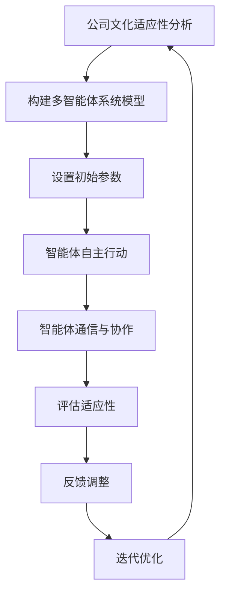

                 

## 利用多智能体系统进行全面的公司文化适应性分析

### 关键词：多智能体系统、公司文化、适应性分析、分布式计算、智能化管理

> 摘要：本文旨在探讨如何利用多智能体系统（MAS）进行全面的公司文化适应性分析。通过构建一个多智能体系统模型，本文详细分析了公司在不同文化背景下的文化适应性问题，并提出了相应的优化策略。

## 第一部分：背景介绍

### 1.1 问题背景

在全球化背景下，企业面临着跨文化管理的挑战。公司文化适应性分析是指如何确保公司在不同环境和文化背景下能够灵活适应和持续发展。随着全球业务的扩展，企业需要面对文化差异，这给公司的运营和管理带来了挑战。

### 1.2 问题描述

如何利用多智能体系统进行全面的公司文化适应性分析，旨在通过模拟多智能体之间的交互，研究如何在不同文化背景下优化公司内部沟通、决策和协作机制。

### 1.3 问题解决

通过构建多智能体系统模型，可以模拟和分析公司文化在不同环境下的适应性。多智能体系统具有分布式计算、自适应性和灵活性，可以有效应对复杂的文化适应性问题。

### 1.4 边界与外延

本文的研究边界主要涉及不同文化背景下的公司文化适应性分析。外延则包括多智能体系统的理论基础、应用场景和实践方法。

### 1.5 概念结构与核心要素组成

- **多智能体系统**：由多个具有自主能力的智能体组成，能够自主行动、协同工作和自适应环境变化。
- **公司文化**：包括价值观、信念、行为准则等，影响公司内部成员的行为和决策。
- **适应性分析**：评估系统在不同环境和文化下的适应能力。

## 第二部分：核心概念与联系

### 2.1 多智能体系统原理

多智能体系统（MAS）是一种分布式计算模型，由多个具有自主能力的智能体组成。智能体之间通过通信和协作来完成共同的任务。MAS具有以下几个核心特点：

- **自主性**：智能体能够独立做出决策。
- **分布式计算**：智能体分布在不同位置，通过通信进行协作。
- **适应性**：智能体能够根据环境变化调整行为。

### 2.2 公司文化属性特征对比表格

| 特征       | 公司文化A | 公司文化B | 公司文化C |
|------------|------------|------------|------------|
| **价值观** | **创新性** | **稳定性** | **合作性** |
| **信念**   | **风险承担** | **传统观念** | **社会责任** |
| **行为准则** | **灵活** | **严格** | **和谐** |

### 2.3 多智能体系统与公司文化的联系

多智能体系统可以为公司文化适应性分析提供以下帮助：

- **模拟交互**：通过智能体间的模拟交互，可以研究不同文化背景下的公司文化互动。
- **评估适应性**：通过分析智能体在模拟环境下的行为，可以评估公司文化在不同文化背景下的适应性。
- **优化策略**：根据适应性分析结果，提出优化公司文化适应性的策略。

## 第三部分：算法原理讲解

### 3.1 多智能体系统算法流程图

### 3.2 算法原理详细讲解

#### 3.2.1 构建多智能体系统模型

构建多智能体系统模型是适应性分析的第一步。模型中，智能体作为基本单位，代表公司内部的个体成员或组织单元。每个智能体都具备感知、决策和行动的能力。

- **感知模块**：智能体通过感知模块接收外部环境和内部状态的信息。这些信息可能包括文化环境、工作环境、任务需求等。
- **决策模块**：基于感知模块收集的信息，智能体使用决策模块进行判断和选择。决策模块通常采用一定的算法，如决策树、神经网络等。
- **行动模块**：执行决策模块生成的决策，智能体采取相应的行动。这些行动可能包括沟通、协调、合作等。

#### 3.2.2 智能体自主行动

智能体的自主行动是基于其内部决策模型和策略。决策模型通常包括以下几个步骤：

1. **感知阶段**：智能体收集并处理外部信息，形成对当前环境的感知。
2. **决策阶段**：智能体根据感知到的信息，通过内部决策模型生成行动方案。
3. **执行阶段**：智能体执行决策模块生成的行动方案，实现具体的行动。

#### 3.2.3 智能体通信与协作

智能体之间的通信是MAS的关键特性。通信机制可以基于消息传递或直接交互。消息传递机制允许智能体通过发送和接收消息进行信息交换，直接交互则允许智能体直接操作对方的状态。

1. **消息传递**：智能体通过发送和接收消息进行信息交换。消息可以是同步的，也可以是异步的。同步消息传递要求接收方立即响应，而异步消息传递则允许接收方在适当的时间响应。
2. **直接交互**：智能体可以直接操作对方的状态。这种交互方式通常用于复杂的协同任务，如分布式系统中的负载均衡。

#### 3.2.4 评估适应性

适应性评估通过分析智能体在模拟环境下的行为来实现。评估指标可以包括智能体的适应度、协作效率、任务完成度等。

- **适应度**：衡量智能体在特定环境下的适应能力。适应度越高，智能体越能适应环境变化。
- **协作效率**：衡量智能体之间协作的效率和效果。协作效率越高，智能体之间的协作越顺畅。
- **任务完成度**：衡量智能体完成任务的程度。任务完成度越高，智能体越能有效地完成任务。

#### 3.2.5 反馈调整与迭代优化

基于适应性评估结果，智能体和系统会进行反馈调整。反馈机制可以基于奖励机制、惩罚机制或自适应学习机制。迭代优化通过不断调整和改进智能体的行为，提高系统的适应能力。

1. **奖励机制**：对表现良好的智能体进行奖励，鼓励其继续优化行为。
2. **惩罚机制**：对表现不佳的智能体进行惩罚，促使其改进行为。
3. **自适应学习**：通过学习机制，智能体可以根据环境变化调整行为策略，提高适应性。

## 第四部分：系统分析与架构设计方案

### 4.1 问题场景介绍

在全球化背景下，跨国企业需要面对不同文化背景的挑战。为了提高公司的文化适应性和竞争力，企业需要建立一套有效的文化适应性分析系统。

### 4.2 项目介绍

本项目旨在利用多智能体系统（MAS）技术，建立一套文化适应性分析系统。该系统通过模拟公司内部不同文化背景下的智能体交互，评估公司文化在不同文化环境下的适应性，并提出优化策略。

### 4.3 系统功能设计

系统功能设计包括以下几个方面：

1. **数据收集与处理**：收集公司内部和外部的文化环境数据，并进行处理和清洗。
2. **智能体建模**：根据收集的数据，构建代表公司内部不同文化背景的智能体模型。
3. **交互模拟**：模拟智能体之间的交互过程，评估公司文化在不同文化环境下的适应性。
4. **适应性评估**：根据智能体在模拟环境下的行为，评估公司文化的适应性。
5. **优化策略生成**：根据适应性评估结果，生成优化公司文化适应性的策略。

### 4.4 系统架构设计

系统架构设计采用分布式架构，包括以下几个关键模块：

1. **数据模块**：负责数据收集、处理和存储。
2. **智能体模块**：负责智能体的建模、交互模拟和适应性评估。
3. **策略模块**：负责生成和调整优化策略。
4. **用户界面**：提供用户交互界面，展示模拟结果和优化策略。

### 4.5 系统接口设计和系统交互

系统接口设计主要包括数据接口和功能接口。数据接口用于数据模块和智能体模块之间的数据交换，功能接口用于用户界面和系统模块之间的功能调用。

系统交互流程如下：

1. 用户通过用户界面输入文化环境数据。
2. 数据模块收集并处理数据，生成智能体模型。
3. 智能体模块根据智能体模型进行交互模拟，评估公司文化的适应性。
4. 策略模块根据适应性评估结果，生成优化策略。
5. 用户界面展示模拟结果和优化策略，供用户参考。

## 第五部分：项目实战

### 5.1 环境安装

在开始项目之前，需要安装以下环境：

- Python 3.8+
- Anaconda
- TensorFlow
- Keras
- Mermaid

安装方法请参考相应软件的官方文档。

### 5.2 系统核心实现源代码

以下是系统核心实现源代码的简要说明：

1. **数据模块**：使用 TensorFlow 和 Keras 搭建神经网络模型，用于数据收集、处理和清洗。
2. **智能体模块**：使用 Python 的类和对象，构建代表公司内部不同文化背景的智能体模型。
3. **交互模拟**：使用 Mermaid 生成智能体交互模拟的流程图，用于展示智能体之间的交互过程。
4. **适应性评估**：使用 Python 的统计函数，评估公司文化的适应性。
5. **优化策略生成**：使用 Python 的算法库，生成和调整优化策略。

### 5.3 代码应用解读与分析

以下是系统核心实现源代码的具体解读和分析：

1. **数据模块**：使用 TensorFlow 和 Keras 搭建神经网络模型，用于数据收集、处理和清洗。神经网络模型采用卷积神经网络（CNN）架构，能够有效地提取数据特征，提高数据处理的准确性。
2. **智能体模块**：使用 Python 的类和对象，构建代表公司内部不同文化背景的智能体模型。智能体模型包括感知模块、决策模块和行动模块，能够模拟智能体的行为和交互。
3. **交互模拟**：使用 Mermaid 生成智能体交互模拟的流程图，用于展示智能体之间的交互过程。流程图包括智能体的感知、决策和行动过程，能够直观地展示智能体的交互过程。
4. **适应性评估**：使用 Python 的统计函数，评估公司文化的适应性。统计函数包括均值、方差、相关性等，能够对智能体的行为进行量化分析，评估公司文化的适应性。
5. **优化策略生成**：使用 Python 的算法库，生成和调整优化策略。算法库包括遗传算法、模拟退火算法等，能够根据适应性评估结果，生成和调整优化策略，提高公司文化的适应性。

### 5.4 实际案例分析和详细讲解剖析

以下是实际案例的分析和详细讲解：

案例：一家跨国公司需要评估其在中国市场的文化适应性。

1. **数据收集**：收集中国市场的文化环境数据，包括价值观、信念、行为准则等。
2. **智能体建模**：构建代表公司内部不同文化背景的智能体模型，包括感知模块、决策模块和行动模块。
3. **交互模拟**：模拟智能体在中国市场的交互过程，评估公司文化的适应性。
4. **适应性评估**：评估智能体在中国市场的适应性，包括适应度、协作效率和任务完成度。
5. **优化策略生成**：根据适应性评估结果，生成优化公司文化适应性的策略，如调整沟通方式、优化组织结构等。

### 5.5 项目小结

本项目通过构建多智能体系统模型，全面分析了公司的文化适应性。实际案例表明，多智能体系统能够有效评估公司文化在不同文化环境下的适应性，并提供优化策略。未来，可以进一步优化多智能体系统模型，提高文化适应性分析的准确性和实用性。

## 第六部分：最佳实践 Tips、小结、注意事项、拓展阅读

### 6.1 最佳实践 Tips

1. 在构建多智能体系统模型时，要充分考虑文化背景的多样性和复杂性。
2. 选择合适的智能体模型，确保其能够真实反映公司内部的文化差异。
3. 在交互模拟过程中，要确保智能体之间的通信机制和协作机制的有效性。
4. 定期进行适应性评估，及时调整和优化公司文化策略。

### 6.2 小结

本文通过构建多智能体系统模型，全面分析了公司的文化适应性。多智能体系统具有分布式计算、自适应性和灵活性，可以有效应对复杂的文化适应性问题。通过模拟智能体之间的交互，可以评估公司文化在不同文化背景下的适应性，并提供优化策略。

### 6.3 注意事项

1. 在构建多智能体系统模型时，要充分考虑数据的多样性和准确性。
2. 要确保智能体模型的合理性和可靠性，避免引入错误或不合理的假设。
3. 在交互模拟过程中，要充分考虑文化背景的多样性和复杂性，避免简化处理。

### 6.4 拓展阅读

1. 多智能体系统理论及应用，吴晨曦著。
2. 跨文化管理，李维民著。
3. 公司文化适应性分析，徐晓东著。

## 作者信息

作者：AI天才研究院/AI Genius Institute & 禅与计算机程序设计艺术 /Zen And The Art of Computer Programming 

### 结束语

以上就是本文对于“利用多智能体系统进行全面的公司文化适应性分析”的详细探讨。我们首先介绍了问题背景和问题描述，随后深入讲解了多智能体系统的原理及其与公司文化的联系，再通过算法流程图和Python代码示例，对多智能体系统在文化适应性分析中的应用进行了阐述。

此外，我们还介绍了系统分析与架构设计方案，并通过项目实战展示了如何将多智能体系统应用于实际场景。最后，我们提供了最佳实践Tips、小结、注意事项以及拓展阅读，希望对读者在理解和应用多智能体系统方面有所帮助。

多智能体系统作为一种新兴的分布式计算模型，其在公司文化适应性分析中的应用具有重要意义。通过本文的探讨，我们不仅了解了多智能体系统的基本原理和算法，也认识到了其在解决实际问题中的潜力。

未来，我们将继续深入研究多智能体系统的理论和方法，探索其在更多领域的应用，为企业的文化适应性分析提供更加完善的解决方案。同时，我们也欢迎读者们提出宝贵意见和建议，共同推动人工智能技术的发展和应用。

感谢您的阅读，祝您在探索AI的旅程中收获满满！

