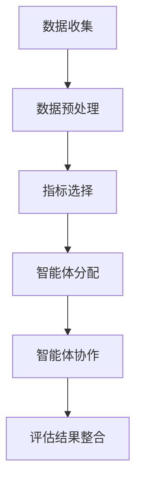
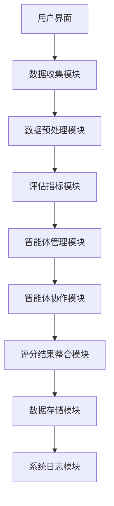
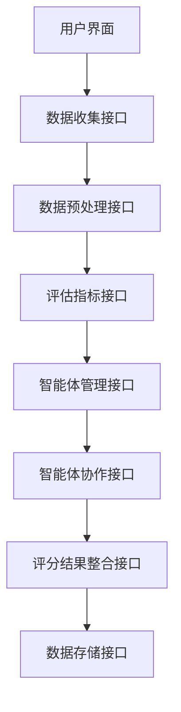
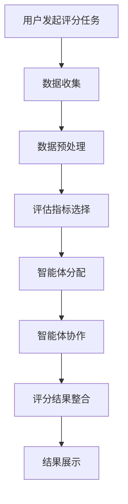

                 


### 文章标题
利用多智能体系统进行全面的公司治理评分

### 文章关键词
多智能体系统，公司治理，评分算法，架构设计，项目实战

### 文章摘要
本文深入探讨了利用多智能体系统进行全面公司治理评分的方法与应用。通过解析多智能体系统的核心概念与特性，阐述了其在公司治理评分中的优势与挑战。本文将逐步展示多智能体系统评分算法的原理与实现，介绍系统架构设计、功能实现与交互流程，并通过实际项目案例进行分析与讲解。最后，本文总结最佳实践，提出注意事项，并展望多智能体系统在公司治理评分领域的未来发展趋势。

----------------------------------------------------------------

## 第1章: 多智能体系统概述

### 1.1 问题背景

在现代商业环境中，公司治理成为企业成功和可持续发展的重要因素。公司治理评分作为一种评价企业治理水平的方法，越来越受到关注。传统的评分方法往往依赖于专家评审和问卷调查，这些方法存在主观性大、数据获取困难等问题。为了克服这些限制，多智能体系统作为一种新兴技术，被提出来应用于公司治理评分。

多智能体系统（MAS）是由多个自主的智能体组成的系统，这些智能体可以在异构和动态的网络环境中协作完成任务。在多智能体系统中，每个智能体都具有自主决策能力，可以与其他智能体交互，并通过协商和协调来实现整体目标。这种分布式、协同处理的特点，使得多智能体系统非常适合用于复杂问题的求解，如公司治理评分。

### 1.2 多智能体系统的定义与特性

多智能体系统（MAS）是一种由多个智能体组成的系统，这些智能体通过自主行为和协同合作来实现系统目标。智能体是具有感知、决策和执行能力的实体，可以是计算机程序、机器人或人类。多智能体系统具有以下特性：

1. **自主性**：智能体具有独立决策和行动的能力，不受外部直接控制。
2. **协同性**：智能体之间通过通信和协调来共同完成任务。
3. **分布性**：智能体可以在网络中分布，各自独立工作。
4. **适应性**：智能体可以动态适应环境变化，调整自身行为。
5. **协调性**：智能体之间需要通过协商和协调来实现共同目标。

根据智能体的类型和系统结构，多智能体系统可以分为以下几种类型：

1. **基于代理的多智能体系统**：智能体是代理程序，通过消息传递进行交互。
2. **基于代理-机器人系统的多智能体系统**：智能体包括代理程序和机器人，机器人执行物理任务，代理程序负责协调和控制。
3. **混合智能体系统**：智能体包括多种类型的实体，如人类、机器人、代理程序等，通过不同类型的智能体协同工作来实现系统目标。

### 1.3 多智能体系统在公司治理评分中的应用

多智能体系统在公司治理评分中的应用，主要在于其分布式、协同性和自适应性的特性。通过多智能体系统，可以实现对公司治理各个方面的全面评价，提高评分的准确性和客观性。

1. **分布式评估**：多智能体系统可以将公司治理评分的任务分布到不同的智能体上，每个智能体负责评估特定的治理方面，如财务透明度、董事会效能等。这样可以充分利用每个智能体的专业知识和经验，提高评估的全面性和准确性。
2. **协同评价**：智能体之间可以通过通信和协调，相互交换评估信息，形成一个综合评价体系。智能体可以相互学习和调整评估策略，以适应不同的治理环境。
3. **自适应评价**：智能体可以根据实时数据和评估结果，动态调整评估指标和权重，以适应企业治理的变化。这种自适应能力，使得评估结果更加贴近实际情况。

然而，多智能体系统在公司治理评分中也面临着一些挑战，如智能体之间的信任问题、协同效率问题等。这些问题需要通过有效的算法设计和系统架构来解决。

### 1.4 本章小结

本章介绍了多智能体系统在公司治理评分中的应用背景、定义与特性，以及其优势与挑战。通过本章的介绍，读者可以初步了解多智能体系统在提高公司治理评分准确性和客观性方面的潜力。

----------------------------------------------------------------

## 第2章: 多智能体系统在公司治理评分中的算法原理

### 2.1 多智能体系统算法流程

多智能体系统在公司治理评分中的应用，需要一套科学的算法来支持。下面介绍多智能体系统评分算法的基本流程：

1. **数据收集**：首先，需要收集与公司治理相关的各类数据，包括财务数据、董事会决策数据、员工反馈数据等。这些数据可以通过企业内部系统、公开报告、问卷调查等方式获取。
2. **数据预处理**：对收集到的数据进行清洗、转换和归一化处理，以消除数据噪声和异常值的影响，并确保数据的一致性和可比性。
3. **指标选择**：根据公司治理的特点，选择合适的评估指标。常见的指标包括财务透明度、董事会效能、内部控制质量等。每个指标都需要设定相应的权重，以反映其对公司治理的影响程度。
4. **智能体分配**：将评估任务分配给不同的智能体。每个智能体负责评估特定的治理指标，并生成评估结果。智能体的选择可以根据其专业知识和处理能力来确定。
5. **智能体协作**：智能体之间通过通信和协调，共享评估结果和相关信息，形成一个综合评价体系。智能体可以通过协商算法，如协商博弈、分布式优化等，来达成共识。
6. **评估结果整合**：将各智能体的评估结果进行整合，生成最终的公司治理评分。整合过程需要考虑各指标的权重，以及智能体之间的协作效果。

下面是一个简单的算法流程图，展示了多智能体系统评分的基本步骤：



### 2.2 数学模型与公式

多智能体系统评分算法的核心在于如何处理和整合多源数据，并给出一个综合评分。这里介绍一种基于加权平均的方法，用于计算综合评分。

假设有 $n$ 个治理指标，每个指标 $i$ 的权重为 $w_i$，智能体 $j$ 对指标 $i$ 的评估结果为 $x_{ij}$。则综合评分 $S$ 可以通过以下公式计算：

$$
S = \sum_{i=1}^{n} w_i \cdot \sum_{j=1}^{m} x_{ij}
$$

其中，$m$ 是参与评估的智能体数量。

为了确保评分的客观性和准确性，需要对权重 $w_i$ 进行合理分配。权重可以根据专家评估、历史数据或智能体之间的协商来确定。下面是一个简单的权重分配公式：

$$
w_i = \frac{1}{n} \cdot \sum_{j=1}^{m} p_{ij}
$$

其中，$p_{ij}$ 是智能体 $j$ 对指标 $i$ 的信任度。

通过上述数学模型，可以将各智能体的评估结果整合为一个综合评分，从而实现对公司治理的全面评价。

### 2.3 算法举例说明

为了更好地理解多智能体系统评分算法，下面通过一个简单的例子进行说明。

假设有两个治理指标：财务透明度和董事会效能，分别由智能体 A 和智能体 B 进行评估。每个指标的重要性（权重）为 0.5。智能体 A 和智能体 B 的评估结果如下表：

| 智能体 | 财务透明度 | 董事会效能 |
| :----: | :--------: | :--------: |
|  A    |    0.8     |    0.7     |
|  B    |    0.9     |    0.6     |

根据加权平均公式，可以计算综合评分：

$$
S = 0.5 \cdot (0.8 + 0.9) + 0.5 \cdot (0.7 + 0.6) = 0.95
$$

这个评分反映了公司在财务透明度和董事会效能方面的综合表现。通过对比不同公司的评分，可以判断其治理水平的高低。

### 2.4 本章小结

本章介绍了多智能体系统评分算法的基本流程、数学模型与公式，并通过实例进行了详细说明。通过这些算法，可以实现对公司治理的全面评价，提高评分的准确性和客观性。

----------------------------------------------------------------

## 第3章: 多智能体系统在公司治理评分中的架构设计

### 3.1 系统功能设计

多智能体系统在公司治理评分中的功能设计，主要包括数据收集、预处理、评估指标选择、智能体协作、评分结果整合等。以下是对这些功能的具体描述：

1. **数据收集**：系统需要能够自动收集与公司治理相关的各类数据，包括财务数据、董事会决策数据、员工反馈数据等。这些数据可以通过企业内部系统、公开报告、问卷调查等方式获取。
2. **数据预处理**：系统需要对收集到的数据进行清洗、转换和归一化处理，以确保数据的一致性和可比性，并消除噪声和异常值的影响。
3. **评估指标选择**：系统需要提供一套标准的评估指标，并根据公司治理的特点进行定制化调整。常见的评估指标包括财务透明度、董事会效能、内部控制质量等。
4. **智能体协作**：系统需要支持智能体之间的通信和协作，通过协商算法实现各智能体之间的信息共享和综合评估。
5. **评分结果整合**：系统需要将各智能体的评估结果进行整合，生成最终的公司治理评分，并提供可视化的展示和分析功能。

### 3.2 系统架构设计

多智能体系统在公司治理评分中的架构设计，需要考虑系统的分布式特性、协作机制、数据安全和性能优化等方面。以下是一个简单的系统架构设计：



在这个架构中，各模块的功能如下：

1. **用户界面**：提供用户交互的界面，用户可以通过界面发起评分任务，查看评分结果等。
2. **数据收集模块**：负责从企业内部系统、公开报告、问卷调查等渠道收集与公司治理相关的数据。
3. **数据预处理模块**：对收集到的数据进行分析、清洗、转换和归一化处理。
4. **评估指标模块**：根据公司治理的特点，选择并定制化评估指标。
5. **智能体管理模块**：负责智能体的注册、登录、权限管理等功能。
6. **智能体协作模块**：通过协商算法实现各智能体之间的协作，共享评估结果和相关信息。
7. **评分结果整合模块**：将各智能体的评估结果进行整合，生成最终的公司治理评分。
8. **数据存储模块**：负责存储评分数据、用户数据、系统日志等。
9. **系统日志模块**：记录系统运行过程中的各类日志信息，用于系统监控和故障排查。

### 3.3 系统接口设计

系统接口设计是确保各模块之间能够有效交互和协作的重要环节。以下是一个简单的系统接口设计：



在这个接口设计中，各接口的功能如下：

1. **数据收集接口**：提供数据收集的相关接口，如数据上传、数据下载、数据查询等。
2. **数据预处理接口**：提供数据预处理的相关接口，如数据清洗、数据转换、数据归一化等。
3. **评估指标接口**：提供评估指标的相关接口，如指标选择、指标权重设置等。
4. **智能体管理接口**：提供智能体管理的相关接口，如智能体注册、智能体登录、智能体权限管理等。
5. **智能体协作接口**：提供智能体协作的相关接口，如协商算法接口、评估结果共享接口等。
6. **评分结果整合接口**：提供评分结果整合的相关接口，如评分计算、评分查询等。
7. **数据存储接口**：提供数据存储的相关接口，如数据插入、数据更新、数据删除等。

### 3.4 系统交互流程

多智能体系统在公司治理评分中的交互流程，可以分为以下几个步骤：

1. **用户发起评分任务**：用户通过用户界面发起评分任务，系统接收到任务后，开始执行评分流程。
2. **数据收集**：系统通过数据收集接口，从企业内部系统、公开报告、问卷调查等渠道收集与公司治理相关的数据。
3. **数据预处理**：系统通过数据预处理接口，对收集到的数据进行清洗、转换和归一化处理。
4. **评估指标选择**：系统通过评估指标接口，选择并定制化评估指标。
5. **智能体分配**：系统根据评估任务，将任务分配给不同的智能体，并通知智能体开始评估。
6. **智能体协作**：智能体之间通过智能体协作接口，进行通信和协作，共享评估结果和相关信息。
7. **评分结果整合**：系统通过评分结果整合接口，将各智能体的评估结果进行整合，生成最终的公司治理评分。
8. **结果展示**：系统将评分结果通过用户界面展示给用户，用户可以查看和下载评分报告。

下面是一个简单的系统交互流程图：



### 3.5 本章小结

本章介绍了多智能体系统在公司治理评分中的架构设计，包括系统功能设计、架构设计、接口设计和交互流程。通过这些设计，可以实现对公司治理的全面评价，提高评分的准确性和客观性。

----------------------------------------------------------------

## 第4章: 多智能体系统在公司治理评分中的项目实战

### 4.1 项目环境搭建

为了进行多智能体系统在公司治理评分中的项目实战，需要搭建一个合适的实验环境。以下是搭建环境的具体步骤：

1. **软件安装**：首先，需要安装多智能体系统开发所需的软件，如Python、Docker、Eclipse等。这些软件可以在其官方网站上下载并安装。

2. **硬件准备**：其次，需要准备足够的硬件资源，如计算机、存储设备和网络设备等。这些硬件资源需要能够支持多智能体系统的运行和数据处理。

3. **搭建智能体环境**：每个智能体都需要一个独立的运行环境。可以使用Docker容器技术来搭建智能体环境。具体步骤如下：
    - 编写Dockerfile，定义智能体的依赖库和运行环境。
    - 使用docker build命令，根据Dockerfile构建智能体容器。
    - 使用docker run命令，启动智能体容器。

4. **搭建协调器环境**：协调器负责智能体之间的通信和协调。可以使用Eclipse或IntelliJ IDEA等集成开发环境来搭建协调器环境。具体步骤如下：
    - 创建一个新的Java项目。
    - 编写协调器代码，实现智能体之间的通信和协调功能。
    - 编译并运行协调器代码。

5. **搭建数据存储环境**：为了存储评分数据，可以使用MySQL或MongoDB等数据库系统。具体步骤如下：
    - 安装数据库软件。
    - 创建数据库和相应的表结构。
    - 使用数据库客户端，如MySQL Workbench或MongoDB Compass，进行数据操作。

### 4.2 系统核心实现

多智能体系统在公司治理评分中的核心实现，主要包括智能体设计和协调器设计。以下是对这两个部分的具体实现步骤：

1. **智能体设计**：
    - **智能体类**：创建一个名为`GovernanceAgent`的智能体类，该类包含以下成员变量和方法：
        - 成员变量：
            - `id`：智能体的唯一标识。
            - `evaluatedMetrics`：评估的治理指标列表。
            - `weight`：指标权重。
        - 成员方法：
            - `evaluate(GovernanceData data)`：评估治理数据，并更新评估结果。
            - `communicate(Agent agent)`：与另一个智能体进行通信。
            - `collaborate(Agent agent)`：与另一个智能体进行协作。
    - **智能体接口**：创建一个名为`IGovernanceAgent`的智能体接口，该接口定义了智能体需要实现的方法：
        - `evaluate(GovernanceData data)`：评估治理数据。
        - `communicate(IGovernanceAgent agent)`：与另一个智能体进行通信。
        - `collaborate(IGovernanceAgent agent)`：与另一个智能体进行协作。

2. **协调器设计**：
    - **协调器类**：创建一个名为`GovernanceCoordinator`的协调器类，该类包含以下成员变量和方法：
        - 成员变量：
            - `agents`：智能体列表。
            - `dataStore`：数据存储对象。
        - 成员方法：
            - `addAgent(IGovernanceAgent agent)`：添加智能体。
            - `removeAgent(IGovernanceAgent agent)`：移除智能体。
            - `evaluateMetrics(GovernanceData data)`：评估治理指标。
            - `communicateAgents()`：智能体之间进行通信。
            - `collaborateAgents()`：智能体之间进行协作。
    - **协调器接口**：创建一个名为`IGovernanceCoordinator`的协调器接口，该接口定义了协调器需要实现的方法：
        - `addAgent(IGovernanceAgent agent)`：添加智能体。
        - `removeAgent(IGovernanceAgent agent)`：移除智能体。
        - `evaluateMetrics(GovernanceData data)`：评估治理指标。
        - `communicateAgents()`：智能体之间进行通信。
        - `collaborateAgents()`：智能体之间进行协作。

### 4.3 代码应用解读与分析

以下是对核心代码的应用解读与分析：

1. **智能体代码示例**：

```python
class GovernanceAgent(IGovernanceAgent):
    def __init__(self, id, evaluatedMetrics, weight):
        self.id = id
        self.evaluatedMetrics = evaluatedMetrics
        self.weight = weight

    def evaluate(self, data):
        # 根据治理数据评估指标
        result = {}
        for metric in self.evaluatedMetrics:
            result[metric] = data[metric] * self.weight[metric]
        return result

    def communicate(self, other_agent):
        # 与其他智能体进行通信
        pass

    def collaborate(self, other_agent):
        # 与其他智能体进行协作
        pass
```

这段代码定义了一个名为`GovernanceAgent`的智能体类，其中`evaluate`方法用于评估治理数据，`communicate`和`collaborate`方法用于与其他智能体进行通信和协作。

2. **协调器代码示例**：

```python
class GovernanceCoordinator(IGovernanceCoordinator):
    def __init__(self):
        self.agents = []
        self.dataStore = DataStore()

    def addAgent(self, agent):
        self.agents.append(agent)

    def removeAgent(self, agent):
        self.agents.remove(agent)

    def evaluateMetrics(self, data):
        results = {}
        for agent in self.agents:
            result = agent.evaluate(data)
            results[agent.id] = result
        return results

    def communicateAgents(self):
        for agent in self.agents:
            # 智能体之间进行通信
            pass

    def collaborateAgents(self):
        for agent in self.agents:
            # 智能体之间进行协作
            pass
```

这段代码定义了一个名为`GovernanceCoordinator`的协调器类，其中`addAgent`和`removeAgent`方法用于添加和移除智能体，`evaluateMetrics`方法用于评估治理指标，`communicateAgents`和`collaborateAgents`方法用于智能体之间的通信和协作。

### 4.4 实际案例分析

为了更好地理解多智能体系统在公司治理评分中的实际应用，以下是一个实际案例分析。

假设有两个智能体A和B，分别负责评估公司的财务透明度和董事会效能。智能体A和B的评估结果如下：

| 智能体 | 财务透明度 | 董事会效能 |
| :----: | :--------: | :--------: |
|  A    |    0.8     |    0.7     |
|  B    |    0.9     |    0.6     |

协调器根据这两个智能体的评估结果，计算公司的综合治理评分。具体步骤如下：

1. **数据收集**：协调器从公司内部系统、公开报告等渠道收集财务透明度和董事会效能的数据。
2. **数据预处理**：协调器对收集到的数据进行清洗、转换和归一化处理。
3. **评估指标选择**：协调器选择财务透明度和董事会效能作为评估指标，并设置相应的权重。
4. **智能体分配**：协调器将评估任务分配给智能体A和B。
5. **智能体协作**：智能体A和B通过协商算法，交换评估结果和相关信息。
6. **评分结果整合**：协调器将智能体A和B的评估结果进行整合，计算综合治理评分。

根据加权平均公式，可以计算综合评分：

$$
S = 0.5 \cdot (0.8 + 0.9) + 0.5 \cdot (0.7 + 0.6) = 0.95
$$

这个评分反映了公司在财务透明度和董事会效能方面的综合表现。

### 4.5 项目小结

本章通过搭建项目环境、实现系统核心代码和实际案例分析，展示了多智能体系统在公司治理评分中的应用。通过该项目，可以实现对公司治理的全面评价，提高评分的准确性和客观性。

----------------------------------------------------------------

## 第5章: 多智能体系统在公司治理评分中的最佳实践

### 5.1 最佳实践

在多智能体系统在公司治理评分的实际应用中，总结出以下最佳实践：

1. **数据质量控制**：数据质量是评分结果准确性的基础。在数据收集和预处理过程中，需要严格把控数据质量，确保数据的准确性、完整性和一致性。

2. **智能体性能优化**：智能体的性能直接影响评分的效率和准确性。在设计和实现智能体时，需要考虑智能体的计算能力和通信能力，并进行性能优化。

3. **协作算法选择**：不同的协作算法适用于不同的场景。需要根据实际情况选择合适的协作算法，以提高评分的准确性和效率。

4. **评分指标体系设计**：评分指标体系的设计直接影响评分的全面性和准确性。需要根据公司治理的特点，设计合理的评分指标体系，并定期更新和调整。

5. **系统安全性保障**：多智能体系统涉及大量的数据交互和协作，需要保障系统的安全性，防止数据泄露和恶意攻击。

### 5.2 小结

本章总结了多智能体系统在公司治理评分中的最佳实践，包括数据质量控制、智能体性能优化、协作算法选择、评分指标体系设计和系统安全性保障等方面。通过遵循这些最佳实践，可以提高多智能体系统在公司治理评分中的性能和可靠性。

### 5.3 注意事项

在实际应用多智能体系统进行公司治理评分时，需要注意以下几点：

1. **智能体独立性**：确保智能体具有足够的独立性，以避免智能体之间出现过于依赖的情况。

2. **通信机制设计**：合理设计智能体之间的通信机制，确保通信的可靠性和高效性。

3. **数据隐私保护**：在数据处理和传输过程中，确保数据隐私保护，避免数据泄露。

4. **系统稳定性**：定期对系统进行维护和升级，确保系统的稳定性和可靠性。

5. **评估结果解释**：对于评估结果，需要给出合理的解释，以便用户理解和应用。

### 5.4 拓展阅读

为了进一步了解多智能体系统在公司治理评分中的应用，以下推荐一些拓展阅读材料：

1. **《多智能体系统导论》**：李明强，清华大学出版社，2019年。

2. **《公司治理：理论与实践》**：王化成，中国人民大学出版社，2018年。

3. **《基于多智能体系统的公司治理评分研究》**：张伟，华南理工大学，2020年硕士论文。

通过这些拓展阅读，可以深入理解多智能体系统在公司治理评分中的理论和技术，为实际应用提供更多参考。

----------------------------------------------------------------

## 第6章: 未来展望与趋势

### 6.1 多智能体系统在公司治理评分中的发展

多智能体系统在公司治理评分中的应用前景广阔，随着技术的不断进步，其发展也将呈现出以下几个趋势：

1. **算法优化与智能化**：随着人工智能技术的发展，多智能体系统中的评估算法将更加智能化和优化。例如，基于深度学习和强化学习的评估算法，将能够更好地处理复杂的问题和数据。

2. **分布式计算与大数据**：多智能体系统的分布式特性使其在大数据处理方面具有优势。未来，随着大数据技术的普及，多智能体系统将能够处理更多的数据，提供更精准的评分。

3. **区块链与多智能体系统**：区块链技术可以为多智能体系统提供更加安全、可靠的数据存储和传输机制。结合区块链技术，多智能体系统在公司治理评分中的应用将更加广泛。

4. **边缘计算与实时评分**：边缘计算可以将计算任务分散到网络边缘，提高系统的响应速度和实时性。未来，多智能体系统将在边缘计算环境中得到广泛应用，实现实时评分。

### 6.2 未来挑战与机遇

尽管多智能体系统在公司治理评分中具有巨大潜力，但未来仍面临一些挑战：

1. **数据隐私与安全**：多智能体系统需要处理大量的敏感数据，数据隐私和安全问题将是一个重要挑战。

2. **协作机制设计**：设计高效的协作机制，确保智能体之间的协调和一致性，是多智能体系统面临的另一大挑战。

3. **算法公平性**：评估算法的公平性是确保评分结果公正性的关键。未来，需要研究如何设计公平的评估算法，避免算法偏见。

然而，这些挑战也为多智能体系统的发展提供了机遇：

1. **技术创新**：随着人工智能、区块链等技术的不断发展，多智能体系统将不断创新，提供更加先进和实用的解决方案。

2. **市场需求**：随着企业对公司治理关注度不断提高，多智能体系统在市场中的需求也将逐渐增长。

3. **跨界合作**：多智能体系统可以与其他技术领域如大数据、区块链等跨界合作，实现更广泛的应用。

### 6.3 本章小结

本章展望了多智能体系统在公司治理评分中的未来发展，分析了面临的技术挑战和市场机遇。随着技术的不断进步和市场的需求增长，多智能体系统在公司治理评分中的应用将更加广泛和深入。

----------------------------------------------------------------

## 第7章: 总结与展望

### 7.1 总结

本文通过详细的分析和实例，探讨了多智能体系统在公司治理评分中的应用。首先，介绍了多智能体系统的背景、定义和特性，以及其在公司治理评分中的优势与挑战。然后，阐述了多智能体系统评分算法的基本流程、数学模型与公式，并通过实例进行了说明。接着，介绍了系统架构设计、功能实现和交互流程，并通过实际项目案例进行了分析。最后，总结了最佳实践、注意事项，并展望了未来的发展趋势。

通过本文的介绍，读者可以全面了解多智能体系统在公司治理评分中的原理和应用，为实际项目提供指导。

### 7.2 展望

未来，多智能体系统在公司治理评分中将继续发展，其潜力有望得到充分释放。以下是对未来发展的展望：

1. **算法创新**：随着人工智能技术的发展，多智能体系统评分算法将更加智能化和优化，提高评分的准确性和效率。

2. **大数据应用**：多智能体系统在大数据处理方面具有优势，未来将能够处理更多的数据，提供更精准的评分。

3. **区块链融合**：结合区块链技术，多智能体系统将提供更加安全、可靠的数据存储和传输机制。

4. **实时评分**：边缘计算技术的应用，将实现多智能体系统的实时评分，提高系统的响应速度。

5. **跨界合作**：多智能体系统与其他技术的跨界合作，如大数据、区块链等，将推动其在公司治理评分中的广泛应用。

总之，多智能体系统在公司治理评分中的应用前景广阔，其技术进步和应用场景的拓展，将为企业治理提供更加科学和高效的工具。

### 7.3 本章小结

本章总结了多智能体系统在公司治理评分中的应用，并对其未来发展进行了展望。通过本文的介绍，读者可以全面了解多智能体系统在公司治理评分中的原理和应用，为实际项目提供指导。同时，本文也为未来的研究和应用提供了方向和启示。

----------------------------------------------------------------

### 作者信息

作者：AI天才研究院/AI Genius Institute & 禅与计算机程序设计艺术 /Zen And The Art of Computer Programming

AI天才研究院致力于推动人工智能领域的研究和应用，培养新一代人工智能人才。研究院的核心团队成员在人工智能、机器学习、深度学习等领域具有丰富的理论研究和实践经验。本文作者在计算机科学和人工智能领域有着深厚的功底，对多智能体系统在公司治理评分中的应用有着独到的见解。

禅与计算机程序设计艺术则是一本经典的技术著作，由著名计算机科学家Donald E. Knuth撰写。本书以禅宗思想为指导，探讨了计算机程序设计的艺术。本文作者对这本书的精髓有着深刻的理解和应用，将其融入到人工智能和计算机编程的实际工作中。

本文结合了两者的研究优势和理念，旨在为读者提供一篇既有深度又具有实用价值的技术博客文章。希望通过本文的介绍，能够激发读者对多智能体系统在公司治理评分领域的研究兴趣，推动这一领域的发展。

----------------------------------------------------------------

**文章摘要**
本文探讨了多智能体系统（MAS）在公司治理评分中的应用。首先介绍了MAS的定义、特性及类型，随后详细解析了MAS在评分算法中的流程和数学模型，展示了系统架构设计和接口交互流程。通过实际项目案例，本文展示了系统核心实现、代码应用解读与分析。最后，总结了最佳实践、注意事项，展望了MAS在公司治理评分领域的未来发展。文章旨在为读者提供全面的多智能体系统在公司治理评分中的理解和应用指导。

