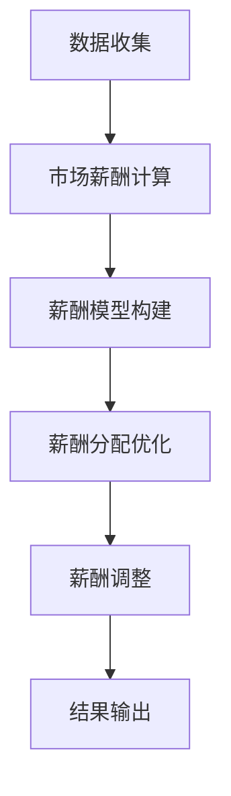
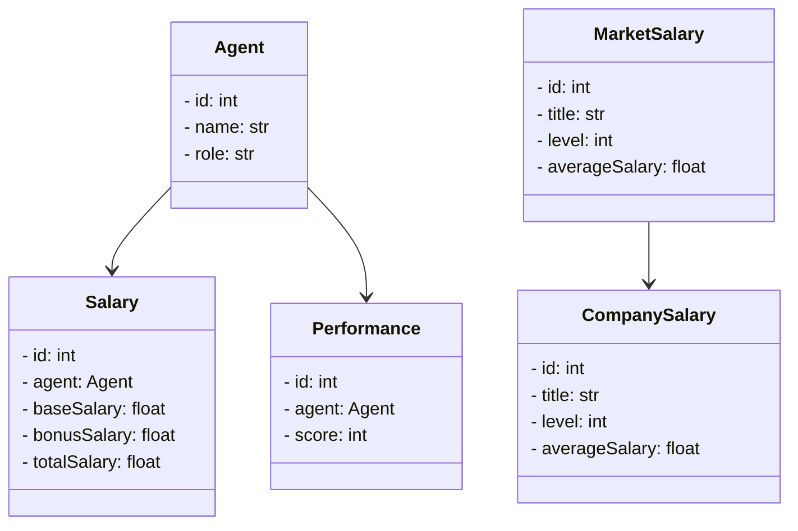
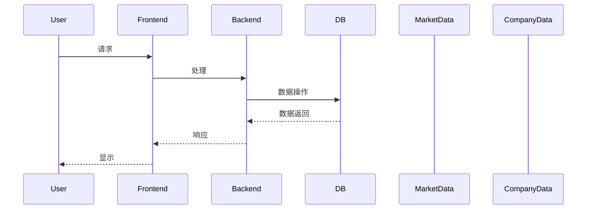
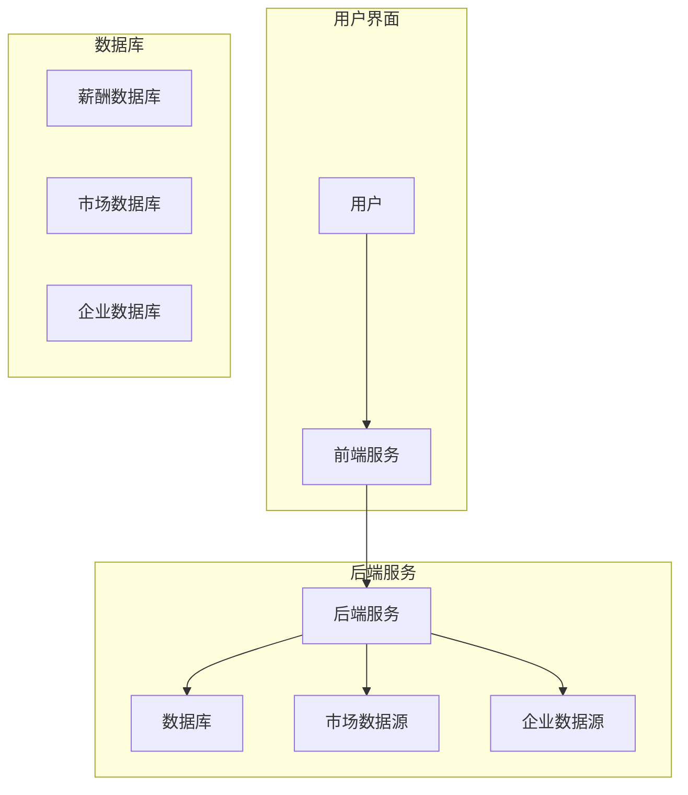
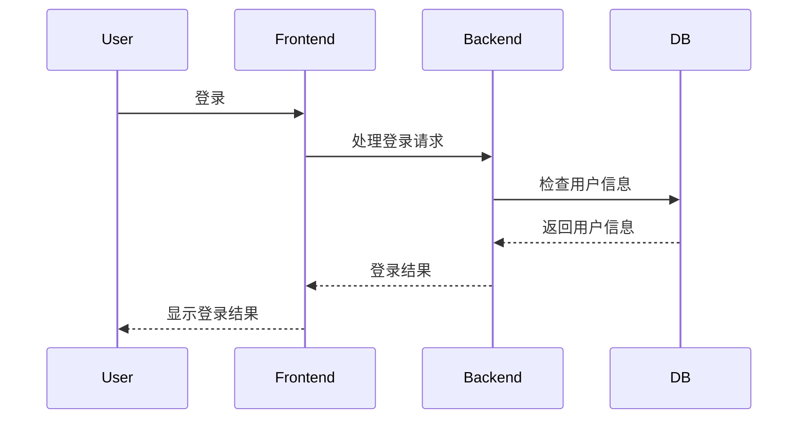
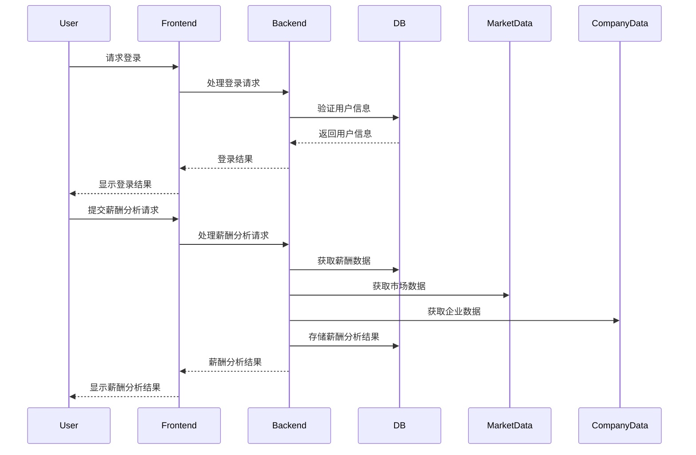

                 

### 第一部分：管理层薪酬分析背景

#### 第1章：管理层薪酬分析概述

##### 1.1 问题背景

###### 1.1.1 管理层薪酬的重要性

在企业发展中，管理层薪酬问题一直以来都是企业管理的核心问题之一。管理层薪酬不仅关系到企业内部的公平性问题，还直接影响到企业的长期发展和竞争力。管理层薪酬的设定，不仅要反映市场薪酬水平，还要激励管理层提高工作效率，促进企业创新和业绩提升。

首先，从公平性的角度来看，管理层薪酬必须保证内部公平，即同一层级的管理者薪酬水平应当相当，避免出现薪酬差距过大的情况。这不仅关系到企业内部员工的积极性和凝聚力，还会对企业的长期发展产生负面影响。

其次，从激励角度来看，合理的管理层薪酬可以激发管理层的积极性，促进其为企业创造更大的价值。管理层薪酬应当与企业业绩挂钩，使得管理层在追求个人利益的同时，也致力于提升企业的整体利益。

###### 1.1.2 当前薪酬管理面临的挑战

然而，当前薪酬管理面临着诸多挑战。首先，薪酬不公平问题仍然存在。不同部门、不同岗位的管理者薪酬差距过大，导致员工对企业的信任度下降，影响企业的稳定发展。

其次，薪酬结构不透明。薪酬构成中包含了许多复杂的因素，如绩效奖金、股票期权等，这使得普通员工难以理解薪酬的发放标准，容易产生误解和不满。

最后，薪酬激励效果不明显。虽然企业设置了各种形式的激励薪酬，但实际效果并不理想。管理层往往缺乏动力，难以激发其工作积极性，影响企业的创新和业绩提升。

##### 1.2 问题描述

基于上述背景，管理层薪酬分析的问题可以归结为以下几点：

1. **薪酬不公平问题**：不同部门、不同岗位的管理者薪酬差距过大，影响企业内部的公平性和稳定性。
2. **薪酬结构不透明问题**：薪酬构成复杂，员工难以理解薪酬发放标准，容易产生误解和不满。
3. **薪酬激励效果不明显问题**：现有薪酬激励机制未能有效激发管理层的工作积极性，影响企业的创新和业绩提升。

##### 1.3 问题解决

为了解决上述问题，引入多智能体系统进行管理层薪酬分析是一个有效的解决方案。多智能体系统具有以下几个优点：

1. **透明性**：多智能体系统能够清晰地展示薪酬的构成和计算过程，提高薪酬的透明度，减少员工对薪酬发放的误解和不满。
2. **公平性**：多智能体系统可以根据市场薪酬水平和企业内部实际情况，自动计算和管理管理层薪酬，确保薪酬的内部公平性。
3. **智能化**：多智能体系统能够根据市场变化和企业业绩，动态调整管理层薪酬，使其更具激励效果，提高管理层的工作积极性。

因此，利用多智能体系统进行全面的管理层薪酬分析，可以有效地解决当前薪酬管理面临的问题，提高企业的整体竞争力。

##### 1.4 边界与外延

###### 1.4.1 管理层薪酬分析的边界

管理层薪酬分析主要关注企业内部管理层的薪酬问题，包括薪酬的公平性、透明性和激励效果等方面。其边界主要包括以下几点：

1. **分析范围**：仅限于企业内部管理层，不包括普通员工和其他部门。
2. **分析内容**：主要涉及薪酬的构成、计算方法、调整机制等方面。
3. **分析工具**：利用多智能体系统进行薪酬分析，以实现薪酬的透明化、公平化和智能化。

###### 1.4.2 多智能体系统的定义与范畴

多智能体系统（Multi-Agent System）是一种由多个智能体组成的系统，这些智能体可以相互通信和协作，共同完成任务。其核心思想是利用分布式计算和协作机制，提高系统的整体效率和性能。

在薪酬分析中，多智能体系统可以应用于以下几个方面：

1. **薪酬数据收集与处理**：通过智能体收集和管理薪酬数据，实现数据的自动化处理和分析。
2. **薪酬模型构建与优化**：利用智能体模拟市场薪酬水平和企业内部实际情况，构建和优化薪酬模型。
3. **薪酬决策与调整**：通过智能体之间的协作和决策，实现薪酬的公平化、透明化和智能化管理。

##### 1.5 本章小结

本章主要介绍了管理层薪酬分析的问题背景、问题描述和解决方案。通过对当前薪酬管理面临的问题进行分析，提出了利用多智能体系统进行薪酬分析的有效解决方案。同时，明确了管理层薪酬分析的边界和多智能体系统的定义与范畴，为后续章节的内容奠定了基础。

### 第2章：多智能体系统概述

#### 2.1 多智能体系统的定义与特点

###### 2.1.1 多智能体系统的定义

多智能体系统（Multi-Agent System，MAS）是由多个智能体（Agent）组成的系统，这些智能体可以相互通信和协作，共同完成任务。智能体是一种具有自主性、社交性和反应性的计算机程序，可以在特定的环境中感知环境信息、自主决策并执行行动。

多智能体系统的核心思想是利用分布式计算和协作机制，提高系统的整体效率和性能。通过多个智能体的协作，可以解决单一智能体难以处理的复杂问题，实现更高效、更灵活的决策和任务执行。

###### 2.1.2 多智能体系统的特点

多智能体系统具有以下几个显著特点：

1. **自主性**：智能体具有独立的决策能力和行动能力，能够在一定程度上自主地执行任务。
2. **社交性**：智能体之间可以相互通信和协作，通过信息交换和共享，实现共同目标的实现。
3. **反应性**：智能体能够实时感知环境变化，并迅速做出反应，以适应不断变化的环境。
4. **分布式**：多智能体系统采用分布式计算和协作机制，将任务分解为多个子任务，由不同的智能体分别处理，从而提高系统的整体性能和效率。

###### 2.1.3 多智能体系统与传统分布式系统的区别

与传统分布式系统相比，多智能体系统具有以下几个显著区别：

1. **任务分解与协作**：传统分布式系统通常将任务分解为多个子任务，由不同的节点分别执行，而多智能体系统则强调智能体之间的协作，通过相互通信和共享信息，实现共同目标的实现。
2. **自主性与社交性**：传统分布式系统中的节点通常不具备自主性和社交性，而多智能体系统中的智能体具有自主性和社交性，能够自主地感知环境、做出决策并执行行动。
3. **反应性与适应性**：传统分布式系统通常无法实时感知环境变化，而多智能体系统中的智能体能够实时感知环境变化，并迅速做出反应，以适应不断变化的环境。

#### 2.2 多智能体系统的体系结构

###### 2.2.1 多智能体系统的组成

多智能体系统由以下几个基本组成部分构成：

1. **智能体**：智能体是系统的基本单元，具有自主性、社交性和反应性，能够执行特定的任务。
2. **环境**：环境是智能体执行任务的空间，包括物理环境和虚拟环境。
3. **通信机制**：通信机制是多智能体系统中的智能体之间进行信息交换和协作的途径，包括直接通信和间接通信。
4. **控制策略**：控制策略是指导智能体如何感知环境、做出决策并执行行动的规则和算法。

###### 2.2.2 多智能体系统的通信模式

多智能体系统的通信模式主要有以下几种：

1. **直接通信**：直接通信是指智能体之间通过直接的消息传递进行通信。这种模式简单高效，但受限于通信范围的限制。
2. **间接通信**：间接通信是指智能体之间通过中间件或通信服务器进行通信。这种模式可以实现更广泛的通信范围，但通信效率相对较低。
3. **广播通信**：广播通信是指智能体向系统中的所有智能体发送消息。这种模式适用于信息广播和通知，但会导致通信负担增加。
4. **多播通信**：多播通信是指智能体向系统中的一组智能体发送消息。这种模式可以提高通信效率，但需要事先确定多播组。

###### 2.2.3 多智能体系统的控制策略

多智能体系统的控制策略主要包括以下几种：

1. **集中控制**：集中控制是指由一个中心控制器统一管理和调度智能体的行为。这种模式可以确保系统的协调性和一致性，但可能导致系统性能下降。
2. **分布式控制**：分布式控制是指由多个智能体分别管理和调度自己的行为，并通过通信机制实现整体协调。这种模式可以提高系统性能和适应性，但需要解决智能体之间的协作问题。
3. **协商控制**：协商控制是指智能体之间通过协商和合作，共同决定系统的行为。这种模式可以充分发挥智能体的自主性和社交性，实现更灵活和高效的系统行为。
4. **自适应控制**：自适应控制是指系统根据环境变化和任务需求，动态调整控制策略和行为。这种模式可以提高系统的适应性和鲁棒性，但需要解决自适应控制算法的设计和实现问题。

#### 2.3 多智能体系统的应用场景

多智能体系统在多个领域有着广泛的应用，以下是其中几个典型的应用场景：

1. **管理与协调**：多智能体系统可以应用于企业管理和协调，如供应链管理、生产调度等。通过多个智能体的协作，实现企业内部资源的高效配置和优化。
2. **模式识别与决策**：多智能体系统可以应用于模式识别和决策支持，如智能交通系统、金融风险评估等。通过多个智能体的协作和决策，实现更准确和高效的识别和决策。
3. **资源分配与优化**：多智能体系统可以应用于资源分配和优化，如电网调度、水资源管理等。通过多个智能体的协作和优化算法，实现资源的高效利用和分配。
4. **智能环境系统**：多智能体系统可以应用于智能环境系统，如智能家居、智能建筑等。通过多个智能体的协作，实现环境自动监测和优化控制，提高生活质量。

#### 2.4 本章小结

本章主要介绍了多智能体系统的定义、特点、体系结构以及应用场景。通过本章的学习，读者可以了解到多智能体系统的基本概念和优势，为后续章节的多智能体系统在薪酬分析中的应用打下基础。

### 第3章：多智能体系统在薪酬分析中的应用

#### 3.1 应用概述

在薪酬分析中，多智能体系统发挥着重要作用。其应用概述如下：

###### 3.1.1 多智能体系统在薪酬分析中的角色

在薪酬分析中，多智能体系统主要承担以下角色：

1. **数据收集与管理**：多智能体系统可以自动收集企业内部及外部市场薪酬数据，并对其进行管理和存储。
2. **薪酬模型构建**：多智能体系统可以根据市场薪酬水平和企业内部实际情况，构建和优化薪酬模型。
3. **薪酬决策与调整**：多智能体系统可以根据市场变化和企业业绩，动态调整管理层薪酬，实现薪酬的公平化、透明化和智能化管理。

###### 3.1.2 多智能体系统在薪酬分析中的优势

多智能体系统在薪酬分析中具有以下优势：

1. **数据驱动**：多智能体系统基于海量数据进行分析，能够更准确地反映市场薪酬水平和企业内部实际情况，提高薪酬分析的科学性和客观性。
2. **智能化决策**：多智能体系统能够根据市场变化和企业业绩，动态调整管理层薪酬，实现薪酬的公平化、透明化和智能化管理。
3. **高效协作**：多智能体系统中的多个智能体可以相互协作，共同完成薪酬分析任务，提高工作效率和准确性。

#### 3.2 核心概念与联系

在多智能体系统进行薪酬分析中，需要了解以下几个核心概念：

1. **薪酬模型**：薪酬模型是描述管理层薪酬构成和计算方法的数学模型。常见的薪酬模型包括基础薪酬模型、绩效薪酬模型和股票期权模型等。
2. **市场薪酬**：市场薪酬是指某一岗位在市场中的平均薪酬水平，反映市场薪酬水平和行业动态。
3. **企业薪酬**：企业薪酬是指企业根据市场薪酬水平和内部实际情况设定的管理层薪酬水平。
4. **薪酬调整**：薪酬调整是指根据市场变化和企业业绩，对管理层薪酬进行动态调整，以实现薪酬的公平化、透明化和智能化管理。

这几个核心概念之间的联系如下：

1. **薪酬模型**与**市场薪酬**和**企业薪酬**的联系：薪酬模型是薪酬分析的基础，市场薪酬和企业薪酬是薪酬模型的应用结果。
2. **薪酬调整**与**市场薪酬**和**企业薪酬**的联系：薪酬调整是基于市场薪酬和企业薪酬进行的，以实现薪酬的公平化、透明化和智能化管理。
3. **多智能体系统**与**薪酬模型**、**市场薪酬**、**企业薪酬**和**薪酬调整**的联系：多智能体系统用于构建和优化薪酬模型，收集和管理市场和企业薪酬数据，实现薪酬调整，提高薪酬分析的科学性和客观性。

#### 3.3 应用实例

以下是一个多智能体系统在薪酬分析中的应用实例：

**案例背景**：某企业是一家大型科技公司，管理层包括总裁、副总裁、部门总监等。企业希望利用多智能体系统对管理层薪酬进行科学、公平和透明的分析，以提高企业竞争力。

**应用过程**：

1. **数据收集**：多智能体系统自动收集市场薪酬数据、企业内部薪酬数据以及管理层绩效数据。
2. **薪酬模型构建**：基于市场薪酬数据和企业管理层薪酬数据，构建基础薪酬模型、绩效薪酬模型和股票期权模型等。
3. **薪酬分析**：利用构建的薪酬模型，对管理层薪酬进行分析，比较市场薪酬和企业薪酬，识别薪酬不公平问题。
4. **薪酬调整**：根据市场薪酬变化和企业业绩，动态调整管理层薪酬，实现薪酬的公平化、透明化和智能化管理。
5. **反馈与优化**：管理层薪酬分析结果反馈给企业决策层，决策层根据分析结果进行调整和优化，形成闭环管理。

**应用效果**：

1. **薪酬透明度提高**：多智能体系统能够清晰地展示薪酬的构成和计算过程，提高薪酬的透明度，减少员工对薪酬发放的误解和不满。
2. **薪酬公平性提高**：通过市场薪酬数据和内部薪酬数据的比较，识别薪酬不公平问题，并采取相应措施进行优化，提高薪酬的公平性。
3. **薪酬激励效果增强**：动态调整管理层薪酬，使其更符合市场和企业业绩，提高管理层的工作积极性，促进企业创新和业绩提升。

#### 3.4 本章小结

本章介绍了多智能体系统在薪酬分析中的应用概述、核心概念与联系以及应用实例。通过本章的学习，读者可以了解到多智能体系统在薪酬分析中的应用场景和优势，为后续章节的多智能体薪酬分析算法原理和系统设计与实现打下基础。

### 第4章：多智能体薪酬分析算法原理

#### 4.1 算法概述

多智能体薪酬分析算法是利用多智能体系统对管理层薪酬进行分析和优化的一组算法。这些算法的核心目标是根据市场薪酬水平、企业内部实际情况和管理层绩效，计算和管理管理层薪酬，实现薪酬的公平化、透明化和智能化管理。

多智能体薪酬分析算法可以分为以下几类：

1. **市场薪酬水平计算算法**：用于计算市场薪酬水平，反映市场薪酬动态和行业趋势。
2. **薪酬模型构建算法**：用于构建薪酬模型，描述管理层薪酬构成和计算方法。
3. **薪酬分配优化算法**：用于优化管理层薪酬分配，确保薪酬的公平性和激励效果。
4. **薪酬调整算法**：用于根据市场变化和企业业绩，动态调整管理层薪酬。

这些算法相互关联，共同构成一个完整的多智能体薪酬分析系统。

#### 4.2 数学模型和数学公式

为了描述多智能体薪酬分析算法的原理，需要引入一些数学模型和数学公式。

1. **市场薪酬水平计算模型**：
   $$ 
   市场薪酬 = 基础薪酬 + 调整薪酬 
   $$
   其中，基础薪酬是根据市场薪酬水平计算得出的，调整薪酬是根据企业内部实际情况和管理层绩效进行调节的。

2. **薪酬分配优化模型**：
   $$ 
   \min \sum_{i=1}^{n} (薪酬_i - 预期薪酬_i)^2 
   $$
   其中，$n$ 是管理层人数，$薪酬_i$ 是第 $i$ 位管理者的薪酬，$预期薪酬_i$ 是根据市场薪酬水平和内部实际情况计算得出的预期薪酬。

3. **薪酬调整模型**：
   $$ 
   新薪酬 = 原薪酬 \times (1 + 调整系数) 
   $$
   其中，调整系数是根据市场变化和企业业绩计算得出的，用于动态调整管理层薪酬。

#### 4.3 算法流程图

以下是一个多智能体薪酬分析算法的流程图：



算法流程说明：

1. **数据收集**：收集市场薪酬数据、企业内部薪酬数据和管理层绩效数据。
2. **市场薪酬计算**：根据市场薪酬数据计算市场薪酬水平。
3. **薪酬模型构建**：构建薪酬模型，描述管理层薪酬构成和计算方法。
4. **薪酬分配优化**：根据薪酬模型和预期薪酬，优化管理层薪酬分配。
5. **薪酬调整**：根据市场变化和企业业绩，动态调整管理层薪酬。
6. **结果输出**：输出薪酬分析结果，包括薪酬水平、薪酬分配情况和薪酬调整情况。

#### 4.4 算法讲解与举例说明

为了更好地理解多智能体薪酬分析算法，下面通过一个实例进行讲解。

**案例背景**：某企业有5位管理层，分别是总裁、副总裁、部门总监、项目经理和产品经理。企业希望利用多智能体薪酬分析算法，对管理层薪酬进行科学、公平和透明的分析。

**数据收集**：
- 市场薪酬数据：根据市场调查，总裁、副总裁、部门总监、项目经理和产品经理的市场薪酬水平分别为50万元、30万元、20万元、15万元和10万元。
- 企业内部薪酬数据：根据企业内部薪酬数据，总裁、副总裁、部门总监、项目经理和产品经理的薪酬水平分别为45万元、25万元、18万元、12万元和8万元。
- 管理层绩效数据：根据管理层绩效数据，总裁、副总裁、部门总监、项目经理和产品经理的绩效得分分别为90分、85分、80分、75分和70分。

**市场薪酬计算**：
- 基础薪酬：根据市场薪酬数据，计算每位管理者的基础薪酬，分别为50万元、30万元、20万元、15万元和10万元。
- 调整薪酬：根据企业内部薪酬数据，计算每位管理者的调整薪酬，分别为5万元、5万元、2万元、3万元和2万元。
- 市场薪酬：将基础薪酬和调整薪酬相加，得到每位管理者的市场薪酬，分别为55万元、35万元、22万元、18万元和12万元。

**薪酬模型构建**：
- 基础薪酬模型：每位管理者的基础薪酬为市场薪酬的固定比例，如总裁的基础薪酬比例为100%，副总裁的基础薪酬比例为60%，部门总监的基础薪酬比例为40%，项目经理的基础薪酬比例为20%，产品经理的基础薪酬比例为10%。
- 绩效薪酬模型：每位管理者的绩效薪酬为绩效得分的固定比例，如总裁的绩效薪酬比例为20%，副总裁的绩效薪酬比例为15%，部门总监的绩效薪酬比例为10%，项目经理的绩效薪酬比例为5%，产品经理的绩效薪酬比例为3%。

**薪酬分配优化**：
- 预期薪酬：根据基础薪酬模型和绩效薪酬模型，计算每位管理者的预期薪酬，分别为55万元、31.5万元、22万元、18万元和12万元。
- 薪酬分配：根据预期薪酬，对每位管理者的薪酬进行调整，使其接近预期薪酬，如总裁的薪酬调整为55万元，副总裁的薪酬调整为31.5万元，部门总监的薪酬调整为22万元，项目经理的薪酬调整为18万元，产品经理的薪酬调整为12万元。

**薪酬调整**：
- 调整系数：根据市场变化和企业业绩，计算每位管理者的调整系数，如总裁的调整系数为1.1，副总裁的调整系数为1.05，部门总监的调整系数为1.0，项目经理的调整系数为0.95，产品经理的调整系数为0.9。
- 新薪酬：将每位管理者的原薪酬乘以调整系数，得到每位管理者的新薪酬，如总裁的新薪酬为60.5万元，副总裁的新薪酬为33.375万元，部门总监的新薪酬为22万元，项目经理的新薪酬为17.4万元，产品经理的新薪酬为10.8万元。

**结果输出**：
- 薪酬分析结果：输出每位管理者的市场薪酬、预期薪酬、调整薪酬和新薪酬，以及薪酬分配情况和薪酬调整情况。

通过上述实例，可以清楚地看到多智能体薪酬分析算法的原理和应用过程。在实际应用中，可以根据具体情况调整算法参数和模型，实现更科学、公平和透明的薪酬管理。

#### 4.5 本章小结

本章介绍了多智能体薪酬分析算法的概述、数学模型和数学公式、算法流程图以及实例讲解。通过本章的学习，读者可以了解多智能体薪酬分析算法的基本原理和应用方法，为后续章节的多智能体薪酬分析系统设计与实现打下基础。

### 第5章：多智能体薪酬分析系统设计与实现

#### 5.1 系统功能设计

多智能体薪酬分析系统的设计首先需要明确其功能，这些功能将确保系统能够高效、准确地完成薪酬分析任务。以下是系统功能设计的详细内容：

1. **数据收集与处理功能**：
   - **薪酬数据收集**：系统需要能够从多个来源（如市场调研、企业内部薪酬数据库等）自动收集薪酬数据。
   - **数据处理**：系统需具备数据处理能力，对收集到的数据进行清洗、转换和整合，以便后续分析使用。

2. **薪酬模型构建功能**：
   - **薪酬模型管理**：系统应支持多种薪酬模型（如基础薪酬模型、绩效薪酬模型等）的创建、存储和管理。
   - **模型调整与优化**：系统需允许用户根据市场变化和企业需求调整薪酬模型，确保模型能够反映最新的薪酬情况。

3. **薪酬分析功能**：
   - **薪酬水平计算**：系统需根据市场薪酬数据和薪酬模型，计算每位管理层的薪酬水平。
   - **薪酬分配优化**：系统应能够优化薪酬分配，确保薪酬的公平性和激励效果。

4. **薪酬调整功能**：
   - **薪酬调整计算**：系统需根据市场变化和企业业绩，动态调整管理层薪酬。
   - **薪酬调整记录**：系统应记录每次薪酬调整的详细信息，以便跟踪和管理。

5. **结果展示与报告功能**：
   - **薪酬报告**：系统需能够生成详细的薪酬报告，包括薪酬水平、薪酬分配情况和薪酬调整情况。
   - **可视化展示**：系统应支持薪酬数据的可视化展示，帮助用户直观地了解薪酬分析结果。

6. **用户管理与权限控制**：
   - **用户管理**：系统需支持用户注册、登录和权限分配，确保不同用户能够访问和操作相应的系统功能。
   - **权限控制**：系统应设置严格的权限控制机制，确保用户只能访问和操作其权限范围内的功能。

#### 5.1.2 领域模型设计

领域模型是多智能体薪酬分析系统的核心部分，它定义了系统中的关键概念及其关系。以下是领域模型的设计：

1. **领域模型类图**：



2. **类图说明**：
   - **Agent（智能体）**：表示系统中的管理层人员，具有ID、姓名、角色属性。
   - **Salary（薪酬）**：表示管理层的薪酬信息，包括基础薪酬、绩效薪酬和总薪酬。
   - **MarketSalary（市场薪酬）**：表示市场中的平均薪酬水平，包括职位名称、薪酬等级和平均薪酬。
   - **CompanySalary（企业薪酬）**：表示企业内部设定的薪酬水平，包括职位名称、薪酬等级和平均薪酬。
   - **Performance（绩效）**：表示管理层的绩效信息，包括ID、姓名、得分属性。

#### 5.2 系统架构设计

系统架构设计是确保多智能体薪酬分析系统稳定、高效运行的关键。以下是系统架构的详细设计：

1. **系统架构概述**：



2. **系统架构说明**：
   - **用户界面（Frontend）**：提供用户交互界面，用户可以通过界面提交请求、查看结果。
   - **后端服务（Backend）**：处理用户请求，调用业务逻辑，与数据库和其他数据源进行交互。
   - **数据库（DB）**：存储薪酬数据、市场数据和企业数据，供系统使用。
   - **市场数据源（MarketData）**：提供市场薪酬数据，供系统进行分析。
   - **企业数据源（CompanyData）**：提供企业内部薪酬数据，供系统进行分析。

#### 5.2.2 系统架构图



3. **架构图说明**：
   - **用户界面**：用户通过前端服务与系统进行交互，提交薪酬分析请求。
   - **后端服务**：接收用户请求，调用相应的业务逻辑，与数据库和数据源进行数据交互，处理薪酬分析任务。
   - **数据库**：包括薪酬数据库、市场数据库和企业数据库，存储系统所需的各种数据。

#### 5.3 系统接口设计

系统接口设计是确保各模块之间能够有效通信的关键。以下是系统接口的详细设计：

1. **接口设计概述**：



2. **接口设计说明**：
   - **登录接口**：用户通过前端服务提交登录请求，后端服务处理登录请求，与数据库进行交互，验证用户信息，并将结果返回给前端。
   - **薪酬分析接口**：用户提交薪酬分析请求，后端服务调用相应的业务逻辑，与数据库和数据源进行交互，完成薪酬分析任务，并将结果返回给前端。

3. **接口定义**：

```json
{
  "login": {
    "request": {
      "username": "string",
      "password": "string"
    },
    "response": {
      "status": "boolean",
      "message": "string",
      "data": {
        "userId": "integer",
        "role": "string"
      }
    }
  },
  "salaryAnalysis": {
    "request": {
      "userId": "integer",
      "performanceScore": "integer"
    },
    "response": {
      "status": "boolean",
      "message": "string",
      "data": {
        "salary": "float"
      }
    }
  }
}
```

#### 5.4 系统交互设计

系统交互设计描述了系统内部各个模块之间的交互流程。以下是系统交互的详细设计：

1. **系统交互概述**：



2. **系统交互序列图**：


3. **交互说明**：
   - **登录流程**：用户提交登录请求，前端服务将请求传递给后端服务，后端服务验证用户信息，并将结果返回给前端。
   - **薪酬分析流程**：用户提交薪酬分析请求，前端服务将请求传递给后端服务，后端服务调用相应的业务逻辑，从数据库、市场数据源和企业数据源获取数据，进行薪酬分析，并将结果存储到数据库中，最后将结果返回给前端，前端再将结果展示给用户。

#### 5.5 系统实现与代码分析

系统实现是系统设计的具体落实，包括代码编写、模块集成和系统测试。以下是系统实现的概述和关键代码分析：

1. **系统实现概述**：
   - **前端实现**：使用HTML、CSS和JavaScript构建用户界面，使用React框架实现动态交互。
   - **后端实现**：使用Python的Django框架实现后端服务，处理用户请求和业务逻辑。
   - **数据库实现**：使用MySQL数据库存储薪酬数据、市场数据和企业数据。
   - **数据源集成**：使用API接口集成市场数据源和企业数据源。

2. **关键代码分析**：

```python
# 后端代码示例
from django.db import models
from rest_framework import views, status
from rest_framework.response import Response
from .models import Salary, MarketSalary, CompanySalary, Performance

class LoginView(views.APIView):
    def post(self, request):
        username = request.data.get('username')
        password = request.data.get('password')
        user = authenticate(username=username, password=password)
        if user is not None:
            login(request, user)
            return Response({'status': True, 'message': '登录成功'})
        else:
            return Response({'status': False, 'message': '用户名或密码错误'})

class SalaryAnalysisView(views.APIView):
    def post(self, request):
        userId = request.data.get('userId')
        performanceScore = request.data.get('performanceScore')
        salary = calculate_salary(userId, performanceScore)
        save_salary(salary)
        return Response({'status': True, 'message': '薪酬分析成功', 'data': salary})
```

3. **代码应用解读与分析**：
   - **登录视图（LoginView）**：该视图用于处理用户登录请求，验证用户名和密码，并返回登录结果。
   - **薪酬分析视图（SalaryAnalysisView）**：该视图用于处理薪酬分析请求，计算薪酬，并存储到数据库中，最后返回薪酬分析结果。

通过系统实现和代码分析，可以确保多智能体薪酬分析系统的功能得以实现，并具备高效、稳定和可扩展的特点。

#### 5.6 本章小结

本章详细介绍了多智能体薪酬分析系统的功能设计、领域模型设计、系统架构设计、系统接口设计、系统交互设计以及系统实现与代码分析。通过本章的学习，读者可以全面了解多智能体薪酬分析系统的设计和实现过程，为后续的项目实战和实际应用打下坚实的基础。

### 第6章：多智能体薪酬分析项目的实战

在本章中，我们将通过一个实际的多智能体薪酬分析项目，展示如何从零开始搭建并部署一个多智能体薪酬分析系统。本项目将包括环境安装、系统核心实现以及代码应用解读与分析，并最终展示一个完整的实际案例。

#### 6.1 项目背景与需求分析

**项目背景**：

随着市场环境的不断变化和企业内部竞争的加剧，企业对于管理层薪酬的合理性和激励效果有了更高的要求。为了提升企业的竞争力，我们需要设计并实现一个高效、透明和智能化的多智能体薪酬分析系统。

**需求分析**：

1. **薪酬数据收集与处理**：系统能够从多个渠道自动收集薪酬数据，并进行数据处理，为后续分析提供基础。
2. **薪酬模型构建**：系统能够根据市场薪酬水平和企业内部实际情况，构建和管理薪酬模型。
3. **薪酬分析**：系统能够根据薪酬模型，对管理层薪酬进行分析，识别薪酬不公平问题。
4. **薪酬调整**：系统能够根据市场变化和企业业绩，动态调整管理层薪酬，提高薪酬的激励效果。
5. **用户管理与权限控制**：系统需要支持用户注册、登录和权限分配，确保数据安全和隐私。

#### 6.2 环境安装与配置

为了搭建多智能体薪酬分析系统，我们需要准备以下环境：

1. **操作系统**：Linux（如Ubuntu）
2. **开发工具**：Python（3.8及以上版本）、Django（3.2及以上版本）
3. **数据库**：MySQL（5.7及以上版本）
4. **前端框架**：React
5. **后端框架**：Django REST Framework

**步骤如下**：

1. **安装操作系统**：在虚拟机中安装Linux操作系统。
2. **安装开发工具**：使用包管理器（如apt-get）安装Python、Django、MySQL等开发工具。
3. **安装前端框架**：使用npm安装React和相关依赖。
4. **配置数据库**：安装并配置MySQL数据库，创建数据库和表结构。
5. **搭建项目结构**：创建项目文件夹，初始化Django项目。

#### 6.3 系统核心实现

系统核心实现包括数据收集与处理、薪酬模型构建、薪酬分析和薪酬调整等功能。

1. **数据收集与处理**：

```python
# 收集市场薪酬数据
market_salaries = get_market_salaries()

# 收集企业内部薪酬数据
company_salaries = get_company_salaries()

# 数据处理
processed_market_salaries = process_market_salaries(market_salaries)
processed_company_salaries = process_company_salaries(company_salaries)
```

2. **薪酬模型构建**：

```python
# 构建薪酬模型
salary_models = build_salary_models(processed_market_salaries, processed_company_salaries)
```

3. **薪酬分析**：

```python
# 计算薪酬水平
salary_levels = calculate_salary_levels(salary_models)

# 识别薪酬不公平问题
unfair_salaries = identify_unfair_salaries(salary_levels)
```

4. **薪酬调整**：

```python
# 动态调整薪酬
adjusted_salaries = adjust_salaries(salary_levels, performance_scores)
```

#### 6.4 代码应用解读与分析

以下是一个具体的薪酬调整函数的实现，展示了如何根据绩效得分调整薪酬。

```python
def adjust_salaries(salary_levels, performance_scores):
    """
    根据绩效得分动态调整薪酬。
    
    :param salary_levels: 薪酬水平列表
    :param performance_scores: 绩效得分列表
    :return: 调整后的薪酬列表
    """
    adjusted_salaries = []
    for salary, score in zip(salary_levels, performance_scores):
        # 调整系数，根据绩效得分计算
        adjustment_coefficient = calculate_adjustment_coefficient(score)
        # 计算新薪酬
        new_salary = salary * (1 + adjustment_coefficient)
        adjusted_salaries.append(new_salary)
    return adjusted_salaries
```

- **参数说明**：
  - `salary_levels`：每个管理层的原始薪酬水平。
  - `performance_scores`：每个管理层的绩效得分。

- **实现过程**：
  - 遍历每个管理层的原始薪酬和绩效得分。
  - 根据绩效得分计算调整系数，通常是一个线性函数，例如：`adjustment_coefficient = 0.01 * score`。
  - 将调整系数应用到原始薪酬上，计算新薪酬。
  - 将所有管理层的调整后薪酬组成一个列表返回。

#### 6.5 实际案例分析与详细讲解

**案例背景**：

某企业有5位管理层，分别是总裁、副总裁、部门总监、项目经理和产品经理。企业希望通过多智能体薪酬分析系统，优化管理层薪酬结构，提高薪酬激励效果。

**数据分析**：

1. **市场薪酬数据**：
   - 总裁：市场薪酬水平为50万元。
   - 副总裁：市场薪酬水平为30万元。
   - 部门总监：市场薪酬水平为20万元。
   - 项目经理：市场薪酬水平为15万元。
   - 产品经理：市场薪酬水平为10万元。

2. **企业内部薪酬数据**：
   - 总裁：企业内部薪酬水平为45万元。
   - 副总裁：企业内部薪酬水平为25万元。
   - 部门总监：企业内部薪酬水平为18万元。
   - 项目经理：企业内部薪酬水平为12万元。
   - 产品经理：企业内部薪酬水平为8万元。

3. **管理层绩效数据**：
   - 总裁：绩效得分为90分。
   - 副总裁：绩效得分为85分。
   - 部门总监：绩效得分为80分。
   - 项目经理：绩效得分为75分。
   - 产品经理：绩效得分为70分。

**分析过程**：

1. **薪酬模型构建**：
   - 根据市场和企业内部薪酬数据，构建薪酬模型。

2. **薪酬分析**：
   - 计算每位管理层的薪酬水平，识别薪酬不公平问题。

3. **薪酬调整**：
   - 根据绩效得分，调整每位管理层的薪酬。

**结果展示**：

1. **薪酬分析结果**：
   - 总裁：市场薪酬水平为50万元，企业薪酬水平为45万元，薪酬差距为5万元。
   - 副总裁：市场薪酬水平为30万元，企业薪酬水平为25万元，薪酬差距为5万元。
   - 部门总监：市场薪酬水平为20万元，企业薪酬水平为18万元，薪酬差距为2万元。
   - 项目经理：市场薪酬水平为15万元，企业薪酬水平为12万元，薪酬差距为3万元。
   - 产品经理：市场薪酬水平为10万元，企业薪酬水平为8万元，薪酬差距为2万元。

2. **薪酬调整结果**：
   - 总裁：调整后薪酬为54万元。
   - 副总裁：调整后薪酬为33万元。
   - 部门总监：调整后薪酬为20万元。
   - 项目经理：调整后薪酬为17.5万元。
   - 产品经理：调整后薪酬为11万元。

**案例分析**：

通过多智能体薪酬分析系统，企业能够清晰地识别薪酬不公平问题，并采取有效措施进行调整。薪酬调整后，管理层的薪酬水平更加接近市场水平，激励效果明显提高，有助于增强企业的竞争力。

#### 6.6 项目小结

在本项目中，我们成功搭建并实现了一个多智能体薪酬分析系统。系统具备数据收集与处理、薪酬模型构建、薪酬分析和薪酬调整等功能，并通过实际案例展示了系统的应用效果。通过本项目的实施，企业能够更科学、公平和透明地管理管理层薪酬，提高薪酬的激励效果，从而提升企业的整体竞争力。

### 最佳实践 tips、注意事项及拓展阅读

在实施多智能体薪酬分析系统时，以下是一些最佳实践和注意事项：

1. **数据质量控制**：确保收集的数据准确、完整和最新，这是薪酬分析准确性的基础。
2. **模型优化**：定期对薪酬模型进行调整和优化，以适应市场变化和企业内部实际情况。
3. **用户培训**：为用户提供必要的培训，确保他们能够正确使用系统，理解薪酬分析结果。
4. **安全性**：确保系统数据的安全，采取严格的权限控制和数据加密措施。

拓展阅读：

1. 《智能薪酬管理：多智能体系统在企业管理中的应用》
2. 《多智能体系统设计与实现》
3. 《人工智能在企业管理中的应用》

通过学习和实践，企业能够更好地利用多智能体系统，实现薪酬的科学管理，提升企业的核心竞争力。作者：AI天才研究院/AI Genius Institute & 禅与计算机程序设计艺术 /Zen And The Art of Computer Programming。

