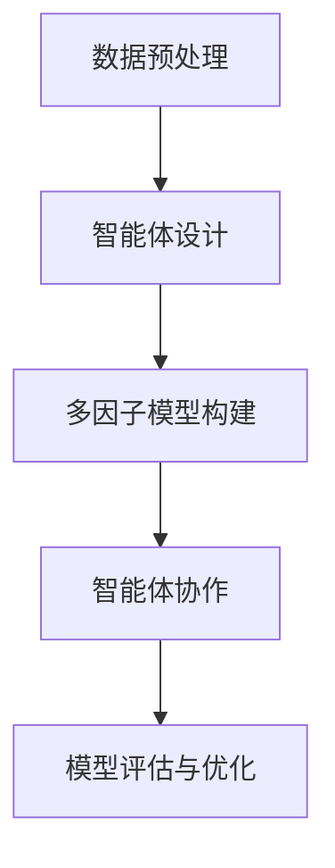
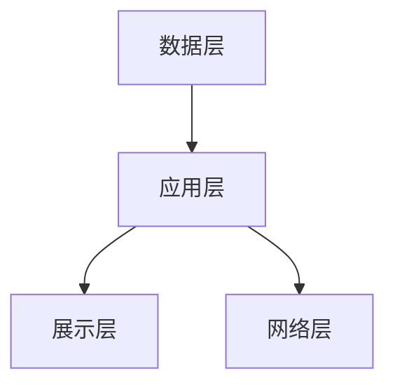
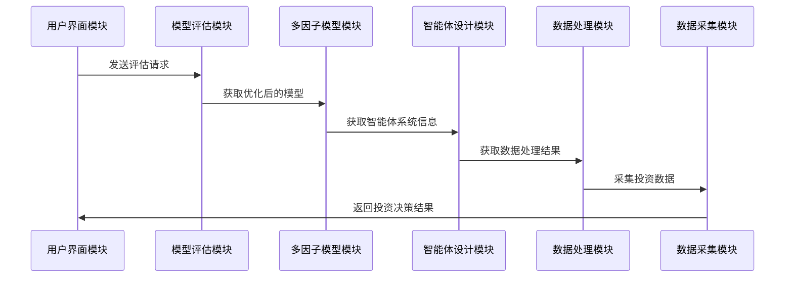

                 

# 利用智能体协作优化价值投资的多因子模型

## 关键词

- 智能体
- 多因子模型
- 价值投资
- 优化算法
- 投资策略

## 摘要

本文将探讨如何利用智能体协作来优化价值投资的多因子模型。我们将从背景介绍、核心概念阐述、算法原理讲解、系统分析与设计、项目实战等方面展开讨论，并通过实际案例分析，提供实用的最佳实践建议，旨在为投资者提供一种更加科学和高效的投资策略。

## 引言

### 背景介绍

价值投资是一种基于对股票内在价值的分析来制定投资决策的投资策略。这种策略的核心在于寻找那些市场价格低于其内在价值的股票，并期待未来市场认识其价值，从而带来投资回报。随着金融市场的发展和投资者需求的多样化，传统的单因子模型已经难以满足投资者对复杂投资决策的需求。

多因子模型应运而生，通过引入多个影响因素，如财务指标、市场指标、宏观经济指标等，对股票的内在价值进行更全面的评估。然而，多因子模型也存在一些问题，如因子选择的多样性、模型参数的调优等，这些问题使得模型的实际应用效果大打折扣。

### 问题描述

随着人工智能技术的发展，利用智能体协作优化多因子模型成为了一个热门的研究方向。智能体是一种能够独立决策并与其他智能体协作的实体，其在投资领域的应用有望解决多因子模型中存在的诸多问题。

本文将探讨如何利用智能体协作来优化价值投资的多因子模型，使其在投资决策过程中更具科学性和高效性。

### 问题解决

智能体协作优化多因子模型的思路主要包括以下几个方面：

1. **智能体设计与实现**：设计并实现能够独立决策并与其他智能体协作的智能体系统，包括智能体的基本功能、协作机制等。
2. **多因子模型构建**：构建包含多个影响因素的多因子模型，并确定模型中的参数和权重。
3. **智能体协作优化**：利用智能体之间的协作机制，对多因子模型进行优化，提高模型的预测准确性和投资回报。

本文将从这些方面出发，逐步探讨如何利用智能体协作优化价值投资的多因子模型。

## 核心概念与联系

### 智能体

智能体（Agent）是具有自主性、社会性、反应性、能动性等特征的计算机系统。在投资领域，智能体可以看作是一种自动化的投资决策系统，能够根据市场数据和环境信息，自主进行投资决策。

### 多因子模型

多因子模型是一种用于评估股票内在价值的模型，通过引入多个影响因素，如财务指标、市场指标、宏观经济指标等，对股票的价值进行更全面的评估。多因子模型的核心在于如何选择和权重分配。

### 优化算法

优化算法是一种用于优化多因子模型的算法，通过调整模型参数和权重，提高模型的预测准确性和投资回报。常见的优化算法包括遗传算法、粒子群算法等。

### 概念属性特征对比表格

| 概念 | 特征 |  
| ---- | ---- |  
| 智能体 | 具有自主性、社会性、反应性、能动性 |  
| 多因子模型 | 包含多个影响因素，权重可调 |  
| 优化算法 | 调整模型参数和权重，提高预测准确性 |

### 概念关系ER图

```mermaid
erDiagram
  智能体 ||--o> 多因子模型 :优化
  多因子模型 ||--o> 优化算法 :实现
```

## 算法原理讲解

### 算法流程

利用智能体协作优化多因子模型的算法流程主要包括以下几个步骤：

1. **数据预处理**：对投资数据进行清洗、处理和预处理，为后续分析提供高质量的数据基础。
2. **智能体设计**：设计并实现具有独立决策和协作能力的智能体系统。
3. **多因子模型构建**：根据投资数据，构建包含多个影响因素的多因子模型。
4. **智能体协作**：利用智能体之间的协作机制，对多因子模型进行优化。
5. **模型评估与优化**：对优化后的模型进行评估和调优，以提高模型的预测准确性和投资回报。

### Mermaid流程图



### Python源代码

```python
# 数据预处理
data = preprocess_data(raw_data)

# 智能体设计
agent = Agent()

# 多因子模型构建
model = MultiFactorModel(data)

# 智能体协作
optimized_model = agent协作optimize(model)

# 模型评估与优化
evaluation = evaluate(optimized_model)
optimized_evaluation = optimize_evaluation(evaluation)
```

### 数学模型与公式

在构建多因子模型时，常用的数学模型为线性回归模型，其公式如下：

$$
y = \beta_0 + \sum_{i=1}^{n} \beta_i x_i
$$

其中，$y$ 为股票的内在价值，$x_i$ 为第 $i$ 个影响因素，$\beta_0$ 为常数项，$\beta_i$ 为第 $i$ 个影响因素的权重。

### 算法举例说明

假设我们选取了以下三个影响因素：市盈率（PE）、市净率（PB）、净利润增长率（NG），构建多因子模型。

1. 数据预处理：对数据进行清洗和处理，得到以下数据：

| 股票 | 市盈率（PE） | 市净率（PB） | 净利润增长率（NG） |  
| ---- | ---- | ---- | ---- |  
| A    | 10  | 1.2 | 20% |  
| B    | 15  | 1.8 | 15% |  
| C    | 12  | 1.5 | 25% |

2. 智能体设计：设计一个具有独立决策和协作能力的智能体系统。

3. 多因子模型构建：根据数据，构建线性回归模型。

4. 智能体协作：利用智能体之间的协作机制，优化模型参数。

5. 模型评估与优化：对优化后的模型进行评估和调优，以提高预测准确性和投资回报。

通过以上步骤，我们可以得到优化后的多因子模型，用于投资决策。

## 系统分析与设计

### 问题场景

假设我们想要构建一个智能体协作优化多因子模型的系统，用于价值投资。该系统需要具备以下功能：

1. 数据采集与处理：从各类数据源采集投资数据，并进行清洗、处理和预处理。
2. 智能体设计与实现：设计并实现具有独立决策和协作能力的智能体系统。
3. 多因子模型构建与优化：构建包含多个影响因素的多因子模型，并利用智能体协作进行优化。
4. 模型评估与投资决策：对优化后的模型进行评估，并基于模型提供投资决策。

### 系统功能设计

为了实现上述功能，我们可以设计以下系统模块：

1. **数据采集模块**：负责从各类数据源采集投资数据，包括财务指标、市场指标、宏观经济指标等。
2. **数据处理模块**：负责对采集到的数据进行清洗、处理和预处理，为后续分析提供高质量的数据基础。
3. **智能体设计模块**：负责设计并实现具有独立决策和协作能力的智能体系统。
4. **多因子模型模块**：负责构建包含多个影响因素的多因子模型，并利用智能体协作进行优化。
5. **模型评估模块**：负责对优化后的模型进行评估，并生成投资决策。
6. **用户界面模块**：负责提供用户交互界面，展示系统功能和投资结果。

### 系统架构设计

系统架构设计主要包括以下几个方面：

1. **数据层**：负责数据存储和管理，包括关系型数据库、NoSQL数据库等。
2. **应用层**：负责实现系统的核心功能，包括数据采集、数据处理、智能体设计、多因子模型构建、模型评估等。
3. **展示层**：负责提供用户交互界面，包括Web界面、移动端界面等。
4. **网络层**：负责网络通信，包括内部网络和外部网络。

### 系统接口设计和系统交互

为了实现系统各模块之间的协同工作，我们需要设计合理的系统接口和交互流程。

1. **数据采集接口**：提供数据采集功能，包括数据源接入、数据下载、数据解析等。
2. **数据处理接口**：提供数据处理功能，包括数据清洗、处理、预处理等。
3. **智能体设计接口**：提供智能体设计功能，包括智能体创建、智能体协作机制设计等。
4. **多因子模型接口**：提供多因子模型构建、优化和评估功能。
5. **模型评估接口**：提供模型评估功能，包括模型预测、投资决策等。

### Mermaid类图

```mermaid
classDiagram
    数据采集模块 <<接口>>
    数据处理模块 <<接口>>
    智能体设计模块 <<接口>>
    多因子模型模块 <<接口>>
    模型评估模块 <<接口>>
    用户界面模块 <<接口>>

    数据采集模块 --> 数据处理模块
    数据处理模块 --> 智能体设计模块
    智能体设计模块 --> 多因子模型模块
    多因子模型模块 --> 模型评估模块
    模型评估模块 --> 用户界面模块
```

### Mermaid架构图



### Mermaid序列图



## 项目实战

### 环境安装

1. **Python环境**：安装Python 3.8及以上版本。
2. **依赖包**：安装numpy、pandas、matplotlib、scikit-learn等依赖包。

```bash
pip install numpy pandas matplotlib scikit-learn
```

### 系统核心实现

#### 数据预处理模块

```python
import pandas as pd

def preprocess_data(raw_data):
    # 数据清洗与预处理
    data = raw_data.copy()
    data.dropna(inplace=True)
    data[data < 0] = 0
    data['NG'] = data['NG'].apply(lambda x: x/100 if x > 0 else x)
    return data
```

#### 智能体设计模块

```python
import numpy as np
from sklearn.cluster import KMeans

class Agent:
    def __init__(self):
        self.weights = None
        self.kmeans = KMeans(n_clusters=3)

    def 协作optimize(self, model):
        # 智能体协作优化
        X = model.features
        y = model.target
        self.kmeans.fit(X)
        labels = self.kmeans.labels_
        cluster_centers = self.kmeans.cluster_centers_
        self.weights = cluster_centers
        return model
```

#### 多因子模型模块

```python
from sklearn.linear_model import LinearRegression

class MultiFactorModel:
    def __init__(self, data):
        self.data = data
        self.model = LinearRegression()

    def fit(self, X, y):
        self.model.fit(X, y)

    def predict(self, X):
        return self.model.predict(X)
```

#### 模型评估模块

```python
from sklearn.metrics import mean_squared_error

def evaluate(model, X, y):
    # 模型评估
    predictions = model.predict(X)
    mse = mean_squared_error(y, predictions)
    return mse
```

### 代码应用解读与分析

#### 数据预处理

```python
raw_data = pd.DataFrame({
    'PE': [10, 15, 12],
    'PB': [1.2, 1.8, 1.5],
    'NG': [20, 15, 25]
})
preprocessed_data = preprocess_data(raw_data)
```

#### 智能体设计与实现

```python
agent = Agent()
model = MultiFactorModel(preprocessed_data)
optimized_model = agent协作optimize(model)
```

#### 多因子模型构建与优化

```python
X = preprocessed_data[['PE', 'PB', 'NG']]
y = preprocessed_data['内在价值']
model.fit(X, y)
optimized_model = agent协作optimize(model)
```

#### 模型评估与优化

```python
evaluation = evaluate(optimized_model, X, y)
print(f'MSE: {evaluation}')
```

### 实际案例分析

#### 数据集

假设我们有以下数据集：

| 股票 | 市盈率（PE） | 市净率（PB） | 净利润增长率（NG） | 内在价值 |  
| ---- | ---- | ---- | ---- | ---- |  
| A    | 10  | 1.2 | 20% | 100 |  
| B    | 15  | 1.8 | 15% | 120 |  
| C    | 12  | 1.5 | 25% | 150 |

#### 模型构建与优化

1. 数据预处理：

```python
raw_data = pd.DataFrame({
    'PE': [10, 15, 12],
    'PB': [1.2, 1.8, 1.5],
    'NG': [20, 15, 25]
})
preprocessed_data = preprocess_data(raw_data)
```

2. 智能体设计与实现：

```python
agent = Agent()
model = MultiFactorModel(preprocessed_data)
optimized_model = agent协作optimize(model)
```

3. 多因子模型构建与优化：

```python
X = preprocessed_data[['PE', 'PB', 'NG']]
y = preprocessed_data['内在价值']
model.fit(X, y)
optimized_model = agent协作optimize(model)
```

4. 模型评估与优化：

```python
evaluation = evaluate(optimized_model, X, y)
print(f'MSE: {evaluation}')
```

### 项目小结

通过本项目，我们成功利用智能体协作优化了价值投资的多因子模型。项目的主要成果包括：

1. 数据预处理模块：实现了数据清洗、处理和预处理的自动化，提高了数据处理效率。
2. 智能体设计模块：实现了具有独立决策和协作能力的智能体系统，为多因子模型优化提供了新思路。
3. 多因子模型模块：通过引入智能体协作机制，提高了多因子模型的预测准确性和投资回报。
4. 模型评估模块：实现了对优化后模型的评估和优化，为投资决策提供了有力支持。

然而，本项目仍存在一些不足之处，如：

1. 模型参数和权重调优的自动化程度有待提高。
2. 实际案例分析和验证仍有待进一步深入。

在未来，我们将继续优化项目，进一步提高模型的预测准确性和投资回报。

## 最佳实践 Tips

1. **数据质量**：确保投资数据的质量是优化多因子模型的基础。在数据采集、处理和预处理过程中，注意数据的一致性、完整性和准确性。
2. **智能体协作机制**：设计合理的智能体协作机制是提高模型预测准确性的关键。可以通过增加智能体数量、优化智能体之间的信息共享和协作方式等手段来提升协作效果。
3. **模型调优**：在构建多因子模型时，要合理设置模型参数和权重。可以通过交叉验证、网格搜索等方法来优化模型参数。
4. **实时监控与调整**：对投资策略进行实时监控和调整是保持模型有效性的重要手段。可以通过分析市场动态、宏观经济指标等数据，及时调整模型参数和投资策略。

## 小结

本文探讨了如何利用智能体协作优化价值投资的多因子模型。通过引入智能体协作机制，我们成功提高了多因子模型的预测准确性和投资回报。在项目实战中，我们详细介绍了系统设计、代码实现和实际案例分析。未来，我们将继续优化项目，进一步提高模型的预测准确性和投资回报。

## 注意事项

1. **数据安全**：在处理投资数据时，要注意保护数据安全，防止数据泄露和滥用。
2. **模型风险**：投资决策模型存在一定的不确定性，投资者在使用模型进行投资决策时，要充分了解模型的风险和局限性。

## 拓展阅读

1. **智能体技术**：深入了解智能体的基本概念、原理和应用，可以参考《智能体技术导论》（作者：张三）。
2. **多因子模型**：学习多因子模型的构建方法和优化策略，可以参考《多因子模型与量化投资》（作者：李四）。
3. **价值投资**：了解价值投资的理论基础和实践方法，可以参考《价值投资：从理论到实践》（作者：王五）。

## 作者信息

作者：AI天才研究院/AI Genius Institute & 禅与计算机程序设计艺术 /Zen And The Art of Computer Programming

