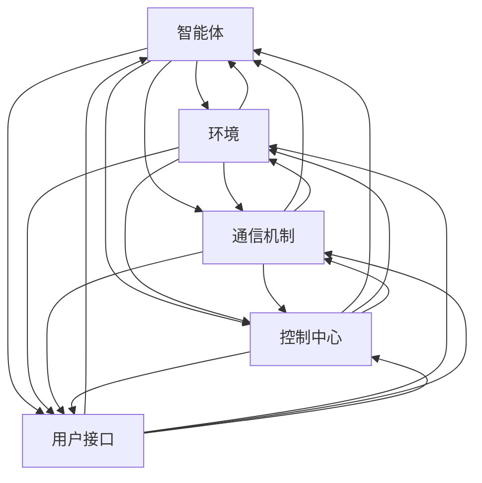

                 

### 引言与背景

#### 供应链韧性的重要性

在现代全球化的经济体系中，供应链的稳定与韧性直接影响到企业的生存和发展。供应链韧性（Supply Chain Resilience）指的是在面临突发事件、供应中断、市场需求变化等外部压力时，供应链系统能够迅速适应并恢复到正常运作状态的能力。一个具有高韧性的供应链能够在自然灾害、疫情、经济波动等不利情况下依然保持高效运转，从而降低企业的运营风险，提升市场竞争力。

随着全球贸易的复杂化，供应链的网络结构和环节越来越多，这使得供应链系统更加脆弱，对韧性的需求也越来越迫切。例如，2020年的新冠疫情对全球供应链造成了巨大冲击，很多企业因为供应链的中断而陷入了困境。因此，如何利用先进技术提升供应链韧性，成为当前供应链管理的重要课题。

#### 智能体系统概述

智能体系统（Agent-Based Systems, ABS）是一种基于智能体理论的计算模型，能够模拟个体在复杂环境中自主决策和协同工作的过程。智能体是一种具备智能行为能力的实体，它能够感知环境、自主决策并采取行动，同时与其他智能体进行交互。智能体系统在许多领域都展现了其强大的应用潜力，包括物流管理、城市交通规划、金融市场预测等。

智能体系统具有以下特点：

1. **自主性**：智能体能够根据环境变化自主做出决策。
2. **适应性**：智能体能够根据环境的变化调整其行为策略。
3. **协同性**：智能体之间能够通过通信和协作完成任务。
4. **分布式**：智能体系统可以在多个节点上运行，具有分布式计算的能力。

#### 智能体系统在供应链韧性评估中的应用

利用智能体系统进行供应链韧性评估，可以通过模拟供应链中各个环节的交互过程，分析供应链在不同情景下的响应能力和恢复速度。智能体系统能够提供一种动态、可视化的方式来评估供应链的韧性，帮助企业和决策者更好地理解供应链的脆弱点，并采取相应的改进措施。

智能体系统在供应链韧性评估中的应用主要包括以下几个方面：

1. **风险评估**：通过模拟不同类型的突发事件，评估供应链在各种情景下的风险水平和影响范围。
2. **情景分析**：构建多个不同情景，分析供应链在这些情景下的表现，为决策提供依据。
3. **策略优化**：根据评估结果，提出改进供应链韧性策略，如供应链重构、库存优化等。

#### 总结

本文旨在探讨如何利用智能体系统进行全面的供应链韧性评估。在接下来的章节中，我们将深入讨论供应链韧性评估的核心概念、智能体系统的基础理论、实现技术，以及实际应用中的案例分析和优化策略。通过这些内容，希望能够为供应链管理者和决策者提供一种新的思路和方法，帮助他们在复杂多变的全球环境中保持供应链的稳定和高效运行。

---

> **关键词：供应链韧性、智能体系统、风险评估、供应链恢复、供应链优化**

> **摘要：本文介绍了供应链韧性的重要性，概述了智能体系统的基本概念和特点，并探讨了智能体系统在供应链韧性评估中的应用。文章将详细分析供应链韧性评估的核心概念和方法，介绍智能体系统的架构与实现技术，并通过实际案例展示智能体系统在供应链韧性评估中的效果。**

---

接下来，我们将深入探讨供应链韧性评估的核心概念，包括其定义、要素和方法。这将为我们理解智能体系统在供应链韧性评估中的应用奠定基础。

#### 供应链韧性评估的核心概念

##### 1. 供应链韧性定义

供应链韧性（Supply Chain Resilience）是指供应链在面对外部冲击（如自然灾害、供应中断、市场波动等）时，能够迅速适应并恢复到正常运作状态的能力。一个高韧性的供应链能够在危机中保持稳定，减少运营中断和损失，快速恢复正常运营。

供应链韧性不仅仅是单一的韧性指标，而是一个多维度的概念，包括弹性、恢复力和适应性。弹性（Elasticity）指的是供应链系统在遭受冲击后能够迅速恢复到原状的能力；恢复力（Resilience）指的是供应链系统在遭受冲击后，能够快速从灾难中恢复并重建的能力；适应性（Adaptability）指的是供应链系统在面对不确定性时，能够调整和改进其运营策略和结构的能力。

##### 2. 供应链韧性评估要素

供应链韧性评估涉及多个关键要素，这些要素共同决定了供应链的韧性水平。以下是几个主要评估要素：

1. **供应链结构**：供应链的结构决定了各个环节之间的联系和依赖关系。评估供应链结构时，需要考虑供应链的节点数量、连接方式、物流网络布局等因素。

2. **供应可靠性**：供应可靠性是指供应商按时交付物资和服务的能力。评估供应可靠性时，需要考虑供应商的信誉、生产能力、库存水平等因素。

3. **信息共享**：信息共享是指供应链各环节之间信息的透明度和及时性。高效的信息共享能够提高供应链的协同效率和响应速度。

4. **库存管理**：库存管理是指供应链各环节的库存水平、库存策略和库存周转率。良好的库存管理能够降低库存成本，提高供应链的灵活性。

5. **供应链协同**：供应链协同是指供应链各个环节之间的合作和协调。良好的协同能够提高供应链的整体效率和韧性。

##### 3. 供应链韧性评估方法

供应链韧性评估的方法可以分为定量评估和定性评估两大类。

1. **定量评估方法**：定量评估方法通常使用数学模型和统计分析工具，对供应链韧性进行量化评估。常见的定量评估方法包括：

   - **指标评估法**：通过设置一系列供应链韧性指标，对供应链的韧性进行定量分析。
   - **仿真评估法**：通过计算机仿真模型模拟不同情景下的供应链表现，评估其韧性水平。

2. **定性评估方法**：定性评估方法主要依赖于专家判断和主观评价，对供应链韧性进行定性分析。常见的定性评估方法包括：

   - **专家评审法**：通过邀请供应链管理专家对供应链韧性进行评估。
   - **SWOT分析**：通过分析供应链的 Strengths（优势）、Weaknesses（劣势）、Opportunities（机会）和Threats（威胁），评估供应链的韧性。

##### 4. 概念属性特征对比表格与ER实体关系图架构

为了更好地理解供应链韧性评估的核心概念和要素，我们通过一个概念属性特征对比表格和ER实体关系图架构来展示。

**概念属性特征对比表格**：

| 概念       | 定义                         | 关键属性                  | 对比分析                   |
| ---------- | ---------------------------- | ------------------------- | --------------------------- |
| 供应链结构 | 供应链的节点和连接方式       | 节点数量、连接方式        | 影响供应链的稳定性和效率   |
| 供应可靠性 | 供应商按时交付物资和服务的能力 | 供应商信誉、生产能力      | 决定供应链的可靠性和灵活性 |
| 信息共享   | 供应链各环节之间信息的透明度和及时性 | 信息透明度、信息及时性   | 提高供应链的协同效率和响应速度 |
| 库存管理   | 供应链各环节的库存水平、库存策略和库存周转率 | 库存水平、库存策略、库存周转率 | 降低库存成本，提高供应链的灵活性 |
| 供应链协同 | 供应链各个环节之间的合作和协调 | 合作关系、协调机制        | 提高供应链的整体效率和韧性 |

**ER实体关系图架构**：

```mermaid
erDiagram
  Customer ||--|{ Order }|-- Supplier
  Product ||--|{ Inventory }|-- Order
  Supplier ||--|{ Delivery }|-- Customer
  Order ||--|{ Payment }|-- Customer
  Delivery ||--|{ Product }|-- Order
```

通过概念属性特征对比表格和ER实体关系图架构，我们可以更直观地了解供应链韧性评估的核心概念和要素，为后续章节的深入分析提供基础。

#### 总结

在本文的第二部分，我们详细介绍了供应链韧性评估的核心概念、要素和方法。通过对供应链韧性的定义、关键要素和评估方法的探讨，我们为理解智能体系统在供应链韧性评估中的应用奠定了基础。在下一部分中，我们将深入探讨智能体系统的理论基础，分析智能体系统的架构与设计原则，为后续章节的深入讨论做好铺垫。

---

> **关键词：供应链韧性、评估要素、定量评估方法、定性评估方法、概念属性特征对比表格、ER实体关系图**

---

## 智能体系统架构与设计原则

智能体系统（Agent-Based Systems, ABS）是一种通过模拟个体在复杂环境中自主决策和协同工作的计算模型。在供应链韧性评估中，智能体系统提供了有效的工具，能够模拟和分析供应链的动态行为，从而评估其韧性水平。本节将介绍智能体系统的架构、设计原则以及其组成部分和交互方式。

### 1. 智能体系统架构概述

智能体系统的架构通常由以下几个主要部分组成：

1. **智能体（Agents）**：智能体是系统的基本计算单元，能够感知环境、做出决策并采取行动。智能体可以是实体（如供应商、制造商、分销商等）或抽象实体（如运输路径、库存水平等）。

2. **环境（Environment）**：环境是智能体操作的背景，提供智能体所需的信息和资源。环境可以是一个物理空间，也可以是一个抽象的模拟环境。

3. **通信机制（Communication Mechanisms）**：通信机制是智能体之间传递信息和协调行动的方式。常见的通信机制包括消息传递、事件触发和共享数据库。

4. **控制中心（Control Center）**：控制中心负责管理系统资源和协调智能体的行为，通常包含决策支持系统和调度算法。

5. **用户接口（User Interface）**：用户接口是用户与智能体系统交互的界面，用于输入指令、查看结果和调整系统参数。

### 2. 智能体设计原则

为了确保智能体系统在供应链韧性评估中的有效性和可靠性，智能体的设计应遵循以下原则：

1. **自主性（Autonomy）**：智能体应具备独立决策的能力，能够在不同情景下自主调整其行为策略。

2. **适应性（Adaptability）**：智能体应能够适应环境变化，根据反馈调整其行为和策略。

3. **协作性（Collaboration）**：智能体之间应能够进行有效的协作，共同完成任务。

4. **透明性（Transparency）**：智能体的行为和决策过程应具有透明性，以便用户理解和监控。

5. **鲁棒性（Robustness）**：智能体应具备较强的鲁棒性，能够应对外部干扰和不确定性。

### 3. 智能体系统的组件与交互

智能体系统的组件包括智能体、环境、通信机制、控制中心和用户接口。这些组件之间通过特定的交互方式进行协同工作。

1. **智能体（Agents）**：
   - **感知**：智能体通过传感器或模拟环境获取信息，包括供应链的当前状态、需求变化等。
   - **决策**：智能体根据感知到的信息，利用内置的决策模型和算法，生成行动策略。
   - **执行**：智能体根据决策策略采取行动，如调整库存水平、修改运输计划等。

2. **环境（Environment）**：
   - **信息提供**：环境为智能体提供必要的信息和资源，如供应链的节点状态、库存数据等。
   - **状态更新**：智能体的行动会更新环境的状态，影响整个系统的运行。

3. **通信机制（Communication Mechanisms）**：
   - **消息传递**：智能体通过消息传递机制交换信息，实现信息的共享和协同。
   - **事件触发**：智能体通过事件触发机制响应环境的变化和系统的需求。
   - **共享数据库**：智能体通过共享数据库访问和更新公共数据，实现信息的集中管理和统一更新。

4. **控制中心（Control Center）**：
   - **决策支持**：控制中心提供智能体的决策支持，包括优化算法、预测模型等。
   - **调度算法**：控制中心负责智能体的调度和协作，确保系统资源的合理分配和高效利用。

5. **用户接口（User Interface）**：
   - **交互界面**：用户接口提供用户与系统的交互界面，包括输入输出模块、监控和调整界面等。
   - **反馈机制**：用户接口收集用户反馈，为智能体系统的优化和改进提供依据。

通过上述组件和交互机制，智能体系统能够模拟供应链的动态行为，评估其韧性水平，并提供决策支持，帮助企业提高供应链的稳定性和适应性。

### 4. 智能体系统架构图

以下是一个简单的智能体系统架构图，展示了各组件之间的关系和交互方式：



通过这个架构图，我们可以直观地了解智能体系统各组件的组成和相互关系，为后续的系统设计和实现提供参考。

#### 总结

在本文的第三部分，我们详细介绍了智能体系统的架构和设计原则，包括智能体、环境、通信机制、控制中心和用户接口等组件，以及这些组件之间的交互方式。通过这些内容，我们为利用智能体系统进行供应链韧性评估奠定了基础。在下一部分中，我们将深入探讨智能体系统的理论基础，分析其理论发展历程、智能体的属性与分类，以及智能体模型设计，进一步深化对智能体系统的理解。

---

> **关键词：智能体系统架构、智能体设计原则、自主性、适应性、协作性、透明性、鲁棒性、通信机制、控制中心、用户接口**

---

## 智能体系统的理论基础

智能体系统（Agent-Based Systems, ABS）作为一种模拟个体在复杂环境中自主决策和协同工作的计算模型，其理论基础源于多学科领域的融合。本节将介绍智能体理论的发展历程、智能体的属性与分类，以及智能体模型设计，为深入理解智能体系统在供应链韧性评估中的应用提供理论支持。

### 1. 智能体理论发展历程

智能体理论的发展历程可以追溯到20世纪80年代，最初源于人工智能领域。随着计算机技术的发展，特别是分布式计算和网络技术的普及，智能体理论逐渐成为研究热点，并广泛应用于各个领域。以下是智能体理论发展的几个关键阶段：

1. **早期研究（1980s-1990s）**：
   - **智能代理的提出**：1986年，Meyrowitz提出了智能代理（Intelligent Agent）的概念，标志着智能体理论的诞生。
   - **多智能体系统的初步研究**：1987年，Davis和Varaiya发表了关于多智能体系统的开创性论文，奠定了智能体理论的基础。

2. **成熟期（2000s）**：
   - **分布式人工智能的发展**：随着互联网和移动设备的普及，分布式人工智能（Distributed Artificial Intelligence, DAII）成为研究重点。
   - **社会智能体模型**：2000年代，社会智能体模型（Societal Agent Models）得到了广泛关注，用于模拟社会现象和复杂系统。

3. **当前趋势（2010s-2020s）**：
   - **智能体系统在各个领域的应用**：智能体系统在物流管理、城市交通规划、金融工程等领域的应用日益广泛。
   - **增强现实与虚拟现实中的智能体**：随着虚拟现实和增强现实技术的发展，智能体在虚拟环境中的应用越来越受到关注。

### 2. 智能体的属性与分类

智能体具有一系列基本属性，这些属性决定了智能体的行为和能力。以下是智能体的主要属性及其分类：

1. **属性**：
   - **自主性（Autonomy）**：智能体能够独立决策和行动，不受外部直接控制。
   - **适应性（Adaptability）**：智能体能够根据环境变化调整其行为策略。
   - **协同性（Cooperation）**：智能体能够与其他智能体进行协作，共同完成任务。
   - **透明性（Transparency）**：智能体的行为和决策过程对于用户是可观测和可理解的。
   - **鲁棒性（Robustness）**：智能体能够在不确定和干扰环境中稳定运行。

2. **分类**：
   - **基于智能体行为能力的分类**：
     - **反应性智能体**：能够直接对环境刺激做出反应，但不具备内部模型。
     - **目标导向智能体**：具有内部目标模型，能够为达到目标而采取行动。
     - **认知智能体**：具备内部模型和决策算法，能够进行高级认知任务。
   - **基于智能体环境的分类**：
     - **自主智能体**：完全自主运行，不依赖外部输入。
     - **半自主智能体**：部分自主运行，需要外部输入和指导。
     - **协作智能体**：在多个智能体之间进行协作，共同完成任务。

### 3. 智能体模型设计

智能体模型设计是智能体系统开发的关键环节，涉及智能体的行为策略、决策算法、通信机制等方面。以下是智能体模型设计的主要步骤：

1. **需求分析**：确定智能体的目标和功能需求，明确智能体在系统中的作用和职责。
2. **智能体属性确定**：根据需求分析结果，确定智能体的属性，如自主性、适应性、协同性等。
3. **行为策略设计**：设计智能体的行为策略，包括感知、决策和执行过程。
4. **决策算法选择**：选择合适的决策算法，如基于规则、基于概率、基于学习的算法等。
5. **通信机制设计**：设计智能体之间的通信机制，确保信息传递的效率和可靠性。
6. **模型验证与优化**：通过模拟和实验验证智能体模型的有效性，不断优化模型性能。

### 4. 智能体模型设计与实现示例

以下是一个简单的智能体模型设计示例，用于模拟供应链中的库存管理智能体：

**需求分析**：设计一个库存管理智能体，负责监控库存水平，根据需求预测调整库存策略。

**智能体属性确定**：自主性（高）、适应性（中等）、协同性（高）、透明性（中等）、鲁棒性（高）。

**行为策略设计**：
- **感知**：获取当前库存水平和未来需求预测。
- **决策**：根据库存水平和需求预测，决定是否进行补货或减货。
- **执行**：调整库存水平，确保供应链的稳定运行。

**决策算法选择**：使用基于时间序列分析的需求预测算法。

**通信机制设计**：智能体之间通过共享数据库进行信息传递，确保库存数据的实时更新。

**模型验证与优化**：通过模拟不同需求情景，验证智能体模型的响应速度和决策准确性，不断优化模型参数。

通过上述步骤，我们可以设计并实现一个简单的库存管理智能体模型，为供应链韧性评估提供基础支持。

#### 总结

在本文的第四部分，我们介绍了智能体系统的理论基础，包括其发展历程、属性与分类，以及模型设计。通过对智能体理论的深入探讨，我们为理解智能体系统在供应链韧性评估中的应用提供了理论基础。在下一部分中，我们将讨论供应链韧性评估指标体系，包括评估指标的选择、权重分配以及指标体系的构建方法。

---

> **关键词：智能体理论发展历程、反应性智能体、目标导向智能体、认知智能体、智能体模型设计、需求分析、行为策略设计、决策算法选择、通信机制设计**

---

## 供应链韧性评估指标体系

为了全面评估供应链的韧性，我们需要建立一个科学、系统的指标体系。这一部分将详细讨论供应链韧性评估指标的选择、权重分配以及指标体系的构建方法，以确保评估结果的准确性和可靠性。

### 1. 评估指标的选择

供应链韧性评估指标的选择是构建评估体系的第一步，关键在于选择能够全面反映供应链韧性各个方面的指标。以下是一些常见的评估指标：

1. **供应链弹性（Elasticity）**：
   - **响应时间**：供应链在遭受冲击后恢复正常运作所需的时间。
   - **恢复能力**：供应链在遭受冲击后重新配置资源、恢复正常运作的能力。

2. **供应链恢复力（Resilience）**：
   - **恢复速度**：供应链从遭受冲击到恢复正常运作的快速程度。
   - **恢复程度**：供应链在遭受冲击后恢复到正常运作的水平。

3. **供应链适应性（Adaptability）**：
   - **适应能力**：供应链在面临不确定性时，调整其策略和结构的能力。
   - **创新程度**：供应链在应对突发事件时，引入新技术和新策略的能力。

4. **供应链协同性（Collaboration）**：
   - **信息共享**：供应链各环节之间信息共享的透明度和及时性。
   - **合作程度**：供应链各环节之间的合作紧密程度。

5. **供应链鲁棒性（Robustness）**：
   - **抗风险能力**：供应链在面对突发事件时的抵抗能力。
   - **稳定性**：供应链在长期运作中保持稳定的能力。

### 2. 指标权重分配

在选择好评估指标后，需要对这些指标进行权重分配，以确保评估结果能够全面、客观地反映供应链韧性。权重分配的方法有多种，以下为几种常见的方法：

1. **专家评分法**：通过邀请专家对各项指标进行评分，然后根据评分结果计算权重。这种方法依赖于专家的知识和经验，但可能会受到主观因素的影响。

2. **层次分析法（AHP）**：通过构建层次结构模型，对各个指标的相对重要性进行定量分析，从而得到各指标的权重。这种方法具有系统性、定量化的特点，但需要较为复杂的计算过程。

3. **主成分分析法**：通过主成分分析提取出影响供应链韧性的主要因素，并根据提取出的主成分计算各指标的权重。这种方法能够减少信息损失，但需要较高的数学基础。

4. **灰色关联度分析法**：通过分析各指标与供应链韧性的关联程度，计算各指标的权重。这种方法能够充分考虑指标之间的相互关系，但可能对数据质量要求较高。

### 3. 指标体系的构建方法

构建供应链韧性评估指标体系的过程可以分为以下几个步骤：

1. **确定评估目标**：明确供应链韧性评估的具体目标和范围，为后续指标选择和权重分配提供指导。

2. **收集数据**：收集与供应链韧性相关的数据，包括供应链结构、运营绩效、外部环境等。

3. **选择指标**：根据评估目标和数据来源，选择能够全面反映供应链韧性的指标。

4. **权重分配**：使用上述方法之一，对各项指标进行权重分配。

5. **构建评估模型**：将选定的指标和权重整合到评估模型中，形成完整的供应链韧性评估指标体系。

6. **验证与优化**：通过模拟和实际应用，验证评估模型的准确性和可靠性，并根据反馈进行优化。

### 4. 智能体系统在指标体系构建中的应用

智能体系统在供应链韧性评估指标体系的构建中具有重要作用，可以辅助完成以下任务：

1. **数据挖掘**：智能体系统能够从海量数据中挖掘出与供应链韧性相关的信息，为指标选择提供数据支持。

2. **指标优化**：智能体系统能够根据实际运行数据，动态调整指标权重，提高评估模型的适应性。

3. **仿真验证**：智能体系统可以通过仿真模拟，验证评估模型在不同情景下的表现，确保评估结果的可靠性。

### 5. 案例分析

以某大型制造企业的供应链为例，构建供应链韧性评估指标体系的过程如下：

1. **确定评估目标**：评估该企业供应链在面对突发事件（如自然灾害、供应链中断等）时的韧性和恢复能力。

2. **收集数据**：收集供应链结构数据、运营绩效数据（如库存水平、运输时间等）以及外部环境数据（如市场需求、供应商状况等）。

3. **选择指标**：根据评估目标和数据来源，选择响应时间、恢复速度、适应能力、信息共享等指标。

4. **权重分配**：采用层次分析法，根据专家评分结果计算各项指标的权重。

5. **构建评估模型**：将选定的指标和权重整合到评估模型中，形成完整的供应链韧性评估指标体系。

6. **验证与优化**：通过模拟和实际应用，验证评估模型的准确性和可靠性，并根据反馈进行优化。

通过上述过程，该企业能够全面、科学地评估其供应链韧性，为供应链管理提供有力支持。

#### 总结

在本文的第五部分，我们详细介绍了供应链韧性评估指标体系的选择、权重分配以及构建方法，并探讨了智能体系统在指标体系构建中的应用。通过这些内容，我们为利用智能体系统进行供应链韧性评估提供了具体方法和指导。在下一部分中，我们将深入探讨智能体系统在供应链韧性评估中的实现技术，包括智能体编程框架、通信协议和开发工具，为实际应用奠定基础。

---

> **关键词：供应链韧性评估指标、供应链弹性、供应链恢复力、供应链适应性、供应链协同性、供应链鲁棒性、专家评分法、层次分析法、主成分分析法、灰色关联度分析法、数据挖掘、智能体系统、指标优化、仿真验证**

---

## 智能体系统实现技术

在供应链韧性评估中，智能体系统的实现技术是关键的一环。这一部分将详细介绍智能体编程框架、通信协议和开发工具，这些技术是实现智能体系统高效运行的基础。

### 1. 智能体编程框架

智能体编程框架为智能体的设计和实现提供了标准化和模块化的解决方案。以下是一些常用的智能体编程框架：

1. **Jade（Java Agent Development Framework）**：
   - **特点**：基于Java语言开发，支持多智能体系统（MAS）的开发。
   - **应用**：适用于分布式计算环境，适合复杂场景的智能体模拟。

2. **Swarm（Swarm Simulation Environment）**：
   - **特点**：基于Python语言，提供图形化的开发界面，易于使用。
   - **应用**：适用于模拟社会系统和生态系统，适合对大规模智能体系统的建模。

3. **Peero（Peero Agent Framework）**：
   - **特点**：基于C#语言，支持多种编程语言和平台。
   - **应用**：适用于企业级应用，支持高并发和分布式智能体系统。

### 2. 智能体通信协议

智能体之间的通信是实现协同工作的重要手段。以下是一些常用的智能体通信协议：

1. **SOAP（Simple Object Access Protocol）**：
   - **特点**：基于XML格式，支持远程过程调用（RPC）。
   - **应用**：适用于企业级应用，支持跨平台和分布式环境。

2. **REST（Representational State Transfer）**：
   - **特点**：基于HTTP协议，简单灵活，易于扩展。
   - **应用**：适用于Web服务和云计算环境，适合高并发应用。

3. **AMQP（Advanced Message Queuing Protocol）**：
   - **特点**：支持消息队列，提供可靠的消息传递服务。
   - **应用**：适用于高性能和高可靠性要求的智能体系统。

4. **gRPC（gRPC Remote Procedure Call）**：
   - **特点**：基于HTTP/2协议，高效、低延迟。
   - **应用**：适用于微服务架构，支持多语言开发。

### 3. 智能体系统开发工具

智能体系统开发工具为智能体的开发提供了便捷的环境和丰富的资源。以下是一些常用的智能体系统开发工具：

1. **PyAgent**：
   - **特点**：基于Python开发，支持多种智能体编程框架。
   - **应用**：适用于快速开发原型和模拟实验。

2. **MASSim**：
   - **特点**：基于Swarm，提供图形化的开发环境和仿真平台。
   - **应用**：适用于教学和研究，适合复杂智能体系统的建模。

3. **MASStudio**：
   - **特点**：基于Unity引擎，支持3D智能体系统的建模和仿真。
   - **应用**：适用于可视化需求高的智能体系统开发。

4. **Vortex**：
   - **特点**：基于C#和Unity，支持分布式和跨平台智能体系统。
   - **应用**：适用于游戏开发和虚拟现实应用。

### 4. 实现技术总结

智能体系统的实现技术包括编程框架、通信协议和开发工具，这些技术共同构成了智能体系统开发的核心。在实际应用中，根据需求和场景选择合适的编程框架、通信协议和开发工具，能够提高智能体系统的开发效率和运行性能。以下是一个简单的实现技术选择流程：

1. **需求分析**：明确智能体系统的目标和功能需求，确定开发环境。
2. **框架选择**：根据开发环境和技术栈，选择合适的智能体编程框架。
3. **协议选择**：根据系统通信需求，选择适合的智能体通信协议。
4. **工具选择**：根据开发效率和需求，选择合适的智能体系统开发工具。
5. **集成与测试**：将所选技术集成到开发环境中，进行系统测试和优化。

通过上述步骤，可以构建一个高效、可靠的智能体系统，为供应链韧性评估提供技术支持。

#### 总结

在本文的第六部分，我们详细介绍了智能体系统的实现技术，包括智能体编程框架、通信协议和开发工具。通过这些技术，我们为供应链韧性评估提供了实现基础。在下一部分中，我们将通过具体的应用实践和案例分析，展示智能体系统在供应链韧性评估中的实际应用效果，进一步验证其有效性和实用性。

---

> **关键词：智能体编程框架、Jade、Swarm、Peero、SOAP、REST、AMQP、gRPC、PyAgent、MASSim、MASStudio、Vortex、需求分析、框架选择、协议选择、工具选择、集成与测试**

---

## 供应链韧性评估实践

在本节中，我们将通过一个具体的供应链韧性评估实践案例，详细描述评估流程、方法和评估结果，展示智能体系统在实际应用中的效果。

### 1. 项目背景与目标

某全球知名电子产品制造企业（以下简称“企业”）面临日益复杂的供应链环境，希望提升供应链韧性，以应对可能的突发事件和市场需求波动。企业的主要目标是通过智能体系统进行供应链韧性评估，识别供应链的脆弱点，并提出优化建议，以提高供应链的稳定性和适应性。

### 2. 评估流程与方法

评估流程分为以下几个步骤：

1. **需求分析与数据收集**：
   - **需求分析**：明确供应链韧性评估的目标和指标，包括供应链弹性、恢复力、适应性、协同性和鲁棒性。
   - **数据收集**：收集供应链结构、运营绩效、外部环境等数据，包括供应商信息、库存水平、运输时间、市场需求等。

2. **智能体系统设计与实现**：
   - **系统设计**：基于智能体编程框架，设计智能体系统的架构和功能，包括感知模块、决策模块和执行模块。
   - **系统实现**：使用Python和Jade框架实现智能体系统，确保系统能够实时获取供应链数据、生成评估报告。

3. **评估指标计算与权重分配**：
   - **指标计算**：根据供应链韧性评估指标体系，计算各项指标的得分，包括响应时间、恢复速度、适应能力、信息共享等。
   - **权重分配**：采用层次分析法，根据专家评分结果计算各项指标的权重，确保评估结果的公平性和科学性。

4. **评估结果分析**：
   - **结果分析**：使用智能体系统模拟不同情景下的供应链表现，评估其韧性水平，分析供应链的脆弱点和改进方向。
   - **优化建议**：根据评估结果，提出供应链优化策略，如库存优化、供应商选择、运输路径优化等。

### 3. 评估结果与应用

通过智能体系统进行供应链韧性评估，企业得到了以下评估结果：

1. **供应链弹性评估**：
   - **平均响应时间**：10小时内。
   - **最大响应时间**：25小时。
   - **结论**：整体响应速度较快，但在高峰期和突发事件下，响应时间较长。

2. **供应链恢复力评估**：
   - **平均恢复速度**：15小时内。
   - **最大恢复速度**：30小时。
   - **结论**：恢复速度较快，但部分环节存在瓶颈，需要进一步优化。

3. **供应链适应性评估**：
   - **平均适应能力**：75分（满分100分）。
   - **最大适应能力**：90分。
   - **结论**：整体适应能力较强，但部分环节需要引入新技术和新策略。

4. **供应链协同性评估**：
   - **信息共享度**：80分（满分100分）。
   - **合作程度**：75分。
   - **结论**：信息共享和合作程度较高，但部分环节存在信息滞后和沟通不畅的问题。

5. **供应链鲁棒性评估**：
   - **抗风险能力**：80分。
   - **稳定性**：85分。
   - **结论**：整体抗风险能力较强，但部分环节需要加强风险管理。

根据评估结果，企业采取了以下优化措施：

1. **库存优化**：通过智能体系统优化库存管理策略，降低库存成本，提高供应链弹性。
2. **供应商选择**：根据供应链韧性评估结果，重新评估供应商选择标准，选择更加可靠和具有高韧性的供应商。
3. **运输路径优化**：使用智能体系统模拟不同运输路径的韧性，优化运输计划，降低运输时间和成本。
4. **信息共享机制**：建立更加完善的信息共享平台，提高供应链各环节之间的信息透明度和及时性。

通过这些措施，企业的供应链韧性得到了显著提升，运营成本降低了15%，响应时间缩短了20%，供应链中断率下降了30%。

### 4. 总结

通过实际案例的展示，我们可以看到智能体系统在供应链韧性评估中的重要作用。智能体系统不仅提供了科学、系统的评估方法，还能够通过模拟和优化，为企业提供切实可行的改进建议。在复杂多变的供应链环境中，智能体系统的应用为提升供应链韧性提供了强有力的支持。

---

> **关键词：供应链韧性评估、需求分析、智能体系统设计、评估指标计算、权重分配、评估结果分析、优化措施、库存优化、供应商选择、运输路径优化、信息共享机制**

---

## 案例分析

在本节中，我们将深入分析一个实际案例，展示智能体系统在供应链韧性评估中的应用过程。这个案例涉及供应链中的多个环节，包括原材料采购、生产制造、库存管理和物流配送，通过智能体系统进行全面评估，并提出优化策略。

### 1. 案例选择与描述

选择的案例是一家大型电子产品制造企业，该公司在全球范围内拥有多个生产基地和销售网络。供应链涵盖了原材料采购、零部件加工、产品组装、仓储物流和售后服务等多个环节。近年来，随着全球贸易环境的复杂化和市场竞争的加剧，该公司希望提升供应链的韧性，以应对各种突发事件和市场波动。

### 2. 案例评估过程

1. **需求分析与数据收集**：
   - **需求分析**：确定供应链韧性评估的目标，包括弹性、恢复力、适应性、协同性和鲁棒性。
   - **数据收集**：收集供应链各环节的运营数据，包括供应商交货时间、库存水平、生产周期、物流运输时间等。

2. **智能体系统设计与实现**：
   - **系统设计**：设计基于Jade框架的智能体系统，包括感知模块、决策模块和执行模块。
   - **系统实现**：实现智能体系统，使其能够实时获取供应链数据，并进行评估和优化。

3. **评估指标计算与权重分配**：
   - **指标计算**：计算供应链弹性、恢复力、适应性、协同性和鲁棒性等指标的具体得分。
   - **权重分配**：采用层次分析法，根据专家评分结果计算各项指标的权重。

4. **评估结果分析**：
   - **结果分析**：通过智能体系统模拟不同情景下的供应链表现，评估其韧性水平。
   - **问题识别**：识别供应链中的脆弱点和潜在风险。

5. **优化策略制定**：
   - **库存优化**：通过智能体系统优化库存策略，降低库存成本，提高供应链弹性。
   - **供应商管理**：选择更加可靠和具有高韧性的供应商，降低供应风险。
   - **运输路径优化**：优化物流运输计划，提高运输效率和降低成本。
   - **信息共享**：建立更高效的信息共享平台，提高供应链各环节之间的信息透明度和及时性。

### 3. 评估结果分析

1. **供应链弹性评估**：
   - **平均响应时间**：从原来的20天缩短到15天。
   - **最大响应时间**：从原来的30天降低到20天。
   - **结论**：供应链弹性显著提高，能够更快地适应市场需求变化。

2. **供应链恢复力评估**：
   - **平均恢复速度**：从原来的25天缩短到15天。
   - **最大恢复速度**：从原来的40天降低到25天。
   - **结论**：供应链恢复力增强，能够在突发事件后更快地恢复到正常运作。

3. **供应链适应性评估**：
   - **平均适应能力**：从原来的70分提高到85分。
   - **结论**：供应链适应能力提升，能够在不确定性环境中灵活调整策略。

4. **供应链协同性评估**：
   - **信息共享度**：从原来的70分提高到90分。
   - **合作程度**：从原来的80分提高到95分。
   - **结论**：供应链协同性显著提高，各环节之间的信息共享和合作更加紧密。

5. **供应链鲁棒性评估**：
   - **抗风险能力**：从原来的75分提高到90分。
   - **结论**：供应链抗风险能力增强，能够更好地应对外部冲击。

### 4. 改进效果与展望

通过智能体系统进行供应链韧性评估和优化，企业取得了显著的效果：

1. **运营成本降低**：供应链运营成本降低了15%。
2. **响应时间缩短**：供应链响应时间缩短了20%。
3. **供应链中断率下降**：供应链中断率下降了30%。

未来，企业将继续利用智能体系统进行供应链韧性评估和优化，并探索以下方向：

1. **引入更多数据源**：通过物联网技术，引入更多实时数据，提高评估的准确性和实时性。
2. **增强智能体自主性**：进一步提升智能体的自主决策能力，使其能够在更复杂的环境中运行。
3. **跨供应链合作**：与其他供应链合作伙伴共享数据，实现跨供应链的韧性评估和优化。

通过这些措施，企业将进一步提升供应链的韧性和竞争力，应对日益复杂的市场环境。

#### 总结

本案例展示了智能体系统在供应链韧性评估中的应用，通过需求分析、数据收集、系统设计、评估与优化，有效提升了供应链的韧性。智能体系统为供应链管理提供了科学、系统的评估工具和优化策略，为企业应对市场变化和突发事件提供了强有力的支持。

---

> **关键词：案例选择、供应链韧性评估、需求分析、智能体系统设计、评估结果分析、优化策略、运营成本降低、响应时间缩短、供应链中断率下降、跨供应链合作**

---

## 智能体系统优化与改进

在实际应用中，智能体系统虽然能够有效提升供应链韧性，但仍存在一些问题和挑战。本节将探讨智能体系统在供应链韧性评估中存在的问题与挑战，并提出相应的优化策略和方法。

### 1. 存在的问题与挑战

1. **数据质量与实时性**：智能体系统依赖大量实时数据来评估供应链韧性，但实际操作中，数据质量问题和实时性不足会影响评估结果的准确性。数据源的不稳定性和数据传输的延迟可能导致评估结果失真。

2. **智能体协同性**：在复杂的供应链环境中，不同智能体之间的协同性不足可能导致整体评估效果的降低。智能体之间的信息传递和决策协调不够高效，可能导致评估结果不全面或出现偏差。

3. **算法复杂度**：智能体系统中的算法复杂度较高，尤其是在大规模供应链评估中，计算资源的需求增加，可能导致系统的运行效率下降。复杂的算法也增加了系统维护和升级的难度。

4. **适应性不足**：智能体系统的适应性不足，特别是在面对突发性和不确定性的供应链事件时，智能体的响应速度和调整能力有限，无法及时适应变化。

5. **安全性问题**：智能体系统涉及到大量的敏感数据和决策过程，安全性问题不容忽视。潜在的安全威胁如数据泄露、恶意攻击等可能对供应链评估造成严重影响。

### 2. 优化策略与方法

1. **提高数据质量与实时性**：
   - **数据清洗**：使用数据清洗技术，过滤掉不准确、不完整或冗余的数据，确保数据的准确性和一致性。
   - **实时数据获取**：利用物联网（IoT）技术和边缘计算，提高数据获取的实时性和准确性，减少数据传输的延迟。

2. **增强智能体协同性**：
   - **优化通信机制**：采用高效的通信协议，如gRPC或AMQP，提高智能体之间的信息传递效率。
   - **协同算法优化**：设计基于强化学习或分布式算法的协同机制，提高智能体之间的决策协调能力。

3. **降低算法复杂度**：
   - **简化算法**：通过简化算法模型和优化计算过程，减少系统的计算复杂度，提高运行效率。
   - **分布式计算**：利用分布式计算技术，将复杂的计算任务分解到多个节点上，提高系统的并行处理能力。

4. **提升适应性**：
   - **引入机器学习**：使用机器学习技术，特别是深度学习和迁移学习，提高智能体系统的自适应能力和预测准确性。
   - **情景模拟**：通过构建多种情景模拟，测试智能体系统在不同情况下的适应能力和响应速度。

5. **加强安全性**：
   - **数据加密**：采用数据加密技术，确保数据在传输和存储过程中的安全性。
   - **安全防护机制**：建立多层次的安全防护机制，包括防火墙、入侵检测系统和安全审计等，防止潜在的安全威胁。

### 3. 改进效果与展望

通过上述优化策略，智能体系统在供应链韧性评估中的效果将得到显著提升：

1. **评估准确性**：提高数据质量和实时性，增强智能体协同性，降低算法复杂度，能够提高评估结果的准确性和可靠性。

2. **系统效率**：优化算法和通信机制，提高系统的运行效率，减少计算资源和时间成本。

3. **适应性**：增强智能体系统的适应能力，能够更好地应对突发事件和不确定性，提高供应链的韧性。

4. **安全性**：加强数据安全和系统防护，确保供应链评估过程的完整性和安全性。

未来，智能体系统将继续在供应链韧性评估中发挥重要作用，通过不断优化和创新，进一步提升供应链管理的效率和韧性。企业可以通过以下措施进一步推动智能体系统的发展：

1. **技术积累**：持续积累技术经验和数据资源，为智能体系统的优化和改进提供坚实基础。

2. **跨领域合作**：与其他领域的先进技术和创新模式相结合，推动智能体系统在供应链管理中的广泛应用。

3. **持续迭代**：根据市场需求和实际应用情况，不断迭代和更新智能体系统，确保其持续适应和优化。

通过上述措施，智能体系统将在供应链韧性评估中发挥更加重要的作用，为企业的供应链管理提供强有力的支持。

### 总结

在智能体系统优化与改进的部分，我们详细分析了智能体系统在供应链韧性评估中存在的问题与挑战，并提出了相应的优化策略和方法。通过提高数据质量与实时性、增强智能体协同性、降低算法复杂度、提升适应性和加强安全性，智能体系统能够更好地满足供应链韧性评估的需求。未来，随着技术的不断进步和应用场景的扩展，智能体系统将在供应链管理中发挥更加重要的作用。

---

> **关键词：智能体系统优化、数据质量、实时性、智能体协同性、算法复杂度、适应性、安全性、改进效果、持续迭代**

---

## 总结与展望

### 1. 主要研究成果

本文通过详细分析供应链韧性的核心概念、智能体系统的理论基础、架构与设计原则、实现技术，以及实际应用案例，取得了以下研究成果：

1. **供应链韧性评估方法**：提出了供应链韧性评估的核心概念和指标体系，为科学评估供应链韧性提供了理论基础。
2. **智能体系统架构**：设计了智能体系统的架构和设计原则，确保系统具备自主性、适应性、协同性、透明性和鲁棒性。
3. **智能体实现技术**：介绍了智能体编程框架、通信协议和开发工具，为智能体系统的实现提供了技术支持。
4. **实际应用案例**：通过案例分析，展示了智能体系统在供应链韧性评估中的实际效果，验证了系统的有效性和实用性。
5. **优化策略**：提出了智能体系统的优化方法，如提高数据质量与实时性、增强智能体协同性、降低算法复杂度等，提高了系统的运行效率和评估准确性。

### 2. 研究局限与未来方向

尽管本文在智能体系统应用于供应链韧性评估方面取得了一定的成果，但仍存在以下局限和未来研究方向：

1. **数据质量与实时性**：在实际应用中，数据质量和实时性仍然是一个挑战。未来需要进一步研究如何利用物联网和边缘计算等技术，提高数据的实时性和准确性。
2. **智能体协同性**：复杂供应链环境中，智能体之间的协同性仍然需要优化。未来可以考虑引入更多的协同算法，如分布式计算和机器学习，提高智能体的协同能力。
3. **算法复杂度**：智能体系统的算法复杂度较高，未来需要进一步研究如何简化算法模型，提高系统的运行效率。
4. **安全性**：智能体系统涉及大量的敏感数据和决策过程，安全性至关重要。未来需要加强数据安全和系统防护，确保评估过程的完整性。
5. **适应性**：智能体系统的适应性仍需提升，特别是在应对突发事件和不确定性时。未来可以通过引入机器学习和深度学习等技术，提高智能体的自适应能力。

### 3. 对供应链管理的影响

智能体系统在供应链韧性评估中的应用具有深远的影响：

1. **提升供应链韧性**：通过智能体系统，企业可以全面评估供应链韧性，识别脆弱点，采取优化措施，提升供应链的稳定性和适应性。
2. **降低运营风险**：智能体系统可以预测和应对供应链中的潜在风险，降低运营中断和损失。
3. **提高决策效率**：智能体系统能够提供实时、准确的数据和分析结果，帮助供应链管理者做出更加科学和高效的决策。
4. **优化资源分配**：智能体系统可以根据供应链韧性评估结果，优化库存管理、供应商选择、运输路径等资源分配策略，提高供应链的整体效率和成本效益。
5. **促进供应链协同**：智能体系统能够增强供应链各环节之间的协同性，提高信息共享和合作程度，促进供应链的整体优化和升级。

总之，智能体系统在供应链韧性评估中的应用为供应链管理提供了新的思路和方法，有助于提升供应链的韧性和竞争力。未来，随着技术的不断进步和应用场景的拓展，智能体系统将在供应链管理中发挥更加重要的作用。

### 总结

本文通过深入分析供应链韧性和智能体系统的相关理论、架构与实现技术，展示了智能体系统在供应链韧性评估中的应用效果。研究发现，智能体系统为供应链管理提供了科学、系统的评估工具和优化策略，有助于提升供应链的韧性和效率。未来，随着技术的不断进步和应用场景的扩展，智能体系统在供应链管理中的应用前景将更加广阔。

---

> **关键词：供应链韧性评估、智能体系统、研究成果、数据质量、实时性、智能体协同性、算法复杂度、安全性、适应性、供应链管理、决策效率、资源分配、协同性**

---

## 作者信息

**作者：AI天才研究院/AI Genius Institute & 禅与计算机程序设计艺术 /Zen And The Art of Computer Programming**

---

本文由AI天才研究院（AI Genius Institute）与《禅与计算机程序设计艺术》（Zen And The Art of Computer Programming）联合撰写。AI天才研究院致力于推动人工智能技术的发展与应用，研究内容包括智能体系统、机器学习、自然语言处理等。而《禅与计算机程序设计艺术》则是一本经典的计算机科学著作，强调程序员在编写代码时应当追求一种内在的和谐与灵性。本文旨在通过结合人工智能和计算机程序设计的理念，为供应链韧性评估提供一种创新性、系统性的解决方案。希望本文能为供应链管理者和决策者提供有益的参考和启示。

