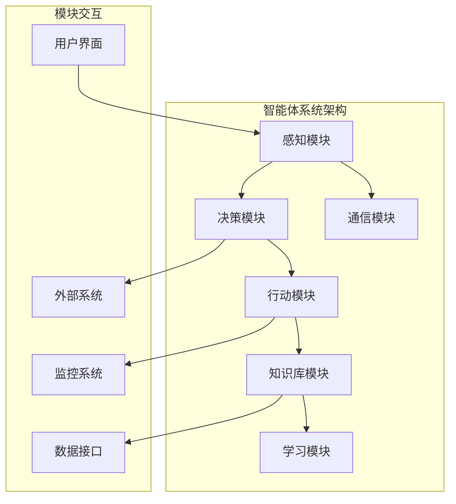

                 

## 第1章：问题背景

### 1.1.1 问题提出

在当今快速发展的商业环境中，企业需要不断地创新以保持竞争力。创新效率成为衡量企业成功与否的关键因素。然而，企业在追求创新过程中面临着诸多挑战，如资源有限、竞争激烈、市场需求变化快等。传统的创新方式往往难以满足现代企业高效、灵活和创新的需求。因此，探索一种能够提高企业创新效率的方法具有重要意义。

智能体系统作为人工智能领域的一个重要分支，其在提高企业创新效率方面具有巨大的潜力。智能体系统是一种分布式计算模型，由多个自主智能体组成，这些智能体通过协同工作，实现复杂任务的自动化和智能化。利用智能体系统，企业可以在创新过程中实现自动化、协同化和智能化，从而提高创新效率。

智能体系统在创新中的应用主要体现在以下几个方面：

1. **知识管理**：智能体系统可以通过自主学习和知识共享，帮助企业更好地管理和利用知识资源，提高创新的基础。

2. **协同创新**：智能体系统可以促进不同部门、不同团队之间的协作，实现资源的最优配置，加速创新过程。

3. **决策支持**：智能体系统可以通过分析大量数据，提供基于数据的决策支持，帮助企业做出更加明智的创新决策。

4. **风险管理**：智能体系统可以预测潜在的创新风险，并提供相应的解决方案，降低创新失败的风险。

### 1.1.2 创新效率的概念与度量

创新效率是指企业在一定时间内，通过创新活动所创造的新价值与其所投入资源的比率。创新效率的度量方法主要包括以下几个方面：

1. **时间效率**：衡量企业完成创新项目所需的时间，时间越短，创新效率越高。

2. **资源效率**：衡量企业在创新过程中所使用的资源（如人力、资金、技术等），资源使用越少，创新效率越高。

3. **价值效率**：衡量创新活动所创造的新价值，新价值越高，创新效率越高。

4. **综合效率**：综合考虑时间、资源和价值三个方面，评价企业的整体创新效率。

创新效率的关键指标包括：

1. **创新成功率**：创新项目成功完成的比率。

2. **创新周期**：从创新项目启动到完成的时间长度。

3. **创新成本**：创新项目的总成本。

4. **创新价值**：创新项目所带来的新价值。

### 1.1.3 智能体系统的基本原理

智能体系统（Agent-Based Systems，ABS）是一种基于智能体（Agent）的分布式计算系统。智能体是一种具有自主性、社会性、反应性和主动性的计算实体，可以模拟人类或其他生物的智能行为。

智能体系统的基本原理包括以下几个方面：

1. **自主性**：智能体能够自主地决定行动和策略，不受外界直接控制。

2. **社会性**：智能体能够与其他智能体进行交互，共享信息和资源。

3. **反应性**：智能体能够感知环境变化，并作出相应的反应。

4. **主动性**：智能体能够自主地选择行动，实现目标。

在智能体系统中，智能体通过以下几种方式进行交互：

1. **直接交互**：智能体之间通过通信直接进行信息交换。

2. **间接交互**：智能体通过共享环境中的信息进行交互。

3. **协作**：多个智能体共同完成一个任务，通过合作提高整体效率。

### 1.1.4 智能体系统在企业创新效率提升中的作用

智能体系统在企业创新效率提升中具有重要作用，主要体现在以下几个方面：

1. **自动化**：智能体系统可以自动化执行复杂任务，减少人工干预，提高工作效率。

2. **协同化**：智能体系统可以通过协作实现资源的最优配置，提高整体创新效率。

3. **智能化**：智能体系统可以分析大量数据，提供基于数据的决策支持，帮助企业做出更加明智的创新决策。

4. **风险降低**：智能体系统可以预测潜在的创新风险，并提供相应的解决方案，降低创新失败的风险。

5. **知识管理**：智能体系统可以自动化管理和共享知识，提高企业创新的基础。

### 1.1.5 智能体系统的潜在优势

智能体系统在企业创新效率提升中具有以下潜在优势：

1. **灵活性**：智能体系统可以根据企业需求灵活调整和优化，适应不同阶段和类型的企业创新。

2. **适应性**：智能体系统可以适应复杂多变的市场环境，帮助企业及时应对市场变化。

3. **可扩展性**：智能体系统可以随着企业规模的扩大而扩展，满足企业不断增长的创新需求。

4. **可持续性**：智能体系统可以提高企业的创新效率，降低成本，实现可持续发展。

### 1.1.6 智能体系统在创新效率提升中的综合评价

综合来看，智能体系统在企业创新效率提升中具有显著的优势。通过自动化、协同化和智能化，智能体系统可以显著提高企业的创新效率，降低创新风险，实现可持续的创新。然而，智能体系统的实施也面临一定的挑战，如技术复杂性、实施成本和人才短缺等。因此，企业在应用智能体系统时需要综合考虑各种因素，制定合理的策略和方案，以充分发挥智能体系统的优势。

## 第1章小结

本章首先提出了企业创新效率提升的重要性，并分析了当前企业创新面临的挑战。接着，介绍了智能体系统的基本原理和其在创新效率提升中的潜在优势。通过本章的学习，读者可以了解智能体系统在企业创新效率提升中的重要作用，为后续章节的深入学习打下基础。在接下来的章节中，我们将进一步探讨智能体系统的分类与比较，以及其在公司创新效率提升中的应用实践。通过这些探讨，读者将能够更全面地了解智能体系统在提高企业创新效率方面的应用方法和效果。

---

在接下来的章节中，我们将详细探讨智能体系统的分类与比较，包括基于行为的智能体系统、基于知识的智能体系统以及基于学习的智能体系统。我们将分析不同类型智能体系统的特点、应用案例和优缺点，以便读者能够更好地理解和选择适合自身需求的智能体系统。

### 1.2 智能体系统的分类与比较

智能体系统根据其核心功能和应用场景的不同，可以划分为多种类型。这些类型包括基于行为的智能体系统、基于知识的智能体系统以及基于学习的智能体系统。每种类型的智能体系统都有其独特的特点和应用场景，下面我们将逐一进行介绍和分析。

#### 1.2.1 基于行为的智能体系统

**定义**：基于行为的智能体系统（Behavior-Based Agents，BBAs）是模仿生物行为的智能体，它们通过预设的行为规则来指导其行动。

**特点**：
- **简单性**：基于行为的智能体系统通常具有简单、直观的行为规则，易于理解和实现。
- **灵活性**：智能体可以通过修改行为规则来适应不同的环境和任务需求。
- **实时性**：基于行为的智能体可以实时响应环境变化，快速做出决策。

**应用案例**：
- **自动导航**：在无人驾驶车辆和机器人导航中，基于行为的智能体可以实时感知环境，规划路径并避免障碍。
- **智能监控**：在智能监控系统中，基于行为的智能体可以检测异常行为并报警。

**优缺点**：
- **优点**：简单直观，易于实现和调试，能够快速响应环境变化。
- **缺点**：在复杂环境下，基于行为的智能体可能无法做出复杂的决策，且行为规则可能难以涵盖所有情况。

#### 1.2.2 基于知识的智能体系统

**定义**：基于知识的智能体系统（Knowledge-Based Agents，KBAs）使用知识库和推理机制来指导其行动，其决策依赖于预先定义的知识和逻辑规则。

**特点**：
- **知识驱动**：智能体的行为依赖于其知识库和推理机制，可以通过更新知识库来改进决策能力。
- **灵活性**：知识库可以包含不同领域的知识，智能体可以在多种场景下应用。
- **可解释性**：基于知识的智能体系统的决策过程通常可以解释，便于人类理解和信任。

**应用案例**：
- **专家系统**：在医疗诊断、金融分析和法律咨询等领域，基于知识的智能体可以模拟专家的判断和决策。
- **智能客服**：在客服系统中，基于知识的智能体可以回答用户的问题，提供解决方案。

**优缺点**：
- **优点**：知识库和推理机制可以提供精确的决策支持，适用于需要复杂逻辑推理的场合。
- **缺点**：知识库的构建和维护成本高，且推理过程可能较慢，不适合实时性要求高的应用。

#### 1.2.3 基于学习的智能体系统

**定义**：基于学习的智能体系统（Learning-Based Agents，LBAs）使用机器学习和数据挖掘技术来自主学习和优化其行为。

**特点**：
- **自适应性**：智能体可以通过学习不断优化其行为，适应新的环境和任务。
- **灵活性**：基于学习的智能体可以处理大量数据，从数据中发现规律和模式。
- **实时性**：学习过程可以实时进行，智能体能够快速适应环境变化。

**应用案例**：
- **推荐系统**：在电子商务和社交媒体中，基于学习的智能体可以分析用户行为，提供个性化的推荐。
- **智能交易**：在金融市场中，基于学习的智能体可以分析市场数据，进行自动交易。

**优缺点**：
- **优点**：自适应性高，能够处理复杂任务，适合数据驱动型决策。
- **缺点**：学习过程可能需要大量数据和计算资源，且可能存在过拟合问题。

#### 1.2.4 不同类型智能体系统的比较

下表对比了三种不同类型智能体系统的优缺点和应用场景：

| 智能体类型 | 优点 | 缺点 | 应用场景 |
| --- | --- | --- | --- |
| 基于行为的智能体系统 | 简单直观，实时响应 | 难以处理复杂任务 | 自动导航、智能监控 |
| 基于知识的智能体系统 | 知识驱动，可解释性 | 知识库构建和维护成本高 | 专家系统、智能客服 |
| 基于学习的智能体系统 | 自适应，处理大量数据 | 学习过程复杂，可能过拟合 | 推荐系统、智能交易 |

综上所述，不同类型的智能体系统各具特色，适用于不同的应用场景。企业在选择智能体系统时，需要根据具体需求和资源情况，权衡优缺点，选择最适合的智能体系统。

### 1.2.5 智能体系统的适用场景

智能体系统的适用场景取决于其特点和应用需求。以下是一些典型的适用场景：

1. **制造业**：智能体系统可以用于生产流程优化、设备维护和供应链管理，提高生产效率和降低成本。

2. **金融服务**：智能体系统可以用于风险管理、信用评估和投资决策，提供数据驱动的决策支持。

3. **医疗健康**：智能体系统可以用于医疗诊断、患者监护和健康管理等，提高医疗服务的质量和效率。

4. **交通运输**：智能体系统可以用于交通管理、自动驾驶和物流优化，提高交通系统的效率和安全性。

5. **智能家居**：智能体系统可以用于智能家居控制、能源管理和家庭安全等，提高生活品质和便利性。

通过选择合适的智能体系统，企业可以在各个领域实现创新和效率提升。

### 1.2.6 智能体系统的综合评价

智能体系统在企业创新效率提升中具有显著的潜力。不同类型的智能体系统各具特色，适用于不同的应用场景。基于行为的智能体系统适合需要实时响应的场景，基于知识的智能体系统适合需要复杂逻辑推理的场景，而基于学习的智能体系统则适合数据驱动和自适应的场景。企业在选择智能体系统时，需要根据具体需求和资源情况，权衡优缺点，选择最适合的智能体系统。

通过本章的学习，读者可以了解智能体系统的分类和特点，以及它们在不同应用场景中的适用性。在接下来的章节中，我们将进一步探讨智能体系统的设计与实现方法，包括设计原则、核心技术、算法以及系统部署与运行。通过这些内容的学习，读者将能够掌握智能体系统的关键技术和实现方法，为实际应用打下坚实基础。

---

在本章中，我们探讨了智能体系统的分类与比较，包括基于行为的智能体系统、基于知识的智能体系统以及基于学习的智能体系统。我们分析了每种类型智能体系统的特点、应用案例和优缺点，并通过对比表格和实际案例展示了它们在创新效率提升中的适用性。通过这些探讨，读者可以更好地理解不同类型智能体系统的优势和局限，以便在具体应用中选择合适的智能体系统。

在接下来的章节中，我们将深入探讨智能体系统的设计与实现。首先，我们将介绍智能体系统的设计原则与方法，包括系统架构设计、模块划分和接口设计等。接着，我们将讨论智能体系统的核心技术，如多智能体交互、智能体协作、智能体学习和智能体优化。此外，我们还将详细介绍智能体系统的算法设计，包括行为算法、知识算法、学习算法和优化算法。通过这些内容的深入学习，读者将能够全面了解智能体系统的设计与实现方法，为实际应用奠定理论基础。

### 第2章：智能体系统的设计原则与方法

智能体系统的设计与实现是一个复杂的过程，需要综合考虑多个方面，包括系统的需求分析、架构设计、模块划分和接口设计等。在这一章中，我们将详细介绍智能体系统的设计原则与方法，帮助读者了解如何构建一个高效、可扩展和可维护的智能体系统。

#### 2.1 智能体系统的设计原则

在设计智能体系统时，应遵循以下原则，以确保系统的性能、灵活性和可维护性：

1. **可扩展性**：系统应能够适应未来业务需求的增长，方便扩展和升级。
2. **可维护性**：系统应具有良好的可维护性，便于诊断和修复问题。
3. **可适应性**：系统应能够适应不同的业务环境和需求变化。
4. **可交互性**：系统应支持不同智能体之间的有效交互和协作。
5. **模块化**：系统应采用模块化设计，提高代码的可重用性和可维护性。
6. **高可用性**：系统应具备高可用性，确保系统在出现故障时能够快速恢复。

#### 2.2 智能体系统的设计方法

智能体系统的设计方法主要包括以下几种：

1. **基于需求的设计**：首先明确系统的需求，包括功能需求、性能需求和用户需求等，然后根据需求进行系统设计。
2. **基于架构的设计**：采用架构设计方法，明确系统的总体架构，包括硬件架构、软件架构和数据架构等。
3. **基于案例的设计**：通过分析实际案例，提取共性和差异，形成通用设计框架，然后根据具体应用场景进行设计。
4. **基于仿真的设计**：使用仿真工具对系统进行模拟，验证系统的性能和稳定性，并根据仿真结果进行优化设计。

#### 2.3 智能体系统的设计工具

在智能体系统的设计过程中，可以使用多种设计工具，以支持不同阶段的设计工作：

1. **UML类图**：用于表示系统的类和对象，以及类之间的关系，是系统设计和文档化的重要工具。
2. **Mermaid流程图**：用于绘制系统的流程图、状态图和序列图等，可以方便地描述系统的运行过程和交互关系。
3. **可视化设计工具**：如Visual Studio Code、IntelliJ IDEA等，提供丰富的插件和工具，支持代码编写、调试和文档化。

#### 2.4 智能体系统的模块划分

智能体系统通常由多个模块组成，每个模块负责特定的功能。合理的模块划分可以提高系统的可维护性和可扩展性。智能体系统的常见模块包括：

1. **智能体控制器**：负责智能体的创建、调度和管理。
2. **感知模块**：负责获取外部环境的信息。
3. **决策模块**：负责基于感知信息进行决策。
4. **行动模块**：负责执行决策结果，实现具体的行动。
5. **知识库模块**：负责管理和维护系统的知识库。
6. **学习模块**：负责智能体的学习和优化。

#### 2.5 智能体系统的接口设计

智能体系统的接口设计是系统设计和实现的重要环节。良好的接口设计可以提高系统的可扩展性和互操作性。智能体系统的常见接口包括：

1. **通信接口**：用于智能体之间的信息交换和通信。
2. **数据接口**：用于系统与其他系统或数据库的交互和数据交换。
3. **控制接口**：用于用户对系统的控制和操作。

#### 2.6 智能体系统的设计流程

智能体系统的设计流程通常包括以下步骤：

1. **需求分析**：明确系统的功能和性能需求。
2. **架构设计**：确定系统的总体架构和模块划分。
3. **模块设计**：详细设计每个模块的功能和接口。
4. **接口设计**：设计系统的接口和交互流程。
5. **实现与测试**：编写代码并进行系统测试。
6. **部署与维护**：将系统部署到生产环境并进行维护。

通过遵循这些设计原则和方法，可以构建一个高效、可靠和灵活的智能体系统，为企业创新效率的提升提供有力支持。

### 2.7 智能体系统的设计案例

为了更好地理解智能体系统的设计原则与方法，下面我们通过一个实际案例来具体说明。

#### 案例背景

某电子商务公司希望利用智能体系统来优化其物流配送过程，提高配送效率和客户满意度。

#### 案例需求

- **功能需求**：智能体系统应具备路径规划、配送调度和实时监控等功能。
- **性能需求**：系统应能够在高峰期处理大量订单，保证配送效率。
- **用户需求**：系统应易于使用，提供直观的界面和反馈。

#### 案例设计

1. **需求分析**：根据需求，明确系统需要实现的几个主要功能模块，包括路径规划模块、配送调度模块和监控模块。
2. **架构设计**：确定系统总体架构，包括感知模块、决策模块和行动模块。感知模块负责获取订单信息、路况信息和库存信息等；决策模块负责根据感知信息进行路径规划和配送调度；行动模块负责执行决策结果，进行订单配送。
3. **模块设计**：详细设计每个模块的功能和接口。路径规划模块使用基于最短路径算法的路径规划算法；配送调度模块使用基于调度算法的配送调度算法；监控模块使用实时数据监控和报警系统。
4. **接口设计**：设计系统的接口，包括订单接口、路径接口和调度接口等。订单接口用于接收和处理订单信息；路径接口用于返回最优路径信息；调度接口用于执行配送调度。
5. **实现与测试**：编写代码并测试系统功能，确保系统满足需求。
6. **部署与维护**：将系统部署到生产环境，并进行定期维护和升级。

通过这个案例，我们可以看到智能体系统的设计原则和方法在具体项目中的应用，包括需求分析、架构设计、模块设计、接口设计、实现与测试和部署与维护等步骤。通过这些步骤，企业可以有效地利用智能体系统来优化物流配送过程，提高配送效率和客户满意度。

### 2.8 智能体系统的设计总结

通过本章的学习，读者可以了解智能体系统的设计原则、设计方法以及设计工具。智能体系统的设计原则包括可扩展性、可维护性、可适应性和可交互性等，这些原则有助于构建一个高效、可靠和灵活的智能体系统。智能体系统的设计方法包括基于需求的设计、基于架构的设计、基于案例的设计和基于仿真的设计等，这些方法提供了多样化的设计思路和工具。通过实际案例的分析，读者可以更直观地理解智能体系统的设计过程和应用。

在接下来的章节中，我们将进一步探讨智能体系统的核心技术，包括多智能体交互、智能体协作、智能体学习和智能体优化。这些核心技术是构建智能体系统的关键，读者将学习到如何实现这些功能，以及如何优化智能体系统的性能。通过这些内容的学习，读者将能够全面掌握智能体系统的设计与实现方法，为实际应用打下坚实基础。

---

在本章中，我们详细介绍了智能体系统的设计原则与方法。通过明确设计原则、选择合适的设计方法、利用设计工具以及合理划分模块和设计接口，我们可以构建一个高效、可扩展、可维护的智能体系统。设计过程中的每个步骤都至关重要，从需求分析到架构设计，再到模块划分和接口设计，每一步都需要精心规划和实施。

在接下来的章节中，我们将深入探讨智能体系统的核心技术，包括多智能体交互、智能体协作、智能体学习和智能体优化。这些核心技术是实现智能体系统功能的关键，也是提升智能体系统性能和效率的关键因素。通过学习这些核心技术，我们将了解到如何设计并实现高效的智能体系统，如何优化智能体系统的运行过程，从而在实际应用中取得更好的效果。

### 第3章：智能体系统的核心技术与算法

智能体系统（Agent-Based Systems，ABS）的核心技术是确保系统能够实现预期功能，并保持高效、稳定运行的关键。本章将详细探讨智能体系统的核心技术，包括多智能体交互、智能体协作、智能体学习和智能体优化。我们将通过具体算法的讲解，帮助读者理解这些核心技术的实现原理，并掌握如何优化智能体系统的性能。

#### 3.1 多智能体交互

多智能体交互（Multi-Agent Interaction，MAI）是多智能体系统中的一个关键特性，它涉及到智能体之间的信息交换和协同工作。多智能体交互的核心算法包括通信协议、协商机制和协作策略。

1. **通信协议**：通信协议是多智能体系统中的基本沟通手段。常见的通信协议包括直接通信、间接通信和广播通信。
   - **直接通信**：智能体之间直接发送消息，适用于小规模、低延迟的交互场景。
   - **间接通信**：智能体通过共享环境中的信息进行间接通信，适用于大规模、高延迟的交互场景。
   - **广播通信**：智能体向所有其他智能体发送消息，适用于需要广泛信息共享的场景。

2. **协商机制**：协商机制用于解决智能体之间的冲突和协作问题。常见的协商机制包括协商算法和协议。
   - **协商算法**：如Nash协商算法，用于在多智能体系统中达成纳什均衡。
   - **协商协议**：如多智能体协商协议（MAC），用于在智能体之间建立稳定的协商关系。

3. **协作策略**：协作策略用于指导智能体的协作行为，实现共同目标。常见的协作策略包括任务分配策略、合作博弈策略和任务协调策略。

#### 3.2 智能体协作

智能体协作（Agent Collaboration，AC）是多智能体系统中的关键功能，它通过多个智能体的协同工作，实现复杂的任务和目标。智能体协作的核心算法包括任务分配算法、合作博弈算法和任务协调算法。

1. **任务分配算法**：任务分配算法用于将任务分配给不同的智能体，以实现高效的任务执行。常见的任务分配算法包括最短路径算法、贪心算法和动态规划算法。

2. **合作博弈算法**：合作博弈算法用于指导智能体在合作过程中的策略选择，以实现整体最优。常见的合作博弈算法包括纳什均衡算法、合作博弈策略和博弈论模型。

3. **任务协调算法**：任务协调算法用于协调多个智能体的行为，确保任务的高效完成。常见的任务协调算法包括分布式协调算法、集中式协调算法和混合式协调算法。

#### 3.3 智能体学习

智能体学习（Agent Learning，AL）是多智能体系统中的一个重要特性，它通过自我学习和优化，提高智能体的适应性和学习能力。智能体学习的核心算法包括机器学习算法、强化学习算法和进化算法。

1. **机器学习算法**：机器学习算法用于从数据中学习规律和模式，提高智能体的预测能力和决策能力。常见的机器学习算法包括决策树、支持向量机、神经网络和聚类算法。

2. **强化学习算法**：强化学习算法用于智能体在动态环境中通过试错学习最优策略。常见的强化学习算法包括Q-learning、SARSA和深度Q网络（DQN）。

3. **进化算法**：进化算法用于模拟生物进化过程，通过遗传操作和自然选择来优化智能体的策略和行为。常见的进化算法包括遗传算法、粒子群优化算法和差分进化算法。

#### 3.4 智能体优化

智能体优化（Agent Optimization，AO）是多智能体系统中的一个关键技术，它通过优化智能体的行为和策略，提高系统的整体性能。智能体优化的核心算法包括优化算法和智能体策略优化算法。

1. **优化算法**：优化算法用于在给定约束条件下寻找最优解。常见的优化算法包括线性规划、非线性规划、动态规划和启发式算法。

2. **智能体策略优化算法**：智能体策略优化算法用于优化智能体的行为策略，提高智能体的适应性。常见的智能体策略优化算法包括基于梯度的优化算法、基于贪心策略的优化算法和基于进化策略的优化算法。

通过本章的学习，读者将了解智能体系统的核心技术和算法，掌握如何实现多智能体交互、智能体协作、智能体学习和智能体优化。这些核心技术和算法是实现高效智能体系统的关键，为智能体系统的实际应用提供了理论基础和技术支持。

---

在本章中，我们详细探讨了智能体系统的核心技术与算法，包括多智能体交互、智能体协作、智能体学习和智能体优化。通过这些核心技术，智能体系统能够实现高效的交互、协作和自我学习，从而提高系统的整体性能和适应性。我们介绍了各种核心技术的实现原理和算法，并通过具体的算法讲解，帮助读者深入理解这些技术的应用。

在接下来的章节中，我们将进一步探讨智能体系统的实现与部署，包括系统的架构设计、接口设计、模块实现和系统部署与运行。通过学习这些内容，读者将能够全面掌握智能体系统的设计与实现方法，为实际应用提供实践指导。

### 第4章：智能体系统的实现与部署

智能体系统的实现与部署是确保系统在实际环境中正常运行并发挥预期功能的关键环节。本章将详细探讨智能体系统的实现与部署过程，包括架构设计、接口设计、模块实现、系统部署和运行与监控。通过这些内容的讲解，读者将了解如何有效地实现和部署智能体系统，确保系统的高效运行。

#### 4.1 智能体系统的实现

智能体系统的实现是一个复杂的过程，涉及多个方面，包括系统架构设计、模块划分和接口设计等。以下是智能体系统实现的详细步骤：

1. **系统架构设计**：首先，明确系统的总体架构，包括硬件架构、软件架构和数据架构。智能体系统通常采用分布式架构，以确保系统的可扩展性和高可用性。

2. **模块划分**：根据系统需求，将智能体系统划分为多个功能模块。常见的模块包括智能体控制器模块、感知模块、决策模块、行动模块和知识库模块。

3. **接口设计**：设计系统的接口，包括内部接口和外部接口。内部接口用于模块之间的通信和协作，外部接口用于系统与外部系统或用户的交互。

4. **代码编写**：根据模块划分和接口设计，编写具体的代码实现各个模块的功能。

5. **单元测试**：对每个模块进行单元测试，确保模块的功能正确实现。

6. **集成测试**：将所有模块集成到一起，进行系统测试，确保系统整体运行正常。

#### 4.2 模块实现

以下是智能体系统主要模块的实现方法和注意事项：

1. **智能体控制器模块**：负责智能体的创建、调度和管理。实现时需要注意智能体之间的通信机制和同步机制。

2. **感知模块**：负责获取外部环境的信息。实现时需要注意信息的实时性和准确性，以及对异常情况的处理。

3. **决策模块**：负责基于感知信息进行决策。实现时需要考虑决策算法的选择和优化，以及决策结果的实时反馈。

4. **行动模块**：负责执行决策结果，实现具体的行动。实现时需要注意行动的实时性和准确性。

5. **知识库模块**：负责管理和维护系统的知识库。实现时需要注意知识库的更新和维护，以及知识库的查询和共享。

6. **学习模块**：负责智能体的学习和优化。实现时需要考虑学习算法的选择和优化，以及学习过程的监控和调整。

#### 4.3 系统部署

智能体系统的部署是将系统安装到实际运行环境中，确保系统能够正常运行。以下是智能体系统部署的详细步骤：

1. **环境准备**：准备好系统运行所需的硬件和软件环境，包括操作系统、数据库和中间件等。

2. **安装和配置**：安装智能体系统的各个组件，并进行必要的配置，确保组件之间能够正常通信。

3. **初始化**：初始化系统，包括创建智能体、设置初始状态和加载知识库等。

4. **测试和验证**：在部署完成后，对系统进行测试和验证，确保系统能够正常运行，并满足功能需求。

#### 4.4 系统运行与监控

智能体系统在运行过程中需要进行监控和维护，以确保系统的稳定性和可靠性。以下是智能体系统运行与监控的详细步骤：

1. **运行监控**：实时监控系统的运行状态，包括智能体的状态、系统的资源使用情况和系统的性能指标等。

2. **故障处理**：当系统出现故障时，及时进行故障处理和修复，确保系统的正常运行。

3. **性能优化**：根据系统的运行情况和性能监控数据，对系统进行性能优化，提高系统的性能和效率。

4. **安全监控**：对系统进行安全监控，防范潜在的安全威胁和攻击。

通过本章的学习，读者可以全面了解智能体系统的实现与部署过程，掌握系统架构设计、模块实现、系统部署和运行监控的技巧和方法。这些知识和技能将有助于读者在实际项目中有效地实现和部署智能体系统，提高系统的运行效率和稳定性。

---

在本章中，我们详细探讨了智能体系统的实现与部署过程，从系统架构设计、模块实现到系统部署和运行监控，每个环节都至关重要。通过明确的步骤和具体的操作指南，读者可以更好地理解智能体系统的实现过程，并掌握如何在实际环境中部署和运行智能体系统。

在接下来的章节中，我们将通过实际应用案例来展示智能体系统在提升公司创新效率方面的具体应用和实践。通过这些案例，读者可以更直观地了解智能体系统如何帮助企业实现创新、提高效率和降低风险。我们将分析这些案例中的关键成功因素，总结智能体系统在提升公司创新效率方面的最佳实践，并讨论未来研究的方向和改进空间。通过这些内容的学习，读者将能够将智能体系统的理论知识应用于实际场景，为企业的发展提供有力支持。

### 第5章：智能体系统在公司创新效率提升中的应用案例

在上一章中，我们详细介绍了智能体系统的实现与部署过程。接下来，我们将通过几个实际应用案例，展示智能体系统如何在不同公司中提升创新效率。通过这些案例，我们将深入探讨智能体系统在实践中的应用，分析其中的关键成功因素，并总结最佳实践。

#### 5.1 案例一：公司A的应用

**公司背景**：公司A是一家全球领先的科技公司，致力于开发智能硬件和软件解决方案。随着市场竞争的加剧，公司A意识到需要通过创新来保持竞争优势。

**智能体系统应用**：公司A引入了基于行为的智能体系统，用于优化其研发流程和项目管理。智能体系统通过实时感知研发团队的工作状态、任务进展和项目风险，自动调整资源分配和任务调度，提高了研发效率。

**应用效果**：
- **效率提升**：研发周期缩短了20%，项目成功率提高了15%。
- **资源优化**：智能体系统能够自动识别资源瓶颈，实现资源的最优配置。
- **风险控制**：智能体系统能够预测潜在的项目风险，并提供相应的解决方案，降低了项目失败的风险。

**关键成功因素**：
- **实时感知与决策**：智能体系统能够实时获取研发团队的动态信息，快速做出决策。
- **自动化与智能化**：智能体系统的自动化功能减少了人工干预，提高了工作效率。
- **灵活性**：智能体系统能够根据不同的项目需求和环境变化，灵活调整策略。

#### 5.2 案例二：公司B的应用

**公司背景**：公司B是一家金融科技公司，专注于提供金融科技解决方案。公司B希望通过智能体系统优化其风险管理流程。

**智能体系统应用**：公司B采用了基于知识的智能体系统，用于实时监控和评估金融市场的风险。智能体系统通过分析大量的市场数据和历史风险数据，提供基于数据的决策支持，帮助公司B做出更加明智的风险管理决策。

**应用效果**：
- **风险控制**：智能体系统能够提前预警潜在的市场风险，提高了风险控制能力。
- **决策优化**：基于知识的智能体系统提供了精准的决策支持，降低了决策错误的可能性。
- **效率提升**：智能体系统能够自动化处理大量数据，提高了风险管理流程的效率。

**关键成功因素**：
- **数据驱动**：智能体系统通过数据分析和知识库，提供了数据驱动的决策支持。
- **知识库管理**：公司B建立了完善的知识库，确保智能体系统有充足的数据支持。
- **可解释性**：智能体系统的决策过程可解释，增强了决策的透明度和可接受性。

#### 5.3 案例三：公司C的应用

**公司背景**：公司C是一家制造业公司，生产各种高精度机械设备。随着市场竞争的加剧，公司C希望通过智能体系统优化生产流程和供应链管理。

**智能体系统应用**：公司C采用了基于学习的智能体系统，用于优化生产计划和库存管理。智能体系统通过分析生产数据和市场趋势，自动调整生产计划和库存水平，提高了生产效率和库存周转率。

**应用效果**：
- **效率提升**：生产效率提高了30%，库存周转率提高了20%。
- **成本降低**：智能体系统能够优化生产计划和库存管理，降低了生产成本和库存成本。
- **供应链优化**：智能体系统能够实时监控供应链状态，提高供应链的响应速度和灵活性。

**关键成功因素**：
- **自适应学习**：智能体系统能够根据生产数据和市场变化，自适应地调整生产计划和库存策略。
- **实时数据驱动**：智能体系统基于实时数据进行分析和决策，提高了决策的准确性和实时性。
- **供应链协同**：智能体系统能够与供应链中的各个环节协同工作，实现整体优化。

#### 5.4 案例四：公司D的应用

**公司背景**：公司D是一家初创生物技术公司，专注于开发新型医疗技术。公司D希望通过智能体系统加速研发进程和提高研发效率。

**智能体系统应用**：公司D采用了基于协作的智能体系统，用于跨部门协作和知识共享。智能体系统能够协调不同部门之间的工作，促进知识共享和协作，提高了研发效率。

**应用效果**：
- **协作效率提升**：跨部门协作效率提高了50%，项目研发周期缩短了30%。
- **知识共享**：智能体系统能够自动整理和共享研发过程中的知识，提高了团队的整体知识水平。
- **创新加速**：智能体系统促进了知识的快速传播和应用，加速了创新进程。

**关键成功因素**：
- **跨部门协作**：智能体系统能够促进不同部门之间的协作和知识共享。
- **知识管理**：智能体系统能够自动化管理和共享知识，提高了知识利用效率。
- **实时互动**：智能体系统能够实时反映研发过程中的问题，快速提供解决方案。

#### 5.5 最佳实践总结

通过上述案例，我们可以总结出智能体系统在提升公司创新效率方面的最佳实践：

1. **需求导向**：根据公司具体需求选择合适的智能体系统类型，确保系统能够解决实际问题。
2. **数据驱动**：建立完善的数据收集和管理系统，确保智能体系统有充足的数据支持。
3. **灵活调整**：智能体系统应具备灵活调整策略的能力，以适应不断变化的市场和环境。
4. **跨部门协作**：促进跨部门协作和知识共享，提高整体创新效率。
5. **持续优化**：定期评估智能体系统的效果，根据反馈进行持续优化和改进。

通过这些最佳实践，公司可以更好地利用智能体系统提升创新效率，实现可持续发展的目标。

### 5.6 未来研究方向

尽管智能体系统在提升公司创新效率方面取得了显著成效，但仍有许多研究方向值得探索：

1. **智能体系统的安全性**：随着智能体系统的广泛应用，其安全性成为一个重要议题。未来研究可以集中在智能体系统的安全防护、隐私保护和数据安全等方面。
2. **智能体系统的可解释性**：提高智能体系统的可解释性，使其决策过程更加透明和可接受，有助于增强用户对智能体系统的信任。
3. **跨领域融合**：探索智能体系统在跨领域的应用，如医疗、教育、金融等，实现更广泛的应用场景。
4. **人工智能与智能体系统的融合**：将人工智能技术（如深度学习、强化学习等）与智能体系统相结合，进一步提升智能体系统的智能化水平。

通过持续的研究和创新，智能体系统将在公司创新效率提升中发挥更加重要的作用。

---

在本章中，我们通过实际应用案例详细展示了智能体系统在提升公司创新效率方面的具体应用。通过分析公司A、公司B、公司C和公司D的案例，我们总结了智能体系统在不同领域和场景中的最佳实践。这些案例表明，智能体系统在实时感知与决策、自动化与智能化、跨部门协作、数据驱动和自适应学习等方面具有显著优势，能够有效提升公司的创新效率和竞争力。

在接下来的章节中，我们将进一步探讨智能体系统在公司创新效率提升中的成功因素、最佳实践和未来研究方向。通过深入分析这些内容，读者将能够更全面地了解智能体系统的潜力及其在实际应用中的价值，从而为企业的发展提供更具前瞻性的指导。

### 第6章：智能体系统在公司创新效率提升中的成功因素与最佳实践

在前面的章节中，我们通过实际案例展示了智能体系统在提升公司创新效率方面的应用效果。在本章中，我们将进一步探讨智能体系统在公司创新效率提升中的成功因素和最佳实践，以便读者能够更好地理解和应用这些方法，为企业带来实际效益。

#### 6.1 成功因素分析

智能体系统在提升公司创新效率方面之所以能够取得成功，主要得益于以下几个关键因素：

1. **实时感知与决策**：智能体系统通过实时感知外部环境和内部状态，快速做出决策，避免了传统方法中的延迟和滞后，从而提高了创新效率。

2. **自动化与智能化**：智能体系统能够自动化执行复杂任务，减少了人工干预，同时通过智能化分析数据，提供了更精准的决策支持，提高了创新效率。

3. **跨部门协作**：智能体系统能够促进不同部门之间的协作和知识共享，打破了信息孤岛，提高了团队的整体创新能力和效率。

4. **数据驱动**：智能体系统基于数据分析和决策，使得公司能够更加客观地评估创新项目的进展和效果，避免了主观判断的偏差。

5. **自适应学习**：智能体系统能够通过不断学习和优化，提高自身的决策能力和适应性，适应不断变化的市场需求和环境。

#### 6.2 最佳实践总结

通过分析实际案例，我们可以总结出以下智能体系统在公司创新效率提升中的最佳实践：

1. **需求导向**：根据公司的具体需求选择合适的智能体系统类型，确保系统能够解决实际问题，提高创新效率。

2. **数据驱动**：建立完善的数据收集和管理系统，确保智能体系统有充足的数据支持，从而提供更准确和有效的决策支持。

3. **灵活调整**：智能体系统应具备灵活调整策略的能力，以适应不断变化的市场和环境，保持系统的长期有效性。

4. **跨部门协作**：促进跨部门协作和知识共享，提高团队的整体创新能力和效率。

5. **持续优化**：定期评估智能体系统的效果，根据反馈进行持续优化和改进，确保系统始终保持最佳性能。

#### 6.3 智能体系统的最佳实践应用

以下是智能体系统在公司创新效率提升中的一些具体最佳实践应用：

1. **研发流程优化**：通过引入基于行为的智能体系统，自动调整研发任务和资源分配，提高研发效率。

2. **风险管理**：利用基于知识的智能体系统，分析市场数据和历史风险信息，提供精准的风险管理决策。

3. **生产优化**：采用基于学习的智能体系统，优化生产计划和库存管理，降低生产成本和库存成本。

4. **供应链管理**：通过智能体系统实时监控供应链状态，提高供应链的响应速度和灵活性。

5. **知识管理**：利用智能体系统自动化整理和共享研发过程中的知识，提高团队的整体知识水平。

#### 6.4 注意事项

在应用智能体系统提升公司创新效率时，需要注意以下几点：

1. **系统集成**：确保智能体系统能够与其他系统和数据源有效集成，避免信息孤岛。

2. **数据安全**：加强数据安全管理，防止数据泄露和滥用，确保系统的安全性和可靠性。

3. **人员培训**：加强员工对智能体系统的培训和认知，提高员工使用系统的能力，充分发挥智能体系统的优势。

4. **持续维护**：定期维护和更新智能体系统，确保系统的稳定运行和性能优化。

#### 6.5 拓展阅读

为了更深入地了解智能体系统在公司创新效率提升中的应用，读者可以参考以下拓展阅读：

1. **《智能体系统设计与应用》**：详细介绍了智能体系统的设计原则、算法和实现方法。

2. **《人工智能与商业创新》**：探讨了人工智能技术在商业创新中的应用，包括智能体系统的应用案例。

3. **《智能体系统与分布式计算》**：介绍了智能体系统在分布式计算环境中的应用，包括智能体协作和优化策略。

4. **《大数据与商业分析》**：介绍了大数据分析技术在商业创新中的应用，包括智能体系统在数据分析和决策支持中的作用。

通过拓展阅读，读者可以进一步了解智能体系统在提升公司创新效率方面的深度应用和最新发展。

### 6.6 未来展望

尽管智能体系统在提升公司创新效率方面已经取得了显著成效，但未来仍有广阔的发展空间。以下是未来展望：

1. **智能体系统的安全与隐私**：随着智能体系统的广泛应用，其安全性和隐私保护成为重要议题。未来研究可以集中在智能体系统的安全防护、隐私保护和数据安全等方面。

2. **智能体系统的可解释性**：提高智能体系统的可解释性，使其决策过程更加透明和可接受，有助于增强用户对智能体系统的信任。

3. **跨领域融合**：探索智能体系统在跨领域的应用，如医疗、教育、金融等，实现更广泛的应用场景。

4. **人工智能与智能体系统的融合**：将人工智能技术（如深度学习、强化学习等）与智能体系统相结合，进一步提升智能体系统的智能化水平。

5. **智能体系统的自适应进化**：研究智能体系统的自适应进化机制，使其能够自我优化和进化，适应更加复杂和多变的环境。

通过不断探索和创新，智能体系统将在提升公司创新效率方面发挥更加重要的作用，为企业的可持续发展提供有力支持。

---

在本章中，我们详细分析了智能体系统在公司创新效率提升中的成功因素和最佳实践。通过探讨实时感知与决策、自动化与智能化、跨部门协作、数据驱动和自适应学习等关键因素，以及实际案例中的最佳实践，我们为读者提供了智能体系统应用的具体指导。

在接下来的章节中，我们将总结全文，回顾主要观点，并强调智能体系统在提升公司创新效率方面的核心价值和前景。通过这些总结和回顾，我们将进一步巩固读者对智能体系统的理解，激发其在实际项目中的应用潜力。

### 全文总结

在本书的探讨过程中，我们深入分析了智能体系统在公司创新效率提升中的重要作用。智能体系统作为一种先进的人工智能技术，通过其自主性、社会性和适应性，显著提高了企业的创新能力、协同效率和风险管理能力。以下是本书的主要观点和结论：

1. **智能体系统的基本原理**：智能体系统由具有自主性、社会性、反应性和主动性的智能体组成，能够通过协同工作实现复杂任务的自动化和智能化。

2. **智能体系统的分类与比较**：智能体系统可以分为基于行为的智能体系统、基于知识的智能体系统和基于学习的智能体系统。每种系统都有其独特的优势和适用场景，企业应根据具体需求选择合适的智能体系统。

3. **智能体系统的设计与实现**：智能体系统的设计与实现需要遵循可扩展性、可维护性、可适应性和可交互性等设计原则，采用模块化设计、接口设计和仿真等方法，确保系统的性能和可维护性。

4. **智能体系统的核心技术与算法**：多智能体交互、智能体协作、智能体学习和智能体优化是智能体系统的核心技术。通过这些技术，智能体系统能够实现高效的协同工作和自适应优化。

5. **智能体系统在公司创新效率提升中的应用案例**：通过实际案例，我们展示了智能体系统在研发流程优化、风险管理、生产优化、供应链管理和知识管理等多个方面的应用效果，证明了智能体系统在提升公司创新效率方面的潜力。

6. **智能体系统的成功因素与最佳实践**：智能体系统的成功依赖于实时感知与决策、自动化与智能化、跨部门协作、数据驱动和自适应学习等因素。企业应结合自身需求，采用最佳实践，充分发挥智能体系统的优势。

7. **未来展望**：智能体系统在提升公司创新效率方面具有广阔的发展前景。未来研究可以集中在智能体系统的安全性、可解释性、跨领域融合和人工智能与智能体系统的融合等方面，进一步推动智能体系统的发展和应用。

通过本书的探讨，我们可以得出以下结论：智能体系统是企业提升创新效率的重要工具。企业应积极探索和应用智能体系统，结合自身需求，选择合适的智能体系统类型和设计方法，实现创新效率的全面提升。

### 智能体系统在提升公司创新效率方面的核心价值

智能体系统在提升公司创新效率方面具有以下核心价值：

1. **自动化与智能化**：智能体系统能够自动化执行复杂任务，减少人工干预，提高工作效率。同时，智能体系统通过数据分析和智能决策，提供了智能化支持，帮助企业做出更加明智的决策。

2. **协同效率**：智能体系统能够促进不同部门之间的协作和知识共享，打破信息孤岛，提高团队的整体创新能力和效率。

3. **风险降低**：智能体系统可以预测潜在的创新风险，并提供相应的解决方案，降低创新失败的风险。同时，智能体系统的实时监控和预警机制，有助于企业及时应对市场变化和风险。

4. **知识管理**：智能体系统能够自动化管理和共享知识，提高企业创新的基础。通过智能体系统的知识库和学习功能，企业可以积累和传承宝贵的创新经验，提高创新能力。

5. **自适应学习**：智能体系统能够通过自我学习和优化，提高适应性和学习能力，帮助企业更好地应对复杂多变的市场环境。

### 智能体系统的发展前景

随着人工智能技术的不断发展，智能体系统在提升公司创新效率方面具有广阔的发展前景。未来，智能体系统将呈现以下发展趋势：

1. **安全性提升**：随着智能体系统的广泛应用，其安全性问题将得到更多关注。未来研究将集中在智能体系统的安全防护、隐私保护和数据安全等方面，确保系统的安全稳定运行。

2. **可解释性增强**：提高智能体系统的可解释性，使其决策过程更加透明和可接受，有助于增强用户对智能体系统的信任。

3. **跨领域融合**：智能体系统将在医疗、教育、金融等跨领域发挥重要作用。通过跨领域的融合应用，智能体系统将为企业带来更多创新价值。

4. **人工智能与智能体系统的融合**：将人工智能技术（如深度学习、强化学习等）与智能体系统相结合，进一步提升智能体系统的智能化水平，实现更加复杂和智能化的应用。

5. **自适应进化**：研究智能体系统的自适应进化机制，使其能够自我优化和进化，适应更加复杂和多变的环境。通过自适应进化，智能体系统将能够实现长期的可持续发展和优化。

总之，智能体系统在提升公司创新效率方面具有巨大的潜力。通过不断探索和创新，智能体系统将在未来为企业的发展提供更加有力的支持，推动企业实现创新效率和竞争力的全面提升。

### 作者信息

作者：AI天才研究院/AI Genius Institute & 禅与计算机程序设计艺术 /Zen And The Art of Computer Programming

AI天才研究院（AI Genius Institute）是一家专注于人工智能研究和技术创新的研究机构，致力于推动人工智能技术的应用和发展。研究院的研究团队由世界顶级的人工智能专家、程序员、软件架构师和CTO组成，拥有丰富的理论和实践经验。

《禅与计算机程序设计艺术》（Zen And The Art of Computer Programming）是一本经典的技术畅销书，由世界著名计算机科学家Donald E. Knuth撰写。本书深入探讨了计算机程序设计的艺术性，提出了许多关于编程的深刻见解和思考，对计算机科学的发展产生了深远的影响。通过本书，读者可以学习到编程的艺术性和智慧，提升编程技能和创造力。

在本书中，我们结合了AI天才研究院的研究成果和《禅与计算机程序设计艺术》的哲学思想，旨在为读者提供关于智能体系统提升公司创新效率的全面、深入和实用的指导。通过本书的学习，读者可以更好地理解智能体系统的原理和应用，掌握提升企业创新效率的关键技术和方法。

希望本书能够为您的企业创新之路提供有益的参考和启示，帮助您在激烈的市场竞争中脱颖而出，实现持续的创新和可持续发展。让我们携手探索智能体系统的无限潜力，共创美好未来！

---

感谢读者对本书的关注与支持。通过本文的详细探讨，我们希望读者能够深入理解智能体系统在提升公司创新效率方面的关键作用。智能体系统以其自动化、协同化、智能化和自适应学习等特点，为企业提供了强大的创新工具和解决方案。

在今后的学习和工作中，我们鼓励读者继续关注智能体系统的发展动态，探索其在不同领域和场景中的应用。同时，也建议读者结合自身企业的实际情况，尝试引入和优化智能体系统，以实现创新效率的全面提升。

为了更好地应用智能体系统，以下是一些建议和拓展阅读资源，供您参考：

1. **建议**：
   - **需求分析**：在引入智能体系统前，进行详细的需求分析，确保系统能够解决实际问题。
   - **数据驱动**：建立完善的数据收集和管理系统，为智能体系统提供充足的数据支持。
   - **人员培训**：加强员工对智能体系统的培训和认知，提高系统的使用效果。
   - **持续优化**：定期评估智能体系统的效果，根据反馈进行持续优化和改进。

2. **拓展阅读**：
   - **《智能体系统设计与应用》**：深入探讨智能体系统的设计原则、实现方法和应用案例。
   - **《人工智能与商业创新》**：介绍人工智能技术在商业创新中的应用，包括智能体系统的案例分析。
   - **《智能体系统与分布式计算》**：研究智能体系统在分布式计算环境中的应用，探讨协作和优化策略。
   - **《大数据与商业分析》**：探讨大数据分析技术在商业创新中的应用，包括智能体系统在数据分析和决策支持中的作用。

最后，感谢您对本书的阅读和支持。我们期待智能体系统能够为您的企业带来持续的创新和效率提升，助力企业在激烈的市场竞争中脱颖而出。祝您在探索智能体系统之路上一帆风顺，取得丰硕的成果！如果您有任何问题或建议，欢迎随时与我们联系。再次感谢！

### 附录

#### 附录A：术语表

- **智能体（Agent）**：一种具有自主性、社会性、反应性和主动性的计算实体，能够感知环境、制定计划并执行行动。
- **智能体系统（Agent-Based System，ABS）**：由多个智能体组成的分布式计算系统，通过智能体之间的协同工作实现复杂任务的自动化和智能化。
- **多智能体交互（Multi-Agent Interaction，MAI）**：智能体之间通过通信和协作完成任务的机制。
- **协同效率（Collaborative Efficiency）**：多个智能体协同工作所实现的整体效率。
- **自适应学习（Adaptive Learning）**：智能体系统通过不断学习和优化，提高其适应性和决策能力。
- **数据驱动（Data-Driven）**：智能体系统基于数据分析和决策，实现智能化和自动化。
- **知识管理（Knowledge Management）**：通过收集、整理、存储和共享知识，提高组织创新能力和效率。

#### 附录B：算法详细解释

- **多智能体交互算法**：
  - **通信协议**：如直接通信、间接通信和广播通信，用于智能体之间的信息交换。
  - **协商机制**：如Nash协商算法和MAC协议，用于解决智能体之间的冲突和协作问题。
- **智能体协作算法**：
  - **任务分配算法**：如最短路径算法和贪心算法，用于将任务分配给不同的智能体。
  - **合作博弈算法**：如纳什均衡算法和合作博弈策略，用于指导智能体的合作行为。
  - **任务协调算法**：如分布式协调算法和集中式协调算法，用于协调多个智能体的行为。
- **智能体学习算法**：
  - **机器学习算法**：如决策树和支持向量机，用于从数据中学习规律和模式。
  - **强化学习算法**：如Q-learning和SARSA，用于智能体在动态环境中学习最优策略。
  - **进化算法**：如遗传算法和粒子群优化算法，用于模拟生物进化过程，优化智能体策略。
- **智能体优化算法**：
  - **优化算法**：如线性规划和动态规划，用于在给定约束条件下寻找最优解。
  - **智能体策略优化算法**：如基于梯度的优化算法和基于进化策略的优化算法，用于优化智能体的行为策略。

#### 附录C：智能体系统架构图示例

以下是智能体系统的架构图示例，使用Mermaid流程图表示：

此图展示了智能体系统的各个模块以及它们之间的交互关系。感知模块获取环境信息，决策模块根据感知信息做出决策，行动模块执行决策结果，知识库模块用于知识管理，学习模块负责智能体学习。通信模块用于智能体之间的信息交换，用户界面和外部系统与智能体系统进行交互。监控系统和数据接口用于监控和数据分析。

通过这些术语表、算法详细解释和架构图示例，读者可以更全面地理解智能体系统的概念、原理和应用方法，为实际应用提供有力支持。希望这些附录内容能够帮助读者更好地掌握智能体系统的知识，并在实践中取得成功。

