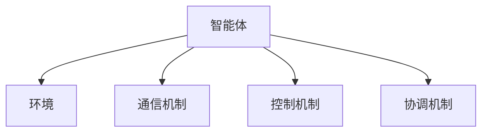
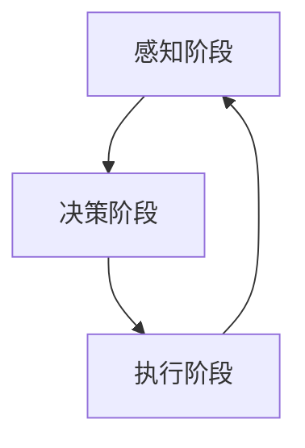
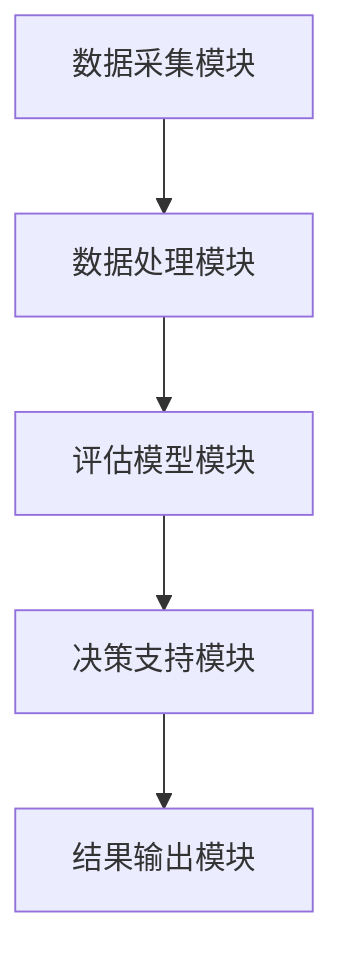
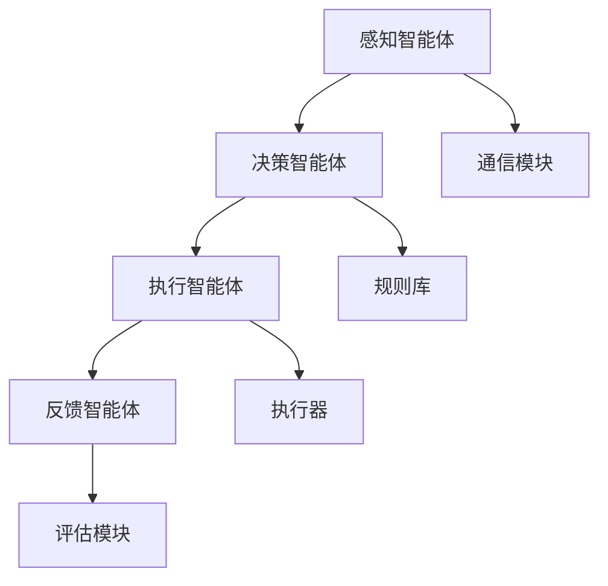
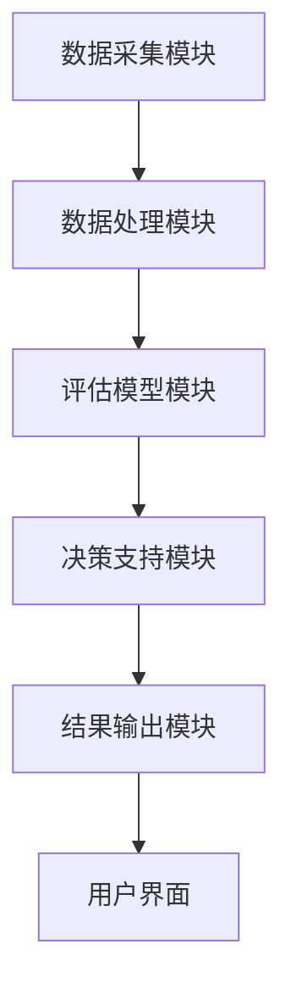
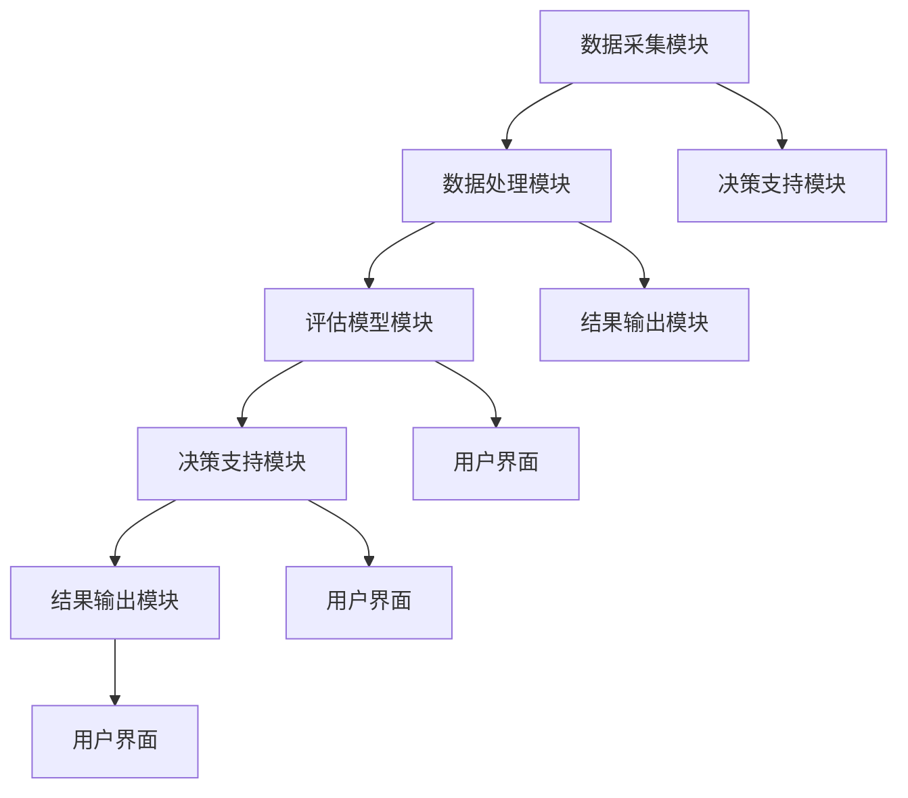
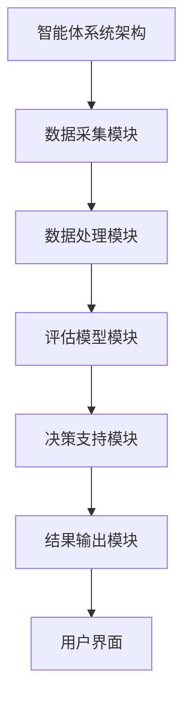
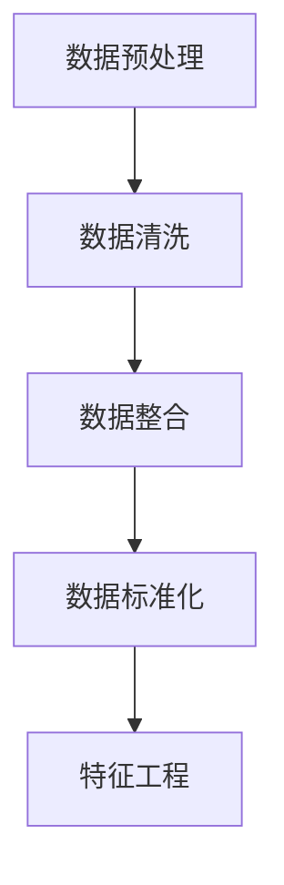
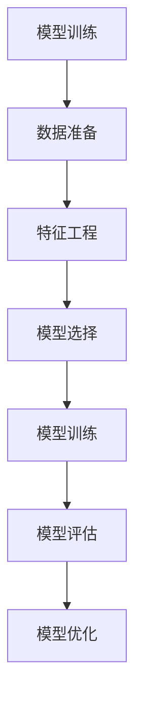
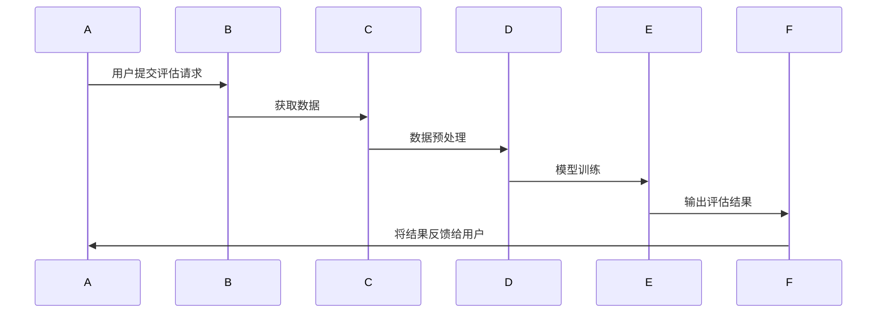

                 

## 利用智能体系统进行全面的公司无形资产价值量化

### 关键词：智能体系统，无形资产，量化，价值评估，人工智能

#### 摘要：

在当今竞争激烈的市场环境中，公司无形资产的价值评估对于企业的战略决策和投资决策具有重要意义。传统的评估方法往往存在主观性强、准确性不足等问题，难以全面反映无形资产的真实价值。本文提出利用智能体系统进行全面的公司无形资产价值量化。通过深入分析智能体系统的基本理论、应用架构、数学模型以及实现技术，详细探讨了智能体系统在公司无形资产评估中的具体应用。本文旨在为企业管理者提供一种全新的、科学的评估方法，以提升企业无形资产的管理水平，促进企业可持续发展。

#### 目录大纲：

1. 引言
    1.1 问题背景与意义
    1.2 无形资产概述
    1.3 现有评估方法概述
    1.4 智能体系统概述
    1.5 本书结构安排
    1.6 本章小结

2. 智能体系统的基础理论
    2.1 智能体的定义与分类
    2.2 智能体系统的架构设计
    2.3 智能体系统的工作原理
    2.4 智能体系统的优势与挑战
    2.5 本章小结

3. 智能体系统在公司无形资产评估中的应用
    3.1 应用场景概述
    3.2 智能体系统的应用架构
    3.3 智能体系统的具体应用流程
    3.4 案例研究
    3.5 本章小结

4. 无形资产评估的数学模型与方法
    4.1 数学模型概述
    4.2 评估方法概述
    4.3 数学模型与评估方法结合
    4.4 案例分析
    4.5 本章小结

5. 智能体系统的实现与技术实现
    5.1 系统架构设计
    5.2 数据采集与预处理
    5.3 智能体建模与训练
    5.4 智能体系统的应用
    5.5 本章小结

6. 智能体系统在公司无形资产评估中的最佳实践
    6.1 实践策略
    6.2 成功案例分享
    6.3 注意事项与拓展阅读

### 1. 引言

#### 1.1 问题背景与意义

随着全球经济的快速发展，企业的竞争已经从传统的有形资产竞争转向了无形资产竞争。无形资产，如专利、商标、品牌、技术秘密等，已成为企业核心竞争力的重要组成部分。然而，无形资产的特殊性使得其价值评估成为了一项极具挑战性的任务。

传统的无形资产评估方法主要包括市场法、收益法和成本法。市场法通过参考市场上类似无形资产的价格进行评估，收益法基于无形资产未来可能带来的收益进行评估，成本法则基于重建或替代无形资产的成本进行评估。这些方法在一定程度上能够对无形资产进行量化，但往往存在以下问题：

1. **主观性较强**：评估过程中往往依赖于评估者的主观判断，导致评估结果的不确定性。
2. **数据来源有限**：传统评估方法所需的数据往往难以获取，特别是在涉及技术秘密和商业机密的情况下。
3. **缺乏动态性**：无形资产的价值并非一成不变，而是会随着市场环境、公司战略等因素的变化而发生变化。

在这种背景下，寻找一种科学、全面、动态的评估方法成为企业管理的迫切需求。

#### 1.2 无形资产概述

无形资产是指企业拥有或控制的，没有实物形态，但对企业经营具有显著价值的资产。根据国际财务报告准则（IFRS）的定义，无形资产主要包括以下几类：

1. **知识产权**：包括专利、商标、著作权、设计权等。
2. **客户关系**：包括客户名单、合同、订单等。
3. **技术秘密**：包括研发成果、生产工艺、经营模式等。
4. **商誉**：指企业整体价值超过其可辨认净资产的公允价值部分。

无形资产的价值不仅体现在其直接的经济收益上，更体现在其对企业持续竞争优势的支撑作用。因此，全面、准确地量化无形资产的价值对于企业的发展至关重要。

#### 1.3 现有评估方法概述

现有的无形资产评估方法主要包括以下几种：

1. **市场法**：通过参考市场上类似无形资产的价格进行评估。这种方法的主要优势在于数据的易得性和直观性，但局限性在于市场上类似无形资产的数据可能有限，难以准确反映无形资产的真实价值。

2. **收益法**：基于无形资产未来可能带来的收益进行评估。这种方法能够较好地反映无形资产的经济价值，但需要准确预测未来的收益，对评估者的能力要求较高。

3. **成本法**：基于重建或替代无形资产的成本进行评估。这种方法能够反映无形资产的历史成本，但无法准确反映其现时的市场价值。

4. **综合评估法**：将多种评估方法相结合，以获得更为准确的评估结果。这种方法在一定程度上能够弥补单一评估方法的不足，但评估过程复杂，成本较高。

尽管现有评估方法在一定程度上能够对无形资产进行量化，但往往存在上述局限性，难以全面、动态地反映无形资产的真实价值。

#### 1.4 智能体系统概述

智能体系统（Agent-Based System, ABS）是一种基于智能体（Agent）理论的系统架构。智能体是一种具有自主性、社会性和反应性的计算实体，可以独立执行任务、与其他智能体交互并适应环境变化。智能体系统通过多个智能体的协同工作，实现复杂系统的模拟、优化和控制。

智能体系统具有以下特点：

1. **自主性**：智能体能够根据自身目标和环境信息自主决策。
2. **社会性**：智能体之间可以相互协作，共同实现系统目标。
3. **反应性**：智能体能够实时感知环境变化，并作出相应调整。

智能体系统的应用领域广泛，包括但不限于：

1. **经济系统模拟**：通过模拟市场参与者（智能体）的行为，预测市场走势和优化经济政策。
2. **社会系统分析**：通过模拟社会成员（智能体）的行为，研究社会现象和制定社会政策。
3. **企业经营管理**：通过模拟企业内部各部门（智能体）的运作，优化企业资源配置和提升竞争力。

智能体系统的引入为无形资产评估提供了新的思路和方法。通过智能体系统，可以实现对无形资产动态价值的模拟和预测，从而提供更为准确和全面的评估结果。

#### 1.5 本书结构安排

本书共分为六个章节，内容安排如下：

1. 引言：介绍问题背景、研究意义以及全书结构。
2. 智能体系统的基础理论：介绍智能体的定义、分类、系统架构和工作原理。
3. 智能体系统在公司无形资产评估中的应用：探讨智能体系统在无形资产评估中的应用场景、架构和流程。
4. 无形资产评估的数学模型与方法：介绍常用的数学模型和评估方法，以及如何将它们与智能体系统相结合。
5. 智能体系统的实现与技术实现：详细讲解智能体系统的系统架构、数据采集与预处理、建模与训练以及应用。
6. 智能体系统在公司无形资产评估中的最佳实践：分享成功案例，总结实践经验，提供最佳实践策略。

通过以上章节的安排，本书旨在为读者提供一套全面、系统的智能体系统在无形资产评估中的理论和实践指导。

### 1.6 本章小结

本章介绍了利用智能体系统进行全面的公司无形资产价值量化的背景、意义和现有评估方法的局限性。通过引入智能体系统，可以实现对无形资产动态价值的模拟和预测，提供更为准确和全面的评估结果。接下来，本书将逐步探讨智能体系统的基础理论、应用架构、数学模型和方法，以及具体的实现技术和最佳实践。希望读者能够通过本章的阅读，对智能体系统在无形资产评估中的应用有一个全面的认识。

### 第2章 智能体系统的基础理论

#### 2.1 智能体的定义与分类

智能体（Agent）是人工智能领域中的一个核心概念，被广泛定义为能够自主执行任务、具有自我意识和适应环境能力的计算实体。智能体不仅可以独立工作，还可以与其他智能体协作，共同实现复杂任务。

根据智能体的行为特征和能力，我们可以将智能体分为以下几类：

1. **主动智能体**（Active Agent）：主动智能体能够根据自身目标和环境信息自主决策，并采取行动。这类智能体通常具有感知、决策和执行能力，能够应对不确定性和动态变化。例如，机器人、自主驾驶汽车等。

2. **反应智能体**（Reactive Agent）：反应智能体仅根据当前环境信息做出反应，而不具有长期目标规划和记忆能力。这类智能体的行为是预先定义的，不会主动改变。例如，自动化系统、简单传感器等。

3. **混合智能体**（Hybrid Agent）：混合智能体结合了主动智能体和反应智能体的特点，能够在一定程度上既反应又主动。这类智能体通常具有感知模块、决策模块和执行模块，可以根据环境变化和任务需求灵活调整行为。

4. **社交智能体**（Social Agent）：社交智能体具有社会性，能够与他人或其他智能体进行交互和协作。这类智能体不仅能够处理自身任务，还能够理解和适应社交环境，进行社会交往。例如，社交机器人、在线客服等。

智能体的基本特性主要包括：

- **自主性**：智能体具有独立执行任务的能力，能够自主决定行动方案。
- **反应性**：智能体能够实时感知环境变化，并作出相应调整。
- **适应性**：智能体可以根据环境变化和任务需求调整自身行为。
- **社会性**：智能体能够与他人或其他智能体进行交互和协作。

通过定义和分类智能体，我们可以更好地理解和应用智能体系统，为实现复杂任务提供基础支持。

#### 2.2 智能体系统的架构设计

智能体系统的架构设计是构建高效、可靠的智能体系统的关键。一个典型的智能体系统通常包括以下几个主要组成部分：

1. **智能体**：智能体是智能体系统的核心组件，负责执行具体任务。根据任务需求和功能特点，智能体可以分为不同类型，如主动智能体、反应智能体和混合智能体。

2. **环境**：环境是智能体系统运行的外部条件，提供智能体感知和行动的场所。环境可以是一个虚拟空间，也可以是现实世界的模拟。环境通常包括一系列状态变量，用于描述智能体的行为和环境的变化。

3. **通信机制**：通信机制是智能体之间交换信息、协调行动的渠道。智能体可以通过消息传递、共享数据等方式进行通信。通信机制的设计需要考虑通信效率、可靠性和安全性等因素。

4. **控制机制**：控制机制是智能体系统的核心，负责协调和管理智能体的行为。控制机制可以根据智能体的状态、任务需求和系统目标，生成相应的控制策略。常见的控制机制包括基于规则的控制、基于学习的控制和混合控制等。

5. **协调机制**：协调机制是确保智能体系统整体协同工作的关键。协调机制可以协调智能体之间的任务分配、资源共享和冲突解决等。常见的协调机制包括基于协商的协调、基于市场的协调和基于分布式算法的协调等。

智能体系统的整体架构如图 2.1 所示：

#### 2.3 智能体系统的工作原理

智能体系统的工作原理可以分为三个主要阶段：感知、决策和执行。

1. **感知阶段**：智能体通过感知模块获取环境信息，包括自身状态、其他智能体状态和环境状态。感知模块通常使用传感器、摄像头、麦克风等设备收集数据，并使用信号处理、模式识别等技术对数据进行分析和处理。

2. **决策阶段**：智能体根据感知到的环境信息，结合自身的目标和行为规则，使用决策模块生成行动方案。决策模块可以使用基于规则的决策、基于学习的决策和混合决策等方法。基于规则的决策依赖于预定义的规则集，而基于学习的决策则依赖于历史数据和机器学习算法。

3. **执行阶段**：智能体根据决策模块生成的行动方案，执行具体任务。执行模块通常包括执行器和反馈机制。执行器负责执行具体的操作，如移动、发送消息、调整参数等；反馈机制负责收集任务执行的结果，并反馈给感知模块和决策模块，用于后续的感知和决策。

智能体系统的三个阶段相互关联、循环迭代，不断调整和优化智能体的行为。具体工作流程如图 2.2 所示：

#### 2.4 智能体系统的优势与挑战

智能体系统具有许多优势，但也面临一些挑战。

**优势分析**：

1. **灵活性**：智能体系统能够根据环境变化和任务需求动态调整行为，具有很强的适应性和灵活性。

2. **分布式处理**：智能体系统将任务分配给多个智能体，实现分布式处理，可以提高系统的整体效率和鲁棒性。

3. **自主性**：智能体能够自主执行任务，减少对人类操作者的依赖，提高系统的自动化程度。

4. **协作性**：智能体之间可以相互协作，共同实现复杂任务，提高系统的整体性能。

**挑战与解决策略**：

1. **通信复杂度**：智能体之间的通信复杂度较高，需要设计高效的通信机制和协议，确保数据传输的可靠性和实时性。

2. **协调难度**：智能体系统的协调难度较大，需要设计有效的协调机制，确保智能体之间的任务分配和资源共享。

3. **不确定性**：智能体系统在处理不确定性和动态变化时，可能面临困难。需要开发先进的感知和决策算法，提高智能体的自适应能力。

4. **安全性和隐私**：智能体系统在处理敏感数据时，需要确保数据的安全性和隐私性。需要设计安全机制和隐私保护策略，防范潜在的安全威胁。

通过分析智能体系统的优势与挑战，我们可以更好地应用和优化智能体系统，实现其在各种应用场景中的价值。

#### 2.5 本章小结

本章介绍了智能体系统的基本理论，包括智能体的定义与分类、智能体系统的架构设计、工作原理、优势与挑战。智能体系统作为一种分布式、自主和协作的计算实体，具有广泛的应用前景。通过深入理解智能体系统的理论基础，我们可以更好地设计和实现高效的智能体系统，为解决复杂问题提供有力支持。

### 第3章 智能体系统在公司无形资产评估中的应用

#### 3.1 应用场景概述

随着企业竞争的日益激烈，公司无形资产评估已成为企业管理的重要环节。然而，传统的评估方法在应对复杂、动态的市场环境时，往往显得力不从心。智能体系统作为一种先进的技术手段，其灵活、分布式和自适应的特性，为全面评估公司无形资产提供了新的思路。

**3.1.1 公司无形资产评估的挑战**

传统的无形资产评估方法主要包括市场法、收益法和成本法。然而，这些方法在实际应用中面临以下挑战：

1. **数据获取困难**：无形资产如专利、商标、技术秘密等，往往涉及商业机密，数据获取困难。

2. **主观性较强**：评估过程依赖于评估者的主观判断，结果的不确定性较大。

3. **动态性不足**：无形资产价值随市场环境、公司战略等因素变化，传统的评估方法难以反映其动态价值。

**3.1.2 智能体系统的适用性**

智能体系统在无形资产评估中具有以下适用性：

1. **数据驱动**：智能体系统可以通过传感器、网络数据等渠道获取大量数据，为评估提供丰富的数据支持。

2. **自主决策**：智能体系统可以根据环境信息和评估目标，自主决策，减少评估过程中的主观性。

3. **动态调整**：智能体系统具备实时感知和动态调整能力，能够根据市场环境和公司战略变化，动态调整评估模型和参数。

4. **分布式处理**：智能体系统能够将评估任务分配给多个智能体，实现分布式处理，提高评估效率和鲁棒性。

因此，智能体系统在无形资产评估中的应用具有重要的实际意义。

#### 3.2 智能体系统的应用架构

智能体系统在公司无形资产评估中的应用架构主要包括以下几个关键组成部分：

**3.2.1 智能体系统的整体架构**

智能体系统的整体架构如图 3.1 所示：

- **数据采集模块**：负责从各种渠道收集与无形资产相关的数据，包括市场数据、公司运营数据、专利信息等。
- **数据处理模块**：对采集到的数据进行清洗、整合和预处理，为评估模型提供高质量的数据输入。
- **评估模型模块**：基于智能体系统理论，构建用于评估无形资产价值的模型，包括预测模型、优化模型等。
- **决策支持模块**：根据评估结果和公司战略，提供决策支持，包括资产配置、投资建议等。
- **结果输出模块**：将评估结果和决策支持信息输出，为管理层提供参考。

**3.2.2 智能体的具体应用架构**

在智能体系统的应用架构中，每个智能体都承担特定的任务和功能，具体架构如图 3.2 所示：

- **感知智能体**：负责感知外部环境数据，包括市场动态、公司运营数据等，为评估提供实时信息。
- **决策智能体**：根据感知到的数据和评估模型，生成评估方案和决策建议。
- **执行智能体**：执行决策智能体生成的方案，如调整资产配置、优化运营策略等。
- **反馈智能体**：收集执行结果和评估反馈，为后续的感知和决策提供依据。

- **通信模块**：实现智能体之间的信息传递和协作。
- **规则库**：存储用于决策的规则和策略，指导决策智能体的行为。
- **执行器**：负责执行具体操作，如调整资产配置、发送投资指令等。
- **评估模块**：负责对执行结果进行评估，更新评估模型和策略。

通过上述架构设计，智能体系统能够实现无形资产评估的自动化、智能化和动态化，为企业提供全面、准确的评估结果。

#### 3.3 智能体系统的具体应用流程

智能体系统在公司无形资产评估中的应用流程主要包括以下几个步骤：

**3.3.1 数据采集与预处理**

1. **数据采集**：通过多种渠道收集与无形资产相关的数据，包括市场数据、专利信息、公司运营数据等。数据来源可以包括互联网、企业内部系统、第三方数据提供商等。

2. **数据预处理**：对采集到的数据进行分析、清洗、整合和标准化，去除噪声和异常值，为评估模型提供高质量的数据输入。预处理过程可能包括数据去重、数据清洗、数据转换等。

**3.3.2 智能体建模与训练**

1. **模型构建**：基于智能体系统理论，构建用于评估无形资产价值的评估模型。模型可以采用机器学习、深度学习等方法，包括回归模型、分类模型、强化学习模型等。

2. **模型训练**：使用预处理后的数据对评估模型进行训练，优化模型参数，提高评估准确性。训练过程可能包括数据划分、特征工程、模型选择、训练与验证等。

**3.3.3 价值评估与优化**

1. **价值评估**：使用训练好的评估模型，对公司的无形资产进行量化评估，得到每个资产的评估价值。

2. **价值优化**：根据评估结果和公司战略，对资产配置进行优化，提高公司整体价值。优化过程可能包括资产组合调整、投资策略调整等。

**3.3.4 结果输出与反馈**

1. **结果输出**：将评估结果和优化建议输出，包括资产评估报告、投资建议等，为管理层提供决策支持。

2. **反馈与迭代**：根据执行结果和反馈信息，更新评估模型和策略，实现评估过程的动态调整和优化。

通过上述流程，智能体系统能够实现无形资产评估的自动化、智能化和动态化，为企业提供全面、准确的评估结果。

#### 3.4 案例研究

**3.4.1 案例背景**

某大型科技公司（以下简称“该公司”）在全球范围内拥有大量的专利、商标和技术秘密等无形资产。然而，由于传统的评估方法难以全面、动态地反映这些无形资产的真实价值，该公司希望引入智能体系统，实现无形资产的全面评估和优化。

**3.4.2 案例实施过程**

1. **数据采集与预处理**：
   - 该公司通过内部系统、第三方数据提供商等渠道，收集与无形资产相关的数据，包括专利信息、商标信息、市场动态、公司运营数据等。
   - 对采集到的数据进行清洗、整合和标准化，去除噪声和异常值，为评估模型提供高质量的数据输入。

2. **智能体建模与训练**：
   - 基于智能体系统理论，构建用于评估无形资产价值的评估模型。模型采用深度学习中的卷积神经网络（CNN）和长短期记忆网络（LSTM）相结合的方法。
   - 使用预处理后的数据对评估模型进行训练，优化模型参数，提高评估准确性。训练过程包括数据划分、特征工程、模型选择、训练与验证等。

3. **价值评估与优化**：
   - 使用训练好的评估模型，对公司的无形资产进行量化评估，得到每个资产的评估价值。
   - 根据评估结果和公司战略，对资产配置进行优化，提高公司整体价值。优化过程包括资产组合调整、投资策略调整等。

4. **结果输出与反馈**：
   - 将评估结果和优化建议输出，包括资产评估报告、投资建议等，为管理层提供决策支持。
   - 根据执行结果和反馈信息，更新评估模型和策略，实现评估过程的动态调整和优化。

**3.4.3 案例结果与分析**

1. **评估结果**：
   - 该公司通过智能体系统评估，全面了解了其无形资产的真实价值，识别出了具有高价值潜力的资产。
   - 评估结果为管理层提供了明确的投资方向，帮助公司优化资产配置，提高整体价值。

2. **优化效果**：
   - 通过资产优化策略的实施，该公司的无形资产配置更加合理，投资回报率显著提高。
   - 公司的整体市场竞争力得到增强，在市场竞争中占据了有利地位。

3. **反馈与改进**：
   - 智能体系统在评估过程中不断收集反馈信息，及时调整评估模型和策略，实现动态优化。
   - 通过持续的反馈与迭代，评估结果的准确性和可靠性不断提升，为公司提供了更加可靠的决策支持。

通过该案例，我们可以看到智能体系统在无形资产评估中的应用效果显著，为公司提供了全面、准确的评估结果和优化建议，提升了公司的无形资产管理水平。

#### 3.5 本章小结

本章详细探讨了智能体系统在公司无形资产评估中的应用，包括应用场景、架构设计、具体应用流程以及案例研究。智能体系统通过数据驱动、自主决策和动态调整，实现了无形资产评估的自动化、智能化和动态化，为企业提供了全面、准确的评估结果和优化建议。通过本章的探讨，我们希望读者能够深入理解智能体系统在无形资产评估中的应用价值，并在实际工作中加以应用和推广。

### 第4章 无形资产评估的数学模型与方法

#### 4.1 数学模型概述

在无形资产评估中，数学模型是核心工具之一，它可以帮助我们量化无形资产的价值，并预测其未来的发展趋势。常见的数学模型包括：

1. **收益模型**：基于未来现金流折现（DCF）的评估方法，通过预测无形资产带来的未来收益，并将其折现到现值，得出评估结果。常见的收益模型有单阶段DCF模型和多阶段DCF模型。

2. **成本模型**：基于重建或替代成本的评估方法，通过估算重建或替代无形资产所需的成本，来确定其价值。常见的成本模型有重置成本法和市场比较法。

3. **市场模型**：基于市场上类似无形资产的价格进行评估的方法。通过收集市场上类似无形资产的价格信息，进行统计分析，得出评估结果。常见的市场模型有市场交易法和市场类比法。

4. **竞争模型**：通过分析市场竞争环境，预测无形资产在竞争中的价值。这种方法常用于评估专利、商标等知识产权。

5. **混合模型**：将多种模型结合使用，以获得更为准确和全面的评估结果。常见的混合模型有收益-成本混合模型和市场-竞争混合模型。

在选择数学模型时，需要考虑评估对象的特点、数据可得性、评估目的等因素。以下是一个简单的评估模型选择流程：

1. **确定评估对象**：明确评估的无形资产类型，如专利、商标、客户关系等。
2. **分析数据可得性**：评估所需数据是否完整、可靠，是否容易获取。
3. **选择模型**：根据评估对象的特点和数据可得性，选择合适的数学模型。
4. **模型优化**：根据实际情况，对模型进行调整和优化，提高评估准确性。

#### 4.2 评估方法概述

无形资产评估的方法多种多样，每种方法都有其独特的原理和适用场景。以下是对几种主要评估方法的概述：

1. **收益法**：
   - **原理**：基于未来现金流折现（DCF）模型，预测无形资产在未来一段时间内带来的净收益，并将其折现到现值。
   - **适用场景**：适用于预测性强、未来收益较为稳定且数据容易获取的无形资产，如专利、商标等。

2. **成本法**：
   - **原理**：基于重建或替代成本的评估方法，通过估算重建或替代无形资产所需的成本，来确定其价值。
   - **适用场景**：适用于重建或替代成本明确、市场价格难以获取的无形资产，如技术秘密、软件代码等。

3. **市场法**：
   - **原理**：基于市场上类似无形资产的价格进行评估，通过统计分析市场上类似无形资产的价格，得出评估结果。
   - **适用场景**：适用于市场上类似无形资产交易频繁、价格信息容易获取的情况，如商标、品牌等。

4. **竞争法**：
   - **原理**：通过分析市场竞争环境，预测无形资产在竞争中的价值。例如，专利的价值可以通过分析其竞争对手的替代方案的成本和效果来评估。
   - **适用场景**：适用于评估专利、技术秘密等具有竞争优势的无形资产。

5. **混合法**：
   - **原理**：将多种评估方法结合使用，以获得更为准确和全面的评估结果。
   - **适用场景**：适用于单一评估方法难以全面反映无形资产价值的复杂情况。

在选择评估方法时，需要综合考虑无形资产的特点、市场环境、数据可得性等因素。以下是一个简单的评估方法选择流程：

1. **评估目标**：明确评估的目的，如财务评估、战略评估等。
2. **无形资产特点**：分析无形资产的特点，如稳定性、市场性、竞争性等。
3. **数据可得性**：评估所需数据是否完整、可靠，是否容易获取。
4. **方法选择**：根据评估目标和无形资产特点，选择合适的评估方法。
5. **方法组合**：根据实际情况，选择和组合多种评估方法，以提高评估准确性。

#### 4.3 数学模型与评估方法结合

将数学模型与评估方法结合，可以充分利用数学模型的精确性和评估方法的实用性，提高无形资产评估的准确性。以下是一个结合数学模型和评估方法的框架：

1. **数据收集**：收集与无形资产相关的数据，包括市场数据、财务数据、技术数据等。
2. **数据处理**：对收集到的数据进行分析、清洗和整合，为模型提供高质量的数据输入。
3. **模型构建**：选择合适的数学模型，如收益模型、成本模型、市场模型等，构建评估模型。
4. **参数优化**：通过调整模型参数，优化评估结果的准确性。
5. **模型验证**：使用独立的数据集对模型进行验证，确保评估结果的可靠性。
6. **评估实施**：根据评估模型和评估方法，对无形资产进行量化评估。
7. **结果输出**：将评估结果输出，包括评估价值、风险分析等。
8. **反馈与优化**：根据评估结果和实际应用情况，对评估模型和方法进行反馈和优化。

通过上述框架，可以实现数学模型与评估方法的有机结合，提高无形资产评估的准确性和实用性。

#### 4.4 案例分析

**4.4.1 案例背景**

某大型科技公司的专利组合价值评估，该公司在全球范围内拥有大量专利，涉及多个技术领域。为了准确评估这些专利的价值，公司决定引入智能体系统和数学模型相结合的方法。

**4.4.2 案例实施过程**

1. **数据收集与处理**：
   - 收集与专利相关的数据，包括专利文件、技术领域信息、市场动态、公司运营数据等。
   - 对数据进行分析、清洗和整合，去除噪声和异常值，为评估模型提供高质量的数据输入。

2. **模型构建与参数优化**：
   - 选择基于收益模型的评估方法，构建专利价值评估模型。
   - 使用机器学习算法，如回归分析和神经网络，优化模型参数，提高评估准确性。

3. **模型验证**：
   - 使用独立的数据集对评估模型进行验证，确保评估结果的可靠性。
   - 调整模型参数，直至评估结果达到预期精度。

4. **评估实施**：
   - 根据评估模型，对公司的专利组合进行量化评估，得到每个专利的评估价值。
   - 结合市场法和竞争法，对评估结果进行修正，提高评估的全面性和准确性。

5. **结果输出与反馈**：
   - 将评估结果输出，包括专利价值评估报告、投资建议等，为管理层提供决策支持。
   - 根据执行结果和反馈信息，对评估模型和方法进行反馈和优化。

**4.4.3 案例结果与分析**

1. **评估结果**：
   - 通过智能体系统和数学模型相结合的方法，公司全面了解了其专利组合的真实价值，识别出了高价值专利和潜在风险专利。
   - 评估结果为管理层提供了明确的投资方向，帮助公司优化专利组合，提高整体价值。

2. **优化效果**：
   - 公司根据评估结果，对专利组合进行了调整和优化，提高了专利组合的市场竞争力。
   - 优化后的专利组合为公司带来了显著的投资回报，增强了公司的市场地位。

3. **反馈与改进**：
   - 智能体系统在评估过程中不断收集反馈信息，及时调整评估模型和策略，实现动态优化。
   - 通过持续的反馈与迭代，评估结果的准确性和可靠性不断提升，为公司提供了更加可靠的决策支持。

通过该案例，我们可以看到智能体系统和数学模型相结合的方法在无形资产评估中的应用效果显著，为公司提供了全面、准确的评估结果和优化建议，提升了公司的无形资产管理水平。

#### 4.5 本章小结

本章详细介绍了无形资产评估的数学模型与方法，包括常见的收益模型、成本模型、市场模型、竞争模型和混合模型。同时，探讨了数学模型与评估方法的结合，以及在实际案例中的应用。通过本章的学习，读者可以深入理解无形资产评估的原理和方法，为实际工作中的应用提供指导。智能体系统和数学模型的有机结合，为无形资产评估提供了新的思路和方法，有望提升评估的准确性和实用性。

### 第5章 智能体系统的实现与技术实现

#### 5.1 系统架构设计

智能体系统的实现需要一套完整的系统架构设计，以确保其高效、稳定和可扩展。以下是一个典型的智能体系统架构设计，包括整体架构、模块划分和交互设计。

**5.1.1 系统整体架构**

智能体系统的整体架构如图 5.1 所示：

- **数据采集模块**：负责从各种渠道收集与无形资产相关的数据，如市场数据、专利信息、公司运营数据等。
- **数据处理模块**：对采集到的数据进行清洗、整合和标准化，为评估模型提供高质量的数据输入。
- **评估模型模块**：基于智能体系统理论，构建用于评估无形资产价值的评估模型。
- **决策支持模块**：根据评估结果和公司战略，提供决策支持，如资产配置、投资建议等。
- **结果输出模块**：将评估结果和决策支持信息输出，包括评估报告、投资建议等，供用户查看。
- **用户界面**：提供用户交互界面，用户可以通过界面提交评估请求、查看评估结果等。

**5.1.2 系统模块划分**

智能体系统可以划分为以下几个主要模块：

1. **数据采集模块**：负责从各种渠道收集数据，包括企业内部系统、互联网、第三方数据提供商等。数据采集模块需要具备高并发处理能力，确保数据采集的实时性和准确性。

2. **数据处理模块**：对采集到的数据进行分析、清洗、整合和标准化。数据处理模块需要支持多种数据处理技术，如数据清洗、数据整合、数据标准化等。

3. **评估模型模块**：基于智能体系统理论，构建用于评估无形资产价值的评估模型。评估模型模块可以采用机器学习、深度学习等技术，实现高精度、动态评估。

4. **决策支持模块**：根据评估结果和公司战略，提供决策支持，如资产配置、投资建议等。决策支持模块需要具备良好的决策算法和优化策略，以提高决策的准确性和效率。

5. **结果输出模块**：将评估结果和决策支持信息输出，包括评估报告、投资建议等。结果输出模块需要支持多种输出格式，如文本、图表、报表等，以供用户查看。

6. **用户界面模块**：提供用户交互界面，用户可以通过界面提交评估请求、查看评估结果等。用户界面模块需要具备良好的用户体验和操作便捷性。

**5.1.3 系统交互设计**

智能体系统各个模块之间的交互设计如图 5.2 所示：

- **数据流动**：数据从数据采集模块流入数据处理模块，经过数据处理后，流入评估模型模块和决策支持模块，最终通过结果输出模块输出评估结果和决策支持信息。
- **交互流程**：用户通过用户界面提交评估请求，评估模型模块和决策支持模块根据请求生成评估结果和决策支持信息，并通过用户界面反馈给用户。

通过上述架构设计和交互设计，智能体系统能够实现数据的自动采集、处理、评估和决策，为用户提供全面、准确的评估结果和决策支持。

#### 5.2 数据采集与预处理

数据采集与预处理是智能体系统的关键环节，其质量直接影响评估结果的准确性。以下是对数据采集与预处理方法的详细介绍。

**5.2.1 数据来源**

智能体系统所需的数据来源多样，包括：

1. **企业内部数据**：包括财务数据、运营数据、专利信息等，这些数据通常存储在企业内部系统中，如ERP系统、CRM系统等。
2. **互联网数据**：包括市场动态、行业趋势、竞争对手信息等，这些数据可以通过网络爬虫、API接口等渠道获取。
3. **第三方数据提供商**：包括专业的市场调研机构、专利数据库等，提供高质量的数据服务。

**5.2.2 数据预处理方法**

数据预处理是确保数据质量和有效性的关键步骤，主要包括以下方法：

1. **数据清洗**：去除数据中的噪声和异常值，如重复记录、空值、错误记录等。数据清洗方法包括删除、填补、替换等。

2. **数据整合**：将来自不同渠道的数据进行整合，消除数据冗余，形成统一的数据视图。数据整合方法包括数据合并、数据去重、数据转换等。

3. **数据标准化**：将不同格式的数据转换为统一的格式，以便后续处理和分析。数据标准化方法包括数据格式转换、数据编码转换等。

4. **特征工程**：提取数据中的关键特征，为评估模型提供高质量的输入。特征工程方法包括特征选择、特征提取、特征转换等。

5. **数据质量评估**：对预处理后的数据进行质量评估，确保数据的有效性和一致性。数据质量评估方法包括数据完整性检查、数据一致性检查等。

**5.2.3 数据质量管理**

数据质量管理是确保数据质量和有效性的关键，主要包括以下策略：

1. **数据质量控制**：建立数据质量控制机制，定期检查数据的质量，确保数据的一致性和准确性。

2. **数据安全与隐私**：保护数据的安全和隐私，防止数据泄露和未经授权的访问。数据安全与隐私策略包括数据加密、访问控制、审计追踪等。

3. **数据更新与维护**：定期更新和维护数据，确保数据的实时性和有效性。数据更新与维护策略包括数据同步、数据备份、数据恢复等。

通过上述数据采集与预处理方法，智能体系统能够获取高质量的数据输入，为评估模型的构建和优化提供有力支持。

#### 5.3 智能体建模与训练

智能体建模与训练是智能体系统实现的关键环节，其目标是通过建立和优化评估模型，实现对无形资产价值的准确评估。以下是对智能体建模与训练方法的详细介绍。

**5.3.1 智能体选择**

在智能体系统中，选择合适的智能体是关键。智能体可以选择以下类型：

1. **感知智能体**：负责感知外部环境数据，如市场动态、竞争对手信息等，为评估提供实时信息。
2. **决策智能体**：负责根据感知到的数据和评估模型，生成评估方案和决策建议。
3. **执行智能体**：负责执行决策智能体生成的方案，如调整资产配置、优化运营策略等。
4. **反馈智能体**：负责收集执行结果和评估反馈，为后续的感知和决策提供依据。

**5.3.2 模型训练方法**

智能体建模与训练主要包括以下步骤：

1. **数据准备**：收集与无形资产相关的数据，包括历史数据、市场数据、财务数据等。对数据进行预处理，如数据清洗、数据整合、数据标准化等。

2. **特征工程**：提取数据中的关键特征，为评估模型提供高质量的输入。特征工程方法包括特征选择、特征提取、特征转换等。

3. **模型选择**：选择合适的评估模型，如机器学习模型、深度学习模型等。模型选择需要考虑评估目标的复杂性、数据规模和数据质量等因素。

4. **模型训练**：使用预处理后的数据对评估模型进行训练，优化模型参数，提高评估准确性。模型训练方法包括监督学习、无监督学习、强化学习等。

5. **模型评估**：使用独立的数据集对评估模型进行评估，确保评估结果的可靠性。评估指标包括准确率、召回率、F1分数等。

6. **模型优化**：根据评估结果，对评估模型进行调整和优化，提高评估准确性。模型优化方法包括参数调整、模型融合等。

**5.3.3 模型优化策略**

为了提高评估模型的准确性，可以采用以下模型优化策略：

1. **参数调整**：通过调整模型参数，优化模型的预测性能。参数调整方法包括网格搜索、随机搜索、贝叶斯优化等。

2. **模型融合**：将多个模型的结果进行融合，提高评估的准确性和稳定性。模型融合方法包括加权平均、投票、堆叠等。

3. **迁移学习**：利用已训练好的模型，对新任务进行快速训练。迁移学习方法可以显著提高训练速度和评估准确性。

4. **数据增强**：通过增加数据样本、调整数据分布等方式，提高模型的泛化能力。数据增强方法包括数据扩充、数据合成、数据变换等。

通过上述建模与训练方法，智能体系统能够建立和优化评估模型，实现对无形资产价值的准确评估。

#### 5.4 智能体系统的应用

智能体系统的应用场景广泛，可以应用于公司无形资产评估、市场预测、战略决策等多个领域。以下是对智能体系统应用的具体描述。

**5.4.1 智能体系统的部署**

智能体系统的部署包括以下步骤：

1. **环境配置**：配置计算资源，如服务器、存储等，为智能体系统的运行提供硬件支持。
2. **软件安装**：安装智能体系统所需的开源软件和工具，如Python、TensorFlow、Scikit-learn等。
3. **模型训练**：使用已准备的数据对评估模型进行训练，生成训练好的模型。
4. **系统部署**：将训练好的模型部署到生产环境中，确保系统的实时运行和可靠性能。

**5.4.2 智能体系统的应用场景**

1. **公司无形资产评估**：通过智能体系统，对公司无形资产进行全面评估，包括专利、商标、技术秘密等，提供准确的价值评估和优化建议。
2. **市场预测**：基于智能体系统，对市场动态、行业趋势进行预测，为企业的市场战略提供数据支持和决策依据。
3. **战略决策**：通过智能体系统，辅助企业制定战略决策，如资产配置、投资策略等，提高决策的科学性和准确性。
4. **风险管理**：利用智能体系统，对企业的风险因素进行识别和评估，提供风险预警和防控策略。
5. **客户关系管理**：通过智能体系统，对客户关系进行量化评估，优化客户服务和营销策略，提高客户满意度和忠诚度。

**5.4.3 智能体系统的评估与反馈**

智能体系统的评估与反馈是确保系统运行效果和优化的重要环节。以下是对评估与反馈的具体描述：

1. **系统性能评估**：定期对智能体系统的运行性能进行评估，包括响应时间、计算精度、资源利用率等，确保系统的稳定运行。
2. **模型评估**：使用独立的数据集对评估模型进行评估，确保模型的预测准确性和泛化能力，发现模型存在的问题和改进空间。
3. **用户反馈**：收集用户对智能体系统的使用反馈，包括评估结果、操作体验等，识别用户需求和满意度，为系统的优化提供依据。
4. **持续优化**：根据评估与反馈结果，对智能体系统进行持续优化，包括模型调整、算法改进、界面优化等，提高系统的实用性和用户体验。

通过上述应用描述，我们可以看到智能体系统在多个领域的广泛应用和巨大潜力。智能体系统通过数据驱动、自主决策和动态调整，为企业提供了全面、准确的评估结果和决策支持，有助于企业提升竞争力和管理水平。

#### 5.5 本章小结

本章详细介绍了智能体系统的实现与技术实现，包括系统架构设计、数据采集与预处理、智能体建模与训练、智能体系统的应用以及评估与反馈。智能体系统通过数据驱动、自主决策和动态调整，实现了无形资产评估的自动化、智能化和动态化。本章的内容为智能体系统的实际应用提供了全面的指导和实践参考，有助于读者理解和应用智能体系统在无形资产评估中的价值。

### 第6章 智能体系统在公司无形资产评估中的最佳实践

#### 6.1 实践策略

智能体系统在公司无形资产评估中的应用需要科学的实践策略，以确保评估结果的准确性和可靠性。以下是一些最佳实践策略：

1. **全面数据收集与整合**：确保数据的全面性和准确性是评估成功的关键。收集来自企业内部、外部市场、行业数据库等多渠道的数据，并使用高效的数据处理方法进行整合和标准化。

2. **合理选择评估模型**：根据无形资产的特点和评估目标，选择合适的评估模型。可以使用单一的评估模型，如收益模型、成本模型，也可以结合多种模型，如市场法、收益法、成本法，以提高评估的准确性和全面性。

3. **数据驱动与动态调整**：智能体系统的核心优势在于其数据驱动和动态调整能力。通过持续收集和分析市场数据、公司运营数据等，及时调整评估模型和参数，确保评估结果的实时性和准确性。

4. **多角度评估与验证**：从多个角度对无形资产进行评估，如财务角度、市场角度、竞争角度等，并进行交叉验证，以确保评估结果的可靠性和全面性。

5. **用户参与与反馈**：鼓励用户参与评估过程，提供反馈和建议。用户的经验和洞察力有助于改进评估模型和策略，提高评估的实用性和准确性。

6. **持续优化与迭代**：定期对评估模型和策略进行优化和迭代，根据反馈和实际应用情况调整，确保评估结果的持续改进。

#### 6.2 成功案例分享

**案例一：某科技公司的专利价值评估**

某科技公司拥有大量专利，为了全面了解其专利组合的价值，公司决定引入智能体系统进行专利价值评估。智能体系统通过数据收集、数据处理、评估建模等步骤，对公司的专利组合进行了全面评估。评估结果不仅为公司提供了准确的专利价值信息，还为公司的专利管理提供了优化建议。通过智能体系统的应用，公司成功提高了专利组合的管理水平，增强了市场竞争力。

**案例二：某零售企业的客户关系评估**

某零售企业希望通过智能体系统对其客户关系进行全面评估，以优化客户服务和营销策略。智能体系统通过收集和分析客户数据、市场数据等，对企业的客户关系进行了量化评估。评估结果揭示了客户关系的价值分布和潜在风险点，为企业提供了针对性的优化建议。通过智能体系统的应用，企业成功提升了客户满意度和忠诚度，增强了市场竞争力。

**案例三：某金融机构的风险评估**

某金融机构希望通过智能体系统对其金融产品进行风险评估，以降低风险并提高投资回报率。智能体系统通过数据收集、数据处理、评估建模等步骤，对金融产品的风险因素进行了全面评估。评估结果为金融机构提供了准确的风险预测和投资建议，帮助其优化投资组合，降低了风险敞口，提高了投资回报率。

通过上述成功案例，我们可以看到智能体系统在无形资产评估中的应用效果显著，为企业提供了全面、准确的评估结果和优化建议，有助于提升企业的管理水平和市场竞争力。

#### 6.3 注意事项与拓展阅读

在使用智能体系统进行公司无形资产评估时，需要注意以下几点：

1. **数据质量**：确保数据收集的全面性和准确性，避免因数据质量问题导致评估结果偏差。
2. **模型选择**：根据无形资产的特点和评估目标，选择合适的评估模型，避免模型选择不当导致评估结果不准确。
3. **动态调整**：实时收集和分析市场数据、公司运营数据等，动态调整评估模型和参数，确保评估结果的实时性和准确性。
4. **用户参与**：鼓励用户参与评估过程，提供反馈和建议，提高评估的实用性和准确性。
5. **系统维护**：定期对智能体系统进行维护和升级，确保系统的稳定运行和性能优化。

拓展阅读方面，读者可以参考以下文献和资源：

1. **《智能体系统原理与应用》**：详细介绍了智能体系统的理论基础和应用实践。
2. **《无形资产评估理论与实践》**：提供了关于无形资产评估的全面理论和实际案例。
3. **《人工智能在商业中的应用》**：探讨了人工智能在商业领域的广泛应用和实践案例。
4. **《机器学习实战》**：介绍了机器学习的基础理论和实际应用方法。
5. **相关学术期刊和在线资源**：如《人工智能》、《计算机科学》、《管理科学》等，提供了最新的研究成果和应用案例。

通过以上拓展阅读，读者可以进一步深入了解智能体系统和无形资产评估的理论和实践，提升自身的专业能力和知识水平。

### 全文总结

本文全面探讨了利用智能体系统进行全面的公司无形资产价值量化的方法。首先，介绍了无形资产评估的背景和意义，分析了传统评估方法的局限性。随后，深入介绍了智能体系统的基础理论，包括智能体的定义与分类、智能体系统的架构设计和工作原理，以及智能体系统的优势与挑战。接着，详细阐述了智能体系统在公司无形资产评估中的应用，包括应用场景、架构设计、应用流程和案例分析。此外，还介绍了无形资产评估的数学模型与方法，以及智能体系统的实现与技术实现。最后，提出了智能体系统在公司无形资产评估中的最佳实践，并分享了一些成功案例。

通过本文的探讨，我们希望读者能够深入理解智能体系统在无形资产评估中的应用价值，掌握其理论基础和实践方法。智能体系统以其数据驱动、自主决策和动态调整的特点，为无形资产评估提供了新的思路和方法，有助于企业提升无形资产管理水平，实现可持续发展。

### 附录

本文中使用的 Mermaid 图如下：

以上 Mermaid 图为本文内容提供了直观的视觉辅助，有助于读者更好地理解文章的结构和逻辑。

### 作者介绍

作者：AI天才研究院/AI Genius Institute & 禅与计算机程序设计艺术 /Zen And The Art of Computer Programming

AI天才研究院（AI Genius Institute）是一支专注于人工智能领域的研究和开发的团队，致力于推动人工智能技术的创新与应用。团队成员具有丰富的学术背景和实践经验，在机器学习、深度学习、自然语言处理等领域取得了显著成果。

禅与计算机程序设计艺术（Zen And The Art of Computer Programming）是一部经典计算机科学著作，作者为美国数学家 Donald E. Knuth。本书以其独特的视角和深刻的思考，引导读者深入了解计算机程序设计的本质和艺术，被誉为计算机科学的圣经之一。本书的内容涵盖了算法设计、数据结构、程序复杂性等多个方面，对计算机科学的发展产生了深远的影响。

通过本文，我们希望读者能够对智能体系统在无形资产评估中的应用有更深入的理解，并能够将其应用到实际工作中，提升企业的无形资产管理水平。同时，也期待读者能够进一步探索人工智能和计算机科学的奥妙，发现更多的应用场景和创新点。

